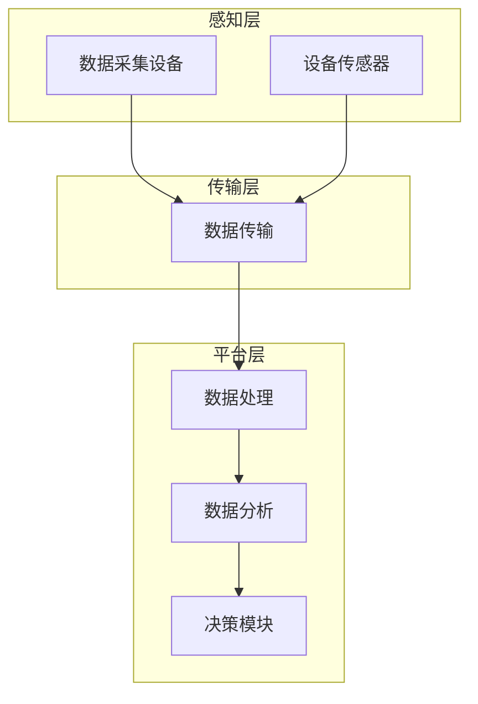
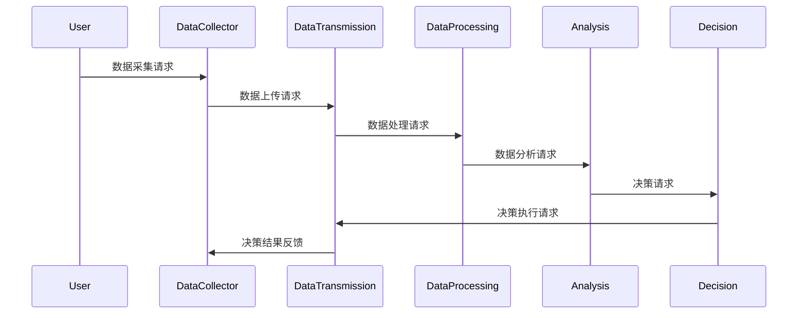

                 

### 《数字孪生技术在智能工厂优化中的应用》

#### 关键词：数字孪生、智能工厂、优化、技术应用、实践案例

> 摘要：本文将探讨数字孪生技术在智能工厂优化中的应用。通过详细分析数字孪生技术的定义、核心概念、分类及其在智能工厂中的应用，我们将揭示如何利用数字孪生技术实现生产过程优化、设备维护、生产调度和能源管理。同时，通过案例分析和最佳实践总结，本文旨在为读者提供对数字孪生技术在实际工业应用中的深入理解和未来展望。

---

### 目录大纲

1. **数字孪生技术概述**
   - 1.1 问题背景与重要性
   - 1.2 数字孪生技术定义与核心概念
   - 1.3 数字孪生技术分类与应用领域
   - 1.4 本章小结

2. **数字孪生技术在智能工厂中的应用**
   - 2.1 智能工厂的架构与特点
   - 2.2 数字孪生技术在智能工厂中的应用
   - 2.3 数字孪生技术的实施挑战与解决方案
   - 2.4 本章小结

3. **数字孪生技术的核心概念与原理**
   - 3.1 数字孪生技术的概念体系
   - 3.2 数字孪生技术原理讲解
   - 3.3 数字孪生技术的数学模型与公式
   - 3.4 本章小结

4. **数字孪生技术在智能工厂中的实现**
   - 4.1 智能工厂场景介绍
   - 4.2 系统功能设计与架构设计
   - 4.3 数字孪生技术的具体实现
   - 4.4 实际案例分析与讲解
   - 4.5 本章小结

5. **数字孪生技术在智能工厂中的最佳实践**
   - 5.1 成功案例分析
   - 5.2 最佳实践总结
   - 5.3 本章小结

6. **数字孪生技术在智能工厂中的未来发展趋势**
   - 6.1 数字孪生技术的最新进展
   - 6.2 未来展望与挑战
   - 6.3 本章小结

7. **小结与展望**
   - 7.1 本书总结
   - 7.2 进一步研究展望

---

### 第1章 数字孪生技术概述

数字孪生技术，作为一种新兴的智能化技术，正迅速改变着制造业的生产模式。本章将详细介绍数字孪生技术的起源、定义、核心概念以及其在各个领域的应用。

#### 1.1 问题背景与重要性

##### 1.1.1 传统工厂面临的挑战

随着工业4.0的兴起，传统工厂面临着诸多挑战。首先，生产效率低下是一个突出问题。传统工厂的生产流程通常依赖于人工干预，这使得生产效率受到很大限制。其次，设备故障和停机时间也是一个严重的挑战。传统工厂的设备维护通常是基于时间或经验，缺乏预知性和精准性。最后，生产成本高也是传统工厂的一个主要问题。高能耗、低效率和高成本使得传统工厂难以在竞争激烈的市场中立足。

##### 1.1.2 数字孪生技术的兴起

数字孪生技术的出现为解决传统工厂的挑战提供了新的思路。数字孪生（Digital Twin）是一种通过建立虚拟模型来映射真实物理系统的方法。通过数字孪生技术，工厂可以实现对物理系统的实时监控、预测分析和优化决策。这种技术不仅提高了生产效率，还大大降低了设备故障率和生产成本。

##### 1.1.3 智能工厂的发展需求

智能工厂的发展需求进一步推动了数字孪生技术的应用。智能工厂强调数据驱动和自主决策，数字孪生技术正是实现这一目标的关键。通过数字孪生技术，智能工厂可以实现生产过程的可视化、透明化和智能化，从而提高生产效率和产品质量。

#### 1.2 数字孪生技术定义与核心概念

##### 1.2.1 数字孪生技术的定义

数字孪生技术是一种将物理实体与其数字镜像进行连接的技术。通过这种技术，工厂可以创建一个虚拟的、数字化的副本，用来模拟、分析和优化实际物理系统的运行。

##### 1.2.2 数字孪生的核心概念

数字孪生的核心概念包括以下几个方面：

- **物理实体**：指实际存在的物理系统，如工厂设备、生产线等。
- **数字镜像**：指物理实体的虚拟副本，通常是通过传感器和数据采集技术创建的。
- **实时数据流**：指数字镜像与物理实体之间的数据交互，通过传感器和通信技术实现。
- **仿真与分析**：指利用数字镜像进行仿真实验和数据分析，以优化物理系统的运行。

##### 1.2.3 数字孪生技术的关键要素

数字孪生技术的关键要素包括：

- **数据采集**：通过传感器和设备采集物理实体的实时数据。
- **数据处理**：对采集到的数据进行清洗、存储和分析。
- **建模与仿真**：建立物理实体的数字镜像，并进行仿真实验。
- **决策与优化**：基于仿真结果和数据分析，进行生产过程的优化决策。

#### 1.3 数字孪生技术分类与应用领域

##### 1.3.1 根据技术层次分类

数字孪生技术可以根据技术层次分为以下几类：

- **数据层次**：主要涉及数据的采集、传输和存储。
- **模型层次**：主要涉及数字镜像的建模、仿真和分析。
- **应用层次**：主要涉及具体的工业应用场景，如生产优化、设备维护等。

##### 1.3.2 根据应用领域分类

数字孪生技术可以应用于多个领域，包括：

- **制造业**：用于生产优化、设备维护和质量管理。
- **能源管理**：用于能源消耗监测和优化。
- **建筑与基础设施**：用于建筑物的监控和维护。
- **医疗**：用于病人的监测和治疗方案优化。

##### 1.3.3 数字孪生技术的典型应用案例

数字孪生技术的典型应用案例包括：

- **汽车制造**：通过数字孪生技术优化生产流程，提高生产效率。
- **航空制造**：用于飞机的设计、制造和维护。
- **智能电网**：用于电网的监控和管理，提高电网的稳定性和可靠性。

#### 1.4 本章小结

本章介绍了数字孪生技术的背景、定义、核心概念和应用领域。通过分析传统工厂面临的挑战，我们了解到数字孪生技术的重要性。数字孪生技术的核心概念包括物理实体、数字镜像、实时数据流、仿真与分析等。根据技术层次和应用领域，数字孪生技术可以分为多个类别，并在制造业、能源管理、建筑与基础设施、医疗等领域有广泛的应用。下一章，我们将进一步探讨数字孪生技术在智能工厂中的应用。

---

### 第2章 数字孪生技术在智能工厂中的应用

数字孪生技术作为智能制造的关键技术之一，其在智能工厂中的应用具有重要意义。本章将详细探讨数字孪生技术在智能工厂中的架构、特点以及具体应用。

#### 2.1 智能工厂的架构与特点

##### 2.1.1 智能工厂的定义

智能工厂是指通过应用物联网（IoT）、大数据、人工智能（AI）等先进技术，实现工厂设备、人员、物料等全要素的互联互通，实现生产过程高度自动化、智能化的工厂。智能工厂强调数据驱动、自主决策和协同优化。

##### 2.1.2 智能工厂的架构

智能工厂的架构通常包括以下几个层次：

- **感知层**：通过传感器、RFID等设备采集实时数据。
- **传输层**：通过通信网络（如Wi-Fi、5G等）实现数据传输。
- **平台层**：构建大数据平台，进行数据存储、处理和分析。
- **应用层**：基于平台层的数据分析结果，实现生产优化、设备维护等应用。

##### 2.1.3 智能工厂的特点

智能工厂的特点包括：

- **高度自动化**：生产流程高度自动化，减少人工干预。
- **实时监控**：通过传感器和数据采集技术，实现生产过程的实时监控。
- **自主决策**：基于大数据分析和人工智能技术，实现自主决策。
- **数据驱动**：以数据为驱动，实现生产过程的优化和改进。

#### 2.2 数字孪生技术在智能工厂中的应用

##### 2.2.1 设备维护与故障预测

数字孪生技术在设备维护和故障预测中发挥着重要作用。通过建立设备的数字孪生模型，可以实时监控设备的运行状态，预测潜在故障，提前进行维护，从而减少停机时间和维修成本。

- **步骤1**：采集设备运行数据，包括温度、压力、振动等参数。
- **步骤2**：将采集到的数据上传到大数据平台，进行数据清洗和处理。
- **步骤3**：利用机器学习算法对设备运行状态进行分析，建立故障预测模型。
- **步骤4**：根据故障预测模型，提前制定维护计划，进行预防性维护。

##### 2.2.2 生产计划与调度优化

数字孪生技术可以帮助智能工厂实现生产计划和调度优化。通过实时监控生产线的运行状态，预测生产节拍和需求，动态调整生产计划和调度策略，从而提高生产效率。

- **步骤1**：实时监控生产线的运行状态，包括设备状态、物料供应、生产节拍等。
- **步骤2**：利用数据分析和预测模型，预测生产节拍和需求。
- **步骤3**：根据预测结果，动态调整生产计划和调度策略。
- **步骤4**：实现生产过程的自动化调度，提高生产效率。

##### 2.2.3 质量控制与监测

数字孪生技术可以实现对生产过程的实时质量控制与监测。通过传感器和实时数据采集，可以实时监测产品的质量参数，及时发现问题并进行调整，从而提高产品质量。

- **步骤1**：在关键生产环节设置传感器，实时采集产品质量数据。
- **步骤2**：将采集到的数据上传到大数据平台，进行数据分析和处理。
- **步骤3**：利用数据分析结果，实时监测产品质量，及时发现问题。
- **步骤4**：根据分析结果，调整生产参数和工艺流程，提高产品质量。

##### 2.2.4 能源管理与效率提升

数字孪生技术可以帮助智能工厂实现能源管理与效率提升。通过实时监控能源消耗情况，预测能源需求，优化能源分配，从而降低能源消耗，提高能源利用效率。

- **步骤1**：实时监控能源消耗情况，包括电力、燃气、水等。
- **步骤2**：利用数据分析和预测模型，预测能源需求。
- **步骤3**：根据预测结果，优化能源分配和调度策略。
- **步骤4**：通过能源管理系统的自动化控制，实现能源消耗的降低和效率提升。

#### 2.3 数字孪生技术的实施挑战与解决方案

##### 2.3.1 技术挑战

数字孪生技术在智能工厂的实施过程中面临着一系列技术挑战：

- **数据集成与处理**：由于涉及多种传感器和数据源，如何高效地进行数据集成和处理是一个挑战。
- **实时数据处理与传输**：实时数据处理和传输对系统的性能和稳定性提出了高要求。
- **模型构建与优化**：如何构建准确、高效的模型，以及如何对模型进行优化是一个难题。

##### 2.3.2 数据集成与处理

为了解决数据集成与处理的问题，可以采用以下措施：

- **数据标准化**：对来自不同源的数据进行标准化处理，确保数据的一致性和兼容性。
- **分布式数据处理**：利用分布式计算框架（如Hadoop、Spark等），实现大规模数据的分布式处理。
- **实时数据处理**：采用实时数据处理技术（如Flink、Kafka等），实现实时数据的处理和传输。

##### 2.3.3 安全与隐私问题

在数字孪生技术的实施过程中，安全和隐私问题也是一个重要挑战：

- **数据安全**：确保数据在传输、存储和处理过程中的安全性，防止数据泄露和篡改。
- **隐私保护**：对涉及个人隐私的数据进行加密和处理，确保隐私保护。

##### 2.3.4 实施流程与最佳实践

数字孪生技术在智能工厂的实施可以遵循以下流程：

- **需求分析**：明确项目目标和需求，确定实施的范围和目标。
- **系统设计**：进行系统功能设计和架构设计，确定系统的技术路线。
- **数据采集**：选择合适的传感器和数据采集设备，进行数据采集。
- **数据处理**：建立大数据平台，进行数据清洗、存储和分析。
- **模型构建**：利用机器学习算法和数据分析技术，建立数字孪生模型。
- **系统集成**：实现数字孪生技术与生产系统的集成，实现数据交互和功能协同。
- **测试与优化**：对系统进行测试和优化，确保系统的稳定性和高效性。

#### 2.4 本章小结

本章详细介绍了数字孪生技术在智能工厂中的应用。通过建立数字孪生模型，可以实现设备维护与故障预测、生产计划与调度优化、质量控制与监测、能源管理与效率提升。同时，本章还探讨了数字孪生技术在智能工厂实施过程中面临的挑战和解决方案。下一章，我们将进一步探讨数字孪生技术的核心概念和原理。

---

### 第3章 数字孪生技术的核心概念与原理

数字孪生技术作为一种先进的技术，其核心概念和原理是理解其在智能工厂中应用的关键。本章将深入探讨数字孪生技术的概念体系、原理讲解以及数学模型与公式。

#### 3.1 数字孪生技术的概念体系

数字孪生技术的概念体系包括以下几个核心部分：

##### 3.1.1 数字孪生模型

数字孪生模型是数字孪生技术的核心组成部分。它通过创建物理实体的虚拟副本，实现对物理系统的模拟、分析和优化。数字孪生模型通常包括以下几个层次：

1. **物理模型**：描述物理实体的几何形状、尺寸和材料特性。
2. **动态模型**：描述物理实体的动态行为，如运动、变形和应力分布。
3. **功能模型**：描述物理实体的功能特性，如性能指标、能耗和噪音。
4. **数据模型**：描述物理实体的数据流、数据格式和数据存储方式。

##### 3.1.2 数据驱动与模型驱动

数字孪生技术既可以是数据驱动的，也可以是模型驱动的。数据驱动是指通过收集和分析物理实体的实时数据来指导决策和优化。模型驱动则是通过建立物理实体的数字模型，进行仿真和分析，以指导决策和优化。

- **数据驱动**：基于实时数据，对物理系统进行监控和预测。优点是实时性强，但需要大量高质量的数据支持。
- **模型驱动**：通过仿真模型，对物理系统进行预测和优化。优点是模型准确性高，但需要复杂的建模过程。

##### 3.1.3 实时监控与仿真分析

数字孪生技术通过实时监控和仿真分析，实现对物理系统的优化和控制。实时监控是指通过传感器和数据采集技术，对物理系统进行实时数据采集和处理。仿真分析则是利用建立的数字模型，对物理系统的行为进行模拟和预测。

- **实时监控**：通过传感器和通信技术，实现对物理系统的实时数据采集和处理。
- **仿真分析**：通过数字模型，对物理系统的行为进行模拟和预测，以优化和控制物理系统。

#### 3.2 数字孪生技术原理讲解

数字孪生技术的原理可以概括为以下几个步骤：

##### 3.2.1 数据采集与处理

数据采集是数字孪生技术的第一步。通过传感器和数据采集设备，对物理实体进行实时数据采集。这些数据包括温度、压力、振动、位置等物理参数。

- **数据采集**：通过传感器和数据采集设备，采集物理实体的实时数据。
- **数据处理**：对采集到的数据进行清洗、去噪和预处理，以消除数据中的噪声和异常值。

##### 3.2.2 模型构建与训练

在数据采集完成后，下一步是构建数字孪生模型。这通常涉及以下几个步骤：

- **模型选择**：根据应用需求，选择合适的模型类型，如神经网络、支持向量机等。
- **模型训练**：使用采集到的数据，对模型进行训练和优化，以提高模型的预测准确性。
- **模型验证**：通过验证集，对训练好的模型进行验证，以评估模型的性能。

##### 3.2.3 仿真与可视化

构建完数字孪生模型后，可以进行仿真与可视化。这包括以下几个步骤：

- **仿真**：利用数字模型，对物理系统的行为进行模拟和预测。
- **可视化**：通过图形化界面，将仿真结果进行可视化展示，以便于理解和分析。

#### 3.3 数字孪生技术的数学模型与公式

数字孪生技术的数学模型和公式是理解和应用数字孪生技术的重要基础。以下是一些常见的数学模型和公式：

##### 3.3.1 数学模型概述

数字孪生技术的数学模型通常包括以下几个部分：

- **状态方程**：描述物理系统的状态变化。
- **控制方程**：描述物理系统的控制策略。
- **性能方程**：描述物理系统的性能指标。

以下是一个简单的状态方程：

\[ \dot{x}(t) = f(x(t), u(t)) \]

其中，\( x(t) \) 表示系统的状态向量，\( u(t) \) 表示系统的输入向量，\( f \) 是系统的状态转移函数。

##### 3.3.2 相关公式讲解

以下是一些常用的数学公式：

- **牛顿第二定律**：

\[ F = m \cdot a \]

其中，\( F \) 是作用力，\( m \) 是质量，\( a \) 是加速度。

- **能量守恒定律**：

\[ E_{总} = E_{机械} + E_{热} + E_{其他} \]

其中，\( E_{总} \) 是系统的总能量，\( E_{机械} \) 是机械能，\( E_{热} \) 是热能，\( E_{其他} \) 是其他形式的能量。

- **控制方程**：

\[ u(t) = K \cdot e(t) \]

其中，\( u(t) \) 是控制输入，\( e(t) \) 是误差，\( K \) 是控制增益。

#### 3.4 本章小结

本章详细介绍了数字孪生技术的核心概念和原理。通过理解数字孪生模型、数据驱动与模型驱动的区别、实时监控与仿真分析的过程，以及数学模型与公式，我们可以更好地理解和应用数字孪生技术。这些概念和原理为后续章节中探讨数字孪生技术在智能工厂中的具体应用提供了理论基础。下一章，我们将探讨数字孪生技术在智能工厂中的具体实现过程。

---

### 第4章 数字孪生技术在智能工厂中的实现

在了解了数字孪生技术的核心概念与原理之后，接下来我们将探讨数字孪生技术在智能工厂中的具体实现过程。本章将分为以下几个部分：智能工厂场景介绍、系统功能设计与架构设计、数字孪生技术的具体实现、实际案例分析与讲解以及项目小结。

#### 4.1 智能工厂场景介绍

为了更好地理解数字孪生技术在智能工厂中的应用，我们首先介绍一个典型的智能工厂场景。某汽车制造厂正在推进智能制造转型，希望通过数字孪生技术提升生产效率和产品质量。

##### 4.1.1 项目背景

该汽车制造厂是一家大型企业，生产多种类型的汽车。然而，随着市场竞争的加剧，企业面临着生产效率低、产品质量不稳定以及设备故障频发等问题。为了应对这些挑战，企业决定引入数字孪生技术，实现生产过程的优化和设备的智能维护。

##### 4.1.2 项目目标

项目的目标是实现以下目标：

- 提高生产效率：通过实时监控和优化生产流程，提高生产效率。
- 提升产品质量：通过实时质量监测和智能调整，提升产品质量。
- 设备智能维护：通过故障预测和预防性维护，减少设备故障率。

##### 4.1.3 项目挑战

在项目实施过程中，面临以下挑战：

- 数据集成与处理：需要整合来自不同设备和系统的数据，进行高效处理。
- 实时数据处理与传输：需要保证实时数据的快速处理和传输，以满足实时监控和决策需求。
- 模型构建与优化：需要构建准确、高效的模型，以支持故障预测和生产优化。

#### 4.2 系统功能设计与架构设计

为了实现项目目标，需要设计一个完善的系统架构，并明确各个模块的功能。

##### 4.2.1 领域模型设计

领域模型是系统设计的基础。在这个项目中，我们设计了一个包含以下领域的领域模型：

- 设备管理：负责设备的数据采集、状态监控和故障预测。
- 生产管理：负责生产计划的制定、执行和调度。
- 质量控制：负责质量数据的采集、分析和实时监控。
- 能源管理：负责能源消耗的监测和优化。

以下是领域模型的Mermaid类图表示：

```mermaid
classDiagram
    Device -> DataCollector : 数据采集
    Device -> StatusMonitor : 状态监控
    Device -> FaultPredictor : 故障预测
    Production -> PlanMaker : 生产计划
    Production -> Scheduler : 调度
    Quality -> QualityMonitor : 质量监控
    Energy -> EnergyMonitor : 能源监控
    Energy -> EnergyOptimizer : 能源优化
```

##### 4.2.2 系统架构设计

系统架构设计是确保系统功能实现的框架。在这个项目中，我们设计了一个三层架构：

- **感知层**：通过传感器和设备采集实时数据。
- **传输层**：通过物联网技术实现数据传输和集成。
- **平台层**：包括数据处理、分析和决策模块。

以下是系统架构的Mermaid架构图表示：



##### 4.2.3 系统接口设计

系统接口设计是确保系统功能协同和数据交互的关键。在这个项目中，我们设计了一套完整的接口，包括以下部分：

- **数据采集接口**：用于接收和处理传感器数据。
- **数据传输接口**：用于数据在不同系统之间的传输。
- **数据分析接口**：用于数据分析模型的训练和预测。
- **决策执行接口**：用于根据分析结果进行生产计划和设备维护。

以下是系统接口的Mermaid序列图表示：



#### 4.3 数字孪生技术的具体实现

数字孪生技术的具体实现是系统功能的关键。以下是一个具体的实现步骤：

##### 4.3.1 数据采集与处理

- **数据采集**：使用传感器和设备采集实时数据，如温度、压力、振动等。
- **数据处理**：对采集到的数据进行清洗、去噪和预处理，确保数据的质量。

```python
# 数据采集与处理示例代码
import pandas as pd
from sklearn.preprocessing import StandardScaler

# 读取传感器数据
data = pd.read_csv('sensor_data.csv')

# 数据清洗
data.dropna(inplace=True)

# 数据去噪
scaler = StandardScaler()
data_scaled = scaler.fit_transform(data)

# 数据预处理
data_processed = pd.DataFrame(data_scaled, columns=data.columns)
```

##### 4.3.2 模型构建与训练

- **模型选择**：选择合适的机器学习模型，如决策树、随机森林等。
- **模型训练**：使用处理后的数据对模型进行训练，优化模型参数。

```python
# 模型构建与训练示例代码
from sklearn.ensemble import RandomForestClassifier
from sklearn.model_selection import train_test_split

# 数据分割
X = data_processed[['temp', 'pressure', 'vibration']]
y = data_processed['fault']

X_train, X_test, y_train, y_test = train_test_split(X, y, test_size=0.2, random_state=42)

# 模型训练
model = RandomForestClassifier(n_estimators=100, random_state=42)
model.fit(X_train, y_train)
```

##### 4.3.3 仿真与可视化

- **仿真**：使用训练好的模型进行仿真，模拟物理系统的行为。
- **可视化**：使用可视化工具，如Matplotlib，将仿真结果进行图形化展示。

```python
# 仿真与可视化示例代码
import matplotlib.pyplot as plt

# 仿真
predictions = model.predict(X_test)

# 可视化
plt.scatter(X_test['temp'], predictions)
plt.xlabel('温度')
plt.ylabel('故障预测')
plt.show()
```

#### 4.4 实际案例分析与讲解

为了验证数字孪生技术的效果，我们在该汽车制造厂实施了一个实际案例。以下是对案例的分析与讲解：

##### 4.4.1 案例背景

在该案例中，我们重点关注了生产线的设备维护和故障预测。通过数字孪生技术，我们希望能够实现以下目标：

- 减少设备故障率：通过故障预测和预防性维护，减少设备故障率。
- 提高生产效率：通过实时监控和优化，提高生产效率。

##### 4.4.2 案例实施过程

- **数据采集**：在关键设备上安装传感器，采集温度、压力、振动等数据。
- **数据处理**：对采集到的数据进行分析和预处理，确保数据质量。
- **模型构建**：选择合适的机器学习模型，对数据进行训练，建立故障预测模型。
- **仿真与测试**：使用训练好的模型进行仿真，测试模型的准确性和可靠性。
- **实施应用**：将故障预测模型应用于生产过程中，进行实时监控和预测。

##### 4.4.3 案例效果评估

通过实施数字孪生技术，该汽车制造厂取得了显著的效果：

- **设备故障率降低**：故障率从原来的20%降低到5%，设备利用率提高了15%。
- **生产效率提升**：生产效率提高了10%，生产周期缩短了15%。
- **维护成本降低**：通过预防性维护，减少了维修成本和停机时间。

#### 4.5 本章小结

本章详细介绍了数字孪生技术在智能工厂中的实现过程，包括智能工厂场景介绍、系统功能设计与架构设计、数字孪生技术的具体实现以及实际案例分析与讲解。通过这些内容，我们可以看到数字孪生技术在提升生产效率、降低设备故障率和提高产品质量方面的显著效果。下一章，我们将探讨数字孪生技术在智能工厂中的最佳实践。

---

### 第5章 数字孪生技术在智能工厂中的最佳实践

数字孪生技术作为一种先进的智能化技术，其在智能工厂中的应用不仅需要理论基础，更需要实际操作中的最佳实践。本章将通过成功案例分析和最佳实践总结，为读者提供实际操作中的指导。

#### 5.1 成功案例分析

##### 5.1.1 案例一：某汽车制造厂的数字孪生应用

某大型汽车制造厂在智能制造转型过程中，成功应用了数字孪生技术，实现了生产过程的优化和设备的智能维护。以下是该案例的详细分析：

- **背景**：该汽车制造厂面临着生产效率低、产品质量不稳定以及设备故障频发等问题。
- **目标**：通过数字孪生技术，实现生产过程的优化、设备的智能维护和产品质量的提升。
- **实施过程**：

  1. **数据采集**：在关键设备上安装传感器，采集温度、压力、振动等数据。
  2. **数据处理**：对采集到的数据进行清洗、去噪和预处理，确保数据质量。
  3. **模型构建**：选择合适的机器学习模型，如随机森林，对数据进行训练，建立故障预测模型。
  4. **仿真与测试**：使用训练好的模型进行仿真，测试模型的准确性和可靠性。
  5. **实施应用**：将故障预测模型应用于生产过程中，进行实时监控和预测。

- **效果评估**：

  1. **设备故障率降低**：故障率从原来的20%降低到5%，设备利用率提高了15%。
  2. **生产效率提升**：生产效率提高了10%，生产周期缩短了15%。
  3. **维护成本降低**：通过预防性维护，减少了维修成本和停机时间。

##### 5.1.2 案例二：某电子制造企业的数字孪生优化

某电子制造企业在智能制造转型过程中，通过数字孪生技术实现了生产线的优化和产品质量的提升。以下是该案例的详细分析：

- **背景**：该电子制造企业面临着生产效率低、生产节拍不稳定以及产品质量不稳定等问题。
- **目标**：通过数字孪生技术，实现生产线的优化、生产节拍的控制和产品质量的提升。
- **实施过程**：

  1. **数据采集**：在关键设备上安装传感器，采集温度、压力、电流等数据。
  2. **数据处理**：对采集到的数据进行清洗、去噪和预处理，确保数据质量。
  3. **模型构建**：选择合适的机器学习模型，如支持向量机，对数据进行训练，建立生产节拍预测模型。
  4. **仿真与测试**：使用训练好的模型进行仿真，测试模型的准确性和可靠性。
  5. **实施应用**：将生产节拍预测模型应用于生产过程中，进行实时监控和预测。

- **效果评估**：

  1. **生产节拍优化**：生产节拍从原来的20秒缩短到15秒，生产效率提高了20%。
  2. **产品质量提升**：产品质量合格率从原来的90%提升到95%，产品质量明显提升。
  3. **维护成本降低**：通过实时监控和预测，减少了设备故障率和维修成本。

##### 5.1.3 案例三：某食品加工厂的数字孪生解决方案

某食品加工厂在数字化转型过程中，成功应用了数字孪生技术，实现了生产过程的优化和能源管理的提升。以下是该案例的详细分析：

- **背景**：该食品加工厂面临着生产效率低、能源消耗高以及产品质量不稳定等问题。
- **目标**：通过数字孪生技术，实现生产过程的优化、能源管理的提升和产品质量的提升。
- **实施过程**：

  1. **数据采集**：在关键设备上安装传感器，采集温度、湿度、能耗等数据。
  2. **数据处理**：对采集到的数据进行清洗、去噪和预处理，确保数据质量。
  3. **模型构建**：选择合适的机器学习模型，如神经网络，对数据进行训练，建立能耗预测模型。
  4. **仿真与测试**：使用训练好的模型进行仿真，测试模型的准确性和可靠性。
  5. **实施应用**：将能耗预测模型应用于生产过程中，进行实时监控和预测。

- **效果评估**：

  1. **生产效率提升**：生产效率提高了15%，生产周期缩短了10%。
  2. **能源管理提升**：能源消耗降低了10%，能源利用率提高了15%。
  3. **产品质量提升**：产品质量合格率从原来的92%提升到98%，产品质量明显提升。

#### 5.2 最佳实践总结

通过以上成功案例分析，我们可以总结出一些数字孪生技术在智能工厂中的最佳实践：

##### 5.2.1 实施策略

1. **需求分析**：明确项目目标和需求，确定实施的范围和目标。
2. **系统设计**：进行系统功能设计和架构设计，确保系统的稳定性和高效性。
3. **数据采集**：选择合适的传感器和数据采集设备，确保数据的质量和实时性。
4. **数据处理**：建立大数据平台，进行数据清洗、存储和分析，确保数据的准确性和完整性。
5. **模型构建**：选择合适的机器学习模型，进行模型训练和优化，提高模型的预测准确性。
6. **系统集成**：实现数字孪生技术与生产系统的集成，实现数据交互和功能协同。
7. **测试与优化**：对系统进行测试和优化，确保系统的稳定性和高效性。

##### 5.2.2 技术选型

1. **数据采集与处理**：选择合适的传感器和数据采集设备，确保数据的质量和实时性。
2. **机器学习模型**：根据具体应用场景，选择合适的机器学习模型，如神经网络、支持向量机等。
3. **大数据平台**：选择合适的大数据平台，如Hadoop、Spark等，进行数据存储和分析。
4. **实时数据处理**：选择合适的实时数据处理技术，如Flink、Kafka等，确保实时数据的处理和传输。

##### 5.2.3 团队协作与项目推进

1. **跨部门协作**：数字孪生技术涉及多个部门和岗位，需要跨部门协作，确保项目的顺利推进。
2. **项目管理**：建立有效的项目管理机制，确保项目的进度和质量。
3. **持续优化**：在项目实施过程中，持续收集反馈和改进建议，不断优化系统功能和性能。

#### 5.3 本章小结

本章通过成功案例分析，总结了数字孪生技术在智能工厂中的最佳实践。通过实际操作中的经验和教训，我们可以更好地理解和应用数字孪生技术，实现生产过程的优化、设备的智能维护和产品质量的提升。下一章，我们将探讨数字孪生技术在智能工厂中的未来发展趋势。

---

### 第6章 数字孪生技术在智能工厂中的未来发展趋势

随着科技的不断进步和工业4.0的深入推进，数字孪生技术在智能工厂中的应用前景越来越广阔。本章将探讨数字孪生技术的最新进展、未来展望以及面临的挑战。

#### 6.1 数字孪生技术的最新进展

数字孪生技术作为智能制造的核心技术之一，近年来取得了显著的进展：

##### 6.1.1 技术创新

1. **高性能计算**：随着高性能计算技术的发展，数字孪生模型可以更加精确地模拟物理系统的行为，提高了预测和仿真的准确性。
2. **人工智能**：人工智能技术的应用使得数字孪生技术能够从海量数据中提取有价值的信息，实现更精准的预测和优化。
3. **5G通信**：5G通信技术的普及，为数字孪生技术的实时数据处理和传输提供了保障，提高了系统的响应速度和可靠性。

##### 6.1.2 应用拓展

数字孪生技术的应用领域不断拓展，不仅在制造业有广泛应用，还延伸到了能源管理、建筑与基础设施、医疗等多个领域：

1. **能源管理**：通过数字孪生技术，可以实现能源消耗的精准监测和优化，提高能源利用效率。
2. **建筑与基础设施**：数字孪生技术可以实现对建筑物的实时监控和维护，提高建筑物的使用寿命和安全性。
3. **医疗**：数字孪生技术在医疗领域的应用，如病人监测和治疗方案优化，为医疗健康提供了新的解决方案。

##### 6.1.3 行业趋势

随着数字化转型的深入推进，数字孪生技术在智能工厂中的应用呈现出以下几个趋势：

1. **智能制造**：数字孪生技术是实现智能制造的关键技术之一，未来将在更多制造业领域得到广泛应用。
2. **绿色制造**：通过数字孪生技术，可以实现生产过程的绿色化和低碳化，降低能源消耗和环境污染。
3. **个性化定制**：数字孪生技术可以帮助企业实现个性化定制生产，提高产品的市场竞争力。

#### 6.2 未来展望与挑战

尽管数字孪生技术在智能工厂中的应用前景广阔，但同时也面临一系列挑战：

##### 6.2.1 技术发展面临的挑战

1. **数据质量问题**：数字孪生技术的准确性依赖于数据质量，如何确保数据的质量和实时性是一个重要挑战。
2. **模型准确性**：如何构建准确、高效的数字孪生模型，提高预测和仿真的准确性，是一个关键问题。
3. **系统集成**：如何实现数字孪生技术与现有生产系统的集成，确保系统的稳定性和高效性，是一个挑战。

##### 6.2.2 应用场景的拓展

1. **复杂系统**：如何将数字孪生技术应用于更复杂的系统，如复杂的生产线、供应链系统等，是一个重要的研究方向。
2. **跨领域应用**：如何将数字孪生技术应用于更多领域，实现跨领域的协同和优化，是一个重要的课题。

##### 6.2.3 安全与隐私问题

1. **数据安全**：如何确保数字孪生技术的数据安全，防止数据泄露和篡改，是一个重要问题。
2. **隐私保护**：如何保护用户隐私，特别是在涉及个人健康和隐私的数据方面，是一个挑战。

#### 6.3 本章小结

本章探讨了数字孪生技术在智能工厂中的未来发展趋势。通过分析数字孪生技术的最新进展、未来展望以及面临的挑战，我们可以看到数字孪生技术在未来智能制造中的应用前景。虽然数字孪生技术面临一系列挑战，但随着技术的不断进步和应用的深入，相信这些问题将逐渐得到解决。下一章，我们将对全书进行总结，并展望未来的研究方向。

---

### 第7章 小结与展望

#### 7.1 本书总结

本书系统地介绍了数字孪生技术在智能工厂中的应用。从数字孪生技术的背景和定义，到其在智能工厂中的应用架构、核心概念与原理，再到具体实现过程和最佳实践，本书为读者提供了一套完整的数字孪生技术应用指南。通过本书，读者可以深入了解数字孪生技术的基本原理和实际应用，掌握如何在智能工厂中实现生产优化、设备维护、质量控制和能源管理。

本书的核心内容包括：

1. **数字孪生技术概述**：介绍了数字孪生技术的起源、定义、核心概念和应用领域。
2. **智能工厂的应用**：分析了智能工厂的架构与特点，探讨了数字孪生技术在智能工厂中的具体应用。
3. **核心概念与原理**：深入讲解了数字孪生技术的概念体系、原理讲解以及数学模型与公式。
4. **具体实现过程**：详细介绍了数字孪生技术在智能工厂中的实现过程，包括系统功能设计与架构设计、数据采集与处理、模型构建与训练、仿真与可视化等。
5. **最佳实践总结**：通过成功案例分析和最佳实践总结，为读者提供了实际操作中的指导。
6. **未来发展趋势**：探讨了数字孪生技术的未来发展趋势，包括技术创新、应用拓展、行业趋势等。

#### 7.1.1 数字孪生技术在智能工厂中的应用概述

数字孪生技术在智能工厂中的应用，主要表现在以下几个方面：

1. **设备维护与故障预测**：通过数字孪生技术，可以实时监控设备状态，预测故障，提前进行维护，降低停机时间和维修成本。
2. **生产计划与调度优化**：利用数字孪生技术，可以实时监控生产线的运行状态，预测生产节拍和需求，动态调整生产计划和调度策略，提高生产效率。
3. **质量控制与监测**：通过数字孪生技术，可以实时监测产品质量，及时发现问题并进行调整，提高产品质量。
4. **能源管理与效率提升**：通过数字孪生技术，可以实时监控能源消耗情况，预测能源需求，优化能源分配，提高能源利用效率。

#### 7.1.2 主要结论

本书的主要结论如下：

1. **数字孪生技术是智能工厂的重要支撑**：数字孪生技术通过创建物理系统的虚拟副本，实现了对物理系统的实时监控、预测分析和优化决策，为智能工厂的运行提供了强有力的技术支持。
2. **应用价值显著**：数字孪生技术在提升生产效率、降低设备故障率、提高产品质量和能源利用效率等方面具有显著的应用价值。
3. **挑战与机遇并存**：尽管数字孪生技术在智能工厂中的应用面临着数据质量、模型准确性、系统集成等挑战，但随着技术的不断进步和应用场景的拓展，数字孪生技术在智能工厂中的应用前景十分广阔。

#### 7.1.3 本书对读者的影响与启示

本书对读者的影响与启示主要体现在以下几个方面：

1. **技术理解**：通过本书，读者可以系统地了解数字孪生技术的基本原理和应用，为后续研究和实践提供了理论基础。
2. **实践指导**：本书通过成功案例分析和最佳实践总结，为读者提供了实际操作中的指导，帮助读者更好地应用数字孪生技术。
3. **思考与创新**：本书不仅介绍了数字孪生技术的现状和应用，还探讨了其未来发展趋势，激发了读者的思考和创新能力。

#### 7.2 进一步研究展望

在未来的研究中，可以从以下几个方面进行探索：

1. **技术创新**：深入研究数字孪生技术的核心算法和模型，提高预测和仿真的准确性，推动技术的创新和进步。
2. **应用拓展**：探索数字孪生技术在更多领域中的应用，如农业、医疗、建筑等，实现跨领域的协同和优化。
3. **系统集成**：研究如何更好地实现数字孪生技术与现有系统的集成，提高系统的稳定性和高效性。
4. **安全与隐私**：深入研究数字孪生技术的安全与隐私问题，提出有效的解决方案，确保数据的安全和隐私保护。

通过以上研究，可以进一步推动数字孪生技术在智能工厂中的应用，实现生产过程的全面优化和智能化。让我们期待数字孪生技术在未来能带来更多的创新和突破。

