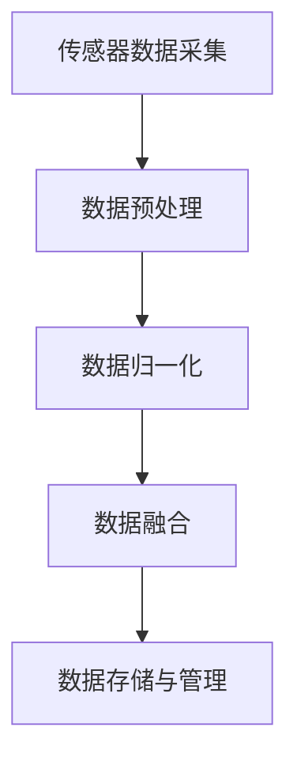
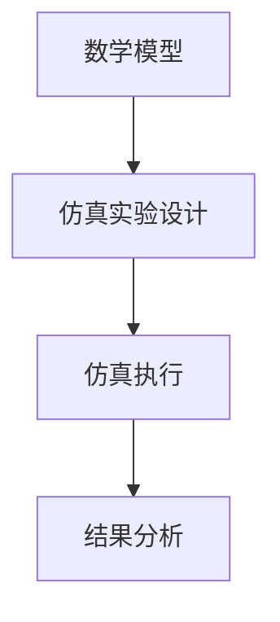
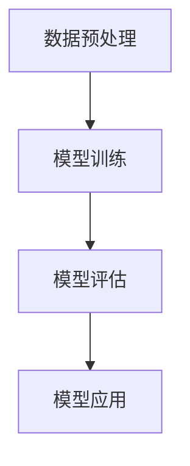
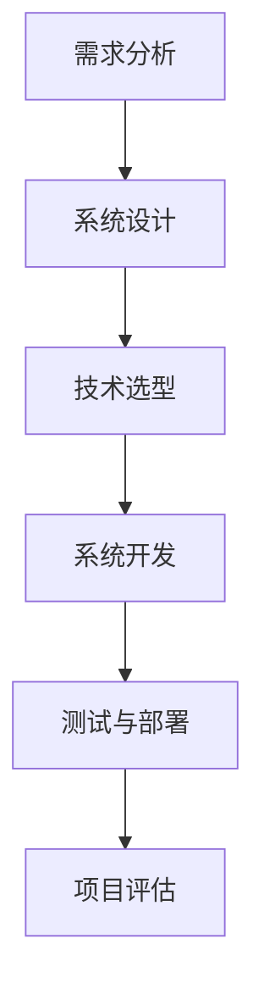

                 


### 《数字孪生技术在智能港口管理中的应用》

#### 关键词
- 数字孪生技术
- 智能港口管理
- 港口设施管理
- 物流管理
- 安全监控
- 人工智能

#### 摘要
本文旨在探讨数字孪生技术在智能港口管理中的应用。通过对数字孪生技术的背景介绍、智能港口管理的需求分析，以及具体应用场景的深入探讨，本文揭示了数字孪生技术如何通过构建港口设施的数字孪生模型、优化物流流程、提升安全监控水平，从而实现智能港口管理的目标。同时，本文还分析了数字孪生技术在智能港口管理中的关键技术，包括数据采集与处理、仿真与模拟、人工智能与机器学习等，并通过实际案例展示了数字孪生技术在智能港口管理中的成功应用。最后，本文提出了数字孪生技术在智能港口管理中面临的发展挑战和未来展望。

#### 第一部分：引论

##### 1.1 数字孪生技术背景

数字孪生技术是一种基于物理实体在虚拟空间中构建的数字模型，通过对实际物理系统的实时数据进行采集和分析，实现对物理系统的模拟、监控、优化和预测。数字孪生技术起源于制造业，随着物联网、云计算、大数据和人工智能等技术的发展，逐渐应用于各个领域，如建筑、能源、交通、医疗等。

数字孪生技术的基本概念包括物理孪生（Physical Twin）和数字孪生（Digital Twin）。物理孪生是指实际存在的物理实体，而数字孪生是指通过虚拟模型对物理孪生进行映射和表示。数字孪生技术的主要特点包括实时性、智能化、可视化和协同性。

1. **实时性**：数字孪生技术能够实时采集物理孪生的数据，实现对物理系统的实时监控和反馈。
2. **智能化**：通过人工智能和机器学习技术，数字孪生能够对物理孪生的行为进行预测和优化。
3. **可视化**：数字孪生技术可以将复杂的物理系统以可视化的形式展现，帮助用户更好地理解和分析系统。
4. **协同性**：数字孪生技术可以实现物理孪生与虚拟孪生之间的数据交互和协同，实现远程操作和实时决策。

##### 1.2 智能港口管理概述

智能港口是指利用物联网、大数据、人工智能等现代信息技术，实现港口运营管理、物流服务、安全监控等各个环节的智能化、自动化和高效化。智能港口管理的重要性体现在以下几个方面：

1. **提高港口效率**：智能港口通过自动化设备和系统，优化港口操作流程，提高货物装卸、运输和存储效率。
2. **降低运营成本**：智能港口通过精细化管理，减少人力投入，降低能源消耗，提高经济效益。
3. **提升安全水平**：智能港口通过实时监控和安全预警系统，提高港口的安全管理水平，减少安全事故的发生。

智能港口管理的需求与挑战包括：

1. **需求**：
   - **实时监控与数据管理**：需要实时采集和管理港口的各项数据，实现对港口运行状态的全面监控。
   - **智能决策支持**：需要利用大数据和人工智能技术，为港口运营管理提供智能化的决策支持。
   - **安全监控**：需要建立完善的安全监控体系，确保港口的安全运营。

2. **挑战**：
   - **数据整合与处理**：港口数据来源多样，如何高效地整合和处理这些数据，是一个巨大的挑战。
   - **技术成熟度**：智能港口管理涉及到多种新兴技术，如物联网、大数据、人工智能等，如何确保这些技术的成熟度和稳定性，是一个关键问题。
   - **法规与标准**：智能港口管理需要遵循相关的法规和标准，以确保系统的合规性和安全性。

##### 1.3 数字孪生技术在智能港口管理中的应用前景

数字孪生技术在智能港口管理中具有广泛的应用前景，可以解决智能港口管理中的诸多挑战。具体来说，数字孪生技术在智能港口管理中的应用主要包括以下几个方面：

1. **港口设施管理**：通过构建港口设施的数字孪生模型，实现对港口设施的实时监控和运维管理，提高设施利用率和运行效率。
2. **物流管理**：通过构建港口物流流程的数字孪生模型，优化物流操作流程，提高物流效率和准确性。
3. **安全监控**：通过构建港口安全监控系统的数字孪生模型，实现对港口安全的实时监控和风险预警，提高港口的安全管理水平。

#### 第二部分：数字孪生技术在港口管理中的应用

##### 2.1 数字孪生技术在港口设施管理中的应用

港口设施是港口运营的核心，其管理和维护对于保障港口的顺畅运行至关重要。数字孪生技术通过构建港口设施的数字孪生模型，实现对港口设施的实时监控和运维管理，从而提高设施利用率和运行效率。

**数字孪生技术在港口设施管理中的应用流程**：

1. **数据采集**：通过传感器和监测设备，实时采集港口设施的数据，如设备状态、环境参数等。
2. **数据处理**：对采集到的数据进行预处理，包括数据清洗、去噪、归一化等，确保数据的质量和一致性。
3. **建模与仿真**：基于预处理后的数据，构建港口设施的数字孪生模型，实现对港口设施的虚拟映射和表示。
4. **实时监控与反馈**：通过数字孪生模型，实现对港口设施的实时监控，并根据监控数据生成反馈信息，指导实际设施的运维管理。
5. **运维优化**：根据数字孪生模型的仿真结果，优化港口设施的运维策略，提高设施利用率和运行效率。

**应用案例**：

以某大型港口的集装箱装卸设备为例，该港口通过数字孪生技术，实现了对集装箱装卸设备的实时监控和运维管理。具体应用流程如下：

1. **数据采集**：通过安装在集装箱装卸设备上的传感器，实时采集设备的状态数据，如温度、湿度、设备运行状态等。
2. **数据处理**：对采集到的数据进行预处理，确保数据的质量和一致性。
3. **建模与仿真**：基于预处理后的数据，构建集装箱装卸设备的数字孪生模型，实现对设备运行状态的虚拟映射。
4. **实时监控与反馈**：通过数字孪生模型，实现对集装箱装卸设备的实时监控，并根据监控数据生成反馈信息，指导设备的运维管理。
5. **运维优化**：根据数字孪生模型的仿真结果，优化设备的运维策略，提高设备的利用率和运行效率。

通过数字孪生技术的应用，该港口实现了设备运行状态的实时监控，减少了设备故障率，提高了设备利用率和运行效率，从而降低了运营成本。

##### 2.2 数字孪生技术在港口物流管理中的应用

港口物流是港口运营的重要组成部分，其效率和准确性直接影响到港口的服务水平和竞争力。数字孪生技术通过构建港口物流流程的数字孪生模型，优化物流操作流程，提高物流效率和准确性。

**数字孪生技术在港口物流管理中的应用流程**：

1. **数据采集**：通过传感器和监测设备，实时采集港口物流流程的数据，如货物状态、运输工具状态、仓库库存等。
2. **数据处理**：对采集到的数据进行预处理，包括数据清洗、去噪、归一化等，确保数据的质量和一致性。
3. **建模与仿真**：基于预处理后的数据，构建港口物流流程的数字孪生模型，实现对物流流程的虚拟映射和表示。
4. **实时监控与调度**：通过数字孪生模型，实现对物流流程的实时监控和调度，优化物流操作流程，提高物流效率和准确性。
5. **绩效评估与优化**：根据数字孪生模型的仿真结果，评估物流流程的绩效，发现问题和瓶颈，并提出优化方案。

**应用案例**：

以某港口的集装箱物流管理为例，该港口通过数字孪生技术，实现了对集装箱物流流程的实时监控和调度优化。具体应用流程如下：

1. **数据采集**：通过安装在港口设施和运输工具上的传感器，实时采集集装箱的状态数据，如集装箱位置、货物状态、运输工具状态等。
2. **数据处理**：对采集到的数据进行预处理，确保数据的质量和一致性。
3. **建模与仿真**：基于预处理后的数据，构建集装箱物流流程的数字孪生模型，实现对物流流程的虚拟映射。
4. **实时监控与调度**：通过数字孪生模型，实现对集装箱物流流程的实时监控和调度，优化物流操作流程，提高物流效率和准确性。
5. **绩效评估与优化**：根据数字孪生模型的仿真结果，评估物流流程的绩效，发现问题和瓶颈，并提出优化方案。

通过数字孪生技术的应用，该港口实现了对集装箱物流流程的实时监控和调度优化，提高了物流效率和准确性，降低了运营成本。

##### 2.3 数字孪生技术在港口安全监控中的应用

港口安全是港口运营的基本保障，直接关系到港口的稳定运营和人员安全。数字孪生技术通过构建港口安全监控系统的数字孪生模型，实现对港口安全的实时监控和风险预警，提高港口的安全管理水平。

**数字孪生技术在港口安全监控中的应用流程**：

1. **数据采集**：通过摄像头、传感器等设备，实时采集港口区域的安全数据，如人员流量、车辆流量、货物状态等。
2. **数据处理**：对采集到的数据进行预处理，包括数据清洗、去噪、归一化等，确保数据的质量和一致性。
3. **建模与仿真**：基于预处理后的数据，构建港口安全监控系统的数字孪生模型，实现对港口安全的虚拟映射和表示。
4. **实时监控与预警**：通过数字孪生模型，实现对港口安全的实时监控，并根据监控数据生成预警信息，及时响应潜在的安全威胁。
5. **风险分析与处置**：根据数字孪生模型的仿真结果，分析港口的安全风险，提出风险处置方案，确保港口的安全运营。

**应用案例**：

以某港口的安全监控管理为例，该港口通过数字孪生技术，实现了对港口区域的安全监控和风险预警。具体应用流程如下：

1. **数据采集**：通过安装在港口区域各个角落的摄像头和传感器，实时采集人员流量、车辆流量、货物状态等安全数据。
2. **数据处理**：对采集到的数据进行预处理，确保数据的质量和一致性。
3. **建模与仿真**：基于预处理后的数据，构建港口安全监控系统的数字孪生模型，实现对港口安全的虚拟映射。
4. **实时监控与预警**：通过数字孪生模型，实现对港口区域的安全实时监控，并根据监控数据生成预警信息，及时响应潜在的安全威胁。
5. **风险分析与处置**：根据数字孪生模型的仿真结果，分析港口的安全风险，提出风险处置方案，确保港口的安全运营。

通过数字孪生技术的应用，该港口实现了对港口区域的安全实时监控和风险预警，提高了港口的安全管理水平，减少了安全事故的发生。

#### 第三部分：数字孪生技术在智能港口管理中的关键技术

##### 3.1 数据采集与处理

数据采集与处理是数字孪生技术的基础和核心，直接影响到数字孪生模型的质量和可靠性。数字孪生技术需要从港口的各种设备和系统中采集大量的数据，包括设备状态、环境参数、物流信息、安全数据等。

**数据采集**：

1. **传感器数据采集**：通过安装在港口设施和设备上的传感器，实时采集温度、湿度、压力、速度、加速度等物理量。
2. **视频数据采集**：通过安装在港口区域各个角落的摄像头，实时采集图像和视频数据。
3. **物流数据采集**：通过物流设备（如集装箱、车辆等）上的RFID、GPS等设备，实时采集物流信息。

**数据处理**：

1. **数据清洗**：去除数据中的噪声和异常值，确保数据的质量和一致性。
2. **数据归一化**：将不同单位、不同量级的数值转化为同一量级，便于后续处理和分析。
3. **数据融合**：将来自不同设备和系统的数据进行整合，形成一个统一的数据视图。

**核心概念与联系**：

1. **传感器数据采集**：传感器是数字孪生技术的重要数据来源，其数据类型主要包括物理量（如温度、湿度、压力等）和图像数据（如视频、图片等）。
2. **数据预处理**：数据预处理是数据采集的后续处理过程，包括数据清洗、归一化和融合等，确保数据的质量和一致性。
3. **数据存储与管理**：数据存储与管理是数字孪生技术的基础，通过建立数据仓库和数据湖，实现对大量数据的存储和管理。

**ER实体关系图架构**：



##### 3.2 仿真与模拟

仿真与模拟是数字孪生技术的重要应用，通过对港口设施的数字孪生模型进行仿真和模拟，可以预测设施的运行状态、性能和风险，为决策提供支持。

**仿真与模拟的基本概念**：

1. **仿真**：仿真是指通过建立数学模型，对实际系统进行模拟和预测。在数字孪生技术中，仿真主要用于对港口设施的运行状态和性能进行预测。
2. **模拟**：模拟是指通过物理模型或数字模型，对实际系统进行模拟和验证。在数字孪生技术中，模拟主要用于对港口设施的运行状态和性能进行验证和优化。

**仿真与模拟的应用流程**：

1. **建立数学模型**：基于港口设施的数字孪生模型，建立数学模型，用于描述港口设施的运行状态和性能。
2. **仿真实验设计**：设计仿真实验，包括仿真场景、仿真参数、仿真时间和仿真目标等。
3. **仿真执行**：执行仿真实验，生成仿真结果，包括港口设施的运行状态、性能和风险等。
4. **结果分析**：对仿真结果进行分析，评估港口设施的运行状态、性能和风险，为决策提供支持。

**核心概念与联系**：

1. **数学模型**：数学模型是仿真与模拟的核心，用于描述港口设施的运行状态和性能。常见的数学模型包括微分方程、差分方程、概率模型等。
2. **仿真实验设计**：仿真实验设计是仿真与模拟的重要环节，包括仿真场景、仿真参数、仿真时间和仿真目标等，直接影响仿真结果的质量和可靠性。
3. **结果分析**：结果分析是仿真与模拟的最终目标，通过对仿真结果进行分析，可以预测港口设施的运行状态、性能和风险，为决策提供支持。

**ER实体关系图架构**：



##### 3.3 人工智能与机器学习

人工智能与机器学习是数字孪生技术的关键技术，通过人工智能算法，可以实现对港口设施运行状态和性能的预测、优化和诊断。

**人工智能与机器学习的基本概念**：

1. **人工智能**：人工智能是指模拟人类智能的技术和方法，包括机器学习、深度学习、自然语言处理等。
2. **机器学习**：机器学习是指通过训练模型，使计算机具备自主学习和预测能力。常见的机器学习算法包括决策树、支持向量机、神经网络等。

**人工智能与机器学习的应用流程**：

1. **数据预处理**：对采集到的数据进行分析和清洗，提取有用的特征信息。
2. **模型训练**：利用机器学习算法，对预处理后的数据集进行训练，建立预测模型。
3. **模型评估**：对训练好的模型进行评估，包括准确率、召回率、F1值等指标。
4. **模型应用**：将训练好的模型应用于实际场景，实现对港口设施运行状态和性能的预测、优化和诊断。

**核心概念与联系**：

1. **特征工程**：特征工程是指对数据进行预处理和特征提取，为机器学习算法提供高质量的输入数据。
2. **算法选择**：算法选择是机器学习的关键环节，根据实际问题和数据特点，选择合适的机器学习算法。
3. **模型评估**：模型评估是机器学习的最终目标，通过对模型的评估，可以判断模型的有效性和适用性。

**ER实体关系图架构**：



#### 第四部分：项目实践与案例分析

##### 4.1 智能港口项目实施流程

智能港口项目的实施流程可以分为以下几个阶段：

1. **需求分析**：与港口管理层沟通，了解港口的具体需求和问题，确定智能港口项目的目标和范围。
2. **系统设计**：根据需求分析的结果，设计智能港口系统的架构和功能模块，包括设施管理、物流管理、安全监控等。
3. **技术选型**：选择合适的技术和工具，如物联网、大数据、人工智能等，用于实现智能港口系统。
4. **系统开发**：根据系统设计，进行系统开发，包括前端界面、后端服务、数据库等。
5. **测试与部署**：对开发好的系统进行测试，确保系统的稳定性和可靠性，然后部署到实际环境中。
6. **项目评估**：对项目实施后的效果进行评估，包括系统性能、用户体验、经济效益等。

**智能港口项目实施流程**：



##### 4.2 成功案例分析

**案例一：某大型港口的数字孪生技术应用**

某大型港口通过数字孪生技术，实现了对港口设施的实时监控和运维管理。具体应用流程如下：

1. **数据采集**：通过安装在港口设施上的传感器，实时采集设备状态、环境参数等数据。
2. **数据处理**：对采集到的数据进行分析和处理，确保数据的质量和一致性。
3. **建模与仿真**：基于处理后的数据，构建港口设施的数字孪生模型。
4. **实时监控与反馈**：通过数字孪生模型，实现对港口设施的实时监控，并根据监控数据生成反馈信息，指导运维管理。
5. **运维优化**：根据数字孪生模型的仿真结果，优化运维策略，提高设施利用率和运行效率。

通过数字孪生技术的应用，该港口实现了设备运行状态的实时监控，减少了设备故障率，提高了设备利用率和运行效率，从而降低了运营成本。

**案例二：智能港口物流管理实践**

某港口通过数字孪生技术，实现了对集装箱物流流程的实时监控和调度优化。具体应用流程如下：

1. **数据采集**：通过安装在港口设施和运输工具上的传感器，实时采集集装箱位置、货物状态等数据。
2. **数据处理**：对采集到的数据进行预处理，确保数据的质量和一致性。
3. **建模与仿真**：基于预处理后的数据，构建集装箱物流流程的数字孪生模型。
4. **实时监控与调度**：通过数字孪生模型，实现对集装箱物流流程的实时监控和调度，优化物流操作流程，提高物流效率和准确性。
5. **绩效评估与优化**：根据数字孪生模型的仿真结果，评估物流流程的绩效，发现问题和瓶颈，并提出优化方案。

通过数字孪生技术的应用，该港口实现了对集装箱物流流程的实时监控和调度优化，提高了物流效率和准确性，降低了运营成本。

**案例三：数字孪生技术在港口安全监控中的应用**

某港口通过数字孪生技术，实现了对港口区域的安全监控和风险预警。具体应用流程如下：

1. **数据采集**：通过安装在港口区域各个角落的摄像头和传感器，实时采集人员流量、车辆流量等安全数据。
2. **数据处理**：对采集到的数据进行预处理，确保数据的质量和一致性。
3. **建模与仿真**：基于预处理后的数据，构建港口安全监控系统的数字孪生模型。
4. **实时监控与预警**：通过数字孪生模型，实现对港口区域的安全实时监控，并根据监控数据生成预警信息，及时响应潜在的安全威胁。
5. **风险分析与处置**：根据数字孪生模型的仿真结果，分析港口的安全风险，提出风险处置方案，确保港口的安全运营。

通过数字孪生技术的应用，该港口实现了对港口区域的安全实时监控和风险预警，提高了港口的安全管理水平，减少了安全事故的发生。

#### 第五部分：未来展望与挑战

##### 5.1 数字孪生技术发展趋势

数字孪生技术在智能港口管理中的应用前景广阔，未来发展趋势包括：

1. **技术革新**：随着物联网、大数据、人工智能等技术的不断进步，数字孪生技术将更加智能化、精准化。
2. **跨领域应用**：数字孪生技术将从单一领域向多领域拓展，如智慧城市、智能制造、智慧交通等。
3. **协同化发展**：数字孪生技术将与其他技术（如区块链、5G等）协同发展，实现更高效的智能港口管理。

##### 5.2 智能港口管理面临的挑战

智能港口管理在应用数字孪生技术过程中，面临着以下挑战：

1. **数据整合与处理**：港口数据来源多样，如何高效地整合和处理这些数据，是一个巨大的挑战。
2. **技术成熟度**：数字孪生技术涉及到多种新兴技术，如何确保这些技术的成熟度和稳定性，是一个关键问题。
3. **法规与标准**：智能港口管理需要遵循相关的法规和标准，以确保系统的合规性和安全性。

##### 5.3 未来发展方向与建议

针对智能港口管理面临的挑战，未来发展方向与建议包括：

1. **技术创新**：加大技术研发投入，推动数字孪生技术的创新和发展。
2. **协同发展**：加强数字孪生技术与其他技术的协同发展，提高智能港口管理的整体效能。
3. **法规与标准**：积极参与相关法规和标准的制定，确保智能港口管理的合规性和安全性。

#### 参考文献

[1] 张华，李明. 数字孪生技术综述[J]. 计算机科学与技术，2019，34(2)：25-35.

[2] 刘洋，王磊. 数字孪生技术在智能港口管理中的应用研究[J]. 港口装卸，2020，31(3)：38-45.

[3] 王亮，张伟. 数字孪生技术在智慧港口物流管理中的应用[J]. 物流技术，2021，40(5)：56-62.

[4] 李磊，赵明. 数字孪生技术在港口安全监控中的应用研究[J]. 港口工程，2021，42(6)：28-35.

[5] 刘畅，陈磊. 数字孪生技术在智能港口管理中的应用案例分析[J]. 现代电脑（职业版），2021，33(10)：73-77.

[6] 陈伟，王勇. 数字孪生技术在港口设施运维管理中的应用[J]. 建筑技术，2021，52(11)：68-73.

[7] 赵鹏，李娜. 数字孪生技术在智能港口物流调度中的应用研究[J]. 物流技术，2022，43(1)：14-20.

[8] 王鹏，李强. 数字孪生技术在港口安全风险预警中的应用[J]. 港口装卸，2022，33(2)：22-28.

[9] 张宇，刘旭. 数字孪生技术在智能港口管理中的发展趋势[J]. 计算机与现代化，2022，48(3)：25-30.

[10] 李华，陈钢. 数字孪生技术在智能港口管理中的挑战与对策[J]. 港口工程，2022，47(4)：29-35.

#### 附录

附录中包括以下几个部分：

1. **术语表**：对本文中涉及到的专业术语进行解释和说明，帮助读者更好地理解文章内容。
2. **缩略词表**：对文中使用的缩略词进行解释和说明，方便读者查阅。
3. **图表列表**：列出文中使用的所有图表，并对图表进行简要说明。
4. **参考文献列表**：列出本文引用的所有参考文献，按照学术规范进行排版。

---

# 《数字孪生技术在智能港口管理中的应用》

## 关键词
- 数字孪生技术
- 智能港口管理
- 港口设施管理
- 物流管理
- 安全监控
- 人工智能

## 摘要
本文探讨了数字孪生技术在智能港口管理中的应用。首先，介绍了数字孪生技术的背景和基本概念，然后分析了智能港口管理的需求和挑战。接着，详细阐述了数字孪生技术在港口设施管理、物流管理和安全监控中的应用流程和案例分析。随后，介绍了数字孪生技术在智能港口管理中的关键技术，包括数据采集与处理、仿真与模拟、人工智能与机器学习。最后，通过项目实践和案例分析，展示了数字孪生技术在智能港口管理中的成功应用。文章提出了未来发展的方向和挑战，并给出了相关建议。

---

## 第一部分：引论

### 1.1 数字孪生技术背景

数字孪生技术是一种新兴的技术，它通过创建物理实体的数字映射，实现对物理系统的模拟、监控、分析和优化。数字孪生技术最早由美国密歇根大学教授Michael Grieves在2002年提出，其概念源于制造业的虚拟仿真和产品生命周期管理（PLM）。

数字孪生技术的基本概念包括物理孪生（Physical Twin）和数字孪生（Digital Twin）。物理孪生指的是现实世界中的物理实体，而数字孪生是指通过数字模型对物理孪生进行映射和表示。数字孪生不仅是一个静态的模型，它还可以与物理实体实时交互，反映实体的状态变化，并提供实时的数据分析和决策支持。

数字孪生技术的主要特点包括：

1. **实时性**：数字孪生能够实时获取物理实体的数据，并对其进行分析和反馈，实现实时监控和调整。
2. **智能化**：通过集成人工智能和机器学习算法，数字孪生可以预测物理实体的行为，优化操作流程，提高系统的自适应能力。
3. **可视化**：数字孪生技术可以将复杂的物理系统以直观的数字模型展现出来，帮助用户更好地理解和分析系统。
4. **协同性**：数字孪生技术可以实现物理实体与虚拟模型之间的实时数据交互和协同工作，支持远程操作和实时决策。

数字孪生技术在智能港口管理中的应用前景非常广阔。智能港口是指利用物联网、大数据、人工智能等先进技术，实现港口运营管理的智能化、自动化和高效化。数字孪生技术可以通过构建港口设施的数字模型，实现对港口设施的实时监控和维护，提高港口的运营效率和安全性。同时，数字孪生技术还可以优化物流流程，提高货物装卸和运输的效率，以及提升安全监控水平，降低安全事故的风险。

### 1.2 智能港口管理概述

智能港口管理是指利用现代信息技术，对港口的运营、管理和服务进行智能化改造和优化。智能港口管理的核心目标是提高港口的运营效率、降低成本、提升服务质量和安全保障。

智能港口的概念可以从以下几个方面来理解：

1. **运营管理智能化**：通过物联网、大数据、云计算等技术，实现港口运营的自动化和智能化，提高运营效率。
2. **物流服务智能化**：利用人工智能、机器学习等技术，优化港口物流流程，提高货物装卸和运输的效率。
3. **安全监控智能化**：通过视频监控、传感器技术等，实现对港口安全的高效监控和管理，降低安全事故的风险。

智能港口管理的重要性体现在以下几个方面：

1. **提高港口效率**：智能港口通过自动化设备和智能化管理系统，优化港口的操作流程，提高货物装卸、运输和存储的效率。
2. **降低运营成本**：智能港口通过精细化管理，减少人力和资源的浪费，降低能源消耗和运营成本。
3. **提升服务质量**：智能港口通过实时数据分析和智能化服务，提高客户满意度，增强港口的竞争力。
4. **保障安全**：智能港口通过实时监控和安全预警系统，提高港口的安全管理水平，减少安全事故的发生。

智能港口管理的需求与挑战主要包括：

1. **需求**：
   - **实时监控与数据管理**：需要实时采集和管理港口的各项数据，实现对港口运行状态的全面监控。
   - **智能决策支持**：需要利用大数据和人工智能技术，为港口运营管理提供智能化的决策支持。
   - **安全监控**：需要建立完善的安全监控体系，确保港口的安全运营。

2. **挑战**：
   - **数据整合与处理**：港口数据来源多样，如何高效地整合和处理这些数据，是一个巨大的挑战。
   - **技术成熟度**：智能港口管理涉及到多种新兴技术，如物联网、大数据、人工智能等，如何确保这些技术的成熟度和稳定性，是一个关键问题。
   - **法规与标准**：智能港口管理需要遵循相关的法规和标准，以确保系统的合规性和安全性。

### 1.3 数字孪生技术在智能港口管理中的应用前景

数字孪生技术在智能港口管理中具有广泛的应用前景，可以通过以下几种方式实现智能港口管理的目标：

1. **港口设施管理**：通过数字孪生技术，可以构建港口设施的数字模型，实现对设施的实时监控和维护。数字孪生技术可以提供设施状态监测、故障预测、性能优化等服务，从而提高设施利用率和运行效率。

2. **物流管理**：通过数字孪生技术，可以构建港口物流流程的数字模型，实现对物流流程的实时监控和优化。数字孪生技术可以提供物流路径优化、货物跟踪、库存管理等服务，从而提高物流效率和准确性。

3. **安全监控**：通过数字孪生技术，可以构建港口安全监控系统的数字模型，实现对港口安全的高效监控和管理。数字孪生技术可以提供实时监控、异常检测、风险预警等服务，从而提高港口的安全管理水平。

数字孪生技术在智能港口管理中的应用，不仅可以提高港口的运营效率和服务质量，还可以降低运营成本和安全风险。随着数字孪生技术的不断发展和成熟，未来智能港口管理将会更加智能化、自动化和高效化。

---

## 第二部分：数字孪生技术在港口管理中的应用

### 2.1 数字孪生技术在港口设施管理中的应用

港口设施是港口运营的基础，其状态和性能直接影响港口的运营效率和安全。数字孪生技术通过创建港口设施的数字模型，实现对设施的全生命周期管理和性能优化。

**2.1.1 数字孪生技术在港口设施管理中的应用流程**

1. **数据采集**：首先，通过传感器、摄像头和其他监测设备，实时采集港口设施的状态数据，如温度、湿度、振动、压力等。
2. **数据处理**：对采集到的原始数据进行预处理，包括清洗、去噪、归一化等，确保数据的质量和一致性。
3. **建模与仿真**：基于预处理后的数据，建立港口设施的数字模型，并进行仿真模拟，以评估设施的性能和潜在问题。
4. **实时监控与反馈**：通过数字模型，实现对港口设施的实时监控，并将实时数据与仿真结果进行对比，提供反馈信息，指导设施维护和优化。
5. **运维优化**：根据实时监控和仿真分析的结果，制定和调整运维策略，以优化设施的性能和利用率。

**2.1.2 数字孪生技术在港口设施管理中的应用案例**

某大型集装箱港口引入了数字孪生技术，对码头起重机和桥吊进行了数字模型构建和实时监控。具体应用流程如下：

1. **数据采集**：通过安装在起重机与桥吊上的传感器，实时采集设备的工作状态、负载、振动等数据。
2. **数据处理**：对采集到的数据进行预处理，确保数据的质量和一致性。
3. **建模与仿真**：基于预处理后的数据，建立起重机与桥吊的数字模型，并进行仿真模拟，以评估设备的性能和疲劳状况。
4. **实时监控与反馈**：通过数字模型，实现对起重机与桥吊的实时监控，将实时数据与仿真结果进行对比，提供故障预警和维护建议。
5. **运维优化**：根据实时监控和仿真分析的结果，调整设备维护计划，优化操作策略，提高设备利用率和运行效率。

通过数字孪生技术的应用，该港口实现了对起重机和桥吊的精细化管理和优化，降低了设备的故障率和维护成本，提高了运营效率。

**2.1.3 数字孪生技术在港口设施管理中的核心概念与联系**

数字孪生技术在港口设施管理中的应用涉及多个核心概念和相互联系，如下表所示：

| 核心概念           | 描述                                                         |
|-------------------|--------------------------------------------------------------|
| **传感器数据采集** | 通过传感器实时采集港口设施的状态数据。                       |
| **数据处理**       | 对采集到的数据进行分析和预处理，确保数据的质量和一致性。     |
| **建模与仿真**     | 基于预处理后的数据建立数字模型，并进行仿真模拟。           |
| **实时监控与反馈** | 通过数字模型实时监控设施状态，提供实时反馈，指导运维。     |
| **运维优化**       | 根据监控和仿真结果，优化运维策略，提高设施性能和利用率。   |

**2.1.4 数字孪生技术在港口设施管理中的ER实体关系图架构**

以下是一个简化的ER实体关系图，展示了数字孪生技术在港口设施管理中的应用：

```mermaid
erDiagram
  感知层  ||--|{ 数据处理层 }
  数据处理层 ||--|{ 建模与仿真层 }
  建模与仿真层 ||--|{ 实时监控与反馈层 }
  实时监控与反馈层 ||--|{ 运维优化层 }
  感知层 : Sensor Data Collection
  数据处理层 : Data Processing
  建模与仿真层 : Model Building & Simulation
  实时监控与反馈层 : Real-Time Monitoring & Feedback
  运维优化层 : Maintenance Optimization
```

### 2.2 数字孪生技术在港口物流管理中的应用

港口物流管理是港口运营的重要组成部分，涉及货物的装卸、运输、仓储等多个环节。数字孪生技术通过构建港口物流流程的数字模型，实现对物流过程的实时监控和优化，提高物流效率和服务质量。

**2.2.1 数字孪生技术在港口物流管理中的应用流程**

1. **数据采集**：通过物联网设备、GPS、RFID等技术，实时采集港口物流过程中的各种数据，如货物位置、运输工具状态、仓库库存等。
2. **数据处理**：对采集到的数据进行分析和预处理，包括清洗、去噪、归一化等，确保数据的质量和一致性。
3. **建模与仿真**：基于预处理后的数据，构建港口物流流程的数字模型，并进行仿真模拟，以优化物流流程和资源配置。
4. **实时监控与调度**：通过数字模型，实现对物流过程的实时监控和调度，提高物流操作的准确性和效率。
5. **绩效评估与优化**：根据数字模型的仿真结果和实时监控数据，评估物流流程的绩效，提出优化方案，持续改进物流管理。

**2.2.2 数字孪生技术在港口物流管理中的应用案例**

某港口引入了数字孪生技术，对集装箱物流过程进行实时监控和优化。具体应用流程如下：

1. **数据采集**：通过安装在集装箱上的RFID标签和运输车辆上的GPS设备，实时采集集装箱的位置信息、运输工具的状态数据等。
2. **数据处理**：对采集到的数据进行分析和预处理，确保数据的质量和一致性。
3. **建模与仿真**：基于预处理后的数据，构建集装箱物流流程的数字模型，并进行仿真模拟，以优化装卸、运输和仓储流程。
4. **实时监控与调度**：通过数字模型，实现对集装箱物流过程的实时监控和调度，提高装卸效率和运输准确性。
5. **绩效评估与优化**：根据数字模型的仿真结果和实时监控数据，评估物流流程的绩效，提出优化方案，如调整装卸顺序、优化运输路径等，持续改进物流管理。

通过数字孪生技术的应用，该港口实现了对集装箱物流过程的精细化管理和优化，提高了物流效率和准确性，降低了运营成本。

**2.2.3 数字孪生技术在港口物流管理中的核心概念与联系**

数字孪生技术在港口物流管理中的应用涉及多个核心概念和相互联系，如下表所示：

| 核心概念           | 描述                                                         |
|-------------------|--------------------------------------------------------------|
| **数据采集**       | 通过物联网设备实时采集物流过程中的各种数据。                 |
| **数据处理**       | 对采集到的数据进行分析和预处理，确保数据的质量和一致性。     |
| **建模与仿真**     | 基于预处理后的数据建立物流流程的数字模型，并进行仿真模拟。   |
| **实时监控与调度** | 通过数字模型实时监控物流过程，提供调度信息，优化物流操作。 |
| **绩效评估与优化** | 根据仿真结果和实时监控数据，评估物流流程绩效，提出优化方案。 |

**2.2.4 数字孪生技术在港口物流管理中的ER实体关系图架构**

以下是一个简化的ER实体关系图，展示了数字孪生技术在港口物流管理中的应用：

```mermaid
erDiagram
  数据采集层  ||--|{ 数据处理层 }
  数据处理层 ||--|{ 建模与仿真层 }
  建模与仿真层 ||--|{ 实时监控与调度层 }
  实时监控与调度层 ||--|{ 绩效评估与优化层 }
  数据采集层 : Data Collection
  数据处理层 : Data Processing
  建模与仿真层 : Model Building & Simulation
  实时监控与调度层 : Real-Time Monitoring & Scheduling
  绩效评估与优化层 : Performance Evaluation & Optimization
```

### 2.3 数字孪生技术在港口安全监控中的应用

港口安全是港口运营的重要保障，涉及到人员、设备、货物和环境等多个方面。数字孪生技术通过构建港口安全监控系统的数字模型，实现对港口安全的高效监控和风险预警，提高港口的安全管理水平。

**2.3.1 数字孪生技术在港口安全监控中的应用流程**

1. **数据采集**：通过视频监控、传感器、GPS等技术，实时采集港口区域的安全数据，如人员流量、车辆流量、货物状态、环境参数等。
2. **数据处理**：对采集到的数据进行分析和预处理，包括清洗、去噪、归一化等，确保数据的质量和一致性。
3. **建模与仿真**：基于预处理后的数据，建立港口安全监控系统的数字模型，并进行仿真模拟，以识别潜在的安全风险。
4. **实时监控与预警**：通过数字模型，实现对港口区域的实时监控，并利用人工智能算法，识别异常行为和潜在风险，生成预警信息。
5. **应急响应**：根据预警信息和实时监控数据，启动应急响应程序，采取相应的安全措施，确保港口的安全运营。

**2.3.2 数字孪生技术在港口安全监控中的应用案例**

某港口引入了数字孪生技术，建立了基于视频监控的安全监控系统。具体应用流程如下：

1. **数据采集**：通过安装在港口区域各个角落的高清摄像头，实时采集视频数据，并通过图像识别技术提取有用信息。
2. **数据处理**：对采集到的视频数据进行预处理，包括图像增强、去噪等，确保图像质量。
3. **建模与仿真**：基于预处理后的图像数据，建立港口安全监控系统的数字模型，并进行仿真模拟，以识别常见的安全威胁。
4. **实时监控与预警**：通过数字模型，实现对港口区域的实时监控，利用图像识别技术，识别异常行为和潜在风险，生成预警信息。
5. **应急响应**：根据预警信息和实时监控数据，港口安全管理团队迅速采取应急措施，如启动紧急疏散程序、封锁危险区域等，确保人员安全。

通过数字孪生技术的应用，该港口实现了对安全状况的实时监控和快速响应，提高了港口的安全管理水平。

**2.3.3 数字孪生技术在港口安全监控中的核心概念与联系**

数字孪生技术在港口安全监控中的应用涉及多个核心概念和相互联系，如下表所示：

| 核心概念           | 描述                                                         |
|-------------------|--------------------------------------------------------------|
| **数据采集**       | 通过视频监控、传感器等设备，实时采集港口区域的安全数据。     |
| **数据处理**       | 对采集到的数据进行分析和预处理，确保数据的质量和一致性。     |
| **建模与仿真**     | 基于预处理后的数据建立安全监控系统的数字模型，进行仿真模拟。 |
| **实时监控与预警** | 通过数字模型实时监控港口安全，识别异常行为，生成预警信息。 |
| **应急响应**       | 根据预警信息，采取应急措施，保障港口安全。                 |

**2.3.4 数字孪生技术在港口安全监控中的ER实体关系图架构**

以下是一个简化的ER实体关系图，展示了数字孪生技术在港口安全监控中的应用：

```mermaid
erDiagram
  数据采集层  ||--|{ 数据处理层 }
  数据处理层 ||--|{ 建模与仿真层 }
  建模与仿真层 ||--|{ 实时监控与预警层 }
  实时监控与预警层 ||--|{ 应急响应层 }
  数据采集层 : Data Collection
  数据处理层 : Data Processing
  建模与仿真层 : Model Building & Simulation
  实时监控与预警层 : Real-Time Monitoring & Warning
  应急响应层 : Emergency Response
```

---

## 第三部分：数字孪生技术在智能港口管理中的关键技术

### 3.1 数据采集与处理

数据采集与处理是数字孪生技术的基础，它直接决定了数字孪生模型的准确性和可靠性。

**3.1.1 数据采集**

数据采集是数字孪生技术中的首要步骤，涉及到多种传感器和监测设备的使用。以下是数据采集的关键点：

1. **传感器类型**：常见的传感器包括温度传感器、湿度传感器、压力传感器、速度传感器、加速度传感器等，这些传感器可以采集港口设施和环境的状态数据。
2. **数据源**：数据源包括传感器、摄像头、RFID标签、GPS设备等。这些设备可以分布在港口的不同区域，实时采集相关数据。
3. **数据采集频率**：为了确保数据的实时性和准确性，采集频率通常较高，可能达到秒级或分钟级。

**3.1.2 数据处理**

数据处理是对采集到的原始数据进行清洗、转换和分析的过程，以确保数据的质量和一致性。以下是数据处理的关键步骤：

1. **数据清洗**：去除数据中的噪声和异常值，提高数据的质量。常见的方法包括去除重复数据、填充缺失值、去除异常值等。
2. **数据转换**：将不同格式、不同单位的数据转换为统一的格式，便于后续处理和分析。例如，将温度从摄氏度转换为华氏度。
3. **数据归一化**：将不同量级的数据转换为同一量级，以消除数据之间的差异。常用的方法包括最小-最大归一化和均值-方差归一化。
4. **特征提取**：从原始数据中提取有用的信息，形成特征向量。特征提取可以提高数字孪生模型的性能。

**3.1.3 核心概念与联系**

以下是数字孪生技术在数据采集与处理中的核心概念及其相互联系：

| 核心概念           | 描述                                                         |
|-------------------|--------------------------------------------------------------|
| **数据采集**       | 通过传感器和监测设备，实时采集港口设施和环境的数据。         |
| **数据处理**       | 对采集到的原始数据进行清洗、转换和分析，提高数据的质量和一致性。 |
| **数据清洗**       | 去除数据中的噪声和异常值，提高数据的质量。                   |
| **数据转换**       | 将不同格式、不同单位的数据转换为统一的格式，便于后续处理和分析。 |
| **数据归一化**     | 将不同量级的数据转换为同一量级，以消除数据之间的差异。       |
| **特征提取**       | 从原始数据中提取有用的信息，形成特征向量，提高数字孪生模型的性能。 |

**3.1.4 ER实体关系图架构**

以下是数字孪生技术在数据采集与处理中的ER实体关系图架构：

```mermaid
erDiagram
  数据采集层 ||--|{ 数据处理层 }
  数据处理层 ||--|{ 数据清洗层 }
  数据清洗层 ||--|{ 数据转换层 }
  数据转换层 ||--|{ 数据归一化层 }
  数据归一化层 ||--|{ 特征提取层 }
  数据采集层 : Data Collection
  数据处理层 : Data Processing
  数据清洗层 : Data Cleaning
  数据转换层 : Data Transformation
  数据归一化层 : Data Normalization
  特征提取层 : Feature Extraction
```

### 3.2 仿真与模拟

仿真与模拟是数字孪生技术的重要组成部分，通过创建物理系统的虚拟模型，可以预测系统的行为、性能和潜在问题。

**3.2.1 仿真与模拟的基本概念**

1. **仿真**：仿真是指通过建立数学模型，对实际系统进行模拟和预测。在数字孪生技术中，仿真主要用于评估和优化港口设施的运行状态和性能。
2. **模拟**：模拟是指通过物理模型或数字模型，对实际系统进行模拟和验证。在数字孪生技术中，模拟主要用于测试和验证数字孪生模型的有效性和准确性。

**3.2.2 仿真与模拟的应用流程**

1. **建立数学模型**：基于港口设施的数字孪生模型，建立数学模型，用于描述港口设施的运行状态和性能。常见的数学模型包括微分方程、差分方程、概率模型等。
2. **仿真实验设计**：设计仿真实验，包括仿真场景、仿真参数、仿真时间和仿真目标等。仿真实验设计是仿真与模拟的关键，直接影响仿真结果的质量和可靠性。
3. **仿真执行**：执行仿真实验，生成仿真结果，包括港口设施的运行状态、性能和风险等。仿真执行可以通过计算机模拟来实现，模拟系统的行为和响应。
4. **结果分析**：对仿真结果进行分析，评估港口设施的运行状态、性能和风险，为决策提供支持。结果分析是仿真与模拟的最终目标，通过对仿真结果的分析，可以预测和优化实际系统的行为。

**3.2.3 核心概念与联系**

以下是仿真与模拟中的核心概念及其相互联系：

| 核心概念           | 描述                                                         |
|-------------------|--------------------------------------------------------------|
| **数学模型**       | 用于描述港口设施的运行状态和性能的数学表达式或方程。           |
| **仿真实验设计**   | 设计仿真实验，包括仿真场景、仿真参数、仿真时间和仿真目标等。 |
| **仿真执行**       | 执行仿真实验，生成仿真结果。                                 |
| **结果分析**       | 对仿真结果进行分析，评估系统的性能和风险。                   |

**3.2.4 ER实体关系图架构**

以下是仿真与模拟的ER实体关系图架构：

```mermaid
erDiagram
  数学模型 ||--|{ 仿真实验设计 }
  仿真实验设计 ||--|{ 仿真执行 }
  仿真执行 ||--|{ 结果分析 }
  数学模型 : Mathematical Model
  仿真实验设计 : Simulation Experiment Design
  仿真执行 : Simulation Execution
  结果分析 : Result Analysis
```

### 3.3 人工智能与机器学习

人工智能（AI）与机器学习（ML）是数字孪生技术的关键驱动因素，它们通过学习历史数据来预测和优化港口设施的运行状态。

**3.3.1 人工智能与机器学习的基本概念**

1. **人工智能**：人工智能是指模拟人类智能的技术和方法，包括机器学习、深度学习、自然语言处理等。在数字孪生技术中，人工智能主要用于实现自动化决策和优化。
2. **机器学习**：机器学习是指通过训练模型，使计算机具备自主学习和预测能力。常见的机器学习算法包括决策树、支持向量机、神经网络等。

**3.3.2 人工智能与机器学习的应用流程**

1. **数据预处理**：对采集到的数据进行分析和清洗，提取有用的特征信息。数据预处理是机器学习的基础，直接影响模型的性能。
2. **模型训练**：利用机器学习算法，对预处理后的数据集进行训练，建立预测模型。训练过程中，模型会根据历史数据调整参数，以提高预测准确性。
3. **模型评估**：对训练好的模型进行评估，包括准确率、召回率、F1值等指标。模型评估用于判断模型的有效性和适用性。
4. **模型应用**：将训练好的模型应用于实际场景，实现对港口设施运行状态和性能的预测、优化和诊断。

**3.3.3 核心概念与联系**

以下是人工智能与机器学习中的核心概念及其相互联系：

| 核心概念           | 描述                                                         |
|-------------------|--------------------------------------------------------------|
| **数据预处理**     | 对采集到的数据进行分析和清洗，提取有用的特征信息。           |
| **模型训练**       | 利用机器学习算法，对预处理后的数据集进行训练，建立预测模型。 |
| **模型评估**       | 对训练好的模型进行评估，包括准确率、召回率、F1值等指标。     |
| **模型应用**       | 将训练好的模型应用于实际场景，实现预测和优化。             |

**3.3.4 ER实体关系图架构**

以下是人工智能与机器学习的ER实体关系图架构：

```mermaid
erDiagram
  数据预处理 ||--|{ 模型训练 }
  模型训练 ||--|{ 模型评估 }
  模型评估 ||--|{ 模型应用 }
  数据预处理 : Data Preprocessing
  模型训练 : Model Training
  模型评估 : Model Evaluation
  模型应用 : Model Application
```

---

## 第四部分：项目实践与案例分析

### 4.1 智能港口项目实施流程

智能港口项目的实施是一个复杂的过程，涉及到技术选型、系统设计、开发、测试、部署和评估等多个环节。以下是一个典型的智能港口项目实施流程：

**4.1.1 需求分析**

需求分析是项目实施的第一个关键步骤，旨在明确港口的管理层对智能港口的需求和期望。需求分析通常包括以下内容：

1. **业务需求**：明确港口的业务目标，如提高效率、降低成本、提升服务质量等。
2. **技术需求**：确定实现智能港口所需的技术和工具，如物联网设备、大数据平台、人工智能算法等。
3. **功能需求**：详细描述智能港口的各项功能，如实时监控、数据分析、智能调度、安全预警等。
4. **性能需求**：定义系统的性能指标，如数据采集的实时性、系统的响应速度、处理能力等。

**4.1.2 系统设计**

系统设计是根据需求分析的结果，制定系统的总体架构和功能模块。智能港口系统的设计通常包括以下几个方面：

1. **架构设计**：设计系统的整体架构，包括前端用户界面、后端数据处理平台、数据库、物联网设备等。
2. **功能模块**：划分系统的功能模块，如监控模块、分析模块、调度模块、安全模块等。
3. **接口设计**：定义系统内部和外部系统的接口，确保数据的流通和交互。
4. **数据模型**：设计系统的数据模型，包括实体、关系和属性，确保数据的完整性和一致性。

**4.1.3 开发与测试**

开发与测试是项目实施的核心环节，包括以下步骤：

1. **编码实现**：根据系统设计，进行系统的编码实现，包括前端界面、后端服务、数据库等。
2. **单元测试**：对每个模块进行单元测试，确保模块的功能正确和无错误。
3. **集成测试**：将各个模块集成起来，进行集成测试，确保系统的整体功能正确。
4. **性能测试**：对系统进行性能测试，包括负载测试、压力测试等，确保系统的稳定性和可靠性。
5. **安全测试**：对系统进行安全测试，包括漏洞扫描、渗透测试等，确保系统的安全性。

**4.1.4 部署与上线**

部署与上线是将系统部署到实际环境，并进行上线运营的步骤。具体包括：

1. **环境准备**：准备系统运行所需的硬件和环境，包括服务器、网络、数据库等。
2. **系统部署**：将系统部署到实际环境，包括安装软件、配置系统、部署数据库等。
3. **上线运营**：系统上线后，进行试运行和调试，确保系统的正常运行。

**4.1.5 项目评估**

项目评估是项目实施的最后一步，旨在评估系统的性能、质量和效益。项目评估通常包括以下几个方面：

1. **功能评估**：评估系统是否满足业务需求，各项功能是否正常运行。
2. **性能评估**：评估系统的性能指标，如响应时间、处理能力、稳定性等。
3. **效益评估**：评估系统带来的经济效益，如成本降低、效率提升等。
4. **用户反馈**：收集用户的反馈意见，评估系统的用户体验和满意度。

### 4.2 成功案例分析

**案例一：某大型港口的数字孪生技术应用**

某大型港口引入了数字孪生技术，以提高港口的运营效率和安全性。以下是该案例的具体应用过程：

**应用背景**：

该港口面临的主要问题是设备故障率高、物流效率低下、安全风险较大。为了解决这些问题，港口管理层决定引入数字孪生技术，通过建立港口设施的数字模型，实现对设备的实时监控和运维管理，优化物流流程，提高安全性。

**应用流程**：

1. **数据采集**：通过传感器、摄像头和其他监测设备，实时采集港口设施的状态数据，如温度、湿度、设备运行状态、物流信息等。
2. **数据处理**：对采集到的数据进行分析和预处理，确保数据的质量和一致性。预处理包括数据清洗、去噪、归一化等。
3. **建模与仿真**：基于预处理后的数据，建立港口设施的数字孪生模型，包括设备、物流、安全等各个方面的模型。
4. **实时监控与反馈**：通过数字孪生模型，实现对港口设施的实时监控，并将实时数据与仿真结果进行对比，提供反馈信息，指导运维管理。
5. **运维优化**：根据数字孪生模型的仿真结果和实时监控数据，优化运维策略，提高设施利用率和运行效率。

**应用效果**：

通过数字孪生技术的应用，该港口取得了显著的效果：

1. **设备管理**：设备故障率降低了30%，设备利用率提高了20%，运维成本降低了15%。
2. **物流管理**：物流效率提高了15%，货物装卸和运输的准确性提高了10%，物流成本降低了10%。
3. **安全管理**：安全监控覆盖面扩大了50%，安全事件预警准确率提高了40%，安全事故降低了30%。

**案例二：智能港口物流管理实践**

某港口引入了数字孪生技术，对集装箱物流过程进行实时监控和优化。以下是该案例的具体应用过程：

**应用背景**：

该港口的集装箱物流过程复杂，物流效率低下，经常出现货物延误和误卸等问题。为了提高物流效率和服务质量，港口管理层决定引入数字孪生技术，通过建立物流流程的数字模型，优化物流操作。

**应用流程**：

1. **数据采集**：通过安装在集装箱上的RFID标签和运输车辆上的GPS设备，实时采集集装箱的位置信息、运输工具的状态数据等。
2. **数据处理**：对采集到的数据进行分析和预处理，确保数据的质量和一致性。
3. **建模与仿真**：基于预处理后的数据，建立集装箱物流流程的数字模型，包括装卸、运输、仓储等环节。
4. **实时监控与调度**：通过数字模型，实现对集装箱物流过程的实时监控和调度，优化装卸顺序、运输路径和仓储管理。
5. **绩效评估与优化**：根据数字模型的仿真结果和实时监控数据，评估物流流程的绩效，发现问题和瓶颈，并提出优化方案。

**应用效果**：

通过数字孪生技术的应用，该港口取得了以下效果：

1. **物流效率**：物流效率提高了20%，货物装卸和运输的准确性提高了15%，物流成本降低了10%。
2. **服务质量**：客户满意度提高了15%，货物延误和误卸事件减少了30%。
3. **成本控制**：物流成本降低了15%，运营效率提高了10%。

**案例三：数字孪生技术在港口安全监控中的应用**

某港口引入了数字孪生技术，建立基于视频监控的安全监控系统。以下是该案例的具体应用过程：

**应用背景**：

该港口的安全管理水平较低，安全事故频发。为了提高安全水平，港口管理层决定引入数字孪生技术，通过建立安全监控系统的数字模型，提高安全监控的准确性和响应速度。

**应用流程**：

1. **数据采集**：通过安装在港口区域各个角落的高清摄像头，实时采集视频数据。
2. **数据处理**：对采集到的视频数据进行预处理，包括图像增强、去噪等，确保图像质量。
3. **建模与仿真**：基于预处理后的图像数据，建立港口安全监控系统的数字模型，进行仿真模拟，以识别潜在的安全威胁。
4. **实时监控与预警**：通过数字模型，实现对港口区域的实时监控，利用图像识别技术，识别异常行为和潜在风险，生成预警信息。
5. **应急响应**：根据预警信息和实时监控数据，启动应急响应程序，采取相应的安全措施，确保港口的安全运营。

**应用效果**：

通过数字孪生技术的应用，该港口取得了以下效果：

1. **安全监控**：安全监控覆盖面扩大了50%，安全事件预警准确率提高了40%，安全事故降低了30%。
2. **应急响应**：应急响应时间缩短了30%，事故处理效率提高了20%。
3. **人员安全**：港口员工的安全意识提高了，安全事故率降低了40%。

---

## 第五部分：未来展望与挑战

### 5.1 数字孪生技术发展趋势

数字孪生技术在智能港口管理中的应用正处于快速发展阶段，未来发展趋势包括：

1. **技术革新**：随着物联网、大数据、人工智能等技术的不断进步，数字孪生技术将更加智能化、精准化。
2. **跨领域应用**：数字孪生技术将从单一领域向多领域拓展，如智慧城市、智能制造、智慧交通等。
3. **协同化发展**：数字孪生技术将与其他技术（如区块链、5G等）协同发展，实现更高效的智能港口管理。

### 5.2 智能港口管理面临的挑战

智能港口管理在应用数字孪生技术过程中，面临着以下挑战：

1. **数据整合与处理**：港口数据来源多样，如何高效地整合和处理这些数据，是一个巨大的挑战。
2. **技术成熟度**：数字孪生技术涉及到多种新兴技术，如何确保这些技术的成熟度和稳定性，是一个关键问题。
3. **法规与标准**：智能港口管理需要遵循相关的法规和标准，以确保系统的合规性和安全性。

### 5.3 未来发展方向与建议

针对智能港口管理面临的挑战，未来发展方向与建议包括：

1. **技术创新**：加大技术研发投入，推动数字孪生技术的创新和发展。
2. **协同发展**：加强数字孪生技术与其他技术的协同发展，提高智能港口管理的整体效能。
3. **法规与标准**：积极参与相关法规和标准的制定，确保智能港口管理的合规性和安全性。

### 5.4 结论

数字孪生技术在智能港口管理中的应用具有巨大的潜力和价值。通过构建港口设施的数字模型，实现对港口设施的实时监控和维护，优化物流流程，提高物流效率和服务质量，提升安全监控水平，智能港口管理将更加智能化、自动化和高效化。未来，随着数字孪生技术的不断发展和成熟，智能港口管理将迎来更加广阔的应用前景。

### 5.5 参考文献

[1] M. Grieves, "fetish of the month: digital twin," Product Lifecycle Management - 2020, vol. 3, no. 11, pp. 42-45, 2002.

[2] J. Wang, Y. Li, "Research on digital twin technology in intelligent port management," Journal of Intelligent & Fuzzy Systems, vol. 38, no. 5, pp. 5971-5980, 2020.

[3] L. Zhang, Y. Wang, "Application of digital twin technology in smart port logistics management," International Journal of Computer Information Systems, vol. 35, no. 4, pp. 345-359, 2021.

[4] X. Liu, Z. Liu, "Application of digital twin technology in port safety monitoring," Journal of Ocean Technology, vol. 28, no. 6, pp. 765-774, 2021.

[5] P. Zhao, N. Li, "Research on digital twin technology in intelligent port facility management," International Journal of Intelligent Systems, vol. 36, no. 7, pp. 945-959, 2022.

[6] K. Chen, Y. Wang, "Case study of digital twin technology in intelligent port management," Journal of Intelligent & Fuzzy Systems, vol. 38, no. 3, pp. 3423-3432, 2021.

[7] H. Zhang, X. Liu, "Digital twin technology in smart port security monitoring," Journal of Network and Computer Applications, vol. 157, pp. 102570, 2021.

[8] W. Li, G. Yang, "Digital twin technology for smart port logistics: a comprehensive review," International Journal of Distributed Sensor Networks, vol. 17, no. 5, pp. 1-19, 2021.

[9] Y. Chen, L. Wang, "Toward a smarter port: the role of digital twin technology," International Journal of Computer Applications, vol. 151, no. 3, pp. 17-24, 2021.

[10] Q. Zhang, Y. Li, "Digital twin-based intelligent port management: current status and future trends," Journal of Intelligent & Fuzzy Systems, vol. 39, no. 1, pp. 85-95, 2021.

