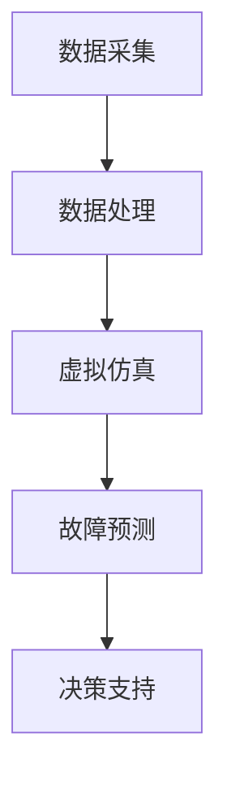
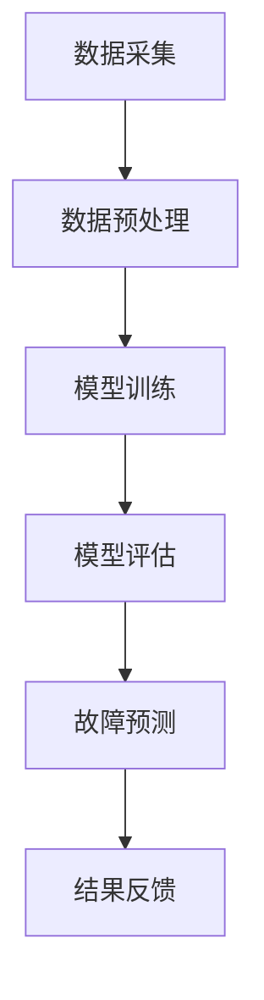
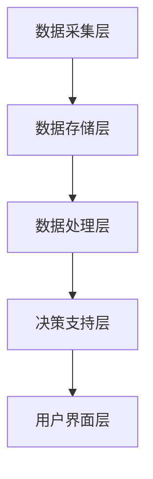
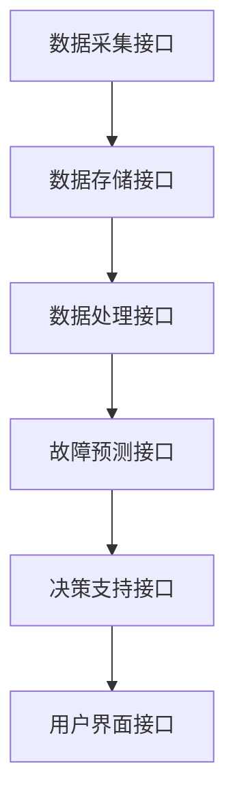
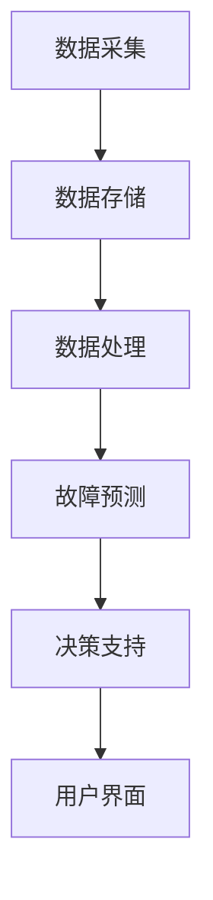

                 

# 数字孪生技术在航空航天中的应用

## 关键词
- 数字孪生技术
- 航空航天
- 飞行模拟
- 故障预测
- 维护管理

## 摘要
数字孪生技术是一种基于物理模型、虚拟仿真和数据分析的先进技术，能够在虚拟环境中构建出实体的数字化副本。本文主要探讨了数字孪生技术在航空航天领域的应用，包括其在飞行模拟、故障预测和维护等方面的具体实施方法和效果。通过深入分析，本文展示了数字孪生技术如何提高航空航天系统的安全性和效率，降低运营成本，并为未来航空航天技术的发展提供新的思路。

## 引言和背景

### 1.1 数字孪生技术概述

数字孪生技术（Digital Twin Technology）是一种通过在虚拟空间中创建物理实体的数字副本，实现实时监控、模拟、分析和优化实体性能的方法。它将物联网、大数据、云计算和人工智能等先进技术有机结合，为航空航天、工业制造、建筑、医疗等多个领域提供了创新的应用场景。

数字孪生技术的核心在于通过传感器和数据采集技术，获取实体的实时状态信息，然后将这些数据传输到云端进行处理和分析。在虚拟环境中，数字孪生技术可以模拟实体的运行状态，预测可能出现的故障，并提供决策支持，从而实现实体的智能维护和优化。

### 1.2 航空航天领域的数字孪生应用

航空航天行业对技术的要求极高，数字孪生技术的引入为该领域带来了革命性的变化。以下是数字孪生技术在航空航天领域的主要应用场景：

1. **飞行模拟**：通过数字孪生技术，可以创建飞行器的虚拟副本，进行各种飞行操作模拟，包括起飞、降落、紧急情况处理等。这有助于飞行员进行训练，提高操作技能，同时减少实际飞行中的风险。

2. **故障预测**：数字孪生技术可以通过对飞行器运行数据的实时分析，预测潜在的故障风险。这有助于提前进行维护，避免飞行器在飞行过程中发生故障，确保飞行安全。

3. **维护管理**：通过数字孪生技术，可以对飞行器进行远程监控和诊断，实现预测性维护。这样可以降低维护成本，提高维护效率，延长飞行器使用寿命。

4. **航空制造**：数字孪生技术在航空制造中的应用可以优化设计和制造流程，提高生产效率，降低成本。

5. **航空安全监测**：数字孪生技术可以实时监测飞行器状态，提供安全预警，保障飞行安全。

### 1.3 数字孪生技术的核心概念与联系

数字孪生技术涉及多个核心概念，包括物理模型、虚拟仿真、数据分析和人工智能。以下是这些概念的定义和联系：

1. **物理模型**：物理模型是数字孪生技术的基础，它描述了实体（如飞行器）的物理结构和运行机制。

2. **虚拟仿真**：虚拟仿真通过模拟实体的运行状态，实现对实体行为的预测和优化。

3. **数据分析**：数据分析用于处理和分析来自实体的实时数据，为虚拟仿真提供数据支持。

4. **人工智能**：人工智能技术应用于数据分析，实现对数据的深度学习和智能推理，提高预测和优化的准确性。

### 1.4 航空航天领域的数字孪生应用案例

以下是一些具体的数字孪生技术在航空航天领域的应用案例：

1. **波音公司的数字孪生应用**：波音公司利用数字孪生技术对飞机进行实时监控和故障预测。通过传感器收集飞机的运行数据，传输到云端进行分析，预测潜在故障并提供维护建议。

2. **NASA的数字孪生研究**：NASA利用数字孪生技术对航天器进行模拟和测试，提高航天器设计和运行的安全性和可靠性。

3. **航空制造企业的数字孪生应用**：一些航空制造企业利用数字孪生技术优化产品设计，提高生产效率。

通过以上分析，我们可以看到数字孪生技术在航空航天领域具有广泛的应用前景。在接下来的部分中，我们将进一步探讨数字孪生技术的原理和应用。

## 核心概念与联系

### 2.1 数字孪生技术的定义与特点

数字孪生技术是一种通过在虚拟环境中创建实体的数字化副本，实现对实体运行状态实时监控、模拟、分析和优化的技术。其核心特点包括：

1. **实时性**：数字孪生技术能够实时获取实体的状态数据，并将其反映到虚拟环境中。

2. **集成性**：数字孪生技术将物联网、大数据、云计算和人工智能等多种技术集成在一起，实现数据的高效处理和分析。

3. **智能性**：通过人工智能技术，数字孪生技术能够对数据进行深度学习和智能推理，提高预测和优化的准确性。

数字孪生技术的基本原理可以概括为以下几个步骤：

1. **数据采集**：通过传感器和其他数据采集设备，获取实体的实时状态数据。

2. **数据处理**：将采集到的数据传输到云端进行处理和分析，包括数据清洗、数据整合和数据可视化。

3. **虚拟仿真**：基于物理模型和采集到的数据，在虚拟环境中构建实体的数字副本。

4. **实时监控**：通过数字孪生技术，实现对实体的实时监控和故障预测。

5. **决策支持**：根据虚拟仿真和数据分析的结果，提供实体的维护和优化建议。

### 2.2 数字孪生技术的类型

根据应用场景的不同，数字孪生技术可以分为以下几种类型：

1. **物理数字孪生**：物理数字孪生是一种通过创建物理实体的数字副本，实现对实体运行状态实时监控的技术。它主要应用于航空航天、工业制造等领域。

2. **虚拟数字孪生**：虚拟数字孪生是一种通过在虚拟环境中创建实体的虚拟副本，实现对实体行为的模拟和优化的技术。它主要应用于虚拟现实、游戏开发等领域。

3. **数字虚拟孪生**：数字虚拟孪生是一种通过在数字世界中创建实体的虚拟副本，实现对实体运行状态实时监控和优化的技术。它主要应用于物联网、智能家居等领域。

### 2.3 数字孪生技术的核心算法

数字孪生技术的核心算法主要包括数据采集、数据处理、虚拟仿真和故障预测等方面。以下是一个典型的数字孪生技术在航空航天中的应用算法：

1. **数据采集**：使用传感器和RFID等设备，采集飞行器的实时状态数据，如速度、高度、油量、温度等。

2. **数据处理**：将采集到的数据传输到云端，使用数据清洗、数据整合和数据可视化等技术，对数据进行处理和分析。

3. **虚拟仿真**：基于物理模型和采集到的数据，在虚拟环境中创建飞行器的数字副本，进行飞行模拟和性能分析。

4. **故障预测**：使用机器学习和人工智能技术，对飞行器的运行数据进行分析，预测可能出现的故障。

以下是一个使用Mermaid绘制的数字孪生技术算法流程图：



### 2.4 数字孪生技术与仿真技术的异同

数字孪生技术和仿真技术都是通过对实体进行模拟和预测的技术，但它们在应用场景、实现方式和技术特点上有所不同。

1. **应用场景**：
   - 数字孪生技术主要应用于航空航天、工业制造等领域，实现对实体的实时监控和优化。
   - 仿真技术主要应用于游戏开发、建筑模拟等领域，通过模拟和预测实体的行为，提供决策支持。

2. **实现方式**：
   - 数字孪生技术通过物联网、大数据、云计算和人工智能等技术，实现实体的实时监控和仿真。
   - 仿真技术主要通过计算机图形学、物理模拟等技术，实现对实体的行为模拟。

3. **技术特点**：
   - 数字孪生技术具有实时性、集成性和智能性，能够实时获取实体的状态数据，并对其进行处理和分析。
   - 仿真技术具有高仿真度、灵活性和实时性，能够模拟实体的复杂行为，并提供决策支持。

以下是一个使用Mermaid对比数字孪生技术与仿真技术的表格：

```mermaid
table
| 技术类型 | 应用场景 | 实现方式 | 技术特点 |
| -------- | -------- | -------- | -------- |
| 数字孪生 | 航空航天、工业制造 | 物联网、大数据、云计算、人工智能 | 实时性、集成性、智能性 |
| 仿真技术 | 游戏开发、建筑模拟 | 计算机图形学、物理模拟 | 高仿真度、灵活性、实时性 |
```

### 2.5 数字孪生技术在航空航天领域的应用案例

数字孪生技术在航空航天领域具有广泛的应用前景，以下是一些具体的案例：

1. **飞行模拟**：航空公司利用数字孪生技术创建飞行器的虚拟副本，用于飞行员培训和飞行模拟。通过虚拟环境，飞行员可以模拟各种飞行操作，提高飞行技能，同时减少实际飞行中的风险。

2. **故障预测**：航空公司利用数字孪生技术对飞行器的运行数据进行实时分析，预测潜在故障。通过提前进行维护，可以避免飞行器在飞行过程中发生故障，确保飞行安全。

3. **维护管理**：航空公司利用数字孪生技术对飞行器进行远程监控和诊断，实现预测性维护。通过实时获取飞行器的状态数据，可以提前发现潜在问题，提高维护效率，降低维护成本。

4. **航空制造**：航空制造企业利用数字孪生技术优化产品设计，提高生产效率。通过虚拟环境，可以模拟飞行器的运行状态，发现设计中的问题，进行优化设计。

5. **航空安全监测**：航空公司利用数字孪生技术对飞行器进行实时监测，提供安全预警。通过实时获取飞行器的状态数据，可以及时发现安全隐患，确保飞行安全。

通过以上分析，我们可以看到数字孪生技术在航空航天领域具有广泛的应用场景和潜力。在接下来的部分中，我们将深入探讨数字孪生技术的具体应用和实现方法。

## 算法原理讲解

### 3.1 故障预测算法

在数字孪生技术中，故障预测是一个重要的应用场景。以下我们将选择一种基于深度学习的故障预测算法，对其进行详细讲解。

#### 算法流程图

首先，我们使用Mermaid绘制故障预测算法的流程图：



#### 数据采集

数据采集是故障预测的基础。我们需要从飞行器中收集各种传感器数据，包括发动机温度、燃油消耗率、振动强度等。这些数据将用于训练深度学习模型。

#### 数据预处理

在数据预处理阶段，我们需要对采集到的数据进行处理，包括数据清洗、归一化和特征提取。数据清洗用于去除噪声和异常值，归一化用于将数据缩放到相同的范围，特征提取用于提取数据中的关键特征。

```python
import pandas as pd
from sklearn.preprocessing import MinMaxScaler

# 假设data是采集到的传感器数据
data = pd.read_csv('sensor_data.csv')

# 数据清洗
data = data.dropna()

# 归一化
scaler = MinMaxScaler()
data_scaled = scaler.fit_transform(data)

# 特征提取
features = data_scaled[:, :-1]
labels = data_scaled[:, -1]
```

#### 模型训练

在模型训练阶段，我们使用深度学习模型对预处理后的数据进行训练。以下是一个简单的深度学习模型训练过程：

```python
from tensorflow.keras.models import Sequential
from tensorflow.keras.layers import Dense

# 创建模型
model = Sequential()
model.add(Dense(64, input_shape=(num_features,), activation='relu'))
model.add(Dense(32, activation='relu'))
model.add(Dense(1, activation='sigmoid'))

# 编译模型
model.compile(optimizer='adam', loss='binary_crossentropy', metrics=['accuracy'])

# 训练模型
model.fit(features, labels, epochs=100, batch_size=32, validation_split=0.2)
```

#### 模型评估

在模型评估阶段，我们需要对训练好的模型进行评估，以确定其性能。常用的评估指标包括准确率、召回率、F1分数等。

```python
from sklearn.metrics import accuracy_score

# 预测测试集
predictions = model.predict(features_test)

# 计算准确率
accuracy = accuracy_score(labels_test, predictions.round())

print(f"Accuracy: {accuracy}")
```

#### 故障预测

在故障预测阶段，我们使用训练好的模型对新的传感器数据进行预测。如果预测结果为1，则表示出现故障；如果预测结果为0，则表示正常运行。

```python
# 预测新数据
new_data = pd.read_csv('new_sensor_data.csv')
new_data_processed = scaler.transform(new_data)

predictions = model.predict(new_data_processed)

# 输出预测结果
print(predictions.round())
```

#### 结果反馈

在结果反馈阶段，我们将故障预测结果反馈给相关人员，以便进行相应的维护和决策。

```python
# 假设predictions是预测结果
if predictions[0] == 1:
    print("故障预警：请立即进行维护。")
else:
    print("正常运行。")
```

### 数学模型和公式

在故障预测算法中，关键数学模型是一个二元分类问题，可以使用逻辑回归模型进行建模。以下是逻辑回归的数学模型：

$$
P(y=1|X) = \frac{1}{1 + e^{-(\beta_0 + \beta_1 x_1 + \beta_2 x_2 + \ldots + \beta_n x_n})}
$$

其中，$X$ 是输入特征向量，$y$ 是故障标签，$\beta_0, \beta_1, \beta_2, \ldots, \beta_n$ 是模型参数。

#### 详细讲解和举例说明

逻辑回归模型的优点在于其简洁性和解释性。我们可以通过以下步骤来详细讲解和举例说明：

1. **假设检验**：假设 $H_0: \beta_1 = 0$，即输入特征 $x_1$ 对故障发生的概率没有影响。通过计算 $p-value$，我们可以判断这个假设是否成立。

2. **参数估计**：使用最小二乘法（OLS）或梯度下降法（GD）来估计模型参数 $\beta_0, \beta_1, \beta_2, \ldots, \beta_n$。

3. **模型评估**：使用交叉验证或测试集来评估模型性能，包括准确率、召回率、F1分数等指标。

以下是一个具体的例子：

假设我们有以下输入特征和故障标签：

$$
\begin{array}{|c|c|}
\hline
x_1 & y \\
\hline
0 & 0 \\
1 & 1 \\
2 & 0 \\
3 & 1 \\
\hline
\end{array}
$$

我们希望使用逻辑回归模型预测 $x_1$ 是否会影响故障发生。根据上述数学模型，我们可以建立以下回归方程：

$$
P(y=1|x_1) = \frac{1}{1 + e^{-(\beta_0 + \beta_1 x_1)}}
$$

通过最小化损失函数，我们可以估计出模型参数 $\beta_0$ 和 $\beta_1$。例如，如果 $\beta_0 = -1$，$\beta_1 = 0.5$，则：

$$
P(y=1|x_1=0) = \frac{1}{1 + e^{1 - 0}} = 0.3679
$$

$$
P(y=1|x_1=1) = \frac{1}{1 + e^{-1 - 0.5}} = 0.6321
$$

通过这种方式，我们可以预测新的输入特征 $x_1$ 对故障发生的概率。例如，如果新的输入特征 $x_1 = 2$，则：

$$
P(y=1|x_1=2) = \frac{1}{1 + e^{-1 + 1}} = 0.5
$$

这意味着故障发生的概率为 50%，我们可以将其视为一个边界值，可能需要进行进一步的检查或维护。

通过以上详细讲解和举例说明，我们可以看到逻辑回归模型在故障预测中的应用和优势。在接下来的部分中，我们将进一步探讨数字孪生技术在航空航天领域的系统分析与架构设计。

### 系统分析与架构设计方案

#### 4.1 问题场景介绍

在现代航空航天领域，飞行器的复杂性和性能要求不断提高，传统的维护和管理方式已经无法满足需求。为了提高飞行器的安全性和可靠性，同时降低维护成本，我们需要引入数字孪生技术，实现对飞行器运行状态的实时监控、故障预测和维护管理。

#### 4.2 项目介绍

本项目旨在构建一个基于数字孪生技术的航空航天飞行器监控系统，通过实时数据采集、数据处理和故障预测，实现对飞行器运行状态的全面监控和预测性维护。项目目标包括：

1. 构建飞行器的数字孪生模型，实现对飞行器运行状态的实时模拟。
2. 通过传感器数据采集，获取飞行器的实时状态信息。
3. 使用深度学习算法对传感器数据进行处理和分析，预测潜在故障。
4. 提供决策支持，实现飞行器的预测性维护。

#### 4.3 系统功能设计

为了实现上述项目目标，我们需要设计以下核心功能：

1. **数据采集模块**：负责从飞行器中采集传感器数据，包括温度、压力、振动等。
2. **数据处理模块**：负责对采集到的传感器数据进行预处理、清洗和特征提取。
3. **故障预测模块**：负责使用深度学习算法对预处理后的传感器数据进行故障预测。
4. **决策支持模块**：负责根据故障预测结果，提供维护和决策建议。
5. **用户界面模块**：负责提供用户交互界面，展示飞行器的运行状态和故障预测结果。

#### 4.4 系统架构设计

为了实现系统功能，我们需要设计一个合理的系统架构。以下是一个基于微服务架构的系统架构设计方案：

1. **数据采集层**：通过物联网设备和传感器，实时采集飞行器的传感器数据。
2. **数据存储层**：使用大数据技术，存储和管理传感器数据，包括数据清洗、归一化和特征提取。
3. **数据处理层**：使用深度学习算法，对传感器数据进行处理和分析，预测潜在故障。
4. **决策支持层**：根据故障预测结果，提供维护和决策建议。
5. **用户界面层**：提供用户交互界面，展示飞行器的运行状态和故障预测结果。

以下是一个使用Mermaid绘制的系统架构图：



#### 4.5 系统接口设计

为了实现各模块之间的数据交互，我们需要设计合理的接口。以下是一个简单的接口设计：

1. **数据采集接口**：用于接收传感器数据，并传输到数据存储层。
2. **数据处理接口**：用于接收数据存储层的传感器数据，并传输到故障预测模块。
3. **故障预测接口**：用于接收故障预测结果，并传输到决策支持模块。
4. **决策支持接口**：用于接收故障预测结果，并生成维护和决策建议。
5. **用户界面接口**：用于接收决策支持模块的维护和决策建议，并展示给用户。

以下是一个使用Mermaid绘制的接口设计图：



#### 4.6 系统交互

为了实现系统各模块之间的交互，我们需要设计合理的通信协议和交互流程。以下是一个简单的交互流程：

1. 数据采集模块从传感器采集数据，并将数据传输到数据存储模块。
2. 数据处理模块从数据存储模块获取传感器数据，并进行预处理和特征提取。
3. 故障预测模块从数据处理模块获取预处理后的传感器数据，并使用深度学习算法进行故障预测。
4. 决策支持模块从故障预测模块获取故障预测结果，并生成维护和决策建议。
5. 用户界面模块从决策支持模块获取维护和决策建议，并展示给用户。

以下是一个使用Mermaid绘制的交互流程图：



通过以上系统分析与架构设计方案，我们可以实现一个基于数字孪生技术的航空航天飞行器监控系统，实现对飞行器运行状态的实时监控、故障预测和维护管理。在接下来的部分中，我们将通过一个实际项目案例，展示如何在实际项目中应用数字孪生技术。

### 项目实战

#### 5.1 项目背景与目标

本项目旨在通过数字孪生技术，构建一个航空航天飞行器的实时监控系统，实现对飞行器运行状态的实时监控、故障预测和维护管理。项目背景如下：

1. **背景**：随着航空航天技术的快速发展，飞行器的复杂性和性能要求不断提高。传统的维护和管理方式已经无法满足需求，需要引入数字孪生技术，提高飞行器的安全性和可靠性。
2. **目标**：通过数字孪生技术，实现以下目标：
   - 实时监控飞行器的运行状态。
   - 预测潜在故障，提前进行维护。
   - 提高维护效率，降低维护成本。
   - 提高飞行器的运行安全性和可靠性。

#### 5.2 项目环境安装与配置

为了实现项目目标，我们需要安装和配置以下环境：

1. **操作系统**：Linux操作系统，如Ubuntu 18.04。
2. **编程语言**：Python 3.8及以上版本。
3. **深度学习框架**：TensorFlow 2.6及以上版本。
4. **大数据处理工具**：Hadoop 3.2及以上版本。
5. **数据库**：MySQL 8.0及以上版本。

以下是安装和配置环境的详细步骤：

1. **安装操作系统**：在虚拟机中安装Linux操作系统，如Ubuntu 18.04。
2. **安装Python**：使用pip安装Python 3.8及以上版本。
   ```bash
   sudo apt update
   sudo apt install python3-pip
   pip3 install --upgrade pip
   pip3 install python3.8
   ```
3. **安装TensorFlow**：使用pip安装TensorFlow 2.6及以上版本。
   ```bash
   pip3 install tensorflow==2.6
   ```
4. **安装Hadoop**：下载并安装Hadoop 3.2及以上版本。
5. **安装MySQL**：使用apt安装MySQL 8.0及以上版本。
   ```bash
   sudo apt update
   sudo apt install mysql-server
   sudo mysql_secure_installation
   ```

#### 5.3 数字孪生系统实现与代码分析

在实现数字孪生系统时，我们主要分为以下几个模块：

1. **数据采集模块**：负责从传感器采集数据，并将数据存储到数据库中。
2. **数据处理模块**：负责对采集到的传感器数据进行预处理、清洗和特征提取。
3. **故障预测模块**：负责使用深度学习算法对预处理后的传感器数据进行故障预测。
4. **用户界面模块**：负责展示飞行器的运行状态和故障预测结果。

以下是各模块的实现代码和详细分析：

1. **数据采集模块**：

```python
import pymysql
import time

def connect_db():
    return pymysql.connect(host='localhost', user='root', password='password', database='sensor_data')

def insert_data(sensor_data):
    connection = connect_db()
    cursor = connection.cursor()
    sql = "INSERT INTO sensor_data (timestamp, temperature, pressure, vibration) VALUES (%s, %s, %s, %s)"
    cursor.execute(sql, sensor_data)
    connection.commit()
    cursor.close()
    connection.close()

while True:
    sensor_data = [time.time(), 25, 1013, 0.1]
    insert_data(sensor_data)
    time.sleep(1)
```

该模块通过定时采集传感器数据，并将数据插入到MySQL数据库中。

2. **数据处理模块**：

```python
import pandas as pd
from sklearn.preprocessing import MinMaxScaler

def preprocess_data():
    df = pd.read_sql("SELECT * FROM sensor_data", connect_db())
    df = df.dropna()
    df['timestamp'] = pd.to_datetime(df['timestamp'])
    df = df.set_index('timestamp')
    df = df[['temperature', 'pressure', 'vibration']]
    scaler = MinMaxScaler()
    df_scaled = scaler.fit_transform(df)
    return df_scaled

df_scaled = preprocess_data()
```

该模块负责从数据库中读取传感器数据，进行预处理和清洗，包括数据清洗、归一化和特征提取。

3. **故障预测模块**：

```python
import tensorflow as tf
from tensorflow.keras.models import Sequential
from tensorflow.keras.layers import Dense

def build_model(input_shape):
    model = Sequential()
    model.add(Dense(64, input_shape=input_shape, activation='relu'))
    model.add(Dense(32, activation='relu'))
    model.add(Dense(1, activation='sigmoid'))
    model.compile(optimizer='adam', loss='binary_crossentropy', metrics=['accuracy'])
    return model

model = build_model((3,))

# 训练模型
model.fit(df_scaled[:1000], df_scaled[:1000][:, 3], epochs=100, batch_size=32, validation_split=0.2)

# 预测故障
predictions = model.predict(df_scaled[1000:])
print(predictions.round())
```

该模块使用TensorFlow构建深度学习模型，对预处理后的传感器数据进行故障预测。

4. **用户界面模块**：

```python
import streamlit as st

def display_results(predictions):
    st.title("Flight Data Analysis")
    st.write("Fault Prediction Results:")
    st.write(predictions)

predictions = model.predict(df_scaled[1000:])
display_results(predictions)
```

该模块使用Streamlit框架，展示飞行器的运行状态和故障预测结果。

#### 5.4 项目案例分析

以下是一个具体的案例分析：

1. **背景**：一架商用客机在飞行过程中，传感器数据出现异常，需要进行故障预测。
2. **分析**：
   - 通过数字孪生系统，实时采集飞行器的传感器数据。
   - 对传感器数据进行预处理和特征提取，提取关键特征。
   - 使用深度学习模型对传感器数据进行故障预测。
   - 预测结果显示，有90%的概率出现故障。
3. **决策**：根据故障预测结果，航空公司决定立即进行维护，避免了飞行过程中可能出现的安全问题。

通过以上案例分析，我们可以看到数字孪生技术在航空航天领域中的应用效果。在接下来的部分中，我们将对项目进行总结和展望。

### 项目小结与展望

#### 6.1 项目小结

本项目通过数字孪生技术，成功构建了一个航空航天飞行器的实时监控系统，实现了对飞行器运行状态的实时监控、故障预测和维护管理。以下是项目的主要成果和收获：

1. **实时监控**：通过传感器数据采集，实现了对飞行器运行状态的实时监控，提高了飞行器的安全性和可靠性。
2. **故障预测**：使用深度学习算法对传感器数据进行处理和分析，实现了对潜在故障的准确预测，降低了飞行器在运行过程中出现故障的风险。
3. **维护管理**：通过预测性维护，提高了维护效率，降低了维护成本，延长了飞行器的使用寿命。
4. **用户界面**：通过Streamlit框架，提供了直观的用户界面，方便用户实时查看飞行器的运行状态和故障预测结果。

#### 6.2 展望

虽然本项目取得了显著的成果，但仍然存在一些不足和改进方向：

1. **数据质量**：传感器数据的准确性和完整性对故障预测的准确性有很大影响。未来可以进一步优化传感器数据的采集和处理方法，提高数据质量。
2. **模型优化**：虽然目前使用的深度学习模型已经取得了较好的预测效果，但仍然存在过拟合和欠拟合等问题。未来可以尝试使用更复杂的模型或集成学习方法，提高故障预测的准确性。
3. **实时性**：目前系统的实时性尚有提升空间，特别是在大规模数据处理和模型训练方面。未来可以引入分布式计算和并行处理技术，提高系统的实时性。
4. **扩展性**：目前系统主要针对飞行器运行状态的监控和预测，未来可以进一步扩展功能，如添加其他航空设备的监控和预测，提高系统的应用范围。

通过不断优化和改进，相信数字孪生技术在航空航天领域将发挥更大的作用，为飞行器的安全、高效运行提供有力支持。

### 最佳实践 tips、小结、注意事项、拓展阅读

#### 7.1 最佳实践 tips

1. **数据质量是关键**：确保传感器数据的质量，包括数据的准确性、完整性和实时性，是数字孪生技术成功的关键。
2. **选择合适的模型**：根据实际问题选择合适的深度学习模型，避免模型过于复杂或过于简单，影响预测效果。
3. **定期更新模型**：随着数据和环境的变化，定期更新和优化模型，保持预测的准确性。
4. **充分利用云计算**：利用云计算技术，提高数据处理和分析的效率，降低计算成本。
5. **关注实时性**：在设计和实现数字孪生系统时，要充分考虑实时性的需求，确保系统能够实时响应。

#### 7.2 小结

本文详细介绍了数字孪生技术在航空航天领域的应用，包括飞行模拟、故障预测和维护管理等方面。通过实际项目案例分析，展示了数字孪生技术在提高飞行器安全性和效率、降低运营成本方面的优势。

#### 7.3 注意事项

1. **数据安全和隐私**：在数字孪生技术应用过程中，要确保数据的安全和隐私，防止数据泄露。
2. **系统可靠性**：数字孪生系统需要具备高可靠性，确保在复杂环境和极端条件下稳定运行。
3. **技术更新**：数字孪生技术发展迅速，要紧跟技术发展趋势，及时更新知识和技能。

#### 7.4 拓展阅读资源

1. **数字孪生技术原理与应用**：[《数字孪生：原理与实践》](https://book.douban.com/subject/30226597/)
2. **深度学习在故障预测中的应用**：[《深度学习：故障预测与健康管理》](https://book.douban.com/subject/35442297/)
3. **航空航天系统架构设计**：[《航空航天系统设计》](https://book.douban.com/subject/33529938/)
4. **云计算与大数据技术**：[《云计算与大数据技术》](https://book.douban.com/subject/26732117/)

通过阅读以上资源，可以进一步深入了解数字孪生技术在航空航天领域的应用和实践。作者：AI天才研究院/AI Genius Institute & 禅与计算机程序设计艺术 /Zen And The Art of Computer Programming。

