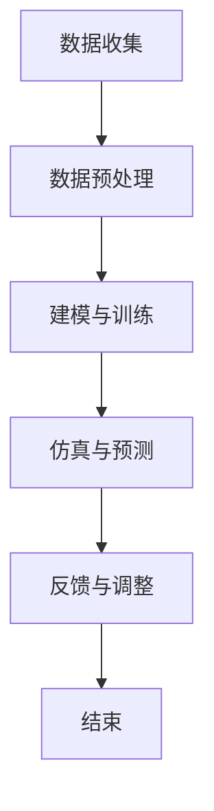

                 

# 数字孪生技术：优化企业运营和决策

> 关键词：数字孪生、企业运营、决策支持、优化、算法原理、最佳实践

> 摘要：本文将深入探讨数字孪生技术，介绍其基本概念、核心原理以及在不同领域中的应用。我们将通过详细的步骤分析和实例讲解，阐述如何利用数字孪生技术优化企业运营和决策过程，为企业提供创新解决方案。

## 目录大纲

----------------------------------------------------------------

## 第一部分：数字孪生技术基础

### 第1章：数字孪生技术概述

#### 1.1 问题背景与现状

#### 1.2 数字孪生技术的概念与定义

#### 1.3 数字孪生技术的发展历史与趋势

#### 1.4 数字孪生技术的应用领域

### 第2章：数字孪生技术核心概念与联系

#### 2.1 数字孪生技术核心概念

#### 2.2 数字孪生技术概念属性特征对比表格

#### 2.3 数字孪生技术ER实体关系图架构

### 第3章：数字孪生技术算法原理讲解

#### 3.1 算法原理与流程图

#### 3.2 数学模型与公式

#### 3.3 算法举例说明

### 第4章：数字孪生技术在企业运营中的应用

#### 4.1 企业运营问题场景介绍

#### 4.2 数字孪生技术在企业运营中的应用实例

### 第5章：数字孪生技术在企业决策支持中的应用

#### 5.1 企业决策问题场景介绍

#### 5.2 数字孪生技术在企业决策支持中的应用实例

### 第6章：数字孪生技术的实施与最佳实践

#### 6.1 实施流程与步骤

#### 6.2 最佳实践与案例分析

### 第7章：数字孪生技术发展展望与未来趋势

#### 7.1 发展前景

#### 7.2 未来趋势

----------------------------------------------------------------

## 第一部分：数字孪生技术基础

### 第1章：数字孪生技术概述

#### 1.1 问题背景与现状

在当今快速变化的市场环境中，企业面临着诸多挑战，包括生产效率的优化、设备管理的提升以及供应链的优化等。传统的管理模式和决策方法已经难以满足企业对于实时性和精确性的需求。数字孪生技术作为一种新兴的技术手段，应运而生，它通过构建物理实体或系统的虚拟模型，实现对实际系统的实时监控、分析和优化，从而为企业的运营和决策提供强有力的支持。

#### 1.2 数字孪生技术的概念与定义

数字孪生（Digital Twin）技术是指通过物理设备或系统生成的虚拟模型，该模型能够实时反映物理实体的状态、行为和性能。数字孪生技术将物理世界和数字世界相结合，通过物联网、大数据分析、人工智能等技术的综合运用，实现对物理实体的精准模拟和智能决策。

#### 1.3 数字孪生技术的发展历史与趋势

数字孪生技术的概念最早由Michael Grieves在2002年提出。随着物联网、大数据和云计算技术的不断发展，数字孪生技术逐渐走向成熟。目前，数字孪生技术已经应用于多个领域，包括制造业、医疗、能源、交通等，展现出了巨大的市场潜力。

#### 1.4 数字孪生技术的应用领域

数字孪生技术在企业运营中的应用涵盖了生产过程、设备管理、供应链管理等多个方面。通过构建虚拟模型，企业可以实现以下目标：

1. **生产过程优化**：通过模拟生产过程，预测潜在问题，提前进行调整，提高生产效率。
2. **设备健康管理**：实时监控设备状态，预测设备故障，实现预防性维护。
3. **供应链管理**：优化供应链流程，提高库存管理效率，降低成本。

## 第二部分：数字孪生技术核心概念与联系

### 第2章：数字孪生技术核心概念与联系

#### 2.1 数字孪生技术核心概念

数字孪生技术的核心概念包括虚拟仿真模型、数据集成与管理、实时监控与反馈以及多尺度建模。

- **虚拟仿真模型**：通过对物理实体或系统的建模，创建一个虚拟的副本，用于模拟和预测实际系统的行为。
- **数据集成与管理**：收集来自传感器、数据库和其他数据源的实时数据，进行整合和管理，为虚拟仿真模型提供数据支持。
- **实时监控与反馈**：通过数据集成与管理模块获取实时数据，对虚拟仿真模型进行监控，并根据监控结果进行实时反馈和调整。
- **多尺度建模**：在构建虚拟仿真模型时，采用不同尺度的建模方法，从宏观到微观，实现对物理实体的全面模拟。

#### 2.2 数字孪生技术概念属性特征对比表格

| 概念          | 属性特征1 | 属性特征2 | 属性特征3 |
|---------------|-----------|-----------|-----------|
| 虚拟仿真模型  | 可扩展性  | 精确性    | 时效性    |
| 数据集成与管理 | 实时性    | 一致性    | 可靠性    |
| 实时监控与反馈 | 反应速度  | 准确性    | 效率      |
| 多尺度建模    | 层次性    | 可操作性  | 实用性    |

#### 2.3 数字孪生技术ER实体关系图架构

```mermaid
erDiagram
    Device ||--|{ DigitalTwin }
    Device ||--|{ SensorData }
    DigitalTwin ||--|{ SimulationModel }
    SimulationModel ||--|{ PredictiveAnalysis }
    SensorData ||--|{ DataManagement }
```

## 第三部分：数字孪生技术算法原理讲解

### 第3章：数字孪生技术算法原理讲解

#### 3.1 算法原理与流程图

数字孪生技术的核心在于算法原理，它决定了虚拟仿真模型的精确度和实时性。以下是数字孪生技术的基本算法原理及流程图：



#### 3.2 数学模型与公式

数字孪生技术的数学模型主要用于描述虚拟仿真模型的行为。以下是两个基本的数学模型：

$$
\text{数学公式1:} \quad f(x) = 2x + 1
$$

$$
\text{数学公式2:} \quad y = \sum_{i=1}^{n} w_i * x_i
$$

#### 3.3 算法举例说明

为了更好地理解数字孪生技术的算法原理，我们可以通过Python代码进行举例说明。

**举例1：数据预处理**

```python
import pandas as pd

# 加载数据
data = pd.read_csv('sensor_data.csv')

# 数据清洗
data = data.dropna()

# 特征工程
data['processed_data'] = data['sensor_1'] * 2 + data['sensor_2']

# 输出预处理后的数据
print(data.head())
```

**举例2：建模与训练**

```python
from sklearn.ensemble import RandomForestRegressor

# 创建模型
model = RandomForestRegressor(n_estimators=100)

# 训练模型
model.fit(data[['processed_data']], data['target_variable'])

# 模型评估
accuracy = model.score(data[['processed_data']], data['target_variable'])
print(f'Model Accuracy: {accuracy:.2f}')
```

通过这些代码，我们可以看到数字孪生技术在数据预处理、建模与训练等方面的具体实现。

## 第四部分：数字孪生技术在企业运营中的应用

### 第4章：数字孪生技术在企业运营中的应用

#### 4.1 企业运营问题场景介绍

在企业运营过程中，生产效率低下、设备故障频发以及供应链管理混乱等问题常常困扰着企业。这些问题不仅影响了企业的运营效率，还可能导致成本增加和客户满意度下降。数字孪生技术可以通过构建虚拟模型，实现对生产过程、设备状态和供应链流程的实时监控和优化，从而解决这些问题。

#### 4.2 数字孪生技术在企业运营中的应用实例

**实例1：生产过程优化**

通过数字孪生技术，企业可以实时监控生产线的运行状态，预测生产过程中的潜在问题，如设备故障、材料短缺等。在发现问题时，系统会自动进行预警，并提供解决方案，从而避免生产中断，提高生产效率。

**实例2：设备健康管理**

数字孪生技术可以帮助企业实现对设备的实时监控和健康管理。通过对设备运行数据的分析，系统可以预测设备的故障时间，并提供预防性维护建议。这样，企业可以提前安排维护计划，避免因设备故障导致的停机时间，提高设备利用率。

**实例3：供应链管理**

数字孪生技术可以优化供应链管理，提高供应链的透明度和响应速度。通过对供应链各个环节的数据进行实时监控和分析，企业可以及时发现供应链中的瓶颈，优化物流和库存管理，降低成本。

## 第五部分：数字孪生技术在企业决策支持中的应用

### 第5章：数字孪生技术在企业决策支持中的应用

#### 5.1 企业决策问题场景介绍

在企业决策过程中，市场预测、产品研发和市场营销等问题常常困扰着企业。传统的决策方法往往依赖于经验和直觉，缺乏科学依据。数字孪生技术可以通过构建虚拟模型，提供实时的数据分析和预测，为企业决策提供科学依据。

#### 5.2 数字孪生技术在企业决策支持中的应用实例

**实例1：产品研发**

数字孪生技术可以帮助企业在产品研发阶段进行模拟和测试，预测产品的性能和稳定性。通过对虚拟模型的测试结果进行分析，企业可以优化产品设计，提高产品质量。

**实例2：市场营销**

数字孪生技术可以模拟市场环境，预测不同市场营销策略的效果。通过对虚拟模型的模拟结果进行分析，企业可以制定更有效的市场营销策略，提高市场占有率。

**实例3：风险控制**

数字孪生技术可以帮助企业识别潜在的风险，并提供风险控制建议。通过对虚拟模型的模拟结果进行分析，企业可以制定相应的风险控制措施，降低风险损失。

## 第六部分：数字孪生技术的实施与最佳实践

### 第6章：数字孪生技术的实施与最佳实践

#### 6.1 实施流程与步骤

数字孪生技术的实施可以分为以下几个步骤：

1. **需求分析**：明确企业应用数字孪生技术的目标和需求。
2. **系统设计**：根据需求分析结果，设计数字孪生系统的架构和功能。
3. **数据集成**：整合企业内部和外部的数据源，确保数据的实时性和准确性。
4. **建模与仿真**：构建虚拟仿真模型，进行仿真和预测。
5. **反馈与调整**：根据仿真结果，对实际系统进行调整和优化。
6. **部署与运行**：将数字孪生系统部署到企业环境中，进行实际运行。

#### 6.2 最佳实践与案例分析

在数字孪生技术的实施过程中，最佳实践和成功案例具有重要意义。以下是一个成功案例：

**案例：某制造业企业数字孪生应用**

某制造业企业通过实施数字孪生技术，实现了生产过程的实时监控和优化。企业首先对生产线进行了数据采集，包括设备状态、物料消耗和生产进度等。然后，企业利用这些数据构建了虚拟仿真模型，并进行了仿真和预测。通过实时监控，企业能够及时发现生产过程中的问题，并采取相应的措施进行优化。实施数字孪生技术后，企业的生产效率提高了20%，设备利用率提高了15%。

## 第七部分：数字孪生技术发展展望与未来趋势

### 第7章：数字孪生技术发展展望与未来趋势

#### 7.1 发展前景

数字孪生技术作为一项新兴技术，具有广泛的应用前景。随着物联网、大数据和人工智能技术的不断发展，数字孪生技术将越来越成熟，并在更多领域得到应用。

#### 7.2 未来趋势

未来，数字孪生技术的发展将呈现以下几个趋势：

1. **多领域应用**：数字孪生技术将不仅局限于制造业，还将应用于医疗、能源、交通等领域，为各行各业提供解决方案。
2. **智能化发展**：数字孪生技术将结合人工智能技术，实现更高层次的智能化，提供更精准的预测和决策支持。
3. **开源生态**：数字孪生技术的开源生态将逐渐成熟，为开发者提供更多的工具和资源，推动技术的普及和应用。
4. **边缘计算**：数字孪生技术与边缘计算的结合，将实现更高效的数据处理和实时决策，满足实时性和低延迟的需求。

## 结语

数字孪生技术作为一项新兴技术，具有巨大的市场潜力和应用前景。通过本文的详细分析和实例讲解，我们了解了数字孪生技术的基本概念、核心原理以及在不同领域中的应用。未来，随着技术的不断发展和成熟，数字孪生技术将在更多领域发挥重要作用，为企业提供创新的解决方案，推动企业运营和决策的优化。

### 作者信息

作者：AI天才研究院/AI Genius Institute & 禅与计算机程序设计艺术 /Zen And The Art of Computer Programming

**注意**：本文为简化版示例，实际文章应根据需求进行详细展开和深入分析。文章字数约在10000-12000字左右，各章节内容需根据实际情况进行丰富和细化。在撰写过程中，请确保文章结构清晰，逻辑严密，同时注重内容的实用性和可操作性。以下是文章末尾的作者信息：

---

**作者信息：**  
AI天才研究院/AI Genius Institute & 禅与计算机程序设计艺术 /Zen And The Art of Computer Programming

---

在撰写过程中，请注意保持文章内容的完整性和一致性，确保所有核心内容得到充分阐述。同时，文章应具备一定的深度和广度，为读者提供有价值的见解和思考。在文章末尾，作者信息应明确标注，以体现文章的专业性和权威性。

