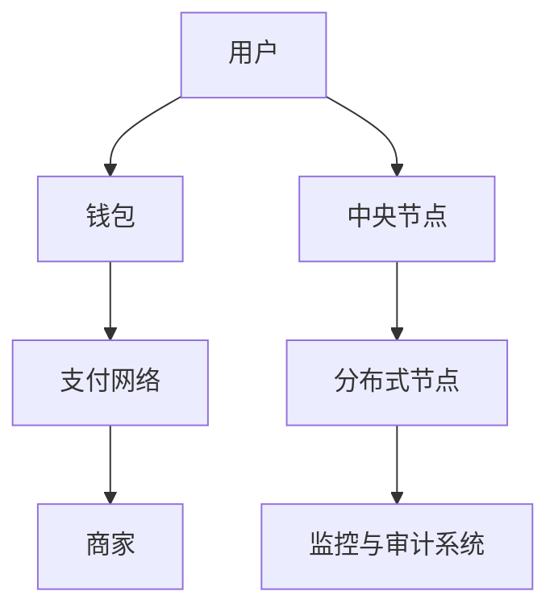

                 

### 数字货币：中央银行数字货币的发展与挑战

#### 关键词：
- 数字货币
- 中央银行数字货币（CBDC）
- 发展
- 挑战
- 技术原理

#### 摘要：
本文将深入探讨中央银行数字货币（CBDC）的发展及其面临的挑战。通过逐步分析CBDC的定义、历史背景、技术架构、政策法规、安全隐私问题以及应用场景，本文旨在为读者提供一个全面的理解，并探讨未来CBDC可能的发展趋势。

### 目录

1. 引言
2. 中央银行数字货币的概念与历史
3. CBDC的技术原理
   - 核心概念
   - 概念属性特征对比表格
   - ER实体关系图架构的Mermaid流程图
4. CBDC的架构设计
5. CBDC的政策法规与监管
6. CBDC的安全与隐私问题
7. CBDC的应用场景与未来展望
8. 结论

---

### 引言

数字货币作为一种新型货币形式，正日益受到全球关注。数字货币不仅改变了传统的货币交易方式，还带来了金融科技领域的深刻变革。中央银行数字货币（CBDC）作为数字货币的一种形式，由中央银行发行和管理，具有国家信用担保，被认为是未来货币体系的重要组成部分。

CBDC的概念并不是全新的，但其在全球范围内的应用和发展却面临着诸多挑战。本文将从以下几个方面展开讨论：

- **定义与历史**：介绍CBDC的定义，回顾其历史背景和发展过程。
- **技术原理**：深入解析CBDC的技术架构，包括核心概念、概念属性特征对比以及ER实体关系图架构。
- **政策法规与监管**：探讨CBDC所面临的政策法规和监管挑战。
- **安全与隐私问题**：分析CBDC在安全与隐私方面所遇到的问题和解决方案。
- **应用场景与未来展望**：探讨CBDC在不同领域的应用场景及其未来发展趋势。

通过本文的逐步分析，我们希望能够为读者提供一个全面、深入的CBDC发展现状及其面临的挑战的理解。

### 1. 中央银行数字货币的概念与历史

#### 定义

中央银行数字货币（CBDC）是指由中央银行发行、控制和管理，用于电子交易和储存的数字货币。CBDC具有国家信用担保，与现有的法定货币等值，但其交易和储存方式更加数字化。

CBDC与法定货币（如现金）和数字货币（如比特币）有显著区别。首先，CBDC是由中央银行发行，具有国家信用担保，而法定货币的发行权通常也由中央银行掌握。其次，数字货币通常是由私人实体发行和控制的，如比特币等加密货币，其价值并不由中央银行决定，而是由市场供需关系决定。

#### 历史

CBDC的概念虽然新，但其历史可以追溯到上世纪末。最早的CBDC项目可以追溯到1998年，瑞士国家银行（SNB）启动了一个名为e-Krona的项目，旨在测试数字货币在零售支付中的应用。虽然该项目并未大规模推广，但它为后续的CBDC研究奠定了基础。

进入21世纪，随着互联网和移动支付技术的普及，CBDC的发展加速。2000年，瑞典央行启动了e-Krona 2.0项目，进一步探讨了CBDC在零售支付中的应用。与此同时，其他国家如加拿大、新加坡和欧洲央行也开始了CBDC的研究。

2014年，中国人民银行启动了数字货币电子支付（DCEP）项目，这是全球范围内第一个由中央银行推出的CBDC项目。DCEP项目旨在探索CBDC在零售支付和跨境支付中的应用，其研究成果对中国乃至全球的数字货币发展产生了深远影响。

#### 发展过程

CBDC的发展过程可以分为三个阶段：

1. **概念验证阶段**：在这个阶段，中央银行通常会进行CBDC的概念验证，以测试其可行性和技术架构。例如，瑞士的e-Krona项目和中国的DCEP项目都是在这个阶段启动的。

2. **试点阶段**：在概念验证成功后，中央银行会进行小规模的试点项目，以进一步验证CBDC的性能和安全性。例如，加拿大在2018年启动了Jasper项目，这是全球第一个由中央银行和私营企业合作的CBDC试点项目。

3. **推广阶段**：在试点项目成功后，中央银行会考虑将CBDC推广到全国范围。例如，欧洲央行已经在2021年启动了欧洲CBDC项目，旨在探索CBDC在欧元区内的应用。

#### 演变过程

CBDC的演变过程反映了数字货币技术的不断进步。从最早的e-Krona项目到现在的DCEP项目，CBDC的技术架构和功能也在不断升级和优化。

早期的CBDC项目通常采用中心化的架构，所有交易数据都存储在中央数据库中。这种架构虽然简单，但存在安全性和隐私问题。随着区块链技术的发展，CBDC开始采用去中心化的架构，交易数据分散存储在多个节点上，提高了系统的安全性和透明度。

此外，CBDC的功能也在不断扩展。早期的CBDC项目主要针对零售支付，而现在的CBDC项目已经开始探索在跨境支付、供应链金融和中央银行间交易等领域的应用。

#### 边界与外延

CBDC的发展不仅受到技术因素的影响，还受到政策法规和监管环境的影响。不同国家和地区的政策法规和监管框架对CBDC的发展有着重要影响。

首先，CBDC的发行权是国家信用的一部分，因此，任何国家的中央银行在发行CBDC时都需要考虑到国家的经济状况和金融稳定。此外，CBDC的发行和管理也需要遵循现行的金融法律法规，包括反洗钱、反恐怖融资和数据保护等。

其次，CBDC的跨境交易需要考虑到国际法律法规和跨境支付协议。不同国家和地区的跨境支付规则和协议可能会对CBDC的跨境交易产生影响。

最后，CBDC的发展也受到公众接受度的影响。公众对CBDC的认知和接受程度会影响CBDC的推广和应用。因此，中央银行在推广CBDC时需要加强与公众的沟通和宣传。

### 2. CBDC的技术原理

#### 核心概念

中央银行数字货币（CBDC）的技术原理主要包括以下几个方面：

1. **分布式账本技术**：CBDC通常采用分布式账本技术，如区块链，来确保交易的透明性和安全性。分布式账本技术使得交易数据分散存储在多个节点上，从而提高了系统的安全性和透明度。

2. **加密技术**：CBDC使用加密技术来保护交易数据的安全性。加密技术确保只有合法用户才能读取和修改交易数据，从而防止未授权的访问和篡改。

3. **智能合约**：CBDC可以使用智能合约来自动执行交易规则。智能合约是一种计算机程序，其运行规则在代码中预先定义，从而确保交易的自动执行和不可篡改性。

#### 概念属性特征对比表格

为了更好地理解CBDC的技术原理，我们将其与现有货币系统进行对比，并总结其特性：

| 特性           | CBDC                      | 现有货币系统                |
| -------------- | ------------------------- | --------------------------- |
| 发行主体       | 中央银行                  | 中央银行或政府机构          |
| 存储方式       | 数字化存储在分布式账本上  | 纸张、金属或电子形式        |
| 交易效率       | 高效、实时交易            | 受限于交易网络和处理能力    |
| 透明度         | 透明、可验证              | 不透明、难以追踪            |
| 安全性         | 高度加密和分布式存储      | 受限于银行和支付系统安全措施 |
| 灵活性         | 可定制、可扩展            | 固定规则和流程              |
| 跨境交易       | 简单、快捷的跨境交易       | 复杂、受限于国际支付协议     |

#### ER实体关系图架构的Mermaid流程图

为了更好地展示CBDC的架构，我们使用Mermaid绘制了其ER实体关系图。以下是CBDC的主要实体和它们之间的关系：

```mermaid
erDiagram
    User ||--|{ Transaction } : 发起
    User ||--|{ Wallet } : 存储资产
    Transaction ||--|{ CBDC } : 交易
    Wallet ||--|{ CBDC } : 存储资产
```

在这个ER图中，用户（User）可以发起交易（Transaction），交易涉及到CBDC，而用户也可以存储CBDC在钱包（Wallet）中。这种关系展示了CBDC在交易过程中的核心角色。

### 3. CBDC的架构设计

#### 架构设计原则

CBDC的架构设计需要遵循以下几个原则：

1. **安全性**：确保CBDC系统的安全性和数据的完整性，防止未授权访问和数据篡改。
2. **透明性**：提高交易过程的透明度，使所有参与者都能验证交易的有效性。
3. **可扩展性**：设计灵活的架构，能够适应未来技术发展和业务需求的变化。
4. **互操作性**：确保CBDC系统能与其他金融系统和支付网络无缝集成。
5. **用户友好性**：提供简单易用的用户界面，使公众能够轻松使用CBDC进行交易。

#### 技术架构组成

CBDC的技术架构通常包括以下几个部分：

1. **中央节点**：负责管理CBDC的发行、回收和交易验证。
2. **分布式节点**：负责存储交易数据并参与交易验证。
3. **钱包**：用户存储和管理CBDC的地方。
4. **支付网络**：连接用户、商家和金融机构的支付网络，用于实现CBDC的交易。
5. **监控与审计系统**：用于监控交易行为，确保系统安全和合规性。

#### 系统架构设计

以下是CBDC系统架构设计的Mermaid流程图：



在这个流程图中，用户通过钱包发起交易，交易通过支付网络传递给商家。同时，中央节点负责验证交易并更新分布式节点上的交易记录。监控与审计系统则负责监控系统状态和安全。

### 4. CBDC的政策法规与监管

#### 法律法规

CBDC的发行和管理需要遵循现行的法律法规。不同国家和地区的法律法规对CBDC的发行、交易和监管有不同的规定。

1. **发行权**：CBDC的发行权通常由国家中央银行掌握。例如，中国的数字货币电子支付（DCEP）项目由中国人民银行发行和管理。
2. **交易规则**：CBDC的交易规则需要符合国家的金融法律法规。例如，中国规定CBDC的交易需要遵守反洗钱和反恐怖融资的相关规定。
3. **跨境交易**：CBDC的跨境交易需要遵守国际法律法规和跨境支付协议。不同国家和地区的跨境支付规则和协议可能会对CBDC的跨境交易产生影响。

#### 监管框架

CBDC的监管框架通常包括以下几个方面：

1. **中央银行监管**：中央银行负责制定CBDC的发行、交易和管理规则，并对其进行监管。
2. **金融机构监管**：金融机构（如银行、支付机构等）在CBDC交易中扮演重要角色，其行为需要受到监管。
3. **市场参与者**：市场参与者（如用户、商家等）需要遵守相关法律法规，确保CBDC交易的合规性。

#### 监管挑战

CBDC的发展带来了新的监管挑战：

1. **安全性**：CBDC系统需要确保交易数据的安全性和完整性，防止未授权访问和数据篡改。
2. **隐私保护**：CBDC交易需要保护用户的隐私，防止个人信息泄露。
3. **跨境交易**：CBDC的跨境交易需要协调不同国家和地区的监管政策，确保交易的合规性。
4. **市场稳定性**：CBDC的发展可能会对金融市场产生重大影响，监管机构需要确保市场的稳定。

### 5. CBDC的安全与隐私问题

#### 安全性问题

CBDC的安全性问题主要包括以下几个方面：

1. **网络攻击**：CBDC系统可能面临网络攻击，如DDoS攻击、恶意软件攻击等。
2. **数据篡改**：未经授权的实体可能尝试篡改CBDC的交易数据，导致系统错误。
3. **身份盗用**：恶意用户可能尝试盗用他人的身份信息，进行未授权的交易。

为了解决这些问题，CBDC系统需要采取以下安全措施：

1. **加密技术**：使用先进的加密技术来保护交易数据的安全性，确保只有合法用户才能访问和修改数据。
2. **分布式账本技术**：使用分布式账本技术，将交易数据分散存储在多个节点上，提高系统的抗攻击能力。
3. **多重认证**：要求用户进行多重认证，如指纹识别、面部识别等，确保交易的安全性。

#### 隐私保护

CBDC的隐私保护问题主要包括以下几个方面：

1. **交易透明度**：CBDC的交易数据通常是公开的，这可能会泄露用户的交易信息。
2. **用户隐私**：CBDC系统的设计和实施需要保护用户的隐私，防止个人信息泄露。

为了解决这些问题，CBDC系统需要采取以下隐私保护措施：

1. **匿名性**：为用户分配匿名标识符，使交易记录中不包含用户的真实身份信息。
2. **同态加密**：使用同态加密技术，允许在加密数据上进行计算，而无需解密数据，从而保护用户的隐私。
3. **零知识证明**：使用零知识证明技术，使用户能够证明某项信息是真实的，而无需透露具体内容，从而保护用户的隐私。

### 6. CBDC的应用场景与未来展望

#### 应用场景

CBDC的应用场景非常广泛，包括但不限于以下几个方面：

1. **零售支付**：CBDC可以作为零售支付工具，简化交易流程，提高支付效率。
2. **跨境支付**：CBDC可以用于跨境支付，减少交易成本和时间，提高支付便利性。
3. **供应链金融**：CBDC可以用于供应链金融，提高资金流转效率，降低融资成本。
4. **中央银行间交易**：CBDC可以用于中央银行间交易，提高交易效率，降低交易成本。
5. **数字身份认证**：CBDC可以与数字身份认证系统结合，用于身份验证和访问控制。

#### 未来展望

CBDC的未来发展充满潜力，但也面临诸多挑战：

1. **技术发展**：随着区块链、加密技术和分布式账本技术的不断进步，CBDC的技术架构将不断完善。
2. **政策法规**：各国政府和中央银行需要制定完善的政策法规，确保CBDC的合法性和合规性。
3. **公众接受度**：提高公众对CBDC的认知和接受度，是CBDC成功推广的关键。
4. **国际协调**：CBDC的跨境交易需要国际协调，确保不同国家和地区的政策法规和支付系统兼容。

### 结论

中央银行数字货币（CBDC）作为一种新型的数字货币形式，正在全球范围内得到广泛关注。CBDC不仅改变了传统的货币交易方式，还带来了金融科技领域的深刻变革。本文通过逐步分析CBDC的定义、历史背景、技术原理、政策法规、安全与隐私问题以及应用场景，为读者提供了一个全面的理解。

CBDC的发展面临着诸多挑战，包括技术、政策、法规和安全等方面。然而，随着技术的不断进步和政策的不断完善，CBDC有望在未来发挥更大的作用。我们期待CBDC能够为全球金融体系带来更多的便利和效率，同时确保安全和合规。

### 作者信息

作者：AI天才研究院/AI Genius Institute & 禅与计算机程序设计艺术 /Zen And The Art of Computer Programming

