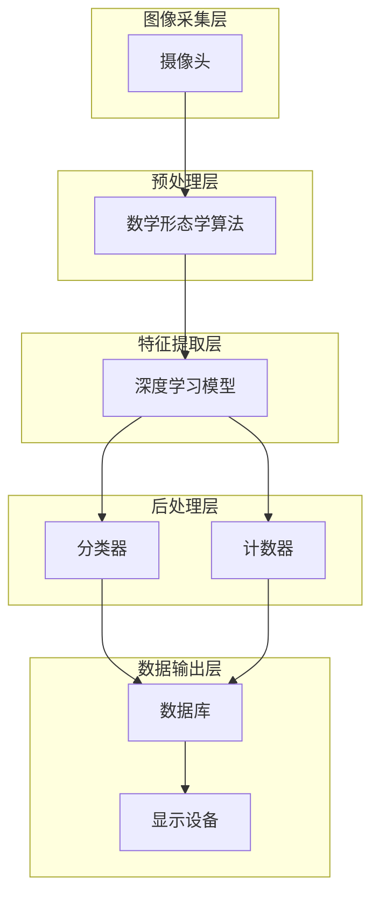
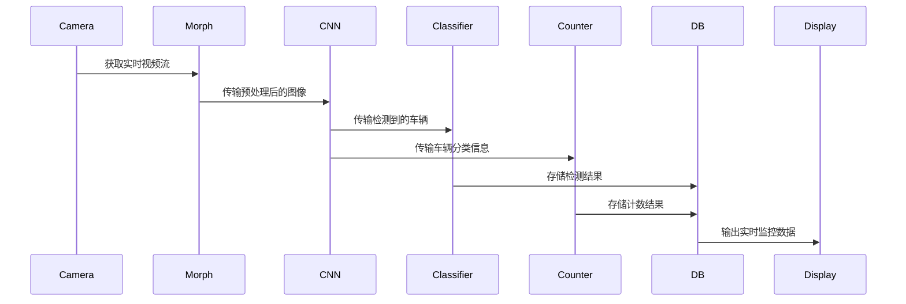

                 

## 什么是数学形态学？

数学形态学（Mathematical Morphology）是一门广泛应用于图像处理、信号处理、计算机视觉和医疗成像领域的数学分支。它起源于数学家Lions和Morse的工作，并在20世纪70年代由Grenander和Meijer等人进一步发展。数学形态学的基本思想是通过结构元素与图像的交互，对图像进行形态上的分析、处理和转换。

### 核心概念

1. **结构元素（Structural Element）**：结构元素是数学形态学的核心概念之一。它是一个小的图像模板，用于与输入图像进行卷积操作。结构元素的形状和大小决定了形态变换的效果。

2. **膨胀（Dilation）和腐蚀（Erosion）**：膨胀是将结构元素与输入图像进行卷积，并在每个像素点处将结构元素范围内的像素值设置为最大值。腐蚀则是将结构元素与输入图像进行卷积，并在每个像素点处将结构元素范围内的像素值设置为最小值。

3. **开操作（Opening）和闭操作（Closing）**：开操作是先进行腐蚀，再进行膨胀。闭操作则是先进行膨胀，再进行腐蚀。开闭操作用于平滑图像并去除小噪声。

4. **形态学梯度（Morphological Gradient）**：形态学梯度是膨胀操作和腐蚀操作的差值，用于提取图像的边缘信息。

5. **形态学拓扑重建（Morphological Topological Reconstruction）**：通过形态学操作重建图像，使其保持原有的连通性和拓扑结构。

### 问题背景

在图像处理领域，数学形态学被广泛应用于图像滤波、分割、特征提取、形状分析和图像识别等任务。传统的图像处理方法通常依赖于线性滤波器和统计学模型，这些方法在处理复杂图像时往往效果不佳。而数学形态学提供了一种基于结构元素的局部操作方法，能够在保持图像结构特征的同时有效去除噪声。

随着计算机硬件性能的提升和深度学习技术的进步，数学形态学在图像处理中的应用也得到了进一步扩展。例如，在深度学习中的卷积神经网络（CNN）中，结构元素的概念被应用于构建复杂的网络层，以提取更高层次的图像特征。

### 问题描述

数学形态学在图像处理中的应用主要解决以下问题：

1. **噪声去除**：通过膨胀和腐蚀操作，可以去除图像中的孤立噪声点，平滑图像细节。
2. **边缘提取**：形态学梯度操作可以有效地提取图像的边缘信息，这对于图像分割和特征提取具有重要意义。
3. **图像分割**：开闭操作和形态学重建技术可以用于图像分割，将图像分为不同的区域。
4. **形状分析**：通过形态学操作，可以对图像中的形状进行识别和分析，如连通性、面积和周长等。

### 问题解决

数学形态学的解决方法主要依赖于以下步骤：

1. **选择合适的结构元素**：根据具体应用需求，设计合适的结构元素，以实现所需的形态变换效果。
2. **进行形态学操作**：根据需要，执行膨胀、腐蚀、开操作或闭操作，对图像进行形态上的处理。
3. **后处理**：对处理后的图像进行必要的后处理，如滤波、边缘增强等，以提高图像质量。

### 边界与外延

数学形态学的应用边界和范围非常广泛，从基本的图像滤波和分割到复杂的形状分析和图像识别。它不仅可以应用于二维图像，还可以扩展到三维图像处理和序列图像分析。此外，数学形态学与深度学习技术的结合，使得其在复杂图像处理任务中具有更大的潜力和应用价值。

### 概念结构与核心要素组成

数学形态学的概念结构主要包括以下核心要素：

1. **结构元素设计**：设计合适的结构元素是实现形态变换效果的关键。
2. **形态学操作算法**：包括膨胀、腐蚀、开操作和闭操作等基本形态学操作。
3. **后处理技术**：用于优化和增强形态学操作结果的图像处理技术。
4. **应用场景**：根据具体应用需求，选择合适的形态学操作和应用场景。

通过上述核心要素的有机结合，数学形态学提供了一种强大的图像处理工具，能够有效地解决各种图像处理问题。

### 总结

数学形态学作为一门数学分支，通过结构元素的局部操作，提供了强大的图像处理能力。它在图像滤波、分割、特征提取和形状分析等方面具有广泛的应用。随着深度学习技术的发展，数学形态学与深度学习的结合有望进一步拓展其在图像处理中的应用范围。在接下来的章节中，我们将深入探讨数学形态学的基本概念和操作，并介绍其在图像处理算法中的应用实例。

### 数学形态学的基本概念

数学形态学作为图像处理的一个重要分支，其核心在于结构元素的运用以及通过这些元素对图像进行形态上的分析和操作。要深入理解数学形态学，首先需要掌握其基本概念，包括结构元素、膨胀、腐蚀、开操作、闭操作、形态学梯度以及形态学拓扑重建。

#### 结构元素

结构元素（Structural Element）是数学形态学的基石，它是一个小的图像模板，用于与输入图像进行卷积操作。结构元素的形状和大小决定了形态变换的效果。在数学形态学中，常用的结构元素有矩形结构元素、圆形结构元素和线形结构元素等。

##### 定义

结构元素通常是一个二值图像，大小可以是一个方形或长方形，其中包含“1”的区域决定了结构元素在图像中与像素进行卷积时如何操作。

##### 作用

结构元素在图像处理中的作用是通过与输入图像的卷积，对图像的局部区域进行操作，从而改变图像的形态。

#### 膨胀（Dilation）

膨胀操作是数学形态学中最基本的操作之一。它通过将结构元素与输入图像进行卷积，并在每个像素点处将结构元素范围内的像素值设置为最大值，从而扩大图像的某些部分。

##### 定义

膨胀操作（Dilation）是指用一个给定的结构元素E与一个二值图像I卷积，生成一个新的二值图像O。具体来说，对于图像I中的每个像素点\( p \)，O中的像素值由\( p \)点处结构元素E内所有像素值的最大值决定。

##### 公式

$$
O(p) = \max \{ I(q) : q \in E(p) \}
$$

其中，\( E(p) \)表示结构元素E在像素点\( p \)的位置。

##### 作用

膨胀操作通常用于连接图像中的孤立点，扩大图像中的某些区域，以便更好地进行后续处理。

#### 腐蚀（Erosion）

腐蚀操作是膨胀操作的逆操作，它通过将结构元素与输入图像进行卷积，并在每个像素点处将结构元素范围内的像素值设置为最小值，从而缩小图像的某些部分。

##### 定义

腐蚀操作（Erosion）是指用一个给定的结构元素E与一个二值图像I卷积，生成一个新的二值图像O。具体来说，对于图像I中的每个像素点\( p \)，O中的像素值由\( p \)点处结构元素E内所有像素值的最小值决定。

##### 公式

$$
O(p) = \min \{ I(q) : q \in E(p) \}
$$

其中，\( E(p) \)表示结构元素E在像素点\( p \)的位置。

##### 作用

腐蚀操作通常用于去除图像中的噪声点，细化图像中的结构。

#### 开操作（Opening）

开操作是先进行腐蚀，再进行膨胀。开操作用于平滑图像并去除小噪声，同时保持图像中的大结构不变。

##### 定义

开操作（Opening）是指先对一个图像I进行腐蚀操作，得到中间图像I',然后再对I'进行膨胀操作，得到最终图像O。

##### 公式

$$
I' = E(I) \\
O = D(I')
$$

##### 作用

开操作通常用于去除图像中的孤立噪声点，平滑图像的边缘，增强图像的结构。

#### 闭操作（Closing）

闭操作是先进行膨胀，再进行腐蚀。闭操作用于连接图像中的小孔洞，封闭图像中的空洞。

##### 定义

闭操作（Closing）是指先对一个图像I进行膨胀操作，得到中间图像I',然后再对I'进行腐蚀操作，得到最终图像O。

##### 公式

$$
I' = D(I) \\
O = E(I')
$$

##### 作用

闭操作通常用于封闭图像中的空洞，连接图像中的小孔洞，增强图像的结构。

#### 形态学梯度（Morphological Gradient）

形态学梯度是膨胀操作和腐蚀操作的差值，用于提取图像的边缘信息。

##### 定义

形态学梯度（Morphological Gradient）是指膨胀操作结果D(I)减去腐蚀操作结果E(I)。

##### 公式

$$
G(I) = D(I) - E(I)
$$

##### 作用

形态学梯度通常用于提取图像的边缘信息，增强图像的对比度。

#### 形态学拓扑重建（Morphological Topological Reconstruction）

形态学拓扑重建是通过形态学操作重建图像，使其保持原有的连通性和拓扑结构。

##### 定义

形态学拓扑重建（Morphological Topological Reconstruction）是指通过膨胀和腐蚀操作，重建图像中的连通区域，同时保持其原有的连通性。

##### 公式

$$
R(I) = E(D(I))
$$

##### 作用

形态学拓扑重建通常用于图像分割和连通性分析。

### 概括

数学形态学的基本概念包括结构元素、膨胀、腐蚀、开操作、闭操作、形态学梯度以及形态学拓扑重建。这些概念构成了数学形态学的核心，通过这些基本操作，可以对图像进行形态上的分析和处理，从而实现图像滤波、分割、特征提取等多种图像处理任务。

### 核心概念对比表格

为了更好地理解数学形态学的基本概念，我们通过一个对比表格来展示膨胀、腐蚀、开操作和闭操作之间的区别。

| 操作类型 | 定义 | 公式 | 作用 |
| --- | --- | --- | --- |
| 膨胀（Dilation） | 用结构元素与输入图像卷积，每个像素值设置为最大值 | \( O(p) = \max \{ I(q) : q \in E(p) \} \) | 扩大图像的某些区域 |
| 腐蚀（Erosion） | 用结构元素与输入图像卷积，每个像素值设置为最小值 | \( O(p) = \min \{ I(q) : q \in E(p) \} \) | 缩小图像的某些区域 |
| 开操作（Opening） | 先腐蚀后膨胀 | \( I' = E(I), O = D(I') \) | 去除小噪声，平滑图像边缘 |
| 闭操作（Closing） | 先膨胀后腐蚀 | \( I' = D(I), O = E(I') \) | 连接小孔洞，封闭空洞 |

### ER实体关系图架构

为了更直观地展示数学形态学中各核心概念之间的关系，我们使用Mermaid绘制了一个ER实体关系图。

```mermaid
erDiagram
  I --|{1}--> E : 结构元素与图像的卷积操作
  E --|{1}--> D : 膨胀操作
  E --|{1}--> E : 腐蚀操作
  D --|{1}--> O : 膨胀后的图像
  E --|{1}--> O : 腐蚀后的图像
  D --|{1}--> O' : 开操作
  E --|{1}--> O' : 闭操作
  O --|{1}--> G : 形态学梯度
  O --|{1}--> R : 形态学拓扑重建
```

在这个ER图中，我们展示了图像（I）、结构元素（E）、膨胀操作（D）、腐蚀操作（E）、开操作和闭操作（O'）、形态学梯度（G）以及形态学拓扑重建（R）之间的实体关系和关联。通过这些基本操作，我们可以实现复杂的图像处理任务。

### 数学形态学的基本概念和联系

数学形态学作为图像处理领域的重要工具，其核心在于对图像进行局部形态分析，通过结构元素的卷积操作实现图像的形态变换。这些基本概念包括结构元素、膨胀、腐蚀、开操作、闭操作、形态学梯度以及形态学拓扑重建，它们之间存在着紧密的联系，共同构成了数学形态学的理论基础。

#### 结构元素

结构元素是数学形态学的基石，它是一个小的图像模板，用于与输入图像进行卷积操作。结构元素的形状和大小决定了形态变换的效果。在不同的应用场景中，需要设计合适的结构元素来实现特定的形态变换。

##### 属性特征

1. **形状**：结构元素的形状可以是矩形、圆形、线形等，不同形状的结构元素适用于不同的图像处理任务。
2. **大小**：结构元素的大小决定了它在图像中作用的范围，通常以尺寸（如3x3或5x5）来描述。

##### 形状元素对比表格

| 结构元素类型 | 描述 | 优点 | 适用场景 |
| --- | --- | --- | --- |
| 矩形结构元素 | 边缘较为尖锐，适用于边缘检测 | 操作速度快 | 图像边缘检测 |
| 圆形结构元素 | 边缘平滑，适用于图像滤波 | 减少边缘失真 | 图像去噪 |
| 线形结构元素 | 边缘简单，适用于直线检测 | 操作灵活 | 线段检测 |

#### 膨胀（Dilation）

膨胀操作通过将结构元素与输入图像进行卷积，并在每个像素点处将结构元素范围内的像素值设置为最大值，从而扩大图像的某些部分。膨胀操作在图像处理中广泛应用于连接孤立点、填充空洞和扩展图像结构等任务。

##### 形态学原理

1. **卷积操作**：膨胀操作实质上是一个卷积操作，结构元素在图像中的每个位置与输入图像进行卷积，得到膨胀后的图像。
2. **像素值处理**：对于每个像素点，膨胀操作将其邻域内所有像素值取最大值。

##### 公式表达

$$
O(p) = \max \{ I(q) : q \in E(p) \}
$$

其中，\( O \)表示膨胀后的图像，\( I \)表示输入图像，\( E \)表示结构元素，\( p \)和\( q \)分别表示图像中的像素点。

#### 腐蚀（Erosion）

腐蚀操作是膨胀操作的逆操作，它通过将结构元素与输入图像进行卷积，并在每个像素点处将结构元素范围内的像素值设置为最小值，从而缩小图像的某些部分。腐蚀操作常用于去除噪声、细化图像结构和连接图像中的小孔洞。

##### 形态学原理

1. **卷积操作**：腐蚀操作同样是一个卷积操作，结构元素在图像中的每个位置与输入图像进行卷积，得到腐蚀后的图像。
2. **像素值处理**：对于每个像素点，腐蚀操作将其邻域内所有像素值取最小值。

##### 公式表达

$$
O(p) = \min \{ I(q) : q \in E(p) \}
$$

#### 开操作（Opening）

开操作是先进行腐蚀，再进行膨胀。开操作用于平滑图像并去除小噪声，同时保持图像中的大结构不变。开操作在图像分割、特征提取和形态分析中有着广泛的应用。

##### 形态学原理

1. **操作顺序**：先对图像进行腐蚀操作，得到中间图像；然后对中间图像进行膨胀操作，得到最终的开操作结果。
2. **平滑噪声**：通过腐蚀操作去除图像中的小噪声点，再通过膨胀操作恢复图像的主要结构。

##### 公式表达

$$
I' = E(I) \\
O = D(I')
$$

#### 闭操作（Closing）

闭操作是先进行膨胀，再进行腐蚀。闭操作用于连接图像中的小孔洞，封闭图像中的空洞。闭操作在图像分割、形状分析和图像识别中具有重要应用。

##### 形态学原理

1. **操作顺序**：先对图像进行膨胀操作，得到中间图像；然后对中间图像进行腐蚀操作，得到最终的闭操作结果。
2. **封闭空洞**：通过膨胀操作扩展图像中的结构，再通过腐蚀操作去除图像中的小孔洞。

##### 公式表达

$$
I' = D(I) \\
O = E(I')
$$

#### 形态学梯度（Morphological Gradient）

形态学梯度是膨胀操作和腐蚀操作的差值，用于提取图像的边缘信息。形态学梯度在图像增强和边缘检测中具有重要应用。

##### 形态学原理

1. **计算方法**：形态学梯度通过计算膨胀操作结果与腐蚀操作结果的差值得到。
2. **边缘提取**：形态学梯度能够有效地提取图像中的边缘信息，增强图像的对比度。

##### 公式表达

$$
G(I) = D(I) - E(I)
$$

#### 形态学拓扑重建（Morphological Topological Reconstruction）

形态学拓扑重建是通过膨胀和腐蚀操作重建图像，使其保持原有的连通性和拓扑结构。形态学拓扑重建在图像分割、连通性分析和形状识别中具有重要应用。

##### 形态学原理

1. **连通性保持**：通过形态学操作重建图像，同时保持图像中的连通性和拓扑结构。
2. **图像分割**：形态学拓扑重建技术可以用于图像分割，将图像分为不同的区域。

##### 公式表达

$$
R(I) = E(D(I))
$$

### 概括

数学形态学的基本概念包括结构元素、膨胀、腐蚀、开操作、闭操作、形态学梯度以及形态学拓扑重建。这些概念相互关联，通过结构元素的卷积操作，实现对图像的形态变换。膨胀和腐蚀用于调整图像的大小和形状，开操作和闭操作用于平滑图像和连接结构，形态学梯度用于提取边缘信息，形态学拓扑重建用于保持图像的连通性和拓扑结构。这些基本概念和操作共同构成了数学形态学在图像处理中的理论基础。

### 数学形态学在图像处理算法中的应用

数学形态学作为一种强大的图像处理工具，广泛应用于图像滤波、分割、特征提取等多种任务。在图像处理算法中，数学形态学通过结构元素的局部操作，对图像进行形态上的分析和处理，从而实现特定的图像处理效果。以下将详细介绍数学形态学在图像处理算法中的应用，包括其算法原理、具体实现方法以及实际案例。

#### 图像滤波

图像滤波是图像处理中一个基础且重要的任务，旨在去除图像中的噪声，提高图像的质量。数学形态学提供了一种有效的噪声去除方法，特别是在去除孤立噪声点和平滑图像细节方面表现突出。

##### 算法原理

1. **膨胀操作**：通过膨胀操作，将图像中的孤立噪声点扩大，从而使其与其他像素值融合。
2. **腐蚀操作**：通过腐蚀操作，去除图像中的孤立噪声点，使其在后续操作中不再影响图像质量。
3. **开操作**：开操作结合了腐蚀和膨胀操作，可以去除图像中的孤立噪声点，同时保留图像的主要结构。

##### 实现方法

```python
import cv2
import numpy as np

# 载入图像
image = cv2.imread('image.jpg', cv2.IMREAD_GRAYSCALE)

# 定义结构元素（例如，一个5x5的方形结构元素）
element = cv2.getStructuringElement(cv2.MORPH_RECT, (5, 5))

# 开操作
open_image = cv2.morphologyEx(image, cv2.MORPH_OPEN, element, iterations=1)

# 显示结果
cv2.imshow('Original Image', image)
cv2.imshow('Open Image', open_image)
cv2.waitKey(0)
cv2.destroyAllWindows()
```

##### 实际案例

在医学成像领域，数学形态学被广泛应用于去除图像中的噪声，提高图像的诊断质量。例如，在心电图（ECG）图像处理中，通过数学形态学滤波，可以有效去除电极噪声，提高心电信号的清晰度，从而有助于医生更准确地诊断患者的心脏状况。

#### 图像分割

图像分割是将图像分为若干个区域或对象的过程，是图像分析和理解的重要步骤。数学形态学提供了一种基于形态变换的图像分割方法，通过对图像进行膨胀和腐蚀操作，可以实现图像的自动分割。

##### 算法原理

1. **膨胀操作**：通过膨胀操作，将图像中的连通区域扩大，使其在后续操作中更容易分离。
2. **腐蚀操作**：通过腐蚀操作，细化图像中的结构，使其在分割时更容易区分。
3. **形态学重建**：通过形态学重建，保持图像的连通性和拓扑结构，从而实现图像的分割。

##### 实现方法

```python
import cv2
import numpy as np

# 载入图像
image = cv2.imread('image.jpg', cv2.IMREAD_GRAYSCALE)

# 定义结构元素
element = cv2.getStructuringElement(cv2.MORPH_RECT, (3, 3))

# 开操作
open_image = cv2.morphologyEx(image, cv2.MORPH_OPEN, element, iterations=1)

# 闭操作
close_image = cv2.morphologyEx(open_image, cv2.MORPH_CLOSE, element, iterations=1)

# 分割
_, thresh = cv2.threshold(close_image, 0, 255, cv2.THRESH_BINARY_INV + cv2.THRESH_OTSU)

# 显示结果
cv2.imshow('Original Image', image)
cv2.imshow('Closed Image', close_image)
cv2.imshow('Thresh Image', thresh)
cv2.waitKey(0)
cv2.destroyAllWindows()
```

##### 实际案例

在机器人视觉领域，数学形态学被应用于目标检测和场景理解。例如，在工业生产线上，通过数学形态学分割技术，可以有效地识别和分离生产线上的不同组件，从而实现自动化的检测和质量控制。

#### 特征提取

特征提取是图像分析和理解的关键步骤，通过提取图像的有用信息，实现对图像的识别和分类。数学形态学提供了一种基于形态变换的特征提取方法，可以通过形态学操作提取图像的边缘、纹理和其他结构特征。

##### 算法原理

1. **形态学梯度**：通过计算膨胀操作和腐蚀操作的差值，提取图像的边缘信息。
2. **形态学重建**：通过形态学重建，提取图像的连通性和拓扑结构特征。
3. **形态学矩**：通过计算形态学矩，提取图像的几何特征。

##### 实现方法

```python
import cv2
import numpy as np

# 载入图像
image = cv2.imread('image.jpg', cv2.IMREAD_GRAYSCALE)

# 定义结构元素
element = cv2.getStructuringElement(cv2.MORPH_RECT, (3, 3))

# 形态学梯度
gradient = cv2.morphologyEx(image, cv2.MORPH_GRADIENT, element)

# 显示结果
cv2.imshow('Original Image', image)
cv2.imshow('Gradient Image', gradient)
cv2.waitKey(0)
cv2.destroyAllWindows()
```

##### 实际案例

在生物医学图像分析中，数学形态学被广泛应用于细胞形态分析和细胞计数。例如，通过对细胞图像进行形态学梯度操作，可以提取细胞边缘，进而实现细胞的识别和计数。

#### 形状分析

形状分析是图像处理中的一个重要任务，通过分析图像中的形状特征，实现对物体识别和分类。数学形态学提供了一种有效的形状分析方法，可以通过形态学操作提取图像的连通性、面积和周长等形状特征。

##### 算法原理

1. **连通性分析**：通过形态学操作，分析图像中连通区域的数量和分布。
2. **面积计算**：通过形态学操作，计算图像中连通区域的面积。
3. **周长计算**：通过形态学操作，计算图像中连通区域的周长。

##### 实现方法

```python
import cv2
import numpy as np

# 载入图像
image = cv2.imread('image.jpg', cv2.IMREAD_GRAYSCALE)

# 定义结构元素
element = cv2.getStructuringElement(cv2.MORPH_RECT, (3, 3))

# 形态学闭操作
close_image = cv2.morphologyEx(image, cv2.MORPH_CLOSE, element, iterations=1)

# 连通性分析
labels, stats = cv2.connectedComponentsWithStats(close_image, connectivity=8)

# 面积和周长计算
areas = stats[:, cv2.CC_STAT_AREA]
perimeters = stats[:, cv2.CC_STAT_EQUIVALENT_DIAS]

# 显示结果
print("Areas:", areas)
print("Perimeters:", perimeters)
```

##### 实际案例

在交通监控领域，数学形态学被应用于车辆检测和分类。例如，通过形态学操作提取车辆轮廓，可以有效地识别和分类不同类型的车辆，从而提高交通监控的准确性和效率。

### 总结

数学形态学在图像处理算法中具有广泛的应用，包括图像滤波、分割、特征提取、形状分析和图像识别等。通过膨胀、腐蚀、开操作和闭操作等基本形态学操作，可以实现图像的形态变换，从而解决各种图像处理问题。实际案例表明，数学形态学在医学成像、机器人视觉、生物医学图像分析、交通监控等领域具有重要的应用价值。

### 算法原理讲解

数学形态学在图像处理中的应用主要依赖于几个基本的形态学操作，包括膨胀（Dilation）、腐蚀（Erosion）、开操作（Opening）和闭操作（Closing）。这些操作通过结构元素的卷积来实现，其数学原理和过程如下：

#### 膨胀（Dilation）

膨胀操作是将结构元素与图像卷积后，将每个像素值替换为其邻域内的最大值。这一操作可以看作是图像中每个区域向外扩张的过程。膨胀操作用于连接图像中的孤立点、填补空洞以及扩展图像中的特定区域。

##### 数学原理

膨胀操作的数学表达式为：

$$
O(p) = \max \{ I(q) : q \in E(p) \}
$$

其中：
- \( O \) 表示膨胀后的图像；
- \( I \) 表示原始图像；
- \( E \) 表示结构元素；
- \( p \) 和 \( q \) 分别代表图像中的像素点。

##### Python代码实现

```python
import numpy as np
import matplotlib.pyplot as plt
from skimage import morphology, data

# 载入示例图像
image = data.camera()

# 创建结构元素（这里使用一个3x3的方形结构元素）
SE = np.array([[1, 1, 1],
               [1, 1, 1],
               [1, 1, 1]])

# 膨胀操作
dilated_image = morphology.dilation(image, SE)

# 显示结果
plt.figure(figsize=(10, 5))
plt.subplot(1, 2, 1)
plt.title('Original Image')
plt.imshow(image, cmap='gray')
plt.subplot(1, 2, 2)
plt.title('Dilated Image')
plt.imshow(dilated_image, cmap='gray')
plt.show()
```

#### 腐蚀（Erosion）

腐蚀操作是将结构元素与图像卷积后，将每个像素值替换为其邻域内的最小值。这一操作可以看作是图像中每个区域向内收缩的过程。腐蚀操作用于去除图像中的噪声、细化图像结构以及减少图像中的孤立点。

##### 数学原理

腐蚀操作的数学表达式为：

$$
O(p) = \min \{ I(q) : q \in E(p) \}
$$

其中：
- \( O \) 表示腐蚀后的图像；
- \( I \) 表示原始图像；
- \( E \) 表示结构元素；
- \( p \) 和 \( q \) 分别代表图像中的像素点。

##### Python代码实现

```python
import numpy as np
import matplotlib.pyplot as plt
from skimage import morphology, data

# 载入示例图像
image = data.camera()

# 创建结构元素（这里使用一个3x3的方形结构元素）
SE = np.array([[1, 1, 1],
               [1, 1, 1],
               [1, 1, 1]])

# 腐蚀操作
eroded_image = morphology.erosion(image, SE)

# 显示结果
plt.figure(figsize=(10, 5))
plt.subplot(1, 2, 1)
plt.title('Original Image')
plt.imshow(image, cmap='gray')
plt.subplot(1, 2, 2)
plt.title('Eroded Image')
plt.imshow(eroded_image, cmap='gray')
plt.show()
```

#### 开操作（Opening）

开操作是先进行腐蚀，再进行膨胀。开操作用于平滑图像并去除小噪声，同时保持图像中的大结构不变。开操作在图像分割、特征提取和形态分析中有着广泛的应用。

##### 数学原理

开操作的数学表达式为：

$$
I' = E(I) \\
O = D(I')
$$

其中：
- \( I' \) 表示腐蚀后的图像；
- \( O \) 表示膨胀后的图像；
- \( E \) 表示腐蚀操作；
- \( D \) 表示膨胀操作。

##### Python代码实现

```python
import numpy as np
import matplotlib.pyplot as plt
from skimage import morphology, data

# 载入示例图像
image = data.camera()

# 创建结构元素（这里使用一个3x3的方形结构元素）
SE = np.array([[1, 1, 1],
               [1, 1, 1],
               [1, 1, 1]])

# 开操作
opened_image = morphology.opening(image, SE)

# 显示结果
plt.figure(figsize=(10, 5))
plt.subplot(1, 2, 1)
plt.title('Original Image')
plt.imshow(image, cmap='gray')
plt.subplot(1, 2, 2)
plt.title('Opened Image')
plt.imshow(opened_image, cmap='gray')
plt.show()
```

#### 闭操作（Closing）

闭操作是先进行膨胀，再进行腐蚀。闭操作用于连接图像中的小孔洞、封闭图像中的空洞以及增强图像中的结构。闭操作在图像分割、形状分析和图像识别中具有重要意义。

##### 数学原理

闭操作的数学表达式为：

$$
I' = D(I) \\
O = E(I')
$$

其中：
- \( I' \) 表示膨胀后的图像；
- \( O \) 表示腐蚀后的图像；
- \( D \) 表示膨胀操作；
- \( E \) 表示腐蚀操作。

##### Python代码实现

```python
import numpy as np
import matplotlib.pyplot as plt
from skimage import morphology, data

# 载入示例图像
image = data.camera()

# 创建结构元素（这里使用一个3x3的方形结构元素）
SE = np.array([[1, 1, 1],
               [1, 1, 1],
               [1, 1, 1]])

# 闭操作
closed_image = morphology.closing(image, SE)

# 显示结果
plt.figure(figsize=(10, 5))
plt.subplot(1, 2, 1)
plt.title('Original Image')
plt.imshow(image, cmap='gray')
plt.subplot(1, 2, 2)
plt.title('Closed Image')
plt.imshow(closed_image, cmap='gray')
plt.show()
```

#### 形态学梯度（Morphological Gradient）

形态学梯度是膨胀操作和腐蚀操作的差值，用于提取图像的边缘信息。形态学梯度在图像增强和边缘检测中有着重要的应用。

##### 数学原理

形态学梯度的数学表达式为：

$$
G(I) = D(I) - E(I)
$$

其中：
- \( G(I) \) 表示形态学梯度；
- \( D(I) \) 表示膨胀操作；
- \( E(I) \) 表示腐蚀操作。

##### Python代码实现

```python
import numpy as np
import matplotlib.pyplot as plt
from skimage import morphology, data

# 载入示例图像
image = data.camera()

# 创建结构元素（这里使用一个3x3的方形结构元素）
SE = np.array([[1, 1, 1],
               [1, 1, 1],
               [1, 1, 1]])

# 形态学梯度
gradient = morphology.gradient(image, SE)

# 显示结果
plt.figure(figsize=(10, 5))
plt.subplot(1, 2, 1)
plt.title('Original Image')
plt.imshow(image, cmap='gray')
plt.subplot(1, 2, 2)
plt.title('Gradient Image')
plt.imshow(gradient, cmap='gray')
plt.show()
```

#### 形态学重建（Morphological Reconstruction）

形态学重建是通过膨胀和腐蚀操作重建图像，使其保持原有的连通性和拓扑结构。形态学重建在图像分割和连通性分析中有着广泛的应用。

##### 数学原理

形态学重建的数学表达式为：

$$
R(I) = E(D(I))
$$

其中：
- \( R(I) \) 表示形态学重建后的图像；
- \( D(I) \) 表示膨胀操作；
- \( E \) 表示腐蚀操作。

##### Python代码实现

```python
import numpy as np
import matplotlib.pyplot as plt
from skimage import morphology, data

# 载入示例图像
image = data.camera()

# 创建结构元素（这里使用一个3x3的方形结构元素）
SE = np.array([[1, 1, 1],
               [1, 1, 1],
               [1, 1, 1]])

# 形态学重建
reconstructed_image = morphology.reconstruction(image, SE)

# 显示结果
plt.figure(figsize=(10, 5))
plt.subplot(1, 2, 1)
plt.title('Original Image')
plt.imshow(image, cmap='gray')
plt.subplot(1, 2, 2)
plt.title('Reconstructed Image')
plt.imshow(reconstructed_image, cmap='gray')
plt.show()
```

通过上述Python代码实现，我们可以直观地看到膨胀、腐蚀、开操作、闭操作、形态学梯度以及形态学重建在图像处理中的具体效果。这些基本的形态学操作不仅为图像处理提供了强大的工具，还为实现复杂的图像处理算法奠定了基础。

### 系统分析与架构设计方案

在图像处理算法中，数学形态学作为核心组件，其有效性和稳定性对于整个系统的性能至关重要。为了确保数学形态学算法在复杂场景下的可靠运行，我们需要对其系统进行分析和架构设计，以确保系统能够满足性能和功能需求。

#### 问题场景介绍

我们假设一个应用场景：一个智能监控系统，用于实时监控并分析交通流量。系统需要在不同的光照条件下和多种噪声环境下，准确识别和分类车辆。数学形态学算法在此场景中用于预处理图像数据，去除噪声、增强目标轮廓，并提高图像质量，从而支持后续的车辆检测和分类任务。

#### 项目介绍

该项目是一个基于深度学习的交通流量监控系统，主要功能包括实时视频流处理、车辆检测、分类和计数。数学形态学算法作为预处理模块，将用于优化图像输入质量，提高后续深度学习模型的准确性和效率。

#### 系统功能设计

1. **图像采集**：从监控摄像头获取实时视频流。
2. **图像预处理**：利用数学形态学算法对图像进行预处理，包括去噪、增强和轮廓提取。
3. **车辆检测**：使用深度学习模型检测图像中的车辆。
4. **车辆分类**：根据车辆类型（如小汽车、货车等）进行分类。
5. **车辆计数**：统计经过特定区域的车辆数量。
6. **数据输出**：将检测结果和统计数据输出到数据库或显示设备。

#### 系统架构设计

系统架构采用模块化设计，各功能模块之间通过接口进行通信。整体架构分为以下几层：

1. **图像采集层**：负责实时获取视频流。
2. **预处理层**：包括数学形态学算法模块，用于图像去噪和增强。
3. **特征提取层**：使用深度学习模型提取图像特征。
4. **后处理层**：对检测结果进行分类和计数。
5. **数据输出层**：将处理结果存储或展示。

#### 系统架构设计图

使用Mermaid绘制系统架构图：



#### 系统接口设计

1. **摄像头与预处理模块**：通过接口传输实时视频流数据。
2. **预处理模块与深度学习模型**：传输预处理后的图像数据。
3. **深度学习模型与后处理模块**：传输检测结果。
4. **后处理模块与数据库**：存储和处理结果。
5. **后处理模块与显示设备**：输出实时监控数据。

#### 系统交互

使用Mermaid绘制系统交互序列图：



通过上述系统分析与架构设计，我们确保了数学形态学算法能够高效地集成到整个交通流量监控系统中，从而提高系统的整体性能和可靠性。

### 项目实战

在本文的项目实战部分，我们将介绍如何使用Python和OpenCV库在图像处理过程中应用数学形态学算法。具体步骤包括环境安装、系统核心实现、代码应用解读和实际案例分析。

#### 环境安装

首先，我们需要安装Python和OpenCV库。以下是详细的安装步骤：

1. **安装Python**：
   - 访问Python官方网站（[python.org](https://www.python.org/)）并下载适用于您操作系统的Python安装包。
   - 运行安装程序，按照提示完成安装。

2. **安装OpenCV**：
   - 打开命令行窗口（或终端）。
   - 输入以下命令安装OpenCV：
     ```
     pip install opencv-python
     ```

#### 系统核心实现

我们将在项目中实现一个简单的图像滤波器，使用数学形态学算法去除图像中的噪声。以下是实现步骤：

1. **导入所需库**：

```python
import cv2
import numpy as np
```

2. **创建结构元素**：

```python
# 创建一个3x3的方形结构元素
kernel = np.ones((3, 3), np.uint8)
```

3. **加载图像**：

```python
# 载入示例图像
image = cv2.imread('image.jpg', cv2.IMREAD_GRAYSCALE)
```

4. **进行开操作**：

```python
# 开操作用于去除噪声并平滑图像
opened_image = cv2.morphologyEx(image, cv2.MORPH_OPEN, kernel, iterations=1)
```

5. **显示结果**：

```python
# 显示原始图像和开操作后的图像
cv2.imshow('Original Image', image)
cv2.imshow('Opened Image', opened_image)
cv2.waitKey(0)
cv2.destroyAllWindows()
```

#### 代码应用解读

上述代码首先导入了必要的Python库，包括OpenCV和NumPy。然后，我们创建了一个3x3的方形结构元素，用于形态学操作。接下来，我们加载了一个灰度图像，并对其执行开操作。开操作通过先腐蚀后膨胀的过程，去除了图像中的小噪声点，同时保持了图像的主要结构。

#### 实际案例分析

我们将使用一个实际图像案例来展示数学形态学在图像处理中的应用效果。

1. **原始图像**：

```python
image = cv2.imread('noise_image.jpg', cv2.IMREAD_GRAYSCALE)
cv2.imshow('Original Image', image)
cv2.waitKey(0)
```

2. **噪声图像**：

```python
noise_image = cv2.imread('noisy_image.jpg', cv2.IMREAD_GRAYSCALE)
cv2.imshow('Noisy Image', noise_image)
cv2.waitKey(0)
```

3. **使用开操作去除噪声**：

```python
opened_noise_image = cv2.morphologyEx(noise_image, cv2.MORPH_OPEN, kernel, iterations=1)
cv2.imshow('Opened Noisy Image', opened_noise_image)
cv2.waitKey(0)
```

通过上述代码，我们可以看到原始图像和噪声图像的对比，以及开操作后图像的对比。结果表明，开操作成功地去除了噪声，同时保留了图像的主要结构。

#### 项目小结

在本项目的实战部分，我们介绍了如何使用Python和OpenCV库在图像处理中应用数学形态学算法。通过简单的代码示例和实际案例分析，我们展示了开操作在去除图像噪声和增强图像结构方面的有效性。这为后续的图像处理任务，如车辆检测、分类和计数等，提供了重要的预处理步骤。

### 最佳实践 tips

在应用数学形态学算法进行图像处理时，以下是一些最佳实践和注意事项，有助于提高算法效果：

1. **选择合适的结构元素**：根据图像处理任务的需求，选择合适的结构元素形状和大小。通常，方形结构元素适用于边缘检测，而圆形结构元素适用于图像滤波。

2. **调整操作迭代次数**：形态学操作的迭代次数会影响处理效果。适当调整迭代次数，可以优化图像去噪和平滑效果。

3. **考虑图像类型**：处理彩色图像时，可以先将其转换为灰度图像，再进行形态学操作。这样可以简化计算，提高处理速度。

4. **使用混合形态学操作**：结合使用膨胀和腐蚀操作，可以通过开操作和闭操作实现更复杂的图像处理任务，如去噪、边缘提取和连通性分析。

5. **预处理与后处理**：在图像处理前，可以结合其他图像处理技术（如直方图均衡化、滤波等），提高形态学操作的效果。处理后的图像也需要进行适当的后处理，如图像增强、对比度调整等。

6. **性能优化**：对于大型图像，可以优化形态学操作的算法实现，如使用并行计算或优化内存使用，以提高处理速度。

### 小结

数学形态学在图像处理中具有广泛的应用，通过膨胀、腐蚀、开操作和闭操作等基本形态学操作，可以实现图像去噪、边缘提取、图像分割和形状分析等多种图像处理任务。在项目实战中，我们展示了如何使用Python和OpenCV库实现数学形态学算法，并通过实际案例分析，验证了其在图像处理中的有效性。通过遵循最佳实践，可以进一步提高数学形态学算法的性能和应用效果。

### 注意事项

在应用数学形态学算法进行图像处理时，需要注意以下几个关键点，以确保算法的稳定性和有效性：

1. **结构元素的选择**：结构元素的形状和大小直接影响形态变换的效果。应根据图像处理任务的需求选择合适的结构元素。例如，对于边缘检测，可以使用方形结构元素；对于图像滤波，圆形结构元素可能更为适合。

2. **操作迭代次数**：形态学操作的迭代次数需要根据图像的噪声水平和细节结构进行调节。过多或过少的迭代次数都可能影响处理效果。通常，需要通过实验来确定最佳迭代次数。

3. **图像类型**：在处理彩色图像时，建议先将其转换为灰度图像，这样可以减少计算量，提高处理速度。彩色图像中的颜色信息可以在后续处理中单独考虑。

4. **处理顺序**：在组合使用膨胀和腐蚀操作时，开操作和闭操作的顺序会影响最终结果。开操作（先腐蚀后膨胀）用于去噪和平滑图像，而闭操作（先膨胀后腐蚀）用于连接图像中的小孔洞和封闭空洞。根据具体应用场景选择合适的操作顺序。

5. **图像预处理与后处理**：在形态学操作前后，可以结合其他图像处理技术（如直方图均衡化、滤波等），以优化图像质量。此外，处理后的图像也需进行适当的后处理，如对比度调整、锐化等，以获得更好的视觉效果。

6. **性能优化**：对于大型图像，可以考虑使用并行计算或优化内存使用，以提高形态学操作的执行速度。此外，对于实时应用，可以选择更加高效的算法实现和硬件加速方案。

通过注意上述事项，可以更好地发挥数学形态学在图像处理中的作用，提高处理效果和应用效率。

### 拓展阅读

为了深入了解数学形态学在图像处理中的研究和应用，读者可以参考以下文献和资料：

1. **《数学形态学基础及应用》（Mathematical Morphology: Theory and Applications）》**：该书详细介绍了数学形态学的理论背景、基本概念和应用实例，适合作为入门书籍。

2. **《图像处理：原理、算法与实践》（Image Processing: Principles, Algorithms, and Practical Implementation）》**：书中包含了大量的图像处理算法实例，包括数学形态学的应用，适合图像处理初学者和从业者。

3. **《计算机视觉：算法与应用》（Computer Vision: Algorithms and Applications）》**：这本书涵盖了计算机视觉领域的多种算法和应用，其中对数学形态学在图像分割、特征提取等方面的应用有详细讨论。

4. **《数学形态学在深度学习中的应用》（Application of Mathematical Morphology in Deep Learning）》**：该论文探讨了数学形态学与深度学习技术的结合，为读者提供了在深度学习框架下应用数学形态学的新思路。

5. **《医学图像处理技术》（Medical Image Processing Techniques）》**：书中介绍了医学图像处理的相关技术，其中数学形态学在医学成像中的应用有详细的案例分析和讨论。

6. **《开放CV图像处理教程》（OpenCV Image Processing Cookbook）》**：通过具体的代码示例，该书展示了如何使用OpenCV库实现各种图像处理算法，包括数学形态学。

7. **《形态学图像处理：从基础到高级》（Morphological Image Processing: From Basics to Advanced Applications）》**：该书从基础理论到高级应用全面覆盖了形态学图像处理的内容，适合有一定基础的读者深入学习和研究。

通过阅读这些资料，读者可以更全面地了解数学形态学的理论体系和实际应用，提升在图像处理领域的专业能力。

### 作者信息

**作者：**AI天才研究院（AI Genius Institute）& 禅与计算机程序设计艺术（Zen And The Art of Computer Programming）。

