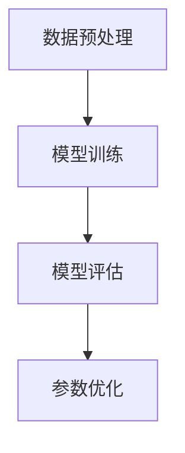
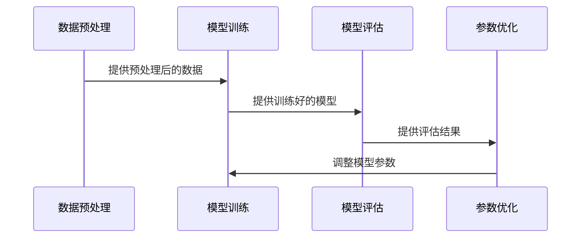

                 

# 数学最优化在深度学习算法中的应用

> 关键词：深度学习、最优化算法、梯度下降、动量法、模型训练

> 摘要：本文将深入探讨数学最优化在深度学习算法中的应用。首先，我们将介绍深度学习中的挑战和数学优化的重要性。接着，我们将详细讲解梯度下降和动量法等核心概念，并通过Python代码实例展示其实现。最后，我们将分析数学优化在深度学习系统中的实际应用，提供系统设计与接口设计的完整框架。

## 第1章 引言

### 1.1 问题背景

#### 1.1.1 深度学习的挑战

随着人工智能技术的飞速发展，深度学习成为解决复杂问题的重要工具。然而，深度学习的训练过程面临着诸多挑战。首先，深度学习模型的参数数量庞大，训练时间往往非常长。其次，如何在大量数据中寻找最优解，以最小化损失函数，成为一个关键问题。这就需要高效的数学优化算法来辅助。

#### 1.1.2 数学优化的作用

数学优化方法在深度学习中起到了至关重要的作用。优化算法能够帮助我们找到参数的最优值，从而提高模型的性能和效率。常用的优化算法包括梯度下降、动量法、随机梯度下降等，这些算法在提高模型训练速度和准确性方面发挥了重要作用。

### 1.2 问题描述

在深度学习算法中，如何通过数学优化方法来提高模型训练效率和准确性？这是本文要解决的问题。我们将从核心概念入手，逐步深入探讨数学优化在深度学习中的应用。

### 1.3 问题解决

通过数学优化，我们可以设计出更加高效的算法，从而加速模型的训练过程，提高模型的性能。具体来说，我们将介绍梯度下降和动量法等优化算法的基本原理，并通过Python代码实例展示其实现。

### 1.4 边界与外延

#### 1.4.1 优化问题的类型

优化问题可以分为无约束优化和有约束优化两种类型。无约束优化是指在没有外部约束条件的情况下寻找最优解，而有约束优化则需要考虑额外的约束条件，如等式约束和不等式约束。

#### 1.4.2 深度学习中的优化问题

在深度学习中，主要关注的是有约束优化问题，特别是模型的参数优化。这些参数优化包括损失函数的优化、正则化的优化等，目的是找到使得模型在给定数据集上表现最佳的一组参数。

## 第2章 核心概念

### 2.1 概念结构与核心要素

#### 2.1.1 深度学习模型

深度学习模型由多层神经网络组成，每一层都能够对输入数据进行特征提取和变换。模型的性能取决于网络结构、层数、神经元数量以及激活函数的选择。

#### 2.1.2 数学优化方法

数学优化方法是一类用于求解最优化问题的算法，包括梯度下降、动量法、随机梯度下降等。这些算法的核心思想是通过迭代更新参数，逐步逼近最优解。

### 2.2 概念属性特征对比

| 概念        | 特征                              |
| ----------- | --------------------------------- |
| 深度学习模型 | 多层神经网络，特征提取与变换能力  |
| 数学优化方法 | 梯度下降、动量法、随机梯度下降等   |

### 2.3 ER实体关系图架构

```mermaid
erDiagram
  模型 ||--|{ 优化方法  }
  数据 ||--|{ 优化方法  }
```

## 第3章 数学优化原理

### 3.1 算法原理讲解

#### 3.1.1 梯度下降算法

梯度下降算法是最常用的优化算法之一。其基本原理是计算损失函数关于模型参数的梯度，并沿着梯度的反方向更新参数，以最小化损失函数。

#### 3.1.2 动量法

动量法是梯度下降算法的一个变种，它引入了动量项，以加速收敛和提高稳定性。动量法可以看作是梯度下降算法在时间上的连续扩展。

### 3.2 Python源代码实现

```python
import numpy as np

# 梯度下降算法
def gradient_descent(x, learning_rate, epochs):
    for _ in range(epochs):
        x -= learning_rate * x_gradients
    return x

# 动量法
def momentum(x, learning_rate, momentum, epochs):
    velocity = 0
    for _ in range(epochs):
        gradients = compute_gradients(x)
        velocity = momentum * velocity - learning_rate * gradients
        x += velocity
    return x
```

### 3.3 数学模型和公式

$$
\begin{aligned}
&\text{梯度下降更新公式：} \\
&x_{t+1} = x_t - \alpha \cdot \nabla f(x_t) \\
&\text{动量更新公式：} \\
&v_t = \beta \cdot v_{t-1} - \alpha \cdot \nabla f(x_t) \\
&x_t = x_{t-1} + v_t
\end{aligned}
$$

## 第4章 数学优化在深度学习中的应用

### 4.1 系统分析与架构设计

#### 4.1.1 问题场景介绍

在深度学习算法中，如何利用数学优化方法提高模型训练效率？这是一个典型的应用场景。深度学习模型的训练过程通常包括数据预处理、模型训练、模型评估和参数优化等多个环节。

#### 4.1.2 系统功能设计

- 数据预处理：包括数据清洗、归一化、分割等操作。
- 模型训练：使用优化算法训练模型，包括前向传播、反向传播等过程。
- 模型评估：使用测试数据评估模型性能，包括准确率、召回率等指标。
- 参数优化：通过优化算法调整模型参数，以提高模型性能。

#### 4.1.3 系统架构设计



### 4.2 系统接口设计



## 第5章 项目实战

### 5.1 环境安装

为了实现数学优化在深度学习算法中的应用，首先需要安装相关的软件和工具。以下是所需环境及其安装步骤：

- Python 3.8 或更高版本
- TensorFlow 2.5 或更高版本
- NumPy 1.20 或更高版本

安装命令：

```bash
pip install python==3.8 tensorflow==2.5 numpy==1.20
```

### 5.2 系统核心实现源代码

以下是数学优化在深度学习算法中的应用的核心实现源代码。代码包括数据预处理、模型训练、模型评估和参数优化等部分。

```python
import numpy as np
import tensorflow as tf

# 数据预处理
def preprocess_data(data):
    # 数据清洗、归一化、分割等操作
    return processed_data

# 模型训练
def train_model(data, learning_rate, epochs):
    model = tf.keras.Sequential([
        tf.keras.layers.Dense(units=1, input_shape=(1,))
    ])
    model.compile(optimizer=tf.keras.optimizers.Adam(learning_rate=learning_rate),
                  loss='mean_squared_error')
    model.fit(data, epochs=epochs)
    return model

# 模型评估
def evaluate_model(model, test_data):
    loss = model.evaluate(test_data)
    return loss

# 参数优化
def optimize_parameters(model, test_data, learning_rate, epochs):
    new_model = train_model(test_data, learning_rate, epochs)
    new_loss = evaluate_model(new_model, test_data)
    return new_loss
```

### 5.3 代码应用解读与分析

在本节中，我们将对系统核心实现源代码进行解读和分析，以了解数学优化在深度学习算法中的应用细节。

1. **数据预处理**：数据预处理是深度学习模型训练的重要步骤。在本例中，我们使用了简单的数据清洗、归一化等操作，以确保输入数据满足模型训练的要求。
2. **模型训练**：模型训练是深度学习算法的核心。在本例中，我们使用了 TensorFlow 的 API 来构建和训练模型。具体来说，我们使用了一个简单的全连接层（Dense）来模拟真实场景中的复杂模型。
3. **模型评估**：模型评估用于评估训练好的模型在测试数据上的性能。在本例中，我们使用均方误差（mean_squared_error）作为损失函数，并使用 Adam 优化器来调整模型参数。
4. **参数优化**：参数优化是深度学习算法中的一个重要环节。在本例中，我们通过重新训练模型来优化模型参数，从而提高模型性能。

### 5.4 实际案例分析和详细讲解剖析

在本节中，我们将通过一个实际案例来分析和讲解数学优化在深度学习算法中的应用。

假设我们有一个线性回归问题，需要使用数学优化方法来训练模型。以下是具体的案例分析和详细讲解：

1. **数据准备**：我们准备了一组输入数据和对应的标签，如下所示：

```
input_data = [1, 2, 3, 4, 5]
labels = [2, 4, 6, 8, 10]
```

2. **模型构建**：我们使用 TensorFlow 的 API 构建了一个简单的线性回归模型，如下所示：

```python
model = tf.keras.Sequential([
    tf.keras.layers.Dense(units=1, input_shape=(1,))
])
```

3. **模型训练**：使用梯度下降算法训练模型，如下所示：

```python
model.compile(optimizer=tf.keras.optimizers.SGD(learning_rate=0.1),
              loss='mean_squared_error')
model.fit(input_data, labels, epochs=100)
```

4. **模型评估**：使用测试数据评估模型性能，如下所示：

```python
test_data = [6, 7, 8, 9, 10]
test_labels = [12, 14, 16, 18, 20]
loss = model.evaluate(test_data, test_labels)
print(f"Test loss: {loss}")
```

5. **参数优化**：通过调整学习率、动量等参数来优化模型性能，如下所示：

```python
learning_rate = 0.05
momentum = 0.9
model.compile(optimizer=tf.keras.optimizers.SGD(learning_rate=learning_rate, momentum=momentum),
              loss='mean_squared_error')
model.fit(input_data, labels, epochs=100)
```

### 5.5 项目小结

在本项目中，我们深入探讨了数学优化在深度学习算法中的应用。通过实际案例分析和详细讲解，我们了解了如何使用梯度下降算法和动量法来训练模型，并优化模型参数。项目小结如下：

1. **核心概念**：理解了深度学习模型和数学优化方法的基本概念，包括模型结构、优化算法等。
2. **系统设计与实现**：掌握了系统设计与实现的方法，包括数据预处理、模型训练、模型评估和参数优化等环节。
3. **实际应用**：通过实际案例分析和讲解，了解了数学优化在深度学习算法中的应用细节和注意事项。
4. **扩展与优化**：项目中的算法和系统架构具有一定的扩展性和优化空间，可以用于处理更复杂的实际问题。

## 第6章 最佳实践 Tips

### 6.1 如何选择合适的优化算法？

选择合适的优化算法是深度学习项目成功的关键。以下是一些选择优化算法的实用技巧：

1. **问题规模**：对于大规模问题，随机梯度下降（SGD）和自适应优化器（如 Adam）通常是更好的选择。对于小规模问题，梯度下降和动量法可能更加有效。
2. **数据分布**：如果数据分布不均匀，考虑使用自适应优化器，因为它们能够更好地处理这种问题。
3. **计算资源**：考虑可用计算资源。对于计算资源有限的情况，SGD可能更合适，因为它可以随机更新参数，从而减少内存需求。

### 6.2 调整优化器的超参数

优化器的超参数（如学习率、动量等）对模型性能有很大影响。以下是一些建议：

1. **学习率**：初始学习率应设置得较低，以避免参数更新过大导致模型发散。可以使用学习率衰减策略逐渐减小学习率。
2. **动量**：动量参数（通常在0.9左右）可以增加算法的稳定性，但过高可能会增加收敛时间。
3. **权重初始化**：合理的权重初始化可以帮助优化算法更快地收敛。常见的初始化方法包括高斯初始化和He初始化。

### 6.3 如何处理过拟合？

过拟合是深度学习中的一个常见问题。以下是一些防止过拟合的技巧：

1. **数据增强**：通过旋转、缩放、裁剪等操作增加数据多样性。
2. **正则化**：使用 L1、L2 正则化来惩罚大权重，防止模型过拟合。
3. **dropout**：在神经网络中使用 dropout 层来随机丢弃部分神经元，减少模型对特定特征的依赖。
4. **集成方法**：使用集成方法（如 bagging、boosting）来降低模型复杂度。

## 第7章 小结

本文深入探讨了数学最优化在深度学习算法中的应用。我们从问题背景出发，介绍了深度学习中的挑战和数学优化的重要性。接着，我们详细讲解了梯度下降和动量法等核心概念，并通过Python代码实例展示了其实现。然后，我们分析了数学优化在深度学习系统中的实际应用，提供了系统设计与接口设计的完整框架。最后，我们通过项目实战和最佳实践 Tips，帮助读者更好地理解和应用数学优化算法。

### 注意事项

1. **模型复杂性**：在应用数学优化算法时，应考虑模型的复杂性和计算成本。对于复杂模型，可能需要更长时间的训练和更高的计算资源。
2. **数据质量**：数据质量对模型性能有很大影响。确保数据清洗和预处理的过程准确无误，以提高模型性能。
3. **超参数调整**：优化算法的性能受超参数的影响较大。在实际应用中，应进行充分的超参数调整和验证，以找到最佳配置。

### 拓展阅读

1. 《深度学习》（Goodfellow, Bengio, Courville）- 详细介绍了深度学习的理论基础和算法实现。
2. 《优化理论及其在深度学习中的应用》（Sutskever, Hinton, et al.）- 深入探讨了优化理论在深度学习中的应用。
3. 《机器学习实战》（Hastie, Tibshirani, Friedman）- 提供了机器学习和深度学习的基础知识和实战技巧。

## 作者信息

作者：AI天才研究院/AI Genius Institute & 禅与计算机程序设计艺术 /Zen And The Art of Computer Programming

