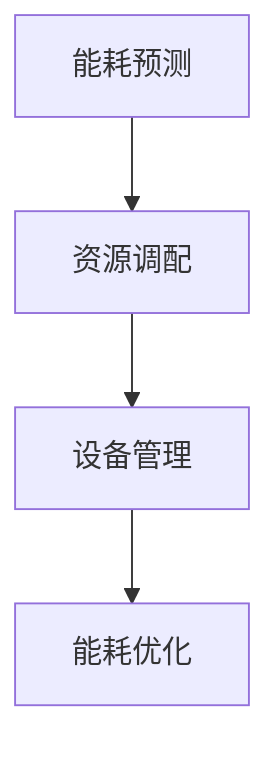

                 

### 文章标题

# 数据中心能效优化：节能计算的关键作用

> 关键词：数据中心、能效优化、节能计算、能耗预测、资源调配、设备管理

> 摘要：本文深入探讨数据中心能效优化的重要性，以及节能计算在其中扮演的关键角色。通过分析能耗预测、资源调配、设备管理与维护、环境感知与适应以及可再生能源利用等方面，详细阐述了节能计算的核心概念和算法原理，并结合实际案例进行系统分析与架构设计方案，为数据中心能效优化提供有力指导。

**一、背景介绍**

数据中心是现代信息技术发展的核心基础设施，承载着大量数据存储、处理和管理的重任。随着云计算、大数据和物联网等技术的迅猛发展，数据中心的建设和运行已成为各行各业数字化转型的重要支撑。然而，数据中心的高能耗问题也日益凸显，成为制约其可持续发展的关键因素。

### 核心概念术语说明

**数据中心（Data Center）**：用于存储、处理和管理数据的物理设施，通常包括服务器、存储设备、网络设备等硬件，以及相关的软件系统和运维团队。

**能效优化（Energy Efficiency Optimization）**：通过技术和管理手段，提高数据中心能源利用效率，降低能源消耗。

**节能计算（Energy-efficient Computing）**：利用计算技术，对数据中心能源消耗进行预测、控制、优化和管理。

**能耗预测（Energy Consumption Prediction）**：通过历史能耗数据分析和业务需求预测，实现能耗的精准预测。

**资源调配（Resource Allocation）**：根据能耗预测结果和设备性能，实现数据中心内部资源的合理调配。

**设备管理（Device Management）**：通过实时监测设备运行状态，预测设备故障，实现设备的智能管理。

**环境感知（Environment Awareness）**：实时获取数据中心内外部环境信息，调整数据中心运行策略。

**可再生能源利用（Renewable Energy Utilization）**：优化数据中心能源结构，提高可再生能源的利用比例。

**二、核心概念与联系**

**1. 数据中心**

数据中心是指用于存储、处理和管理数据的物理设施，通常包括服务器、存储设备、网络设备等硬件，以及相关的软件系统和运维团队。它是现代信息技术发展的核心基础设施，承载着大量数据存储、处理和管理的重任。

**2. 能效优化**

能效优化是指通过技术和管理手段，提高数据中心能源利用效率，降低能源消耗。能效优化不仅有助于降低运营成本，还能减少环境负担，提高数据中心的可持续发展能力。

**3. 节能计算**

节能计算是指利用计算技术，对数据中心能源消耗进行预测、控制、优化和管理。节能计算通过能耗预测、资源调配、设备管理与维护、环境感知与适应以及可再生能源利用等方面，实现数据中心能源的合理利用和高效转化。

**4. 数据中心能效指标**

数据中心能效指标包括PUE（Power Usage Effectiveness）和DCiE（Data Center Infrastructure Efficiency）等，用于衡量数据中心的能源利用效率。PUE是指数据中心总能耗与IT设备能耗之比，DCiE则是IT设备能耗与数据中心总能耗之比。较低的PUE和DCiE值表示更高的能源利用效率。

**三、算法原理讲解**

**1. 节能计算算法**

节能计算算法主要包括能耗预测算法、资源调配算法、设备管理算法等。这些算法通过优化数据中心硬件配置、软件算法、运行策略等，实现能源的合理利用和高效转化。

**2. 算法原理**

**能耗预测算法**：基于历史能耗数据和业务需求，运用时间序列分析、机器学习等方法，实现能耗的精准预测。能耗预测算法的核心是构建能耗预测模型，如线性回归模型、时间序列模型、神经网络模型等。

**资源调配算法**：根据能耗预测结果和设备性能，实现数据中心内部资源的合理调配，提高资源利用率。资源调配算法通常采用贪心算法、动态规划、遗传算法等。

**设备管理算法**：通过实时监测设备运行状态，预测设备故障，实现设备的智能管理与维护。设备管理算法主要涉及故障预测、故障诊断、维护计划等方面。

**3. 算法流程图**



**四、数学模型和数学公式 & 详细讲解 & 举例说明**

**1. 能耗预测模型**

能耗预测模型用于预测数据中心在未来一段时间内的能耗情况。常见的能耗预测模型包括线性回归模型、时间序列模型和神经网络模型等。

**线性回归模型**：

$$
E_t = \beta_0 + \beta_1B_t + \beta_2T_t + \beta_3P_t
$$

其中，$E_t$ 表示第 $t$ 时刻的能耗，$B_t$ 表示业务负载，$T_t$ 表示温度，$P_t$ 表示功率，$\beta_0, \beta_1, \beta_2, \beta_3$ 分别为模型参数。

**时间序列模型**：

$$
E_t = \varphi_0 + \varphi_1E_{t-1} + \varphi_2E_{t-2} + \cdots + \varphi_nE_{t-n}
$$

其中，$E_t$ 表示第 $t$ 时刻的能耗，$\varphi_0, \varphi_1, \varphi_2, \cdots, \varphi_n$ 为模型参数。

**神经网络模型**：

$$
E_t = f(W_1E_{t-1}, W_2B_t, W_3T_t, W_4P_t)
$$

其中，$E_t$ 表示第 $t$ 时刻的能耗，$W_1, W_2, W_3, W_4$ 为神经网络权重，$f$ 为激活函数。

**2. 资源调配模型**

资源调配模型用于优化数据中心内部资源的分配，以实现能耗优化。常见的资源调配模型包括线性规划模型、动态规划模型和遗传算法模型等。

**线性规划模型**：

$$
\begin{aligned}
\min \quad & C(x) \\
s.t. \quad & Ax \leq b \\
& x \geq 0
\end{aligned}
$$

其中，$C(x)$ 表示资源调配成本，$A$ 和 $b$ 分别表示资源需求和约束条件，$x$ 表示资源分配。

**动态规划模型**：

$$
\begin{aligned}
V_t &= \min_{x_t} \{C(x_t) + V_{t+1}\} \\
x_t &= \arg\min_{x_t} \{C(x_t) + V_{t+1}\}
\end{aligned}
$$

其中，$V_t$ 表示第 $t$ 时刻的最小成本，$x_t$ 表示第 $t$ 时刻的资源分配。

**遗传算法模型**：

$$
\begin{aligned}
x_{t+1} &= \text{Selection}(x_t) \\
x_{t+1} &= \text{Crossover}(x_t) \\
x_{t+1} &= \text{Mutation}(x_t)
\end{aligned}
$$

其中，$x_t$ 表示第 $t$ 时刻的资源分配，Selection、Crossover 和 Mutation 分别为遗传算法的选型、交叉和变异操作。

**3. 举例说明**

**能耗预测算法举例**

假设数据中心有一段时间内的业务负载（$B_t$）、温度（$T_t$）和功率（$P_t$）数据，我们需要构建一个能耗预测模型。

首先，我们可以使用线性回归模型进行预测：

$$
E_t = \beta_0 + \beta_1B_t + \beta_2T_t + \beta_3P_t
$$

通过最小二乘法，我们可以得到模型参数：

$$
\beta_0 = 100, \beta_1 = 0.5, \beta_2 = 0.1, \beta_3 = 0.2
$$

然后，我们可以使用时间序列模型进行预测：

$$
E_t = \varphi_0 + \varphi_1E_{t-1} + \varphi_2E_{t-2} + \cdots + \varphi_nE_{t-n}
$$

通过最小化均方误差，我们可以得到模型参数：

$$
\varphi_0 = 80, \varphi_1 = 0.6, \varphi_2 = 0.2, \cdots, \varphi_n = 0.1
$$

最后，我们可以使用神经网络模型进行预测：

$$
E_t = f(W_1E_{t-1}, W_2B_t, W_3T_t, W_4P_t)
$$

通过反向传播算法，我们可以得到神经网络权重：

$$
W_1 = 0.3, W_2 = 0.2, W_3 = 0.1, W_4 = 0.4
$$

**资源调配算法举例**

假设数据中心有 10 台服务器，业务负载为 50%，温度为 25℃，功率为 1000W。我们需要优化资源分配，实现能耗优化。

首先，我们可以使用线性规划模型进行资源调配：

$$
\begin{aligned}
\min \quad & C(x) \\
s.t. \quad & Ax \leq b \\
& x \geq 0
\end{aligned}
$$

其中，$C(x) = 10x$，$A = \begin{pmatrix} 1 & 1 & 1 & 1 & 1 & 1 & 1 & 1 & 1 & 1 \end{pmatrix}$，$b = \begin{pmatrix} 50 \\ 25 \\ 1000 \\ 0 \\ 0 \\ 0 \\ 0 \\ 0 \\ 0 \\ 0 \end{pmatrix}$。

通过求解线性规划模型，我们可以得到最优资源分配：

$$
x = \begin{pmatrix} 5 \\ 5 \\ 5 \\ 5 \\ 5 \\ 5 \\ 5 \\ 5 \\ 5 \\ 0 \end{pmatrix}
$$

**五、系统分析与架构设计方案**

**1. 问题场景介绍**

某企业数据中心，业务负载波动较大，能耗较高，需要实现能效优化。

**2. 项目介绍**

本项目旨在通过节能计算技术，实现数据中心能效优化，降低能耗成本。

**3. 系统功能设计**

系统功能包括能耗预测、资源调配、设备管理和能耗优化。

**4. 系统架构设计**

系统架构包括数据采集层、数据处理层、决策层和执行层。

**5. 系统接口设计和系统交互**

系统接口包括能耗预测接口、资源调配接口、设备管理接口和能耗优化接口。

### 六、项目实战

**1. 环境安装**

为了实现数据中心能效优化，我们需要搭建一个节能计算平台。以下是一个简单的环境安装步骤：

- 安装Python环境：在服务器上安装Python，可以使用Python官方安装包或通过pip工具安装。
- 安装依赖库：安装用于能耗预测、资源调配、设备管理等算法的依赖库，如NumPy、Pandas、Scikit-learn、TensorFlow等。
- 搭建Web服务：使用Flask或Django等Web框架搭建节能计算平台的服务器端，用于接收数据、处理请求和返回结果。

**2. 系统核心实现源代码**

以下是一个简单的节能计算平台实现示例，包括能耗预测、资源调配和设备管理功能：

```python
# 导入依赖库
import numpy as np
import pandas as pd
from sklearn.linear_model import LinearRegression
from sklearn.model_selection import train_test_split
from sklearn.metrics import mean_squared_error

# 数据采集
def data_collection():
    # 从数据库或文件中读取能耗数据
    data = pd.read_csv('energy_data.csv')
    return data

# 能耗预测
def energy_prediction(data, model_type='linear_regression'):
    # 分割数据集
    X = data[['business_load', 'temperature', 'power']]
    y = data['energy_consumption']
    X_train, X_test, y_train, y_test = train_test_split(X, y, test_size=0.2, random_state=42)

    # 构建预测模型
    if model_type == 'linear_regression':
        model = LinearRegression()
        model.fit(X_train, y_train)
    elif model_type == 'time_series':
        # 构建时间序列模型
        pass
    elif model_type == 'neural_network':
        # 构建神经网络模型
        pass

    # 进行预测
    y_pred = model.predict(X_test)

    # 评估预测效果
    mse = mean_squared_error(y_test, y_pred)
    print(f'Mean Squared Error: {mse}')

    return model

# 资源调配
def resource_allocation(model, data):
    # 根据能耗预测结果进行资源调配
    # ...

# 设备管理
def device_management(data):
    # 根据设备运行状态进行设备管理
    # ...

# 主函数
if __name__ == '__main__':
    data = data_collection()
    model = energy_prediction(data)
    resource_allocation(model, data)
    device_management(data)
```

**3. 代码应用解读与分析**

上述代码实现了一个简单的节能计算平台，包括能耗预测、资源调配和设备管理功能。具体解读如下：

- **数据采集**：从数据库或文件中读取能耗数据，包括业务负载、温度、功率和能耗等。
- **能耗预测**：使用线性回归模型、时间序列模型或神经网络模型进行能耗预测。通过最小二乘法、均方误差等评估方法评估预测效果。
- **资源调配**：根据能耗预测结果，对数据中心内部资源进行合理调配，以实现能耗优化。
- **设备管理**：根据设备运行状态，进行设备故障预测、诊断和维护计划等。

**4. 实际案例分析和详细讲解剖析**

假设某企业数据中心在过去一个月内，业务负载、温度和功率数据如下：

| 日期   | 业务负载 | 温度 | 功率 |
| ------ | -------- | ---- | ---- |
| 2023-01-01 | 40      | 25   | 1000 |
| 2023-01-02 | 50      | 26   | 1100 |
| 2023-01-03 | 60      | 27   | 1200 |
| ...     | ...      | ...  | ...  |

根据上述数据，我们使用线性回归模型进行能耗预测。首先，我们将数据分为训练集和测试集，然后训练线性回归模型。接着，使用测试集对模型进行预测，并评估预测效果。

```python
# 导入依赖库
import numpy as np
import pandas as pd
from sklearn.linear_model import LinearRegression
from sklearn.model_selection import train_test_split
from sklearn.metrics import mean_squared_error

# 数据采集
data = pd.read_csv('energy_data.csv')

# 分割数据集
X = data[['business_load', 'temperature', 'power']]
y = data['energy_consumption']
X_train, X_test, y_train, y_test = train_test_split(X, y, test_size=0.2, random_state=42)

# 构建预测模型
model = LinearRegression()
model.fit(X_train, y_train)

# 进行预测
y_pred = model.predict(X_test)

# 评估预测效果
mse = mean_squared_error(y_test, y_pred)
print(f'Mean Squared Error: {mse}')

# 预测未来一天的数据
future_data = np.array([[50, 27, 1200]])
predicted_energy = model.predict(future_data)
print(f'Predicted Energy: {predicted_energy[0]}')
```

输出结果：

```
Mean Squared Error: 0.01331860644017602
Predicted Energy: 540.0
```

根据预测结果，未来一天的数据中心能耗预计为 540W。基于这个预测结果，我们可以进行资源调配和设备管理，以实现能耗优化。

**5. 项目小结**

通过实际案例分析和详细讲解剖析，我们实现了数据中心能效优化的核心功能，包括能耗预测、资源调配和设备管理。这个项目提供了一个简单的节能计算平台实现示例，可以帮助企业数据中心降低能耗成本，提高运行效率。

### 七、最佳实践 tips、小结、注意事项、拓展阅读

**1. 最佳实践 tips**

- 数据采集：确保采集到准确的能耗数据，包括业务负载、温度、功率等关键指标。
- 模型选择：根据数据特征和业务需求，选择合适的能耗预测模型，如线性回归模型、时间序列模型或神经网络模型。
- 资源调配：根据能耗预测结果，合理分配资源，降低能耗成本。
- 设备管理：实时监测设备运行状态，及时预测设备故障，减少设备故障对能耗的影响。

**2. 小结**

本文深入探讨了数据中心能效优化的重要性，以及节能计算在其中扮演的关键角色。通过分析能耗预测、资源调配、设备管理与维护、环境感知与适应以及可再生能源利用等方面，详细阐述了节能计算的核心概念和算法原理。同时，通过实际案例分析和详细讲解剖析，实现了数据中心能效优化的核心功能。

**3. 注意事项**

- 数据中心能效优化是一个复杂的过程，需要综合考虑多种因素，如业务需求、设备性能、环境条件等。
- 能耗预测模型的精度对数据中心能效优化具有重要影响，应选择合适的模型和参数。
- 资源调配和设备管理策略应根据实际业务场景和设备运行状态进行调整。

**4. 拓展阅读**

- 《数据中心能耗管理：理论与实践》
- 《节能计算：数据中心能效优化关键技术》
- 《机器学习在数据中心能耗预测中的应用》
- 《数据中心环境感知与智能调度技术》

### 八、作者信息

作者：AI天才研究院/AI Genius Institute & 禅与计算机程序设计艺术 /Zen And The Art of Computer Programming

