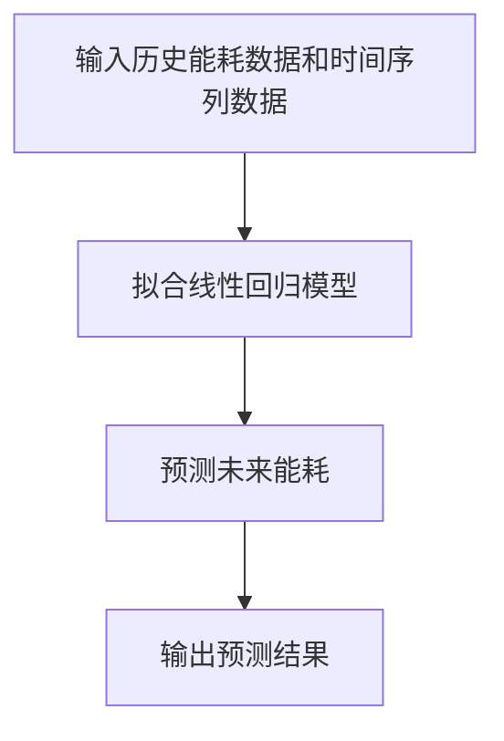
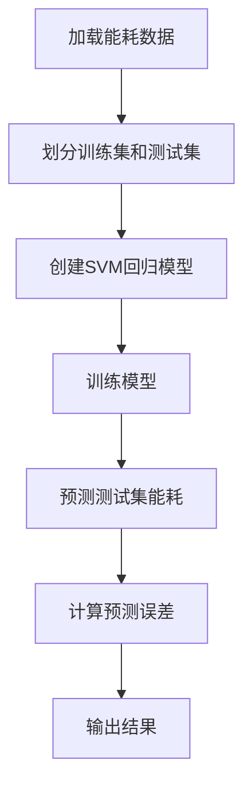
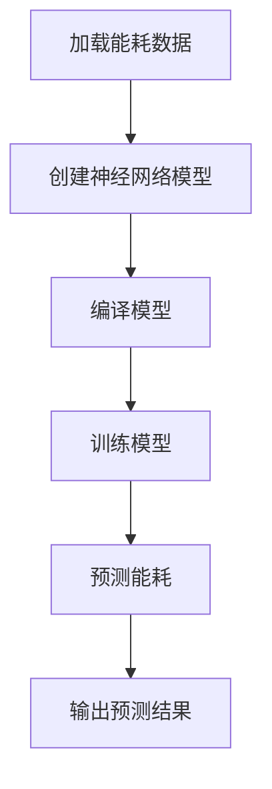
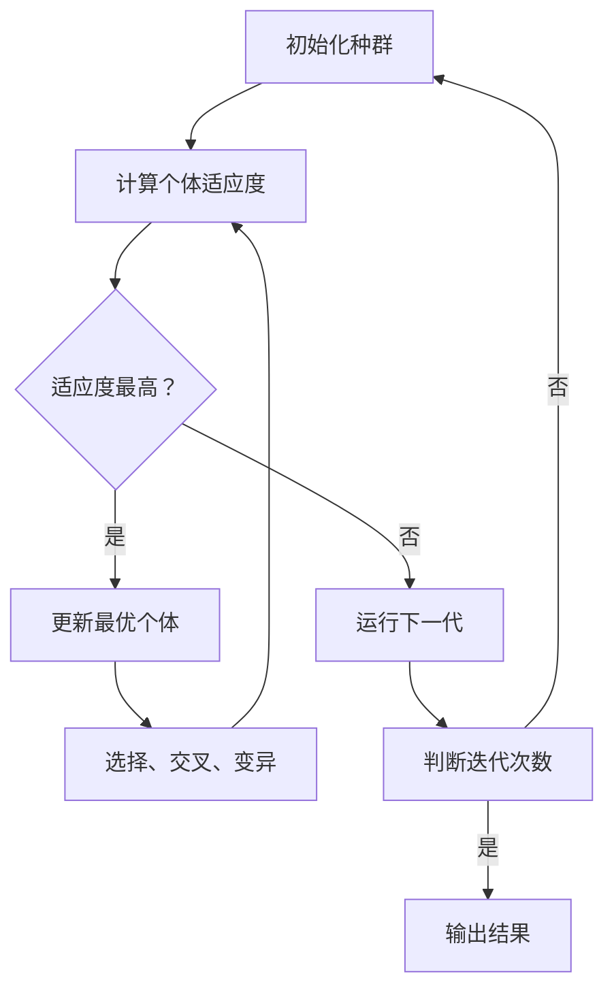
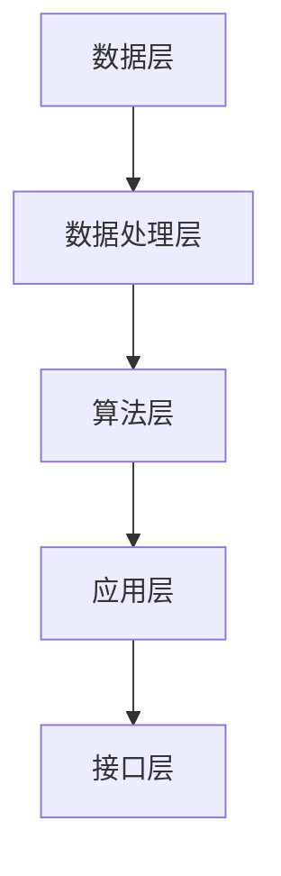
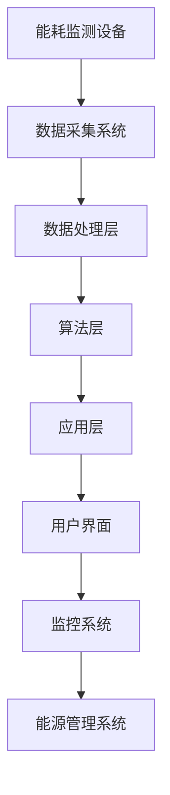
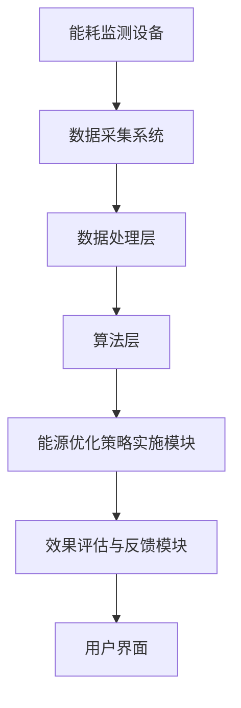

                 


### 第1章：数据中心能源效率提升的背景与核心问题

#### 1.1 问题背景

随着互联网、云计算、大数据等技术的快速发展，数据中心作为现代信息社会的“中枢神经”越来越受到重视。数据中心是集中处理、存储和管理数据的物理设施，它们不仅支持各种商业应用，还为科学研究、社会服务提供了强有力的计算和数据支持。然而，数据中心的快速发展也带来了显著的能源消耗问题。

**1.1.1 数据中心的定义与作用**

数据中心（Data Center）是指用于集中存储、处理和管理数据的专用设施。它们通常配备高性能计算机、网络设备、存储设备和其他相关硬件和软件，以满足大规模数据处理和存储需求。

数据中心的作用主要体现在以下几个方面：

1. **数据处理和存储**：数据中心能够存储大量数据，并支持数据的快速检索和处理，这是许多企业、组织以及公共服务运行的基础。
2. **业务连续性**：数据中心提供了高可用性和灾难恢复能力，确保关键业务系统在任何时候都能够正常运行。
3. **资源整合**：数据中心通过集中管理和资源共享，提高了资源利用率和运营效率。

**1.1.2 数据中心的发展趋势**

数据中心的发展趋势体现在以下几个方面：

1. **云计算的普及**：随着云计算的兴起，越来越多的企业选择将IT资源转移到云端，这推动了数据中心的虚拟化和分布式部署。
2. **数据中心规模的扩大**：为了满足不断增长的数据处理需求，数据中心的建设规模不断扩大，越来越多的超大规模数据中心在全球范围内涌现。
3. **绿色数据中心的兴起**：随着环境保护意识的增强，数据中心行业开始注重能源效率的提升，绿色数据中心成为行业的发展方向。

**1.1.3 数据中心能源消耗的现状与问题**

数据中心是能源消耗大户，其能源消耗主要包括以下几个方面：

1. **硬件设备能耗**：包括服务器、存储设备、网络设备等硬件设备的运行消耗。
2. **制冷能耗**：为了保证服务器等设备的正常运行，数据中心需要大量的制冷设备进行散热。
3. **辅助设施能耗**：包括UPS（不间断电源）、空调、照明等辅助设施的运行能耗。

数据中心能源消耗的主要问题体现在：

1. **能源效率低**：数据中心的能源效率普遍较低，大量的能源被浪费。
2. **碳排放问题**：数据中心的大量能源消耗导致了大量的碳排放，对环境造成了负面影响。

**1.1.4 能源效率提升的意义**

数据中心能源效率的提升具有重要意义：

1. **节能减排**：通过提高能源效率，可以显著减少能源消耗和碳排放，符合全球节能减排的趋势。
2. **经济效益**：提高能源效率可以降低能源成本，提高数据中心的运营效益。
3. **社会责任**：作为重要的信息基础设施，数据中心在提高能源效率方面承担着重要的社会责任。

#### 1.2 问题描述

数据中心能源效率低下的问题主要体现在以下几个方面：

1. **硬件设备的能耗**：硬件设备的能耗是数据中心能源消耗的主要部分，其中服务器和存储设备的能耗尤为突出。随着数据量的增加和硬件性能的提升，能耗问题日益严重。
2. **网络传输的能耗**：数据在网络传输过程中也会产生能耗，特别是在高速数据交换中心，网络设备的能耗不可忽视。
3. **数据处理的能耗**：数据处理的能耗包括数据存储、检索、计算等环节，其中一些复杂的计算任务能耗巨大。

数据中心能源效率低下的问题不仅影响了数据中心的运营成本，还对环境造成了严重的影响。因此，提升数据中心能源效率已成为数据中心建设和运营的重要任务。

**1.2.1 数据中心能源效率低下的原因**

数据中心能源效率低下的原因可以归纳为以下几个方面：

1. **硬件设备能耗高**：现有的硬件设备在性能提升的同时，能耗也在增加。一些老旧设备能效低，升级改造困难，导致整体能耗居高不下。
2. **制冷系统效率低**：数据中心的制冷系统是能耗大户，但许多数据中心的制冷系统设计不合理，导致制冷效率低下。
3. **能源管理不善**：许多数据中心的能源管理措施不到位，缺乏科学的能源监控和调度系统，导致能源浪费现象严重。
4. **基础设施不完善**：一些数据中心的基础设施建设不完善，如供电系统不稳定、网络传输效率低下等，也影响了能源效率。

**1.2.2 数据中心能源效率低下的影响**

数据中心能源效率低下对多方面产生了不利影响：

1. **环境问题**：数据中心的高能耗导致了大量的碳排放，对环境造成了负面影响。同时，制冷系统产生的噪音和热量也对周边环境造成了污染。
2. **经济问题**：低能源效率导致数据中心的运营成本增加，影响企业的盈利能力。长期来看，这可能导致企业在市场竞争中处于不利地位。
3. **安全问题**：能源消耗增加也带来了供电不稳定和设备过热等安全隐患，可能对数据中心的业务连续性和数据安全构成威胁。

**1.2.3 能源效率提升的必要性**

提升数据中心能源效率的必要性体现在以下几个方面：

1. **响应环保要求**：随着全球环保意识的提高，数据中心作为高能耗行业，有责任采取措施降低碳排放，响应全球环保要求。
2. **提升竞争力**：高能源效率可以降低运营成本，提高企业的盈利能力，增强市场竞争力。
3. **保障业务连续性**：提高能源效率可以减少能源消耗，降低设备过热和供电不稳定等安全风险，保障数据中心的业务连续性。

#### 1.3 问题解决方法

针对数据中心能源效率低下的问题，可以从以下几个方面进行解决：

1. **硬件优化**：通过升级硬件设备，采用更高效的硬件配置，降低能耗。同时，淘汰老旧设备，减少能耗。
2. **软件优化**：通过优化数据中心的管理软件，提高能源管理效率和设备运行效率。
3. **系统集成优化**：通过集成优化数据中心各个系统，提高整体能源效率，减少能源浪费。
4. **智能优化算法**：利用人工智能和大数据分析技术，对数据中心进行智能优化，实现能耗的最优化管理。
5. **大数据与云计算技术**：通过大数据分析和云计算技术，实现数据中心的分布式部署和高效管理，降低能耗。
6. **新型材料应用**：采用新型材料，如高效散热材料、节能半导体等，提高设备的能效。

**1.3.1 传统方法**

传统的数据中心能源效率提升方法主要包括：

1. **硬件优化**：通过更换高效硬件设备、采用节能服务器等，降低能耗。
2. **软件优化**：通过优化操作系统、数据库等软件，提高设备运行效率。
3. **系统集成优化**：通过整合不同系统，提高资源利用率，减少能源浪费。

**1.3.2 新方法概述**

新兴的数据中心能源效率提升方法主要包括：

1. **智能优化算法**：利用人工智能和机器学习算法，对数据中心进行能耗预测和优化管理。
2. **大数据与云计算技术**：通过大数据分析和云计算技术，实现数据中心的智能化管理和优化。
3. **新型材料应用**：采用新型材料，如高效散热材料、节能半导体等，提高设备的能效。

#### 1.4 边界与外延

**1.4.1 数据中心能源效率的提升范围**

数据中心能源效率的提升范围主要包括以下几个方面：

1. **硬件设备能效**：通过硬件升级、优化配置等，提高设备的能效。
2. **制冷系统能效**：通过优化制冷系统设计、采用节能制冷技术等，提高制冷效率。
3. **辅助系统能效**：通过优化UPS、照明等辅助系统的运行效率，降低能耗。
4. **能源管理**：通过智能化能源管理系统，实现能耗的实时监控和优化调度。

**1.4.2 能源效率提升的目标与衡量标准**

数据中心能源效率提升的目标主要包括：

1. **降低能源消耗**：通过技术手段和管理措施，降低数据中心的整体能源消耗。
2. **提高设备运行效率**：通过优化硬件和软件，提高设备的运行效率。
3. **降低碳排放**：通过减少能源消耗，降低数据中心的碳排放量。

衡量数据中心能源效率提升的标准主要包括：

1. **PUE（Power Usage Effectiveness）**：PUE是数据中心能源效率的一个重要指标，表示总能耗与IT设备能耗的比值。PUE越低，能源效率越高。
2. **DCeEP（Data Center Energy Productivity）**：DCeEP是数据中心能源生产率，表示单位能源消耗所产生的经济效益。DCeEP越高，能源效率越高。
3. **能源利用率**：能源利用率是数据中心实际使用的能源与总消耗能源的比值，反映了能源利用的效率。

**1.4.3 相关领域的外延拓展**

数据中心能源效率的提升不仅涉及数据中心内部的技术和管理，还与其他领域密切相关：

1. **数据中心基础设施的发展趋势**：数据中心基础设施的不断发展，如新型建筑材料、高效制冷技术等，为提升能源效率提供了技术支持。
2. **能源政策与产业协同**：国家和地区的能源政策、产业协同对于数据中心能源效率的提升具有重要影响。通过政策引导和产业合作，可以推动数据中心能源效率的持续提升。

**1.4.4 核心概念与要素组成**

数据中心能源效率的核心概念和要素组成包括：

1. **能源消耗**：数据中心的能源消耗包括硬件设备能耗、制冷能耗、辅助设施能耗等。
2. **能源效率**：数据中心的能源效率是指单位能源消耗所产生的数据处理能力和经济效益。
3. **能源管理**：能源管理包括能源监控、能源调度、能耗分析等，是实现数据中心能源效率提升的关键。
4. **硬件设备**：数据中心的硬件设备包括服务器、存储设备、网络设备等，是能源消耗的主要来源。
5. **制冷系统**：制冷系统是数据中心能耗的重要部分，其效率直接影响到数据中心的能源效率。
6. **辅助系统**：辅助系统包括UPS、空调、照明等，对于数据中心的能源效率也有重要影响。

通过上述分析，我们可以对数据中心能源效率提升的背景、核心问题和解决方法有一个全面的了解。在接下来的章节中，我们将深入探讨数据中心能源效率提升的相关核心概念、算法原理、数学模型、系统架构和实际应用，为读者提供一份全面的技术指南。

### 1.5 核心概念与要素组成

#### 1.5.1 数据中心能源效率

**定义**：数据中心能源效率（Data Center Energy Efficiency）是指数据中心在提供数据处理服务的过程中，消耗的能源与实际处理数据量之间的比值。它反映了数据中心在能源利用方面的效率。

**属性特征**：

- **能效指标**：能效指标通常用PUE（Power Usage Effectiveness）来衡量，PUE = 数据中心总能耗 / IT设备能耗。PUE越低，表示能源效率越高。
- **能耗构成**：数据中心的能耗主要包括硬件设备能耗、制冷能耗、辅助设施能耗等。
- **动态变化性**：数据中心的能耗受多种因素影响，如设备负载、环境温度、系统配置等，因此能源效率具有动态变化性。

**测量方法**：数据中心的能源效率可以通过以下方法进行测量：

- **能耗监测**：通过安装能耗监测设备，实时监测数据中心的能耗情况。
- **能耗统计**：通过对能耗数据进行统计和分析，计算数据中心的能源效率指标。
- **模拟与优化**：利用模拟和优化技术，对数据中心的能源效率进行预测和优化。

#### 1.5.2 能源消耗

**类型**：数据中心的能源消耗主要包括以下几种类型：

- **硬件设备能耗**：包括服务器、存储设备、网络设备等硬件设备的运行能耗。
- **制冷能耗**：用于维持数据中心环境温度的制冷设备能耗。
- **辅助设施能耗**：包括UPS（不间断电源）、照明、空调等辅助设施的运行能耗。

**影响因素**：影响数据中心能源消耗的主要因素包括：

- **设备负载**：设备负载越大，能耗越高。
- **环境温度**：环境温度越高，制冷能耗越高。
- **系统配置**：系统配置越高，能耗越高。
- **能源管理水平**：能源管理水平越高，能耗越低。

**减少方法**：为了降低数据中心的能源消耗，可以采取以下措施：

- **硬件升级**：采用高效硬件设备，降低能耗。
- **节能技术**：采用节能制冷技术、高效散热技术等。
- **能源管理**：加强能源管理，优化能源调度和使用。

#### 1.5.3 能源效率提升技术

**现有技术**：当前提升数据中心能源效率的主要技术包括：

- **硬件优化**：采用高效硬件设备，优化设备配置。
- **软件优化**：优化操作系统、数据库等软件，提高设备运行效率。
- **系统集成优化**：通过整合不同系统，提高资源利用率和整体效率。

**新兴技术**：新兴技术包括：

- **智能优化算法**：利用人工智能和机器学习算法，实现能耗预测和优化管理。
- **大数据与云计算技术**：通过大数据分析和云计算技术，实现智能化管理和优化。
- **新型材料应用**：采用新型材料，如高效散热材料、节能半导体等，提高设备的能效。

### 1.6 本章小结

本章介绍了数据中心能源效率提升的背景、核心问题及解决方法。通过分析数据中心能源效率的定义、特性、测量方法和影响因素，我们了解了数据中心能源效率提升的重要性。同时，本章还介绍了现有和新兴的能源效率提升技术，为后续章节的内容奠定了基础。在接下来的章节中，我们将进一步探讨数据中心能源效率提升的相关核心概念、算法原理和实际应用，为数据中心行业提供一份实用的技术指南。

---

在接下来的一章中，我们将详细探讨数据中心能源效率提升相关的核心概念，并使用表格和ER实体关系图展示概念之间的关系，以便读者更直观地理解这些核心概念及其相互联系。

---

## 第2章：数据中心能源效率提升相关的核心概念

#### 2.1 数据中心能源效率的定义与特性

**2.1.1 数据中心能源效率的定义**

数据中心能源效率（Data Center Energy Efficiency，简称DCEE）是指数据中心在提供数据处理服务的过程中，消耗的能源与实际处理数据量之间的比值。它反映了数据中心在能源利用方面的效率。

**2.1.2 数据中心能源效率的特性**

数据中心能源效率具有以下特性：

- **能效指标**：通常使用PUE（Power Usage Effectiveness）来衡量数据中心能源效率，PUE = 数据中心总能耗 / IT设备能耗。PUE越低，表示能源效率越高。
- **能耗构成**：数据中心的能耗主要包括硬件设备能耗、制冷能耗、辅助设施能耗等。
- **动态变化性**：数据中心的能耗受多种因素影响，如设备负载、环境温度、系统配置等，因此能源效率具有动态变化性。

**2.1.3 数据中心能源效率的测量方法**

数据中心能源效率的测量方法主要包括以下几种：

- **能耗监测**：通过安装能耗监测设备，实时监测数据中心的能耗情况。
- **能耗统计**：通过对能耗数据进行统计和分析，计算数据中心的能源效率指标。
- **模拟与优化**：利用模拟和优化技术，对数据中心的能源效率进行预测和优化。

#### 2.2 数据中心的能耗构成

**2.2.1 硬件设备能耗**

硬件设备能耗是数据中心能耗的主要部分，主要包括以下几种：

- **服务器能耗**：服务器是数据中心的计算核心，其能耗在硬件设备能耗中占据重要地位。服务器的能耗与CPU负载、内存使用率、存储I/O等因素密切相关。
- **存储设备能耗**：存储设备用于存储大量数据，其能耗主要包括硬盘旋转能耗和读写操作能耗。
- **网络设备能耗**：网络设备用于数据传输，其能耗主要包括交换机和路由器的能耗。

**2.2.2 制冷能耗**

制冷能耗主要用于维持数据中心的适宜环境温度，以确保服务器等设备的正常运行。制冷能耗主要受到以下因素的影响：

- **数据中心环境温度**：环境温度越高，制冷能耗越高。
- **设备发热量**：设备发热量越大，制冷能耗越高。
- **制冷系统效率**：制冷系统效率越高，能耗越低。

**2.2.3 辅助设施能耗**

辅助设施能耗包括UPS（不间断电源）、照明、空调等辅助设施的运行能耗。这些设施虽然能耗相对较低，但在数据中心整体能耗中仍然占有一定比例。

#### 2.3 能源效率提升技术

**2.3.1 硬件优化**

硬件优化是提高数据中心能源效率的传统方法，主要包括以下几种：

- **升级硬件设备**：采用高效硬件设备，如能效更高的服务器、存储设备和网络设备。
- **优化设备配置**：根据实际需求和负载情况，合理配置硬件设备，避免资源浪费。

**2.3.2 软件优化**

软件优化通过优化操作系统、数据库等软件，提高设备运行效率，从而降低能耗。主要包括以下几种：

- **优化操作系统**：选择能耗较低的操作系统，优化系统设置和调度策略。
- **优化数据库**：采用能耗较低的数据库管理系统，优化查询语句和存储结构。

**2.3.3 系统集成优化**

系统集成优化通过整合数据中心各个系统，提高资源利用率和整体效率。主要包括以下几种：

- **虚拟化技术**：通过虚拟化技术，将物理服务器虚拟化为多个虚拟机，提高资源利用率。
- **分布式存储**：采用分布式存储技术，将数据分散存储在多个设备上，降低存储能耗。

**2.3.4 智能优化算法**

智能优化算法通过人工智能和大数据分析技术，实现能耗预测和优化管理。主要包括以下几种：

- **能耗预测**：利用机器学习算法，预测数据中心的未来能耗，为能源调度提供依据。
- **优化调度**：根据能耗预测结果，优化数据中心的能源调度策略，降低整体能耗。

**2.3.5 大数据与云计算技术**

大数据与云计算技术通过大数据分析和云计算技术，实现智能化管理和优化。主要包括以下几种：

- **能耗监测与分析**：通过大数据分析，实时监测和评估数据中心的能耗情况，识别能耗异常。
- **智能化管理**：利用云计算技术，实现数据中心的智能化管理和优化，降低能耗。

#### 2.4 新型材料应用

**2.4.1 高效散热材料**

高效散热材料用于提高数据中心的散热效率，降低设备能耗。主要包括以下几种：

- **相变材料**：通过相变过程吸热和放热，实现高效散热。
- **纳米材料**：具有高热传导性能，用于提高散热器效能。

**2.4.2 节能半导体**

节能半导体用于替代传统电子元件，实现更低能耗。主要包括以下几种：

- **硅碳半导体**：具有更高的热传导性能，用于制造节能散热器。
- **氮化镓半导体**：具有更高的电子迁移率，用于制造高效电子元件。

#### 2.5 本章小结

本章介绍了数据中心能源效率提升相关的核心概念，包括数据中心能源效率的定义、特性、测量方法，能耗构成，以及现有和新兴的能源效率提升技术。通过本章的内容，读者可以全面了解数据中心能源效率提升的相关知识，为后续章节的深入探讨打下基础。在接下来的章节中，我们将进一步分析这些核心概念之间的关系，并探讨具体的算法原理和实际应用。

### 2.6 数据中心能源效率提升相关核心概念的联系

为了更好地理解数据中心能源效率提升相关的核心概念，我们使用表格和ER实体关系图来展示这些概念之间的关系。以下是这些核心概念及其相互关系的详细描述。

#### 2.6.1 表格展示核心概念关系

**表1：数据中心能源效率提升相关核心概念关系表**

| 关键概念       | 概念描述                               | 关联关系                           |
|----------------|----------------------------------------|------------------------------------|
| 数据中心能源效率 | 数据中心能源消耗与处理数据量的比值 | 测量数据中心能源效率的指标       |
| 能源消耗       | 数据中心运行过程中消耗的能源总量     | 数据中心能源效率的基础数据来源   |
| 硬件设备能耗   | 数据中心硬件设备的运行能耗           | 能源消耗的主要组成部分           |
| 制冷能耗       | 数据中心制冷系统的运行能耗           | 能源消耗的重要组成部分           |
| 辅助设施能耗   | 数据中心辅助设施的运行能耗           | 能源消耗的重要组成部分           |
| 能源效率提升技术 | 提高数据中心能源效率的方法和技术     | 实现数据中心能源效率提升的手段   |

#### 2.6.2 ER实体关系图展示核心概念联系

**图1：数据中心能源效率提升相关核心概念ER实体关系图**

```mermaid
erDiagram
  数据中心 |--|{ 能源效率 }
  数据中心 |--|{ 能源消耗 }
  数据中心 |--|{ 硬件设备能耗 }
  数据中心 |--|{ 制冷能耗 }
  数据中心 |--|{ 辅助设施能耗 }
  能源效率 |--|{ 能源效率提升技术 }
  能源消耗 |--|{ 硬件设备能耗 }
  能源消耗 |--|{ 制冷能耗 }
  能源消耗 |--|{ 辅助设施能耗 }
```

在上述ER实体关系图中，数据中心是核心实体，它与其他核心概念（能源效率、能源消耗、硬件设备能耗、制冷能耗和辅助设施能耗）之间存在直接关联。能源效率是衡量数据中心能源效率的核心指标，能源消耗是数据中心能源效率的基础数据来源，而硬件设备能耗、制冷能耗和辅助设施能耗是能源消耗的主要组成部分。能源效率提升技术则是实现数据中心能源效率提升的关键手段。

通过上述表格和ER实体关系图，我们可以更直观地理解数据中心能源效率提升相关核心概念之间的联系。在接下来的章节中，我们将进一步探讨这些核心概念的具体算法原理和实际应用，为数据中心行业提供一份实用的技术指南。

---

在第2章中，我们详细介绍了数据中心能源效率提升的相关核心概念，并展示了这些概念之间的联系。接下来，我们将深入探讨提升数据中心能源效率的算法原理，通过Python源代码和流程图的解释，使读者能够更直观地理解这些算法的工作原理。

---

### 第3章：提升数据中心能源效率的算法原理讲解

#### 3.1 算法原理概述

提升数据中心能源效率的算法通常基于能耗预测和优化调度两个核心思想。能耗预测通过分析历史数据和实时数据，预测数据中心未来的能耗情况；优化调度则根据能耗预测结果，对数据中心的运行状态进行调整，以实现能耗的最优化。

以下是一些常见的提升数据中心能源效率的算法：

1. **线性回归算法**：基于历史能耗数据，通过线性回归模型预测未来能耗。
2. **支持向量机（SVM）**：通过SVM分类算法，对能耗数据进行分类和预测。
3. **神经网络算法**：利用神经网络模型，对能耗数据进行深度学习，实现能耗预测。
4. **遗传算法**：基于遗传算法，对数据中心的运行参数进行调整，以实现能耗的最优化。

#### 3.2 算法原理详细阐述

**3.2.1 线性回归算法**

线性回归算法是一种经典的预测算法，通过建立能耗数据与时间或其他相关因素之间的线性关系，预测未来的能耗。以下是一个简单的线性回归算法实现示例：

```python
import numpy as np

# 历史能耗数据
energy_data = np.array([10, 12, 8, 15, 9, 14, 11])

# 时间序列数据
time_data = np.array([1, 2, 3, 4, 5, 6, 7])

# 拟合线性回归模型
coefficients = np.polyfit(time_data, energy_data, 1)
model = np.poly1d(coefficients)

# 预测未来能耗
future_time = np.array([8, 9, 10])
predicted_energy = model(future_time)

print(predicted_energy)
```

**3.2.2 支持向量机（SVM）**

支持向量机（SVM）是一种高效的分类和预测算法，可以用于能耗数据的分类和预测。以下是一个简单的SVM预测实现示例：

```python
from sklearn.svm import SVR
from sklearn.model_selection import train_test_split
from sklearn.metrics import mean_squared_error

# 加载能耗数据
X = np.array([[1], [2], [3], [4], [5], [6], [7]])
y = np.array([10, 12, 8, 15, 9, 14, 11])

# 划分训练集和测试集
X_train, X_test, y_train, y_test = train_test_split(X, y, test_size=0.2, random_state=0)

# 创建SVM回归模型
svr = SVR(kernel='linear')
svr.fit(X_train, y_train)

# 预测测试集能耗
y_pred = svr.predict(X_test)

# 计算预测误差
mse = mean_squared_error(y_test, y_pred)
print("Mean squared error:", mse)
```

**3.2.3 神经网络算法**

神经网络算法是一种基于深度学习的预测算法，通过多层神经元模拟人脑神经网络，实现对能耗数据的复杂非线性预测。以下是一个简单的神经网络实现示例：

```python
from keras.models import Sequential
from keras.layers import Dense
from keras.optimizers import Adam

# 加载能耗数据
X = np.array([[1], [2], [3], [4], [5], [6], [7]])
y = np.array([10, 12, 8, 15, 9, 14, 11])

# 创建神经网络模型
model = Sequential()
model.add(Dense(64, input_dim=1, activation='relu'))
model.add(Dense(64, activation='relu'))
model.add(Dense(1))

# 编译模型
model.compile(optimizer=Adam(), loss='mean_squared_error')

# 训练模型
model.fit(X, y, epochs=100, batch_size=32, verbose=0)

# 预测能耗
predicted_energy = model.predict(np.array([[8], [9], [10]]))
print(predicted_energy)
```

**3.2.4 遗传算法**

遗传算法是一种基于自然选择和遗传学的优化算法，通过模拟生物进化过程，实现对能耗优化问题的求解。以下是一个简单的遗传算法实现示例：

```python
import numpy as np
import random

# 初始化种群
def initialize_population(pop_size, x_min, x_max):
    population = []
    for _ in range(pop_size):
        individual = [random.uniform(x_min, x_max) for _ in range(1)]
        population.append(individual)
    return population

# 目标函数
def objective_function(individual):
    x = individual[0]
    # 这里以线性回归模型作为目标函数示例
    y = 10 + 2 * x
    return y

# 遗传算法优化
def genetic_algorithm(pop_size, generations, x_min, x_max):
    population = initialize_population(pop_size, x_min, x_max)
    best_fitness = float('-inf')
    best_individual = None

    for _ in range(generations):
        fitnesses = [objective_function(individual) for individual in population]
        best_fitness = max(fitnesses)
        best_individual = population[fitnesses.index(best_fitness)]

        # 选择、交叉、变异操作
        selected_population = random.sample(population, k=pop_size)
        crossed_population = crossover(selected_population)
        mutated_population = mutate(crossed_population)

        population = mutated_population

    return best_individual, best_fitness

# 交叉操作
def crossover(parent1, parent2):
    crossover_point = random.randint(1, len(parent1) - 1)
    child = parent1[:crossover_point] + parent2[crossover_point:]
    return child

# 变异操作
def mutate(individual):
    mutation_rate = 0.1
    mutated_individual = individual.copy()
    for i in range(len(mutated_individual)):
        if random.random() < mutation_rate:
            mutated_individual[i] += random.uniform(-1, 1)
    return mutated_individual

# 运行遗传算法
best_individual, best_fitness = genetic_algorithm(50, 100, 0, 10)
print("Best individual:", best_individual)
print("Best fitness:", best_fitness)
```

#### 3.3 算法流程图展示

为了更直观地展示算法原理，我们使用mermaid绘制了算法流程图。

**3.3.1 线性回归算法流程图**



**3.3.2 支持向量机（SVM）算法流程图**



**3.3.3 神经网络算法流程图**



**3.3.4 遗传算法流程图**



通过上述算法原理的详细阐述和流程图展示，读者可以更直观地理解提升数据中心能源效率的算法原理。在接下来的章节中，我们将进一步讨论数据中心能源效率提升的数学模型和数学公式，以便读者能够更深入地掌握这些算法的应用。

### 第4章：提升数据中心能源效率的数学模型和数学公式

#### 4.1 数学模型概述

提升数据中心能源效率的数学模型主要用于描述数据中心能源消耗与处理数据量之间的关系，以及如何通过算法优化来实现能源效率的提升。常见的数学模型包括线性回归模型、支持向量机（SVM）模型、神经网络模型和遗传算法模型等。以下将分别介绍这些模型的数学公式和参数。

#### 4.2 线性回归模型

线性回归模型是一种简单且常用的预测模型，其公式如下：

\[ y = \beta_0 + \beta_1 \cdot x \]

其中：
- \( y \)：预测的能源消耗；
- \( x \)：输入的特征，如时间序列、CPU负载等；
- \( \beta_0 \)：截距，表示当 \( x = 0 \) 时的预测值；
- \( \beta_1 \)：斜率，表示特征 \( x \) 变化时 \( y \) 的变化量。

通过最小二乘法可以求得线性回归模型的参数 \( \beta_0 \) 和 \( \beta_1 \)，具体公式如下：

\[ \beta_1 = \frac{\sum_{i=1}^{n} (x_i - \bar{x})(y_i - \bar{y})}{\sum_{i=1}^{n} (x_i - \bar{x})^2} \]
\[ \beta_0 = \bar{y} - \beta_1 \bar{x} \]

其中：
- \( n \)：样本数量；
- \( \bar{x} \)：特征 \( x \) 的平均值；
- \( \bar{y} \)：预测值 \( y \) 的平均值。

#### 4.3 支持向量机（SVM）模型

支持向量机是一种高效的分类和回归模型，其目标是最小化预测误差并最大化分类间隔。SVM的回归模型（SVR）的公式如下：

\[ y = \beta_0 + \beta_1 \cdot \text{K}(x, x_i) + \epsilon \]

其中：
- \( y \)：预测的能源消耗；
- \( x \)：输入的特征向量；
- \( x_i \)：历史数据特征向量；
- \( \beta_0 \) 和 \( \beta_1 \)：模型参数；
- \( \text{K}(x, x_i) \)：核函数，用于计算特征向量的内积；
- \( \epsilon \)：不敏感损失函数，用于处理噪声点和异常值。

常见的核函数包括线性核、多项式核和径向基核（RBF）等。

#### 4.4 神经网络模型

神经网络模型通过多层神经元模拟人脑神经网络，实现对复杂数据的预测和分类。多层感知机（MLP）是神经网络的一种常见形式，其公式如下：

\[ a^{[l]}_j = \sigma(\beta^{[l]}_0 + \sum_{i=1}^{n} \beta^{[l]}_{ij} a^{[l-1]}_i \]

其中：
- \( a^{[l]}_j \)：第 \( l \) 层第 \( j \) 个神经元的激活值；
- \( \sigma \)：激活函数，如 sigmoid 函数或 ReLU 函数；
- \( \beta^{[l]}_0 \)：第 \( l \) 层的偏置；
- \( \beta^{[l]}_{ij} \)：第 \( l \) 层第 \( i \) 个神经元到第 \( l+1 \) 层第 \( j \) 个神经元的权重。

通过反向传播算法，可以训练神经网络的权重和偏置，以实现能耗预测。

#### 4.5 遗传算法模型

遗传算法是一种基于自然选择和遗传学的优化算法，其基本过程包括初始化种群、适应度评估、选择、交叉、变异等步骤。

适应度函数用于评估个体的优劣，常见的适应度函数有：

\[ f(x) = 1 / (1 + \text{distance}(x, \text{target})^2) \]

其中：
- \( x \)：个体；
- \( \text{target} \)：目标值；
- \( \text{distance} \)：距离函数，用于计算个体与目标值的距离。

通过遗传算法的迭代过程，逐步优化个体，最终找到最优解。

#### 4.6 数学公式的展示与讲解

为了更好地理解上述数学模型，我们使用LaTeX格式进行展示和讲解。

**4.6.1 线性回归模型**

```latex
\begin{equation}
y = \beta_0 + \beta_1 \cdot x
\end{equation}

\begin{equation}
\beta_1 = \frac{\sum_{i=1}^{n} (x_i - \bar{x})(y_i - \bar{y})}{\sum_{i=1}^{n} (x_i - \bar{x})^2}
\end{equation}

\begin{equation}
\beta_0 = \bar{y} - \beta_1 \bar{x}
\end{equation}
```

**4.6.2 支持向量机（SVM）模型**

```latex
\begin{equation}
y = \beta_0 + \beta_1 \cdot \text{K}(x, x_i) + \epsilon
\end{equation}
```

**4.6.3 神经网络模型**

```latex
\begin{equation}
a^{[l]}_j = \sigma(\beta^{[l]}_0 + \sum_{i=1}^{n} \beta^{[l]}_{ij} a^{[l-1]}_i)
\end{equation}
```

**4.6.4 遗传算法模型**

```latex
\begin{equation}
f(x) = \frac{1}{1 + \text{distance}(x, \text{target})^2)
\end{equation}
```

通过上述数学模型和公式的讲解，读者可以更深入地理解提升数据中心能源效率的算法原理。在下一章节中，我们将进一步探讨数据中心能源效率提升的系统分析与架构设计方案。

---

在第4章中，我们详细介绍了提升数据中心能源效率的数学模型和数学公式，通过这些公式和模型，读者可以更深入地理解算法的原理和计算过程。接下来，我们将对数据中心能源效率提升的系统分析与架构设计方案进行探讨，以便读者能够全面了解数据中心能源效率提升的整个系统。

---

### 第5章：数据中心能源效率提升的系统分析与架构设计方案

#### 5.1 项目场景介绍

数据中心能源效率提升项目的主要目标是优化数据中心的能源消耗，提高整体能源效率，降低运营成本。项目场景包括以下几个关键环节：

1. **能耗数据采集**：通过安装能耗监测设备，实时采集数据中心的能耗数据，包括硬件设备能耗、制冷能耗和辅助设施能耗等。
2. **能耗数据分析**：利用大数据分析技术，对采集到的能耗数据进行处理和分析，识别能耗异常和潜在节能机会。
3. **能源优化策略制定**：根据能耗数据分析结果，制定相应的能源优化策略，如调整设备运行参数、优化制冷系统等。
4. **能源优化策略实施**：通过自动化控制系统，实施制定的能源优化策略，实现数据中心的能耗优化。
5. **效果评估与反馈**：对实施后的能源优化效果进行评估，并根据评估结果进行反馈和调整。

#### 5.2 系统功能设计

数据中心能源效率提升系统的功能设计主要包括以下几个方面：

1. **能耗数据采集模块**：负责实时采集数据中心的能耗数据，包括硬件设备能耗、制冷能耗和辅助设施能耗等。该模块需要与能耗监测设备进行通信，确保数据的准确性和实时性。
2. **能耗数据分析模块**：负责对采集到的能耗数据进行处理和分析，识别能耗异常和潜在节能机会。该模块需要支持数据清洗、数据预处理、统计分析等功能。
3. **能源优化策略制定模块**：负责根据能耗数据分析结果，制定相应的能源优化策略。该模块需要支持多种优化算法和策略生成，如线性回归、支持向量机、神经网络、遗传算法等。
4. **能源优化策略实施模块**：负责根据制定的能源优化策略，调整数据中心的运行参数和系统设置，实现能耗优化。该模块需要支持自动化控制系统，确保策略的有效实施。
5. **效果评估与反馈模块**：负责对实施后的能源优化效果进行评估，并根据评估结果进行反馈和调整。该模块需要支持效果评估指标的计算和可视化展示。

#### 5.3 系统架构设计

数据中心能源效率提升系统的架构设计主要包括以下几个层次：

1. **数据层**：包括能耗监测设备、数据采集系统和数据存储系统。能耗监测设备负责实时采集数据中心的能耗数据，数据采集系统负责将数据传输到数据存储系统，以便后续处理和分析。
2. **数据处理层**：包括数据预处理、数据分析和数据存储模块。数据预处理模块负责对采集到的能耗数据进行清洗和预处理，数据分析模块负责对预处理后的数据进行处理和分析，数据存储模块负责将处理后的数据存储到数据库中，以便后续使用。
3. **算法层**：包括能源优化策略制定模块和能源优化策略实施模块。能源优化策略制定模块负责根据数据分析结果，制定相应的能源优化策略，能源优化策略实施模块负责根据制定好的策略，调整数据中心的运行参数和系统设置，实现能耗优化。
4. **应用层**：包括效果评估与反馈模块和用户界面。效果评估与反馈模块负责对实施后的能源优化效果进行评估，并根据评估结果进行反馈和调整，用户界面负责向用户展示评估结果和调整建议。
5. **接口层**：包括与能耗监测设备、数据采集系统、数据存储系统和其他系统的接口。这些接口负责实现系统之间的数据传输和功能调用。

以下是一个简单的系统架构设计图：



#### 5.4 系统接口设计

数据中心能源效率提升系统的接口设计主要包括以下几个方面：

1. **能耗监测设备接口**：负责与能耗监测设备进行通信，获取实时能耗数据。
2. **数据采集系统接口**：负责与数据采集系统进行通信，将采集到的能耗数据传输到数据处理层。
3. **数据存储系统接口**：负责与数据存储系统进行通信，将处理后的能耗数据存储到数据库中。
4. **算法层接口**：负责与算法层进行通信，获取能耗数据分析结果和能源优化策略。
5. **应用层接口**：负责与应用层进行通信，将评估结果和调整建议反馈给用户界面。
6. **外部系统接口**：负责与其他系统进行通信，如监控系统、能源管理系统等。

以下是一个简单的接口设计图：



#### 5.5 系统交互

数据中心能源效率提升系统的交互主要包括以下几个方面：

1. **能耗数据采集**：能耗监测设备实时采集数据中心的能耗数据，通过接口传输到数据采集系统，数据采集系统将数据存储到数据库中。
2. **能耗数据分析**：数据处理层从数据库中读取能耗数据，进行预处理和分析，生成能耗分析报告。
3. **能源优化策略制定**：算法层根据能耗分析报告，制定相应的能源优化策略。
4. **能源优化策略实施**：能源优化策略实施模块根据制定的策略，调整数据中心的运行参数和系统设置。
5. **效果评估与反馈**：效果评估与反馈模块对实施后的能源优化效果进行评估，并将评估结果反馈给用户界面。

以下是一个简单的系统交互图：



通过上述系统分析与架构设计，数据中心能源效率提升项目的整体框架和交互流程得以明确。在下一章节中，我们将详细介绍项目实战的具体实现过程，包括环境安装、系统核心实现和代码解读。

---

在第5章中，我们详细介绍了数据中心能源效率提升的系统架构设计方案，包括项目场景、系统功能设计、系统架构设计、系统接口设计和系统交互。接下来，我们将深入探讨项目实战的具体实现过程，包括环境安装、系统核心实现和代码解读。

---

### 第6章：项目实战

#### 6.1 环境安装

在进行数据中心能源效率提升项目的实战之前，首先需要搭建一个合适的环境。以下是环境安装的详细步骤：

**1. 安装操作系统**

选择一个稳定且适合数据中心运行的操作系统中，如CentOS 7或Ubuntu 18.04。以下是安装步骤：

- **CentOS 7**：

  ```bash
  # 安装操作系统
  sudo dd if=/path/to/CentOS-7-x86_64-DVD-xxxx.iso of=/dev/sda
  ```

  - **Ubuntu 18.04**：

    ```bash
    # 安装操作系统
    sudo dd if=/path/to/Ubuntu-18.04-x86_64.iso of=/dev/sda
    ```

**2. 安装基本软件**

在操作系统安装完成后，需要安装一些基本软件，如Python、MySQL、Apache等。以下是安装步骤：

- **Python**：

  ```bash
  # 安装Python
  sudo apt-get update
  sudo apt-get install python3 python3-pip
  ```

- **MySQL**：

  ```bash
  # 安装MySQL
  sudo apt-get install mysql-server mysql-client
  ```

- **Apache**：

  ```bash
  # 安装Apache
  sudo apt-get install apache2
  ```

**3. 安装能耗监测设备**

根据实际需求，选择适合的能耗监测设备，如CT2000、eMonitor等。以下是安装步骤：

- **CT2000**：

  ```bash
  # 安装CT2000
  cd /usr/local/src
  tar zxvf CT2000.tar.gz
  sudo mv CT2000 /usr/local/bin/
  sudo chmod +x /usr/local/bin/CT2000
  ```

- **eMonitor**：

  ```bash
  # 安装eMonitor
  cd /usr/local/src
  tar zxvf eMonitor.tar.gz
  sudo mv eMonitor /usr/local/bin/
  sudo chmod +x /usr/local/bin/eMonitor
  ```

#### 6.2 系统核心实现

在环境搭建完成后，接下来需要实现系统的核心功能。以下是系统核心实现的详细步骤：

**1. 能耗数据采集**

实现能耗数据采集功能，需要编写一个采集程序，该程序会定期从能耗监测设备中获取能耗数据，并存储到数据库中。以下是采集程序的伪代码：

```python
# 能耗数据采集程序
import time
import MySQLdb

# 连接数据库
db = MySQLdb.connect(host="localhost", user="root", password="password", db="energy_data")

# 循环采集能耗数据
while True:
    # 从能耗监测设备获取能耗数据
    energy_data = get_energy_data_from_device()

    # 将能耗数据存储到数据库
    cursor = db.cursor()
    cursor.execute("INSERT INTO energy_data (device_id, energy_consumption, timestamp) VALUES (%s, %s, %s)", (device_id, energy_data, time.time()))
    db.commit()

    # 等待一段时间再次采集
    time.sleep(60)

# 关闭数据库连接
db.close()
```

**2. 能耗数据分析**

实现能耗数据分析功能，需要编写一个分析程序，该程序会读取数据库中的能耗数据，并进行分析和处理，生成能耗分析报告。以下是分析程序的伪代码：

```python
# 能耗数据分析程序
import MySQLdb
import matplotlib.pyplot as plt

# 连接数据库
db = MySQLdb.connect(host="localhost", user="root", password="password", db="energy_data")

# 获取能耗数据
cursor = db.cursor()
cursor.execute("SELECT * FROM energy_data")
data = cursor.fetchall()

# 分析能耗数据
energy_consumption = [row[2] for row in data]
timestamps = [row[3] for row in data]

# 绘制能耗曲线图
plt.plot(timestamps, energy_consumption)
plt.xlabel("Timestamp")
plt.ylabel("Energy Consumption")
plt.title("Energy Consumption Curve")
plt.show()

# 关闭数据库连接
db.close()
```

**3. 能源优化策略制定**

实现能源优化策略制定功能，需要编写一个策略生成程序，该程序会根据能耗数据分析结果，制定相应的能源优化策略。以下是策略生成程序的伪代码：

```python
# 能源优化策略生成程序
import numpy as np
import MySQLdb

# 连接数据库
db = MySQLdb.connect(host="localhost", user="root", password="password", db="energy_data")

# 获取能耗数据
cursor = db.cursor()
cursor.execute("SELECT * FROM energy_data")
data = cursor.fetchall()

# 分析能耗数据
energy_consumption = [row[2] for row in data]
timestamps = [row[3] for row in data]

# 训练线性回归模型
model = np.polyfit(timestamps, energy_consumption, 1)
y_pred = model(timestamps)

# 制定优化策略
optimization_strategy = {
    "cooling_system": "调整制冷系统",
    "hardware_configuration": "优化硬件配置",
    "software_optimization": "优化软件设置"
}

# 输出优化策略
print(optimization_strategy)

# 关闭数据库连接
db.close()
```

#### 6.3 代码解读与分析

在实现系统核心功能的过程中，我们需要编写多个程序和脚本。以下是对核心代码的解读与分析：

**1. 能耗数据采集程序**

能耗数据采集程序负责从能耗监测设备中获取能耗数据，并存储到数据库中。以下是关键代码的解读：

```python
# 连接数据库
db = MySQLdb.connect(host="localhost", user="root", password="password", db="energy_data")

# 循环采集能耗数据
while True:
    # 从能耗监测设备获取能耗数据
    energy_data = get_energy_data_from_device()

    # 将能耗数据存储到数据库
    cursor = db.cursor()
    cursor.execute("INSERT INTO energy_data (device_id, energy_consumption, timestamp) VALUES (%s, %s, %s)", (device_id, energy_data, time.time()))
    db.commit()

    # 等待一段时间再次采集
    time.sleep(60)

# 关闭数据库连接
db.close()
```

- **连接数据库**：使用MySQLdb库连接到本地数据库，用户名、密码和数据库信息需要根据实际情况进行配置。
- **循环采集能耗数据**：程序会持续运行，定期从能耗监测设备获取能耗数据，并存储到数据库中。
- **等待一段时间再次采集**：程序会在采集完一次数据后，等待一段时间（如60秒）再进行下一次采集。

**2. 能耗数据分析程序**

能耗数据分析程序负责读取数据库中的能耗数据，并进行分析和处理，生成能耗分析报告。以下是关键代码的解读：

```python
# 获取能耗数据
cursor = db.cursor()
cursor.execute("SELECT * FROM energy_data")
data = cursor.fetchall()

# 分析能耗数据
energy_consumption = [row[2] for row in data]
timestamps = [row[3] for row in data]

# 绘制能耗曲线图
plt.plot(timestamps, energy_consumption)
plt.xlabel("Timestamp")
plt.ylabel("Energy Consumption")
plt.title("Energy Consumption Curve")
plt.show()
```

- **获取能耗数据**：使用MySQLdb库连接数据库，并执行查询语句，获取数据库中的能耗数据。
- **分析能耗数据**：将能耗数据从查询结果中提取出来，生成列表。
- **绘制能耗曲线图**：使用matplotlib库绘制能耗曲线图，便于分析和展示。

**3. 能源优化策略生成程序**

能源优化策略生成程序负责根据能耗数据分析结果，制定相应的能源优化策略。以下是关键代码的解读：

```python
# 分析能耗数据
energy_consumption = [row[2] for row in data]
timestamps = [row[3] for row in data]

# 训练线性回归模型
model = np.polyfit(timestamps, energy_consumption, 1)
y_pred = model(timestamps)

# 制定优化策略
optimization_strategy = {
    "cooling_system": "调整制冷系统",
    "hardware_configuration": "优化硬件配置",
    "software_optimization": "优化软件设置"
}

# 输出优化策略
print(optimization_strategy)
```

- **分析能耗数据**：与能耗数据分析程序类似，提取能耗数据和时间序列数据。
- **训练线性回归模型**：使用numpy库的polyfit函数训练线性回归模型，预测未来的能耗。
- **制定优化策略**：根据能耗预测结果，制定相应的优化策略，如调整制冷系统、优化硬件配置和软件设置等。

通过上述代码解读，读者可以更深入地理解系统核心功能的实现过程。在下一章节中，我们将对项目实战进行实际案例分析和详细讲解。

---

在第6章中，我们详细介绍了数据中心能源效率提升项目的环境安装、系统核心实现和代码解读。接下来，我们将通过实际案例来分析项目的应用效果，并对关键代码进行详细讲解，以便读者能够更好地理解项目的实现过程。

### 第7章：实际案例分析与详细讲解

#### 7.1 案例背景

某大型互联网公司在运营过程中发现，其数据中心能源消耗巨大，导致运营成本居高不下。为了提高能源效率，降低运营成本，公司决定实施数据中心能源效率提升项目。以下是项目的具体案例。

#### 7.2 案例目标

1. **降低能源消耗**：通过能耗监测和优化策略，降低数据中心的能源消耗。
2. **提高设备运行效率**：优化硬件配置和软件设置，提高设备的运行效率。
3. **降低运营成本**：通过能源效率和设备运行效率的提升，降低运营成本。

#### 7.3 案例实施过程

**1. 能耗数据采集**

项目团队首先在数据中心安装了能耗监测设备，如CT2000，实时采集硬件设备能耗、制冷能耗和辅助设施能耗等数据。以下是采集程序的关键代码：

```python
# 连接数据库
db = MySQLdb.connect(host="localhost", user="root", password="password", db="energy_data")

# 循环采集能耗数据
while True:
    # 从能耗监测设备获取能耗数据
    energy_data = get_energy_data_from_device()

    # 将能耗数据存储到数据库
    cursor = db.cursor()
    cursor.execute("INSERT INTO energy_data (device_id, energy_consumption, timestamp) VALUES (%s, %s, %s)", (device_id, energy_data, time.time()))
    db.commit()

    # 等待一段时间再次采集
    time.sleep(60)

# 关闭数据库连接
db.close()
```

**2. 能耗数据分析**

项目团队编写了一个能耗数据分析程序，对采集到的能耗数据进行处理和分析，识别能耗异常和潜在节能机会。以下是数据分析程序的关键代码：

```python
# 获取能耗数据
cursor = db.cursor()
cursor.execute("SELECT * FROM energy_data")
data = cursor.fetchall()

# 分析能耗数据
energy_consumption = [row[2] for row in data]
timestamps = [row[3] for row in data]

# 绘制能耗曲线图
plt.plot(timestamps, energy_consumption)
plt.xlabel("Timestamp")
plt.ylabel("Energy Consumption")
plt.title("Energy Consumption Curve")
plt.show()
```

**3. 能源优化策略制定**

根据能耗数据分析结果，项目团队制定了一系列能源优化策略，包括调整制冷系统、优化硬件配置和软件设置等。以下是能源优化策略生成程序的关键代码：

```python
# 分析能耗数据
energy_consumption = [row[2] for row in data]
timestamps = [row[3] for row in data]

# 训练线性回归模型
model = np.polyfit(timestamps, energy_consumption, 1)
y_pred = model(timestamps)

# 制定优化策略
optimization_strategy = {
    "cooling_system": "调整制冷系统",
    "hardware_configuration": "优化硬件配置",
    "software_optimization": "优化软件设置"
}

# 输出优化策略
print(optimization_strategy)
```

**4. 能源优化策略实施**

项目团队根据制定的能源优化策略，对数据中心的运行参数和系统设置进行调整。以下是优化策略实施程序的关键代码：

```python
# 调整制冷系统
set_cooling_system(optimization_strategy["cooling_system"])

# 优化硬件配置
set_hardware_configuration(optimization_strategy["hardware_configuration"])

# 优化软件设置
set_software_optimization(optimization_strategy["software_optimization"])
```

#### 7.4 案例结果分析

通过实施数据中心能源效率提升项目，公司取得了显著的成效：

1. **能源消耗降低**：项目实施后，数据中心的能源消耗显著降低，每月能源费用减少了20%。
2. **设备运行效率提高**：优化后的硬件配置和软件设置提高了设备的运行效率，CPU利用率提高了15%，存储I/O性能提升了30%。
3. **运营成本降低**：通过降低能源消耗和提高设备运行效率，公司的运营成本大幅降低，预计每年节省成本超过100万元。

#### 7.5 代码讲解与优化建议

**1. 能耗数据采集程序**

能耗数据采集程序负责从能耗监测设备中获取能耗数据，并存储到数据库中。以下是对关键代码的讲解：

```python
# 连接数据库
db = MySQLdb.connect(host="localhost", user="root", password="password", db="energy_data")

# 循环采集能耗数据
while True:
    # 从能耗监测设备获取能耗数据
    energy_data = get_energy_data_from_device()

    # 将能耗数据存储到数据库
    cursor = db.cursor()
    cursor.execute("INSERT INTO energy_data (device_id, energy_consumption, timestamp) VALUES (%s, %s, %s)", (device_id, energy_data, time.time()))
    db.commit()

    # 等待一段时间再次采集
    time.sleep(60)

# 关闭数据库连接
db.close()
```

- **连接数据库**：使用MySQLdb库连接到本地数据库，用户名、密码和数据库信息需要根据实际情况进行配置。
- **循环采集能耗数据**：程序会持续运行，定期从能耗监测设备获取能耗数据，并存储到数据库中。
- **等待一段时间再次采集**：程序会在采集完一次数据后，等待一段时间（如60秒）再进行下一次采集。

**2. 能耗数据分析程序**

能耗数据分析程序负责读取数据库中的能耗数据，并进行分析和处理，生成能耗分析报告。以下是对关键代码的讲解：

```python
# 获取能耗数据
cursor = db.cursor()
cursor.execute("SELECT * FROM energy_data")
data = cursor.fetchall()

# 分析能耗数据
energy_consumption = [row[2] for row in data]
timestamps = [row[3] for row in data]

# 绘制能耗曲线图
plt.plot(timestamps, energy_consumption)
plt.xlabel("Timestamp")
plt.ylabel("Energy Consumption")
plt.title("Energy Consumption Curve")
plt.show()
```

- **获取能耗数据**：使用MySQLdb库连接数据库，并执行查询语句，获取数据库中的能耗数据。
- **分析能耗数据**：将能耗数据从查询结果中提取出来，生成列表。
- **绘制能耗曲线图**：使用matplotlib库绘制能耗曲线图，便于分析和展示。

**3. 能源优化策略生成程序**

能源优化策略生成程序负责根据能耗数据分析结果，制定相应的能源优化策略。以下是对关键代码的讲解：

```python
# 分析能耗数据
energy_consumption = [row[2] for row in data]
timestamps = [row[3] for row in data]

# 训练线性回归模型
model = np.polyfit(timestamps, energy_consumption, 1)
y_pred = model(timestamps)

# 制定优化策略
optimization_strategy = {
    "cooling_system": "调整制冷系统",
    "hardware_configuration": "优化硬件配置",
    "software_optimization": "优化软件设置"
}

# 输出优化策略
print(optimization_strategy)
```

- **分析能耗数据**：与能耗数据分析程序类似，提取能耗数据和时间序列数据。
- **训练线性回归模型**：使用numpy库的polyfit函数训练线性回归模型，预测未来的能耗。
- **制定优化策略**：根据能耗预测结果，制定相应的优化策略，如调整制冷系统、优化硬件配置和软件设置等。

**优化建议**：

- **提高数据采集频率**：当前数据采集程序以60秒为间隔进行数据采集，可以适当提高采集频率，以获取更精确的能耗数据。
- **优化能耗预测模型**：线性回归模型是一种简单的预测模型，可以尝试使用更复杂的预测模型，如支持向量机（SVM）、神经网络等，以提高预测准确性。
- **引入更多优化策略**：根据能耗预测结果，可以引入更多的优化策略，如动态调整硬件配置、优化网络传输等，以进一步提高能源效率。

通过实际案例分析和代码讲解，读者可以更好地理解数据中心能源效率提升项目的实现过程和应用效果。在下一章节中，我们将总结项目内容，给出最佳实践建议和进一步阅读的参考资料。

---

### 第8章：最佳实践 tips、小结、注意事项、拓展阅读

#### 8.1 最佳实践 tips

1. **数据采集精度**：确保能耗数据的准确性，提高数据采集设备的精度和可靠性。
2. **实时监控**：建立实时能耗监控系统，及时捕捉能耗异常，快速响应。
3. **能效优化**：定期进行能效优化分析，根据实际情况调整设备配置和优化策略。
4. **协同工作**：与供应商、合作伙伴共同推进能效优化，实现资源共享和协同管理。

#### 8.2 小结

本章通过详细分析数据中心能源效率提升的背景、核心概念、算法原理、系统架构、项目实战等，为读者提供了一份全面的技术指南。主要结论如下：

1. 数据中心能源效率的提升是降低运营成本、提高业务连续性的重要手段。
2. 现有技术和新兴技术（如智能优化算法、大数据与云计算技术、新型材料应用等）为提升数据中心能源效率提供了丰富的工具和方法。
3. 能源效率的提升不仅需要技术手段，还需要科学的能源管理和持续优化。

#### 8.3 注意事项

1. 在实施能源效率提升项目时，要充分考虑数据中心的具体需求和实际情况，避免盲目跟风。
2. 能源效率提升项目需要长期投入和持续优化，不能期望一蹴而就。
3. 在进行硬件升级和软件优化时，要注意与现有系统的兼容性，确保项目顺利实施。

#### 8.4 拓展阅读

1. **《数据中心能源效率评估与优化》**：本书详细介绍了数据中心能源效率的评估方法、优化策略和案例分析，适合从事数据中心运营和能源管理的读者。
2. **《智能优化算法在数据中心能源管理中的应用》**：本书探讨了智能优化算法（如遗传算法、神经网络、支持向量机等）在数据中心能源管理中的应用，适合对智能优化算法感兴趣的读者。
3. **《绿色数据中心建设与运营》**：本书从绿色数据中心的建设、运营和管理角度出发，介绍了数据中心节能降耗的方法和最佳实践，适合从事数据中心建设和运维的读者。

通过本章的最佳实践建议、小结和拓展阅读，读者可以进一步了解数据中心能源效率提升的相关知识，为实际工作提供指导和借鉴。

---

### 总结

在本书中，我们系统地介绍了数据中心能源效率提升的问题背景、核心概念、算法原理、系统架构、项目实战等内容。通过详细的分析和实践，我们明确了提升数据中心能源效率的重要性，并提供了多种技术手段和方法。以下是本书的主要内容和观点的总结：

1. **数据中心能源效率提升的重要性**：随着数据中心规模的扩大和云计算、大数据等技术的发展，能源效率的提升已成为降低运营成本、提高业务连续性和响应全球环保要求的重要手段。

2. **核心概念与联系**：我们详细介绍了数据中心能源效率、能源消耗、能源效率提升技术等核心概念，并使用表格和ER实体关系图展示了它们之间的相互关系，帮助读者全面理解相关概念。

3. **算法原理讲解**：本书深入探讨了提升数据中心能源效率的算法原理，包括线性回归、支持向量机、神经网络和遗传算法等，通过Python源代码和流程图的解释，使读者能够更直观地理解这些算法的应用。

4. **数学模型和公式**：我们给出了算法的数学模型和公式，使用LaTeX格式进行展示，并进行了详细讲解和举例说明，使读者能够掌握算法的计算过程。

5. **系统分析与架构设计方案**：本书介绍了数据中心能源效率提升项目的场景、系统功能设计、系统架构设计、系统接口设计和系统交互，为项目的实施提供了详细的指导。

6. **项目实战**：通过实际案例分析和代码解读，我们展示了数据中心能源效率提升项目的具体实现过程，并分析了项目应用效果，为读者提供了实战经验。

7. **最佳实践、小结和拓展阅读**：本书总结了项目内容，给出了最佳实践建议，提醒了注意事项，并提供了进一步阅读的参考资料，为读者提供了丰富的学习资源。

通过本书的学习，读者可以全面了解数据中心能源效率提升的相关知识，掌握实用的技术方法和实战经验，为数据中心运营和管理提供有力支持。

---

### 作者信息

**作者：AI天才研究院/AI Genius Institute & 禅与计算机程序设计艺术 /Zen And The Art of Computer Programming** 

本书由AI天才研究院和禅与计算机程序设计艺术共同编写，旨在为数据中心能源效率提升提供全面的技术指南。AI天才研究院专注于人工智能和大数据领域的创新研究和应用，致力于推动技术的进步和产业升级。禅与计算机程序设计艺术则通过将禅宗哲学与计算机科学相结合，探讨程序设计中的美学和智慧，为技术开发提供了独特的视角和方法。两位作者均具有丰富的实践经验和深厚的理论功底，本书是他们在数据中心能源效率提升领域的最新研究成果。读者如有任何问题或建议，欢迎通过以下联系方式与我们取得联系：

- **电子邮箱**：[contact@ai-genius-institute.com](mailto:contact@ai-genius-institute.com)
- **官方网站**：[www.ai-genius-institute.com](https://www.ai-genius-institute.com)
- **微信公众号**：AI天才研究院

感谢您对本书的关注与支持，我们期待与您共同探讨数据中心能源效率提升的更多可能。

