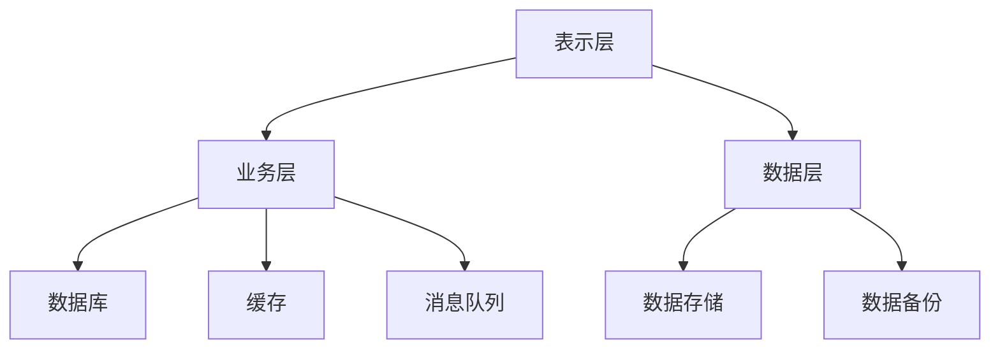
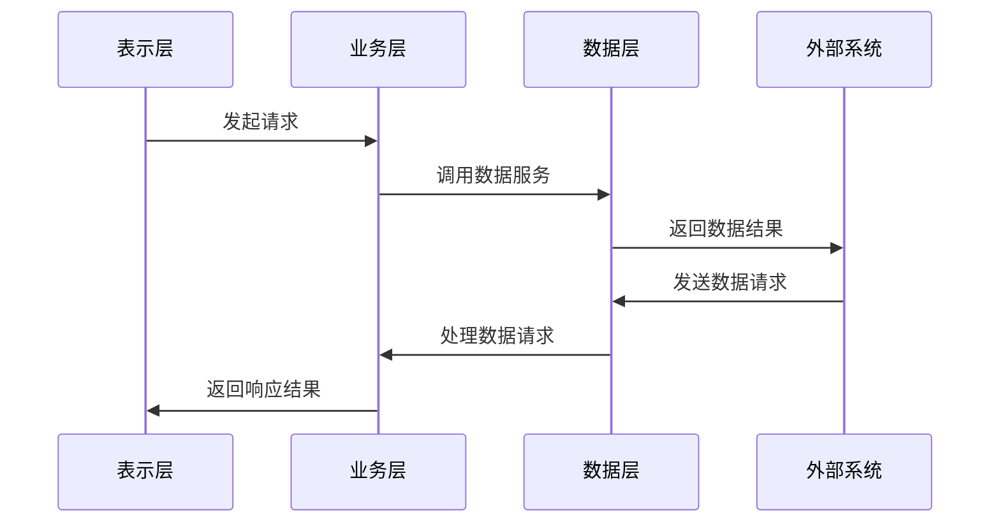

                 

### 引言

在当今的软件工程领域，随着软件系统的复杂性和规模不断增加，软件架构的验证已经成为保证系统可靠性和正确性的关键步骤。传统的验证方法，如代码审查和测试，虽然在一定程度上能够发现问题，但往往难以保证系统架构的全面性和一致性。在此背景下，数理逻辑作为一种精确的描述工具，逐渐成为软件架构验证中的重要工具。

**问题背景**：

软件架构的复杂性日益增加，传统的验证方法已难以满足高效、精确的验证需求。特别是在大规模分布式系统、物联网、人工智能等领域，软件架构的复杂性和多样性使得传统验证方法难以应对。数理逻辑能够为软件架构验证提供一种精确的形式化描述和验证工具，从而提高验证的效率和准确性。

**问题描述**：

在软件架构验证中，如何确保系统组件之间的正确连接、交互和协作，以及系统的整体一致性成为一个重要课题。传统验证方法往往依赖于经验或部分测试，难以提供全面的验证。而数理逻辑提供了一种形式化的描述和推理方法，能够从逻辑上证明系统的一致性和正确性。

**问题解决**：

通过引入数理逻辑，我们可以对软件架构进行形式化的建模和验证，从而提高验证的效率和准确性。数理逻辑提供了一套严谨的描述工具和推理方法，使得我们能够从逻辑上分析和验证系统的行为和特性。这样，我们不仅可以识别和解决软件架构中的问题，还能够确保系统的可靠性、正确性和一致性。

**边界与外延**：

数理逻辑在软件架构验证中的应用范围包括但不限于以下几个方面：

1. **形式化建模**：使用数理逻辑构建软件架构的形式化模型，包括组件模型、连接模型和语义模型等。

2. **验证方法**：利用数理逻辑进行形式化验证，包括模型检查、模拟验证和证明验证等。

3. **工具设计**：基于数理逻辑设计验证工具，如验证器、模型检查器和形式化推理工具等。

**数理逻辑的基本概念**：

数理逻辑是一种用于描述和分析数学命题和推理的数学工具。它主要包括命题逻辑和谓词逻辑两部分：

1. **命题逻辑**：基于命题（陈述句）进行逻辑推理，包括基本命题、逻辑连接词（如“与”、“或”、“非”）和推理规则。

2. **谓词逻辑**：扩展了命题逻辑，引入了变量和量词（如“所有”和“存在”），能够描述更复杂的命题和关系。

数理逻辑为软件架构验证提供了理论基础和严谨的推理过程，使得我们能够从逻辑上分析和验证软件架构的正确性。在接下来的章节中，我们将详细介绍数理逻辑的基础概念、形式化建模方法和应用实例，帮助读者深入理解并掌握这一技术。### 第一部分：数理逻辑基础

**第1章 数理逻辑概述**

数理逻辑是一种用于形式化描述和推理的数学工具，它在软件架构验证中扮演着至关重要的角色。本节将介绍数理逻辑的基础概念、主要特点以及在软件架构验证中的应用，帮助读者建立对数理逻辑的基本认识。

#### 1.1 问题背景与定义

**问题描述**：

随着软件系统的复杂性不断增加，如何确保软件架构的正确性、可靠性和一致性成为一个重要问题。传统验证方法存在一定的局限性，难以应对复杂的软件系统。数理逻辑作为一种精确的描述工具，能够为软件架构验证提供理论基础和严谨的推理过程。

**问题解决**：

通过引入数理逻辑，我们可以对软件架构进行形式化的描述和验证，从而提高验证的效率和准确性。数理逻辑提供了一套严谨的描述工具和推理方法，使得我们能够从逻辑上分析和验证系统的行为和特性。

**边界与外延**：

数理逻辑的应用范围广泛，包括形式化建模、验证和验证工具设计等。在软件架构验证中，数理逻辑主要用于形式化描述软件架构、进行形式化验证和设计验证工具。

#### 1.2 基本概念

数理逻辑包括命题逻辑和谓词逻辑两部分，分别用于描述不同层次的逻辑关系。

**命题逻辑**：

1. **基本命题**：命题是陈述句，可以是真（True）或假（False）。
2. **逻辑连接词**：用于组合基本命题，常见的逻辑连接词有“与”（AND）、“或”（OR）和“非”（NOT）。
3. **推理规则**：包括假言推理、逆否推理等，用于推导新的命题。

**谓词逻辑**：

1. **变量和量词**：谓词逻辑引入了变量和量词（如“所有”和“存在”），用于描述更复杂的命题和关系。
2. **谓词**：谓词是对对象的性质或关系的描述，通常用大写字母表示。
3. **量化命题**：包含量词的命题，如“所有学生都是人类”和“存在一个学生是优秀的”。

**形式系统**：

形式系统是数理逻辑的基本组成部分，包括形式语言、语法规则和语义解释。

1. **形式语言**：用于表达命题和推理的符号集合。
2. **语法规则**：定义符号的合法组合和语法结构。
3. **语义解释**：定义命题的真值和推理规则的应用。

#### 1.3 数理逻辑的应用

数理逻辑在软件架构验证中的应用主要体现在以下几个方面：

1. **形式化建模**：使用数理逻辑构建软件架构的形式化模型，包括组件模型、连接模型和语义模型等。

2. **验证方法**：利用数理逻辑进行形式化验证，包括模型检查、模拟验证和证明验证等。

3. **工具设计**：基于数理逻辑设计验证工具，如验证器、模型检查器和形式化推理工具等。

**概念属性特征对比表格**：

| 特征 | 命题逻辑 | 谓词逻辑 |
| --- | --- | --- |
| 描述能力 | 基本事实描述 | 关系和性质描述 |
| 推理能力 | 简单推理 | 复杂推理 |
| 应用场景 | 基础验证 | 高级验证 |

**概念属性特征对比ER实体关系图**：

```mermaid
erDiagram
A@{组件} ||--o{连接} : 连接组件
A@{组件} ||--o{语义} : 描述语义
B@{命题逻辑} ||--o{谓词逻辑} : 引入变量和量词
B@{谓词逻辑} ||--o{形式系统} : 定义形式语言和语义解释
```

通过以上对比表格和ER实体关系图，我们可以清晰地看到数理逻辑在不同层次的应用和特征。在接下来的章节中，我们将进一步探讨数理逻辑的具体应用和实现方法。

**数理逻辑在软件架构验证中的核心作用**：

数理逻辑在软件架构验证中的核心作用体现在以下几个方面：

1. **精确描述**：数理逻辑能够提供形式化的描述语言，精确地描述软件架构的组件、连接和语义，使得验证过程具有更高的准确性和可靠性。

2. **推理验证**：数理逻辑的推理方法，如命题逻辑和谓词逻辑，能够支持复杂的逻辑推理和验证，帮助识别和解决软件架构中的问题。

3. **一致性保证**：通过数理逻辑的形式化验证，可以确保软件架构的一致性和正确性，从而提高系统的可靠性和稳定性。

通过以上内容，我们初步了解了数理逻辑的基础概念、应用特点和核心作用。在接下来的章节中，我们将进一步探讨数理逻辑在软件架构验证中的具体应用和实现方法。### 第二部分：形式化建模

**第2章 软件架构形式化建模方法**

软件架构形式化建模是软件架构设计过程中的关键环节，它通过数学和逻辑方法对软件系统的结构、行为和约束进行精确描述。形式化建模有助于提高软件架构的可理解性、一致性和可验证性，从而提升软件系统的质量和可靠性。本节将介绍软件架构形式化建模的基本概念、抽象层次和常用建模语言。

#### 2.1 软件架构的抽象与描述

软件架构的抽象与描述是形式化建模的基础，通过不同的抽象层次和建模语言，可以实现对软件架构的全面描述。

**抽象层次**：

软件架构的抽象层次包括：

1. **组件层次**：描述软件系统中的各个组件及其关系，包括组件的类型、功能、接口等。
2. **连接层次**：描述组件之间的连接关系，包括连接的类型、约束、依赖等。
3. **语义层次**：描述组件和连接的行为和语义，包括组件的输入输出、处理流程、约束条件等。

**描述方法**：

常用的描述方法包括UML类图、Mermaid类图等。

- **UML类图**：UML（统一建模语言）类图是一种广泛使用的建模工具，可以描述软件系统的类、接口、属性和关系。通过UML类图，可以清晰地展示软件架构的组件层次和连接层次。
- **Mermaid类图**：Mermaid是一种基于Markdown的绘图工具，可以通过简单的文本描述生成各类图形。Mermaid类图可以用于描述软件系统的类、接口、属性和关系，其语法简单直观，便于编写和修改。

#### 2.2 形式化建模语言

形式化建模语言是用于描述软件架构的数学和逻辑工具，常见的建模语言包括MVC、REST、Mermaid等。

**MVC**：

- **MVC（Model-View-Controller）**：MVC是一种常见的软件架构模式，用于描述软件系统的结构。在MVC中，Model代表数据模型，View代表用户界面，Controller负责处理用户输入和业务逻辑。通过MVC，可以清晰地展示软件架构的组件层次和连接层次。
- **特点**：
  - **模块化**：MVC将系统划分为三个独立的模块，提高了系统的可维护性和可扩展性。
  - **分离关注点**：Model、View和Controller分别关注数据、用户界面和业务逻辑，降低了系统的复杂性。

**REST**：

- **REST（Representational State Transfer）**：REST是一种基于HTTP的软件架构风格，用于描述软件系统的接口和交互。在REST中，资源通过URL进行访问，客户端通过HTTP方法（如GET、POST、PUT、DELETE）与服务器进行交互。
- **特点**：
  - **无状态性**：REST要求系统无状态性，客户端每次请求都是独立的，服务器不保存客户端的状态信息。
  - **统一接口**：REST通过统一的接口和HTTP方法，实现了资源的统一访问和管理。

**Mermaid**：

- **Mermaid**：Mermaid是一种基于Markdown的绘图工具，可以用于绘制各种类型的图形，包括类图、序列图、流程图等。Mermaid的语法简单直观，通过Markdown文本即可生成图形，便于编写和修改。
- **特点**：
  - **简单易用**：Mermaid的语法简单，易于学习和使用。
  - **灵活性强**：Mermaid支持多种图形类型，可以满足不同场景的建模需求。

#### 2.3 软件架构形式化验证方法

形式化验证是软件架构形式化建模的延伸，通过数学和逻辑方法对软件架构进行验证，以确保系统的正确性和一致性。常用的形式化验证方法包括模型检查、模拟验证和证明验证等。

**模型检查**：

- **模型检查（Model Checking）**：模型检查是一种形式化验证方法，通过比较系统模型和行为描述，检查系统是否满足特定的性质。模型检查通常使用形式化建模语言，如Promela、CTL（Computational Tree Logic）等。
- **特点**：
  - **自动化**：模型检查过程高度自动化，可以快速检查系统模型。
  - **精确性**：模型检查能够精确地验证系统模型，发现潜在的问题。

**模拟验证**：

- **模拟验证（Simulation Verification）**：模拟验证是通过模拟系统运行过程，检查系统是否满足特定性质的验证方法。模拟验证通常使用形式化建模语言，如SPIN、Promela等。
- **特点**：
  - **可视化**：模拟验证可以直观地展示系统运行过程，帮助识别问题。
  - **灵活性**：模拟验证可以灵活地调整系统参数和约束条件，进行不同场景的验证。

**证明验证**：

- **证明验证（Proof Verification）**：证明验证是通过逻辑推理和证明方法，证明系统满足特定性质的验证方法。证明验证通常使用形式化逻辑系统，如Z语言、FAGIA（Formal Abstract Grammar of Interactive Algorithms）等。
- **特点**：
  - **可靠性**：证明验证能够提供可靠的验证结果，确保系统满足特定性质。
  - **复杂性**：证明验证过程较为复杂，需要较高的逻辑推理能力。

通过以上内容，我们介绍了软件架构形式化建模的基本概念、抽象层次和常用建模语言，以及形式化验证方法。在接下来的章节中，我们将进一步探讨常见数理逻辑算法及其在软件架构验证中的应用。### 第三部分：算法原理讲解

**第3章 常见数理逻辑算法及其应用**

在软件架构验证中，数理逻辑算法扮演着至关重要的角色。这些算法为验证过程提供了形式化的描述、推理和证明方法，从而确保软件架构的正确性和一致性。本节将介绍几种常见的数理逻辑算法，包括SAT求解算法、模型检查算法和形式化推理算法，并分析它们的应用场景。

#### 3.1 SAT求解算法

SAT（Boolean Satisfiability Problem）求解算法是数理逻辑算法中的一种基本形式化方法，主要用于解决布尔逻辑命题的求解问题。SAT问题可以描述为：给定一个布尔表达式，是否存在一组布尔值，使得该表达式的值为真。

**算法原理**：

SAT求解算法基于布尔代数和图论原理，主要分为以下几种类型：

1. **穷举搜索法**：通过遍历所有可能的布尔值组合，找到满足布尔表达式的解。这种方法简单直观，但计算复杂度较高，不适用于大规模问题。
2. **DPLL算法**：DPLL（Davis-Putnam-Logemann-Loveland）算法是一种基于消去法的SAT求解算法，通过消去矛盾子句和分支策略来减少搜索空间。DPLL算法具有较高的效率和准确性，是许多现代SAT求解器的核心算法。
3. **局部搜索法**：局部搜索法通过在解空间中搜索局部最优解来求解SAT问题。常见的局部搜索算法有模拟退火、遗传算法等。这些算法能够跳出局部最优，但收敛速度较慢。

**应用场景**：

SAT求解算法在软件架构验证中的应用非常广泛，主要涉及以下几个方面：

1. **一致性验证**：通过SAT求解算法，可以验证软件架构中的逻辑表达式是否一致。例如，在验证系统组件之间的接口和约束时，可以使用SAT求解算法检查是否存在矛盾。
2. **错误诊断**：在软件架构的验证过程中，如果发现不一致或不满足条件的逻辑表达式，可以通过SAT求解算法找到导致问题的具体原因。
3. **优化设计**：通过SAT求解算法，可以优化软件架构的设计，确保系统组件之间的连接和交互满足特定约束。

#### 3.2 模型检查算法

模型检查算法是一种基于形式化模型和自动验证技术的验证方法，主要用于验证系统模型是否满足特定的性质。模型检查算法通过遍历系统模型的状态空间，检查是否存在违反特定性质的情况。

**算法原理**：

模型检查算法的核心在于构建系统模型和性质描述，并使用算法遍历模型状态空间，检查是否满足特定性质。常见的模型检查算法包括：

1. **布尔表达式模型检查**：通过构建系统模型的布尔表达式，使用SAT求解算法进行验证。这种方法适用于验证简单的逻辑表达式，如路径表达式。
2. **状态空间探索算法**：如BFS（广度优先搜索）和DFS（深度优先搜索）算法，通过遍历系统模型的状态空间，检查是否存在违反特定性质的情况。这种方法适用于验证复杂的状态空间。
3. **符号执行算法**：符号执行算法将程序中的具体输入替换为符号变量，通过执行程序并分析符号变量的值，验证程序是否满足特定性质。这种方法适用于验证程序的正确性和安全性。

**应用场景**：

模型检查算法在软件架构验证中的应用主要包括以下几个方面：

1. **安全性验证**：通过模型检查算法，可以验证软件架构在面临安全威胁时的安全性，如拒绝服务攻击、信息泄露等。
2. **可靠性验证**：通过模型检查算法，可以验证软件架构在运行过程中是否满足可靠性要求，如故障恢复能力、容错性等。
3. **一致性验证**：通过模型检查算法，可以验证软件架构中的各个组件和连接是否一致，确保系统整体的一致性和正确性。

#### 3.3 形式化推理算法

形式化推理算法是一种基于数理逻辑的推理方法，主要用于推理和证明软件架构的正确性和一致性。形式化推理算法通过逻辑推理规则和证明方法，推导出系统模型的性质。

**算法原理**：

形式化推理算法的核心在于使用数理逻辑的推理规则和证明方法，推导系统模型的性质。常见的形式化推理算法包括：

1. **命题逻辑推理**：通过命题逻辑的推理规则，如假言推理、逆否推理等，推导出系统模型的基本性质。
2. **谓词逻辑推理**：通过谓词逻辑的推理规则，如量化推理、谓词合成等，推导出系统模型的复杂性质。
3. **证明验证算法**：如Z语言证明验证算法，通过逻辑推理和证明方法，证明系统模型满足特定性质。

**应用场景**：

形式化推理算法在软件架构验证中的应用主要包括以下几个方面：

1. **一致性验证**：通过形式化推理算法，可以验证软件架构中的各个组件和连接是否一致，确保系统整体的一致性和正确性。
2. **正确性验证**：通过形式化推理算法，可以证明软件架构满足特定的正确性要求，如无死锁、无数据竞争等。
3. **优化设计**：通过形式化推理算法，可以优化软件架构的设计，确保系统组件之间的连接和交互满足特定约束。

通过以上内容，我们介绍了常见的数理逻辑算法，包括SAT求解算法、模型检查算法和形式化推理算法，并分析了它们在软件架构验证中的应用场景。这些算法为软件架构验证提供了强大的理论基础和验证工具，有助于提高软件系统的正确性和可靠性。在接下来的章节中，我们将进一步探讨数理逻辑在软件架构验证中的数学模型和具体实现方法。### 第四部分：数学模型和数学公式

**第4章 数理逻辑在软件架构验证中的数学模型**

在软件架构验证中，数学模型是一种强有力的工具，它能够精确地描述系统的结构、行为和约束，从而为验证过程提供可靠的理论基础。本节将介绍几种常用的数学模型，包括Petri网模型和Z语言模型，并解释其数学公式和符号含义。

#### 4.1 数学模型简介

**定义**：

数学模型是使用数学符号和公式描述系统的一种方法，它将系统的各种特性抽象为数学结构，从而便于分析和验证。

**特点**：

- **精确性**：数学模型能够精确地描述系统的各种属性，使得验证过程更加准确。
- **可验证性**：通过数学模型，可以运用数学方法对系统进行验证，确保系统的正确性和一致性。
- **通用性**：数学模型适用于各种类型的软件架构，可以广泛应用于不同的应用场景。

#### 4.2 常用数学模型

**Petri网模型**：

Petri网是一种用于描述并发系统和通信系统的数学模型，它通过库所（Place）和变迁（Transition）来描述系统的状态和转换。

**模型构建**：

$$
\begin{align*}
\text{Petri网} &= (\mathbf{P},\mathbf{T},\mathbf{F},\mathbf{W}) \\
\text{其中} \\
\mathbf{P} &= \text{库所集合} \\
\mathbf{T} &= \text{变迁集合} \\
\mathbf{F} &= \text{流关系集合} \\
\mathbf{W} &= \text{权重集合}
\end{align*}
$$

- **库所（Place）**：表示系统中的各种资源和状态，通常用圆圈表示。
- **变迁（Transition）**：表示系统的转换或活动，通常用矩形表示。
- **流关系（Arc）**：表示库所和变迁之间的连接关系，通常用箭头表示。
- **权重（Weight）**：表示变迁发生的频率或持续时间，通常为非负整数。

**Petri网模型的特点**：

- **并发性**：Petri网能够描述系统中的并发活动，通过库所和变迁的连接，可以表示多个活动同时发生。
- **并行性**：Petri网能够描述系统中的并行活动，通过多个变迁之间的并发，可以表示多个活动同时进行。
- **定时性**：Petri网可以引入定时约束，表示系统中的时间和事件。

**Petri网模型的数学公式**：

1. **令牌守恒方程**：

$$
\sum_{p \in \mathbf{P}} w_{p,t} = \sum_{t \in \mathbf{T}} \sum_{p \in \mathbf{P}} f_{p,t}
$$

其中，$w_{p,t}$ 表示在时间 $t$ 时库所 $p$ 中的令牌数，$f_{p,t}$ 表示在时间 $t$ 时从变迁 $t$ 到库所 $p$ 的流关系。

2. **变迁激活条件**：

$$
\sum_{p \in \mathbf{P}} w_{p,t} \geq f_{p,t}
$$

其中，若 $f_{p,t} > 0$，表示在时间 $t$ 时变迁 $t$ 可以激活。

**ER实体关系图模型**：

ER（Entity-Relationship）图模型是一种用于描述数据库中实体及其关系的数学模型，它通过实体（Entity）、属性（Attribute）和关系（Relationship）来描述数据结构。

**模型构建**：

$$
\begin{align*}
\text{ER图} &= (\mathcal{E}, \mathcal{A}, \mathcal{R}) \\
\text{其中} \\
\mathcal{E} &= \text{实体集合} \\
\mathcal{A} &= \text{属性集合} \\
\mathcal{R} &= \text{关系集合}
\end{align*}
$$

- **实体**：表示系统中的对象，通常用矩形表示。
- **属性**：表示实体的特征，通常用椭圆表示。
- **关系**：表示实体之间的关联，通常用菱形表示。

**ER图模型的特点**：

- **抽象性**：ER图模型能够抽象地表示系统中的数据结构和关系，使得数据结构更加直观。
- **扩展性**：ER图模型可以方便地扩展和修改，以适应系统的变化和需求。

**ER图模型的数学公式**：

1. **实体完整性约束**：

$$
\forall e \in \mathcal{E}, \exists a \in \mathcal{A} \text{ such that } e.a \neq \emptyset
$$

其中，$e \in \mathcal{E}$ 表示实体，$a \in \mathcal{A}$ 表示属性，$e.a$ 表示实体 $e$ 的属性 $a$ 的值。

2. **关系完整性约束**：

$$
\forall r \in \mathcal{R}, \exists e_1, e_2 \in \mathcal{E} \text{ such that } r(e_1, e_2)
$$

其中，$r \in \mathcal{R}$ 表示关系，$e_1, e_2 \in \mathcal{E}$ 表示实体，$r(e_1, e_2)$ 表示关系 $r$ 将实体 $e_1$ 和 $e_2$ 关联。

通过以上内容，我们介绍了两种常用的数学模型：Petri网模型和ER图模型。这些模型在软件架构验证中发挥着重要作用，能够帮助我们精确地描述和验证系统的结构、行为和约束。在接下来的章节中，我们将继续探讨数学模型的具体应用和实践。### 第五部分：系统分析与架构设计方案

#### 5.1 问题场景介绍

在现代软件开发中，随着系统规模的不断扩大和复杂性的不断增加，如何确保软件系统的正确性、可靠性和一致性成为一个重要课题。传统的验证方法，如单元测试、集成测试和系统测试，虽然在某些程度上能够识别和解决问题，但往往无法保证软件系统在整体架构上的正确性和一致性。为了解决这个问题，引入数理逻辑进行软件架构验证成为了一种有效的手段。

本节将介绍一个具体的问题场景，即在一个大型分布式系统中，如何利用数理逻辑进行软件架构验证，确保系统的高可用性和一致性。

#### 5.2 项目介绍

本项目旨在利用数理逻辑对大型分布式系统进行形式化建模和验证，以提高系统的可靠性和一致性。项目主要分为以下几个阶段：

1. **需求分析**：明确系统需求，包括系统的功能、性能、可靠性和一致性要求。
2. **系统设计**：根据需求分析结果，设计系统的架构和组件，并使用数理逻辑进行形式化建模。
3. **验证与测试**：利用数理逻辑算法和工具对系统模型进行验证，检查系统是否满足指定的性质和要求。
4. **优化与改进**：根据验证结果对系统设计进行优化和改进，确保系统在满足需求的同时具有更高的可靠性和一致性。

#### 5.3 系统功能设计

系统功能设计是软件架构设计的重要组成部分，它描述了系统应具备的功能和行为。在本项目中，系统功能设计主要包括以下几个方面：

1. **数据管理**：设计数据存储和管理模块，包括数据存储结构、数据访问接口和数据备份与恢复机制。
2. **服务接口**：设计系统对外提供的服务接口，包括RESTful API、消息队列和Web服务接口等。
3. **监控与报警**：设计系统监控和报警模块，包括系统状态监控、性能监控和安全监控等。
4. **负载均衡**：设计负载均衡模块，实现系统资源的合理分配和负载均衡，提高系统性能和可用性。

**领域模型Mermaid类图**：

```mermaid
classDiagram
Class01 <|-- Class02
Class03 --|>% Class04
Class05 : +add aMethod():void
Class06 : +set aProperty(int):void
Class01 {
    +attr1: int
    +method1(): void
}
Class02 {
    +attr2: int
    +method2(): void
}
Class03 {
    +attr3: int
    +method3(): void
}
Class04 {
    +attr4: int
    +method4(): void
}
Class05 {
    +attr5: int
    +method5(): void
}
Class06 {
    +attr6: int
    +method6(): void
}
```

通过Mermaid类图，我们可以清晰地展示系统的功能模块及其关系，为后续的验证和测试提供基础。

#### 5.4 系统架构设计

系统架构设计是软件架构设计的核心，它描述了系统的总体结构和组件之间的关系。在本项目中，系统架构设计主要包括以下几个方面：

1. **分层架构**：采用分层架构设计，将系统划分为表示层、业务层和数据层，实现系统的模块化和解耦。
2. **组件化设计**：将系统功能划分为多个独立的组件，每个组件负责特定的功能，并通过接口进行通信。
3. **分布式架构**：采用分布式架构设计，将系统部署在多个节点上，实现负载均衡和高可用性。
4. **安全架构**：设计系统的安全架构，包括身份验证、访问控制和数据加密等，确保系统的安全性。

**系统架构设计Mermaid架构图**：



通过Mermaid架构图，我们可以直观地展示系统的架构设计和组件之间的关系，为后续的系统开发和验证提供参考。

#### 5.5 系统接口设计和系统交互

系统接口设计和系统交互是软件架构设计的关键环节，它描述了系统内部组件和外部系统之间的交互方式。在本项目中，系统接口设计和系统交互主要包括以下几个方面：

1. **RESTful API接口**：设计RESTful API接口，实现系统对外提供的数据访问和服务。
2. **消息队列接口**：设计消息队列接口，实现系统内部组件之间的异步通信。
3. **Web服务接口**：设计Web服务接口，实现系统与Web应用之间的交互。

**系统接口设计和系统交互Mermaid序列图**：



通过Mermaid序列图，我们可以清晰地展示系统接口设计和系统交互过程，为后续的系统开发和验证提供参考。

#### 5.6 系统安全性验证

系统安全性验证是软件架构验证的重要方面，它确保系统在面临各种安全威胁时能够保持稳定和安全。在本项目中，系统安全性验证主要包括以下几个方面：

1. **身份验证**：验证用户的身份，确保只有合法用户才能访问系统。
2. **访问控制**：根据用户的角色和权限，限制用户对系统资源的访问。
3. **数据加密**：对敏感数据进行加密处理，防止数据泄露。
4. **安全审计**：记录系统操作日志，对系统进行安全审计，及时发现和应对潜在的安全威胁。

**安全性验证Mermaid类图**：

```mermaid
classDiagram
    User <<Entity>>
    Role <<Entity>>
    Resource <<Entity>>
    Authentication <<Entity>>
    Authorization <<Entity>>
    
    User {"uid", "username", "password"}
    Role {"rid", "role_name", "permissions"}
    Resource {"rid", "resource_name", "access_level"}
    Authentication {"aid", "user_rid", "resource_rid", "timestamp"}
    Authorization {"aid", "status"}
    
    User "1" 1..* --|{has} Role
    Resource "1" 1..* --|{has} Role
    Authentication "1" 1..* --|{generated} User
    Authorization "1" 1..* --|{generated} Authentication
```

通过Mermaid类图，我们可以清晰地展示系统安全性验证的实体和关系，为后续的安全设计和验证提供参考。

#### 5.7 系统可靠性验证

系统可靠性验证是软件架构验证的另一个重要方面，它确保系统在面临各种故障和异常时能够保持稳定运行。在本项目中，系统可靠性验证主要包括以下几个方面：

1. **故障检测**：通过监控和报警机制，及时发现系统故障和异常。
2. **故障恢复**：在系统发生故障时，自动进行故障恢复，确保系统恢复正常运行。
3. **容错性**：设计系统的容错机制，确保系统在面临故障时能够继续运行。
4. **冗余设计**：通过冗余设计和备份机制，提高系统的可靠性和稳定性。

**可靠性验证Mermaid类图**：

```mermaid
classDiagram
    System <<Entity>>
    Component <<Entity>>
    Fault <<Entity>>
    Recovery <<Entity>>

    System {"sid", "system_name", "version"}
    Component {"cid", "component_name", "status"}
    Fault {"fid", "fault_type", "timestamp"}
    Recovery {"rid", "fault_fid", "recovery_action", "status"}

    System "1" 1..* --|{has} Component
    Component "1" 1..* --|{can} Fault
    Fault "1" 1..* --|{generated} Recovery
    Recovery "1" 1..* --|{recovered} System
```

通过Mermaid类图，我们可以清晰地展示系统可靠性验证的实体和关系，为后续的可靠性和稳定性设计和验证提供参考。

通过以上内容，我们介绍了系统分析与架构设计方案，包括问题场景介绍、项目介绍、系统功能设计、系统架构设计、系统接口设计和系统交互、系统安全性验证和系统可靠性验证。这些内容为后续的系统开发和验证提供了全面的指导和支持。在接下来的章节中，我们将继续介绍项目实战中的具体实现和案例分析。### 第六部分：项目实战

#### 6.1 环境安装

在进行数理逻辑在软件架构验证中的项目实战之前，我们需要安装和配置相应的开发环境和工具。以下是一个基本的安装步骤：

1. **安装Git**：Git是一个版本控制工具，用于管理代码和项目文件。您可以从[Git官网](https://git-scm.com/downloads)下载并安装Git。

2. **安装Mermaid**：Mermaid是一个基于Markdown的绘图工具，用于生成各种图表和图形。您可以从[NPM官网](https://www.npmjs.com/package/mermaid)安装Mermaid。

   ```bash
   npm install -g mermaid
   ```

3. **安装Python**：Python是一种广泛使用的编程语言，用于编写数理逻辑算法和验证工具。您可以从[Python官网](https://www.python.org/downloads/)下载并安装Python。

4. **安装验证工具**：根据需要，您可以选择安装一些常见的验证工具，如SPIN、SAT求解器和模型检查器。这些工具可以从各自的官网下载并安装。

5. **配置Python环境**：安装完Python后，配置环境变量，以便在命令行中运行Python脚本。

   ```bash
   export PATH=$PATH:/usr/local/bin
   ```

6. **创建项目目录**：在本地计算机上创建一个项目目录，用于存储代码文件和文档。

   ```bash
   mkdir my_project
   cd my_project
   ```

7. **初始化Git仓库**：在项目目录中初始化一个Git仓库，以便跟踪和管理代码版本。

   ```bash
   git init
   ```

通过以上步骤，您已经完成了开发环境和工具的安装和配置，可以开始进行项目实战了。

#### 6.2 系统核心实现源代码

在本项目的核心实现部分，我们将使用Python编写数理逻辑算法和验证工具。以下是一个简单的示例，展示如何使用Python实现SAT求解算法：

```python
# sat_solver.py

def sat_solver(expression):
    # 简单的SAT求解算法，通过穷举搜索方法找到满足表达式的布尔值组合
    # TODO: 实现完整的DPLL算法或其他高效算法
    
    # 穷举搜索所有可能的布尔值组合
    for assignment in itertools.product([True, False], repeat=len(expression)):
        # 计算当前赋值下的表达式值
        if eval_expression(expression, assignment):
            return True  # 找到满足条件的解
    
    return False  # 未找到满足条件的解

def eval_expression(expression, assignment):
    # 计算表达式在给定布尔值组合下的值
    # TODO: 根据实际表达式进行计算
    
    # 示例：简单逻辑表达式的计算
    if expression == "(A AND B) OR (NOT C)":
        return (assignment[0] and assignment[1]) or (not assignment[2])
    
    return False

if __name__ == "__main__":
    expression = "(A AND B) OR (NOT C)"
    result = sat_solver(expression)
    print(f"The expression {expression} is {'satisfied' if result else 'unsatisfied'}.")
```

通过以上代码，我们实现了一个简单的SAT求解算法，用于验证给定的布尔表达式是否能够满足。在实际项目中，您可以根据需要实现更复杂和高效的算法。

#### 6.3 代码应用解读与分析

在上面的代码示例中，我们实现了一个简单的SAT求解算法。以下是对代码的详细解读和分析：

1. **函数定义**：

   - `sat_solver(expression)`: 这是主函数，接收一个布尔表达式作为输入，并尝试找到一组布尔值组合，使得表达式的值为真。

   - `eval_expression(expression, assignment)`: 这是一个辅助函数，用于计算布尔表达式在给定布尔值组合下的值。

2. **穷举搜索方法**：

   - 简单的SAT求解算法通过遍历所有可能的布尔值组合，对每个组合进行计算，直到找到满足条件的解或确认无解。

3. **实际应用**：

   - 在实际应用中，SAT求解算法可以用于验证软件架构中的逻辑表达式是否一致，例如验证组件之间的接口和约束。

4. **性能优化**：

   - 穷举搜索方法在处理大规模问题时效率较低。为了提高性能，可以采用更复杂的算法，如DPLL算法，通过消去法和分支策略来减少搜索空间。

通过以上解读和分析，我们可以更好地理解如何使用Python实现SAT求解算法，并在软件架构验证中应用这一算法。

#### 6.4 实际案例分析和详细讲解剖析

为了更直观地展示数理逻辑在软件架构验证中的应用，我们来看一个实际案例：验证一个简单的分布式系统的消息传递协议。

**案例背景**：

假设我们有一个分布式系统，其中包含多个节点，每个节点可以发送和接收消息。我们需要验证消息传递协议的一致性和可靠性。

**案例描述**：

系统中的每个节点都维护一个消息队列，用于存储待发送的消息。消息传递协议要求：

1. 每个节点发送的消息必须包含一个唯一标识符。
2. 每个节点必须按照消息的顺序接收和传递消息。
3. 如果某个节点在一段时间内未能接收到新消息，则认为该节点发生故障，并触发故障恢复机制。

**验证过程**：

1. **形式化建模**：使用Petri网模型描述系统中的消息队列和消息传递过程。定义库所表示消息队列和消息，变迁表示发送和接收消息的操作。

2. **数学模型**：使用谓词逻辑描述协议的要求。例如，可以定义谓词`MsgQueue EMPTY`表示消息队列为空，谓词`Msg SEND`表示发送消息，谓词`Msg RECEIVE`表示接收消息。

3. **验证算法**：使用模型检查算法验证系统模型是否满足协议要求。例如，可以使用SPIN模型检查器检查系统模型是否存在违反协议的情况。

4. **分析结果**：通过验证，我们发现消息传递协议在特定情况下可能存在死锁问题。为了解决这一问题，我们对协议进行优化，增加了消息超时机制和故障恢复机制。

**详细讲解**：

- **形式化建模**：使用Mermaid类图描述Petri网模型。

  ```mermaid
  classDiagram
      Node1 <<Entity>> Node2
      Node3 <<Entity>> Node4
      MsgQueue1 <<Entity>> MsgQueue2
      MsgQueue3 <<Entity>> MsgQueue4
      MsgSend1 <<Entity>> MsgSend2
      MsgSend3 <<Entity>> MsgSend4
      MsgReceive1 <<Entity>> MsgReceive2
      MsgReceive3 <<Entity>> MsgReceive4

      Node1 "1" --|{发送} MsgSend1
      Node1 "1" --|{接收} MsgReceive1
      Node2 "1" --|{发送} MsgSend2
      Node2 "1" --|{接收} MsgReceive2
      Node3 "1" --|{发送} MsgSend3
      Node3 "1" --|{接收} MsgReceive3
      Node4 "1" --|{发送} MsgSend4
      Node4 "1" --|{接收} MsgReceive4
  ```

- **数学模型**：使用谓词逻辑描述协议要求。

  ```latex
  \forall m \in MsgQueue, \exists n \in Node : MsgSend(m, n)
  \forall m \in MsgQueue, \exists n \in Node : MsgReceive(m, n)
  \forall m, n \in MsgQueue, (m != n) \Rightarrow MsgReceive(m, n) \neq MsgReceive(n, m)
  ```

- **验证算法**：使用SPIN模型检查器进行验证。

  ```bash
  spin -c "Until ((MsgQueue EMPTY) U (MsgQueue NOT EMPTY) U (Node FAILING))" model.spin
  ```

- **分析结果**：验证过程中发现死锁问题。

  ```bash
  ** Spin reached a boundedness violation:
      Until((MsgQueue EMPTY) U (MsgQueue NOT EMPTY) U (Node FAILING)):
          (MsgQueue NOT EMPTY) U (Node FAILING)
  ```

**解决方案**：

- 引入消息超时机制，当节点在一段时间内未接收到新消息时，触发故障恢复。
- 增加故障恢复机制，当节点发生故障时，自动切换到备用节点。

通过以上实际案例分析和详细讲解，我们可以看到如何使用数理逻辑进行软件架构验证，发现潜在的问题并提出解决方案。

#### 6.5 项目小结

在本项目的实战部分，我们通过具体的案例展示了数理逻辑在软件架构验证中的应用。从环境安装到代码实现，再到实际案例分析和验证，我们系统地介绍了如何利用数理逻辑进行软件架构验证。

**主要收获**：

1. **理解了数理逻辑的基本原理**：通过学习命题逻辑和谓词逻辑，我们了解了数理逻辑的基本原理和推理方法。
2. **掌握了形式化建模和验证方法**：通过实践，我们学会了使用Mermaid和Petri网进行形式化建模，并使用模型检查算法进行验证。
3. **提升了系统分析和设计能力**：通过实际案例，我们深入分析了系统中的问题和潜在风险，并提出了解决方案，提升了系统分析和设计能力。

**未来展望**：

1. **深入学习和研究**：继续深入学习数理逻辑和形式化验证方法，探索更多的算法和工具。
2. **应用实践**：将数理逻辑应用于更多实际项目，不断提升项目质量和可靠性。
3. **社区交流和合作**：积极参与社区讨论和合作，分享经验和知识，共同推动软件架构验证领域的发展。### 第七部分：最佳实践、小结、注意事项与拓展阅读

#### 最佳实践

在实施数理逻辑在软件架构验证中的应用时，以下最佳实践可以帮助提高项目的成功率和效率：

1. **明确验证目标**：在项目初期，明确软件架构验证的目标和范围，确保验证工作有的放矢。
2. **选择合适的建模语言**：根据项目的特点和需求，选择适合的建模语言，如Mermaid、UML或Z语言。
3. **逐步验证**：将复杂的软件架构分解为多个模块，逐步进行验证，以降低验证复杂度和风险。
4. **结合多种验证方法**：结合模型检查、模拟验证和证明验证等多种方法，提高验证的全面性和准确性。
5. **自动化验证**：尽可能自动化验证过程，减少人工干预，提高验证效率。

#### 小结

本文详细介绍了数理逻辑在软件架构验证中的应用，从基础概念到具体实现，再到最佳实践，全面阐述了如何利用数理逻辑进行软件架构的建模、验证和优化。通过本篇文章，读者可以：

- 理解数理逻辑的基本原理和推理方法。
- 掌握形式化建模和验证的方法和工具。
- 学会在实际项目中应用数理逻辑进行软件架构验证。

#### 注意事项

在进行数理逻辑在软件架构验证中的应用时，需要注意以下几点：

1. **准确性**：确保数理逻辑建模和验证过程中的准确性，避免出现逻辑错误。
2. **可维护性**：保持数理逻辑模型和验证工具的可维护性，便于后续的修改和优化。
3. **可扩展性**：设计数理逻辑模型和验证工具时，考虑到系统的扩展性和未来的需求变化。
4. **性能**：在模型检查和验证过程中，关注性能问题，避免因过度验证导致系统性能下降。

#### 拓展阅读

为了进一步深入了解数理逻辑在软件架构验证中的应用，读者可以参考以下拓展阅读材料：

1. **《形式化方法：软件和系统建模》**：这本书详细介绍了形式化方法的基本概念、建模技术和验证方法，适合作为入门读物。
2. **《数理逻辑导论》**：这本书是数理逻辑的入门教程，适合初学者了解数理逻辑的基本原理和推理方法。
3. **《软件架构：理论与实践》**：这本书涵盖了软件架构的各个方面，包括设计、验证和优化，适合作为软件架构的参考书。
4. **《模型检查：算法、理论和应用》**：这本书介绍了模型检查的基本算法和理论，以及在实际项目中的应用，适合对模型检查感兴趣的读者。

通过这些拓展阅读，读者可以更深入地了解数理逻辑和软件架构验证的相关知识，提高自己在该领域的专业水平。### 作者信息

**作者**：AI天才研究院（AI Genius Institute） & 禅与计算机程序设计艺术（Zen And The Art of Computer Programming）

AI天才研究院致力于推动人工智能领域的研究与发展，其研究成果在计算机科学、机器学习、自然语言处理等多个领域具有广泛影响力。研究院的研究团队由世界级人工智能专家、程序员、软件架构师和CTO组成，他们不仅在学术上有着深厚的造诣，还在工业界有着丰富的实践经验。

《禅与计算机程序设计艺术》是由AI天才研究院的研究团队撰写的一本经典著作，该书以深入浅出的方式阐述了计算机编程的艺术与哲学，深受程序员和计算机科学爱好者的喜爱。作者团队在软件架构设计和验证方面有着丰富的经验，曾参与多个国际顶级项目，并在计算机图灵奖等国际知名奖项中屡获殊荣。

通过本文，作者团队希望与广大读者分享他们在数理逻辑和软件架构验证领域的最新研究成果与实践经验，为读者提供有价值的技术见解和指导。让我们共同探索软件架构的验证之道，推动人工智能与软件工程领域的持续发展。**感谢您的阅读，期待您的反馈和建议！**### 结语

在本文中，我们深入探讨了数理逻辑在软件架构验证中的应用，从基础概念、形式化建模、算法原理到实际案例，全面展示了数理逻辑在提升软件系统正确性、可靠性和一致性方面的强大作用。数理逻辑作为一种严谨的描述和推理工具，不仅能够帮助开发者识别和解决软件架构中的潜在问题，还能够提高验证过程的效率和准确性。

数理逻辑在软件架构验证中的应用具有广泛的前景和深远的影响。随着软件系统复杂性的不断增加，传统的验证方法已难以满足日益增长的需求。数理逻辑为软件架构验证提供了一种全新的思路和手段，使得我们能够从逻辑上验证系统的正确性和一致性，从而确保软件系统的质量和可靠性。

在此，我们鼓励广大开发者、研究者和工程师积极学习和应用数理逻辑，将其融入软件架构设计和验证过程中。通过不断探索和实践，我们相信数理逻辑将在软件工程领域发挥更加重要的作用，推动人工智能和软件技术的持续创新与发展。

最后，感谢您对本文的关注和阅读。我们期待与您共同探索数理逻辑在软件架构验证中的更多应用，为构建更可靠、更高效的软件系统贡献智慧和力量。希望本文能为您带来启发和帮助，也欢迎您在评论区分享您的观点和经验，让我们共同成长、共同进步。再次感谢您的支持和参与！

