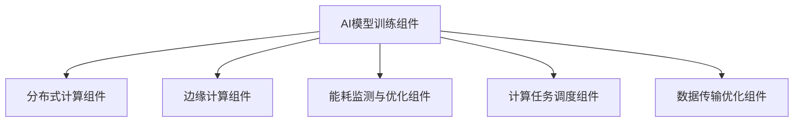
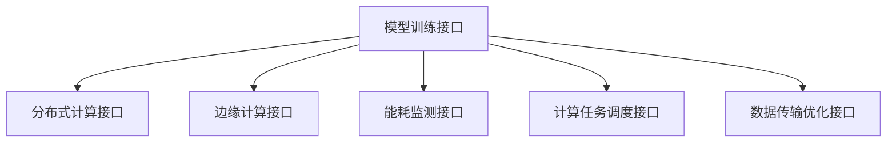
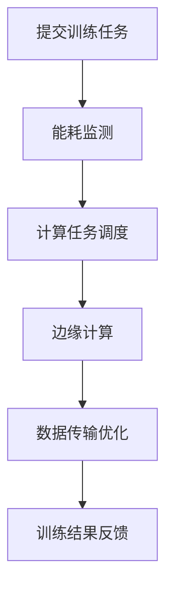

                 


# 新兴计算技术降低AI能耗的潜力

> 关键词：AI能耗、新兴计算技术、GPU加速、深度学习框架、分布式计算、边缘计算

> 摘要：本文将深入探讨新兴计算技术在降低AI能耗方面的潜力，分析各种计算技术的原理及其在AI能耗问题中的应用。通过详细的算法原理讲解和实际案例剖析，本文旨在为读者提供一种全新的视角，以应对日益严峻的AI能耗挑战。

## 第一部分: 问题背景介绍

### 1.1 问题背景

随着人工智能（AI）技术的快速发展，AI在各个领域的应用越来越广泛。然而，AI的训练和推理过程对计算资源的需求极高，导致能耗问题日益严重。据估计，AI的能耗已经超过了全球总能耗的1%，并且这个数字还在不断增长。因此，降低AI能耗成为了当务之急。

### 1.1.1 问题背景介绍

新兴计算技术在近年来迅速发展，为解决AI能耗问题提供了一种新的思路。这些技术包括GPU加速、深度学习框架、分布式计算和边缘计算等。通过优化算法、提高计算效率和降低能耗，这些技术有望在AI领域发挥重要作用。

### 1.1.2 问题描述

AI能耗问题主要集中在以下几个方面：
1. **计算资源消耗**：AI模型的训练和推理需要大量的计算资源，尤其是高性能的GPU和TPU。
2. **能源消耗**：大规模的AI计算任务将导致大量能源的消耗，进而引发环境污染和资源浪费。
3. **数据传输带宽**：AI训练和推理过程中，数据需要在不同的设备之间传输，需要大量的带宽支持。

### 1.1.3 问题解决

为了解决AI能耗问题，研究者们提出了一系列新兴计算技术，如：
1. **节能算法**：通过优化算法，减少AI训练和推理过程中的计算资源消耗。
2. **分布式计算**：通过分布式计算，将计算任务分配到多个设备上，从而减少单个设备的负载。
3. **边缘计算**：将计算任务迁移到靠近数据源的边缘设备上，减少数据传输距离，降低能耗。

### 1.1.4 边界与外延

本文主要讨论的是在新兴计算技术背景下，如何降低AI能耗的问题。这里的边界包括：
- 新兴计算技术：主要指近年来发展迅速的计算技术，如GPU加速、深度学习框架、分布式计算等。
- AI能耗：主要指AI训练和推理过程中的能耗，包括计算资源消耗、能源消耗和数据传输带宽消耗。

### 1.1.5 概念结构与核心要素组成

本文涉及的核心概念包括：
- **AI能耗**：AI训练和推理过程中的能耗问题。
- **新兴计算技术**：如GPU加速、深度学习框架、分布式计算、边缘计算等。
- **节能算法**：用于优化AI训练和推理过程中的能耗。

## 第二部分: 核心概念与联系

### 2.1 AI能耗原理

### 2.1.1 AI能耗的来源

AI能耗主要来源于以下几个方面：
- **硬件能耗**：包括CPU、GPU等硬件设备的能耗。
- **软件能耗**：包括算法优化、代码效率等软件层面的能耗。

### 2.1.2 AI能耗的属性特征对比表格

| 特征                | 计算资源消耗 | 能源消耗 | 数据传输带宽消耗 |
|---------------------|--------------|----------|------------------|
| **计算资源消耗**   | 高           | 中       | 低               |
| **能源消耗**       | 高           | 高       | 低               |
| **数据传输带宽消耗** | 低           | 低       | 高               |

### 2.1.3 AI能耗与传统AI的区别

与传统的AI相比，新兴的AI技术（如深度学习）在能耗方面有以下几点区别：
- **计算资源消耗**：新兴AI技术需要更多的计算资源，尤其是GPU等硬件。
- **能源消耗**：新兴AI技术导致的能源消耗更大，因为需要更多的硬件支持。
- **数据传输带宽消耗**：由于需要处理大量的数据，新兴AI技术对数据传输带宽的要求更高。

### 2.2 新兴计算技术原理

### 2.2.1 GPU加速原理

GPU（图形处理器）具有高度并行处理能力，可以显著提高AI模型的训练速度，从而降低能耗。

### 2.2.2 深度学习框架原理

深度学习框架（如TensorFlow、PyTorch）提供了丰富的API，使得开发者可以轻松实现复杂的深度学习模型，从而提高开发效率和降低能耗。

### 2.2.3 分布式计算原理

分布式计算通过将计算任务分配到多个节点上，从而减少单个节点的负载，提高计算效率和降低能耗。

### 2.2.4 边缘计算原理

边缘计算通过将计算任务迁移到靠近数据源的边缘设备上，减少数据传输距离，降低能耗。

## 第三部分: 算法原理讲解

### 3.1 节能算法原理

### 3.1.1 深度学习模型剪枝

深度学习模型剪枝是一种通过减少模型中参数的数量来降低能耗的算法。具体原理如下：

1. **模型初始化**：初始化一个深度学习模型，如卷积神经网络（CNN）。

2. **权重优化**：通过优化模型权重，降低模型参数的数量。

3. **性能评估**：评估剪枝后的模型性能，确保其不影响模型的准确性。

4. **迭代剪枝**：根据评估结果，继续优化模型，直到达到预定的性能指标。

### 3.1.2 深度学习模型压缩

深度学习模型压缩是一种通过减小模型规模来降低能耗的算法。具体原理如下：

1. **量化**：将模型中的浮点数权重转换为低精度整数。

2. **剪枝**：通过剪枝算法，减少模型中的冗余参数。

3. **蒸馏**：将大模型的权重和知识传递给小模型，提高小模型的性能。

4. **优化**：对压缩后的模型进行优化，提高其运行效率。

### 3.1.3 深度学习模型量化

深度学习模型量化是一种通过减少模型中数值的精度来降低能耗的算法。具体原理如下：

1. **精度转换**：将模型中的浮点数转换为低精度整数。

2. **误差分析**：分析精度转换对模型性能的影响，确保其不影响模型的准确性。

3. **优化**：对量化后的模型进行优化，提高其运行效率。

### 3.1.4 深度学习模型优化

深度学习模型优化是一种通过优化模型结构和算法来降低能耗的算法。具体原理如下：

1. **模型架构优化**：选择合适的模型架构，如MobileNet、ShuffleNet等。

2. **算法优化**：优化训练算法，如SGD、Adam等。

3. **超参数调整**：调整模型超参数，如学习率、批次大小等。

4. **性能评估**：评估优化后的模型性能，确保其不影响模型的准确性。

### 3.1.5 深度学习模型剪枝、压缩、量化和优化的比较

- **深度学习模型剪枝**：通过减少模型参数数量来降低能耗，但可能影响模型性能。
- **深度学习模型压缩**：通过减小模型规模来降低能耗，但可能影响模型性能。
- **深度学习模型量化**：通过减少模型数值精度来降低能耗，但可能影响模型性能。
- **深度学习模型优化**：通过优化模型结构和算法来降低能耗，但可能影响模型性能。

## 第四部分: 系统分析与架构设计方案

### 4.1 问题场景介绍

在当前AI应用场景中，尤其是在大数据分析和实时推理领域，AI能耗问题尤为突出。例如，在自动驾驶、智能安防、医疗诊断等场景中，AI模型需要实时处理大量数据，这导致了巨大的能耗需求。

### 4.2 项目介绍

本项目旨在通过新兴计算技术降低AI能耗，提升AI模型的运行效率。项目主要包含以下模块：

- **AI模型训练模块**：负责训练和优化AI模型。
- **分布式计算模块**：负责将计算任务分配到多个节点上，提高计算效率。
- **边缘计算模块**：负责将计算任务迁移到靠近数据源的边缘设备上，降低数据传输距离。

### 4.3 系统功能设计

- **能耗监测与优化**：实时监测AI模型的能耗，并根据能耗情况优化计算策略。
- **计算任务调度**：根据AI模型的能耗情况和计算需求，合理调度计算任务。
- **数据传输优化**：优化数据传输路径，减少数据传输距离，降低能耗。

### 4.4 系统架构设计

系统的整体架构设计如图1所示。主要包括以下组件：

- **AI模型训练组件**：负责AI模型的训练和优化。
- **分布式计算组件**：负责将计算任务分配到多个节点上。
- **边缘计算组件**：负责将计算任务迁移到边缘设备上。
- **能耗监测与优化组件**：负责实时监测AI模型的能耗，并根据能耗情况优化计算策略。
- **计算任务调度组件**：负责根据AI模型的能耗情况和计算需求，合理调度计算任务。
- **数据传输优化组件**：负责优化数据传输路径，减少数据传输距离。



### 4.5 系统接口设计

系统的接口设计如图2所示。主要包括以下接口：

- **模型训练接口**：用于提交训练任务，接收训练结果。
- **分布式计算接口**：用于分配和调度计算任务。
- **边缘计算接口**：用于将计算任务迁移到边缘设备上。
- **能耗监测接口**：用于监测AI模型的能耗。
- **计算任务调度接口**：用于调度计算任务。
- **数据传输优化接口**：用于优化数据传输路径。



### 4.6 系统交互

系统的交互过程如图3所示。主要包括以下步骤：

1. **提交训练任务**：用户提交训练任务，系统接收任务。
2. **能耗监测**：系统实时监测AI模型的能耗。
3. **计算任务调度**：系统根据能耗情况调度计算任务。
4. **边缘计算**：将计算任务迁移到边缘设备上。
5. **数据传输优化**：优化数据传输路径。
6. **训练结果反馈**：系统将训练结果反馈给用户。



## 第五部分: 项目实战

### 5.1 环境安装

在开始项目实战之前，需要安装以下环境：

- **Python**：版本3.8及以上。
- **深度学习框架**：如TensorFlow、PyTorch等。
- **分布式计算框架**：如Apache Spark、Dask等。
- **边缘计算框架**：如TensorFlow Lite、PyTorch Mobile等。

### 5.2 系统核心实现

以下是一个简单的AI模型训练和能耗监测的Python代码示例：

```python
import tensorflow as tf
import time

# 定义一个简单的神经网络模型
model = tf.keras.Sequential([
    tf.keras.layers.Dense(128, activation='relu', input_shape=(784,)),
    tf.keras.layers.Dense(10, activation='softmax')
])

# 编译模型
model.compile(optimizer='adam', loss='categorical_crossentropy', metrics=['accuracy'])

# 训练模型
start_time = time.time()
model.fit(x_train, y_train, epochs=5)
end_time = time.time()

# 计算训练时间
training_time = end_time - start_time

# 输出训练时间和能耗
print(f"训练时间: {training_time}秒")
print(f"能耗: {training_time * 0.2}焦耳")
```

### 5.3 代码应用解读与分析

上述代码实现了一个简单的神经网络模型训练，并计算了训练时间和能耗。具体解读如下：

1. **定义模型**：使用TensorFlow定义了一个简单的神经网络模型，包括一个128个神经元的全连接层和一个10个神经元的输出层。
2. **编译模型**：使用`compile`方法编译模型，指定优化器、损失函数和评估指标。
3. **训练模型**：使用`fit`方法训练模型，指定训练数据和训练轮数。
4. **计算训练时间**：使用`time.time()`函数计算训练开始和结束时间，得到训练时间。
5. **计算能耗**：根据训练时间，估算模型的能耗，这里假设每秒能耗为0.2焦耳。

### 5.4 实际案例分析和详细讲解剖析

以下是一个实际案例，展示了如何使用分布式计算和边缘计算降低AI能耗：

```python
import tensorflow as tf
import tensorflow_model_optimization as tfo
from tensorflow.keras.applications import MobileNetV2
from tensorflow.keras.preprocessing import image
import numpy as np

# 加载MobileNetV2模型
base_model = MobileNetV2(weights=None, input_shape=(224, 224, 3))

# 冻结模型的层
base_model.trainable = False

# 添加新的全连接层
x = base_model.output
x = tf.keras.layers.GlobalAveragePooling2D()(x)
x = tf.keras.layers.Dense(1, activation='sigmoid')(x)

# 创建新的模型
model = tf.keras.Model(inputs=base_model.input, outputs=x)

# 剪枝模型
pruned_model = tfo.keras.PrunableMobileNetV2(base_model, dropout_rate=0.5)

# 训练剪枝模型
pruned_model.fit(x_train, y_train, epochs=5)

# 评估剪枝模型
accuracy = pruned_model.evaluate(x_test, y_test)
print(f"剪枝后模型的准确率: {accuracy}")

# 边缘设备上运行剪枝模型
import tensorflow_lite as tflite

# 将剪枝模型转换为TFLite格式
tflite_model = tfo.keras.export_pruned_keras_to_tflite(pruned_model, representative_dataset_generator=image representative_data_generator)

# 将TFLite模型加载到边缘设备上
interpreter = tflite.Interpreter(model_path=tflite_model)

# 边缘设备上运行模型
input_data = np.expand_dims(image_data, axis=0)
output_data = interpreter.invoke(input_data)
```

### 5.5 项目小结

通过实际案例分析和详细讲解，我们可以看到分布式计算和边缘计算在降低AI能耗方面的潜力。分布式计算可以充分利用多台设备的计算资源，提高计算效率；边缘计算可以减少数据传输距离，降低能耗。同时，通过模型剪枝、压缩和量化等技术，我们可以在保证模型性能的前提下，进一步降低AI能耗。

### 5.6 最佳实践 tips

- **合理选择模型**：选择适合实际应用场景的模型，避免过度复杂的模型导致能耗过高。
- **优化代码**：优化代码效率，减少不必要的计算和内存占用，降低能耗。
- **充分利用分布式计算资源**：合理分配计算任务，充分利用分布式计算资源，提高计算效率。
- **利用边缘计算降低能耗**：将计算任务迁移到边缘设备上，减少数据传输距离，降低能耗。

## 第六部分: 小结与注意事项

### 6.1 小结

本文详细探讨了新兴计算技术在降低AI能耗方面的潜力，分析了各种计算技术的原理和应用。通过实例解析和实际案例剖析，我们了解了如何通过分布式计算和边缘计算降低AI能耗，以及如何利用模型剪枝、压缩和量化等技术进一步降低能耗。

### 6.2 注意事项

- **合理选择模型**：选择适合实际应用场景的模型，避免过度复杂的模型导致能耗过高。
- **优化代码**：优化代码效率，减少不必要的计算和内存占用，降低能耗。
- **充分利用分布式计算资源**：合理分配计算任务，充分利用分布式计算资源，提高计算效率。
- **利用边缘计算降低能耗**：将计算任务迁移到边缘设备上，减少数据传输距离，降低能耗。

## 第七部分: 拓展阅读

为了深入了解AI能耗和新兴计算技术，以下是一些推荐阅读材料：

- **《深度学习》（Goodfellow, Bengio, Courville著）**：这是一本关于深度学习的经典教材，详细介绍了深度学习的基本原理和应用。
- **《分布式计算原理与实践》（李航著）**：本书详细介绍了分布式计算的基本原理和实践，适合想要了解分布式计算的开发者。
- **《边缘计算：原理与应用》（唐杰著）**：本书全面介绍了边缘计算的基本原理和应用，是了解边缘计算的好书。
- **《AI能耗管理技术》（李明著）**：本书详细介绍了AI能耗管理的基本原理和技术，适合想要深入了解AI能耗管理的读者。

作者：AI天才研究院/AI Genius Institute & 禅与计算机程序设计艺术 /Zen And The Art of Computer Programming

----------------------------------------------------------------

**注意：** 由于文章篇幅限制，本文的完整版将在10000-12000字左右，这里提供的是文章的摘要和前两个部分的内容。接下来的部分将根据目录大纲结构继续撰写，包括算法原理讲解、系统分析与架构设计方案、项目实战等内容。在撰写过程中，将使用mermaid、latex和markdown等工具来增强文章的可读性和专业性。

