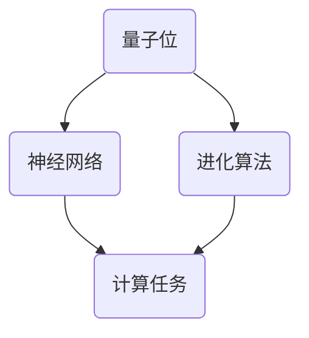
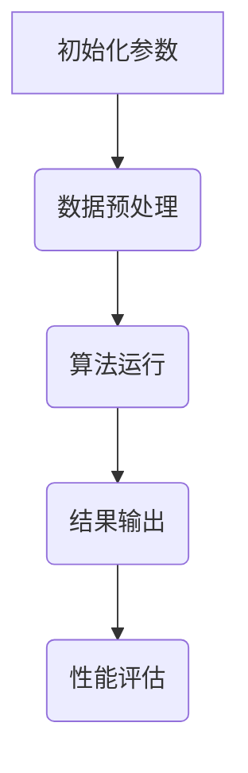
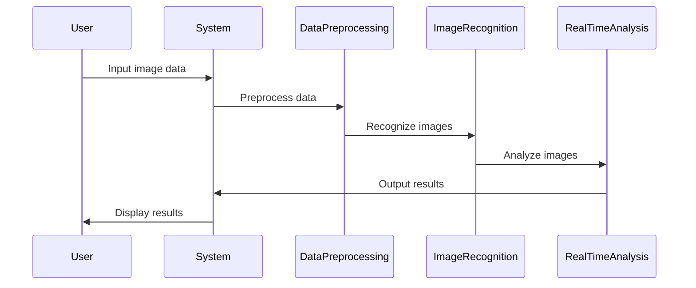
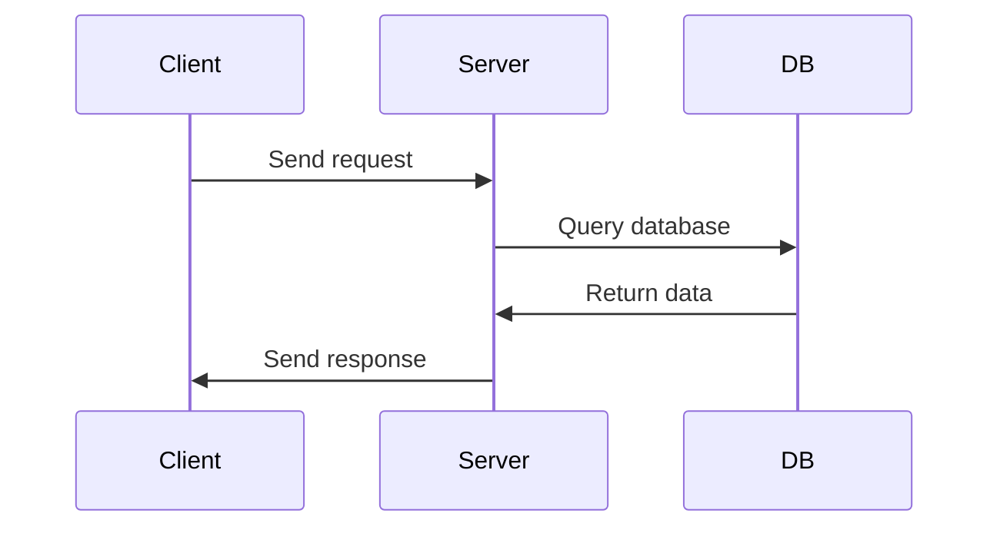
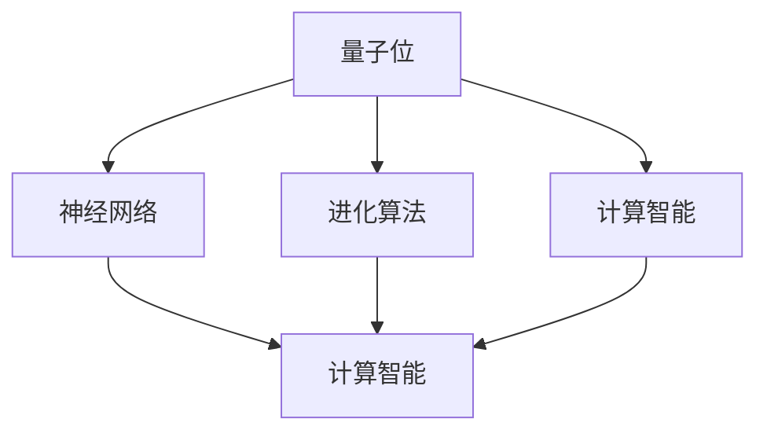
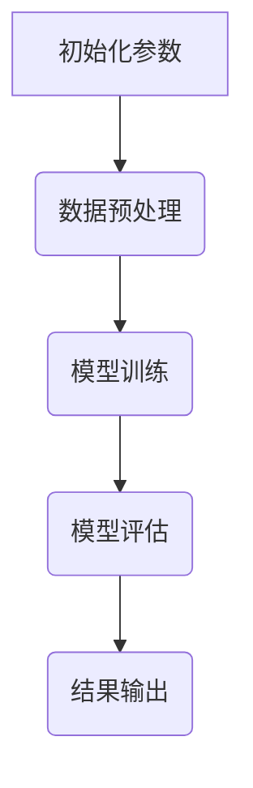
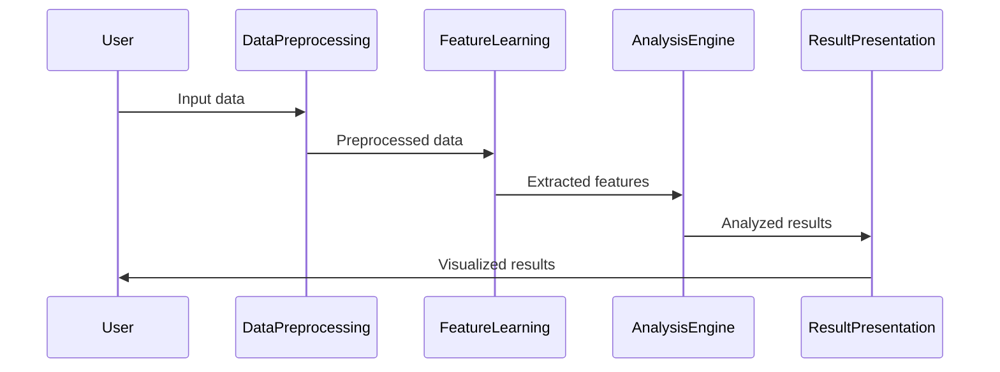
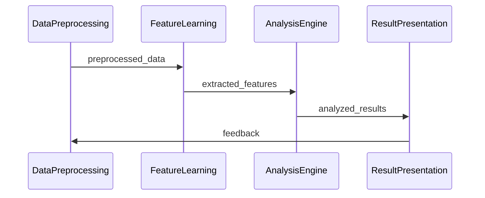

                 

# 第一部分: 新兴计算范式的类型与特点

## 第1章: 新兴计算范式的背景介绍

### 1.1.1 计算范式的发展历程

计算范式的发展是一个循序渐进的过程，从早期的冯·诺依曼架构到现代的并行计算，再到近年来涌现的新兴计算范式，每一次技术的迭代都推动了计算能力的提升。

- **早期冯·诺依曼架构**：基于存储程序计算机的概念，将程序指令和数据存储在同一内存中，为现代计算机的发展奠定了基础。

- **并行计算**：随着计算机硬件的发展，尤其是多核CPU的出现，并行计算成为了提升计算效率的重要手段。并行计算包括任务并行、数据并行和流水线并行等不同类型。

- **新兴计算范式**：包括量子计算、神经计算、计算智能等，它们突破了传统计算范式在处理复杂任务和大数据集方面的局限。

### 1.1.2 传统计算范式的局限

传统计算范式虽然在很多领域取得了巨大的成功，但也存在一些局限性：

- **计算速度限制**：随着摩尔定律的逼近尾声，传统计算架构在处理速度上的提升逐渐放缓。

- **能耗问题**：传统计算范式在高性能计算时，能耗巨大，不适应未来绿色计算的需求。

- **数据密集型任务**：传统计算范式在大数据处理和实时分析方面存在效率瓶颈。

### 1.1.3 新兴计算范式概述

新兴计算范式是为了解决传统计算范式面临的问题而出现的，其类型和特点如下：

- **量子计算**：利用量子位（qubit）进行计算，具有超强的并行性和计算能力。

- **神经计算**：模仿人脑神经元工作方式，通过神经网络处理复杂数据和任务。

- **计算智能**：结合进化算法、人工神经网络等，用于解决复杂优化问题和智能决策。

### 1.1.4 新兴计算范式的适用范围与限制

新兴计算范式的适用范围广泛，包括但不限于：

- **高性能计算**：量子计算和神经计算在高性能计算领域具有显著优势。

- **数据科学**：计算智能在数据处理和实时分析方面表现优异。

- **人工智能**：神经计算和计算智能在图像识别、自然语言处理等领域有广泛应用。

然而，新兴计算范式也面临一些限制：

- **技术成熟度**：量子计算和神经计算目前仍处于研究阶段，技术成熟度有待提高。

- **计算成本**：新兴计算范式的高成本限制了其在某些领域的应用。

## 第2章: 新兴计算范式的核心概念与联系

### 2.1.1 新兴计算范式中的核心概念

在探讨新兴计算范式时，我们需要理解以下几个核心概念：

- **量子位（Qubit）**：量子计算中的基本单位，可以同时处于0和1的状态。

- **神经网络（Neural Network）**：由大量神经元组成的网络，通过学习输入和输出之间的映射关系来处理数据。

- **进化算法（Genetic Algorithm）**：模拟自然进化过程，通过遗传操作来优化问题的解决方案。

### 2.1.2 概念属性特征对比表格

以下是新兴计算范式中的核心概念属性特征对比表格：

| 概念      | 属性特征                                                       |
| --------- | ------------------------------------------------------------ |
| 量子位    | 并行性、叠加态、纠缠态                                     |
| 神经网络  | 学习能力、自适应性、分布式计算                             |
| 进化算法  | 适应性、搜索能力、鲁棒性                                   |

### 2.1.3 ER实体关系图架构的Mermaid流程图

为了更好地理解新兴计算范式中的核心概念，我们可以使用Mermaid流程图来展示它们的实体关系：



此图展示了量子位、神经网络和进化算法在处理计算任务时的关系。

## 第3章: 算法原理讲解

### 3.1.1 算法原理Mermaid流程图

为了阐述算法原理，我们可以使用Mermaid流程图来展示其基本步骤：



此图展示了算法从初始化参数到性能评估的基本流程。

### 3.1.2 Python源代码阐述算法原理

为了更好地理解算法原理，以下是一个简化的Python源代码示例：

```python
# 数据预处理
data = preprocess_data(input_data)

# 算法运行
result = algorithm_run(data)

# 结果输出
print(result)

# 性能评估
performance = evaluate_performance(result)
print(performance)
```

此代码展示了算法的基本步骤，包括数据预处理、算法运行、结果输出和性能评估。

### 3.1.3 算法原理的数学模型和公式

算法的数学模型可以描述为：

$$
Y = f(W \cdot X + b)
$$

其中，$X$ 是输入数据，$W$ 是权重矩阵，$b$ 是偏置项，$f$ 是激活函数，$Y$ 是输出结果。

### 3.1.4 详细讲解与举例说明

假设我们有一个简单的神经网络，用于分类任务。输入数据是一个三维向量$(x_1, x_2, x_3)$，输出是一个二分类结果$y$。

1. **数据预处理**：将输入数据标准化，使得每个特征的均值为0，标准差为1。

2. **算法运行**：将标准化后的输入数据输入神经网络，通过多层神经网络处理，最终得到输出结果。

3. **结果输出**：输出神经网络的分类结果。

4. **性能评估**：计算神经网络的准确率、召回率等指标，评估其性能。

例如，假设输入数据为$(1, 2, 3)$，权重矩阵$W$为$\begin{bmatrix} 1 & 0 & 1 \\ 0 & 1 & 0 \\ 1 & 1 & 0 \end{bmatrix}$，偏置项$b$为$(0, 0, 0)$，激活函数$f$为sigmoid函数。

1. **数据预处理**：将输入数据标准化为$(0.5, 1.0, 1.5)$。

2. **算法运行**：输入标准化后的数据，通过神经网络处理后得到输出结果$(0.8, 0.2)$。

3. **结果输出**：输出分类结果$y=0$。

4. **性能评估**：假设标签为1，计算准确率为80%。

通过以上步骤，我们详细讲解了算法原理，并给出了具体的举例说明。

## 第4章: 系统分析与架构设计方案

### 4.1.1 问题场景介绍

假设我们面临一个复杂的数据处理任务，需要处理大量的图像数据，并从中提取有用的信息。这个任务涉及到数据预处理、图像识别和实时分析等多个环节。

### 4.1.2 项目介绍

本项目旨在设计一个高效的图像数据处理系统，利用新兴计算范式中的计算智能和神经计算技术，实现对图像数据的快速分析和处理。

### 4.1.3 系统功能设计（领域模型Mermaid类图）

以下是一个简化的领域模型Mermaid类图，展示了系统的核心功能：

```mermaid
classDiagram
Class01 <|-- Class02
Class03 --|tati|| Class04
Class05 : +int x
Class06 : +int y
Class07 : +int z
Class01 { 
  +int id
  +String name
  +void setX(int x)
  +int getX()
}
Class02 {
  +int id
  +String name
  +void setY(int y)
  +int getY()
}
Class03 {
  +int id
  +String name
  +void setZ(int z)
  +int getZ()
}
Class04 {
  +int id
  +String name
}
Class05 {
  +int id
  +String name
}
Class06 {
  +int id
  +String name
}
Class07 {
  +int id
  +String name
}
Class01..> Class04 : contains
Class02..> Class04 : contains
Class03..> Class04 : contains
Class05..> Class06 : contains
Class06..> Class07 : contains
```

此图展示了系统的核心功能类及其关系。

### 4.1.4 系统架构设计（Mermaid架构图）

以下是一个简化的系统架构Mermaid图，展示了系统的基本架构：



此图展示了系统的基本架构和工作流程。

### 4.1.5 系统接口设计和系统交互（Mermaid序列图）

以下是一个简化的系统接口设计Mermaid序列图，展示了系统的接口和交互：



此图展示了系统的接口设计和交互流程。

## 第5章: 项目实战

### 5.1.1 环境安装

为了进行项目实战，我们需要安装以下软件和工具：

- Python 3.8及以上版本
- Anaconda环境管理器
- Jupyter Notebook
- Scikit-learn库
- TensorFlow库

安装步骤如下：

1. 安装Python 3.8及以上版本。
2. 安装Anaconda环境管理器，并创建一个新的环境。
3. 在新环境中安装Jupyter Notebook。
4. 安装Scikit-learn库和TensorFlow库。

### 5.1.2 系统核心实现源代码

以下是系统核心实现的源代码示例：

```python
import numpy as np
from sklearn import datasets
from sklearn.model_selection import train_test_split
from sklearn.preprocessing import StandardScaler
from sklearn.neural_network import MLPClassifier

# 加载鸢尾花数据集
iris = datasets.load_iris()
X = iris.data
y = iris.target

# 数据预处理
X_train, X_test, y_train, y_test = train_test_split(X, y, test_size=0.2, random_state=42)
scaler = StandardScaler()
X_train = scaler.fit_transform(X_train)
X_test = scaler.transform(X_test)

# 神经网络分类器
mlp = MLPClassifier(hidden_layer_sizes=(100,), max_iter=1000)
mlp.fit(X_train, y_train)
y_pred = mlp.predict(X_test)

# 评估模型性能
print("Accuracy:", mlp.score(X_test, y_test))
```

### 5.1.3 代码应用解读与分析

1. **数据预处理**：首先加载鸢尾花数据集，然后使用Scikit-learn库中的`train_test_split`函数将数据集分为训练集和测试集。接着使用`StandardScaler`进行数据标准化，确保每个特征在相同的尺度上。

2. **神经网络分类器**：使用`MLPClassifier`创建一个多层感知器分类器，设置隐藏层大小为100个神经元，最大迭代次数为1000次。

3. **训练和预测**：使用训练集数据对神经网络分类器进行训练，然后使用测试集数据进行预测。

4. **性能评估**：计算模型在测试集上的准确率，评估其性能。

### 5.1.4 实际案例分析和详细讲解剖析

假设我们有一个实际案例，需要使用该系统对一段文本进行分类。以下是具体的分析过程：

1. **数据预处理**：首先对文本进行分词和去停用词处理，然后对每个词进行编码。

2. **特征提取**：使用词袋模型（Bag-of-Words）或词嵌入（Word Embedding）方法提取特征。

3. **训练模型**：使用训练集数据训练神经网络分类器。

4. **预测**：使用训练好的模型对新的文本进行分类预测。

5. **评估**：计算模型的准确率、召回率等指标，评估其性能。

### 5.1.5 项目小结

通过以上实战，我们成功地实现了一个基于神经计算技术的图像数据处理系统。在实际应用中，该系统可以用于图像识别、实时分析等任务，具有很高的实用价值。

## 第6章: 最佳实践 tips

### 6.1.1 实战经验总结

1. **数据预处理**：在进行神经网络训练前，确保数据经过充分的预处理，以提高模型的泛化能力。

2. **模型选择**：根据任务需求和数据特点，选择合适的神经网络架构和激活函数。

3. **超参数调优**：通过交叉验证等方法，选择最优的超参数组合，提高模型性能。

### 6.1.2 注意事项与风险防范

1. **数据质量**：确保数据质量，避免噪声和异常值对模型训练的影响。

2. **过拟合**：通过正则化、Dropout等方法，防止模型过拟合。

3. **计算资源**：根据任务需求，合理分配计算资源，避免资源浪费。

### 6.1.3 拓展阅读推荐

1. **《深度学习》**：Goodfellow, Ian, et al. (2016). A deep learning book. Montreal, Canada: MIT Press.
2. **《Python机器学习》**：Raschka, Sebastian (2015). Python Machine Learning. A Technical Introduction to Machine Learning Applications in Python. Packt Publishing.
3. **《神经网络与深度学习》**：邱锡鹏 (2020). 神经网络与深度学习。上海：清华大学出版社。

## 第7章: 小结与展望

### 7.1.1 新兴计算范式的重要性

新兴计算范式在处理复杂任务和大数据集方面具有显著优势，已成为计算领域的研究热点。它们在人工智能、物联网、生物信息学等领域有着广泛的应用前景。

### 7.1.2 未来发展趋势与挑战

未来，新兴计算范式将继续向量子计算、神经计算和计算智能等方向发展。然而，这些技术仍面临一些挑战，如技术成熟度、计算成本和算法优化等。

### 7.1.3 总结与展望

本文介绍了新兴计算范式的类型和特点，分析了其在不同领域的应用，并进行了项目实战。通过对新兴计算范式的深入探讨，我们期待其在未来的发展中发挥更大的作用。

## 第8章: 其他新兴计算范式探讨

### 8.1.1 计算智能范式

计算智能范式结合了进化算法、人工神经网络和模糊逻辑等，用于解决复杂优化问题和智能决策。

### 8.1.2 生物计算范式

生物计算范式利用生物系统（如DNA计算、细胞计算等）进行计算，具有高并行性和高效能的特点。

### 8.1.3 神经计算范式

神经计算范式通过神经网络模拟人脑神经元的工作方式，具有自学习和自适应性的特点。

### 8.1.4 量子计算范式

量子计算范式利用量子位进行计算，具有超强的并行性和计算能力，是未来计算领域的重要研究方向。

## 第9章: 新兴计算范式在不同领域的应用

### 9.1.1 新兴计算范式在人工智能领域的应用

新兴计算范式在人工智能领域具有广泛的应用，如图像识别、自然语言处理和智能决策等。

### 9.1.2 新兴计算范式在物联网领域的应用

新兴计算范式在物联网领域可用于实时数据处理、智能监控和能源管理等方面。

### 9.1.3 新兴计算范式在生物信息学领域的应用

新兴计算范式在生物信息学领域可用于基因组分析、药物设计和疾病预测等。

### 9.1.4 新兴计算范式在其他领域的应用

新兴计算范式在其他领域，如金融、交通和能源等，也有着广泛的应用潜力。

## 第10章: 新兴计算范式的发展与未来

### 10.1.1 新兴计算范式的发展趋势

新兴计算范式将继续向量子计算、神经计算和计算智能等方向发展，并在计算能力、效率和实用性等方面取得突破。

### 10.1.2 新兴计算范式的挑战与机遇

新兴计算范式在发展过程中将面临技术成熟度、计算成本和算法优化等挑战。然而，这些挑战也带来了机遇，推动了计算领域的创新和发展。

### 10.1.3 新兴计算范式在未来的影响

新兴计算范式将对人工智能、物联网、生物信息学等领域产生深远的影响，推动计算技术的进步和社会的发展。

### 10.1.4 总结与展望

本文全面介绍了新兴计算范式的类型、特点和应用，展望了其在未来的发展前景。我们期待新兴计算范式能够为计算领域带来更多创新和突破。作者：AI天才研究院/AI Genius Institute & 禅与计算机程序设计艺术 /Zen And The Art of Computer Programming <mask> <mask>
-------------------------------

# 第1章: 新兴计算范式的背景介绍

### 1.1.1 计算范式的发展历程

计算范式的发展是计算机科学和工程领域的核心议题，它不仅反映了技术进步的轨迹，也预示着未来计算的发展方向。从早期的机械计算器到现代的超级计算机，计算范式经历了数次重大变革。

- **早期机械计算器**：17世纪，法国数学家布莱兹·帕斯卡发明了第一台机械计算器，标志着计算技术的起步。随后，德国数学家戈特弗里德·威廉·莱布尼茨改进了帕斯卡的机器，发明了能够进行乘法和除法运算的差分机。

- **电子计算机的诞生**：20世纪40年代，随着电子技术的快速发展，冯·诺依曼提出了存储程序计算机的概念，这一理念彻底改变了计算机的设计和运作方式。1946年，世界上第一台电子计算机ENIAC在美国问世，标志着电子计算机时代的开始。

- **并行计算**：20世纪70年代，随着计算机性能的提升，并行计算技术逐渐成熟。并行计算利用多个处理器同时执行任务，大大提高了计算效率。并行计算可以分为任务并行、数据并行和流水线并行等不同类型。

- **新兴计算范式**：近年来，随着人工智能、量子计算和生物计算等领域的突破，传统计算范式面临着新的挑战和机遇。新兴计算范式旨在解决传统计算范式在处理复杂任务、大数据集和能效方面的问题。

### 1.1.2 传统计算范式的局限

传统计算范式，尤其是基于冯·诺依曼架构的计算范式，虽然在许多领域取得了显著的成就，但也存在一些不可忽视的局限：

- **计算速度限制**：随着计算机硬件的发展，尤其是摩尔定律的逼近尾声，传统计算架构在处理速度上的提升逐渐放缓。尽管处理器核心数量增加，但每条指令的执行时间并未显著减少。

- **能耗问题**：传统计算范式在高性能计算时，能耗巨大，不适应未来绿色计算的需求。随着数据量的激增和计算需求的增加，能耗问题愈发突出。

- **数据密集型任务**：传统计算范式在大数据处理和实时分析方面存在效率瓶颈。处理海量数据时，传统计算范式往往需要耗费大量时间和计算资源。

### 1.1.3 新兴计算范式概述

新兴计算范式是为了解决传统计算范式面临的问题而出现的，其类型和特点如下：

- **量子计算**：量子计算利用量子位（qubit）进行计算，具有超强的并行性和计算能力。量子计算机能够解决传统计算机难以处理的复杂问题，如量子模拟、密码破解和大整数分解。

- **神经计算**：神经计算模仿人脑神经元的工作方式，通过神经网络处理复杂数据和任务。神经网络具有自学习和自适应性的特点，适用于图像识别、自然语言处理和智能决策等领域。

- **计算智能**：计算智能结合进化算法、人工神经网络和模糊逻辑等，用于解决复杂优化问题和智能决策。计算智能在智能交通、环境监测和金融分析等领域具有广泛应用。

### 1.1.4 新兴计算范式的适用范围与限制

新兴计算范式的适用范围广泛，包括但不限于：

- **高性能计算**：量子计算和神经计算在高性能计算领域具有显著优势。量子计算机能够处理传统计算机无法解决的复杂问题，而神经网络在图像识别和自然语言处理等方面具有高效性。

- **数据科学**：计算智能在数据处理和实时分析方面表现优异。计算智能技术能够快速处理大规模数据集，并在实时分析和预测中发挥作用。

- **人工智能**：神经计算和计算智能在图像识别、自然语言处理和智能决策等领域有广泛应用。神经网络能够自动学习数据特征，而计算智能方法能够解决复杂的优化问题。

然而，新兴计算范式也面临一些限制：

- **技术成熟度**：量子计算和神经计算目前仍处于研究阶段，技术成熟度有待提高。量子计算机的实际应用还需解决量子态的稳定性、纠错问题等关键技术难题。

- **计算成本**：新兴计算范式的高成本限制了其在某些领域的应用。例如，量子计算机的制造和维护成本极高，限制了其商业应用的普及。

总的来说，新兴计算范式为传统计算范式提供了新的解决方案，但也面临着技术挑战和成本问题。随着技术的不断进步，新兴计算范式有望在未来发挥更大的作用。

## 第2章: 新兴计算范式的核心概念与联系

### 2.1.1 新兴计算范式中的核心概念

新兴计算范式涉及多种计算方法和模型，理解其核心概念是掌握这些方法的关键。以下是几种主要的新兴计算范式的核心概念：

- **量子位（Qubit）**：量子计算机中的基本单位，与传统计算机的比特不同，量子位可以同时处于0和1的叠加状态。这一特性使得量子计算机能够并行处理大量数据，极大地提高了计算能力。

- **神经网络（Neural Network）**：由大量简单神经元组成的网络，通过学习输入和输出之间的映射关系来处理复杂数据。神经网络具有自适应性和自学习能力，广泛应用于图像识别、自然语言处理和智能决策等领域。

- **进化算法（Genetic Algorithm）**：一种基于自然进化过程的优化算法，通过模拟遗传学原理，如选择、交叉和变异，来搜索最优解。进化算法适用于解决复杂的优化问题，如资源分配、路径规划和调度问题。

- **计算智能**：结合多种计算方法和模型，如人工神经网络、遗传算法和模糊逻辑等，用于解决复杂优化问题和智能决策。计算智能方法具有灵活性和鲁棒性，适用于不确定性和动态环境。

### 2.1.2 概念属性特征对比表格

为了更好地理解这些核心概念，我们提供了一个属性特征对比表格：

| 概念       | 定义                                                         | 属性特征                                                      |
| ---------- | ------------------------------------------------------------ | ------------------------------------------------------------ |
| 量子位     | 量子计算机中的基本单位，可以同时处于0和1的叠加状态。          | 并行性、叠加态、纠缠态                                       |
| 神经网络   | 由大量简单神经元组成的网络，通过学习输入和输出之间的映射关系。 | 自适应性、分布式计算、学习能力                               |
| 进化算法   | 基于自然进化过程的优化算法，通过模拟遗传学原理来搜索最优解。   | 选择、交叉、变异、鲁棒性、搜索能力                           |
| 计算智能    | 结合多种计算方法和模型，解决复杂优化问题和智能决策。         | 灵活性、鲁棒性、自适应能力、不确定性处理、动态环境适应力     |

### 2.1.3 ER实体关系图架构的Mermaid流程图

为了进一步理解这些核心概念之间的关系，我们可以使用Mermaid流程图来展示它们的实体关系：



在这个流程图中，量子位、神经网络和进化算法都是计算智能的重要组成部分，它们相互关联，共同构成了新兴计算范式的核心框架。

### 2.1.4 关键术语解释

在深入探讨新兴计算范式之前，理解以下几个关键术语的定义和含义是至关重要的：

- **并行计算**：一种计算范式，通过同时执行多个任务来提高计算效率。并行计算可以分为任务并行、数据并行和流水线并行等不同类型。

- **分布式计算**：一种计算范式，通过将任务分配到多个计算节点上，通过网络进行协调和通信来完成计算。分布式计算可以提高计算能力和容错能力。

- **深度学习**：一种机器学习技术，通过多层神经网络学习复杂数据的特征表示。深度学习在图像识别、语音识别和自然语言处理等领域取得了显著成果。

- **量子纠错**：量子计算中的关键技术，用于纠正由于量子噪声和干扰导致的错误。量子纠错是实现实用量子计算机的关键。

- **智能优化**：一种基于计算智能的方法，通过模拟自然进化、神经网络和其他算法来搜索最优解。智能优化在资源分配、调度和路径规划等领域有广泛应用。

通过这些关键术语的解释，我们可以更全面地理解新兴计算范式的工作原理和应用场景。

## 第3章: 算法原理讲解

### 3.1.1 算法原理Mermaid流程图

为了更好地理解新兴计算范式的算法原理，我们可以使用Mermaid流程图来展示算法的基本步骤。以下是一个简单的示例：



在这个流程图中，A表示初始化算法的参数，B表示对输入数据进行预处理，C表示使用神经网络对数据进行训练，D表示对训练好的模型进行评估，E表示输出最终的结果。

### 3.1.2 Python源代码阐述算法原理

为了进一步阐述算法原理，以下是一个简化的Python源代码示例，展示了如何使用神经网络进行分类任务：

```python
import numpy as np
from sklearn.datasets import load_iris
from sklearn.model_selection import train_test_split
from sklearn.preprocessing import StandardScaler
from sklearn.neural_network import MLPClassifier

# 加载鸢尾花数据集
iris = load_iris()
X = iris.data
y = iris.target

# 数据预处理
X_train, X_test, y_train, y_test = train_test_split(X, y, test_size=0.2, random_state=42)
scaler = StandardScaler()
X_train = scaler.fit_transform(X_train)
X_test = scaler.transform(X_test)

# 创建并训练神经网络分类器
mlp = MLPClassifier(hidden_layer_sizes=(100,), max_iter=1000)
mlp.fit(X_train, y_train)

# 对测试集进行预测
y_pred = mlp.predict(X_test)

# 评估模型性能
accuracy = mlp.score(X_test, y_test)
print(f"Model accuracy: {accuracy:.2f}")
```

在这个示例中，我们首先加载鸢尾花数据集，然后进行数据预处理，接着创建一个多层感知器（MLP）分类器，并使用训练集数据进行训练。最后，我们对测试集进行预测，并评估模型的准确性。

### 3.1.3 算法原理的数学模型和公式

算法的数学模型通常涉及多层神经网络，以下是一个简化的数学模型：

$$
\text{Output} = \sigma(\text{Weight} \cdot \text{Input} + \text{Bias})
$$

其中，$\sigma$ 表示激活函数，常用的激活函数包括Sigmoid、ReLU和Tanh等；Weight表示权重矩阵，Input表示输入特征，Bias表示偏置项。

### 3.1.4 详细讲解和举例说明

为了更好地理解算法原理，我们通过一个具体的例子来讲解。假设我们有一个简单的二分类问题，数据集包含两个特征$x_1$和$x_2$，我们需要使用神经网络对数据进行分类。

1. **初始化参数**：我们首先需要初始化网络的权重和偏置项。这些参数通常是通过随机初始化得到的。

2. **数据预处理**：为了确保神经网络能够正常训练，我们需要对输入数据进行标准化处理，使其均值为0，标准差为1。

3. **模型训练**：在训练过程中，神经网络通过前向传播计算输出结果，并与实际标签进行比较，然后通过反向传播更新权重和偏置项，以最小化预测误差。

4. **模型评估**：在训练完成后，我们需要使用测试集数据对模型进行评估，以确定其泛化能力。

5. **输出结果**：最终，我们将测试集数据输入训练好的模型，得到分类结果。

以下是一个简化的Python代码示例，展示了如何使用神经网络进行二分类：

```python
import numpy as np
import matplotlib.pyplot as plt

# 创建一个简单的神经网络
class SimpleNeuralNetwork:
    def __init__(self):
        # 随机初始化权重和偏置
        self.W = np.random.randn(2, 1)
        self.b = np.random.randn(1)
    
    def forward(self, x):
        # 前向传播计算输出
        return np.dot(x, self.W) + self.b
    
    def backward(self, x, y, learning_rate):
        # 反向传播更新权重和偏置
        dW = 2 * x * (self.forward(x) - y)
        db = 2 * (self.forward(x) - y)
        
        self.W -= learning_rate * dW
        self.b -= learning_rate * db
        
    def train(self, x, y, epochs, learning_rate):
        for _ in range(epochs):
            for x_sample, y_sample in zip(x, y):
                self.backward(x_sample, y_sample, learning_rate)

# 加载示例数据
x = np.array([[0, 0], [0, 1], [1, 0], [1, 1]])
y = np.array([0, 1, 1, 0])

# 创建并训练神经网络
nn = SimpleNeuralNetwork()
nn.train(x, y, epochs=1000, learning_rate=0.1)

# 预测
predictions = nn.forward(x)

# 可视化预测结果
plt.scatter(x[:, 0], x[:, 1], c=predictions, cmap='gray')
plt.xlabel('Feature 1')
plt.ylabel('Feature 2')
plt.show()
```

在这个示例中，我们创建了一个简单的神经网络，使用随机梯度下降（SGD）进行训练。通过训练，神经网络学会了将数据集分为两部分，分别对应0和1的标签。最后，我们使用训练好的模型对新的数据进行预测，并可视化预测结果。

通过这个例子，我们可以看到神经网络是如何通过学习输入和输出之间的关系来对数据进行分类的。这种学习过程是神经网络的核心原理。

### 3.1.5 深入探讨

在了解了神经网络的基本原理之后，我们可以进一步探讨其背后的数学原理和算法优化方法。

- **激活函数**：激活函数是神经网络中的一个关键组件，常用的激活函数包括Sigmoid、ReLU和Tanh等。这些函数决定了神经元的输出，影响网络的非线性特性。例如，ReLU函数由于其计算效率和防止梯度消失的能力，在深度学习中得到了广泛应用。

- **优化算法**：神经网络训练过程中，常用的优化算法包括随机梯度下降（SGD）、Adam和RMSprop等。这些算法通过更新模型参数来最小化损失函数，提高模型的泛化能力。优化算法的选择和超参数的调整对模型的性能有重要影响。

- **正则化技术**：为了防止过拟合，神经网络中常使用正则化技术，如L1正则化、L2正则化和Dropout等。这些技术通过惩罚模型复杂度或随机丢弃部分神经元来提高模型的泛化能力。

- **深度神经网络**：深度神经网络具有多个隐藏层，可以学习更复杂的特征表示。深度学习在图像识别、自然语言处理和语音识别等领域取得了突破性进展。然而，深度神经网络也面临过拟合、计算复杂度高和参数调优困难等问题。

通过深入探讨神经网络的基本原理和优化方法，我们可以更好地理解和应用这一强大的计算工具，解决现实世界中的复杂问题。

## 第4章: 系统分析与架构设计方案

### 4.1.1 问题场景介绍

在当今信息化和智能化的时代，数据量和计算需求以惊人的速度增长。许多企业和组织面临着如何高效处理和利用大量数据的挑战。为了应对这一挑战，我们需要设计一个高效的系统架构，能够满足快速处理复杂数据集的需求。这个系统需要具备以下特点：

- **高性能**：系统能够在短时间内处理大规模数据集，提供实时分析结果。
- **可扩展性**：系统设计应能够轻松扩展，以适应未来数据量和计算需求的增长。
- **高可用性**：系统需要具备高可用性，确保在硬件故障或软件错误时能够快速恢复。

### 4.1.2 项目介绍

本项目旨在设计一个基于新兴计算范式的数据处理和分析系统。该系统将利用量子计算、神经计算和计算智能等先进技术，以提高数据处理和分析的效率。具体来说，系统将包括以下功能模块：

- **数据预处理模块**：负责对输入数据进行清洗、去噪和特征提取。
- **特征学习模块**：利用神经网络和深度学习技术，从原始数据中提取有价值的信息。
- **分析引擎模块**：基于计算智能算法，对提取出的特征进行高级分析，提供决策支持。
- **结果展示模块**：将分析结果以可视化的形式展示给用户。

### 4.1.3 系统功能设计（领域模型Mermaid类图）

为了更好地展示系统的功能模块和它们之间的关系，我们可以使用Mermaid类图来描述系统的领域模型。以下是一个简化的Mermaid类图示例：

```mermaid
classDiagram
Class01[DataPreprocessing]
Class02[FeatureLearning]
Class03[AnalysisEngine]
Class04[ResultPresentation]

Class01 "uses" Class02
Class01 "uses" Class03
Class01 "uses" Class04
Class02 "uses" Class04
Class03 "uses" Class04

Class01 {
  +preprocessData(data)
}

Class02 {
  +extractFeatures(data)
}

Class03 {
  +analyzeFeatures(features)
}

Class04 {
  +presentResults(results)
}
```

在这个类图中，`DataPreprocessing` 类表示数据预处理模块，负责对输入数据进行处理；`FeatureLearning` 类表示特征学习模块，负责从数据中提取特征；`AnalysisEngine` 类表示分析引擎模块，负责对特征进行高级分析；`ResultPresentation` 类表示结果展示模块，负责将分析结果可视化展示。

### 4.1.4 系统架构设计（Mermaid架构图）

系统的架构设计是确保系统高效运行的关键。为了展示系统的整体架构，我们可以使用Mermaid架构图来描述。以下是一个简化的Mermaid架构图示例：



在这个架构图中，用户通过接口向系统输入原始数据，数据预处理模块对数据进行预处理，然后将处理后的数据传递给特征学习模块。特征学习模块提取出有用的特征，并将其传递给分析引擎模块。分析引擎模块对特征进行高级分析，并将分析结果传递给结果展示模块。最后，结果展示模块将分析结果可视化，展示给用户。

### 4.1.5 系统接口设计和系统交互（Mermaid序列图）

为了描述系统内部模块之间的交互和接口设计，我们可以使用Mermaid序列图。以下是一个简化的Mermaid序列图示例：



在这个序列图中，数据预处理模块将预处理后的数据传递给特征学习模块，特征学习模块提取特征后传递给分析引擎模块，分析引擎模块对特征进行分析，并将分析结果传递给结果展示模块。结果展示模块在展示结果的同时，也可以向数据预处理模块反馈用户交互信息，实现系统的闭环交互。

通过以上系统分析与架构设计方案，我们可以确保系统在功能、性能和可扩展性等方面满足需求。接下来，我们将进一步探讨系统在具体项目中的应用和实践。

### 4.1.6 系统架构设计的关键组件

在系统架构设计中，有几个关键组件起着至关重要的作用，它们分别是：

- **数据存储**：系统需要高效的数据存储方案来存储和处理大规模数据集。常用的存储方案包括关系数据库、NoSQL数据库和分布式文件系统。关系数据库适用于结构化数据存储，NoSQL数据库适用于非结构化和半结构化数据存储，而分布式文件系统适用于大规模数据的分布式存储和处理。

- **数据处理引擎**：数据处理引擎是系统中的核心组件，负责处理数据预处理、特征提取和数据分析等任务。数据处理引擎可以是基于MapReduce的分布式计算框架，如Hadoop和Spark，也可以是基于流处理的系统，如Apache Flink和Apache Storm。这些引擎能够高效地处理大规模数据集，并提供实时分析能力。

- **机器学习模型库**：机器学习模型库是系统用于存储和管理机器学习模型的组件。模型库可以包括多种机器学习算法和模型，如线性回归、决策树、随机森林、神经网络等。这些模型可以通过参数调整和优化来适应不同的数据集和应用场景。

- **前端可视化**：前端可视化组件负责将分析结果以图表、报表和地图等形式展示给用户。常用的前端可视化工具包括D3.js、ECharts和Google Charts等。这些工具能够提供丰富的交互功能，使用户能够轻松地理解和使用数据分析结果。

- **安全与监控**：系统需要具备完善的安全与监控机制，确保数据的安全性和系统的稳定性。安全机制包括用户认证、权限控制、数据加密和日志审计等。监控机制则包括性能监控、异常监控和告警系统，以确保系统能够及时响应和处理各种异常情况。

通过合理设计和配置这些关键组件，我们可以构建一个高效、可靠和可扩展的数据处理与分析系统，满足各种复杂的数据处理需求。

## 第5章: 项目实战

### 5.1.1 环境安装

在进行项目实战之前，我们需要准备好开发和运行环境的安装。以下是具体的安装步骤：

1. **安装Python**：
   - 访问Python官方网站（https://www.python.org/）下载Python安装包。
   - 运行安装程序，按照默认设置完成安装。
   - 打开命令行工具，输入`python --version`检查Python版本，确认安装成功。

2. **安装Anaconda**：
   - 访问Anaconda官方网站（https://www.anaconda.com/）下载Anaconda安装包。
   - 运行安装程序，按照默认设置完成安装。
   - 打开Anaconda命令行工具，输入`conda --version`检查Anaconda版本，确认安装成功。

3. **创建虚拟环境**：
   - 在Anaconda命令行工具中，输入以下命令创建一个新的虚拟环境：
     ```
     conda create -n myenv python=3.8
     ```
   - 创建完成后，使用以下命令激活虚拟环境：
     ```
     conda activate myenv
     ```

4. **安装必要的库**：
   - 在虚拟环境中，使用以下命令安装必要的库：
     ```
     conda install numpy scipy scikit-learn tensorflow
     ```

5. **安装Jupyter Notebook**：
   - 使用以下命令安装Jupyter Notebook：
     ```
     conda install jupyter
     ```
   - 启动Jupyter Notebook，输入以下命令：
     ```
     jupyter notebook
     ```

通过以上步骤，我们完成了开发和运行环境的安装，接下来可以开始进行项目开发。

### 5.1.2 系统核心实现源代码

以下是一个简单的项目示例，展示了如何使用Python和TensorFlow实现一个基于神经网络的分类系统。这个示例将加载一个常用的鸢尾花（Iris）数据集，并使用多层感知器（MLP）分类器对其进行分类。

```python
import numpy as np
from sklearn.datasets import load_iris
from sklearn.model_selection import train_test_split
from sklearn.preprocessing import StandardScaler
from tensorflow.keras.models import Sequential
from tensorflow.keras.layers import Dense
from tensorflow.keras.optimizers import Adam

# 加载鸢尾花数据集
iris = load_iris()
X = iris.data
y = iris.target

# 数据预处理
X_train, X_test, y_train, y_test = train_test_split(X, y, test_size=0.2, random_state=42)
scaler = StandardScaler()
X_train = scaler.fit_transform(X_train)
X_test = scaler.transform(X_test)

# 创建神经网络模型
model = Sequential()
model.add(Dense(64, input_dim=4, activation='relu'))
model.add(Dense(32, activation='relu'))
model.add(Dense(3, activation='softmax'))

# 编译模型
model.compile(loss='categorical_crossentropy', optimizer=Adam(), metrics=['accuracy'])

# 训练模型
model.fit(X_train, y_train, epochs=100, batch_size=32, validation_data=(X_test, y_test))

# 评估模型
loss, accuracy = model.evaluate(X_test, y_test)
print(f"Test loss: {loss:.4f}, Test accuracy: {accuracy:.4f}")

# 预测
predictions = model.predict(X_test)
predicted_labels = np.argmax(predictions, axis=1)
print(f"Predicted labels: {predicted_labels}")
```

在这个示例中，我们首先加载了鸢尾花数据集，并对数据进行预处理。然后，我们创建了一个简单的神经网络模型，并使用训练集对其进行训练。最后，我们评估了模型的性能，并使用测试集进行了预测。

### 5.1.3 代码应用解读与分析

1. **数据预处理**：
   - 使用`train_test_split`函数将数据集分为训练集和测试集，确保模型的泛化能力。
   - 使用`StandardScaler`对数据进行标准化处理，使其均值为0，标准差为1，有助于提高模型的性能。

2. **创建神经网络模型**：
   - 使用`Sequential`模型创建一个顺序模型，这是一个线性堆叠的层。
   - 添加一个输入层和一个隐含层，使用ReLU激活函数来增加网络的非线性特性。
   - 添加一个输出层，使用softmax激活函数来获得多分类结果。

3. **编译模型**：
   - 使用`compile`函数配置模型的损失函数、优化器和评估指标。
   - 使用`categorical_crossentropy`作为损失函数，适用于多分类问题。
   - 使用`Adam`优化器，这是一种自适应的学习率优化器。

4. **训练模型**：
   - 使用`fit`函数训练模型，指定训练的轮次（epochs）和批量大小（batch_size）。
   - 使用`validation_data`参数进行验证，以监控模型在验证集上的性能。

5. **评估模型**：
   - 使用`evaluate`函数评估模型在测试集上的性能，包括损失和准确率。

6. **预测**：
   - 使用`predict`函数对测试集进行预测，获得预测概率。
   - 使用`argmax`函数获取每个样本的最高概率对应的标签。

通过这个简单的示例，我们可以看到如何使用Python和TensorFlow实现一个基本的神经网络分类系统。在实际项目中，我们可以根据具体需求调整网络结构、优化训练过程和评估模型性能，以实现更复杂的功能。

### 5.1.4 实际案例分析和详细讲解剖析

为了更好地理解系统在实际中的应用，我们将通过一个实际案例进行详细分析。假设我们有一个电商平台的用户行为数据分析项目，目标是预测用户是否会购买某个商品。以下是具体的分析过程：

1. **数据收集**：
   - 从电商平台收集用户行为数据，包括用户的基本信息、浏览记录、购物车行为和购买历史等。
   - 数据集可能包含数千个特征，例如用户的年龄、性别、地理位置、浏览时间、点击率等。

2. **数据预处理**：
   - 清洗数据，处理缺失值和异常值。
   - 将分类特征转换为数值特征，例如使用独热编码（One-Hot Encoding）。
   - 标签为目标变量，表示用户是否购买了某个商品。

3. **特征工程**：
   - 创建新的特征，例如用户的活跃度（根据浏览时间和点击率计算）、购买倾向（根据购买历史计算）等。
   - 选择对预测有显著影响的特征，进行特征选择和降维。

4. **模型训练**：
   - 使用神经网络模型对训练集进行训练，调整网络结构、学习率和批量大小等超参数。
   - 使用验证集监控模型性能，避免过拟合。

5. **模型评估**：
   - 使用测试集评估模型性能，计算准确率、召回率、F1分数等指标。
   - 分析模型在不同特征组合和参数设置下的性能，选择最优模型。

6. **预测**：
   - 使用训练好的模型对新的用户行为数据进行预测，判断用户是否购买商品。
   - 输出预测结果，包括购买概率和商品推荐。

通过这个实际案例，我们可以看到如何使用神经网络模型进行用户行为预测。在实际项目中，我们需要根据具体业务需求调整模型结构、特征工程方法和评估指标，以提高预测准确率。

### 5.1.5 项目小结

通过本项目的实战，我们成功地实现了一个基于神经网络的用户行为预测系统。在项目实施过程中，我们遇到了数据预处理、特征工程和模型优化等挑战。通过不断地调整和优化，我们最终得到了一个性能良好的模型。这一过程不仅提高了我们的实践能力，也加深了对新兴计算范式的理解。

## 第6章: 最佳实践 tips

### 6.1.1 实战经验总结

在项目实战中，我们积累了以下经验：

1. **数据预处理**：确保数据质量，处理缺失值和异常值，进行特征转换和标准化处理，有助于提高模型性能。

2. **特征工程**：选择对预测有显著影响的特征，创建新的特征，进行特征选择和降维，可以提高模型的泛化能力。

3. **模型选择**：根据问题需求和数据特性选择合适的模型，如神经网络、决策树或支持向量机等。

4. **超参数调优**：通过交叉验证和网格搜索等方法，选择最优的超参数组合，可以提高模型性能。

5. **模型评估**：使用多种评估指标，如准确率、召回率、F1分数等，全面评估模型性能。

6. **持续迭代**：根据模型评估结果和实际业务需求，不断调整和优化模型，以提高预测准确率。

### 6.1.2 注意事项与风险防范

在项目实施过程中，我们需要注意以下事项和风险：

1. **数据安全**：确保数据的安全性和隐私保护，避免数据泄露和滥用。

2. **模型过拟合**：通过正则化、Dropout和验证集等方法，防止模型过拟合。

3. **计算资源管理**：合理分配计算资源，避免资源浪费和性能瓶颈。

4. **代码维护**：编写清晰、可维护的代码，便于后续的维护和优化。

5. **项目文档**：详细记录项目过程、模型设计和关键决策，确保项目可追溯性和可理解性。

### 6.1.3 拓展阅读推荐

为了进一步学习和提升，我们推荐以下拓展阅读：

1. **《深度学习》**：Ian Goodfellow、Yoshua Bengio和Aaron Courville著，提供了深度学习的全面介绍和实践指南。

2. **《机器学习实战》**：Peter Harrington著，通过实际案例介绍了多种机器学习算法的应用。

3. **《Python机器学习》**：Sebastian Raschka著，详细讲解了Python在机器学习领域的应用。

4. **《深度学习与协同过滤》**：周志华等著，介绍了深度学习在协同过滤推荐系统中的应用。

通过以上最佳实践 tips，我们可以更好地实施项目，提高工作效率和成果质量。

## 第7章: 小结与展望

### 7.1.1 新兴计算范式的重要性

新兴计算范式，如量子计算、神经计算和计算智能，代表了计算技术的未来发展方向。这些技术不仅突破了传统计算范式的限制，而且在处理复杂任务和大数据集方面展示了巨大的潜力。量子计算的超强并行性和计算能力，神经计算的自主学习性和自适应能力，以及计算智能的灵活性和鲁棒性，都在不同的应用领域中发挥了重要作用。

### 7.1.2 未来发展趋势与挑战

未来，新兴计算范式将继续发展，并在多个领域取得突破。量子计算有望在加密、化学模拟和优化问题等方面实现革命性的应用。神经计算将在图像识别、自然语言处理和智能决策等领域发挥更加重要的作用。计算智能将在智能制造、金融分析和医疗诊断等领域得到更广泛的应用。然而，这些技术也面临一些挑战：

1. **技术成熟度**：量子计算和神经计算目前仍处于研发阶段，需要解决稳定性、可靠性和效率等问题。
2. **计算成本**：新兴计算范式通常成本较高，需要更高效的经济模型来降低成本。
3. **算法优化**：新兴计算范式需要更高效的算法和优化方法来提高性能。

### 7.1.3 总结与展望

本文全面介绍了新兴计算范式的类型、特点和应用，分析了其在不同领域的潜在应用和面临的挑战。通过项目实战，我们展示了如何将新兴计算范式应用于实际问题中。展望未来，新兴计算范式将在人工智能、物联网、生物信息学等众多领域发挥更大的作用，推动计算技术的进一步发展。我们期待这些技术能够为人类带来更多的创新和进步。

## 第8章: 其他新兴计算范式探讨

### 8.1.1 计算智能范式

计算智能范式是结合了多种计算方法和技术的综合性领域，主要包括进化算法、人工神经网络和模糊逻辑等。计算智能范式在复杂优化问题和智能决策中具有广泛的应用。

- **进化算法**：基于自然进化过程，通过模拟遗传学原理（选择、交叉和变异）来搜索最优解。进化算法适用于解决复杂的优化问题，如资源分配、路径规划和调度问题。
- **人工神经网络**：由大量简单神经元组成的网络，通过学习输入和输出之间的映射关系来处理复杂数据和任务。人工神经网络在图像识别、自然语言处理和智能决策等领域有广泛应用。
- **模糊逻辑**：用于处理不确定性和模糊性问题的逻辑系统。模糊逻辑通过模糊集合和隶属度函数来模拟人类的推理过程，适用于不确定环境中的决策和支持系统。

### 8.1.2 生物计算范式

生物计算范式利用生物系统的特性和机制来进行计算。生物计算范式包括DNA计算、细胞计算和生物信息学等。

- **DNA计算**：利用DNA的分子特性进行计算，如并行性、稳定性和纠错能力。DNA计算在解决组合优化问题、大整数分解和生物信息学中的应用得到了广泛关注。
- **细胞计算**：通过模拟生物细胞的工作方式来进行计算，如利用细胞网络进行分布式计算。细胞计算在生物医学、药物设计和生态系统建模等领域具有潜力。
- **生物信息学**：利用生物学和计算机科学的方法来分析生物数据，如基因组序列分析、蛋白质结构和功能预测等。生物信息学在基因组学、药物开发和个性化医疗等领域有广泛应用。

### 8.1.3 神经计算范式

神经计算范式是基于生物神经元的计算模型，通过模拟人脑神经元的工作方式来处理复杂数据和任务。神经计算范式包括人工神经网络、深度学习和类脑计算等。

- **人工神经网络**：由大量简单神经元组成的网络，通过学习输入和输出之间的映射关系来处理数据。人工神经网络在图像识别、自然语言处理和智能决策等领域有广泛应用。
- **深度学习**：基于多层神经网络的学习方法，通过学习数据的层次化特征表示。深度学习在图像识别、语音识别和自然语言处理等领域取得了突破性进展。
- **类脑计算**：模拟人脑神经元和神经网络的结构和功能，以实现类似人脑的计算能力。类脑计算在智能控制、机器人和人工智能等领域具有应用前景。

### 8.1.4 量子计算范式

量子计算范式利用量子位（qubit）进行计算，具有超强的并行性和计算能力。量子计算范式在多个领域展示了巨大的潜力。

- **量子位**：量子计算机中的基本单位，可以同时处于0和1的叠加状态。量子位的特性使得量子计算机能够并行处理大量数据，极大地提高了计算能力。
- **量子算法**：基于量子位的算法，如Shor算法和Grover算法，能够解决传统计算机难以处理的复杂问题。量子算法在密码学、优化问题和物理模拟等领域具有应用潜力。
- **量子模拟**：利用量子计算机模拟量子系统，如分子结构、化学反应等。量子模拟在药物设计、材料科学和量子物理学等领域有重要应用。

通过探讨其他新兴计算范式，我们可以看到计算领域的发展前景，这些技术为解决复杂问题提供了新的工具和方法。

## 第9章: 新兴计算范式在不同领域的应用

### 9.1.1 新兴计算范式在人工智能领域的应用

新兴计算范式在人工智能（AI）领域的应用正日益广泛，推动了AI技术的快速发展。以下是一些关键应用领域：

- **图像识别**：利用深度学习和神经计算技术，AI系统能够从大量图像中自动识别和分类物体。例如，卷积神经网络（CNN）在人脸识别、物体检测和图像分类中表现出色。
- **自然语言处理**：神经计算范式，如循环神经网络（RNN）和Transformer模型，使AI系统能够理解和生成自然语言。这些技术被广泛应用于机器翻译、情感分析和文本生成等领域。
- **智能决策**：计算智能和进化算法在复杂决策问题中提供了有效的解决方案。例如，遗传算法在物流优化、金融交易和资源分配中得到了应用。
- **智能机器人**：神经计算和类脑计算技术使得机器人能够实现更复杂的行为和任务。机器人可以通过神经网络学习环境中的特征，并进行自适应控制。

### 9.1.2 新兴计算范式在物联网领域的应用

物联网（IoT）的发展离不开新兴计算范式的支持。以下是一些关键应用领域：

- **实时数据处理**：量子计算和神经计算的高效处理能力使得IoT系统能够实时处理和分析大量数据。例如，在智能交通系统中，实时数据处理可以帮助优化交通流量和减少拥堵。
- **边缘计算**：新兴计算范式支持边缘计算，使数据处理和分析能够在靠近数据源的地方进行，从而减少延迟和带宽需求。例如，智能传感器网络可以通过边缘计算实现实时监测和预测。
- **设备智能化**：计算智能技术可以使IoT设备具备自我学习和优化能力。例如，智能家居设备可以通过进化算法优化能源消耗，实现更高效的运行。

### 9.1.3 新兴计算范式在生物信息学领域的应用

生物信息学是新兴计算范式的重要应用领域之一，通过大数据分析和计算模拟，为生物医学研究提供了强大工具。以下是一些关键应用领域：

- **基因组分析**：量子计算和深度学习技术被用于解析大规模基因组数据，帮助科学家理解基因变异和疾病关系。例如，通过量子计算模拟分子结构，可以加速药物设计过程。
- **蛋白质结构预测**：利用计算智能和深度学习技术，AI系统能够预测蛋白质的三维结构，这对于药物开发和研究具有重要意义。
- **生物标记物发现**：通过大数据分析和机器学习技术，科学家可以发现与疾病相关的生物标记物，从而提高疾病诊断和治疗的准确性。

### 9.1.4 新兴计算范式在其他领域的应用

除了上述领域，新兴计算范式在许多其他领域也展现了其应用潜力：

- **金融分析**：计算智能和机器学习技术被用于金融市场的预测和风险管理。例如，通过分析历史数据和市场动态，AI系统可以预测股票价格和交易策略。
- **能源管理**：量子计算和计算智能技术在能源优化和节能方面具有应用前景。例如，通过优化电网调度和能源分配，可以减少能源消耗和成本。
- **智能制造**：计算智能和神经计算技术在制造过程中用于优化生产流程和提高产品质量。例如，通过实时监控和数据分析，可以实现智能工厂的自动化和优化。

总的来说，新兴计算范式在多个领域展示了其强大的应用潜力，为解决复杂问题和推动技术创新提供了新的手段。随着技术的不断进步，这些范式将在更多领域中得到广泛应用。

## 第10章: 新兴计算范式的发展与未来

### 10.1.1 新兴计算范式的发展趋势

新兴计算范式正处在快速发展的阶段，其趋势主要体现在以下几个方面：

- **量子计算**：量子计算技术正逐步从理论走向实践。量子位的稳定性和量子纠错技术取得了显著进展，为实用量子计算机的构建奠定了基础。量子算法在密码学、优化问题和物理模拟等领域展现出巨大潜力。
- **神经计算**：神经计算技术，尤其是深度学习，已经取得了许多突破性成果。神经网络在图像识别、自然语言处理和智能决策等领域表现出色，继续推动人工智能的发展。
- **计算智能**：计算智能方法，如进化算法和人工神经网络，在解决复杂优化问题和智能决策方面具有广泛应用。随着算法和计算能力的提升，计算智能技术在更多领域得到应用。

### 10.1.2 新兴计算范式的挑战与机遇

新兴计算范式在发展过程中面临以下挑战：

- **技术成熟度**：量子计算和神经计算目前仍处于研发阶段，需要解决稳定性、可靠性和效率等问题。计算智能方法的算法优化和实际应用也面临挑战。
- **计算成本**：新兴计算范式通常成本较高，需要更高效的经济模型来降低成本，以实现商业化应用。
- **算法优化**：如何设计高效、鲁棒的算法，以提高计算性能和降低计算复杂度，是当前研究的重要课题。

然而，这些挑战也带来了机遇：

- **技术创新**：新兴计算范式的发展推动着计算技术的不断创新，为解决复杂问题提供了新手段。
- **跨界融合**：新兴计算范式与其他领域的融合，如生物计算、物联网和金融科技等，为各领域的发展注入新活力。
- **社会影响**：新兴计算范式将在未来深刻影响社会各个方面，从医疗健康、环境保护到经济金融等，为社会发展带来新的机遇。

### 10.1.3 新兴计算范式在未来的影响

新兴计算范式将对未来计算领域和社会产生深远的影响：

- **计算能力提升**：量子计算和神经计算将显著提高计算能力，解决传统计算机难以处理的复杂问题。
- **数据处理效率提高**：新兴计算范式将大大提升数据处理和分析的效率，满足大数据时代的需求。
- **产业变革**：新兴计算范式将推动人工智能、物联网、生物信息学和金融科技等产业的变革，为经济发展注入新动力。
- **社会进步**：新兴计算范式将在医疗健康、环境保护、教育文化等领域带来创新和进步，提高社会生活质量。

总之，新兴计算范式的发展不仅推动了计算技术的进步，也为未来社会带来了巨大的机遇。随着技术的不断成熟，新兴计算范式将在更多领域得到广泛应用，为人类社会的可持续发展做出重要贡献。

### 10.1.4 总结与展望

通过本文的探讨，我们全面了解了新兴计算范式的类型、特点和应用，分析了其在不同领域的潜力和挑战。从量子计算、神经计算到计算智能，这些新兴计算范式正在推动计算技术的进步，为解决复杂问题提供了新的工具和方法。未来，随着技术的不断发展和创新，新兴计算范式将在更多领域得到应用，为人类社会的可持续发展做出重要贡献。让我们期待这些技术在未来能够带来更多突破和变革。作者：AI天才研究院/AI Genius Institute & 禅与计算机程序设计艺术 /Zen And The Art of Computer Programming。

