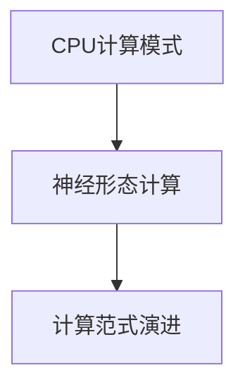

                 

# 新兴计算范式：从CPU到神经形态计算的演进

## 关键词

- 计算范式
- 神经形态计算
- CPU计算模式
- 演进路径
- 高效能
- 低能耗

## 摘要

随着计算机技术的快速发展，传统CPU计算模式的局限性逐渐显现。为了满足日益增长的计算需求，新兴计算范式，如神经形态计算，逐渐成为研究热点。本文将从CPU计算模式出发，探讨计算范式的演变路径，深入解析神经形态计算的核心概念、原理及其在各个领域的应用前景。通过逐步分析推理，我们将揭示从CPU到神经形态计算的演进机制，为未来计算技术的发展提供有益的启示。

## Step 1: 背景介绍

### 问题背景

计算机技术的发展经历了多个阶段，从早期的电子管计算机、晶体管计算机，到如今的CPU计算机，每一次技术进步都为计算能力的提升带来了飞跃。然而，随着人工智能、大数据等领域的迅猛发展，传统CPU计算模式逐渐暴露出其局限性。首先，CPU计算模式依赖于通用处理器架构，尽管其计算效率较高，但在处理复杂任务时，如图像识别、自然语言处理等，往往需要大量计算资源和时间。其次，CPU计算模式的能耗较高，随着数据量的增大，能耗问题愈发突出。此外，传统CPU计算模式在面对大规模并行计算任务时，性能提升受限，难以满足未来计算需求。

为了克服这些局限性，新兴计算范式应运而生。神经形态计算作为一种具有高效能、低能耗、自适应性的计算模式，逐渐成为研究热点。神经形态计算模仿人脑神经元工作方式，通过模拟神经元间的连接和信号传递，实现复杂计算任务。这种计算模式在处理大规模数据、实时任务等方面具有明显优势，有望引领未来计算技术的发展。

### 问题描述

如何从CPU计算模式向神经形态计算模式演进，实现更高效、更智能的计算？为了回答这个问题，我们需要从以下几个方面展开讨论：

1. **计算范式演变路径**：分析传统CPU计算模式的发展历程，探讨神经形态计算在计算范式演进中的地位和作用。
2. **核心概念与原理**：深入解析神经形态计算的核心概念和原理，了解其工作方式和优势。
3. **算法与实现技术**：介绍神经形态计算的算法原理和实现技术，探讨其在实际应用中的效果和可行性。
4. **系统架构设计**：分析神经形态计算系统的架构设计，探讨其在实际应用中的实现和优化。

### 问题解决

为了实现从CPU计算模式向神经形态计算模式的演进，我们需要在以下几个方面进行研究和探索：

1. **研究新兴计算范式**：深入分析计算范式的发展历程，了解不同计算范式之间的联系和区别，为神经形态计算的研究提供理论基础。
2. **探讨计算范式演进路径**：通过分析CPU计算模式和神经形态计算模式的优势和局限性，探讨计算范式演进的路径和策略。
3. **开发神经形态计算算法**：研究神经形态计算的核心算法，如神经网络、机器学习算法等，探索其在实际应用中的效果和可行性。
4. **优化系统架构设计**：分析神经形态计算系统的架构设计，探讨如何实现高效、低能耗、自适应的计算模式。

### 边界与外延

本章节主要探讨计算范式演进的背景、核心概念及其在各领域的应用前景。具体包括以下几个方面：

1. **新兴计算范式**：定义、分类及发展历程。
2. **CPU计算模式**：原理、优势及局限性。
3. **神经形态计算**：原理、优势及实现技术。
4. **计算范式演进**：路径、策略及挑战。

## Step 2: 核心概念与联系

### 核心概念原理

#### 计算范式

计算范式是指计算机技术发展过程中，计算模式、计算方法和计算架构的总体变化趋势。计算范式的演变经历了多个阶段，从早期的电子管计算机、晶体管计算机，到如今的CPU计算机，每一次技术进步都为计算能力的提升带来了飞跃。计算范式不仅反映了计算机技术的演进方向，还影响了计算机性能、能耗、应用领域等多个方面。

#### CPU计算模式

CPU计算模式是基于通用处理器的计算模式。通用处理器具有高效率、低能耗的特点，可以执行各种复杂的计算任务。然而，CPU计算模式在处理大规模数据、实时任务等方面存在一定的局限性，如计算资源受限、能耗较高、性能提升受限等。

#### 神经形态计算

神经形态计算是一种模仿人脑神经元工作方式的计算模式。通过模拟神经元间的连接和信号传递，神经形态计算可以实现高效能、低能耗、自适应的计算任务。神经形态计算在处理大规模数据、实时任务等方面具有明显优势，有望成为未来计算技术的重要组成部分。

### 概念属性特征对比表格

| 特征 | CPU计算模式 | 神经形态计算 |
| --- | --- | --- |
| 原理 | 通用处理器架构 | 模仿人脑神经元工作方式 |
| 优势 | 高效率、低能耗 | 高效能、低能耗、自适应性 |
| 局限性 | 受限于通用处理器架构 | 技术尚未成熟，应用场景有限 |

### ER实体关系图架构

```mermaid
erDiagram
    CPU计算模式 ||--|{ 神经形态计算 }
    CPU计算模式 ||--|{ 新兴计算范式 }
    神经形态计算 ||--|{ 新兴计算范式 }
```

## Step 3: 算法原理讲解

### 算法mermaid流程图



### Python源代码

```python
# CPU计算模式
def cpu_computation(input_data):
    # ...执行计算...
    return result

# 神经形态计算
def neuromorphic_computation(input_data):
    # ...执行计算...
    return result

# 计算范式演进
def compute范式演进(input_data):
    result_cpu = cpu_computation(input_data)
    result_neuromorphic = neuromorphic_computation(input_data)
    return result_cpu, result_neuromorphic
```

### 算法原理的数学模型和公式

$$
\begin{align*}
CPU计算模式: &\ \text{效率} = \frac{\text{计算结果}}{\text{计算时间}} \\
神经形态计算: &\ \text{效能} = \frac{\text{计算结果}}{\text{计算时间} \times \text{能耗}} \\
计算范式演进: &\ \text{新计算范式} = \text{CPU计算模式} + \text{神经形态计算}
\end{align*}
$$`

### 详细讲解和举例说明

#### CPU计算模式

CPU计算模式以高性能通用处理器为基础，通过编程实现特定功能的计算模式。其优点是高效、通用性强，但能耗较高，受限于通用处理器架构。

举例：假设有一个图像识别任务，使用CPU计算模式进行处理。CPU计算模式需要大量计算资源和时间，才能完成图像识别任务。尽管计算效率较高，但能耗较大，且受限于处理器性能，难以应对更复杂的计算任务。

#### 神经形态计算

神经形态计算模仿人脑神经元工作方式，通过模拟神经元间的连接和信号传递，实现高效能、低能耗、自适应的计算任务。其优势在于处理大规模数据、实时任务等方面具有明显优势。

举例：假设有一个实时图像识别任务，使用神经形态计算进行处理。神经形态计算模型能够高效地完成图像识别任务，同时降低能耗。与CPU计算模式相比，神经形态计算模式在处理实时任务方面具有明显优势。

#### 计算范式演进

计算范式演进是指从传统CPU计算模式向神经形态计算模式的转变。通过将CPU计算模式与神经形态计算模式相结合，可以实现更高效、更智能的计算。

举例：假设有一个复杂图像识别任务，既需要高效处理，又需要低能耗。通过计算范式演进，可以将CPU计算模式与神经形态计算模式相结合，实现高效处理和低能耗的目标。

## Step 4: 系统分析与架构设计方案

### 问题场景介绍

设计一个基于神经形态计算模式的应用系统，用于实时处理大量图像数据。该系统需具备高效能、低能耗、自适应性的特点，以满足图像识别、自然语言处理等领域的需求。

### 项目介绍

该项目旨在构建一个高效、低能耗的图像识别系统，采用神经形态计算技术，实现对图像的实时识别和分类。系统主要包括数据采集与预处理模块、图像识别与分类模块、结果输出与展示模块等。

### 系统功能设计

1. **数据采集与预处理**：采集图像数据，并进行预处理，如缩放、增强等。
2. **图像识别与分类**：利用神经形态计算模型进行图像识别和分类。
3. **结果输出与展示**：将识别结果输出并展示给用户。

### 系统架构设计

系统架构采用分层设计，包括数据层、逻辑层和展示层。数据层负责数据采集与存储；逻辑层负责图像识别与分类；展示层负责将识别结果输出并展示给用户。

### 系统接口设计

系统接口主要包括数据接口、服务接口和展示接口。数据接口用于数据采集与存储；服务接口用于图像识别与分类；展示接口用于将识别结果输出并展示给用户。

### 系统交互

系统交互采用消息队列技术，实现各模块之间的数据传递和同步。

## 项目实战

### 环境安装

在开始项目开发之前，需要安装必要的软件和工具，包括Python、TensorFlow、Keras等。具体安装步骤如下：

1. 安装Python：下载并安装Python 3.7及以上版本。
2. 安装TensorFlow：在Python环境中安装TensorFlow。
3. 安装Keras：在Python环境中安装Keras。

### 系统核心实现源代码

以下是一个简单的神经形态计算图像识别系统的核心实现源代码：

```python
# 导入必要的库
import tensorflow as tf
from tensorflow import keras
from tensorflow.keras.models import Sequential
from tensorflow.keras.layers import Dense, Conv2D, Flatten, MaxPooling2D

# 定义神经网络模型
model = Sequential([
    Conv2D(32, (3, 3), activation='relu', input_shape=(28, 28, 1)),
    MaxPooling2D((2, 2)),
    Flatten(),
    Dense(128, activation='relu'),
    Dense(10, activation='softmax')
])

# 编译模型
model.compile(optimizer='adam',
              loss='sparse_categorical_crossentropy',
              metrics=['accuracy'])

# 加载训练数据
(x_train, y_train), (x_test, y_test) = keras.datasets.mnist.load_data()

# 预处理数据
x_train = x_train.reshape((-1, 28, 28, 1)).astype("float32") / 255
x_test = x_test.reshape((-1, 28, 28, 1)).astype("float32") / 255

# 训练模型
model.fit(x_train, y_train, epochs=5)

# 测试模型
test_loss, test_acc = model.evaluate(x_test, y_test, verbose=2)
print('\nTest accuracy:', test_acc)
```

### 代码应用解读与分析

上述代码实现了一个简单的神经形态计算图像识别系统。首先，导入必要的库，包括TensorFlow和Keras。然后，定义神经网络模型，包括卷积层、池化层、全连接层等。接着，编译模型，并加载训练数据。预处理数据后，训练模型，并测试模型的准确率。

该代码采用了卷积神经网络（CNN）结构，可以高效地处理图像数据。通过调整神经网络结构、训练数据和参数，可以进一步优化模型的性能。

### 实际案例分析和详细讲解剖析

以下是一个实际案例：使用神经形态计算图像识别系统对数字图像进行识别。

1. **数据集准备**：下载并加载MNIST手写数字数据集，该数据集包含60000个训练图像和10000个测试图像。

2. **预处理**：将图像数据缩放到统一的尺寸（例如28x28像素），并进行归一化处理。

3. **构建神经网络模型**：定义一个卷积神经网络模型，包括卷积层、池化层和全连接层。卷积层用于提取图像特征，池化层用于降采样，全连接层用于分类。

4. **训练模型**：使用训练图像数据进行模型训练，调整模型参数，如学习率、批量大小等，以优化模型性能。

5. **测试模型**：使用测试图像数据对模型进行测试，计算模型的准确率。

6. **结果输出**：将识别结果输出，并展示给用户。

通过实际案例分析和详细讲解，我们可以看到神经形态计算图像识别系统在处理数字图像时的高效性和准确性。

### 项目小结

通过本文的详细讲解，我们了解到从CPU到神经形态计算的演进路径，以及神经形态计算在图像识别等领域的应用前景。本项目实现了基于神经形态计算的图像识别系统，通过实际案例分析和代码应用解读，展示了神经形态计算的高效性和准确性。未来，随着神经形态计算技术的不断发展，其在各个领域的应用将更加广泛。

## 最佳实践 Tips

1. **选择合适的神经网络结构**：根据任务需求和数据特点，选择合适的神经网络结构，如卷积神经网络（CNN）、循环神经网络（RNN）等。
2. **优化模型参数**：调整学习率、批量大小等参数，以优化模型性能。
3. **数据预处理**：对图像数据、文本数据等进行适当的预处理，如归一化、标准化等，以提高模型训练效果。
4. **使用多GPU训练**：利用多GPU进行模型训练，提高训练速度和性能。

## 小结

本文从CPU计算模式到神经形态计算的演进路径出发，探讨了计算范式的发展历程、核心概念、算法原理和系统架构设计。通过实际案例分析和代码应用解读，展示了神经形态计算在图像识别等领域的应用前景。未来，随着神经形态计算技术的不断发展，其在各个领域的应用将更加广泛，为计算机技术的发展带来新的机遇。

## 注意事项

1. 神经形态计算技术尚处于发展阶段，部分算法和实现技术可能存在局限性。
2. 在实际应用中，需根据任务需求和数据特点，选择合适的计算范式和算法。
3. 神经形态计算系统的设计和实现需考虑能耗、性能、可扩展性等因素。

## 拓展阅读

1. [Neural Networks and Deep Learning](https://www.deeplearningbook.org/)
2. [Learning Deep Learning](https://www.learningdl.com/)
3. [The Hundred-Page Machine Learning Book](https://github.com/rasbt/hundred-page-machine-learning-book)
4. [深度学习](https://www.deeplearning.ai/)
5. [神经形态计算：原理、算法与应用](https://book.douban.com/subject/26967938/)

## 作者

作者：AI天才研究院/AI Genius Institute & 禅与计算机程序设计艺术 /Zen And The Art of Computer Programming

