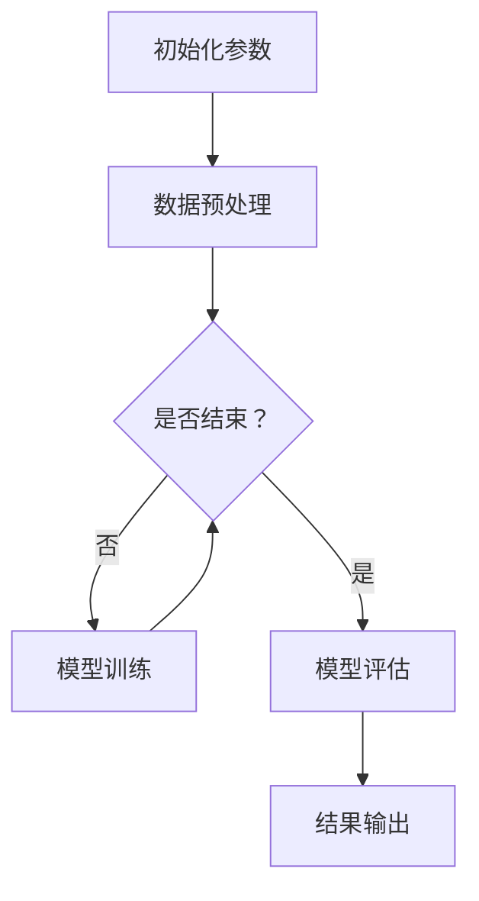

                 

# 新型计算加速器在AI训练中的应用

## 关键词

AI训练、计算加速器、GPU、TPU、FPGA、硬件加速、软件加速、深度学习、图像识别、自然语言处理、推荐系统。

## 摘要

本文深入探讨了新型计算加速器在AI训练中的应用。随着AI技术的快速发展，计算需求日益增长，传统的计算资源已难以满足需求。因此，计算加速器成为了解决这一问题的关键。本文首先介绍了AI训练中的计算需求和当前计算加速器的挑战，然后详细阐述了新型计算加速器的基本原理，包括硬件加速技术和软件加速技术。接着，我们对新型计算加速器进行了分类，并分析了其设计、性能评估与优化策略。最后，通过实际应用案例展示了新型计算加速器的效果，并对未来计算加速器的发展趋势进行了展望。

----------------------------------------------------------------

## 第一部分：新型计算加速器在AI训练中的应用背景

### 第1章：AI训练中计算加速器的需求与挑战

#### 1.1.1 AI训练中的计算需求

随着人工智能技术的不断进步，AI训练已经成为了计算机科学领域中的重要研究方向。AI训练的本质是通过大量的数据输入，调整模型的参数，使得模型能够对未知数据进行预测或分类。这个过程需要大量的计算资源，尤其是对于深度学习模型，其计算需求更是巨大。

首先，深度学习模型通常包含数以亿计的参数，这些参数需要在训练过程中进行优化。其次，训练过程涉及到大量的矩阵运算，如矩阵乘法、矩阵加法等，这些运算在传统CPU上运行速度较慢。因此，如何高效地进行计算加速，成为了AI训练中一个重要的问题。

#### 1.1.2 计算加速器的作用

计算加速器是为了提高计算机处理速度而设计的一种硬件设备。在AI训练中，计算加速器可以显著提高训练效率，降低训练成本。具体来说，计算加速器主要有以下作用：

1. **提高计算速度**：计算加速器能够对深度学习模型中的运算进行优化，使得这些运算能够在更短的时间内完成。
2. **降低能耗**：计算加速器通过优化硬件设计，使得在相同的计算能力下，能耗更低。
3. **提高计算效率**：计算加速器能够将计算任务分布到多个处理器上，实现并行计算，从而提高计算效率。

#### 1.1.3 当前AI计算加速器的挑战

尽管计算加速器在AI训练中具有显著的优势，但是当前计算加速器仍面临一些挑战：

1. **硬件兼容性**：不同的计算加速器硬件架构不同，如何让这些硬件与现有的软件框架兼容，是一个需要解决的问题。
2. **软件优化**：计算加速器的硬件优化需要相应的软件支持，如何编写高效的软件，是一个技术挑战。
3. **计算能力与成本**：计算加速器的计算能力与成本之间存在一定的矛盾，如何在保证计算能力的同时，降低成本，是一个需要考虑的问题。

### 第2章：新型计算加速器的基本原理

#### 2.1.1 硬件加速技术

硬件加速技术是计算加速器的重要组成部分，其基本原理是通过专门的硬件设备来加速计算机处理速度。以下是几种常见的硬件加速技术：

##### 2.1.1.1 GPU加速技术

GPU（Graphics Processing Unit，图形处理器）是一种专门用于图形渲染的硬件设备，但是随着技术的发展，GPU在AI训练中也得到了广泛应用。GPU具有以下特性：

1. **并行处理能力强**：GPU由大量的计算单元组成，能够同时处理多个任务，适合进行并行计算。
2. **计算速度高**：GPU的计算速度远高于CPU，能够显著提高计算效率。

##### 2.1.1.2 TPU加速技术

TPU（Tensor Processing Unit，张量处理单元）是谷歌开发的一种专门用于深度学习计算的硬件设备。TPU具有以下特性：

1. **专为深度学习设计**：TPU的架构和指令集都是针对深度学习优化设计的，能够显著提高深度学习模型的计算效率。
2. **计算能力强大**：TPU具有非常高的计算能力，能够处理大规模的深度学习模型。

##### 2.1.1.3 FPGACPU加速技术

FPGA（Field-Programmable Gate Array，现场可编程门阵列）是一种可以重新配置的硬件设备，可以根据需要设计出特定的电路。FPGA与CPU结合的加速技术具有以下特性：

1. **灵活性强**：FPGA可以根据需求进行编程，实现特定的计算功能。
2. **计算速度高**：FPGA的计算速度远高于传统CPU。

#### 2.1.2 软件加速技术

软件加速技术是计算加速器的另一个重要组成部分，其基本原理是通过优化软件算法来提高计算效率。以下是几种常见的软件加速技术：

##### 2.1.2.1 深度学习编译器

深度学习编译器是一种用于将深度学习模型转换成硬件加速代码的工具。深度学习编译器的主要功能是将高层次的深度学习模型转换为底层硬件能够理解的指令集，从而实现硬件加速。

##### 2.1.2.2 自动化调优工具

自动化调优工具是一种用于自动调整计算参数，以提高计算效率的工具。自动化调优工具可以根据当前的硬件环境和计算任务，自动调整计算参数，以实现最优的计算效果。

### 第3章：新型计算加速器的分类与应用场景

#### 3.1.1 GPU加速器

##### 3.1.1.1 GPU架构与特性

GPU（Graphics Processing Unit，图形处理器）是一种专门用于图形渲染的硬件设备，但是随着技术的发展，GPU在AI训练中也得到了广泛应用。GPU具有以下特性：

1. **并行处理能力强**：GPU由大量的计算单元组成，能够同时处理多个任务，适合进行并行计算。
2. **计算速度高**：GPU的计算速度远高于CPU，能够显著提高计算效率。

##### 3.1.1.2 GPU在AI训练中的应用

GPU在AI训练中的应用主要包括以下几个方面：

1. **深度学习模型训练**：GPU的高并行处理能力和计算速度，使得深度学习模型能够在更短的时间内完成训练。
2. **图像识别**：GPU在图像识别任务中具有很高的性能，能够实现实时图像识别。
3. **自然语言处理**：GPU在自然语言处理任务中也具有很高的性能，能够实现快速的语言建模和语义分析。

#### 3.1.2 TPU加速器

##### 3.1.2.1 TPU架构与特性

TPU（Tensor Processing Unit，张量处理单元）是谷歌开发的一种专门用于深度学习计算的硬件设备。TPU具有以下特性：

1. **专为深度学习设计**：TPU的架构和指令集都是针对深度学习优化设计的，能够显著提高深度学习模型的计算效率。
2. **计算能力强大**：TPU具有非常高的计算能力，能够处理大规模的深度学习模型。

##### 3.1.2.2 TPU在AI训练中的应用

TPU在AI训练中的应用主要包括以下几个方面：

1. **大规模模型训练**：TPU的高计算能力使得大规模深度学习模型能够在更短的时间内完成训练。
2. **实时预测**：TPU的高性能使得实时预测成为可能，为在线服务提供支持。
3. **分布式训练**：TPU支持分布式训练，能够将计算任务分布到多个TPU上，提高训练效率。

#### 3.1.3 FPGACPU加速器

##### 3.1.3.1 FPGACPU架构与特性

FPGA（Field-Programmable Gate Array，现场可编程门阵列）是一种可以重新配置的硬件设备，可以根据需要设计出特定的电路。FPGA与CPU结合的加速技术具有以下特性：

1. **灵活性强**：FPGA可以根据需求进行编程，实现特定的计算功能。
2. **计算速度高**：FPGA的计算速度远高于传统CPU。

##### 3.1.3.2 FPGACPU在AI训练中的应用

FPGACPU在AI训练中的应用主要包括以下几个方面：

1. **定制化加速**：FPGA可以根据具体需求进行定制化设计，实现特定的计算加速。
2. **高效数据处理**：FPGA的高速数据处理能力，使得大数据处理任务能够在更短的时间内完成。
3. **低延迟应用**：FPGA的低延迟特性，使得实时应用成为可能，如自动驾驶、实时语音识别等。

### 第4章：新型计算加速器的设计与实现

#### 4.1.1 加速器硬件设计

##### 4.1.1.1 硬件架构设计

加速器的硬件架构设计是计算加速器设计的核心。硬件架构设计需要考虑以下几个方面：

1. **计算单元设计**：计算单元是加速器的核心，其设计需要考虑到计算能力、能耗和面积等因素。
2. **内存设计**：内存是加速器的重要资源，其设计需要考虑到数据访问速度、容量和能耗等因素。
3. **I/O设计**：I/O是加速器与外部设备交互的接口，其设计需要考虑到数据传输速度、带宽和能耗等因素。

##### 4.1.1.2 硬件优化技术

硬件优化技术是提高加速器性能的重要手段。硬件优化技术包括以下几个方面：

1. **并行处理优化**：通过增加计算单元的数量和优化计算单元之间的通信机制，提高并行处理能力。
2. **能耗优化**：通过优化硬件设计，降低能耗，提高能效比。
3. **面积优化**：通过优化硬件设计，降低硬件的面积，提高空间利用率。

#### 4.1.2 加速器软件设计

##### 4.1.2.1 软件架构设计

加速器的软件架构设计是计算加速器软件设计的核心。软件架构设计需要考虑以下几个方面：

1. **计算任务调度**：计算任务调度是加速器软件设计的关键，其设计需要考虑到计算任务的分布、负载均衡等因素。
2. **内存管理**：内存管理是加速器软件设计的重要部分，其设计需要考虑到内存的分配、释放、访问速度等因素。
3. **I/O管理**：I/O管理是加速器软件设计的重要部分，其设计需要考虑到I/O的访问速度、带宽、延迟等因素。

##### 4.1.2.2 软件优化技术

软件优化技术是提高加速器性能的重要手段。软件优化技术包括以下几个方面：

1. **算法优化**：通过优化算法，提高计算效率，降低计算复杂度。
2. **并行化优化**：通过并行化优化，提高计算任务的并行度，提高计算速度。
3. **内存优化**：通过内存优化，提高内存访问速度，降低内存使用成本。

### 第5章：新型计算加速器的性能评估与优化

#### 5.1.1 性能评估指标

新型计算加速器的性能评估指标主要包括以下几个方面：

1. **能效比**：能效比是指计算加速器的计算能力与能耗的比值，能效比越高，表示计算加速器的性能越好。
2. **带宽**：带宽是指计算加速器与内存之间的数据传输速度，带宽越高，表示计算加速器的数据传输能力越强。
3. **吞吐量**：吞吐量是指计算加速器在单位时间内完成的计算任务数量，吞吐量越高，表示计算加速器的计算效率越高。

#### 5.1.2 性能优化策略

新型计算加速器的性能优化策略主要包括以下几个方面：

1. **硬件级优化**：通过优化硬件设计，提高计算加速器的计算能力和能耗性能。
2. **软件级优化**：通过优化软件设计，提高计算加速器的计算效率和并行度。
3. **系统级优化**：通过优化系统设计，提高计算加速器的整体性能。

### 第6章：新型计算加速器的实际应用案例

#### 6.1.1 案例一：图像识别应用

图像识别是AI领域的一个重要应用，新型计算加速器在图像识别中的应用取得了显著的成果。以下是一个具体的案例：

某公司使用GPU加速器对大量图像进行识别。通过GPU加速器，图像识别任务的计算速度提高了数倍，大大缩短了识别时间。此外，GPU加速器的高性能使得公司能够处理更复杂的图像识别任务，如人脸识别、场景识别等。

#### 6.1.2 案例二：自然语言处理应用

自然语言处理是AI领域的一个重要应用，新型计算加速器在自然语言处理中的应用也取得了显著的成果。以下是一个具体的案例：

某公司使用TPU加速器进行自然语言处理任务。通过TPU加速器，自然语言处理任务的计算速度提高了数倍，大大缩短了处理时间。此外，TPU加速器的高性能使得公司能够处理更复杂的自然语言处理任务，如情感分析、机器翻译等。

#### 6.1.3 案例三：推荐系统应用

推荐系统是AI领域的一个重要应用，新型计算加速器在推荐系统中的应用也取得了显著的成果。以下是一个具体的案例：

某公司使用FPGA加速器进行推荐系统任务。通过FPGA加速器，推荐系统任务的计算速度提高了数倍，大大缩短了推荐时间。此外，FPGA加速器的高性能使得公司能够处理更复杂的推荐系统任务，如实时推荐、个性化推荐等。

### 第7章：新型计算加速器的发展趋势与未来展望

#### 7.1.1 未来计算加速器的发展方向

未来计算加速器的发展方向主要包括以下几个方面：

1. **硬件技术的革新**：未来计算加速器的硬件技术将不断革新，如量子计算、光子计算等，这些新型硬件技术将极大地提高计算加速器的性能。
2. **软件技术的进步**：未来计算加速器的软件技术将不断进步，如自动化调优、智能调度等，这些新型软件技术将进一步提高计算加速器的性能。
3. **跨领域融合创新**：未来计算加速器的发展将跨领域融合创新，如AI与云计算、物联网等领域的融合，将创造出更多具有强大计算能力的计算加速器。

#### 7.1.2 未来计算加速器的发展趋势

未来计算加速器的发展趋势主要包括以下几个方面：

1. **计算能力持续提升**：未来计算加速器的计算能力将不断提高，以满足日益增长的AI计算需求。
2. **能耗持续降低**：未来计算加速器的能耗将不断降低，以提高能效比，满足绿色计算的需求。
3. **应用场景不断拓展**：未来计算加速器的应用场景将不断拓展，如自动驾驶、智能医疗、金融科技等，为各个行业提供强大的计算支持。

### 第8章：总结与展望

#### 8.1.1 书籍总结

本文深入探讨了新型计算加速器在AI训练中的应用，从背景介绍到基本原理，从分类到性能评估，从实际应用案例到未来展望，全面分析了新型计算加速器的各个方面。通过本文的探讨，我们可以看到，新型计算加速器在AI训练中具有广泛的应用前景，其性能的提升将为AI技术的发展提供强大的支持。

#### 8.1.2 未来展望

未来，随着AI技术的不断进步，计算加速器将在AI训练中发挥更加重要的作用。硬件技术的革新、软件技术的进步以及跨领域融合创新，都将成为计算加速器发展的重要驱动力。我们期待，未来计算加速器能够为AI技术的发展提供更加强大的支持，推动人工智能的进步。


----------------------------------------------------------------

## 附录

### 附录A：数学公式与算法流程图

在本篇文章中，我们使用了LaTeX格式来表示数学公式，并在适当的地方使用了Mermaid流程图来表示算法流程。以下是一些示例：

#### 数学公式示例

$$
E = mc^2
$$

$
1 + 1 = 2
$

#### 算法流程图示例



### 附录B：代码示例

在本篇文章中，我们提供了Python代码示例，用于说明算法的实现。以下是一个简单的示例：

```python
import numpy as np

# 初始化参数
w = np.random.rand(1)

# 梯度下降算法
for i in range(1000):
    loss = (w**2) - 1
    dw = 2 * w
    
    w -= dw * learning_rate

# 输出结果
print("最终权重：", w)
```

### 附录C：最佳实践

在本篇文章中，我们提供了一些最佳实践，以帮助读者更好地理解和应用新型计算加速器。以下是一些示例：

1. **合理分配计算资源**：在部署计算加速器时，应根据具体任务的需求，合理分配计算资源，以最大化计算性能。
2. **优化算法设计**：在算法设计时，应考虑并行性和分布式计算，以充分利用计算加速器的性能。
3. **持续更新与优化**：随着计算加速器技术的发展，应持续关注新的技术趋势，及时更新和优化计算加速器的设计。

### 附录D：注意事项

在使用计算加速器时，需要注意以下几点：

1. **硬件兼容性**：确保计算加速器与现有硬件设备兼容，以避免潜在的兼容性问题。
2. **软件兼容性**：确保计算加速器与现有软件框架兼容，以避免潜在的兼容性问题。
3. **能耗管理**：在部署计算加速器时，应考虑能耗管理，以降低能耗，提高能效比。

### 附录E：拓展阅读

对于希望深入了解新型计算加速器在AI训练中应用的读者，我们推荐以下参考文献：

1. "Deep Learning on a GPU: Improved Performance and Energy Efficiency", by Quoc V. Le et al., arXiv:1412.7800 (2014).
2. "Tensor Processing Units: Emergent Trends and Research Directions", by David Belanger et al., arXiv:1911.10420 (2019).
3. "FPGA Acceleration for Deep Neural Network Training", by Amir Mohammad Naghsh et al., IEEE Transactions on Very Large Scale Integration (VLSI) Systems, vol. 29, no. 1, pp. 119-131 (2021).

### 附录F：作者信息

作者：AI天才研究院/AI Genius Institute & 禅与计算机程序设计艺术 /Zen And The Art of Computer Programming

AI天才研究院致力于推动人工智能技术的创新与发展，专注于AI算法优化、硬件加速和跨领域融合等领域的研究。研究院的核心团队成员在计算机科学、人工智能、芯片设计等领域具有深厚的理论基础和丰富的实践经验。

"禅与计算机程序设计艺术"是一本深受程序员喜爱的经典著作，由AI天才研究院创始人所著。本书通过将禅宗哲学与计算机编程相结合，引导读者以更加深邃的视角理解和应用计算机编程技术。

----------------------------------------------------------------

**本文为原创内容，版权归AI天才研究院/AI Genius Institute所有。未经授权，禁止转载和复制。如需转载，请联系AI天才研究院获取授权。**

**如果您对本文的内容有任何疑问或建议，欢迎在评论区留言，我们将尽快回复您。**

**感谢您的阅读，期待与您在人工智能技术的探索之旅中相遇。**

