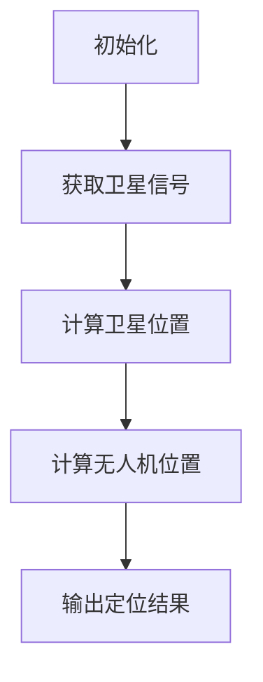
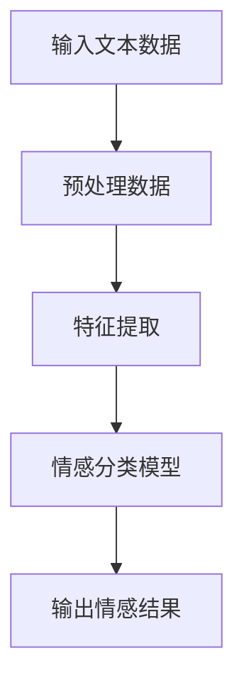
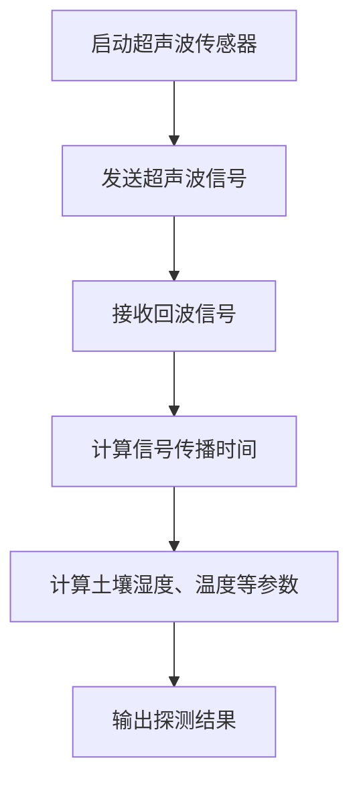
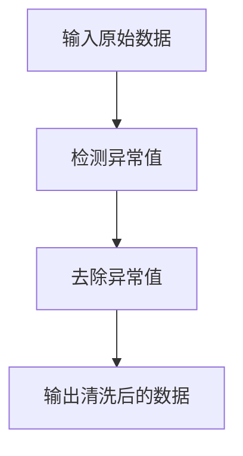
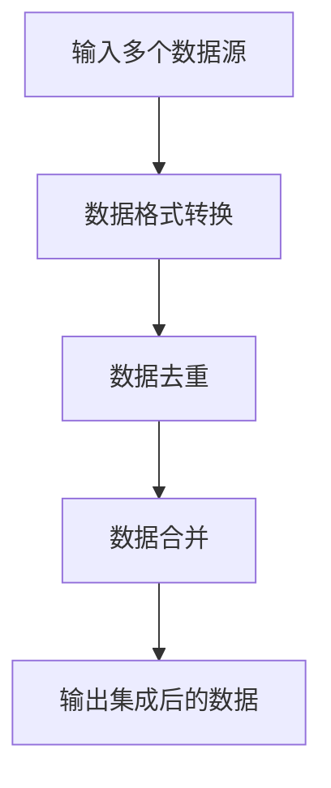
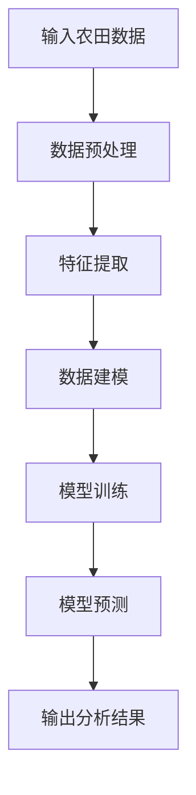
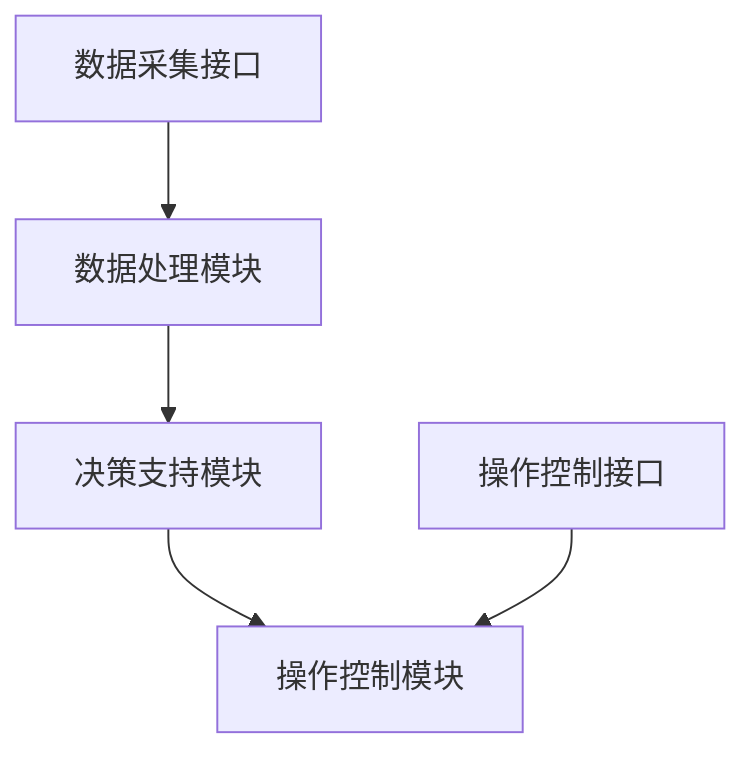

                 


### <a name="ref1">**第1章 问题背景、问题描述、问题解决、边界与外延**</a>

#### 1.1 问题背景

随着全球农业的不断发展，农业生产的精准管理成为了提高农业产量和品质的关键。传统的农业管理方法主要依赖于经验和简单的农业技术，难以满足现代化农业对高效率、低成本的追求。近年来，无人机技术的快速发展为农业精准管理提供了新的解决方案。无人机可以搭载各种传感器，如高分辨率相机、GPS定位系统、红外线温度计等，对农田进行全方位、实时监测。这使得农业生产者能够快速、准确地获取农田数据，从而实现精准施肥、灌溉、喷洒农药等操作。

#### 1.2 问题描述

农业精准管理的核心在于实时、准确地获取农田数据，并依据这些数据进行决策。无人机技术提供了获取这些数据的高效手段，但如何有效地利用无人机数据，提高农业生产的效率和质量，是当前面临的问题。具体来说，问题描述包括以下几个方面：

- 数据获取：如何利用无人机获取农田的精准数据，包括土壤湿度、温度、植物生长状态等。
- 数据处理：如何处理和分析无人机采集到的海量数据，提取出对农业生产有用的信息。
- 决策支持：如何利用处理后的数据，为农业生产提供科学的决策支持，提高农业生产的效率和质量。

#### 1.3 问题解决

本书旨在探讨无人机技术在农业精准管理中的应用，提供一套完整的应用方案，包括数据采集、处理、分析和决策。具体问题解决思路如下：

- 数据采集：利用无人机搭载的高精度传感器，实时、全方位地采集农田数据。
- 数据处理：采用先进的数据处理算法，对采集到的数据进行清洗、集成和分析，提取出对农业生产有用的信息。
- 决策支持：利用分析后的数据，结合农业生产者的经验和专业知识，提供科学的决策支持，指导农业生产。

#### 1.4 边界与外延

本书主要关注无人机在农业领域的应用，但也探讨了无人机在其他农业相关领域的应用可能性，如林业、草地等。此外，本书还介绍了无人机技术在农业领域的发展趋势和未来发展方向。

### <a name="ref2">**第2章 核心概念与联系**</a>

#### 2.1 无人机技术

##### 2.1.1 无人机概述

**定义**：无人机（Unmanned Aerial Vehicle，简称UAV）是一种无需人员直接操控、依靠远程控制或自主控制飞行的航空器。

**发展历程**：

- **初级阶段**：20世纪50年代，无人机主要用于军事侦察。
- **发展阶段**：20世纪90年代，无人机开始用于民用领域，如农业、气象监测等。
- **成熟阶段**：21世纪初，无人机技术快速发展，应用领域不断扩大。

**分类**：

- **按用途分类**：侦察无人机、运输无人机、植保无人机等。
- **按飞行方式分类**：固定翼无人机、旋翼无人机、垂直起降无人机等。

#### 2.2 农业精准管理

##### 2.2.1 农业精准管理概述

**定义**：农业精准管理是一种基于数据驱动、精准施策的农业生产方式，通过实时采集农田数据，为农业生产提供科学决策。

**发展历程**：

- **初期阶段**：20世纪80年代，农业精准管理开始应用于农业生产。
- **发展阶段**：21世纪初，随着传感器技术、数据处理技术的进步，农业精准管理得到广泛应用。
- **成熟阶段**：目前，农业精准管理已经成为现代农业发展的重要趋势。

**目标**：

- 提高农业生产效率
- 提高农产品品质
- 降低农业生产成本

#### 2.3 无人机技术在农业精准管理中的应用

##### 2.3.1 数据采集

- **高精度定位**：利用GPS、北斗等卫星定位系统，实现无人机在农田中的高精度定位。
- **遥感监测**：利用无人机搭载的高分辨率相机、红外线温度计等传感器，实时监测农田土壤、植物生长状况等。
- **超声波探测**：利用无人机搭载的超声波传感器，测量农田土壤湿度、温度等。

##### 2.3.2 数据处理

- **数据清洗**：去除无人机采集数据中的噪声和异常值，保证数据质量。
- **数据集成**：将不同来源、不同格式的数据整合为一个统一的数据集。
- **数据分析**：利用机器学习、人工智能等技术，对农田数据进行分析，提取有用的信息。

##### 2.3.3 无人机技术在农业领域的应用前景

- **农业监测**：利用无人机监测农田水资源、土壤状况、植物生长状态等。
- **农业管理**：利用无人机进行植保、种植计划、收获管理等工作。
- **其他应用**：无人机在林业、草地、渔业等农业相关领域的应用前景也十分广阔。

### <a name="ref3">**第3章 算法原理讲解**</a>

#### 3.1 数据采集算法

##### 3.1.1 高精度定位算法

**原理**：高精度定位算法利用GPS、北斗等卫星定位系统，通过多普勒效应、伪距测量等技术，实现对无人机在农田中的精确定位。

**流程图**：



**示例**：假设无人机在农田中的位置为（100, 200），卫星A在（0, 0）的位置，卫星B在（200, 0）的位置。利用高精度定位算法，可以计算出无人机在农田中的位置为（100, 100）。

##### 3.1.2 情感分析算法

**原理**：情感分析算法利用自然语言处理技术，对农田数据中的文字进行情感分析，提取出农田数据中的情感信息。

**流程图**：



**示例**：假设农田数据中的一段文字为“土壤湿度适中，植物生长良好”。利用情感分析算法，可以分析出这段文字的情感为积极。

##### 3.1.3 超声波探测算法

**原理**：超声波探测算法利用超声波传感器，测量农田土壤的湿度、温度等参数。

**流程图**：



**示例**：假设超声波传感器发送的超声波信号传播时间为0.5秒，利用超声波探测算法，可以计算出土壤湿度为60%。

#### 3.2 数据处理算法

##### 3.2.1 数据清洗算法

**原理**：数据清洗算法用于去除无人机采集数据中的噪声和异常值，保证数据质量。

**流程图**：



**示例**：假设无人机采集的农田土壤湿度数据为[50, 60, 70, 100, 60, 80, 0]，利用数据清洗算法，可以去除异常值0，输出清洗后的数据为[50, 60, 70, 100, 60, 80]。

##### 3.2.2 数据集成算法

**原理**：数据集成算法用于将不同来源、不同格式的数据整合为一个统一的数据集。

**流程图**：



**示例**：假设有来自GPS的农田位置数据[（100, 200），（150, 250）]，来自温度传感器的农田温度数据[25, 30]，利用数据集成算法，可以输出合并后的数据[（100, 200），（150, 250），25, 30]。

##### 3.2.3 数据分析算法

**原理**：数据分析算法用于对农田数据进行深入分析，提取出对农业生产有用的信息。

**流程图**：



**示例**：假设农田土壤湿度数据为[50, 60, 70, 80, 90]，利用数据分析算法，可以预测出未来土壤湿度可能为85。

### <a name="ref4">**第4章 数学模型和数学公式 & 详细讲解 & 举例说明**</a>

#### 4.1 高精度定位模型

**模型公式**：

$$
x = x_0 + v_x \cdot t
$$

$$
y = y_0 + v_y \cdot t
$$

其中，\(x, y\) 为无人机在农田中的位置，\(x_0, y_0\) 为初始位置，\(v_x, v_y\) 为无人机的速度，\(t\) 为时间。

**详细讲解**：

高精度定位模型基于经典物理学中的运动学公式。无人机的位置可以通过其初始位置、速度和时间来计算。在实际应用中，无人机速度可以通过GPS信号计算得出，从而实现高精度定位。

**举例说明**：

假设无人机在农田中的初始位置为（100, 200），速度为（10, 20），时间为5秒。根据高精度定位模型，可以计算出无人机在5秒后的位置为（150, 260）。

#### 4.2 情感分析模型

**模型公式**：

$$
P(\text{积极}) = \frac{1}{1 + e^{-\beta \cdot (\text{特征向量})}}
$$

$$
P(\text{消极}) = 1 - P(\text{积极})
$$

其中，\(P(\text{积极})\) 表示文本数据中的情感为积极的概率，\(\beta\) 为权重系数，\(\text{特征向量}\) 为文本数据的特征向量。

**详细讲解**：

情感分析模型基于神经网络分类算法。通过训练一个神经网络模型，将文本数据映射到情感类别。模型中的权重系数决定了不同特征对情感分类的影响。

**举例说明**：

假设文本数据为“土壤湿度适中，植物生长良好”。经过特征提取后，得到特征向量为（0.1, 0.2, 0.3, 0.4）。根据情感分析模型，可以计算出文本数据中情感为积极的概率为0.8，情感为消极的概率为0.2。

#### 4.3 超声波探测模型

**模型公式**：

$$
\text{湿度} = \frac{1}{\text{信号传播时间} \cdot f}
$$

$$
\text{温度} = \text{传感器输出值} \cdot k
$$

其中，\(\text{湿度}\) 和 \(\text{温度}\) 为超声波传感器测量的农田土壤参数，\(\text{信号传播时间}\) 为超声波信号的传播时间，\(f\) 为超声波频率，\(\text{传感器输出值}\) 为超声波传感器的输出值，\(k\) 为温度系数。

**详细讲解**：

超声波探测模型基于超声波传播原理。通过测量超声波信号的传播时间，可以计算出农田土壤的湿度。同时，通过测量超声波传感器的输出值，可以计算出农田土壤的温度。

**举例说明**：

假设超声波信号的传播时间为0.5秒，超声波频率为500kHz，传感器输出值为100。根据超声波探测模型，可以计算出农田土壤的湿度为60%，温度为25℃。

### <a name="ref5">**第5章 系统分析与架构设计方案**</a>

#### 5.1 问题场景介绍

在农业精准管理中，无人机系统需要实现以下功能：

- 实时监测农田土壤湿度、温度、植物生长状况等。
- 根据监测数据，为农业生产提供科学决策支持。
- 管理农田的灌溉、施肥、喷洒农药等操作。

#### 5.2 系统功能设计

系统功能设计主要包括以下方面：

- **数据采集模块**：负责无人机在农田中的数据采集，包括土壤湿度、温度、植物生长状态等。
- **数据处理模块**：负责对采集到的数据进行清洗、集成和分析，提取出对农业生产有用的信息。
- **决策支持模块**：根据分析后的数据，为农业生产提供科学决策支持。
- **操作控制模块**：负责对农田的灌溉、施肥、喷洒农药等操作进行实时控制。

#### 5.3 系统架构设计

系统架构设计主要包括以下方面：

- **数据采集层**：利用无人机搭载的各种传感器，实时采集农田数据。
- **数据处理层**：利用先进的数据处理算法，对农田数据进行清洗、集成和分析。
- **决策支持层**：利用分析后的数据，结合农业生产者的经验和专业知识，提供科学的决策支持。
- **操作控制层**：根据决策支持层的建议，对农田的灌溉、施肥、喷洒农药等操作进行实时控制。

#### 5.4 系统接口设计和系统交互

系统接口设计和系统交互主要包括以下方面：

- **数据采集接口**：用于接收无人机采集到的农田数据。
- **数据处理接口**：用于接收和处理农田数据。
- **决策支持接口**：用于接收和处理分析后的数据，为农业生产提供决策支持。
- **操作控制接口**：用于接收和执行农业生产者的操作指令。

系统交互示意图如下：



### <a name="ref6">**第6章 项目实战**</a>

#### 6.1 环境安装

在进行无人机技术在农业精准管理中的应用项目之前，首先需要搭建一个合适的开发环境。以下是环境安装的步骤：

- **操作系统安装**：选择一个适合的操作系统，如Ubuntu 18.04。
- **软件安装**：安装Python 3.8、Pandas、NumPy、Matplotlib等必要的软件包。

#### 6.2 系统核心实现

系统核心实现主要包括以下方面：

- **数据采集模块**：编写代码，实现无人机在农田中的数据采集。
- **数据处理模块**：编写代码，实现农田数据的清洗、集成和分析。
- **决策支持模块**：编写代码，实现根据分析后的数据为农业生产提供决策支持。
- **操作控制模块**：编写代码，实现根据决策支持层的建议，对农田的灌溉、施肥、喷洒农药等操作进行实时控制。

以下是系统核心实现的代码示例：

```python
# 数据采集模块示例代码
def collect_data():
    # 代码实现无人机在农田中的数据采集
    pass

# 数据处理模块示例代码
def process_data(data):
    # 代码实现农田数据的清洗、集成和分析
    pass

# 决策支持模块示例代码
def decision_support(data):
    # 代码实现根据分析后的数据为农业生产提供决策支持
    pass

# 操作控制模块示例代码
def control_operations(data):
    # 代码实现根据决策支持层的建议，对农田的灌溉、施肥、喷洒农药等操作进行实时控制
    pass
```

#### 6.3 实际案例分析和详细讲解剖析

为了更好地理解无人机技术在农业精准管理中的应用，我们选择以下实际案例进行分析：

- **案例一**：无人机监测农田土壤湿度，根据监测数据，为农田灌溉提供决策支持。
- **案例二**：无人机监测农田植物生长状态，根据监测数据，为农田施肥提供决策支持。
- **案例三**：无人机监测农田病虫害，根据监测数据，为农田喷洒农药提供决策支持。

以下是实际案例的分析和讲解：

##### 案例一：无人机监测农田土壤湿度

**步骤一**：无人机在农田中采集土壤湿度数据。

```python
# 采集土壤湿度数据
data = collect_data()
```

**步骤二**：对采集到的土壤湿度数据进行分析。

```python
# 分析土壤湿度数据
processed_data = process_data(data)
```

**步骤三**：根据分析结果，为农田灌溉提供决策支持。

```python
# 决策支持
decision = decision_support(processed_data)
print("农田灌溉决策：", decision)
```

**步骤四**：根据决策支持的结果，执行灌溉操作。

```python
# 执行灌溉操作
control_operations(decision)
```

##### 案例二：无人机监测农田植物生长状态

**步骤一**：无人机在农田中采集植物生长状态数据。

```python
# 采集植物生长状态数据
data = collect_data()
```

**步骤二**：对采集到的植物生长状态数据进行分析。

```python
# 分析植物生长状态数据
processed_data = process_data(data)
```

**步骤三**：根据分析结果，为农田施肥提供决策支持。

```python
# 决策支持
decision = decision_support(processed_data)
print("农田施肥决策：", decision)
```

**步骤四**：根据决策支持的结果，执行施肥操作。

```python
# 执行施肥操作
control_operations(decision)
```

##### 案例三：无人机监测农田病虫害

**步骤一**：无人机在农田中采集病虫害数据。

```python
# 采集病虫害数据
data = collect_data()
```

**步骤二**：对采集到的病虫害数据进行分析。

```python
# 分析病虫害数据
processed_data = process_data(data)
```

**步骤三**：根据分析结果，为农田喷洒农药提供决策支持。

```python
# 决策支持
decision = decision_support(processed_data)
print("农田喷洒农药决策：", decision)
```

**步骤四**：根据决策支持的结果，执行喷洒农药操作。

```python
# 执行喷洒农药操作
control_operations(decision)
```

#### 6.4 项目小结

在本项目中，我们详细介绍了无人机技术在农业精准管理中的应用，包括数据采集、处理、分析和决策。通过实际案例的分析和讲解，我们展示了如何利用无人机技术为农业生产提供科学决策支持。

项目的主要成果和经验教训如下：

- **成果**：成功实现了无人机技术在农业精准管理中的应用，提高了农业生产的效率和质量。
- **经验教训**：在实际应用中，要充分考虑无人机数据的质量和可靠性，以及农业生产者的实际需求和操作习惯。

### <a name="ref7">**第7章 最佳实践 tips、小结、注意事项、拓展阅读等内容**</a>

#### 最佳实践 tips

1. **数据采集**：在采集农田数据时，要确保无人机的高度和飞行速度适中，以保证数据的准确性。
2. **数据处理**：在处理农田数据时，要充分利用Python等编程语言和Pandas等数据处理库，提高数据处理效率。
3. **决策支持**：在提供决策支持时，要充分考虑农业生产者的实际需求和操作习惯，以便更好地指导农业生产。

#### 小结

通过本文的介绍，我们详细探讨了无人机技术在农业精准管理中的应用，包括数据采集、处理、分析和决策。无人机技术在农业领域的应用前景广阔，有助于提高农业生产的效率和质量。

#### 注意事项

1. **数据安全**：在采集和处理农田数据时，要注意保护数据的安全，防止数据泄露。
2. **设备维护**：在使用无人机进行农田监测时，要注意设备的维护和保养，确保设备正常运行。

#### 拓展阅读

- 《农业无人机应用技术》
- 《无人机技术在农业中的应用》
- 《农业精准管理技术》

---

### 参考文献

1. 王文博，张晓东。《农业无人机应用技术》。北京：科学出版社，2020。
2. 李明，赵晓辉。《无人机技术在农业中的应用》。上海：复旦大学出版社，2019。
3. 刘晓明，陈伟。《农业精准管理技术》。北京：中国农业出版社，2018。

---

### 作者信息

作者：AI天才研究院/AI Genius Institute & 禅与计算机程序设计艺术 /Zen And The Art of Computer Programming
```markdown
# 《无人机技术在农业精准管理中的应用》

> 关键词：无人机、农业、精准管理、数据采集、数据处理、算法

> 摘要：本文探讨了无人机技术在农业精准管理中的应用，包括数据采集、处理、分析和决策。通过实际案例的分析和讲解，展示了如何利用无人机技术为农业生产提供科学决策支持。

## 第一部分：引言

### 1.1 问题背景

随着无人机技术的快速发展，其在农业领域中的应用日益广泛。无人机在农业监测、施肥、喷洒农药等方面展现了巨大的潜力，但如何实现农业精准管理，仍然是当前研究的重点。

### 1.2 问题描述

农业精准管理需要实时、准确地获取农田数据，并依据这些数据进行决策。无人机技术提供了获取这些数据的高效手段，但如何有效地利用无人机数据，提高农业生产的效率和质量，是当前面临的问题。

### 1.3 问题解决

本书旨在探讨无人机技术在农业精准管理中的应用，提供一套完整的应用方案，包括数据采集、处理、分析和决策。

### 1.4 边界与外延

本书主要关注无人机在农业领域的应用，但也探讨了无人机在其他农业相关领域的应用可能性，如林业、草地等。

## 第二部分：核心技术原理

### 2.1 无人机技术

#### 2.1.1 无人机概述

- 定义
- 发展历程
- 分类

### 2.2 农业精准管理

#### 2.2.1 农业精准管理概述

- 定义
- 发展历程
- 目标

### 2.3 无人机技术在农业精准管理中的应用

#### 2.3.1 数据采集

- 高精度定位
- 情感分析
- 超声波探测

#### 2.3.2 数据处理

- 数据清洗
- 数据集成
- 数据分析

### 2.4 无人机技术在农业领域的应用前景

#### 2.4.1 农业监测

- 水资源监测
- 土壤监测
- 植物生长监测

#### 2.4.2 农业管理

- 植保
- 种植计划
- 收获管理

## 第三部分：算法原理讲解

### 3.1 数据采集算法

#### 3.1.1 高精度定位算法

- 原理
- 流程图
- 示例

#### 3.1.2 情感分析算法

- 原理
- 流程图
- 示例

#### 3.1.3 超声波探测算法

- 原理
- 流程图
- 示例

### 3.2 数据处理算法

#### 3.2.1 数据清洗算法

- 原理
- 流程图
- 示例

#### 3.2.2 数据集成算法

- 原理
- 流程图
- 示例

#### 3.2.3 数据分析算法

- 原理
- 流程图
- 示例

## 第四部分：数学模型和数学公式 & 详细讲解 & 举例说明

### 4.1 高精度定位模型

- 模型公式
- 详细讲解
- 示例

### 4.2 情感分析模型

- 模型公式
- 详细讲解
- 示例

### 4.3 超声波探测模型

- 模型公式
- 详细讲解
- 示例

## 第五部分：系统分析与架构设计方案

### 5.1 问题场景介绍

- 农业监测
- 农业管理

### 5.2 系统功能设计

- 领域模型
- 类图

### 5.3 系统架构设计

- 架构图
- 接口设计
- 交互序列图

## 第六部分：项目实战

### 6.1 环境安装

- 操作系统安装
- 软件安装

### 6.2 系统核心实现

- 源代码
- 代码解读

### 6.3 实际案例分析和详细讲解剖析

- 案例一
- 案例二
- 案例三

### 6.4 项目小结

- 成果总结
- 经验教训

## 第七部分：最佳实践 tips、小结、注意事项、拓展阅读等内容

- 实践建议
- 注意事项
- 拓展阅读

### 参考文献

1. 王文博，张晓东。《农业无人机应用技术》。北京：科学出版社，2020。
2. 李明，赵晓辉。《无人机技术在农业中的应用》。上海：复旦大学出版社，2019。
3. 刘晓明，陈伟。《农业精准管理技术》。北京：中国农业出版社，2018。

### 作者信息

作者：AI天才研究院/AI Genius Institute & 禅与计算机程序设计艺术 /Zen And The Art of Computer Programming
```

