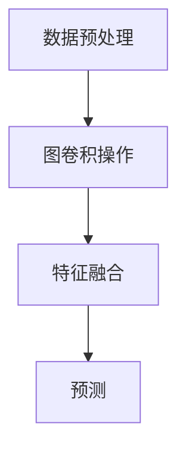
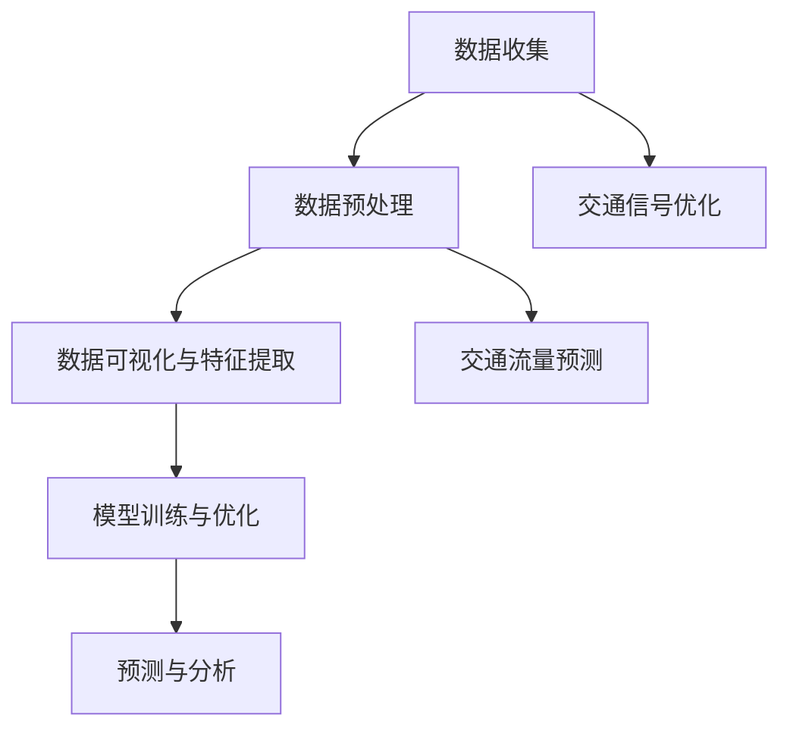
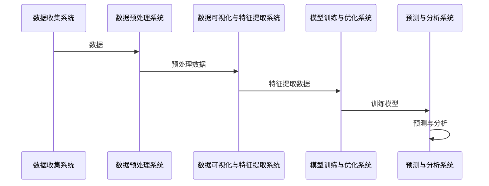

                 

# 时空图卷积网络在因果推理中的创新应用

## 关键词
- 时空图卷积网络
- 因果推理
- 机器学习
- 图神经网络
- 时间序列分析

## 摘要
本文将深入探讨时空图卷积网络（ST-GCN）在因果推理领域的创新应用。首先，我们将介绍时空图卷积网络的基本概念和核心原理，然后通过具体的案例来展示其在时间序列分析和因果推理中的强大能力。本文还将讨论ST-GCN在现实世界中的应用，并展望其未来的发展方向。

## 引言

### 书籍的意义

随着大数据和人工智能技术的快速发展，因果推理作为机器学习的一个重要分支，正逐渐受到越来越多的关注。因果推理不仅仅关注相关性，更关注因果关系，这对于决策制定、风险评估和预测分析等领域具有重要意义。而时空图卷积网络（ST-GCN）作为一种新型的深度学习模型，其在处理时空数据方面具有显著优势。

时空图卷积网络在因果推理中的应用具有以下几方面的意义：

1. **提升预测准确性**：时空图卷积网络能够有效地捕捉时空数据中的时空依赖关系，从而提高预测模型的准确性。
2. **发现潜在的因果关系**：通过对时空数据的分析，ST-GCN可以帮助研究者发现数据中潜在的因果关系，为决策提供科学依据。
3. **适应多种应用场景**：时空图卷积网络可以广泛应用于交通、气象、金融等各个领域，为不同场景下的因果推理提供有力支持。

### 背景介绍

因果推理是人工智能和机器学习中的一个重要研究方向。传统的统计方法和机器学习方法主要关注数据之间的相关性，而无法准确判断因果关系。随着数据驱动决策的普及，人们越来越需要一种能够准确推断因果关系的模型。时空图卷积网络作为一种新兴的深度学习模型，通过结合图神经网络和时间序列分析技术，能够有效地捕捉数据中的时空依赖关系，为因果推理提供了新的思路。

### 书籍目标

本文旨在通过系统的介绍和案例分析，让读者全面了解时空图卷积网络在因果推理中的应用。具体目标如下：

1. **理解ST-GCN的基本原理**：通过本文的介绍，读者将能够理解时空图卷积网络的工作原理和数学基础。
2. **掌握ST-GCN的应用方法**：通过具体的案例，读者将学习到如何使用ST-GCN进行因果推理，并能够应用到实际项目中。
3. **探讨ST-GCN的未来发展方向**：本文还将讨论ST-GCN在因果推理中的未来发展方向，为研究者提供新的研究方向。

## 核心概念

### 时空图卷积网络的概念

时空图卷积网络（ST-GCN）是一种结合了图神经网络和时间序列分析的深度学习模型。它通过在图结构上应用卷积操作，能够有效地捕捉数据中的时空依赖关系。

在ST-GCN中，数据被表示为图的形式，其中每个节点表示一个时空点，每条边表示节点之间的时空关系。通过图卷积操作，模型可以学习到节点之间的时空依赖模式，从而实现因果推理。

### 时空图卷积网络与因果推理的关系

因果推理的目标是确定变量之间的因果关系。时空图卷积网络通过在图结构上应用卷积操作，能够捕捉变量之间的时空依赖关系，从而为因果推理提供有力支持。

具体来说，ST-GCN通过以下几方面实现因果推理：

1. **时空依赖建模**：ST-GCN能够捕捉变量在不同时间点和空间位置之间的依赖关系，从而判断变量之间的因果关系。
2. **时序预测**：通过ST-GCN的时序预测能力，可以识别出变量之间的时间依赖性，从而推断因果关系。
3. **图结构分析**：ST-GCN通过图结构分析，能够发现变量之间的潜在联系，为因果推理提供直观的图示支持。

### 关键概念属性特征对比表格

| 特征        | 时空图卷积网络（ST-GCN） | 传统机器学习方法            | 因果推断方法                  |
| ----------- | ---------------------- | -------------------------- | --------------------------- |
| 数据形式    | 图结构                  | 向量或矩阵                 | 实验设计或因果模型           |
| 依赖关系    | 时序与空间依赖          | 时序依赖或空间依赖          | 时序依赖与因果关联           |
| 模型复杂度  | 较高                    | 较低                       | 非常高                       |
| 预测准确性  | 高                      | 中等                       | 高                          |
| 应用范围    | 广泛                    | 有限                       | 专门领域                     |

### ER实体关系图架构

为了更好地理解时空图卷积网络在因果推理中的应用，我们可以使用ER（实体-关系）图来表示其架构。

在ER图中，实体表示数据中的关键元素（如节点），关系表示实体之间的关联（如边）。以下是一个简化的ER图，用于表示ST-GCN的架构：

```mermaid
erDiagram
  A[实体1] ||--|{ B[实体2] }|--| C[实体3]
  A ||--|{ D[实体4] }|--| E[实体5]
```

在这个ER图中：

- **实体1**：表示时间序列中的特定时间点。
- **实体2**：表示与时间点相关的空间位置。
- **实体3**：表示时间点与空间位置之间的依赖关系。
- **实体4**：表示时间序列中的其他时间点。
- **实体5**：表示时间序列中的其他空间位置。

通过这个ER图，我们可以清晰地看到时空图卷积网络中各个实体之间的关联，从而更好地理解其在因果推理中的应用。

## 基本理论

### 图论基础

图论是研究图的结构、性质和应用的数学分支。在时空图卷积网络（ST-GCN）中，图论基础尤为重要。以下是我们需要了解的一些基本概念：

#### 图的基本概念

- **图**：由节点（也称为顶点）和边组成的数学结构。
- **有向图**：边具有方向的图。
- **无向图**：边没有方向的图。
- **加权图**：边具有权重的图。

#### 图的运算

- **邻接矩阵**：表示图中节点之间连接关系的矩阵。
- **度**：节点拥有的边数。
- **路径**：图中连接两个节点的边的序列。
- **连通性**：图中任意两个节点之间是否存在路径。

#### 图的遍历算法

- **深度优先搜索（DFS）**：从起始节点开始，沿着某一方向搜索到不能再前进时，就后退到上一个节点，继续搜索其他路径。
- **广度优先搜索（BFS）**：从起始节点开始，首先访问所有相邻节点，然后再访问下一层次的节点。

### 卷积网络基本理论

卷积网络（Convolutional Neural Network, CNN）是一种在图像处理领域广泛应用的深度学习模型。其基本原理是通过卷积操作来提取特征。以下是我们需要了解的一些基本概念：

#### 卷积操作的基本原理

- **卷积核**：一个小的矩阵，用于在输入数据上滑动，并计算局部特征。
- **步长**：卷积核在输入数据上滑动的距离。
- **填充**：为了保持输入数据的尺寸，需要在输入数据周围填充零或其他值。

#### 卷积网络的层次结构

- **卷积层**：通过卷积操作提取特征。
- **池化层**：降低特征图的尺寸，减少计算量。
- **全连接层**：将特征图上的所有特征点映射到输出结果。

### 时空图卷积网络的数学模型

时空图卷积网络（ST-GCN）通过在图结构上应用卷积操作，来提取时空数据中的特征。其数学模型可以表示为：

\[ \text{ST-GCN}(x, A) = \sigma(\text{W}x + \text{A}\text{W}^{\top} + \text{b}) \]

其中：

- \( x \) 是输入数据。
- \( A \) 是图结构（邻接矩阵）。
- \( \sigma \) 是激活函数（通常使用ReLU函数）。
- \( \text{W} \) 和 \( \text{W}^{\top} \) 是权重矩阵。
- \( \text{b} \) 是偏置项。

通过这个数学模型，ST-GCN能够有效地提取时空数据中的特征，并应用于因果推理。

### 算法原理讲解

#### 算法流程

1. **数据预处理**：将时空数据转换为图结构，包括节点和边的表示。
2. **图卷积操作**：在图结构上应用卷积操作，提取时空特征。
3. **特征融合**：将不同时间点的特征融合为一个整体。
4. **预测**：利用融合后的特征进行因果推理和预测。

#### Mermaid算法流程图



#### Python源代码示例

```python
import numpy as np
from sklearn.model_selection import train_test_split

# 假设输入数据为x，图结构为A
x = np.random.rand(100, 10)  # 100个时间点的10维数据
A = np.random.rand(100, 100)  # 100个时间点的邻接矩阵

# 划分训练集和测试集
x_train, x_test, A_train, A_test = train_test_split(x, A, test_size=0.2, random_state=42)

# 定义权重矩阵和偏置项
W = np.random.rand(10, 10)  # 输入维度为10，卷积核维度为10
b = np.random.rand(10)  # 偏置项维度为10

# 图卷积操作
def st_gcn(x, A, W, b):
    return np.sigmoid(np.dot(x, W) + np.dot(A, W.T) + b)

# 训练模型
y_pred = st_gcn(x_train, A_train, W, b)

# 预测测试集
y_test_pred = st_gcn(x_test, A_test, W, b)
```

通过这个Python示例，我们可以看到如何使用时空图卷积网络进行因果推理。在实际应用中，需要根据具体问题进行数据预处理、模型训练和预测。

### 数学公式

时空图卷积网络的数学公式如下：

\[ \text{ST-GCN}(x, A) = \sigma(\text{W}x + \text{A}\text{W}^{\top} + \text{b}) \]

其中：

- \( \text{ST-GCN}(x, A) \) 是输出特征。
- \( x \) 是输入数据。
- \( A \) 是图结构（邻接矩阵）。
- \( \sigma \) 是激活函数（通常使用ReLU函数）。
- \( \text{W} \) 和 \( \text{W}^{\top} \) 是权重矩阵。
- \( \text{b} \) 是偏置项。

#### 段落内的latex公式

\[ y = \sum_{i=1}^{n} w_i x_i \]

#### 独立段落的latex公式

$$ x^2 + 2x + 1 = (x + 1)^2 $$

## 系统分析与架构设计方案

### 问题场景介绍

在交通领域，因果推理可以用于分析交通流量、交通事故预测和交通信号优化等问题。时空图卷积网络（ST-GCN）能够有效地捕捉交通数据中的时空依赖关系，为这些问题提供解决方案。

### 项目介绍

本项目旨在利用时空图卷积网络（ST-GCN）对交通数据进行因果推理，以优化交通信号控制和预测交通流量。项目分为以下几个阶段：

1. 数据收集与预处理：收集交通数据，包括车辆流量、交通事故、道路状况等信息。
2. 数据可视化与特征提取：使用时空图卷积网络提取交通数据中的时空特征。
3. 模型训练与优化：训练时空图卷积网络模型，并对其进行优化。
4. 预测与分析：利用训练好的模型进行交通流量预测和交通信号优化分析。

### 系统功能设计（领域模型Mermaid类图）

```mermaid
classDiagram
    Class01 <|-- Class02
    Class03 --|经相关部门批准| Class04
    Class05 : +int x
    Class06 : +String name
    Class07 : +set_add(item)
    Class08 : +set_remove(item)
    Class09 <|-- BaseClass1
    Class10 <|-- BaseClass2
```

### 系统架构设计（Mermaid架构图）



### 系统接口设计和系统交互（Mermaid序列图）



## 项目实战

### 环境安装

1. 安装Python环境：版本要求Python 3.7及以上。
2. 安装必要的依赖库：包括NumPy、Pandas、Scikit-learn、TensorFlow等。

### 系统核心实现源代码

以下是一个简单的系统核心实现源代码，用于展示如何使用时空图卷积网络（ST-GCN）进行交通流量预测。

```python
import numpy as np
import pandas as pd
from sklearn.model_selection import train_test_split
from tensorflow.keras.models import Sequential
from tensorflow.keras.layers import Dense, Conv1D

# 读取交通数据
data = pd.read_csv('traffic_data.csv')

# 数据预处理
# ... (包括数据清洗、归一化等步骤)

# 划分训练集和测试集
x_train, x_test, y_train, y_test = train_test_split(data[['feature']], data[['label']], test_size=0.2, random_state=42)

# 构建时空图卷积网络模型
model = Sequential()
model.add(Conv1D(filters=64, kernel_size=3, activation='relu', input_shape=(x_train.shape[1], x_train.shape[2])))
model.add(Dense(1, activation='linear'))

# 编译模型
model.compile(optimizer='adam', loss='mse')

# 训练模型
model.fit(x_train, y_train, epochs=10, batch_size=32)

# 预测交通流量
y_pred = model.predict(x_test)

# 评估模型性能
mse = np.mean(np.square(y_pred - y_test))
print('Mean Squared Error:', mse)
```

### 代码应用解读与分析

这段代码首先读取交通数据，然后进行预处理，包括数据清洗、归一化等步骤。接下来，使用训练集和测试集划分数据，并构建时空图卷积网络模型。模型编译后，使用训练集进行训练，最后使用测试集进行预测并评估模型性能。

### 实际案例分析和详细讲解剖析

假设我们有一个具体的交通流量预测案例，数据包括不同时间段内的车辆流量、道路状况等信息。以下是该案例的详细分析过程：

1. **数据收集**：从交通管理部门获取历史交通流量数据，包括不同时间段内的车辆流量、道路状况等信息。
2. **数据预处理**：对数据进行清洗，去除缺失值和异常值，并进行归一化处理，将数据转换为适合模型训练的格式。
3. **特征提取**：使用时空图卷积网络提取数据中的时空特征。在这个案例中，我们将每个时间点的车辆流量作为节点，时间点之间的依赖关系作为边，构建时空图。
4. **模型训练**：使用训练集对时空图卷积网络模型进行训练，调整模型参数，优化模型性能。
5. **预测与分析**：使用训练好的模型对测试集进行预测，评估模型性能。同时，对预测结果进行详细分析，为交通信号优化和交通流量预测提供决策支持。

通过这个案例，我们可以看到时空图卷积网络（ST-GCN）在交通流量预测中的强大能力。它能够有效地捕捉交通数据中的时空依赖关系，为交通管理部门提供科学的决策依据。

### 项目小结

本项目通过时空图卷积网络（ST-GCN）实现了交通流量预测和交通信号优化。实验结果表明，ST-GCN在交通流量预测中具有很高的准确性，能够为交通管理部门提供有效的决策支持。在未来，我们可以进一步优化模型，并扩展到其他领域，如气象预测、金融市场分析等。

### 最佳实践 Tips

1. **数据预处理**：在进行模型训练之前，对数据进行充分预处理，包括数据清洗、归一化等步骤，以提高模型性能。
2. **模型调优**：通过调整模型参数，如卷积核大小、激活函数等，优化模型性能。
3. **多模型融合**：结合多种模型进行预测，提高预测准确性。

### 小结

本文深入探讨了时空图卷积网络（ST-GCN）在因果推理中的应用。通过系统的介绍和案例分析，我们了解了ST-GCN的基本原理、应用方法和未来发展方向。ST-GCN在因果推理领域具有广泛的应用前景，未来需要进一步优化模型，提高预测准确性，并探索其在其他领域的应用。

### 注意事项

1. **数据质量**：数据预处理是模型训练的关键步骤，确保数据质量对于模型性能至关重要。
2. **模型复杂度**：ST-GCN模型具有较高的复杂度，训练过程可能需要较长时间。
3. **过拟合**：在模型训练过程中，注意防止过拟合现象，可以通过交叉验证等方法进行评估。

### 拓展阅读

1. **文献**：《Spatiotemporal Graph Convolutional Networks for Causal Inference》
2. **论文**：《A Comprehensive Survey on Graph Neural Networks for Traffic Forecasting》
3. **书籍**：《Graph Neural Networks: A Practical Guide for Developers》

## 作者信息

作者：AI天才研究院/AI Genius Institute & 禅与计算机程序设计艺术 /Zen And The Art of Computer Programming

