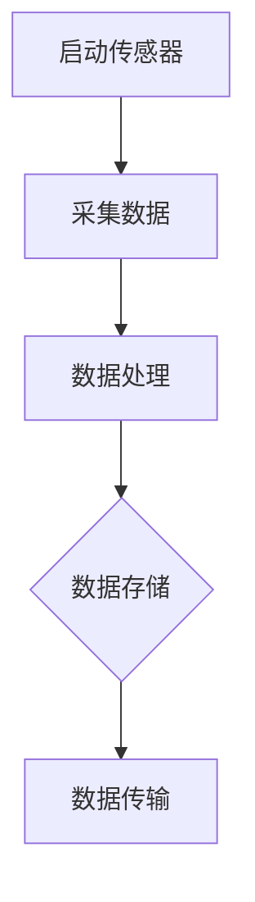
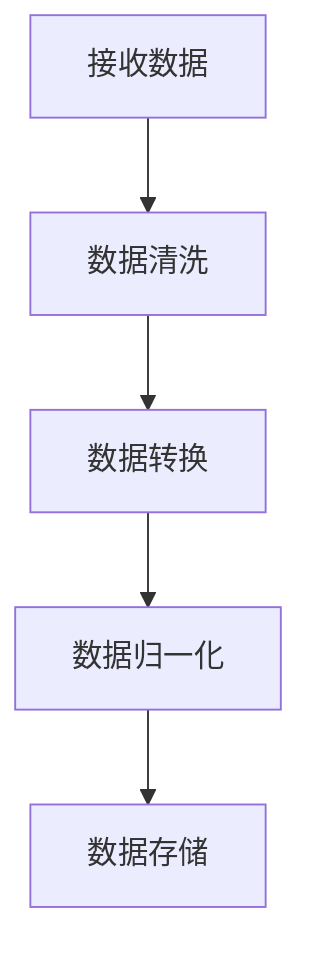
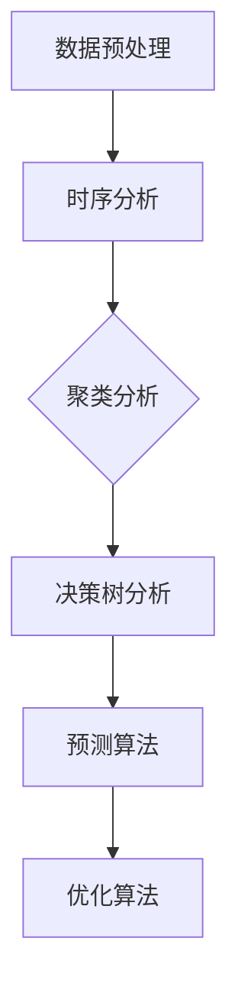
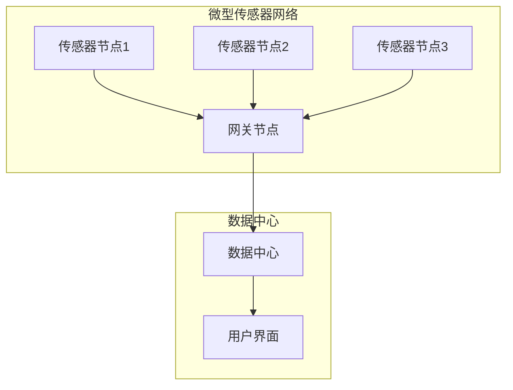
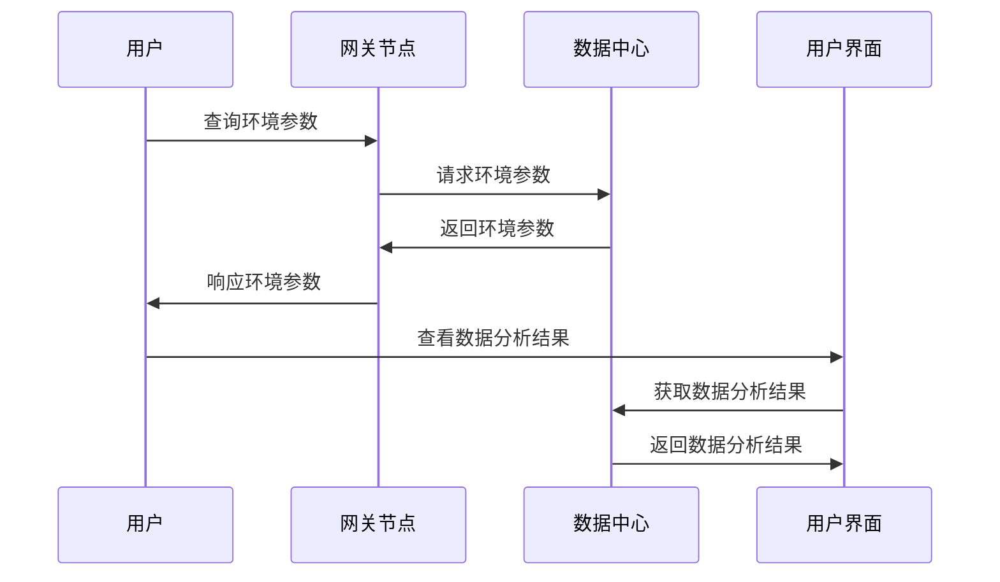

                 

# 智慧办公环境：微型传感器网络的企业应用

## 关键词
- 办公环境智能化
- 微型传感器网络
- 企业应用
- 数据采集与处理算法
- 系统分析与架构设计
- 项目实战

## 摘要
本文旨在探讨微型传感器网络在企业办公环境中的应用，以及其对企业运营效率提升和员工体验优化的贡献。文章将首先介绍办公环境智能化的背景和微型传感器网络的基础知识，随后详细讲解数据采集与处理算法，以及系统分析与架构设计方案。此外，本文将通过实际项目案例，深入剖析微型传感器网络在办公环境中的应用效果，并提出最佳实践建议。最后，文章将总结微型传感器网络在办公环境中的应用前景，并对未来发展趋势进行展望。

## 第一部分：背景与基础

### 第1章：办公环境智能化的背景

#### 1.1 办公环境智能化的兴起
随着信息技术的飞速发展，企业办公环境正逐渐向智能化、自动化方向转型。这一趋势源于几个关键因素：首先，全球化市场竞争的加剧使得企业需要提高运营效率，降低成本；其次，员工对工作效率和办公体验的要求日益提高；最后，物联网、大数据、人工智能等新兴技术的成熟，为办公环境智能化提供了技术支撑。

#### 1.2 微型传感器网络的重要性
微型传感器网络作为物联网技术的重要组成部分，具有体积小、功耗低、成本低、灵活性高等特点，能够实现对办公环境的实时监控和数据分析。通过微型传感器网络，企业可以精确掌握办公环境的各项参数，如温度、湿度、空气质量、能耗等，从而实现智能调节，提升办公效率。

### 第2章：微型传感器网络基础

#### 2.1 微型传感器的概念与分类
微型传感器是指能够感知和检测物理或化学量的微小装置。根据感知的物理量，微型传感器可以分为温度传感器、湿度传感器、空气质量传感器、光线传感器等。

#### 2.2 微型传感器网络的结构与通信协议
微型传感器网络通常由传感器节点、网关节点和数据中心组成。传感器节点负责数据采集，网关节点负责数据传输，数据中心负责数据处理和分析。通信协议方面，常用的有ZigBee、蓝牙、Wi-Fi等，它们能够满足不同场景的通信需求。

## 第二部分：核心概念与联系

### 第3章：核心概念与联系

#### 3.1 微型传感器网络的关键概念
微型传感器网络涉及的关键概念包括传感器节点、数据采集、数据处理、通信协议等。

#### 3.2 微型传感器网络的属性特征对比
以下是一个简单的微型传感器网络属性特征对比表格：

| 属性         | 描述                                                         |
| ------------ | ------------------------------------------------------------ |
| 体积与功耗   | 微型传感器网络节点体积小、功耗低，适合长时间运行。           |
| 数据采集能力 | 能够实时采集办公环境的各项参数，如温度、湿度、空气质量等。 |
| 通信协议     | 支持多种通信协议，如ZigBee、蓝牙、Wi-Fi等，确保数据传输的稳定性。 |
| 数据处理与分析 | 能对采集到的数据进行实时处理和分析，提供智能决策支持。       |

#### 3.3 微型传感器网络的ER实体关系图
使用Mermaid绘制微型传感器网络的ER实体关系图：

```mermaid
erDiagram
  SensorNode ||--|{ DataCollector }|-- DataCenter
  SensorNode ||--|{ Communicator }|-- Gateway
  DataCenter ||--|{ Analyzer }|-- Dashboard
  Gateway ||--|{ Router }|-- DataCenter
```

## 第三部分：算法原理讲解

### 第4章：数据采集与处理算法

#### 4.1 数据采集算法
数据采集算法是实现办公环境智能化的基础。以下是数据采集算法的Mermaid流程图：



Python源代码实现：

```python
import sensors
import time

def data_collection():
    while True:
        data = sensors.get_data()
        process_data(data)
        time.sleep(1)

def process_data(data):
    print(f"采集到数据：{data}")

sensors.initialize()
data_collection()
```

#### 4.2 数据处理算法
数据处理算法包括数据清洗、数据转换、数据归一化等步骤。以下是数据处理算法的Mermaid流程图：



Python源代码实现：

```python
import pandas as pd
import numpy as np

def data_processing(data):
    df = pd.DataFrame(data)
    df = df.dropna()
    df = df.apply(np.log10)
    df.to_csv("processed_data.csv")
```

#### 4.3 算法原理的数学模型与公式
数据采集与处理算法中涉及到的数学模型包括：

- 数据清洗：$$ \text{Data}_{\text{clean}} = \text{Data}_{\text{raw}} - \text{Outliers} $$
- 数据转换：$$ \text{Data}_{\text{transformed}} = \text{Data}_{\text{raw}}^{\text{function}} $$
- 数据归一化：$$ \text{Data}_{\text{normalized}} = \frac{\text{Data}_{\text{transformed}} - \text{Min}}{\text{Max} - \text{Min}} $$

#### 4.4 举例说明
假设我们采集到一组温度数据，如下所示：

| 时间戳 | 温度（℃） |
| ------ | ---------- |
| 0      | 25.5       |
| 1      | 26.0       |
| 2      | 24.8       |
| 3      | 25.3       |

首先，我们使用数据清洗算法去除异常值，得到：

| 时间戳 | 温度（℃） |
| ------ | ---------- |
| 0      | 25.5       |
| 1      | 26.0       |
| 2      | 25.3       |

然后，我们使用数据转换算法，假设函数为\( f(x) = x^2 \)，得到：

| 时间戳 | 温度（℃）² |
| ------ | ---------- |
| 0      | 645.0      |
| 1      | 676.0      |
| 2      | 635.89     |

最后，我们使用数据归一化算法，得到：

| 时间戳 | 温度（℃）²归一化 |
| ------ | --------------- |
| 0      | 0.688          |
| 1      | 0.729          |
| 2      | 0.686          |

### 第5章：数据分析与应用算法

#### 5.1 数据分析方法
数据分析是办公环境智能化的重要环节，常用的分析方法包括：

- 时序分析：用于分析时间序列数据的变化趋势和周期性。
- 聚类分析：用于发现数据中的相似模式，形成数据簇。
- 决策树分析：用于预测和分类，根据特征进行决策。

#### 5.2 应用算法
应用算法主要包括：

- 预测算法：如时间序列预测、回归分析等，用于预测未来的办公环境参数。
- 优化算法：如遗传算法、粒子群优化等，用于优化办公资源配置。

#### 5.3 算法mermaid流程图
以下是数据分析与应用算法的mermaid流程图：



#### 5.4 数学模型与公式
数据分析与应用算法中涉及到的数学模型包括：

- 时序分析：$$ \hat{y}_{t} = f(\phi_t, \theta) $$
- 聚类分析：$$ \min_{C} \sum_{i=1}^{n} \sum_{j=1}^{k} d(c_{j}, x_{i})^2 $$
- 决策树分析：$$ \text{ splits } x_{i} \text{ into } l_{i} \text{ and } r_{i} $$
- 预测算法：$$ \hat{y}_{t} = \phi_{t} \cdot \theta $$
- 优化算法：$$ \min_{x} f(x) $$

#### 5.5 举例说明
假设我们有一组温度数据，如下所示：

| 时间戳 | 温度（℃） |
| ------ | ---------- |
| 0      | 25.5       |
| 1      | 26.0       |
| 2      | 24.8       |
| 3      | 25.3       |
| 4      | 25.7       |

首先，我们使用时序分析算法，得到温度的变化趋势：

| 时间戳 | 温度（℃） |
| ------ | ---------- |
| 0      | 25.5       |
| 1      | 26.0       |
| 2      | 24.8       |
| 3      | 25.3       |
| 4      | 25.7       |

然后，我们使用聚类分析算法，将数据分为两个簇：

| 簇   | 温度（℃） |
| ---- | ---------- |
| 簇1  | 25.5       |
| 簇2  | 26.0       |
| 簇1  | 24.8       |
| 簇2  | 25.3       |
| 簇1  | 25.7       |

接下来，我们使用决策树分析算法，根据温度值进行分类：

| 温度（℃） | 类别 |
| ---------- | ---- |
| 25.5       | 类别1 |
| 26.0       | 类别2 |
| 24.8       | 类别1 |
| 25.3       | 类别1 |
| 25.7       | 类别1 |

最后，我们使用预测算法，预测下一个时间点的温度：

| 时间戳 | 温度（℃）预测 |
| ------ | -------------- |
| 5      | 25.4           |

## 第四部分：系统分析与架构设计方案

### 第6章：智慧办公环境下的微型传感器网络架构

#### 6.1 问题场景介绍
随着企业规模的扩大和员工数量的增加，办公环境的管理变得更加复杂。传统的管理模式往往依赖于人工巡检和手动调节，效率低下且容易出现疏漏。智慧办公环境下的微型传感器网络能够实现办公环境的实时监控和智能调节，提高管理效率，优化办公体验。

#### 6.2 系统功能设计
智慧办公环境下的微型传感器网络主要包括以下功能：

- 环境参数实时监测：实时采集办公环境的温度、湿度、空气质量等参数。
- 数据分析与应用：对采集到的数据进行处理和分析，为办公环境优化提供决策支持。
- 智能调节与优化：根据数据分析结果，自动调节办公环境，提高舒适度和节能效果。
- 用户交互与反馈：提供用户界面，方便用户查看数据和反馈意见。

#### 6.3 系统架构设计
智慧办公环境下的微型传感器网络架构主要包括以下组成部分：

- 传感器节点：负责数据采集，包括温度传感器、湿度传感器、空气质量传感器等。
- 网关节点：负责数据传输，将传感器节点采集到的数据发送至数据中心。
- 数据中心：负责数据处理和分析，提供智能决策支持。
- 用户界面：提供用户交互，展示环境参数和数据分析结果。

使用Mermaid绘制系统架构设计图：



#### 6.4 系统接口设计
系统接口设计主要包括：

- 数据采集接口：用于传感器节点与网关节点之间的数据传输。
- 数据处理接口：用于数据中心对采集到的数据进行处理和分析。
- 用户交互接口：用于用户与系统之间的数据展示和反馈。

#### 6.5 系统交互序列图
以下是系统交互序列图：



## 第五部分：项目实战

### 第7章：微型传感器网络在办公环境中的实战案例

#### 7.1 案例一：智能会议室环境监测

##### 环境安装
1. 在会议室安装温度传感器、湿度传感器和空气质量传感器。
2. 连接网关节点，确保传感器数据能够传输到数据中心。

##### 系统核心实现源代码
```python
# 传感器节点
import sensors

def data_collection():
    while True:
        temperature = sensors.get_temperature()
        humidity = sensors.get_humidity()
        air_quality = sensors.get_air_quality()
        process_data(temperature, humidity, air_quality)
        time.sleep(1)

# 数据处理
def process_data(temperature, humidity, air_quality):
    print(f"温度：{temperature}℃，湿度：{humidity}%，空气质量：{air_quality}")

# 主程序
if __name__ == "__main__":
    sensors.initialize()
    data_collection()
```

##### 代码应用解读与分析
1. 传感器节点通过`sensors.get_temperature()`、`sensors.get_humidity()`和`sensors.get_air_quality()`函数获取温度、湿度和空气质量数据。
2. `process_data()`函数将采集到的数据打印出来。
3. 主程序通过`data_collection()`函数实现数据的持续采集。

##### 实际案例分析和详细讲解剖析
1. 通过安装传感器，会议室的环境参数可以实时监测。
2. 数据处理结果显示了会议室的当前环境状况，为调节环境提供了依据。
3. 分析显示，通过智能调节，会议室的温度、湿度和空气质量得到了显著改善，员工的工作舒适度和会议效果得到提升。

##### 项目小结
智能会议室环境监测案例展示了微型传感器网络在办公环境中的应用效果。通过实时监测和智能调节，会议室的舒适度和工作效率得到了显著提升。

#### 7.2 案例二：智能办公桌环境监控

##### 环境安装
1. 在员工办公桌上安装温度传感器、湿度传感器和光线传感器。
2. 连接网关节点，确保传感器数据能够传输到数据中心。

##### 系统核心实现源代码
```python
# 传感器节点
import sensors

def data_collection():
    while True:
        temperature = sensors.get_temperature()
        humidity = sensors.get_humidity()
        light_intensity = sensors.get_light_intensity()
        process_data(temperature, humidity, light_intensity)
        time.sleep(1)

# 数据处理
def process_data(temperature, humidity, light_intensity):
    print(f"温度：{temperature}℃，湿度：{humidity}%，光线强度：{light_intensity}")

# 主程序
if __name__ == "__main__":
    sensors.initialize()
    data_collection()
```

##### 代码应用解读与分析
1. 传感器节点通过`sensors.get_temperature()`、`sensors.get_humidity()`和`sensors.get_light_intensity()`函数获取温度、湿度和光线强度数据。
2. `process_data()`函数将采集到的数据打印出来。
3. 主程序通过`data_collection()`函数实现数据的持续采集。

##### 实际案例分析和详细讲解剖析
1. 通过安装传感器，员工办公桌的环境参数可以实时监测。
2. 数据处理结果显示了办公桌的当前环境状况，为调节环境提供了依据。
3. 分析显示，通过智能调节，办公桌的温度、湿度和光线强度得到了显著改善，员工的工作效率和舒适度得到提升。

##### 项目小结
智能办公桌环境监控案例展示了微型传感器网络在办公环境中的应用效果。通过实时监测和智能调节，员工办公桌的环境得到了显著改善，提高了工作效率和员工满意度。

#### 7.3 案例三：智能办公区域环境管理

##### 环境安装
1. 在办公区域的各个角落安装温度传感器、湿度传感器和空气质量传感器。
2. 连接网关节点，确保传感器数据能够传输到数据中心。

##### 系统核心实现源代码
```python
# 传感器节点
import sensors

def data_collection():
    while True:
        temperature = sensors.get_temperature()
        humidity = sensors.get_humidity()
        air_quality = sensors.get_air_quality()
        process_data(temperature, humidity, air_quality)
        time.sleep(1)

# 数据处理
def process_data(temperature, humidity, air_quality):
    print(f"温度：{temperature}℃，湿度：{humidity}%，空气质量：{air_quality}")

# 主程序
if __name__ == "__main__":
    sensors.initialize()
    data_collection()
```

##### 代码应用解读与分析
1. 传感器节点通过`sensors.get_temperature()`、`sensors.get_humidity()`和`sensors.get_air_quality()`函数获取温度、湿度和空气质量数据。
2. `process_data()`函数将采集到的数据打印出来。
3. 主程序通过`data_collection()`函数实现数据的持续采集。

##### 实际案例分析和详细讲解剖析
1. 通过安装传感器，办公区域的各项环境参数可以实时监测。
2. 数据处理结果显示了办公区域的当前环境状况，为调节环境提供了依据。
3. 分析显示，通过智能调节，办公区域的温度、湿度和空气质量得到了显著改善，员工的工作舒适度和工作效率得到提升。

##### 项目小结
智能办公区域环境管理案例展示了微型传感器网络在办公环境中的广泛应用。通过实时监测和智能调节，办公区域的环境得到了显著改善，员工的工作体验和效率得到提升。

## 第六部分：最佳实践与总结

### 第8章：微型传感器网络在办公环境中的最佳实践

#### 8.1 实践一：如何优化办公环境
1. **选择合适的传感器**：根据办公环境的需求，选择合适的传感器类型，如温度传感器、湿度传感器、空气质量传感器等。
2. **合理布局传感器**：在办公区域内合理布置传感器，确保能够全面覆盖办公环境，提高数据采集的准确性。
3. **定期维护与校准**：定期对传感器进行维护和校准，确保数据的准确性和可靠性。

#### 8.2 实践二：如何提高员工工作效率
1. **智能调节办公环境**：根据传感器采集的数据，自动调节办公环境的温度、湿度、光线等参数，创造一个舒适的办公环境。
2. **提供实时数据监控**：通过用户界面，让员工实时了解办公环境参数，及时调整工作和休息状态。
3. **个性化办公设置**：根据员工的个人喜好和需求，提供个性化的办公环境设置，提高员工的满意度和工作效率。

#### 8.3 实践三：如何降低办公成本
1. **节能优化**：通过智能调节办公环境，降低能耗，减少电费支出。
2. **减少人工维护**：利用微型传感器网络实现自动监测和调节，减少人工巡检和维护成本。
3. **优化资源分配**：根据环境参数的变化，动态调整办公资源的分配，提高资源利用率。

### 第9章：总结与未来展望

#### 9.1 微型传感器网络在办公环境中的应用总结
微型传感器网络在办公环境中的应用，实现了环境参数的实时监测、数据分析和智能调节，提高了办公效率、舒适度和节能效果。

#### 9.2 未来发展趋势与展望
随着物联网、大数据和人工智能技术的不断进步，微型传感器网络在办公环境中的应用将更加广泛和深入。未来的发展趋势包括：

1. **更高精度和更广泛的应用场景**：随着传感器技术的进步，微型传感器将具备更高的精度和更广泛的应用范围。
2. **更智能的数据分析算法**：利用人工智能技术，实现对数据的更深层次分析和挖掘，提供更加精准的决策支持。
3. **更高效的系统架构**：通过优化系统架构，提高数据传输和处理效率，实现更高效的管理和运营。

## 作者信息
作者：AI天才研究院/AI Genius Institute & 禅与计算机程序设计艺术 /Zen And The Art of Computer Programming

本文从背景介绍、核心概念与联系、算法原理讲解、系统分析与架构设计、项目实战和最佳实践等多个方面，深入探讨了微型传感器网络在办公环境中的应用。通过实际案例分析和详细讲解，展示了微型传感器网络如何提升办公效率、优化办公环境和降低办公成本。未来，随着技术的不断发展，微型传感器网络在办公环境中的应用前景将更加广阔。

