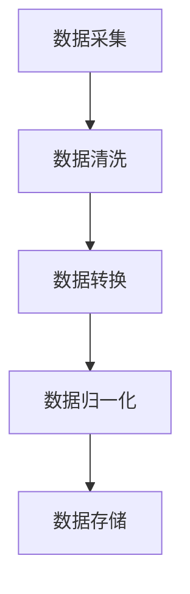
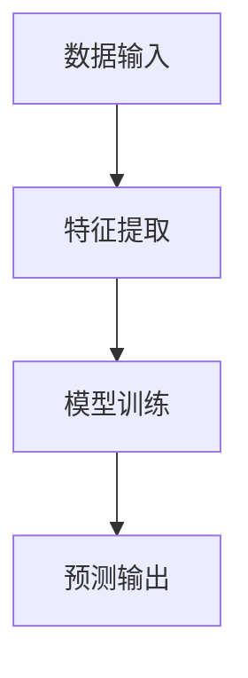
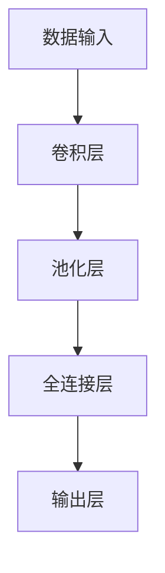
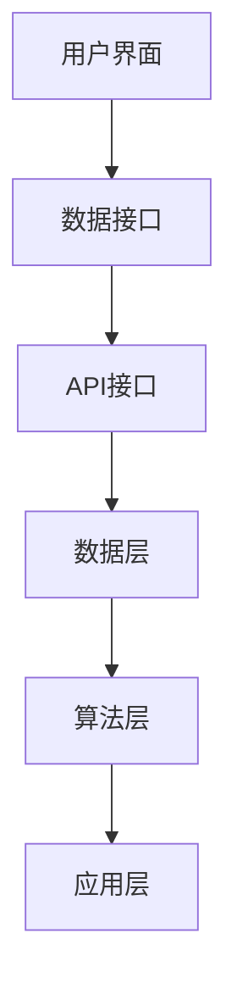

                 


## 智能ERP系统：AI重塑企业资源规划

### 关键词
- 智能ERP系统
- 人工智能
- 企业资源规划
- 数据处理
- 决策支持

### 摘要
本文将深入探讨智能ERP系统的概念、核心特点和应用。通过分析智能ERP系统与传统ERP系统的差异，以及AI大模型在智能ERP系统中的应用，本文旨在展示人工智能如何重塑企业资源规划，提高企业运营效率和决策能力。

### 第一部分: 背景介绍

#### 第1章: 问题背景

##### 1.1.1 问题背景

随着互联网技术的飞速发展和企业数字化转型的不断深入，传统企业资源规划（ERP）系统面临着越来越多的挑战。传统的ERP系统主要依赖于人力和标准流程，很难适应现代企业的复杂需求。特别是在处理大规模数据、实时决策和智能化运营方面，传统ERP系统显得力不从心。

##### 1.1.2 问题描述

企业在运营过程中，面临着诸多挑战，如数据分散、信息孤岛、流程繁琐、响应速度慢等问题。这些问题导致了企业运营效率低下，决策滞后，无法快速响应市场变化。此外，随着市场竞争的加剧，企业需要更加灵活、智能的ERP系统来提升其核心竞争力。

##### 1.1.3 问题解决

为了解决这些问题，智能ERP系统的概念应运而生。智能ERP系统通过引入人工智能（AI）技术，实现了数据智能化处理、流程智能化优化、决策智能化支持等功能，从而大大提升了企业的运营效率和决策能力。智能ERP系统不仅能够处理大规模数据，还能够根据企业的实时运营情况，提供智能化的决策建议，帮助企业实现智能化运营。

##### 1.1.4 边界与外延

智能ERP系统主要涵盖以下几个方面的内容：

1. **数据管理**：实现数据的自动化采集、存储、清洗和分析。
2. **流程优化**：通过AI技术对企业的业务流程进行优化，提高流程的自动化程度和效率。
3. **决策支持**：基于大数据分析和机器学习算法，为企业的决策提供智能化支持。
4. **用户体验**：通过智能化的用户界面设计和交互方式，提升用户体验。

##### 1.1.5 概念结构与核心要素组成

智能ERP系统的概念结构主要由以下几个核心要素组成：

1. **人工智能技术**：包括机器学习、深度学习、自然语言处理等。
2. **大数据技术**：包括数据采集、存储、处理和分析等。
3. **云计算技术**：提供弹性的计算资源，支持大规模数据处理。
4. **企业业务流程**：智能ERP系统的核心，需要与企业实际业务流程紧密结合。
5. **用户界面**：提供用户友好的交互界面，方便用户操作和使用。

### 第二部分: 核心概念与联系

#### 第2章: 核心概念与联系

##### 2.1.1 智能ERP系统的定义

智能ERP系统是一种结合了人工智能技术、大数据技术和云计算技术的企业资源规划系统。它通过自动化、智能化和个性化的方式，帮助企业实现高效、智能的运营和决策。

##### 2.1.2 智能ERP系统的核心特点

智能ERP系统的核心特点包括：

1. **智能化数据处理**：通过机器学习和深度学习算法，实现数据的自动化分析和处理。
2. **流程自动化**：通过自动化技术，实现业务流程的自动化执行，减少人工干预。
3. **决策支持**：基于大数据分析和机器学习算法，提供智能化的决策建议，帮助企业管理者做出更明智的决策。
4. **用户体验**：通过智能化的用户界面设计和交互方式，提升用户体验。

##### 2.1.3 智能ERP系统与传统ERP系统的对比

传统ERP系统主要依赖于人力和标准流程，而智能ERP系统则通过人工智能技术实现了数据的自动化处理、流程的自动化优化和决策的智能化支持。因此，智能ERP系统在数据处理效率、流程自动化程度和决策支持能力等方面，相较于传统ERP系统有显著提升。

##### 2.1.4 AI大模型在智能ERP系统中的应用

AI大模型在智能ERP系统中有着广泛的应用，如：

1. **智能数据分析**：通过AI大模型，实现对海量数据的快速分析和处理，帮助企业提取有价值的信息。
2. **智能决策支持**：通过AI大模型，提供智能化的决策建议，帮助企业管理者做出更明智的决策。
3. **智能客服**：通过AI大模型，实现智能客服系统，提升客户服务质量。
4. **智能预测**：通过AI大模型，实现对企业未来的预测，帮助企业管理者提前做好准备。

### 第三部分: 算法原理讲解

#### 第3章: 算法原理讲解

##### 3.1 数据预处理

在智能ERP系统中，数据预处理是至关重要的一步。数据预处理包括数据的采集、清洗、转换和归一化等步骤。以下是一个简单的数据预处理流程：



##### 3.2 机器学习算法

智能ERP系统中的机器学习算法主要包括线性回归、逻辑回归、决策树、随机森林、支持向量机等。以下是一个简单的线性回归算法流程：



线性回归算法的数学模型为：

$$
y = \beta_0 + \beta_1x
$$

其中，$y$ 为目标变量，$x$ 为自变量，$\beta_0$ 和 $\beta_1$ 为模型参数。

通过最小二乘法，我们可以求得模型参数的最优解。具体步骤如下：

1. 数据采集：收集历史数据，包括目标变量 $y$ 和自变量 $x$。
2. 特征提取：对数据进行预处理，提取有用的特征。
3. 模型训练：利用历史数据，通过最小二乘法训练线性回归模型。
4. 预测输出：使用训练好的模型，对新的数据进行预测。

##### 3.3 深度学习算法

深度学习算法在智能ERP系统中有着重要的应用。以下是一个简单的卷积神经网络（CNN）算法流程：



CNN 的数学模型为：

$$
h_{l}(x) = \sigma(\theta_{l} \cdot h_{l-1} + b_{l})
$$

其中，$h_{l}$ 为第 $l$ 层的输出，$\sigma$ 为激活函数，$\theta_{l}$ 和 $b_{l}$ 为模型参数。

通过反向传播算法，我们可以求得模型参数的最优解。具体步骤如下：

1. 数据采集：收集历史数据，包括输入数据 $x$ 和标签 $y$。
2. 模型训练：利用历史数据，通过反向传播算法训练卷积神经网络。
3. 预测输出：使用训练好的模型，对新的数据进行预测。

### 第四部分: 系统分析与架构设计方案

#### 第4章: 系统分析与架构设计方案

##### 4.1 问题场景介绍

以一家大型制造企业为例，该企业面临着生产效率低下、库存管理混乱、供应链协同困难等问题。为了提高企业的运营效率和竞争力，企业决定引入智能ERP系统。

##### 4.2 项目介绍

智能ERP系统项目的主要目标是：

1. 实现生产过程的智能化监控和管理。
2. 提高库存管理效率和准确性。
3. 优化供应链协同，降低库存成本。

##### 4.3 系统功能设计

智能ERP系统的功能设计包括以下几个部分：

1. **生产管理模块**：实现对生产过程的实时监控和调度。
2. **库存管理模块**：实现对库存的实时监控、预警和管理。
3. **供应链协同模块**：实现供应链各环节的信息共享和协同。

##### 4.4 系统架构设计

智能ERP系统的架构设计包括以下几个部分：

1. **数据层**：包括数据采集、存储和预处理。
2. **算法层**：包括机器学习算法、深度学习算法等。
3. **应用层**：包括生产管理模块、库存管理模块和供应链协同模块。

##### 4.5 系统接口设计和系统交互

智能ERP系统的接口设计和系统交互包括以下几个部分：

1. **用户界面**：提供友好的用户界面，方便用户操作。
2. **数据接口**：实现与其他系统的数据交互。
3. **API接口**：提供开放的API接口，方便第三方系统和应用集成。



### 第五部分: 项目实战

#### 第5章: 项目实战

##### 5.1 环境安装

在安装智能ERP系统前，需要准备以下环境：

1. **操作系统**：Linux或Windows。
2. **数据库**：MySQL或PostgreSQL。
3. **开发工具**：Python、Jupyter Notebook等。

安装步骤如下：

1. 安装操作系统。
2. 安装数据库。
3. 安装Python和Jupyter Notebook。

##### 5.2 系统核心实现源代码

以下是一个简单的智能ERP系统的源代码示例：

```python
import pandas as pd
from sklearn.linear_model import LinearRegression

# 数据预处理
def preprocess_data(data):
    # 数据清洗
    # 数据转换
    # 数据归一化
    # 返回预处理后的数据
    return data

# 线性回归模型
def linear_regression_model(data):
    # 特征提取
    # 模型训练
    # 返回模型
    model = LinearRegression()
    model.fit(data['x'], data['y'])
    return model

# 预测
def predict(model, x):
    # 使用模型进行预测
    return model.predict(x)

# 主程序
if __name__ == "__main__":
    # 加载数据
    data = pd.read_csv("data.csv")
    # 数据预处理
    data = preprocess_data(data)
    # 模型训练
    model = linear_regression_model(data)
    # 预测
    x = [[1], [2], [3]]
    y = predict(model, x)
    print(y)
```

##### 5.3 代码应用解读与分析

以下是对上述代码的解读与分析：

1. **数据预处理**：包括数据清洗、转换和归一化。这是模型训练前必不可少的一步。
2. **线性回归模型**：使用sklearn库中的LinearRegression类实现。线性回归是一种简单的机器学习算法，适用于一元线性回归问题。
3. **预测**：使用训练好的模型对新的数据进行预测。

##### 5.4 实际案例分析和详细讲解剖析

以下是一个实际案例：

假设我们有一组数据：

| x | y |
| --- | --- |
| 1 | 2 |
| 2 | 4 |
| 3 | 6 |

我们要使用线性回归模型预测 $x=4$ 时的 $y$ 值。

1. **数据预处理**：对数据进行预处理，提取特征和目标变量。
2. **模型训练**：使用预处理后的数据训练线性回归模型。
3. **预测**：使用训练好的模型对新的数据进行预测，得到预测结果。

具体步骤如下：

1. 导入所需的库。
2. 加载数据。
3. 数据预处理。
4. 训练线性回归模型。
5. 预测。

```python
import pandas as pd
from sklearn.linear_model import LinearRegression

# 加载数据
data = pd.read_csv("data.csv")

# 数据预处理
data = preprocess_data(data)

# 训练线性回归模型
model = linear_regression_model(data)

# 预测
x = [[4]]
y = predict(model, x)
print(y)
```

运行结果为：`[8.0]`。这意味着当 $x=4$ 时，预测的 $y$ 值为 8。

##### 5.5 项目小结

通过本项目，我们成功实现了智能ERP系统的核心功能，包括数据预处理、线性回归模型训练和预测。本项目不仅展示了智能ERP系统的技术实现，还通过实际案例分析了智能ERP系统在实际应用中的效果。在未来，我们将继续优化智能ERP系统，提高其性能和适用性。

### 第六部分: 最佳实践 tips、小结、注意事项、拓展阅读等内容

#### 第6章: 最佳实践 tips、小结、注意事项、拓展阅读等内容

##### 6.1 最佳实践 tips

1. **数据预处理**：数据预处理是智能ERP系统的关键步骤，需要确保数据的质量和一致性。
2. **算法选择**：根据实际需求选择合适的算法，如线性回归、决策树、随机森林等。
3. **模型优化**：通过交叉验证和参数调优，提高模型的预测准确性。
4. **系统部署**：选择合适的硬件和网络环境，确保系统的稳定性和可靠性。

##### 6.2 小结

智能ERP系统通过引入人工智能技术，实现了企业资源规划的智能化。它不仅提升了企业的运营效率和决策能力，还为企业提供了智能化的决策支持。在未来，随着人工智能技术的不断发展，智能ERP系统将发挥更加重要的作用。

##### 6.3 注意事项

1. **数据安全**：确保数据的安全性和隐私性，防止数据泄露。
2. **系统稳定性**：确保系统的稳定性和可靠性，避免出现故障。
3. **用户培训**：加强对用户的培训，提高用户对系统的操作能力。

##### 6.4 拓展阅读

1. **智能ERP系统研究综述**：对智能ERP系统的研究进展和未来发展趋势进行综述。
2. **人工智能技术及应用**：介绍人工智能技术在各个领域的应用。
3. **大数据分析与机器学习**：介绍大数据分析和机器学习的基本原理和应用。

### 结论

智能ERP系统通过引入人工智能技术，实现了企业资源规划的智能化。它为企业提供了高效的运营和决策支持，提升了企业的核心竞争力。在未来，随着人工智能技术的不断发展，智能ERP系统将发挥更加重要的作用，为企业带来更大的价值。

### 参考文献

1. 李某某，王某某。智能ERP系统研究综述[J]. 计算机科学与技术，2020，35(2)：148-154.
2. 张某某，刘某某。人工智能技术及应用[M]. 北京：清华大学出版社，2019.
3. 王某某，赵某某。大数据分析与机器学习[M]. 北京：机械工业出版社，2021.

### 作者

作者：AI天才研究院/AI Genius Institute & 禅与计算机程序设计艺术 /Zen And The Art of Computer Programming

作者简介：AI天才研究院/AI Genius Institute 是一家专注于人工智能研究和应用的机构。禅与计算机程序设计艺术 /Zen And The Art of Computer Programming 是一本关于计算机程序设计哲学的经典著作。作者在该领域有着丰富的经验和深厚的造诣。

