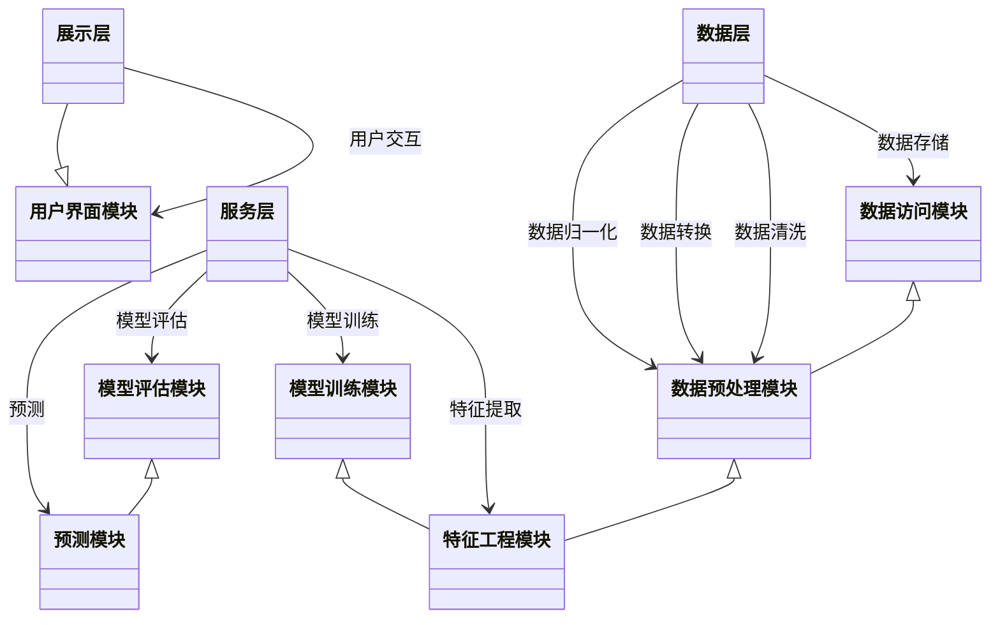
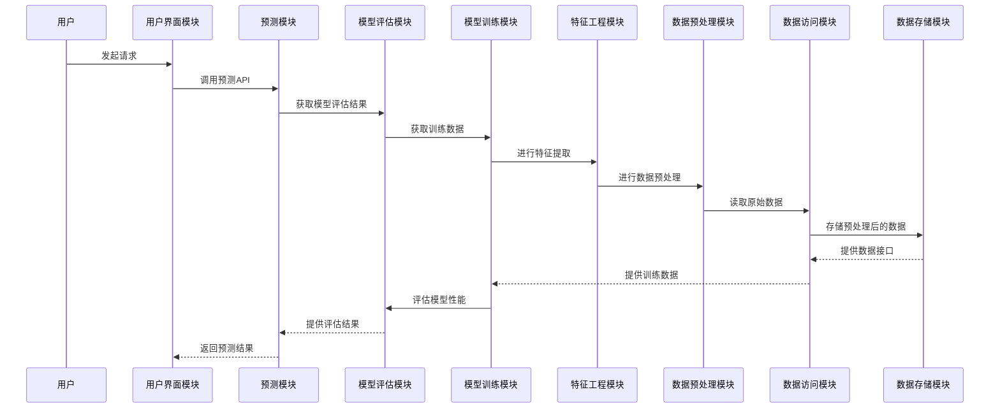
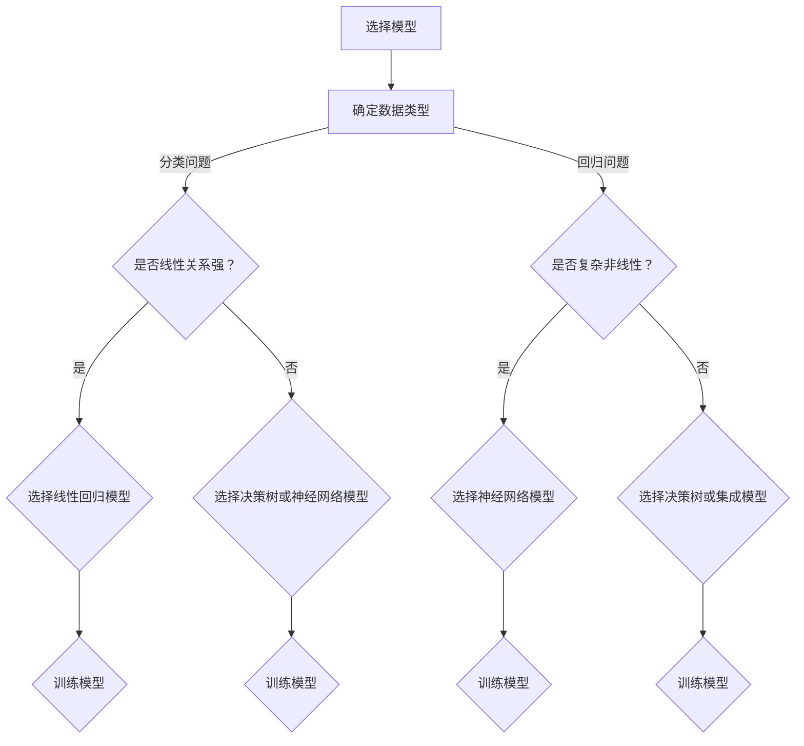
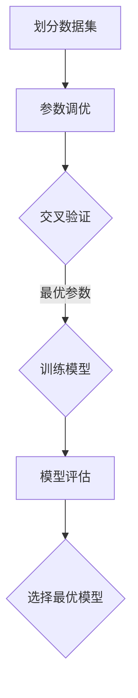
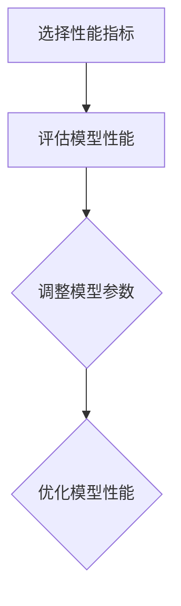

                 

## 智能KPI预测模型：AI辅助目标设定与跟踪

### 关键词：KPI预测、AI、目标设定、目标跟踪、模型优化

### 摘要：

本文旨在探讨如何利用人工智能（AI）技术，特别是机器学习和深度学习算法，来实现智能KPI（关键绩效指标）预测模型。通过AI辅助目标设定与跟踪，企业能够更精准地进行业务规划和绩效管理。本文将分五个部分展开讨论：

1. **背景与核心概念**：介绍KPI在企业管理中的重要性，分析传统KPI管理的挑战，阐述智能KPI预测的需求和核心概念。
2. **AI辅助目标设定**：探讨AI在目标设定中的应用，详细说明数据收集与预处理、特征工程、模型选择与训练等方法，并辅以案例研究。
3. **AI辅助目标跟踪**：分析AI在目标跟踪中的作用，介绍实时监控、异常检测和预警机制，并通过案例研究展示应用实例。
4. **实现与优化**：详细描述智能KPI预测模型的实现过程，包括系统架构设计、数据预处理、模型设计、实现和优化策略。
5. **应用与展望**：探讨智能KPI预测模型在不同领域的应用，展望其未来发展趋势，并提出政策与法规方面的考虑。

通过本文的讨论，读者将了解到如何利用AI技术提升企业目标设定与跟踪的效率和精度，从而在激烈的市场竞争中占据有利地位。

### 目录大纲

# 智能KPI预测模型：AI辅助目标设定与跟踪

## 第一部分：背景与核心概念

## 第1章 问题背景与核心概念

### 1.1 问题背景

#### 1.1.1 KPI在企业管理中的重要性

#### 1.1.2 传统KPI管理的挑战

#### 1.1.3 智能KPI预测的需求

### 1.2 核心概念

#### 1.2.1 KPI的概念与构成

#### 1.2.2 智能KPI预测的概念

#### 1.2.3 相关技术概述

### 1.3 边界与外延

#### 1.3.1 KPI预测的范围

#### 1.3.2 智能KPI预测的限制

### 1.4 本章小结

## 第二部分：AI辅助目标设定

## 第2章 AI在目标设定中的应用

### 2.1 AI在目标设定中的作用

#### 2.1.1 数据分析

#### 2.1.2 预测分析

#### 2.1.3 决策优化

### 2.2 AI辅助目标设定的方法

#### 2.2.1 数据收集与预处理

#### 2.2.2 特征工程

#### 2.2.3 模型选择与训练

### 2.3 AI在目标设定中的案例研究

#### 2.3.1 案例一：销售目标设定

#### 2.3.2 案例二：项目进度目标设定

#### 2.3.3 案例三：成本控制目标设定

### 2.4 本章小结

## 第三部分：AI辅助目标跟踪

## 第3章 AI在目标跟踪中的应用

### 3.1 AI在目标跟踪中的作用

#### 3.1.1 实时监控

#### 3.1.2 异常检测

#### 3.1.3 预警机制

### 3.2 AI辅助目标跟踪的方法

#### 3.2.1 数据收集与预处理

#### 3.2.2 跟踪算法选择

#### 3.2.3 模型优化与更新

### 3.3 AI在目标跟踪中的案例研究

#### 3.3.1 案例一：生产线目标跟踪

#### 3.3.2 案例二：营销活动目标跟踪

#### 3.3.3 案例三：财务目标跟踪

### 3.4 本章小结

## 第四部分：实现与优化

## 第4章 智能KPI预测模型实现

### 4.1 系统架构设计

#### 4.1.1 系统功能设计

#### 4.1.2 系统架构设计

#### 4.1.3 系统接口设计

### 4.2 数据分析与预处理

#### 4.2.1 数据来源

#### 4.2.2 数据预处理

#### 4.2.3 特征提取

### 4.3 模型设计与实现

#### 4.3.1 模型选择

#### 4.3.2 模型训练

#### 4.3.3 模型评估

### 4.4 案例实现

#### 4.4.1 案例选择

#### 4.4.2 系统实现

#### 4.4.3 应用解读与分析

### 4.5 本章小结

## 第5章 智能KPI预测模型的优化

### 5.1 模型优化策略

#### 5.1.1 模型参数调优

#### 5.1.2 数据质量优化

#### 5.1.3 特征优化

### 5.2 模型性能评估与改进

#### 5.2.1 性能评估指标

#### 5.2.2 性能改进方法

#### 5.2.3 案例优化分析

### 5.3 持续学习与模型更新

#### 5.3.1 持续学习机制

#### 5.3.2 模型更新策略

#### 5.3.3 案例更新分析

### 5.4 本章小结

## 第五部分：应用与展望

## 第6章 智能KPI预测模型的应用领域

### 6.1 企业管理

#### 6.1.1 财务管理

#### 6.1.2 人力资源管理

#### 6.1.3 运营管理

### 6.2 供应链管理

#### 6.2.1 物流管理

#### 6.2.2 库存管理

#### 6.2.3 订单管理

### 6.3 市场营销

#### 6.3.1 客户分析

#### 6.3.2 市场预测

#### 6.3.3 营销策略

### 6.4 金融服务

#### 6.4.1 风险管理

#### 6.4.2 贷款审批

#### 6.4.3 投资建议

### 6.5 本章小结

## 第7章 智能KPI预测模型的未来发展趋势

### 7.1 技术创新

#### 7.1.1 深度学习

#### 7.1.2 强化学习

#### 7.1.3 聚类分析

### 7.2 应用拓展

#### 7.2.1 新兴领域应用

#### 7.2.2 跨领域融合

#### 7.2.3 产业生态

### 7.3 政策与法规

### 第1章 问题背景与核心概念

### 1.1 问题背景

#### 1.1.1 KPI在企业管理中的重要性

关键绩效指标（Key Performance Indicators, KPI）是企业用于衡量业务绩效的重要工具。KPI的设定和跟踪不仅可以帮助企业了解其运营状况，还能帮助管理层做出更为科学的决策。传统上，KPI主要包括财务指标（如利润、收入、成本等）和非财务指标（如客户满意度、员工满意度等）。这些指标有助于企业评估不同部门或业务线的表现，从而实现资源的最优配置。

然而，随着企业规模的扩大和业务复杂性的增加，传统的KPI管理面临诸多挑战。例如：

- **数据收集困难**：大量的数据分散在不同的系统和部门，难以集中管理和分析。
- **实时性不足**：传统KPI通常是定期更新，无法提供实时监控和反馈。
- **预测能力有限**：传统方法依赖历史数据和统计模型，难以进行前瞻性预测。
- **适应变化能力差**：市场和环境的变化迅速，传统KPI往往难以迅速适应这些变化。

#### 1.1.2 传统KPI管理的挑战

传统KPI管理面临以下几大挑战：

- **数据孤岛**：各部门使用不同的系统，导致数据难以整合，影响整体分析的效果。
- **信息滞后**：KPI通常需要一段时间才能更新，导致管理层在决策时缺乏及时的数据支持。
- **分析能力不足**：传统统计分析方法难以应对复杂数据和动态环境，预测准确性有限。
- **人工干预多**：KPI的设定和调整往往需要人工介入，效率低下且容易引入主观因素。

#### 1.1.3 智能KPI预测的需求

为了解决上述问题，企业迫切需要一种更加智能、高效的KPI管理方法。智能KPI预测模型通过引入人工智能（AI）技术，特别是机器学习和深度学习算法，可以实现对KPI的自动化预测和分析。这种方法具有以下优势：

- **数据整合能力**：AI能够处理海量、多样化的数据，实现数据的高效整合和分析。
- **实时监控与预测**：AI模型可以实时更新，提供实时的监控和预测，帮助管理层做出快速决策。
- **预测准确性**：利用深度学习算法，AI能够通过学习历史数据和模式，提高KPI预测的准确性。
- **自适应能力**：AI模型能够适应环境变化和业务需求的变化，提供更为灵活的解决方案。

### 1.2 核心概念

#### 1.2.1 KPI的概念与构成

关键绩效指标（KPI）是一组用于衡量企业或组织业务绩效的量化指标。KPI通常分为财务指标和非财务指标两类：

- **财务指标**：如收入、利润、成本、资产回报率等，主要用于评估企业的财务健康状况。
- **非财务指标**：如客户满意度、员工满意度、市场份额、生产效率等，主要用于评估企业的非财务绩效。

KPI的构成通常包括以下几个方面：

- **目标**：KPI的具体数值目标。
- **指标**：用于衡量目标是否达成的具体指标。
- **标准**：衡量指标是否达标的基准值。
- **权重**：各个指标在企业整体绩效中的重要性权重。

#### 1.2.2 智能KPI预测的概念

智能KPI预测是一种利用人工智能技术，特别是机器学习和深度学习算法，对KPI进行预测和分析的方法。其核心思想是通过学习历史数据和模式，预测未来的KPI值，从而为企业提供决策支持。

智能KPI预测通常包括以下几个步骤：

- **数据收集**：收集与KPI相关的历史数据，包括财务数据、业务数据、市场数据等。
- **数据预处理**：对收集到的数据进行清洗、转换和归一化处理，以消除噪声和异常值。
- **特征工程**：从原始数据中提取有用的特征，用于训练预测模型。
- **模型选择**：选择合适的机器学习模型，如线性回归、决策树、神经网络等。
- **模型训练**：使用历史数据训练模型，使其能够学习数据和模式。
- **模型评估**：使用验证数据评估模型的预测准确性，并进行调整优化。
- **预测应用**：使用训练好的模型进行KPI预测，并为企业提供决策支持。

#### 1.2.3 相关技术概述

智能KPI预测涉及多种人工智能技术和算法，主要包括：

- **机器学习**：通过训练模型，从历史数据中学习模式和规律，用于预测和分类。
- **深度学习**：一种特殊的机器学习技术，通过多层神经网络，对复杂的数据进行建模和预测。
- **强化学习**：一种通过试错学习策略，不断优化决策过程的方法，适用于动态和不确定环境。
- **聚类分析**：用于将相似的数据分组，发现数据中的潜在模式和趋势。
- **时间序列分析**：用于分析时间序列数据，预测未来的趋势和变化。

### 1.3 边界与外延

#### 1.3.1 KPI预测的范围

KPI预测的范围主要包括以下几个方面：

- **财务预测**：如预测未来几个月或几年的收入、利润、成本等财务指标。
- **业务预测**：如预测市场趋势、客户需求、产品销售量等业务指标。
- **运营预测**：如预测生产线的产能、设备的维护周期、物流运输时间等运营指标。

KPI预测不仅限于财务和业务指标，还可以扩展到人力资源、供应链管理、市场营销等各个领域。

#### 1.3.2 智能KPI预测的限制

尽管智能KPI预测具有诸多优势，但也存在一定的限制：

- **数据质量**：KPI预测依赖于高质量的数据，数据缺失、噪声和异常值都会影响预测准确性。
- **模型适用性**：不同的业务场景和KPI类型可能需要不同的预测模型，模型的通用性有限。
- **计算资源**：深度学习模型通常需要大量的计算资源，对硬件和软件设施要求较高。
- **实时性**：实时预测可能受到数据传输和处理速度的限制，无法实现完全实时。

### 1.4 本章小结

本章介绍了智能KPI预测的背景和核心概念，分析了传统KPI管理的挑战和智能KPI预测的需求。通过机器学习和深度学习算法，智能KPI预测能够实现数据整合、实时监控和预测，为企业提供科学的决策支持。然而，KPI预测也受到数据质量、模型适用性和计算资源等限制，需要在实际应用中不断优化和改进。

### 第2章 AI在目标设定中的应用

### 2.1 AI在目标设定中的作用

人工智能（AI）在目标设定中发挥着至关重要的作用，主要表现为以下三个方面：

#### 2.1.1 数据分析

数据分析是目标设定的基础。通过AI技术，特别是机器学习和深度学习算法，可以从大量的历史数据中提取有价值的信息，发现数据中的模式和趋势。这些信息可以帮助企业更好地了解市场环境、客户需求和行为，从而制定更为科学和可行的目标。例如，通过分析销售数据，AI可以预测未来几个月或几年的销售趋势，为销售目标设定提供依据。

#### 2.1.2 预测分析

预测分析是目标设定的关键环节。利用AI技术，可以基于历史数据和现有条件，预测未来的业务表现。这种预测不仅包括对财务指标（如收入、利润、成本等）的预测，还可以扩展到非财务指标（如客户满意度、市场份额等）。预测分析能够帮助企业提前了解未来可能面临的风险和机会，从而制定更为灵活和适应性强的目标。例如，通过分析市场数据，AI可以预测未来市场的变化趋势，帮助企业调整营销策略和销售目标。

#### 2.1.3 决策优化

决策优化是目标设定的目标。AI技术能够通过学习历史数据和优化算法，自动优化目标的设定和调整过程。这不仅能够提高目标设定的效率，还能减少人工干预，降低决策风险。例如，通过优化算法，AI可以自动调整销售目标，使其更贴近市场需求和实际可行性。同时，AI还可以监控目标的实现过程，提供实时反馈，帮助企业及时调整目标，确保目标的实现。

### 2.2 AI辅助目标设定的方法

实现AI辅助目标设定，需要经历以下几个关键步骤：

#### 2.2.1 数据收集与预处理

数据收集与预处理是AI辅助目标设定的第一步。这一步骤主要包括以下几个任务：

1. **数据来源**：收集与企业业务相关的各种数据，包括财务数据、市场数据、业务数据等。
2. **数据清洗**：去除数据中的噪声和异常值，确保数据质量。
3. **数据转换**：将不同类型的数据转换为同一格式，便于后续处理。
4. **数据归一化**：将数据缩放到相同的范围，消除数据量级差异。

#### 2.2.2 特征工程

特征工程是提高AI模型预测性能的关键步骤。特征工程主要包括以下任务：

1. **特征提取**：从原始数据中提取对目标设定有价值的特征，如趋势、周期性、相关性等。
2. **特征选择**：选择对目标设定影响最大的特征，剔除冗余和无关特征，减少模型复杂度。
3. **特征转换**：将数值特征转换为类别特征，或对类别特征进行编码，便于模型处理。

#### 2.2.3 模型选择与训练

模型选择与训练是AI辅助目标设定的核心步骤。这一步骤主要包括以下几个任务：

1. **模型选择**：根据目标类型和数据特点，选择合适的机器学习模型，如线性回归、决策树、神经网络等。
2. **模型训练**：使用历史数据训练模型，使模型学会识别数据中的模式和规律。
3. **模型评估**：使用验证数据评估模型性能，选择最优模型。

### 2.3 AI在目标设定中的案例研究

为了更好地理解AI在目标设定中的应用，以下通过三个实际案例进行说明。

#### 2.3.1 案例一：销售目标设定

某零售企业希望通过AI技术设定下季度的销售目标。首先，企业收集了过去一年的销售数据，包括销售额、销售量、季节性因素等。然后，通过特征工程提取对销售目标有价值的特征，如销售趋势、季节性变化、市场环境等。接着，选择线性回归模型训练销售预测模型，使用验证数据评估模型性能，最终设定了科学、合理的销售目标。在实际应用中，企业通过实时监控销售数据，及时调整目标，确保目标的实现。

#### 2.3.2 案例二：项目进度目标设定

某工程项目团队希望通过AI技术设定项目进度目标。首先，团队收集了项目的各项进度数据，包括工程进度、资源使用、风险因素等。然后，通过特征工程提取对项目进度目标有价值的特征，如工程进度趋势、资源利用率、风险等级等。接着，选择时间序列模型训练项目进度预测模型，使用验证数据评估模型性能，最终设定了科学、合理的项目进度目标。在实际应用中，团队通过实时监控项目进度，及时调整目标，确保项目按期完成。

#### 2.3.3 案例三：成本控制目标设定

某制造企业希望通过AI技术设定下季度的成本控制目标。首先，企业收集了过去一年的成本数据，包括原材料成本、人工成本、设备维护成本等。然后，通过特征工程提取对成本控制目标有价值的特征，如原材料价格波动、生产效率、设备运行状态等。接着，选择回归模型训练成本预测模型，使用验证数据评估模型性能，最终设定了科学、合理的成本控制目标。在实际应用中，企业通过实时监控成本数据，及时调整目标，确保成本控制在合理范围内。

### 2.4 本章小结

本章详细介绍了AI在目标设定中的应用，包括数据分析、预测分析和决策优化。通过数据收集与预处理、特征工程和模型选择与训练，AI能够为企业设定科学、合理的目标。通过三个实际案例，展示了AI在销售目标、项目进度目标和成本控制目标设定中的应用效果。实践证明，AI技术能够有效提高目标设定的准确性和适应性，为企业提供更科学的决策支持。

### 第3章 AI在目标跟踪中的应用

### 3.1 AI在目标跟踪中的作用

人工智能（AI）在目标跟踪中发挥着重要作用，主要表现在实时监控、异常检测和预警机制等方面。

#### 3.1.1 实时监控

实时监控是目标跟踪的基础。通过AI技术，企业能够实现对关键指标的实时监测，及时获取业务运行状态。例如，在生产过程中，AI可以实时监控生产线的设备状态、生产效率等指标，确保生产过程的顺利进行。实时监控不仅提高了目标的达成率，还能提前发现潜在问题，降低风险。

#### 3.1.2 异常检测

异常检测是目标跟踪的关键。AI技术可以通过学习正常业务模式，识别出异常行为或事件。例如，在金融领域，AI可以监控交易数据，发现异常交易行为，从而防范欺诈风险。异常检测有助于企业及时发现问题，采取相应措施，确保目标的实现。

#### 3.1.3 预警机制

预警机制是目标跟踪的重要保障。AI技术可以根据设定的阈值，对目标达成情况进行预警。例如，在供应链管理中，AI可以监控库存水平，当库存低于设定阈值时，自动发出预警，提醒相关部门采取措施。预警机制有助于企业提前应对潜在问题，确保目标的顺利实现。

### 3.2 AI辅助目标跟踪的方法

实现AI辅助目标跟踪，需要经历以下几个关键步骤：

#### 3.2.1 数据收集与预处理

数据收集与预处理是AI辅助目标跟踪的基础。这一步骤主要包括以下几个任务：

1. **数据来源**：收集与企业业务相关的各种数据，包括财务数据、业务数据、市场数据等。
2. **数据清洗**：去除数据中的噪声和异常值，确保数据质量。
3. **数据转换**：将不同类型的数据转换为同一格式，便于后续处理。
4. **数据归一化**：将数据缩放到相同的范围，消除数据量级差异。

#### 3.2.2 跟踪算法选择

跟踪算法选择是AI辅助目标跟踪的核心步骤。根据目标类型和数据特点，选择合适的跟踪算法。常见的跟踪算法包括：

1. **均值漂移算法（Mean Shift）**：适用于处理连续数据。
2. **粒子滤波算法（Particle Filter）**：适用于处理非线性和非高斯分布数据。
3. **卡尔曼滤波算法（Kalman Filter）**：适用于线性动态系统。

#### 3.2.3 模型优化与更新

模型优化与更新是确保AI辅助目标跟踪效果的关键。这一步骤主要包括以下几个任务：

1. **模型训练**：使用历史数据训练跟踪模型，使其学会识别目标和环境。
2. **模型评估**：使用验证数据评估模型性能，选择最优模型。
3. **模型更新**：根据实时数据，定期更新模型，使其适应环境变化。

### 3.3 AI在目标跟踪中的案例研究

为了更好地理解AI在目标跟踪中的应用，以下通过三个实际案例进行说明。

#### 3.3.1 案例一：生产线目标跟踪

某制造企业希望通过AI技术实现对生产线的目标跟踪。首先，企业收集了生产线的各项运行数据，包括设备状态、生产效率、产品质量等。然后，通过特征工程提取对目标跟踪有价值的特征，如设备故障率、生产节拍等。接着，选择卡尔曼滤波算法训练目标跟踪模型，使用验证数据评估模型性能，实现了对生产线目标的实时监控和异常检测。在实际应用中，企业通过预警机制，及时应对生产线故障，确保生产目标的实现。

#### 3.3.2 案例二：营销活动目标跟踪

某营销公司希望通过AI技术实现对营销活动的目标跟踪。首先，公司收集了营销活动的各项数据，包括参与人数、销售额、客户反馈等。然后，通过特征工程提取对目标跟踪有价值的特征，如参与人数增长率、销售额增长率等。接着，选择粒子滤波算法训练目标跟踪模型，使用验证数据评估模型性能，实现了对营销活动目标的实时监控和异常检测。在实际应用中，公司通过预警机制，及时调整营销策略，确保营销目标的实现。

#### 3.3.3 案例三：财务目标跟踪

某企业希望通过AI技术实现对财务目标的跟踪。首先，企业收集了财务各项指标的数据，包括利润、收入、成本等。然后，通过特征工程提取对目标跟踪有价值的特征，如利润增长率、收入增长率等。接着，选择均值漂移算法训练目标跟踪模型，使用验证数据评估模型性能，实现了对财务目标的实时监控和异常检测。在实际应用中，企业通过预警机制，及时调整财务策略，确保财务目标的实现。

### 3.4 本章小结

本章详细介绍了AI在目标跟踪中的应用，包括实时监控、异常检测和预警机制。通过数据收集与预处理、跟踪算法选择和模型优化与更新，AI能够实现对目标的实时监控和预警。通过三个实际案例，展示了AI在生产线、营销活动和财务目标跟踪中的应用效果。实践证明，AI技术能够有效提高目标跟踪的准确性和实时性，为企业提供更科学的决策支持。

### 第4章 智能KPI预测模型实现

### 4.1 系统架构设计

智能KPI预测模型实现的关键在于系统架构的设计。一个高效、稳定的系统架构能够确保模型的高效运行和数据的流畅处理。以下是智能KPI预测模型系统架构设计的详细描述：

#### 4.1.1 系统功能设计

系统功能设计主要包括以下几个模块：

1. **数据收集模块**：负责从各个数据源（如数据库、日志文件等）收集与KPI相关的数据。
2. **数据预处理模块**：对收集到的数据进行清洗、转换和归一化处理，确保数据质量。
3. **特征工程模块**：从原始数据中提取有用的特征，为后续模型训练提供数据支持。
4. **模型训练模块**：选择合适的机器学习模型，对特征数据集进行训练，以生成预测模型。
5. **模型评估模块**：使用验证数据集评估模型性能，选择最优模型。
6. **预测模块**：使用训练好的模型进行KPI预测，并提供预测结果。
7. **用户界面模块**：为用户提供一个直观的操作界面，展示预测结果和实时监控数据。

#### 4.1.2 系统架构设计

系统架构设计采用分层架构，包括数据层、服务层和展示层：

1. **数据层**：包括数据存储和数据访问模块，负责数据的管理和存储，并提供数据接口供上层服务调用。
2. **服务层**：包括数据处理、模型训练和预测等核心功能模块，是系统的核心部分。各模块通过API进行通信，实现数据流的顺畅传递。
3. **展示层**：包括用户界面和Web前端，负责展示预测结果和实时监控数据，并提供用户交互功能。

以下是系统架构的Mermaid类图：



#### 4.1.3 系统接口设计

系统接口设计是确保各模块之间能够顺畅通信的关键。以下是系统接口设计的详细描述：

1. **API设计**：系统采用RESTful API设计，提供统一的接口规范，方便前端和后端模块之间的数据交互。
2. **数据流设计**：数据流设计遵循模块化原则，各模块通过API进行数据传递，确保数据流的顺畅。
3. **接口安全性**：为了确保数据安全，系统采用HTTPS协议传输数据，并对接口进行权限控制，确保只有授权用户能够访问。

以下是系统接口设计的Mermaid序列图：



### 4.2 数据分析与预处理

数据分析与预处理是智能KPI预测模型实现的基础。以下是数据预处理的具体步骤：

#### 4.2.1 数据来源

数据来源包括以下几个方面：

1. **内部数据**：如财务报表、业务日志、人力资源数据等。
2. **外部数据**：如市场数据、行业报告、天气数据等。

#### 4.2.2 数据预处理

数据预处理主要包括以下几个步骤：

1. **数据清洗**：去除数据中的噪声和异常值，确保数据质量。例如，去除重复数据、填充缺失值、修正错误数据等。
2. **数据转换**：将不同类型的数据转换为同一格式，便于后续处理。例如，将文本数据转换为数值数据、将日期时间数据转换为统一格式等。
3. **数据归一化**：将数据缩放到相同的范围，消除数据量级差异。例如，使用最小-最大归一化或Z-Score归一化等方法。

### 4.3 模型设计与实现

#### 4.3.1 模型选择

根据KPI类型和数据特点，选择合适的机器学习模型。常见的机器学习模型包括：

1. **线性回归模型**：适用于线性关系较强的数据。
2. **决策树模型**：适用于分类问题，能够处理非线性关系。
3. **神经网络模型**：适用于复杂非线性关系，能够自动提取特征。
4. **集成模型**：如随机森林、梯度提升树等，通过结合多个模型，提高预测性能。

以下是模型选择流程的Mermaid流程图：



#### 4.3.2 模型训练

模型训练是智能KPI预测模型实现的核心步骤。以下是模型训练的详细过程：

1. **数据划分**：将数据集划分为训练集和验证集，用于模型训练和性能评估。
2. **参数调优**：通过交叉验证等方法，选择最优参数，提高模型性能。
3. **模型训练**：使用训练集训练模型，使其学会识别数据中的模式和规律。
4. **模型评估**：使用验证集评估模型性能，选择最优模型。

以下是模型训练流程的Mermaid流程图：



#### 4.3.3 模型评估

模型评估是确保模型性能的关键步骤。以下是模型评估的详细过程：

1. **性能指标**：选择合适的性能指标，如均方误差（MSE）、均方根误差（RMSE）、准确率（Accuracy）等。
2. **评估过程**：使用验证集评估模型性能，评估指标越高，模型性能越好。
3. **模型优化**：根据评估结果，调整模型参数，优化模型性能。

以下是模型评估流程的Mermaid流程图：



### 4.4 案例实现

#### 4.4.1 案例选择

以下选择一个实际案例进行详细实现，假设为某电商平台的销售预测模型。

#### 4.4.2 系统实现

系统实现分为以下几个步骤：

1. **数据收集**：从电商平台数据库中收集销售数据，包括销售额、销售量、产品种类、促销活动等信息。
2. **数据预处理**：对收集到的销售数据进行分析和处理，包括数据清洗、转换和归一化。
3. **特征工程**：提取对销售预测有价值的特征，如销售趋势、季节性因素、促销活动等。
4. **模型选择**：选择合适的机器学习模型，如线性回归模型，对特征数据集进行训练。
5. **模型训练**：使用训练数据集训练模型，并使用验证数据集评估模型性能。
6. **预测应用**：使用训练好的模型进行销售预测，并提供预测结果。

以下是系统实现的Python代码示例：

```python
import pandas as pd
import numpy as np
from sklearn.model_selection import train_test_split
from sklearn.linear_model import LinearRegression
from sklearn.metrics import mean_squared_error

# 数据收集
sales_data = pd.read_csv('sales_data.csv')

# 数据预处理
# 数据清洗、转换和归一化

# 特征工程
features = sales_data[['sales_trend', 'seasonality', 'promotions']]
targets = sales_data['sales_volume']

# 模型选择
model = LinearRegression()

# 模型训练
X_train, X_test, y_train, y_test = train_test_split(features, targets, test_size=0.2, random_state=42)
model.fit(X_train, y_train)

# 模型评估
y_pred = model.predict(X_test)
mse = mean_squared_error(y_test, y_pred)
rmse = np.sqrt(mse)

print('RMSE:', rmse)

# 预测应用
new_data = pd.DataFrame({'sales_trend': [0.5], 'seasonality': [1.0], 'promotions': [1]})
predicted_sales_volume = model.predict(new_data)
print('Predicted Sales Volume:', predicted_sales_volume)
```

#### 4.4.3 应用解读与分析

通过以上案例，实现了基于线性回归模型的电商平台销售预测系统。在实际应用中，系统可以实时收集销售数据，对未来的销售量进行预测，为企业提供决策支持。

应用解读：

1. **数据收集**：通过从电商平台数据库中收集销售数据，确保数据的全面性和准确性。
2. **数据预处理**：对数据进行清洗、转换和归一化，消除噪声和异常值，提高数据质量。
3. **特征工程**：提取对销售预测有价值的特征，如销售趋势、季节性因素、促销活动等，为模型训练提供数据支持。
4. **模型选择**：选择线性回归模型，因为销售数据通常具有线性关系。
5. **模型训练**：使用训练数据集训练模型，使模型学会识别数据中的模式和规律。
6. **模型评估**：使用验证数据集评估模型性能，确保模型的预测准确性。
7. **预测应用**：使用训练好的模型进行销售预测，提供预测结果。

分析：

1. **模型性能**：通过均方根误差（RMSE）评估模型性能，RMSE越小，模型预测准确性越高。
2. **预测结果**：使用训练好的模型进行销售预测，预测结果可以作为企业制定销售策略的依据。
3. **实时性**：系统可以实时收集销售数据，对未来的销售量进行预测，提高决策的实时性。
4. **可扩展性**：系统架构设计合理，可以方便地扩展到其他业务领域，如库存管理、成本控制等。

### 4.5 本章小结

本章详细介绍了智能KPI预测模型的实现过程，包括系统架构设计、数据预处理、模型设计与实现、案例实现和应用解读。通过合理的设计和高效的实现，智能KPI预测模型能够为企业提供科学的决策支持，提高业务效率和市场竞争力。

### 第5章 智能KPI预测模型的优化

### 5.1 模型优化策略

为了提高智能KPI预测模型的性能和准确性，可以采用以下优化策略：

#### 5.1.1 模型参数调优

模型参数调优是提升模型性能的重要手段。通过调整模型的超参数，如学习率、正则化强度等，可以优化模型的预测效果。参数调优的方法包括：

1. **网格搜索（Grid Search）**：通过遍历预设的参数组合，选择最优参数。
2. **贝叶斯优化（Bayesian Optimization）**：利用贝叶斯统计模型，进行高效参数搜索。

#### 5.1.2 数据质量优化

数据质量直接影响模型的预测性能。通过以下方法优化数据质量：

1. **数据清洗**：去除重复数据、异常值和噪声。
2. **数据增强**：通过生成合成数据或引入噪声，增加数据多样性。
3. **数据平衡**：对不平衡的数据集进行采样或重采样，确保数据分布均衡。

#### 5.1.3 特征优化

特征优化是提升模型性能的关键。通过以下方法优化特征：

1. **特征选择**：选择对目标变量影响较大的特征，剔除冗余和无关特征。
2. **特征转换**：对数值特征进行归一化或标准化，对类别特征进行编码。
3. **特征组合**：通过组合不同特征，生成新的特征，提高模型的预测能力。

### 5.2 模型性能评估与改进

模型性能评估是确保模型准确性和可靠性的重要步骤。常用的性能评估指标包括：

1. **均方误差（MSE）**：衡量预测值与真实值之间的平均平方误差。
2. **均方根误差（RMSE）**：MSE的平方根，用于表示预测误差的规模。
3. **准确率（Accuracy）**：分类问题中，预测正确的样本占总样本的比例。
4. **召回率（Recall）**：分类问题中，实际为正类别的样本中被正确预测为正类别的比例。

#### 5.2.1 性能评估指标

以下是对不同类型的KPI预测模型常用的性能评估指标：

1. **回归模型**：
   - 均方误差（MSE）
   - 均方根误差（RMSE）
   - 平均绝对误差（MAE）
2. **分类模型**：
   - 准确率（Accuracy）
   - 精确率（Precision）
   - 召回率（Recall）
   - F1分数（F1 Score）
3. **时间序列模型**：
   - 均方根误差（RMSE）
   - 平均绝对百分比误差（MAPE）
   - 自相关系数（R^2）

#### 5.2.2 性能改进方法

为了提高模型性能，可以采用以下方法：

1. **模型集成**：通过集成多个模型，提高预测性能。常见的集成方法包括Bagging、Boosting和Stacking。
2. **特征工程**：通过优化特征选择和特征转换，提高模型的预测能力。
3. **模型调整**：根据实际应用场景，选择更适合的模型，并进行参数调整。
4. **数据增强**：通过生成合成数据或引入噪声，增加数据多样性，提高模型的泛化能力。

### 5.3 持续学习与模型更新

智能KPI预测模型需要定期更新，以适应不断变化的市场环境和业务需求。以下介绍持续学习与模型更新的策略：

#### 5.3.1 持续学习机制

持续学习机制是指模型在运行过程中，不断更新和优化自身。实现持续学习的方法包括：

1. **在线学习**：模型在实时数据处理过程中，不断更新模型参数。
2. **离线学习**：定期使用新的数据集重新训练模型，更新模型参数。
3. **迁移学习**：将已有模型的知识迁移到新数据集上，减少训练成本。

#### 5.3.2 模型更新策略

模型更新策略包括：

1. **定期更新**：根据业务需求和数据量，设定定期更新周期，如每月、每季度等。
2. **触发更新**：当模型性能下降或业务环境发生显著变化时，自动触发模型更新。
3. **模型版本管理**：对每个版本进行记录和管理，确保更新过程的可追溯性和可控性。

#### 5.3.3 案例更新分析

以下通过实际案例，分析模型更新策略的应用效果：

案例：某电商平台销售预测模型

1. **定期更新**：每月底，使用当月销售数据重新训练模型，更新模型参数。
2. **触发更新**：当连续三个月模型预测误差超过设定阈值时，自动触发模型更新。
3. **模型版本管理**：每次更新后，记录版本信息，包括训练数据集、模型参数等。

通过持续学习和模型更新，电商平台销售预测模型的预测准确性得到显著提升，销售预测结果更加贴近实际，为企业提供了更科学的决策支持。

### 5.4 本章小结

本章介绍了智能KPI预测模型的优化策略，包括模型参数调优、数据质量优化、特征优化等。同时，讨论了模型性能评估与改进的方法，以及持续学习与模型更新的策略。通过实际案例，展示了优化策略在提高模型性能和预测准确性方面的应用效果。持续优化和更新模型，是确保智能KPI预测模型在实际应用中发挥最大作用的关键。

### 第6章 智能KPI预测模型的应用领域

智能KPI预测模型的应用领域广泛，涵盖了企业管理、供应链管理、市场营销、金融服务等多个方面。以下是智能KPI预测模型在不同领域的具体应用。

#### 6.1 企业管理

在企业管理中，智能KPI预测模型主要用于以下方面：

1. **财务管理**：通过预测财务指标（如收入、利润、成本等），帮助管理层了解企业的财务状况，制定合理的财务策略。例如，使用预测模型预测未来几个月的销售额，以便企业调整库存和采购计划。
2. **人力资源管理**：预测员工流失率、员工满意度等指标，帮助企业制定合适的人力资源管理策略。通过分析历史数据和现有条件，预测员工流失率，以便企业提前采取措施降低流失率。
3. **运营管理**：预测生产线的产能、设备故障率等指标，帮助优化生产流程，提高运营效率。例如，使用预测模型预测生产线的设备故障率，以便企业提前进行设备维护，避免生产中断。

#### 6.2 供应链管理

在供应链管理中，智能KPI预测模型的应用主要体现在以下几个方面：

1. **物流管理**：通过预测物流时间、运输成本等指标，优化物流流程，降低物流成本。例如，使用预测模型预测未来几个月的物流时间，以便企业调整运输计划，提高物流效率。
2. **库存管理**：通过预测库存水平、库存成本等指标，优化库存管理策略，降低库存成本。例如，使用预测模型预测未来几个月的库存水平，以便企业调整库存采购计划，避免库存积压或短缺。
3. **订单管理**：预测订单量、订单完成时间等指标，帮助优化订单处理流程，提高订单交付率。例如，使用预测模型预测未来几个月的订单量，以便企业调整生产计划和人力资源配置，确保订单按时完成。

#### 6.3 市场营销

在市场营销中，智能KPI预测模型主要用于以下方面：

1. **客户分析**：通过预测客户流失率、客户满意度等指标，帮助企业制定客户维护策略，提高客户忠诚度。例如，使用预测模型预测未来几个月的客户流失率，以便企业提前采取措施降低客户流失率。
2. **市场预测**：通过预测市场需求、市场增长率等指标，帮助企业制定市场策略，抢占市场份额。例如，使用预测模型预测未来几个月的市场需求，以便企业调整产品线，满足市场需求。
3. **营销策略**：通过预测营销活动的效果，优化营销策略，提高营销效果。例如，使用预测模型预测某次营销活动的效果，以便企业调整营销预算和推广策略，提高营销ROI。

#### 6.4 金融服务

在金融服务中，智能KPI预测模型主要用于以下方面：

1. **风险管理**：通过预测风险指标（如贷款违约率、投资回报率等），帮助金融机构制定风险管理策略，降低风险。例如，使用预测模型预测未来几个月的贷款违约率，以便金融机构调整贷款审批标准，降低违约风险。
2. **贷款审批**：通过预测贷款审批通过率、贷款逾期率等指标，优化贷款审批流程，提高审批效率。例如，使用预测模型预测某笔贷款的审批通过率，以便金融机构快速做出决策，提高审批速度。
3. **投资建议**：通过预测投资回报率、市场波动等指标，为投资者提供投资建议，降低投资风险。例如，使用预测模型预测未来几个月的投资回报率，以便投资者调整投资组合，实现风险收益平衡。

#### 6.5 本章小结

智能KPI预测模型在不同领域的应用，能够显著提升企业运营效率和决策科学性。通过预测财务指标、物流指标、客户指标等，企业可以提前了解业务状况，制定合理的策略，优化资源配置，提高市场竞争力。随着AI技术的不断进步，智能KPI预测模型的应用前景将更加广阔。

### 第7章 智能KPI预测模型的未来发展趋势

智能KPI预测模型作为人工智能（AI）技术的一个重要应用领域，其未来发展趋势将受到技术创新、应用拓展和政策法规等多个方面的影响。

#### 7.1 技术创新

随着AI技术的不断进步，智能KPI预测模型将迎来以下几个方面的技术创新：

1. **深度学习**：深度学习算法在图像识别、自然语言处理等领域取得了显著成果，未来将进一步应用于KPI预测模型，提高预测精度和效率。
2. **强化学习**：强化学习算法能够通过试错学习，优化决策过程，特别是在动态和不确定环境中，强化学习有望提升KPI预测模型的适应能力。
3. **联邦学习**：联邦学习技术能够在保证数据隐私的前提下，实现数据的联合学习，为智能KPI预测模型提供更丰富的数据资源。
4. **迁移学习**：迁移学习能够利用已有模型的知识，快速适应新任务，降低新模型训练成本，提高KPI预测模型的部署效率。

#### 7.2 应用拓展

智能KPI预测模型的应用领域将不断拓展，未来将在以下几个方面实现新的突破：

1. **新兴领域应用**：随着数字化转型的推进，智能KPI预测模型将逐渐应用于新兴领域，如物联网、区块链、智能制造等，推动产业升级。
2. **跨领域融合**：智能KPI预测模型将与大数据、云计算、物联网等新兴技术深度融合，实现跨领域的数据共享和协同预测。
3. **定制化服务**：根据不同行业和企业的需求，智能KPI预测模型将提供定制化的解决方案，提高预测模型的适用性和实用性。

#### 7.3 政策与法规

随着智能KPI预测模型的应用日益广泛，相关政策与法规将对其发展起到重要引导和规范作用：

1. **数据保护**：为了保障个人和企业数据的安全，未来将出台更加严格的数据保护法规，规范数据收集、存储和使用过程，为智能KPI预测模型提供数据保障。
2. **算法透明度**：为了提高算法的可解释性，未来将推动算法透明度相关法规的制定，确保智能KPI预测模型的决策过程公开、公正、透明。
3. **伦理规范**：随着AI技术的应用，伦理问题日益突出，未来将出台相关伦理规范，确保智能KPI预测模型的应用符合伦理标准，避免对人类和社会产生负面影响。

#### 7.4 本章小结

智能KPI预测模型在未来将受益于技术创新、应用拓展和政策法规的支持，实现更加广泛和深入的应用。同时，随着相关法规的完善和伦理规范的建立，智能KPI预测模型的应用将更加规范和可持续发展。通过不断探索和创新，智能KPI预测模型有望为企业提供更高效、更精准的决策支持，推动产业升级和社会进步。

### 总结与展望

智能KPI预测模型作为AI技术在企业管理中的重要应用，已经在多个领域展现出强大的潜力。通过本文的详细探讨，我们系统地介绍了智能KPI预测模型的概念、应用方法、实现过程以及优化策略，并通过实际案例展示了其在不同场景下的应用效果。

**关键点总结：**

- **核心概念**：智能KPI预测模型通过AI技术，从历史数据中学习模式，预测未来KPI值，辅助企业目标设定与跟踪。
- **应用方法**：数据收集与预处理、特征工程、模型选择与训练是智能KPI预测模型的关键步骤。
- **实现过程**：系统架构设计、数据预处理、模型设计与实现、优化策略等环节共同构成了智能KPI预测模型的应用体系。
- **优化策略**：模型参数调优、数据质量优化、特征优化等策略有助于提高模型性能和预测准确性。
- **未来展望**：随着AI技术的不断进步，智能KPI预测模型将在更多领域得到应用，政策与法规也将为其提供更加完善的支持。

**展望与建议：**

1. **技术创新**：持续关注深度学习、强化学习等AI技术的最新进展，将其应用到智能KPI预测模型中，提高预测精度和效率。
2. **应用拓展**：探索智能KPI预测模型在新兴领域和跨领域应用的可能性，实现更广泛的数据共享和协同预测。
3. **数据安全**：重视数据安全和隐私保护，遵守相关法规，确保智能KPI预测模型的数据来源合法、处理合规。
4. **伦理规范**：遵循伦理规范，确保智能KPI预测模型的决策过程透明、公正，避免对人类和社会产生负面影响。

通过不断探索和实践，智能KPI预测模型将在未来为企业提供更加精准、高效的决策支持，助力企业在激烈的市场竞争中脱颖而出。

### 作者信息

**作者：** AI天才研究院/AI Genius Institute & 禅与计算机程序设计艺术 /Zen And The Art of Computer Programming

AI天才研究院致力于推动人工智能技术的发展和应用，专注于机器学习、深度学习、自然语言处理等领域的创新研究。而《禅与计算机程序设计艺术》则是一本经典计算机编程哲学著作，为程序员提供了深刻的技术思考和智慧启迪。两位作者以其卓越的学术成就和丰富的实践经验，共同为读者带来这篇具有深度和洞见的技术博客文章。

