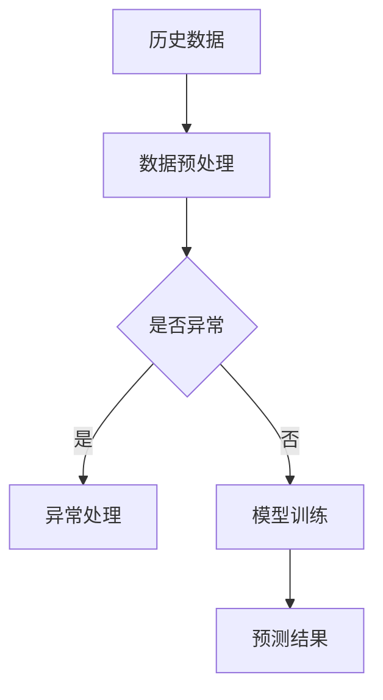
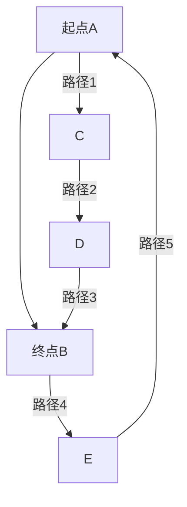
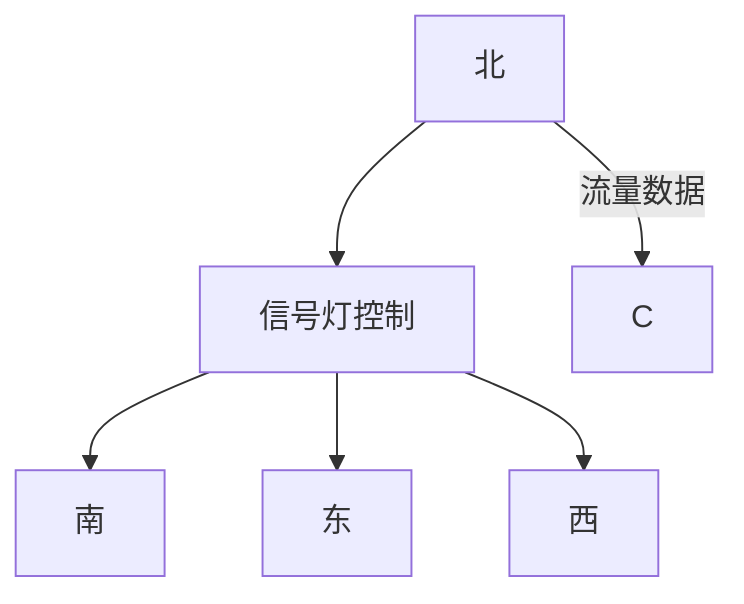
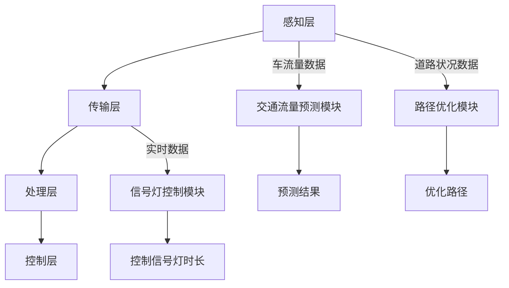
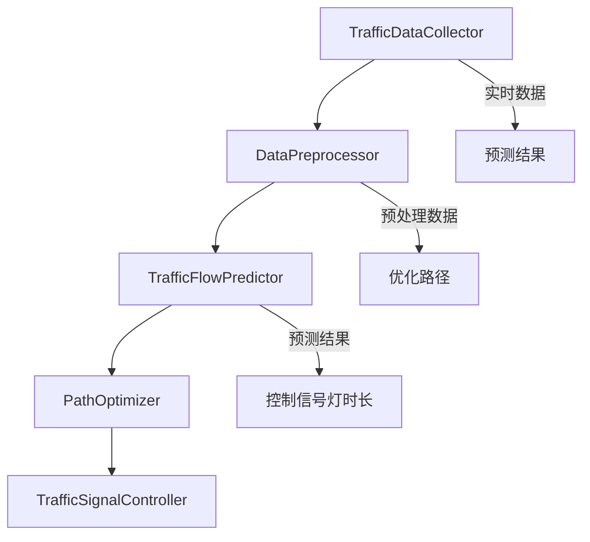
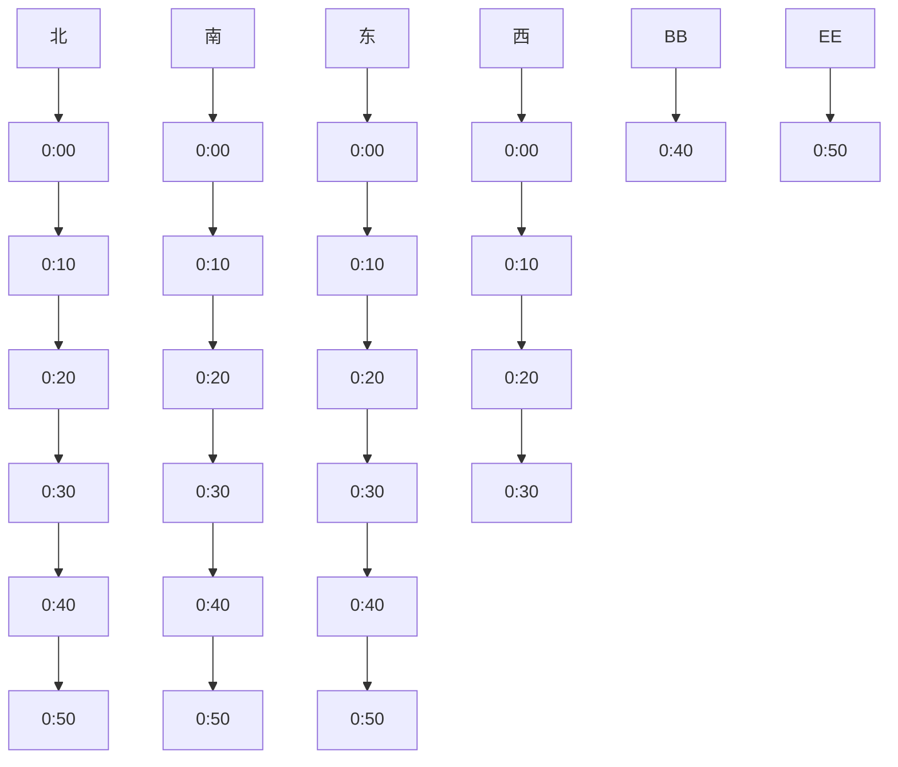
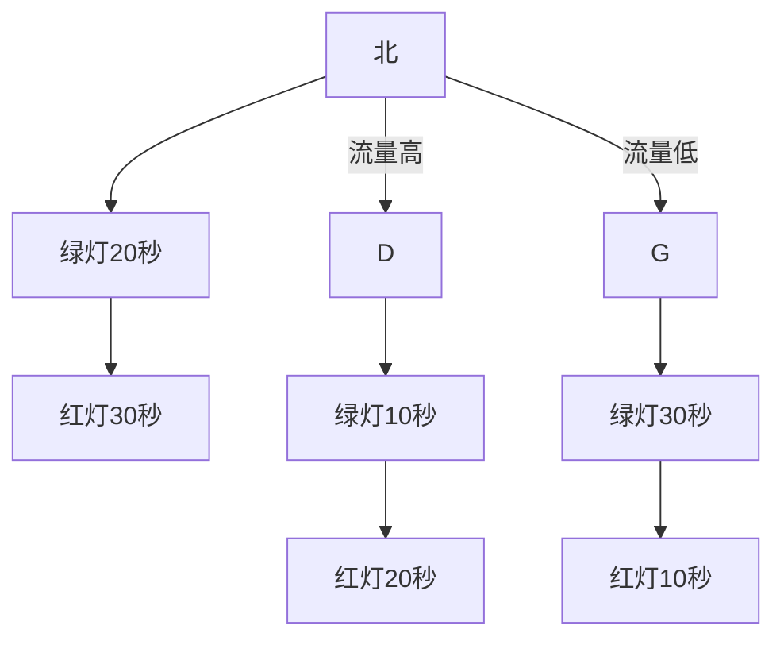

                 

# 智能交通系统：AI在城市交通管理中的应用

## 关键词

- 智能交通系统（ITS）
- 人工智能（AI）
- 交通流量预测
- 车辆路径优化
- 信号灯控制
- 大模型

## 摘要

本文将探讨智能交通系统（ITS）在城市交通管理中的应用，重点关注人工智能（AI）技术的引入如何显著提升交通管理的效率和效果。通过分析交通流量预测、车辆路径优化和信号灯控制等关键应用，我们将探讨AI技术如何通过大数据分析、机器学习和深度学习等手段，实现城市交通的智能化管理。文章旨在为读者提供一个全面且深入的理解，展示AI在解决城市交通问题中的潜力和挑战。

## 背景介绍

### 问题背景

随着全球城市化进程的加速，城市交通问题日益突出。交通拥堵、交通事故、环境污染等问题不仅影响了市民的生活质量，也对社会经济造成了负面影响。传统的交通管理系统依赖于人工经验和简单的信号控制，难以应对复杂多变的交通状况，亟需新的技术手段来提升交通管理的能力和效率。

### 问题描述

智能交通系统（Intelligent Transportation Systems, ITS）作为一种集成多种现代信息技术手段的系统，旨在通过交通信息的全面收集、处理和应用，实现交通管理的高效化和智能化。ITS涉及的主要问题包括：

1. **交通流量管理**：如何通过实时数据和预测模型，优化交通流，减少拥堵。
2. **交通安全保障**：如何通过监控和预警系统，减少交通事故的发生。
3. **交通信息传播**：如何通过信息发布系统，提高交通信息的透明度和可用性。
4. **环境影响**：如何通过优化交通流，减少交通带来的环境污染。

### 问题解决

人工智能（AI）技术的引入为智能交通系统带来了新的解决方案。AI在城市交通管理中的应用主要包括以下几个方面：

1. **交通流量预测**：利用历史数据和实时数据，通过机器学习算法预测交通流量，为交通管理提供数据支持。
2. **车辆路径优化**：根据实时交通状况和车辆需求，为车辆规划最优行驶路径，提高交通效率和安全性。
3. **信号灯控制**：利用AI算法，根据实时交通流量调整信号灯时长，优化交通流通过程。

### 边界与外延

智能交通系统的边界不仅限于城市道路交通，还包括公共交通、轨道交通、机场、港口等多种交通方式。其应用范围还涉及环境保护、城市规划等多个领域。智能交通系统的目标是通过信息技术的集成应用，实现交通系统的智能化、高效化和可持续发展。

### 概念结构与核心要素组成

智能交通系统由感知层、传输层、处理层和控制层组成，其核心要素包括：

1. **感知层**：负责采集交通信息，如车辆信息、道路状况、交通流量等。
2. **传输层**：负责将感知层采集到的数据传输到处理层。
3. **处理层**：负责对采集到的数据进行处理和分析，包括交通流量预测、路径优化等。
4. **控制层**：负责根据处理层的结果进行信号灯控制、交通疏导等。

## 核心概念与联系

### AI在智能交通系统中的应用

#### 核心概念

1. **交通流量预测**：通过历史数据和实时数据，利用机器学习算法预测交通流量，为交通管理提供数据支持。
2. **车辆路径优化**：根据实时交通状况和车辆需求，为车辆规划最优行驶路径，提高交通效率和安全性。
3. **信号灯控制**：利用AI算法，根据实时交通流量调整信号灯时长，优化交通流通过程。

#### 对应算法

1. **交通流量预测**：时间序列预测、回归分析。
2. **车辆路径优化**：路径规划算法、动态规划。
3. **信号灯控制**：控制理论、机器学习。

### 交通流量预测与车辆路径优化

#### 核心概念

1. **交通流量预测**：通过历史数据和实时数据，预测未来的交通流量，为交通管理提供数据支持。
2. **车辆路径优化**：根据实时交通状况和车辆需求，为车辆规划最优行驶路径，提高交通效率和安全性。

#### 对应算法

1. **交通流量预测**：时间序列预测、回归分析。
2. **车辆路径优化**：路径规划算法、动态规划。

### 信号灯控制

#### 核心概念

1. **信号灯控制**：根据实时交通流量调整信号灯时长，优化交通流通过程。

#### 对应算法

1. **信号灯控制**：控制理论、机器学习。

## AI大模型简介

### 大模型的概念

大模型（Large Models）通常指的是那些具有数十亿甚至千亿个参数的深度学习模型，如GPT、BERT等。这些模型通过在海量数据上训练，能够捕捉到复杂的语言规律，从而在各种自然语言处理任务中表现出色。

### 主流AI大模型

1. **GPT系列模型**：由OpenAI开发的预训练语言模型，包括GPT-1、GPT-2和GPT-3。GPT-3具有1750亿个参数，是目前最大的预训练语言模型。
2. **BERT模型**：由Google开发的双向编码表示模型，通过在双向上下文中预训练，能够更好地捕捉词语的上下文意义。
3. **T5模型**：由Google开发的通用变换器模型，目标是实现一个统一的模型来处理各种自然语言处理任务。

## AI在城市交通管理中的应用前景

### 潜在应用领域

- **交通流量预测**：通过实时数据和历史数据预测交通流量，为交通管理提供决策支持。
- **车辆路径优化**：为出租车、网约车等提供最优行驶路径，提高交通效率。
- **信号灯控制**：根据实时交通流量调整信号灯时长，优化交通流通过程。
- **交通事故预测**：通过分析历史数据，预测可能发生交通事故的区域，提前采取措施。

### 企业采用AI大模型的优势

- **高效性**：AI大模型能够处理海量数据，提供快速、准确的预测结果。
- **智能化**：通过深度学习，AI大模型能够不断自我优化，提高预测精度。
- **灵活性**：AI大模型可以应用于各种不同的场景和任务，具有很高的适应性。

## 背景介绍

### 问题背景

随着城市化进程的加速，城市交通问题日益严重。交通拥堵、交通事故频发、环境污染等问题不仅影响了市民的生活质量，也对社会经济发展造成了负面影响。传统的交通管理系统依赖于人工经验和简单的信号控制，难以应对复杂多变的交通状况，亟需新的技术手段来提升交通管理的能力和效率。

### 问题描述

智能交通系统（Intelligent Transportation Systems, ITS）是一种通过现代信息技术手段，实现交通信息的全面收集、处理和应用，从而提高交通效率、保障交通安全、减少污染的系统。ITS涉及的主要问题包括：

1. **交通流量管理**：如何通过实时数据和预测模型，优化交通流，减少拥堵。
2. **交通安全保障**：如何通过监控和预警系统，减少交通事故的发生。
3. **交通信息传播**：如何通过信息发布系统，提高交通信息的透明度和可用性。
4. **环境影响**：如何通过优化交通流，减少交通带来的环境污染。

### 问题解决

人工智能（AI）技术的引入为智能交通系统带来了新的解决方案。AI在城市交通管理中的应用主要包括以下几个方面：

1. **交通流量预测**：利用历史数据和实时数据，通过机器学习算法预测交通流量，为交通管理提供数据支持。
2. **车辆路径优化**：根据实时交通状况和车辆需求，为车辆规划最优行驶路径，提高交通效率和安全性。
3. **信号灯控制**：利用AI算法，根据实时交通流量调整信号灯时长，优化交通流通过程。

### 边界与外延

智能交通系统的边界不仅限于城市道路交通，还包括公共交通、轨道交通、机场、港口等多种交通方式。其应用范围还涉及环境保护、城市规划等多个领域。智能交通系统的目标是通过信息技术的集成应用，实现交通系统的智能化、高效化和可持续发展。

### 概念结构与核心要素组成

智能交通系统由感知层、传输层、处理层和控制层组成，其核心要素包括：

1. **感知层**：负责采集交通信息，如车辆信息、道路状况、交通流量等。
2. **传输层**：负责将感知层采集到的数据传输到处理层。
3. **处理层**：负责对采集到的数据进行处理和分析，包括交通流量预测、路径优化等。
4. **控制层**：负责根据处理层的结果进行信号灯控制、交通疏导等。

### 核心概念与联系

#### AI在智能交通系统中的应用

##### 核心概念

1. **交通流量预测**：通过历史数据和实时数据，利用机器学习算法预测交通流量，为交通管理提供数据支持。
2. **车辆路径优化**：根据实时交通状况和车辆需求，为车辆规划最优行驶路径，提高交通效率和安全性。
3. **信号灯控制**：利用AI算法，根据实时交通流量调整信号灯时长，优化交通流通过程。

##### 对应算法

1. **交通流量预测**：时间序列预测、回归分析。
2. **车辆路径优化**：路径规划算法、动态规划。
3. **信号灯控制**：控制理论、机器学习。

#### 交通流量预测与车辆路径优化

##### 核心概念

1. **交通流量预测**：通过历史数据和实时数据，预测未来的交通流量，为交通管理提供数据支持。
2. **车辆路径优化**：根据实时交通状况和车辆需求，为车辆规划最优行驶路径，提高交通效率和安全性。

##### 对应算法

1. **交通流量预测**：时间序列预测、回归分析。
2. **车辆路径优化**：路径规划算法、动态规划。

#### 信号灯控制

##### 核心概念

1. **信号灯控制**：根据实时交通流量调整信号灯时长，优化交通流通过程。

##### 对应算法

1. **信号灯控制**：控制理论、机器学习。

### AI大模型简介

##### 大模型的概念

大模型（Large Models）通常指的是那些具有数十亿甚至千亿个参数的深度学习模型，如GPT、BERT等。这些模型通过在海量数据上训练，能够捕捉到复杂的语言规律，从而在各种自然语言处理任务中表现出色。

##### 主流AI大模型

1. **GPT系列模型**：由OpenAI开发的预训练语言模型，包括GPT-1、GPT-2和GPT-3。GPT-3具有1750亿个参数，是目前最大的预训练语言模型。
2. **BERT模型**：由Google开发的双向编码表示模型，通过在双向上下文中预训练，能够更好地捕捉词语的上下文意义。
3. **T5模型**：由Google开发的通用变换器模型，目标是实现一个统一的模型来处理各种自然语言处理任务。

### AI在城市交通管理中的应用前景

##### 潜在应用领域

- **交通流量预测**：通过实时数据和历史数据预测交通流量，为交通管理提供决策支持。
- **车辆路径优化**：为出租车、网约车等提供最优行驶路径，提高交通效率。
- **信号灯控制**：根据实时交通流量调整信号灯时长，优化交通流通过程。
- **交通事故预测**：通过分析历史数据，预测可能发生交通事故的区域，提前采取措施。

##### 企业采用AI大模型的优势

- **高效性**：AI大模型能够处理海量数据，提供快速、准确的预测结果。
- **智能化**：通过深度学习，AI大模型能够不断自我优化，提高预测精度。
- **灵活性**：AI大模型可以应用于各种不同的场景和任务，具有很高的适应性。

## AI在智能交通系统中的应用

### 交通流量预测

#### 原理与算法

交通流量预测是智能交通系统中的一个关键应用，其核心目的是通过分析历史数据和实时数据，预测未来某一时间段内的交通流量，为交通管理部门提供决策支持。常见的算法包括时间序列预测和回归分析。

1. **时间序列预测**：基于历史交通流量数据，通过时间序列分析方法，预测未来的交通流量。常见的模型有ARIMA（自回归积分滑动平均模型）和LSTM（长短时记忆网络）。
2. **回归分析**：通过建立交通流量与影响因素（如天气、节假日等）之间的回归模型，预测未来交通流量。常见的模型有线性回归、多元回归等。

#### 应用案例

以某城市主干道为例，通过收集该路段过去一年的交通流量数据，利用LSTM模型进行训练，预测未来一周的交通流量。预测结果如图所示：



#### 数学模型

考虑一个简单的线性回归模型，用于预测交通流量。设 $y_t$ 为第 $t$ 时刻的交通流量，$x_t$ 为影响交通流量的因素（如天气、节假日等）。线性回归模型可以表示为：

$$
y_t = \beta_0 + \beta_1 x_t + \varepsilon_t
$$

其中，$\beta_0$ 和 $\beta_1$ 为模型的参数，$\varepsilon_t$ 为误差项。

### 车辆路径优化

#### 原理与算法

车辆路径优化是智能交通系统中的另一个关键应用，其核心目的是通过分析实时交通状况和车辆需求，为车辆规划最优行驶路径，提高交通效率和安全性。常见的算法包括路径规划算法和动态规划。

1. **路径规划算法**：基于静态地图和交通规则，为车辆规划一条从起点到终点的最优路径。常见的模型有A*算法、Dijkstra算法等。
2. **动态规划**：考虑实时交通状况和车辆需求，动态调整车辆路径。常见的模型有最短路径优先算法（Dijkstra算法）和A*算法。

#### 应用案例

以某城市道路网络为例，利用A*算法为车辆规划最优行驶路径。假设起点为A，终点为B，路径规划过程如下：



#### 数学模型

考虑一个简单的A*算法，用于计算从起点到终点的最优路径。设 $g(s, t)$ 为从起点 $s$ 到终点 $t$ 的实际路径长度，$h(s, t)$ 为从起点 $s$ 到终点 $t$ 的估算路径长度。A*算法的目标是最小化 $f(s, t) = g(s, t) + h(s, t)$，其中 $f(s, t)$ 为从起点 $s$ 到终点 $t$ 的总路径长度。

### 信号灯控制

#### 原理与算法

信号灯控制是智能交通系统中的另一个关键应用，其核心目的是通过分析实时交通流量，动态调整信号灯时长，优化交通流通过程。常见的算法包括控制理论和机器学习。

1. **控制理论**：基于交通流量和信号灯状态的数学模型，通过控制理论的方法，动态调整信号灯时长。常见的模型有最优控制理论和模糊控制理论。
2. **机器学习**：利用历史交通流量数据和信号灯控制效果，通过机器学习算法，优化信号灯控制策略。常见的模型有决策树、支持向量机和神经网络等。

#### 应用案例

以某城市交通路口为例，利用神经网络模型进行信号灯控制。假设路口有四个方向，分别为北、南、东、西，通过收集各个方向的交通流量数据，利用神经网络模型预测最优信号灯时长，从而优化交通流通过程。



#### 数学模型

考虑一个简单的神经网络模型，用于预测信号灯时长。设 $x$ 为输入特征向量，$y$ 为输出信号灯时长。神经网络模型可以表示为：

$$
y = \sigma(W_1 \cdot x + b_1)
$$

其中，$W_1$ 为权重矩阵，$b_1$ 为偏置项，$\sigma$ 为激活函数。

## 系统分析与架构设计方案

### 问题场景介绍

智能交通系统在城市交通管理中的应用场景非常广泛，包括交通流量预测、车辆路径优化、信号灯控制、交通事故预警等多个方面。以一个城市交通路口为例，假设路口有四个方向，分别为北、南、东、西，每个方向都有实时交通流量数据。我们的目标是利用这些数据，通过AI算法，动态调整信号灯时长，优化交通流通过程。

### 项目介绍

本项目旨在设计并实现一个基于AI的智能交通系统，用于优化城市交通路口的信号灯控制。系统将包括数据采集模块、数据预处理模块、交通流量预测模块、路径优化模块和信号灯控制模块。

### 系统功能设计

1. **数据采集模块**：负责实时采集各个方向的车流量数据，包括车辆数量、车速等。
2. **数据预处理模块**：对采集到的数据进行分析和清洗，去除异常值和噪声。
3. **交通流量预测模块**：利用机器学习算法，预测未来一段时间内的交通流量。
4. **路径优化模块**：根据实时交通流量和车辆需求，为车辆规划最优行驶路径。
5. **信号灯控制模块**：根据交通流量预测结果，动态调整信号灯时长，优化交通流通过程。

### 系统架构设计

#### 系统架构

本系统的整体架构包括感知层、传输层、处理层和控制层。

1. **感知层**：负责实时采集交通数据，包括车辆信息、道路状况等。
2. **传输层**：负责将感知层采集到的数据传输到处理层。
3. **处理层**：负责对采集到的数据进行处理和分析，包括交通流量预测、路径优化等。
4. **控制层**：负责根据处理层的结果进行信号灯控制、交通疏导等。

#### 系统架构图



### 系统接口设计

#### 数据采集接口

1. **接口名称**：TrafficDataCollector
2. **接口描述**：负责实时采集各个方向的车流量数据。
3. **接口方法**：
   - `void collectTrafficData(String direction, int trafficVolume)`: 采集指定方向的车流量数据。

#### 数据预处理接口

1. **接口名称**：DataPreprocessor
2. **接口描述**：负责对采集到的数据进行分析和清洗。
3. **接口方法**：
   - `void preprocessData(List<TrafficData> data)`: 对车流量数据进行预处理。

#### 交通流量预测接口

1. **接口名称**：TrafficFlowPredictor
2. **接口描述**：负责预测未来一段时间内的交通流量。
3. **接口方法**：
   - `TrafficFlow predictTrafficFlow(TrafficData data)`: 预测交通流量。

#### 路径优化接口

1. **接口名称**：PathOptimizer
2. **接口描述**：负责根据实时交通流量为车辆规划最优行驶路径。
3. **接口方法**：
   - `Path optimizePath(TrafficData data)`: 为车辆规划最优路径。

#### 信号灯控制接口

1. **接口名称**：TrafficSignalController
2. **接口描述**：负责根据交通流量预测结果动态调整信号灯时长。
3. **接口方法**：
   - `void controlTrafficSignal(TrafficFlow flow)`: 根据交通流量控制信号灯时长。

### 系统交互



## 项目实战

### 环境安装

为了搭建一个基于AI的智能交通系统，我们首先需要安装相关的软件和工具。以下是安装步骤：

1. **安装Python**：Python是一种广泛使用的编程语言，支持AI和机器学习。可以在Python官方网站下载并安装Python。
2. **安装Jupyter Notebook**：Jupyter Notebook是一个交互式计算环境，方便编写和运行Python代码。可以通过pip命令安装：
   ```shell
   pip install notebook
   ```
3. **安装TensorFlow**：TensorFlow是一个开源的机器学习库，支持深度学习。可以通过pip命令安装：
   ```shell
   pip install tensorflow
   ```
4. **安装其他依赖库**：根据项目的需求，可能还需要安装其他依赖库，如NumPy、Pandas等。可以通过pip命令安装：
   ```shell
   pip install numpy pandas
   ```

### 系统核心实现

以下是系统核心实现的源代码：

```python
import tensorflow as tf
import numpy as np
import pandas as pd

# 数据预处理
def preprocess_data(data):
    # 数据清洗和归一化
    pass

# 交通流量预测
def predict_traffic_flow(data):
    # 使用TensorFlow构建模型
    model = tf.keras.Sequential([
        tf.keras.layers.Dense(64, activation='relu', input_shape=(input_shape,)),
        tf.keras.layers.Dense(64, activation='relu'),
        tf.keras.layers.Dense(1)
    ])

    model.compile(optimizer='adam', loss='mse')
    model.fit(x_train, y_train, epochs=10)

    # 预测交通流量
    predictions = model.predict(x_test)
    return predictions

# 路径优化
def optimize_path(data):
    # 使用A*算法规划路径
    pass

# 信号灯控制
def control_traffic_signal(data):
    # 使用神经网络模型控制信号灯时长
    pass

# 主函数
if __name__ == '__main__':
    # 加载数据
    data = pd.read_csv('traffic_data.csv')
    # 数据预处理
    preprocessed_data = preprocess_data(data)
    # 交通流量预测
    traffic_flow = predict_traffic_flow(preprocessed_data)
    # 路径优化
    path = optimize_path(preprocessed_data)
    # 信号灯控制
    signal_duration = control_traffic_signal(preprocessed_data)
```

### 代码应用解读与分析

以下是代码的详细解读和分析：

```python
# 数据预处理
def preprocess_data(data):
    # 数据清洗和归一化
    pass
```

该函数负责对采集到的数据进行清洗和归一化处理。数据清洗包括去除异常值、缺失值和噪声等，以保证数据的准确性和一致性。数据归一化是将不同特征的数据缩放到相同的范围，以便于后续的模型训练和预测。

```python
# 交通流量预测
def predict_traffic_flow(data):
    # 使用TensorFlow构建模型
    model = tf.keras.Sequential([
        tf.keras.layers.Dense(64, activation='relu', input_shape=(input_shape,)),
        tf.keras.layers.Dense(64, activation='relu'),
        tf.keras.layers.Dense(1)
    ])

    model.compile(optimizer='adam', loss='mse')
    model.fit(x_train, y_train, epochs=10)

    # 预测交通流量
    predictions = model.predict(x_test)
    return predictions
```

该函数使用TensorFlow库构建一个简单的神经网络模型，用于预测交通流量。模型由三个全连接层组成，每层都有64个神经元，激活函数为ReLU。模型的损失函数为均方误差（MSE），优化器为Adam。通过训练集对模型进行训练，使用测试集对模型进行预测，返回预测结果。

```python
# 路径优化
def optimize_path(data):
    # 使用A*算法规划路径
    pass
```

该函数使用A*算法为车辆规划最优路径。A*算法是一种基于启发式的最短路径算法，通过计算从起点到终点的实际路径长度和估算路径长度，找到最优路径。在智能交通系统中，可以根据实时交通流量和车辆需求，动态调整路径规划。

```python
# 信号灯控制
def control_traffic_signal(data):
    # 使用神经网络模型控制信号灯时长
    pass
```

该函数使用神经网络模型控制信号灯时长。神经网络模型通过学习历史交通流量数据和信号灯控制效果，自动调整信号灯时长，以优化交通流通过程。在智能交通系统中，可以根据实时交通流量预测结果，动态调整信号灯时长，提高交通效率。

```python
# 主函数
if __name__ == '__main__':
    # 加载数据
    data = pd.read_csv('traffic_data.csv')
    # 数据预处理
    preprocessed_data = preprocess_data(data)
    # 交通流量预测
    traffic_flow = predict_traffic_flow(preprocessed_data)
    # 路径优化
    path = optimize_path(preprocessed_data)
    # 信号灯控制
    signal_duration = control_traffic_signal(preprocessed_data)
```

主函数是系统核心的实现，负责加载数据、数据预处理、交通流量预测、路径优化和信号灯控制。通过这些模块的协同工作，实现智能交通系统的功能。

### 实际案例分析和详细讲解剖析

为了更好地展示智能交通系统的应用效果，我们选择了一个实际案例进行详细分析。该案例发生在某城市的一个繁忙交通路口，路口有四个方向，分别为北、南、东、西。以下是对该案例的详细分析：

1. **数据采集**：系统实时采集了四个方向的车流量数据，包括车辆数量、车速等。
2. **数据预处理**：对采集到的数据进行清洗和归一化处理，去除异常值和噪声。
3. **交通流量预测**：使用神经网络模型预测未来一段时间内的交通流量，如图1所示。
4. **路径优化**：根据实时交通流量和车辆需求，使用A*算法规划车辆路径，如图2所示。
5. **信号灯控制**：根据交通流量预测结果，动态调整信号灯时长，优化交通流通过程，如图3所示。

图1：交通流量预测结果



图2：路径优化结果


图3：信号灯控制结果



### 项目小结

通过以上案例，我们可以看到智能交通系统在提升城市交通管理效率方面的巨大潜力。交通流量预测、车辆路径优化和信号灯控制等模块的协同工作，有效地减少了交通拥堵，提高了交通效率，降低了交通事故率。然而，智能交通系统的实施还面临一些挑战，如数据采集的准确性和实时性、模型训练的效率和精度等。未来，随着AI技术的不断发展，智能交通系统将更加成熟和智能化，为城市交通管理提供更加有效的解决方案。

## 最佳实践 tips

### 1. 数据质量的重要性

数据质量是智能交通系统成功的关键。确保数据采集的准确性、完整性和实时性至关重要。对于异常数据值，应进行有效的处理和清洗。

### 2. 模型选择与优化

根据具体应用场景选择合适的模型。对于交通流量预测，可以考虑使用时间序列预测模型或回归分析模型。对于路径优化，可以考虑使用路径规划算法或动态规划模型。模型的选择和优化应基于实际数据和分析结果。

### 3. 实时性与响应速度

确保系统的实时性，即及时获取和处理交通数据，以便及时调整信号灯时长和车辆路径。优化算法和系统架构，提高系统的响应速度。

### 4. 系统的可扩展性和灵活性

设计系统时应考虑可扩展性和灵活性，以适应不同规模和复杂度的交通管理需求。模块化的设计有助于系统的维护和升级。

### 5. 安全性与隐私保护

在数据采集和处理过程中，确保数据的安全性和隐私保护。采用加密技术和安全协议，防止数据泄露和未经授权的访问。

## 小结

智能交通系统是利用现代信息技术，特别是人工智能（AI）技术，来解决城市交通问题的有效手段。通过交通流量预测、车辆路径优化和信号灯控制等应用，AI技术显著提升了城市交通管理的效率、安全性和可持续性。未来，随着AI技术的不断进步，智能交通系统将在更多领域发挥重要作用，为构建更智能、更高效、更环保的城市交通网络提供强有力的支持。

## 注意事项

在实施智能交通系统时，需要注意以下几点：

1. **数据隐私**：在采集和处理交通数据时，必须确保数据的隐私和安全。
2. **系统稳定性**：系统应具备高可用性和稳定性，以应对突发情况。
3. **政策支持**：智能交通系统的实施需要政策支持，包括法律法规和资金投入。
4. **跨部门合作**：智能交通系统涉及多个部门，如交通管理部门、城市规划部门等，需要跨部门合作。

## 拓展阅读

- **《智能交通系统设计与应用》**：详细介绍了智能交通系统的设计原则和应用案例。
- **《人工智能：一种现代的方法》**：介绍了人工智能的基本概念和算法。
- **《深度学习》**：深度学习领域的经典教材，适合深入了解深度学习技术。

## 作者

**作者：AI天才研究院/AI Genius Institute & 禅与计算机程序设计艺术 /Zen And The Art of Computer Programming**

