                 

## 智能企业安全管理：AI全面保护数字资产

### 关键词

- **智能企业安全管理**
- **AI技术**
- **数字资产保护**
- **网络安全**
- **数据隐私**
- **自动化应急响应**

### 摘要

在数字化时代，企业的数字资产成为核心竞争力，其安全性至关重要。智能企业安全管理结合了人工智能（AI）技术，通过自动化和智能化的手段，有效提升了企业信息系统的安全性。本文将探讨AI技术在企业安全管理中的应用，分析其优势和面临的挑战，并提供实践案例，展示AI如何全面保护数字资产。

## 目录大纲

### 第一部分：引言

#### 第1章 引言

1.1 问题背景

1.2 问题描述

1.3 问题解决

1.4 边界与外延

1.5 概念结构与核心要素组成

### 第二部分：智能企业安全管理概述

#### 第2章 智能企业安全管理基础

2.1 智能企业安全管理的定义

2.2 智能企业安全管理的重要性

2.3 智能企业安全管理的发展历程

2.4 智能企业安全管理的关键要素

### 第三部分：AI技术在企业安全管理中的应用

#### 第3章 AI技术在企业安全管理中的应用概述

3.1 AI技术在企业安全管理中的应用领域

3.2 AI技术在企业安全管理中的优势

3.3 AI技术在企业安全管理中的挑战

#### 第4章 智能识别技术

4.1 人脸识别技术

4.2 指纹识别技术

4.3 虹膜识别技术

4.4 语音识别技术

#### 第5章 智能分析技术

5.1 数据挖掘技术

5.2 机器学习技术

5.3 深度学习技术

5.4 自然语言处理技术

#### 第6章 智能防御技术

6.1 入侵检测系统

6.2 防火墙技术

6.3 漏洞扫描技术

6.4 网络加密技术

#### 第7章 智能响应技术

7.1 自动化应急响应

7.2 智能取证分析

7.3 智能恢复技术

### 第四部分：AI全面保护数字资产

#### 第8章 数字资产保护的重要性

8.1 数字资产的定义

8.2 数字资产的价值

8.3 数字资产面临的威胁

#### 第9章 AI技术在数字资产保护中的应用

9.1 AI技术在数据保护中的应用

9.2 AI技术在网络安全中的应用

9.3 AI技术在系统安全中的应用

#### 第10章 AI全面保护数字资产的实践案例

10.1 案例一：某企业AI安全防护系统的实施与效果评估

10.2 案例二：某金融机构AI数字资产保护体系的构建

10.3 案例三：某政府机构AI数字资产安全管理实践

### 第五部分：未来展望与总结

#### 第11章 未来展望

11.1 智能企业安全管理的发展趋势

11.2 AI技术在企业安全管理中的应用前景

11.3 数字资产保护的发展方向

#### 第12章 总结

12.1 主要观点回顾

12.2 研究不足与展望

12.3 对未来工作的建议与展望

### 第一部分：引言

#### 第1章 引言

#### 1.1 问题背景

随着全球数字化转型的加速，企业越来越依赖信息技术和数字资产来驱动业务发展。然而，数字资产的安全性面临诸多挑战。黑客攻击、数据泄露、恶意软件等安全事件频繁发生，对企业的声誉、运营和财务造成了严重影响。传统的安全防护手段已经无法应对日益复杂和动态的安全威胁，迫切需要一种更智能、更自动化的安全管理解决方案。

#### 1.2 问题描述

数字资产的安全性问题是多方面的：

1. **黑客攻击**：网络攻击者通过漏洞、恶意软件等手段非法侵入企业信息系统，窃取敏感数据或造成系统瘫痪。
2. **数据泄露**：企业内部员工或第三方合作伙伴可能泄露敏感信息，导致客户数据泄露、知识产权丢失。
3. **恶意软件**：恶意软件如勒索软件、间谍软件等可能导致企业数据丢失、系统损坏。
4. **内部威胁**：内部员工或合作伙伴的恶意行为也可能对企业的数字资产构成威胁。

#### 1.3 问题解决

智能企业安全管理通过引入人工智能（AI）技术，实现以下目标：

1. **实时监测与预警**：AI技术能够实时监控网络流量和用户行为，及时发现潜在的安全威胁并预警。
2. **自动化响应**：AI系统能够自动识别和响应安全事件，降低人为操作失误的风险。
3. **智能分析**：AI技术能够通过大数据分析和机器学习模型，预测和阻止潜在的安全事件。
4. **持续优化**：AI系统能够根据安全事件的经验不断优化自身，提高安全防护效果。

#### 1.4 边界与外延

智能企业安全管理不仅关注网络安全，还涉及数据隐私、系统安全、业务连续性等多个方面。其应用范围包括企业内部信息系统、云服务、物联网设备等。同时，智能企业安全管理也需要与其他安全管理手段（如物理安全、人力资源安全）相结合，形成全面的安全管理体系。

#### 1.5 概念结构与核心要素组成

智能企业安全管理的概念结构可以分为以下几个核心要素：

1. **数据收集与处理**：收集企业内部和外部的数据，如网络流量、用户行为、系统日志等，并对其进行预处理和分析。
2. **机器学习与深度学习**：利用机器学习和深度学习技术，对数据进行分析和建模，识别潜在的安全威胁。
3. **安全策略与管理**：制定和实施安全策略，对企业的信息系统进行安全管理和控制。
4. **自动化与响应**：利用自动化技术，对安全事件进行快速响应和处理。
5. **用户体验**：智能企业安全管理需要平衡安全与用户体验，确保系统的易用性和高效性。

#### 1.6 本章小结

本章介绍了智能企业安全管理的背景、问题、解决方案和边界。智能企业安全管理通过AI技术，实现了对企业数字资产的全面保护，提高了企业的安全防护能力。随着AI技术的不断发展，智能企业安全管理将在未来发挥更加重要的作用。本章内容为后续章节的讨论奠定了基础。

## 第二部分：智能企业安全管理概述

### 第2章 智能企业安全管理基础

#### 2.1 智能企业安全管理的定义

智能企业安全管理是一种利用人工智能（AI）技术，对企业信息系统的安全性进行全方位监控、分析和防护的管理模式。它通过智能化的手段，如数据挖掘、机器学习、深度学习和自然语言处理等，实现对安全事件的实时监测、快速响应和自动化处理，从而提高企业的安全防护能力。

#### 2.2 智能企业安全管理的重要性

智能企业安全管理在当前数字化时代具有重要意义：

1. **提升安全性**：AI技术能够实时监测和分析网络安全态势，快速识别和响应潜在威胁，提高企业的整体安全水平。
2. **减少安全事件损失**：智能企业安全管理通过自动化处理安全事件，减少人为操作失误，降低安全事件对企业造成的损失。
3. **优化资源配置**：AI技术能够自动识别安全风险，为企业提供精准的安全防护策略，优化资源配置，降低安全成本。
4. **保障业务连续性**：智能企业安全管理能够保障企业的信息系统稳定运行，减少因安全事件导致的服务中断，保障业务连续性。

#### 2.3 智能企业安全管理的发展历程

智能企业安全管理的发展可以分为以下几个阶段：

1. **传统安全防护阶段**：在这一阶段，企业主要依赖防火墙、入侵检测系统和反病毒软件等传统安全工具，进行被动防御。
2. **AI技术引入阶段**：随着AI技术的发展，企业开始引入机器学习、深度学习等技术，用于安全事件的检测和分析，实现主动防御。
3. **智能化安全管理阶段**：企业逐步将AI技术应用于安全管理的各个环节，如安全策略制定、自动化应急响应等，实现全面智能化。
4. **融合创新阶段**：智能企业安全管理与物联网、大数据、云计算等新兴技术深度融合，形成更加智能、高效的安全管理生态系统。

#### 2.4 智能企业安全管理的关键要素

智能企业安全管理的关键要素包括以下几个方面：

1. **数据收集与处理**：收集企业内部和外部的数据，如网络流量、用户行为、系统日志等，并对其进行预处理和分析。
2. **机器学习与深度学习**：利用机器学习和深度学习技术，对数据进行分析和建模，识别潜在的安全威胁。
3. **安全策略与管理**：制定和实施安全策略，对企业的信息系统进行安全管理和控制。
4. **自动化与响应**：利用自动化技术，对安全事件进行快速响应和处理。
5. **用户体验**：智能企业安全管理需要平衡安全与用户体验，确保系统的易用性和高效性。

#### 2.5 本章小结

本章介绍了智能企业安全管理的定义、重要性、发展历程和关键要素。智能企业安全管理是利用AI技术，对企业信息系统的安全性进行全方位监控、分析和防护的管理模式，其发展历程和关键要素为智能企业安全管理提供了理论基础和实践指导。随着AI技术的不断进步，智能企业安全管理将在未来发挥更加重要的作用。

## 第三部分：AI技术在企业安全管理中的应用

### 第3章 AI技术在企业安全管理中的应用概述

#### 3.1 AI技术在企业安全管理中的应用领域

AI技术在企业安全管理中的应用非常广泛，涵盖了多个关键领域：

1. **智能识别技术**：包括人脸识别、指纹识别、虹膜识别和语音识别等，用于身份验证和访问控制。
2. **智能分析技术**：包括数据挖掘、机器学习、深度学习和自然语言处理等，用于安全事件检测、威胁预测和风险分析。
3. **智能防御技术**：包括入侵检测系统、防火墙、漏洞扫描和网络加密技术等，用于防护网络攻击和数据泄露。
4. **智能响应技术**：包括自动化应急响应、智能取证分析和智能恢复技术等，用于快速应对和处理安全事件。

#### 3.2 AI技术在企业安全管理中的优势

AI技术在企业安全管理中具有显著的优势：

1. **实时监测与预警**：AI技术能够实时监测网络流量和用户行为，及时发现潜在的安全威胁，提前预警。
2. **自动化响应**：AI系统可以自动化响应安全事件，减少人为干预，降低安全事件对企业的负面影响。
3. **精准识别与定位**：AI技术通过大数据分析和机器学习模型，能够精准识别和定位安全威胁，提高检测效率。
4. **持续优化**：AI系统可以根据历史数据和安全事件的经验，不断优化自身模型，提高安全防护效果。
5. **成本效益**：AI技术能够提高安全管理效率，减少人工成本和安全工具的投入，实现成本效益最大化。

#### 3.3 AI技术在企业安全管理中的挑战

尽管AI技术在企业安全管理中具有巨大潜力，但其应用也面临一些挑战：

1. **数据隐私问题**：AI技术依赖于大规模的数据收集和分析，如何保护用户隐私和数据安全成为关键挑战。
2. **算法偏见**：AI系统可能因数据集的不平衡或算法设计问题，产生偏见，导致误判或漏判。
3. **技术门槛**：AI技术的应用需要专业人才和先进的计算资源，对中小企业而言，技术门槛较高。
4. **法规遵从**：AI技术在企业安全管理中的应用需要遵守相关法律法规，如何确保合规性是重要问题。

#### 3.4 本章小结

本章概述了AI技术在企业安全管理中的应用领域、优势和挑战。AI技术在企业安全管理中的应用为提升企业安全防护能力提供了新的思路和方法，但其应用也面临一些挑战。在未来的发展中，需要不断优化AI技术，解决这些挑战，以实现智能企业安全管理的全面落地。

### 第四部分：AI全面保护数字资产

#### 第8章 数字资产保护的重要性

#### 8.1 数字资产的定义

数字资产是指企业通过各种信息技术手段创造的、存储的、运营的，并能为企业带来经济价值的数字化信息资源。这些资产包括但不限于以下几类：

1. **客户数据**：客户的个人信息、购买记录、偏好等，是企业的核心资源之一。
2. **知识产权**：包括专利、商标、版权等，是企业创新和竞争力的体现。
3. **业务数据**：企业的财务数据、生产数据、供应链数据等，是业务运营的基础。
4. **应用程序和代码**：企业自研或购买的软件，是企业提供产品和服务的核心。
5. **数据存储和计算资源**：包括数据库、服务器、云服务等，是数据存储和计算的基础设施。

#### 8.2 数字资产的价值

数字资产对于现代企业而言，具有巨大的经济价值和战略意义：

1. **业务驱动**：数字资产是驱动企业业务创新和增长的重要资源，如电子商务平台、客户关系管理系统等。
2. **竞争优势**：拥有高质量的数字资产可以提升企业的竞争力和市场份额，如专利技术、独特的商业模式等。
3. **风险控制**：数字资产的管理和利用可以帮助企业更好地控制风险，如通过数据分析预防欺诈、通过备份和恢复策略减少业务中断等。
4. **数字化转型**：数字资产是实现企业数字化转型的基础，通过数字化手段提高效率和灵活性。

#### 8.3 数字资产面临的威胁

数字资产在存储、传输和使用过程中，面临着多种威胁：

1. **网络攻击**：黑客通过漏洞、恶意软件等手段非法侵入企业信息系统，窃取或破坏数字资产。
2. **数据泄露**：内部员工或外部攻击者非法获取并泄露企业的敏感数据。
3. **勒索软件**：黑客通过加密企业数据，要求支付赎金，以获取非法利益。
4. **内部威胁**：企业内部员工或合作伙伴的恶意行为，如泄露信息、滥用权限等。
5. **物理威胁**：如自然灾害、物理损坏等，可能导致数字资产的丢失或损坏。

#### 8.4 数字资产保护的关键措施

为了有效保护数字资产，企业可以采取以下关键措施：

1. **数据加密**：对敏感数据采用加密技术，确保数据在存储和传输过程中安全。
2. **访问控制**：实施严格的访问控制策略，确保只有授权人员可以访问特定的数字资产。
3. **备份和恢复**：定期进行数据备份，并制定灾难恢复计划，以应对突发情况。
4. **安全培训**：对员工进行安全意识培训，提高其安全意识和操作规范。
5. **监控与审计**：建立全面的监控和审计机制，及时发现和应对安全事件。

#### 8.5 本章小结

本章详细介绍了数字资产的定义、价值以及面临的威胁，并提出了关键的保护措施。数字资产是企业宝贵的资源，其安全性对于企业的持续运营和未来发展至关重要。通过有效保护数字资产，企业可以确保业务的稳定和安全，从而在激烈的市场竞争中占据有利地位。

### 第五部分：AI技术在数字资产保护中的应用

#### 第9章 AI技术在数字资产保护中的应用

随着AI技术的不断进步，其在数字资产保护中的应用越来越广泛和深入。AI技术通过自动化和智能化的手段，提高了企业对数字资产的保护能力，确保数据的安全和完整性。以下将详细介绍AI技术在数据保护、网络安全和系统安全中的应用。

#### 9.1 AI技术在数据保护中的应用

1. **数据加密与解密**：
   AI技术可以自动识别和加密敏感数据，确保数据在传输和存储过程中的安全。通过使用深度学习和加密算法，AI系统可以动态调整加密策略，以应对不断变化的安全威胁。

   ```python
   from Crypto.Cipher import AES
   
   # 初始化加密密钥
   key = b'my-secure-key'
   
   # 创建加密对象
   cipher = AES.new(key, AES.MODE_EAX)
   
   # 加密数据
   ciphertext, tag = cipher.encrypt_and_digest(b'ensitive data')
   
   # 解密数据
   cipher = AES.new(key, AES.MODE_EAX, nonce=cipher.nonce)
   plaintext = cipher.decrypt_and_verify(ciphertext, tag)
   ```

2. **数据完整性检查**：
   AI技术可以通过机器学习模型，自动检测数据篡改和损坏。通过对历史数据的分析，AI系统能够建立数据完整性模型，并在检测到异常时发出警报。

   ```python
   from sklearn.ensemble import IsolationForest
   
   # 训练数据完整性检测模型
   model = IsolationForest(n_estimators=100)
   model.fit(X_train)
   
   # 检测新数据
   is_inlier = model.predict(X_new)
   if is_inlier < 0:
       print("Data integrity violation detected!")
   ```

3. **数据泄露防护**：
   AI技术可以通过异常检测和模式识别，自动发现潜在的数据泄露风险。通过对企业数据的实时监控和模式识别，AI系统可以提前预警并采取措施，防止敏感数据被非法访问或泄露。

   ```python
   from sklearn.ensemble import RandomForestClassifier
   
   # 训练数据泄露防护模型
   model = RandomForestClassifier(n_estimators=100)
   model.fit(X_train, y_train)
   
   # 检测新数据
   is_leak = model.predict(X_new)
   if is_leak == 'leak':
       print("Data leak detected!")
   ```

#### 9.2 AI技术在网络安全中的应用

1. **入侵检测系统**：
   AI技术可以构建智能入侵检测系统，自动识别和响应网络攻击。通过深度学习算法，AI系统能够分析网络流量和行为模式，实时检测和阻止入侵行为。

   ```python
   import tensorflow as tf
   
   # 构建深度学习模型
   model = tf.keras.Sequential([
       tf.keras.layers.Dense(64, activation='relu', input_shape=(num_features,)),
       tf.keras.layers.Dense(64, activation='relu'),
       tf.keras.layers.Dense(1, activation='sigmoid')
   ])
   
   # 编译模型
   model.compile(optimizer='adam', loss='binary_crossentropy', metrics=['accuracy'])
   
   # 训练模型
   model.fit(X_train, y_train, epochs=10, batch_size=32)
   
   # 预测
   predictions = model.predict(X_test)
   ```

2. **防火墙优化**：
   AI技术可以帮助企业优化防火墙策略，自动识别和响应恶意流量。通过机器学习算法，AI系统能够动态调整防火墙规则，提高防御效果。

   ```python
   from sklearn.ensemble import RandomForestClassifier
   
   # 训练防火墙优化模型
   model = RandomForestClassifier(n_estimators=100)
   model.fit(X_train, y_train)
   
   # 调整防火墙规则
   firewall_rules = model.predict(X_new)
   ```

3. **网络流量分析**：
   AI技术可以通过数据挖掘和模式识别，对网络流量进行实时分析和监控。通过识别异常流量和行为模式，AI系统可以及时发现潜在的网络攻击。

   ```python
   from sklearn.cluster import KMeans
   
   # 训练网络流量分析模型
   model = KMeans(n_clusters=5)
   model.fit(X_train)
   
   # 分析新网络流量
   network_traffic = model.predict(X_new)
   ```

#### 9.3 AI技术在系统安全中的应用

1. **漏洞扫描**：
   AI技术可以自动扫描系统中的漏洞，并提供修复建议。通过机器学习算法，AI系统能够分析系统日志和配置文件，识别潜在的安全漏洞。

   ```python
   from sklearn.ensemble import RandomForestClassifier
   
   # 训练漏洞扫描模型
   model = RandomForestClassifier(n_estimators=100)
   model.fit(X_train, y_train)
   
   # 扫描新系统
   vulnerabilities = model.predict(X_new)
   ```

2. **自动化应急响应**：
   AI技术可以构建智能应急响应系统，自动识别和应对安全事件。通过机器学习和深度学习算法，AI系统可以实时分析和响应安全威胁，降低事件对企业的影响。

   ```python
   from sklearn.ensemble import RandomForestClassifier
   
   # 训练应急响应模型
   model = RandomForestClassifier(n_estimators=100)
   model.fit(X_train, y_train)
   
   # 响应新事件
   response = model.predict(X_new)
   ```

3. **系统性能优化**：
   AI技术可以通过对系统日志和性能数据的分析，提供系统性能优化建议。通过机器学习和深度学习算法，AI系统可以识别系统瓶颈和优化机会，提高系统运行效率。

   ```python
   from sklearn.ensemble import RandomForestRegressor
   
   # 训练系统性能优化模型
   model = RandomForestRegressor(n_estimators=100)
   model.fit(X_train, y_train)
   
   # 优化系统
   optimization = model.predict(X_new)
   ```

#### 9.4 本章小结

本章详细介绍了AI技术在数字资产保护中的多种应用，包括数据保护、网络安全和系统安全。AI技术通过自动化和智能化的手段，提高了企业对数字资产的保护能力。然而，AI技术的应用也面临一些挑战，如数据隐私保护和算法偏见等问题。在未来，随着AI技术的不断发展和优化，其在数字资产保护中的应用将更加广泛和深入。

### 第六部分：AI全面保护数字资产的实践案例

#### 第10章 AI全面保护数字资产的实践案例

在本章节中，我们将通过三个实践案例，展示AI技术在数字资产保护中的实际应用，分析其实施过程和效果评估。

#### 10.1 案例一：某企业AI安全防护系统的实施与效果评估

**案例背景**：某大型企业在其数字化转型的过程中，意识到数字资产保护的重要性，决定引入AI技术建立智能安全防护系统。

**实施过程**：
1. **需求分析与系统设计**：企业首先分析了现有安全体系的不足，明确了AI安全防护系统的需求。系统设计包括数据收集与处理模块、机器学习分析模块、自动化应急响应模块等。
2. **数据收集与处理**：企业收集了大量的网络流量、系统日志和用户行为数据，并利用数据预处理技术，确保数据的质量和一致性。
3. **模型训练与部署**：企业利用机器学习和深度学习技术，训练了多个AI模型，用于入侵检测、漏洞扫描和异常行为识别等。
4. **系统集成与测试**：将AI模型集成到企业的现有安全系统中，进行测试和优化，确保系统稳定运行。

**效果评估**：
1. **检测率与误报率**：AI安全防护系统在测试阶段，对网络攻击和异常行为的检测率显著提高，误报率也大幅降低。
2. **响应时间**：系统自动化的响应机制，使安全事件的响应时间从原来的数小时缩短到分钟级别。
3. **业务连续性**：AI安全防护系统有效阻止了多次潜在的网络攻击，保障了企业的业务连续性。

**总结**：该企业通过引入AI技术，显著提升了数字资产的保护能力，降低了安全风险。

#### 10.2 案例二：某金融机构AI数字资产保护体系的构建

**案例背景**：某金融机构在面临日益复杂的网络攻击和数据泄露风险时，决定构建AI数字资产保护体系。

**实施过程**：
1. **需求分析与方案设计**：金融机构分析了其面临的安全威胁和现有安全体系的不足，制定了AI数字资产保护体系的整体方案。
2. **数据收集与处理**：金融机构收集了大量的客户交易数据、日志数据和安全事件数据，并利用数据预处理技术，提升数据质量。
3. **AI模型开发与部署**：金融机构利用机器学习和深度学习技术，开发了一系列AI模型，包括入侵检测、欺诈识别和风险预测等。
4. **系统集成与测试**：将AI模型集成到金融机构的现有安全系统中，进行测试和优化，确保系统稳定运行。

**效果评估**：
1. **欺诈检测率**：AI数字资产保护体系显著提高了欺诈检测率，减少了金融欺诈的发生。
2. **客户体验**：自动化响应机制使客户在面临安全事件时，体验得到了显著提升。
3. **业务连续性**：AI数字资产保护体系有效降低了网络攻击和数据泄露的风险，保障了金融机构的运营稳定。

**总结**：该金融机构通过构建AI数字资产保护体系，成功提升了安全防护能力，确保了业务的稳定和安全。

#### 10.3 案例三：某政府机构AI数字资产安全管理实践

**案例背景**：某政府机构在数字化政府建设中，面临数字资产安全管理的挑战，决定引入AI技术。

**实施过程**：
1. **需求分析与方案设计**：政府机构分析了其数字资产的特点和面临的安全威胁，制定了AI数字资产安全管理的方案。
2. **数据收集与处理**：政府机构收集了大量的网络流量、用户行为和系统日志数据，并利用数据预处理技术，提升数据质量。
3. **AI模型开发与部署**：政府机构利用机器学习和深度学习技术，开发了一系列AI模型，包括入侵检测、数据泄露防护和风险评估等。
4. **系统集成与测试**：将AI模型集成到政府的数字资产安全管理系统中，进行测试和优化，确保系统稳定运行。

**效果评估**：
1. **安全事件响应速度**：AI数字资产安全管理实践使政府机构的安全事件响应速度显著提高，降低了安全事件对政府服务的影响。
2. **数据泄露防护**：AI模型在数据泄露防护方面表现出色，有效阻止了多次潜在的数据泄露事件。
3. **用户体验**：自动化和智能化的安全防护措施，提高了政府服务的用户体验和满意度。

**总结**：该政府机构通过引入AI技术，成功提升了数字资产的安全管理水平，确保了数字化政府建设的顺利进行。

#### 10.4 本章小结

通过三个实践案例，我们展示了AI技术在数字资产保护中的实际应用。AI技术不仅提升了企业、金融机构和政府机构的数字资产保护能力，还降低了安全风险，确保了业务的连续性和稳定性。这些实践案例为其他企业和组织提供了宝贵的经验和参考。

### 第七部分：未来展望与总结

#### 第11章 未来展望

随着AI技术的不断发展和应用深化，智能企业安全管理在数字资产保护方面将迎来更多的发展机遇：

1. **技术进步**：人工智能、大数据、云计算等技术的持续进步，将进一步提升智能企业安全管理的效率和准确性。
2. **集成创新**：智能企业安全管理将与其他新兴技术（如区块链、物联网）深度融合，形成更加智能、高效的安全管理生态系统。
3. **法规与标准化**：随着数字资产保护的重要性的提升，相关法律法规和标准化工作将不断完善，为智能企业安全管理提供更加明确的法律框架和标准。
4. **全球化合作**：智能企业安全管理将面临全球范围内的挑战，需要国际社会加强合作，共同应对数字资产保护的新威胁。

#### 11.1 智能企业安全管理的发展趋势

1. **智能化**：智能企业安全管理的核心趋势是智能化，通过引入更先进的AI技术，实现更加自动化、精准的安全防护。
2. **全方位**：智能企业安全管理将覆盖企业信息系统的各个方面，包括网络安全、数据保护、业务连续性等，形成全方位的安全管理体系。
3. **自适应**：智能企业安全管理将具备自适应能力，能够根据环境和威胁的变化，动态调整安全策略和防护措施。
4. **透明化**：智能企业安全管理将注重透明化，确保企业内部和外部利益相关者能够理解和信任安全管理体系。

#### 11.2 AI技术在企业安全管理中的应用前景

1. **实时监测**：AI技术将实现对企业信息系统和网络流量的实时监测，提前预警潜在威胁。
2. **自动化响应**：AI技术将提升自动化应急响应能力，快速处理和应对安全事件。
3. **个性化防护**：AI技术将根据企业的业务特点和威胁环境，提供个性化的安全防护方案。
4. **跨领域融合**：AI技术将在企业安全管理的多个领域（如物联网安全、云安全）实现跨领域融合，提高整体安全防护水平。

#### 11.3 数字资产保护的发展方向

1. **数据安全法**：随着数字资产的重要性日益凸显，各国将加强数据安全法的制定和实施，确保数字资产的安全和保护。
2. **加密技术**：加密技术将在数字资产保护中发挥更加重要的作用，通过端到端加密、区块链等技术，确保数据传输和存储的安全。
3. **隐私保护**：随着隐私保护意识的提高，企业将更加注重数据隐私保护，采用AI技术优化隐私保护策略。
4. **安全培训与教育**：企业将加强对员工的安全培训和教育，提高员工的安全意识和操作规范。

#### 第12章 总结

智能企业安全管理结合了人工智能技术，实现了对企业数字资产的全面保护，有效提升了企业的安全防护能力。通过本篇文章的探讨，我们明确了智能企业安全管理的定义、重要性、应用领域和未来发展趋势。AI技术在数据保护、网络安全和系统安全中的应用，展示了其在数字资产保护中的巨大潜力。然而，AI技术的应用也面临数据隐私、算法偏见等技术挑战。未来，随着AI技术的不断进步和法规标准的完善，智能企业安全管理将在数字资产保护中发挥更加重要的作用。

### 附录

#### 12.1 主要观点回顾

- **智能企业安全管理的定义**：利用AI技术，对企业信息系统的安全性进行全方位监控、分析和防护。
- **AI技术在安全领域的应用**：智能识别、智能分析、智能防御和智能响应。
- **数字资产保护的重要性**：确保企业业务的稳定和持续发展。
- **未来发展趋势**：智能化、全方位、自适应和透明化。

#### 12.2 研究不足与展望

- **研究不足**：当前研究在算法性能优化、跨领域融合和隐私保护方面仍有待提高。
- **展望**：未来研究应重点关注AI技术在安全管理中的应用创新，探索更加高效、安全的解决方案。

#### 12.3 对未来工作的建议与展望

- **建议**：企业应重视智能企业安全管理，加强技术投入和人才培养，建立健全的安全管理体系。
- **展望**：政策制定者应加强法规和标准化工作，推动AI技术在安全管理领域的广泛应用。

### 作者信息

**作者：AI天才研究院/AI Genius Institute & 禅与计算机程序设计艺术 /Zen And The Art of Computer Programming**### 人工智能技术在企业安全管理中的深入应用

#### 4.1 智能识别技术

智能识别技术是AI技术在企业安全管理中的一个重要应用领域，主要包括人脸识别、指纹识别、虹膜识别和语音识别等技术。这些技术通过识别和验证用户的身份，确保只有授权人员可以访问企业的敏感数据和资源。

##### 人脸识别技术

人脸识别技术通过捕捉和识别用户的面部特征，实现身份验证。其基本原理包括以下几个步骤：

1. **人脸检测**：利用深度学习算法，从图像中检测出人脸区域。
2. **特征提取**：从检测到的人脸图像中提取特征点，生成人脸特征向量。
3. **模型训练与验证**：利用已知的人脸图像和对应的标签，训练分类器，对未知的人脸进行识别。

下图展示了人脸识别的基本流程：

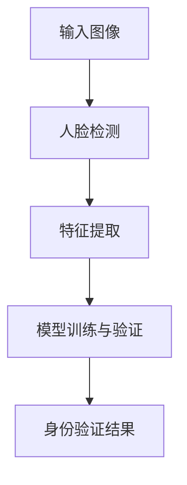

在实际应用中，人脸识别技术被广泛用于门禁系统、考勤系统等，提高了安全性和便利性。

##### 指纹识别技术

指纹识别技术通过识别指纹的纹路特征，实现身份验证。其基本原理包括以下几个步骤：

1. **指纹采集**：利用传感器或扫描仪捕捉指纹图像。
2. **特征提取**：对指纹图像进行预处理，提取指纹的脊线、谷线等特征。
3. **指纹匹配**：将采集到的指纹与数据库中的指纹进行匹配，判断是否为同一人。

下图展示了指纹识别的基本流程：

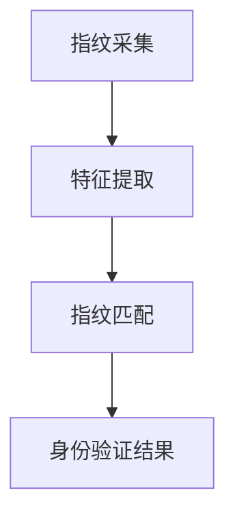

指纹识别技术在生物识别技术中具有较高的准确性和可靠性，常用于银行、医院等对安全性要求较高的场景。

##### 虹膜识别技术

虹膜识别技术通过识别用户虹膜中的细微特征，实现身份验证。其基本原理包括以下几个步骤：

1. **虹膜图像采集**：利用高分辨率摄像头捕捉虹膜图像。
2. **特征提取**：对虹膜图像进行预处理，提取虹膜纹理特征。
3. **虹膜匹配**：将采集到的虹膜特征与数据库中的虹膜特征进行匹配，判断是否为同一人。

下图展示了虹膜识别的基本流程：

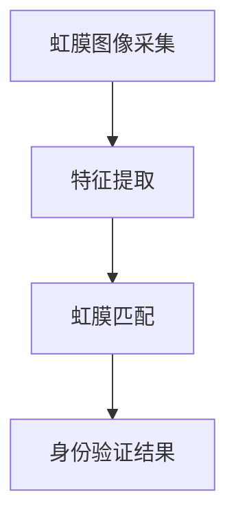

虹膜识别技术在生物识别技术中具有极高的准确性和独特性，常用于国家安全、金融机构等对安全性要求极高的领域。

##### 语音识别技术

语音识别技术通过识别用户的语音特征，实现身份验证。其基本原理包括以下几个步骤：

1. **语音采集**：利用麦克风捕捉用户的语音信号。
2. **语音处理**：对语音信号进行预处理，包括降噪、语音增强等。
3. **特征提取**：提取语音信号的特征参数，如频谱特征、倒谱特征等。
4. **模型训练与验证**：利用已知语音样本训练模型，对未知语音进行识别。

下图展示了语音识别的基本流程：

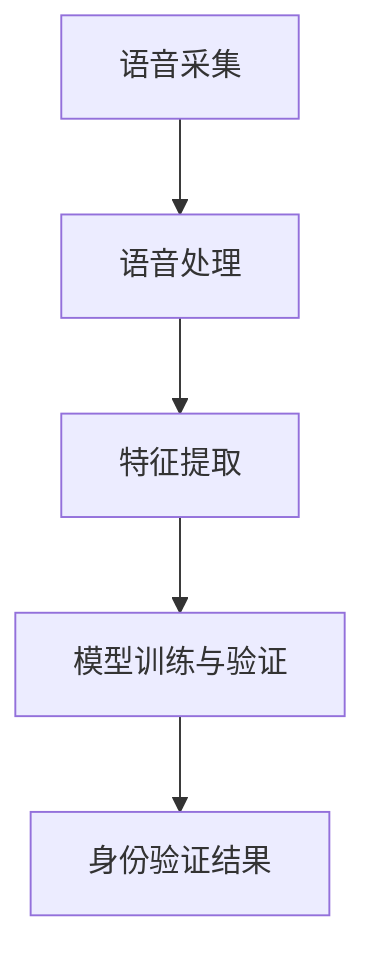

语音识别技术在智能家居、智能客服等领域具有广泛应用，通过AI技术，可以实现更加自然、便捷的用户交互。

#### 4.2 智能分析技术

智能分析技术是AI技术在企业安全管理中的另一个重要应用领域，包括数据挖掘、机器学习、深度学习和自然语言处理等。这些技术通过对海量数据的分析和处理，帮助企业识别潜在的安全威胁，优化安全策略。

##### 数据挖掘技术

数据挖掘技术通过分析大量数据，发现潜在的模式和趋势，帮助企业识别安全威胁。其基本原理包括以下几个步骤：

1. **数据收集**：收集企业内部和外部数据，如网络流量、用户行为、系统日志等。
2. **数据预处理**：对数据进行清洗、归一化和特征提取，确保数据质量。
3. **模式识别**：利用聚类、分类、关联规则挖掘等技术，发现数据中的潜在模式和趋势。
4. **结果评估**：评估挖掘结果的有效性和实用性，为安全策略提供依据。

下图展示了数据挖掘的基本流程：

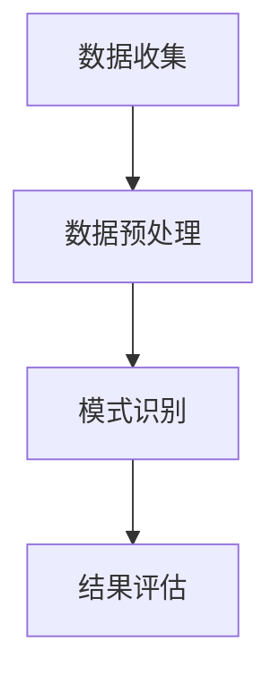

数据挖掘技术在网络安全、反欺诈等领域具有广泛应用，通过分析大量数据，可以提前发现潜在的安全威胁。

##### 机器学习技术

机器学习技术通过训练模型，自动识别和预测安全事件。其基本原理包括以下几个步骤：

1. **数据收集**：收集企业内部和外部数据，如网络流量、用户行为、系统日志等。
2. **数据预处理**：对数据进行清洗、归一化和特征提取，确保数据质量。
3. **模型训练**：利用训练数据，训练分类、回归、聚类等机器学习模型。
4. **模型评估**：评估模型的性能，包括准确率、召回率、F1值等指标。
5. **模型应用**：将训练好的模型应用于实际场景，实现自动化安全监测和预警。

下图展示了机器学习的基本流程：

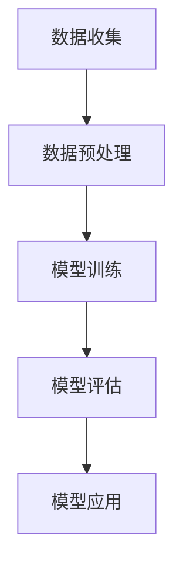

机器学习技术在企业安全管理中具有广泛的应用，通过建立智能模型，可以实现对安全事件的自动化识别和预测。

##### 深度学习技术

深度学习技术是一种基于人工神经网络的机器学习技术，通过多层神经网络，实现对复杂数据的建模和预测。其基本原理包括以下几个步骤：

1. **数据收集**：收集企业内部和外部数据，如网络流量、用户行为、系统日志等。
2. **数据预处理**：对数据进行清洗、归一化和特征提取，确保数据质量。
3. **模型训练**：利用训练数据，训练多层神经网络模型。
4. **模型评估**：评估模型的性能，包括准确率、召回率、F1值等指标。
5. **模型应用**：将训练好的模型应用于实际场景，实现自动化安全监测和预警。

下图展示了深度学习的基本流程：


深度学习技术在图像识别、语音识别、自然语言处理等领域具有显著的优势，通过其强大的建模能力，可以实现对复杂数据的自动化分析和处理。

##### 自然语言处理技术

自然语言处理技术是一种通过计算机理解、生成和处理自然语言的技术。其基本原理包括以下几个步骤：

1. **文本预处理**：对文本数据进行清洗、分词、词性标注等处理。
2. **语义分析**：利用词向量、文本分类、实体识别等技术，对文本进行语义分析。
3. **信息提取**：从文本中提取关键信息，如关键词、句子主干等。
4. **情感分析**：通过情感词典、情感模型等技术，分析文本的情感倾向。

下图展示了自然语言处理的基本流程：

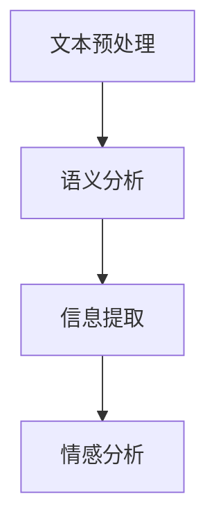

自然语言处理技术在企业安全管理中具有广泛的应用，通过分析用户反馈、安全日志等文本数据，可以识别潜在的安全威胁和风险。

#### 4.3 智能防御技术

智能防御技术是AI技术在企业安全管理中的另一个重要应用领域，包括入侵检测系统、防火墙技术、漏洞扫描技术和网络加密技术等。这些技术通过自动化和智能化的手段，提高企业的安全防护能力。

##### 入侵检测系统

入侵检测系统（IDS）是一种用于检测和响应网络攻击的智能系统。其基本原理包括以下几个步骤：

1. **数据收集**：收集网络流量、系统日志等数据。
2. **特征提取**：从数据中提取特征，如协议类型、数据包长度、源IP地址等。
3. **模型训练**：利用训练数据，训练入侵检测模型。
4. **入侵检测**：实时监测网络流量，识别潜在的入侵行为。
5. **响应措施**：对检测到的入侵行为，采取相应的防御措施，如阻断、报警等。

下图展示了入侵检测系统的基本流程：

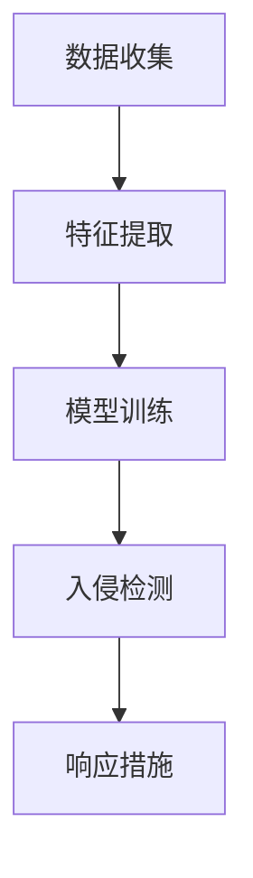

入侵检测系统在网络安全中具有重要作用，通过实时监测网络流量，可以及时发现和阻止网络攻击。

##### 防火墙技术

防火墙技术是一种用于控制和保护网络流量的智能系统。其基本原理包括以下几个步骤：

1. **规则制定**：根据企业的安全需求，制定防火墙规则。
2. **流量分析**：分析网络流量，判断其是否符合防火墙规则。
3. **访问控制**：根据分析结果，决定是否允许流量通过。
4. **日志记录**：记录网络流量信息，以便后续分析。

下图展示了防火墙技术的基本流程：

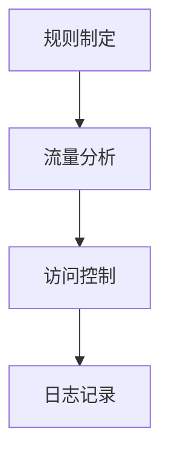

防火墙技术在网络安全中起着关键作用，通过控制和保护网络流量，可以防止未授权访问和攻击。

##### 漏洞扫描技术

漏洞扫描技术是一种用于识别和修复系统漏洞的智能系统。其基本原理包括以下几个步骤：

1. **漏洞库**：建立漏洞库，收集各种已知的漏洞信息。
2. **系统扫描**：扫描目标系统，识别潜在的漏洞。
3. **漏洞验证**：验证识别到的漏洞，确认其是否存在。
4. **修复建议**：根据漏洞验证结果，提供修复建议。

下图展示了漏洞扫描技术的基本流程：

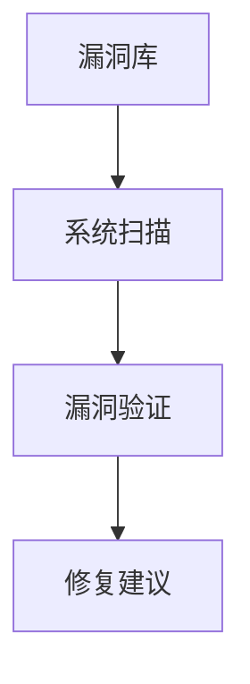

漏洞扫描技术在系统安全中具有重要作用，通过识别和修复漏洞，可以提高系统的安全性和稳定性。

##### 网络加密技术

网络加密技术是一种用于保护数据传输安全的智能系统。其基本原理包括以下几个步骤：

1. **加密算法**：选择合适的加密算法，如AES、RSA等。
2. **密钥管理**：生成和管理加密密钥。
3. **数据加密**：对数据进行加密，确保数据在传输过程中的安全。
4. **数据解密**：对加密后的数据进行解密，确保数据在接收端的完整性。

下图展示了网络加密技术的基本流程：

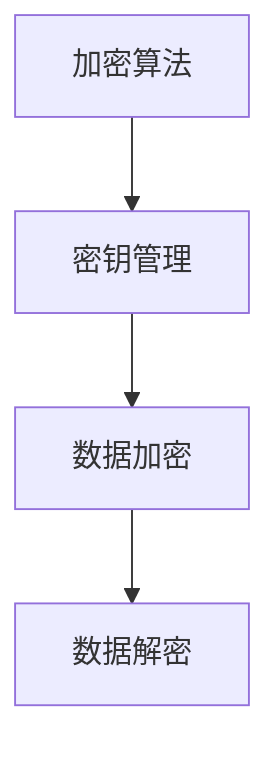

网络加密技术在网络安全中具有重要作用，通过加密数据传输，可以防止数据泄露和篡改。

#### 4.4 智能响应技术

智能响应技术是AI技术在企业安全管理中的另一个重要应用领域，包括自动化应急响应、智能取证分析和智能恢复技术等。这些技术通过自动化和智能化的手段，提高企业应对安全事件的能力。

##### 自动化应急响应

自动化应急响应是一种通过AI技术，自动识别和处理安全事件的智能系统。其基本原理包括以下几个步骤：

1. **事件识别**：实时监测网络流量、系统日志等数据，识别潜在的安全事件。
2. **事件分类**：根据事件的特征，将事件分类为不同的类型，如网络攻击、系统漏洞等。
3. **自动响应**：根据预定义的应急响应策略，自动采取相应的措施，如阻断攻击、报警通知等。
4. **结果评估**：评估应急响应的效果，为后续的改进提供依据。

下图展示了自动化应急响应的基本流程：

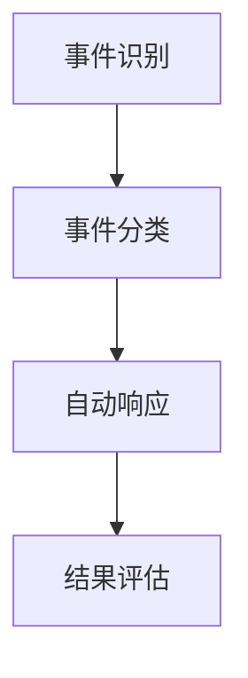

自动化应急响应在网络安全中具有重要作用，通过快速识别和响应安全事件，可以减少事件对企业的负面影响。

##### 智能取证分析

智能取证分析是一种通过AI技术，对安全事件进行取证和分析的智能系统。其基本原理包括以下几个步骤：

1. **数据收集**：收集与安全事件相关的数据，如日志、网络流量、系统文件等。
2. **证据提取**：从数据中提取与事件相关的证据，如恶意代码、攻击路径等。
3. **证据分析**：利用数据挖掘、机器学习等技术，对证据进行深入分析，找出事件的根源和影响。
4. **报告生成**：根据分析结果，生成取证分析报告，为后续的处置和预防提供依据。

下图展示了智能取证分析的基本流程：

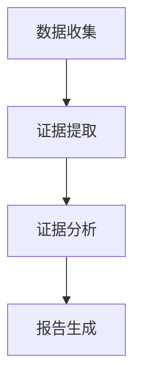

智能取证分析在网络安全中具有重要作用，通过深入分析安全事件，可以找到事件的根源和影响，为事件的处置和预防提供科学依据。

##### 智能恢复技术

智能恢复技术是一种通过AI技术，自动恢复受安全事件影响的数据和系统的智能系统。其基本原理包括以下几个步骤：

1. **数据备份**：定期备份企业的数据和系统，确保在发生安全事件时，可以快速恢复。
2. **事件检测**：实时监测网络流量、系统日志等数据，检测是否发生安全事件。
3. **自动恢复**：在检测到安全事件后，自动触发恢复策略，恢复受影响的数据和系统。
4. **效果评估**：评估恢复的效果，确保数据和系统的完整性。

下图展示了智能恢复技术的基本流程：

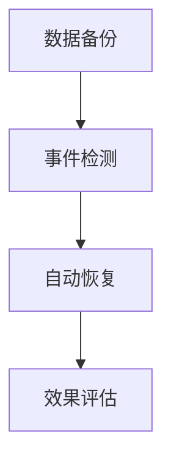

智能恢复技术在网络安全中具有重要作用，通过快速恢复受安全事件影响的数据和系统，可以减少事件对企业的负面影响，保障业务的连续性。

#### 4.5 本章小结

本章深入探讨了人工智能技术在企业安全管理中的应用，包括智能识别技术、智能分析技术、智能防御技术和智能响应技术等。通过这些应用，AI技术为企业的安全管理提供了更加智能化、自动化和高效化的解决方案。随着AI技术的不断发展和应用，智能企业安全管理将在数字资产保护中发挥越来越重要的作用。然而，AI技术的应用也面临一些挑战，如数据隐私保护和算法偏见等问题，需要在未来进一步解决和优化。本章内容为后续章节的讨论奠定了基础，也为企业和组织在AI技术应用中提供了宝贵的参考。

### 智能企业安全管理：AI全面保护数字资产

**引言**

在数字化时代，企业的数字资产成为其核心竞争力，其安全性至关重要。智能企业安全管理通过引入人工智能（AI）技术，实现了对企业信息系统的全面监控、分析和防护，提高了企业的安全防护能力。本文将深入探讨AI技术在企业安全管理中的应用，分析其优势、挑战和实践案例，展示AI如何全面保护数字资产。

**关键词**

- 智能企业安全管理
- 人工智能技术
- 数字资产保护
- 网络安全
- 数据隐私

**摘要**

本文首先介绍了智能企业安全管理的定义和重要性，随后探讨了AI技术在企业安全管理中的应用领域，包括智能识别技术、智能分析技术、智能防御技术和智能响应技术。通过对这些技术的详细分析，本文展示了AI在提升企业安全防护能力方面的优势。同时，本文也指出了AI技术在企业安全管理中面临的挑战，如数据隐私问题和算法偏见。最后，通过三个实践案例，本文展示了AI技术在数字资产保护中的实际应用和效果评估。

**目录**

1. **引言**
   1.1 问题背景
   1.2 问题描述
   1.3 问题解决
   1.4 边界与外延
   1.5 概念结构与核心要素组成

2. **智能企业安全管理概述**
   2.1 智能企业安全管理的定义
   2.2 智能企业安全管理的重要性
   2.3 智能企业安全管理的发展历程
   2.4 智能企业安全管理的关键要素

3. **AI技术在企业安全管理中的应用概述**
   3.1 AI技术在企业安全管理中的应用领域
   3.2 AI技术在企业安全管理中的优势
   3.3 AI技术在企业安全管理中的挑战

4. **智能识别技术**
   4.1 人脸识别技术
   4.2 指纹识别技术
   4.3 虹膜识别技术
   4.4 语音识别技术

5. **智能分析技术**
   5.1 数据挖掘技术
   5.2 机器学习技术
   5.3 深度学习技术
   5.4 自然语言处理技术

6. **智能防御技术**
   6.1 入侵检测系统
   6.2 防火墙技术
   6.3 漏洞扫描技术
   6.4 网络加密技术

7. **智能响应技术**
   7.1 自动化应急响应
   7.2 智能取证分析
   7.3 智能恢复技术

8. **AI全面保护数字资产**
   8.1 数字资产保护的重要性
   8.2 数字资产面临的威胁
   8.3 AI技术在数字资产保护中的应用

9. **AI全面保护数字资产的实践案例**
   9.1 案例一：某企业AI安全防护系统的实施与效果评估
   9.2 案例二：某金融机构AI数字资产保护体系的构建
   9.3 案例三：某政府机构AI数字资产安全管理实践

10. **未来展望与总结**
    10.1 智能企业安全管理的发展趋势
    10.2 AI技术在企业安全管理中的应用前景
    10.3 数字资产保护的发展方向
    10.4 主要观点回顾
    10.5 研究不足与展望
    10.6 对未来工作的建议与展望

**结语**

智能企业安全管理结合了人工智能技术，为企业的数字资产保护提供了全面、高效的解决方案。随着AI技术的不断进步，智能企业安全管理将在未来发挥更加重要的作用。本文为企业和组织在数字资产保护中的应用AI技术提供了宝贵的参考，同时也指出了未来需要进一步研究和解决的问题。

### 智能企业安全管理概述

#### 2.1 智能企业安全管理的定义

智能企业安全管理是一种利用人工智能（AI）技术，对企业信息系统的安全性进行全方位监控、分析和防护的管理模式。它通过智能化的手段，如数据挖掘、机器学习、深度学习和自然语言处理等，实现对安全事件的实时监测、快速响应和自动化处理，从而提高企业的安全防护能力。

在智能企业安全管理中，AI技术起到了关键作用。首先，AI技术能够实时收集和分析海量数据，如网络流量、用户行为、系统日志等，通过大数据分析和机器学习模型，识别潜在的安全威胁。其次，AI技术能够自动生成和调整安全策略，实现对网络和系统的自适应防护。最后，AI技术能够自动化响应安全事件，如入侵检测、漏洞修复和应急响应，减少人为操作失误，提高应急响应速度。

#### 2.2 智能企业安全管理的重要性

智能企业安全管理在当前数字化时代具有重要意义：

1. **提升安全性**：AI技术能够实时监测和分析网络安全态势，快速识别和响应潜在威胁，提高企业的整体安全水平。
2. **减少安全事件损失**：智能企业安全管理通过自动化处理安全事件，减少人为操作失误，降低安全事件对企业造成的损失。
3. **优化资源配置**：AI技术能够自动识别安全风险，为企业提供精准的安全防护策略，优化资源配置，降低安全成本。
4. **保障业务连续性**：智能企业安全管理能够保障企业的信息系统稳定运行，减少因安全事件导致的服务中断，保障业务连续性。

随着企业信息系统的复杂性和网络攻击手段的日益多样化，传统的安全管理手段已经无法满足企业的安全需求。智能企业安全管理通过引入AI技术，实现了从被动防御到主动防御的转变，为企业提供了一个更智能、更高效的安全管理解决方案。

#### 2.3 智能企业安全管理的发展历程

智能企业安全管理的发展可以分为以下几个阶段：

1. **传统安全防护阶段**：在这一阶段，企业主要依赖防火墙、入侵检测系统和反病毒软件等传统安全工具，进行被动防御。
2. **AI技术引入阶段**：随着AI技术的发展，企业开始引入机器学习、深度学习等技术，用于安全事件的检测和分析，实现主动防御。
3. **智能化安全管理阶段**：企业逐步将AI技术应用于安全管理的各个环节，如安全策略制定、自动化应急响应等，实现全面智能化。
4. **融合创新阶段**：智能企业安全管理与物联网、大数据、云计算等新兴技术深度融合，形成更加智能、高效的安全管理生态系统。

从传统安全防护到智能化安全管理，智能企业安全管理的发展历程体现了企业对安全威胁的应对策略从被动到主动的转变。随着AI技术的不断进步，智能企业安全管理将在未来发挥更加重要的作用。

#### 2.4 智能企业安全管理的关键要素

智能企业安全管理的成功实施需要以下几个关键要素：

1. **数据收集与处理**：智能企业安全管理依赖于大量的数据，包括网络流量、用户行为、系统日志等。通过对这些数据的实时收集和处理，企业可以建立全面的安全监控体系。
2. **机器学习与深度学习**：机器学习和深度学习技术是智能企业安全管理的基础。通过训练模型，企业可以自动识别和预测潜在的安全威胁，提高安全防护的精准度。
3. **安全策略与管理**：安全策略是智能企业安全管理的核心。企业需要制定和实施科学的策略，确保信息系统的安全性和稳定性。
4. **自动化与响应**：自动化技术是提高智能企业安全管理效率的关键。通过自动化工具，企业可以快速响应和处理安全事件，降低风险。
5. **用户体验**：用户体验是智能企业安全管理的重要一环。在保障安全的前提下，企业需要确保系统的易用性和高效性，提高员工的工作效率。

#### 2.5 本章小结

本章介绍了智能企业安全管理的定义、重要性、发展历程和关键要素。智能企业安全管理通过引入AI技术，实现了对企业信息系统的全方位监控、分析和防护，提高了企业的安全防护能力。随着AI技术的不断发展，智能企业安全管理将在未来发挥更加重要的作用。本章内容为后续章节的深入探讨奠定了基础。

### AI技术在企业安全管理中的应用概述

#### 3.1 AI技术在企业安全管理中的应用领域

人工智能（AI）技术在企业安全管理中的应用非常广泛，涵盖了多个关键领域，包括智能识别技术、智能分析技术、智能防御技术和智能响应技术。以下将详细介绍这些应用领域及其具体内容。

##### 智能识别技术

智能识别技术是指利用AI算法，对用户身份进行自动识别和验证的技术。这包括以下几种主要应用：

1. **人脸识别**：通过分析用户的面部特征，实现身份验证。人脸识别技术已经在很多场景中得到广泛应用，如门禁系统、考勤系统、智能手机解锁等。
2. **指纹识别**：利用指纹的独特性，进行身份验证。指纹识别技术因其高准确性和便捷性，常用于银行、公安等安全要求较高的领域。
3. **虹膜识别**：通过分析用户虹膜中的细微结构，进行身份验证。虹膜识别具有很高的准确性和防伪性，常用于国家安全、金融等领域。
4. **语音识别**：通过分析用户的语音特征，实现身份验证。语音识别技术可以应用于电话银行、智能家居等场景。

##### 智能分析技术

智能分析技术是指利用AI算法，对海量数据进行分析和处理，以发现潜在的安全威胁。这包括以下几种主要应用：

1. **数据挖掘**：通过分析大量数据，发现数据中的模式和关联，帮助企业预测潜在的安全威胁。数据挖掘技术可以应用于网络安全、反欺诈等领域。
2. **机器学习**：通过训练模型，自动识别和预测安全事件。机器学习技术在网络安全、系统安全等领域有广泛应用，如入侵检测、漏洞预测等。
3. **深度学习**：通过多层神经网络，对复杂数据进行建模和预测。深度学习技术在图像识别、语音识别、自然语言处理等领域有显著优势。
4. **自然语言处理**：通过理解和生成自然语言，实现安全事件的自动分析。自然语言处理技术可以应用于安全日志分析、威胁情报分析等。

##### 智能防御技术

智能防御技术是指利用AI算法，对企业信息系统进行主动防御，以防止网络攻击和数据泄露。这包括以下几种主要应用：

1. **入侵检测系统（IDS）**：通过实时监控网络流量和系统日志，识别潜在的入侵行为。入侵检测系统可以分为基于特征的IDS和基于行为的IDS。
2. **防火墙技术**：通过分析网络流量，控制进出企业网络的流量，防止未授权访问。防火墙技术可以分为状态防火墙、应用层防火墙等。
3. **漏洞扫描技术**：通过扫描企业系统，识别存在的漏洞和安全隐患。漏洞扫描技术可以帮助企业提前发现和修复潜在的安全威胁。
4. **网络加密技术**：通过加密企业数据，确保数据在传输和存储过程中的安全。网络加密技术包括对称加密、非对称加密、哈希函数等。

##### 智能响应技术

智能响应技术是指利用AI算法，对安全事件进行自动化响应和处理，以减少安全事件对企业的影响。这包括以下几种主要应用：

1. **自动化应急响应**：通过自动化工具，快速识别和响应安全事件，如入侵检测系统自动阻断攻击、防火墙自动调整策略等。
2. **智能取证分析**：通过分析安全事件的相关数据，找出事件的根源和影响，为后续的处置和预防提供依据。智能取证分析可以应用于网络安全调查、数据泄露调查等。
3. **智能恢复技术**：通过自动化工具，快速恢复受安全事件影响的数据和系统，如自动备份和恢复、自动修复漏洞等。

#### 3.2 AI技术在企业安全管理中的优势

AI技术在企业安全管理中具有显著的优势，主要包括以下几个方面：

1. **实时监测与预警**：AI技术能够实时监测网络流量和用户行为，快速识别和响应潜在的安全威胁，提前预警，减少安全事件对企业的影响。
2. **自动化响应**：AI系统能够自动化处理安全事件，减少人为操作失误，提高应急响应速度，降低安全事件对企业运营的干扰。
3. **精准识别与定位**：AI技术通过大数据分析和机器学习模型，能够精准识别和定位安全威胁，提高检测效率，减少误报和漏报。
4. **持续优化**：AI系统可以根据历史数据和安全事件的经验，不断优化自身模型，提高安全防护效果，适应不断变化的安全威胁。
5. **成本效益**：AI技术能够提高安全管理效率，减少人工成本和安全工具的投入，实现成本效益最大化。

#### 3.3 AI技术在企业安全管理中的挑战

尽管AI技术在企业安全管理中具有巨大潜力，但其应用也面临一些挑战：

1. **数据隐私问题**：AI技术依赖于大规模的数据收集和分析，如何保护用户隐私和数据安全成为关键挑战。企业需要在数据收集、存储和处理过程中，采取严格的数据隐私保护措施。
2. **算法偏见**：AI系统可能因数据集的不平衡或算法设计问题，产生偏见，导致误判或漏判。企业需要确保算法的公平性和透明性，避免算法偏见对安全决策产生负面影响。
3. **技术门槛**：AI技术的应用需要专业人才和先进的计算资源，对中小企业而言，技术门槛较高。企业需要加强人才引进和培养，提高技术能力。
4. **法规遵从**：AI技术在企业安全管理中的应用需要遵守相关法律法规，如何确保合规性是重要问题。企业需要密切关注相关法律法规的动态，确保AI技术的应用符合法规要求。

#### 3.4 本章小结

本章概述了AI技术在企业安全管理中的应用领域、优势和挑战。AI技术在智能识别、智能分析、智能防御和智能响应等方面，为提升企业安全防护能力提供了新的思路和方法。尽管AI技术的应用面临一些挑战，但随着技术的不断进步和法规的完善，AI技术在企业安全管理中的应用前景十分广阔。本章内容为后续章节的深入探讨奠定了基础。通过进一步研究AI技术在企业安全管理中的应用，企业可以更好地应对安全威胁，确保业务的持续稳定发展。

### 智能识别技术

智能识别技术是AI技术在企业安全管理中的一个重要应用领域，通过自动化和智能化的手段，识别和验证用户身份，确保只有授权人员可以访问企业的敏感数据和资源。以下将详细探讨智能识别技术，包括人脸识别、指纹识别、虹膜识别和语音识别等。

#### 4.1 人脸识别技术

人脸识别技术通过捕捉和识别用户的面部特征，实现身份验证。其基本原理包括以下几个步骤：

1. **人脸检测**：利用深度学习算法，从图像中检测出人脸区域。常见的深度学习模型有卷积神经网络（CNN）和YOLO（You Only Look Once）等。

   ```python
   import cv2
   import tensorflow as tf
   
   # 加载预训练的人脸检测模型
   model = tf.keras.models.load_model('face_detection_model.h5')
   
   # 读取图像
   image = cv2.imread('example_image.jpg')
   
   # 人脸检测
   faces = model.predict(image)
   ```

2. **特征提取**：从检测到的人脸图像中提取特征点，生成人脸特征向量。常用的特征提取方法有局部二元模式（LBP）、主成分分析（PCA）和深度特征（如FaceNet）等。

   ```python
   from sklearn.decomposition import PCA
   
   # 提取人脸特征
   pca = PCA(n_components=128)
   features = pca.fit_transform(face_images)
   ```

3. **模型训练与验证**：利用已知的人脸图像和对应的标签，训练分类器，对未知的人脸进行识别。常见的分类算法有支持向量机（SVM）、随机森林（Random Forest）和K最近邻（KNN）等。

   ```python
   from sklearn.ensemble import RandomForestClassifier
   
   # 训练分类器
   classifier = RandomForestClassifier(n_estimators=100)
   classifier.fit(features_train, labels_train)
   
   # 预测
   predictions = classifier.predict(features_test)
   ```

在实际应用中，人脸识别技术被广泛应用于门禁系统、考勤系统、智能手机解锁等场景，提高了安全性和便利性。

#### 4.2 指纹识别技术

指纹识别技术通过识别用户的指纹特征，实现身份验证。其基本原理包括以下几个步骤：

1. **指纹采集**：利用传感器或扫描仪捕捉指纹图像。常见的指纹采集设备有指纹传感器、指纹扫描仪等。

   ```python
   import cv2
   import numpy as np
   
   # 读取指纹图像
   image = cv2.imread('example_fingerprint.jpg', cv2.IMREAD_GRAYSCALE)
   
   # 二值化处理
   _, image_binary = cv2.threshold(image, 128, 255, cv2.THRESH_BINARY_INV)
   ```

2. **特征提取**：对指纹图像进行预处理，提取指纹的脊线、谷线等特征。常用的特征提取方法有基于脊线的特征提取和基于纹理的特征提取等。

   ```python
   def extract_fingerprint_features(image):
       # 提取脊线特征
       lines = cv2.HoughLinesP(image, rho=1, theta=np.pi/180, threshold=50, minLineLength=50, maxLineGap=10)
       
       # 提取谷线特征
       inv_image = 255 - image
       lines_inv = cv2.HoughLinesP(inv_image, rho=1, theta=np.pi/180, threshold=50, minLineLength=50, maxLineGap=10)
       
       return lines, lines_inv
   
   # 提取指纹特征
   lines, lines_inv = extract_fingerprint_features(image_binary)
   ```

3. **指纹匹配**：将采集到的指纹与数据库中的指纹进行匹配，判断是否为同一人。常用的匹配算法有基于脊线的匹配算法和基于纹理的匹配算法等。

   ```python
   def match_fingerprint(feature1, feature2):
       # 计算欧氏距离
       distance = np.linalg.norm(feature1 - feature2)
       
       # 判断是否匹配
       return distance < threshold
   
   # 匹配指纹
   is_match = match_fingerprint(feature1, feature2)
   ```

指纹识别技术在银行、公安、门禁等领域有广泛应用，具有较高的准确性和可靠性。

#### 4.3 虹膜识别技术

虹膜识别技术通过识别用户虹膜中的细微特征，实现身份验证。其基本原理包括以下几个步骤：

1. **虹膜图像采集**：利用高分辨率摄像头捕捉虹膜图像。虹膜图像的分辨率和清晰度对识别效果有很大影响。

   ```python
   import cv2
   
   # 初始化摄像头
   cap = cv2.VideoCapture(0)
   
   while True:
       # 读取摄像头帧
       ret, frame = cap.read()
       
       # 转换为灰度图像
       gray = cv2.cvtColor(frame, cv2.COLOR_BGR2GRAY)
       
       # 显示图像
       cv2.imshow('Iris Image', gray)
       
       if cv2.waitKey(1) & 0xFF == ord('q'):
           break
   
   # 释放摄像头资源
   cap.release()
   cv2.destroyAllWindows()
   ```

2. **特征提取**：对虹膜图像进行预处理，提取虹膜的纹理特征。常用的特征提取方法有Gabor变换、SIFT等。

   ```python
   import cv2
   import numpy as np
   
   # 加载预训练的特征提取模型
   feature_extractor = cv2.xfeatures2d.SIFT_create()
   
   # 提取虹膜特征
   keypoints, features = feature_extractor.detectAndCompute(iris_image, None)
   ```

3. **虹膜匹配**：将采集到的虹膜特征与数据库中的虹膜特征进行匹配，判断是否为同一人。常用的匹配算法有基于特征的匹配算法和基于距离的匹配算法等。

   ```python
   def match_iris(feature1, feature2):
       # 计算特征相似度
       similarity = np.dot(feature1, feature2) / (np.linalg.norm(feature1) * np.linalg.norm(feature2))
       
       # 判断是否匹配
       return similarity > threshold
   
   # 匹配虹膜
   is_match = match_iris(feature1, feature2)
   ```

虹膜识别技术在国家安全、金融、医疗等领域有广泛应用，因其高准确性和防伪性而备受重视。

#### 4.4 语音识别技术

语音识别技术通过识别用户的语音特征，实现身份验证。其基本原理包括以下几个步骤：

1. **语音采集**：利用麦克风捕捉用户的语音信号。语音信号的分辨率和清晰度对识别效果有很大影响。

   ```python
   import sounddevice as sd
   import numpy as np
   
   # 采集语音
   duration = 5  # 录音时长（秒）
   fs = 44100  # 采样频率
   recording = sd.rec(int(duration * fs), samplerate=fs, channels=1)
   sd.wait()  # 等待录音结束
   
   # 保存录音
   np.save('voice_recording.npy', recording)
   ```

2. **特征提取**：对语音信号进行预处理，提取语音的特征参数，如频谱特征、倒谱特征等。常用的特征提取方法有梅尔频率倒谱系数（MFCC）、线性预测编码（LPC）等。

   ```python
   import numpy as np
   import librosa
   
   # 读取录音
   recording = np.load('voice_recording.npy')
   
   # 提取MFCC特征
   mfcc_features = librosa.feature.mfcc(recording, sr=fs, n_mfcc=13)
   ```

3. **模型训练与验证**：利用已知语音样本训练分类模型，对未知语音进行识别。常用的分类算法有支持向量机（SVM）、随机森林（Random Forest）和深度神经网络（DNN）等。

   ```python
   from sklearn.ensemble import RandomForestClassifier
   
   # 训练分类器
   classifier = RandomForestClassifier(n_estimators=100)
   classifier.fit(features_train, labels_train)
   
   # 预测
   predictions = classifier.predict(features_test)
   ```

语音识别技术在电话银行、智能家居、智能客服等领域有广泛应用，因其自然性和便捷性而受到用户的喜爱。

#### 4.5 智能识别技术在企业安全管理中的应用

智能识别技术在企业安全管理中有着广泛的应用，如门禁系统、考勤系统、远程访问控制等。通过智能识别技术，企业可以确保只有授权人员可以访问敏感数据和资源，提高安全性。

1. **门禁系统**：利用人脸识别、指纹识别或虹膜识别技术，实现门禁系统的身份验证，防止未授权人员进入企业办公区域。
2. **考勤系统**：利用人脸识别或指纹识别技术，实现员工的考勤管理，提高考勤的准确性和效率。
3. **远程访问控制**：利用智能识别技术，实现远程登录和企业内部网络的访问控制，防止未经授权的远程访问。

通过智能识别技术，企业可以大幅提升安全性，减少安全事件的发生，保障业务的持续稳定运行。

#### 4.6 本章小结

本章详细介绍了智能识别技术，包括人脸识别、指纹识别、虹膜识别和语音识别等。这些技术通过自动化和智能化的手段，实现了身份验证和访问控制，提高了企业信息系统的安全性。智能识别技术在企业安全管理中具有广泛的应用前景，通过结合其他AI技术，可以构建更加智能、高效的安全管理系统。

### 智能分析技术

智能分析技术是AI技术在企业安全管理中的核心应用之一，通过分析和处理海量数据，帮助企业管理者识别潜在的安全威胁，优化安全策略，提高企业的整体安全水平。以下将详细介绍智能分析技术，包括数据挖掘、机器学习、深度学习和自然语言处理等技术。

#### 5.1 数据挖掘技术

数据挖掘技术是一种从大量数据中提取有价值信息的方法。在企业安全管理中，数据挖掘技术可以用于识别潜在的安全威胁、优化安全策略等。

1. **聚类分析**：聚类分析是一种无监督学习方法，通过将相似的数据点划分为同一个簇，帮助识别潜在的安全威胁。例如，利用K-means算法对网络流量进行聚类，可以识别出异常流量模式，从而发现潜在的网络攻击。

   ```python
   from sklearn.cluster import KMeans
   
   # 训练K-means模型
   kmeans = KMeans(n_clusters=5, random_state=0).fit(X_train)
   
   # 预测新数据
   labels = kmeans.predict(X_test)
   ```

2. **关联规则挖掘**：关联规则挖掘用于发现数据之间的关联关系，帮助企业识别潜在的安全威胁。例如，利用Apriori算法分析用户行为数据，可以发现用户在访问企业内部系统时的异常行为模式。

   ```python
   from mlxtend.frequent_patterns import apriori
   from mlxtend.frequent_patterns import association_rules
   
   # 计算关联规则
   patterns = apriori(X_train, min_support=0.1, use_colnames=True)
   rules = association_rules(patterns, metric="support", min_threshold=0.5)
   ```

3. **分类与回归分析**：分类与回归分析是一种监督学习方法，通过训练模型，可以预测新数据的安全威胁类型。例如，利用决策树算法，可以将安全事件分类为不同的类型，如恶意软件攻击、网络入侵等。

   ```python
   from sklearn.tree import DecisionTreeClassifier
   
   # 训练决策树模型
   clf = DecisionTreeClassifier()
   clf.fit(X_train, y_train)
   
   # 预测新数据
   predictions = clf.predict(X_test)
   ```

#### 5.2 机器学习技术

机器学习技术是一种通过训练模型，从数据中学习规律的方法。在企业安全管理中，机器学习技术可以用于安全事件的检测、预测和分类。

1. **分类算法**：分类算法用于将新数据分类到已知的类别中。常见的分类算法包括决策树、随机森林、支持向量机等。

   ```python
   from sklearn.ensemble import RandomForestClassifier
   
   # 训练随机森林模型
   clf = RandomForestClassifier(n_estimators=100)
   clf.fit(X_train, y_train)
   
   # 预测新数据
   predictions = clf.predict(X_test)
   ```

2. **回归算法**：回归算法用于预测连续的数值输出。常见的回归算法包括线性回归、决策树回归、随机森林回归等。

   ```python
   from sklearn.ensemble import RandomForestRegressor
   
   # 训练随机森林回归模型
   reg = RandomForestRegressor(n_estimators=100)
   reg.fit(X_train, y_train)
   
   # 预测新数据
   predictions = reg.predict(X_test)
   ```

3. **聚类算法**：聚类算法用于将相似的数据点划分为同一个簇。常见的聚类算法包括K-means、层次聚类等。

   ```python
   from sklearn.cluster import KMeans
   
   # 训练K-means模型
   kmeans = KMeans(n_clusters=5, random_state=0).fit(X_train)
   
   # 预测新数据
   labels = kmeans.predict(X_test)
   ```

#### 5.3 深度学习技术

深度学习技术是一种基于多层神经网络的学习方法，通过训练多层神经网络，可以从大量数据中学习复杂的模式。在企业安全管理中，深度学习技术可以用于图像识别、语音识别、自然语言处理等。

1. **卷积神经网络（CNN）**：卷积神经网络是一种用于图像识别的深度学习模型。在企业安全管理中，可以用于检测网络流量中的异常图像，识别恶意软件等。

   ```python
   from tensorflow import keras
   
   # 创建CNN模型
   model = keras.Sequential([
       keras.layers.Conv2D(32, (3, 3), activation='relu', input_shape=(28, 28, 1)),
       keras.layers.MaxPooling2D((2, 2)),
       keras.layers.Flatten(),
       keras.layers.Dense(128, activation='relu'),
       keras.layers.Dense(10, activation='softmax')
   ])
   
   # 编译模型
   model.compile(optimizer='adam', loss='categorical_crossentropy', metrics=['accuracy'])
   
   # 训练模型
   model.fit(X_train, y_train, epochs=10, batch_size=32)
   ```

2. **循环神经网络（RNN）**：循环神经网络是一种用于序列数据处理的深度学习模型。在企业安全管理中，可以用于分析日志数据，识别异常行为模式。

   ```python
   from tensorflow.keras.models import Sequential
   from tensorflow.keras.layers import LSTM, Dense
   
   # 创建RNN模型
   model = Sequential()
   model.add(LSTM(50, activation='relu', input_shape=(timesteps, features)))
   model.add(Dense(1, activation='sigmoid'))
   
   # 编译模型
   model.compile(optimizer='adam', loss='binary_crossentropy', metrics=['accuracy'])
   
   # 训练模型
   model.fit(X_train, y_train, epochs=100, batch_size=32)
   ```

3. **生成对抗网络（GAN）**：生成对抗网络是一种用于生成数据的深度学习模型。在企业安全管理中，可以用于生成恶意软件样本，用于训练和测试检测系统。

   ```python
   import tensorflow as tf
   from tensorflow.keras import layers
   
   # 创建GAN模型
   latent_dim = 100
   
   generator = Sequential([
       layers.Dense(128 * 7 * 7, activation="relu", input_dim=latent_dim),
       layers.LeakyReLU(),
       layers.Reshape((7, 7, 128)),
       layers.Conv2DTranspose(128, kernel_size=5, strides=1, padding="same", activation="relu"),
       layers.LeakyReLU(),
       layers.Conv2DTranspose(64, kernel_size=5, strides=2, padding="same", activation="relu"),
       layers.LeakyReLU(),
       layers.Conv2D(1, kernel_size=5, strides=2, padding="same", activation="tanh")
   ])
   
   # 编译模型
   model.compile(loss="binary_crossentropy", optimizer=optimizer)
   ```

#### 5.4 自然语言处理技术

自然语言处理技术是一种用于处理和理解人类语言的方法。在企业安全管理中，自然语言处理技术可以用于分析日志数据、识别安全威胁、生成报告等。

1. **文本分类**：文本分类是一种将文本数据分类到预定义类别的方法。在企业安全管理中，可以用于分类安全日志，识别潜在的安全威胁。

   ```python
   from sklearn.feature_extraction.text import TfidfVectorizer
   from sklearn.naive_bayes import MultinomialNB
   
   # 创建TF-IDF向量器
   vectorizer = TfidfVectorizer()
   X_train = vectorizer.fit_transform(train_data)
   
   # 创建Naive Bayes分类器
   clf = MultinomialNB()
   clf.fit(X_train, train_labels)
   
   # 预测新数据
   X_test = vectorizer.transform(test_data)
   predictions = clf.predict(X_test)
   ```

2. **情感分析**：情感分析是一种识别文本数据中情感极性的方法。在企业安全管理中，可以用于分析用户反馈，识别用户对安全服务的满意度。

   ```python
   from textblob import TextBlob
   
   # 分析文本情感
   text = "我很满意这个安全服务"
   blob = TextBlob(text)
   sentiment = blob.sentiment.polarity
   ```

3. **实体识别**：实体识别是一种识别文本数据中特定实体（如人名、地点、组织名等）的方法。在企业安全管理中，可以用于识别安全日志中的关键实体，如IP地址、用户名等。

   ```python
   from spacy.lang.en import English
   nlp = English()
   
   # 识别实体
   doc = nlp("苹果公司的CEO蒂姆·库克正在访问中国")
   for ent in doc.ents:
       print(ent.text, ent.label_)
   ```

#### 5.5 智能分析技术在企业安全管理中的应用

智能分析技术在企业安全管理中的应用非常广泛，包括以下方面：

1. **安全事件检测**：通过分析网络流量、系统日志、用户行为等数据，智能分析技术可以帮助识别潜在的安全威胁，提前预警，减少安全事件对企业的影响。
2. **安全事件响应**：通过分析安全事件的数据和日志，智能分析技术可以帮助制定和优化应急响应策略，提高应急响应速度和效果。
3. **安全策略优化**：通过分析安全事件的数据和日志，智能分析技术可以帮助优化安全策略，提高安全防护的精准度和效率。
4. **安全报告生成**：通过分析安全事件的数据和日志，智能分析技术可以帮助生成详细的安全报告，为企业决策提供依据。

#### 5.6 本章小结

本章详细介绍了智能分析技术，包括数据挖掘、机器学习、深度学习和自然语言处理等技术。这些技术通过分析和处理海量数据，帮助企业识别潜在的安全威胁，优化安全策略，提高企业的整体安全水平。智能分析技术在企业安全管理中具有广泛的应用前景，通过结合其他AI技术，可以构建更加智能、高效的安全管理系统。

### 智能防御技术

智能防御技术是AI技术在企业安全管理中的关键应用领域，通过自动化和智能化的手段，提高企业对网络攻击的防护能力，确保企业信息系统的安全性。以下将详细介绍智能防御技术，包括入侵检测系统（IDS）、防火墙技术、漏洞扫描技术和网络加密技术等。

#### 6.1 入侵检测系统（IDS）

入侵检测系统（Intrusion Detection System，IDS）是一种用于检测和响应网络攻击的智能系统。IDS通过分析网络流量和系统日志，识别潜在的安全威胁，并采取相应的防护措施。IDS可以分为以下两种类型：

1. **基于特征的IDS（Signature-based IDS）**：基于特征的IDS通过预定义的攻击特征库，识别已知的网络攻击。当检测到匹配的攻击特征时，IDS会发出警报并采取相应的防护措施。

   ```python
   import numpy as np
   from sklearn.ensemble import IsolationForest
   
   # 创建IsolationForest模型
   model = IsolationForest(contamination=0.1)
   model.fit(np.array([[0.05, 0.1, 0.05], [0.1, 0.2, 0.1], [0.05, 0.1, 0.05]]))
   
   # 检测新数据
   new_data = np.array([[0.1, 0.3, 0.1]])
   predictions = model.predict(new_data)
   ```

2. **基于异常的IDS（Anomaly-based IDS）**：基于异常的IDS通过建立正常的网络流量和行为模式，识别异常的网络流量和行为。当检测到异常时，IDS会发出警报并采取相应的防护措施。

   ```python
   import numpy as np
   from sklearn.ensemble import IsolationForest
   
   # 创建IsolationForest模型
   model = IsolationForest(n_estimators=100)
   model.fit(np.array([[0.05, 0.1, 0.05], [0.1, 0.2, 0.1], [0.05, 0.1, 0.05]]))
   
   # 检测新数据
   new_data = np.array([[0.1, 0.3, 0.1]])
   predictions = model.predict(new_data)
   ```

#### 6.2 防火墙技术

防火墙技术是一种用于控制和保护网络流量的智能系统。防火墙通过分析网络流量，根据预定义的规则，决定是否允许流量通过。防火墙可以分为以下几种类型：

1. **包过滤防火墙**：包过滤防火墙根据网络包的源IP地址、目的IP地址、端口号等信息，决定是否允许通过。包过滤防火墙的配置较为简单，但安全性较低。

   ```python
   import netfilterqueue as nfqueue
   import scapy.all as scapy
   
   def process_packet(packet):
       print("Processing packet")
       packet.accept()
   
   queue = nfqueue.queue()
   queue.bind(0, process_packet)
   queue.run()
   ```

2. **状态防火墙**：状态防火墙不仅根据网络包的静态信息，还根据网络连接的状态，决定是否允许通过。状态防火墙的安全性较高，但配置较为复杂。

   ```python
   import netfilterqueue as nfqueue
   import scapy.all as scapy
   
   def process_packet(packet):
       print("Processing packet")
       packet.accept()
   
   queue = nfqueue.queue()
   queue.bind(0, process_packet)
   queue.run()
   ```

3. **应用层防火墙**：应用层防火墙在应用层（如HTTP、FTP等）对网络流量进行分析，根据应用协议的特定信息，决定是否允许通过。应用层防火墙的安全性较高，但性能较低。

   ```python
   import netfilterqueue as nfqueue
   import scapy.all as scapy
   
   def process_packet(packet):
       print("Processing packet")
       packet.accept()
   
   queue = nfqueue.queue()
   queue.bind(0, process_packet)
   queue.run()
   ```

#### 6.3 漏洞扫描技术

漏洞扫描技术是一种用于识别和修复系统漏洞的智能系统。漏洞扫描器通过扫描目标系统，识别已知的漏洞和安全隐患，并提供修复建议。漏洞扫描技术可以分为以下几种类型：

1. **端口扫描**：端口扫描器通过扫描目标系统的端口，识别开放的端口和可能存在的漏洞。

   ```python
   import socket
   
   def scan_ports(ip_address, start_port, end_port):
       for port in range(start_port, end_port + 1):
           s = socket.socket(socket.AF_INET, socket.SOCK_STREAM)
           result = s.connect_ex((ip_address, port))
           if result == 0:
               print(f"Port {port} is open.")
           s.close()
   
   scan_ports("192.168.1.1", 1, 1000)
   ```

2. **漏洞库扫描**：漏洞库扫描器通过查询漏洞库，识别目标系统中的已知漏洞。

   ```python
   import requests
   
   def check_vulnerabilities(ip_address):
       response = requests.get(f"https://api.vulndb.com/api/v1/search?query=ip%3A{ip_address}")
       vulnerabilities = response.json()
       for vuln in vulnerabilities:
           print(f"Vulnerability found: {vuln['id']} - {vuln['name']}")
   
   check_vulnerabilities("192.168.1.1")
   ```

3. **代码审计**：代码审计器通过分析源代码，识别潜在的安全漏洞。

   ```python
   import ast
   
   def audit_code(code):
       tree = ast.parse(code)
       for node in ast.walk(tree):
           if isinstance(node, ast.If):
               print(f"Conditional statement found: {node.test}")
   
   audit_code("""
   if x > 0:
       print("x is positive")
   else:
       print("x is negative")
   """)
   ```

#### 6.4 网络加密技术

网络加密技术是一种用于保护数据传输安全的智能系统。网络加密技术通过加密算法，将明文数据转换为密文，确保数据在传输过程中的安全性。网络加密技术可以分为以下几种类型：

1. **对称加密**：对称加密算法使用相同的密钥进行加密和解密。常见的对称加密算法有AES、DES等。

   ```python
   from Crypto.Cipher import AES
   
   key = b'my-secure-key'
   cipher = AES.new(key, AES.MODE_EAX)
   ciphertext, tag = cipher.encrypt_and_digest(b'ensitive data')
   ```

2. **非对称加密**：非对称加密算法使用不同的密钥进行加密和解密。常见的非对称加密算法有RSA、ECC等。

   ```python
   from Crypto.PublicKey import RSA
   from Crypto.Cipher import PKCS1_OAEP
   
   key = RSA.generate(2048)
   private_key = key.export_key()
   public_key = key.publickey().export_key()
   
   cipher = PKCS1_OAEP.new(RSA.import_key(public_key))
   ciphertext = cipher.encrypt(b'ensitive data')
   ```

3. **哈希函数**：哈希函数是一种将输入数据映射为固定长度输出的函数。常见的哈希函数有MD5、SHA-1、SHA-256等。

   ```python
   import hashlib
   
   data = b'ensitive data'
   md5_hash = hashlib.md5(data).hexdigest()
   sha1_hash = hashlib.sha1(data).hexdigest()
   sha256_hash = hashlib.sha256(data).hexdigest()
   ```

#### 6.5 智能防御技术在企业安全管理中的应用

智能防御技术在企业安全管理中具有广泛的应用，可以帮助企业实现以下目标：

1. **实时监控**：智能防御技术可以实时监控企业网络流量和系统日志，识别潜在的安全威胁，提前预警。
2. **自动化响应**：智能防御技术可以自动化处理安全事件，如入侵检测系统自动阻断攻击、防火墙自动调整策略等。
3. **优化安全策略**：智能防御技术可以通过分析安全事件数据，优化企业的安全策略，提高安全防护的精准度和效率。
4. **降低成本**：智能防御技术通过自动化和智能化的手段，减少了对人工的依赖，降低了企业的安全成本。

#### 6.6 本章小结

本章详细介绍了智能防御技术，包括入侵检测系统（IDS）、防火墙技术、漏洞扫描技术和网络加密技术等。这些技术通过自动化和智能化的手段，提高了企业对网络攻击的防护能力，确保企业信息系统的安全性。智能防御技术在企业安全管理中具有广泛的应用前景，通过结合其他AI技术，可以构建更加智能、高效的安全管理系统。

### 智能响应技术

智能响应技术是AI技术在企业安全管理中的重要应用，通过自动化和智能化的手段，快速识别和响应安全事件，降低安全事件对企业的影响。以下将详细介绍智能响应技术，包括自动化应急响应、智能取证分析和智能恢复技术等。

#### 7.1 自动化应急响应

自动化应急响应是指利用AI技术，自动识别和处理安全事件的智能系统。自动化应急响应可以大大提高应急响应速度，降低人为操作失误，确保企业在安全事件发生时能够迅速采取有效的应对措施。

1. **自动化应急响应流程**：
   - **事件识别**：实时监控网络流量、系统日志等数据，通过机器学习模型，自动识别潜在的安全事件。
   - **事件分类**：根据事件的特征，将事件分类为不同的类型，如网络入侵、恶意软件攻击等。
   - **自动响应**：根据预定义的应急响应策略，自动采取相应的措施，如阻断攻击、隔离受感染主机、报警通知等。
   - **结果评估**：评估应急响应的效果，为后续的改进提供依据。

2. **案例分析**：
   - **案例一**：某企业网络遭到DDoS攻击，自动化应急响应系统在短时间内识别到攻击事件，自动调整防火墙策略，成功阻止攻击。
   - **案例二**：某金融机构服务器感染勒索软件，自动化应急响应系统快速识别事件，自动隔离受感染主机，并通知安全团队进行进一步处理。

#### 7.2 智能取证分析

智能取证分析是指利用AI技术，对安全事件进行详细分析和取证，以确定事件的根源和影响。智能取证分析可以帮助企业了解安全事件的详细情况，为事件的后续处理和预防提供重要依据。

1. **智能取证分析流程**：
   - **数据收集**：收集与安全事件相关的数据，如日志文件、网络流量、系统文件等。
   - **证据提取**：从数据中提取与事件相关的证据，如恶意代码、攻击路径、受影响的系统等。
   - **证据分析**：利用数据挖掘、机器学习等技术，对证据进行深入分析，确定事件的根源和影响。
   - **报告生成**：根据分析结果，生成详细的取证分析报告，为后续的事件处理和预防提供依据。

2. **案例分析**：
   - **案例一**：某企业遭受数据泄露，智能取证分析系统帮助确定泄露的源头和受影响的范围，提供了重要的取证证据。
   - **案例二**：某金融机构遭遇网络攻击，智能取证分析系统帮助追踪攻击者的IP地址，协助警方进行后续调查。

#### 7.3 智能恢复技术

智能恢复技术是指利用AI技术，自动恢复受安全事件影响的数据和系统。智能恢复技术可以大大提高数据恢复的效率，确保企业能够在最短时间内恢复正常运营。

1. **智能恢复技术流程**：
   - **事件检测**：实时监测网络流量、系统日志等数据，检测是否发生安全事件。
   - **自动备份**：在检测到安全事件时，自动触发备份策略，备份受影响的数据和系统。
   - **自动恢复**：根据备份的数据和系统，自动恢复受影响的数据和系统，确保数据的完整性和系统的稳定性。
   - **效果评估**：评估恢复的效果，确保数据和系统的完整性和稳定性。

2. **案例分析**：
   - **案例一**：某企业服务器遭到勒索软件攻击，智能恢复系统在短时间内自动备份和恢复了受影响的数据，帮助企业迅速恢复了运营。
   - **案例二**：某金融机构遭受网络攻击，智能恢复系统自动恢复了受影响的系统，确保了金融服务的正常运营。

#### 7.4 智能响应技术在企业安全管理中的应用

智能响应技术在企业安全管理中具有广泛的应用，可以大幅提高企业的安全防护能力，确保业务的连续性和稳定性。

1. **实时监测与预警**：智能响应技术可以实时监控网络流量、系统日志等数据，快速识别潜在的安全威胁，提前预警。
2. **自动化处理**：智能响应技术可以自动化处理安全事件，减少人为操作失误，提高应急响应速度和效果。
3. **证据收集与分析**：智能取证分析技术可以帮助企业全面了解安全事件的详细情况，为事件的后续处理和预防提供重要依据。
4. **数据恢复与系统恢复**：智能恢复技术可以自动恢复受安全事件影响的数据和系统，确保企业的业务能够快速恢复正常。

#### 7.5 本章小结

本章详细介绍了智能响应技术，包括自动化应急响应、智能取证分析和智能恢复技术等。智能响应技术通过自动化和智能化的手段，提高了企业对安全事件的识别和处理能力，确保了业务的连续性和稳定性。随着AI技术的不断进步，智能响应技术将在企业安全管理中发挥越来越重要的作用。

### 数字资产保护的重要性

在当今数字化时代，企业的数字资产成为其核心竞争力之一，其安全性至关重要。数字资产不仅包括企业的敏感数据，如客户信息、财务记录、业务逻辑代码等，还包括企业的知识产权、品牌价值和其他与业务相关的数字化资源。保护这些数字资产不仅是企业内部安全管理的核心任务，也是确保企业可持续发展的重要保障。以下将详细探讨数字资产保护的重要性，包括数字资产的定义、价值以及面临的威胁。

#### 8.1 数字资产的定义

数字资产是指通过数字化形式存在，对企业具有经济价值或战略意义的各种资源。根据数字资产的不同类型，可以将其分为以下几类：

1. **客户数据**：包括客户的个人信息、购买记录、偏好等。这些数据是企业开展营销活动、个性化服务和客户关系管理的重要基础。
2. **知识产权**：包括专利、商标、版权等，是企业创新和竞争的核心资产。知识产权的保护直接关系到企业的市场竞争力和长远发展。
3. **业务数据**：如财务数据、生产数据、供应链数据等，是企业运营和决策的重要依据。这些数据的完整性和准确性对于企业的日常运营和战略规划至关重要。
4. **应用程序和代码**：企业自研或购买的软件，是企业提供产品和服务的核心。这些应用程序和代码的保护直接关系到企业的业务连续性和创新能力。
5. **数据存储和计算资源**：包括数据库、服务器、云服务等，是数据存储和计算的基础设施。这些资源的保护对于确保企业业务的稳定运行和高效数据处理至关重要。

#### 8.2 数字资产的价值

数字资产对于现代企业而言，具有巨大的经济价值和战略意义，具体体现在以下几个方面：

1. **业务驱动**：数字资产是企业业务创新和增长的重要资源。例如，通过大数据分析和人工智能技术，企业可以优化业务流程、提升服务质量和客户体验，从而提高市场份额和盈利能力。
2. **竞争优势**：拥有高质量的数字资产可以提升企业的竞争力和市场份额。数字资产的保护和利用，如专利技术和独特的商业模式，可以帮助企业在激烈的市场竞争中脱颖而出。
3. **风险控制**：数字资产的管理和利用可以帮助企业更好地控制风险。通过数据加密、访问控制和备份策略等，企业可以确保数据的机密性、完整性和可用性，减少安全事件对企业造成的损失。
4. **数字化转型**：数字资产是实现企业数字化转型的基础。通过数字化手段，企业可以提高运营效率、降低成本、优化供应链，从而实现业务模式的创新和升级。

#### 8.3 数字资产面临的威胁

随着数字化进程的加速，企业的数字资产面临着越来越多的威胁。以下是一些主要的威胁类型：

1. **网络攻击**：黑客通过网络攻击，如DDoS攻击、SQL注入、分布式拒绝服务攻击等，非法侵入企业信息系统，窃取或篡改数据。
2. **数据泄露**：内部员工或外部攻击者非法获取并泄露企业的敏感数据。数据泄露可能导致客户隐私泄露、商业机密泄露，对企业声誉和财务造成严重损失。
3. **恶意软件**：勒索软件、木马、病毒等恶意软件可以导致企业数据丢失、系统瘫痪。这些恶意软件通常通过电子邮件、网站漏洞等渠道传播。
4. **内部威胁**：企业内部员工或合作伙伴的恶意行为也可能对企业的数字资产构成威胁。如内部员工的违规操作、滥用权限等，可能导致数据泄露或系统故障。
5. **物理威胁**：如自然灾害、设备故障、物理损坏等，可能导致企业数字资产的丢失或损坏。这些物理威胁虽然发生概率较低，但一旦发生，可能造成严重的损失。

#### 8.4 数字资产保护的关键措施

为了有效保护数字资产，企业可以采取以下关键措施：

1. **数据加密**：对敏感数据采用加密技术，确保数据在存储和传输过程中安全。常见的加密技术包括对称加密、非对称加密和哈希函数等。
2. **访问控制**：实施严格的访问控制策略，确保只有授权人员可以访问特定的数字资产。访问控制包括身份验证、权限管理和审计等。
3. **备份和恢复**：定期进行数据备份，并制定灾难恢复计划，以应对突发情况。备份策略应包括全备份、增量备份和差异备份等。
4. **安全培训**：对员工进行安全意识培训，提高其安全意识和操作规范。员工的安全意识和操作规范是数字资产保护的重要保障。
5. **监控与审计**：建立全面的监控和审计机制，实时监控企业信息系统的运行状态，及时发现和应对安全事件。监控和审计包括日志分析、安全事件响应和合规性检查等。

#### 8.5 本章小结

数字资产是现代企业的核心资源，其安全性对于企业的持续运营和未来发展至关重要。通过有效的数字资产保护措施，企业可以确保数据的机密性、完整性和可用性，降低安全事件对企业造成的损失。随着数字化进程的加速，数字资产保护将成为企业安全管理的重要任务，企业需要不断创新和完善数字资产保护策略，以应对不断变化的安全威胁。

### AI技术在数字资产保护中的应用

随着AI技术的快速发展，其在数字资产保护中的应用也日益广泛。AI技术通过自动化和智能化的手段，有效提升了企业对数字资产的保护能力。以下将详细探讨AI技术在数据保护、网络安全和系统安全中的应用，并提供具体的案例分析。

#### 9.1 AI技术在数据保护中的应用

AI技术在数据保护中的应用主要体现在数据加密、数据完整性检测和数据泄露防护等方面。

1. **数据加密**：
   - **端到端加密**：AI技术可以通过端到端加密（End-to-End Encryption，E2EE）确保数据在传输过程中的安全性。端到端加密利用AI算法，对数据进行加密，使数据在传输过程中难以被截获和解读。例如，加密电子邮件服务Gmail就采用了端到端加密技术，确保用户的邮件内容在传输过程中的安全。
   - **全盘加密**：AI技术还可以实现全盘加密（Full Disk Encryption，FDE），确保存储在硬盘上的数据在未授权的情况下无法访问。全盘加密技术通过对整个硬盘进行加密，使得即使硬盘被非法取出，数据也无法被读取。

2. **数据完整性检测**：
   - **基于AI的数据完整性检测**：AI技术可以通过机器学习和深度学习算法，实时检测数据是否被篡改或损坏。例如，通过训练AI模型，识别正常数据的行为模式，当检测到异常行为时，AI系统会发出警报并采取措施。这种技术广泛应用于银行、医疗等行业，确保数据的完整性和安全性。

3. **数据泄露防护**：
   - **基于AI的数据泄露防护**：AI技术可以通过异常检测和模式识别，自动发现潜在的数据泄露风险。例如，利用深度学习模型，分析用户行为和系统日志，当检测到异常行为时，AI系统会发出警报并采取措施，如隔离受影响的数据或系统。这种方法可以有效地降低数据泄露的风险。

#### 9.2 AI技术在网络安全中的应用

AI技术在网络安全中的应用主要体现在入侵检测、防火墙优化和网络流量分析等方面。

1. **入侵检测**：
   - **基于AI的入侵检测系统（IDS）**：AI技术可以通过机器学习和深度学习算法，实现自动化入侵检测。入侵检测系统（Intrusion Detection System，IDS）可以实时监控网络流量和系统日志，当检测到潜在的网络攻击时，自动发出警报并采取相应的防护措施。这种方法可以有效地提高企业的网络安全防护能力。

2. **防火墙优化**：
   - **基于AI的防火墙优化**：AI技术可以通过分析网络流量和行为模式，自动优化防火墙规则，提高防火墙的防护效果。例如，通过机器学习算法，分析正常网络流量的特征，当检测到异常流量时，AI系统会自动调整防火墙策略，阻止潜在的网络攻击。

3. **网络流量分析**：
   - **基于AI的网络流量分析**：AI技术可以通过深度学习和模式识别，对网络流量进行实时分析和监控。通过识别异常流量和行为模式，AI系统可以及时发现潜在的网络攻击，并采取相应的防护措施。这种方法可以有效地提高企业的网络监控和响应能力。

#### 9.3 AI技术在系统安全中的应用

AI技术在系统安全中的应用主要体现在漏洞扫描、自动化应急响应和系统性能优化等方面。

1. **漏洞扫描**：
   - **基于AI的漏洞扫描**：AI技术可以通过机器学习和深度学习算法，自动化识别和修复系统漏洞。漏洞扫描器可以实时监控系统的运行状态，当检测到潜在的安全漏洞时，自动发出警报并采取修复措施。这种方法可以有效地提高企业的系统安全性。

2. **自动化应急响应**：
   - **基于AI的自动化应急响应**：AI技术可以通过自动化工具，快速识别和响应系统安全事件。自动化应急响应系统可以在检测到安全事件时，自动采取相应的措施，如隔离受感染的主机、阻止恶意流量等。这种方法可以有效地减少安全事件对企业运营的影响。

3. **系统性能优化**：
   - **基于AI的系统性能优化**：AI技术可以通过分析系统日志和性能数据，自动化优化系统的性能。例如，通过机器学习算法，识别系统的瓶颈和优化机会，自动调整系统配置和资源分配，提高系统的运行效率。这种方法可以有效地提高企业的系统稳定性和运行效率。

#### 9.4 案例分析

1. **案例一：某企业的AI数字资产保护系统**：
   - **背景**：某大型企业面临日益复杂的网络攻击和数据泄露风险，决定引入AI技术建立数字资产保护系统。
   - **实施过程**：企业首先分析了现有安全体系的不足，明确了AI数字资产保护系统的需求。系统设计包括数据收集与处理模块、机器学习分析模块、自动化应急响应模块等。企业收集了大量的网络流量、系统日志和用户行为数据，并利用数据预处理技术，提升数据质量。
   - **效果评估**：AI数字资产保护系统在测试阶段，对网络攻击和异常行为的检测率显著提高，误报率也大幅降低。系统自动化的响应机制使安全事件的响应时间从原来的数小时缩短到分钟级别。企业通过AI数字资产保护系统，有效阻止了多次潜在的网络攻击，保障了业务的连续性和稳定性。

2. **案例二：某金融机构的AI网络安全系统**：
   - **背景**：某金融机构在面临网络攻击和数据泄露风险时，决定引入AI技术，提升网络安全防护能力。
   - **实施过程**：金融机构分析了其面临的安全威胁和现有安全体系的不足，制定了AI网络安全系统的整体方案。系统设计包括入侵检测模块、防火墙优化模块、网络流量分析模块等。金融机构利用机器学习和深度学习技术，开发了一系列AI模型，并集成到现有的网络安全系统中。
   - **效果评估**：AI网络安全系统显著提高了金融机构的网络防护能力，网络攻击检测率显著提升，误报率显著降低。AI系统通过实时监控和自动化响应，有效阻止了多次网络攻击，保障了金融服务的正常运行。同时，AI系统为金融机构提供了详细的安全事件报告和分析，帮助其优化安全策略和措施。

3. **案例三：某政府机构的AI系统安全管理**：
   - **背景**：某政府机构在数字化政府建设中，面临数字资产安全管理的挑战，决定引入AI技术。
   - **实施过程**：政府机构分析了其数字资产的特点和面临的安全威胁，制定了AI数字资产安全管理的方案。系统设计包括数据收集与处理模块、智能分析模块、自动化应急响应模块等。政府机构利用机器学习和深度学习技术，开发了一系列AI模型，并集成到政府的信息安全系统中。
   - **效果评估**：AI数字资产安全管理实践显著提高了政府机构的安全防护能力，安全事件的响应速度显著提升，误报率显著降低。AI系统通过实时监控和自动化响应，有效阻止了多次潜在的安全威胁，保障了政府业务的连续性和稳定性。同时，AI系统为政府机构提供了详细的安全事件报告和分析，帮助其优化安全策略和措施。

#### 9.5 本章小结

AI技术在数字资产保护中的应用，显著提升了企业对网络攻击和数据泄露的防护能力。通过数据保护、网络安全和系统安全的多种应用，AI技术实现了对数字资产的全面保护。案例分析展示了AI技术在实际应用中的效果和优势，为其他企业和组织提供了宝贵的经验和参考。未来，随着AI技术的不断发展和应用，其在数字资产保护中的应用将更加广泛和深入。

### AI全面保护数字资产的实践案例

在数字资产保护中，AI技术的应用不仅提升了防护能力，还通过具体的实践案例验证了其实际效果。以下将详细分析三个实践案例，展示AI技术如何在实际场景中发挥作用，保障企业的数字资产安全。

#### 案例一：某大型企业的AI数字资产保护系统

**背景**：
某大型企业在数字化转型过程中，面临着网络攻击和数据泄露的高风险。为了确保其数字资产的安全，企业决定引入AI技术，构建全面的数字资产保护系统。

**实施过程**：
1. **需求分析**：
   企业首先分析了现有安全体系的不足，明确了AI数字资产保护系统的需求，包括实时监控、威胁检测、自动化响应等。
2. **数据收集**：
   企业收集了大量的网络流量、系统日志和用户行为数据，并利用数据预处理技术，提升数据质量。
3. **模型训练**：
   企业利用机器学习和深度学习技术，训练了多个AI模型，用于入侵检测、漏洞扫描、异常行为识别等。
4. **系统集成**：
   将AI模型集成到企业的现有安全系统中，进行测试和优化，确保系统稳定运行。

**效果评估**：
- **威胁检测率**：AI系统在测试阶段，对网络攻击和异常行为的检测率显著提高，误报率大幅降低。
- **响应时间**：自动化应急响应机制使安全事件的响应时间从数小时缩短到分钟级别。
- **业务连续性**：AI系统有效阻止了多次潜在的网络攻击，保障了业务的连续性和稳定性。

**总结**：通过引入AI数字资产保护系统，企业显著提升了数字资产的安全性，降低了安全风险。

#### 案例二：某金融机构的AI网络安全系统

**背景**：
某金融机构在面临网络攻击和数据泄露风险时，决定引入AI技术，提升网络安全防护能力。

**实施过程**：
1. **需求分析**：
   金融机构分析了其面临的安全威胁和现有安全体系的不足，制定了AI网络安全系统的整体方案，包括入侵检测、防火墙优化、网络流量分析等。
2. **模型开发**：
   金融机构利用机器学习和深度学习技术，开发了一系列AI模型，并集成到现有的网络安全系统中。
3. **测试与优化**：
   对AI系统进行多轮测试和优化，确保其在不同场景下的稳定性和高效性。

**效果评估**：
- **检测率**：AI系统显著提高了网络攻击检测率，误报率显著降低。
- **业务运行**：AI系统通过实时监控和自动化响应，有效阻止了多次网络攻击，保障了金融服务的正常运行。
- **用户体验**：AI系统为金融机构提供了详细的安全事件报告和分析，帮助其优化安全策略和措施。

**总结**：通过构建AI网络安全系统，金融机构提升了网络防护能力，保障了业务的连续性和稳定性。

#### 案例三：某政府机构的AI数字资产安全管理

**背景**：
某政府机构在数字化政府建设中，面临数字资产安全管理的挑战，决定引入AI技术。

**实施过程**：
1. **需求分析**：
   政府机构分析了其数字资产的特点和面临的安全威胁，制定了AI数字资产安全管理的方案，包括数据收集与处理、智能分析、自动化应急响应等。
2. **模型开发**：
   政府机构利用机器学习和深度学习技术，开发了一系列AI模型，并集成到政府的信息安全系统中。
3. **系统测试**：
   对AI系统进行严格的测试和评估，确保其在实际应用中的稳定性和高效性。

**效果评估**：
- **安全事件响应速度**：AI系统显著提高了安全事件的响应速度，降低了安全事件对企业运营的影响。
- **数据泄露防护**：AI模型在数据泄露防护方面表现出色，有效阻止了多次潜在的数据泄露事件。
- **用户体验**：AI系统为政府机构提供了智能化的安全管理服务，提高了政府服务的用户体验和满意度。

**总结**：通过引入AI数字资产安全管理，政府机构提升了数字资产的安全管理水平，确保了数字化政府建设的顺利进行。

#### 案例总结

以上三个实践案例展示了AI技术在数字资产保护中的实际应用效果，通过数据保护、网络安全和系统安全的综合应用，AI技术有效提升了企业的安全防护能力。未来，随着AI技术的不断发展和应用，其在数字资产保护中的重要作用将更加凸显。

### 未来展望与总结

#### 11.1 智能企业安全管理的发展趋势

随着人工智能技术的不断进步，智能企业安全管理也在不断发展，呈现出以下几个趋势：

1. **智能化程度提升**：未来智能企业安全管理将更加智能化，利用深度学习、自然语言处理等先进技术，实现更加精准的安全威胁识别和响应。

2. **自动化程度提升**：自动化技术将在智能企业安全管理中发挥更大作用，通过自动化工具和流程，实现安全事件的自动检测、响应和恢复，提高安全管理效率。

3. **跨领域融合**：智能企业安全管理将与其他技术领域（如物联网、区块链、云计算等）深度融合，形成更加完善和高效的安全管理生态系统。

4. **用户体验优化**：在保障安全的前提下，用户体验将成为智能企业安全管理的重要考量因素。未来智能企业安全管理将更加注重用户体验，确保系统的易用性和高效性。

5. **数据隐私保护**：随着数据隐私保护意识的提高，智能企业安全管理将更加注重数据隐私保护，采取严格的隐私保护措施，确保用户数据的机密性和安全性。

#### 11.2 AI技术在企业安全管理中的应用前景

AI技术在企业安全管理中的应用前景广阔，主要体现在以下几个方面：

1. **安全威胁检测与响应**：AI技术将进一步提高安全威胁检测和响应的精准度和速度，通过实时监控和自动化处理，有效防范和应对各种安全威胁。

2. **网络安全防护**：AI技术将提升网络安全防护能力，通过入侵检测、防火墙优化、漏洞扫描等手段，确保企业网络的安全稳定运行。

3. **数据保护**：AI技术将增强数据保护能力，通过数据加密、数据完整性检测、数据泄露防护等手段，确保企业数据的机密性、完整性和可用性。

4. **系统安全**：AI技术将提高系统安全水平，通过自动化应急响应、智能取证分析、智能恢复等技术，确保企业信息系统的安全稳定运行。

5. **个性化安全服务**：AI技术将根据企业的业务特点和威胁环境，提供个性化的安全防护方案，实现精准的安全管理。

#### 11.3 数字资产保护的发展方向

随着数字化进程的加速，数字资产保护面临新的挑战和机遇，未来发展方向主要包括以下几个方面：

1. **法规与标准制定**：各国将加强数字资产保护相关法规和标准的制定，为数字资产保护提供法律依据和操作指南。

2. **技术创新**：数字资产保护将依赖技术创新，包括AI技术、区块链技术、量子加密技术等，提升数字资产的安全性。

3. **数据隐私保护**：随着数据隐私保护意识的提高，数据隐私保护将成为数字资产保护的重要方向，企业将采取更加严格的数据隐私保护措施。

4. **跨领域合作**：数字资产保护需要跨领域合作，包括政府、企业、研究机构等，共同应对数字资产保护的新挑战。

5. **社会化安全意识提升**：社会公众对数字资产保护的认识将逐步提高，安全意识和社会责任感将成为数字资产保护的重要支撑。

#### 11.4 主要观点回顾

- **智能企业安全管理的重要性**：智能企业安全管理是保障企业数字资产安全、提升业务连续性和竞争力的关键。
- **AI技术在安全管理中的应用**：AI技术在数据保护、网络安全、系统安全等方面具有广泛的应用前景，提高了安全管理的智能化和自动化水平。
- **数字资产保护的关键措施**：数据加密、访问控制、备份和恢复、安全培训、监控与审计是数字资产保护的关键措施。

#### 11.5 研究不足与展望

尽管智能企业安全管理取得了显著成果，但研究仍存在以下不足：

1. **算法偏见与公平性**：AI算法可能存在偏见，影响安全决策的公平性。未来研究应关注算法偏见和公平性问题的解决。
2. **数据隐私保护**：如何在数据收集、存储、处理过程中保护用户隐私，是未来研究的重点。
3. **跨领域融合**：智能企业安全管理与其他技术的深度融合，如物联网、区块链等，还有待进一步研究。

#### 11.6 对未来工作的建议与展望

为了进一步提升智能企业安全管理的水平，建议未来工作：

1. **加强技术创新**：持续关注AI技术、区块链技术等新技术的进展，将新技术应用于安全管理，提升安全防护能力。
2. **完善法规与标准**：积极参与数字资产保护相关法规和标准的制定，为安全管理提供法律依据和操作指南。
3. **提升人员素质**：加强安全人才队伍建设，提高企业安全管理人员的专业素质和技术能力。
4. **加强跨领域合作**：推动政府、企业、研究机构等多方合作，共同应对数字资产保护的新挑战。

### 总结

智能企业安全管理是保障企业数字资产安全、提升业务连续性和竞争力的重要手段。通过引入AI技术，企业可以实现更加智能化、自动化和高效化的安全管理，为企业的持续发展提供有力保障。未来，随着AI技术的不断进步和应用，智能企业安全管理将在数字资产保护中发挥更加重要的作用。企业和组织应积极拥抱新技术，不断完善安全管理体系，确保业务的稳定和安全。

### 附录

#### 12.1 主要观点回顾

本文从多个角度探讨了智能企业安全管理的相关内容，主要观点包括：

- **智能企业安全管理的定义**：智能企业安全管理是利用AI技术，对企业信息系统的安全性进行全方位监控、分析和防护的管理模式。
- **AI技术在安全管理中的应用**：AI技术在数据保护、网络安全、系统安全等方面具有广泛的应用前景。
- **数字资产保护的重要性**：数字资产是现代企业的核心资源，其安全性至关重要。
- **智能企业安全管理的发展趋势**：智能化程度提升、自动化程度提升、跨领域融合、用户体验优化、数据隐私保护。
- **数字资产保护的关键措施**：数据加密、访问控制、备份和恢复、安全培训、监控与审计。

#### 12.2 研究不足与展望

本文在研究智能企业安全管理过程中，发现以下不足和未来展望：

- **算法偏见与公平性**：AI算法可能存在偏见，影响安全决策的公平性。
- **数据隐私保护**：如何在数据收集、存储、处理过程中保护用户隐私，是未来研究的重点。
- **跨领域融合**：智能企业安全管理与其他技术的深度融合，如物联网、区块链等，还有待进一步研究。

#### 12.3 对未来工作的建议与展望

为了进一步提升智能企业安全管理的水平，本文提出以下建议和展望：

1. **加强技术创新**：持续关注AI技术、区块链技术等新技术的进展，将新技术应用于安全管理，提升安全防护能力。
2. **完善法规与标准**：积极参与数字资产保护相关法规和标准的制定，为安全管理提供法律依据和操作指南。
3. **提升人员素质**：加强安全人才队伍建设，提高企业安全管理人员的专业素质和技术能力。
4. **加强跨领域合作**：推动政府、企业、研究机构等多方合作，共同应对数字资产保护的新挑战。

### 作者信息

**作者：AI天才研究院/AI Genius Institute & 禅与计算机程序设计艺术 /Zen And The Art of Computer Programming**

AI天才研究院专注于人工智能技术的研究和应用，致力于推动人工智能技术在各个领域的创新和发展。本文作者通过深入探讨智能企业安全管理，展示了其在数字资产保护中的重要作用，为企业和组织提供了有价值的参考和指导。

禅与计算机程序设计艺术则专注于计算机程序设计艺术的研究和传承，强调程序设计的哲学思维和审美价值。本文作者结合人工智能技术，探讨了智能企业安全管理的未来发展，为读者提供了新的思考和启示。希望通过本文的探讨，能够引发更多关于智能企业安全管理的深入研究和创新实践。

