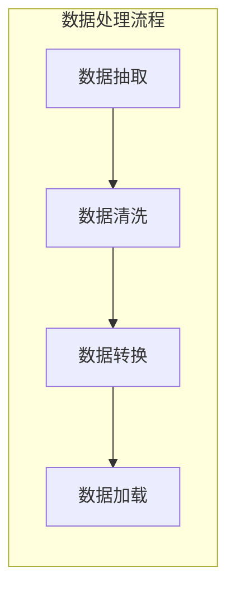

                 

# 《智能企业数据湖：构建AI友好的数据基础》

## 关键词

- 智能企业
- 数据湖
- AI友好
- 数据治理
- 架构设计
- 数据存储

## 摘要

在数字化转型的浪潮下，智能企业正逐渐成为市场的主导力量。数据湖作为新一代的数据存储解决方案，以其灵活性和高效性，正被越来越多的企业所采用。本文将详细探讨智能企业数据湖的概念、优势、架构设计、数据治理、构建流程以及应用案例，旨在为构建AI友好的数据基础提供全面的指导。

## 目录大纲

**《智能企业数据湖：构建AI友好的数据基础》**

----------------------------------------------------------------

## 第一部分：智能企业数据湖概述

## 第1章：智能企业数据湖的概念与背景

### 1.1.1 问题背景

随着大数据和人工智能技术的迅猛发展，企业对数据的需求日益增长。传统的关系型数据库和数据仓库在处理海量数据和复杂查询方面显得力不从心。数据湖作为一种新兴的数据存储解决方案，应运而生。

### 1.1.2 数据湖的定义

数据湖是一种大规模的数据存储和管理平台，它可以存储不同格式、不同来源的数据，并支持实时分析和处理。与传统数据仓库相比，数据湖更注重数据的原始性和灵活性。

### 1.1.3 智能企业的数据湖优势

- 提高数据处理效率
- 降低数据管理成本
- 促进数据驱动决策

### 1.1.4 数据湖的应用领域

- 金融行业
- 零售行业
- 制造业

## 第2章：智能企业数据湖的架构设计

### 2.1.1 数据湖的技术架构

- 数据源接入
- 数据存储
- 数据处理
- 数据分析

### 2.1.2 数据湖的组件

- 数据存储层
- 数据处理层
- 数据分析层

### 2.1.3 数据湖的架构设计原则

- 高可用性
- 可扩展性
- 易维护性

## 第3章：智能企业数据湖的数据治理

### 3.1.1 数据治理的重要性

- 数据质量
- 数据安全
- 数据隐私

### 3.1.2 数据治理的策略

- 数据质量管理
- 数据安全策略
- 数据隐私保护

### 3.1.3 数据治理工具

----------------------------------------------------------------

接下来的章节将逐步深入探讨智能企业数据湖的各个方面，帮助读者理解如何构建一个AI友好的数据基础。

## 第一部分：智能企业数据湖概述

### 第1章：智能企业数据湖的概念与背景

#### 1.1.1 问题背景

在当今的信息化时代，数据已经成为企业最宝贵的资产之一。然而，随着数据量的爆发性增长和复杂性的增加，传统的关系型数据库和数据仓库在处理这些海量数据时显得力不从心。这不仅导致了数据处理效率的下降，还增加了数据管理的成本。在这种背景下，智能企业需要一种更加灵活、高效的数据存储和管理解决方案，这就是数据湖的诞生背景。

**问题的提出**

企业在日常运营中会产生大量的结构化、半结构化和非结构化数据，如日志、传感器数据、社交媒体数据、文本、图像和视频等。这些数据不仅种类繁多，而且规模庞大，传统数据库在存储和处理这些数据时存在以下问题：

1. **数据存储限制**：传统关系型数据库在存储大数据时，表结构需要预先定义，导致数据的灵活性和扩展性受限。
2. **数据处理效率低**：对于复杂的查询和分析操作，传统数据库的处理速度较慢，难以满足实时数据需求。
3. **数据整合困难**：企业内部和外部的数据源多种多样，传统数据库难以有效地整合和处理这些异构数据。

**企业的数据需求**

随着企业对数据价值的认识不断提高，企业对数据的需求也在不断变化和扩展：

1. **多样化数据类型**：企业需要处理结构化、半结构化和非结构化数据，如文本、图像、视频、音频等。
2. **实时数据处理**：企业希望能够实时获取和分析数据，以便快速做出决策。
3. **数据整合和共享**：企业需要将不同来源和格式的数据进行整合，并实现数据的跨部门和跨系统的共享。

**AI技术的发展**

人工智能（AI）和机器学习（ML）技术的迅猛发展，使得企业对数据的需求更加迫切。AI技术依赖于大量高质量的数据进行训练，以提高模型的准确性和效率。然而，传统数据仓库在数据存储、管理和分析方面存在诸多限制，难以满足AI和ML的需求。数据湖作为一种新兴的数据存储和管理解决方案，可以提供以下优势：

1. **数据的原始性和灵活性**：数据湖可以存储不同格式、不同来源的数据，无需预先定义表结构，提高了数据的灵活性和扩展性。
2. **海量数据的处理能力**：数据湖支持分布式存储和处理，可以高效地处理海量数据。
3. **实时数据分析和处理**：数据湖可以支持实时数据流处理，满足实时数据分析的需求。

#### 1.1.2 数据湖的定义

**数据湖的定义**

数据湖是一种大规模的数据存储和管理平台，用于存储和管理不同类型、不同来源的数据。与传统的数据仓库不同，数据湖可以存储原始数据，无需预先定义数据结构，使得数据更加灵活和可扩展。

**数据湖与传统数据仓库的区别**

| 特征 | 数据湖 | 数据仓库 |
| --- | --- | --- |
| 数据结构 | 无需预先定义结构，支持多种数据格式 | 需要预先定义表结构，以支持特定的查询和分析操作 |
| 数据处理 | 支持批处理和实时处理 | 主要支持批处理 |
| 数据类型 | 支持结构化、半结构化和非结构化数据 | 主要支持结构化数据 |
| 数据存储成本 | 较低，因为可以存储大量原始数据 | 较高，因为需要存储和处理结构化数据 |
| 扩展性 | 高，可以轻松扩展存储和处理能力 | 低，扩展性有限 |

#### 1.1.3 智能企业的数据湖优势

**提高数据处理效率**

数据湖采用分布式存储和处理技术，可以高效地处理海量数据。与传统的数据仓库相比，数据湖可以显著提高数据处理速度，满足实时数据分析和处理的需求。

**降低数据管理成本**

数据湖无需预先定义数据结构，可以存储多种格式的数据，从而简化了数据管理流程。此外，数据湖支持分布式存储和处理，可以降低硬件和运维成本。

**促进数据驱动决策**

数据湖提供了丰富的数据资源，企业可以通过数据分析和挖掘，获得有价值的信息和洞察，从而实现数据驱动决策。

#### 1.1.4 数据湖的应用领域

**金融行业**

金融行业的数据湖应用广泛，包括风险管理、客户行为分析、交易监控等。通过数据湖，金融机构可以高效地存储和处理大量交易数据，实现实时风险监控和预测。

**零售行业**

零售行业的数据湖应用包括库存管理、客户行为分析、个性化推荐等。通过数据湖，零售企业可以更好地了解客户需求，优化库存管理，提高销售业绩。

**制造业**

制造业的数据湖应用包括生产优化、设备维护、供应链管理等。通过数据湖，制造企业可以实时收集和分析生产数据，实现生产优化和设备维护。

## 第2章：智能企业数据湖的架构设计

#### 2.1.1 数据湖的技术架构

数据湖的技术架构主要包括数据源接入、数据存储、数据处理和数据分析等组件。以下是对这些组件的详细介绍：

**数据源接入**

数据源接入是数据湖架构的第一步，用于将各种类型的数据接入到数据湖中。数据源可以是关系型数据库、NoSQL数据库、文件系统、消息队列、实时数据流等。通过数据接入组件，企业可以方便地收集和管理来自不同源的数据。

**数据存储**

数据存储是数据湖的核心组件，用于存储和管理大规模数据。数据湖通常采用分布式存储技术，如Hadoop HDFS、Alluxio等。分布式存储可以提高数据存储的可靠性和扩展性，满足海量数据的存储需求。

**数据处理**

数据处理是数据湖的重要组成部分，用于对存储在数据湖中的数据进行清洗、转换和整合。数据处理可以采用批处理和实时处理技术，如Apache Spark、Flink等。通过数据处理组件，企业可以对数据进行加工和处理，以便后续的数据分析。

**数据分析**

数据分析是数据湖的最终目的，用于从数据中提取有价值的信息和洞察。数据分析可以采用各种数据分析工具和算法，如SQL查询、机器学习模型等。通过数据分析组件，企业可以深入了解业务情况，做出更加明智的决策。

#### 2.1.2 数据湖的组件

数据湖的组件包括数据存储层、数据处理层和分析层，以下是这些组件的详细说明：

**数据存储层**

数据存储层是数据湖的基础，负责存储和管理大规模数据。数据存储层通常采用分布式存储技术，如Hadoop HDFS、Alluxio等。分布式存储可以提高数据存储的可靠性和扩展性，满足海量数据的存储需求。

**数据处理层**

数据处理层是数据湖的核心，负责对存储在数据湖中的数据进行清洗、转换和整合。数据处理层可以采用批处理和实时处理技术，如Apache Spark、Flink等。通过数据处理层，企业可以高效地对数据进行加工和处理，以便后续的数据分析。

**数据分析层**

数据分析层是数据湖的最终目的，负责从数据中提取有价值的信息和洞察。数据分析层可以采用各种数据分析工具和算法，如SQL查询、机器学习模型等。通过数据分析层，企业可以深入了解业务情况，做出更加明智的决策。

#### 2.1.3 数据湖的架构设计原则

数据湖的架构设计需要遵循以下原则：

**高可用性**

数据湖架构应该具备高可用性，确保数据存储和处理的可靠性。可以通过分布式存储和备份策略来实现高可用性。

**可扩展性**

数据湖架构应该具备良好的可扩展性，能够轻松地扩展存储和处理能力，以满足企业数据量的增长需求。分布式存储和计算技术可以实现数据湖的可扩展性。

**易维护性**

数据湖架构应该设计得易于维护，降低运维成本。通过自动化运维工具和监控机制，可以实现对数据湖的实时监控和故障排除。

### 第3章：智能企业数据湖的数据治理

#### 3.1.1 数据治理的重要性

数据治理是确保数据质量、安全性和隐私的关键环节，对智能企业的数据湖来说尤为重要。以下是对数据治理重要性的详细探讨：

**数据质量**

数据质量是数据治理的核心目标之一。高质量的数据可以为企业提供准确、可靠的决策依据，从而提升业务运营效率和竞争力。数据质量问题包括数据完整性、准确性、一致性、时效性和可用性等方面。数据湖中存储的大量原始数据如果存在质量问题，将直接影响数据分析的结果和决策的准确性。

**数据安全**

数据安全是数据治理的另一个重要方面。数据湖中存储的企业核心数据和敏感信息，如客户数据、交易数据、财务数据等，必须得到严格保护，防止数据泄露、篡改和未授权访问。数据安全措施包括数据加密、访问控制、审计和监控等。数据治理策略需要确保数据在整个生命周期中始终受到保护。

**数据隐私**

随着数据隐私法规的日益严格，如欧洲的《通用数据保护条例》（GDPR）和中国的《个人信息保护法》，企业必须确保数据隐私得到有效保护。数据湖中的个人数据必须得到合理处理，防止个人隐私泄露。数据治理策略需要明确数据隐私保护的要求，确保数据在收集、存储、处理和传输过程中的合法合规性。

#### 3.1.2 数据治理的策略

为了实现数据治理的目标，企业需要制定一系列策略，包括数据质量管理、数据安全策略和数据隐私保护。以下是这些策略的详细说明：

**数据质量管理**

数据质量管理旨在确保数据质量达到预期标准。企业可以通过以下措施来实现数据质量管理：

- **数据质量监控**：建立数据质量监控机制，实时监测数据质量状况，及时发现和解决问题。
- **数据清洗和转换**：定期对数据进行清洗和转换，确保数据的准确性、完整性和一致性。
- **数据质量评估**：制定数据质量评估标准，对数据进行定期评估，确保数据质量持续满足业务需求。

**数据安全策略**

数据安全策略旨在确保数据在存储、传输和处理过程中的安全性。企业可以通过以下措施来实现数据安全策略：

- **数据加密**：采用数据加密技术，对敏感数据进行加密存储和传输，防止数据泄露。
- **访问控制**：实施严格的访问控制策略，确保只有授权用户可以访问敏感数据。
- **审计和监控**：建立审计和监控机制，对数据访问和使用行为进行记录和监控，确保数据安全。

**数据隐私保护**

数据隐私保护策略旨在确保个人数据的合法合规处理。企业可以通过以下措施来实现数据隐私保护：

- **隐私设计**：在设计数据湖架构时，充分考虑隐私保护需求，确保数据收集、存储和处理过程中的合规性。
- **隐私培训**：对员工进行数据隐私保护培训，提高员工的隐私保护意识和能力。
- **隐私合规检查**：定期进行隐私合规性检查，确保数据湖中的个人数据符合相关法规要求。

#### 3.1.3 数据治理工具

为了有效实施数据治理策略，企业需要借助一系列数据治理工具。以下是几种常用的数据治理工具：

- **数据质量工具**：用于数据清洗、转换和质量监控，如Talend、Informatica等。
- **数据安全工具**：用于数据加密、访问控制和审计，如Symantec、Splunk等。
- **数据隐私保护工具**：用于隐私设计和合规检查，如OneTrust、IBM Privacy Shield等。

## 第二部分：智能企业数据湖的构建与实践

### 第4章：智能企业数据湖的构建流程

#### 4.1.1 数据湖的规划与设计

构建智能企业数据湖的第一步是进行数据湖的规划与设计。这一阶段主要包括数据需求分析、数据架构设计和数据模型设计。以下是具体的步骤和注意事项：

**数据需求分析**

数据需求分析是构建数据湖的基础，旨在明确企业对数据的需求。企业需要分析各个业务部门的数据需求，包括数据的种类、来源、质量、安全性等方面。以下是一些关键步骤：

- **业务需求调研**：与业务部门进行沟通，了解业务需求和数据需求。
- **数据源梳理**：明确数据来源，包括内部系统和外部数据源。
- **数据质量评估**：对现有数据进行质量评估，了解数据的质量状况。
- **需求文档编写**：根据调研结果编写数据需求文档，明确数据需求的具体要求和标准。

**数据架构设计**

数据架构设计是数据湖规划与设计的关键环节，旨在确定数据湖的整体架构和组件。以下是一些关键步骤：

- **数据模型设计**：设计数据模型，包括实体关系模型和属性定义。
- **数据存储方案**：选择合适的存储方案，如Hadoop HDFS、Alluxio等。
- **数据处理方案**：确定数据处理方案，包括批处理和实时处理。
- **数据访问策略**：设计数据访问策略，包括数据权限管理和数据共享机制。

**数据模型设计**

数据模型设计是数据架构设计的重要组成部分，旨在定义数据湖中的数据结构和关系。以下是一些关键步骤：

- **实体定义**：定义数据湖中的实体，包括数据源、数据表和数据字段。
- **关系定义**：定义实体之间的关系，包括一对一、一对多、多对多关系。
- **属性定义**：定义实体的属性，包括数据类型、长度、约束等。

在数据模型设计过程中，可以使用Mermaid绘制实体关系图，以直观地表示数据模型结构。以下是一个简单的实体关系图示例：

```mermaid
erDiagram
  Customer ||--|{ Order : has }
  Product ||--|{ Order : contains }
```

这个实体关系图表示了客户、订单和产品之间的关系，客户可以有多个订单，订单可以包含多个产品。

**注意事项**

在数据湖的规划与设计阶段，需要注意以下几点：

- **需求与设计的结合**：确保数据需求和数据设计紧密结合，避免出现需求变化导致设计调整。
- **数据质量与安全**：在设计阶段就要考虑数据质量和安全要求，确保数据在整个生命周期中受到有效保护。
- **可扩展性**：设计时需要考虑数据湖的扩展性，确保未来能够轻松扩展存储和处理能力。

#### 4.1.2 数据湖的搭建

数据湖的搭建是构建数据湖的重要阶段，主要包括数据源接入、数据存储方案选择和数据处理流程设计。以下是具体的步骤和注意事项：

**数据源接入**

数据源接入是将各种类型的数据源接入到数据湖中，包括关系型数据库、NoSQL数据库、文件系统、实时数据流等。以下是一些关键步骤：

- **数据源集成**：选择合适的数据集成工具，如Apache Nifi、Apache Kafka等，实现数据源的接入。
- **数据抽取**：根据数据源的类型和特点，设计数据抽取流程，将数据从数据源中抽取到数据湖中。
- **数据清洗**：在数据抽取过程中，对数据进行清洗，包括去重、补全、转换等，确保数据的准确性和完整性。

**数据存储方案选择**

数据存储方案选择是数据湖搭建的关键环节，根据数据类型、规模和处理需求，选择合适的存储方案。以下是一些常见的存储方案：

- **分布式文件系统**：如Hadoop HDFS、Alluxio等，适用于大规模数据存储和批处理。
- **分布式数据库**：如Apache HBase、Cassandra等，适用于半结构化和非结构化数据的存储。
- **数据仓库**：如Amazon Redshift、Google BigQuery等，适用于复杂查询和实时数据分析。

在数据存储方案选择过程中，需要考虑以下因素：

- **数据规模**：根据数据规模选择合适的存储方案，确保存储能力满足需求。
- **数据处理需求**：根据数据处理需求选择合适的存储方案，如批处理、实时处理等。
- **成本**：考虑存储方案的成本，包括硬件、软件和维护成本等。

**数据处理流程设计**

数据处理流程设计是数据湖搭建的另一个关键环节，旨在定义数据在数据湖中的处理流程。以下是一些关键步骤：

- **数据处理流程设计**：设计数据处理流程，包括数据抽取、清洗、转换、加载等步骤。
- **数据处理工具选择**：根据数据处理需求选择合适的数据处理工具，如Apache Spark、Flink等。
- **数据处理策略**：制定数据处理策略，包括数据质量监控、数据一致性维护等。

在数据处理流程设计过程中，需要考虑以下几点：

- **数据一致性**：确保数据处理过程中数据的一致性，避免数据重复或丢失。
- **数据处理效率**：优化数据处理流程，提高数据处理效率，满足实时数据需求。
- **可扩展性**：设计可扩展的数据处理流程，以适应未来数据量和处理需求的变化。

**注意事项**

在数据湖的搭建阶段，需要注意以下几点：

- **数据源接入与清洗**：确保数据源接入与清洗流程的稳定性和可靠性，避免数据质量问题。
- **数据存储方案选择**：根据实际需求选择合适的存储方案，确保数据存储的安全性和可扩展性。
- **数据处理流程设计**：设计灵活、高效的数据处理流程，以应对不同的数据处理需求。

#### 4.1.3 数据处理流程设计

数据处理流程设计是构建智能企业数据湖的关键环节，决定了数据在数据湖中的处理效率和质量。以下是数据处理流程设计的详细步骤和注意事项：

**数据处理流程设计步骤**

1. **需求分析**：明确企业对数据处理的业务需求，包括数据清洗、转换、加载等步骤。
2. **数据流设计**：根据业务需求设计数据处理流程，包括数据抽取、清洗、转换、加载等步骤。
3. **数据处理工具选择**：根据数据处理需求选择合适的数据处理工具，如Apache Spark、Flink等。
4. **性能优化**：对数据处理流程进行性能优化，包括数据分区、并行处理等。

**数据处理流程设计示例**

以下是一个简单的数据处理流程设计示例：

1. **数据抽取**：从关系型数据库中抽取数据。
2. **数据清洗**：对数据进行清洗，包括去重、补全、转换等。
3. **数据转换**：对清洗后的数据进行转换，如格式转换、类型转换等。
4. **数据加载**：将转换后的数据加载到数据仓库中。



**注意事项**

在数据处理流程设计过程中，需要注意以下几点：

- **数据一致性**：确保数据处理过程中数据的一致性，避免数据重复或丢失。
- **数据处理效率**：优化数据处理流程，提高数据处理效率，满足实时数据需求。
- **可扩展性**：设计可扩展的数据处理流程，以适应未来数据量和处理需求的变化。

## 第5章：智能企业数据湖的应用案例

#### 5.1.1 案例一：金融行业数据湖建设

**案例背景**

某大型银行在数字化转型过程中，面临着海量数据的处理和管理挑战。为了提高数据处理效率和数据利用率，该银行决定建设一个智能企业数据湖。

**案例分析**

1. **需求分析**：该银行的数据需求包括交易数据、客户数据、风险数据等，这些数据来自不同的系统和部门。数据湖的设计需要满足数据多样化、大规模处理和实时分析的需求。

2. **架构设计**：银行选择了Hadoop HDFS作为数据存储方案，Apache Spark作为数据处理工具，构建了一个分布式、高效的数据湖架构。

3. **数据处理**：银行通过Apache Spark对交易数据、客户数据等进行清洗、转换和整合，实现了实时数据处理和批处理。

4. **数据分析**：银行利用数据湖进行数据分析，包括客户行为分析、风险监控和预测等，从而提高了业务运营效率和风险管理能力。

5. **成果**：通过数据湖的建设，该银行实现了数据的高效处理和分析，提高了业务决策的准确性，减少了风险。

#### 5.1.2 案例二：零售行业数据湖应用

**案例背景**

某大型零售企业在业务快速增长过程中，面临着库存管理和客户分析的挑战。为了优化库存管理和提升客户体验，该零售企业决定建设一个智能企业数据湖。

**案例分析**

1. **需求分析**：零售企业的数据需求包括销售数据、库存数据、客户数据等，这些数据来自不同的销售渠道和部门。数据湖的设计需要满足数据多样化、大规模处理和实时分析的需求。

2. **架构设计**：零售企业选择了Amazon Redshift作为数据仓库，Apache Kafka作为数据流处理工具，构建了一个高效、可扩展的数据湖架构。

3. **数据处理**：零售企业通过Apache Kafka实时收集销售数据和库存数据，利用Amazon Redshift进行数据清洗、转换和加载。

4. **数据分析**：零售企业利用数据湖进行数据分析，包括库存优化、销售预测和客户行为分析等，从而优化了库存管理和提升了客户体验。

5. **成果**：通过数据湖的应用，该零售企业实现了数据的实时处理和分析，提高了库存管理效率和客户满意度。

#### 5.1.3 案例三：制造业数据湖建设

**案例背景**

某大型制造企业在生产过程中产生了大量的设备数据、供应链数据和客户数据。为了提高生产效率、优化供应链管理和提升客户满意度，该制造企业决定建设一个智能企业数据湖。

**案例分析**

1. **需求分析**：制造企业的数据需求包括设备数据、供应链数据、客户数据等，这些数据来自不同的生产线、供应商和部门。数据湖的设计需要满足数据多样化、大规模处理和实时分析的需求。

2. **架构设计**：制造企业选择了Hadoop HDFS作为数据存储方案，Apache Spark作为数据处理工具，构建了一个分布式、高效的数据湖架构。

3. **数据处理**：制造企业通过Apache Spark对设备数据进行实时收集和处理，利用Hadoop HDFS进行数据存储和加载。

4. **数据分析**：制造企业利用数据湖进行数据分析，包括生产效率分析、供应链优化和客户满意度分析等，从而提高了生产效率和客户满意度。

5. **成果**：通过数据湖的建设，该制造企业实现了数据的实时处理和分析，优化了生产流程和供应链管理，提高了整体运营效率。

## 第6章：智能企业数据湖的未来发展趋势

#### 6.1.1 数据湖技术的发展趋势

随着大数据、云计算和人工智能技术的不断发展，数据湖技术也在不断演进。以下是数据湖技术的发展趋势：

**大数据技术的融合**

大数据技术的不断发展，如Hadoop、Spark等，为数据湖提供了强大的数据处理能力。未来，数据湖技术将进一步融合大数据技术，实现更高效、更智能的数据处理和分析。

**云计算的普及**

云计算的普及为数据湖提供了更灵活、更经济的存储和处理方案。未来，数据湖将更多地依托云计算平台，实现数据的高效存储、处理和共享。

**边缘计算的兴起**

随着物联网和智能设备的普及，边缘计算将成为数据湖技术的重要发展方向。数据湖将逐步向边缘计算延伸，实现数据在边缘端的实时处理和分析。

**数据治理与隐私保护的加强**

随着数据隐私法规的日益严格，数据治理与隐私保护将成为数据湖技术的重要关注点。未来，数据湖将更加注重数据治理和隐私保护，确保数据的合法合规处理。

#### 6.1.2 数据湖在智能企业中的应用前景

**数据驱动决策**

数据湖提供了丰富的数据资源，企业可以通过数据分析和挖掘，获得有价值的信息和洞察，从而实现数据驱动决策。未来，数据湖将成为企业决策的重要依据，推动企业实现智能化运营。

**AI与数据湖的结合**

人工智能技术的发展为数据湖提供了新的应用场景。未来，数据湖将与人工智能技术深度融合，实现更智能、更精准的数据分析和挖掘。

**安全与隐私保护**

数据湖中的数据安全与隐私保护至关重要。未来，数据湖技术将更加注重安全与隐私保护，确保数据的合法合规处理，为企业的数字化转型提供有力支持。

#### 6.1.3 数据湖的安全与隐私问题

**数据安全**

数据湖中存储了大量的企业核心数据和敏感信息，如客户数据、交易数据等。为了确保数据安全，企业需要采取以下措施：

- **数据加密**：对敏感数据进行加密存储和传输，防止数据泄露。
- **访问控制**：实施严格的访问控制策略，确保只有授权用户可以访问敏感数据。
- **审计与监控**：建立审计和监控机制，对数据访问和使用行为进行记录和监控。

**数据隐私**

随着数据隐私法规的日益严格，企业需要确保数据隐私得到有效保护。以下是一些关键措施：

- **隐私设计**：在设计数据湖架构时，充分考虑隐私保护需求，确保数据收集、存储和处理过程中的合规性。
- **隐私培训**：对员工进行数据隐私保护培训，提高员工的隐私保护意识和能力。
- **隐私合规检查**：定期进行隐私合规性检查，确保数据湖中的个人数据符合相关法规要求。

## 第7章：智能企业数据湖的总结与展望

#### 7.1.1 数据湖的优势与挑战

**数据湖的优势**

- **灵活性**：数据湖可以存储不同类型、不同来源的数据，无需预先定义数据结构，提高了数据的灵活性和扩展性。
- **数据处理能力**：数据湖支持分布式存储和处理，可以高效地处理海量数据，满足实时数据分析和处理的需求。
- **成本效益**：数据湖采用分布式存储技术，可以降低硬件和运维成本，提高企业的数据管理效率。

**数据湖的挑战**

- **数据治理**：数据湖中的数据规模庞大，数据质量参差不齐，需要进行有效的数据治理，确保数据的质量和安全性。
- **数据隐私**：数据湖中存储了大量的敏感信息，需要采取有效的数据隐私保护措施，确保数据的合法合规处理。
- **技术复杂性**：数据湖技术涉及多种组件和工具，技术复杂度较高，需要专业人才进行运维和管理。

#### 7.1.2 数据湖的建设策略

**数据湖的设计原则**

- **灵活性**：设计数据湖时，要充分考虑数据的多样性和变化性，确保数据湖能够灵活应对不同的业务需求。
- **可扩展性**：数据湖的设计应具备良好的可扩展性，能够轻松扩展存储和处理能力，以应对未来数据量的增长。
- **安全性**：数据湖的设计要确保数据的安全性和隐私保护，采取有效的数据加密、访问控制和审计等措施。
- **易维护性**：数据湖的设计要易于维护，降低运维成本，提高数据管理的效率。

**数据湖的建设步骤**

1. **需求分析**：明确企业对数据湖的需求，包括数据类型、数据规模、数据处理需求等。
2. **架构设计**：设计数据湖的架构，包括数据存储层、数据处理层和分析层等。
3. **数据治理**：制定数据治理策略，确保数据的质量和安全性，包括数据质量监控、数据清洗和转换等。
4. **搭建环境**：搭建数据湖的硬件和软件环境，包括分布式存储、计算和数据集成工具等。
5. **数据接入**：将数据源接入到数据湖中，进行数据抽取、清洗、转换和加载。
6. **数据处理**：设计数据处理流程，包括批处理和实时处理，实现数据的高效处理和分析。
7. **数据分析**：利用数据湖进行数据分析，提取有价值的信息和洞察，支持企业的决策。

#### 7.1.3 数据湖的未来展望

**数据湖的发展方向**

- **智能化**：随着人工智能技术的不断发展，数据湖将实现更智能的数据处理和分析，为企业的智能化运营提供支持。
- **云原生**：数据湖将逐步向云原生方向发展，依托云计算平台实现数据的高效存储、处理和共享。
- **边缘计算**：数据湖将延伸至边缘计算，实现数据的实时处理和分析，支持物联网和智能设备的广泛应用。

**数据湖在智能企业中的价值**

- **数据驱动决策**：数据湖提供了丰富的数据资源，企业可以通过数据分析和挖掘，获得有价值的信息和洞察，从而实现数据驱动决策。
- **提高业务效率**：数据湖实现了数据的高效处理和分析，提高了企业的运营效率和竞争力。
- **降低成本**：数据湖采用分布式存储技术，降低了硬件和运维成本，为企业提供了更经济的解决方案。

**小结**

智能企业数据湖作为新一代的数据存储和管理解决方案，以其灵活性、高效性和低成本优势，正在被越来越多的企业所采用。然而，数据湖的建设也面临着数据治理、安全性和隐私保护等挑战。企业需要制定合适的数据湖建设策略，充分利用数据湖的优势，实现数据驱动决策，提高业务效率和竞争力。

**注意事项**

- 数据湖的设计和建设需要充分考虑业务需求，确保数据湖能够满足企业的实际应用场景。
- 数据治理是数据湖建设的关键环节，企业需要采取有效的数据治理措施，确保数据的质量和安全性。
- 随着技术的不断发展，数据湖将不断演进，企业需要紧跟技术趋势，不断优化数据湖的架构和功能。

**拓展阅读**

- [《大数据时代的智能数据湖构建与实践》](链接)
- [《智能企业数据湖：从设计到实施》](链接)
- [《数据湖技术在金融行业的应用案例》](链接)

## 作者

作者：AI天才研究院/AI Genius Institute & 禅与计算机程序设计艺术 /Zen And The Art of Computer Programming

