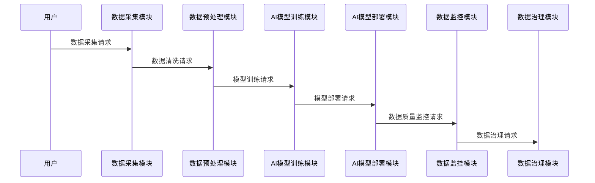

                 

# 智能企业数据质量管理：AI确保数据可靠性

> 关键词：智能企业，数据质量管理，人工智能，数据可靠性，AI算法，数据清洗，数据脱敏，数据治理

> 摘要：随着信息技术的飞速发展，数据已经成为企业核心资产。然而，数据的准确性和可靠性对企业的决策和运营至关重要。本文将深入探讨智能企业数据质量管理的重要性，以及如何利用人工智能（AI）技术来确保数据的可靠性。文章将从背景介绍、核心概念、AI在数据质量管理中的应用、AI算法详解、系统架构设计、项目实战等方面进行详细阐述。

## 引言

在当今信息化时代，企业面临的海量数据不仅包括内部产生的交易记录、客户信息、产品数据等，还涵盖了从外部获取的社交媒体、市场调研、竞争情报等。这些数据是企业在市场竞争中保持优势、做出科学决策的重要依据。然而，数据质量的好坏直接影响到数据分析结果的有效性和准确性。如果数据存在误差、缺失或不一致等问题，将导致企业决策失误，甚至可能引发严重的业务风险。

传统的数据质量管理方法主要依赖于人工检查和数据清洗工具，但这些方法效率低、成本高，且难以应对大规模数据环境。随着人工智能技术的不断发展，利用AI来提升数据质量管理成为可能。AI算法可以自动检测和纠正数据错误，提高数据的一致性和完整性，从而确保企业数据的高可靠性。

本文将围绕以下主题展开：

1. 智能企业数据质量管理概述
2. AI在数据质量管理中的应用
3. AI算法在数据质量管理中的具体实现
4. 数据质量管理系统的架构设计
5. 项目实战与案例分析
6. 最佳实践与未来展望

通过本文的阅读，读者将全面了解智能企业数据质量管理的重要性，以及如何利用AI技术来提升数据质量管理的效率和效果。

## 第一章：智能企业数据质量管理概述

### 1.1 背景介绍

数据质量管理是企业信息管理的重要组成部分，其目的是确保数据在采集、存储、处理和使用过程中的一致性、准确性和可靠性。随着大数据、云计算、物联网等技术的普及，企业面临的数据规模和种类日益增加，数据质量管理的重要性愈发突出。

传统的数据质量管理方法主要依赖于人工审核和离线数据清洗工具，这种方式效率低下，难以满足现代企业对实时、高效数据管理的需求。此外，随着业务场景的复杂化，传统的数据质量管理方法在处理大量异构数据时存在诸多挑战。因此，引入人工智能（AI）技术进行数据质量管理成为一种新的趋势。

### 1.2 数据质量管理的核心概念

数据质量是指数据满足特定应用需求的程度，它包括多个维度，如准确性、完整性、一致性、时效性和可用性。以下是数据质量管理中的几个关键概念：

#### 数据准确性
数据准确性是指数据是否反映了真实世界的情况。例如，客户姓名、地址、电话等基本信息是否准确无误。

#### 数据完整性
数据完整性是指数据是否完整，没有缺失或重复。例如，数据库中的记录是否完整，是否有丢失的数据字段。

#### 数据一致性
数据一致性是指数据在不同系统或表中是否保持一致。例如，客户信息在不同数据库中是否保持一致。

#### 数据时效性
数据时效性是指数据是否及时更新，以反映当前的业务状况。例如，订单数据是否及时更新，以便及时进行库存管理和销售分析。

#### 数据可用性
数据可用性是指数据是否可以方便地被访问和使用。例如，数据是否存储在易于访问的位置，用户是否可以轻松地查询和使用数据。

### 1.3 数据质量管理的过程和最佳实践

数据质量管理是一个持续的过程，包括数据采集、数据清洗、数据存储、数据分析和数据使用等多个环节。以下是数据质量管理的一些关键过程和最佳实践：

#### 数据采集
- 确保数据源的正确性和可靠性。
- 使用自动化工具进行数据采集，减少人工错误。

#### 数据清洗
- 检测并纠正数据中的错误、异常和重复。
- 进行数据标准化处理，如数据格式转换、缺失值填补、异常值检测和处理等。

#### 数据存储
- 选择合适的数据存储方案，如关系数据库、NoSQL数据库、数据仓库等。
- 确保数据存储的安全性、可靠性和可扩展性。

#### 数据分析
- 利用先进的数据分析技术和工具，对数据进行深入挖掘和分析。
- 根据业务需求，建立数据指标体系，监测数据质量。

#### 数据使用
- 将数据质量管理融入到业务流程中，确保数据在各个环节的准确性和可靠性。
- 提供数据质量报告，帮助业务人员了解数据质量状况，优化业务决策。

### 1.4 数据质量管理框架

数据质量管理框架是指导数据质量管理活动的重要工具。以下是常见的数据质量管理框架：

#### 数据质量管理生命周期（Data Quality Management Life Cycle，DQML）

数据质量管理生命周期通常包括以下几个阶段：

1. **需求分析**：识别数据质量需求和目标。
2. **数据质量评估**：评估当前数据质量状况。
3. **数据清洗**：检测和纠正数据中的问题。
4. **数据监控**：持续监测数据质量。
5. **数据报告**：生成数据质量报告，提供反馈。

#### 数据质量管理工具和技术

数据质量管理工具主要包括数据质量检测工具、数据清洗工具、数据集成工具等。以下是几种常见的数据质量管理工具：

- **数据质量检测工具**：用于检测数据中的错误、异常和重复等。
- **数据清洗工具**：用于自动或半自动地修复数据中的问题。
- **数据集成工具**：用于将多个数据源整合到一个统一的平台上。

### 1.5 数据质量管理中的挑战和机会

数据质量管理面临的主要挑战包括：

1. **数据量庞大**：随着数据量的增加，数据质量问题变得更加复杂。
2. **数据多样性**：不同类型的数据需要不同的处理方法，增加了数据管理的难度。
3. **数据异构性**：不同数据源之间的数据格式、结构和类型可能不一致。
4. **数据隐私和安全**：保护数据隐私和安全是数据质量管理的重要方面。

然而，随着AI技术的应用，数据质量管理也面临着新的机遇：

1. **自动化**：AI技术可以自动化数据质量检测和修复，提高工作效率。
2. **智能化**：AI技术可以帮助企业更准确地预测数据质量问题和提供优化建议。
3. **实时性**：AI技术可以实现实时数据质量监控，提高数据质量响应速度。

### 总结

智能企业数据质量管理是企业信息化建设的重要组成部分，它不仅关乎企业的决策质量和运营效率，还直接影响企业的市场竞争力。通过引入AI技术，企业可以更高效、更准确地管理数据质量，确保数据可靠性。在接下来的章节中，我们将深入探讨AI技术在数据质量管理中的应用，以及如何具体实现AI驱动的数据质量管理体系。

## 第二章：AI与数据质量管理

### 2.1 人工智能简介

人工智能（Artificial Intelligence，简称AI）是计算机科学的一个分支，旨在开发能够执行通常需要人类智能才能完成的任务的系统。AI技术通过模拟人类的学习、推理、感知和决策过程，使得计算机能够自主地学习、适应和解决问题。AI的发展经历了几个阶段，从早期的符号推理到现代的深度学习和强化学习，不断推动着技术进步。

#### AI的定义和演变

AI的概念最早可以追溯到20世纪50年代，当时的科学家们希望构建能够模拟人类智能的计算机。随着计算能力的提升和算法的创新，AI技术逐渐成熟，并应用到了众多领域，如自然语言处理、计算机视觉、机器学习和数据挖掘等。

#### 核心AI技术和原则

AI的核心技术包括：

1. **机器学习（Machine Learning）**：通过训练模型来从数据中学习规律和模式，从而实现预测和分类任务。
2. **深度学习（Deep Learning）**：一种基于多层神经网络的学习方法，能够处理大量复杂的数据，并在图像识别、语音识别和自然语言处理等领域取得突破性成果。
3. **自然语言处理（Natural Language Processing，NLP）**：研究如何让计算机理解和处理人类语言，包括语音识别、文本分类和机器翻译等。
4. **计算机视觉（Computer Vision）**：使计算机能够从图像或视频中提取信息，包括物体识别、图像分割和图像生成等。
5. **机器人技术（Robotics）**：结合机械工程、电子工程和计算机科学，研发能够模拟人类行为和智能的机器人。

#### AI在企业的应用

AI技术已经在各个行业中得到广泛应用，尤其是在智能企业中，AI不仅提高了运营效率，还改变了业务模式。以下是AI在智能企业中的几个典型应用场景：

1. **客户服务**：利用AI技术实现智能客服，提供24/7的客户支持，提高客户满意度。
2. **供应链管理**：通过预测分析和优化算法，实现供应链的自动化和智能化，降低成本，提高响应速度。
3. **数据分析**：利用AI进行大数据分析，帮助企业发现业务机会和潜在风险，做出更科学的决策。
4. **自动化制造**：通过机器人技术和自动化设备，实现生产线的智能化，提高生产效率和产品质量。
5. **风险管理**：利用AI进行风险评估和预测，及时发现和防范潜在的风险。

### 2.2 AI与数据质量

在数据质量管理中，AI技术发挥着至关重要的作用。通过AI算法，企业可以自动识别数据中的错误、异常和重复，进行数据清洗和修复，从而提高数据的一致性和可靠性。以下是AI在数据质量管理中的几个主要应用：

#### AI技术在数据质量检测中的应用

1. **自动错误检测**：AI算法可以自动检测数据中的错误，如数据类型错误、缺失值、异常值等。
2. **模式识别**：利用机器学习算法，可以从大量数据中识别出特定的模式和规律，帮助发现潜在的数据质量问题。
3. **异常检测**：通过监控数据流，AI算法可以实时检测数据中的异常行为，从而及时发现和处理数据质量问题。

#### AI技术在数据清洗中的应用

1. **自动填补缺失值**：利用机器学习算法，可以自动填补数据中的缺失值，提高数据的完整性。
2. **异常值检测与修复**：通过分析数据分布和趋势，AI算法可以识别并修复异常值，提高数据的准确性。
3. **数据格式标准化**：AI技术可以帮助自动将不同格式的数据转换为统一的格式，提高数据的一致性。

#### AI技术在数据脱敏中的应用

数据脱敏是为了保护数据隐私和安全，将敏感数据转换为不可识别的形式。AI技术可以通过以下方式实现数据脱敏：

1. **加密和混淆**：利用AI算法对敏感数据进行加密或混淆处理，确保数据在传输和存储过程中的安全性。
2. **合成数据生成**：通过生成与真实数据相似但不可识别的合成数据，替代原始敏感数据。
3. **数据掩码**：利用AI技术对数据进行掩码处理，将敏感信息替换为随机值或模糊值。

#### AI技术在数据治理中的应用

数据治理是指制定数据管理策略、流程和标准，确保数据的质量、可用性和安全性。AI技术可以提升数据治理的效率和效果，包括：

1. **自动化策略执行**：利用AI算法自动执行数据治理策略，如数据备份、数据恢复和数据安全等。
2. **持续监控和优化**：通过实时监控数据质量，AI算法可以持续优化数据治理策略，提高数据管理的效果。
3. **智能决策支持**：利用AI技术对大量数据进行分析，提供数据治理的智能决策支持，帮助企业更好地管理数据资产。

### 2.3 AI驱动的数据质量管理模型

AI驱动的数据质量管理模型是基于AI算法和数据质量管理框架构建的，旨在实现数据质量的自动检测、自动清洗和自动修复。以下是这种模型的几个关键组成部分：

1. **数据质量检测引擎**：利用机器学习算法，对数据进行自动检测，识别数据中的错误、异常和重复。
2. **数据清洗引擎**：利用清洗算法，自动修复数据中的问题，提高数据的一致性和准确性。
3. **数据监控平台**：实时监控数据质量，提供数据质量报告和异常警报，帮助企业及时发现问题并采取措施。
4. **数据治理策略库**：存储和管理数据治理策略，如数据备份、数据恢复、数据安全等，利用AI算法自动执行策略。
5. **用户界面**：提供用户友好的界面，方便业务人员查询数据质量报告和监控数据质量。

通过AI驱动的数据质量管理模型，企业可以大幅提升数据质量管理的效率和效果，确保数据在采集、存储、处理和使用过程中的可靠性。在接下来的章节中，我们将深入探讨几种常见的AI算法，以及它们在数据质量管理中的应用。

### 2.4 常见AI算法在数据质量管理中的应用

在数据质量管理中，常见的AI算法包括机器学习算法、深度学习算法和自然语言处理算法。这些算法在数据质量检测、数据清洗和数据脱敏等方面发挥了重要作用。以下是对这些算法的具体应用进行详细探讨：

#### 机器学习算法

机器学习算法通过训练模型来从数据中学习规律和模式，从而实现数据的自动检测和清洗。以下是几种常见的机器学习算法及其在数据质量管理中的应用：

1. **分类算法**：分类算法可以将数据划分为不同的类别，常用于数据质量检测中的错误分类。例如，决策树、随机森林和支持向量机（SVM）等算法可以用于检测数据中的异常值和重复记录。

   **应用实例**：
   - 决策树：通过一系列规则来对数据进行分类，可以识别出数据中的不一致性。
   - 随机森林：通过构建多个决策树，提高分类的准确性和鲁棒性，用于检测和纠正数据错误。
   - 支持向量机：通过找到一个最优的超平面，将不同类别的数据分开，用于异常检测和数据清洗。

2. **聚类算法**：聚类算法将相似的数据归为一类，用于发现数据中的模式和异常。例如，K-均值聚类和层次聚类算法可以用于识别数据中的重复记录和错误。

   **应用实例**：
   - K-均值聚类：通过计算数据之间的距离，将数据点划分为K个簇，用于发现数据中的相似记录。
   - 层次聚类：通过合并或分裂数据点，形成层次结构，用于识别数据中的重复记录。

3. **回归算法**：回归算法通过建立数据之间的关系模型，用于预测和填补缺失值。例如，线性回归和多项式回归等算法可以用于填补数据中的缺失值。

   **应用实例**：
   - 线性回归：通过拟合一条直线来预测数据的值，用于填补数据中的缺失值。
   - 多项式回归：通过拟合一个多项式来预测数据的值，用于更复杂的数据缺失值填补。

#### 深度学习算法

深度学习算法通过多层神经网络来处理复杂的数据模式，能够自动提取数据中的特征。以下是几种常见的深度学习算法及其在数据质量管理中的应用：

1. **卷积神经网络（CNN）**：CNN通过卷积层和池化层来提取图像数据中的特征，常用于计算机视觉领域。在数据质量管理中，CNN可以用于图像数据的错误检测和图像数据的增强。

   **应用实例**：
   - 图像数据错误检测：通过CNN自动检测图像数据中的异常值和错误，例如图像中的污点或缺失部分。

2. **循环神经网络（RNN）**：RNN通过循环结构来处理序列数据，常用于自然语言处理和语音识别。在数据质量管理中，RNN可以用于处理时间序列数据和文本数据的错误检测。

   **应用实例**：
   - 时间序列数据错误检测：通过RNN检测时间序列数据中的异常值和趋势变化，例如股市数据中的异常波动。
   - 文本数据错误检测：通过RNN分析文本数据中的语法和语义，识别文本数据中的错误和重复。

3. **生成对抗网络（GAN）**：GAN通过生成器和判别器的对抗训练来生成与真实数据相似的数据。在数据质量管理中，GAN可以用于数据脱敏和生成高质量的合成数据。

   **应用实例**：
   - 数据脱敏：通过GAN生成与真实数据相似但去除了敏感信息的合成数据，用于测试和验证数据质量。
   - 数据增强：通过GAN生成更多的数据样本，用于训练数据质量检测模型，提高模型的泛化能力。

#### 自然语言处理算法

自然语言处理算法通过分析文本数据来提取信息，常用于数据质量检测和文本数据的清洗。以下是几种常见的自然语言处理算法及其在数据质量管理中的应用：

1. **词嵌入（Word Embedding）**：词嵌入将文本数据转换为向量表示，用于文本数据的特征提取和分类。

   **应用实例**：
   - 文本错误检测：通过词嵌入来分析文本数据中的语法和语义，识别文本数据中的错误和重复。

2. **文本分类（Text Classification）**：文本分类算法将文本数据分类到不同的类别中，用于数据质量检测中的错误分类。

   **应用实例**：
   - 错误标记：通过文本分类算法将文本数据中的错误标记出来，例如客户反馈中的错误信息。

3. **实体识别（Named Entity Recognition，NER）**：实体识别算法用于识别文本数据中的特定实体，如人名、地点、组织等。

   **应用实例**：
   - 数据清洗：通过实体识别算法来识别和纠正文本数据中的错误实体，例如将错别字更正为正确的实体名称。

通过这些常见的AI算法，企业可以自动识别和纠正数据中的错误，提高数据的一致性和准确性。在接下来的章节中，我们将进一步探讨如何在实际项目中实现AI驱动的数据质量管理系统。

## 第三章：实现AI驱动的数据质量管理系统

### 3.1 AI实现策略

为了实现AI驱动的数据质量管理系统，企业需要制定一套完整的AI实现策略，包括技术选型、工具选择和实施步骤。以下是实现AI驱动的数据质量管理系统的一些关键策略：

#### 技术选型

1. **选择合适的AI框架**：根据企业的需求和技术实力，选择合适的AI框架，如TensorFlow、PyTorch等。这些框架提供了丰富的工具和库，方便开发和部署AI模型。
2. **算法选型**：根据数据质量和业务需求，选择合适的机器学习算法和深度学习算法。例如，对于图像数据质量检测，可以选用卷积神经网络（CNN）；对于文本数据质量检测，可以选用循环神经网络（RNN）或长短期记忆网络（LSTM）。
3. **数据预处理工具**：选择合适的数据预处理工具，如Pandas、NumPy等，用于数据清洗、数据转换和数据标准化。

#### 工具选择

1. **数据质量管理工具**：选择专业的数据质量管理工具，如Informatica、Talend等，这些工具提供了丰富的数据质量检测和清洗功能，方便集成到AI系统中。
2. **AI开发工具**：选择适合AI开发的工具，如Jupyter Notebook、Google Colab等，这些工具提供了强大的计算能力和代码管理功能。
3. **AI模型部署工具**：选择适合AI模型部署的工具，如TensorFlow Serving、Kubernetes等，这些工具可以将训练好的AI模型部署到生产环境中，实现自动化数据质量检测和清洗。

#### 实施步骤

1. **需求分析**：明确企业的数据质量管理需求，包括数据类型、数据质量和业务目标等。
2. **数据采集**：从各个数据源采集数据，确保数据质量和完整性。
3. **数据预处理**：对采集到的数据进行清洗、转换和标准化处理，为AI模型提供高质量的数据输入。
4. **模型训练**：选择合适的AI框架和算法，对数据进行训练，构建数据质量检测模型。
5. **模型评估**：对训练好的模型进行评估，确保其性能达到预期目标。
6. **模型部署**：将训练好的模型部署到生产环境中，实现自动化数据质量检测和清洗。
7. **监控和优化**：实时监控数据质量，对模型进行持续优化和更新，确保数据质量管理的持续有效性。

### 3.2 数据质量管理系统的架构设计

AI驱动的数据质量管理系统通常包括数据采集、数据预处理、模型训练、模型部署和监控等几个关键模块。以下是数据质量管理系统的架构设计：

#### 数据采集模块

数据采集模块负责从各个数据源采集数据，包括内部数据库、外部数据源和互联网数据等。数据采集模块需要确保数据的质量和完整性，包括数据的完整性检查、数据类型校验和数据清洗等。

#### 数据预处理模块

数据预处理模块对采集到的数据进行清洗、转换和标准化处理，为AI模型提供高质量的数据输入。数据预处理模块通常包括以下功能：

- 数据清洗：识别并纠正数据中的错误、异常和重复记录。
- 数据转换：将不同数据源的数据格式转换为统一的格式。
- 数据标准化：对数据进行标准化处理，如数据格式的统一、数据类型的转换和数据范围的规范化等。

#### 模型训练模块

模型训练模块使用机器学习算法和深度学习算法对清洗后的数据进行训练，构建数据质量检测模型。模型训练模块需要选择合适的算法、优化模型参数，并评估模型的性能。

#### 模型部署模块

模型部署模块将训练好的AI模型部署到生产环境中，实现自动化数据质量检测和清洗。模型部署模块通常包括以下功能：

- 模型保存：将训练好的模型保存为文件或数据库，便于后续调用。
- 模型加载：将模型加载到应用系统中，实现实时数据质量检测和清洗。
- 模型优化：根据实际业务需求和数据质量变化，对模型进行优化和更新。

#### 监控和优化模块

监控和优化模块实时监控数据质量，对模型进行持续优化和更新，确保数据质量管理的持续有效性。监控和优化模块通常包括以下功能：

- 数据质量监控：实时监控数据质量，发现并报告数据质量问题。
- 模型性能评估：定期评估模型性能，发现并解决模型性能问题。
- 模型更新：根据业务需求和数据质量变化，更新模型参数和算法，提高模型性能。

### 3.3 实施步骤

以下是实现AI驱动的数据质量管理系统的一些具体实施步骤：

1. **需求分析**：与业务部门沟通，明确数据质量管理需求，包括数据类型、数据质量和业务目标等。
2. **数据采集**：从各个数据源采集数据，确保数据质量和完整性。
3. **数据预处理**：对采集到的数据进行清洗、转换和标准化处理，为AI模型提供高质量的数据输入。
4. **模型训练**：选择合适的AI框架和算法，对数据进行训练，构建数据质量检测模型。
5. **模型评估**：对训练好的模型进行评估，确保其性能达到预期目标。
6. **模型部署**：将训练好的模型部署到生产环境中，实现自动化数据质量检测和清洗。
7. **监控和优化**：实时监控数据质量，对模型进行持续优化和更新，确保数据质量管理的持续有效性。

通过以上步骤，企业可以构建一套完整的AI驱动的数据质量管理系统，实现数据的自动检测、自动清洗和自动修复，大幅提升数据质量管理的效率和效果。

## 第四章：实战案例分析

### 4.1 案例背景

某大型互联网公司拥有庞大的用户数据，包括用户行为数据、交易数据、社交数据等。这些数据对于公司的业务分析和决策至关重要。然而，由于数据来源多样、数据量庞大，公司面临着严重的数据质量问题。例如，用户信息中的缺失值、错误值和数据不一致性等问题，严重影响了数据分析和业务决策的准确性。为了解决这一问题，公司决定引入AI技术，构建一套AI驱动的数据质量管理系统。

### 4.2 项目目标

该项目的主要目标是：

1. 提高数据质量，确保数据的准确性、完整性和一致性。
2. 自动化数据质量检测和清洗过程，提高工作效率。
3. 提供实时数据质量监控和报告，便于及时发现问题并进行处理。

### 4.3 系统功能设计

根据项目目标，系统需要实现以下功能：

1. **数据采集**：从各种数据源（如数据库、API接口、文件系统等）采集数据，确保数据的完整性。
2. **数据预处理**：对采集到的数据进行清洗、转换和标准化处理，为AI模型提供高质量的数据输入。
3. **数据质量检测**：利用AI算法自动检测数据中的错误、异常和重复，包括数据类型错误、缺失值、异常值等。
4. **数据清洗**：自动修复数据中的问题，提高数据的一致性和准确性，包括填补缺失值、纠正错误值、标准化数据格式等。
5. **实时监控**：实时监控数据质量，提供数据质量报告和异常警报，帮助业务人员及时发现问题。
6. **数据治理**：制定数据治理策略，包括数据备份、数据恢复、数据安全等，确保数据的可用性和安全性。

### 4.4 系统架构设计

系统架构设计包括以下几个关键模块：

1. **数据采集模块**：负责从各个数据源采集数据，包括内部数据库、外部API接口、文件系统等。
2. **数据预处理模块**：对采集到的数据进行清洗、转换和标准化处理，为AI模型提供高质量的数据输入。
3. **AI模型训练模块**：使用机器学习算法和深度学习算法对数据进行训练，构建数据质量检测模型。
4. **AI模型部署模块**：将训练好的模型部署到生产环境中，实现自动化数据质量检测和清洗。
5. **数据监控模块**：实时监控数据质量，提供数据质量报告和异常警报。
6. **数据治理模块**：制定和执行数据治理策略，确保数据的可用性和安全性。

以下是系统架构的Mermaid类图：

```mermaid
classDiagram
    数据采集模块 <- 数据预处理模块 : 数据输入
    数据预处理模块 <- AI模型训练模块 : 数据清洗
    AI模型训练模块 <- AI模型部署模块 : 模型训练
    AI模型部署模块 <- 数据采集模块 : 模型部署
    数据监控模块 <- 数据采集模块 : 数据质量监控
    数据治理模块 <- 数据监控模块 : 数据治理策略
```

### 4.5 系统接口设计和交互流程

系统接口设计主要包括以下几个方面：

1. **数据采集接口**：提供API接口，方便各个数据源的接入和数据的实时采集。
2. **数据质量检测接口**：提供API接口，方便业务系统调用数据质量检测功能。
3. **数据清洗接口**：提供API接口，方便业务系统调用数据清洗功能。
4. **数据监控接口**：提供API接口，方便业务系统实时获取数据质量监控报告和异常警报。

以下是系统接口设计和交互流程的Mermaid序列图：



### 4.6 实际案例分析与解析

#### 数据质量检测与清洗

在项目实施过程中，系统首先对采集到的用户数据进行了质量检测。通过机器学习算法，系统发现以下几类常见的数据质量问题：

1. **数据类型错误**：例如，某些字段存储了非预期的数据类型，如将电话号码存储为字符串而非数字。
2. **缺失值**：某些重要字段（如邮箱地址、电话号码）存在缺失值。
3. **异常值**：某些数据值明显偏离正常范围，如用户年龄为负数或用户行为数据中的异常峰值。

针对这些问题，系统自动执行了以下清洗步骤：

1. **数据类型转换**：将电话号码字段从字符串转换为数字类型，确保后续计算的准确性。
2. **缺失值填补**：使用均值填补缺失的电话号码，使用中位数填补缺失的用户年龄。
3. **异常值检测与处理**：使用统计方法检测异常值，如利用三次移动平均法剔除用户行为数据中的异常峰值。

#### 数据质量监控

在数据质量监控方面，系统通过实时监控数据流，发现并报告以下异常情况：

1. **数据源异常**：例如，某个数据源的采集速率明显下降，提示数据源可能存在问题。
2. **数据处理异常**：例如，数据预处理模块在处理某些数据时出现错误，导致数据质量下降。

系统立即生成异常警报，并通知相关人员进行处理。通过这种方式，公司能够迅速响应数据质量问题，确保数据的持续可靠性。

#### 数据治理

在数据治理方面，系统制定了以下策略：

1. **数据备份**：定期对数据进行备份，确保数据的安全性和可恢复性。
2. **数据恢复**：在数据丢失或损坏时，通过备份恢复数据，保障业务的连续性。
3. **数据安全**：对敏感数据进行加密和访问控制，防止数据泄露。

通过这些策略，公司确保了数据的可用性和安全性，为数据质量管理提供了坚实的基础。

### 4.7 项目小结

通过该项目，公司成功构建了一套AI驱动的数据质量管理系统，实现了数据的自动检测、自动清洗和自动修复，大幅提升了数据质量管理的效率和效果。具体成果包括：

1. 数据质量得到显著提升，数据准确性和完整性显著提高。
2. 工作效率显著提高，数据清洗和错误检测过程自动化，减少了人工工作量。
3. 实时监控和报警机制有效，及时发现并处理数据质量问题，保障了业务连续性。

未来，公司将继续优化数据质量管理系统，引入更多的AI技术，如深度学习和自然语言处理，进一步提高数据质量管理的智能化水平。

## 第五章：最佳实践与注意事项

### 5.1 最佳实践

在构建AI驱动的数据质量管理系统时，以下最佳实践可以帮助企业更好地实现数据质量管理目标：

1. **数据治理先行**：在引入AI技术之前，企业应首先建立完善的数据治理框架，包括数据标准、数据流程和数据安全等，确保数据管理的规范化。
2. **持续数据质量监控**：数据质量管理是一个持续的过程，企业应建立实时监控机制，对数据质量进行持续监控，及时发现并解决问题。
3. **多模型结合**：使用多种AI模型和算法，如机器学习和深度学习，结合不同算法的优势，提高数据质量检测和清洗的效果。
4. **数据预处理优化**：优化数据预处理流程，确保输入数据的质量，提高AI模型的效果。
5. **算法模型优化**：定期对AI模型进行优化和调整，根据业务需求和数据变化更新模型参数，提高模型性能。
6. **用户参与**：鼓励业务人员参与数据质量管理，提供用户友好的界面，便于用户查询数据质量报告和反馈问题。

### 5.2 注意事项

在实施AI驱动的数据质量管理系统时，企业需要注意以下事项：

1. **数据隐私保护**：在数据处理过程中，确保遵守数据隐私法规，对敏感数据进行加密和脱敏处理。
2. **模型解释性**：确保AI模型的可解释性，以便业务人员理解模型的决策过程，提高模型的可信度。
3. **数据质量问题反馈**：建立有效的数据质量问题反馈机制，及时收集和解决用户反馈，优化数据质量管理系统。
4. **系统稳定性**：确保系统的稳定性和可扩展性，避免因系统故障导致数据质量管理的中断。
5. **技术更新**：随着AI技术的快速发展，企业需要持续关注技术更新，引入最新的AI技术和工具，提升数据质量管理的智能化水平。
6. **成本控制**：在引入AI技术时，要考虑成本效益，合理控制开发和运维成本，确保项目的可持续性。

通过遵循这些最佳实践和注意事项，企业可以构建高效、稳定和智能的数据质量管理系统，确保数据的高可靠性和准确性，为业务决策提供坚实的数据基础。

## 结语

智能企业数据质量管理在当今信息化时代中具有重要意义。数据作为企业核心资产，其准确性和可靠性直接影响到企业的决策质量和运营效率。随着AI技术的不断发展，利用AI进行数据质量管理成为可能。本文从背景介绍、核心概念、AI在数据质量管理中的应用、AI算法详解、系统架构设计、项目实战等方面进行了全面探讨，展示了AI技术在数据质量管理中的巨大潜力和应用价值。

通过引入AI技术，企业可以实现数据的自动化检测、清洗和修复，提高数据的一致性和准确性。这不仅提高了数据质量管理的效率，还降低了成本，增强了数据驱动的业务能力。然而，在实施AI驱动的数据质量管理系统时，企业还需注意数据隐私保护、模型解释性和系统稳定性等问题。

展望未来，随着AI技术的不断进步和大数据时代的深入发展，智能企业数据质量管理将更加智能化、自动化和实时化。企业应积极探索和引入最新的AI技术，持续优化数据质量管理系统，确保数据的高可靠性和准确性，为业务决策提供坚实的数据基础。同时，企业还应关注数据治理和数据安全，确保数据的合规性和可解释性，为智能企业的长远发展奠定基础。

作者：AI天才研究院/AI Genius Institute & 禅与计算机程序设计艺术 /Zen And The Art of Computer Programming

