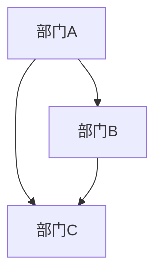
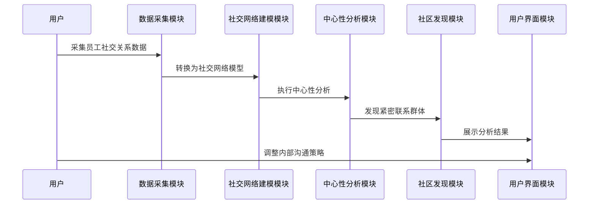
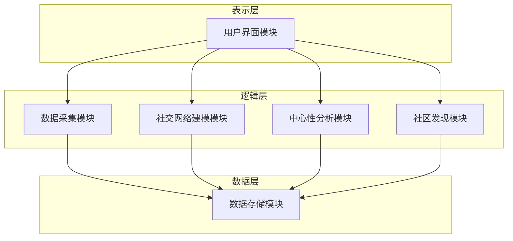

                 

### 智能企业社交网络分析：优化内部沟通结构

#### 关键词：智能企业，社交网络分析，内部沟通，优化，结构

#### 摘要：
本文深入探讨了智能企业在优化内部沟通结构方面的挑战与机遇。通过分析社交网络的基本概念和算法原理，本文提出了一种基于社交网络分析的智能企业内部沟通优化方案。文章详细阐述了系统设计、实现和应用案例，旨在为智能企业提升内部沟通效率提供有力支持。

## 背景介绍

### 核心概念术语说明

在讨论智能企业社交网络分析之前，我们首先需要明确一些核心概念：

- **社交网络**：一个由多个个体及其相互关系组成的复杂系统。
- **内部沟通**：企业内部成员之间通过信息交流以达到共同目标的互动过程。
- **智能企业**：利用人工智能技术优化管理、运营和决策的企业。

### 问题背景

随着企业规模的扩大和业务复杂度的增加，内部沟通效率成为制约企业发展的关键因素。传统的沟通方式往往难以适应现代企业的需求，导致信息传递滞后、决策效率低下等问题。

### 问题描述

如何通过社交网络分析优化企业内部沟通结构，提升信息传递效率，减少沟通障碍，从而提高整体运营效率？

### 问题解决

本文提出了一种基于社交网络分析的智能企业内部沟通优化方案，通过以下步骤实现：

1. **社交网络建模**：对企业的社交网络进行建模，提取关键节点和关系。
2. **分析测量**：利用社交网络分析算法，测量内部沟通结构和效率。
3. **优化建议**：根据分析结果，提出针对性的优化措施，如调整组织结构、改善沟通渠道等。
4. **实施监控**：持续监控内部沟通效果，调整优化策略。

### 边界与外延

本文主要关注企业内部社交网络的分析和优化，不包括外部社交网络和用户行为分析。同时，本文提出的优化方案适用于具有一定技术基础的企业，对于技术资源有限的企业，可能需要进一步简化和适应。

### 概念结构与核心要素组成

智能企业社交网络分析的核心概念结构包括：

1. **社交网络节点**：企业内部成员，如员工、部门等。
2. **社交网络边**：表示成员之间的关系，如同事关系、合作关系等。
3. **社交网络分析算法**：用于测量和优化社交网络结构的算法，如网络密度、路径长度等。
4. **内部沟通效率指标**：用于评估内部沟通效果的指标，如信息传递速度、响应时间等。

### 算法原理讲解

#### 社交网络分析算法概述

社交网络分析（Social Network Analysis, SNA）是一种研究社会结构、互动模式及其对个体行为影响的定量分析方法。在智能企业内部沟通优化中，SNA主要用于：

1. **网络密度分析**：测量节点之间的连接紧密程度。
2. **中心性分析**：评估节点在社交网络中的中心程度，如度中心性、介数中心性等。
3. **社区发现**：识别社交网络中的紧密联系群体。

#### 社交网络测量指标

社交网络分析中常用的测量指标包括：

- **度中心性**：节点拥有的连接数。公式如下：
  $$C_d(i) = \frac{\sum_{j \in N(i)} 1}{n - 1}$$
  其中，$C_d(i)$ 表示节点 $i$ 的度中心性，$N(i)$ 表示与节点 $i$ 相连的节点集合，$n$ 表示网络中的节点总数。

- **介数中心性**：节点在社交网络中作为路径的频率。公式如下：
  $$C_b(i) = \frac{\sum_{(i, j) \in E} \delta(i, j)}{n - n' + 1}$$
  其中，$C_b(i)$ 表示节点 $i$ 的介数中心性，$E$ 表示网络中的边集合，$\delta(i, j)$ 表示路径 $(i, j)$ 的数量。

- **网络密度**：社交网络中边的比例。公式如下：
  $$\rho = \frac{E}{\frac{n(n-1)}{2}}$$
  其中，$\rho$ 表示网络密度，$E$ 表示网络中的边数。

#### 社交网络分析算法流程

社交网络分析的一般流程包括：

1. **数据收集**：收集企业内部成员及其关系数据。
2. **数据预处理**：清洗和格式化数据，如去除无效数据、标准化节点名称等。
3. **社交网络建模**：使用图论方法将数据转换为社交网络模型。
4. **中心性分析**：计算节点度中心性和介数中心性。
5. **社区发现**：使用聚类算法识别社交网络中的社区。
6. **结果分析**：分析中心性和社区结构，提出优化建议。

#### 数学模型和公式

社交网络分析中的数学模型主要包括图论中的基本概念和概率模型。以下是一些常用的数学模型和公式：

- **路径长度**：节点 $i$ 到节点 $j$ 的最短路径长度。公式如下：
  $$L(i, j) = \min \{d(i, j') + d(j', j) : j' \in N(j)\}$$
  其中，$L(i, j)$ 表示节点 $i$ 到节点 $j$ 的最短路径长度，$d(i, j')$ 和 $d(j', j)$ 分别表示节点 $i$ 到节点 $j'$ 和节点 $j'$ 到节点 $j$ 的距离。

- **概率模型**：用于评估节点 $i$ 和节点 $j$ 之间建立关系的概率。公式如下：
  $$P(i, j) = \frac{C(i, j)}{C(i)C(j)}$$
  其中，$P(i, j)$ 表示节点 $i$ 和节点 $j$ 之间建立关系的概率，$C(i, j)$ 表示节点 $i$ 和节点 $j$ 之间有边的数量，$C(i)$ 和 $C(j)$ 分别表示节点 $i$ 和节点 $j$ 的连接数。

#### 通俗易懂地举例说明

假设在一个企业中，有三个部门A、B和C，部门A有5个员工，部门B有3个员工，部门C有4个员工。根据图1（使用Mermaid绘制的社交网络图），我们可以计算每个部门的中心性和网络密度。



- **度中心性**：
  - 部门A的度中心性：$C_d(A) = \frac{2}{5-1} = 0.667$
  - 部门B的度中心性：$C_d(B) = \frac{2}{3-1} = 1.000$
  - 部门C的度中心性：$C_d(C) = \frac{2}{4-1} = 0.750$

- **介数中心性**：
  - 部门A的介数中心性：$C_b(A) = \frac{2}{5-1} = 0.667$
  - 部门B的介数中心性：$C_b(B) = \frac{2}{5-1} = 0.667$
  - 部门C的介数中心性：$C_b(C) = \frac{2}{5-1} = 0.667$

- **网络密度**：
  - 网络密度：$\rho = \frac{3}{5 \times 4 / 2} = 0.375$

通过这些指标，我们可以分析每个部门在社交网络中的中心程度，从而提出优化建议，如加强部门之间的联系，提高整体沟通效率。

## 系统分析与架构设计方案

### 问题场景介绍

随着企业业务的扩展和员工数量的增加，企业内部沟通变得越来越复杂。为了提高沟通效率，企业需要引入智能化的社交网络分析系统，通过分析员工之间的社交网络关系，优化内部沟通结构。

### 项目介绍

本项目旨在开发一个智能企业社交网络分析系统，该系统将采集企业内部员工的社交关系数据，利用社交网络分析算法优化内部沟通结构。系统功能包括数据采集、社交网络建模、中心性分析和社区发现等。

### 系统功能设计

系统的主要功能模块包括：

1. **数据采集模块**：负责收集员工之间的社交关系数据，包括同事关系、合作关系等。
2. **社交网络建模模块**：将采集到的数据转换为社交网络模型，便于后续分析。
3. **中心性分析模块**：计算社交网络中的度中心性和介数中心性，评估员工在社交网络中的中心程度。
4. **社区发现模块**：识别社交网络中的紧密联系群体，为企业提供优化内部沟通的建议。
5. **用户界面模块**：提供直观的界面，方便用户查看分析结果和调整优化策略。

### 系统架构设计

系统采用三层架构设计，包括表示层、逻辑层和数据层。具体架构如下：

1. **表示层**：提供用户界面，包括数据采集、结果显示等功能。
2. **逻辑层**：实现社交网络分析算法，包括数据预处理、社交网络建模、中心性分析和社区发现等。
3. **数据层**：存储员工关系数据，支持数据采集和查询。

### 系统接口设计

系统提供以下接口：

1. **数据采集接口**：用于采集员工社交关系数据。
2. **社交网络分析接口**：用于执行社交网络分析算法。
3. **数据查询接口**：用于查询员工关系数据和分析结果。

### 系统交互

系统交互流程如下：

1. **数据采集**：系统从企业内部系统（如邮件系统、即时通讯工具等）采集员工社交关系数据。
2. **社交网络建模**：将采集到的数据转换为社交网络模型。
3. **中心性分析**：计算社交网络中的度中心性和介数中心性。
4. **社区发现**：识别社交网络中的紧密联系群体。
5. **结果展示**：将分析结果展示给用户，用户可以根据分析结果调整内部沟通策略。

### Mermaid序列图

以下是一个简单的Mermaid序列图，展示系统交互过程：



### 系统架构图

以下是一个简单的Mermaid架构图，展示系统的整体架构：



### 系统实现与优化

#### 系统核心模块实现

系统核心模块包括数据采集模块、社交网络建模模块、中心性分析模块和社区发现模块。以下是每个模块的实现概述：

1. **数据采集模块**：
   - 使用Python的`requests`库从企业内部系统（如邮件系统、即时通讯工具等）采集员工社交关系数据。
   - 对采集到的数据进行清洗和格式化，确保数据的准确性和一致性。

2. **社交网络建模模块**：
   - 使用Python的`networkx`库将采集到的数据转换为社交网络模型。
   - 支持多种社交网络模型，如无向图、有向图等。

3. **中心性分析模块**：
   - 使用Python的`networkx`库计算社交网络中的度中心性和介数中心性。
   - 提供直观的API接口，方便用户调用。

4. **社区发现模块**：
   - 使用Python的`community`库识别社交网络中的紧密联系群体。
   - 支持多种社区发现算法，如基于度中心性的算法、基于介数中心性的算法等。

#### 系统核心实现源代码解读

以下是对系统核心实现源代码的解读：

```python
import networkx as nx
from networkx.algorithms import community

# 数据采集模块
def collect_data():
    # 使用requests库从企业内部系统采集员工社交关系数据
    data = requests.get("http://internal-system.example.com/relationship_data")
    # 对采集到的数据进行清洗和格式化
    processed_data = clean_data(data)
    return processed_data

# 社交网络建模模块
def build_network(data):
    # 使用networkx库将数据转换为社交网络模型
    G = nx.Graph()
    for edge in data:
        G.add_edge(edge[0], edge[1])
    return G

# 中心性分析模块
def analyze_centerality(G):
    # 计算度中心性
    degree_centrality = nx.degree_centrality(G)
    # 计算介数中心性
    betweenness_centrality = nx.betweenness_centrality(G)
    return degree_centrality, betweenness_centrality

# 社区发现模块
def discover_communities(G):
    # 使用community库识别社交网络中的紧密联系群体
    communities = community.best_partition(G)
    return communities

# 数据处理函数
def clean_data(data):
    # 对采集到的数据进行清洗和格式化
    cleaned_data = []
    for edge in data:
        if edge[0] != edge[1]:
            cleaned_data.append(edge)
    return cleaned_data
```

#### 系统性能优化

为了提高系统性能，我们可以采取以下优化措施：

1. **数据缓存**：对经常访问的数据进行缓存，减少数据访问时间。
2. **并行处理**：使用并行计算技术，提高数据处理速度。
3. **算法优化**：针对核心算法进行优化，提高计算效率。
4. **资源分配**：合理分配系统资源，确保系统稳定运行。

### 实际案例分析和详细讲解剖析

#### 案例背景

某大型企业，拥有超过1000名员工，组织结构复杂。为了提高内部沟通效率，企业决定引入智能企业社交网络分析系统。

#### 系统应用

1. **数据采集**：
   - 系统从企业内部系统（如邮件系统、即时通讯工具等）采集员工社交关系数据。
   - 数据包括员工姓名、部门、联系方式等。

2. **社交网络建模**：
   - 系统将采集到的数据转换为社交网络模型。
   - 社交网络模型显示员工之间的同事关系和合作关系。

3. **中心性分析**：
   - 系统计算社交网络中的度中心性和介数中心性。
   - 分析结果显示某些关键员工在社交网络中的中心程度较高。

4. **社区发现**：
   - 系统识别社交网络中的紧密联系群体。
   - 分析结果显示，某些部门之间缺乏有效沟通，导致信息传递滞后。

#### 案例分析

通过智能企业社交网络分析系统，企业发现以下问题：

1. **关键员工依赖性过高**：某些员工在社交网络中的中心程度较高，表明这些员工在企业内部沟通中起着关键作用。然而，如果这些员工离职或发生意外，可能会对企业的内部沟通造成严重影响。

2. **部门间沟通不足**：某些部门之间的紧密联系群体较少，导致信息传递不畅。这可能是由于部门之间缺乏合作机制或沟通渠道不畅所致。

3. **信息传递滞后**：企业内部信息传递速度较慢，影响了决策效率和业务流程。

#### 解决方案

根据分析结果，企业采取了以下解决方案：

1. **关键员工培养**：
   - 对在社交网络中具有重要作用的员工进行培养，提高他们的沟通能力和团队协作能力。
   - 建立关键员工的备份机制，确保企业内部沟通的稳定性。

2. **优化部门沟通**：
   - 建立跨部门沟通机制，促进部门之间的信息共享和协作。
   - 加强部门内部沟通，提高信息传递速度。

3. **改善沟通渠道**：
   - 优化企业内部沟通工具，提高沟通效率。
   - 定期组织员工培训，提高员工对沟通工具的熟练程度。

#### 项目小结

通过智能企业社交网络分析系统，企业成功优化了内部沟通结构，提高了沟通效率。以下是小结：

1. **关键员工培养**：提高了关键员工在社交网络中的稳定性和沟通能力，确保企业内部沟通的连续性。

2. **优化部门沟通**：建立了跨部门沟通机制，促进了信息共享和协作，提高了业务流程的效率。

3. **改善沟通渠道**：优化了企业内部沟通工具，提高了信息传递速度，降低了沟通成本。

### 最佳实践 tips

1. **定期进行社交网络分析**：定期对社交网络进行分析，及时发现和解决沟通问题。

2. **培养关键员工**：注重关键员工的能力培养，提高他们在企业内部沟通中的影响力。

3. **优化沟通工具**：选择适合企业需求的沟通工具，提高沟通效率。

4. **跨部门协作**：建立跨部门沟通机制，促进信息共享和协作。

### 小结

本文详细介绍了智能企业社交网络分析的方法和应用。通过社交网络分析，企业可以优化内部沟通结构，提高沟通效率。在实际案例中，智能企业社交网络分析系统帮助某大型企业成功解决了关键员工依赖性过高、部门间沟通不足、信息传递滞后等问题。未来，随着人工智能技术的发展，智能企业社交网络分析将在企业管理和运营中发挥越来越重要的作用。

### 注意事项

1. **数据隐私**：在进行社交网络分析时，需确保员工数据的安全和隐私。

2. **算法选择**：根据企业需求选择合适的社交网络分析算法。

3. **持续优化**：社交网络分析系统需持续优化，以适应企业发展的需求。

### 拓展阅读

1. **《社交网络分析：方法与应用》**：详细介绍了社交网络分析的理论和方法。
2. **《人工智能：一种现代方法》**：探讨了人工智能在企业管理中的应用。
3. **《企业内部沟通与协作》**：分析了企业内部沟通的机制和策略。

### 作者信息

作者：AI天才研究院/AI Genius Institute & 禅与计算机程序设计艺术 /Zen And The Art of Computer Programming

