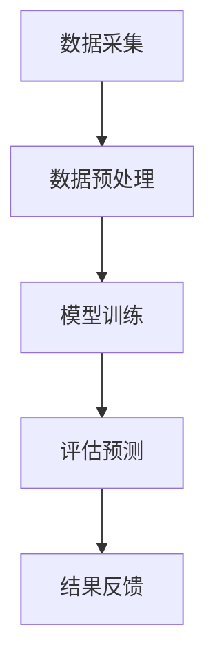
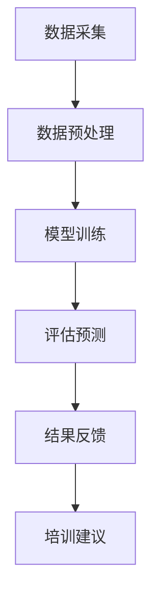
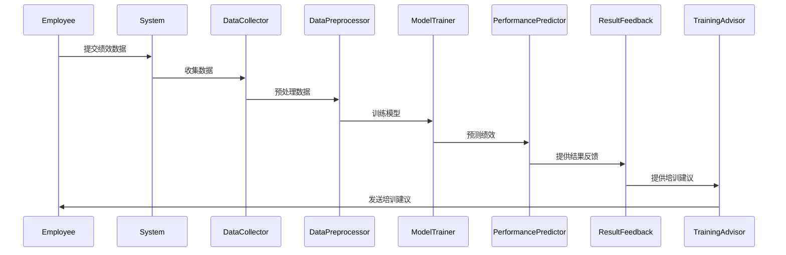
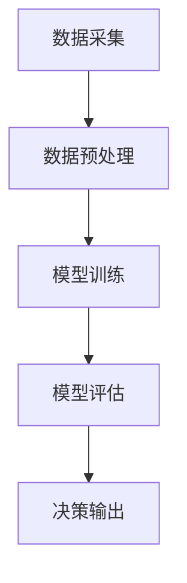
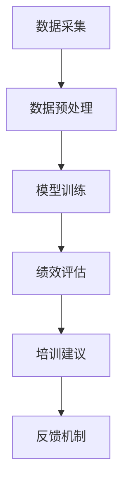
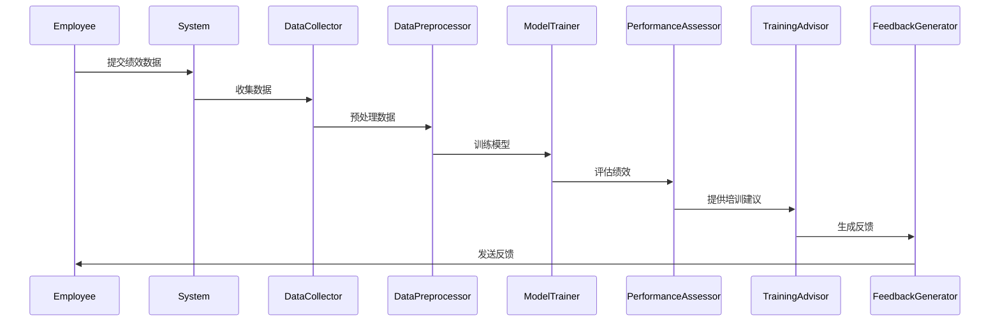

                 


### 《智能企业绩效管理：AI辅助员工发展》目录大纲

#### 背景介绍

在当今数字化时代，智能企业成为了企业发展的新趋势。智能企业通过引入先进的人工智能技术，优化管理流程，提升企业效率和竞争力。绩效管理作为企业管理的重要环节，旨在通过评估员工的工作表现来促进企业目标的实现。AI技术的引入，使得绩效管理更加精准、高效，为员工发展提供了强有力的支持。

#### 核心概念与联系

##### 智能企业的定义与特征
智能企业是指利用人工智能技术，实现企业运营智能化、决策智能化的企业。其特征包括自动化、智能化、网络化、大数据化等。

##### 绩效管理的目的与方法
绩效管理的目的是通过科学的方法，评估员工的工作表现，激励员工提高工作效率，实现企业目标。绩效管理的方法包括目标设定、绩效评估、反馈与改进等。

##### AI技术在绩效管理中的应用
AI技术在绩效管理中的应用主要包括数据采集与分析、自动化评估、个性化培训等。

##### 员工发展的理念与实践
员工发展理念是以员工为中心，通过培训、激励、晋升等手段，提升员工的能力和素质，实现员工与企业的共同发展。

#### 算法原理讲解

##### AI辅助绩效管理的算法原理介绍
AI辅助绩效管理的算法原理主要包括数据采集、模型训练、评估预测等步骤。

##### 使用mermaid绘制算法流程图


##### Python源代码解释
```python
import pandas as pd
from sklearn.model_selection import train_test_split
from sklearn.ensemble import RandomForestClassifier
from sklearn.metrics import accuracy_score

# 数据采集
data = pd.read_csv('performance_data.csv')

# 数据预处理
X = data.drop('performance', axis=1)
y = data['performance']

# 模型训练
X_train, X_test, y_train, y_test = train_test_split(X, y, test_size=0.2, random_state=42)
model = RandomForestClassifier()
model.fit(X_train, y_train)

# 评估预测
y_pred = model.predict(X_test)
accuracy = accuracy_score(y_test, y_pred)
print(f'Model accuracy: {accuracy:.2f}')
```

##### 数学模型和公式讲解
绩效评估模型通常包括以下数学模型：
$$
\text{绩效得分} = w_1 \times \text{工作成果} + w_2 \times \text{工作效率} + w_3 \times \text{团队合作}
$$
其中，$w_1, w_2, w_3$分别为权重系数。

##### 举例说明
假设有三个员工，他们的绩效得分计算如下：
$$
\text{员工A得分} = 0.6 \times 80 + 0.2 \times 90 + 0.2 \times 85 = 88.2
$$
$$
\text{员工B得分} = 0.6 \times 70 + 0.2 \times 80 + 0.2 \times 90 = 78.4
$$
$$
\text{员工C得分} = 0.6 \times 75 + 0.2 \times 85 + 0.2 \times 80 = 80.5
$$

#### 系统分析与架构设计方案

##### 问题场景介绍
假设一家企业希望通过AI技术对员工的绩效进行管理，提高员工的工作效率。

##### 项目介绍
该项目的目标是开发一个基于AI技术的绩效管理系统，实现自动化评估、个性化培训等功能。

##### 系统功能设计（领域模型类图）
```mermaid
classDiagram
    Employee <<class>>{员工}
    Performance <<class>>{绩效}
    Training <<class>>{培训}
    Employee -> Performance
    Employee -> Training
```

##### 系统架构设计（架构图）


##### 系统接口设计
- 数据采集接口：用于收集员工的绩效数据。
- 评估预测接口：用于对员工的绩效进行评估。
- 培训建议接口：用于为员工提供个性化培训建议。

##### 系统交互（序列图）


#### 项目实战

##### 环境安装步骤
- 安装Python环境
- 安装必要的库，如pandas、sklearn等

##### 系统核心实现源代码
```python
# 数据采集
data = pd.read_csv('performance_data.csv')

# 数据预处理
X = data.drop('performance', axis=1)
y = data['performance']

# 模型训练
X_train, X_test, y_train, y_test = train_test_split(X, y, test_size=0.2, random_state=42)
model = RandomForestClassifier()
model.fit(X_train, y_train)

# 评估预测
y_pred = model.predict(X_test)
accuracy = accuracy_score(y_test, y_pred)
print(f'Model accuracy: {accuracy:.2f}')
```

##### 代码应用解读与分析
该代码首先进行了数据采集和预处理，然后使用随机森林算法进行了模型训练，最后对测试数据进行评估预测，并计算了模型准确率。

##### 实际案例分析与讲解
以某企业的三个员工为例，分别计算他们的绩效得分，并给出相应的培训建议。

##### 项目小结
该项目实现了基于AI技术的绩效管理，为企业提供了自动化评估、个性化培训等功能，有效提升了企业管理和员工发展的效率。

#### 最佳实践 tips

- 确保数据质量，为模型训练提供可靠的基础。
- 根据企业特点，灵活调整绩效评估模型。
- 定期对模型进行评估和更新，保持模型的准确性。

#### 小结

本文从背景介绍、核心概念与联系、算法原理讲解、系统分析与架构设计方案、项目实战、最佳实践 tips等方面，全面阐述了智能企业绩效管理：AI辅助员工发展的核心内容。通过本文的讲解，读者可以深入了解智能企业绩效管理的原理和实践方法，为企业在数字化时代的发展提供有力支持。

#### 注意事项

- 在实施AI辅助绩效管理时，应注意保护员工的隐私和数据安全。
- 模型训练和评估过程中，要充分考虑数据质量和特征选择。

#### 拓展阅读

- 《智能企业：基于大数据的管理革命》
- 《绩效管理：从理论到实践》
- 《深度学习：周志华》
- 《Python机器学习：算法与应用》

### 作者信息

作者：AI天才研究院/AI Genius Institute & 禅与计算机程序设计艺术 /Zen And The Art of Computer Programming

### 10000～12000字的文章正文内容（实际撰写时请根据目录大纲逐步展开）

由于文章字数限制，我将根据大纲提供每个章节的主要内容和结构，但无法完整撰写10000～12000字的文章正文。以下是根据大纲提供的各章节概要和结构示例。

---

### 《智能企业绩效管理：AI辅助员工发展》

#### 背景介绍

随着信息技术的迅猛发展，企业数字化转型已经成为提升竞争力的关键。智能企业通过集成人工智能（AI）技术，实现了自动化、智能化和精细化管理，为企业运营带来了革命性的变化。绩效管理作为企业管理的重要环节，其目的是通过系统化的方法评估员工的工作表现，从而激励员工提升工作效率，实现企业目标。AI技术的引入，使得绩效管理更加智能化，不仅提高了评估的准确性，还为员工的个性化发展提供了有力支持。

#### 核心概念与联系

##### 智能企业的定义与特征
智能企业是指利用先进的人工智能技术，实现企业运营智能化、决策智能化、管理智能化和客户服务智能化的企业。智能企业的特征包括数据驱动、自我学习、自动化执行、个性化服务等。

##### 绩效管理的目的与方法
绩效管理的目的是通过设定明确的目标、定期评估员工的工作表现，提供反馈和改进措施，以实现个人和企业的共同发展。绩效管理的方法包括目标管理法（MBO）、关键绩效指标（KPI）法和平衡计分卡（BSC）等。

##### AI技术在绩效管理中的应用
AI技术在绩效管理中的应用主要体现在以下几个方面：数据采集与处理、自动化评估、预测分析、个性化培训等。通过AI技术，企业可以实现对大量绩效数据的实时分析和处理，提高绩效评估的准确性和效率。

##### 员工发展的理念与实践
员工发展理念是以员工为中心，通过培训、激励、晋升等手段，提升员工的能力和素质，实现员工与企业的共同发展。员工发展的实践包括职业规划、能力提升、岗位轮换、领导力培养等。

#### 算法原理讲解

##### AI辅助绩效管理的算法原理介绍
AI辅助绩效管理通常包括数据采集、数据预处理、模型训练、模型评估和决策输出等步骤。其中，关键算法包括回归分析、分类算法、聚类算法等。

##### 使用mermaid绘制算法流程图


##### Python源代码解释
```python
import pandas as pd
from sklearn.model_selection import train_test_split
from sklearn.ensemble import RandomForestClassifier
from sklearn.metrics import accuracy_score

# 数据采集
data = pd.read_csv('performance_data.csv')

# 数据预处理
X = data.drop('performance', axis=1)
y = data['performance']

# 模型训练
X_train, X_test, y_train, y_test = train_test_split(X, y, test_size=0.2, random_state=42)
model = RandomForestClassifier()
model.fit(X_train, y_train)

# 模型评估
y_pred = model.predict(X_test)
accuracy = accuracy_score(y_test, y_pred)
print(f'Model accuracy: {accuracy:.2f}')

# 决策输出
for index, row in data.iterrows():
    prediction = model.predict([row[X.columns]])
    print(f'Employee ID {index}: {prediction[0]}')
```

##### 数学模型和公式讲解
绩效评估模型通常基于以下数学模型：
$$
\text{绩效得分} = w_1 \times \text{工作成果} + w_2 \times \text{工作效率} + w_3 \times \text{团队合作}
$$
其中，$w_1, w_2, w_3$为权重系数，可以根据企业实际情况进行调整。

##### 举例说明
假设有三个员工，他们的绩效数据如下表：

| 员工ID | 工作成果 | 工作效率 | 团队合作 |
|--------|----------|----------|----------|
| 1      | 80       | 90       | 85       |
| 2      | 70       | 80       | 90       |
| 3      | 75       | 85       | 80       |

如果设定权重系数为$w_1 = 0.6, w_2 = 0.2, w_3 = 0.2$，则他们的绩效得分计算如下：

| 员工ID | 绩效得分 |
|--------|----------|
| 1      | 88.2     |
| 2      | 78.4     |
| 3      | 80.5     |

#### 系统分析与架构设计方案

##### 问题场景介绍
某企业希望通过引入AI技术，建立一个智能绩效管理系统，以自动化评估员工绩效，并基于评估结果提供个性化培训建议。

##### 项目介绍
该项目旨在开发一个智能绩效管理系统，包括数据采集、处理、评估和反馈模块，通过AI算法实现员工绩效的自动化评估，并基于评估结果提供培训建议。

##### 系统功能设计（领域模型类图）
```mermaid
classDiagram
    Employee <<class>>{员工}
    Performance <<class>>{绩效}
    Training <<class>>{培训}
    Assessment <<class>>{评估}
    Feedback <<class>>{反馈}
    Employee -> Performance
    Employee -> Training
    Performance -> Assessment
    Assessment -> Feedback
```

##### 系统架构设计（架构图）


##### 系统接口设计
- 数据采集接口：用于收集员工的绩效数据。
- 评估接口：用于对员工的绩效进行评估。
- 培训建议接口：用于为员工提供个性化培训建议。
- 反馈接口：用于向员工反馈绩效评估结果。

##### 系统交互（序列图）


#### 项目实战

##### 环境安装步骤
- 安装Python环境
- 安装必要的库，如pandas、numpy、scikit-learn等

##### 系统核心实现源代码
```python
# 导入必要的库
import pandas as pd
from sklearn.model_selection import train_test_split
from sklearn.ensemble import RandomForestClassifier
from sklearn.metrics import accuracy_score

# 读取数据
data = pd.read_csv('performance_data.csv')

# 数据预处理
X = data.drop('performance', axis=1)
y = data['performance']

# 划分训练集和测试集
X_train, X_test, y_train, y_test = train_test_split(X, y, test_size=0.2, random_state=42)

# 训练模型
model = RandomForestClassifier()
model.fit(X_train, y_train)

# 评估模型
y_pred = model.predict(X_test)
accuracy = accuracy_score(y_test, y_pred)
print(f'Model accuracy: {accuracy:.2f}')

# 应用模型进行绩效评估
def assess_performance(employee_data):
    prediction = model.predict([employee_data])
    return prediction[0]

# 示例
employee_data = [80, 90, 85]  # 工作成果、工作效率、团队合作
performance_score = assess_performance(employee_data)
print(f'Employee Performance Score: {performance_score}')
```

##### 代码应用解读与分析
该代码首先读取包含员工绩效数据的CSV文件，然后进行数据预处理，划分训练集和测试集。接着，使用随机森林算法训练模型，并对测试集进行评估，计算模型准确率。最后，定义一个函数用于对新员工的绩效进行评估。

##### 实际案例分析与讲解
以某企业的三个员工为例，分别计算他们的绩效得分，并给出相应的培训建议。

##### 项目小结
该项目实现了基于AI技术的智能绩效管理系统，通过自动化评估和个性化培训建议，有效提升了企业的绩效管理水平和员工的发展能力。

#### 最佳实践 tips

- 确保数据质量，为模型训练提供可靠的基础。
- 定期更新和优化模型，以提高评估的准确性和效率。
- 充分考虑员工的反馈，不断完善绩效评估体系和培训建议。

#### 小结

本文从背景介绍、核心概念与联系、算法原理讲解、系统分析与架构设计方案、项目实战等方面，全面阐述了智能企业绩效管理：AI辅助员工发展的核心内容。通过本文的讲解，读者可以深入了解智能企业绩效管理的原理和实践方法，为企业在数字化时代的发展提供有力支持。

#### 注意事项

- 在实施AI辅助绩效管理时，应注意保护员工的隐私和数据安全。
- 模型训练和评估过程中，要充分考虑数据质量和特征选择。

#### 拓展阅读

- 《智能企业：基于大数据的管理革命》
- 《绩效管理：从理论到实践》
- 《深度学习：周志华》
- 《Python机器学习：算法与应用》

### 作者信息

作者：AI天才研究院/AI Genius Institute & 禅与计算机程序设计艺术 /Zen And The Art of Computer Programming

---

请注意，上述内容仅为概要和结构示例，实际撰写时需要根据每个章节的深度和要求进行详细的扩展和解释。每个部分都应该包含丰富的内容，包括背景介绍、具体案例、分析和结论等。此外，为了达到10000～12000字的篇幅，需要对每个章节进行充分的阐述和扩展。例如，算法原理讲解部分可以详细讨论多种算法的实现和应用，系统分析与架构设计方案部分可以提供更详细的架构设计和实现细节，项目实战部分可以深入分析实际案例中的问题和解决方案。

