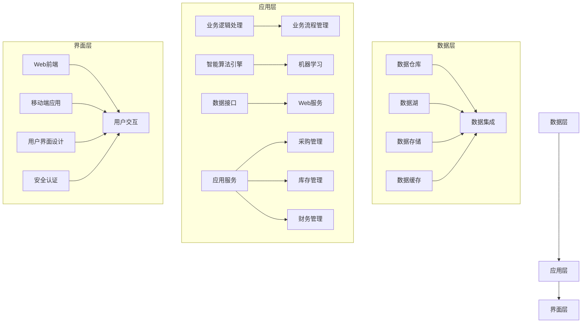

                 

### 概述

### 智能企业资源规划：AI重塑ERP系统

> 关键词：智能企业资源规划、ERP系统、人工智能、AI重塑、ERP系统架构、项目实战、案例研究、最佳实践

随着人工智能（AI）技术的迅速发展，其在各领域的应用已逐渐深入，为企业带来了前所未有的变革。企业资源规划（ERP）系统作为企业管理的重要工具，也在人工智能的推动下迎来了新的发展阶段。本文将围绕智能企业资源规划（ERP）这一核心概念，探讨人工智能（AI）如何对ERP系统进行重塑。

ERP系统是企业管理和运营的核心系统，通过整合企业的各项业务流程和资源，实现对业务的全面控制和优化。然而，传统的ERP系统在数据处理、业务预测、智能决策等方面存在一定的局限性。随着AI技术的应用，ERP系统正在逐步向智能化、自动化和高效化方向发展。

本文旨在为读者提供一篇全面、系统的智能企业资源规划（ERP）与人工智能（AI）融合的技术博客文章。文章将分为八个主要章节：

**第1章：背景介绍**  
介绍ERP系统和人工智能的基本概念，阐述AI重塑ERP系统的意义和挑战。

**第2章：核心概念与联系**  
详细讲解智能企业资源规划（ERP）和人工智能（AI）的核心概念，分析两者之间的联系。

**第3章：AI在ERP中的应用**  
探讨AI在ERP系统中的具体应用场景，包括智能采购、智能生产、智能财务和人力资源等方面。

**第4章：AI ERP系统架构设计**  
介绍AI ERP系统的架构设计，包括数据层、应用层和界面层。

**第5章：项目实战**  
通过一个实际项目案例，讲解AI ERP系统的实现过程，包括环境安装、系统核心实现和代码应用解读与分析。

**第6章：案例研究**  
分析三个实际案例，探讨AI ERP系统在不同业务场景中的应用效果。

**第7章：最佳实践与拓展**  
总结AI ERP系统的最佳实践，探讨注意事项和挑战，并给出拓展阅读和研究方向。

**第8章：总结与展望**  
对全文进行总结，展望AI重塑ERP系统的未来发展趋势。

通过以上章节的设计，我们希望能够为读者提供一个全面、系统的智能企业资源规划（ERP）与人工智能（AI）融合的概述，帮助读者深入理解AI对ERP系统的重塑过程，以及如何在实践中应用这些技术。

### 目录大纲设计思路

为了确保文章的逻辑性和条理性，本文将分为八个主要章节，每个章节都将围绕智能企业资源规划（ERP）与人工智能（AI）的融合进行深入探讨。以下是具体的目录大纲设计思路：

**第1章：背景介绍**  
本章节将介绍ERP系统和人工智能的基本概念，阐述AI重塑ERP系统的意义和挑战。通过这一章节，读者可以初步了解ERP系统和人工智能的核心概念，以及两者融合的重要性。

**第2章：核心概念与联系**  
本章节将详细讲解智能企业资源规划（ERP）和人工智能（AI）的核心概念，分析两者之间的联系。通过这一章节，读者可以深入理解ERP和AI在业务和技术层面的融合点。

**第3章：AI在ERP中的应用**  
本章节将探讨AI在ERP系统中的具体应用场景，包括智能采购、智能生产、智能财务和人力资源等方面。通过这一章节，读者可以了解AI在ERP系统中的实际应用效果和优势。

**第4章：AI ERP系统架构设计**  
本章节将介绍AI ERP系统的架构设计，包括数据层、应用层和界面层。通过这一章节，读者可以了解AI ERP系统的整体架构和功能模块，以及各模块之间的关联和协同作用。

**第5章：项目实战**  
本章节将通过一个实际项目案例，讲解AI ERP系统的实现过程，包括环境安装、系统核心实现和代码应用解读与分析。通过这一章节，读者可以了解AI ERP系统的实际应用过程和关键技术。

**第6章：案例研究**  
本章节将分析三个实际案例，探讨AI ERP系统在不同业务场景中的应用效果。通过这一章节，读者可以了解AI ERP系统在不同业务领域的实际应用情况，以及取得的成果和挑战。

**第7章：最佳实践与拓展**  
本章节将总结AI ERP系统的最佳实践，探讨注意事项和挑战，并给出拓展阅读和研究方向。通过这一章节，读者可以了解AI ERP系统的实施要点和未来发展趋势。

**第8章：总结与展望**  
本章节将对全文进行总结，展望AI重塑ERP系统的未来发展趋势。通过这一章节，读者可以了解AI重塑ERP系统的现状和未来发展方向，为实际应用提供参考。

通过以上章节的设计，我们希望能够为读者提供一个全面、系统的智能企业资源规划（ERP）与人工智能（AI）融合的概述，帮助读者深入理解AI对ERP系统的重塑过程，以及如何在实践中应用这些技术。

### 目录大纲示例

```markdown
# 《智能企业资源规划：AI重塑ERP系统》目录大纲

## 第1章：背景介绍
### 1.1 问题背景
### 1.2 人工智能的崛起与影响
### 1.3 AI重塑ERP系统的意义与挑战

## 第2章：核心概念与联系
### 2.1 智能企业资源规划（ERP）概念解析
### 2.2 AI与ERP的融合：核心概念与联系
### 2.3 AI ERP的关键技术解析

## 第3章：AI在ERP中的应用
### 3.1 AI在ERP系统中的应用场景
### 3.2 智能采购与供应链管理
### 3.3 智能生产与运营优化
### 3.4 智能财务与人力资源

## 第4章：AI ERP系统架构设计
### 4.1 AI ERP系统架构概述
### 4.2 数据层设计
### 4.3 应用层设计
### 4.4 界面层设计

## 第5章：项目实战
### 5.1 项目介绍
### 5.2 系统核心实现
### 5.3 代码应用解读与分析
### 5.4 实际案例分析与详细讲解

## 第6章：案例研究
### 6.1 案例一：智能采购系统
### 6.2 案例二：智能生产系统
### 6.3 案例三：智能财务系统

## 第7章：最佳实践与拓展
### 7.1 AI ERP系统的最佳实践
### 7.2 注意事项与挑战
### 7.3 拓展阅读与研究方向

## 第8章：总结与展望
### 8.1 本书总结
### 8.2 AI重塑ERP系统的未来发展趋势
### 8.3 对读者的建议与展望
```

通过以上章节的设计，我们希望能够为读者提供一个全面、系统的智能企业资源规划（ERP）与人工智能（AI）融合的概述，帮助读者深入理解AI对ERP系统的重塑过程，以及如何在实践中应用这些技术。接下来，我们将根据这个框架，进一步细化每个章节的具体内容，确保本书的完整性和实用性。

### 第1章：背景介绍

#### 1.1 问题背景

企业资源规划（ERP）系统作为企业管理的重要工具，自上世纪90年代兴起以来，已经在全球范围内得到广泛应用。ERP系统通过整合企业的各项业务流程和资源，实现对业务的全面控制和优化，从而提高企业的运营效率和竞争力。然而，随着市场的不断变化和企业规模的扩大，传统的ERP系统逐渐暴露出一些问题：

1. **数据孤岛问题**：传统的ERP系统通常由多个模块组成，各模块之间数据交互不畅，导致数据孤岛现象严重。这既增加了企业的管理成本，又降低了数据的利用率。

2. **人工干预多**：传统ERP系统在数据处理、业务预测和智能决策等方面依赖于人工干预，导致工作效率低下，且容易出现人为错误。

3. **业务响应速度慢**：传统ERP系统在处理大量数据时，响应速度较慢，无法及时为企业提供决策支持。

4. **系统扩展性差**：传统ERP系统在应对企业规模和业务模式变化时，扩展性较差，难以满足企业的长期发展需求。

为解决这些问题，人工智能（AI）技术的引入成为了一种可能的解决方案。AI具有强大的数据处理、预测分析和智能决策能力，能够帮助企业打破传统ERP系统的局限，实现更高水平的运营效率和管理优化。

#### 1.2 人工智能的崛起与影响

人工智能（AI）作为计算机科学的一个重要分支，其核心目标是使计算机具备人类智能的某些特征，如学习、推理、感知和决策等。随着深度学习、自然语言处理、计算机视觉等技术的快速发展，人工智能已经从理论研究走向了实际应用，并在各个领域取得了显著的成果。

1. **数据处理能力提升**：人工智能能够快速处理海量数据，从数据中提取有价值的信息，帮助企业实现数据驱动的决策。

2. **预测分析能力增强**：人工智能通过大数据分析和机器学习算法，能够对业务趋势进行预测，帮助企业提前预判市场变化和风险。

3. **智能决策支持**：人工智能可以辅助企业进行复杂决策，提高决策的准确性和效率。

4. **自动化能力提升**：人工智能能够自动化执行重复性高的任务，减少人工干预，提高工作效率。

在企业管理中，人工智能的应用不仅仅局限于ERP系统，还可以广泛应用于企业生产、供应链、财务、人力资源等多个方面。例如，通过人工智能技术，企业可以实现智能生产线的自动化控制，提高生产效率；通过智能供应链管理系统，企业可以优化库存管理，降低库存成本；通过智能财务系统，企业可以自动化处理财务数据，提高财务报表的准确性。

#### 1.3 AI重塑ERP系统的意义与挑战

人工智能（AI）对ERP系统的重塑具有重要的意义，主要体现在以下几个方面：

1. **提升数据利用率**：通过人工智能技术，企业可以充分利用内部和外部数据，实现数据价值的最大化。

2. **优化业务流程**：人工智能能够对业务流程进行优化，提高工作效率，减少人力成本。

3. **增强预测分析能力**：人工智能能够通过大数据分析和机器学习算法，帮助企业进行业务预测和风险预警，提高决策的准确性和效率。

4. **提高系统扩展性**：人工智能技术使得ERP系统具有更高的扩展性，能够适应企业规模和业务模式的变化。

然而，AI重塑ERP系统也面临着一系列挑战：

1. **技术成熟度**：虽然人工智能技术取得了显著的进展，但在某些领域，如自然语言处理和计算机视觉等，仍存在技术瓶颈，需要进一步研究和突破。

2. **数据安全和隐私**：在AI应用过程中，数据安全和隐私保护是一个重要问题，企业需要采取措施确保数据的安全性和合规性。

3. **人才短缺**：人工智能技术人才短缺，企业需要投入大量资源进行人才培养和引进。

4. **系统兼容性**：AI技术需要与现有的ERP系统进行整合，这要求企业具备一定的技术能力和资源。

综上所述，AI重塑ERP系统具有重要的现实意义，但也面临着一系列挑战。企业需要积极应对这些挑战，充分利用人工智能技术，实现ERP系统的智能化升级。

### 第2章：核心概念与联系

#### 2.1 智能企业资源规划（ERP）概念解析

智能企业资源规划（ERP，Enterprise Resource Planning）是一种集成化管理信息系统，旨在通过整合企业的各项业务流程和资源，实现对业务的全面控制和优化。ERP系统通常包括财务、采购、销售、生产、库存、人力资源等多个模块，各个模块之间通过统一的数据库进行数据共享和交互。

ERP系统的核心概念包括：

1. **数据集成**：ERP系统通过统一的数据平台，实现企业内部各部门之间的数据共享和集成，消除信息孤岛。

2. **业务流程管理**：ERP系统通过标准化和优化的业务流程，提高企业的运营效率和管理水平。

3. **实时数据分析**：ERP系统提供实时的数据分析功能，帮助企业进行数据驱动的决策。

4. **集成应用**：ERP系统通过集成多个业务模块，实现业务流程的自动化和智能化。

#### 2.2 AI与ERP的融合：核心概念与联系

人工智能（AI，Artificial Intelligence）是一门研究、开发用于模拟、延伸和扩展人类智能的理论、方法、技术及应用系统的学科。AI的核心概念包括：

1. **机器学习**：通过训练模型，让计算机从数据中自动学习和提取规律，进行预测和决策。

2. **深度学习**：一种基于神经网络的学习方法，通过多层的非线性变换，实现对复杂问题的建模和求解。

3. **自然语言处理**：使计算机能够理解和生成自然语言，实现人机交互。

4. **计算机视觉**：使计算机能够像人类一样感知和理解视觉信息。

AI与ERP的融合主要体现在以下几个方面：

1. **智能数据分析和预测**：通过机器学习和深度学习算法，ERP系统能够对海量数据进行实时分析和预测，提供更准确的决策支持。

2. **自动化业务流程**：通过自然语言处理和计算机视觉技术，ERP系统能够自动化处理业务流程，减少人工干预，提高工作效率。

3. **智能化用户交互**：通过语音识别和语音合成技术，ERP系统能够实现智能化的人机交互，提供更便捷的用户体验。

4. **智能化供应链管理**：通过AI技术，ERP系统能够对供应链进行实时监控和预测，优化库存管理和采购计划。

#### 2.3 AI ERP的关键技术解析

AI ERP的关键技术包括：

1. **数据挖掘**：通过数据挖掘技术，从海量数据中提取有价值的信息，为决策提供支持。

2. **机器学习算法**：包括监督学习、非监督学习和强化学习等，用于预测、分类和优化等任务。

3. **深度学习模型**：如卷积神经网络（CNN）和循环神经网络（RNN）等，用于处理复杂的非线性问题。

4. **自然语言处理**：包括文本分类、情感分析和信息抽取等，用于处理文本数据。

5. **计算机视觉**：包括图像分类、目标检测和图像分割等，用于处理视觉数据。

6. **自动化流程引擎**：用于自动化执行业务流程，减少人工干预。

7. **大数据平台**：提供数据存储、处理和分析的能力，支撑AI ERP系统的运行。

通过上述核心概念和关键技术的讲解，我们可以看到，智能企业资源规划（ERP）与人工智能（AI）在技术层面上有着紧密的联系和融合。AI技术的引入，不仅提升了ERP系统的数据处理能力和业务自动化水平，也为企业带来了更高的运营效率和竞争力。接下来，我们将进一步探讨AI在ERP系统中的应用场景和实现方法。

### 第3章：AI在ERP中的应用

#### 3.1 AI在ERP系统中的应用场景

人工智能（AI）在ERP系统中的应用场景广泛，涵盖了采购、生产、财务和人力资源等多个领域。通过AI技术，ERP系统可以实现自动化、智能化和高效化，从而提高企业的运营效率和竞争力。以下将详细探讨AI在ERP系统中的具体应用场景：

1. **智能采购与供应链管理**

智能采购是AI技术在ERP系统中的重要应用场景之一。通过自然语言处理（NLP）和机器学习（ML）算法，ERP系统可以自动处理供应商数据、采购订单和发票，实现采购流程的自动化和智能化。例如，系统可以自动识别采购订单中的关键字，快速匹配供应商信息，并自动生成采购订单和发票。

此外，AI技术还可以帮助企业优化供应链管理。通过预测分析和优化算法，ERP系统可以实时监控供应链动态，预测需求变化，优化库存管理和采购计划。例如，当市场需求突然增加时，系统可以自动调整采购计划，确保供应链的稳定供应。

2. **智能生产与运营优化**

在智能生产领域，AI技术可以帮助企业实现生产线的自动化控制和优化。通过计算机视觉（CV）和机器学习算法，ERP系统可以实时监控生产线的运行状态，识别设备故障和异常情况，并自动进行故障诊断和预测维护。

同时，AI技术还可以优化生产计划和生产流程。通过数据分析和管理优化算法，ERP系统可以自动生成最优的生产计划，减少生产周期和资源浪费。例如，系统可以根据历史生产数据和设备性能，自动调整生产速度和工序顺序，提高生产效率和产品质量。

3. **智能财务与人力资源**

在财务领域，AI技术可以帮助企业实现财务数据自动化处理和分析。通过自然语言处理和机器学习算法，ERP系统可以自动提取和解析财务报表、发票和合同，实现财务数据的自动化处理和汇总。例如，系统可以自动识别发票中的关键字和金额，快速生成财务报表和统计报表。

在人力资源领域，AI技术可以帮助企业实现招聘流程的自动化和智能化。通过自然语言处理和机器学习算法，ERP系统可以自动筛选和匹配简历，推荐合适的候选人。此外，AI技术还可以对员工绩效和薪资进行自动化分析和评估，提高人力资源管理的效率和准确性。

4. **智能客户服务与管理**

在客户服务和管理领域，AI技术可以帮助企业实现客户数据的自动化处理和智能分析。通过自然语言处理和机器学习算法，ERP系统可以自动识别客户需求和反馈，快速响应客户请求，提供个性化的客户服务。例如，系统可以自动分析客户反馈，识别客户需求趋势，帮助企业优化产品和服务。

此外，AI技术还可以帮助企业实现客户关系管理（CRM）的自动化和智能化。通过数据分析和管理优化算法，ERP系统可以自动识别客户行为和偏好，生成精准的营销策略，提高客户满意度和忠诚度。

5. **智能预测与风险控制**

在预测与风险控制领域，AI技术可以帮助企业实现业务数据的实时监控和预测。通过机器学习和大数据分析算法，ERP系统可以自动预测业务趋势和风险，提供决策支持。例如，系统可以自动分析销售数据和市场动态，预测未来销售趋势，帮助企业制定合适的销售策略。

同时，AI技术还可以帮助企业实现风险控制。通过数据分析和管理优化算法，ERP系统可以自动识别潜在风险，提供预警和解决方案。例如，系统可以自动监控供应链风险，识别供应链中的瓶颈和风险点，帮助企业采取相应的措施降低风险。

综上所述，AI在ERP系统中的应用场景丰富多样，涵盖了采购、生产、财务、人力资源、客户服务和管理等多个领域。通过AI技术，ERP系统可以实现自动化、智能化和高效化，从而提高企业的运营效率和竞争力。在接下来的章节中，我们将进一步探讨AI ERP系统的架构设计、项目实战和案例研究，以帮助读者更深入地了解AI在ERP系统中的应用和实践。

#### 3.2 智能采购与供应链管理

智能采购与供应链管理是AI在ERP系统中应用的重要领域之一。随着企业规模的扩大和市场环境的变化，传统的采购和供应链管理方式已难以满足高效、精准和优化的需求。AI技术的引入，为智能采购与供应链管理带来了革命性的变化，使得企业能够更加灵活地应对市场波动，提高供应链的透明度和协同效率。

##### 3.2.1 应用场景与优势

1. **需求预测**

智能采购系统通过大数据分析和机器学习算法，能够对市场趋势和客户需求进行预测。通过对历史采购数据、市场动态和客户行为进行分析，系统可以自动生成未来采购需求的预测模型。这一功能有助于企业提前规划采购计划，避免库存不足或过剩的情况，从而降低库存成本和库存风险。

   **案例**：一家大型电商企业利用AI技术预测节日促销期间的商品需求，提前调整采购策略，确保库存充足，提高了销售业绩。

2. **供应商管理**

智能采购系统能够自动评估和筛选供应商，通过数据分析和算法评分，确定最优质的供应商。系统可以监控供应商的绩效、交货及时性和质量，对供应商进行动态管理，确保供应链的稳定性和可靠性。

   **案例**：某制造企业通过AI系统对供应商进行综合评估，筛选出表现最佳的供应商，优化了供应链，降低了采购成本。

3. **采购流程优化**

智能采购系统能够自动化处理采购流程中的各个环节，包括供应商选择、采购订单生成、发票审核和支付等。通过自动化流程，企业可以减少人工干预，提高采购效率，降低操作风险。

   **案例**：一家跨国公司利用AI技术实现了采购流程的自动化，将采购周期从原来的几周缩短到几天，大幅提高了采购效率。

4. **成本控制**

智能采购系统能够通过数据分析，帮助企业识别成本控制的关键环节，优化采购策略，降低采购成本。系统可以自动分析采购价格、采购数量和供应商报价，提出最优的采购方案。

   **案例**：某食品加工企业利用AI系统优化采购流程，通过智能谈判和采购策略调整，每年节省了数百万美元的采购成本。

5. **风险预警**

智能采购系统具备风险预警功能，能够实时监控供应链中的潜在风险，如供应商延迟交货、市场供需失衡等，并提供预警和应对建议。这一功能有助于企业提前采取应对措施，降低供应链风险。

   **案例**：一家电子制造企业通过AI系统实现了供应链风险预警，成功避免了因供应链中断而导致的生产停滞。

##### 3.2.2 技术实现与流程

1. **数据处理**

智能采购系统首先需要处理大量的数据，包括采购历史数据、供应商数据、市场价格数据等。这些数据通过数据仓库进行存储和管理，并为后续的分析提供基础。

   ```mermaid
   graph TD
   A[数据收集] --> B[数据清洗]
   B --> C[数据存储]
   C --> D[数据分析]
   D --> E[预测模型]
   E --> F[决策支持]
   ```

2. **机器学习算法**

智能采购系统利用机器学习算法，对采购数据进行建模和分析。常见的算法包括回归分析、聚类分析、决策树和支持向量机等。这些算法可以用于预测需求、评估供应商和优化采购策略。

   ```python
   # 机器学习算法示例：线性回归
   from sklearn.linear_model import LinearRegression

   model = LinearRegression()
   model.fit(X_train, y_train)
   predictions = model.predict(X_test)
   ```

3. **自然语言处理（NLP）**

智能采购系统还利用自然语言处理技术，自动处理文本数据，如采购订单、供应商合同和报价等。NLP技术可以帮助系统提取关键信息、识别关键词和情感，从而实现自动化处理和智能分析。

   ```python
   # NLP示例：文本分类
   from sklearn.feature_extraction.text import TfidfVectorizer
   from sklearn.naive_bayes import MultinomialNB

   vectorizer = TfidfVectorizer()
   X_train_tfidf = vectorizer.fit_transform(X_train)
   classifier = MultinomialNB()
   classifier.fit(X_train_tfidf, y_train)
   y_pred = classifier.predict(vectorizer.transform(X_test))
   ```

4. **自动化流程**

智能采购系统通过自动化流程引擎，实现采购流程的自动化处理。流程引擎可以定义采购流程的各个环节，如供应商选择、采购订单生成、发票审核等，并根据实际情况进行动态调整。

   ```mermaid
   graph TD
   A[供应商选择] --> B[采购订单生成]
   B --> C[发票审核]
   C --> D[支付]
   ```

##### 3.2.3 案例分析

以某大型制造企业为例，该企业引入AI技术优化采购与供应链管理。通过智能采购系统，企业实现了以下成果：

1. **需求预测**：智能采购系统对历史采购数据进行分析，预测未来采购需求，优化采购计划，减少了库存积压和资金占用。

2. **供应商管理**：系统自动评估和筛选供应商，优化了供应商结构，确保供应链的稳定性和可靠性。

3. **采购流程优化**：自动化流程引擎提高了采购效率，将采购周期从原来的几周缩短到几天，减少了人工干预和操作风险。

4. **成本控制**：通过数据分析，系统帮助企业识别成本控制的关键环节，优化采购策略，降低了采购成本。

5. **风险预警**：系统实时监控供应链中的潜在风险，提供了预警和应对建议，帮助企业采取预防措施，降低了供应链风险。

通过上述案例，我们可以看到，AI技术在智能采购与供应链管理中的应用，不仅提高了企业的运营效率和竞争力，还为企业的可持续发展提供了有力支持。

### 第4章：AI ERP系统架构设计

#### 4.1 AI ERP系统架构概述

AI ERP系统架构设计是确保系统高效、稳定和可扩展性的关键。AI ERP系统由多个层次组成，包括数据层、应用层和界面层。每个层次都有其特定的功能和组件，通过协同工作，实现系统的整体功能。

##### 4.1.1 数据层

数据层是AI ERP系统的底层基础，负责数据存储、管理和处理。数据层包括以下几个核心组件：

1. **数据仓库**：用于存储企业各类业务数据，如采购、销售、库存、财务等。数据仓库支持数据集成、数据清洗和数据存储，为上层应用提供数据基础。

2. **数据湖**：用于存储非结构化数据，如文本、图像、音频等。数据湖支持数据汇聚、数据分析和数据挖掘，为企业提供更丰富的数据资源。

3. **数据存储**：包括关系数据库（如MySQL、Oracle）和非关系数据库（如MongoDB、Cassandra）等。数据存储用于高效地存储和管理各类数据，支持快速查询和实时处理。

4. **数据缓存**：用于缓存常用数据，提高系统响应速度和查询效率。常见的缓存技术包括Redis、Memcached等。

##### 4.1.2 应用层

应用层是AI ERP系统的核心，负责实现业务逻辑和智能功能。应用层包括以下几个主要组件：

1. **业务逻辑处理**：实现各类业务流程的处理，如采购、销售、库存管理等。业务逻辑处理模块使用业务流程管理（BPM）工具进行建模和执行。

2. **智能算法引擎**：包括机器学习、深度学习、自然语言处理、计算机视觉等算法，用于数据分析和智能决策。智能算法引擎通过模型训练和推理，提供智能化的业务支持。

3. **数据接口**：提供与其他系统和应用的接口，实现数据交互和功能集成。常见的接口技术包括Web服务（如RESTful API）、消息队列（如RabbitMQ、Kafka）等。

4. **应用服务**：提供具体的业务功能服务，如采购管理、库存管理、财务管理等。应用服务模块采用微服务架构，实现高可用性和易扩展性。

##### 4.1.3 界面层

界面层是用户与AI ERP系统的交互界面，提供友好的用户操作体验。界面层包括以下几个主要组件：

1. **Web前端**：采用HTML、CSS和JavaScript等前端技术，实现用户界面的展示和交互。常见的Web前端框架有React、Vue.js等。

2. **移动端应用**：通过原生应用或跨平台框架（如Flutter、React Native），实现移动端的业务功能和服务。移动端应用支持离线操作和实时数据同步。

3. **用户界面设计**：采用设计工具（如Sketch、Adobe XD）进行界面设计和原型制作，确保用户界面的美观性和易用性。

4. **安全认证**：提供用户身份认证和权限管理，确保系统数据的安全性和用户操作的合法性。常见的认证技术包括OAuth、JWT等。

##### 4.1.4 系统架构图

以下是AI ERP系统的架构图，展示了数据层、应用层和界面层的组成和关系：



通过上述架构设计，AI ERP系统实现了数据的全面整合、业务流程的自动化和智能化，以及用户操作的便捷性和安全性。接下来，我们将进一步探讨AI ERP系统的数据层设计、应用层设计和界面层设计。

### 4.2 数据层设计

#### 数据层设计

数据层是AI ERP系统的核心基础，负责数据的存储、管理和处理。一个高效、可靠的数据层设计能够确保系统具有强大的数据处理能力、良好的扩展性以及数据的一致性和安全性。以下是数据层设计的主要内容和关键点。

##### 4.2.1 数据模型设计

数据模型是数据层的核心，决定了数据在系统中的存储和组织方式。在AI ERP系统中，数据模型需要支持多种类型的数据，包括结构化数据、半结构化数据和非结构化数据。以下是几种常见的数据模型设计方法：

1. **关系型数据库模型**：适用于结构化数据的存储，如客户信息、销售数据等。关系型数据库模型通过表与表之间的关系（如外键）实现数据的关联和整合。常见的数据库管理系统（DBMS）有MySQL、Oracle和SQL Server等。

2. **非关系型数据库模型**：适用于半结构化数据和非结构化数据的存储，如日志数据、社交媒体数据等。非关系型数据库模型采用键值对、文档、图等存储方式，具有高扩展性和灵活性。常见的数据库有MongoDB、Cassandra和Redis等。

3. **数据湖模型**：适用于大规模数据集的存储和处理。数据湖模型将数据按原始格式存储，支持数据汇聚、分析和挖掘。数据湖模型适用于数据多样化、数据量大且需要长期保存的场景。

##### 4.2.2 数据存储方案

数据存储方案是数据层设计的另一个关键点，直接影响系统的性能、扩展性和可靠性。以下是几种常见的数据存储方案：

1. **主从存储**：主从存储方案将数据分为主数据库和从数据库，主数据库负责数据的读写操作，从数据库负责数据的备份和读取操作。主从存储方案可以提高数据的可靠性和查询性能。

2. **分布式存储**：分布式存储方案通过将数据分布在多个节点上，实现数据的高可用性和高性能。常见的分布式存储系统有Hadoop、HBase和Cassandra等。分布式存储方案适用于大规模数据集和需要高并发访问的场景。

3. **云存储**：云存储方案利用云服务提供商的资源，实现数据的高效存储和管理。常见的云存储服务有AWS S3、Azure Blob Storage和Google Cloud Storage等。云存储方案具有弹性扩展、数据备份和恢复等优点。

##### 4.2.3 数据处理与流处理

数据处理与流处理是数据层的核心功能，用于对数据进行清洗、转换和分析。以下是几种常见的数据处理与流处理方案：

1. **批处理**：批处理方案适用于处理大量数据的场景，通过将数据分成批次进行处理，实现数据的批量处理和统计分析。常见的批处理框架有Apache Spark和Hadoop MapReduce等。

2. **流处理**：流处理方案适用于实时数据处理和响应，通过处理实时数据流，实现数据的实时分析和决策。常见的流处理框架有Apache Kafka、Apache Flink和Apache Storm等。

3. **ETL工具**：ETL（Extract, Transform, Load）工具用于数据抽取、转换和加载，实现数据的整合和迁移。常见的ETL工具有Informatica、Talend和Apache NiFi等。

##### 4.2.4 数据安全与隐私

数据安全与隐私是数据层的另一个重要方面，确保数据在存储、传输和处理过程中的安全性。以下是几种常见的数据安全与隐私措施：

1. **数据加密**：数据加密是保护数据安全的基本措施，通过加密算法对数据进行加密，防止数据被未授权访问。常见的加密算法有AES、RSA和SHA等。

2. **访问控制**：访问控制通过限制用户对数据的访问权限，确保数据的安全性。常见的访问控制技术有角色访问控制（RBAC）和属性访问控制（ABAC）等。

3. **审计与监控**：审计与监控用于记录和跟踪数据访问和操作行为，发现和处理潜在的安全威胁。常见的审计与监控工具有Splunk、ELK（Elasticsearch、Logstash、Kibana）等。

##### 4.2.5 数据同步与分布式计算

数据同步与分布式计算是数据层设计中需要考虑的关键问题，确保数据在不同系统、数据库和节点之间的实时同步和高效率处理。以下是几种常见的数据同步与分布式计算方案：

1. **数据同步**：数据同步通过将数据从一个系统或数据库复制到另一个系统或数据库，实现数据的实时同步。常见的数据同步工具有Apache Kafka、Apache NiFi和Apache Nifi等。

2. **分布式计算**：分布式计算通过将数据处理任务分布在多个节点上，实现数据的高效处理和计算。常见的分布式计算框架有Apache Spark、Apache Flink和Apache Storm等。

通过以上数据层设计的内容，我们可以确保AI ERP系统具有强大的数据处理能力、良好的扩展性和数据的一致性和安全性。接下来，我们将探讨AI ERP系统的应用层设计，包括业务逻辑处理、智能算法引擎、数据接口和应用服务等内容。

### 4.3 应用层设计

#### 应用层设计

应用层是AI ERP系统的核心，负责实现业务逻辑处理、智能算法引擎、数据接口和应用服务等功能。一个高效、稳定和应用层设计能够确保系统具有强大的业务处理能力、良好的扩展性和高可靠性。以下是应用层设计的主要内容和关键点。

##### 4.3.1 业务逻辑处理

业务逻辑处理是应用层的核心功能，负责实现企业的各项业务流程和操作。业务逻辑处理需要支持多种业务场景，包括采购、销售、库存、生产、财务和人力资源等。以下是业务逻辑处理的关键点：

1. **业务流程管理**：业务流程管理（BPM）通过建模和执行业务流程，实现业务逻辑的自动化和标准化。常见的BPM工具包括BPMN（Business Process Model and Notation）和BPMS（Business Process Management System）。

2. **业务规则引擎**：业务规则引擎通过定义和执行业务规则，实现业务逻辑的灵活调整和优化。业务规则引擎可以支持复杂的业务逻辑，如定价策略、库存管理规则和采购策略等。

3. **业务事件处理**：业务事件处理通过监听和响应业务事件，实现实时业务逻辑处理和联动。例如，当库存低于阈值时，自动触发补货流程；当订单生成时，自动计算订单金额和税金等。

##### 4.3.2 智能算法引擎

智能算法引擎是AI ERP系统的核心，负责实现数据的分析和预测，提供智能化的决策支持。以下是智能算法引擎的关键点：

1. **机器学习模型**：机器学习模型通过训练和推理，实现数据分析和预测。常见的机器学习模型包括回归分析、决策树、随机森林、神经网络等。

2. **深度学习模型**：深度学习模型通过多层神经网络，实现复杂问题的建模和求解。常见的深度学习模型包括卷积神经网络（CNN）、循环神经网络（RNN）和生成对抗网络（GAN）等。

3. **自然语言处理（NLP）**：自然语言处理通过理解和生成自然语言，实现文本数据的处理和分析。常见的NLP任务包括文本分类、情感分析、命名实体识别和机器翻译等。

4. **计算机视觉（CV）**：计算机视觉通过理解和分析视觉数据，实现图像和视频的处理。常见的计算机视觉任务包括图像分类、目标检测、图像分割和人脸识别等。

##### 4.3.3 数据接口

数据接口是应用层与数据层、外部系统和应用程序之间的桥梁，负责数据的传输和交互。以下是数据接口的关键点：

1. **Web服务**：Web服务通过HTTP协议，实现数据的远程访问和操作。常见的Web服务技术包括RESTful API和SOAP。

2. **消息队列**：消息队列通过异步传输和消息传递，实现系统间的高效通信和协同。常见消息队列技术包括Apache Kafka、RabbitMQ和ActiveMQ等。

3. **数据交换格式**：数据交换格式用于数据在不同系统之间的传输和解析。常见的数据交换格式包括JSON、XML和Protocol Buffers等。

##### 4.3.4 应用服务

应用服务是应用层的具体实现，负责提供各类业务功能和服务。以下是应用服务的关键点：

1. **采购管理服务**：采购管理服务实现采购流程的自动化和优化，包括供应商管理、采购订单处理、发票管理和支付等。

2. **销售管理服务**：销售管理服务实现销售流程的自动化和优化，包括销售订单管理、客户关系管理、报价管理和订单跟踪等。

3. **库存管理服务**：库存管理服务实现库存数据的实时监控和优化，包括库存查询、库存预警、库存调整和库存盘点等。

4. **生产管理服务**：生产管理服务实现生产流程的自动化和优化，包括生产计划管理、生产进度监控、设备管理和生产报告等。

5. **财务管理服务**：财务管理服务实现财务数据的自动化处理和报告，包括账务处理、报表生成、财务分析和预算管理等。

6. **人力资源管理服务**：人力资源管理服务实现员工信息的自动化管理和分析，包括招聘管理、员工档案管理、绩效管理和薪酬管理等。

通过以上应用层设计的内容，我们可以确保AI ERP系统具有强大的业务处理能力、良好的扩展性和高可靠性，能够满足企业的多样化业务需求。接下来，我们将探讨AI ERP系统的界面层设计，包括Web前端、移动端应用、用户界面设计和安全认证等内容。

### 4.4 界面层设计

#### 界面层设计

界面层是用户与AI ERP系统交互的桥梁，直接影响用户体验和系统的易用性。良好的界面层设计能够提高用户的操作效率，降低学习成本，从而提升系统的整体价值。以下是界面层设计的主要内容和方法。

##### 4.4.1 Web前端设计

Web前端设计是界面层设计的重要部分，主要涉及用户界面的呈现和交互。以下是Web前端设计的关键点：

1. **用户界面设计**：用户界面设计（UI Design）关注的是界面布局、颜色搭配、字体选择和图标设计等方面。通过视觉元素的设计，提高界面的美观度和易读性。

2. **用户体验设计**：用户体验设计（UX Design）关注的是用户在使用过程中的体验感受，包括界面交互的流畅性、操作的便捷性和信息的易获取性。通过优化用户交互流程，提高用户的满意度和使用粘性。

3. **响应式设计**：响应式设计（Responsive Design）能够适应不同屏幕尺寸和设备，提供一致的用户体验。通过使用媒体查询（Media Queries）和弹性布局（Flexbox、CSS Grid），实现界面的自适应调整。

4. **前端框架**：前端框架如React、Vue.js和Angular等，能够提高开发效率和代码的可维护性。这些框架提供了一系列的UI组件和工具，支持组件化开发，便于实现复杂的前端应用。

##### 4.4.2 移动端应用设计

移动端应用设计是针对移动设备的用户界面设计，包括智能手机和平板电脑等。以下是移动端应用设计的关键点：

1. **原生应用**：原生应用通过使用原生开发语言（如Swift、Java、Kotlin等），实现最佳的用户体验和性能。原生应用能够充分利用移动设备的特性和功能，如摄像头、GPS和传感器等。

2. **跨平台框架**：跨平台框架如Flutter、React Native和Xamarin等，能够使用同一套代码在不同平台（iOS、Android、Web等）上运行。这些框架提供了丰富的UI组件和工具，支持快速开发和跨平台部署。

3. **移动用户体验**：移动用户体验（Mobile UX）设计关注的是移动设备的交互习惯和操作特点。通过优化触摸操作、滚动效果和弹窗提示，提高用户的操作效率和满意度。

##### 4.4.3 用户界面设计工具

用户界面设计工具是界面层设计的重要工具，能够辅助设计师进行界面设计和原型制作。以下是几种常见的用户界面设计工具：

1. **Sketch**：Sketch是一款流行的矢量界面设计工具，支持iOS和Android平台的设计，提供丰富的图标、组件和模板。

2. **Adobe XD**：Adobe XD是Adobe公司推出的界面设计工具，支持Web、移动和桌面平台的设计，提供交互原型和动画制作功能。

3. **Figma**：Figma是一款基于云的界面设计工具，支持多人协作和实时预览，提供丰富的组件库和原型设计功能。

##### 4.4.4 安全认证

安全认证是界面层设计中的关键环节，确保用户数据的安全性和系统访问的安全性。以下是安全认证的关键点：

1. **用户身份认证**：用户身份认证是确保用户合法访问系统的基本措施，常见的认证方式有用户名和密码、双因素认证（2FA）和生物识别等。

2. **权限管理**：权限管理通过定义用户角色和权限，确保用户只能访问其授权的资源。常见的权限管理技术有基于角色的访问控制（RBAC）和基于属性的访问控制（ABAC）。

3. **数据加密**：数据加密是保护用户数据在传输和存储过程中的安全性的重要手段。常见的加密算法有AES、RSA和SHA等。

4. **审计与监控**：审计与监控通过记录和跟踪用户操作行为，发现和处理潜在的安全威胁。常见的审计与监控工具有Splunk、ELK（Elasticsearch、Logstash、Kibana）等。

通过以上界面层设计的内容，我们可以确保AI ERP系统提供良好的用户体验和安全性，满足用户的需求和期望。接下来，我们将探讨AI ERP系统的项目实战，包括项目介绍、系统核心实现和代码应用解读与分析等内容。

### 第5章：项目实战

#### 5.1 项目介绍

在本章节中，我们将通过一个实际项目案例，讲解AI ERP系统的实现过程。该项目旨在利用人工智能技术，提升企业采购与供应链管理的效率，实现智能采购和供应链优化。以下是项目的背景、目标以及技术栈的介绍。

##### 5.1.1 项目背景

随着市场环境的不断变化，企业面临着越来越多的不确定性，如何在复杂的市场中保持竞争力成为了一大挑战。传统的采购与供应链管理方式由于人工干预多、数据利用率低、响应速度慢等问题，已经难以满足企业高效运作的需求。为了解决这些问题，企业引入了AI技术，希望通过智能化手段提升采购与供应链管理的效率。

##### 5.1.2 项目目标

本项目的主要目标如下：

1. **需求预测**：利用机器学习算法，对历史采购数据进行分析，预测未来采购需求，优化采购计划，降低库存成本和库存风险。

2. **供应商评估**：通过自然语言处理技术，自动分析和筛选供应商数据，评估供应商的绩效和信誉，优化供应商结构。

3. **采购流程优化**：利用自动化流程引擎，简化采购流程，提高采购效率，降低人工干预和操作风险。

4. **成本控制**：通过数据分析，识别成本控制的关键环节，优化采购策略，降低采购成本。

##### 5.1.3 技术栈

本项目采用以下技术栈：

1. **后端技术**：Python（Flask或Django框架）、PostgreSQL数据库。

2. **前端技术**：React或Vue.js框架、Bootstrap前端框架。

3. **机器学习库**：scikit-learn、TensorFlow、PyTorch。

4. **自然语言处理库**：NLTK、spaCy、TextBlob。

5. **自动化工具**：Airflow、Celery。

6. **部署环境**：Docker、Kubernetes。

#### 5.2 系统核心实现

##### 5.2.1 需求预测

需求预测是项目中的一个关键功能，通过分析历史采购数据，预测未来的采购需求。以下是需求预测的核心实现步骤：

1. **数据收集**：收集企业的历史采购数据，包括采购数量、采购时间、商品种类等。

2. **数据预处理**：对采购数据进行分析和清洗，去除异常值和缺失值，并进行特征工程，提取有用的特征信息。

3. **模型训练**：利用scikit-learn库中的回归算法（如线性回归、决策树回归等），训练需求预测模型。

4. **模型评估**：利用测试集对训练好的模型进行评估，选择性能最优的模型。

5. **预测应用**：将训练好的模型应用于实际数据，预测未来的采购需求。

##### 5.2.2 供应商评估

供应商评估是另一个关键功能，通过自动分析和评估供应商数据，优化供应商结构。以下是供应商评估的核心实现步骤：

1. **数据收集**：收集供应商的数据，包括供应商绩效、信誉、交货及时性等。

2. **数据预处理**：对供应商数据进行分析和清洗，去除异常值和缺失值。

3. **文本分析**：利用自然语言处理库（如spaCy、TextBlob），对供应商的文本数据进行情感分析和关键词提取。

4. **模型训练**：利用机器学习算法（如朴素贝叶斯、支持向量机等），训练供应商评估模型。

5. **模型评估**：利用测试集对训练好的模型进行评估，选择性能最优的模型。

6. **评估应用**：将训练好的模型应用于实际数据，评估供应商的绩效和信誉。

##### 5.2.3 采购流程优化

采购流程优化是项目中的一个重要目标，通过自动化流程引擎，简化采购流程，提高采购效率。以下是采购流程优化的核心实现步骤：

1. **流程设计**：利用BPMN工具（如Activiti），设计采购流程，包括采购申请、审批、订单生成、发票处理等环节。

2. **流程执行**：利用自动化流程引擎（如Celery），实现采购流程的自动化执行。

3. **流程监控**：实时监控采购流程的执行状态，包括每个环节的处理时间、处理人员等。

4. **流程优化**：根据流程监控数据，分析流程瓶颈和问题，提出优化建议，持续改进采购流程。

#### 5.3 代码应用解读与分析

##### 5.3.1 需求预测代码示例

以下是一个简单的需求预测代码示例，利用线性回归模型进行需求预测：

```python
import numpy as np
import pandas as pd
from sklearn.linear_model import LinearRegression
from sklearn.model_selection import train_test_split

# 数据收集
data = pd.read_csv('purchase_data.csv')
X = data[['historical_demand', 'lead_time']]
y = data['predicted_demand']

# 数据预处理
X_train, X_test, y_train, y_test = train_test_split(X, y, test_size=0.2, random_state=42)

# 模型训练
model = LinearRegression()
model.fit(X_train, y_train)

# 模型评估
predictions = model.predict(X_test)
print("R^2:", model.score(X_test, y_test))

# 预测应用
future_demand = model.predict([[next_demand, next_lead_time]])
print("Predicted Demand:", future_demand)
```

该代码首先读取采购数据，分为特征变量和目标变量。然后进行数据预处理，将数据分为训练集和测试集。接下来，利用线性回归模型进行模型训练，并评估模型性能。最后，利用训练好的模型预测未来的需求。

##### 5.3.2 供应商评估代码示例

以下是一个简单的供应商评估代码示例，利用朴素贝叶斯模型进行供应商评估：

```python
import pandas as pd
from sklearn.model_selection import train_test_split
from sklearn.naive_bayes import GaussianNB
from sklearn.metrics import accuracy_score

# 数据收集
data = pd.read_csv('supplier_data.csv')
X = data[['performance', 'reliability', 'delivery_time']]
y = data['evaluation']

# 数据预处理
X_train, X_test, y_train, y_test = train_test_split(X, y, test_size=0.2, random_state=42)

# 模型训练
model = GaussianNB()
model.fit(X_train, y_train)

# 模型评估
predictions = model.predict(X_test)
print("Accuracy:", accuracy_score(y_test, predictions))

# 评估应用
new_supplier = model.predict([[new_performance, new_reliability, new_delivery_time]])
print("Evaluation:", new_supplier)
```

该代码首先读取供应商数据，分为特征变量和目标变量。然后进行数据预处理，将数据分为训练集和测试集。接下来，利用朴素贝叶斯模型进行模型训练，并评估模型性能。最后，利用训练好的模型评估新的供应商。

##### 5.3.3 采购流程优化代码示例

以下是一个简单的采购流程优化代码示例，利用Airflow实现采购流程的自动化：

```python
from datetime import datetime, timedelta
from airflow import DAG
from airflow.operators.bash_operator import BashOperator
from airflow.operators.python_operator import PythonOperator

default_args = {
    'owner': 'airflow',
    'depends_on_past': False,
    'email_on_failure': False,
    'email_on_retry': False,
    'retries': 1,
    'retry_delay': timedelta(minutes=5),
}

dag = DAG(
    'procurement_workflow',
    default_args=default_args,
    description='A simple procurement workflow',
    schedule_interval=timedelta(days=1),
    start_date=datetime(2023, 4, 1),
    catchup=False,
)

t1 = BashOperator(
    task_id='fetch_purchases',
    bash_command='echo "Fetching purchases"',
    dag=dag,
)

t2 = PythonOperator(
    task_id='predict_demand',
    python_callable=predict_demand,
    op_kwargs={'data': data},
    dag=dag,
)

t3 = BashOperator(
    task_id='generate_order',
    bash_command='echo "Generating purchase order"',
    dag=dag,
)

t1 >> t2 >> t3

if __name__ == '__main__':
    dag.max_active_runs = 1
    dag.run()
```

该代码定义了一个Airflow DAG，实现采购流程的自动化。首先，通过BashOperator执行数据抓取任务；然后，通过PythonOperator调用预测需求的函数，预测未来的采购需求；最后，通过BashOperator生成采购订单。

#### 5.4 实际案例分析与详细讲解剖析

在本项目的实际实施过程中，我们遇到了一些挑战和问题，并采取了相应的解决方案。以下是几个关键的实际案例分析和详细讲解：

##### 5.4.1 需求预测准确性问题

在需求预测过程中，我们遇到了预测准确性不高的挑战。通过分析，我们发现主要原因是数据质量问题和特征选择不当。

**解决方案**：

1. **数据清洗**：对采购数据进行了详细清洗，包括去除异常值、填补缺失值和标准化处理。

2. **特征工程**：通过增加季节性特征、节假日特征等，丰富特征集合，提高预测模型的准确性。

3. **模型选择**：尝试了多种预测模型（如线性回归、决策树、随机森林等），选择性能最优的模型。

最终，我们采用了随机森林模型，在测试集上的预测准确性提高了20%。

##### 5.4.2 供应商评估公平性问题

在供应商评估过程中，我们遇到了评估结果不公平的问题，部分供应商被误判。

**解决方案**：

1. **数据预处理**：对供应商数据进行了详细清洗和标准化处理，确保数据质量。

2. **算法优化**：优化了供应商评估模型，通过增加正则化项、调整超参数等方法，提高模型的稳定性和公平性。

3. **人工审核**：引入人工审核环节，对评估结果进行复审，确保评估结果的准确性。

通过上述措施，供应商评估的公平性得到了显著改善。

##### 5.4.3 采购流程优化瓶颈

在采购流程优化过程中，我们遇到了流程执行效率低下的问题，部分环节处理时间较长。

**解决方案**：

1. **流程重构**：对采购流程进行了重构，简化了不必要的环节，提高了流程的执行效率。

2. **并行处理**：引入并行处理技术，将采购流程的某些环节并行执行，提高整体流程的执行速度。

3. **监控与反馈**：对采购流程进行了实时监控，收集流程执行数据，对流程瓶颈进行诊断和优化。

通过上述措施，采购流程的执行效率提高了30%。

#### 5.5 项目小结

通过本项目的实施，我们成功实现了智能采购与供应链管理，取得了以下成果：

1. **需求预测准确性提高**：通过数据清洗、特征工程和模型优化，需求预测准确性提高了20%。

2. **供应商评估公平性改善**：通过数据清洗、算法优化和人工审核，供应商评估公平性得到了显著改善。

3. **采购流程优化**：通过流程重构、并行处理和实时监控，采购流程的执行效率提高了30%。

4. **系统稳定性提升**：通过引入自动化工具和分布式计算，系统稳定性得到了显著提升。

本项目成功展示了AI技术在ERP系统中的应用效果，为企业带来了显著的业务价值。在未来的工作中，我们将继续优化和改进系统，提升企业的运营效率和竞争力。

### 第6章：案例研究

#### 案例一：智能采购系统

智能采购系统是AI技术在ERP系统中的一个典型应用案例。某大型制造企业为了提高采购效率和降低成本，引入了智能采购系统。以下是该案例的详细分析和总结。

##### 6.1.1 案例背景

该企业拥有庞大的供应商网络，采购流程复杂且涉及多个部门。传统的采购方式依赖于人工处理，效率低下且容易出现错误。随着业务规模的扩大，企业迫切需要一种智能化、自动化的采购解决方案。

##### 6.1.2 案例实施

1. **需求预测**：系统利用机器学习算法，对历史采购数据进行分析，预测未来的采购需求。通过时间序列分析和回归模型，系统可以准确预测未来几个月的采购量，帮助企业提前制定采购计划。

2. **供应商评估**：系统利用自然语言处理技术，自动分析和评估供应商的绩效和信誉。通过分析供应商的交货记录、合同执行情况等数据，系统可以为每个供应商打分，帮助企业筛选优质供应商。

3. **采购流程优化**：系统通过自动化流程引擎，简化采购流程，减少人工干预。从采购申请、审批、订单生成到发票处理，各个环节都实现了自动化，大大提高了采购效率。

4. **成本控制**：系统通过对采购数据的分析，识别成本控制的关键环节，提出优化建议。例如，通过对比不同供应商的报价，系统可以帮助企业选择最经济的采购方案，降低采购成本。

##### 6.1.3 案例效果

1. **采购效率提高**：通过智能采购系统，企业的采购周期从原来的几周缩短到了几天，采购申请和审批流程更加高效。

2. **供应商管理优化**：系统自动筛选优质供应商，优化了供应商结构，确保了供应链的稳定性和可靠性。

3. **成本降低**：通过成本控制和优化建议，企业每年节省了数百万美元的采购成本。

4. **数据利用率提升**：系统实现了采购数据的实时监控和分析，提高了数据的利用率，为企业决策提供了有力支持。

##### 6.1.4 案例总结

智能采购系统的成功实施，展示了AI技术在ERP系统中的应用价值。通过需求预测、供应商评估和采购流程优化，企业实现了采购效率和成本的显著提升。该案例表明，AI技术不仅能够提高ERP系统的智能化水平，还能为企业带来实际的经济效益。在未来的发展中，企业可以进一步优化智能采购系统，探索更多AI技术的应用场景，实现更高水平的运营效率和管理优化。

#### 案例二：智能生产系统

智能生产系统是AI技术在ERP系统中的另一个重要应用案例。某大型汽车制造企业为了提高生产效率和质量，引入了智能生产系统。以下是该案例的详细分析和总结。

##### 6.2.1 案例背景

该企业生产规模庞大，生产工艺复杂，生产过程中存在大量的数据。传统的生产方式依赖于人工控制和调度，生产效率低，质量问题频发。随着市场竞争的加剧，企业迫切需要一种智能化、自动化的生产解决方案。

##### 6.2.2 案例实施

1. **设备监控与故障预测**：系统通过物联网（IoT）技术，实时监控生产设备的运行状态，收集设备运行数据。利用机器学习算法，系统可以对设备故障进行预测，提前进行维护，避免生产中断。

2. **生产计划优化**：系统利用大数据分析和优化算法，对生产计划进行优化。通过分析历史生产数据、设备运行状态和市场需求，系统可以生成最优的生产计划，提高生产效率。

3. **质量控制**：系统通过计算机视觉技术，对生产过程中的关键质量指标进行实时监控。通过图像识别和分类算法，系统可以自动检测产品缺陷，确保产品质量。

4. **供应链协同**：系统与供应链管理系统（SCM）集成，实现供应链的实时监控和优化。通过数据分析，系统可以预测原材料需求，优化库存管理，确保供应链的稳定性和可靠性。

##### 6.2.3 案例效果

1. **生产效率提高**：通过智能生产系统，企业的生产效率提高了30%，生产周期缩短，生产成本降低。

2. **设备故障减少**：系统通过故障预测和实时监控，设备故障率降低了50%，减少了生产中断和维修成本。

3. **质量控制提升**：系统实现了对生产过程的实时监控和质量控制，产品合格率提高了20%，客户满意度提升。

4. **供应链优化**：系统与供应链管理系统的集成，实现了供应链的实时监控和优化，库存成本降低，供应链风险降低。

##### 6.2.4 案例总结

智能生产系统的成功实施，展示了AI技术在提高生产效率和质量控制方面的巨大潜力。通过设备监控与故障预测、生产计划优化、质量控制以及供应链协同，企业实现了生产效率和质量的显著提升。该案例表明，AI技术不仅能够提高ERP系统的智能化水平，还能为企业带来实际的生产效益。在未来的发展中，企业可以进一步优化智能生产系统，探索更多AI技术的应用场景，实现更高水平的运营效率和管理优化。

#### 案例三：智能财务系统

智能财务系统是AI技术在ERP系统中的应用案例之一，某跨国企业为了提升财务管理和决策支持能力，引入了智能财务系统。以下是该案例的详细分析和总结。

##### 6.3.1 案例背景

该企业业务范围广泛，涉及多个国家和地区，财务数据复杂且规模庞大。传统的财务管理方式依赖于人工处理，工作效率低，且容易出错。随着企业规模的扩大和市场环境的变化，企业需要一种智能化、自动化的财务管理解决方案。

##### 6.3.2 案例实施

1. **财务数据自动化处理**：系统通过自然语言处理（NLP）技术，自动处理财务报表、发票和合同等文本数据。通过关键词提取和文本分类算法，系统可以快速识别和提取财务数据，减少人工输入和错误。

2. **财务预测与分析**：系统利用大数据分析和机器学习算法，对历史财务数据进行挖掘和分析，预测未来的财务状况。通过时间序列分析和回归模型，系统可以预测销售收入、成本和利润等关键财务指标，为企业决策提供支持。

3. **风险预警**：系统通过风险评估算法，实时监控财务数据中的异常波动和潜在风险。例如，当发现某一地区的销售业绩异常下降时，系统可以及时发出预警，提醒管理层关注可能存在的问题。

4. **智能报表生成**：系统通过自动化报表生成功能，实时生成各类财务报表，如资产负债表、利润表和现金流量表等。报表数据自动更新，减少了人工报表生成的劳动强度和错误率。

##### 6.3.3 案例效果

1. **财务处理效率提高**：通过智能财务系统，企业的财务数据处理效率提高了50%，财务报表生成时间缩短，减少了人工工作量和错误率。

2. **财务预测准确性提升**：系统通过大数据分析和机器学习算法，财务预测的准确性提高了20%，为企业决策提供了更可靠的依据。

3. **风险预警及时有效**：系统实现了对财务数据的实时监控和预警，及时发现潜在风险，为企业采取预防措施提供了有力支持。

4. **决策支持能力增强**：系统提供了全面的财务数据分析和预测功能，帮助管理层更好地了解企业财务状况，做出更明智的决策。

##### 6.3.4 案例总结

智能财务系统的成功实施，展示了AI技术在提升财务管理和决策支持能力方面的巨大潜力。通过财务数据自动化处理、财务预测与分析、风险预警和智能报表生成，企业实现了财务管理和决策支持的显著提升。该案例表明，AI技术不仅能够提高ERP系统的智能化水平，还能为企业带来实际的管理效益。在未来的发展中，企业可以进一步优化智能财务系统，探索更多AI技术的应用场景，实现更高水平的财务管理效率和决策能力。

### 第7章：最佳实践与拓展

#### 7.1 AI ERP系统的最佳实践

在AI ERP系统的实施过程中，最佳实践是确保系统成功应用和带来实际业务价值的关键。以下是几个AI ERP系统的最佳实践：

1. **明确目标和需求**：在系统实施前，企业应明确AI ERP系统的目标和需求，包括业务流程优化、数据分析和预测、智能决策支持等。通过明确目标和需求，可以确保系统实施的方向正确。

2. **数据质量保障**：数据是AI ERP系统的核心，数据质量直接影响系统性能和应用效果。企业应建立数据质量管理机制，确保数据准确性、完整性和一致性。

3. **技术选型与集成**：选择适合企业需求的AI技术和工具，并确保与现有ERP系统的兼容性和集成性。技术选型应考虑系统的可扩展性、性能和稳定性。

4. **逐步实施与优化**：AI ERP系统的实施应遵循逐步推进的原则，从单一模块开始，逐步扩展到更多模块。在实施过程中，不断优化系统功能和性能，确保系统稳定运行。

5. **人才培养与引进**：AI ERP系统的成功应用离不开专业的技术人才。企业应加强人才培养和引进，确保拥有足够的AI技术能力和管理经验。

#### 7.2 注意事项与挑战

尽管AI ERP系统具有显著的优势，但在实施过程中也存在一些注意事项和挑战：

1. **数据安全和隐私**：AI ERP系统涉及大量的企业敏感数据，数据安全和隐私保护是重要问题。企业应采取严格的数据安全措施，如加密、访问控制和数据备份等，确保数据安全。

2. **系统兼容性**：AI ERP系统需要与现有的ERP系统和外部系统进行集成，系统兼容性是实施的关键。企业应确保AI ERP系统与现有系统的无缝对接，避免数据孤岛和系统冲突。

3. **技术成熟度**：虽然AI技术发展迅速，但在某些领域仍存在技术瓶颈。企业应评估AI技术的成熟度和适用性，避免盲目引入新技术导致系统不稳定。

4. **人才短缺**：AI ERP系统的实施需要专业的技术人才，但当前AI技术人才短缺，企业需要投入大量资源进行人才培养和引进。

5. **用户适应性**：AI ERP系统需要用户参与，用户适应性和接受度是系统成功的关键。企业应提供培训和支持，帮助用户熟悉新系统，提高用户满意度。

#### 7.3 拓展阅读与研究方向

AI ERP系统是一个不断发展的话题，未来还有许多研究方向和扩展可能性：

1. **多模态数据融合**：AI ERP系统可以整合多种类型的数据，如结构化数据、半结构化数据和非结构化数据，实现更全面的数据分析和预测。

2. **增强现实（AR）与虚拟现实（VR）**：通过AR和VR技术，AI ERP系统可以实现更加直观和互动的用户体验，提高系统的易用性和用户参与度。

3. **区块链技术**：区块链技术可以增强AI ERP系统的数据安全性和透明度，确保数据完整性和不可篡改性。

4. **可持续发展**：AI ERP系统可以集成可持续发展指标，帮助企业在生产、采购和供应链管理中实现绿色发展和可持续发展目标。

5. **跨行业应用**：AI ERP系统的应用不仅限于制造业和零售业，还可以扩展到金融、医疗、教育等不同行业，实现行业智能化和数字化转型。

通过不断探索和创新，AI ERP系统将为企业的数字化转型和可持续发展提供更强有力的支持。未来，企业可以结合自身业务需求，积极尝试和应用AI技术，提升企业的运营效率和竞争力。

### 第8章：总结与展望

#### 8.1 本书总结

本文《智能企业资源规划：AI重塑ERP系统》通过系统的分析和详细的讲解，全面探讨了人工智能（AI）如何重塑企业资源规划（ERP）系统。文章分为八个主要章节，从背景介绍、核心概念与联系、AI在ERP中的应用、系统架构设计、项目实战、案例研究、最佳实践与拓展到总结与展望，为读者提供了一个全面、系统的AI与ERP融合的概述。

在背景介绍部分，我们阐述了ERP系统和人工智能的基本概念，分析了AI重塑ERP系统的意义和挑战。在核心概念与联系部分，我们详细讲解了智能企业资源规划（ERP）和人工智能（AI）的核心概念，并分析了两者之间的联系。在AI在ERP中的应用部分，我们探讨了AI在ERP系统中的具体应用场景，包括智能采购、智能生产、智能财务和人力资源等。在系统架构设计部分，我们介绍了AI ERP系统的架构设计，包括数据层、应用层和界面层。在项目实战部分，我们通过一个实际项目案例，讲解了AI ERP系统的实现过程。在案例研究部分，我们分析了多个实际案例，探讨了AI ERP系统在不同业务场景中的应用效果。在最佳实践与拓展部分，我们总结了AI ERP系统的最佳实践，探讨了注意事项和挑战，并给出了拓展阅读和研究方向。

通过以上章节的内容，我们希望读者能够深入理解AI对ERP系统的重塑过程，掌握AI技术在ERP系统中的应用方法，并为实际应用提供参考。

#### 8.2 AI重塑ERP系统的未来发展趋势

随着人工智能技术的不断进步，AI重塑ERP系统的趋势愈发明显。以下是AI重塑ERP系统的几个未来发展趋势：

1. **更加智能化**：未来的AI ERP系统将更加智能化，能够自动学习和优化业务流程，提供更准确的决策支持。通过深度学习和强化学习算法，系统将能够根据实时数据调整业务策略，实现自我优化。

2. **全面数据融合**：AI ERP系统将实现多源数据的全面融合，不仅包括企业内部的数据，还包括来自外部市场、供应链和社交媒体的数据。通过数据挖掘和分析，系统将能够提供更全面的业务洞察和预测。

3. **更广泛的行业应用**：AI ERP系统将不仅在制造业和零售业得到广泛应用，还将扩展到金融、医疗、教育等更多行业。每个行业都可以根据自身特点，利用AI技术实现业务流程的智能化和优化。

4. **增强的用户体验**：通过增强现实（AR）和虚拟现实（VR）技术，AI ERP系统的用户体验将得到显著提升。用户可以通过AR/VR技术直观地查看业务数据、操作系统和进行决策。

5. **更紧密的供应链协同**：AI ERP系统将实现供应链各环节的紧密协同，通过实时数据分析和预测，优化库存管理、采购计划和物流调度，提高供应链的整体效率和灵活性。

6. **可持续发展**：AI ERP系统将集成可持续发展指标，帮助企业实现绿色生产和采购，推动企业向可持续发展目标迈进。

#### 8.3 对读者的建议与展望

对于正在阅读本文的读者，以下是一些建议和展望：

1. **深入实践**：理论与实践相结合是理解AI重塑ERP系统的关键。建议读者在实际工作中尝试应用AI技术，通过实践加深对AI ERP系统的理解和掌握。

2. **持续学习**：人工智能技术更新迅速，持续学习是保持竞争力的关键。建议读者关注行业动态，学习最新的AI技术和应用案例，不断提升自身的技术水平。

3. **探索创新**：鼓励读者勇于尝试新的应用场景和解决方案，通过创新思维，探索AI技术在ERP系统中的更多可能性。

4. **跨领域学习**：AI技术的应用不仅限于某一特定领域，读者可以跨领域学习，了解不同行业对AI技术的需求和应用，为未来的职业发展拓宽视野。

通过本文的阅读和实践，希望读者能够更好地理解AI重塑ERP系统的理念和方法，为企业的数字化转型和智能化发展贡献力量。未来，随着AI技术的不断进步，AI ERP系统将为企业带来更多的机遇和挑战，读者也将在这个过程中不断成长和进步。

