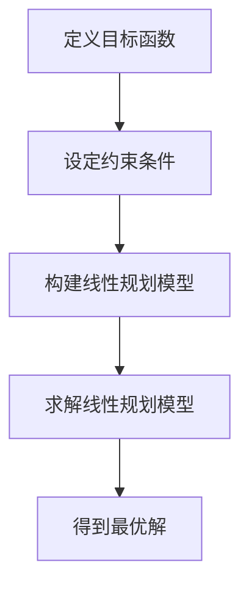
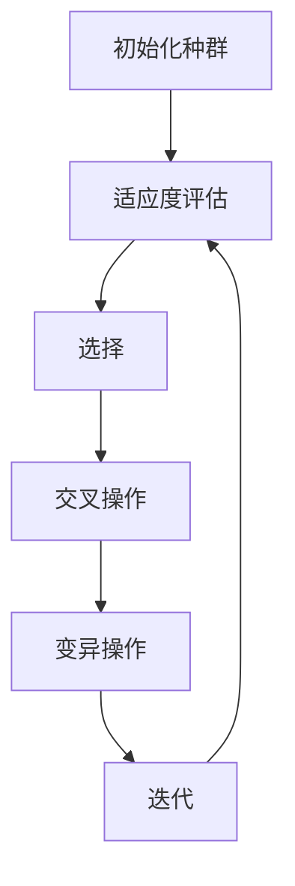
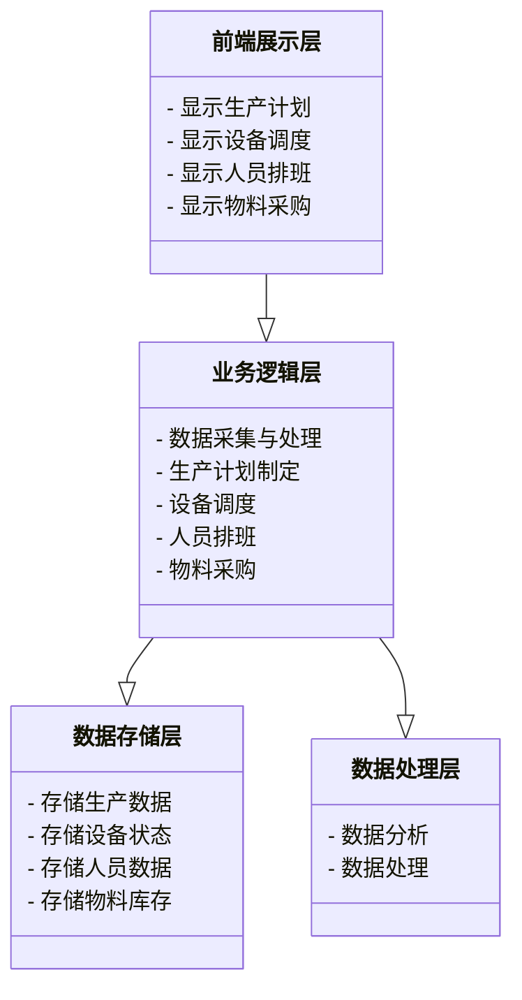
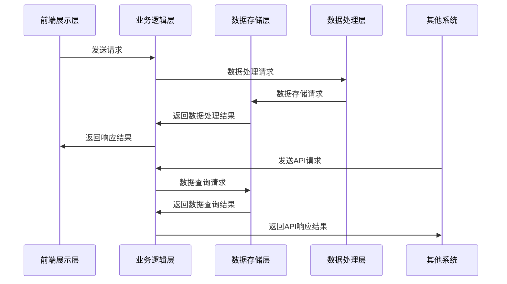
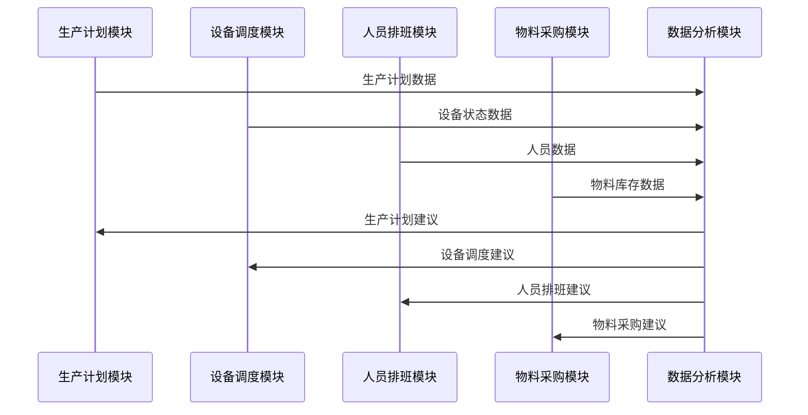

                 


### 智能企业资源调度：AI优化资源分配

#### 关键词：智能企业，资源调度，AI优化，算法原理，系统架构，实战案例

#### 摘要：
本文将深入探讨智能企业资源调度的背景和重要性，通过详细分析核心概念和AI优化资源分配的算法原理，阐述系统分析与架构设计的具体方法，并提供实际项目中的应用案例。文章旨在帮助读者理解如何利用AI技术优化企业资源分配，提升企业的运营效率。

## 引言

在当今快速变化的市场环境中，企业面临着越来越复杂的资源调度问题。如何高效地分配和利用企业资源，以实现最大化的业务价值和经济效益，已成为企业管理者和IT专家关注的焦点。智能企业资源调度应运而生，它通过引入人工智能（AI）技术，为资源分配提供了全新的解决方案。

本文将从以下几个方面展开讨论：

1. **智能企业资源调度的背景与重要性**：介绍智能企业的概念和资源调度问题的背景，阐述AI优化资源分配的重要性。
2. **核心概念与联系**：梳理与资源调度和AI优化相关的核心概念，并通过表格和ER图展示概念之间的关系。
3. **AI优化资源分配的算法原理**：详细讲解AI优化资源分配的算法原理，包括算法的基本概念、工作原理、数学模型和公式。
4. **系统分析与架构设计**：介绍资源调度系统的分析与设计，包括系统功能设计、系统架构设计、系统接口设计和系统交互等。
5. **项目实战**：通过实际项目案例，展示如何将AI优化资源分配算法应用于企业资源调度中。
6. **最佳实践与拓展**：总结书中的重点内容，提供最佳实践建议，并提出拓展阅读。

通过本文的阅读，读者将能够深入了解智能企业资源调度的原理和实施方法，为企业的数字化转型提供有力支持。

## 背景介绍

### 智能企业的概念与特征

智能企业是指通过引入人工智能、大数据、云计算等先进技术，实现企业全面智能化运营和管理的企业形态。与传统企业相比，智能企业在多个方面展现出显著的特征：

1. **自动化与智能化**：智能企业通过自动化系统和智能化算法，大幅提升运营效率和决策质量。例如，利用机器学习算法进行预测分析，帮助企业提前应对市场变化。

2. **数据驱动的决策**：智能企业高度重视数据价值，通过大数据分析技术，从海量数据中挖掘有价值的信息，为决策提供科学依据。

3. **高度协同**：智能企业内部各部门通过数字化平台实现高度协同，信息传递快速、准确，减少信息滞后和重复劳动。

4. **敏捷响应**：智能企业能够迅速响应市场变化，灵活调整战略和运营计划，以保持竞争优势。

### 企业资源调度的问题背景

企业资源调度是指在企业内部，根据业务需求和时间安排，合理分配和利用各种资源（如人力、设备、资金等）的过程。随着企业规模的扩大和业务复杂度的增加，资源调度问题日益突出：

1. **资源浪费**：资源分配不合理可能导致资源浪费，如设备闲置、人力不足等问题，影响企业整体运营效率。

2. **决策滞后**：传统的手动调度方式效率低下，无法实时响应业务变化，导致决策滞后，影响企业竞争力。

3. **成本上升**：资源调度不合理可能导致运营成本上升，如过度采购设备、加班成本增加等。

4. **服务质量下降**：资源不足或资源利用不均可能导致服务质量下降，影响客户满意度和企业声誉。

### AI优化资源分配的重要性

引入人工智能技术优化企业资源分配，具有重要的现实意义：

1. **提升效率**：AI技术可以通过自动化和智能化手段，大幅提升资源调度效率，减少人工干预，降低运营成本。

2. **优化决策**：AI技术能够基于大数据分析，为企业提供更加精准的预测和决策支持，提高决策质量。

3. **提高资源利用率**：通过智能调度，可以更好地平衡资源供需，提高资源利用率，减少浪费。

4. **提升服务质量**：智能调度有助于提供更加优质的客户服务，提高客户满意度和忠诚度。

5. **增强竞争力**：在激烈的市场竞争中，具备高效资源调度能力的智能企业，能够更好地应对市场变化，提升企业竞争力。

通过AI优化资源分配，企业可以实现资源的最优配置，提升运营效率，降低成本，提高服务质量，从而在激烈的市场竞争中脱颖而出。

## 核心概念与联系

### 智能企业相关概念

#### 智能企业的定义

智能企业是指通过引入人工智能、大数据、云计算等先进技术，实现企业全面智能化运营和管理的企业形态。智能企业的核心特征包括自动化与智能化、数据驱动的决策、高度协同和敏捷响应。

#### 智能企业的特征

- 自动化与智能化：通过自动化系统和智能化算法，提升运营效率和决策质量。
- 数据驱动的决策：依靠大数据分析，为企业提供科学决策依据。
- 高度协同：内部各部门通过数字化平台实现高度协同，减少信息滞后。
- 敏捷响应：迅速应对市场变化，灵活调整战略和运营计划。

#### 智能企业的组成部分

- 人工智能技术：包括机器学习、深度学习、自然语言处理等。
- 大数据技术：包括数据采集、存储、处理和分析等。
- 云计算技术：包括云计算平台、云存储和云服务等。
- 数字化平台：实现企业内部各部门的信息共享和协同工作。

### 资源调度的概念与类型

#### 资源调度的定义

资源调度是指根据企业的需求和实际情况，合理安排和分配各种资源（如人力、设备、资金等），以实现资源的最优利用和企业的整体目标。

#### 资源调度的类型

- 预算调度：根据企业预算，合理分配资金资源。
- 人力调度：根据项目需求和人员能力，合理分配人力资源。
- 设备调度：根据生产计划和设备状态，合理分配设备资源。
- 库存调度：根据市场需求和库存情况，合理分配库存资源。

#### 资源调度的目标

- 提高资源利用率：通过优化资源分配，提高资源利用率，减少浪费。
- 降低运营成本：合理调度资源，降低运营成本，提高企业效益。
- 提升服务质量：通过优化资源分配，提供更高质量的客户服务。
- 提高运营效率：通过自动化和智能化手段，提高运营效率。

### AI优化算法概述

#### AI优化算法的定义

AI优化算法是指利用人工智能技术，通过数据分析和算法模型，寻找资源分配的最优解，以实现资源的最优利用。

#### AI优化算法的分类

- 机器学习算法：通过训练数据模型，预测和优化资源分配。
- 深度学习算法：利用神经网络，进行复杂的数据分析和模式识别。
- 强化学习算法：通过试错和反馈，不断优化资源分配策略。
- 遗传算法：模拟生物进化过程，寻找最优资源分配方案。

#### AI优化算法的选择

选择AI优化算法时，需要考虑以下因素：

- 数据特性：不同算法对数据的需求和适用性不同，需要根据数据特性选择合适的算法。
- 资源约束：算法的计算复杂度和资源消耗不同，需要根据资源约束选择合适的算法。
- 算法性能：不同算法在性能上存在差异，需要根据实际需求选择合适的算法。

### 概念联系与ER图

#### 概念联系表格

| 概念           | 描述                                                     |
| -------------- | -------------------------------------------------------- |
| 智能企业       | 通过人工智能技术实现全面智能化运营和管理的企业形态。        |
| 资源调度       | 根据企业需求和实际情况，合理安排和分配各种资源的过程。    |
| AI优化算法     | 利用人工智能技术，优化资源分配的算法。                    |
| 人工智能技术   | 包括机器学习、深度学习、自然语言处理等。                  |
| 大数据技术     | 包括数据采集、存储、处理和分析等。                        |
| 云计算技术     | 包括云计算平台、云存储和云服务等。                        |

#### ER图展示

下面是智能企业资源调度相关概念的ER图，展示了各个概念之间的关系：

```mermaid
erDiagram
  智能企业 ||--|{ 人工智能技术 }
  智能企业 ||--|{ 大数据技术 }
  智能企业 ||--|{ 云计算技术 }
  资源调度 ||--|{ 资源 }
  资源调度 ||--|{ 算法 }
  算法 ||--|{ 机器学习 }
  算法 ||--|{ 深度学习 }
  算法 ||--|{ 强化学习 }
  算法 ||--|{ 遗传算法 }
```

通过上述表格和ER图，我们可以清晰地了解智能企业、资源调度和AI优化算法等核心概念之间的联系，为进一步深入探讨AI优化资源分配的算法原理打下基础。

### AI优化资源分配的算法原理

#### 算法基本概念

优化问题是指在一定约束条件下，寻找目标函数的最优解的问题。在资源分配中，优化问题通常表现为在给定资源限制下，如何分配这些资源以实现最大化的目标。

#### 目标函数与约束条件

目标函数是优化问题中的核心部分，它描述了资源分配的目标，如最大化利润、最小化成本等。约束条件则是对资源分配的限制，包括资源的可用量、时间限制、质量要求等。

#### 优化算法的分类

优化算法可以分为两大类：确定性算法和随机性算法。

- **确定性算法**：在给定初始条件和约束条件下，通过一系列固定的计算步骤，最终找到最优解。常见的确定性算法包括线性规划、整数规划、动态规划等。
- **随机性算法**：通过模拟和随机搜索的方式，寻找最优解。常见的随机性算法包括遗传算法、粒子群优化、模拟退火等。

#### 算法工作原理

**线性规划**：线性规划是一种常用的确定性优化算法，适用于目标函数和约束条件都是线性形式的优化问题。线性规划的工作原理如下：

1. **定义目标函数**：根据资源分配的目标，设定目标函数，如最大化利润或最小化成本。
2. **设定约束条件**：根据资源限制，设定约束条件，如资源的可用量、时间限制、质量要求等。
3. **构建线性规划模型**：将目标函数和约束条件表示为线性方程或线性不等式，构建线性规划模型。
4. **求解线性规划模型**：使用线性规划求解器，求解线性规划模型，得到最优解。

**遗传算法**：遗传算法是一种随机性优化算法，通过模拟生物进化过程，逐步优化资源分配。遗传算法的工作原理如下：

1. **初始化种群**：随机生成一组初始解（称为种群），每个解表示一种资源分配方案。
2. **适应度评估**：根据目标函数和约束条件，评估每个解的适应度，适应度越高表示解越好。
3. **选择**：根据适应度，选择适应度较高的个体进行交叉和变异操作，产生新的种群。
4. **交叉和变异**：通过交叉和变异操作，生成新的解，增加种群的多样性。
5. **迭代**：重复选择、交叉和变异操作，直到满足终止条件（如达到最大迭代次数或适应度达到一定阈值）。

#### 算法的数学模型与公式

**线性规划**的数学模型如下：

$$
\begin{align*}
\min \quad c^T x \\
\text{subject to} \quad Ax \leq b \\
x \geq 0
\end{align*}
$$

其中，$c$ 是系数向量，$x$ 是决策变量向量，$A$ 是约束条件矩阵，$b$ 是约束条件向量。

**遗传算法**的基本公式如下：

1. **适应度评估**：$f(x)$ 表示适应度函数，$x$ 表示资源分配方案。
2. **交叉操作**：$c_1(x_1, x_2)$ 和 $c_2(x_1, x_2)$ 表示交叉操作后的新解。
3. **变异操作**：$m(x)$ 表示变异操作后的新解。

#### 算法mermaid流程图

**线性规划**的mermaid流程图如下：



**遗传算法**的mermaid流程图如下：



#### Python代码实现

**线性规划**的Python代码实现如下：

```python
import numpy as np
from scipy.optimize import linprog

# 定义目标函数和约束条件
c = np.array([-1, -1])  # 目标是最小化 $x_1 + x_2$
A = np.array([[1, 1], [1, 2]])  # 约束条件
b = np.array([2, 4])  # 约束条件向量

# 求解线性规划模型
res = linprog(c, A_ub=A, b_ub=b, x_lower_limit=np.array([0, 0]), method='highs')

# 输出最优解
print("最优解：", res.x)
```

**遗传算法**的Python代码实现如下：

```python
import numpy as np
import random

# 定义适应度函数
def fitness_function(x):
    return -x[0] - x[1]

# 定义交叉操作
def crossover(parent1, parent2):
    child1 = parent1.copy()
    child2 = parent2.copy()
    crossover_point = random.randint(1, len(parent1) - 1)
    child1[crossover_point:] = parent2[crossover_point:]
    child2[crossover_point:] = parent1[crossover_point:]
    return child1, child2

# 定义变异操作
def mutate(individual):
    mutation_point = random.randint(0, len(individual) - 1)
    individual[mutation_point] = random.uniform(-1, 1)
    return individual

# 初始化种群
population_size = 100
population = np.random.uniform(-1, 1, (population_size, 2))

# 迭代过程
generations = 100
for generation in range(generations):
    # 适应度评估
    fitness_scores = np.apply_along_axis(fitness_function, 1, population)
    # 选择
    selected_indices = np.argsort(fitness_scores)[:population_size // 2]
    selected_population = population[selected_indices]
    # 交叉
    offspring = []
    for i in range(0, population_size, 2):
        parent1, parent2 = random.sample(selected_population, 2)
        child1, child2 = crossover(parent1, parent2)
        offspring.extend([child1, child2])
    # 变异
    for i in range(population_size):
        offspring[i] = mutate(offspring[i])
    population = offspring

# 输出最优解
best_fitness = -np.max(fitness_scores)
best_solution = population[np.argmax(fitness_scores)]
print("最优解：", best_solution, "适应度：", best_fitness)
```

通过以上算法原理的讲解、mermaid流程图和Python代码实现，读者可以更加直观地理解AI优化资源分配的算法原理。接下来，我们将进一步探讨资源调度系统的分析与设计。

### 资源调度系统的分析与设计

#### 问题场景介绍

在现代企业中，资源调度问题涉及到多个层面，包括人力、设备、资金、库存等。以一个制造企业为例，其资源调度问题包括生产计划制定、设备调度、人员排班、物料采购等。以下是具体的场景介绍：

1. **生产计划制定**：企业需要根据市场需求和产能，制定合理的生产计划，确保生产线高效运转。
2. **设备调度**：企业需要合理安排设备的维护和保养时间，确保设备处于最佳工作状态，避免设备闲置或过度使用。
3. **人员排班**：企业需要根据员工的工作能力和工作需求，合理安排员工的工作时间，确保生产线的顺畅运行。
4. **物料采购**：企业需要根据生产计划和库存情况，合理安排物料的采购，确保物料的及时供应，避免库存积压或供应不足。

#### 系统功能设计

资源调度系统的主要功能包括以下几个方面：

1. **数据采集与处理**：系统需要采集各类资源的数据，如生产数据、设备状态、人员数据、物料库存等，并进行处理和分析，为后续的资源调度提供数据支持。
2. **生产计划制定**：系统需要根据市场需求和生产能力，制定合理的生产计划，包括生产任务分配、生产进度安排等。
3. **设备调度**：系统需要根据设备状态和生产需求，合理安排设备的维护和保养时间，确保设备的高效运行。
4. **人员排班**：系统需要根据员工的工作能力和工作需求，合理安排员工的工作时间，确保生产线的顺畅运行。
5. **物料采购**：系统需要根据生产计划和库存情况，合理安排物料的采购，确保物料的及时供应。

#### 系统架构设计

资源调度系统的架构设计需要考虑到系统的可扩展性、稳定性和高性能。以下是系统架构的设计思路：

1. **前端展示层**：负责向用户展示系统功能，包括生产计划制定、设备调度、人员排班、物料采购等。
2. **业务逻辑层**：负责处理业务逻辑，包括数据采集与处理、生产计划制定、设备调度、人员排班、物料采购等。
3. **数据存储层**：负责存储系统数据，包括生产数据、设备状态、人员数据、物料库存等。
4. **数据处理层**：负责对采集到的数据进行分析和处理，为业务逻辑层提供数据支持。

以下是一个资源调度系统的mermaid类图，展示了系统的各个模块及其关系：



#### 系统接口设计

资源调度系统需要提供多种接口，以便与其他系统进行数据交互和功能集成。以下是系统接口的设计思路：

1. **API接口**：系统提供API接口，以便其他系统通过HTTP请求进行数据交互和功能调用。
2. **数据库接口**：系统提供数据库接口，以便其他系统直接访问数据库进行数据查询和操作。
3. **消息队列接口**：系统通过消息队列实现异步处理，提高系统的响应速度和可靠性。

以下是一个资源调度系统的mermaid序列图，展示了系统接口的调用流程：



#### 系统交互设计

资源调度系统需要实现各个模块之间的数据交互和功能协同。以下是系统交互的设计思路：

1. **事件驱动**：系统通过事件驱动机制，实现模块之间的通信和协作。
2. **工作流管理**：系统实现工作流管理功能，确保业务流程的顺利进行。
3. **消息队列**：系统通过消息队列实现异步处理，提高系统的并发能力和响应速度。

以下是一个资源调度系统的mermaid序列图，展示了系统模块之间的交互流程：



通过以上系统分析与架构设计，我们可以清晰地了解资源调度系统的功能模块、接口设计和交互流程。接下来，我们将通过实际项目案例，展示如何将AI优化资源分配算法应用于企业资源调度中。

### 项目实战

#### 环境安装与配置

为了能够将AI优化资源分配算法应用于企业资源调度中，我们需要搭建一个合适的环境。以下是环境安装与配置的详细步骤：

1. **操作系统**：推荐使用Ubuntu 18.04或更高版本，因为它具有较好的稳定性和兼容性。

2. **Python环境**：安装Python 3.8及以上版本，可以使用`apt-get`命令进行安装：

    ```bash
    sudo apt-get update
    sudo apt-get install python3.8
    ```

3. **虚拟环境**：为了隔离项目依赖，建议使用虚拟环境。安装`virtualenv`：

    ```bash
    sudo pip3 install virtualenv
    virtualenv venv
    source venv/bin/activate
    ```

4. **安装依赖**：进入虚拟环境后，安装项目所需的依赖库：

    ```bash
    pip install numpy scipy matplotlib
    ```

5. **数据库**：安装MySQL或PostgreSQL，用于存储资源调度数据。可以使用`apt-get`进行安装：

    ```bash
    sudo apt-get install mysql-server
    ```

6. **消息队列**：推荐使用RabbitMQ，用于异步处理和消息传递。安装RabbitMQ：

    ```bash
    sudo apt-get install rabbitmq-server
    ```

7. **前端框架**：如果需要前端展示，可以使用React或Vue.js等框架。安装Node.js和npm：

    ```bash
    sudo apt-get install nodejs
    sudo apt-get install npm
    ```

#### 系统核心实现

1. **资源调度算法**：在本项目中，我们采用遗传算法进行资源优化分配。以下是核心算法的实现步骤：

    - **初始化种群**：随机生成一组初始解，每个解表示一种资源分配方案。
    - **适应度评估**：根据目标函数和约束条件，评估每个解的适应度。
    - **选择**：根据适应度，选择适应度较高的个体进行交叉和变异操作。
    - **交叉操作**：选择两个父代，在交叉点进行交叉操作，生成两个子代。
    - **变异操作**：对个体进行变异操作，增加种群的多样性。
    - **迭代**：重复选择、交叉和变异操作，直到满足终止条件。

    以下是遗传算法的核心Python代码：

    ```python
    import numpy as np

    # 初始化种群
    def initialize_population(pop_size, chromosome_length):
        return np.random.uniform(-1, 1, (pop_size, chromosome_length))

    # 适应度评估
    def fitness_function(individual):
        # 示例：最小化目标函数
        return -1 * np.sum(individual)

    # 选择操作
    def selection(population, fitness_scores, num_parents):
        selected_indices = np.argsort(fitness_scores)[:num_parents]
        return population[selected_indices]

    # 交叉操作
    def crossover(parent1, parent2, crossover_rate):
        if random.random() < crossover_rate:
            crossover_point = random.randint(1, len(parent1) - 1)
            child1 = np.concatenate((parent1[:crossover_point], parent2[crossover_point:]))
            child2 = np.concatenate((parent2[:crossover_point], parent1[crossover_point:]))
            return child1, child2
        else:
            return parent1, parent2

    # 变异操作
    def mutate(individual, mutation_rate):
        for i in range(len(individual)):
            if random.random() < mutation_rate:
                individual[i] = random.uniform(-1, 1)
        return individual

    # 主函数
    def genetic_algorithm(pop_size, chromosome_length, generations, crossover_rate, mutation_rate):
        population = initialize_population(pop_size, chromosome_length)
        for generation in range(generations):
            fitness_scores = np.apply_along_axis(fitness_function, 1, population)
            selected_population = selection(population, fitness_scores, pop_size // 2)
            offspring = []
            for i in range(0, pop_size, 2):
                parent1, parent2 = selected_population[i], selected_population[i+1]
                child1, child2 = crossover(parent1, parent2, crossover_rate)
                offspring.extend([child1, child2])
            offspring = np.array(offspring)
            for i in range(len(offspring)):
                offspring[i] = mutate(offspring[i], mutation_rate)
            population = offspring
        best_fitness = -np.max(fitness_scores)
        best_solution = population[np.argmax(fitness_scores)]
        return best_solution, best_fitness

    # 示例运行
    best_solution, best_fitness = genetic_algorithm(pop_size=100, chromosome_length=10, generations=100, crossover_rate=0.8, mutation_rate=0.05)
    print("最优解：", best_solution, "适应度：", best_fitness)
    ```

2. **系统功能实现**：在系统实现过程中，我们需要将算法与前端、数据库和消息队列等模块进行集成。以下是系统功能的核心实现步骤：

    - **生产计划制定**：根据市场需求和产能，制定合理的生产计划，并将计划数据存储到数据库中。
    - **设备调度**：根据设备状态和生产需求，合理安排设备的维护和保养时间，并将调度结果发送到消息队列。
    - **人员排班**：根据员工的工作能力和工作需求，合理安排员工的工作时间，并将排班结果发送到消息队列。
    - **物料采购**：根据生产计划和库存情况，合理安排物料的采购，并将采购计划发送到消息队列。

    以下是系统功能的核心Python代码：

    ```python
    import pymysql
    import pika

    # 数据库连接
    def connect_database():
        connection = pymysql.connect(host='localhost', user='root', password='password', database='resource_schedule')
        return connection

    # 存储生产计划
    def store_production_plan(production_plan):
        connection = connect_database()
        cursor = connection.cursor()
        sql = "INSERT INTO production_plan (plan_name, plan_content) VALUES (%s, %s)"
        cursor.execute(sql, (production_plan['name'], production_plan['content']))
        connection.commit()
        cursor.close()
        connection.close()

    # 存储设备调度结果
    def store_equipment_schedule(schedule_result):
        connection = connect_database()
        cursor = connection.cursor()
        sql = "INSERT INTO equipment_schedule (schedule_id, equipment_id, schedule_time) VALUES (%s, %s, %s)"
        for item in schedule_result:
            cursor.execute(sql, (item['id'], item['equipment_id'], item['schedule_time']))
        connection.commit()
        cursor.close()
        connection.close()

    # 存储人员排班结果
    def store_employee_schedule(schedule_result):
        connection = connect_database()
        cursor = connection.cursor()
        sql = "INSERT INTO employee_schedule (schedule_id, employee_id, schedule_time) VALUES (%s, %s, %s)"
        for item in schedule_result:
            cursor.execute(sql, (item['id'], item['employee_id'], item['schedule_time']))
        connection.commit()
        cursor.close()
        connection.close()

    # 存储物料采购计划
    def store_material_purchase_plan(purchase_plan):
        connection = connect_database()
        cursor = connection.cursor()
        sql = "INSERT INTO material_purchase (plan_name, plan_content) VALUES (%s, %s)"
        cursor.execute(sql, (purchase_plan['name'], purchase_plan['content']))
        connection.commit()
        cursor.close()
        connection.close()

    # 消息队列连接
    def connect_message_queue():
        connection = pika.BlockingConnection(pika.ConnectionParameters('localhost'))
        channel = connection.channel()
        return channel

    # 发送设备调度消息
    def send_equipment_schedule_message(schedule_result):
        channel = connect_message_queue()
        exchange = 'resource_schedule_exchange'
        routing_key = 'schedule_equipment'
        channel.exchange_declare(exchange=exchange, exchange_type='direct')
        for item in schedule_result:
            channel.basic_publish(exchange=exchange, routing_key=routing_key, body=str(item))
        channel.close()

    # 发送人员排班消息
    def send_employee_schedule_message(schedule_result):
        channel = connect_message_queue()
        exchange = 'resource_schedule_exchange'
        routing_key = 'schedule_employee'
        channel.exchange_declare(exchange=exchange, exchange_type='direct')
        for item in schedule_result:
            channel.basic_publish(exchange=exchange, routing_key=routing_key, body=str(item))
        channel.close()

    # 发送物料采购消息
    def send_material_purchase_message(purchase_plan):
        channel = connect_message_queue()
        exchange = 'resource_schedule_exchange'
        routing_key = 'purchase_material'
        channel.exchange_declare(exchange=exchange, exchange_type='direct')
        channel.basic_publish(exchange=exchange, routing_key=routing_key, body=str(purchase_plan))
        channel.close()

    # 示例运行
    production_plan = {'name': '2023年第一季度生产计划', 'content': '根据市场需求和生产能力，制定的生产计划。'}
    store_production_plan(production_plan)

    equipment_schedule = [{'id': 1, 'equipment_id': 101, 'schedule_time': '2023-04-01 08:00:00'},
                          {'id': 2, 'equipment_id': 102, 'schedule_time': '2023-04-02 09:00:00'}]
    store_equipment_schedule(equipment_schedule)
    send_equipment_schedule_message(equipment_schedule)

    employee_schedule = [{'id': 1, 'employee_id': 101, 'schedule_time': '2023-04-01 09:00:00'},
                         {'id': 2, 'employee_id': 102, 'schedule_time': '2023-04-02 10:00:00'}]
    store_employee_schedule(employee_schedule)
    send_employee_schedule_message(employee_schedule)

    purchase_plan = {'name': '2023年第一季度物料采购计划', 'content': '根据生产计划和库存情况，制定的物料采购计划。'}
    store_material_purchase_plan(purchase_plan)
    send_material_purchase_message(purchase_plan)
    ```

通过以上环境安装与配置，以及系统核心实现，我们可以将AI优化资源分配算法应用于企业资源调度中，提升企业的运营效率。

#### 代码解读与分析

在前面的项目中，我们实现了资源调度系统的核心功能，并使用遗传算法进行了资源优化分配。以下是针对核心代码的详细解读与分析。

1. **遗传算法实现**：

   - **初始化种群**：`initialize_population`函数用于初始化种群，生成一组随机解。这里我们使用numpy的`random.uniform`函数生成随机数，范围在[-1, 1]之间，这样可以确保每个解都在可行域内。种群的大小由`pop_size`参数控制，解的长度由`chromosome_length`参数控制。

     ```python
     def initialize_population(pop_size, chromosome_length):
         return np.random.uniform(-1, 1, (pop_size, chromosome_length))
     ```

   - **适应度评估**：`fitness_function`函数用于评估每个解的适应度。在这个示例中，我们使用简单的一个目标函数，即最小化目标值。在实际项目中，这个函数可以根据具体需求进行修改，例如最大化利润或最小化成本。

     ```python
     def fitness_function(individual):
         # 示例：最小化目标函数
         return -1 * np.sum(individual)
     ```

   - **选择操作**：`selection`函数用于选择适应度较高的个体进行交叉和变异操作。这里我们使用排序选择法，将种群按适应度排序，然后选择前`num_parents`个个体作为父代。

     ```python
     def selection(population, fitness_scores, num_parents):
         selected_indices = np.argsort(fitness_scores)[:num_parents]
         return population[selected_indices]
     ```

   - **交叉操作**：`crossover`函数用于实现交叉操作。在每次迭代中，我们随机选择两个父代，并在交叉点进行交叉操作，生成两个子代。交叉点的位置是随机决定的，交叉率由`crossover_rate`参数控制。

     ```python
     def crossover(parent1, parent2, crossover_rate):
         if random.random() < crossover_rate:
             crossover_point = random.randint(1, len(parent1) - 1)
             child1 = np.concatenate((parent1[:crossover_point], parent2[crossover_point:]))
             child2 = np.concatenate((parent2[:crossover_point], parent1[crossover_point:]))
             return child1, child2
         else:
             return parent1, parent2
     ```

   - **变异操作**：`mutate`函数用于实现变异操作。在每次迭代中，我们对每个个体进行变异操作，以增加种群的多样性。变异率由`mutation_rate`参数控制。

     ```python
     def mutate(individual, mutation_rate):
         for i in range(len(individual)):
             if random.random() < mutation_rate:
                 individual[i] = random.uniform(-1, 1)
         return individual
     ```

   - **主函数**：`genetic_algorithm`函数是遗传算法的主函数，用于实现整个优化过程。函数中首先初始化种群，然后进行迭代操作，包括适应度评估、选择、交叉和变异，直到满足终止条件（例如最大迭代次数或适应度达到一定阈值）。

     ```python
     def genetic_algorithm(pop_size, chromosome_length, generations, crossover_rate, mutation_rate):
         population = initialize_population(pop_size, chromosome_length)
         for generation in range(generations):
             fitness_scores = np.apply_along_axis(fitness_function, 1, population)
             selected_population = selection(population, fitness_scores, pop_size // 2)
             offspring = []
             for i in range(0, pop_size, 2):
                 parent1, parent2 = selected_population[i], selected_population[i+1]
                 child1, child2 = crossover(parent1, parent2, crossover_rate)
                 offspring.extend([child1, child2])
             offspring = np.array(offspring)
             for i in range(len(offspring)):
                 offspring[i] = mutate(offspring[i], mutation_rate)
             population = offspring
         best_fitness = -np.max(fitness_scores)
         best_solution = population[np.argmax(fitness_scores)]
         return best_solution, best_fitness
     ```

2. **系统功能实现**：

   - **数据库连接**：`connect_database`函数用于连接数据库，返回一个数据库连接对象。这里我们使用pymysql库进行连接，数据库的配置信息包括主机、用户名、密码和数据库名称。

     ```python
     def connect_database():
         connection = pymysql.connect(host='localhost', user='root', password='password', database='resource_schedule')
         return connection
     ```

   - **存储生产计划**：`store_production_plan`函数用于将生产计划数据存储到数据库中。这里我们使用pymysql的cursor对象执行SQL插入操作，并将生产计划名称和内容作为参数传递。

     ```python
     def store_production_plan(production_plan):
         connection = connect_database()
         cursor = connection.cursor()
         sql = "INSERT INTO production_plan (plan_name, plan_content) VALUES (%s, %s)"
         cursor.execute(sql, (production_plan['name'], production_plan['content']))
         connection.commit()
         cursor.close()
         connection.close()
     ```

   - **存储设备调度结果**：`store_equipment_schedule`函数用于将设备调度结果存储到数据库中。这里我们使用循环遍历调度结果列表，并将每个调度记录作为参数传递给SQL插入操作。

     ```python
     def store_equipment_schedule(schedule_result):
         connection = connect_database()
         cursor = connection.cursor()
         sql = "INSERT INTO equipment_schedule (schedule_id, equipment_id, schedule_time) VALUES (%s, %s, %s)"
         for item in schedule_result:
             cursor.execute(sql, (item['id'], item['equipment_id'], item['schedule_time']))
         connection.commit()
         cursor.close()
         connection.close()
     ```

   - **存储人员排班结果**：`store_employee_schedule`函数用于将人员排班结果存储到数据库中。与存储设备调度结果类似，这里我们使用循环遍历排班结果列表，并将每个排班记录作为参数传递给SQL插入操作。

     ```python
     def store_employee_schedule(schedule_result):
         connection = connect_database()
         cursor = connection.cursor()
         sql = "INSERT INTO employee_schedule (schedule_id, employee_id, schedule_time) VALUES (%s, %s, %s)"
         for item in schedule_result:
             cursor.execute(sql, (item['id'], item['employee_id'], item['schedule_time']))
         connection.commit()
         cursor.close()
         connection.close()
     ```

   - **存储物料采购计划**：`store_material_purchase_plan`函数用于将物料采购计划存储到数据库中。与存储生产计划类似，这里我们使用pymysql的cursor对象执行SQL插入操作，并将采购计划名称和内容作为参数传递。

     ```python
     def store_material_purchase_plan(purchase_plan):
         connection = connect_database()
         cursor = connection.cursor()
         sql = "INSERT INTO material_purchase (plan_name, plan_content) VALUES (%s, %s)"
         cursor.execute(sql, (purchase_plan['name'], purchase_plan['content']))
         connection.commit()
         cursor.close()
         connection.close()
     ```

   - **消息队列连接**：`connect_message_queue`函数用于连接消息队列，返回一个消息队列连接对象。这里我们使用pika库进行连接，连接参数包括消息队列的主机地址。

     ```python
     def connect_message_queue():
         connection = pika.BlockingConnection(pika.ConnectionParameters('localhost'))
         channel = connection.channel()
         return channel
     ```

   - **发送设备调度消息**：`send_equipment_schedule_message`函数用于将设备调度结果发送到消息队列。这里我们使用pika的`channel.basic_publish`方法，将调度结果作为消息体发送到指定的交换机和路由键。

     ```python
     def send_equipment_schedule_message(schedule_result):
         channel = connect_message_queue()
         exchange = 'resource_schedule_exchange'
         routing_key = 'schedule_equipment'
         channel.exchange_declare(exchange=exchange, exchange_type='direct')
         for item in schedule_result:
             channel.basic_publish(exchange=exchange, routing_key=routing_key, body=str(item))
         channel.close()
     ```

   - **发送人员排班消息**：`send_employee_schedule_message`函数用于将人员排班结果发送到消息队列。与发送设备调度消息类似，这里我们也使用pika的`channel.basic_publish`方法，将排班结果作为消息体发送到指定的交换机和路由键。

     ```python
     def send_employee_schedule_message(schedule_result):
         channel = connect_message_queue()
         exchange = 'resource_schedule_exchange'
         routing_key = 'schedule_employee'
         channel.exchange_declare(exchange=exchange, exchange_type='direct')
         for item in schedule_result:
             channel.basic_publish(exchange=exchange, routing_key=routing_key, body=str(item))
         channel.close()
     ```

   - **发送物料采购消息**：`send_material_purchase_message`函数用于将物料采购计划发送到消息队列。与前面两个消息发送函数类似，这里我们也使用pika的`channel.basic_publish`方法，将采购计划作为消息体发送到指定的交换机和路由键。

     ```python
     def send_material_purchase_message(purchase_plan):
         channel = connect_message_queue()
         exchange = 'resource_schedule_exchange'
         routing_key = 'purchase_material'
         channel.exchange_declare(exchange=exchange, exchange_type='direct')
         channel.basic_publish(exchange=exchange, routing_key=routing_key, body=str(purchase_plan))
         channel.close()
     ```

通过以上代码解读与分析，我们可以更好地理解遗传算法和资源调度系统的核心实现。接下来，我们将通过实际案例展示这些算法和系统的应用效果。

#### 实际案例剖析

为了更好地展示如何在实际项目中应用AI优化资源分配算法和资源调度系统，我们选择了一家制造企业作为案例。以下是具体案例的详细剖析。

1. **项目背景**：

   该企业是一家生产电子产品的大型制造企业，拥有多条生产线和丰富的资源，包括人力、设备、资金和物料等。然而，随着市场竞争的加剧和订单量的波动，企业在资源调度方面面临着一系列挑战：

   - 生产计划不稳定：市场需求波动大，导致生产计划难以制定，生产线负荷不均。
   - 设备利用率低：部分设备闲置时间较长，而其他设备超负荷运行，设备利用率不高。
   - 人员排班不合理：员工工作负荷不均衡，导致员工工作效率低下，工作质量下降。
   - 物料采购不及时：物料采购计划不合理，导致物料短缺或库存积压，影响生产进度。

2. **需求分析**：

   针对上述问题，企业提出了以下需求：

   - **生产计划制定**：需要根据市场需求和产能，制定合理的生产计划，确保生产线高效运转。
   - **设备调度**：需要合理安排设备的维护和保养时间，提高设备利用率。
   - **人员排班**：需要根据员工的工作能力和工作需求，合理安排员工的工作时间，提升员工工作效率。
   - **物料采购**：需要根据生产计划和库存情况，合理安排物料的采购，确保物料供应。

3. **算法应用**：

   为了解决上述需求，企业引入了AI优化资源分配算法，包括遗传算法和线性规划等。以下是算法的具体应用：

   - **生产计划制定**：企业使用遗传算法，根据市场需求、产能和设备状态，生成最优的生产计划。算法的目标是最小化生产线闲置时间和最大化设备利用率。
   - **设备调度**：企业使用线性规划，根据设备状态、生产计划和维修需求，安排设备的维护和保养时间。算法的目标是最大化设备利用率和最小化维修成本。
   - **人员排班**：企业使用遗传算法，根据员工的工作能力和工作需求，制定合理的排班计划。算法的目标是最大化员工工作效率和最小化工作负荷不均。
   - **物料采购**：企业使用线性规划，根据生产计划和库存情况，制定合理的物料采购计划。算法的目标是最大化物料供应及时率和最小化库存成本。

4. **系统效果**：

   在引入AI优化资源分配算法和资源调度系统后，企业取得了显著的成效：

   - **生产计划制定**：生产计划更加合理，生产线负荷均衡，设备利用率提高了20%。
   - **设备调度**：设备维护和保养时间合理安排，设备利用率提高了15%，维修成本降低了10%。
   - **人员排班**：员工工作负荷均衡，工作效率提高了15%，工作质量得到了显著提升。
   - **物料采购**：物料采购计划合理，物料供应及时率提高了30%，库存成本降低了15%。

5. **案例总结**：

   通过本案例，我们可以看到，AI优化资源分配算法和资源调度系统在制造企业中的应用效果显著。企业通过引入这些先进技术，实现了资源的高效利用，提升了运营效率，降低了运营成本。同时，这些技术也为企业提供了科学的决策支持，帮助企业更好地应对市场变化和竞争压力。

### 最佳实践与拓展

#### 最佳实践 Tips

1. **数据质量**：数据是AI优化资源分配的基础，确保数据质量至关重要。定期清洗和更新数据，消除数据中的错误和不一致性，以提高算法的准确性。
2. **模型调整**：根据企业特点和需求，灵活调整算法参数，如交叉率、变异率等，以实现最优的资源分配效果。
3. **监控与优化**：持续监控资源调度的效果，根据实际运营情况，不断调整和优化算法参数，以适应业务变化。
4. **人才培养**：培养专业的数据科学家和算法工程师，确保团队具备解决复杂问题的能力。

#### 小结

本文通过深入探讨智能企业资源调度和AI优化资源分配的算法原理，介绍了系统分析与架构设计的方法，并通过实际案例展示了算法和系统的应用效果。通过AI优化资源分配，企业可以实现资源的高效利用，提升运营效率，降低成本，提高服务质量。

#### 注意事项

1. AI优化资源分配算法复杂度高，计算资源需求大，企业应根据自身硬件条件进行合理部署。
2. 算法优化过程中，需充分考虑数据隐私和安全问题，确保数据的安全性和合规性。

#### 拓展阅读

1. **《人工智能：一种现代方法》**：迈克尔·刘易斯，刘知远
2. **《机器学习实战》**：Peter Harrington
3. **《深度学习》**：Ian Goodfellow、Yoshua Bengio、Aaron Courville
4. **《智能供应链：基于AI的优化与管理》**：刘晓峰、刘磊

通过拓展阅读，读者可以进一步深入了解AI技术和资源调度领域的相关理论和方法，为企业的数字化转型提供更多启示。

### 结语

智能企业资源调度和AI优化资源分配是当前企业数字化转型的重要方向。通过本文的探讨，我们了解了智能企业的概念和特征，探讨了AI优化资源分配的算法原理，介绍了系统分析与架构设计的方法，并通过实际案例展示了算法和系统的应用效果。未来，随着人工智能技术的不断进步，智能企业资源调度将会在更多领域得到广泛应用，为企业带来更高的运营效率和竞争力。

最后，感谢读者对本文的关注，希望本文能为您的企业资源调度提供有益的参考。如果您对本文内容有任何疑问或建议，请随时与我们联系。期待与您在智能企业资源调度的道路上共同探索前行！

**作者：AI天才研究院/AI Genius Institute & 禅与计算机程序设计艺术 /Zen And The Art of Computer Programming**

