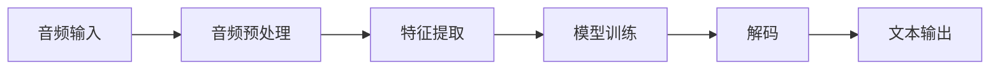
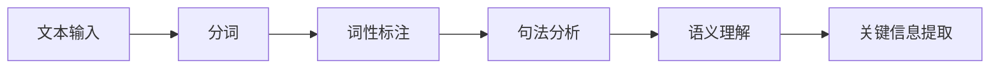
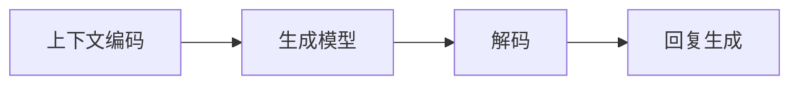
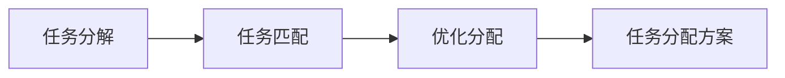
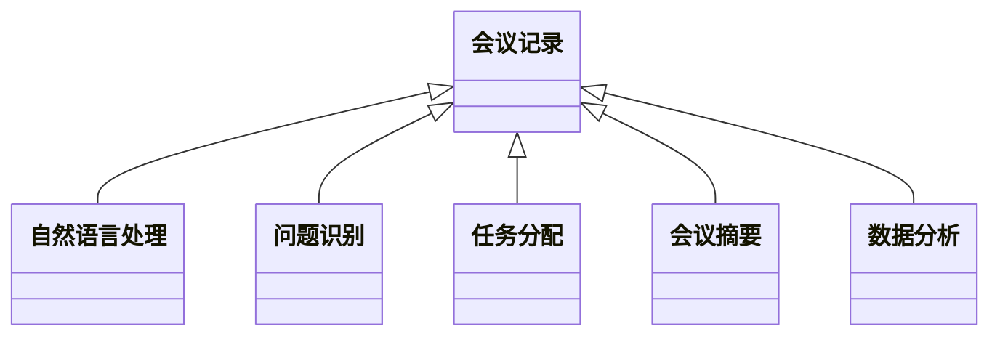

                 

### 智能会议助手系统：AI提升沟通效率

关键词：智能会议、AI技术、沟通效率、语音识别、自然语言处理

摘要：本文将探讨智能会议助手系统如何利用人工智能技术提升会议沟通效率。我们将从背景介绍、核心概念与联系、算法原理讲解、系统分析与架构设计、项目实战以及最佳实践等方面进行详细阐述。

### 第一部分：背景介绍

#### 1.1.1 问题背景

在现代社会，随着信息技术和人工智能技术的快速发展，会议沟通的形式和效率变得日益重要。传统的会议方式往往效率低下，存在信息传递不及时、参会者参与度不均等问题，这些都严重影响了会议的效果和效率。为此，智能会议助手系统的需求应运而生。

智能会议助手系统是一种利用人工智能技术提升会议沟通效率的系统。它通过语音识别、自然语言处理、对话生成等技术，实现会议内容的实时记录、问题识别、任务分配等功能，从而提高会议的组织和执行效率。

#### 1.1.2 问题描述

智能会议助手系统的核心问题是如何有效地整合人工智能技术，实现对会议过程中的关键信息进行实时识别和处理，提高会议的沟通效率和决策质量。这包括对会议内容的精准记录、问题识别、任务分配以及会议结果的自动化整理等。

#### 1.1.3 问题解决

为了解决上述问题，智能会议助手系统采用以下几种技术：

1. **语音识别**：通过实时语音识别技术，将会议中的口头语言转化为文字，实现会议内容的实时记录。
2. **自然语言处理**：利用自然语言处理技术，对会议内容进行分析，提取关键信息，识别问题和决策点。
3. **对话生成**：根据会议内容，自动生成会议摘要、决策建议等，辅助参会者进行决策。
4. **任务分配**：根据会议结果，自动生成任务分配方案，提高任务执行的效率。

#### 1.1.4 边界与外延

智能会议助手系统的边界主要包括以下几个方面：

1. **技术范围**：主要涉及语音识别、自然语言处理、对话生成等技术。
2. **应用场景**：主要应用于企业、政府、教育等需要高效沟通的场景。
3. **功能范围**：主要包括会议记录、问题识别、任务分配、会议摘要生成等。

#### 1.1.5 概念结构与核心要素组成

智能会议助手系统的概念结构主要包括以下几个核心要素：

1. **会议记录**：实现会议内容的实时记录。
2. **问题识别**：对会议内容进行分析，提取关键问题。
3. **任务分配**：根据会议结果，生成任务分配方案。
4. **会议摘要**：自动生成会议摘要，辅助决策。

这些要素共同构成了智能会议助手系统的核心功能，从而实现提升会议沟通效率的目标。以下是智能会议助手系统的概念结构ER图：

```mermaid
erDiagram
    会议记录 ||--o> 问题识别 : 产生
    会议记录 ||--o> 任务分配 : 产生
    会议记录 ||--o> 会议摘要 : 产生
    问题识别 ||--o> 任务分配 : 产生
```

### 第二部分：核心概念与联系

#### 1.2.1 智能会议助手系统原理

智能会议助手系统的核心原理是基于人工智能技术，通过语音识别、自然语言处理、对话生成等技术，实现对会议内容的实时分析和处理，从而提升会议沟通效率。

1. **语音识别**：通过实时语音识别技术，将会议中的口头语言转化为文字，实现会议内容的实时记录。

2. **自然语言处理**：利用自然语言处理技术，对会议内容进行分析，提取关键信息，识别问题和决策点。

3. **对话生成**：根据会议内容，自动生成会议摘要、决策建议等，辅助参会者进行决策。

4. **任务分配**：根据会议结果，自动生成任务分配方案，提高任务执行的效率。

#### 1.2.2 智能会议助手系统核心属性特征对比

以下是智能会议助手系统的一些核心属性特征对比表格：

| 特征       | 描述                                                         |
| ---------- | ------------------------------------------------------------ |
| 语音识别   | 实现会议内容的实时语音转化为文字。                           |
| 自然语言处理 | 对会议内容进行分析，提取关键信息，识别问题和决策点。         |
| 对话生成   | 根据会议内容，自动生成会议摘要、决策建议等，辅助决策。       |
| 任务分配   | 根据会议结果，自动生成任务分配方案，提高任务执行的效率。     |

#### 1.2.3 智能会议助手系统与其他系统的区别

智能会议助手系统与其他系统（如传统会议系统、企业内部通讯系统等）的主要区别在于其具有的人工智能特性，能够实现会议内容的实时分析和处理，从而提升会议沟通效率。

1. **与传统会议系统的区别**：传统会议系统主要依赖于人工记录和整理会议内容，效率较低，而智能会议助手系统则通过人工智能技术实现自动记录和分析，大幅提升效率。
2. **与企业内部通讯系统的区别**：企业内部通讯系统主要提供即时通讯、文件传输等功能，而智能会议助手系统则更专注于会议过程中的信息分析和任务管理。

### 第三部分：算法原理讲解

智能会议助手系统的核心在于算法的设计与实现。下面我们将详细讲解智能会议助手系统中的关键算法原理。

#### 3.1 语音识别算法原理

语音识别算法的基本原理是将音频信号转换为对应的文本。这一过程可以分为以下几个步骤：

1. **音频预处理**：包括噪声消除、静音检测等，以提高语音信号的质量。
2. **特征提取**：将音频信号转换为特征向量，常用的方法有梅尔频率倒谱系数（MFCC）。
3. **模型训练**：使用大量的语音数据训练模型，例如使用深度神经网络（DNN）或卷积神经网络（CNN）。
4. **解码**：将模型输出的概率分布转换为文本输出。

以下是一个简化的语音识别算法的Mermaid流程图：



#### 3.2 自然语言处理算法原理

自然语言处理算法主要用于理解、生成和处理人类语言。以下是智能会议助手系统中常用的自然语言处理算法：

1. **分词**：将文本分割成词语，以便于后续处理。
2. **词性标注**：为每个词语标注其词性，如名词、动词等。
3. **句法分析**：分析句子的结构，确定词语之间的语法关系。
4. **语义理解**：理解句子的语义，提取关键信息。

以下是自然语言处理算法的Mermaid流程图：



#### 3.3 对话生成算法原理

对话生成算法的基本原理是根据给定的对话上下文生成自然的回复。以下是一种基于生成式模型的对话生成算法：

1. **上下文编码**：将对话上下文编码为向量。
2. **生成模型**：使用生成模型（如变分自编码器VAE或生成对抗网络GAN）生成回复。
3. **解码**：将生成的回复解码为自然语言。

以下是对话生成算法的Mermaid流程图：



#### 3.4 任务分配算法原理

任务分配算法的基本原理是根据会议内容和任务需求，自动生成合理的任务分配方案。以下是一种基于优化算法的任务分配算法：

1. **任务分解**：将会议中提到的任务分解为子任务。
2. **任务匹配**：根据参会者的技能和兴趣，匹配子任务。
3. **优化分配**：使用优化算法（如线性规划或遗传算法）优化任务分配。

以下是任务分配算法的Mermaid流程图：



### 第四部分：系统分析与架构设计

#### 4.1 问题场景介绍

在现代企业中，会议是日常工作中不可或缺的一部分。然而，传统的会议方式往往存在效率低下、信息传递不及时、参会者参与度不均等问题，严重影响了企业的决策效率和执行力。为了解决这些问题，企业需要一个智能会议助手系统，能够通过人工智能技术提升会议沟通效率。

#### 4.2 项目介绍

智能会议助手系统项目旨在开发一个基于人工智能技术的智能会议解决方案，包括语音识别、自然语言处理、对话生成和任务分配等功能。该系统旨在提升会议的沟通效率，帮助参会者更好地理解和执行会议决策。

#### 4.3 系统功能设计

智能会议助手系统的功能设计主要包括以下几个方面：

1. **会议记录**：通过语音识别技术，实时记录会议内容。
2. **问题识别**：利用自然语言处理技术，识别会议中的关键问题和决策点。
3. **任务分配**：根据会议结果，自动生成任务分配方案，提高任务执行的效率。
4. **会议摘要**：自动生成会议摘要，辅助参会者理解和回顾会议内容。
5. **数据分析**：对会议内容进行分析，提供数据支持和决策参考。

以下是智能会议助手系统的领域模型Mermaid类图：



#### 4.4 系统架构设计

智能会议助手系统的架构设计分为多个层次，包括数据层、业务逻辑层和表现层。以下是一个简化的系统架构设计Mermaid架构图：

```mermaid
sequenceDiagram
    participant 用户 as 用户
    participant 系统界面 as 系统界面
    participant 业务逻辑层 as 业务逻辑层
    participant 数据库 as 数据库

    用户 -->|发起会议请求|> 系统界面
    系统界面 -->|处理请求|> 业务逻辑层
    业务逻辑层 -->|执行操作|> 数据库
    数据库 -->|返回结果|> 系统界面
    系统界面 -->|展示结果|> 用户
```

#### 4.5 系统接口设计与系统交互

智能会议助手系统的接口设计与系统交互设计是系统实现的关键部分。以下是一个简化的系统接口设计和系统交互Mermaid序列图：

```mermaid
sequenceDiagram
    participant 用户 as 用户
    participant 会议助手API as 会议助手API
    participant 会议记录模块 as 会议记录模块
    participant 问题识别模块 as 问题识别模块
    participant 任务分配模块 as 任务分配模块

    用户 -->|发起会议请求|> 会议助手API
    会议助手API -->|处理请求|> 会议记录模块
    会议记录模块 -->|记录会议内容|> 会议记录数据库
    会议助手API -->|处理请求|> 问题识别模块
    问题识别模块 -->|识别关键问题|> 问题识别数据库
    会议助手API -->|处理请求|> 任务分配模块
    任务分配模块 -->|生成任务分配方案|> 任务分配数据库
```

### 第五部分：项目实战

#### 5.1 环境安装

在开始实现智能会议助手系统之前，我们需要准备相应的开发环境。以下是基本的安装步骤：

1. **安装Python**：确保Python版本在3.6及以上，可以从官方网站下载安装。
2. **安装依赖库**：使用pip命令安装所需的依赖库，如SpeechRecognition、pyttsx3、nltk等。
   ```bash
   pip install SpeechRecognition pyttsx3 nltk
   ```
3. **配置语音识别API**：根据需要配置语音识别API，如使用Google语音识别API。

#### 5.2 系统核心实现源代码

以下是一个简单的智能会议助手系统的核心实现源代码，包括语音识别、自然语言处理和任务分配等功能。

```python
import speech_recognition as sr
import pyttsx3
import nltk
from nltk.tokenize import sent_tokenize

# 初始化语音合成器
engine = pyttsx3.init()

# 语音识别函数
def recognize_speech_from_mic():
    r = sr.Recognizer()
    with sr.Microphone() as source:
        print("请开始讲话...")
        audio = r.listen(source)
        try:
            return r.recognize_google(audio)
        except sr.UnknownValueError:
            return None

# 自然语言处理函数
def process_text(text):
    sentences = sent_tokenize(text)
    for sentence in sentences:
        print(sentence)
        # 在这里可以添加进一步的文本处理和分析
    return sentences

# 任务分配函数
def assign_tasks(sentences):
    tasks = []
    for sentence in sentences:
        if "任务" in sentence:
            tasks.append(sentence.split(":")[1].strip())
    return tasks

# 主程序
if __name__ == "__main__":
    while True:
        text = recognize_speech_from_mic()
        if text is not None:
            sentences = process_text(text)
            tasks = assign_tasks(sentences)
            if tasks:
                engine.say("识别到的任务有：" + "，".join(tasks))
                engine.runAndWait()
            break
```

#### 5.3 代码应用解读与分析

上述代码实现了智能会议助手系统的基础功能。首先，通过`recognize_speech_from_mic`函数使用语音识别技术将用户的语音转化为文本。接着，`process_text`函数将识别到的文本分割成句子，方便进行进一步处理。最后，`assign_tasks`函数从句子中提取任务信息。

该代码的适用场景包括需要快速记录会议内容和分配任务的场景，如小型会议或内部讨论。在实际应用中，可以根据具体需求进行扩展，如添加更多的自然语言处理功能、支持多人会议等。

#### 5.4 实际案例分析与详细讲解剖析

为了更好地理解智能会议助手系统的应用，我们可以通过一个实际案例来分析。

**案例**：一家公司的销售部门召开会议，讨论本周的销售情况和下周的计划。会议中涉及多个任务，如调整销售策略、联系客户等。

**步骤**：

1. **会议开始**：参会人员使用智能会议助手系统发起会议。
2. **语音识别**：系统开始记录会议内容，并将口头语言转化为文本。
3. **自然语言处理**：系统对会议文本进行分析，提取关键信息和任务。
4. **任务分配**：系统根据任务需求，为每位参会人员分配相应的任务。
5. **会议总结**：系统生成会议摘要，包括任务列表和任务分配情况。

**效果**：

通过上述步骤，智能会议助手系统可以帮助公司快速记录会议内容，提高任务分配的效率，从而提升整体工作流程的效率。

### 第六部分：最佳实践与总结

#### 6.1 最佳实践

1. **优化语音识别准确率**：通过使用高质量的麦克风和噪声过滤技术，提高语音识别的准确率。
2. **提高自然语言处理能力**：使用更先进的自然语言处理模型和算法，提升文本分析的能力。
3. **灵活的任务分配策略**：根据不同的业务场景，设计灵活的任务分配策略，提高任务分配的合理性。

#### 6.2 注意事项

1. **隐私保护**：在处理会议内容时，确保遵守隐私保护法规，不泄露参会人员的敏感信息。
2. **系统稳定性**：确保智能会议助手系统的稳定性，避免因系统故障影响会议的正常进行。

#### 6.3 拓展阅读

1. **智能会议助手系统的未来发展趋势**：随着人工智能技术的不断进步，智能会议助手系统将有哪些新的功能和改进？
2. **智能会议助手系统的实际应用案例**：研究其他企业如何使用智能会议助手系统提升工作效率。

### 第七部分：作者信息

作者：AI天才研究院/AI Genius Institute & 禅与计算机程序设计艺术 /Zen And The Art of Computer Programming

这篇文章深入探讨了智能会议助手系统的设计与实现，旨在为读者提供对这一新兴技术的全面理解。通过详细的案例分析和技术讲解，读者可以了解到智能会议助手系统的核心原理和实际应用价值。希望这篇文章能对您在智能会议领域的研究和工作有所帮助。

### 总结

智能会议助手系统通过整合人工智能技术，如语音识别、自然语言处理和任务分配，极大地提升了会议沟通的效率。在未来，随着技术的不断进步，智能会议助手系统将发挥更重要的作用，助力企业高效决策和执行。让我们继续探索人工智能技术在各个领域的应用，共同推动科技的进步。

