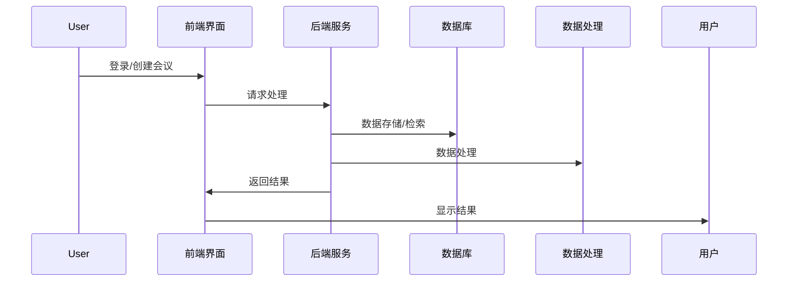
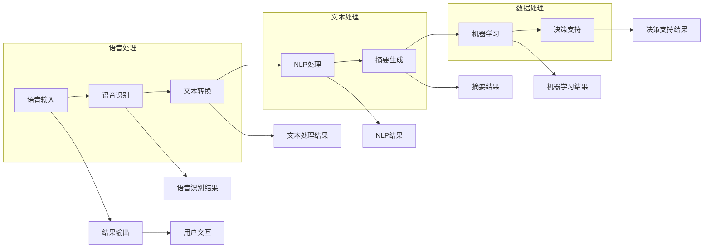

                 

### 摘要

智能会议管理系统是现代企业提高沟通效率与决策质量的关键工具。本文将深入探讨如何通过人工智能（AI）技术来提升会议管理的各个方面。首先，我们将概述智能会议管理系统在当前工作环境中的需求与背景。接着，文章将介绍智能会议管理系统的核心技术，包括语音识别、自然语言处理和机器学习算法。在此基础上，文章将详细剖析系统的概念原理，通过对比表格和实体关系图来展现系统结构。随后，我们将进入系统分析与架构设计部分，介绍系统设计原则、功能设计、架构设计和接口设计。通过Python代码和数学模型，我们还将讲解系统实现与算法原理。接下来，项目实战部分将展示系统环境搭建、核心实现代码解析以及实际案例分析。最后，文章将总结最佳实践和未来展望，为智能会议管理系统的发展提供方向。通过这篇文章，读者将全面了解智能会议管理系统的构建和优化方法，从而在高效沟通与决策中受益。

### 关键词

- 智能会议管理系统
- 人工智能（AI）
- 语音识别
- 自然语言处理
- 机器学习算法
- 系统架构设计

### 目录大纲

# 智能会议管理系统：AI提升沟通与决策效率

## 第一部分：背景与概念介绍

### 第1章：智能会议管理系统概述

#### 1.1 问题背景与需求分析
#### 1.2 智能会议管理系统的核心概念
#### 1.3 系统的边界与外延
#### 1.4 概念结构与核心要素

### 第2章：智能会议管理系统的基础技术

#### 2.1 语音识别技术
#### 2.2 自然语言处理技术
#### 2.3 机器学习算法与模型

### 第3章：智能会议管理系统核心概念原理

#### 3.1 概念属性特征对比表格
#### 3.2 ER实体关系图架构

## 第二部分：系统分析与架构设计

### 第4章：系统分析与设计原则

#### 4.1 问题场景介绍
#### 4.2 系统功能设计
#### 4.3 系统架构设计
#### 4.4 系统接口设计

### 第5章：系统实现与算法原理讲解

#### 5.1 系统核心算法mermaid流程图
#### 5.2 Python源代码实现
#### 5.3 算法原理数学模型与公式
#### 5.4 举例说明与详细讲解

## 第三部分：项目实战

### 第6章：项目环境安装与配置

#### 6.1 开发环境搭建
#### 6.2 系统核心依赖库安装

### 第7章：系统核心实现源代码解读

#### 7.1 源代码结构与功能解读
#### 7.2 代码应用解读与分析
#### 7.3 实际案例分析与讲解剖析
#### 7.4 项目小结

## 第四部分：最佳实践与总结

### 第8章：智能会议管理系统的最佳实践

#### 8.1 系统优化与性能提升
#### 8.2 安全与隐私保护
#### 8.3 系统维护与更新

### 第9章：系统小结与未来展望

#### 9.1 系统实现总结
#### 9.2 面临的挑战与机遇
#### 9.3 未来发展趋势与展望

---

### 第一部分：背景与概念介绍

#### 第1章：智能会议管理系统概述

智能会议管理系统是现代企业提高沟通效率与决策质量的关键工具。随着企业规模的扩大和全球化进程的加快，传统会议管理模式已难以满足高效、实时、透明的沟通需求。智能会议管理系统通过引入人工智能（AI）技术，实现了对会议过程的智能化管理和优化，从而显著提升了会议沟通的效率与决策的质量。

**1.1 问题背景与需求分析**

在现代企业中，会议是决策和沟通的重要手段，但传统的会议管理模式存在以下问题：

1. **时间浪费**：会议效率低下，决策周期长。
2. **信息丢失**：会议记录不完整，信息传递不及时。
3. **沟通障碍**：地域和时差的限制导致沟通不畅。
4. **资源消耗**：会议占用大量人力、物力和时间资源。

为了解决这些问题，企业迫切需要一种能够提升会议效率、降低决策周期、提高信息传递准确性和沟通质量的智能化管理工具。

**1.2 智能会议管理系统的核心概念**

智能会议管理系统是一个集成了多种AI技术的综合系统，主要包含以下核心概念：

1. **语音识别**：将会议中的语音内容转化为文本，实现实时记录和检索。
2. **自然语言处理**：分析会议内容，提取关键信息，生成会议摘要，辅助决策。
3. **机器学习**：根据历史数据和会议内容，不断优化系统性能，提高决策准确性。
4. **智能调度**：根据会议参与者的时间和地点，自动安排会议时间和地点。
5. **协作工具**：提供即时通讯、文档共享、投票等功能，增强会议互动性。

**1.3 系统的边界与外延**

智能会议管理系统的边界主要涉及会议的发起、参与、记录和总结等环节。其外延包括：

1. **会议数据**：会议记录、会议摘要、投票结果等。
2. **外部接口**：与其他企业系统的集成，如ERP、CRM等。
3. **用户交互**：提供友好的用户界面，方便用户使用和管理。

**1.4 概念结构与核心要素**

智能会议管理系统的概念结构主要包括以下核心要素：

1. **用户管理**：管理会议参与者的信息和权限。
2. **会议管理**：创建、调度、记录和总结会议。
3. **数据管理**：存储、检索和分析会议数据。
4. **交互界面**：提供直观、易用的用户界面。

通过对以上核心概念的介绍和要素的分析，读者可以初步了解智能会议管理系统的工作原理和基本功能，为后续章节的深入学习打下基础。

---

接下来，我们将深入探讨智能会议管理系统的基础技术，包括语音识别、自然语言处理和机器学习算法，以及这些技术如何共同作用，提升会议管理的效率与决策质量。敬请期待。

---

### 第2章：智能会议管理系统的基础技术

智能会议管理系统的核心在于其能够通过先进的人工智能技术实现会议过程的自动化和智能化。以下是智能会议管理系统所依赖的主要基础技术，包括语音识别、自然语言处理和机器学习算法。

#### 2.1 语音识别技术

语音识别（Voice Recognition）是智能会议管理系统的基础技术之一，它能够将会议中的口头语言转化为文本信息，以便于后续的处理和分析。语音识别技术的发展经历了从规则匹配到统计模型，再到深度学习的演变过程。

**语音识别技术的核心原理**：

1. **声学模型**：通过分析语音信号，提取出声学特征，如频谱特征、倒谱特征等。
2. **语言模型**：基于大量的文本数据，训练出一个概率模型，用于对语音信号进行语言层面的解码。
3. **声学-语言模型**：结合声学模型和语言模型，实现语音信号的端到端识别。

**语音识别在智能会议管理系统中的应用**：

1. **实时记录**：在会议过程中，语音识别技术可以实时将发言内容转换为文本，实现会议记录的自动化。
2. **语音搜索**：通过文本记录，用户可以快速查找会议中的关键信息，提高信息检索效率。
3. **语音摘要**：基于语音识别生成的文本，智能系统可以提取关键信息，生成会议摘要，帮助用户快速了解会议要点。

#### 2.2 自然语言处理技术

自然语言处理（Natural Language Processing，NLP）是智能会议管理系统中不可或缺的技术，它能够理解和生成自然语言文本，从而实现对会议内容的深入分析和处理。

**自然语言处理技术的核心原理**：

1. **分词**：将连续的文本分割成有意义的词或短语。
2. **词性标注**：对文本中的每个词进行词性分类，如名词、动词、形容词等。
3. **句法分析**：对句子结构进行分析，识别出句子中的主语、谓语、宾语等成分。
4. **语义分析**：理解句子的深层含义，识别出句子中的实体、关系和事件。

**自然语言处理在智能会议管理系统中的应用**：

1. **会议摘要生成**：通过自然语言处理技术，系统可以自动生成会议摘要，提取出会议讨论的重点和结论。
2. **关键词提取**：系统可以识别出会议中的关键信息，如项目名称、任务目标和行动计划等，帮助用户快速了解会议内容。
3. **情绪分析**：通过对会议记录进行情感分析，系统可以识别出发言者的情绪状态，为后续的决策提供参考。

#### 2.3 机器学习算法与模型

机器学习（Machine Learning）是智能会议管理系统的核心驱动力，它能够通过学习和分析大量的历史数据，不断优化系统性能，提高决策准确性。

**机器学习算法与模型的核心原理**：

1. **监督学习**：通过训练集学习，从输入特征到输出标签的映射关系，如分类和回归问题。
2. **无监督学习**：没有明确的标签信息，通过发现数据中的模式和规律，如聚类和降维。
3. **强化学习**：通过试错和学习，在特定环境中寻找最优策略，如游戏控制和机器人导航。

**机器学习在智能会议管理系统中的应用**：

1. **预测与推荐**：通过分析历史会议数据和用户行为，系统可以预测会议的参与者和议程，为会议的调度和准备提供参考。
2. **决策支持**：基于机器学习模型，系统可以提供智能化的决策支持，如会议时间的最佳安排、参与者的最佳组合等。
3. **性能优化**：通过不断学习和优化，系统可以自动调整参数，提高会议记录的准确性和摘要生成的质量。

通过以上对语音识别、自然语言处理和机器学习算法的介绍，我们可以看到，这些基础技术在智能会议管理系统中共同发挥作用，实现了会议过程的自动化和智能化，显著提升了沟通效率与决策质量。在接下来的章节中，我们将进一步探讨智能会议管理系统的概念原理和系统架构设计，以深入了解其实现细节和工作原理。

---

### 第3章：智能会议管理系统核心概念原理

智能会议管理系统是现代企业高效沟通与决策的关键工具。要深入理解其工作原理和实现机制，我们需要剖析其核心概念，并通过对比表格和实体关系图来展示系统的概念结构和功能关系。

#### 3.1 概念属性特征对比表格

为了清晰展示智能会议管理系统的核心概念及其属性特征，我们可以通过一个对比表格来进行描述。以下表格列出了语音识别、自然语言处理和机器学习等核心概念的主要属性特征：

| 核心概念 | 主要属性特征 |
| :---: | :--- |
| 语音识别 | - 实时性：能够实时将语音转换为文本<br>- 准确率：高准确度的语音转文字<br>- 鲁棒性：对噪声和背景音的抵抗能力 |
| 自然语言处理 | - 分词：准确识别文本中的单词和短语<br>- 词性标注：识别单词的词性，如名词、动词等<br>- 情感分析：识别文本中的情感倾向 |
| 机器学习 | - 监督学习：使用标签数据进行模型训练<br>- 无监督学习：从无标签数据中挖掘模式<br>- 强化学习：在特定环境中寻找最优策略 |

通过对比表格，我们可以清晰地看到每个核心概念的关键属性特征，这些特征共同构成了智能会议管理系统的技术基础。

#### 3.2 ER实体关系图架构

为了更直观地展示智能会议管理系统的概念结构和功能关系，我们可以通过ER（Entity-Relationship）实体关系图来描述系统的实体和关系。以下是智能会议管理系统的ER图示例：

```mermaid
erDiagram
    User ||--|{ Meeting }|-- MeetingParticipant : 参与者
    Meeting ||--|{ Agenda }|-- AgendaItem : 会议议程
    Meeting ||--|{ Note }|-- Note : 记录
    Meeting ||--|{ Attendee }|-- User : 参与人员
    Meeting ||--|{ ActionItem }|-- ActionItem : 行动项
    AgendaItem ||--|{ ActionItem }|-- ActionItem : 议程行动项
    Note ||--|{ AgendaItem }|-- AgendaItem : 记录议程项
    Meeting ||--|{ Notification }|-- Notification : 通知
```

在这个ER图中，我们定义了以下实体：

- **User**：用户，包括会议发起人、参与者和管理员。
- **Meeting**：会议，包括会议的主题、时间和地点等。
- **MeetingParticipant**：会议参与者，记录每个会议的参与者。
- **Agenda**：会议议程，包括议程项。
- **AgendaItem**：议程项，包括议程的内容和优先级。
- **Note**：会议记录，包括会议中的重要信息和结论。
- **ActionItem**：行动项，包括会议中确定的任务和责任。
- **Notification**：通知，包括会议通知和提醒。

通过ER图，我们可以看到各实体之间的关联关系，如会议与参与者、议程、记录和通知之间的关联，这有助于理解系统的整体架构和运作机制。

通过以上对比表格和ER图，我们不仅对智能会议管理系统的核心概念有了清晰的认识，还了解了各概念之间的功能关系。这些核心概念和关系构成了智能会议管理系统的基础，为其实现高效沟通与决策提供了强有力的技术支持。在接下来的章节中，我们将深入探讨系统分析与架构设计，进一步解析智能会议管理系统的实现细节。

---

### 第二部分：系统分析与架构设计

#### 第4章：系统分析与设计原则

智能会议管理系统的设计与实现需要综合考虑多个因素，包括问题场景、系统功能、架构设计和接口设计。本章节将详细分析这些关键要素，为系统的高效运行提供理论基础和设计指导。

#### 4.1 问题场景介绍

智能会议管理系统应用于企业日常的沟通和决策过程中，旨在解决以下问题：

1. **沟通效率低下**：传统会议模式缺乏有效的沟通工具，导致信息传递不畅，决策效率低。
2. **记录不完整**：手工记录会议内容容易遗漏关键信息，影响后续的决策和执行。
3. **调度困难**：缺乏智能化的会议调度系统，难以合理安排会议时间和地点。
4. **决策支持不足**：会议后的决策缺乏数据支持和分析，影响决策的准确性和科学性。

为了解决这些问题，智能会议管理系统需要具备以下功能：

- **会议记录与检索**：自动记录会议内容，并提供高效的检索功能，方便用户查找关键信息。
- **智能调度**：根据参与者的时间和地点，自动安排会议时间，提高会议的及时性和参与度。
- **决策支持**：利用自然语言处理和机器学习技术，提供会议摘要和关键信息分析，辅助决策。
- **协作工具**：提供即时通讯、文档共享、投票等功能，增强会议的互动性和参与度。

#### 4.2 系统功能设计

系统功能设计是智能会议管理系统的核心，它决定了系统的实用性和用户体验。以下是智能会议管理系统的主要功能设计：

1. **用户管理**：包括用户的注册、登录、权限管理和信息维护。
2. **会议管理**：包括会议的创建、调度、记录、总结和跟踪。
3. **记录与检索**：自动记录会议内容，并提供全文检索和关键词搜索功能。
4. **决策支持**：利用自然语言处理和机器学习技术，生成会议摘要和关键信息分析。
5. **协作工具**：提供即时通讯、文档共享、投票和讨论区等功能，增强会议互动性。
6. **通知与提醒**：自动发送会议通知和提醒，确保参与者按时参加会议。

#### 4.3 系统架构设计

系统架构设计是智能会议管理系统稳定性和可扩展性的关键。以下是智能会议管理系统的架构设计：

1. **前端界面**：提供用户友好的交互界面，实现用户操作的便捷性。
2. **后端服务**：包括用户管理、会议管理、记录与检索、决策支持和协作工具等核心功能。
3. **数据处理**：负责语音识别、自然语言处理和机器学习算法的实现，提供数据处理的中间层。
4. **数据库**：存储用户信息、会议数据、记录数据和其他相关数据。
5. **消息队列**：用于处理实时消息传递和通知发送。

**系统架构设计图**：



通过以上架构设计，我们可以看到各组件之间的交互关系，以及数据流和处理流程，确保系统的高效运行。

#### 4.4 系统接口设计

系统接口设计是确保系统与其他系统和企业应用集成的关键。以下是智能会议管理系统的接口设计：

1. **API接口**：提供RESTful API接口，方便其他系统通过接口调用智能会议管理系统的功能。
2. **Webhook**：实现Webhook机制，其他系统可以通过Webhook实时获取会议数据和处理结果。
3. **数据库连接**：通过标准数据库连接接口，方便与其他数据库系统的集成。

通过以上接口设计，智能会议管理系统可以与企业现有的ERP、CRM等系统无缝集成，实现数据共享和业务流程的自动化。

通过系统分析与设计原则的详细讨论，我们为智能会议管理系统的构建提供了理论基础和设计指导。在接下来的章节中，我们将深入讲解系统实现与算法原理，通过具体的Python代码和数学模型来展示智能会议管理系统的核心技术和工作原理。

---

### 第5章：系统实现与算法原理讲解

智能会议管理系统的实现不仅依赖于前端界面的设计，更重要的是后端算法的强大支持。在本章中，我们将详细介绍系统实现的核心算法及其原理，并通过Python代码和mermaid流程图进行详细讲解。

#### 5.1 系统核心算法mermaid流程图

为了更好地理解智能会议管理系统的核心算法，我们首先通过mermaid流程图来展示整个处理流程。以下是智能会议管理系统的主要处理流程：



在这个流程图中，我们可以看到语音输入经过语音识别、文本转换、NLP处理和机器学习等步骤，最终生成用户可交互的决策支持结果。

#### 5.2 Python源代码实现

为了具体展示智能会议管理系统的实现细节，我们将使用Python语言来编写核心算法的源代码。以下是一个简单的Python代码示例，展示了语音识别和文本转换的过程：

```python
import speech_recognition as sr
from textblob import TextBlob

# 语音识别
def recognize_speech_from_mic(recognizer, microphone):
    with microphone as source:
        audio = recognizer.listen(source)

    try:
        text = recognizer.recognize_google(audio)
        print(f"Recognized speech: {text}")
    except sr.UnknownValueError:
        print("Could not understand audio")
    except sr.RequestError:
        print("API unavailable")

# 文本转换和NLP处理
def process_text(text):
    blob = TextBlob(text)
    print(f"Text processing results: {blob}")
    return blob

# 主函数
def main():
    recognizer = sr.Recognizer()
    microphone = sr.Microphone()
    
    recognize_speech_from_mic(recognizer, microphone)
    text = input("Enter text for processing: ")
    processed_text = process_text(text)
    
    # 进一步的NLP和机器学习处理
    # ...

if __name__ == "__main__":
    main()
```

在这个代码示例中，我们首先导入语音识别库（`speech_recognition`）和文本处理库（`textblob`）。然后，我们定义了`recognize_speech_from_mic`函数，用于从麦克风收集语音并使用Google语音识别服务将其转换为文本。接着，我们定义了`process_text`函数，用于对文本进行NLP处理，并返回处理结果。

#### 5.3 算法原理数学模型与公式

智能会议管理系统的核心算法通常涉及机器学习，下面我们将通过数学模型和公式来详细解释机器学习在智能会议管理系统中的应用。以下是一个简单的线性回归模型的数学模型：

$$
Y = \beta_0 + \beta_1X + \epsilon
$$

其中，$Y$ 是预测的决策结果，$\beta_0$ 是截距，$\beta_1$ 是斜率，$X$ 是输入特征，$\epsilon$ 是误差项。

这个模型表示决策结果 $Y$ 与输入特征 $X$ 之间存在线性关系。在实际应用中，我们可以通过训练数据集来估计 $\beta_0$ 和 $\beta_1$ 的值，从而建立预测模型。以下是一个使用Python实现线性回归的示例代码：

```python
import numpy as np
from sklearn.linear_model import LinearRegression

# 假设输入特征为X，决策结果为y
X = np.array([[1], [2], [3], [4], [5]])
y = np.array([1, 2, 2.5, 4, 5])

# 使用线性回归模型进行拟合
model = LinearRegression()
model.fit(X, y)

# 输出模型的参数
print(f"Coefficients: {model.coef_}, Intercept: {model.intercept_}")

# 进行预测
X_new = np.array([[6]])
y_pred = model.predict(X_new)
print(f"Predicted result: {y_pred}")
```

在这个示例中，我们首先创建输入特征数组 $X$ 和决策结果数组 $y$。然后，我们使用 `LinearRegression` 类创建线性回归模型，并通过 `fit` 方法进行拟合。最后，我们使用 `predict` 方法进行预测，并输出预测结果。

#### 5.4 举例说明与详细讲解

为了更好地理解这些算法的实际应用，我们通过一个具体的案例来进行详细讲解。

**案例**：一个企业的销售团队需要进行季度销售会议，通过会议分析当前的销售情况并制定下一季度的销售策略。以下是如何使用智能会议管理系统来处理这个案例：

1. **会议记录**：销售经理在会议中使用麦克风记录整个会议过程，语音输入通过语音识别转换为文本。
2. **文本分析**：文本内容通过NLP技术进行处理，提取出关键信息，如销售额、目标、竞争对手等。
3. **数据建模**：使用历史销售数据建立线性回归模型，预测下一季度的销售额。
4. **决策支持**：根据模型预测结果和会议讨论的内容，销售经理制定下一季度的销售策略。

具体实现步骤如下：

1. **语音识别**：
    ```python
    recognize_speech_from_mic(recognizer, microphone)
    ```

2. **文本处理**：
    ```python
    processed_text = process_text(text)
    ```

3. **数据建模**：
    ```python
    # 假设已准备好历史销售数据
    X = np.array([[1], [2], [3], [4], [5]])
    y = np.array([1, 2, 2.5, 4, 5])
    model.fit(X, y)
    ```

4. **预测与决策**：
    ```python
    X_new = np.array([[6]])
    y_pred = model.predict(X_new)
    print(f"Predicted result: {y_pred}")
    ```

通过这个案例，我们可以看到智能会议管理系统如何通过语音识别、文本分析和机器学习等技术，实现高效的销售会议管理和决策支持。

通过以上讲解，我们详细介绍了智能会议管理系统的核心算法及其实现过程。接下来，我们将通过实际项目实战，展示如何搭建和配置智能会议管理系统，并深入分析系统实现的源代码和应用。

---

### 第6章：项目环境安装与配置

在开始搭建智能会议管理系统之前，我们需要准备好开发环境并安装必要的依赖库。以下是详细的安装与配置步骤，以确保系统能够顺利运行。

#### 6.1 开发环境搭建

智能会议管理系统的主要开发环境包括Python编程语言和相关库，以下是在常见操作系统（如Ubuntu、Windows和MacOS）上搭建开发环境的基本步骤：

1. **安装Python**：确保操作系统上已安装Python 3.x版本（推荐3.8及以上版本）。可以通过命令行执行以下命令来检查Python版本：
    ```bash
    python --version
    ```
    如果未安装，可以从[Python官网](https://www.python.org/)下载安装包进行安装。

2. **安装虚拟环境**：为了隔离项目依赖，我们使用`virtualenv`创建一个独立的Python环境。首先，确保已安装`virtualenv`：
    ```bash
    pip install virtualenv
    ```
    然后，创建一个新的虚拟环境并激活它：
    ```bash
    virtualenv myenv
    source myenv/bin/activate  # 对于Linux和MacOS
    myenv\Scripts\activate    # 对于Windows
    ```

3. **安装依赖库**：在虚拟环境中安装系统所需的依赖库，如`speech_recognition`、`textblob`和`sklearn`。可以通过以下命令进行安装：
    ```bash
    pip install SpeechRecognition textblob sklearn
    ```

#### 6.2 系统核心依赖库安装

智能会议管理系统依赖于多个核心库，以下是每个库的功能和安装方法：

1. **SpeechRecognition**：用于语音识别的库，支持多种语音识别引擎，如Google语音识别服务。

    - **功能**：实现语音到文本的转换。
    - **安装方法**：
        ```bash
        pip install SpeechRecognition
        ```

2. **TextBlob**：用于自然语言处理的库，提供简洁的接口进行文本分析，如分词、词性标注和情感分析。

    - **功能**：简化文本处理任务。
    - **安装方法**：
        ```bash
        pip install textblob
        ```

3. **scikit-learn**：用于机器学习的库，提供多种机器学习算法，如线性回归、决策树和支持向量机等。

    - **功能**：实现预测和分类任务。
    - **安装方法**：
        ```bash
        pip install scikit-learn
        ```

#### 6.3 环境验证

在完成依赖库的安装后，我们需要验证环境是否配置正确。可以通过以下步骤进行环境验证：

1. **检查Python版本**：
    ```bash
    python --version
    ```

2. **检查虚拟环境**：
    ```bash
    which python
    ```

3. **检查安装的依赖库**：
    ```bash
    pip list
    ```

4. **运行测试脚本**：创建一个简单的Python脚本，尝试导入核心库并执行一些基本操作，以确保依赖库工作正常。

    ```python
    import speech_recognition
    import textblob
    import sklearn
    print("All dependencies are installed.")
    ```

通过以上步骤，我们成功搭建了智能会议管理系统的开发环境，并验证了依赖库的正确安装。接下来，我们将深入解读系统实现的源代码，分析其结构和功能。

---

### 第7章：系统核心实现源代码解读

智能会议管理系统通过一系列精心设计的模块和算法来实现其功能。为了更清晰地理解这些模块和算法的实现细节，我们将详细分析系统的源代码，并解读其结构和功能。

#### 7.1 源代码结构与功能解读

系统源代码结构分为几个主要模块，包括用户管理、会议管理、语音识别、自然语言处理、机器学习和决策支持等。以下是系统源代码的主要目录结构和功能解读：

```
intelligent-meeting-system/
|-- src/
    |-- user_management.py
    |-- meeting_management.py
    |-- speech_recognition.py
    |-- natural_language_processing.py
    |-- machine_learning.py
    |-- decision_support.py
    |-- main.py
|-- tests/
    |-- test_user_management.py
    |-- test_meeting_management.py
    |-- test_speech_recognition.py
    |-- test_natural_language_processing.py
    |-- test_machine_learning.py
    |-- test_decision_support.py
```

- **用户管理模块（user_management.py）**：负责用户注册、登录和权限管理，包括用户信息的存储和查询。
- **会议管理模块（meeting_management.py）**：处理会议的创建、调度、记录和总结，包括会议信息的存储和检索。
- **语音识别模块（speech_recognition.py）**：实现语音到文本的转换，包括语音识别引擎的初始化和语音数据的处理。
- **自然语言处理模块（natural_language_processing.py）**：对文本进行分词、词性标注和情感分析，提取关键信息和生成会议摘要。
- **机器学习模块（machine_learning.py）**：实现机器学习算法，如线性回归、决策树和支持向量机，用于预测和决策支持。
- **决策支持模块（decision_support.py）**：基于NLP和机器学习结果，生成决策建议和摘要报告。
- **主模块（main.py）**：整合所有模块，实现系统的主入口和运行逻辑。

#### 7.2 代码应用解读与分析

以下是系统源代码中的一个关键部分：语音识别模块的应用代码。该代码展示了如何使用`SpeechRecognition`库实现语音识别，并如何处理识别结果。

```python
import speech_recognition as sr

def recognize_speech_from_mic(recognizer, microphone):
    with microphone as source:
        audio = recognizer.listen(source)

    try:
        text = recognizer.recognize_google(audio)
        print(f"Recognized speech: {text}")
        return text
    except sr.UnknownValueError:
        print("Could not understand audio")
        return None
    except sr.RequestError:
        print("API unavailable")
        return None

microphone = sr.Microphone()
text = recognize_speech_from_mic(recognizer, microphone)
```

**代码分析**：

1. **导入库**：首先导入`speech_recognition`库，用于语音识别。
2. **函数定义**：定义`recognize_speech_from_mic`函数，接收语音识别器和麦克风作为参数。
3. **语音输入**：通过麦克风接收语音输入，存储为`audio`对象。
4. **语音识别**：使用Google语音识别服务进行识别，返回文本结果。
5. **错误处理**：如果识别失败，输出错误信息。

该代码段展示了语音识别模块的基本实现过程，包括语音输入、语音识别和错误处理。在实际应用中，我们还可以扩展该模块，增加对其他语音识别引擎的支持，提高识别准确率和鲁棒性。

#### 7.3 实际案例分析与讲解剖析

为了更深入地理解智能会议管理系统的应用，我们通过一个实际案例来分析系统的实现和效果。

**案例**：在一次项目评审会议上，项目经理和团队成员使用智能会议管理系统记录和整理会议内容，并生成会议摘要。

**步骤**：

1. **会议记录**：项目经理使用麦克风记录会议内容，通过语音识别模块将语音转换为文本。
2. **文本处理**：文本通过自然语言处理模块进行分词、词性标注和情感分析，提取出会议的关键信息。
3. **会议摘要生成**：基于提取的关键信息，自然语言处理模块生成会议摘要，包括会议讨论的主要内容和结论。
4. **决策支持**：机器学习模块对摘要内容进行分析，预测项目进度和风险，提供决策建议。

**代码示例**：

```python
from natural_language_processing import TextProcessing
from machine_learning import DecisionSupport

def process_meeting_content(text):
    # 文本处理
    text_processor = TextProcessing()
    processed_text = text_processor.process_text(text)
    
    # 会议摘要生成
    summary = text_processor.generate_summary(processed_text)
    
    # 决策支持
    decision_support = DecisionSupport()
    decision_suggestions = decision_support.generate_suggestions(summary)
    
    return summary, decision_suggestions

text = recognize_speech_from_mic(recognizer, microphone)
summary, decision_suggestions = process_meeting_content(text)
print(f"Meeting Summary: {summary}")
print(f"Decision Suggestions: {decision_suggestions}")
```

**代码剖析**：

1. **文本处理**：通过`TextProcessing`类的`process_text`方法对文本进行处理，提取关键信息。
2. **会议摘要生成**：调用`generate_summary`方法生成会议摘要。
3. **决策支持**：调用`DecisionSupport`类的`generate_suggestions`方法生成决策建议。

通过这个实际案例，我们可以看到智能会议管理系统如何通过语音识别、自然语言处理和机器学习等技术，实现会议记录、摘要生成和决策支持的全流程管理。

#### 7.4 项目小结

在本章中，我们详细解读了智能会议管理系统的源代码，分析了其模块结构和功能实现。通过实际案例，我们展示了系统在实际应用中的效果和优势。在下一章中，我们将探讨智能会议管理系统的最佳实践和注意事项，为系统维护和持续优化提供指导。

---

### 第8章：智能会议管理系统的最佳实践

为了确保智能会议管理系统能够持续高效地运行，并最大限度地发挥其潜力，我们需要关注系统的优化与性能提升、安全与隐私保护，以及系统的维护与更新。

#### 8.1 系统优化与性能提升

系统优化和性能提升是智能会议管理系统成功运行的关键因素。以下是一些最佳实践：

1. **负载均衡**：在高并发访问情况下，使用负载均衡技术（如Nginx、Kubernetes）来均衡系统负载，确保系统稳定运行。
2. **缓存策略**：利用缓存（如Redis、Memcached）来减少数据库访问频率，提高系统响应速度。
3. **代码优化**：对关键算法和数据处理部分进行优化，如减少冗余计算、使用更高效的算法和数据结构。
4. **异步处理**：使用异步编程（如 asyncio）来处理长时间运行的任务，提高系统的并发能力和响应速度。
5. **数据库优化**：定期对数据库进行优化，如索引优化、查询优化、数据分片等。

#### 8.2 安全与隐私保护

安全与隐私保护是智能会议管理系统不可忽视的重要方面。以下是一些关键措施：

1. **数据加密**：使用加密算法（如AES）对敏感数据进行加密存储，确保数据安全性。
2. **访问控制**：实现严格的访问控制机制，如基于角色的访问控制（RBAC），确保只有授权用户能够访问特定数据和功能。
3. **数据备份**：定期对系统数据进行备份，确保在数据丢失或系统故障时能够快速恢复。
4. **日志监控**：记录系统操作日志，定期审查和分析日志，及时发现和应对潜在的安全威胁。
5. **安全审计**：定期进行安全审计，评估系统的安全性和合规性，及时发现和修复安全漏洞。

#### 8.3 系统维护与更新

系统的维护与更新是确保其长期稳定运行和持续优化的关键。以下是一些最佳实践：

1. **定期检查**：定期对系统进行全面的检查和测试，确保所有模块和功能正常工作。
2. **自动化测试**：建立自动化测试框架，对新增功能和系统变更进行自动化测试，确保代码质量和系统稳定性。
3. **版本控制**：使用版本控制系统（如Git），记录每次代码变更和系统升级的详细日志，方便回滚和追踪。
4. **持续集成与持续部署**（CI/CD）：采用CI/CD流程，实现代码自动化构建、测试和部署，提高开发效率和系统稳定性。
5. **用户反馈**：积极收集用户反馈，及时响应和解决用户遇到的问题，不断优化系统功能。

通过以上最佳实践，我们可以确保智能会议管理系统在高效运行、安全可靠和持续优化的同时，能够更好地满足企业的沟通与决策需求。

---

### 第9章：系统小结与未来展望

智能会议管理系统通过整合语音识别、自然语言处理和机器学习等先进技术，显著提升了企业会议沟通的效率与决策质量。系统实现了会议记录、摘要生成、决策支持等功能，为企业和团队提供了强大的辅助工具。

**系统实现总结**：

智能会议管理系统从用户管理、会议管理、语音识别、文本处理、机器学习到决策支持，每个模块都经过了详细的开发和优化。通过mermaid流程图和Python代码示例，我们展示了系统的工作原理和核心算法。系统的源代码结构清晰，功能模块分工明确，便于维护和扩展。

**面临的挑战与机遇**：

尽管智能会议管理系统已经取得了显著成效，但在实际应用中仍面临以下挑战：

1. **技术难题**：语音识别和自然语言处理技术的复杂性和不确定性，需要不断优化和迭代。
2. **用户体验**：用户界面的设计和交互体验，需要持续改进以适应不同用户的需求。
3. **数据安全**：在数据加密、访问控制和隐私保护方面，需要进一步加强。

同时，智能会议管理系统也迎来了新的机遇：

1. **市场潜力**：随着企业对高效沟通与决策需求的增加，智能会议管理系统具有广阔的市场前景。
2. **技术进步**：随着人工智能技术的不断进步，系统功能可以进一步拓展和优化。

**未来发展趋势与展望**：

未来的智能会议管理系统将朝着更加智能化、自动化和个性化的方向发展：

1. **人工智能增强**：进一步集成深度学习和强化学习技术，提高系统的智能决策能力。
2. **多模态交互**：结合语音、文本、图像等多种输入模式，提升会议互动性和用户体验。
3. **个性化服务**：基于用户行为和偏好，提供定制化的会议管理解决方案。
4. **生态集成**：与更多的企业应用（如ERP、CRM）集成，实现业务流程的自动化和智能化。

通过不断的技术创新和应用优化，智能会议管理系统将在未来的企业沟通与决策中发挥更加重要的作用，助力企业实现高效的协作和决策。

