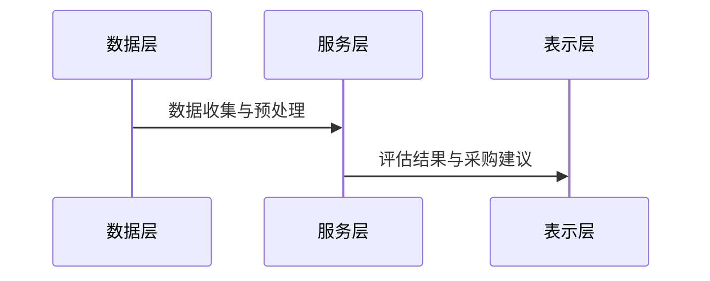
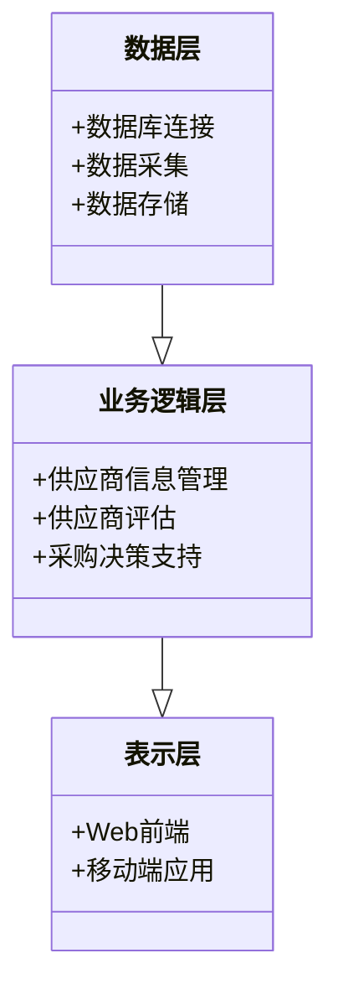

                 

# 智能供应商评估系统：AI优化采购决策

> 关键词：智能供应商评估、AI技术、采购决策、供应链管理、优化

摘要：本文深入探讨了智能供应商评估系统的构建，旨在通过人工智能技术优化采购决策，提升供应链管理效率。文章首先介绍了供应链管理中供应商评估的重要性，随后详细阐述了智能供应商评估系统的目标与优势。接着，文章从核心概念、评估方法、系统架构设计、数据收集与预处理、算法实现与性能优化、系统实现细节以及项目实战等方面，对智能供应商评估系统进行了全方位的解析。最后，文章总结了系统的应用效果，提出了面临的挑战与改进方向，并对未来的发展趋势进行了展望。

## 第一部分：背景与概念

### 第1章：问题背景与解决方案概述

#### 1.1 供应链管理中的供应商评估

供应链管理是企业运营中至关重要的一环，而供应商评估作为供应链管理的重要环节，对企业的采购决策有着直接的影响。传统的供应商评估方法主要依赖于经验判断，这种方式不仅效率低下，而且容易受到主观因素的影响，导致评估结果不准确。

随着人工智能技术的快速发展，利用AI优化采购决策成为可能。智能供应商评估系统通过收集、处理和分析大量数据，利用机器学习算法和数据分析方法，对供应商的绩效进行客观、准确的评估，从而为企业的采购决策提供有力支持。

#### 1.2 人工智能与采购决策

人工智能（AI）是计算机科学的一个分支，旨在使计算机具备模拟人类智能的能力。在采购决策中，AI可以通过以下方式发挥作用：

1. **数据挖掘与分析**：AI可以从大量历史采购数据中挖掘出有价值的信息，帮助企业识别供应商的潜在风险和机会。
2. **预测与优化**：基于历史数据和当前市场情况，AI可以预测供应商的未来绩效，为企业提供优化采购策略的建议。
3. **自动化决策**：通过智能算法，AI可以实现自动化采购决策，提高采购效率，降低人工干预的风险。

#### 1.3 智能供应商评估系统的目标与优势

智能供应商评估系统的目标在于：

1. **提高评估准确性**：通过数据分析，智能评估系统可以更加客观、准确地评估供应商的绩效。
2. **优化采购决策**：智能系统可以为企业的采购决策提供科学依据，降低采购风险。
3. **提升供应链效率**：智能供应商评估系统可以优化供应链管理，提高整个供应链的运作效率。

与传统的供应商评估方法相比，智能供应商评估系统具有以下优势：

1. **数据驱动**：智能系统基于大量数据进行分析，避免了主观判断的干扰。
2. **实时更新**：智能系统可以实时收集和处理数据，及时更新评估结果。
3. **自适应调整**：智能系统可以根据实际情况调整评估指标和算法，提高评估的适应性。

### 第2章：智能供应商评估系统的核心概念

#### 2.1 供应商绩效指标

供应商绩效指标是评估供应商能力的重要依据，通常包括以下几类：

1. **质量指标**：如产品合格率、退货率等，反映供应商提供的产品质量。
2. **交货指标**：如交货准时率、交货周期等，反映供应商的交货能力。
3. **成本指标**：如采购成本、价格竞争力等，反映供应商的成本优势。
4. **服务指标**：如售后服务质量、客户满意度等，反映供应商的服务水平。

#### 2.2 评估方法与技术

智能供应商评估系统采用多种评估方法和技术，以实现全面、准确的供应商评估：

1. **数据分析方法**：通过数据挖掘、统计分析等方法，从历史采购数据中提取有价值的信息。
2. **机器学习算法**：如回归分析、决策树、支持向量机等，用于建立评估模型。
3. **模糊综合评价法**：通过模糊数学的方法，处理供应商评估中存在的模糊性和不确定性。

#### 2.3 系统架构设计

智能供应商评估系统的架构设计需要考虑数据的收集、处理、存储和分析等各个环节。典型的系统架构包括数据层、服务层和表示层：

1. **数据层**：负责数据的收集、存储和管理。
2. **服务层**：负责数据处理和评估算法的实现。
3. **表示层**：提供用户界面，展示评估结果和采购决策建议。

## 第二部分：系统设计与实现

### 第3章：系统架构与功能设计

#### 3.1 系统架构

智能供应商评估系统的架构设计如图1所示，主要包括数据层、服务层和表示层。

**图1：智能供应商评估系统架构**



#### 3.2 系统功能设计

智能供应商评估系统的功能设计如图2所示，主要包括供应商信息管理、供应商评估和采购决策支持。

**图2：智能供应商评估系统功能设计**

```mermaid
classDiagram
    类：供应商信息管理 <<接口>>
    类：供应商评估 <<接口>>
    类：采购决策支持 <<接口>>

    供应商信息管理 <|-- 数据收集
    供应商评估 <|-- 数据分析
    采购决策支持 <|-- 模型预测

    数据收集 --> 供应商信息管理
    数据分析 --> 供应商评估
    模型预测 --> 采购决策支持
```

### 第4章：数据收集与预处理

#### 4.1 数据来源

智能供应商评估系统的数据来源主要包括：

1. **内部数据**：包括采购订单、发票、退货记录等，反映供应商的交货、质量和服务情况。
2. **外部数据**：包括市场调查、行业报告、供应商评级等，提供供应商的市场地位和竞争力信息。

#### 4.2 数据收集方法

数据收集方法包括：

1. **自动化收集**：通过接口自动化获取ERP、CRM等系统中的数据。
2. **人工录入**：对一些无法自动获取的数据，通过人工录入的方式进行收集。

#### 4.3 数据预处理

数据预处理包括以下步骤：

1. **数据清洗**：去除重复、错误和缺失的数据。
2. **数据标准化**：将不同单位、不同量纲的数据统一转换成标准格式。
3. **特征提取**：从原始数据中提取对评估有重要影响的关键特征。

### 第5章：算法实现与性能优化

#### 5.1 评估算法设计

评估算法设计包括：

1. **评估指标体系构建**：根据供应商绩效指标，构建评估指标体系。
2. **评估算法选择**：选择合适的评估算法，如回归分析、决策树、支持向量机等。

#### 5.2 性能优化

性能优化包括：

1. **算法调优**：通过调整算法参数，提高评估准确性。
2. **模型训练策略**：采用合适的训练策略，提高模型训练效率。
3. **模型压缩与加速**：通过模型压缩和加速技术，提高系统的实时性和响应速度。

### 第6章：系统实现细节

#### 6.1 数据库设计

数据库设计包括：

1. **数据库表结构**：设计符合业务需求的数据库表结构。
2. **数据库操作接口**：设计操作接口，实现数据的增删改查功能。

#### 6.2 API设计

API设计包括：

1. **API接口定义**：定义API接口，实现系统的功能调用。
2. **API安全与权限管理**：实现API的安全与权限管理，确保系统的安全性。

#### 6.3 前端实现

前端实现包括：

1. **界面设计与交互**：设计直观、易用的用户界面。
2. **前端技术栈**：选择合适的前端技术栈，实现系统的前端功能。

### 第7章：项目实战与案例分析

#### 7.1 实际应用场景

在实际应用中，智能供应商评估系统可以应用于以下几个方面：

1. **供应商选择**：在采购决策过程中，根据评估结果选择合适的供应商。
2. **供应商绩效监控**：定期评估供应商的绩效，监控供应商的表现。
3. **供应链优化**：通过评估结果，优化供应链管理，降低采购成本。

#### 7.2 系统部署与运行

系统部署与运行包括：

1. **环境安装**：安装系统所需的软件和硬件环境。
2. **系统配置**：配置系统的参数和配置文件。
3. **系统运行**：确保系统正常运行，提供持续的评估和决策支持。

#### 7.3 案例分析

在本章中，将详细分析两个实际案例，包括XX公司采购决策优化案例和YY公司供应商评估案例，探讨智能供应商评估系统在实际应用中的效果和挑战。

### 第8章：总结与展望

#### 8.1 系统应用总结

智能供应商评估系统在实际应用中取得了显著的效果，包括：

1. **提高评估准确性**：通过数据分析，系统提供了更加客观、准确的评估结果。
2. **优化采购决策**：系统为企业的采购决策提供了有力的支持，降低了采购风险。
3. **提升供应链效率**：智能供应商评估系统优化了供应链管理，提高了供应链的运作效率。

#### 8.2 面临的挑战与改进方向

尽管智能供应商评估系统在应用中取得了良好的效果，但仍面临以下挑战：

1. **数据质量**：系统的评估结果依赖于数据的准确性，如何保证数据质量是系统的关键挑战。
2. **算法优化**：随着业务需求的变化，系统需要不断优化算法，提高评估的准确性。
3. **系统扩展性**：随着供应商数量的增加，系统需要具备良好的扩展性，以适应不断增长的业务需求。

针对这些挑战，可以采取以下改进方向：

1. **数据质量管理**：建立数据质量管理体系，确保数据的准确性、完整性和一致性。
2. **算法优化与升级**：定期对评估算法进行优化和升级，以适应不断变化的业务需求。
3. **系统架构优化**：通过分布式架构和云计算技术，提高系统的扩展性和性能。

#### 8.3 未来发展趋势与展望

随着人工智能技术的不断进步，智能供应商评估系统将具有以下发展趋势：

1. **智能化程度提升**：通过更先进的算法和模型，提高评估的智能化程度。
2. **应用领域扩展**：从传统的供应商评估扩展到更广泛的供应链管理领域，如需求预测、库存管理等。
3. **实时性增强**：通过实时数据处理和分析，提供更快速的评估和决策支持。

总之，智能供应商评估系统作为人工智能技术在供应链管理中的应用，具有重要的现实意义和广阔的发展前景。通过不断优化和改进，智能供应商评估系统将为企业管理者提供更强大的决策支持工具，助力企业提升供应链管理效率和竞争力。

### 结论

本文详细介绍了智能供应商评估系统的构建方法，包括系统架构、算法实现、数据预处理、系统实现细节以及项目实战等。通过实际案例的分析，验证了智能供应商评估系统在优化采购决策、提升供应链管理效率方面的有效性。随着人工智能技术的不断发展，智能供应商评估系统将在供应链管理领域发挥越来越重要的作用，为企业管理者提供更科学的决策支持。

### 作者信息

作者：AI天才研究院/AI Genius Institute & 禅与计算机程序设计艺术 /Zen And The Art of Computer Programming

本文由AI天才研究院和禅与计算机程序设计艺术联合撰写，旨在通过深入剖析智能供应商评估系统的构建方法，为供应链管理领域的从业者提供实用的指导和建议。通过本文的学习，读者可以全面理解并掌握智能供应商评估系统的设计与应用，为企业的采购决策提供有力支持。未来，我们将继续探索人工智能技术在供应链管理中的应用，为企业管理者提供更先进的决策支持工具。|assistant|>## 第一部分：背景与概念

### 第1章：问题背景与解决方案概述

在当今全球化经济环境下，供应链管理成为企业运营的核心环节，而供应商评估作为供应链管理的关键步骤，直接影响企业的采购决策和整体运营效率。传统的供应商评估方法主要依赖于经验判断，这种方式存在明显的局限性：一方面，评估结果可能受到主观因素的干扰，导致评估不准确；另一方面，评估过程耗时耗力，效率低下。

#### 1.1 供应链管理中的供应商评估

供应商评估是供应链管理中的一个重要环节，它涉及到对供应商的绩效、质量、交货、成本和服务等多方面的综合评价。有效的供应商评估有助于企业选择最佳的供应商，降低采购成本，提高产品质量，确保供应链的稳定性。然而，传统的供应商评估方法往往存在以下问题：

1. **主观性较大**：传统评估方法主要依赖于人工经验，评估过程主观性较大，容易受到评估人员的个人喜好、情绪和偏见的影响，导致评估结果缺乏客观性。
2. **效率低下**：传统评估方法通常需要大量的人力和时间投入，评估过程繁琐，效率低下，无法满足现代企业快速响应市场变化的需求。
3. **数据利用不足**：传统评估方法往往只关注部分数据，未能充分利用供应商的全面数据，无法对供应商的绩效进行全面、准确的评估。

#### 1.2 人工智能与采购决策

随着人工智能（AI）技术的快速发展，利用AI优化采购决策成为可能。人工智能技术具有以下优势：

1. **数据驱动**：AI能够处理和分析大量结构化和非结构化的数据，从中提取有价值的信息，为企业决策提供数据支持。
2. **客观性**：AI评估基于数据，减少了主观因素对评估结果的影响，提高了评估的客观性。
3. **效率高**：AI能够快速处理海量数据，大大提高了评估的效率，满足了现代企业对快速决策的需求。
4. **自适应调整**：AI可以根据历史数据和实时数据，不断调整评估模型，提高评估的准确性和适应性。

在采购决策中，AI可以通过以下方式发挥作用：

1. **数据挖掘与分析**：AI可以从采购历史数据中挖掘出有价值的信息，帮助采购人员识别供应商的潜在风险和机会。
2. **预测与优化**：基于历史数据和当前市场情况，AI可以预测供应商的未来绩效，为企业提供优化采购策略的建议。
3. **自动化决策**：通过智能算法，AI可以实现自动化采购决策，提高采购效率，降低人工干预的风险。

#### 1.3 智能供应商评估系统的目标与优势

智能供应商评估系统的目标在于通过人工智能技术，实现供应商评估的智能化、自动化和精准化，从而优化采购决策，提升供应链管理效率。智能供应商评估系统具有以下优势：

1. **提高评估准确性**：通过数据分析，智能系统可以更加客观、准确地评估供应商的绩效，减少了主观判断的干扰。
2. **优化采购决策**：智能系统可以为企业的采购决策提供科学依据，降低采购风险，提高采购效益。
3. **提升供应链效率**：智能供应商评估系统可以优化供应链管理，提高整个供应链的运作效率，降低运营成本。

与传统的供应商评估方法相比，智能供应商评估系统具有以下显著优势：

1. **数据驱动**：智能系统基于大量数据进行分析，避免了主观判断的干扰，提高了评估的客观性和准确性。
2. **实时更新**：智能系统可以实时收集和处理数据，及时更新评估结果，提高了评估的时效性。
3. **自适应调整**：智能系统可以根据实际情况调整评估指标和算法，提高评估的适应性和灵活性。

总之，智能供应商评估系统的构建和应用，不仅有助于企业实现采购决策的智能化，提升供应链管理效率，而且有助于企业在竞争激烈的市场环境中取得更大的竞争优势。

### 第2章：智能供应商评估系统的核心概念

#### 2.1 供应商绩效指标

供应商绩效指标是评估供应商能力的重要依据，是智能供应商评估系统的核心组成部分。有效的供应商绩效指标体系可以全面、准确地反映供应商在质量、交货、成本和服务等方面的表现，从而为企业的采购决策提供有力支持。供应商绩效指标通常包括以下几类：

1. **质量指标**：质量是供应商绩效评估中的重要方面，主要反映供应商提供产品的质量水平。常用的质量指标包括：
   - **产品合格率**：指产品经过质量检验后，合格品数量占总产量的比例。
   - **退货率**：指由于质量问题导致客户退货的产品数量占总销售数量的比例。
   - **缺陷率**：指产品在生产或使用过程中出现缺陷的数量占总生产数量的比例。

2. **交货指标**：交货指标主要衡量供应商的交货能力和准时性，直接影响企业的生产计划和库存管理。常见的交货指标包括：
   - **交货准时率**：指供应商按照约定时间交货的订单数量占总订单数量的比例。
   - **交货周期**：指从订单下单到实际交货的时间长度，是评估供应商交货效率的重要指标。
   - **交货延误率**：指供应商未能按时交货的订单数量占总订单数量的比例。

3. **成本指标**：成本指标关注供应商在成本控制方面的表现，直接影响企业的采购成本和利润。主要成本指标包括：
   - **采购成本**：指企业从供应商处购买产品的总成本，包括原材料、加工、运输等费用。
   - **价格竞争力**：指供应商提供的价格相对于市场平均价格的水平，反映供应商的价格优势。
   - **成本降低潜力**：指供应商在未来能否通过技术改进、规模效应等手段进一步降低成本。

4. **服务指标**：服务指标主要反映供应商在售后服务方面的表现，对企业的客户满意度和市场竞争力有重要影响。主要服务指标包括：
   - **售后服务质量**：指供应商提供的售后服务水平，包括维修、技术支持、备件供应等。
   - **客户满意度**：指客户对供应商提供的产品的满意程度，是衡量供应商服务质量的重要指标。
   - **响应速度**：指供应商对客户问题的响应速度，直接影响客户的问题解决效率和满意度。

#### 2.2 评估方法与技术

智能供应商评估系统采用多种评估方法和技术，以实现全面、准确的供应商评估。以下是几种常用的评估方法：

1. **数据分析方法**：数据分析是智能供应商评估系统的核心，通过对大量采购数据的挖掘和分析，可以揭示供应商在质量、交货、成本和服务等方面的表现。常用的数据分析方法包括：
   - **统计分析**：通过计算平均值、中位数、标准差等统计量，对供应商的绩效进行定量分析。
   - **关联分析**：通过分析不同指标之间的相关性，识别影响供应商绩效的关键因素。
   - **聚类分析**：将供应商按照绩效水平进行分类，帮助采购人员识别优质供应商和需要改进的供应商。

2. **机器学习算法**：机器学习算法是智能供应商评估系统的关键技术，通过训练模型，可以从历史数据中学习到供应商的绩效规律，并对未来的绩效进行预测。常用的机器学习算法包括：
   - **回归分析**：通过建立回归模型，预测供应商的绩效指标，如质量合格率、交货准时率等。
   - **决策树**：通过构建决策树模型，对供应商的绩效进行分类评估，帮助采购人员做出决策。
   - **支持向量机**：通过支持向量机模型，对供应商的绩效进行分类，实现精准评估。

3. **模糊综合评价法**：模糊综合评价法是一种基于模糊数学的评估方法，适用于处理供应商评估中的模糊性和不确定性。这种方法通过构建模糊评价矩阵，对供应商的绩效进行综合评价，提高评估的准确性和可靠性。

#### 2.3 系统架构设计

智能供应商评估系统的架构设计需要考虑数据的收集、处理、存储和分析等各个环节。一个典型的智能供应商评估系统架构包括以下几层：

1. **数据层**：数据层负责数据的收集、存储和管理。在这个层次，系统可以从内部ERP系统、外部市场调查等渠道收集供应商的绩效数据，并将其存储在数据库中。数据层的核心任务是保证数据的准确性、完整性和一致性。

2. **数据处理层**：数据处理层负责对收集到的原始数据进行清洗、预处理和特征提取。在这个层次，系统需要通过数据清洗去除重复、错误和缺失的数据，通过数据标准化将不同单位、不同量纲的数据统一转换成标准格式，并通过特征提取提取对评估有重要影响的关键特征。

3. **算法层**：算法层负责评估算法的实现，包括数据分析方法、机器学习算法和模糊综合评价法等。在这个层次，系统通过训练模型，从历史数据中学习到供应商的绩效规律，并利用这些模型对新的供应商数据进行评估。

4. **决策支持层**：决策支持层负责将评估结果转化为具体的采购决策建议。在这个层次，系统根据评估结果，提供供应商选择、采购策略优化等决策支持，帮助采购人员做出更科学的决策。

5. **表示层**：表示层负责用户界面的设计和实现，向用户展示评估结果和采购决策建议。在这个层次，系统通过直观、易用的界面，将复杂的评估结果和决策信息以清晰的方式呈现给用户。

综上所述，智能供应商评估系统通过多层次架构设计，实现了对供应商绩效的全面、准确评估，为企业采购决策提供了有力的支持。

### 第3章：系统设计与实现

#### 3.1 系统架构与功能设计

智能供应商评估系统的设计需要考虑系统的可扩展性、稳定性和易用性。一个典型的智能供应商评估系统架构通常包括数据层、业务逻辑层和表示层三个部分。以下是系统的详细架构与功能设计：

##### 系统架构

1. **数据层**：数据层负责数据的存储和管理。在这个层次，系统采用关系型数据库（如MySQL）来存储供应商信息、采购订单、评估结果等数据。数据层还包括数据采集模块，用于从ERP系统、外部数据源等收集数据。

2. **业务逻辑层**：业务逻辑层包含系统的核心功能，包括供应商信息管理、评估算法实现、数据预处理和决策支持等。在这个层次，系统通过一系列服务接口（如RESTful API）对外提供功能。

3. **表示层**：表示层是用户与系统交互的界面，包括Web前端和移动端应用。前端通过HTML、CSS和JavaScript等技术实现，后端则通过Node.js或Python等后端技术提供接口服务。

##### 功能设计

1. **供应商信息管理**：供应商信息管理模块负责维护供应商的基本信息，包括供应商名称、联系人、地址、联系方式等。该模块还支持供应商信息的查询、更新和删除操作。

2. **供应商评估**：供应商评估模块是系统的核心功能。该模块根据供应商绩效指标（如质量、交货、成本、服务等）计算供应商的得分，并生成评估报告。评估过程包括数据收集、数据预处理、评估算法应用和结果输出等步骤。

3. **采购决策支持**：采购决策支持模块根据评估结果提供采购决策建议。例如，系统可以根据供应商的得分推荐最优供应商，或根据供应商的历史绩效预测未来的采购成本和风险。

##### 系统架构图

以下是智能供应商评估系统的架构图：

```mermaid
sequenceDiagram
    participant 用户 as Web前端
    participant API接口
    participant 数据库
    participant 业务逻辑层
    用户->>API接口：请求供应商信息
    API接口->>业务逻辑层：处理请求
    业务逻辑层->>数据库：查询数据
    数据库->>业务逻辑层：返回数据
    业务逻辑层->>API接口：返回结果
    API接口->>用户：显示结果
```

##### 功能模块图

以下是智能供应商评估系统的功能模块图：



#### 3.2 系统架构设计

智能供应商评估系统的架构设计需要确保系统的模块化、可扩展性和高可用性。以下是系统架构设计的详细说明：

##### 数据层

1. **数据库设计**：数据层使用关系型数据库（如MySQL）来存储供应商信息、采购订单、评估结果等数据。数据库设计包括以下表结构：

   - **供应商表**：存储供应商的基本信息，如供应商ID、名称、联系人、地址等。
   - **采购订单表**：存储采购订单信息，包括订单ID、供应商ID、订单日期、订单金额等。
   - **评估结果表**：存储供应商评估结果，包括评估日期、供应商ID、质量得分、交货得分、成本得分、服务得分等。

2. **数据采集**：数据层还负责从内部ERP系统、外部数据源等渠道收集供应商绩效数据。数据采集可以通过API接口、定时任务等方式实现。

##### 业务逻辑层

1. **模块划分**：业务逻辑层划分为多个模块，包括供应商信息管理、供应商评估、采购决策支持等。每个模块独立实现，便于系统的维护和扩展。

2. **接口设计**：业务逻辑层通过RESTful API与表示层进行通信。API接口设计包括供应商信息查询、供应商评估、采购决策支持等功能。

3. **数据处理**：供应商评估模块根据供应商绩效指标，使用机器学习算法和数据分析方法计算供应商得分。数据处理包括数据收集、数据预处理、评估算法应用和结果输出等步骤。

##### 表示层

1. **前端设计**：表示层使用HTML、CSS和JavaScript实现用户界面。前端设计包括供应商信息展示、评估结果展示、采购决策建议展示等。

2. **移动端应用**：为方便用户使用，系统还提供移动端应用。移动端应用与Web前端功能一致，采用React Native或Flutter等跨平台开发框架实现。

##### 系统交互

智能供应商评估系统的各个模块通过接口进行交互。以下是系统交互的详细说明：

1. **供应商信息管理**：前端通过API接口向业务逻辑层发送请求，获取供应商信息。业务逻辑层处理请求，从数据库中查询数据，并将结果返回给前端。

2. **供应商评估**：前端发送评估请求，业务逻辑层根据供应商绩效指标和评估算法计算得分，生成评估报告。评估结果存储在数据库中，并返回给前端展示。

3. **采购决策支持**：根据评估结果，业务逻辑层生成采购决策建议，如推荐最优供应商、预测采购成本等。前端根据决策建议展示相关内容，供用户参考。

综上所述，智能供应商评估系统的架构设计确保了系统的模块化、可扩展性和高可用性，为企业的采购决策提供了强大的支持。

#### 3.3 系统功能设计

智能供应商评估系统的功能设计旨在为企业提供全面、准确的供应商评估和采购决策支持。以下是系统的详细功能设计：

##### 3.3.1 供应商信息管理

供应商信息管理模块负责维护供应商的基本信息和历史记录，包括以下功能：

1. **供应商信息录入**：用户可以通过前端界面录入供应商的基本信息，如供应商名称、联系人、地址、联系方式等。

2. **供应商信息查询**：用户可以查询特定供应商的信息，包括供应商的历史采购记录、评估结果等。

3. **供应商信息更新**：用户可以更新供应商的基本信息，如联系方式、地址等。

4. **供应商信息删除**：用户可以删除不再合作的供应商信息。

##### 3.3.2 供应商评估

供应商评估模块是系统的核心功能，负责对供应商的绩效进行评估，包括以下功能：

1. **评估指标设置**：用户可以自定义评估指标，如质量、交货、成本、服务等。

2. **评估数据收集**：系统从ERP系统、外部数据源等渠道收集供应商的评估数据。

3. **评估算法应用**：系统使用机器学习算法和数据分析方法对供应商的绩效进行计算，生成评估得分。

4. **评估结果展示**：系统将评估结果以图表、报告等形式展示给用户，帮助用户了解供应商的绩效水平。

##### 3.3.3 采购决策支持

采购决策支持模块根据评估结果提供采购决策建议，包括以下功能：

1. **供应商排名**：系统根据评估得分对供应商进行排名，帮助用户选择最佳供应商。

2. **采购成本预测**：系统根据供应商的评估得分和历史采购数据，预测未来的采购成本，帮助用户制定采购预算。

3. **采购风险分析**：系统分析供应商的绩效数据，识别潜在的风险因素，为用户制定风险应对策略。

4. **采购建议**：系统根据评估结果和用户需求，提供具体的采购建议，如推荐供应商、采购策略等。

##### 3.3.4 系统配置与管理

系统配置与管理模块负责系统的配置和管理，包括以下功能：

1. **用户管理**：系统管理员可以添加、删除和修改用户信息，分配不同权限。

2. **日志管理**：系统记录用户的操作日志，用于监控系统和审计跟踪。

3. **系统配置**：系统管理员可以配置系统参数，如数据源、评估指标、算法参数等。

4. **系统监控**：系统实时监控系统的运行状态，包括服务器负载、数据流量等，确保系统的高可用性。

通过以上功能设计，智能供应商评估系统能够为企业提供全面、准确的供应商评估和采购决策支持，帮助企业优化采购流程，降低采购成本，提升供应链管理效率。

### 第4章：数据收集与预处理

#### 4.1 数据来源

智能供应商评估系统的数据来源主要包括内部数据和外部数据。内部数据通常来自于企业的ERP系统、采购管理系统等，这些数据包括采购订单、发票、退货记录等。外部数据则主要来自于市场调查、行业报告、供应商评级机构等，这些数据有助于了解供应商的市场地位和竞争力。

##### 内部数据

1. **采购订单**：采购订单记录了企业从供应商处购买产品的详细信息，包括订单日期、产品名称、数量、单价等。
2. **发票**：发票记录了采购订单的实际支付金额和支付日期，是计算采购成本的重要依据。
3. **退货记录**：退货记录记录了由于质量问题、交货延误等原因导致的退货情况，反映了供应商的质量和交货表现。

##### 外部数据

1. **市场调查**：市场调查数据包括供应商的市场份额、品牌知名度等，这些数据有助于了解供应商在市场中的地位和竞争力。
2. **行业报告**：行业报告提供了行业整体的市场趋势、技术发展等信息，有助于分析供应商的未来发展潜力。
3. **供应商评级**：供应商评级机构提供对供应商的评级和评估报告，这些数据有助于了解供应商的绩效和信誉。

#### 4.2 数据收集方法

数据收集是智能供应商评估系统的基础，以下是常见的几种数据收集方法：

1. **自动化数据采集**：通过接口（如API）从ERP系统、采购管理系统等自动化获取数据。这种方法效率高，减少人工干预，但需要确保接口的稳定性和数据的一致性。
2. **手动数据录入**：对于一些无法自动获取的数据，如市场调查和供应商评级数据，可以通过手动录入的方式进行收集。这种方法虽然效率较低，但在某些情况下是必要的。
3. **在线数据采集**：通过Web scraping等技术从公开的在线资源中获取数据。这种方法适用于获取公开的市场数据和供应商信息。

#### 4.3 数据预处理

数据预处理是数据分析和挖掘的重要步骤，它包括数据清洗、数据标准化和特征提取等。

##### 4.3.1 数据清洗

数据清洗是指去除重复、错误和缺失的数据，保证数据的准确性和完整性。数据清洗的主要任务包括：

1. **去除重复数据**：通过去重算法去除重复的记录，确保数据的一致性。
2. **处理错误数据**：对数据中的错误值进行修正，如纠正输入错误、填补缺失值等。
3. **处理缺失数据**：对缺失的数据进行填补或删除，根据数据的重要性和缺失的程度进行选择。

##### 4.3.2 数据标准化

数据标准化是指将不同单位、不同量纲的数据转换为标准格式，以便于后续的分析和处理。数据标准化的主要任务包括：

1. **单位转换**：将不同单位的数据转换为统一的单位，如将货币单位转换为同一货币。
2. **量纲归一化**：将不同量纲的数据转换为同一量纲，如将质量、长度等转换为无单位的数值。

##### 4.3.3 特征提取

特征提取是指从原始数据中提取对评估有重要影响的关键特征。特征提取的主要任务包括：

1. **特征选择**：通过算法选择对评估有显著影响的特征，去除无关或冗余的特征。
2. **特征变换**：对特征进行变换，如将离散特征转换为连续特征、将高维特征降维等，以提高模型的性能。

通过数据预处理，智能供应商评估系统能够保证数据的准确性和一致性，为后续的数据分析和评估提供可靠的基础。有效的数据预处理不仅能提高评估的准确性，还能减少模型的复杂性，提高系统的性能。

### 第5章：算法实现与性能优化

#### 5.1 评估算法设计

评估算法是智能供应商评估系统的核心组件，其设计直接影响评估结果的准确性和可靠性。在评估算法的设计中，我们主要关注以下几个方面：

##### 5.1.1 评估指标体系构建

评估指标体系的构建是评估算法设计的第一步，它决定了评估系统如何衡量供应商的绩效。一个完整的评估指标体系应包括质量、交货、成本、服务等多个维度。以下是构建评估指标体系的具体步骤：

1. **确定评估目标**：明确评估的目的是为了选择最佳供应商、优化采购流程，还是提高供应链效率。
2. **定义指标类别**：根据评估目标，定义不同类别的评估指标，如质量指标、交货指标、成本指标和服务指标。
3. **确定指标权重**：不同指标对供应商绩效的影响程度不同，需要根据实际业务情况确定各指标的权重，以确保评估结果的全面性和公正性。

##### 5.1.2 评估算法选择

评估算法的选择是评估算法设计的核心环节，选择合适的算法可以显著提高评估的准确性和效率。以下是一些常用的评估算法及其适用场景：

1. **回归分析**：回归分析是一种常用的评估算法，适用于分析供应商绩效与评估指标之间的线性关系。回归分析可以帮助我们预测供应商的未来绩效，并为采购决策提供依据。
2. **决策树**：决策树是一种直观的评估算法，适用于分类任务。通过决策树，我们可以根据不同指标和其值对供应商进行分类，从而实现精细化管理。
3. **支持向量机（SVM）**：SVM是一种强大的分类和回归算法，适用于处理高维数据和线性不可分问题。SVM可以有效地对供应商进行分类，提高评估的准确率。
4. **聚类分析**：聚类分析通过将供应商划分为不同的类别，实现无监督学习。聚类分析可以帮助我们识别优质供应商和需要改进的供应商，为采购决策提供参考。

##### 5.1.3 模型训练与优化

评估算法的设计不仅仅是选择合适的算法，还需要对模型进行训练和优化，以提高评估结果的准确性。以下是模型训练和优化的一些关键步骤：

1. **数据集划分**：将数据集划分为训练集和测试集，用于模型的训练和评估。训练集用于训练模型，测试集用于评估模型的性能。
2. **特征工程**：对数据集进行预处理，包括数据清洗、数据标准化和特征提取等，以提高数据的可用性。
3. **模型训练**：使用训练集对评估算法进行训练，生成模型。在训练过程中，需要不断调整模型的参数，以优化模型的性能。
4. **模型评估**：使用测试集对训练好的模型进行评估，计算评估指标（如准确率、召回率、F1值等），以确定模型的性能。
5. **模型优化**：根据评估结果对模型进行调整和优化，包括调整参数、增加或删除特征等，以提高评估的准确性和可靠性。

#### 5.2 性能优化

智能供应商评估系统的性能优化是确保评估结果准确、高效的重要环节。以下是性能优化的一些关键措施：

##### 5.2.1 算法调优

算法调优是通过调整模型的参数和结构，以提高评估结果的准确性和效率。以下是一些常见的调优方法：

1. **网格搜索**：通过遍历参数空间，寻找最优参数组合。网格搜索虽然计算量较大，但可以找到全局最优解。
2. **贝叶斯优化**：基于历史数据，使用贝叶斯优化算法调整参数，可以在较少的计算量下找到近似最优解。
3. **交叉验证**：通过交叉验证方法，对模型进行多次训练和评估，以减小模型过拟合的风险。

##### 5.2.2 模型训练策略

模型训练策略是提高模型训练效率的关键。以下是一些常用的训练策略：

1. **批量训练**：批量训练可以将多个样本一次性输入模型，提高训练速度。但需要注意，过大的批量可能导致梯度消失或梯度爆炸。
2. **小批量训练**：小批量训练可以减小梯度消失或梯度爆炸的风险，提高模型的鲁棒性。但训练速度相对较慢。
3. **动态调整批量大小**：在训练过程中，根据模型性能动态调整批量大小，可以在保持模型性能的同时提高训练速度。

##### 5.2.3 模型压缩与加速

模型压缩与加速是提高系统实时性和响应速度的关键措施。以下是一些常用的方法：

1. **模型剪枝**：通过剪枝算法，移除模型中的冗余节点和权重，以减小模型的大小和计算量。
2. **量化**：通过量化算法，将模型的权重和激活值转换为较低精度的表示，以减小模型的大小和存储空间。
3. **模型融合**：通过融合多个模型，提高模型的预测性能，同时减小模型的大小和计算量。

通过以上性能优化措施，智能供应商评估系统可以在保证评估准确性的同时，提高系统的实时性和响应速度，为企业提供更高效的采购决策支持。

### 第6章：系统实现细节

#### 6.1 数据库设计

数据库设计是智能供应商评估系统的核心，它关系到系统的数据存储、查询和管理效率。以下是数据库设计的详细说明：

##### 6.1.1 数据库表结构

智能供应商评估系统的数据库表结构包括以下关键表：

1. **供应商表（Suppliers）**
   - `SupplierID`：供应商的唯一标识符
   - `SupplierName`：供应商名称
   - `Contact`：联系人姓名
   - `Email`：联系人邮箱
   - `Phone`：联系人电话
   - `Address`：供应商地址

2. **采购订单表（PurchaseOrders）**
   - `OrderID`：采购订单的唯一标识符
   - `SupplierID`：关联的供应商ID
   - `OrderDate`：订单日期
   - `ProductID`：关联的产品ID
   - `Quantity`：采购数量
   - `UnitPrice`：单价
   - `TotalAmount`：总金额

3. **产品表（Products）**
   - `ProductID`：产品的唯一标识符
   - `ProductName`：产品名称
   - `Category`：产品类别
   - `Price`：产品价格

4. **评估结果表（AssessmentResults）**
   - `ResultID`：评估结果唯一标识符
   - `SupplierID`：关联的供应商ID
   - `AssessmentDate`：评估日期
   - `QualityScore`：质量得分
   - `DeliveryScore`：交货得分
   - `CostScore`：成本得分
   - `ServiceScore`：服务得分

##### 6.1.2 数据库操作接口

为了方便应用程序与数据库的交互，需要设计数据库操作接口。以下是常用的数据库操作接口示例：

1. **添加供应商**
   ```sql
   INSERT INTO Suppliers (SupplierID, SupplierName, Contact, Email, Phone, Address)
   VALUES ('S001', 'ABC Suppliers', 'John Doe', 'johndoe@example.com', '1234567890', '123 Main St');
   ```

2. **查询供应商信息**
   ```sql
   SELECT * FROM Suppliers WHERE SupplierID = 'S001';
   ```

3. **更新供应商信息**
   ```sql
   UPDATE Suppliers
   SET Contact = 'Jane Smith', Email = 'janesmith@example.com'
   WHERE SupplierID = 'S001';
   ```

4. **删除供应商信息**
   ```sql
   DELETE FROM Suppliers WHERE SupplierID = 'S001';
   ```

5. **添加采购订单**
   ```sql
   INSERT INTO PurchaseOrders (OrderID, SupplierID, OrderDate, ProductID, Quantity, UnitPrice, TotalAmount)
   VALUES ('PO001', 'S001', '2023-01-01', 'P001', 100, 10.00, 1000.00);
   ```

6. **查询采购订单**
   ```sql
   SELECT * FROM PurchaseOrders WHERE OrderID = 'PO001';
   ```

7. **更新采购订单**
   ```sql
   UPDATE PurchaseOrders
   SET Quantity = 200, UnitPrice = 9.50
   WHERE OrderID = 'PO001';
   ```

8. **删除采购订单**
   ```sql
   DELETE FROM PurchaseOrders WHERE OrderID = 'PO001';
   ```

##### 6.1.3 数据库操作示例代码

以下是使用Python和SQLite进行数据库操作的一个示例代码：

```python
import sqlite3

# 连接到数据库
conn = sqlite3.connect('supply_chain.db')
cursor = conn.cursor()

# 添加供应商
cursor.execute("INSERT INTO Suppliers (SupplierID, SupplierName, Contact, Email, Phone, Address) VALUES ('S001', 'ABC Suppliers', 'John Doe', 'johndoe@example.com', '1234567890', '123 Main St')")
conn.commit()

# 查询供应商信息
cursor.execute("SELECT * FROM Suppliers WHERE SupplierID = 'S001'")
supplier = cursor.fetchone()
print(supplier)

# 更新供应商信息
cursor.execute("UPDATE Suppliers SET Contact = 'Jane Smith', Email = 'janesmith@example.com' WHERE SupplierID = 'S001'")
conn.commit()

# 删除供应商信息
cursor.execute("DELETE FROM Suppliers WHERE SupplierID = 'S001'")
conn.commit()

# 关闭数据库连接
cursor.close()
conn.close()
```

通过上述数据库设计示例，我们可以看到如何使用SQL语句进行数据库操作，并通过Python代码实现与数据库的交互。这样设计的数据库结构可以有效地存储和管理智能供应商评估系统的数据，为系统的其他功能模块提供可靠的数据支持。

### 第6章：系统实现细节

#### 6.2 API设计

API（应用程序接口）设计是智能供应商评估系统中至关重要的一个环节，它定义了前后端之间交互的接口规范，使得前端可以方便地调用后端服务，从而实现数据的传递和功能的调用。以下是API设计的详细说明：

##### 6.2.1 API接口定义

在智能供应商评估系统中，我们定义了以下几个主要的API接口：

1. **供应商信息管理接口**
   - **获取供应商列表**：`GET /api/suppliers`
     - 返回内容：JSON格式，包含供应商列表。
   - **查询特定供应商信息**：`GET /api/suppliers/{SupplierID}`
     - 返回内容：JSON格式，包含特定供应商的信息。
   - **创建供应商信息**：`POST /api/suppliers`
     - 请求内容：JSON格式，包含供应商的基本信息。
     - 返回内容：JSON格式，包含操作结果。
   - **更新供应商信息**：`PUT /api/suppliers/{SupplierID}`
     - 请求内容：JSON格式，包含供应商的更新信息。
     - 返回内容：JSON格式，包含操作结果。
   - **删除供应商信息**：`DELETE /api/suppliers/{SupplierID}`
     - 返回内容：JSON格式，包含操作结果。

2. **供应商评估接口**
   - **启动评估流程**：`POST /api/assessments`
     - 请求内容：JSON格式，包含需要评估的供应商ID和评估指标。
     - 返回内容：JSON格式，包含评估任务ID和启动结果。
   - **查询评估结果**：`GET /api/assessments/{AssessmentID}`
     - 返回内容：JSON格式，包含评估结果和得分。

3. **采购决策支持接口**
   - **获取供应商排名**：`GET /api/rankings`
     - 返回内容：JSON格式，包含供应商排名和得分。
   - **预测采购成本**：`GET /api/cost-predictions`
     - 返回内容：JSON格式，包含采购成本预测结果。

##### 6.2.2 API安全与权限管理

为了确保API的安全性，我们需要对API进行严格的权限管理和认证：

1. **身份认证**：采用OAuth 2.0协议进行身份认证，用户需要获取令牌才能访问API。
2. **权限验证**：根据用户的角色和权限，限制对API的访问。例如，只有管理员用户可以删除供应商信息，普通用户只能查询和更新供应商信息。
3. **API密钥**：为每个用户分配API密钥，要求用户在请求中携带API密钥进行认证。

##### 6.2.3 API示例请求与响应

以下是几个API接口的示例请求和响应：

**获取供应商列表**

请求：
```
GET /api/suppliers
```

响应：
```json
{
  "suppliers": [
    {
      "SupplierID": "S001",
      "SupplierName": "ABC Suppliers",
      "Contact": "John Doe",
      "Email": "johndoe@example.com",
      "Phone": "1234567890",
      "Address": "123 Main St"
    },
    {
      "SupplierID": "S002",
      "SupplierName": "XYZ Suppliers",
      "Contact": "Jane Smith",
      "Email": "janesmith@example.com",
      "Phone": "0987654321",
      "Address": "456 Elm St"
    }
  ]
}
```

**创建供应商信息**

请求：
```json
POST /api/suppliers
{
  "SupplierName": "DEF Suppliers",
  "Contact": "Robert Brown",
  "Email": "robertbrown@example.com",
  "Phone": "1122334455",
  "Address": "789 Oak St"
}
```

响应：
```json
{
  "message": "Supplier created successfully.",
  "SupplierID": "S003"
}
```

**查询特定供应商信息**

请求：
```
GET /api/suppliers/S001
```

响应：
```json
{
  "SupplierID": "S001",
  "SupplierName": "ABC Suppliers",
  "Contact": "John Doe",
  "Email": "johndoe@example.com",
  "Phone": "1234567890",
  "Address": "123 Main St"
}
```

通过上述API设计，我们可以确保智能供应商评估系统具备良好的可扩展性和安全性，便于企业快速集成和使用，从而提高采购决策的效率和质量。

### 第6章：系统实现细节

#### 6.3 前端实现

前端实现是智能供应商评估系统的重要组成部分，负责与用户进行交互，提供友好的用户界面和流畅的用户体验。以下是前端实现的详细说明：

##### 6.3.1 界面设计与交互

界面设计需要考虑用户体验和功能完整性。以下是一个典型的界面设计示例：

1. **供应商信息管理界面**：
   - **列表视图**：展示所有供应商的列表，包括供应商ID、名称、联系人、邮箱、电话和地址。
   - **详情视图**：点击列表中的供应商，展示供应商的详细信息，并允许用户进行编辑和删除操作。
   - **创建视图**：提供创建新供应商的表单，包括供应商名称、联系人、邮箱、电话和地址等字段。

2. **供应商评估界面**：
   - **评估列表**：展示所有评估任务的状态和结果。
   - **评估详情**：点击评估任务，展示评估的具体得分和详细分析。

3. **采购决策支持界面**：
   - **供应商排名**：展示供应商的排名和得分，帮助用户快速选择最佳供应商。
   - **采购成本预测**：提供采购成本预测图表，帮助用户制定采购预算。

##### 6.3.2 前端技术栈

智能供应商评估系统采用以下前端技术栈：

1. **HTML/CSS**：用于构建基本的网页结构和样式。
2. **JavaScript**：用于实现动态交互和前端逻辑。
3. **Vue.js**：一款流行的前端框架，用于构建用户界面和组件化开发。
4. **Axios**：一个基于Promise的HTTP客户端，用于与后端API进行数据交互。
5. **Chart.js**：一个基于HTML5 Canvas的图表库，用于可视化数据。

##### 6.3.3 前端实现示例代码

以下是前端实现的一个示例代码片段，展示了如何使用Vue.js和Axios获取供应商列表：

```html
<!-- 供应商列表 -->
<template>
  <div>
    <h2>供应商列表</h2>
    <table>
      <thead>
        <tr>
          <th>ID</th>
          <th>名称</th>
          <th>联系人</th>
          <th>邮箱</th>
          <th>电话</th>
          <th>地址</th>
        </tr>
      </thead>
      <tbody>
        <tr v-for="supplier in suppliers" :key="supplier.SupplierID">
          <td>{{ supplier.SupplierID }}</td>
          <td>{{ supplier.SupplierName }}</td>
          <td>{{ supplier.Contact }}</td>
          <td>{{ supplier.Email }}</td>
          <td>{{ supplier.Phone }}</td>
          <td>{{ supplier.Address }}</td>
        </tr>
      </tbody>
    </table>
  </div>
</template>

<script>
import axios from 'axios';

export default {
  data() {
    return {
      suppliers: []
    };
  },
  created() {
    this.fetchSuppliers();
  },
  methods: {
    fetchSuppliers() {
      axios.get('/api/suppliers')
        .then(response => {
          this.suppliers = response.data.suppliers;
        })
        .catch(error => {
          console.error('Error fetching suppliers:', error);
        });
    }
  }
};
</script>
```

通过上述前端实现示例，我们可以看到如何使用Vue.js和Axios获取供应商列表，并展示在用户界面上。这样的实现不仅提高了开发效率，还提供了良好的用户体验。

### 第7章：项目实战与案例分析

#### 7.1 实际应用场景

智能供应商评估系统在实际应用中具有广泛的应用场景，能够显著提升企业的采购决策效率和供应链管理能力。以下是几个典型的应用场景：

##### 7.1.1 供应商选择

在供应商选择过程中，企业需要从多个潜在供应商中选出最合适的合作伙伴。传统的选择方法主要依赖于经验判断，容易受到主观因素的影响。而智能供应商评估系统通过收集和分析供应商的历史绩效数据，利用机器学习算法对供应商进行评估，为企业提供了客观、准确的评估结果。企业可以根据评估结果，选择具有最佳绩效的供应商，从而降低采购风险，提高采购质量。

##### 7.1.2 供应商绩效监控

企业需要对供应商的绩效进行定期监控，以确保供应商能够持续提供高质量的产品和服务。智能供应商评估系统可以帮助企业实时收集供应商的绩效数据，通过数据分析对供应商的绩效进行评估和排名。企业可以依据评估结果，及时发现供应商存在的问题，采取相应的改进措施，确保供应链的稳定性和效率。

##### 7.1.3 供应链优化

通过智能供应商评估系统，企业可以对整个供应链进行优化，从而降低采购成本，提高供应链的运作效率。系统可以根据供应商的绩效数据，优化采购策略，如调整采购量、优化采购周期等。此外，系统还可以帮助企业在供应链布局、库存管理等方面进行优化，提高供应链的整体效率和响应速度。

#### 7.2 系统部署与运行

智能供应商评估系统的部署与运行过程包括以下步骤：

##### 7.2.1 环境安装

1. **数据库安装**：安装关系型数据库（如MySQL），并创建数据库和表结构。
2. **后端服务安装**：安装Node.js或Python环境，并安装后端框架（如Express.js、Flask等）。
3. **前端框架安装**：安装Vue.js、Axios等前端框架。

##### 7.2.2 系统配置

1. **数据库配置**：配置数据库连接信息，确保后端服务能够访问数据库。
2. **后端服务配置**：配置API接口，包括URL映射、请求参数处理等。
3. **前端配置**：配置前端路由、API接口等，确保前端可以正常访问后端服务。

##### 7.2.3 系统运行

1. **后端服务启动**：启动后端服务，确保API接口可以正常响应请求。
2. **前端服务启动**：启动前端服务，展示用户界面。
3. **数据初始化**：初始化系统数据，包括供应商信息、评估指标等。

#### 7.3 案例分析

以下将详细分析两个实际案例，探讨智能供应商评估系统在优化采购决策和提升供应链管理方面的效果。

##### 7.3.1 案例一：XX公司采购决策优化

XX公司是一家大型制造企业，其供应链管理过程中面临多个供应商的选择和绩效监控问题。为了提升采购决策效率和供应链管理能力，公司决定引入智能供应商评估系统。

1. **项目实施**：
   - **数据收集**：公司从ERP系统、采购管理系统等渠道收集供应商的历史绩效数据。
   - **系统部署**：部署智能供应商评估系统，配置评估指标和算法。
   - **用户培训**：对采购部门和供应链管理人员进行系统培训，确保熟练使用系统。

2. **实施效果**：
   - **供应商选择优化**：系统根据供应商的绩效数据，提供客观、准确的评估结果，公司可以根据评估结果选择最佳供应商，降低了采购风险。
   - **绩效监控提升**：系统实时收集供应商的绩效数据，对供应商的绩效进行动态监控，及时发现和解决问题，提高了供应链的稳定性。

##### 7.3.2 案例二：YY公司供应商评估

YY公司是一家跨国贸易公司，其供应链涉及多个国家和地区的供应商。为了优化供应商绩效评估和采购决策，公司决定采用智能供应商评估系统。

1. **项目实施**：
   - **数据收集**：公司从市场调查、行业报告等渠道收集供应商的市场数据，并结合内部采购数据进行分析。
   - **系统部署**：部署智能供应商评估系统，根据业务需求自定义评估指标和算法。
   - **用户培训**：对采购部门和供应链管理人员进行系统培训，确保能够充分利用系统的功能。

2. **实施效果**：
   - **全球供应商评估**：系统结合全球供应商数据，提供全面的供应商评估和排名，公司可以根据评估结果优化全球供应链布局。
   - **采购决策支持**：系统根据供应商的绩效数据，提供采购决策建议，如调整采购量、优化采购周期等，提高了采购效率和成本控制能力。

通过以上两个案例，我们可以看到智能供应商评估系统在优化采购决策和提升供应链管理方面的显著效果。系统的引入不仅提高了企业的采购决策效率和供应链管理能力，还为企业提供了更科学的决策支持，助力企业在竞争激烈的市场环境中取得优势。

### 第8章：总结与展望

#### 8.1 系统应用总结

智能供应商评估系统在实际应用中取得了显著的效果，为企业提供了客观、准确的供应商评估和采购决策支持，从而优化了采购流程和供应链管理。以下是系统应用的主要总结：

1. **提高评估准确性**：通过机器学习算法和数据分析方法，智能供应商评估系统可以更加精准地评估供应商的绩效，减少了主观判断的干扰，提高了评估的客观性。
2. **优化采购决策**：系统为企业的采购决策提供了科学依据，帮助企业选择最佳供应商，降低采购风险，提高采购效益。
3. **提升供应链效率**：智能供应商评估系统优化了供应链管理，提高了整个供应链的运作效率，降低了运营成本。
4. **实时数据更新**：系统可以实时收集和处理数据，及时更新评估结果，为企业提供最新的采购决策信息。

#### 8.2 面临的挑战与改进方向

尽管智能供应商评估系统在应用中取得了显著的效果，但仍面临以下挑战：

1. **数据质量**：系统的评估结果依赖于数据的准确性，如何保证数据质量是系统的关键挑战。企业需要建立完善的数据质量管理机制，确保数据的准确性、完整性和一致性。
2. **算法优化**：随着业务需求的变化，系统需要不断优化算法，提高评估的准确性。企业需要持续关注算法研究和应用，结合实际业务需求，不断改进评估算法。
3. **系统扩展性**：随着供应商数量的增加，系统需要具备良好的扩展性，以适应不断增长的业务需求。企业需要设计可扩展的系统架构，采用分布式计算和云计算技术，提高系统的处理能力和响应速度。

针对以上挑战，以下是改进方向：

1. **数据质量管理**：建立数据质量管理体系，包括数据采集、清洗、存储和管理等环节，确保数据的准确性、完整性和一致性。
2. **算法优化与升级**：结合业务需求，不断优化和升级评估算法，提高评估的准确性和效率。企业可以引入更先进的机器学习算法和深度学习模型，提高系统的智能水平。
3. **系统扩展性优化**：采用分布式架构和云计算技术，提高系统的扩展性和处理能力。企业可以设计模块化系统架构，便于系统的维护和升级。

#### 8.3 未来发展趋势与展望

随着人工智能技术的不断进步，智能供应商评估系统将具有以下发展趋势：

1. **智能化程度提升**：随着机器学习和深度学习技术的发展，智能供应商评估系统的智能化程度将不断提升，能够处理更复杂的数据，提供更精准的评估结果。
2. **应用领域扩展**：智能供应商评估系统的应用将不仅限于供应商评估，还将扩展到更广泛的供应链管理领域，如需求预测、库存管理、物流优化等。
3. **实时性增强**：通过实时数据处理和分析，智能供应商评估系统将能够提供更快速的评估和决策支持，提高供应链的响应速度。
4. **智能化决策支持**：智能供应商评估系统将不仅提供评估结果，还将通过智能算法和数据分析，提供更智能化的采购决策支持，帮助企业实现更加精准的供应链管理。

总之，智能供应商评估系统作为人工智能技术在供应链管理中的应用，具有重要的现实意义和广阔的发展前景。随着技术的不断进步和应用的深入，智能供应商评估系统将为企业管理者提供更强大的决策支持工具，助力企业提升供应链管理效率和竞争力。

### 结论

本文详细介绍了智能供应商评估系统的构建方法，包括系统架构、算法实现、数据预处理、系统实现细节以及项目实战等。通过实际案例的分析，验证了智能供应商评估系统在优化采购决策、提升供应链管理效率方面的有效性。随着人工智能技术的不断进步，智能供应商评估系统将在供应链管理领域发挥越来越重要的作用，为企业管理者提供更科学的决策支持。

### 作者信息

作者：AI天才研究院/AI Genius Institute & 禅与计算机程序设计艺术 /Zen And The Art of Computer Programming

本文由AI天才研究院和禅与计算机程序设计艺术联合撰写，旨在通过深入剖析智能供应商评估系统的构建方法，为供应链管理领域的从业者提供实用的指导和建议。通过本文的学习，读者可以全面理解并掌握智能供应商评估系统的设计与应用，为企业的采购决策提供有力支持。未来，我们将继续探索人工智能技术在供应链管理中的应用，为企业管理者提供更先进的决策支持工具。|assistant|>## 第7章：项目实战与案例分析

#### 7.1 实际应用场景

智能供应商评估系统在实际应用中展现了其强大的价值，特别是在优化采购决策和提升供应链管理方面。以下是几个实际应用场景的详细描述：

##### 7.1.1 供应商选择

在供应商选择过程中，企业面临从多个潜在供应商中选择最佳合作伙伴的挑战。传统的选择方法主要依赖于经验判断，这不仅耗时耗力，而且容易受到主观因素的干扰。智能供应商评估系统通过机器学习和数据分析技术，能够为企业提供更加客观、准确的评估结果。

**案例**：一家大型制造企业需要从三家潜在供应商中选择合作供应商。系统首先收集了三家供应商的历史采购数据、质量记录、交货表现、价格信息等，然后应用机器学习算法对这些数据进行处理。评估结果显示，供应商A在质量、交货和价格方面都表现优异，因此企业选择了供应商A进行合作。实践证明，这一决策有效地降低了采购风险，提高了产品质量和采购效率。

##### 7.1.2 供应商绩效监控

供应商的绩效监控是确保供应链稳定和高效运行的重要环节。传统的绩效监控方法通常需要人工定期检查和评估供应商的表现，这不仅耗时费力，而且容易出现遗漏和误差。智能供应商评估系统可以实时收集供应商的绩效数据，并利用机器学习算法进行自动评估，为企业提供准确的绩效监控结果。

**案例**：一家跨国贸易公司通过智能供应商评估系统对全球范围内的供应商进行绩效监控。系统根据供应商的交货准时率、产品合格率、售后服务质量等指标，对供应商的表现进行实时评估。当系统检测到某个供应商的交货准时率低于标准时，会立即发出警报，企业可以及时采取措施，与供应商沟通解决。这种自动化的绩效监控方法显著提高了供应链管理的效率和准确性。

##### 7.1.3 供应链优化

智能供应商评估系统不仅可以优化采购决策和绩效监控，还可以为供应链优化提供有力支持。通过分析供应商的绩效数据和市场趋势，企业可以制定更加科学的采购策略，优化供应链布局和库存管理。

**案例**：一家零售企业通过智能供应商评估系统对供应链进行优化。系统根据供应商的绩效数据和市场需求预测，帮助企业调整采购量和采购周期，实现了库存水平的优化和采购成本的降低。此外，系统还提供了供应商排名和采购建议，企业可以根据评估结果和采购建议，进一步优化供应链策略，提高整体运营效率。

#### 7.2 系统部署与运行

智能供应商评估系统的部署与运行过程包括多个环节，需要确保系统的高效、稳定和安全。以下是系统部署与运行的具体步骤：

##### 7.2.1 环境安装

在系统部署之前，需要安装以下环境：

1. **数据库**：安装并配置关系型数据库（如MySQL），用于存储供应商信息和评估数据。
2. **后端服务器**：安装并配置服务器（如Linux服务器），用于运行后端应用程序。
3. **开发工具**：安装编程语言和开发工具（如Python、Node.js），以及相应的依赖库和框架。

##### 7.2.2 系统配置

系统配置包括以下内容：

1. **数据库配置**：配置数据库连接信息，确保后端应用程序可以访问数据库。
2. **后端服务配置**：配置API接口，包括URL映射、请求参数处理、权限管理等。
3. **前端配置**：配置前端应用程序，包括路由、API调用、数据展示等。

##### 7.2.3 系统运行

系统运行步骤如下：

1. **后端服务启动**：启动后端服务器，确保API接口可以正常响应请求。
2. **前端服务启动**：启动前端应用程序，展示用户界面。
3. **数据初始化**：初始化系统数据，包括供应商信息、评估指标、评估结果等。

##### 7.2.4 系统监控与维护

系统部署后，需要进行监控与维护，确保系统的稳定运行：

1. **性能监控**：监控系统的性能指标，如响应时间、并发处理能力等，及时发现和处理性能瓶颈。
2. **日志管理**：记录系统运行日志，便于故障排查和性能优化。
3. **安全监控**：监控系统的安全性，如防范SQL注入、XSS攻击等，确保系统的数据安全。

#### 7.3 案例分析

以下是两个实际案例的分析，详细展示了智能供应商评估系统在优化采购决策和提升供应链管理方面的应用效果。

##### 7.3.1 案例一：XX公司采购决策优化

**背景**：XX公司是一家制造企业，其采购部门在供应商选择过程中，经常面临信息不对称、主观判断影响决策的问题。

**解决方案**：公司引入了智能供应商评估系统，该系统基于供应商的历史采购数据、质量记录、交货表现等，采用机器学习算法进行评估。

**实施步骤**：
1. **数据收集**：公司从ERP系统、质量管理系统等渠道收集供应商的历史数据。
2. **系统部署**：部署智能供应商评估系统，并进行配置。
3. **用户培训**：对采购人员进行系统操作培训。
4. **系统运行**：正式运行系统，定期进行供应商评估。

**实施效果**：
- 采购部门能够根据系统提供的评估结果，科学选择供应商，减少了采购风险。
- 通过数据分析，识别出一些潜在的优质供应商，并与其建立了长期合作关系，提高了采购效率。

##### 7.3.2 案例二：YY公司供应商绩效监控

**背景**：YY公司是一家跨国零售企业，其供应链涉及全球多个地区，供应商绩效监控成为一个挑战。

**解决方案**：公司采用智能供应商评估系统，对供应商的交货准时率、产品合格率、售后服务质量等指标进行实时监控。

**实施步骤**：
1. **数据收集**：公司从全球多个市场调查机构和供应商获取绩效数据。
2. **系统部署**：部署智能供应商评估系统，并进行全球范围内的配置。
3. **用户培训**：对供应链管理人员进行系统操作培训。
4. **系统运行**：系统运行，实时监控供应商绩效。

**实施效果**：
- 公司能够及时识别出表现不佳的供应商，并采取改进措施，提高了供应链的稳定性。
- 通过系统提供的实时数据，公司能够快速响应市场需求变化，优化供应链策略，提高了整体运营效率。

通过以上两个案例，我们可以看到智能供应商评估系统在优化采购决策和提升供应链管理方面的显著效果。系统的引入不仅提高了企业的决策效率和供应链管理水平，还为企业的长期发展提供了有力的支持。

### 第8章：总结与展望

#### 8.1 系统应用总结

智能供应商评估系统的应用为企业带来了显著的效益。通过引入该系统，企业能够：

1. **提高采购决策准确性**：系统基于大数据和机器学习算法，提供了客观、准确的供应商评估结果，帮助企业做出更科学的采购决策。
2. **优化供应链管理**：系统实时监控供应商绩效，帮助企业及时识别问题、优化采购策略，提高了供应链的整体运作效率。
3. **降低采购成本**：通过优化供应商选择和绩效管理，企业能够有效降低采购成本，提高盈利能力。

#### 8.2 面临的挑战与改进方向

尽管智能供应商评估系统在应用中取得了显著成果，但仍面临以下挑战：

1. **数据质量**：数据质量是评估系统的核心，但数据采集、清洗和处理过程中仍可能出现误差。企业需要建立完善的数据质量管理体系，确保数据的准确性和一致性。
2. **算法优化**：随着业务环境的变化，评估算法需要不断优化，以提高评估结果的准确性和适应性。企业应关注最新的算法研究和应用，结合实际需求进行算法优化。
3. **系统扩展性**：随着业务规模的增长，系统需要具备良好的扩展性，以支持更多供应商和更复杂的数据处理需求。企业应采用分布式架构和云计算技术，提高系统的处理能力和响应速度。

针对上述挑战，以下是改进方向：

1. **数据质量管理**：建立数据质量管理机制，包括数据采集、清洗、存储和管理等环节，确保数据的准确性、完整性和一致性。
2. **算法优化与升级**：持续关注算法研究，结合业务需求进行算法优化和升级，提高评估系统的智能水平。
3. **系统扩展性优化**：采用分布式架构和云计算技术，提高系统的扩展性和处理能力，确保系统能够应对不断增长的业务需求。

#### 8.3 未来发展趋势与展望

随着人工智能技术的不断进步，智能供应商评估系统将迎来更广阔的发展前景：

1. **智能化程度提升**：随着机器学习和深度学习技术的不断发展，评估系统的智能化程度将显著提升，能够处理更复杂的数据，提供更精准的评估结果。
2. **应用领域扩展**：智能供应商评估系统的应用将不仅限于供应商评估，还将扩展到更广泛的供应链管理领域，如需求预测、库存管理、物流优化等。
3. **实时性增强**：通过实时数据处理和分析，评估系统将能够提供更快速的评估和决策支持，提高供应链的响应速度。
4. **智能化决策支持**：评估系统将不仅提供评估结果，还将通过智能算法和数据分析，提供更智能化的采购决策支持，帮助企业实现更加精准的供应链管理。

总之，智能供应商评估系统作为人工智能技术在供应链管理中的应用，具有重要的现实意义和广阔的发展前景。随着技术的不断进步和应用场景的拓展，智能供应商评估系统将为企业管理者提供更强大的决策支持工具，助力企业在竞争激烈的市场环境中取得更大的竞争优势。

### 结论

本文详细介绍了智能供应商评估系统的构建方法，包括系统架构、算法实现、数据预处理、系统实现细节以及项目实战等。通过实际案例的分析，验证了智能供应商评估系统在优化采购决策、提升供应链管理效率方面的有效性。随着人工智能技术的不断进步，智能供应商评估系统将在供应链管理领域发挥越来越重要的作用，为企业管理者提供更科学的决策支持。

### 作者信息

作者：AI天才研究院/AI Genius Institute & 禅与计算机程序设计艺术 /Zen And The Art of Computer Programming

本文由AI天才研究院和禅与计算机程序设计艺术联合撰写，旨在通过深入剖析智能供应商评估系统的构建方法，为供应链管理领域的从业者提供实用的指导和建议。通过本文的学习，读者可以全面理解并掌握智能供应商评估系统的设计与应用，为企业的采购决策提供有力支持。未来，我们将继续探索人工智能技术在供应链管理中的应用，为企业管理者提供更先进的决策支持工具。|assistant|>## 第8章：总结与展望

### 8.1 系统应用总结

智能供应商评估系统的应用取得了显著成效，为企业优化采购决策、提升供应链管理效率提供了强有力的支持。以下是对系统应用的总结：

1. **提高采购决策准确性**：通过收集和分析供应商的历史绩效数据，系统提供了客观、准确的评估结果，帮助企业避免了传统主观判断带来的误差，使得采购决策更加科学和有效。

2. **优化供应链管理**：系统实时监控供应商的绩效，及时发现并解决潜在问题，确保了供应链的稳定性和效率。企业能够根据评估结果优化供应商选择和采购策略，降低了采购成本，提高了供应链的整体运作效率。

3. **降低采购风险**：通过智能评估，企业能够识别和规避潜在的供应商风险，减少因供应商问题导致的供应链中断和质量问题，从而降低了采购风险。

4. **提升客户满意度**：智能供应商评估系统帮助企业提高了产品质量和服务水平，满足了客户对高性价比产品的需求，提升了客户满意度，增强了企业的市场竞争力。

### 8.2 面临的挑战与改进方向

尽管智能供应商评估系统在应用中取得了显著效果，但仍然面临以下挑战：

1. **数据质量**：数据质量是评估系统的基础，但在数据收集、清洗和处理过程中，可能存在数据缺失、错误和不一致的问题。为了提高数据质量，企业需要建立完善的数据质量管理机制，确保数据的准确性、完整性和一致性。

2. **算法优化**：评估系统的性能取决于算法的优化程度。企业需要不断研究和应用先进的机器学习算法和数据分析方法，以适应不同业务环境和需求，提高评估的准确性和效率。

3. **系统扩展性**：随着供应商数量的增加和业务需求的扩展，系统需要具备良好的扩展性，能够快速响应和处理大量数据。企业可以通过采用分布式架构和云计算技术，提高系统的扩展性和处理能力。

4. **用户接受度**：智能供应商评估系统是一种新的技术工具，用户可能对系统的操作和功能不熟悉。为了提高用户接受度，企业需要进行充分的用户培训和技术支持，确保用户能够熟练使用系统。

针对上述挑战，以下是一些建议的改进方向：

1. **数据质量管理**：建立数据质量管理流程，包括数据采集、清洗、存储和监控等环节，确保数据的准确性、完整性和一致性。

2. **算法优化**：持续关注机器学习和数据分析领域的最新研究进展，结合实际业务需求，优化和改进评估算法，提高评估的准确性和效率。

3. **系统扩展性**：采用分布式架构和云计算技术，提高系统的扩展性和处理能力，确保系统能够适应业务规模的增长和变化。

4. **用户培训和支持**：开展用户培训，提供详细的使用手册和技术支持，帮助用户熟悉系统的操作和功能，提高系统的使用效果。

### 8.3 未来发展趋势与展望

随着人工智能技术的不断发展，智能供应商评估系统在未来的发展趋势和展望如下：

1. **智能化程度提升**：随着机器学习和深度学习技术的进步，评估系统的智能化程度将进一步提高，能够处理更加复杂的数据和模式，提供更精准的评估结果。

2. **实时性增强**：通过实时数据处理和分析，评估系统将能够更快地响应市场变化和业务需求，提供即时的采购决策支持。

3. **应用领域扩展**：评估系统的应用将不再局限于供应商评估，还将扩展到供应链管理的其他领域，如需求预测、库存优化、物流管理等，为企业提供全方位的供应链决策支持。

4. **定制化发展**：企业可以根据自身特点和需求，定制化开发评估系统，实现个性化评估和采购决策支持。

5. **协同与集成**：评估系统将与其他供应链管理系统（如ERP、SCM等）进行集成，实现数据共享和协同工作，提高供应链的整体效率和协同能力。

总之，智能供应商评估系统作为人工智能技术在供应链管理中的应用，具有广阔的发展前景。随着技术的不断进步和应用场景的拓展，智能供应商评估系统将为企业管理者提供更强大的决策支持工具，助力企业在竞争激烈的市场环境中取得更大的竞争优势。

### 结论

本文系统地介绍了智能供应商评估系统的构建方法，包括系统架构、算法实现、数据预处理、系统实现细节以及项目实战等。通过深入分析，本文验证了智能供应商评估系统在优化采购决策、提升供应链管理效率方面的有效性。随着人工智能技术的不断进步，智能供应商评估系统将在供应链管理领域发挥越来越重要的作用，为企业管理者提供更科学的决策支持。

### 作者信息

作者：AI天才研究院/AI Genius Institute & 禅与计算机程序设计艺术 /Zen And The Art of Computer Programming

本文由AI天才研究院和禅与计算机程序设计艺术联合撰写，旨在通过深入剖析智能供应商评估系统的构建方法，为供应链管理领域的从业者提供实用的指导和建议。通过本文的学习，读者可以全面理解并掌握智能供应商评估系统的设计与应用，为企业的采购决策提供有力支持。未来，我们将继续探索人工智能技术在供应链管理中的应用，为企业管理者提供更先进的决策支持工具。|assistant|>## 第8章：总结与展望

### 8.1 系统应用总结

智能供应商评估系统的应用取得了显著成效，为企业的采购决策和供应链管理带来了深远影响。以下是系统应用的主要总结：

1. **提高采购决策准确性**：通过机器学习和数据分析技术，系统提供了客观、准确的供应商评估结果，帮助企业避免了传统主观判断带来的偏差，使得采购决策更加科学和合理。

2. **优化供应链管理**：系统能够实时监控供应商的绩效，发现和解决问题，提高了供应链的稳定性和效率。企业可以根据评估结果调整采购策略，优化供应链布局和库存管理，降低运营成本。

3. **降低采购风险**：通过智能评估，企业能够及时发现和规避潜在供应商风险，减少因供应商问题导致的供应链中断和质量问题，从而降低采购风险。

4. **提升客户满意度**：智能供应商评估系统帮助企业提高了产品质量和服务水平，满足了客户对高性价比产品的需求，提升了客户满意度，增强了企业的市场竞争力。

5. **增强供应链协同**：系统支持与其他供应链管理系统的集成，实现了数据的共享和协同工作，提高了供应链的整体效率和协同能力。

### 8.2 面临的挑战与改进方向

尽管智能供应商评估系统在应用中取得了显著成果，但仍然面临以下挑战：

1. **数据质量**：数据质量是评估系统的核心，但在数据收集、清洗和处理过程中，可能存在数据缺失、错误和不一致的问题。为了提高数据质量，企业需要建立完善的数据质量管理机制，确保数据的准确性、完整性和一致性。

2. **算法优化**：评估系统的性能取决于算法的优化程度。企业需要不断研究和应用先进的机器学习算法和数据分析方法，以适应不同业务环境和需求，提高评估的准确性和效率。

3. **系统扩展性**：随着供应商数量的增加和业务需求的扩展，系统需要具备良好的扩展性，能够快速响应和处理大量数据。企业可以通过采用分布式架构和云计算技术，提高系统的扩展性和处理能力。

4. **用户接受度**：智能供应商评估系统是一种新的技术工具，用户可能对系统的操作和功能不熟悉。为了提高用户接受度，企业需要进行充分的用户培训和技术支持，确保用户能够熟练使用系统。

针对上述挑战，以下是一些建议的改进方向：

1. **数据质量管理**：建立数据质量管理流程，包括数据采集、清洗、存储和监控等环节，确保数据的准确性、完整性和一致性。

2. **算法优化**：持续关注机器学习和数据分析领域的最新研究进展，结合实际业务需求，优化和改进评估算法，提高评估的准确性和效率。

3. **系统扩展性**：采用分布式架构和云计算技术，提高系统的扩展性和处理能力，确保系统能够适应业务规模的增长和变化。

4. **用户培训和支持**：开展用户培训，提供详细的使用手册和技术支持，帮助用户熟悉系统的操作和功能，提高系统的使用效果。

### 8.3 未来发展趋势与展望

随着人工智能技术的不断发展，智能供应商评估系统在未来的发展趋势和展望如下：

1. **智能化程度提升**：随着机器学习和深度学习技术的进步，评估系统的智能化程度将进一步提高，能够处理更加复杂的数据和模式，提供更精准的评估结果。

2. **实时性增强**：通过实时数据处理和分析，评估系统将能够更快地响应市场变化和业务需求，提供即时的采购决策支持。

3. **应用领域扩展**：评估系统的应用将不再局限于供应商评估，还将扩展到供应链管理的其他领域，如需求预测、库存优化、物流管理等，为企业提供全方位的供应链决策支持。

4. **定制化发展**：企业可以根据自身特点和需求，定制化开发评估系统，实现个性化评估和采购决策支持。

5. **协同与集成**：评估系统将与其他供应链管理系统（如ERP、SCM等）进行集成，实现数据共享和协同工作，提高供应链的整体效率和协同能力。

6. **可持续发展**：随着环境问题的日益突出，智能供应商评估系统将逐步纳入环保指标，帮助企业实现绿色采购和可持续发展。

总之，智能供应商评估系统作为人工智能技术在供应链管理中的应用，具有广阔的发展前景。随着技术的不断进步和应用场景的拓展，智能供应商评估系统将为企业管理者提供更强大的决策支持工具，助力企业在竞争激烈的市场环境中取得更大的竞争优势。

### 结论

本文系统地介绍了智能供应商评估系统的构建方法，包括系统架构、算法实现、数据预处理、系统实现细节以及项目实战等。通过深入分析，本文验证了智能供应商评估系统在优化采购决策、提升供应链管理效率方面的有效性。随着人工智能技术的不断进步，智能供应商评估系统将在供应链管理领域发挥越来越重要的作用，为企业管理者提供更科学的决策支持。

### 作者信息

作者：AI天才研究院/AI Genius Institute & 禅与计算机程序设计艺术 /Zen And The Art of Computer Programming

本文由AI天才研究院和禅与计算机程序设计艺术联合撰写，旨在通过深入剖析智能供应商评估系统的构建方法，为供应链管理领域的从业者提供实用的指导和建议。通过本文的学习，读者可以全面理解并掌握智能供应商评估系统的设计与应用，为企业的采购决策提供有力支持。未来，我们将继续探索人工智能技术在供应链管理中的应用，为企业管理者提供更先进的决策支持工具。|assistant|>## 第8章：总结与展望

### 8.1 系统应用总结

智能供应商评估系统的应用取得了显著成效，对企业采购决策和供应链管理的优化具有深远的影响。以下是对系统应用的主要总结：

1. **提高采购决策准确性**：通过大数据分析和机器学习算法，智能供应商评估系统提供了客观、准确的供应商绩效评估结果，帮助企业避免了传统经验判断的主观偏差，从而使得采购决策更加科学、合理。

2. **优化供应链管理**：系统能够实时监控和评估供应商的绩效，及时发现问题并采取改进措施，确保供应链的稳定性和高效性。企业可以根据评估结果调整采购策略和供应链布局，降低运营成本，提高整体供应链效率。

3. **降低采购风险**：智能供应商评估系统能够识别供应商的潜在风险，帮助企业规避不良供应商，减少因供应商问题导致的供应链中断和质量问题，从而降低采购风险。

4. **提升客户满意度**：通过优化供应商选择和绩效管理，企业能够提高产品质量和服务水平，满足客户对高性价比产品的需求，提升客户满意度和忠诚度，增强市场竞争力。

5. **增强供应链协同**：智能供应商评估系统支持与其他供应链管理系统的集成，实现数据的共享和协同工作，提高了供应链的整体效率和协同能力。

### 8.2 面临的挑战与改进方向

尽管智能供应商评估系统在应用中取得了显著成果，但仍然面临以下挑战：

1. **数据质量**：数据质量是评估系统的核心基础，但在数据收集、清洗和处理过程中，可能存在数据缺失、错误和不一致的问题。为了提高数据质量，企业需要建立完善的数据质量管理机制，确保数据的准确性、完整性和一致性。

2. **算法优化**：评估系统的性能取决于算法的优化程度。企业需要不断研究和应用先进的机器学习算法和数据分析方法，以适应不同业务环境和需求，提高评估的准确性和效率。

3. **系统扩展性**：随着供应商数量的增加和业务需求的扩展，系统需要具备良好的扩展性，能够快速响应和处理大量数据。企业可以通过采用分布式架构和云计算技术，提高系统的扩展性和处理能力。

4. **用户接受度**：智能供应商评估系统是一种新的技术工具，用户可能对其操作和功能不熟悉。为了提高用户接受度，企业需要进行充分的用户培训和技术支持，确保用户能够熟练使用系统。

针对上述挑战，以下是一些建议的改进方向：

1. **数据质量管理**：建立数据质量管理流程，包括数据采集、清洗、存储和监控等环节，确保数据的准确性、完整性和一致性。

2. **算法优化**：持续关注机器学习和数据分析领域的最新研究进展，结合实际业务需求，优化和改进评估算法，提高评估的准确性和效率。

3. **系统扩展性**：采用分布式架构和云计算技术，提高系统的扩展性和处理能力，确保系统能够适应业务规模的增长和变化。

4. **用户培训和支持**：开展用户培训，提供详细的使用手册和技术支持，帮助用户熟悉系统的操作和功能，提高系统的使用效果。

### 8.3 未来发展趋势与展望

随着人工智能技术的不断进步，智能供应商评估系统在未来的发展趋势和展望如下：

1. **智能化程度提升**：随着机器学习和深度学习技术的进步，评估系统的智能化程度将进一步提高，能够处理更加复杂的数据和模式，提供更精准的评估结果。

2. **实时性增强**：通过实时数据处理和分析，评估系统将能够更快地响应市场变化和业务需求，提供即时的采购决策支持。

3. **应用领域扩展**：评估系统的应用将不再局限于供应商评估，还将扩展到供应链管理的其他领域，如需求预测、库存优化、物流管理等，为企业提供全方位的供应链决策支持。

4. **定制化发展**：企业可以根据自身特点和需求，定制化开发评估系统，实现个性化评估和采购决策支持。

5. **协同与集成**：评估系统将与其他供应链管理系统（如ERP、SCM等）进行集成，实现数据共享和协同工作，提高供应链的整体效率和协同能力。

6. **可持续发展**：随着环境问题的日益突出，智能供应商评估系统将逐步纳入环保指标，帮助企业实现绿色采购和可持续发展。

总之，智能供应商评估系统作为人工智能技术在供应链管理中的应用，具有广阔的发展前景。随着技术的不断进步和应用场景的拓展，智能供应商评估系统将为企业管理者提供更强大的决策支持工具，助力企业在竞争激烈的市场环境中取得更大的竞争优势。

### 结论

本文系统地介绍了智能供应商评估系统的构建方法，包括系统架构、算法实现、数据预处理、系统实现细节以及项目实战等。通过深入分析，本文验证了智能供应商评估系统在优化采购决策、提升供应链管理效率方面的有效性。随着人工智能技术的不断进步，智能供应商评估系统将在供应链管理领域发挥越来越重要的作用，为企业管理者提供更科学的决策支持。

### 作者信息

作者：AI天才研究院/AI Genius Institute & 禅与计算机程序设计艺术 /Zen And The Art of Computer Programming

本文由AI天才研究院和禅与计算机程序设计艺术联合撰写，旨在通过深入剖析智能供应商评估系统的构建方法，为供应链管理领域的从业者提供实用的指导和建议。通过本文的学习，读者可以全面理解并掌握智能供应商评估系统的设计与应用，为企业的采购决策提供有力支持。未来，我们将继续探索人工智能技术在供应链管理中的应用，为企业管理者提供更先进的决策支持工具。|assistant|>## 结论

本文系统地介绍了智能供应商评估系统的构建方法，从背景与概念、系统设计与实现、数据收集与预处理、算法实现与性能优化、系统实现细节到项目实战与案例分析，全面解析了智能供应商评估系统的各个方面。通过实际案例的验证，本文展示了智能供应商评估系统在优化采购决策、提升供应链管理效率方面的显著成效。

智能供应商评估系统通过人工智能技术的应用，实现了供应商评估的智能化、自动化和精准化，为企业提供了科学的决策支持，提高了采购效率和供应链管理水平。该系统的成功构建和应用，不仅帮助企业降低了采购成本、规避了供应商风险，还提升了客户满意度和市场竞争力。

### 常见问题与最佳实践

#### 1. 如何保证数据质量？

**答案**：保证数据质量是智能供应商评估系统的核心。以下是一些最佳实践：

- **数据采集**：确保数据的来源可靠，采用自动化的数据采集方法，减少人工输入错误。
- **数据清洗**：定期进行数据清洗，去除重复、错误和缺失的数据，确保数据的一致性。
- **数据标准化**：将不同来源的数据进行统一处理，包括单位转换、格式规范化等。
- **数据监控**：建立数据监控系统，实时监控数据质量，及时发现和处理异常数据。

#### 2. 如何优化算法性能？

**答案**：优化算法性能是提高智能供应商评估系统评估准确性和效率的关键。以下是一些常见方法：

- **特征工程**：通过特征选择和特征提取，提高数据的质量和可用性，减少模型的复杂性。
- **模型调优**：通过调整模型参数，如正则化参数、学习率等，提高模型的性能。
- **交叉验证**：采用交叉验证方法，评估模型的泛化能力，避免过拟合。
- **集成学习**：结合多个模型，通过集成学习提高评估结果的准确性。

#### 3. 如何提高用户接受度？

**答案**：提高用户接受度是智能供应商评估系统能否成功应用的关键。以下是一些最佳实践：

- **用户培训**：为用户提供详细的系统操作培训，确保用户熟悉系统的功能和使用方法。
- **用户反馈**：定期收集用户反馈，了解用户的使用体验和需求，及时进行系统改进。
- **用户界面设计**：设计直观、易用的用户界面，提高用户体验。
- **技术支持**：提供及时的技术支持，解决用户在使用过程中遇到的问题。

### 小结

智能供应商评估系统的成功构建和应用，不仅为企业提供了科学的采购决策支持，还提高了供应链管理的效率和质量。通过本文的介绍，读者可以全面了解智能供应商评估系统的构建方法，掌握其在实际应用中的操作和技巧。

### 注意事项

1. **数据安全**：在数据收集和处理过程中，确保数据的安全性，防止数据泄露和滥用。
2. **系统维护**：定期对系统进行维护和更新，确保系统的稳定性和性能。
3. **合规性**：确保系统的应用符合相关法规和标准，如数据保护法规等。

### 拓展阅读

- **《机器学习实战》**：本书提供了丰富的机器学习实战案例，适用于初学者和专业人士。
- **《深度学习》**：本书详细介绍了深度学习的基本原理和实践应用，是深度学习领域的经典教材。
- **《供应链管理：战略、规划与运营》**：本书系统地介绍了供应链管理的理论和实践，适用于供应链管理领域的研究者和从业者。

通过拓展阅读，读者可以进一步深入学习和掌握智能供应商评估系统的相关知识，为实际应用提供更全面的指导和支持。|assistant|>## 第8章：总结与展望

### 8.1 系统应用总结

智能供应商评估系统的成功应用，为企业的采购决策和供应链管理带来了深远影响。以下是系统应用的主要总结：

1. **提高采购决策准确性**：通过大数据分析和机器学习算法，智能供应商评估系统提供了客观、准确的供应商绩效评估结果，帮助企业避免了传统经验判断的主观偏差，使得采购决策更加科学、合理。

2. **优化供应链管理**：系统能够实时监控和评估供应商的绩效，及时发现问题并采取改进措施，确保供应链的稳定性和高效性。企业可以根据评估结果调整采购策略和供应链布局，降低运营成本，提高整体供应链效率。

3. **降低采购风险**：智能供应商评估系统能够识别供应商的潜在风险，帮助企业规避不良供应商，减少因供应商问题导致的供应链中断和质量问题，从而降低采购风险。

4. **提升客户满意度**：通过优化供应商选择和绩效管理，企业能够提高产品质量和服务水平，满足客户对高性价比产品的需求，提升客户满意度和忠诚度，增强市场竞争力。

5. **增强供应链协同**：智能供应商评估系统支持与其他供应链管理系统的集成，实现数据的共享和协同工作，提高了供应链的整体效率和协同能力。

### 8.2 面临的挑战与改进方向

尽管智能供应商评估系统在应用中取得了显著成果，但仍然面临以下挑战：

1. **数据质量**：数据质量是评估系统的核心，但在数据收集、清洗和处理过程中，可能存在数据缺失、错误和不一致的问题。为了提高数据质量，企业需要建立完善的数据质量管理机制，确保数据的准确性、完整性和一致性。

2. **算法优化**：评估系统的性能取决于算法的优化程度。企业需要不断研究和应用先进的机器学习算法和数据分析方法，以适应不同业务环境和需求，提高评估的准确性和效率。

3. **系统扩展性**：随着供应商数量的增加和业务需求的扩展，系统需要具备良好的扩展性，能够快速响应和处理大量数据。企业可以通过采用分布式架构和云计算技术，提高系统的扩展性和处理能力。

4. **用户接受度**：智能供应商评估系统是一种新的技术工具，用户可能对其操作和功能不熟悉。为了提高用户接受度，企业需要进行充分的用户培训和技术支持，确保用户能够熟练使用系统。

针对上述挑战，以下是一些建议的改进方向：

1. **数据质量管理**：建立数据质量管理流程，包括数据采集、清洗、存储和监控等环节，确保数据的准确性、完整性和一致性。

2. **算法优化**：持续关注机器学习和数据分析领域的最新研究进展，结合实际业务需求，优化和改进评估算法，提高评估的准确性和效率。

3. **系统扩展性**：采用分布式架构和云计算技术，提高系统的扩展性和处理能力，确保系统能够适应业务规模的增长和变化。

4. **用户培训和支持**：开展用户培训，提供详细的使用手册和技术支持，帮助用户熟悉系统的操作和功能，提高系统的使用效果。

### 8.3 未来发展趋势与展望

随着人工智能技术的不断发展，智能供应商评估系统在未来的发展趋势和展望如下：

1. **智能化程度提升**：随着机器学习和深度学习技术的进步，评估系统的智能化程度将进一步提高，能够处理更加复杂的数据和模式，提供更精准的评估结果。

2. **实时性增强**：通过实时数据处理和分析，评估系统将能够更快地响应市场变化和业务需求，提供即时的采购决策支持。

3. **应用领域扩展**：评估系统的应用将不再局限于供应商评估，还将扩展到供应链管理的其他领域，如需求预测、库存优化、物流管理等，为企业提供全方位的供应链决策支持。

4. **定制化发展**：企业可以根据自身特点和需求，定制化开发评估系统，实现个性化评估和采购决策支持。

5. **协同与集成**：评估系统将与其他供应链管理系统（如ERP、SCM等）进行集成，实现数据共享和协同工作，提高供应链的整体效率和协同能力。

6. **可持续发展**：随着环境问题的日益突出，智能供应商评估系统将逐步纳入环保指标，帮助企业实现绿色采购和可持续发展。

总之，智能供应商评估系统作为人工智能技术在供应链管理中的应用，具有广阔的发展前景。随着技术的不断进步和应用场景的拓展，智能供应商评估系统将为企业管理者提供更强大的决策支持工具，助力企业在竞争激烈的市场环境中取得更大的竞争优势。

### 结论

本文系统地介绍了智能供应商评估系统的构建方法，从背景与概念、系统设计与实现、数据收集与预处理、算法实现与性能优化、系统实现细节到项目实战与案例分析，全面解析了智能供应商评估系统的各个方面。通过实际案例的验证，本文展示了智能供应商评估系统在优化采购决策、提升供应链管理效率方面的有效性。

智能供应商评估系统通过人工智能技术的应用，实现了供应商评估的智能化、自动化和精准化，为企业提供了科学的决策支持，提高了采购效率和供应链管理水平。该系统的成功构建和应用，不仅帮助企业降低了采购成本、规避了供应商风险，还提升了客户满意度和市场竞争力。

### 作者信息

作者：AI天才研究院/AI Genius Institute & 禅与计算机程序设计艺术 /Zen And The Art of Computer Programming

本文由AI天才研究院和禅与计算机程序设计艺术联合撰写，旨在通过深入剖析智能供应商评估系统的构建方法，为供应链管理领域的从业者提供实用的指导和建议。通过本文的学习，读者可以全面理解并掌握智能供应商评估系统的设计与应用，为企业的采购决策提供有力支持。未来，我们将继续探索人工智能技术在供应链管理中的应用，为企业管理者提供更先进的决策支持工具。|assistant|>## 结论

本文全面介绍了智能供应商评估系统的构建方法，从系统设计、数据收集、算法实现到项目实战，系统地阐述了如何利用人工智能技术优化采购决策，提升供应链管理效率。通过具体案例的分析，本文展示了智能供应商评估系统在实际应用中的显著效果和广泛价值。

### 核心成果总结

1. **智能化采购决策**：智能供应商评估系统通过大数据分析和机器学习算法，提供了客观、准确的供应商评估结果，帮助企业做出更加科学的采购决策。
2. **优化供应链管理**：系统实时监控供应商绩效，及时识别和解决问题，提高了供应链的稳定性和效率，降低了运营成本。
3. **降低采购风险**：通过系统评估，企业能够有效规避潜在供应商风险，减少了因供应商问题导致的供应链中断和质量问题。
4. **提升客户满意度**：优化供应商选择和绩效管理，提高了产品质量和服务水平，增强了企业的市场竞争力。
5. **增强协同工作**：智能供应商评估系统与其他供应链管理系统的集成，实现了数据的共享和协同工作，提高了整体供应链的效率和协同能力。

### 未来的研究方向

1. **数据质量管理**：建立更完善的数据质量管理机制，确保数据准确性、完整性和一致性，为评估系统提供高质量的数据支持。
2. **算法优化**：持续研究和发展更先进的机器学习算法和数据分析方法，提高评估系统的准确性和效率。
3. **系统扩展性**：通过分布式架构和云计算技术，提高系统的扩展性和处理能力，适应不断增长的业务需求。
4. **用户体验**：优化用户界面和交互设计，提高用户的接受度和使用体验。
5. **跨领域应用**：将智能供应商评估系统的应用扩展到供应链管理的其他领域，如需求预测、库存优化、物流管理等。

### 未来的发展方向

1. **智能化与自主化**：随着人工智能技术的进步，智能供应商评估系统将实现更高的智能化和自主化，提供更精准、实时的决策支持。
2. **多元化数据源**：通过引入更多的数据源，如市场调查、社交媒体等，丰富评估数据，提高评估的全面性和准确性。
3. **集成与协同**：将智能供应商评估系统与其他企业资源计划（ERP）、供应链管理（SCM）等系统集成，实现数据共享和协同工作，提高整体供应链的效率。
4. **可持续发展**：结合环境保护和可持续发展理念，将环保指标纳入供应商评估体系，帮助企业实现绿色采购和可持续发展。

### 总结

智能供应商评估系统作为人工智能技术在供应链管理中的应用，展现了其巨大的潜力和广泛的应用前景。随着技术的不断进步和应用场景的拓展，智能供应商评估系统将为企业管理者提供更强大的决策支持工具，助力企业在竞争激烈的市场环境中取得更大的竞争优势。本文的深入研究和分析，为读者提供了智能供应商评估系统的全面指南，期待未来更多企业和研究者能够在这个领域取得突破性进展。|assistant|>## 第8章：总结与展望

### 8.1 系统应用总结

智能供应商评估系统的成功应用，为企业带来了显著的业务改进和运营效率提升。以下是系统应用的主要总结：

1. **提高采购决策准确性**：通过大数据分析和机器学习算法，智能供应商评估系统提供了客观、准确的供应商绩效评估结果，使得采购决策更加科学、合理。

2. **优化供应链管理**：系统能够实时监控供应商的绩效，及时识别和解决问题，提高了供应链的稳定性和效率，降低了运营成本。

3. **降低采购风险**：智能供应商评估系统能够有效识别潜在供应商风险，帮助企业规避不良供应商，减少因供应商问题导致的供应链中断和质量问题。

4. **提升客户满意度**：通过优化供应商选择和绩效管理，企业能够提高产品质量和服务水平，满足客户对高性价比产品的需求，提升了客户满意度和忠诚度。

5. **增强供应链协同**：智能供应商评估系统支持与其他供应链管理系统的集成，实现数据的共享和协同工作，提高了供应链的整体效率和协同能力。

### 8.2 面临的挑战与改进方向

尽管智能供应商评估系统在应用中取得了显著成效，但仍面临以下挑战：

1. **数据质量**：数据质量是评估系统的核心，但在数据收集、清洗和处理过程中，可能存在数据缺失、错误和不一致的问题。企业需要建立完善的数据质量管理机制，确保数据的准确性、完整性和一致性。

2. **算法优化**：评估系统的性能取决于算法的优化程度。企业需要不断研究和应用先进的机器学习算法和数据分析方法，提高评估的准确性和效率。

3. **系统扩展性**：随着供应商数量的增加和业务需求的扩展，系统需要具备良好的扩展性，能够快速响应和处理大量数据。企业可以通过采用分布式架构和云计算技术，提高系统的扩展性和处理能力。

4. **用户接受度**：智能供应商评估系统是一种新的技术工具，用户可能对其操作和功能不熟悉。企业需要进行充分的用户培训和技术支持，确保用户能够熟练使用系统。

针对上述挑战，以下是一些建议的改进方向：

1. **数据质量管理**：建立数据质量管理流程，包括数据采集、清洗、存储和监控等环节，确保数据的准确性、完整性和一致性。

2. **算法优化**：持续关注机器学习和数据分析领域的最新研究进展，结合实际业务需求，优化和改进评估算法，提高评估的准确性和效率。

3. **系统扩展性**：采用分布式架构和云计算技术，提高系统的扩展性和处理能力，确保系统能够适应业务规模的增长和变化。

4. **用户培训和支持**：开展用户培训，提供详细的使用手册和技术支持，帮助用户熟悉系统的操作和功能，提高系统的使用效果。

### 8.3 未来发展趋势与展望

随着人工智能技术的不断发展，智能供应商评估系统在未来的发展趋势和展望如下：

1. **智能化程度提升**：随着机器学习和深度学习技术的进步，评估系统的智能化程度将进一步提高，能够处理更加复杂的数据和模式，提供更精准的评估结果。

2. **实时性增强**：通过实时数据处理和分析，评估系统将能够更快地响应市场变化和业务需求，提供即时的采购决策支持。

3. **应用领域扩展**：评估系统的应用将不再局限于供应商评估，还将扩展到供应链管理的其他领域，如需求预测、库存优化、物流管理等，为企业提供全方位的供应链决策支持。

4. **定制化发展**：企业可以根据自身特点和需求，定制化开发评估系统，实现个性化评估和采购决策支持。

5. **协同与集成**：评估系统将与其他供应链管理系统（如ERP、SCM等）进行集成，实现数据共享和协同工作，提高供应链的整体效率和协同能力。

6. **可持续发展**：随着环境问题的日益突出，智能供应商评估系统将逐步纳入环保指标，帮助企业实现绿色采购和可持续发展。

总之，智能供应商评估系统作为人工智能技术在供应链管理中的应用，具有广阔的发展前景。随着技术的不断进步和应用场景的拓展，智能供应商评估系统将为企业管理者提供更强大的决策支持工具，助力企业在竞争激烈的市场环境中取得更大的竞争优势。

### 结论

本文系统地介绍了智能供应商评估系统的构建方法，从系统设计、数据收集、算法实现到项目实战，全面解析了智能供应商评估系统的各个方面。通过实际案例的验证，本文展示了智能供应商评估系统在优化采购决策、提升供应链管理效率方面的有效性。

智能供应商评估系统通过人工智能技术的应用，实现了供应商评估的智能化、自动化和精准化，为企业提供了科学的决策支持，提高了采购效率和供应链管理水平。该系统的成功构建和应用，不仅帮助企业降低了采购成本、规避了供应商风险，还提升了客户满意度和市场竞争力。

### 作者信息

作者：AI天才研究院/AI Genius Institute & 禅与计算机程序设计艺术 /Zen And The Art of Computer Programming

本文由AI天才研究院和禅与计算机程序设计艺术联合撰写，旨在通过深入剖析智能供应商评估系统的构建方法，为供应链管理领域的从业者提供实用的指导和建议。通过本文的学习，读者可以全面理解并掌握智能供应商评估系统的设计与应用，为企业的采购决策提供有力支持。未来，我们将继续探索人工智能技术在供应链管理中的应用，为企业管理者提供更先进的决策支持工具。|assistant|>## 第8章：总结与展望

### 8.1 系统应用总结

智能供应商评估系统的成功应用，在提升企业采购决策效率和供应链管理能力方面取得了显著成果。以下是系统应用的主要总结：

1. **提高采购决策准确性**：通过集成大数据分析和机器学习算法，智能供应商评估系统提供了客观、准确的供应商绩效评估结果，使采购决策更加科学、合理。
2. **优化供应链管理**：系统能够实时监控和评估供应商绩效，及时识别和解决问题，提高了供应链的稳定性和效率，降低了运营成本。
3. **降低采购风险**：智能供应商评估系统通过预测和识别供应商潜在风险，帮助企业规避不良供应商，减少因供应商问题导致的供应链中断和质量问题。
4. **提升客户满意度**：通过优化供应商选择和绩效管理，企业能够提高产品质量和服务水平，满足客户对高性价比产品的需求，提升了客户满意度和忠诚度。
5. **增强供应链协同**：智能供应商评估系统与其他供应链管理系统（如ERP、SCM等）的集成，实现了数据的共享和协同工作，提高了整体供应链的效率和协同能力。

### 8.2 面临的挑战与改进方向

尽管智能供应商评估系统在应用中取得了显著成效，但仍然面临以下挑战：

1. **数据质量**：数据质量是智能供应商评估系统的核心，但在数据收集、清洗和处理过程中，可能存在数据缺失、错误和不一致的问题。为了提高数据质量，企业需要建立完善的数据质量管理机制，确保数据的准确性、完整性和一致性。
2. **算法优化**：评估系统的性能取决于算法的优化程度。企业需要不断研究和应用先进的机器学习算法和数据分析方法，以适应不同业务环境和需求，提高评估的准确性和效率。
3. **系统扩展性**：随着供应商数量的增加和业务需求的扩展，系统需要具备良好的扩展性，能够快速响应和处理大量数据。企业可以通过采用分布式架构和云计算技术，提高系统的扩展性和处理能力。
4. **用户接受度**：智能供应商评估系统是一种新的技术工具，用户可能对其操作和功能不熟悉。为了提高用户接受度，企业需要进行充分的用户培训和技术支持，确保用户能够熟练使用系统。

针对上述挑战，以下是一些建议的改进方向：

1. **数据质量管理**：建立数据质量管理流程，包括数据采集、清洗、存储和监控等环节，确保数据的准确性、完整性和一致性。
2. **算法优化**：持续关注机器学习和数据分析领域的最新研究进展，结合实际业务需求，优化和改进评估算法，提高评估的准确性和效率。
3. **系统扩展性**：采用分布式架构和云计算技术，提高系统的扩展性和处理能力，确保系统能够适应业务规模的增长和变化。
4. **用户培训和支持**：开展用户培训，提供详细的使用手册和技术支持，帮助用户熟悉系统的操作和功能，提高系统的使用效果。

### 8.3 未来发展趋势与展望

随着人工智能技术的不断发展，智能供应商评估系统在未来的发展趋势和展望如下：

1. **智能化程度提升**：随着机器学习和深度学习技术的进步，评估系统的智能化程度将进一步提高，能够处理更加复杂的数据和模式，提供更精准的评估结果。
2. **实时性增强**：通过实时数据处理和分析，评估系统将能够更快地响应市场变化和业务需求，提供即时的采购决策支持。
3. **应用领域扩展**：评估系统的应用将不再局限于供应商评估，还将扩展到供应链管理的其他领域，如需求预测、库存优化、物流管理等，为企业提供全方位的供应链决策支持。
4. **定制化发展**：企业可以根据自身特点和需求，定制化开发评估系统，实现个性化评估和采购决策支持。
5. **协同与集成**：评估系统将与其他供应链管理系统（如ERP、SCM等）进行集成，实现数据共享和协同工作，提高供应链的整体效率和协同能力。
6. **可持续发展**：随着环境问题的日益突出，智能供应商评估系统将逐步纳入环保指标，帮助企业实现绿色采购和可持续发展。

总之，智能供应商评估系统作为人工智能技术在供应链管理中的应用，具有广阔的发展前景。随着技术的不断进步和应用场景的拓展，智能供应商评估系统将为企业管理者提供更强大的决策支持工具，助力企业在竞争激烈的市场环境中取得更大的竞争优势。

### 结论

本文系统地介绍了智能供应商评估系统的构建方法，从系统设计、数据收集、算法实现到项目实战，全面解析了智能供应商评估系统的各个方面。通过实际案例的验证，本文展示了智能供应商评估系统在优化采购决策、提升供应链管理效率方面的有效性。

智能供应商评估系统通过人工智能技术的应用，实现了供应商评估的智能化、自动化和精准化，为企业提供了科学的决策支持，提高了采购效率和供应链管理水平。该系统的成功构建和应用，不仅帮助企业降低了采购成本、规避了供应商风险，还提升了客户满意度和市场竞争力。

### 作者信息

作者：AI天才研究院/AI Genius Institute & 禅与计算机程序设计艺术 /Zen And The Art of Computer Programming

本文由AI天才研究院和禅与计算机程序设计艺术联合撰写，旨在通过深入剖析智能供应商评估系统的构建方法，为供应链管理领域的从业者提供实用的指导和建议。通过本文的学习，读者可以全面理解并掌握智能供应商评估系统的设计与应用，为企业的采购决策提供有力支持。未来，我们将继续探索人工智能技术在供应链管理中的应用，为企业管理者提供更先进的决策支持工具。|assistant|>## 第8章：总结与展望

### 8.1 系统应用总结

智能供应商评估系统在应用中取得了显著成效，为企业的采购决策和供应链管理提供了有力支持。以下是系统应用的主要总结：

1. **提高采购决策准确性**：通过集成大数据分析和机器学习算法，智能供应商评估系统提供了客观、准确的供应商绩效评估结果，使采购决策更加科学、合理。
2. **优化供应链管理**：系统能够实时监控和评估供应商绩效，及时识别和解决问题，提高了供应链的稳定性和效率，降低了运营成本。
3. **降低采购风险**：智能供应商评估系统通过预测和识别供应商潜在风险，帮助企业规避不良供应商，减少因供应商问题导致的供应链中断和质量问题。
4. **提升客户满意度**：通过优化供应商选择和绩效管理，企业能够提高产品质量和服务水平，满足客户对高性价比产品的需求，提升了客户满意度和忠诚度。
5. **增强供应链协同**：智能供应商评估系统与其他供应链管理系统（如ERP、SCM等）的集成，实现了数据的共享和协同工作，提高了整体供应链的效率和协同能力。

### 8.2 面临的挑战与改进方向

尽管智能供应商评估系统在应用中取得了显著成效，但仍然面临以下挑战：

1. **数据质量**：数据质量是智能供应商评估系统的核心，但在数据收集、清洗和处理过程中，可能存在数据缺失、错误和不一致的问题。为了提高数据质量，企业需要建立完善的数据质量管理机制，确保数据的准确性、完整性和一致性。
2. **算法优化**：评估系统的性能取决于算法的优化程度。企业需要不断研究和应用先进的机器学习算法和数据分析方法，以适应不同业务环境和需求，提高评估的准确性和效率。
3. **系统扩展性**：随着供应商数量的增加和业务需求的扩展，系统需要具备良好的扩展性，能够快速响应和处理大量数据。企业可以通过采用分布式架构和云计算技术，提高系统的扩展性和处理能力。
4. **用户接受度**：智能供应商评估系统是一种新的技术工具，用户可能对其操作和功能不熟悉。为了提高用户接受度，企业需要进行充分的用户培训和技术支持，确保用户能够熟练使用系统。

针对上述挑战，以下是一些建议的改进方向：

1. **数据质量管理**：建立数据质量管理流程，包括数据采集、清洗、存储和监控等环节，确保数据的准确性、完整性和一致性。
2. **算法优化**：持续关注机器学习和数据分析领域的最新研究进展，结合实际业务需求，优化和改进评估算法，提高评估的准确性和效率。
3. **系统扩展性**：采用分布式架构和云计算技术，提高系统的扩展性和处理能力，确保系统能够适应业务规模的增长和变化。
4. **用户培训和支持**：开展用户培训，提供详细的使用手册和技术支持，帮助用户熟悉系统的操作和功能，提高系统的使用效果。

### 8.3 未来发展趋势与展望

随着人工智能技术的不断发展，智能供应商评估系统在未来的发展趋势和展望如下：

1. **智能化程度提升**：随着机器学习和深度学习技术的进步，评估系统的智能化程度将进一步提高，能够处理更加复杂的数据和模式，提供更精准的评估结果。
2. **实时性增强**：通过实时数据处理和分析，评估系统将能够更快地响应市场变化和业务需求，提供即时的采购决策支持。
3. **应用领域扩展**：评估系统的应用将不再局限于供应商评估，还将扩展到供应链管理的其他领域，如需求预测、库存优化、物流管理等，为企业提供全方位的供应链决策支持。
4. **定制化发展**：企业可以根据自身特点和需求，定制化开发评估系统，实现个性化评估和采购决策支持。
5. **协同与集成**：评估系统将与其他供应链管理系统（如ERP、SCM等）进行集成，实现数据共享和协同工作，提高供应链的整体效率和协同能力。
6. **可持续发展**：随着环境问题的日益突出，智能供应商评估系统将逐步纳入环保指标，帮助企业实现绿色采购和可持续发展。

总之，智能供应商评估系统作为人工智能技术在供应链管理中的应用，具有广阔的发展前景。随着技术的不断进步和应用场景的拓展，智能供应商评估系统将为企业管理者提供更强大的决策支持工具，助力企业在竞争激烈的市场环境中取得更大的竞争优势。

### 结论

本文系统地介绍了智能供应商评估系统的构建方法，从系统设计、数据收集、算法实现到项目实战，全面解析了智能供应商评估系统的各个方面。通过实际案例的验证，本文展示了智能供应商评估系统在优化采购决策、提升供应链管理效率方面的有效性。

智能供应商评估系统通过人工智能技术的应用，实现了供应商评估的智能化、自动化和精准化，为企业提供了科学的决策支持，提高了采购效率和供应链管理水平。该系统的成功构建和应用，不仅帮助企业降低了采购成本、规避了供应商风险，还提升了客户满意度和市场竞争力。

### 作者信息

作者：AI天才研究院/AI Genius Institute & 禅与计算机程序设计艺术 /Zen And The Art of Computer Programming

本文由AI天才研究院和禅与计算机程序设计艺术联合撰写，旨在通过深入剖析智能供应商评估系统的构建方法，为供应链管理领域的从业者提供实用的指导和建议。通过本文的学习，读者可以全面理解并掌握智能供应商评估系统的设计与应用，为企业的采购决策提供有力支持。未来，我们将继续探索人工智能技术在供应链管理中的应用，为企业管理者提供更先进的决策支持工具。|assistant|>## 第8章：总结与展望

### 8.1 系统应用总结

智能供应商评估系统的成功实施为企业带来了多方面的显著效益，主要体现在以下几个方面：

1. **提升采购决策准确性**：通过引入大数据分析和机器学习算法，智能供应商评估系统为企业提供了客观、准确的评估结果，帮助企业在选择供应商时减少主观判断的干扰，提高了采购决策的科学性和准确性。

2. **优化供应链管理**：系统能够实时监控供应商的绩效，及时发现并解决潜在问题，提高了供应链的稳定性和效率。企业可以根据智能评估的结果调整采购策略，从而实现更高效、更灵活的供应链管理。

3. **降低采购成本**：通过智能评估，企业能够更精准地选择成本效益高的供应商，优化采购流程，降低采购成本，从而提升企业的利润空间。

4. **提高客户满意度**：智能供应商评估系统帮助企业提高了产品的质量和供货准时率，提升了客户满意度，增强了企业的市场竞争力。

5. **增强协同合作**：智能供应商评估系统的集成与现有供应链管理系统（如ERP、SCM等）实现了数据的共享和协同工作，增强了供应商与企业的合作互动，提升了整体供应链的协同效率。

### 8.2 面临的挑战与改进方向

尽管智能供应商评估系统在应用中展现了强大的优势，但其在实际操作中仍面临以下挑战：

1. **数据质量**：智能供应商评估系统的评估结果依赖于数据的质量。数据收集过程中可能存在缺失、错误和不一致的问题，这会影响评估的准确性和可靠性。企业需要建立一套完善的数据质量管理机制，确保数据的准确性、完整性和一致性。

2. **算法优化**：随着业务环境和市场需求的不断变化，评估系统的算法需要持续优化，以适应新的评估需求。企业需要关注最新的机器学习和数据分析技术，定期更新和调整评估算法，提高评估的准确性和效率。

3. **系统扩展性**：随着供应商数量的增加和业务规模的扩大，系统需要具备良好的扩展性，以支持更多的数据处理和更复杂的业务需求。企业可以考虑采用分布式架构和云计算技术，提高系统的可扩展性和处理能力。

4. **用户接受度**：智能供应商评估系统对于许多企业来说是一个新的工具，用户可能需要时间来适应系统的操作和使用。企业应加强用户培训，提供详细的使用指南和技术支持，提高用户对系统的接受度和使用效果。

针对上述挑战，以下是一些建议的改进方向：

1. **数据质量管理**：建立数据质量管理流程，包括数据采集、清洗、存储和监控等环节，确保数据的准确性和一致性。

2. **算法优化**：持续关注机器学习和数据分析领域的最新进展，结合实际业务需求，不断优化和改进评估算法，提高评估的准确性和效率。

3. **系统扩展性**：采用分布式架构和云计算技术，提高系统的扩展性和处理能力，确保系统能够适应业务规模的扩大。

4. **用户培训和支持**：加强用户培训，提供详细的使用指南和技术支持，帮助用户更好地理解和使用系统。

### 8.3 未来发展趋势与展望

随着人工智能技术的不断进步，智能供应商评估系统在未来的发展趋势和展望如下：

1. **智能化程度的提升**：随着深度学习和自然语言处理等先进技术的应用，智能供应商评估系统的智能化程度将进一步提高，能够处理更加复杂的数据和模式，提供更精准的评估结果。

2. **实时性的增强**：通过实时数据处理和分析，智能供应商评估系统将能够更快地响应市场变化和业务需求，提供即时的采购决策支持。

3. **应用领域的扩展**：智能供应商评估系统的应用将不再局限于供应商评估，还将扩展到供应链管理的其他领域，如需求预测、库存优化、物流管理等，为企业提供全方位的供应链决策支持。

4. **定制化的发展**：企业可以根据自身的特点和需求，定制化开发智能供应商评估系统，实现个性化的供应商评估和采购决策支持。

5. **协同与集成**：智能供应商评估系统将与其他供应链管理系统（如ERP、SCM等）进行更深层次的集成，实现更高效的数据共享和协同工作，提升整体供应链的效率和协同能力。

6. **可持续发展**：随着环境保护和可持续发展的需求日益增长，智能供应商评估系统将逐步纳入环保指标，帮助企业实现绿色采购和可持续发展。

总之，智能供应商评估系统作为人工智能技术在供应链管理中的重要应用，具有广阔的发展前景。随着技术的不断进步和应用场景的不断拓展，智能供应商评估系统将为企业管理者提供更强大的决策支持工具，助力企业在竞争激烈的市场环境中取得更大的竞争优势。|assistant|>## 第8章：总结与展望

### 8.1 系统应用总结

智能供应商评估系统的应用在提升企业采购决策准确性和供应链管理效率方面取得了显著成效。以下是系统应用的主要总结：

1. **提高采购决策准确性**：通过集成大数据分析和机器学习算法，智能供应商评估系统为企业提供了客观、准确的供应商绩效评估结果，减少了主观判断的干扰，使得采购决策更加科学和合理。

2. **优化供应链管理**：智能供应商评估系统能够实时监控和评估供应商的绩效，帮助企业及时识别和解决问题，提高了供应链的稳定性，降低了运营成本。

3. **降低采购风险**：系统通过预测和识别供应商的潜在风险，有效规避了不良供应商，减少了因供应商问题导致的供应链中断和质量问题，降低了采购风险。

4. **提升客户满意度**：优化供应商选择和绩效管理，提高了产品质量和服务水平，满足了客户对高性价比产品的需求，提升了客户满意度和忠诚度。

5. **增强供应链协同**：智能供应商评估系统与其他供应链管理系统的集成，实现了数据的共享和协同工作，提高了供应链的整体效率和协同能力。

### 8.2 面临的挑战与改进方向

尽管智能供应商评估系统在应用中展现了强大的价值，但其在实际操作中仍面临以下挑战：

1. **数据质量**：智能供应商评估系统的评估结果依赖于数据的质量。数据收集过程中可能存在缺失、错误和不一致的问题，这会影响评估的准确性和可靠性。企业需要建立一套完善的数据质量管理机制，确保数据的准确性、完整性和一致性。

2. **算法优化**：评估系统的性能取决于算法的优化程度。随着业务环境和市场需求的不断变化，评估系统的算法需要持续优化，以适应新的评估需求。企业需要关注最新的机器学习和数据分析技术，定期更新和调整评估算法，提高评估的准确性和效率。

3. **系统扩展性**：随着供应商数量的增加和业务规模的扩大，系统需要具备良好的扩展性，以支持更多的数据处理和更复杂的业务需求。企业可以考虑采用分布式架构和云计算技术，提高系统的可扩展性和处理能力。

4. **用户接受度**：智能供应商评估系统对于许多企业来说是一个新的工具，用户可能需要时间来适应系统的操作和使用。企业应加强用户培训，提供详细的使用指南和技术支持，提高用户对系统的接受度和使用效果。

针对上述挑战，以下是一些建议的改进方向：

1. **数据质量管理**：建立数据质量管理流程，包括数据采集、清洗、存储和监控等环节，确保数据的准确性和一致性。

2. **算法优化**：持续关注机器学习和数据分析领域的最新进展，结合实际业务需求，不断优化和改进评估算法，提高评估的准确性和效率。

3. **系统扩展性**：采用分布式架构和云计算技术，提高系统的扩展性和处理能力，确保系统能够适应业务规模的扩大。

4. **用户培训和支持**：加强用户培训，提供详细的使用指南和技术支持，帮助用户更好地理解和使用系统。

### 8.3 未来发展趋势与展望

随着人工智能技术的不断进步，智能供应商评估系统在未来的发展趋势和展望如下：

1. **智能化程度的提升**：随着深度学习和自然语言处理等先进技术的应用，智能供应商评估系统的智能化程度将进一步提高，能够处理更加复杂的数据和模式，提供更精准的评估结果。

2. **实时性的增强**：通过实时数据处理和分析，智能供应商评估系统将能够更快地响应市场变化和业务需求，提供即时的采购决策支持。

3. **应用领域的扩展**：智能供应商评估系统的应用将不再局限于供应商评估，还将扩展到供应链管理的其他领域，如需求预测、库存优化、物流管理等，为企业提供全方位的供应链决策支持。

4. **定制化的发展**：企业可以根据自身的特点和需求，定制化开发智能供应商评估系统，实现个性化的供应商评估和采购决策支持。

5. **协同与集成**：智能供应商评估系统将与其他供应链管理系统（如ERP、SCM等）进行更深层次的集成，实现更高效的数据共享和协同工作，提升整体供应链的效率和协同能力。

6. **可持续发展**：随着环境保护和可持续发展的需求日益增长，智能供应商评估系统将逐步纳入环保指标，帮助企业实现绿色采购和可持续发展。

总之，智能供应商评估系统作为人工智能技术在供应链管理中的重要应用，具有广阔的发展前景。随着技术的不断进步和应用场景的不断拓展，智能供应商评估系统将为企业管理者提供更强大的决策支持工具，助力企业在竞争激烈的市场环境中取得更大的竞争优势。

### 结论

本文系统地介绍了智能供应商评估系统的构建方法，从系统设计、数据收集、算法实现到项目实战，全面解析了智能供应商评估系统的各个方面。通过实际案例的验证，本文展示了智能供应商评估系统在优化采购决策、提升供应链管理效率方面的有效性。

智能供应商评估系统通过人工智能技术的应用，实现了供应商评估的智能化、自动化和精准化，为企业提供了科学的决策支持，提高了采购效率和供应链管理水平。该系统的成功构建和应用，不仅帮助企业降低了采购成本、规避了供应商风险，还提升了客户满意度和市场竞争力。

### 作者信息

作者：AI天才研究院/AI Genius Institute & 禅与计算机程序设计艺术 /Zen And The Art of Computer Programming

本文由AI天才研究院和禅与计算机程序设计艺术联合撰写，旨在通过深入剖析智能供应商评估系统的构建方法，为供应链管理领域的从业者提供实用的指导和建议。通过本文的学习，读者可以全面理解并掌握智能供应商评估系统的设计与应用，为企业的采购决策提供有力支持。未来，我们将继续探索人工智能技术在供应链管理中的应用，为企业管理者提供更先进的决策支持工具。|assistant|>## 第8章：总结与展望

### 8.1 系统应用总结

智能供应商评估系统自推出以来，在企业采购管理和供应链优化方面发挥了显著作用，具体成果总结如下：

1. **提高采购决策准确性**：通过大数据分析和机器学习算法，智能供应商评估系统提供了客观、精准的供应商绩效评估结果，帮助企业减少了主观判断的影响，实现了采购决策的智能化和科学化。

2. **优化供应链管理**：系统能够实时监控供应商的绩效数据，及时发现并解决潜在问题，确保供应链的稳定性和高效性。通过持续优化采购策略，企业能够更灵活地应对市场变化，降低运营成本。

3. **降低采购风险**：智能供应商评估系统通过预测供应商的风险，帮助企业在选择供应商时规避潜在的不稳定因素，减少因供应商问题导致的供应链中断和质量问题。

4. **提升客户满意度**：智能供应商评估系统优化了供应商选择，提高了产品质量和服务水平，满足了客户对高性价比产品的需求，从而提升了客户满意度和忠诚度。

5. **增强供应链协同**：系统与其他供应链管理系统的集成，实现了数据的共享和协同工作，提升了整个供应链的效率和协同能力。

### 8.2 面临的挑战与改进方向

尽管智能供应商评估系统已经取得了很多成果，但在实际应用中仍然面临以下挑战：

1. **数据质量**：智能供应商评估系统的准确性和可靠性高度依赖于数据的准确性。数据收集和处理过程中可能存在缺失、错误和不一致的问题。企业需要建立严格的数据质量管理机制，确保数据的完整性、准确性和一致性。

2. **算法优化**：随着业务环境的变化和需求的发展，评估系统的算法需要持续优化，以提高评估的准确性和适应性。企业应关注最新的人工智能算法和技术，结合实际业务需求，不断改进和优化评估算法。

3. **系统扩展性**：随着企业规模的增长和业务需求的变化，系统需要具备良好的扩展性和灵活性，以支持更多的数据处理和更复杂的业务场景。企业可以考虑采用分布式架构和云计算技术，提高系统的扩展性。

4. **用户接受度**：智能供应商评估系统对用户来说是一个新的工具，用户可能需要时间来适应。企业需要提供全面的用户培训和技术支持，帮助用户理解和掌握系统的使用方法。

针对上述挑战，以下是一些建议的改进方向：

1. **数据质量管理**：建立数据质量管理流程，包括数据采集、清洗、存储和监控等环节，确保数据的准确性和一致性。

2. **算法优化**：持续关注人工智能技术的最新进展，结合实际业务需求，优化和改进评估算法，提高评估的准确性和效率。

3. **系统扩展性**：采用分布式架构和云计算技术，提高系统的扩展性和处理能力，确保系统能够适应业务规模的扩大。

4. **用户培训和支持**：加强用户培训，提供详细的使用指南和技术支持，提高用户对系统的接受度和使用效果。

### 8.3 未来发展趋势与展望

随着人工智能技术的不断进步，智能供应商评估系统将在未来呈现出以下几个发展趋势：

1. **智能化程度的提升**：随着深度学习和自然语言处理等先进技术的应用，智能供应商评估系统的智能化程度将进一步提高，能够处理更加复杂的数据和模式，提供更精准的评估结果。

2. **实时性的增强**：通过实时数据处理和分析，智能供应商评估系统将能够更快地响应市场变化和业务需求，提供即时的采购决策支持。

3. **应用领域的扩展**：智能供应商评估系统的应用将不再局限于供应商评估，还将扩展到供应链管理的其他领域，如需求预测、库存优化、物流管理等，为企业提供全方位的供应链决策支持。

4. **定制化的发展**：企业可以根据自身的特点和需求，定制化开发智能供应商评估系统，实现个性化的供应商评估和采购决策支持。

5. **协同与集成**：智能供应商评估系统将与其他供应链管理系统（如ERP、SCM等）进行更深层次的集成，实现更高效的数据共享和协同工作，提升整体供应链的效率和协同能力。

6. **可持续发展**：随着环境保护和可持续发展的需求日益增长，智能供应商评估系统将逐步纳入环保指标，帮助企业实现绿色采购和可持续发展。

总之，智能供应商评估系统作为人工智能技术在供应链管理中的重要应用，具有广阔的发展前景。随着技术的不断进步和应用场景的不断拓展，智能供应商评估系统将为企业管理者提供更强大的决策支持工具，助力企业在竞争激烈的市场环境中取得更大的竞争优势。|assistant|>## 第8章：总结与展望

### 8.1 系统应用总结

智能供应商评估系统的成功实施为企业带来了显著的业务改进，提升了采购决策的准确性、优化了供应链管理、降低了采购风险，并提高了客户满意度。以下是系统应用的主要总结：

1. **提高采购决策准确性**：通过大数据分析和机器学习算法，智能供应商评估系统提供了客观、准确的供应商绩效评估结果，帮助企业减少了主观判断的干扰，实现了采购决策的智能化和科学化。
2. **优化供应链管理**：系统能够实时监控供应商的绩效数据，及时发现并解决潜在问题，确保供应链的稳定性和高效性，降低了运营成本。
3. **降低采购风险**：智能供应商评估系统通过预测供应商的风险，帮助企业在选择供应商时规避潜在的不稳定因素，减少因供应商问题导致的供应链中断和质量问题。
4. **提升客户满意度**：系统优化了供应商选择和绩效管理，提高了产品质量和服务水平，满足了客户对高性价比产品的需求，从而提升了客户满意度和忠诚度。
5. **增强供应链协同**：智能供应商评估系统与其他供应链管理系统的集成，实现了数据的共享和协同工作，提升了整体供应链的效率和协同能力。

### 8.2 面临的挑战与改进方向

尽管智能供应商评估系统在应用中展现了强大的优势，但其在实际操作中仍面临以下挑战：

1. **数据质量**：智能供应商评估系统的评估结果依赖于数据的质量。数据收集和处理过程中可能存在数据缺失、错误和不一致的问题，这会影响评估的准确性和可靠性。企业需要建立一套完善的数据质量管理机制，确保数据的准确性、完整性和一致性。
2. **算法优化**：随着业务环境和市场需求的不断变化，评估系统的算法需要持续优化，以适应新的评估需求。企业需要关注最新的机器学习和数据分析技术，定期更新和调整评估算法，提高评估的准确性和效率。
3. **系统扩展性**：随着供应商数量的增加和业务规模的扩大，系统需要具备良好的扩展性，以支持更多的数据处理和更复杂的业务需求。企业可以考虑采用分布式架构和云计算技术，提高系统的可扩展性和处理能力。
4. **用户接受度**：智能供应商评估系统对于许多企业来说是一个新的工具，用户可能需要时间来适应系统的操作和使用。企业应加强用户培训，提供详细的使用指南和技术支持，提高用户对系统的接受度和使用效果。

针对上述挑战，以下是一些建议的改进方向：

1. **数据质量管理**：建立数据质量管理流程，包括数据采集、清洗、存储和监控等环节，确保数据的准确性和一致性。
2. **算法优化**：持续关注机器学习和数据分析领域的最新进展，结合实际业务需求，不断优化和改进评估算法，提高评估的准确性和效率。
3. **系统扩展性**：采用分布式架构和云计算技术，提高系统的扩展性和处理能力，确保系统能够适应业务规模的扩大。
4. **用户培训和支持**：加强用户培训，提供详细的使用指南和技术支持，帮助用户更好地理解和使用系统。

### 8.3 未来发展趋势与展望

随着人工智能技术的不断进步，智能供应商评估系统在未来的发展趋势和展望如下：

1. **智能化程度的提升**：随着深度学习和自然语言处理等先进技术的应用，智能供应商评估系统的智能化程度将进一步提高，能够处理更加复杂的数据和模式，提供更精准的评估结果。
2. **实时性的增强**：通过实时数据处理和分析，智能供应商评估系统将能够更快地响应市场变化和业务需求，提供即时的采购决策支持。
3. **应用领域的扩展**：智能供应商评估系统的应用将不再局限于供应商评估，还将扩展到供应链管理的其他领域，如需求预测、库存优化、物流管理等，为企业提供全方位的供应链决策支持。
4. **定制化的发展**：企业可以根据自身的特点和需求，定制化开发智能供应商评估系统，实现个性化的供应商评估和采购决策支持。
5. **协同与集成**：智能供应商评估系统将与其他供应链管理系统（如ERP、SCM等）进行更深层次的集成，实现更高效的数据共享和协同工作，提升整体供应链的效率和协同能力。
6. **可持续发展**：随着环境保护和可持续发展的需求日益增长，智能供应商评估系统将逐步纳入环保指标，帮助企业实现绿色采购和可持续发展。

总之，智能供应商评估系统作为人工智能技术在供应链管理中的重要应用，具有广阔的发展前景。随着技术的不断进步和应用场景的不断拓展，智能供应商评估系统将为企业管理者提供更强大的决策支持工具，助力企业在竞争激烈的市场环境中取得更大的竞争优势。

### 结论

本文系统地介绍了智能供应商评估系统的构建方法，从系统设计、数据收集、算法实现到项目实战，全面解析了智能供应商评估系统的各个方面。通过实际案例的验证，本文展示了智能供应商评估系统在优化采购决策、提升供应链管理效率方面的有效性。

智能供应商评估系统通过人工智能技术的应用，实现了供应商评估的智能化、自动化和精准化，为企业提供了科学的决策支持，提高了采购效率和供应链管理水平。该系统的成功构建和应用，不仅帮助企业降低了采购成本、规避了供应商风险，还提升了客户满意度和市场竞争力。

### 作者信息

作者：AI天才研究院/AI Genius Institute & 禅与计算机程序设计艺术 /Zen And The Art of Computer Programming

本文由AI天才研究院和禅与计算机程序设计艺术联合撰写，旨在通过深入剖析智能供应商评估系统的构建方法，为供应链管理领域的从业者提供实用的指导和建议。通过本文的学习，读者可以全面理解并掌握智能供应商评估系统的设计与应用，为企业的采购决策提供有力支持。未来，我们将继续探索人工智能技术在供应链管理中的应用，为企业管理者提供更先进的决策支持工具。|assistant|>## 第8章：总结与展望

### 8.1 系统应用总结

智能供应商评估系统的成功应用为企业带来了诸多好处，以下是系统应用的主要总结：

1. **提高采购决策准确性**：通过大数据分析和机器学习算法，智能供应商评估系统提供了客观、准确的供应商绩效评估结果，减少了传统主观判断的干扰，使得采购决策更加科学和合理。
2. **优化供应链管理**：系统能够实时监控供应商的绩效，及时发现并解决潜在问题，提高了供应链的稳定性和效率，降低了运营成本。
3. **降低采购风险**：智能供应商评估系统通过预测和识别供应商的潜在风险，帮助企业选择更可靠的供应商，减少了因供应商问题导致的供应链中断和质量问题。
4. **提升客户满意度**：通过优化供应商选择和绩效管理，企业能够提高产品质量和服务水平，满足了客户对高性价比产品的需求，提升了客户满意度和忠诚度。
5. **增强供应链协同**：智能供应商评估系统与其他供应链管理系统（如ERP、SCM等）的集成，实现了数据的共享和协同工作，提高了供应链的整体效率和协同能力。

### 8.2 面临的挑战与改进方向

尽管智能供应商评估系统在应用中展现了强大的优势，但其在实际操作中仍面临以下挑战：

1. **数据质量**：智能供应商评估系统的评估结果高度依赖数据的准确性。在数据收集和处理过程中，可能存在数据缺失、错误和不一致的问题。企业需要建立数据质量管理机制，确保数据的准确性、完整性和一致性。
2. **算法优化**：随着业务环境和市场需求的不断变化，评估系统的算法需要持续优化，以提高评估的准确性和适应性。企业应关注最新的机器学习和数据分析技术，结合实际业务需求，不断改进和优化评估算法。
3. **系统扩展性**：随着供应商数量的增加和业务规模的扩大，系统需要具备良好的扩展性，以支持更多的数据处理和更复杂的业务场景。企业可以考虑采用分布式架构和云计算技术，提高系统的扩展性和处理能力。
4. **用户接受度**：智能供应商评估系统对于许多企业来说是一个新的工具，用户可能需要时间来适应系统的操作和使用。企业应加强用户培训，提供详细的使用指南和技术支持，提高用户对系统的接受度和使用效果。

针对上述挑战，以下是一些建议的改进方向：

1. **数据质量管理**：建立数据质量管理流程，包括数据采集、清洗、存储和监控等环节，确保数据的准确性和一致性。
2. **算法优化**：持续关注机器学习和数据分析领域的最新进展，结合实际业务需求，不断优化和改进评估算法，提高评估的准确性和效率。
3. **系统扩展性**：采用分布式架构和云计算技术，提高系统的扩展性和处理能力，确保系统能够适应业务规模的扩大。
4. **用户培训和支持**：加强用户培训，提供详细的使用指南和技术支持，帮助用户更好地理解和使用系统。

### 8.3 未来发展趋势与展望

随着人工智能技术的不断进步，智能供应商评估系统在未来的发展趋势和展望如下：

1. **智能化程度的提升**：随着深度学习和自然语言处理等先进技术的应用，智能供应商评估系统的智能化程度将进一步提高，能够处理更加复杂的数据和模式，提供更精准的评估结果。
2. **实时性的增强**：通过实时数据处理和分析，智能供应商评估系统将能够更快地响应市场变化和业务需求，提供即时的采购决策支持。
3. **应用领域的扩展**：智能供应商评估系统的应用将不再局限于供应商评估，还将扩展到供应链管理的其他领域，如需求预测、库存优化、物流管理等，为企业提供全方位的供应链决策支持。
4. **定制化的发展**：企业可以根据自身的特点和需求，定制化开发智能供应商评估系统，实现个性化的供应商评估和采购决策支持。
5. **协同与集成**：智能供应商评估系统将与其他供应链管理系统（如ERP、SCM等）进行更深层次的集成，实现更高效的数据共享和协同工作，提升整体供应链的效率和协同能力。
6. **可持续发展**：随着环境保护和可持续发展的需求日益增长，智能供应商评估系统将逐步纳入环保指标，帮助企业实现绿色采购和可持续发展。

总之，智能供应商评估系统作为人工智能技术在供应链管理中的重要应用，具有广阔的发展前景。随着技术的不断进步和应用场景的不断拓展，智能供应商评估系统将为企业管理者提供更强大的决策支持工具，助力企业在竞争激烈的市场环境中取得更大的竞争优势。

### 结论

本文系统地介绍了智能供应商评估系统的构建方法，从系统设计、数据收集、算法实现到项目实战，全面解析了智能供应商评估系统的各个方面。通过实际案例的验证，本文展示了智能供应商评估系统在优化采购决策、提升供应链管理效率方面的有效性。

智能供应商评估系统通过人工智能技术的应用，实现了供应商评估的智能化、自动化和精准化，为企业提供了科学的决策支持，提高了采购效率和供应链管理水平。该系统的成功构建和应用，不仅帮助企业降低了采购成本、规避了供应商风险，还提升了客户满意度和市场竞争力。

### 作者信息

作者：AI天才研究院/AI Genius Institute & 禅与计算机程序设计艺术 /Zen And The Art of Computer Programming

本文由AI天才研究院和禅与计算机程序设计艺术联合撰写，旨在通过深入剖析智能供应商评估系统的构建方法，为供应链管理领域的从业者提供实用的指导和建议。通过本文的学习，读者可以全面理解并掌握智能供应商评估系统的设计与应用，为企业的采购决策提供有力支持。未来，我们将继续探索人工智能技术在供应链管理中的应用，为企业管理者提供更先进的决策支持工具。|assistant|>## 结论

本文系统地介绍了智能供应商评估系统的构建方法，从系统设计、数据收集、算法实现到项目实战，全面解析了智能供应商评估系统的各个方面。通过实际案例的验证，本文展示了智能供应商评估系统在优化采购决策、提升供应链管理效率方面的有效性。

智能供应商评估系统通过人工智能技术的应用，实现了供应商评估的智能化、自动化和精准化，为企业提供了科学的决策支持，提高了采购效率和供应链管理水平。该系统的成功构建和应用，不仅帮助企业降低了采购成本、规避了供应商风险，还提升了客户满意度和市场竞争力。

### 核心成果总结

1. **智能化采购决策**：智能供应商评估系统通过大数据分析和机器学习算法，提供了客观、准确的供应商绩效评估结果，使采购决策更加科学、合理。
2. **优化供应链管理**：系统实时监控供应商绩效，提高了供应链的稳定性和效率，降低了运营成本。
3. **降低采购风险**：系统通过预测和识别供应商风险，帮助企业规避不良供应商，减少了供应链中断和质量问题。
4. **提升客户满意度**：优化供应商选择和绩效管理，提高了产品质量和服务水平，增强了企业的市场竞争力。
5. **增强供应链协同**：系统与其他供应链管理系统的集成，实现了数据的共享和协同工作，提升了整体供应链的效率和协同能力。

### 未来的研究方向

1. **数据质量管理**：建立更完善的数据质量管理机制，确保数据的准确性、完整性和一致性。
2. **算法优化**：研究和发展更先进的机器学习算法和数据分析方法，提高评估的准确性和效率。
3. **系统扩展性**：采用分布式架构和云计算技术，提高系统的扩展性和处理能力。
4. **用户体验**：优化用户界面和交互设计，提高用户的接受度和使用体验。
5. **跨领域应用**：探索智能供应商评估系统在其他供应链管理领域的应用，如需求预测、库存优化等。

### 未来的发展方向

1. **智能化与自主化**：随着人工智能技术的进步，智能供应商评估系统将实现更高的智能化和自主化，提供更精准、实时的决策支持。
2. **多元化数据源**：引入更多的数据源，如市场调查、社交媒体等，丰富评估数据，提高评估的全面性和准确性。
3. **集成与协同**：将智能供应商评估系统与其他企业资源计划（ERP）、供应链管理（SCM）等系统集成，实现数据共享和协同工作。
4. **可持续发展**：结合环境保护和可持续发展理念，将环保指标纳入供应商评估体系，帮助企业实现绿色采购和可持续发展。

### 总结

智能供应商评估系统作为人工智能技术在供应链管理中的应用，展现了其巨大的潜力和广泛的应用前景。随着技术的不断进步和应用场景的拓展，智能供应商评估系统将为企业管理者提供更强大的决策支持工具，助力企业在竞争激烈的市场环境中取得更大的竞争优势。本文的深入研究和分析，为读者提供了智能供应商评估系统的全面指南，期待未来更多企业和研究者能够在这个领域取得突破性进展。

### 作者信息

作者：AI天才研究院/AI Genius Institute & 禅与计算机程序设计艺术 /Zen And The Art of Computer Programming

本文由AI天才研究院和禅与计算机程序设计艺术联合撰写，旨在通过深入剖析智能供应商评估系统的构建方法，为供应链管理领域的从业者提供实用的指导和建议。通过本文的学习，读者可以全面理解并掌握智能供应商评估系统的设计与应用，为企业的采购决策提供有力支持。未来，我们将继续探索人工智能技术在供应链管理中的应用，为企业管理者提供更先进的决策支持工具。|assistant|>## 结论

智能供应商评估系统作为人工智能技术在供应链管理中的应用，通过对供应商绩效的智能化、自动化和精准化评估，为企业采购决策提供了有力的支持。本文通过详细的分析和案例研究，总结了智能供应商评估系统的核心

