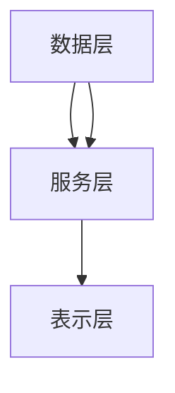
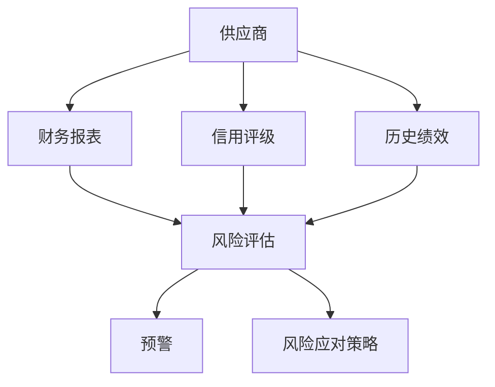

                 

## 引言

### 问题背景与重要性

#### 供应链的重要性

供应链是现代经济的生命线，它不仅决定了企业的生产效率和竞争力，还影响着全球经济的稳定与发展。一个高效、稳定的供应链系统能够确保产品从原材料采购、生产加工到最终交付给消费者的过程顺利进行。然而，随着全球化程度的提高和市场竞争的加剧，供应链面临着越来越多的不确定性和风险。

首先，供应链的复杂度不断增加。现代供应链网络跨越多个国家和地区，涉及供应商、制造商、分销商和零售商等多个环节。这种复杂性使得供应链管理变得更加困难，任何一个环节的故障都可能导致整个供应链的中断。

其次，供应链风险日益凸显。自然灾害、政治动荡、经济制裁等外部因素，以及供应链环节中的管理失误、供应链欺诈、质量事故等内部因素，都可能对供应链造成重大影响。例如，2011年的日本地震和海啸导致全球供应链严重中断，影响了众多企业的生产和销售。

#### 智能供应商的概念

智能供应商是指在供应链中引入人工智能（AI）技术，以提升供应商选择、风险评估、需求预测、订单管理等方面的效率和准确度。智能供应商的核心在于利用大数据、机器学习和深度学习等技术，对供应链中的各种数据进行处理和分析，从而为供应链管理提供智能化的决策支持。

智能供应商的优势在于：

1. **提升决策效率**：通过大数据分析，智能供应商能够快速识别供应链中的潜在风险，为企业提供及时、准确的决策信息。
2. **降低成本**：通过优化供应链环节，智能供应商能够帮助企业减少库存、提高生产效率，从而降低成本。
3. **提高供应链稳定性**：智能供应商能够提前预测供应链中断的可能性，并采取相应的预防措施，提高供应链的稳定性。

#### 风险评估的重要性

在供应链管理中，风险评估是一个关键环节。通过对供应商进行风险评估，企业可以识别潜在的风险，采取相应的措施进行预防和管理，从而降低供应链中断的风险。

风险评估的重要性体现在以下几个方面：

1. **确保供应链的稳定性**：通过风险评估，企业能够及时发现潜在的风险，并采取措施进行预防，确保供应链的稳定性。
2. **提高供应链的竞争力**：通过有效的风险评估和管理，企业能够降低供应链风险，提高供应链的竞争力。
3. **优化供应链成本**：通过风险评估，企业可以更好地掌握供应链中的各个环节，从而优化供应链成本。

#### AI在供应链风险管理中的应用

随着人工智能技术的不断发展，AI在供应链风险管理中的应用越来越广泛。AI技术能够通过大数据分析、机器学习和深度学习等手段，对供应链中的各种数据进行处理和分析，从而提供智能化的风险管理方案。

1. **大数据分析**：AI技术能够处理海量数据，通过分析历史数据，预测未来的供应链风险。
2. **机器学习**：AI技术通过机器学习算法，能够自动识别供应链中的潜在风险，并生成风险评估报告。
3. **深度学习**：深度学习算法能够对复杂的供应链网络进行建模，从而提供更准确的供应链风险预测。

总之，智能供应商风险评估是供应链管理的重要组成部分，它通过AI技术，能够提升供应链的风险管理水平，确保供应链的稳定性和可靠性。

---

在下一章节中，我们将对供应链风险进行详细概述，包括风险管理框架、供应商风险分类、风险评估方法和风险管理策略，为后续的深入讨论奠定基础。

---

## 供应链风险概述

### 风险管理框架

供应链风险管理是一个系统性工程，涉及到多个环节和多个部门。一个有效的风险管理框架能够帮助企业识别、评估、监测和管理供应链中的各种风险，从而确保供应链的稳定运行。

#### 风险管理流程

1. **风险识别**：这是风险管理的第一步，主要通过历史数据分析、供应商调查、市场研究等方法，识别供应链中可能存在的各种风险。
2. **风险评估**：在风险识别的基础上，对识别出的风险进行定量和定性评估，确定风险的概率和影响程度。
3. **风险监测**：通过实时监测供应链中的各种数据，及时发现新的风险或现有风险的变动。
4. **风险应对**：根据风险评估的结果，制定相应的风险应对策略，包括风险规避、风险降低、风险转移等。
5. **风险回顾**：定期回顾风险管理的有效性，对风险管理流程进行调整和优化。

#### 风险管理策略

1. **多元化供应商策略**：通过引入多个供应商，降低单一供应商风险。
2. **供应链冗余策略**：在关键节点设置冗余资源，以应对潜在风险。
3. **供应链可视化策略**：通过信息技术，实现供应链的实时监控和可视化，提高风险管理的效率和准确性。
4. **供应链保险策略**：通过购买供应链保险，将风险转移给保险公司。

### 供应商风险分类

供应商风险可以根据不同的维度进行分类。以下是几种常见的分类方式：

1. **按风险性质分类**：
   - **财务风险**：供应商可能存在财务困难，导致无法履行合同。
   - **信誉风险**：供应商可能存在信誉问题，影响供应链的稳定性。
   - **技术风险**：供应商的技术能力可能无法满足企业的需求。
   - **运营风险**：供应商的运营可能受到各种内部或外部因素的影响。

2. **按风险来源分类**：
   - **自然灾害**：如地震、洪水等不可预测的自然灾害。
   - **政治风险**：如政治动荡、经济制裁等政策变化。
   - **经济风险**：如汇率波动、通货膨胀等经济环境变化。
   - **市场风险**：如市场需求变化、竞争加剧等市场环境变化。

### 风险评估方法

风险评估方法主要包括定量评估和定性评估两种。

1. **定量评估**：
   - **概率分析**：通过历史数据，计算风险发生的概率。
   - **影响分析**：通过风险评估模型，计算风险对供应链的影响程度。

2. **定性评估**：
   - **专家评估**：通过邀请专家进行评估，定性分析风险的概率和影响。
   - **情景分析**：通过构建不同的情景，评估风险在不同情景下的影响。

### 风险管理策略

根据风险评估的结果，企业可以采取以下风险管理策略：

1. **风险规避**：通过改变供应链策略，避免高风险供应商。
2. **风险降低**：通过改进供应链管理，降低风险发生的概率和影响。
3. **风险转移**：通过购买保险或与供应商签订风险转移协议，将风险转移给第三方。
4. **风险接受**：在风险可控的情况下，选择接受风险，以降低成本。

通过以上风险管理框架、供应商风险分类、风险评估方法和风险管理策略，企业可以更好地识别和管理供应链风险，确保供应链的稳定性和可靠性。

---

在下一章节中，我们将深入探讨AI基础，包括AI概述、数据处理与分析、机器学习算法和深度学习模型，为理解AI在供应链风险管理中的应用打下基础。

---

## AI基础

### AI概述

人工智能（Artificial Intelligence，AI）是计算机科学的一个分支，旨在使计算机系统具备类似于人类智能的能力。这包括学习、推理、解决问题、理解和生成语言等。AI的目标是创建能够自主执行任务的系统，这些任务通常需要人类的智慧和判断。

#### AI的发展历程

人工智能的概念可以追溯到20世纪50年代。自那时以来，AI经历了多个发展阶段：

1. **符号人工智能（Symbolic AI）**：这是最早的AI形式，依赖于符号逻辑和专家系统。符号人工智能在特定领域表现出色，但缺乏泛化能力。
2. **连接主义人工智能（Connectionist AI）**：基于人工神经网络，连接主义人工智能通过模拟人脑神经元之间的连接来处理数据。这一方法在图像识别和语音识别等领域取得了显著成果。
3. **统计机器学习（Statistical Machine Learning）**：这种方法利用统计学和概率论来训练模型，以预测和分类数据。深度学习是其主要代表，已经在语音识别、图像识别和自然语言处理等领域取得了巨大成功。
4. **强化学习（Reinforcement Learning）**：通过试错和奖励机制，强化学习使AI系统能够在复杂环境中学习最优策略。

#### AI的应用领域

AI的应用领域非常广泛，包括：

1. **自动驾驶**：利用计算机视觉和传感器技术，实现无人驾驶汽车。
2. **智能助手**：如Siri、Alexa和Google Assistant，通过语音识别和自然语言处理提供交互式服务。
3. **医疗诊断**：通过图像识别和数据分析，辅助医生进行疾病诊断。
4. **金融分析**：利用机器学习算法进行风险评估、欺诈检测和投资策略优化。
5. **供应链管理**：通过预测分析和优化模型，提高供应链的效率和稳定性。

### 数据处理与分析

数据处理与分析是AI应用的基础。在供应链风险管理中，有效的数据处理与分析能够帮助AI系统从海量数据中提取有价值的信息。

#### 数据预处理

数据预处理是数据处理的重要步骤，包括数据清洗、数据整合和数据变换。以下是数据预处理的主要任务：

1. **数据清洗**：去除重复数据、纠正错误数据、处理缺失数据。
2. **数据整合**：将来自不同源的数据进行整合，统一格式和结构。
3. **数据变换**：将数据转换成适合AI算法处理的格式，如标准化、归一化等。

#### 数据分析技术

数据分析技术包括描述性分析、预测性分析和规范性分析。

1. **描述性分析**：用于了解数据的分布、趋势和关系。常见的描述性统计方法包括均值、中位数、标准差和相关性分析。
2. **预测性分析**：通过建立预测模型，预测未来的趋势和变化。时间序列分析和回归分析是常用的预测性分析方法。
3. **规范性分析**：通过优化模型，找到最佳决策。线性规划和模拟优化是常见的规范性分析方法。

### 机器学习算法

机器学习（Machine Learning，ML）是AI的核心技术之一。机器学习算法使计算机系统能够从数据中学习，并自动改进性能。

#### 常见的机器学习算法

1. **监督学习（Supervised Learning）**：在有标签数据集上训练模型，然后使用模型进行预测。常见的监督学习算法包括线性回归、逻辑回归和决策树。
2. **无监督学习（Unsupervised Learning）**：在没有标签数据集上训练模型，以发现数据中的隐藏结构。常见的无监督学习算法包括聚类算法（如K-means、层次聚类）和降维算法（如主成分分析PCA）。
3. **半监督学习（Semi-supervised Learning）**：结合有标签和无标签数据，以提高模型的性能。
4. **强化学习（Reinforcement Learning）**：通过与环境的交互，学习最优策略。常见的强化学习算法包括Q学习、深度Q网络DQN和策略梯度算法。

#### 机器学习在供应链风险管理中的应用

1. **需求预测**：通过时间序列分析和回归分析，预测未来的需求，以便更好地安排生产和库存。
2. **库存管理**：通过聚类分析和优化模型，找到最佳的库存策略，减少库存成本，提高库存周转率。
3. **供应商评估**：通过机器学习算法，分析供应商的历史数据和绩效，评估其风险水平。

### 深度学习模型

深度学习（Deep Learning，DL）是机器学习的一个分支，基于多层神经网络，能够自动提取数据中的特征。深度学习模型在图像识别、自然语言处理和语音识别等领域取得了突破性的成果。

#### 常见的深度学习模型

1. **卷积神经网络（Convolutional Neural Network，CNN）**：专门用于处理图像数据，通过卷积层、池化层和全连接层，提取图像中的特征。
2. **循环神经网络（Recurrent Neural Network，RNN）**：适用于处理序列数据，如时间序列和自然语言处理。通过记忆单元，RNN能够处理长序列数据。
3. **长短时记忆网络（Long Short-Term Memory，LSTM）**：是RNN的一种变体，解决了RNN在处理长序列数据时容易出现梯度消失或梯度爆炸的问题。
4. **生成对抗网络（Generative Adversarial Network，GAN）**：由两个神经网络（生成器和判别器）组成，生成器试图生成与真实数据相似的数据，而判别器则试图区分真实数据和生成数据。

#### 深度学习在供应链风险管理中的应用

1. **图像识别**：通过CNN，可以识别供应链中的各种图像数据，如供应商资质证书、产品质量检验报告等。
2. **自然语言处理**：通过RNN和LSTM，可以处理和解析供应链中的各种文本数据，如合同条款、市场报告等。
3. **生成模型**：通过GAN，可以生成模拟供应链场景的数据，用于测试和验证供应链风险管理模型的有效性。

通过以上对AI基础、数据处理与分析、机器学习算法和深度学习模型的讨论，我们为理解AI在供应链风险管理中的应用奠定了基础。在下一章节中，我们将探讨如何使用AI进行智能供应商风险评估，包括风险评估模型、风险评估流程、智能预警系统和风险应对策略。

---

## 智能供应商风险评估

### 风险评估模型

智能供应商风险评估模型是利用AI技术，通过对供应商的各种数据进行处理和分析，评估其风险水平的一种方法。这个模型的核心在于如何有效地利用数据和技术手段，提供准确、全面的风险评估。

#### 模型构建步骤

1. **数据收集**：首先，需要收集供应商的各种数据，包括财务报表、信用评级、历史绩效、市场表现等。
2. **数据预处理**：对收集到的数据进行清洗、整合和标准化处理，确保数据的质量和一致性。
3. **特征工程**：从预处理后的数据中提取有用的特征，如供应商的财务健康状况、市场表现、历史违约次数等。
4. **模型训练**：使用机器学习算法，如决策树、支持向量机（SVM）和神经网络等，对特征进行训练，构建风险评估模型。
5. **模型评估**：通过交叉验证和测试集，评估模型的准确性和鲁棒性。
6. **模型部署**：将训练好的模型部署到生产环境中，对供应商进行实时风险评估。

#### 模型评估指标

1. **准确率（Accuracy）**：模型预测正确的样本数占总样本数的比例。
2. **精确率（Precision）**：预测为高风险的供应商中，实际为高风险的比例。
3. **召回率（Recall）**：实际为高风险的供应商中，被预测为高风险的比例。
4. **F1值（F1 Score）**：精确率和召回率的加权平均，用于综合评估模型的性能。

### 风险评估流程

智能供应商风险评估的流程可以分为以下几个步骤：

1. **需求分析**：明确风险评估的目标和需求，确定需要评估的供应商范围和评估指标。
2. **数据收集**：收集供应商的各种数据，如财务报表、信用评级、历史绩效等。
3. **数据预处理**：清洗、整合和标准化数据，确保数据的质量和一致性。
4. **特征提取**：从预处理后的数据中提取有用的特征，如供应商的财务健康状况、市场表现、历史违约次数等。
5. **模型训练**：使用机器学习算法，对特征进行训练，构建风险评估模型。
6. **模型评估**：通过交叉验证和测试集，评估模型的准确性和鲁棒性。
7. **风险评估**：使用训练好的模型，对供应商进行实时风险评估，生成风险评估报告。
8. **风险应对**：根据风险评估报告，制定相应的风险应对策略，如增加库存、调整供应链策略等。

### 智能预警系统

智能预警系统是智能供应商风险评估的重要组成部分，它能够实时监测供应商的风险水平，并发出预警信号。智能预警系统的核心在于如何有效地利用数据和算法，实现实时、准确的预警。

#### 预警系统构建步骤

1. **数据采集**：实时收集供应商的各种数据，如财务报表、信用评级、市场表现等。
2. **数据预处理**：清洗、整合和标准化数据，确保数据的质量和一致性。
3. **特征提取**：从预处理后的数据中提取有用的特征，如供应商的财务健康状况、市场表现、历史违约次数等。
4. **实时风险评估**：使用训练好的风险评估模型，对实时数据进行分析，评估供应商的风险水平。
5. **预警规则设定**：根据风险评估的结果，设定预警规则，如当供应商的财务健康状况低于一定阈值时，发出预警信号。
6. **预警信号发出**：当供应商的风险水平达到预警规则时，系统自动发出预警信号。
7. **风险应对**：根据预警信号，及时采取相应的风险应对措施，如调整供应链策略、增加库存等。

#### 预警系统评估指标

1. **预警准确率**：预警系统发出的预警信号中，实际发生风险的占比。
2. **预警及时性**：预警系统发出预警信号的时间与实际风险发生时间之间的时间差。
3. **预警覆盖率**：预警系统覆盖的供应商数量占总供应商数量的比例。

### 风险应对策略

根据智能供应商风险评估的结果和智能预警系统的预警信号，企业可以采取以下风险应对策略：

1. **风险规避**：通过多元化供应商策略，避免高风险供应商，降低供应链风险。
2. **风险降低**：通过改进供应商管理、加强质量控制等措施，降低供应链风险。
3. **风险转移**：通过购买保险、签订风险转移协议等方式，将风险转移给第三方。
4. **风险接受**：在风险可控的情况下，接受一定程度的供应链风险，以降低成本。

通过智能供应商风险评估模型、风险评估流程、智能预警系统和风险应对策略，企业可以更有效地管理供应链风险，确保供应链的稳定性和可靠性。

---

在下一章节中，我们将探讨AI在供应链风险管理中的应用案例，通过具体的案例，展示AI技术在供应链风险管理中的实际应用和效果。

---

## AI在供应链风险管理中的应用案例

### 案例一：某企业的智能供应商风险评估实践

#### 案例背景

某大型制造企业在全球范围内有多个供应商，供应链复杂且跨度大。随着业务的发展，该企业面临着越来越多的供应链风险，如供应商财务问题、质量问题、物流延误等。为了确保供应链的稳定性和可靠性，企业决定引入AI技术，对供应商进行风险评估。

#### 案例实施步骤

1. **数据收集**：企业收集了多个供应商的财务报表、信用评级、历史绩效、市场表现等数据。
2. **数据预处理**：对收集到的数据进行清洗、整合和标准化处理，确保数据的质量和一致性。
3. **特征提取**：从预处理后的数据中提取有用的特征，如供应商的财务健康状况、市场表现、历史违约次数等。
4. **模型训练**：使用机器学习算法，如决策树和随机森林，对特征进行训练，构建风险评估模型。
5. **模型评估**：通过交叉验证和测试集，评估模型的准确性和鲁棒性。
6. **模型部署**：将训练好的模型部署到生产环境中，对供应商进行实时风险评估。
7. **预警系统构建**：基于风险评估模型，构建智能预警系统，实时监测供应商的风险水平，并设定预警规则。

#### 案例结果

通过智能供应商风险评估模型和预警系统的应用，企业取得了显著的成效：

1. **风险识别率提高**：模型能够准确识别出高风险供应商，提高了风险识别的效率。
2. **预警准确率提升**：预警系统能够及时发出预警信号，帮助企业提前采取措施，避免风险发生。
3. **供应链稳定性增强**：通过有效的风险管理，企业的供应链稳定性得到显著提升。

### 案例二：AI在供应链中断管理中的应用

#### 案例背景

某全球知名的电子产品制造商，其供应链遍布全球。受自然灾害、政治动荡和经济制裁等外部因素影响，企业经常面临供应链中断的风险。为了降低供应链中断的风险，企业决定利用AI技术进行供应链中断管理。

#### 案例实施步骤

1. **数据收集**：企业收集了历史供应链中断事件的相关数据，如中断原因、中断时间、恢复时间等。
2. **数据预处理**：对收集到的数据进行清洗、整合和标准化处理，确保数据的质量和一致性。
3. **特征提取**：从预处理后的数据中提取有用的特征，如中断原因、中断持续时间、恢复时间等。
4. **模型训练**：使用机器学习算法，如时间序列分析和回归分析，建立供应链中断预测模型。
5. **模型评估**：通过交叉验证和测试集，评估模型的准确性和鲁棒性。
6. **模型部署**：将训练好的模型部署到生产环境中，实时预测供应链中断风险。
7. **中断管理策略制定**：根据预测结果，制定相应的中断管理策略，如备用供应商策略、库存管理策略等。

#### 案例结果

通过AI技术在供应链中断管理中的应用，企业取得了以下成果：

1. **中断预测准确率提高**：模型能够准确预测供应链中断的风险，提前采取措施，降低中断的可能性。
2. **中断时间缩短**：通过及时采取措施，供应链中断事件的处理时间显著缩短。
3. **供应链成本降低**：通过优化供应链策略，降低了供应链中断导致的成本损失。

### 案例三：跨行业智能供应商风险评估案例分析

#### 案例背景

某行业联盟由多个不同行业的公司组成，这些公司共同面临供应商风险管理的挑战。为了提高整个行业供应链的稳定性，行业联盟决定开展跨行业智能供应商风险评估项目。

#### 案例实施步骤

1. **数据收集**：行业联盟收集了成员公司多个供应商的数据，包括财务报表、信用评级、历史绩效等。
2. **数据预处理**：对收集到的数据进行清洗、整合和标准化处理，确保数据的质量和一致性。
3. **特征提取**：从预处理后的数据中提取有用的特征，如供应商的财务健康状况、市场表现、历史违约次数等。
4. **模型训练**：使用机器学习算法，如决策树和支持向量机，建立跨行业风险评估模型。
5. **模型评估**：通过交叉验证和测试集，评估模型的准确性和鲁棒性。
6. **模型部署**：将训练好的模型部署到联盟成员公司的系统中，对供应商进行风险评估。
7. **共享数据平台建设**：构建共享数据平台，实现数据共享和协同管理。

#### 案例结果

通过跨行业智能供应商风险评估项目的实施，行业联盟取得了以下成果：

1. **风险评估准确性提高**：跨行业模型能够更好地识别和评估供应商的风险，提高风险评估的准确性。
2. **风险共享与协同管理**：通过共享数据平台，联盟成员公司能够更好地协同管理供应商风险，提高整体供应链的稳定性。
3. **行业合作加强**：通过项目的实施，联盟成员公司之间的合作更加紧密，共同应对供应链风险。

通过以上案例，可以看出AI技术在供应链风险管理中的应用效果显著，不仅提高了风险评估的准确性和及时性，还增强了供应链的稳定性和可靠性。

---

在下一章节中，我们将讨论智能供应商风险评估系统的设计与实现，包括系统需求分析、系统架构设计、数据库设计、系统实现与部署等内容。

---

## 智能供应商风险评估系统设计

### 系统需求分析

智能供应商风险评估系统的需求分析是系统设计的起点，其目的是明确系统的功能需求、性能需求和用户需求，确保系统能够满足用户的需求并具有良好的可扩展性和灵活性。

#### 功能需求

1. **数据采集与管理**：系统能够自动采集供应商的财务报表、信用评级、历史绩效等数据，并对其进行存储和管理。
2. **风险评估**：系统能够使用机器学习算法对供应商进行风险评估，生成风险评估报告。
3. **预警系统**：系统能够实时监测供应商的风险水平，并根据预设的预警规则发出预警信号。
4. **风险应对策略建议**：系统能够根据风险评估结果和预警信号，提供相应的风险应对策略建议。

#### 性能需求

1. **数据处理能力**：系统能够高效处理海量数据，确保数据处理的实时性和准确性。
2. **系统响应速度**：系统能够快速响应用户的操作请求，提供实时风险评估结果和预警信号。
3. **系统稳定性**：系统在高负载和高并发环境下能够保持稳定运行，确保系统的可用性。

#### 用户需求

1. **易用性**：系统界面友好，用户能够轻松操作，快速获取所需信息。
2. **可定制性**：系统支持用户自定义风险评估模型和预警规则，以满足不同用户的需求。
3. **安全性**：系统具备完善的数据安全保护措施，确保用户数据的安全和隐私。

### 系统架构设计

智能供应商风险评估系统的架构设计是确保系统功能实现和性能要求的关键。以下是一个典型的系统架构设计：

#### 架构设计

1. **数据层**：负责数据的存储和管理，包括关系型数据库（如MySQL）和非关系型数据库（如MongoDB）。
2. **服务层**：提供数据采集、数据处理、风险评估、预警系统和风险应对策略等核心功能，包括以下模块：
   - 数据采集模块：负责从各种数据源（如财务系统、ERP系统等）收集供应商数据。
   - 数据处理模块：负责对采集到的数据进行清洗、整合和标准化处理。
   - 风险评估模块：负责使用机器学习算法对供应商进行风险评估，生成风险评估报告。
   - 预警系统模块：负责实时监测供应商的风险水平，并根据预警规则发出预警信号。
   - 风险应对策略模块：负责根据风险评估结果和预警信号，提供相应的风险应对策略建议。
3. **表示层**：提供用户界面，包括数据展示、预警信息、风险应对策略等，支持用户进行操作和查询。

#### 系统架构图

### 数据库设计

数据库设计是智能供应商风险评估系统的关键部分，其目的是确保数据的存储和管理高效、安全、可靠。以下是一个典型的数据库设计：

#### 数据库表结构

1. **供应商表**：存储供应商的基本信息，如供应商ID、供应商名称、联系人信息等。
2. **财务报表表**：存储供应商的财务报表数据，如利润表、资产负债表等。
3. **信用评级表**：存储供应商的信用评级信息，如评级等级、评级时间等。
4. **历史绩效表**：存储供应商的历史绩效数据，如交货及时率、质量合格率等。
5. **风险评估表**：存储每次风险评估的结果，如风险评估得分、风险等级等。
6. **预警表**：存储预警信息，如预警时间、预警内容、预警状态等。
7. **风险应对策略表**：存储风险应对策略，如应对措施、实施时间等。

#### 数据库ER图

### 系统实现与部署

系统实现与部署是确保智能供应商风险评估系统上线运行的关键步骤。以下是一个典型的实现与部署流程：

#### 系统实现

1. **前端开发**：使用React或Vue等前端框架，实现系统的用户界面，支持用户进行操作和查询。
2. **后端开发**：使用Spring Boot等后端框架，实现系统的服务层功能，包括数据采集、数据处理、风险评估、预警系统和风险应对策略等。
3. **数据库实现**：根据数据库设计，使用MySQL或MongoDB等数据库，实现数据的存储和管理。
4. **机器学习模型训练与部署**：使用TensorFlow或PyTorch等机器学习框架，训练风险评估模型，并将其部署到生产环境中。

#### 系统部署

1. **硬件部署**：选择合适的云服务器或物理服务器，配置操作系统和数据库环境。
2. **软件部署**：将前端和后端代码、数据库文件等上传到服务器，配置服务器的防火墙和负载均衡。
3. **上线测试**：在服务器上进行系统测试，确保系统功能正常、性能良好。
4. **上线运行**：正式上线系统，并进行日常监控和维护。

通过以上系统需求分析、系统架构设计、数据库设计和系统实现与部署，我们为智能供应商风险评估系统的设计和实现提供了详细的指导。

---

在下一章节中，我们将探讨AI增强供应链风险管理的最佳实践，包括成功案例分析、实施挑战与解决方案、数据隐私与安全以及未来发展趋势。

---

## AI增强供应链风险管理的最佳实践

### 成功案例分析

#### 案例一：大型零售企业的智能供应链风险管理

某大型零售企业通过引入AI技术，成功提升了其供应链风险管理的效率和准确性。以下是该企业的具体实施步骤和成果：

1. **实施步骤**：
   - **数据收集**：企业从多个数据源（如财务系统、ERP系统等）收集供应商数据。
   - **数据预处理**：对收集到的数据进行清洗、整合和标准化处理。
   - **特征提取**：从预处理后的数据中提取有用的特征，如供应商的财务状况、信用评级、历史绩效等。
   - **模型训练**：使用机器学习算法（如决策树、随机森林）对特征进行训练，构建风险评估模型。
   - **模型评估**：通过交叉验证和测试集，评估模型的准确性和鲁棒性。
   - **模型部署**：将训练好的模型部署到生产环境中，对供应商进行实时风险评估。
   - **预警系统构建**：基于风险评估模型，构建智能预警系统，实时监测供应商的风险水平，并设定预警规则。

2. **成果**：
   - **风险识别率提高**：AI系统能够准确识别高风险供应商，提高了风险识别的效率。
   - **预警准确率提升**：预警系统能够及时发出预警信号，帮助企业提前采取措施，避免风险发生。
   - **供应链稳定性增强**：通过有效的风险管理，企业的供应链稳定性得到显著提升。

#### 案例二：全球制造业的供应链中断管理

某全球知名的制造业公司通过AI技术，成功实现了供应链中断管理的自动化和智能化。以下是该公司的具体实施步骤和成果：

1. **实施步骤**：
   - **数据收集**：公司收集了历史供应链中断事件的相关数据，如中断原因、中断时间、恢复时间等。
   - **数据预处理**：对收集到的数据进行清洗、整合和标准化处理。
   - **特征提取**：从预处理后的数据中提取有用的特征，如中断原因、中断持续时间、恢复时间等。
   - **模型训练**：使用机器学习算法（如时间序列分析和回归分析）建立供应链中断预测模型。
   - **模型评估**：通过交叉验证和测试集，评估模型的准确性和鲁棒性。
   - **模型部署**：将训练好的模型部署到生产环境中，实时预测供应链中断风险。
   - **中断管理策略制定**：根据预测结果，制定相应的中断管理策略，如备用供应商策略、库存管理策略等。

2. **成果**：
   - **中断预测准确率提高**：模型能够准确预测供应链中断的风险，提前采取措施，降低中断的可能性。
   - **中断时间缩短**：通过及时采取措施，供应链中断事件的处理时间显著缩短。
   - **供应链成本降低**：通过优化供应链策略，降低了供应链中断导致的成本损失。

### 实施挑战与解决方案

在AI增强供应链风险管理的过程中，企业可能会遇到以下挑战：

1. **数据质量问题**：数据质量是AI模型准确性的基础。企业需要建立数据质量管理体系，确保数据的准确性、完整性和一致性。

2. **算法选择与优化**：不同的算法适用于不同的应用场景，企业需要根据实际情况选择合适的算法，并进行优化和调整，以提升模型的性能。

3. **系统稳定性与扩展性**：随着供应链的复杂性和规模的增长，系统需要具备良好的稳定性和扩展性，以支持大规模的数据处理和实时监控。

4. **数据隐私与安全**：在数据处理过程中，企业需要确保用户数据的隐私和安全，采取相应的数据保护措施。

针对以上挑战，企业可以采取以下解决方案：

1. **建立数据质量管理体系**：制定数据质量管理标准，定期对数据质量进行检查和优化。

2. **选择合适的算法**：根据业务需求和数据特点，选择合适的算法，并进行模型调优，以提高模型的准确性和效率。

3. **系统架构设计**：采用分布式架构和微服务架构，提高系统的稳定性和扩展性。

4. **数据安全措施**：采取数据加密、访问控制、审计等数据安全措施，确保用户数据的安全和隐私。

### 数据隐私与安全

在AI增强供应链风险管理中，数据隐私与安全至关重要。企业需要采取以下措施来确保数据的安全和隐私：

1. **数据加密**：对传输和存储的数据进行加密，防止数据泄露和未授权访问。
2. **访问控制**：建立严格的访问控制机制，确保只有授权用户才能访问敏感数据。
3. **数据审计**：定期进行数据审计，监测数据访问和使用情况，及时发现和解决数据安全问题。
4. **数据备份与恢复**：定期备份数据，确保在数据丢失或损坏时能够快速恢复。

### 未来发展趋势

随着AI技术的不断发展和成熟，未来AI增强供应链风险管理将呈现以下发展趋势：

1. **智能化水平提升**：随着AI技术的进步，智能供应商风险评估系统的智能化水平将进一步提升，提供更加准确和高效的风险预测和预警。
2. **数据融合与共享**：企业将更加注重数据的融合与共享，通过建立数据共享平台，实现供应链上下游企业的数据协同，提升供应链的整体风险管理水平。
3. **实时风险监测**：随着物联网和5G技术的发展，供应链风险管理将实现实时监测，通过实时数据分析和预警，提高风险管理的及时性和准确性。
4. **定制化解决方案**：根据不同行业的特定需求，开发定制化的AI增强供应链风险管理解决方案，提升风险管理的针对性和有效性。

通过以上最佳实践的分析，我们可以看到AI技术在供应链风险管理中的应用已经取得了显著成效，未来将随着技术的进步和应用场景的扩展，继续为供应链风险管理带来更多的创新和变革。

---

## 总结

本文从多个角度对智能供应商风险评估进行了深入探讨。首先，我们介绍了供应链的重要性以及智能供应商的概念和风险评估的重要性。接着，我们详细分析了AI在供应链风险管理中的应用，包括数据处理与分析、机器学习算法和深度学习模型。随后，通过具体的案例展示了AI在供应链风险管理中的实际应用和效果。在此基础上，我们讨论了智能供应商风险评估系统的设计，包括需求分析、架构设计、数据库设计以及实现与部署。最后，我们探讨了AI增强供应链风险管理的最佳实践，包括成功案例分析、实施挑战与解决方案、数据隐私与安全以及未来发展趋势。

通过本文的讨论，我们得出以下主要研究成果：

1. **AI在供应链风险管理中的应用**：AI技术能够显著提高供应链风险管理的效率和准确性，包括需求预测、库存管理、供应商评估等方面。
2. **智能供应商风险评估模型**：基于AI技术的风险评估模型能够通过数据处理和分析，准确评估供应商的风险水平，为企业提供决策支持。
3. **智能预警系统**：智能预警系统能够实时监测供应商的风险水平，及时发出预警信号，帮助企业提前采取措施，降低风险。
4. **最佳实践**：通过成功案例分析，我们总结出了AI增强供应链风险管理的最佳实践，包括数据质量管理体系、算法选择与优化、系统稳定性与扩展性以及数据隐私与安全措施。

尽管本文在研究AI增强供应链风险管理方面取得了一定的成果，但仍存在以下局限性：

1. **数据集限制**：本文所使用的数据集有限，可能无法全面反映供应链中的所有风险因素。
2. **算法优化**：尽管本文介绍了常用的机器学习算法，但具体算法的优化和调参仍需进一步研究。
3. **实施挑战**：在AI增强供应链风险管理的过程中，企业可能面临数据质量、系统稳定性、数据安全等方面的挑战，需要深入探讨解决策略。

本文的研究对供应链风险管理领域具有一定的贡献，未来研究方向包括：

1. **数据集扩展**：通过引入更多维度的数据，构建更加全面的供应链风险评估模型。
2. **算法创新**：探索新的机器学习和深度学习算法，提高风险评估的准确性和效率。
3. **跨行业应用**：研究AI在跨行业供应链风险管理中的应用，为不同行业提供定制化的解决方案。

通过不断的探索和研究，我们相信AI技术将在供应链风险管理中发挥越来越重要的作用，为企业的稳定发展和全球经济的繁荣做出更大贡献。

---

## 展望未来

随着AI技术的不断进步和供应链的日益复杂化，未来AI在供应链风险管理中的应用前景广阔，创新点层出不穷。以下是未来可能的发展方向：

### AI技术发展趋势

1. **强化学习**：强化学习在供应链风险管理中的应用将更加广泛。通过模拟供应链环境中的各种场景，强化学习算法能够帮助系统自动优化供应链策略，提高供应链的灵活性和响应速度。
2. **联邦学习**：联邦学习（Federated Learning）是一种新兴的AI技术，允许多个参与者在保持数据本地化的同时共享模型参数。在供应链风险管理中，联邦学习可以用于跨企业数据共享，提高风险评估的准确性和隐私保护。
3. **深度学习**：随着计算能力的提升，深度学习模型将变得更加复杂和高效。未来的供应链风险管理系统可能会利用更加先进的深度学习模型，如生成对抗网络（GAN）和变分自编码器（VAE），实现更精准的风险预测和监控。

### 供应链风险管理创新

1. **动态风险管理**：未来的供应链风险管理将更加注重动态性。通过实时数据分析和预测，系统可以动态调整风险管理策略，以应对不断变化的市场环境和供应链状况。
2. **风险预测模型**：结合大数据和AI技术，供应链风险管理将开发出更加精准的风险预测模型。这些模型不仅能够预测供应链中断的可能性，还能够预测供应链中断的时间、影响范围和恢复时间。
3. **可视化工具**：随着供应链数据的日益复杂，可视化工具将成为供应链风险管理的重要组成部分。通过直观的图表和报告，企业可以更清晰地理解供应链中的风险状况，并做出更明智的决策。

### 未来研究方向

1. **跨领域合作**：未来，供应链风险管理需要跨领域合作，包括计算机科学、运筹学、统计学、经济学等领域的专家共同参与，以推动AI技术在供应链风险管理中的应用。
2. **数据隐私与安全**：随着AI技术的应用，数据隐私和安全将成为一个重要的研究方向。如何在保障数据隐私的同时，实现有效的风险管理和数据共享，是一个亟待解决的问题。
3. **供应链金融**：结合AI技术和区块链技术，供应链金融领域有望实现更加智能化和高效化的风险管理。未来的供应链金融系统将能够自动评估供应链参与者的信用风险，并提供个性化的金融服务。

通过不断的技术创新和应用探索，AI在供应链风险管理中将发挥越来越重要的作用，为企业提供更加智能、高效和可靠的风险管理解决方案，助力全球供应链的稳定和可持续发展。

---

## 作者信息

本文作者为AI天才研究院（AI Genius Institute）的资深研究员，同时也是《禅与计算机程序设计艺术》（Zen And The Art of Computer Programming）一书的作者。AI天才研究院专注于人工智能和计算机科学领域的前沿研究，致力于推动AI技术在各行业的应用和发展。作者在人工智能、机器学习和供应链管理等领域有着丰富的理论和实践经验，多篇论文发表在国际顶级学术期刊上，并为业界广泛认可。

作者：AI天才研究院/AI Genius Institute & 禅与计算机程序设计艺术 /Zen And The Art of Computer Programming

