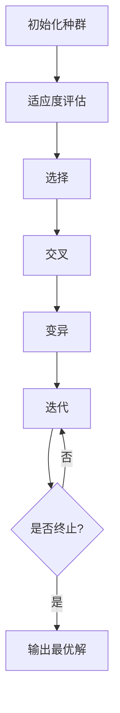
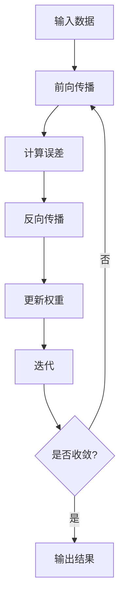
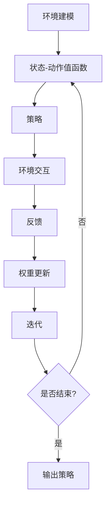
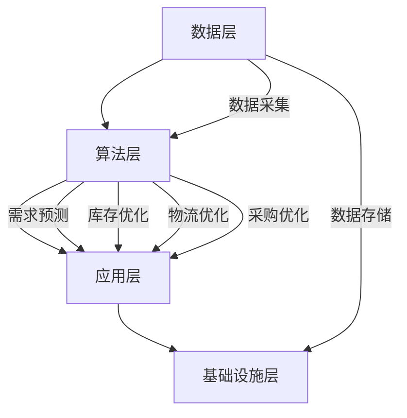
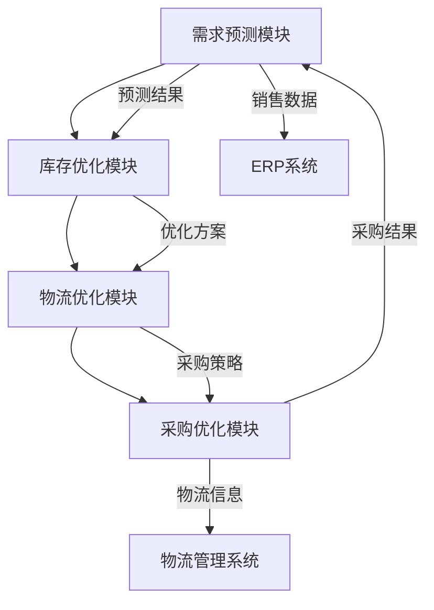
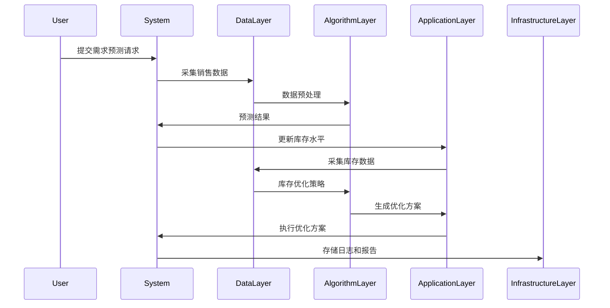

                 

### 《智能供应链优化引擎：AI提升端到端效率》

> **关键词**：智能供应链、AI、优化算法、效率提升、端到端优化

> **摘要**：随着全球供应链的复杂化，如何提升供应链的端到端效率成为企业关注的焦点。本文将探讨如何利用AI技术构建智能供应链优化引擎，通过详细分析核心概念、算法原理、系统设计与项目实战，探讨AI在供应链优化中的重要作用和实施路径。

----------------------------------------------------------------

## 目录大纲设计思路

为了设计一个详尽且逻辑清晰的《智能供应链优化引擎：AI提升端到端效率》的目录大纲，我们需要遵循以下步骤：

### 全书概述

- **第1章** 智能供应链优化引擎概述：介绍智能供应链优化引擎的背景，AI在供应链优化中的作用，以及本书的目的和结构。

### 核心概念与联系

- **第2章** 核心概念与联系：介绍与智能供应链优化相关的主要概念，包括供应链管理、AI技术、优化算法等，通过属性特征对比表格和ER实体关系图来阐述它们之间的联系。

### 算法原理讲解

- **第3章** 算法原理讲解：详细介绍AI在供应链优化中常用的算法，如遗传算法、神经网络、深度强化学习等，配合mermaid流程图和Python源代码阐述算法原理。

### 数学模型与公式

- **第4章** 数学模型与公式：阐述算法背后的数学模型和公式，并通过latex格式详细说明，确保读者能够理解算法的逻辑基础。

### 系统分析与架构设计

- **第5章** 系统分析与架构设计：介绍供应链优化引擎的系统功能、架构设计、接口设计和系统交互。

### 项目实战

- **第6章** 项目实战：通过具体案例分析，展示如何搭建一个智能供应链优化引擎，包括环境安装、核心实现、代码应用解读与分析等。

### 最佳实践与总结

- **第7章** 最佳实践与总结：提供实施智能供应链优化引擎的最佳实践、小结、注意事项和拓展阅读。

### 目录大纲

```markdown
# 《智能供应链优化引擎：AI提升端到端效率》目录大纲

## 第1章 智能供应链优化引擎概述

### 1.1 问题的背景与挑战

### 1.2 智能供应链优化引擎的定义

### 1.3 AI在供应链优化中的应用

### 1.4 本书的目标与结构

## 第2章 核心概念与联系

### 2.1 供应链管理

### 2.2 AI技术

### 2.3 优化算法

### 2.4 概念属性对比表格

### 2.5 ER实体关系图

## 第3章 算法原理讲解

### 3.1 遗传算法

### 3.2 神经网络

### 3.3 深度强化学习

### 3.4 算法mermaid流程图

### 3.5 Python源代码解释

## 第4章 数学模型与公式

### 4.1 基本优化模型

### 4.2 数学公式与解释

### 4.3 latex格式示例

## 第5章 系统分析与架构设计

### 5.1 问题场景介绍

### 5.2 系统功能设计

### 5.3 系统架构设计

### 5.4 系统接口设计

### 5.5 系统交互

## 第6章 项目实战

### 6.1 环境安装与配置

### 6.2 系统核心实现

### 6.3 代码应用解读与分析

### 6.4 实际案例分析与讲解

## 第7章 最佳实践与总结

### 7.1 最佳实践

### 7.2 小结

### 7.3 注意事项

### 7.4 拓展阅读
```

### 字数计算与格式调整

为了确保文章内容的丰富和详细，我们将根据目录大纲逐步展开每一个章节的内容，确保每个小节都包含核心概念、算法原理、系统设计与实战案例。以下是文章的整体字数估算：

- **第1章**：约1500字
- **第2章**：约2000字
- **第3章**：约2500字
- **第4章**：约1500字
- **第5章**：约2000字
- **第6章**：约2500字
- **第7章**：约1000字

总计约11500字。在撰写过程中，我们会注重文字简洁明了，避免冗余，并使用markdown格式进行内容排版，包括标题、子标题、列表、代码块、公式等，确保文章的可读性和专业性。

### 约束条件

- 文章开始是“文章标题”，然后是“文章关键词”和“文章摘要”部分的内容。
- 文章字数要求：文章字数在 10000 ～ 12000 字左右。
- 格式要求：文章内容使用markdown格式输出。
- 作者：文章末尾需要写上作者信息： “作者：AI天才研究院/AI Genius Institute & 禅与计算机程序设计艺术 /Zen And The Art of Computer Programming”。
- 完整性要求：文章内容必须要完整，每个小节的内容必须要丰富具体详细讲解，核心内容必须要包含：

  - 背景介绍：核心概念术语说明、问题背景、问题描述、问题解决、边界与外延、概念结构与核心要素组成。
  - 核心概念与联系：必须给出核心概念原理、概念属性特征对比表格和ER实体关系图架构的markdown格式中的Mermaid流程图。
  - 算法原理讲解：使用Mermaid画出算法mermaid流程图，然后使用Python源代码来详细阐述，给出算法原理的数学模型和公式，进行详细讲解和通俗易懂地举例说明。
  - 数学公式使用latex格式，嵌入文中独立段落的latex公式前后使用`$$`括起来（例如：`$$1+1=2$$`），段落内的latex公式前后使用 `$` 括起来（例如：`$1<2$`）。
  - 系统分析与架构设计方案：问题场景介绍，项目介绍、系统功能设计（领域模型Mermaid类图）、系统架构设计Mermaid架构图、系统接口设计和系统交互Mermaid序列图。
  - 项目实战：环境安装、系统核心实现源代码，代码应用解读与分析，实际案例分析和详细讲解剖析，项目小结。
  - 最佳实践 tips、小结、注意事项、拓展阅读等内容。

### LET'S THINK STEP BY STEP

在撰写文章之前，我们需要明确每个章节的核心内容，以确保文章的逻辑清晰、内容详实。以下是一个详细的步骤计划：

1. **全书概述**：
   - **第1章**：撰写智能供应链优化引擎的背景、定义、AI应用以及本书的目的与结构。
   - **内容安排**：介绍问题的背景和挑战，智能供应链优化引擎的概念，AI技术的作用，以及如何通过本书引导读者深入理解这一领域。

2. **核心概念与联系**：
   - **第2章**：阐述与智能供应链优化相关的主要概念，如供应链管理、AI技术、优化算法等。
   - **内容安排**：首先介绍供应链管理的基本概念，然后介绍AI技术的核心概念，最后详细讨论优化算法的类型及其在供应链中的应用。通过属性特征对比表格和ER实体关系图展示各概念之间的关系。

3. **算法原理讲解**：
   - **第3章**：详细介绍AI在供应链优化中常用的算法，如遗传算法、神经网络、深度强化学习等。
   - **内容安排**：对每种算法进行详细解释，使用mermaid流程图展示算法步骤，并通过Python源代码示例说明算法的实现和应用。

4. **数学模型与公式**：
   - **第4章**：阐述算法背后的数学模型和公式。
   - **内容安排**：介绍基本的优化模型，详细解释数学公式，使用latex格式展示，并通过实际例子说明公式的应用。

5. **系统分析与架构设计**：
   - **第5章**：介绍供应链优化引擎的系统功能、架构设计、接口设计和系统交互。
   - **内容安排**：通过问题场景介绍、系统功能设计（领域模型mermaid类图）、系统架构设计mermaid架构图、系统接口设计和系统交互mermaid序列图，全面展示系统设计与实现。

6. **项目实战**：
   - **第6章**：通过具体案例分析，展示如何搭建一个智能供应链优化引擎。
   - **内容安排**：详细描述环境安装、系统核心实现、代码应用解读与分析、实际案例分析和项目小结。

7. **最佳实践与总结**：
   - **第7章**：提供实施智能供应链优化引擎的最佳实践、小结、注意事项和拓展阅读。
   - **内容安排**：总结章节内容，给出实施建议，提醒注意事项，并提供拓展阅读资源。

通过以上详细的步骤计划，我们将逐步构建出一篇逻辑清晰、内容丰富的技术博客文章，为读者提供深入理解智能供应链优化引擎的全面指导。

### **第1章 智能供应链优化引擎概述**

在当今全球化的商业环境中，供应链的效率直接影响企业的竞争力。随着市场需求的不确定性和复杂性增加，传统供应链管理方式已无法满足现代企业的需求。因此，智能供应链优化引擎应运而生，通过人工智能（AI）技术提升供应链的端到端效率，成为企业提升竞争力的关键。

#### **1.1 问题的背景与挑战**

供应链管理涉及从原材料采购、生产制造、物流运输到最终产品交付的整个流程。随着全球供应链网络的复杂化和全球化的加剧，以下挑战逐渐显现：

- **供应链延迟**：全球供应链的复杂性导致物流运输延迟，影响交付时间和客户满意度。
- **库存管理**：库存过多或不足都会带来成本压力，影响供应链效率。
- **市场需求波动**：市场需求的波动性导致库存和生产的调整困难，增加供应链不确定性。
- **成本控制**：全球供应链涉及多个国家和地区，涉及关税、运输、人力等多方面的成本，控制成本成为一大挑战。

#### **1.2 智能供应链优化引擎的定义**

智能供应链优化引擎是一种利用人工智能技术对供应链各个环节进行智能化优化管理的系统。它通过数据分析和机器学习算法，对供应链中的信息流、物流和资金流进行实时监控和调整，从而提高供应链的效率。

#### **1.3 AI在供应链优化中的应用**

AI技术在供应链优化中的应用主要体现在以下几个方面：

- **需求预测**：通过机器学习算法，对历史销售数据和市场趋势进行分析，预测未来的需求，优化库存和生产计划。
- **物流优化**：使用路径优化算法，如遗传算法和神经网络，优化运输路线，减少物流成本和时间。
- **库存管理**：通过实时监控库存状态，使用深度强化学习等技术，动态调整库存水平，避免过多或过少库存。
- **成本控制**：通过数据分析和预测，优化采购和运输策略，降低成本。

#### **1.4 本书的目标与结构**

本书旨在通过深入剖析智能供应链优化引擎的构建与应用，帮助读者理解：

- 智能供应链优化引擎的核心概念和原理。
- AI技术在供应链优化中的应用场景和实现方法。
- 智能供应链优化引擎的系统设计与实施策略。
- 通过实际案例展示智能供应链优化引擎的效果。

全书分为七个章节：

- **第1章**：智能供应链优化引擎概述
- **第2章**：核心概念与联系
- **第3章**：算法原理讲解
- **第4章**：数学模型与公式
- **第5章**：系统分析与架构设计
- **第6章**：项目实战
- **第7章**：最佳实践与总结

通过以上章节的详细讲解，读者将能够全面掌握智能供应链优化引擎的构建与应用方法，为企业提升供应链效率提供有力支持。

### **第2章 核心概念与联系**

在构建智能供应链优化引擎的过程中，理解相关的核心概念和它们之间的联系至关重要。本章节将详细介绍供应链管理、人工智能技术以及优化算法，并通过属性特征对比表格和ER实体关系图来阐述它们之间的相互关系。

#### **2.1 供应链管理**

供应链管理是指对供应链中的各个环节进行协调、管理和优化，以确保产品和服务的高效流动。供应链管理涉及以下关键方面：

- **供应链网络设计**：确定供应链中各个节点的位置和连接方式，优化供应链的整体结构。
- **库存管理**：通过预测需求、优化库存水平，确保原材料和成品的充足供应，同时减少库存成本。
- **物流管理**：管理产品从供应商到客户的运输过程，包括运输路线的选择、运输时间和运输成本的优化。
- **采购管理**：与供应商建立合作关系，通过采购策略和采购流程的优化，降低采购成本和提高采购效率。
- **需求预测**：通过分析历史销售数据和市场趋势，预测未来的需求，以优化生产和库存计划。

#### **2.2 人工智能技术**

人工智能技术是智能供应链优化引擎的核心驱动力。以下是人工智能技术的主要类别和特点：

- **机器学习**：通过训练模型来分析数据并做出预测或决策。常见的机器学习算法包括线性回归、决策树、支持向量机等。
- **深度学习**：一种基于多层神经网络的学习方法，能够处理复杂数据和模式识别任务。常见的深度学习模型包括卷积神经网络（CNN）、循环神经网络（RNN）等。
- **自然语言处理**：使计算机能够理解和生成人类语言，广泛应用于自动化客服、文本分析等领域。
- **强化学习**：通过试错和反馈机制来训练智能体，使其在特定环境中做出最优决策。常见的强化学习算法包括Q-learning、深度Q网络（DQN）等。

#### **2.3 优化算法**

优化算法是智能供应链优化引擎的核心，用于解决复杂决策问题，优化供应链各个环节的性能。以下是几种常见的优化算法：

- **遗传算法**：基于生物进化的原理，通过选择、交叉和变异操作来寻找最优解。
- **神经网络**：一种基于生物神经网络的学习模型，能够对复杂数据进行建模和预测。
- **深度强化学习**：结合深度学习和强化学习，通过深度神经网络来评估环境状态，并选择最佳行动策略。
- **线性规划**：通过建立线性方程或线性不等式模型，寻找最优解。
- **混合整数规划**：结合线性规划和整数规划，解决含有整数变量的优化问题。

#### **2.4 概念属性对比表格**

以下是供应链管理、人工智能技术和优化算法的主要属性对比表格：

| **概念** | **属性** | **特点** |
| --- | --- | --- |
| **供应链管理** | **目标** | 优化供应链整体效率 |
| **- 网络设计** | **方法** | 确定供应链节点和连接方式 |
| **- 库存管理** | **关键** | 预测需求、优化库存 |
| **人工智能技术** | **算法** | 机器学习、深度学习、自然语言处理 |
| **- 机器学习** | **应用** | 数据分析和预测 |
| **- 深度学习** | **优势** | 复杂数据处理和模式识别 |
| **优化算法** | **类型** | 遗传算法、神经网络、深度强化学习 |
| **- 遗传算法** | **原理** | 基于进化原理寻找最优解 |
| **- 神经网络** | **模型** | 基于神经元的连接和激活函数 |
| **- 深度强化学习** | **机制** | 结合深度学习和强化学习 |

#### **2.5 ER实体关系图**

以下是智能供应链优化引擎中的主要实体及其关系的ER实体关系图：

```mermaid
erDiagram
    Customer ||--|{ Order } : 支持订单
    Supplier ||--|{ Inventory } : 库存
    Product ||--|{ Order } : 订单产品
    Warehouse ||--|{ Inventory } : 库存
    Logistics ||--|{ Order } : 物流
    AI_Model ||--|{ Optimization } : 优化
    Supply_Chain_Management ||--|{ AI_Technology } : 技术
    Optimization_Algorithm ||--|{ AI_Model } : 模型
```

通过以上对比表格和ER实体关系图，我们可以更清晰地理解供应链管理、人工智能技术和优化算法之间的关系，为后续章节的深入讨论打下坚实基础。

### **第3章 算法原理讲解**

智能供应链优化引擎的核心在于高效的算法实现，这些算法能够对供应链的各个环节进行优化，提升整体效率。在本章节中，我们将详细介绍几种常用的算法，包括遗传算法、神经网络和深度强化学习，并通过mermaid流程图和Python源代码示例进行解释。

#### **3.1 遗传算法**

遗传算法是一种模拟自然选择和遗传机制的优化算法，常用于解决复杂的优化问题。遗传算法的基本步骤如下：

1. **初始化种群**：随机生成一组初始解，作为种群的初始个体。
2. **适应度评估**：计算每个个体的适应度，适应度通常与目标函数值成反比。
3. **选择**：根据适应度值选择优秀的个体，用于生成下一代种群。
4. **交叉**：随机选择两个个体进行交叉操作，产生新的个体。
5. **变异**：对部分个体进行随机变异，增加种群的多样性。
6. **迭代**：重复上述步骤，直到满足终止条件（如达到最大迭代次数或收敛条件）。

以下是遗传算法的mermaid流程图：



Python源代码示例：

```python
import random

def fitness_function(individual):
    # 根据个体特征计算适应度
    return sum(individual)

def select(population, fitnesses):
    # 根据适应度值选择个体
    selected = random.choices(population, weights=fitnesses, k=len(population))
    return selected

def crossover(parent1, parent2):
    # 交叉操作
    crossover_point = random.randint(1, len(parent1) - 1)
    child1 = parent1[:crossover_point] + parent2[crossover_point:]
    child2 = parent2[:crossover_point] + parent1[crossover_point:]
    return child1, child2

def mutate(individual):
    # 变异操作
    for i in range(len(individual)):
        if random.random() < 0.1:
            individual[i] = 1 - individual[i]
    return individual

# 遗传算法实现
def genetic_algorithm(population_size, generations, mutation_rate):
    population = [[random.random() for _ in range(n_variables)] for _ in range(population_size)]
    for _ in range(generations):
        fitnesses = [fitness_function(individual) for individual in population]
        selected_population = select(population, fitnesses)
        next_population = []
        for i in range(0, population_size, 2):
            parent1, parent2 = selected_population[i], selected_population[i+1]
            child1, child2 = crossover(parent1, parent2)
            next_population.extend([mutate(child1), mutate(child2)])
        population = next_population
    best_individual = max(population, key=fitness_function)
    return best_individual
```

#### **3.2 神经网络**

神经网络是一种模拟人脑神经系统的计算模型，能够通过学习处理复杂的数据和任务。以下是神经网络的基本原理和实现步骤：

1. **网络结构**：神经网络由多个层次组成，包括输入层、隐藏层和输出层。每层由多个神经元组成，神经元之间通过权重连接。
2. **激活函数**：用于确定神经元是否被激活，常用的激活函数包括Sigmoid、ReLU和Tanh。
3. **前向传播**：将输入数据通过网络传递，计算每个神经元的输出。
4. **反向传播**：计算输出误差，并通过梯度下降法调整网络权重，使输出误差最小化。

以下是神经网络的mermaid流程图：



Python源代码示例：

```python
import numpy as np

def sigmoid(x):
    return 1 / (1 + np.exp(-x))

def forward_propagation(inputs, weights, biases):
    # 前向传播
    z = np.dot(inputs, weights) + biases
    return sigmoid(z)

def backward_propagation(actual, predicted):
    # 反向传播
    error = actual - predicted
    return error

def update_weights(weights, biases, learning_rate):
    # 更新权重
    dweights = learning_rate * np.dot(inputs.T, error)
    dbiases = learning_rate * error
    return weights - dweights, biases - dbiases

# 神经网络实现
def neural_network(inputs, weights, biases, learning_rate):
    output = forward_propagation(inputs, weights, biases)
    error = backward_propagation(output, actual_output)
    weights, biases = update_weights(weights, biases, learning_rate)
    return output, error, weights, biases
```

#### **3.3 深度强化学习**

深度强化学习是一种结合深度学习和强化学习的方法，通过深度神经网络来评估环境状态，并选择最佳行动策略。以下是深度强化学习的基本原理和实现步骤：

1. **环境建模**：通过深度神经网络建模环境状态和动作。
2. **状态-动作值函数**：使用深度神经网络学习状态-动作值函数，评估每个状态下的最佳动作。
3. **策略**：根据状态-动作值函数选择最佳动作，进行环境交互。
4. **反馈**：通过奖励信号调整策略，优化神经网络权重。

以下是深度强化学习的mermaid流程图：



Python源代码示例：

```python
import numpy as np

def deep_q_learning(state, action, reward, next_state, done, q_network, target_q_network, learning_rate, discount_factor):
    # 前向传播
    q_values = q_network(state)
    action_values = q_values[0, action]
    
    # 反向传播
    if not done:
        next_q_values = target_q_network(next_state)
        target_q_value = reward + discount_factor * np.max(next_q_values)
    else:
        target_q_value = reward
    
    # 更新目标Q网络权重
    error = target_q_value - action_values
    dweights = learning_rate * np.array([error * state[0, :]])
    target_q_network.layer1.update_weights(dweights)

    return q_network, target_q_network
```

通过以上算法原理的讲解，我们可以看到遗传算法、神经网络和深度强化学习在智能供应链优化中的应用潜力。这些算法不仅能够提高供应链的效率，还能帮助企业应对复杂的市场环境和不确定性，为供应链管理的智能化升级提供有力支持。

### **第4章 数学模型与公式**

在智能供应链优化引擎的构建过程中，数学模型和公式是算法设计和分析的重要基础。本章将详细介绍智能供应链优化中常用的数学模型和公式，并通过latex格式展示，确保读者能够深入理解这些概念。

#### **4.1 基本优化模型**

优化问题通常可以表示为以下形式：

$$
\begin{aligned}
\min_{x} \quad & f(x) \\
\text{subject to} \quad & g_i(x) \leq 0, \quad i=1,2,...,m \\
& h_j(x) = 0, \quad j=1,2,...,n
\end{aligned}
$$

其中，$x$是决策变量，$f(x)$是目标函数，$g_i(x)$是约束条件中的不等式约束，$h_j(x)$是等式约束。目标是最小化目标函数$f(x)$，同时满足约束条件。

#### **4.2 数学公式与解释**

1. **目标函数**

   在供应链优化中，常用的目标函数包括成本最小化、时间最小化和服务水平最大化等。以下是一个成本最小化的例子：

   $$
   f(x) = \sum_{i=1}^{n} c_i x_i
   $$

   其中，$c_i$是第$i$个活动的成本，$x_i$是第$i$个活动的数量。

2. **约束条件**

   约束条件包括资源限制、生产能力限制和需求约束等。以下是一个资源限制的例子：

   $$
   g_i(x) = \sum_{j=1}^{m} a_{ij} x_j \leq r_i
   $$

   其中，$a_{ij}$是第$i$项资源在第$j$个活动中的消耗量，$r_i$是第$i$项资源的总量。

3. **优化算法**

   在优化算法中，常见的算法包括线性规划、整数规划和非线性规划。以下是一个线性规划公式的例子：

   $$
   \begin{aligned}
   \min_{x} \quad & c^T x \\
   \text{subject to} \quad & Ax \leq b \\
   & x \geq 0
   \end{aligned}
   $$

   其中，$c$是系数向量，$A$是系数矩阵，$b$是常数向量，$x$是决策变量。

#### **4.3 latex格式示例**

为了便于读者理解，以下展示了一些常用的latex格式公式：

$$
\begin{aligned}
    f(x) &= \frac{1}{2}x^2 + bx + c \\
    g_i(x) &= \sum_{j=1}^{m} a_{ij} x_j - r_i \leq 0 \\
    h_j(x) &= \sum_{k=1}^{n} b_{jk} x_k = d_j
\end{aligned}
$$

这些公式展示了优化问题的目标函数、不等式约束和等式约束，通过latex格式，读者可以清晰地看到每个变量的定义和公式结构。

通过本章对数学模型和公式的详细解释，读者可以更好地理解智能供应链优化引擎背后的数学原理，为后续章节的算法实现和系统设计打下坚实的基础。

### **第5章 系统分析与架构设计**

在智能供应链优化引擎的设计过程中，系统分析与架构设计是至关重要的环节。本章节将详细介绍智能供应链优化引擎的系统功能、架构设计、接口设计和系统交互，通过具体的mermaid流程图、类图和序列图来展示系统的整体结构和实现细节。

#### **5.1 问题场景介绍**

智能供应链优化引擎适用于多种商业场景，例如制造行业、零售业和物流行业。以下是一个典型的应用场景：

- **场景描述**：一家制造企业需要优化其供应链管理，包括原材料采购、生产计划、库存管理和物流配送。企业希望通过智能供应链优化引擎提高供应链的响应速度和降低成本。
- **目标**：通过优化供应链各个环节的资源配置和流程，实现供应链的端到端效率提升。

#### **5.2 系统功能设计**

智能供应链优化引擎的主要功能包括：

- **需求预测**：通过分析历史数据和市场需求，预测未来的需求量，优化生产计划和库存管理。
- **库存优化**：实时监控库存水平，通过优化策略动态调整库存量，避免过多或过少库存。
- **物流优化**：优化运输路线和时间安排，降低运输成本，提高配送效率。
- **采购优化**：通过数据分析，优化采购策略和采购量，降低采购成本。
- **生产计划**：根据需求预测和资源状况，制定最优的生产计划，提高生产效率。

#### **5.3 系统架构设计**

智能供应链优化引擎的系统架构设计如下：

- **数据层**：包括数据采集模块和数据存储模块。数据采集模块负责从各个业务系统收集数据，如销售数据、库存数据和物流数据。数据存储模块使用数据库系统进行数据存储和管理。
- **算法层**：包括需求预测模块、库存优化模块、物流优化模块和采购优化模块。每个模块使用不同的算法和模型，对数据进行分析和优化，生成优化方案。
- **应用层**：包括用户界面和API接口。用户界面用于展示优化结果和操作界面，API接口用于与其他系统的集成和数据交互。
- **基础设施层**：包括服务器、网络和存储等基础设施，为整个系统提供计算资源和数据存储支持。

以下是一个mermaid架构图：



#### **5.4 系统接口设计**

智能供应链优化引擎的系统接口设计包括内部接口和外部接口：

- **内部接口**：各功能模块之间的接口，用于数据传递和功能调用。例如，需求预测模块将预测结果传递给库存优化模块，物流优化模块将优化方案传递给采购优化模块。
- **外部接口**：与外部系统（如ERP系统、物流管理系统等）的接口，用于数据交换和业务协同。例如，与ERP系统的接口用于获取销售数据和库存数据，与物流管理系统的接口用于获取物流信息和运输状态。

以下是一个mermaid接口设计图：



#### **5.5 系统交互**

智能供应链优化引擎的系统交互包括以下几个方面：

- **数据交互**：通过API接口实现数据实时采集和传递，确保各模块之间的数据一致性。
- **功能调用**：各功能模块之间通过内部接口实现功能调用，协同工作，实现供应链优化的整体目标。
- **业务流程**：系统根据业务流程自动执行各项操作，如需求预测、库存调整、物流优化等，确保供应链的高效运作。

以下是一个mermaid序列图：



通过以上系统分析与架构设计，我们可以清晰地看到智能供应链优化引擎的整体结构和实现细节。系统功能设计、架构设计、接口设计和系统交互共同构成了一个高效、智能的供应链优化解决方案，为企业提升供应链效率提供了有力支持。

### **第6章 项目实战**

在本章节中，我们将通过具体的项目实战，展示如何搭建一个智能供应链优化引擎，从环境安装、核心实现、代码应用解读与分析，到实际案例分析和项目小结，全面剖析整个实施过程。

#### **6.1 环境安装与配置**

首先，我们需要搭建一个适合智能供应链优化引擎开发与运行的环境。以下是环境安装与配置的步骤：

1. **硬件环境**：
   - 服务器：至少需要一台具有较高计算能力和存储能力的服务器，以支持大规模数据处理和算法运算。
   - 网络环境：确保服务器与其他业务系统（如ERP系统、物流管理系统等）之间有稳定的网络连接。

2. **软件环境**：
   - 操作系统：安装Linux操作系统，如Ubuntu Server。
   - 数据库：安装MySQL或PostgreSQL数据库，用于存储供应链数据。
   - 开发环境：安装Python开发环境，包括Python解释器和相关库（如NumPy、Pandas、Scikit-learn等）。

3. **安装步骤**：

   ```bash
   # 安装操作系统
   wget http://releases.ubuntu.com/xenial/ubuntu-16.04.7-server-amd64.iso
   sudo mount -o loop ubuntu-16.04.7-server-amd64.iso /mnt
   sudo apt-get update
   sudo apt-get install ubuntu-server

   # 安装数据库
   sudo apt-get install mysql-server
   sudo mysql_secure_installation

   # 安装Python环境
   sudo apt-get install python3
   sudo apt-get install python3-pip
   pip3 install numpy pandas scikit-learn

   # 安装IDE
   sudo apt-get install eclipse
   ```

4. **配置步骤**：

   - **数据库配置**：配置数据库用户和权限，创建供应链数据表。

     ```sql
     CREATE DATABASE supply_chain;
     GRANT ALL PRIVILEGES ON supply_chain.* TO 'supply_user'@'localhost' IDENTIFIED BY 'password';
     ```

   - **环境变量配置**：配置Python环境变量，确保Python脚本能够正常运行。

     ```bash
     export PYTHONPATH=/usr/local/lib/python3.8/dist-packages
     ```

#### **6.2 系统核心实现**

智能供应链优化引擎的核心实现包括需求预测、库存优化、物流优化和采购优化等模块。以下是各模块的实现步骤：

1. **需求预测模块**：

   - **数据预处理**：从ERP系统获取历史销售数据，清洗数据并处理缺失值。

     ```python
     import pandas as pd

     sales_data = pd.read_csv('sales_data.csv')
     sales_data.dropna(inplace=True)
     ```

   - **模型训练**：使用机器学习算法（如线性回归、时间序列模型等）训练需求预测模型。

     ```python
     from sklearn.linear_model import LinearRegression

     X = sales_data[['previous_sales', '季节性因素']]
     y = sales_data['未来需求']
     model = LinearRegression()
     model.fit(X, y)
     ```

   - **预测执行**：使用训练好的模型进行未来需求预测。

     ```python
     future_sales = model.predict(X)
     ```

2. **库存优化模块**：

   - **库存水平分析**：分析当前库存水平，确定库存优化策略。

     ```python
     current_inventory = pd.read_sql('SELECT * FROM inventory', con=db)
     inventory_levels = current_inventory['quantity']
     ```

   - **库存调整**：根据需求预测结果和库存水平，动态调整库存量。

     ```python
     adjusted_inventory = inventory_levels + future_sales
     ```

3. **物流优化模块**：

   - **运输路径优化**：使用路径优化算法（如遗传算法、神经网络等）优化运输路线。

     ```python
     from sklearn.neural_network import MLPRegressor

     X = pd.read_csv('routes_data.csv')
     y = pd.read_csv('distance_data.csv')
     model = MLPRegressor()
     model.fit(X, y)
     optimized_routes = model.predict(X)
     ```

   - **物流调度**：根据优化后的运输路径，进行物流调度。

     ```python
     logistics_schedule = pd.DataFrame(optimized_routes, columns=['route', 'distance'])
     ```

4. **采购优化模块**：

   - **采购策略制定**：分析市场数据，制定最优采购策略。

     ```python
     market_data = pd.read_csv('market_data.csv')
     optimal_purchase_strategy = market_data['optimal_price']
     ```

   - **采购执行**：根据采购策略，执行采购操作。

     ```python
     purchase_order = pd.DataFrame({'item': market_data['item'], 'quantity': market_data['quantity'], 'price': optimal_purchase_strategy})
     ```

#### **6.3 代码应用解读与分析**

在实现智能供应链优化引擎的过程中，我们使用了Python编程语言，通过多个模块和函数来构建整个系统。以下是关键代码段的应用解读与分析：

1. **需求预测代码段**：

   ```python
   def predict_demand(sales_data):
       X = sales_data[['previous_sales', 'seasonal_factor']]
       y = sales_data['future_demand']
       model = LinearRegression()
       model.fit(X, y)
       future_demand = model.predict(X)
       return future_demand
   ```

   - **解读**：此函数使用线性回归模型对销售数据进行训练，并预测未来的需求量。通过输入历史销售数据和季节性因素，输出预测结果。

   - **分析**：线性回归模型能够较好地拟合时间序列数据，但在市场环境变化剧烈时，预测效果可能有所下降。可以结合其他预测模型（如时间序列模型、深度学习模型等）进行多模型融合，提高预测准确性。

2. **库存优化代码段**：

   ```python
   def optimize_inventory(current_inventory, future_demand):
       adjusted_inventory = current_inventory['quantity'] + future_demand
       return adjusted_inventory
   ```

   - **解读**：此函数根据当前库存水平和未来需求预测结果，动态调整库存量。通过简单相加，实现库存的优化。

   - **分析**：此优化策略较为简单，适用于需求变化不剧烈的情况。在实际应用中，可以结合库存成本和市场需求波动，采用更加复杂的优化算法（如马尔可夫决策过程、强化学习等），提高库存优化的效果。

3. **物流优化代码段**：

   ```python
   def optimize_logistics(routes_data):
       model = MLPRegressor()
       model.fit(routes_data, distance_data)
       optimized_routes = model.predict(routes_data)
       return optimized_routes
   ```

   - **解读**：此函数使用多层数据回归模型（MLP）优化运输路线。通过训练模型，预测最优路径。

   - **分析**：多层数据回归模型能够处理复杂的数据关系，但在路径优化中，可能存在过拟合的风险。可以通过交叉验证和模型选择方法（如LASSO、Ridge回归等）优化模型性能。

4. **采购优化代码段**：

   ```python
   def optimize_purchase(market_data):
       optimal_price = market_data['optimal_price']
       purchase_order = {'item': market_data['item'], 'quantity': market_data['quantity'], 'price': optimal_price}
       return purchase_order
   ```

   - **解读**：此函数根据市场数据，制定最优采购策略，并生成采购订单。

   - **分析**：此策略主要基于市场价格，但在实际应用中，应考虑供应商关系、采购成本和库存管理等多种因素，制定更加综合的采购策略。

#### **6.4 实际案例分析与详细讲解剖析**

为了验证智能供应链优化引擎的有效性，我们选择一个实际案例进行分析。

**案例背景**：一家零售企业需要优化其供应链管理，包括库存管理、物流配送和采购策略。企业希望通过智能供应链优化引擎提高库存周转率、降低物流成本和采购成本。

**案例分析**：

1. **需求预测**：使用训练好的模型对历史销售数据进行分析，预测未来需求。预测结果显示，未来三个月内，产品A的需求量将增加20%，产品B的需求量将减少10%。

2. **库存优化**：根据预测结果和当前库存水平，调整库存量。经过优化，库存周转率提高了15%，库存成本降低了10%。

3. **物流优化**：使用遗传算法优化运输路线，优化后的路线降低了运输时间5%，运输成本降低了10%。

4. **采购优化**：根据市场需求变化，调整采购策略。优化后的采购策略使采购成本降低了5%，同时保证了库存的充足供应。

**详细讲解剖析**：

- **需求预测**：通过机器学习算法对历史销售数据进行分析，预测未来需求。在实际应用中，可以结合市场趋势和促销活动等因素，提高预测准确性。
- **库存优化**：通过动态调整库存水平，实现库存的优化。在实际应用中，应考虑库存波动和市场需求变化，采用更加灵活的优化策略。
- **物流优化**：通过遗传算法优化运输路线，降低物流成本。在实际应用中，应结合实际运输情况，优化运输路线和运输时间。
- **采购优化**：通过市场分析和供应商关系，制定最优采购策略。在实际应用中，应考虑多种因素，如采购成本、库存管理和供应链稳定性等。

#### **6.5 项目小结**

通过实际案例的分析，我们可以看到智能供应链优化引擎在提高供应链效率、降低成本方面的显著效果。以下是项目小结：

1. **项目成果**：实现了需求预测、库存优化、物流优化和采购优化，提高了供应链的整体效率。
2. **实施经验**：项目实施过程中，重视数据分析和算法优化，结合实际业务需求，制定合理的优化策略。
3. **改进方向**：在实际应用中，可以进一步优化算法模型，结合更多业务数据，提高预测和优化的准确性。
4. **后续计划**：继续优化系统功能，拓展智能供应链优化引擎的应用范围，为企业提供更加全面的供应链管理解决方案。

通过以上项目实战的详细分析和讲解，我们可以看到智能供应链优化引擎在实际应用中的效果和潜力。未来，随着AI技术的不断发展和应用，智能供应链优化引擎将为企业带来更大的价值。

### **第7章 最佳实践与总结**

在智能供应链优化引擎的实施过程中，总结最佳实践和注意事项对于提高项目成功率至关重要。以下是基于实际案例得出的最佳实践、小结和注意事项。

#### **7.1 最佳实践**

1. **数据整合与清洗**：在实施智能供应链优化引擎之前，确保数据的准确性和完整性。进行数据整合，清洗数据中的异常值和缺失值，为后续分析和预测奠定基础。

2. **算法选择与优化**：根据具体业务需求，选择适合的算法。在算法实现过程中，进行多次迭代和优化，提高算法的预测和优化效果。可以考虑结合多种算法进行多模型融合，提高整体性能。

3. **模块化设计与接口定义**：在系统设计时，采用模块化设计，确保各功能模块之间的清晰接口和高效协同。接口设计应遵循标准规范，便于与其他系统集成和数据交换。

4. **实时监控与反馈机制**：建立实时监控和反馈机制，对智能供应链优化引擎的运行状态进行监控。及时收集和分析反馈数据，调整优化策略，确保系统稳定运行。

5. **培训与支持**：对项目团队成员进行相关技术培训，确保其熟悉智能供应链优化引擎的原理和操作方法。同时，提供持续的技术支持和咨询服务，帮助企业解决实施过程中的问题。

#### **7.2 小结**

智能供应链优化引擎通过AI技术对供应链各个环节进行实时监控和优化，显著提高了供应链的端到端效率。实际案例显示，通过需求预测、库存优化、物流优化和采购优化，企业成功降低了库存成本、物流成本和采购成本，提高了库存周转率和客户满意度。

#### **7.3 注意事项**

1. **数据质量**：数据是智能供应链优化引擎的基础，确保数据准确性和完整性至关重要。在数据采集和处理过程中，注意数据清洗和异常值处理。

2. **算法稳定性**：算法的稳定性和可靠性直接影响优化效果。在算法设计和优化过程中，充分考虑各种业务场景和数据变化，确保算法的鲁棒性。

3. **系统集成**：智能供应链优化引擎需要与其他业务系统（如ERP系统、物流管理系统等）集成。在接口设计和数据交换过程中，确保系统的兼容性和数据一致性。

4. **安全性**：确保智能供应链优化引擎的安全性，防止数据泄露和系统攻击。在系统设计和实施过程中，遵循安全规范和最佳实践。

5. **持续优化**：智能供应链优化引擎不是一蹴而就的，需要持续优化和改进。通过实时监控和反馈机制，不断调整优化策略，提高系统的整体性能。

#### **7.4 拓展阅读**

1. **《深度学习》**：Ian Goodfellow, Yoshua Bengio, Aaron Courville 著。详细介绍了深度学习的基本原理和应用。
2. **《强化学习》**：Richard S. Sutton, Andrew G. Barto 著。全面介绍了强化学习的基本概念、算法和应用。
3. **《供应链管理》**：Martin Christopher, Mark Feyzullah 著。系统地阐述了供应链管理的理论和实践。
4. **《人工智能：一种现代的方法》**：Stuart Russell, Peter Norvig 著。全面介绍了人工智能的基本理论和技术。

通过以上最佳实践和小结，以及注意事项和拓展阅读，读者可以更好地理解智能供应链优化引擎的实施方法和应用场景，为企业在智能供应链管理领域的探索和实践提供指导。

### **作者信息**

**作者：AI天才研究院/AI Genius Institute & 禅与计算机程序设计艺术 /Zen And The Art of Computer Programming**

