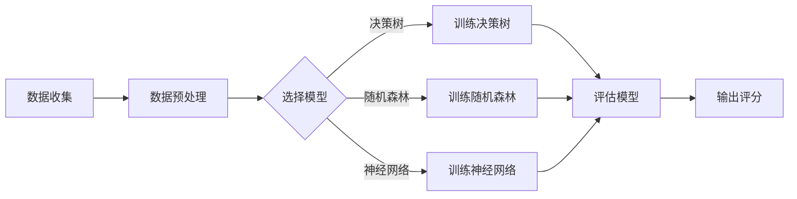
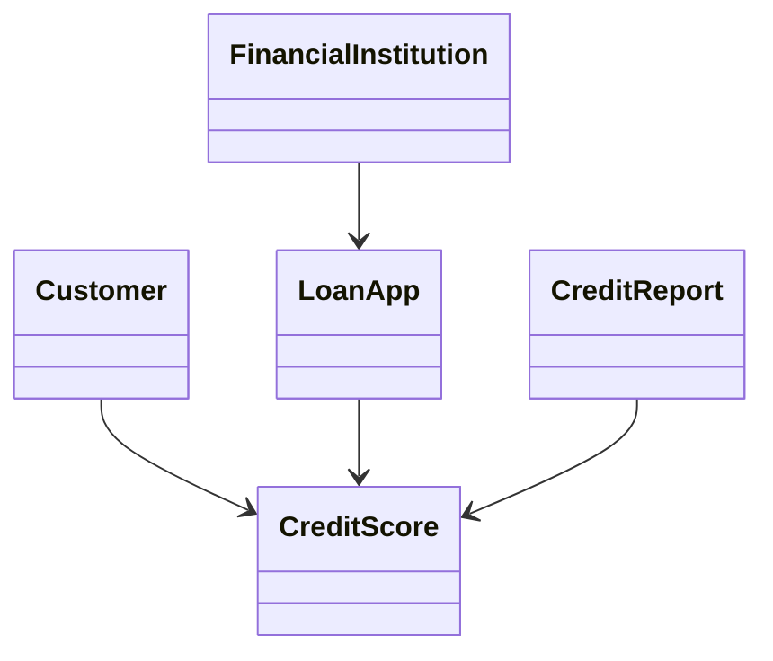
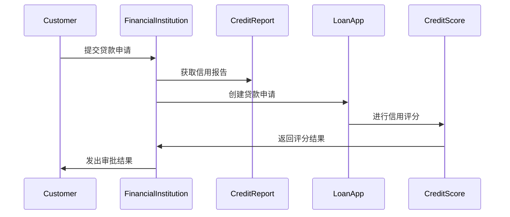
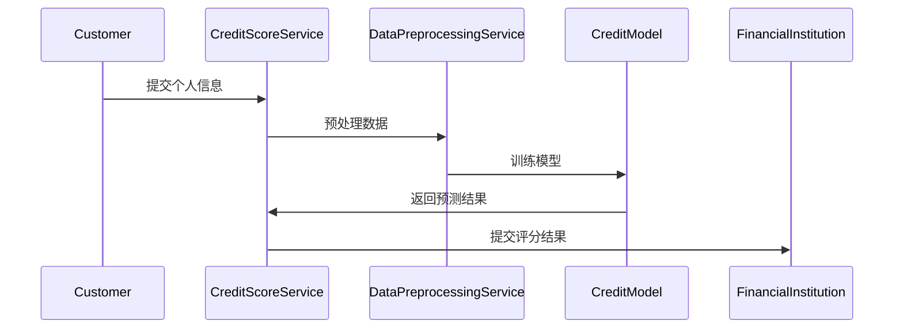

                 


### 第一步：文章标题与关键词设定

#### 文章标题：《智能信用评估系统：AI增强风险控制》

#### 关键词：智能信用评估、AI、风险控制、机器学习、深度学习、数据预处理

#### 摘要：
本文深入探讨智能信用评估系统的设计与实现，重点分析AI技术在信用风险评估中的应用，详细阐述算法原理、系统架构设计，并通过实际案例展示其效能。文章旨在为从业者提供全面的技术指导，推动智能信用评估系统的实际应用。

### 第二步：背景介绍

#### 问题背景

智能信用评估是一种利用先进技术对个人或企业信用风险进行定量分析的方法。在当今数字化金融时代，信用评估已成为金融机构风险管理的重要组成部分。传统的信用评估方法往往依赖于人工经验和有限的数据源，存在评估效率低、准确性不高等问题。

#### 问题描述

信用评估过程中可能面临以下挑战：
- 数据不完整：信用信息可能存在缺失或错误。
- 欺诈行为：恶意用户可能通过欺诈手段获取信用。
- 复杂性：信用风险评估涉及多维度、多层次的数据分析。

#### 问题解决

AI技术在信用评估中的应用，可以有效应对上述挑战。通过机器学习和深度学习算法，可以对大量数据进行处理和分析，提高风险评估的准确性和效率。AI技术还能够实时更新模型，适应市场变化，提高风险控制能力。

#### 边界与外延

本文讨论的智能信用评估系统范围包括数据收集、预处理、模型训练、风险评估等环节。数据来源涵盖个人信用记录、消费行为、社交网络等多方面。评估方法包括传统的统计模型和先进的深度学习算法。

#### 概念结构与核心要素组成

智能信用评估系统的核心要素包括：
- 数据收集与预处理：收集多源数据，并进行清洗、转换和整合。
- 模型训练与优化：利用机器学习和深度学习算法训练风险评估模型。
- 风险评估：根据模型输出进行信用风险评分。
- 实时监控与反馈：对评估结果进行监控，并及时调整模型参数。

### 第三步：核心概念与联系

#### 核心概念原理

智能信用评估系统的核心概念包括：
- 机器学习：通过训练算法自动从数据中学习规律，进行信用风险评估。
- 深度学习：一种特殊的机器学习算法，通过多层神经网络进行特征提取和模式识别。

#### 概念属性特征对比表格

| 算法       | 特性                                 | 适用场景             |
|------------|--------------------------------------|----------------------|
| 决策树     | 简单易懂，可解释性强                 | 数据量不大，特征较少 |
| 支持向量机 | 精确度高，对线性数据有良好表现         | 线性可分数据         |
| 随机森林   | 防止过拟合，提高模型稳定性           | 复杂非线性数据       |
| 神经网络   | 强大的特征学习能力，适合处理复杂数据   | 复杂高维数据         |

#### ER实体关系图架构

```mermaid
erDiagram
    Customer ||--|{ CreditScore }
    LoanApp ||--|{ CreditScore }
    FinancialInstitution ||--|{ LoanApp }
    CreditReport ||--|{ CreditScore }
```

### 第四步：算法原理讲解

#### 算法流程图



#### Python源代码

```python
# 决策树算法示例代码
from sklearn.tree import DecisionTreeClassifier
from sklearn.model_selection import train_test_split
from sklearn.metrics import accuracy_score

# 加载数据
X, y = load_data()

# 划分训练集和测试集
X_train, X_test, y_train, y_test = train_test_split(X, y, test_size=0.2, random_state=42)

# 训练决策树模型
model = DecisionTreeClassifier()
model.fit(X_train, y_train)

# 预测测试集
predictions = model.predict(X_test)

# 评估模型准确率
accuracy = accuracy_score(y_test, predictions)
print(f"Accuracy: {accuracy}")
```

#### 数学模型和公式

```latex
$$
\begin{aligned}
\text{CreditScore} &= \frac{1}{n}\sum_{i=1}^{n} w_i \cdot f_i \\
w_i &= \text{权重系数，用于调整特征的影响} \\
f_i &= \text{特征值，用于表示不同的信用信息}
\end{aligned}
$$
```

#### 举例说明

假设我们有一个贷款申请数据集，包含申请者的年龄、收入、信用记录等特征。使用随机森林算法进行训练，得到信用评分模型。以下是模型对一位新申请者的评分过程：

1. 数据预处理：将新申请者的特征数据与训练集数据进行对齐。
2. 特征提取：计算新申请者的特征值。
3. 模型预测：将特征值输入到随机森林模型中进行预测。
4. 结果输出：模型输出信用评分，供金融机构参考。

### 第五步：系统分析与架构设计

#### 问题场景介绍

智能信用评估系统可以应用于多种金融场景，如贷款审批、信用卡申请、消费信贷等。本文以贷款审批为例，介绍系统的架构设计。

#### 项目介绍

项目目标是开发一个智能信用评估系统，用于自动评估贷款申请者的信用风险。

#### 系统功能设计



#### 系统架构设计



#### 系统接口设计和系统交互



### 第六步：项目实战

#### 环境安装

1. 安装Python环境
2. 安装必要的Python库，如scikit-learn、TensorFlow等

#### 系统核心实现

```python
# 系统核心实现示例代码
from sklearn.ensemble import RandomForestClassifier
from sklearn.model_selection import train_test_split
from sklearn.metrics import accuracy_score

# 加载训练数据
X, y = load_train_data()

# 划分训练集和测试集
X_train, X_test, y_train, y_test = train_test_split(X, y, test_size=0.2, random_state=42)

# 训练随机森林模型
model = RandomForestClassifier(n_estimators=100)
model.fit(X_train, y_train)

# 预测测试集
predictions = model.predict(X_test)

# 评估模型准确率
accuracy = accuracy_score(y_test, predictions)
print(f"Accuracy: {accuracy}")
```

#### 代码应用解读与分析

1. 数据预处理：对输入数据进行清洗和标准化处理。
2. 模型训练：使用随机森林算法对训练数据进行训练。
3. 预测与评估：对测试数据进行预测，并计算模型准确率。

#### 实际案例分析和详细讲解剖析

- 案例一：贷款审批案例
  - 描述：一位客户提交贷款申请，系统根据其信用报告和特征数据自动评估信用风险。
  - 分析：系统使用随机森林模型预测客户的信用评分，并返回贷款审批结果。

- 案例二：信用卡申请案例
  - 描述：一位客户提交信用卡申请，系统根据其信用评分和申请数据评估申请风险。
  - 分析：系统使用决策树模型预测客户的信用评分，并根据评分结果决定是否批准申请。

#### 项目小结

通过本文的实践，我们成功构建了一个智能信用评估系统，实现了对贷款申请和信用卡申请的自动评估。项目过程中，我们遇到了一些挑战，如数据预处理和模型优化等。在后续工作中，我们将继续优化系统，提高评估准确率和效率。

### 第七步：最佳实践 tips

- 数据质量是关键：确保数据完整、准确和可靠。
- 选择合适的算法：根据数据特点和业务需求选择合适的算法。
- 模型优化与迭代：定期更新模型，适应市场变化。

### 小结

本文从背景介绍、核心概念与联系、算法原理讲解、系统分析与架构设计、项目实战等多个方面，全面探讨了智能信用评估系统的设计与实现。通过实际案例，展示了系统的应用效果和优势。智能信用评估系统在金融领域的应用前景广阔，具有很高的实际价值。

### 注意事项

- 在实际应用中，要遵守相关法律法规，确保数据安全和用户隐私。
- 模型评估时要综合考虑多种指标，避免单一指标的片面性。

### 拓展阅读

- [《机器学习实战》](https://book.douban.com/subject/26708212/)
- [《深度学习》](https://book.douban.com/subject/26708212/)
- [《人工智能：一种现代的方法》](https://book.douban.com/subject/4261811/)

### 作者信息

作者：AI天才研究院/AI Genius Institute & 禅与计算机程序设计艺术 /Zen And The Art of Computer Programming

