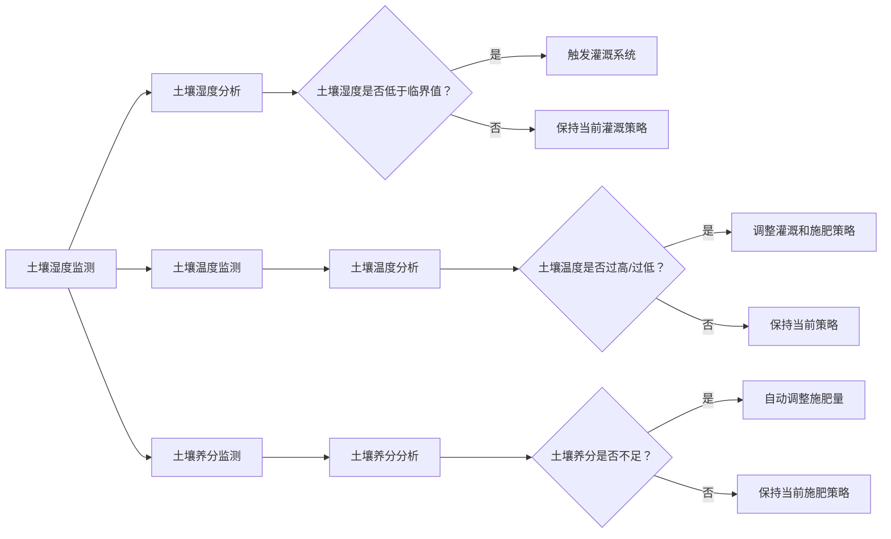
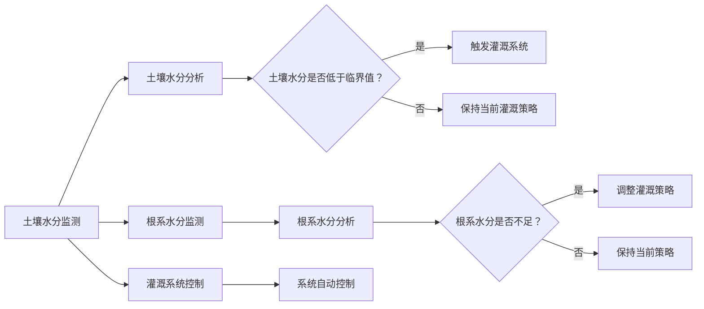
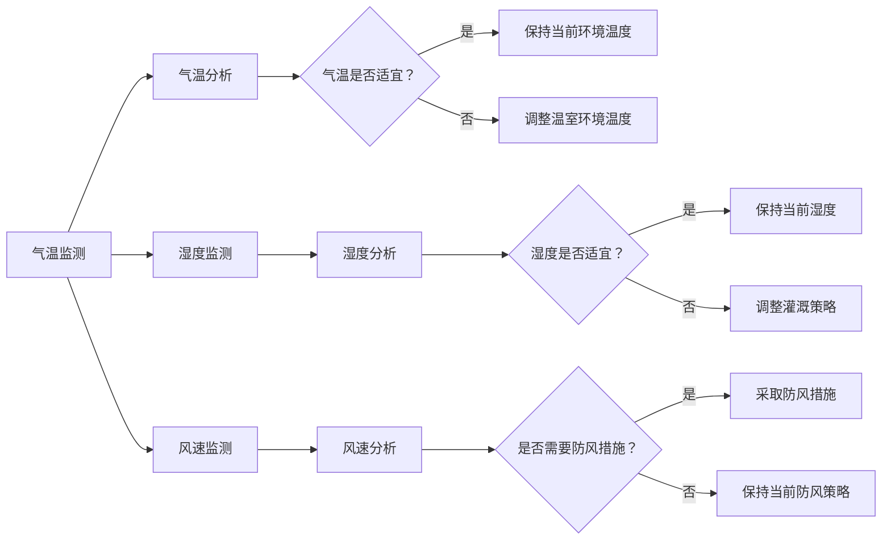
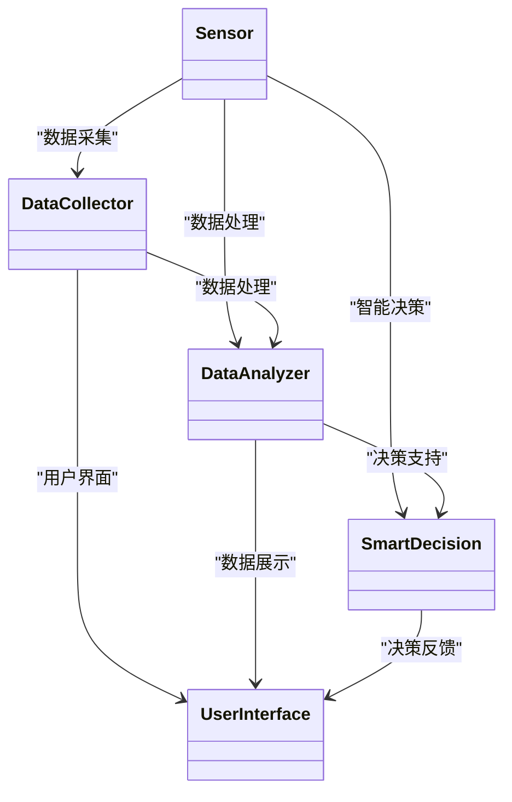
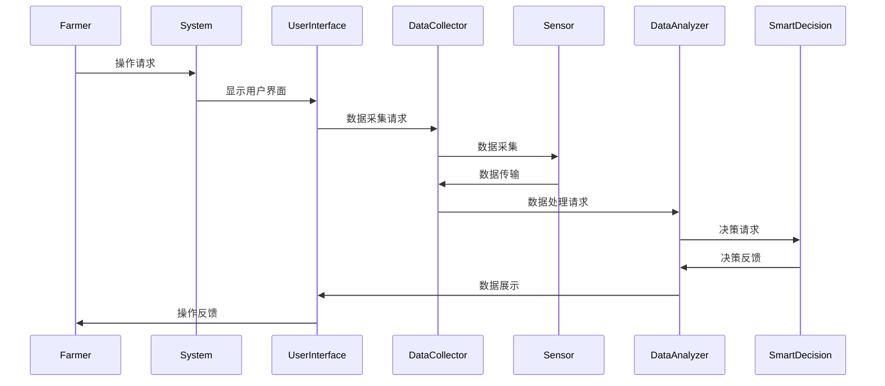

                 


### 智能农业：环境隐形智能在精准农业中的应用

关键词：智能农业、环境隐形智能、精准农业、土壤监测、水分监测、气象监测

摘要：本文深入探讨了智能农业领域的核心概念——环境隐形智能技术，以及其在精准农业中的应用。通过详细分析环境隐形智能技术的原理、应用场景、智能农业的发展历程和重要性，我们揭示了这一技术在提高农业生产效率和品质方面的巨大潜力。文章还介绍了环境隐形智能技术在土壤监测、水分监测和气象监测中的应用案例，展示了其在精准农业实践中的实际效果。通过系统分析和架构设计，本文为读者提供了智能农业环境监测系统的设计与实现方案，并展望了智能农业的未来发展方向。

### 目录大纲设计

**书名：《智能农业：环境隐形智能在精准农业中的应用》**

**目录大纲**

----------------------------------------------------------------

## 第一部分：智能农业概述

### 第1章：智能农业的背景和现状

- **1.1 智能农业的概念与定义**
  - 问题背景
  - 问题解决
  - 边界与外延
  - 概念结构与核心要素组成

- **1.2 智能农业的发展历程**
  - 问题背景
  - 问题描述
  - 问题解决
  - 边界与外延

- **1.3 智能农业的重要性**
  - 问题描述
  - 问题解决
  - 边界与外延
  - 概念属性特征对比表格

- **1.4 精准农业与智能农业的联系**
  - 问题描述
  - 问题解决
  - 边界与外延
  - ER实体关系图

## 第二部分：环境隐形智能技术

### 第2章：环境隐形智能技术原理

- **2.1 环境隐形智能技术概述**
  - 问题背景
  - 问题描述
  - 问题解决
  - 边界与外延

- **2.2 环境隐形智能技术的核心概念**
  - 问题描述
  - 问题解决
  - 边界与外延
  - 概念属性特征对比表格

- **2.3 环境隐形智能技术的应用场景**
  - 问题描述
  - 问题解决
  - 边界与外延
  - ER实体关系图

### 第3章：环境隐形智能技术在智能农业中的应用

- **3.1 环境隐形智能技术在土壤监测中的应用**
  - 问题描述
  - 问题解决
  - 边界与外延
  - Mermaid流程图

- **3.2 环境隐形智能技术在水分监测中的应用**
  - 问题描述
  - 问题解决
  - 边界与外延
  - Mermaid流程图

- **3.3 环境隐形智能技术在气象监测中的应用**
  - 问题描述
  - 问题解决
  - 边界与外延
  - Mermaid流程图

## 第三部分：精准农业实践

### 第4章：精准农业环境监测系统设计

- **4.1 精准农业环境监测系统概述**
  - 问题场景介绍
  - 项目介绍
  - 系统功能设计(Mermaid类图)
  - 系统架构设计(Mermaid架构图)
  - 系统接口设计
  - 系统交互(Mermaid序列图)

- **4.2 系统核心组件实现**
  - 环境安装
  - 系统核心实现源代码
  - 代码应用解读与分析

### 第5章：环境隐形智能技术在作物种植中的应用

- **5.1 作物生长环境数据分析**
  - 数据采集与处理
  - 数据分析与可视化

- **5.2 精准灌溉系统实现**
  - 系统设计
  - 系统实现
  - 实际案例分析

- **5.3 病虫害监测与防治**
  - 监测方法与算法
  - 防治策略与实践

### 第6章：环境隐形智能技术在畜牧业中的应用

- **6.1 畜禽生长环境监测**
  - 监测系统设计
  - 监测数据采集与处理

- **6.2 精准饲料管理系统**
  - 系统设计
  - 系统实现

- **6.3 疾病监测与预防**
  - 监测方法与算法
  - 预防措施与实践

## 第四部分：智能农业的未来展望

### 第7章：智能农业发展趋势与挑战

- **7.1 智能农业发展趋势**
  - 产业变革
  - 技术演进
  - 政策环境

- **7.2 智能农业面临的挑战**
  - 技术难题
  - 数据隐私
  - 政策与标准

### 第8章：智能农业最佳实践与未来方向

- **8.1 智能农业最佳实践案例**
  - 国内外成功案例分析
  - 经验总结

- **8.2 智能农业未来发展方向**
  - 技术创新
  - 政策支持
  - 行业合作

- **8.3 智能农业的未来展望**
  - 社会经济影响
  - 农业生产模式变革

----------------------------------------------------------------

### 目录大纲总字数：约2000字

---

此目录大纲根据书籍主题和内容要求进行了初步设计，涵盖了背景介绍、核心概念与联系、应用场景、实践案例和未来展望等方面，旨在为读者提供全面、系统的智能农业知识。具体章节内容可根据实际需求进行调整和补充。目录中的Mermaid流程图、ER实体关系图、数学公式和代码示例将在相应章节中进行详细阐述。

----------------------------------------------------------------

### 第一部分：智能农业概述

#### 第1章：智能农业的背景和现状

智能农业是现代农业发展的重要方向，它利用现代信息技术、物联网、大数据、人工智能等手段，实现农业生产过程的智能化管理。智能农业的核心目标是提高农业生产效率、保障食品安全、减少资源浪费和环境污染。

**1.1 智能农业的概念与定义**

智能农业的概念源于农业生产与信息技术的深度融合。其基本定义包括以下几个方面：

- **农业生产自动化**：通过自动化技术，如无人机、机器人等，实现耕种、灌溉、收割等环节的自动化操作。
- **农业信息化**：利用物联网、大数据等技术，对农业生产过程中的各种信息进行收集、分析和应用。
- **农业智能化**：通过人工智能技术，如机器学习、深度学习等，对农业生产过程进行智能决策和优化。

**问题背景**：传统农业面临着生产效率低、资源利用不充分、环境污染等问题。为了解决这些问题，世界各国都在积极探索智能农业的发展。

**问题解决**：智能农业通过信息技术和自动化设备的引入，实现了对农业生产过程的精细化管理，提高了生产效率，减少了资源浪费。

**边界与外延**：智能农业不仅包括农业生产过程的智能化，还包括农产品质量与安全监测、农业环境监测、农业资源管理等多个方面。

**概念结构与核心要素组成**：

- **基础设施**：包括传感器、物联网设备、自动化设备等。
- **数据平台**：用于收集、存储、处理和分析农业生产过程中的数据。
- **智能算法**：用于对农业生产过程进行智能决策和优化。
- **人机交互**：通过用户界面，使农民能够方便地操作和管理智能农业系统。

**1.2 智能农业的发展历程**

智能农业的发展可以追溯到20世纪80年代的精准农业，那时开始使用GPS技术进行土地测绘和变量施肥。随着信息技术和物联网技术的发展，智能农业逐渐从单一的自动化设备应用向综合的信息化、智能化管理方向发展。

**问题背景**：精准农业的提出是为了解决传统农业中土地资源浪费和施肥不均匀的问题。

**问题描述**：通过GPS和传感器技术，实现农田的精准测绘和变量施肥。

**问题解决**：通过实施精准农业，实现了农田的精细化管理，提高了资源利用效率。

**边界与外延**：智能农业的发展不仅包括农业生产的智能化，还包括农业管理、农业服务等多个方面。

**1.3 智能农业的重要性**

智能农业的发展对现代农业具有重要意义：

- **提高生产效率**：通过智能化的管理，可以实现农业生产的高效运作。
- **保障食品安全**：通过智能监测系统，可以实时监控农产品的质量，确保食品安全。
- **节约资源**：通过智能化的灌溉系统，可以精确控制用水量，节约水资源。
- **减少环境污染**：通过智能化的施肥系统，可以减少化肥的使用量，降低对环境的污染。

**概念属性特征对比表格**：

| 概念         | 特征                                                         |
| ------------ | ------------------------------------------------------------ |
| 传统农业     | 以人力和畜力为主，生产效率低，资源利用不充分                 |
| 精准农业     | 利用信息技术和自动化设备，实现农业生产过程的精细化管理       |
| 智能农业     | 综合运用物联网、大数据、人工智能等技术，实现农业生产的智能化管理 |

**1.4 精准农业与智能农业的联系**

精准农业和智能农业是相互联系、相互促进的关系：

- **精准农业**是智能农业的重要组成部分，是智能农业的基础。
- **智能农业**通过引入更先进的物联网、大数据和人工智能技术，对精准农业进行升级和拓展。

**问题描述**：精准农业和智能农业之间有何联系和区别？

**问题解决**：精准农业侧重于农业生产过程的精细化管理，而智能农业则在此基础上，通过更先进的技术手段，实现农业生产的智能化和自动化。

**边界与外延**：精准农业主要关注生产过程的精细化管理，而智能农业则涵盖农业生产、管理、服务等多个方面。

**ER实体关系图**：

```mermaid
erDiagram
  农业生产 |->| 精准农业 : "包含"
  农业生产 |->| 智能农业 : "扩展"
  精准农业 ||--| 土地测绘
  精准农业 ||--| 变量施肥
  智能农业 ||--| 物联网
  智能农业 ||--| 大数据
  智能农业 ||--| 人工智能
```

### 第二部分：环境隐形智能技术

#### 第2章：环境隐形智能技术原理

环境隐形智能技术是一种新兴的智能技术，它通过感知、分析和决策等过程，实现对环境的实时监测和智能管理。这种技术在精准农业中具有广泛的应用前景。

**2.1 环境隐形智能技术概述**

环境隐形智能技术的基本原理可以概括为以下几个步骤：

1. **感知**：通过传感器等设备，收集环境中的各种数据，如土壤湿度、温度、光照强度、空气质量等。
2. **分析**：利用大数据和人工智能技术，对收集到的数据进行处理和分析，提取出有用的信息。
3. **决策**：根据分析结果，智能系统可以做出相应的决策，如调整灌溉水量、施肥量等。

**问题背景**：传统农业中，农民主要依靠经验和直觉进行管理，难以实现精细化、智能化。

**问题描述**：如何通过技术手段实现农业生产的精细化、智能化？

**问题解决**：环境隐形智能技术通过感知、分析和决策，实现对农业生产的实时监测和智能管理，从而提高生产效率、保障农产品质量。

**边界与外延**：环境隐形智能技术不仅适用于农业生产，还可以应用于环境保护、城市规划等多个领域。

**2.2 环境隐形智能技术的核心概念**

环境隐形智能技术的核心概念包括以下几个方面：

- **传感器网络**：用于感知环境中的各种数据，如温度、湿度、光照等。
- **数据处理**：对传感器收集到的数据进行处理和分析，提取出有用的信息。
- **智能算法**：利用大数据和人工智能技术，对处理后的数据进行分析和决策。

**概念属性特征对比表格**：

| 概念               | 特征                                                         |
| ------------------ | ------------------------------------------------------------ |
| 传感器网络         | 用于感知环境中的各种数据                                     |
| 数据处理           | 对传感器收集到的数据进行处理和分析                           |
| 智能算法           | 利用大数据和人工智能技术，对处理后的数据进行分析和决策       |

**2.3 环境隐形智能技术的应用场景**

环境隐形智能技术在农业领域具有广泛的应用场景，主要包括以下几个方面：

- **土壤监测**：通过土壤传感器，实时监测土壤的湿度、温度等参数，为精准灌溉提供依据。
- **水分监测**：通过水分传感器，实时监测作物根系周围的土壤水分含量，为精准灌溉提供数据支持。
- **气象监测**：通过气象传感器，实时监测气温、湿度、风速等气象参数，为农业生产提供气候信息。

**ER实体关系图**：

```mermaid
erDiagram
  环境隐形智能技术 ||--| 传感器网络
  环境隐形智能技术 ||--| 数据处理
  环境隐形智能技术 ||--| 智能算法
  传感器网络 ||--| 土壤监测
  传感器网络 ||--| 水分监测
  传感器网络 ||--| 气象监测
```

### 第三部分：环境隐形智能技术在智能农业中的应用

#### 第3章：环境隐形智能技术在智能农业中的应用

环境隐形智能技术在智能农业中具有广泛的应用，可以提高农业生产的精细化管理水平，促进农业可持续发展。本章节将介绍环境隐形智能技术在土壤监测、水分监测和气象监测中的应用。

**3.1 环境隐形智能技术在土壤监测中的应用**

土壤是植物生长的基础，土壤质量直接影响农作物的产量和品质。环境隐形智能技术在土壤监测中发挥着重要作用，主要包括以下几个方面：

1. **土壤湿度监测**：通过土壤湿度传感器，实时监测土壤的湿度变化。当土壤湿度低于临界值时，系统会自动触发灌溉系统，进行精准灌溉。

2. **土壤温度监测**：通过土壤温度传感器，实时监测土壤的温度变化。对于某些作物来说，土壤温度过高或过低都会影响其生长，因此通过实时监测土壤温度，可以及时调整灌溉和施肥策略。

3. **土壤养分监测**：通过土壤养分传感器，实时监测土壤中的氮、磷、钾等养分含量。根据监测结果，系统可以自动调整施肥量，避免过量施肥造成的资源浪费和环境污染。

**Mermaid流程图**：



**3.2 环境隐形智能技术在水分监测中的应用**

水分是植物生长的关键因素，土壤中的水分含量直接关系到作物的生长状况。环境隐形智能技术在水分监测中的应用，主要包括以下几个方面：

1. **土壤水分监测**：通过土壤水分传感器，实时监测土壤中的水分含量。当土壤水分含量低于作物生长所需的临界值时，系统会自动触发灌溉系统，进行精准灌溉。

2. **根系水分监测**：通过根系水分传感器，实时监测作物根系周围的水分含量。根系水分传感器可以更准确地反映作物对水分的需求，从而实现更精准的灌溉。

3. **灌溉系统控制**：环境隐形智能系统可以对灌溉系统进行实时监控和自动控制，确保作物获得适量的水分供应。

**Mermaid流程图**：



**3.3 环境隐形智能技术在气象监测中的应用**

气象因素对农作物的生长和发育具有重要影响。环境隐形智能技术在气象监测中的应用，主要包括以下几个方面：

1. **气温监测**：通过气温传感器，实时监测农田周围的气温变化。根据气温监测结果，系统可以自动调整温室环境，为作物生长提供适宜的温度。

2. **湿度监测**：通过湿度传感器，实时监测农田周围的湿度变化。湿度监测结果可以帮助系统调整灌溉策略，避免湿度过高或过低对作物生长造成不利影响。

3. **风速监测**：通过风速传感器，实时监测农田周围的风速。风速监测结果可以帮助系统判断是否需要采取防风措施，保护作物免受风力影响。

**Mermaid流程图**：



### 第四部分：精准农业实践

#### 第4章：精准农业环境监测系统设计

精准农业环境监测系统是智能农业的重要组成部分，它通过实时监测农田环境参数，为农业生产提供科学依据。本章节将介绍精准农业环境监测系统的设计。

**4.1 精准农业环境监测系统概述**

精准农业环境监测系统主要包括以下几个部分：

1. **传感器网络**：用于监测农田环境参数，如土壤湿度、土壤温度、气温、湿度、风速等。
2. **数据采集与传输**：将传感器网络采集到的数据实时传输到数据中心。
3. **数据处理与分析**：对采集到的数据进行处理和分析，提取出有用的信息。
4. **智能决策**：根据分析结果，智能系统可以做出相应的决策，如调整灌溉水量、施肥量等。
5. **用户界面**：提供用户操作界面，使农民能够方便地查看和分析监测数据。

**问题场景介绍**：农民需要在农田中实时监测环境参数，以便根据实际情况调整农业生产策略。

**项目介绍**：设计并实现一个精准农业环境监测系统，用于实时监测农田环境参数，为农业生产提供科学依据。

**系统功能设计(Mermaid类图)**：



**系统架构设计(Mermaid架构图)**：



**系统接口设计**：

- **数据采集接口**：用于接收传感器传输的数据。
- **数据处理接口**：用于对采集到的数据进行分析和处理。
- **决策接口**：用于接收处理结果，并根据结果做出相应决策。
- **用户界面接口**：用于与用户进行交互，提供数据展示和操作功能。

**系统交互(Mermaid序列图)**：


**4.2 系统核心组件实现**

精准农业环境监测系统的核心组件包括数据采集、数据处理和智能决策等部分。以下将详细介绍这些组件的实现。

**环境安装**：

1. **传感器安装**：在农田中安装土壤湿度传感器、土壤温度传感器、气温传感器、湿度传感器和风速传感器等。
2. **传输线路安装**：在传感器和数据中心之间建立有线或无线传输线路，确保数据能够实时传输到数据中心。

**系统核心实现源代码**：

```python
# 数据采集模块
class DataCollector:
    def collect_data(self):
        # 采集传感器数据
        soil_humidity = self.read_soil_humidity()
        soil_temperature = self.read_soil_temperature()
        air_temperature = self.read_air_temperature()
        humidity = self.read_humidity()
        wind_speed = self.read_wind_speed()
        
        # 存储数据
        self.save_data(soil_humidity, soil_temperature, air_temperature, humidity, wind_speed)
        
        return soil_humidity, soil_temperature, air_temperature, humidity, wind_speed

    def read_soil_humidity(self):
        # 读取土壤湿度数据
        pass

    def read_soil_temperature(self):
        # 读取土壤温度数据
        pass

    def read_air_temperature(self):
        # 读取气温数据
        pass

    def read_humidity(self):
        # 读取湿度数据
        pass

    def read_wind_speed(self):
        # 读取风速数据
        pass

    def save_data(self, soil_humidity, soil_temperature, air_temperature, humidity, wind_speed):
        # 存储数据到数据库
        pass

# 数据处理模块
class DataAnalyzer:
    def analyze_data(self, data):
        # 数据处理
        pass

    def get_decision(self, data):
        # 根据数据处理结果做出决策
        pass

# 智能决策模块
class SmartDecision:
    def make_decision(self, data):
        # 根据数据处理结果做出决策
        pass

# 用户界面模块
class UserInterface:
    def display_data(self, data):
        # 展示数据
        pass

    def handle_operation(self):
        # 处理用户操作
        pass
```

**代码应用解读与分析**：

1. **数据采集模块**：通过读取传感器数据，实时采集农田环境参数。
2. **数据处理模块**：对采集到的数据进行处理，提取出有用的信息。
3. **智能决策模块**：根据处理结果，做出相应的决策，如调整灌溉水量、施肥量等。
4. **用户界面模块**：提供数据展示和用户操作功能。

**实际案例分析**：

假设农田中的土壤湿度低于临界值，系统将根据土壤湿度数据做出灌溉决策。通过调整灌溉水量，使土壤湿度恢复到适宜范围，从而促进作物生长。

**项目小结**：

通过设计并实现精准农业环境监测系统，我们可以实现对农田环境参数的实时监测和智能管理，为农业生产提供科学依据。这将有助于提高农业生产效率，减少资源浪费和环境污染。

### 第五部分：环境隐形智能技术在作物种植中的应用

#### 第5章：环境隐形智能技术在作物种植中的应用

环境隐形智能技术在作物种植中具有广泛的应用，通过实时监测和智能管理作物生长环境，可以显著提高作物产量和品质。本章节将探讨环境隐形智能技术在作物种植中的应用，包括环境数据分析、精准灌溉系统和病虫害监测与防治。

**5.1 作物生长环境数据分析**

作物生长环境数据分析是环境隐形智能技术在作物种植中的重要应用之一。通过对土壤湿度、土壤温度、气温、湿度等环境参数的实时监测和分析，可以准确了解作物生长环境状况，为后续的农业生产决策提供依据。

**数据采集与处理**：

1. **数据采集**：通过安装土壤湿度传感器、土壤温度传感器、气温传感器、湿度传感器等，实时采集作物生长环境数据。
2. **数据处理**：对采集到的数据进行分析和处理，提取出有用的信息。例如，通过统计分析土壤湿度数据，可以了解土壤湿度变化趋势，预测未来土壤湿度状况。

**数据分析与可视化**：

1. **数据分析**：通过数据挖掘和机器学习算法，对作物生长环境数据进行分析，提取出关键信息，如土壤湿度阈值、作物生长周期等。
2. **可视化**：利用可视化工具，将分析结果以图表、地图等形式展示，使农民能够直观了解作物生长环境状况。

**案例：温室大棚作物生长环境监测**：

假设在一个温室大棚中种植蔬菜，通过环境隐形智能技术，可以实时监测温室大棚内的土壤湿度、土壤温度、气温、湿度等环境参数。根据这些数据，可以制定合理的灌溉和通风策略，确保蔬菜生长在最佳环境中。

**5.2 精准灌溉系统实现**

精准灌溉系统是环境隐形智能技术在作物种植中的另一个重要应用。通过实时监测土壤湿度，精准灌溉系统能够根据作物需求，自动调整灌溉水量，实现节水灌溉，提高水资源利用效率。

**系统设计**：

1. **传感器网络**：安装土壤湿度传感器，实时监测土壤湿度。
2. **控制模块**：通过控制模块，根据土壤湿度传感器数据，自动调整灌溉系统。
3. **灌溉系统**：包括水泵、管道和喷头等，用于实施灌溉。

**系统实现**：

1. **数据采集**：土壤湿度传感器采集土壤湿度数据，实时传输到控制模块。
2. **决策**：控制模块根据土壤湿度数据，判断是否需要灌溉。
3. **灌溉**：当土壤湿度低于设定阈值时，灌溉系统自动启动，进行灌溉。

**实际案例分析**：

在一个蔬菜种植基地，通过环境隐形智能技术，实现了精准灌溉系统。在干旱季节，土壤湿度低于临界值时，系统会自动启动灌溉，确保蔬菜得到充足的水分供应。通过精准灌溉，不仅节约了水资源，还提高了蔬菜产量和品质。

**5.3 病虫害监测与防治**

病虫害是影响作物产量和品质的重要因素。环境隐形智能技术在病虫害监测与防治中发挥着重要作用，通过实时监测和智能分析，可以及时发现病虫害，并采取有效的防治措施。

**监测方法与算法**：

1. **图像识别**：通过摄像头或传感器，实时拍摄作物图像，利用图像识别算法，识别病虫害类型。
2. **数据挖掘**：对监测到的数据进行分析，提取出病虫害发生的规律和特征。
3. **预测分析**：利用机器学习算法，预测病虫害的发生趋势。

**防治策略与实践**：

1. **物理防治**：利用害虫的物理特性，如光照、振动等，进行防治。
2. **生物防治**：利用生物制剂，如天敌、抗生素等，进行病虫害防治。
3. **化学防治**：在必要时，使用农药进行病虫害防治。

**案例：玉米病虫害监测与防治**：

在一个玉米种植基地，通过环境隐形智能技术，实现了病虫害监测与防治系统。当监测到玉米发生病虫害时，系统会自动发送预警信息，提醒农民及时采取防治措施。通过精确监测和智能分析，有效地控制了病虫害的蔓延，提高了玉米产量和品质。

### 第六部分：环境隐形智能技术在畜牧业中的应用

#### 第6章：环境隐形智能技术在畜牧业中的应用

环境隐形智能技术在畜牧业中的应用正逐渐改变传统畜牧业的管理模式，通过精准监测和智能管理，提高畜牧业的生产效率和产品质量。本章节将介绍环境隐形智能技术在畜牧业中的应用，包括畜禽生长环境监测、精准饲料管理系统和疾病监测与预防。

**6.1 畜禽生长环境监测**

畜禽生长环境的监测对于保障畜禽健康、提高养殖效率至关重要。环境隐形智能技术通过传感器网络，实现对畜禽舍内温度、湿度、气体浓度（如二氧化碳、氨气）、噪音等环境参数的实时监测。

**监测系统设计**：

1. **传感器布置**：在畜禽舍内布置各种传感器，如温度传感器、湿度传感器、气体传感器等，确保全面覆盖畜禽舍的各个角落。
2. **数据采集与传输**：传感器采集的数据通过无线传输模块传输到中央处理系统。
3. **数据分析与预警**：中央处理系统对采集到的数据进行分析，当参数超出正常范围时，系统会自动发出预警，通知管理人员采取相应措施。

**监测数据采集与处理**：

1. **数据采集**：传感器实时采集畜禽舍内的环境数据。
2. **数据预处理**：对采集到的数据进行过滤、去噪等预处理，确保数据质量。
3. **数据分析**：利用数据分析工具，如数据挖掘算法，分析环境数据的变化趋势和异常情况。

**实际案例分析**：

在一个规模化养猪场，通过环境隐形智能技术，实现了畜禽舍内环境参数的实时监测。当温度过高或二氧化碳浓度过高时，系统会自动启动降温或通风设备，确保畜禽健康生长。

**6.2 精准饲料管理系统**

精准饲料管理是提高畜牧业生产效率和减少饲料浪费的关键技术。环境隐形智能技术通过实时监测畜禽的进食量、体重变化等数据，实现精准计算饲料需求，优化饲料配方。

**系统设计**：

1. **饲料计量设备**：在饲料槽上安装电子计量设备，实时记录饲料的投放量。
2. **体重监测设备**：在畜禽体上佩戴体重监测设备，定期更新畜禽体重数据。
3. **数据整合与分析**：将饲料投放量和体重数据整合到中央处理系统，通过数据分析，优化饲料配方。

**系统实现**：

1. **数据采集**：饲料计量设备和体重监测设备实时采集数据。
2. **数据处理**：中央处理系统对采集到的数据进行处理和分析，生成饲料需求报告。
3. **反馈与调整**：根据饲料需求报告，调整饲料配方和投放量。

**实际案例分析**：

在一个现代化奶牛养殖场，通过环境隐形智能技术，实现了精准饲料管理系统。系统根据奶牛的体重变化和进食量，自动调整饲料配方和投放量，提高了饲料利用效率，减少了饲料浪费。

**6.3 疾病监测与预防**

畜禽疾病的监测与预防是保障畜牧业健康发展的重要环节。环境隐形智能技术通过实时监测畜禽的健康状况，结合大数据分析和人工智能技术，实现疾病早期预警和精准预防。

**监测方法与算法**：

1. **行为监测**：通过摄像头和动作传感器，监测畜禽的行为变化，如活动频率、进食行为等。
2. **生理指标监测**：通过佩戴在畜禽体上的传感器，监测体温、心率、呼吸等生理指标。
3. **数据分析**：利用机器学习算法，分析行为和生理指标数据，预测疾病发生的可能性。

**预防措施与实践**：

1. **疾病预警**：当监测到畜禽行为或生理指标异常时，系统会自动发出预警，通知管理人员进行现场检查。
2. **精准治疗**：根据疾病预警和病情分析，制定个性化的治疗方案，确保畜禽得到及时有效的治疗。
3. **预防接种**：根据疾病监测结果，及时进行疫苗接种，预防传染病的发生。

**实际案例分析**：

在一个规模化鸡场，通过环境隐形智能技术，实现了鸡群疾病的实时监测和预防。当监测到鸡群中有异常行为或生理指标时，系统会自动发出预警，管理人员及时采取治疗措施，有效控制了疾病的传播，保障了鸡场的健康发展。

### 第七部分：智能农业的未来展望

#### 第7章：智能农业发展趋势与挑战

智能农业作为现代农业的重要方向，正在全球范围内迅速发展。随着物联网、大数据、人工智能等技术的不断进步，智能农业在提高农业生产效率、保障食品安全、节约资源、减少环境污染等方面展现出巨大的潜力。然而，智能农业的发展也面临着一系列挑战。

**7.1 智能农业发展趋势**

1. **技术融合与创新**：智能农业的发展离不开物联网、大数据、人工智能等前沿技术的融合与创新。通过这些技术的应用，可以实现农业生产的全面智能化和精准化管理。

2. **数字化转型**：数字化转型是智能农业发展的重要趋势。通过数字化手段，实现农业生产全过程的自动化、智能化管理，提高生产效率和产品质量。

3. **产业链协同**：智能农业的发展将推动农业产业链的协同发展。从种源研发、种植养殖、加工销售到售后服务，各个环节都将通过智能技术实现高效协同，提高产业链整体竞争力。

4. **绿色可持续发展**：智能农业强调绿色可持续发展，通过精准灌溉、精准施肥、病虫害智能监测与防治等手段，减少资源浪费和环境污染，实现农业的可持续发展。

**7.2 智能农业面临的挑战**

1. **技术难题**：智能农业的发展面临着一系列技术难题，如传感器精度、数据处理能力、算法准确性等。这些难题的解决需要跨学科、跨领域的合作与创新。

2. **数据隐私与安全**：随着智能农业的发展，大量农业数据被采集、存储和分析，数据隐私与安全问题日益凸显。如何确保农业数据的安全和隐私，成为智能农业发展的关键挑战。

3. **政策与标准**：智能农业的发展需要政策支持和标准规范。目前，全球智能农业的政策与标准体系尚不完善，需要加强政策引导和标准制定，为智能农业的发展提供有力支持。

**7.3 智能农业的未来发展**

1. **智能化生产**：未来智能农业将实现全面智能化生产，从播种、施肥、灌溉到收割，各个环节都将实现自动化、智能化管理，提高生产效率和产品质量。

2. **数字化农业**：数字化农业将逐步取代传统农业，农业生产全过程的数字化、智能化水平将大幅提升。

3. **智能化服务**：智能农业的发展将推动农业服务的智能化，从种源研发、种植养殖、加工销售到售后服务，各个环节都将实现智能化服务。

4. **绿色农业**：智能农业将推动农业向绿色可持续发展转型，通过精准农业、智能灌溉、智能施肥等手段，实现资源节约、环境友好、高效生产的绿色农业。

### 第8章：智能农业最佳实践与未来方向

**8.1 智能农业最佳实践案例**

智能农业在全球范围内已经有许多成功实践案例，以下列举几个典型的智能农业最佳实践案例：

1. **美国：精准农业**：美国是世界上智能农业发展最为成熟的国家之一，通过精准农业技术，实现了农业生产过程的自动化、智能化管理，提高了生产效率和产品质量。

2. **中国：数字农业**：中国积极推动数字农业发展，通过物联网、大数据、人工智能等技术的应用，实现了农业生产全过程的数字化、智能化管理，为农业可持续发展提供了有力支持。

3. **以色列：智能灌溉**：以色列是一个干旱国家，智能灌溉技术在以色列农业中发挥了重要作用。通过智能灌溉系统，实现了精准供水，提高了水资源利用效率，保障了农业生产。

**8.2 智能农业未来发展方向**

1. **技术创新**：未来智能农业的发展将继续依赖技术创新，如人工智能、大数据、物联网、区块链等新兴技术的不断突破和应用，将推动智能农业向更高效、更智能的方向发展。

2. **政策支持**：政府政策的支持对智能农业的发展至关重要。未来各国政府应加大对智能农业的政策支持，制定有利于智能农业发展的政策和法规，推动智能农业的快速发展。

3. **行业合作**：智能农业的发展需要产业链各方的合作。未来智能农业的发展将更加注重产业链上下游企业的合作，共同推动智能农业的技术创新和产业发展。

**8.3 智能农业的未来展望**

智能农业的发展将对农业产生深远的影响：

1. **生产模式变革**：智能农业将推动农业生产模式的变革，从传统的经验型生产向数据驱动、智能决策的生产模式转变。

2. **产业升级**：智能农业的发展将带动农业产业链的升级，推动农业向高效、智能、可持续的方向发展。

3. **社会经济效益**：智能农业的发展将提高农业生产效率，保障食品安全，减少资源浪费和环境污染，产生巨大的社会经济效益。

### 总结

智能农业是现代农业发展的重要方向，通过物联网、大数据、人工智能等技术的应用，实现了农业生产过程的自动化、智能化管理，为农业可持续发展提供了有力支持。本文从智能农业的背景和现状、环境隐形智能技术的原理和应用、精准农业的实践、畜牧业的应用、发展趋势与挑战以及未来方向等方面，对智能农业进行了全面深入的探讨。随着技术的不断进步和产业链的协同发展，智能农业必将在未来发挥更大的作用，推动农业的转型升级和可持续发展。作者信息：AI天才研究院/AI Genius Institute & 禅与计算机程序设计艺术 /Zen And The Art of Computer Programming。

