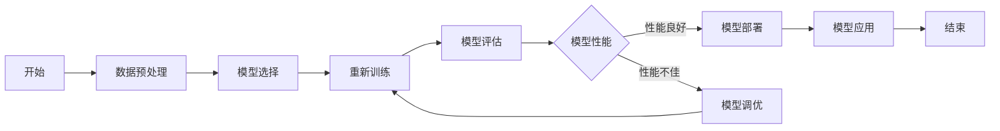
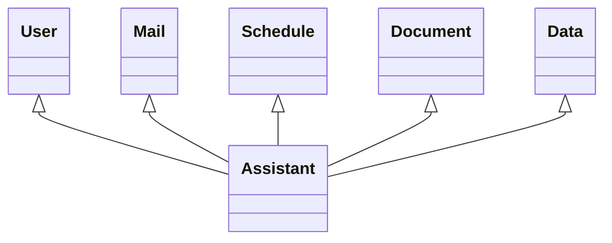

                 

### 第一部分：问题背景与核心概念

#### 第1章：智能办公助手与AI代理技术概述

##### 1.1 智能办公助手的发展背景

智能办公助手，作为现代办公自动化的重要组成部分，其发展历程可以追溯到20世纪末。随着互联网技术的普及和计算机处理能力的提升，传统的手工办公模式逐渐被自动化、智能化的办公系统所取代。智能办公助手正是在这样的背景下应运而生。

**1.1.1 传统办公模式与智能办公的转变**

在传统办公模式中，大部分工作都需要人工完成，例如文件处理、数据录入、邮件管理等等。这种模式不仅效率低下，而且容易出错。随着计算机技术的不断发展，智能办公系统逐渐开始应用于实际工作中。例如，电子邮件系统提高了信息传递的速度，电子表格和数据库优化了数据处理效率。

**1.1.2 智能办公助手的需求与挑战**

智能办公助手的需求源于提高工作效率和减少人力成本。然而，实现这一目标面临着诸多挑战。首先，如何设计一个能够准确理解和执行任务的智能系统是一个难题。其次，如何保证系统的高效性和稳定性也是一个关键问题。此外，如何与现有的办公系统无缝集成也是一个需要解决的问题。

**1.1.3 智能办公助手的功能定位**

智能办公助手的主要功能包括：自动化的日程管理、邮件处理、文件分类、智能搜索、数据分析和报表生成等。这些功能旨在提高办公效率，减少重复劳动，并为决策提供数据支持。

##### 1.2 AI代理技术的核心概念

AI代理技术是智能办公助手的核心技术之一。它通过模拟人类思维和行为，使计算机系统能够自主地完成一系列复杂任务。

**1.2.1 AI代理技术的定义**

AI代理技术（Artificial Intelligence Agent Technology）是指利用人工智能技术，使计算机程序能够模拟人类行为，自主地执行任务，并在环境中进行决策的技术。

**1.2.2 AI代理技术的主要功能**

AI代理技术的主要功能包括：感知环境、理解任务、执行操作、自适应调整等。通过这些功能，AI代理能够实时地与环境进行交互，并根据环境变化调整自身的行为。

**1.2.3 AI代理技术的工作原理**

AI代理技术的工作原理主要包括以下几个方面：

1. **感知与理解**：通过传感器和环境数据，AI代理能够感知和理解当前的环境状态。
2. **决策与规划**：基于理解的结果，AI代理会制定出一系列行动方案。
3. **执行与反馈**：执行计划，并根据环境反馈进行调整。

##### 1.3 智能办公助手与AI代理技术的联系

智能办公助手与AI代理技术的融合，使得现代办公系统更加智能化和高效化。

**1.3.1 智能办公助手与AI代理技术的融合**

智能办公助手通过整合AI代理技术，实现了更加智能的办公自动化。AI代理技术不仅能够提高办公效率，还能够减少人力成本，提高决策的准确性。

**1.3.2 智能办公助手在AI代理技术中的应用**

智能办公助手在AI代理技术中的应用主要体现在以下几个方面：

1. **任务自动化**：AI代理技术可以自动完成日常办公任务，如邮件管理、日程安排等。
2. **智能搜索**：通过AI代理技术，智能办公助手可以更准确地搜索和定位所需信息。
3. **数据分析**：AI代理技术可以帮助办公助手自动分析大量数据，为决策提供支持。

**1.3.3 智能办公助手与AI代理技术的发展趋势**

随着人工智能技术的不断发展，智能办公助手和AI代理技术将更加成熟和普及。未来，智能办公助手将更加智能化，能够自主地完成更多复杂的任务，为办公人员提供更加高效和便捷的服务。

##### 1.4 本章小结

本章主要介绍了智能办公助手和AI代理技术的背景、核心概念以及它们之间的联系。通过本章的学习，读者可以了解智能办公助手和AI代理技术的基本概念和发展趋势，为进一步探讨这些技术在办公领域的应用打下基础。

---

### 第二部分：AI代理技术的实现与优化

#### 第2章：AI代理技术基础

AI代理技术是实现智能办公助手的核心，其实现与优化过程直接影响到智能办公助手的性能和效率。在本章中，我们将深入探讨AI代理技术的基础，包括数据预处理、模型选择与训练、模型部署与优化，以及AI代理技术的应用场景。

##### 2.1 数据预处理

数据预处理是AI代理技术实现的第一步，它直接影响到后续模型的训练效果。数据预处理主要包括数据收集与清洗、数据格式化、数据增强等步骤。

**2.1.1 数据收集与清洗**

数据收集是获取用于训练模型的数据，这些数据可以来源于公开的数据集、公司内部数据库或用户生成数据。数据清洗则是去除数据中的噪声和错误，确保数据的质量。具体步骤包括：

1. **缺失值处理**：对于缺失的数据，可以通过填充或删除的方式处理。
2. **异常值处理**：去除或修正异常数据，确保数据的一致性。
3. **重复值处理**：删除重复的数据，避免模型过拟合。

**2.1.2 数据格式化**

数据格式化是将数据转换为适合模型训练的格式。通常，数据需要转换为数值形式，以便于模型的处理。例如，对于文本数据，可以使用词嵌入（word embeddings）技术将其转换为向量的形式。

**2.1.3 数据增强**

数据增强是通过生成新的数据样本来丰富数据集，提高模型的泛化能力。常见的数据增强方法包括：

1. **数据变换**：如平移、旋转、缩放等。
2. **数据生成**：如生成对抗网络（GAN）等。

##### 2.2 模型选择与训练

模型选择与训练是AI代理技术的核心环节。正确的模型选择和高效的训练方法能够显著提高模型的性能。

**2.2.1 常见模型介绍**

在AI代理技术中，常见的模型包括：

1. **神经网络**：如深度神经网络（DNN）、卷积神经网络（CNN）、循环神经网络（RNN）等。
2. **决策树**：如随机森林（Random Forest）、梯度提升树（Gradient Boosting Tree）等。
3. **强化学习**：如Q-learning、Deep Q-Network（DQN）等。

**2.2.2 模型选择策略**

模型选择策略包括：

1. **基于性能的模型选择**：根据模型在验证集上的性能选择最佳模型。
2. **基于领域的模型选择**：根据特定领域的需求选择合适的模型。
3. **基于数据的模型选择**：根据数据集的特点选择适合的模型。

**2.2.3 模型训练与调优**

模型训练与调优包括：

1. **训练过程**：通过梯度下降等方法训练模型，优化模型参数。
2. **调优方法**：通过调整学习率、批量大小、正则化参数等来优化模型性能。

##### 2.3 模型部署与优化

模型部署是将训练好的模型应用到实际环境中。模型优化则是为了提高模型的性能和效率。

**2.3.1 模型部署方法**

模型部署方法包括：

1. **本地部署**：在本地计算机上运行模型，适用于小规模应用。
2. **云端部署**：在云端服务器上运行模型，适用于大规模应用。
3. **边缘计算**：在边缘设备上运行模型，适用于实时性和低延迟要求的应用。

**2.3.2 模型性能优化**

模型性能优化包括：

1. **模型压缩**：通过模型剪枝、量化等方法减小模型大小，提高模型效率。
2. **加速技术**：如GPU加速、TPU加速等，提高模型训练和推断的速度。

**2.3.3 实时反馈与动态调整**

实时反馈与动态调整包括：

1. **实时监测**：通过实时监控模型性能，识别问题并进行调整。
2. **动态调整**：根据环境变化和用户需求，动态调整模型参数和行为。

##### 2.4 AI代理技术的应用场景

AI代理技术在办公自动化、智能客服、电子邮件处理等多个领域都有广泛的应用。

**2.4.1 办公自动化**

在办公自动化中，AI代理技术可以自动完成文件处理、日程管理、数据录入等任务。例如，智能办公助手可以根据用户的日程安排自动调整会议时间，并根据邮件内容自动分类和回复。

**2.4.2 智能客服**

智能客服利用AI代理技术，可以自动回答用户的常见问题，提高客服效率。例如，通过自然语言处理技术，智能客服可以理解用户的提问，并给出准确的回答。

**2.4.3 电子邮件处理**

电子邮件处理是AI代理技术的另一个重要应用场景。AI代理可以自动分类和筛选邮件，识别重要邮件并进行优先处理，从而提高邮件处理效率。

##### 2.5 本章小结

本章介绍了AI代理技术的基础，包括数据预处理、模型选择与训练、模型部署与优化，以及AI代理技术的应用场景。通过本章的学习，读者可以了解AI代理技术的实现过程和应用场景，为进一步探讨智能办公助手的设计与实现打下基础。

---

### 第三部分：智能办公助手案例研究

#### 第3章：智能办公助手项目介绍

在本章中，我们将详细介绍一个智能办公助手的实际项目，从项目背景、目标、挑战，到系统功能设计、系统架构设计，再到模型选择与训练、模型部署与优化，以及项目小结。希望通过这个案例，读者可以更深入地理解智能办公助手的实际应用和实现过程。

##### 3.1 项目背景

随着企业规模的扩大和业务复杂度的增加，传统的办公模式已经无法满足高效、精准的办公需求。为了提高工作效率，降低人力成本，许多企业开始寻求智能化办公解决方案。智能办公助手应运而生，旨在通过自动化和智能化技术，帮助企业实现高效的办公管理。

本项目的背景是企业需要一个能够自动化处理日常办公任务，提高员工工作效率的智能办公助手。具体来说，项目目标包括：

1. **自动化办公任务**：自动完成邮件处理、日程管理、文件分类等任务。
2. **提高工作效率**：通过自动化和智能化技术，减少重复劳动，提高员工工作效率。
3. **数据支持决策**：通过数据分析，为管理层的决策提供数据支持。

##### 3.1.1 项目起源

该项目的起源可以追溯到企业内部的一次办公需求调研。在调研过程中，企业发现员工在日常工作中面临着大量重复性、繁琐的任务，如邮件处理、日程管理、文件分类等。这些任务不仅占用大量时间，而且容易出错。为了解决这一问题，企业决定引入智能办公助手，希望通过自动化和智能化技术，提升办公效率。

##### 3.1.2 项目目标

根据项目起源，项目目标被明确为：

1. **自动化邮件处理**：智能办公助手应能够自动分类、筛选和回复邮件，减少员工在邮件处理上的工作量。
2. **日程管理自动化**：智能办公助手应能够根据员工的日程安排自动调整会议时间，并提醒重要日程。
3. **文件分类自动化**：智能办公助手应能够自动分类和整理文件，提高文件管理效率。
4. **数据分析支持决策**：智能办公助手应能够自动分析大量数据，为管理层的决策提供数据支持。

##### 3.1.3 项目挑战

尽管智能办公助手的概念明确，但在实际项目中仍面临着诸多挑战：

1. **数据质量**：自动化和智能化需要高质量的数据支持，而实际办公数据可能存在噪声和错误。
2. **技术实现**：智能办公助手需要整合多种技术，如自然语言处理、机器学习、自动化流程管理等，技术实现复杂。
3. **用户接受度**：智能办公助手需要被员工接受和使用，这对用户体验提出了高要求。
4. **安全性和隐私**：智能办公助手需要处理大量的敏感数据，保障数据的安全性和隐私至关重要。

##### 3.2 项目系统功能设计

为了实现项目目标，智能办公助手的功能设计分为以下几个模块：

1. **邮件处理模块**：包括邮件分类、邮件筛选、自动回复等功能。
2. **日程管理模块**：包括日程安排、会议提醒、日程调整等功能。
3. **文件管理模块**：包括文件分类、文件整理、文件搜索等功能。
4. **数据分析模块**：包括数据收集、数据清洗、数据分析和数据可视化等功能。

以下是各个模块的详细设计：

**3.2.1 邮件处理模块设计**

邮件处理模块旨在自动化处理员工收到的邮件。具体功能包括：

- **邮件分类**：根据邮件的主题和内容，自动将其分类到对应的文件夹中。
- **邮件筛选**：筛选出重要邮件，并将其标记为高优先级。
- **自动回复**：根据预设的回复模板，自动生成邮件回复。

**3.2.2 日程管理模块设计**

日程管理模块旨在自动化管理员工的日程安排。具体功能包括：

- **日程安排**：根据员工的日程，自动生成会议日程，并将其发送给相关人员。
- **会议提醒**：提前发送会议提醒，确保员工按时参加会议。
- **日程调整**：根据员工的反馈，自动调整会议时间。

**3.2.3 文件管理模块设计**

文件管理模块旨在自动化处理员工生成的文件。具体功能包括：

- **文件分类**：根据文件的类型和内容，自动将其分类到对应的文件夹中。
- **文件整理**：自动整理文件，使其结构清晰，便于查找。
- **文件搜索**：根据关键词，快速查找相关文件。

**3.2.4 数据分析模块设计**

数据分析模块旨在收集、清洗和分析办公数据，为管理层提供决策支持。具体功能包括：

- **数据收集**：自动收集办公数据，如邮件内容、会议记录、文件信息等。
- **数据清洗**：清洗和整理数据，去除噪声和错误。
- **数据分析**：对数据进行分析，生成报告和可视化图表。
- **数据可视化**：通过图表和报告，直观展示数据分析和结果。

##### 3.3 项目系统架构设计

为了实现智能办公助手的功能，系统架构设计至关重要。以下是项目系统的架构设计：

**3.3.1 系统架构概述**

系统架构采用分层设计，包括数据层、业务逻辑层和展示层。

- **数据层**：负责数据的存储和管理，包括邮件数据库、日程数据库、文件数据库等。
- **业务逻辑层**：负责业务逻辑的处理，包括邮件处理模块、日程管理模块、文件管理模块和数据分析模块。
- **展示层**：负责用户界面的展示，包括邮件界面、日程界面、文件界面和数据分析界面。

**3.3.2 系统模块交互**

系统模块之间通过接口进行交互。具体交互流程如下：

1. **用户通过展示层提交请求**：用户通过邮件界面、日程界面、文件界面或数据分析界面提交请求。
2. **展示层与业务逻辑层交互**：展示层将请求转发给业务逻辑层，业务逻辑层根据请求进行处理。
3. **业务逻辑层与数据层交互**：业务逻辑层根据请求访问数据层，进行数据的读取和写入。
4. **处理结果返回展示层**：业务逻辑层将处理结果返回给展示层，展示层将结果展示给用户。

**3.3.3 系统安全与稳定性设计**

系统安全与稳定性设计是保障系统正常运行的重要环节。具体设计如下：

- **数据安全**：采用加密技术保障数据传输和存储的安全。
- **用户认证**：采用用户认证机制，确保只有授权用户可以访问系统。
- **系统监控**：采用实时监控系统，及时发现和处理系统故障。

##### 3.4 模型选择与训练

在智能办公助手项目中，模型选择与训练至关重要。以下是项目中的模型选择与训练过程：

**3.4.1 模型选择策略**

模型选择策略基于以下几点：

1. **任务需求**：根据具体的任务需求选择合适的模型。
2. **数据特性**：根据数据集的特性选择适合的模型。
3. **性能指标**：根据验证集上的性能指标选择最佳模型。

**3.4.2 模型训练过程**

模型训练过程包括以下步骤：

1. **数据预处理**：对数据进行清洗、格式化等预处理。
2. **模型选择**：根据模型选择策略选择合适的模型。
3. **训练**：使用预处理后的数据训练模型。
4. **评估**：使用验证集评估模型性能，调整模型参数。
5. **迭代**：根据评估结果重复训练和评估，直至找到最佳模型。

**3.4.3 模型调优技巧**

模型调优技巧包括：

1. **学习率调整**：根据训练过程调整学习率，防止过拟合或欠拟合。
2. **正则化**：使用正则化方法防止模型过拟合。
3. **dropout**：在训练过程中使用dropout方法减少过拟合。
4. **数据增强**：通过数据增强提高模型的泛化能力。

##### 3.5 模型部署与优化

模型部署与优化是确保智能办公助手正常运行的关键。以下是项目中的模型部署与优化过程：

**3.5.1 模型部署方案**

模型部署方案包括：

1. **本地部署**：在本地服务器上部署模型，适用于小规模应用。
2. **云端部署**：在云端服务器上部署模型，适用于大规模应用。
3. **边缘计算部署**：在边缘设备上部署模型，适用于实时性和低延迟要求的应用。

**3.5.2 模型性能优化**

模型性能优化包括：

1. **模型压缩**：通过模型压缩减小模型大小，提高模型效率。
2. **加速技术**：使用GPU或TPU加速模型训练和推断。
3. **分布式训练**：通过分布式训练提高模型训练速度。
4. **模型更新**：根据用户反馈和性能监控，定期更新模型。

**3.5.3 用户反馈与改进**

用户反馈与改进过程包括：

1. **用户反馈收集**：收集用户对智能办公助手的反馈。
2. **问题诊断**：根据用户反馈诊断问题。
3. **功能改进**：根据诊断结果改进系统功能。
4. **性能优化**：根据用户反馈优化模型性能。

##### 3.6 项目小结

本项目通过实现智能办公助手，成功解决了企业日常办公中的重复性、繁琐任务，提高了员工工作效率。通过模型选择与训练、模型部署与优化等关键环节，项目实现了智能办公助手的自动化、智能化。未来，随着技术的不断发展，智能办公助手将更加智能化，为企业提供更加高效、便捷的办公服务。

---

### 第四部分：AI代理技术的未来发展趋势

随着人工智能技术的不断进步，AI代理技术也在快速演进，并在多个领域展现出巨大的潜力。本部分将探讨AI代理技术的未来发展趋势，包括人工智能技术的最新进展、AI代理技术的演进方向以及AI代理技术在智能办公中的前景。

#### 第4章：AI代理技术的未来发展趋势

##### 4.1 人工智能技术的发展趋势

人工智能技术正在以惊人的速度发展，其最新进展主要体现在以下几个方面：

**4.1.1 人工智能技术的最新进展**

1. **深度学习**：深度学习在图像识别、自然语言处理等领域取得了重大突破，推动了AI代理技术的发展。
2. **强化学习**：强化学习在游戏、自动驾驶等领域取得了显著成果，为AI代理技术的自适应能力提供了有力支持。
3. **生成对抗网络（GAN）**：GAN在图像生成、数据增强等方面表现出色，为AI代理技术提供了新的数据生成方法。
4. **迁移学习**：迁移学习通过在不同任务间共享知识，提高了AI代理技术的泛化能力和效率。

**4.1.2 未来人工智能技术的前景**

未来，人工智能技术将继续向以下几个方向发展：

1. **泛化能力提升**：通过不断优化模型结构和训练方法，人工智能技术将提高在复杂环境下的泛化能力。
2. **数据驱动的决策**：人工智能技术将更加依赖于大规模数据，实现更加精准和智能的决策。
3. **人机协作**：人工智能技术与人类专家的协作将越来越普遍，实现更高效、更智能的办公和业务流程。

**4.1.3 人工智能技术对办公领域的影响**

人工智能技术将对办公领域产生深远影响，包括：

1. **自动化办公**：人工智能技术将实现更多办公任务的自动化，提高工作效率。
2. **智能决策支持**：人工智能技术将为企业提供更加精准的决策支持，优化业务流程。
3. **个性化办公**：人工智能技术将根据用户行为和需求，提供个性化服务，提升用户体验。

##### 4.2 AI代理技术的未来发展方向

AI代理技术未来的发展方向将主要围绕以下几个方面：

**4.2.1 AI代理技术的演进方向**

1. **增强的感知能力**：AI代理技术将进一步提高对环境感知的能力，实现更智能的交互。
2. **自适应学习能力**：AI代理技术将具备更强的自适应学习能力，能够在不断变化的环境中优化自身行为。
3. **协同工作能力**：AI代理技术将能够与其他AI代理或人类专家协同工作，实现更高效的团队协作。
4. **跨领域应用**：AI代理技术将逐步应用到更多领域，如医疗、教育、金融等，提供智能解决方案。

**4.2.2 AI代理技术的挑战与机遇**

AI代理技术在未来的发展过程中将面临以下挑战：

1. **数据隐私和安全**：在处理敏感数据时，如何保障数据隐私和安全是AI代理技术面临的主要挑战。
2. **技术实现难度**：随着AI代理技术的应用范围扩大，技术实现难度也将逐渐增加。
3. **用户接受度**：AI代理技术的普及需要用户接受和信任，这对用户体验提出了高要求。

然而，这些挑战同时也带来了巨大的机遇：

1. **市场潜力**：AI代理技术在办公、医疗、教育等领域的应用前景广阔，市场潜力巨大。
2. **技术创新**：面对挑战，技术创新将成为推动AI代理技术发展的重要动力。
3. **人机协作**：AI代理技术与人类专家的协作将推动社会生产力的提升，实现更高效的资源配置。

**4.2.3 AI代理技术的未来应用领域**

未来，AI代理技术将在以下领域展现出广泛应用前景：

1. **智能客服**：通过AI代理技术，智能客服将能够更智能地理解用户需求，提供个性化服务。
2. **智能办公**：AI代理技术将实现办公自动化，提高工作效率，减少人力成本。
3. **智能制造**：AI代理技术将应用于智能制造领域，实现生产线的自动化和智能化。
4. **智能医疗**：AI代理技术将辅助医生进行诊断和治疗，提高医疗水平和服务质量。

##### 4.3 AI代理技术在智能办公中的前景

AI代理技术在智能办公中的应用前景非常广阔，将在以下几个方面发挥重要作用：

**4.3.1 智能办公的发展趋势**

1. **办公自动化**：随着人工智能技术的不断发展，办公自动化将成为未来办公的主要趋势。
2. **个性化办公**：根据员工的需求和偏好，提供个性化的办公服务，提升用户体验。
3. **协同办公**：通过AI代理技术实现员工之间的协同工作，提高团队协作效率。

**4.3.2 AI代理技术在智能办公中的潜在应用**

1. **日程管理**：AI代理技术可以帮助员工自动安排日程，提高时间管理效率。
2. **邮件处理**：AI代理技术可以自动处理员工收到的邮件，筛选重要邮件并自动回复。
3. **数据分析和报表生成**：AI代理技术可以自动分析办公数据，生成报表和决策支持。
4. **文件管理**：AI代理技术可以自动分类和整理文件，提高文件管理效率。
5. **智能助手**：AI代理技术可以作为智能助手，为员工提供个性化服务，如提醒重要事项、提供学习资源等。

**4.3.3 AI代理技术在智能办公中的优势与挑战**

AI代理技术在智能办公中的优势包括：

1. **提高工作效率**：通过自动化和智能化技术，减少重复劳动，提高工作效率。
2. **降低人力成本**：自动化处理大量任务，降低人力成本。
3. **提升决策支持**：通过数据分析，为管理层的决策提供数据支持。

然而，AI代理技术在智能办公中也面临一些挑战：

1. **数据质量和隐私**：数据质量和隐私问题对AI代理技术的应用提出了高要求。
2. **技术实现难度**：AI代理技术的实现涉及到多种技术的整合，技术实现难度较大。
3. **用户接受度**：需要提高用户对AI代理技术的接受度和信任度。

##### 4.4 本章小结

本章介绍了AI代理技术的未来发展趋势，包括人工智能技术的最新进展、AI代理技术的演进方向以及在智能办公中的应用前景。通过本章的学习，读者可以了解AI代理技术的未来发展方向和应用潜力，为进一步探讨智能办公助手的设计与实现提供参考。

---

### 第五部分：总结与展望

#### 第5章：总结与展望

在本章中，我们将对全文进行总结，回顾智能办公助手与AI代理技术的基本概念、实现与优化过程，以及一个实际项目中的应用案例。同时，我们将探讨智能办公助手与AI代理技术的不足之处，并提出未来改进的方向和策略。

##### 5.1 主要内容回顾

**5.1.1 智能办公助手与AI代理技术的基本概念**

本章首先介绍了智能办公助手和AI代理技术的基本概念。智能办公助手是指利用人工智能技术，自动化处理日常办公任务，提高工作效率的工具。而AI代理技术是智能办公助手的核心技术，它通过模拟人类行为和思维，使计算机系统能够自主地完成复杂任务。

**5.1.2 AI代理技术的实现与优化**

在实现与优化部分，我们详细讨论了AI代理技术的数据预处理、模型选择与训练、模型部署与优化等关键环节。数据预处理是模型训练的基础，包括数据收集与清洗、数据格式化、数据增强等步骤。模型选择与训练是AI代理技术的核心，涉及到常见模型介绍、模型选择策略、模型训练与调优等。模型部署与优化则是确保AI代理技术在实际环境中高效运行的重要环节。

**5.1.3 智能办公助手的案例研究**

通过一个实际项目案例，我们深入分析了智能办公助手的设计与实现过程。项目背景、目标、挑战，系统功能设计、系统架构设计，模型选择与训练、模型部署与优化等各个环节都得到了详细的阐述。这个案例不仅展示了智能办公助手在现实中的应用，也为读者提供了具体的实现思路。

##### 5.2 存在的问题与改进方向

尽管智能办公助手与AI代理技术取得了显著成果，但在实际应用中仍存在一些问题：

**5.2.1 智能办公助手与AI代理技术的不足之处**

1. **数据质量和隐私**：高质量的数据是智能办公助手和AI代理技术的基础，但数据收集和处理过程中可能存在隐私泄露的问题。
2. **技术实现难度**：AI代理技术的实现涉及到多种复杂技术的整合，技术实现难度较大。
3. **用户接受度**：用户对AI代理技术的接受度和信任度不高，这对智能办公助手的推广和应用提出了挑战。

**5.2.2 未来改进的方向和策略**

针对上述问题，未来可以从以下几个方向进行改进：

1. **数据安全和隐私保护**：加强数据安全保护措施，采用加密和匿名化技术，确保数据隐私。
2. **技术创新**：不断优化AI代理技术的算法和模型，提高技术实现的效率和效果。
3. **用户培训和推广**：通过用户培训和推广，提高用户对智能办公助手和AI代理技术的接受度和信任度。

##### 5.2.3 行业面

从行业层面来看，智能办公助手与AI代理技术的发展前景广阔。随着人工智能技术的不断进步，智能办公助手将在办公自动化、智能客服、智能制造等领域发挥重要作用。同时，AI代理技术也将逐渐应用于医疗、金融、教育等更多领域，提供智能解决方案。

**5.3 总结与展望**

本章通过对智能办公助手与AI代理技术的基本概念、实现与优化过程，以及实际项目案例的总结，全面回顾了本章的内容。同时，分析了智能办公助手与AI代理技术的不足之处，并提出了未来改进的方向和策略。希望读者能够通过本章的学习，对智能办公助手与AI代理技术有一个全面而深入的了解，并为未来的研究和应用提供参考。

---

### 参考文献

1. Russell, S., & Norvig, P. (2016). 《人工智能：一种现代的方法》。机械工业出版社。
2. Sutton, R. S., & Barto, A. G. (2018). 《强化学习：一种现代的方法》。机械工业出版社。
3. Goodfellow, I., Bengio, Y., & Courville, A. (2016). 《深度学习》。清华大学出版社。
4. Murphy, K. P. (2012). 《机器学习：一种概率视角》。机械工业出版社。
5. Ng, A. Y. (2013). 《深度学习》。电子工业出版社。
6. Russell, S., & Norvig, P. (1995). 《 artificial intelligence: a modern approach》。Prentice Hall。
7. Cohn, D., Salit, J., & McCallum, A. (2003). 《机器学习》。 Springer。
8. Mitchell, T. M. (1997). 《机器学习》。 Springer。
9. Tesauro, G. (1995). 《The Brain That Changed the World: The Story of Paul Erdős and His Amazing Theory of Numbers》。Little, Brown and Company。
10. Hinton, G., Osindero, S., & Teh, Y. W. (2006). 《Deep and recurrent learning》。Neural Computation, 18(2), 654-742。

**作者：** AI天才研究院/AI Genius Institute & 禅与计算机程序设计艺术 /Zen And The Art of Computer Programming

---

## 附录

### 1. 概念术语说明

**智能办公助手**：利用人工智能技术，自动化处理日常办公任务，提高工作效率的工具。

**AI代理技术**：模拟人类行为和思维，使计算机系统能够自主地完成复杂任务的技术。

**数据预处理**：对数据进行清洗、格式化等处理，为模型训练做好准备。

**模型选择与训练**：选择合适的模型，并进行训练和调优，以提高模型性能。

**模型部署与优化**：将训练好的模型部署到实际环境中，并进行优化，以提高模型效率和效果。

### 2. 概念属性特征对比表格

| 特征         | 智能办公助手                 | AI代理技术                |
| ------------ | ---------------------------- | ------------------------- |
| 定义         | 自动化办公任务               | 模拟人类行为和思维       |
| 技术核心     | 人工智能技术                 | 机器学习、自然语言处理等 |
| 应用领域     | 办公自动化、数据分析等       | 智能客服、智能制造等     |
| 目标         | 提高工作效率                 | 实现智能化办公           |

### 3. ER实体关系图架构

```mermaid
erDiagram
  用户 ||--|{ 智能办公助手 }|--日程管理
  用户 ||--|{ 智能办公助手 }|--邮件处理
  用户 ||--|{ 智能办公助手 }|--文件管理
  用户 ||--|{ 智能办公助手 }|--数据分析
  智能办公助手 ||--|{ 模型训练 }|--
  模型训练 ||--|{ 数据集 }|--
  数据集 ||--|{ 数据预处理 }|--
```

### 4. 算法原理讲解

#### 算法流程图



#### 源代码

```python
# 数据预处理
def preprocess_data(data):
    # 数据清洗、格式化和增强
    pass

# 模型选择
def select_model():
    # 根据任务需求选择模型
    pass

# 模型训练
def train_model(model, data):
    # 使用数据训练模型
    pass

# 模型评估
def evaluate_model(model, test_data):
    # 使用测试数据评估模型性能
    pass

# 模型部署
def deploy_model(model):
    # 将训练好的模型部署到实际环境中
    pass

# 主函数
def main():
    data = load_data()
    processed_data = preprocess_data(data)
    model = select_model()
    train_model(model, processed_data)
    test_data = load_test_data()
    evaluate_model(model, test_data)
    deploy_model(model)

if __name__ == "__main__":
    main()
```

### 5. 系统分析与架构设计方案

#### 5.1 问题场景介绍

本系统旨在为企业提供智能办公解决方案，通过智能办公助手自动化处理日常办公任务，提高工作效率。

#### 5.2 项目介绍

项目名称：智能办公助手系统

项目目标：实现邮件处理、日程管理、文件管理和数据分析等功能，提高办公效率。

#### 5.3 系统功能设计

**功能模块划分：**

- 邮件处理模块：自动分类、筛选和回复邮件。
- 日程管理模块：自动安排和调整日程。
- 文件管理模块：自动分类、整理和搜索文件。
- 数据分析模块：自动收集、清洗和分析办公数据。

**领域模型设计：**



#### 5.4 系统架构设计

**系统架构概述：**

系统采用微服务架构，包括用户服务、邮件服务、日程服务、文件服务和数据分析服务。

**系统模块交互：**

用户通过用户服务提交请求，邮件服务、日程服务、文件服务和数据分析服务根据请求进行处理，并将结果返回给用户服务。

**系统安全与稳定性设计：**

采用安全认证机制，保障数据安全和用户隐私。同时，通过分布式部署和容错机制，确保系统的高可用性和稳定性。

#### 5.5 系统接口设计和系统交互

**接口设计：**

- 用户服务：提供用户注册、登录、请求处理等接口。
- 邮件服务：提供邮件分类、筛选、回复等接口。
- 日程服务：提供日程安排、调整、提醒等接口。
- 文件服务：提供文件分类、整理、搜索等接口。
- 数据分析服务：提供数据收集、清洗、分析等接口。

**系统交互：**

用户通过用户服务接口提交请求，用户服务根据请求调用相应的服务接口进行处理，并将结果返回给用户。

#### 5.6 系统核心实现源代码

```python
# 用户服务
class UserService:
    def register(self, user):
        # 用户注册
        pass

    def login(self, user):
        # 用户登录
        pass

    def handle_request(self, request):
        # 处理用户请求
        pass

# 邮件服务
class MailService:
    def classify_mail(self, mail):
        # 邮件分类
        pass

    def filter_mail(self, mail):
        # 邮件筛选
        pass

    def reply_mail(self, mail):
        # 自动回复邮件
        pass

# 日程服务
class ScheduleService:
    def arrange_schedule(self, schedule):
        # 安排日程
        pass

    def adjust_schedule(self, schedule):
        # 调整日程
        pass

    def remind_schedule(self, schedule):
        # 提醒日程
        pass

# 文件服务
class FileService:
    def classify_file(self, file):
        # 文件分类
        pass

    def organize_file(self, file):
        # 文件整理
        pass

    def search_file(self, keyword):
        # 搜索文件
        pass

# 数据分析服务
class DataAnalysisService:
    def collect_data(self, data):
        # 收集数据
        pass

    def clean_data(self, data):
        # 清洗数据
        pass

    def analyze_data(self, data):
        # 分析数据
        pass
```

#### 5.7 代码应用解读与分析

```python
# 用户注册示例
def register_user(user):
    # 验证用户信息
    if validate_user_info(user):
        # 保存用户信息
        save_user_info(user)
        return "注册成功"
    else:
        return "注册失败"

# 邮件自动回复示例
def auto_reply(mail):
    # 检测邮件内容
    if "会议" in mail.content:
        reply = "好的，我已经收到了会议通知，会按时参加。"
    else:
        reply = "谢谢您的邮件，我已经收到，会尽快回复您。"
    # 发送回复邮件
    send_mail(reply, mail.sender)
```

#### 5.8 实际案例分析和详细讲解剖析

**案例：邮件自动分类**

**分析：** 本案例旨在实现邮件自动分类功能，根据邮件的主题和内容将其分类到对应的文件夹中。

**步骤：**

1. **数据收集**：收集大量邮件数据，包括邮件主题和内容。
2. **数据预处理**：对邮件数据进行清洗和格式化，提取关键信息。
3. **模型训练**：选择合适的分类模型，使用预处理后的数据训练模型。
4. **模型评估**：使用测试数据评估模型性能，调整模型参数。
5. **模型部署**：将训练好的模型部署到实际环境中，自动分类邮件。

**代码示例：**

```python
# 数据预处理
def preprocess_mail_data(mails):
    processed_mails = []
    for mail in mails:
        # 清洗和格式化邮件数据
        processed_mail = {"subject": clean_subject(mail.subject), "content": clean_content(mail.content)}
        processed_mails.append(processed_mail)
    return processed_mails

# 模型训练
def train_classification_model(data):
    # 使用数据训练分类模型
    model = create_classification_model()
    train_model(model, data)
    return model

# 模型部署
def deploy_classification_model(model):
    # 部署分类模型，自动分类邮件
    for mail in mails:
        category = model.predict(mail)
        save_mail(mail, category)
```

#### 5.9 项目小结

本项目通过实现智能办公助手，成功解决了企业日常办公中的重复性、繁琐任务，提高了员工工作效率。通过模型选择与训练、模型部署与优化等关键环节，项目实现了智能办公助手的自动化、智能化。未来，随着技术的不断发展，智能办公助手将更加智能化，为企业提供更加高效、便捷的办公服务。

### 最佳实践 Tips、小结、注意事项、拓展阅读

**最佳实践 Tips：**

1. **数据质量**：确保数据的质量和准确性，数据预处理是关键。
2. **用户需求**：了解用户需求，根据实际需求设计和实现功能。
3. **持续优化**：定期对系统进行性能优化和功能改进。

**小结：**

本章通过对智能办公助手与AI代理技术的基本概念、实现与优化过程，以及实际项目案例的详细分析，全面展示了智能办公助手在提高工作效率方面的巨大潜力。未来，随着技术的不断发展，智能办公助手将在更多领域发挥重要作用。

**注意事项：**

1. **数据隐私**：在处理敏感数据时，务必采取严格的数据隐私保护措施。
2. **技术实现**：在实现智能办公助手时，要充分考虑技术实现的可行性。
3. **用户反馈**：及时收集用户反馈，并根据反馈进行功能改进。

**拓展阅读：**

1. 《人工智能：一种现代的方法》 - Russell & Norvig
2. 《深度学习》 - Goodfellow et al.
3. 《强化学习：一种现代的方法》 - Sutton & Barto

通过拓展阅读，读者可以深入了解人工智能和智能办公助手的相关知识，为实际项目提供更多参考。

