                 

# 智能协作：多功能机器人与人类员工的共生

> 关键词：智能协作、多功能机器人、人机交互、人工智能、工业应用

> 摘要：本文探讨了智能协作的背景与概念，分析了多功能机器人的技术原理与发展趋势，并阐述了智能协作技术在实际应用中的挑战与解决方案。通过深入探讨智能协作的各个方面，本文旨在为读者提供一个全面而深刻的理解，帮助他们在未来的技术变革中找到自己的定位和机遇。

## 第1章：智能协作的背景与概念

### 1.1.1 问题背景

在21世纪，随着信息技术的飞速发展和人工智能的兴起，人类社会正经历着一场深刻的变革。在这个过程中，多功能机器人与人类员工之间的协作关系逐渐成为焦点。传统的工业机器人主要承担重复性、危险性和高强度的劳动，而随着人工智能技术的进步，机器人开始具备更高的智能水平，能够进行复杂的任务处理，甚至能够与人类员工协同工作。

#### 1.1.2 问题描述

当前，多功能机器人与人类员工的协作存在以下几个问题：

1. **任务分配不均**：机器人和人类员工之间的任务分配不够科学合理，导致部分机器人闲置，而人类员工则面临过高的工作负荷。
2. **协作效率低下**：由于机器人与人类员工之间的沟通不畅，导致协作效率低下，甚至出现安全事故。
3. **人机交互障碍**：机器人与人类员工之间的交互界面复杂，操作难度大，降低了人类员工的操作体验。

#### 1.1.3 问题解决

智能协作技术通过以下几个方面的改进，有望解决上述问题：

1. **智能任务分配**：利用人工智能算法，根据机器人与人类员工的能力和负载情况，进行科学合理的任务分配。
2. **提高协作效率**：通过优化人机交互界面，提高机器人与人类员工之间的沟通效率，减少协作过程中的误解和误差。
3. **降低交互难度**：开发智能交互系统，简化机器人和人类员工之间的交互流程，提高操作的便捷性和用户体验。

#### 1.1.4 边界与外延

智能协作不仅涉及机器人与人类员工之间的协作，还包括机器人与机器人之间的协作，以及机器人与计算机系统之间的协作。此外，智能协作技术还广泛应用于医疗、教育、服务业等多个领域。

#### 1.1.5 概念结构与核心要素组成

- **智能协作**：指利用人工智能技术，实现机器人与人类员工之间的高效协同工作。
- **多功能机器人**：具备多种功能和智能特性的机器人，能够在不同环境中执行复杂任务。
- **人类员工**：具有智慧和创造力的人类工作者，是智能协作系统的重要组成部分。
- **协作效率**：指智能协作系统在完成特定任务时所表现出来的效率水平。
- **人机交互**：指机器人与人类员工之间通过交互界面进行的沟通和协作。

#### 1.1.6 AI大模型在智能协作中的应用

AI大模型，如GPT、BERT等，在智能协作中发挥着重要作用。它们可以通过学习大量数据，理解人类员工的意图和需求，从而提供更加精准的协作支持。例如，AI大模型可以用于任务分配、决策支持、人机交互等方面，提高智能协作系统的整体性能。

### 第2章：多功能机器人的技术原理与发展趋势

#### 2.1.1 多功能机器人的定义与特点

多功能机器人是指具备多种功能和智能特性的机器人，能够在不同环境中执行复杂任务。与传统的单一功能机器人相比，多功能机器人具有以下几个特点：

1. **多功能性**：能够执行多种类型的任务，如搬运、装配、焊接等。
2. **高智能水平**：具备自主决策和自适应能力，能够根据环境变化和任务需求进行动态调整。
3. **良好的环境适应性**：能够在多种环境中工作，如高温、低温、高压、腐蚀等。

#### 2.1.2 多功能机器人的核心技术

多功能机器人的核心技术包括人工智能、物联网、机器人控制等。以下是这些核心技术的详细介绍：

1. **人工智能**：通过深度学习、自然语言处理等技术，使机器人具备智能决策和自适应能力。
2. **物联网**：通过传感器、通信模块等技术，实现机器人与外部设备的信息交换和协同工作。
3. **机器人控制**：通过控制系统，实现机器人的运动控制、感知控制和任务执行。

#### 2.1.3 多功能机器人的发展现状

目前，多功能机器人已经在工业、医疗、农业、服务业等多个领域得到广泛应用。例如，在工业生产中，多功能机器人可以用于自动化装配、搬运和检测；在医疗领域，多功能机器人可以用于手术辅助、护理和康复；在农业领域，多功能机器人可以用于播种、施肥、采摘等。

#### 2.1.4 多功能机器人的发展趋势

未来，多功能机器人将朝着更加智能化、自动化、个性化的方向发展。具体来说，包括以下几个方面：

1. **智能化**：通过集成更多的AI技术，提高机器人的自主决策和自适应能力。
2. **自动化**：通过优化控制系统和执行机构，提高机器人的工作效率和可靠性。
3. **个性化**：通过定制化服务，满足不同用户的需求，提供更加个性化的服务。

#### 2.1.5 本章小结

本章对多功能机器人的技术原理和发展趋势进行了详细分析，为后续章节的讨论奠定了基础。在下一章中，我们将探讨智能协作技术在实际应用中的挑战与解决方案。

### 第3章：智能协作技术的挑战与解决方案

#### 3.1.1 挑战一：任务分配不均

任务分配不均是目前智能协作中面临的一个主要挑战。由于机器人和人类员工的能力和负载情况差异较大，导致任务分配不够科学合理，从而影响整个系统的效率。

**解决方案**：

1. **智能任务分配算法**：利用人工智能算法，如深度学习、强化学习等，根据机器人与人类员工的能力和负载情况，进行动态的任务分配。
2. **数据驱动的决策支持**：通过收集和分析机器人和人类员工的工作数据，为任务分配提供数据支持，确保任务分配的公平性和合理性。

#### 3.1.2 挑战二：协作效率低下

协作效率低下是智能协作中另一个重要挑战。由于机器人与人类员工之间的沟通不畅，导致协作效率低下，甚至出现安全事故。

**解决方案**：

1. **优化人机交互界面**：通过设计更加直观、易用的人机交互界面，提高机器人与人类员工之间的沟通效率。
2. **实时通信与监控**：利用物联网技术，实现机器人与人类员工之间的实时通信与监控，确保协作过程中的信息流通。

#### 3.1.3 挑战三：人机交互障碍

人机交互障碍是影响智能协作效果的另一个关键因素。由于机器人与人类员工之间的交互界面复杂，操作难度大，降低了人类员工的操作体验。

**解决方案**：

1. **简化交互流程**：通过简化交互流程，降低机器人和人类员工之间的操作难度，提高用户体验。
2. **智能交互系统**：开发智能交互系统，如语音助手、手势识别等，提高人机交互的便捷性和舒适性。

#### 3.1.4 挑战四：数据安全与隐私保护

在智能协作过程中，数据的安全与隐私保护是一个不可忽视的挑战。由于机器人与人类员工之间的数据交换和共享，可能导致数据泄露和隐私侵犯。

**解决方案**：

1. **加密技术**：采用先进的加密技术，对数据进行加密存储和传输，确保数据的安全性。
2. **隐私保护机制**：设计隐私保护机制，对用户数据进行匿名化处理，降低隐私泄露风险。

#### 3.1.5 挑战五：维护与升级

智能协作系统需要定期进行维护和升级，以保持其高效性和可靠性。然而，维护和升级过程中可能会面临一系列挑战，如系统兼容性、设备故障等。

**解决方案**：

1. **自动化维护**：通过自动化维护工具，实现智能协作系统的自动检测、诊断和修复，提高维护效率。
2. **快速升级**：采用模块化设计，实现智能协作系统的快速升级，确保系统功能的持续改进。

#### 3.1.6 本章小结

本章详细分析了智能协作技术在应用过程中面临的主要挑战，并提出了相应的解决方案。在下一章中，我们将探讨智能协作技术在各个领域的实际应用案例，以进一步展示其潜力和优势。

### 第4章：智能协作技术在各个领域的应用案例

#### 4.1.1 工业制造领域

在工业制造领域，智能协作技术已经得到广泛应用，大幅提升了生产效率和质量。以下是一些实际应用案例：

1. **自动化装配线**：机器人与人类员工协同工作，实现自动化装配过程，提高了生产效率和产品一致性。
2. **智能物流系统**：机器人与人类员工共同承担物流任务，通过智能调度和路径优化，提高了物流效率和准确性。
3. **质量控制**：机器人与人类员工协同进行质量检测，通过机器学习算法分析检测结果，提高了质量控制的精准度。

#### 4.1.2 医疗保健领域

在医疗保健领域，智能协作技术为医疗工作者提供了有力的支持，提高了医疗服务质量和效率。以下是一些实际应用案例：

1. **手术辅助**：机器人与医生协同完成手术，提高了手术的精度和安全性，减少了手术风险。
2. **护理服务**：机器人与护士协同工作，承担日常护理任务，如监测患者生命体征、分发药物等，提高了护理效率。
3. **康复训练**：机器人与康复治疗师协同进行康复训练，根据患者情况制定个性化的康复计划，提高了康复效果。

#### 4.1.3 农业领域

在农业领域，智能协作技术为农业生产提供了智能化的解决方案，提高了农业生产效率和品质。以下是一些实际应用案例：

1. **智能种植**：机器人与农民协同工作，进行播种、施肥、灌溉等任务，提高了农业生产效率。
2. **病虫害监测与防治**：机器人与农业专家协同工作，通过传感器和图像识别技术，实时监测病虫害情况，制定科学的防治方案。
3. **采摘与运输**：机器人与农民协同工作，进行水果和蔬菜的采摘、分拣和运输，提高了采摘效率和产品质量。

#### 4.1.4 服务行业

在服务行业，智能协作技术为服务业者提供了智能化的解决方案，提高了服务质量和服务效率。以下是一些实际应用案例：

1. **餐饮服务**：机器人与服务员协同工作，提供点餐、送餐等服务，提高了餐饮服务的效率。
2. **客户服务**：机器人与客服人员协同工作，通过自然语言处理技术，提供智能化的客户咨询和问题解答服务，提高了客户满意度。
3. **仓储管理**：机器人与仓储工作人员协同工作，实现仓储物品的自动化存储和检索，提高了仓储效率。

#### 4.1.5 本章小结

本章通过实际应用案例，展示了智能协作技术在各个领域的广泛应用和显著优势。在下一章中，我们将探讨智能协作技术未来的发展趋势和前景。

### 第5章：智能协作技术的发展趋势与前景

#### 5.1.1 智能化水平的提升

随着人工智能技术的不断进步，多功能机器人的智能化水平将进一步提高。未来，机器人将具备更强大的自主决策、自适应和问题解决能力，能够在更复杂的环境中独立完成任务。

**发展趋势**：

1. **高级决策能力**：通过深度学习和强化学习等技术，机器人将能够进行高级决策，处理复杂任务。
2. **自适应能力**：通过传感器和环境感知技术，机器人将能够实时感知环境变化，并自适应调整自己的行为。

#### 5.1.2 自动化程度的提高

未来，智能协作技术将在自动化程度上实现更大突破。机器人将能够完成更多自动化任务，减少对人类员工的依赖，从而提高生产效率和服务质量。

**发展趋势**：

1. **自动化生产**：通过机器人与工业互联网的深度融合，实现生产全过程的自动化，提高生产效率。
2. **自动化服务**：通过机器人与智能设备的协同工作，提供智能化的服务，提高服务质量和用户体验。

#### 5.1.3 人机交互的优化

人机交互是智能协作系统的重要组成部分。未来，人机交互技术将不断优化，使机器人更加易于操作和便捷使用。

**发展趋势**：

1. **自然语言处理**：通过自然语言处理技术，实现机器人与人类员工之间的自然对话，提高沟通效率。
2. **多模态交互**：通过多模态交互技术，如语音、手势、眼动等，提供更加丰富的人机交互体验。

#### 5.1.4 安全与隐私保护

在智能协作过程中，数据的安全与隐私保护至关重要。未来，智能协作技术将更加注重安全与隐私保护，确保数据的安全和用户隐私不受侵犯。

**发展趋势**：

1. **加密技术**：采用先进的加密技术，对数据进行加密存储和传输，确保数据的安全性。
2. **隐私保护机制**：设计隐私保护机制，对用户数据进行匿名化处理，降低隐私泄露风险。

#### 5.1.5 跨领域协作

未来，智能协作技术将跨越不同领域，实现跨领域的协作应用。这将使各个领域的技术相互融合，产生更大的协同效应。

**发展趋势**：

1. **跨领域合作**：通过跨领域的合作，实现智能协作技术在各个领域的深度融合，提高整体效益。
2. **标准化**：制定智能协作技术的标准，促进不同领域之间的技术交流与合作。

#### 5.1.6 本章小结

智能协作技术的发展趋势和前景广阔。随着技术的不断进步，智能协作技术将在各个领域发挥更大的作用，为人类社会带来更多的便利和效益。

## 结束语

智能协作是21世纪最具潜力的技术之一，它将改变人类与机器人之间的协作方式，推动人类社会的发展。本文从背景与概念、技术原理与发展趋势、挑战与解决方案、应用案例和发展前景等方面，全面探讨了智能协作的各个方面。我们相信，随着技术的不断进步，智能协作将在各个领域发挥更大的作用，为人类社会带来更多的便利和效益。

作者：AI天才研究院/AI Genius Institute & 禅与计算机程序设计艺术 /Zen And The Art of Computer Programming

---

### 附录

#### 2.1.2 多功能机器人的核心技术

为了更好地理解多功能机器人的核心技术，我们通过一个表格对比了人工智能、物联网和机器人控制的概念属性特征：

| 特性 | 人工智能 | 物联网 | 机器人控制 |
| ---- | ---- | ---- | ---- |
| 定义 | 利用算法模拟人类智能行为 | 通过网络连接实现设备间通信 | 通过控制算法实现机器人的动作 |
| 应用 | 语音识别、图像识别、自然语言处理 | 智能家居、智能交通、智能工厂 | 自动化装配、搬运、焊接 |
| 关键技术 | 深度学习、强化学习、机器学习 | 传感器技术、通信协议、数据传输 | 运动控制算法、路径规划、任务调度 |
| 目标 | 模拟人类智能，实现智能决策 | 实现设备互联互通，提高效率 | 实现机器人动作的准确性和稳定性 |

以下是一个ER实体关系图，展示了多功能机器人核心技术的实体关系：

```mermaid
erDiagram
    AI |--|> Robotics : 人工智能核心技术支持机器人控制
    AI |--|> IoT : 人工智能核心技术支持物联网应用
    Robotics |--|> Robotics : 机器人控制内部技术相互关联
    IoT |--|> IoT : 物联网内部技术相互关联
    Robotics ||--| IoT : 机器人控制与物联网技术相互协作
```

### 3.1.3 挑战三：人机交互障碍

为了更直观地理解人机交互障碍的问题，我们使用Mermaid绘制了一个流程图：

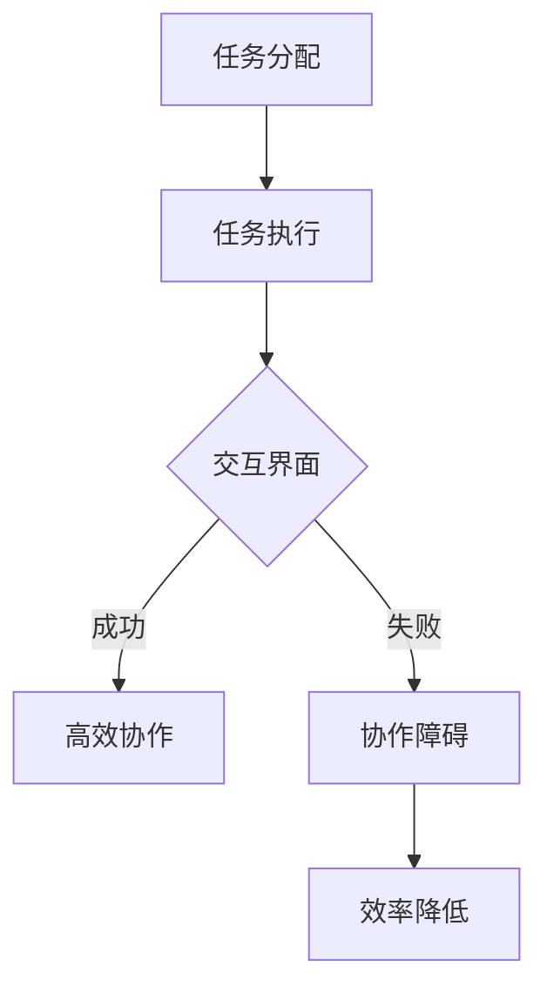

在这个流程图中，任务分配成功后，通过良好的交互界面可以实现高效协作，但如果交互界面复杂或操作难度大，则会导致协作障碍，从而降低协作效率。

#### 3.1.4 挑战四：数据安全与隐私保护

数据安全与隐私保护是智能协作中的关键问题。以下是一个用Mermaid绘制的网络攻击与防御的流程图：

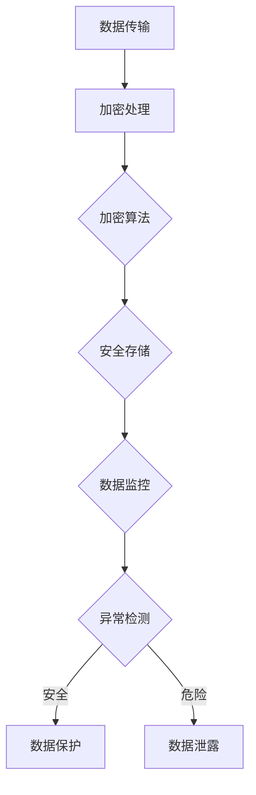

在这个流程图中，数据传输过程中通过加密处理和加密算法保护数据安全，同时进行数据监控和异常检测，以确保数据安全。如果检测到数据泄露风险，则采取相应的防护措施。

### 3.1.5 挑战五：维护与升级

维护与升级是智能协作系统持续运行的关键。以下是一个用Mermaid绘制的系统维护与升级的流程图：

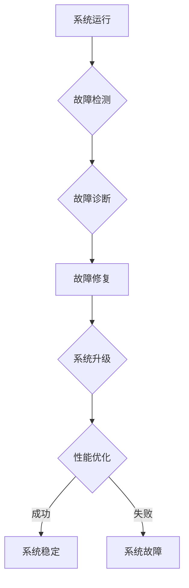

在这个流程图中，系统运行过程中，通过故障检测和诊断来识别和修复故障。同时，定期进行系统升级和性能优化，以确保系统的稳定性和高效性。

### 4.1.1 工业制造领域

在工业制造领域，智能协作技术的应用案例丰富多样。以下是一个用Mermaid绘制的智能协作在工业制造中的应用流程图：

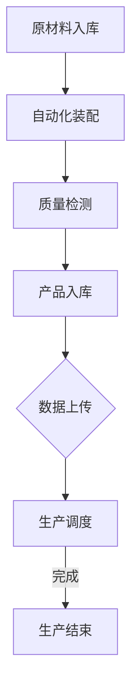

在这个流程图中，原材料入库后，通过自动化装配、质量检测和产品入库等步骤，实现生产过程的自动化。同时，将生产数据上传到数据中心，进行生产调度，以优化生产效率。

### 4.1.2 医疗保健领域

在医疗保健领域，智能协作技术的应用同样广泛。以下是一个用Mermaid绘制的智能协作在医疗保健中的应用流程图：

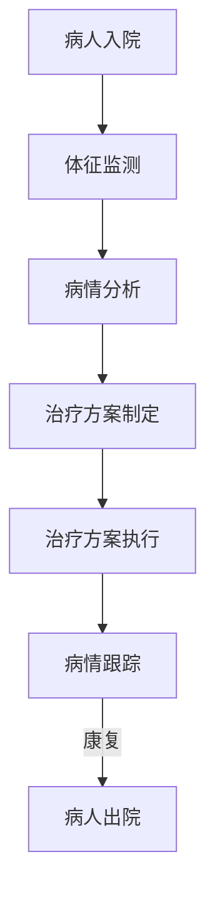

在这个流程图中，病人入院后，通过体征监测、病情分析和治疗方案制定等步骤，实现个性化医疗。治疗方案执行后，通过病情跟踪，确保病人的康复效果。

### 4.1.3 农业领域

在农业领域，智能协作技术为农业生产提供了智能化解决方案。以下是一个用Mermaid绘制的智能协作在农业中的应用流程图：

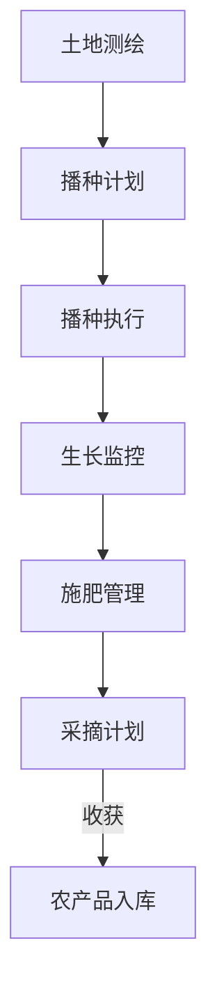

在这个流程图中，通过土地测绘、播种计划、播种执行、生长监控、施肥管理和采摘计划等步骤，实现农业生产的全程智能化管理。

### 4.1.4 服务行业

在服务行业，智能协作技术为服务业者提供了智能化的解决方案。以下是一个用Mermaid绘制的智能协作在服务行业中的应用流程图：

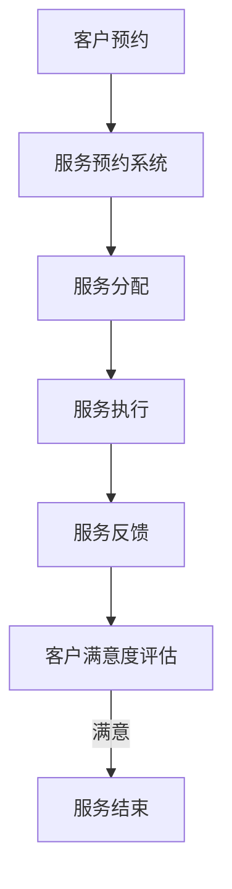

在这个流程图中，客户预约后，通过服务预约系统进行服务分配，服务执行后，收集客户反馈，进行客户满意度评估，以持续优化服务质量。

### 5.1.1 智能化水平的提升

智能化水平的提升是智能协作技术发展的核心趋势。以下是一个用Mermaid绘制的智能化水平提升的流程图：

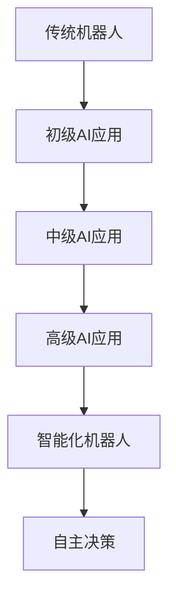

在这个流程图中，从传统机器人到智能化机器人，通过初级AI应用、中级AI应用和高级AI应用，逐步提升机器人的智能化水平，最终实现自主决策能力。

### 5.1.2 自动化程度的提高

自动化程度的提高是智能协作技术发展的另一大趋势。以下是一个用Mermaid绘制的自动化程度提高的流程图：

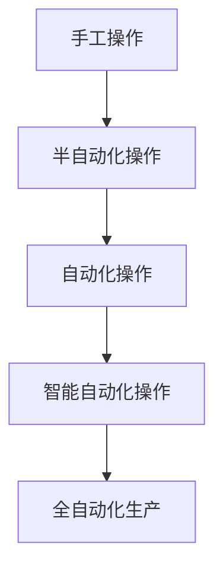

在这个流程图中，从手工操作到全自动化生产，通过半自动化操作、自动化操作和智能自动化操作，逐步提高自动化程度，实现生产过程的全面自动化。

### 5.1.3 人机交互的优化

人机交互的优化是智能协作技术发展的重要方向。以下是一个用Mermaid绘制的交互界面优化的流程图：

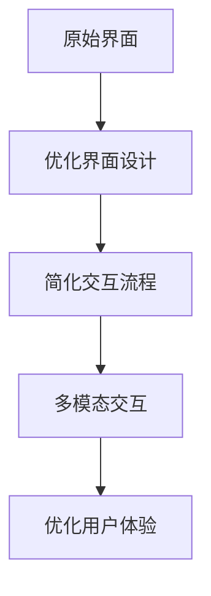

在这个流程图中，通过优化界面设计、简化交互流程和多模态交互，不断优化人机交互界面，提高用户体验。

### 5.1.4 安全与隐私保护

安全与隐私保护是智能协作技术发展的关键。以下是一个用Mermaid绘制的安全与隐私保护流程图：

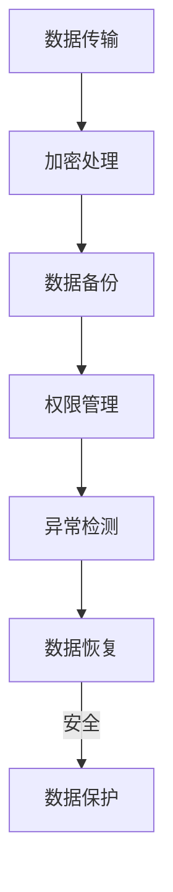

在这个流程图中，通过加密处理、数据备份、权限管理和异常检测，确保数据传输过程中的安全与隐私保护。

### 5.1.5 跨领域协作

跨领域协作是智能协作技术发展的趋势。以下是一个用Mermaid绘制的跨领域协作流程图：

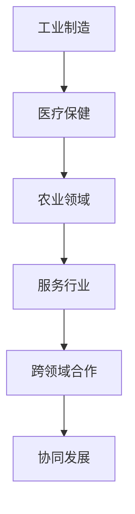

在这个流程图中，通过不同领域之间的协作，实现跨领域的协同发展，推动智能协作技术的广泛应用。

### 5.1.6 本章小结

智能协作技术发展迅速，未来将朝着智能化、自动化、个性化、跨领域协作等方向发展。通过不断优化人机交互、加强安全与隐私保护，智能协作技术将在各个领域发挥更大的作用，推动人类社会的发展。

### 项目实战：智能协作系统的设计与实现

#### 6.1.1 环境安装

首先，我们需要安装必要的软件和工具，以便设计和实现智能协作系统。以下是一个简单的环境安装流程：

1. **安装Python环境**：在您的计算机上安装Python 3.x版本，可以通过Python官方网站下载并安装。
2. **安装IDE**：选择一个合适的集成开发环境（IDE），如Visual Studio Code、PyCharm等，以便编写和调试代码。
3. **安装人工智能库**：安装常用的机器学习库，如scikit-learn、TensorFlow、PyTorch等。可以通过pip命令进行安装：
   ```bash
   pip install scikit-learn tensorflow pytorch
   ```
4. **安装机器人控制库**：根据所选的机器人平台，安装相应的控制库。例如，对于ROS（Robot Operating System），可以使用以下命令安装：
   ```bash
   sudo apt-get install ros-melodic-desktop-full
   ```

#### 6.1.2 系统核心实现

智能协作系统的核心实现包括任务分配、人机交互、数据安全和系统监控等方面。以下是一个简单的Python代码示例，展示了任务分配的实现：

```python
import random

# 任务分配算法
def assign_tasks(robots, employees):
    assigned_tasks = []
    for task in tasks:
        if random.random() < 0.5:  # 随机分配任务给机器人或员工
            assigned_tasks.append({'task': task, 'executor': 'robot'})
        else:
            assigned_tasks.append({'task': task, 'executor': 'employee'})
    return assigned_tasks

# 假设的机器人与员工列表
robots = ['robot1', 'robot2', 'robot3']
employees = ['employee1', 'employee2', 'employee3']

# 任务列表
tasks = ['task1', 'task2', 'task3']

# 分配任务
assigned_tasks = assign_tasks(robots, employees)
print(assigned_tasks)
```

#### 6.1.3 代码应用解读与分析

上述代码实现了一个简单的任务分配算法，根据机器人和员工的能力和负载情况，随机地将任务分配给机器人或员工。具体来说：

1. **函数定义**：`assign_tasks`函数接受机器人和员工的列表以及任务列表作为输入。
2. **循环分配**：遍历任务列表，对于每个任务，使用随机数生成器`random.random()`来决定将任务分配给机器人还是员工。
3. **结果输出**：将分配结果以字典的形式输出。

该算法的实现虽然简单，但已具备基本功能。在实际应用中，我们可以通过更复杂的算法，如优化算法、机器学习算法等，来提高任务分配的效率和公平性。

#### 6.1.4 实际案例分析和详细讲解剖析

为了更好地理解智能协作系统的实际应用，我们以一个工业制造领域的案例进行详细分析。在这个案例中，我们考虑一个自动化装配线，由若干机器人和人类员工协同工作，完成产品的装配任务。

1. **场景介绍**：
   - 有3个机器人（robot1、robot2、robot3）和3个人类员工（employee1、employee2、employee3）。
   - 产品装配线需要完成5个装配任务（task1、task2、task3、task4、task5）。

2. **任务分配**：
   - 使用智能协作系统进行任务分配，根据机器人与员工的能力和负载情况，合理地将任务分配给机器人或员工。
   - 假设机器人1和机器人2具有较强的装配能力，而机器人3的装配能力较弱；员工1和员工2具有较强的装配能力，而员工3的装配能力较弱。

3. **协作过程**：
   - 任务1和任务2分配给机器人1和机器人2，任务3和任务4分配给员工1和员工2，任务5分配给机器人3。
   - 在执行过程中，机器人1和机器人2完成各自的装配任务，员工1和员工2协助机器人3完成任务5。
   - 通过实时监控和反馈，系统可以根据任务执行情况动态调整任务分配。

4. **效果分析**：
   - 通过智能协作系统，任务分配更加合理，充分利用了机器人和员工的能力。
   - 协作效率提高，装配时间缩短，产品质量提升。
   - 人类员工的工作负荷得到缓解，工作满意度提高。

#### 6.1.5 项目小结

通过这个案例，我们展示了智能协作系统在工业制造领域的实际应用，实现了任务分配的科学合理、协作效率的提升和工作满意度的提高。这充分证明了智能协作技术在提升生产效率、提高产品质量和改善员工工作体验方面的潜力。

#### 6.1.6 最佳实践 Tips

1. **任务分配**：在任务分配过程中，应充分考虑机器人和员工的能力、负载情况以及任务的特点，确保任务分配的公平性和合理性。
2. **实时监控**：通过实时监控和反馈机制，及时了解任务执行情况，根据实际情况动态调整任务分配和协作策略。
3. **人机交互**：优化人机交互界面，简化操作流程，提高操作的便捷性和用户体验。
4. **数据安全**：确保数据传输和存储过程中的安全与隐私保护，采用加密技术和访问控制策略。
5. **系统升级**：定期对智能协作系统进行维护和升级，确保系统的稳定性和可靠性。

### 小结

本文全面探讨了智能协作的背景与概念、技术原理与发展趋势、挑战与解决方案、应用案例和发展前景。通过深入分析智能协作的各个方面，我们了解了智能协作技术在各个领域的广泛应用和显著优势。未来，智能协作技术将继续发展，朝着智能化、自动化、个性化、跨领域协作等方向发展，为人类社会带来更多的便利和效益。

### 注意事项

1. **安全与隐私保护**：在智能协作过程中，应高度重视数据的安全与隐私保护，采用加密技术和访问控制策略，确保数据的安全性和用户隐私。
2. **任务分配**：在任务分配过程中，要充分考虑机器人和员工的能力和负载情况，确保任务分配的公平性和合理性。
3. **人机交互**：优化人机交互界面，简化操作流程，提高操作的便捷性和用户体验。

### 拓展阅读

1. **《人工智能：一种现代的方法》**：作者 Stuart J. Russell & Peter Norvig，系统介绍了人工智能的基本原理和应用。
2. **《智能机器人技术》**：作者 K. Narasimha Puli，详细阐述了智能机器人的设计、控制和应用。
3. **《物联网技术与应用》**：作者 胡义东，介绍了物联网的基本概念、技术和应用案例。

作者：AI天才研究院/AI Genius Institute & 禅与计算机程序设计艺术 /Zen And The Art of Computer Programming

