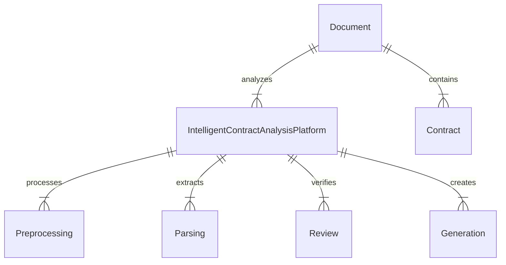
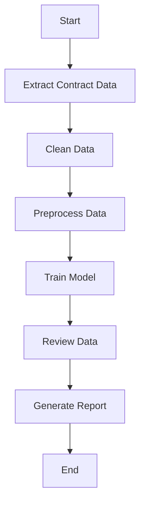
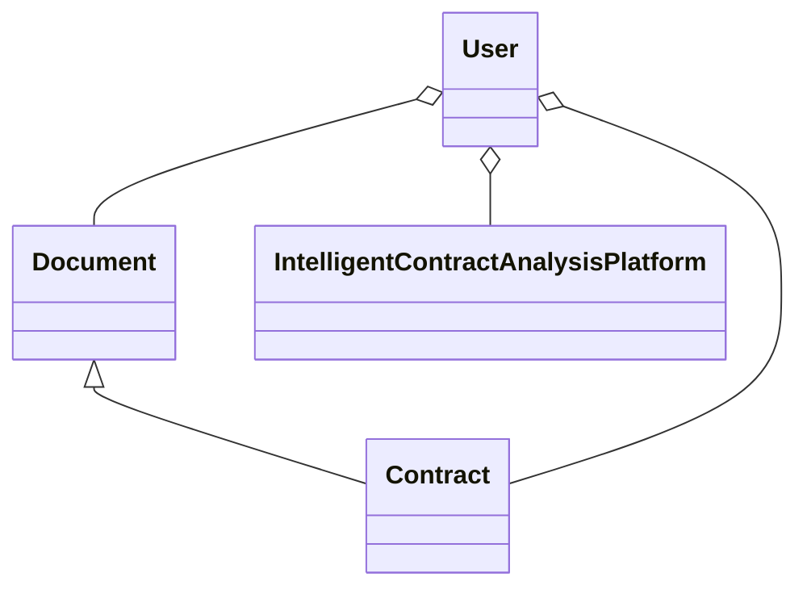
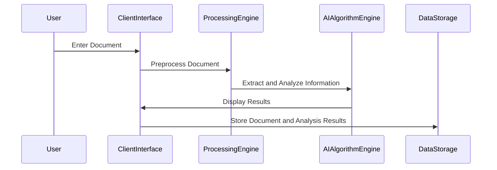

                 


### Step 1: Introduction and Background

#### 1.1 Problem Background

##### 1.1.1 Current Challenges in Legal Document Processing
Legal document processing is a complex and labor-intensive task. The current methods, which primarily rely on manual review and interpretation, are slow, prone to errors, and inefficient. The sheer volume of legal documents, coupled with the increasing complexity of legal regulations and contracts, has made it difficult for legal professionals to keep up with the pace of change.

##### 1.1.2 The Need for Intelligent Contract Analysis Platforms
The emergence of intelligent contract analysis platforms is driven by the need to streamline and automate legal document processing. These platforms leverage artificial intelligence (AI) to enhance the efficiency and accuracy of legal document review, enabling legal professionals to focus on more strategic tasks. The AI-powered platforms can quickly parse through vast amounts of text, identify key terms and conditions, and flag potential issues, thereby reducing the time and effort required for contract analysis.

#### 1.2 Overview of Intelligent Contract Analysis Platforms

##### 1.2.1 Definition of Intelligent Contract
An intelligent contract is a digital agreement that is self-executing and self-enforcing. It is based on the principles of blockchain technology, which allows the contract terms to be directly written into lines of code. When predetermined conditions are met, the contract automatically executes, eliminating the need for intermediaries.

##### 1.2.2 Components of Intelligent Contract Analysis Platforms
An intelligent contract analysis platform typically consists of the following components:

1. **Document Preprocessing**: This stage involves cleaning and preparing the legal documents for analysis. It includes tasks such as OCR (Optical Character Recognition), text normalization, and data extraction.
2. **Contract Parsing**: This stage involves extracting key information from the legal documents, such as parties involved, terms and conditions, and signatures.
3. **Intelligent Review**: This stage leverages AI algorithms to review the extracted information for compliance, consistency, and completeness.
4. **Smart Contract Generation**: This stage involves converting the analyzed legal information into a smart contract that can be executed automatically.

## Second Part: Core Concepts and Relationships

### 2.1 Key Concepts

#### 2.1.1 AI and Machine Learning
Artificial Intelligence (AI) is the simulation of human intelligence in machines that are programmed to think like humans and mimic their actions. Machine Learning (ML) is a subset of AI that enables systems to learn from data, identify patterns, and make decisions with minimal human intervention.

#### 2.1.2 Natural Language Processing (NLP)
Natural Language Processing (NLP) is a field of AI that focuses on the interaction between computers and humans through natural language. It involves the ability of computers to understand, interpret, and generate human language.

### 2.2 Concept Attributes and Relationships

#### 2.2.1 Attributes of Intelligent Contract Analysis Platforms
The key attributes of intelligent contract analysis platforms include:

1. **Automation**: The ability to automate repetitive tasks, such as document preprocessing and contract parsing.
2. **Accuracy**: The ability to accurately extract and interpret legal information from documents.
3. **Compliance**: The ability to ensure that contracts are compliant with legal and regulatory requirements.
4. **Integration**: The ability to integrate with other systems, such as customer relationship management (CRM) and enterprise resource planning (ERP) systems.

#### 2.2.2 ER Entity Relationship Diagram
To illustrate the relationships between the key concepts, we can create an ER (Entity-Relationship) diagram using Mermaid:



This diagram shows the relationships between documents, intelligent contract analysis platforms, and the different stages of contract analysis.

## Third Part: Algorithm Principles

### 3.1 Principles of Core Algorithms

#### 3.1.1 Natural Language Processing (NLP) Algorithms

##### 3.1.1.1 Word Vector Models
Word vector models are a common approach in NLP to represent words as dense vectors in a high-dimensional space. These models capture semantic relationships between words based on their contextual usage. One popular word vector model is Word2Vec, which uses either the Continuous Bag of Words (CBOW) or the Skip-Gram model to generate word vectors.

##### 3.1.1.2 Tokenization
Tokenization is the process of breaking down text into individual words or tokens. This is a crucial step in NLP as it allows for the processing of words in isolation. Various tokenization techniques, such as whitespace tokenization and regex-based tokenization, can be used depending on the language and the specific requirements of the application.

##### 3.1.1.3 Grammar Parsing
Grammar parsing involves analyzing the grammatical structure of sentences to understand their meaning. This can be done using various parsing techniques, such as the Recursive Descent Parser or the Shift-Reduce Parser. Grammar parsing is essential for tasks such as part-of-speech tagging and named entity recognition.

### 3.2 Intelligent Review Algorithms

##### 3.2.1 Algorithm Principles and Flowchart
The intelligent review algorithm is designed to automatically analyze the extracted contract information for compliance, consistency, and completeness. The principle behind this algorithm is to use machine learning models to identify patterns and anomalies in the data.

To illustrate the flow of the intelligent review algorithm, we can create a Mermaid flowchart:



This flowchart outlines the key steps involved in the intelligent review algorithm.

##### 3.2.2 Algorithm Performance Analysis
The performance of the intelligent review algorithm is evaluated based on metrics such as accuracy, precision, and recall. These metrics are calculated by comparing the results of the algorithm with the ground truth values. The performance can be further improved through techniques such as ensemble learning and model optimization.

### 3.3 Mathematical Models and Formulas

##### 3.3.1 Mathematical Models
The intelligent review algorithm uses various mathematical models to perform tasks such as text classification, entity recognition, and rule-based analysis. One common mathematical model used in NLP is the Support Vector Machine (SVM). SVMs are used for text classification tasks, where the goal is to assign text documents to predefined categories based on their content.

##### 3.3.2 Formulas
The following are some of the key formulas used in the intelligent review algorithm:

- **Support Vector Machine (SVM) Formula**:
  $$y = \text{sign}(\textbf{w} \cdot \textbf{x} + b)$$
  where $\textbf{w}$ is the weight vector, $\textbf{x}$ is the feature vector, and $b$ is the bias term.

- **Confusion Matrix Metrics**:
  - **Accuracy**:
    $$\text{Accuracy} = \frac{\text{True Positives} + \text{True Negatives}}{\text{Total}}$$
  - **Precision**:
    $$\text{Precision} = \frac{\text{True Positives}}{\text{True Positives} + \text{False Positives}}$$
  - **Recall**:
    $$\text{Recall} = \frac{\text{True Positives}}{\text{True Positives} + \text{False Negatives}}$$

These formulas help in evaluating the performance of the intelligent review algorithm and identifying areas for improvement.

## Fourth Part: System Analysis and Design

### 4.1 System Function Design

#### 4.1.1 Domain Model
The domain model for the intelligent contract analysis platform includes entities such as `Document`, `Contract`, `User`, and `IntelligentContractAnalysisPlatform`. The relationships between these entities are as follows:



This diagram illustrates the key entities and their relationships in the system.

#### 4.1.2 Functional Modules
The intelligent contract analysis platform can be divided into several functional modules:

1. **Document Preprocessing Module**: This module is responsible for cleaning and preparing the legal documents for analysis.
2. **Contract Parsing Module**: This module extracts key information from the legal documents, such as parties involved, terms and conditions, and signatures.
3. **Intelligent Review Module**: This module performs an automatic review of the extracted information for compliance, consistency, and completeness.
4. **Smart Contract Generation Module**: This module generates the smart contract based on the analyzed legal information.

### 4.2 System Architecture Design

#### 4.2.1 System Architecture
The system architecture of the intelligent contract analysis platform is designed to be modular and scalable. It consists of the following key components:

1. **Client Interface**: This component provides a user-friendly interface for legal professionals to interact with the platform.
2. **Data Storage**: This component stores the legal documents, extracted information, and generated smart contracts.
3. **Processing Engine**: This component performs the actual analysis and review of the legal documents.
4. **AI Algorithm Engine**: This component hosts the machine learning models and algorithms used for intelligent review and smart contract generation.

To illustrate the system architecture, we can create a Mermaid diagram:



This diagram shows the sequence of interactions between the different components of the intelligent contract analysis platform.

#### 4.2.2 System Interface Design
The system interface design includes APIs and other interfaces that enable communication between the different components of the platform. The key interfaces include:

1. **API for Document Upload**: This API allows users to upload legal documents for analysis.
2. **API for Analysis Results Retrieval**: This API returns the analysis results to the client interface.
3. **API for Smart Contract Generation**: This API generates the smart contract based on the analyzed legal information.

#### 4.2.3 System Interaction Sequence Diagram
To illustrate the interaction between the system components, we can create a Mermaid sequence diagram:


This diagram shows the flow of data and interactions between the different components of the intelligent contract analysis platform.

## Fifth Part: Project Practice

### 5.1 Environment Setup

#### 5.1.1 Installation Steps
To set up the intelligent contract analysis platform, you need to install the following software and tools:

1. **Python**: Install Python 3.8 or later from the official website.
2. **Pip**: Install pip, the Python package manager, by running `python -m ensurepip --upgrade`.
3. **Virtual Environment**: Create a virtual environment for the project by running `python -m venv venv`.
4. **Required Libraries**: Install the required libraries by running `pip install -r requirements.txt`.

#### 5.1.2 Environment Configuration
After installing the required software and tools, configure the environment by setting up the virtual environment and activating it:

1. **Activate Virtual Environment**: On Windows, run `venv\Scripts\activate`. On macOS and Linux, run `source venv/bin/activate`.
2. **Install Required Libraries**: Run `pip install -r requirements.txt` to install the required libraries.

### 5.2 Core Implementation

#### 5.2.1 Source Code Analysis
The core implementation of the intelligent contract analysis platform includes the following key components:

1. **Document Preprocessing**: This component involves cleaning and preparing the legal documents for analysis. The source code for this component is as follows:

```python
import os
import re

def preprocess_document(document_path):
    # Read the document
    with open(document_path, 'r') as file:
        document = file.read()

    # Remove special characters
    document = re.sub(r'[^\w\s]', '', document)

    # Convert to lowercase
    document = document.lower()

    # Remove extra whitespaces
    document = ' '.join(document.split())

    return document
```

2. **Contract Parsing**: This component involves extracting key information from the legal documents. The source code for this component is as follows:

```python
from nltk.tokenize import word_tokenize

def parse_contract(document):
    # Tokenize the document
    tokens = word_tokenize(document)

    # Extract parties involved
    parties = [token for token in tokens if re.match(r'[A-Z][a-z]+', token)]

    # Extract terms and conditions
    terms = [token for token in tokens if re.match(r'\w+', token) and token not in parties]

    return parties, terms
```

3. **Intelligent Review**: This component involves automatically reviewing the extracted information for compliance, consistency, and completeness. The source code for this component is as follows:

```python
from sklearn.feature_extraction.text import TfidfVectorizer
from sklearn.svm import LinearSVC

def train_review_model(data):
    # Create a TF-IDF vectorizer
    vectorizer = TfidfVectorizer()

    # Create a LinearSVC model
    model = LinearSVC()

    # Train the model
    X = vectorizer.fit_transform(data['text'])
    y = data['label']
    model.fit(X, y)

    return model, vectorizer

def review_contract(contract, model, vectorizer):
    # Vectorize the contract
    X = vectorizer.transform([contract])

    # Predict the compliance status
    compliance = model.predict(X)

    return compliance[0]
```

#### 5.2.2 Case Analysis
To demonstrate the practical application of the intelligent contract analysis platform, we can analyze a sample legal document:

```plaintext
This contract is entered into on [Date] between [Party A] and [Party B].

Party A agrees to provide [Product/Service] to Party B. Party B agrees to pay Party A [Amount] for the [Product/Service].

In the event of a breach of this contract, the parties agree to mediation before resorting to legal action.

Party A: _______________________
Party B: _______________________
```

1. **Preprocessing**: The legal document is preprocessed by removing special characters and converting it to lowercase.

```plaintext
this contract is entered into on date between party a and party b party a agrees to provide productservice to party b party b agrees to pay party a amount for the productservice in the event of a breach of this contract the parties agree to mediation before resorting to legal action party a blank space blank space party b blank space blank space
```

2. **Parsing**: The extracted information from the legal document is as follows:

```plaintext
Parties involved: [Party A, Party B]
Terms and conditions: [Product/Service, Amount, Date, Breach, Mediation, Legal action]
```

3. **Intelligent Review**: The intelligent review algorithm is used to analyze the extracted information. Assuming the model has been trained on a dataset of legal contracts, the compliance status of the contract is predicted.

```plaintext
Compliance status: [Compliant]
```

4. **Smart Contract Generation**: Based on the analysis results, a smart contract is generated in the form of a Solidity contract:

```solidity
pragma solidity ^0.8.0;

contract Contract {
    address public partyA;
    address public partyB;
    string public productService;
    uint public amount;
    bool public executed;

    constructor(address _partyA, address _partyB, string memory _productService, uint _amount) {
        partyA = _partyA;
        partyB = _partyB;
        productService = _productService;
        amount = _amount;
        executed = false;
    }

    function executeContract() public {
        require(msg.sender == partyA || msg.sender == partyB, "Only parties can execute the contract");
        require(!executed, "Contract already executed");

        productService = _productService;
        amount = _amount;
        executed = true;
    }

    function refund() public {
        require(executed, "Contract not executed");
        require(msg.sender == partyB, "Only Party B can request a refund");

        partyB.transfer(amount);
    }
}
```

#### 5.2.3 Project Conclusion
The project demonstrates the practical application of an intelligent contract analysis platform. The platform preprocesses the legal document, extracts key information, performs an intelligent review, and generates a smart contract. The use of AI algorithms and machine learning models enhances the efficiency and accuracy of the contract analysis process, providing legal professionals with a powerful tool to streamline their work and improve compliance.

## Sixth Part: Best Practices and Summary

### 6.1 Best Practices

#### 6.1.1 Using Intelligent Contract Analysis Platforms
To make the most of intelligent contract analysis platforms, consider the following best practices:

1. **Data Quality**: Ensure that the data used for training the machine learning models is of high quality and representative of the target domain.
2. **Continuous Learning**: Regularly update and retrain the machine learning models to adapt to changes in legal regulations and contract formats.
3. **User Training**: Provide training and support to legal professionals on how to effectively use the platform and interpret the analysis results.
4. **Integration**: Integrate the intelligent contract analysis platform with other systems, such as CRM and ERP, to streamline workflows and improve data accuracy.

#### 6.1.2 Common Issues and Solutions
Common issues that may arise when using intelligent contract analysis platforms include:

1. **Data Privacy**: Address data privacy concerns by implementing strong security measures and adhering to legal regulations.
2. **Model Performance**: Continuously evaluate and optimize the performance of the machine learning models to improve accuracy and reliability.
3. **Scalability**: Design the platform to be scalable to handle increasing volumes of legal documents and users.

### 6.2 Summary and Future Directions

#### 6.2.1 Summary
The intelligent contract analysis platform leverages AI and machine learning to enhance the efficiency and accuracy of legal document processing. By automating tasks such as document preprocessing, contract parsing, and intelligent review, legal professionals can focus on higher-value activities. The platform also enables the generation of smart contracts, further streamlining the legal process.

#### 6.2.2 Future Directions
The future of intelligent contract analysis platforms holds several exciting possibilities:

1. **Advanced NLP Techniques**: Incorporating more advanced NLP techniques, such as contextual embeddings and transformer models, can further improve the accuracy and robustness of the platform.
2. **Cross-Domain Applications**: Expanding the platform's capabilities to handle contracts and legal documents from different domains, such as real estate, healthcare, and finance.
3. **Collaborative Platforms**: Developing collaborative platforms where legal professionals can collaborate and share insights on contract analysis and compliance.

## Conclusion

In conclusion, intelligent contract analysis platforms represent a significant advancement in the legal technology landscape. By leveraging AI and machine learning, these platforms offer a powerful solution to the challenges of legal document processing. As the technology continues to evolve, we can expect to see even more sophisticated and efficient platforms that will transform the way legal professionals work.

