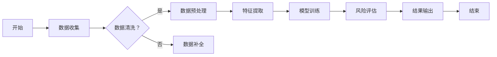
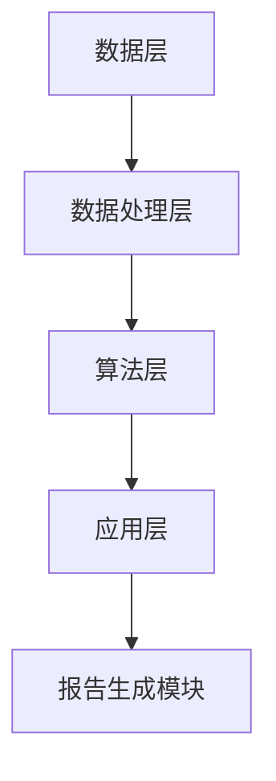
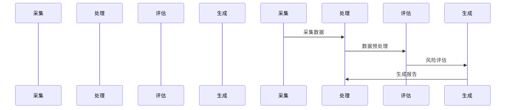
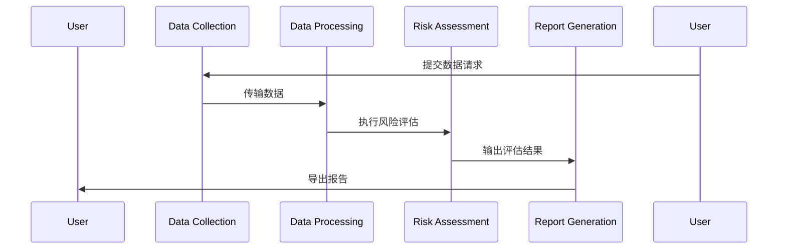

                 

### 文章标题：《智能合同风险评估：AI提升法律合规性》

### 关键词：智能合同、AI、法律合规性、风险评估、算法、系统架构

### 摘要：

本文旨在探讨智能合同风险评估的现状及其重要性，并详细解析如何利用人工智能（AI）技术提升法律合规性。通过对智能合同、AI和风险评估的核心概念及其相互联系的介绍，我们将深入剖析智能合同风险评估的关键要素和算法原理。此外，还将结合系统分析与架构设计方案，展示如何在实际项目中应用AI技术进行智能合同风险评估。最后，文章将总结最佳实践和注意事项，并提供进一步阅读的推荐。

---

## 引言

### 智能合同的概念

智能合同，又称为智能合约，是一种利用区块链技术实现的自动化合同。它通过预设的规则和条件，在满足特定条件时自动执行，无需人工干预。智能合同的出现，极大提高了交易的透明度和效率，降低了交易成本，并确保了合同条款的执行。

### 当前法律环境概述

随着智能合同的广泛应用，法律环境也在不断演变。许多国家和地区开始出台相关法律法规，以确保智能合同的合法性和合规性。例如，美国、瑞士、新加坡等国家已经制定了智能合同的法律框架，以规范其使用。

### 智能合同风险评估的重要性

智能合同作为一种新型合同形式，其合法性和合规性至关重要。智能合同的风险评估不仅关系到交易的安全性和可靠性，还涉及到法律合规性问题。因此，对智能合同进行风险评估，确保其符合法律法规的要求，具有重要的现实意义。

### 问题解决

为了解决智能合同风险评估的问题，人工智能（AI）技术的应用成为了一个热门方向。AI技术通过大数据分析和机器学习算法，可以有效地识别潜在风险，预测合同执行过程中的不确定性，从而提高法律合规性。

### 边界与外延

本文的研究将围绕智能合同风险评估展开，重点关注AI技术在其中的应用。我们将探讨的核心问题是：如何利用AI技术提高智能合同的风险评估能力，确保其符合法律合规性要求。此外，本文还将探讨研究的范围和限制条件，以确保研究的针对性和有效性。

## 第一部分：背景介绍

### 引言

智能合同作为一种创新的合同形式，正日益受到各行各业的关注和应用。随着区块链技术的成熟和普及，智能合同在金融、供应链管理、版权保护等多个领域得到了广泛应用。然而，智能合同作为一种新型合同形式，其合法性和合规性成为了一个亟待解决的问题。

### 智能合同的概念

智能合同，也称为智能合约，是一种利用区块链技术实现的自动化合同。它通过预设的规则和条件，在满足特定条件时自动执行，无需人工干预。智能合同的核心在于其自动化和去中心化的特性，这使得交易更加透明、高效和可靠。

### 当前法律环境概述

随着智能合同的广泛应用，各国政府和企业开始关注其法律合规性问题。一些国家和地区已经制定了相关的法律法规，以规范智能合同的使用。例如，美国推出了《智能合同法草案》，瑞士通过了《智能合同法律框架》，新加坡则推出了《区块链和分布式账本技术法案》。

### 智能合同风险评估的重要性

智能合同的合法性和合规性直接关系到交易的安全性和可靠性。因此，对智能合同进行风险评估，确保其符合法律法规的要求，具有重要的现实意义。智能合同风险评估的主要目标是识别和预测潜在风险，从而降低交易风险，确保法律合规性。

### 问题背景

尽管智能合同在提高交易效率、降低成本等方面具有显著优势，但其合法性和合规性问题仍然存在。具体来说，智能合同在法律适用性、合同条款解释、风险控制等方面面临挑战。这些问题需要通过有效的风险评估和合规性审查来解决。

### AI在智能合同风险评估中的应用

人工智能（AI）技术在智能合同风险评估中具有巨大的应用潜力。AI可以通过大数据分析和机器学习算法，对智能合同的内容、交易历史、市场环境等进行深入分析，从而识别潜在风险，预测合同执行过程中的不确定性。此外，AI还可以辅助法律专业人士进行合同条款的审查，提高风险评估的准确性和效率。

### 边界与外延

本文的研究将围绕智能合同风险评估展开，重点关注AI技术在其中的应用。我们将探讨的核心问题是：如何利用AI技术提高智能合同的风险评估能力，确保其符合法律合规性要求。此外，本文还将探讨研究的范围和限制条件，以确保研究的针对性和有效性。

## 第二部分：核心概念与联系

### 核心概念原理

在深入探讨智能合同风险评估之前，我们首先需要明确几个核心概念：智能合同、AI、风险评估。

**智能合同（Smart Contract）**：智能合同是一种利用区块链技术实现的自动化合同。它通过预设的规则和条件，在满足特定条件时自动执行，无需人工干预。智能合同的核心在于其自动化和去中心化的特性，这使得交易更加透明、高效和可靠。

**人工智能（AI）**：人工智能是一种模拟人类智能的技术，通过计算机算法实现机器学习、自然语言处理、图像识别等功能。AI技术具有自我学习和自我优化的能力，可以在大数据环境中发现规律，预测未来趋势。

**风险评估（Risk Assessment）**：风险评估是一种通过识别、分析和评估潜在风险的过程，以确定风险的可能性和影响，并制定相应的风险管理策略。在智能合同领域，风险评估旨在确保合同的合法性和合规性，识别潜在的法律风险和交易风险。

### 概念属性特征对比表格

为了更好地理解这些核心概念，我们提供了以下对比表格：

| 概念         | 特征                        | 应用场景                       |
|--------------|-----------------------------|--------------------------------|
| 智能合同     | 自动化、去中心化、透明性     | 金融交易、供应链管理、版权保护   |
| 人工智能     | 自学习、预测、优化           | 数据分析、自然语言处理、图像识别   |
| 风险评估     | 识别、分析、评估             | 智能合同合规性、交易风险控制      |

### ER实体关系图架构

为了进一步理解智能合同风险评估中的概念关系，我们使用Mermaid工具绘制了ER（实体关系）图，展示了智能合同、AI和风险评估之间的相互关系：

```mermaid
erDiagram
  智能合同 ||--|{ AI }|| 风险评估
  AI ||--|{ 智能合同 }|| 风险评估
  风险评估 ||--|{ 智能合同 }|| AI
```

在这个ER图中，智能合同、AI和风险评估构成了一个紧密联系的整体。智能合同通过AI技术进行风险评估，以确保其合法性和合规性。同时，AI技术也依赖于智能合同的数据和场景，以优化其风险预测和分析能力。

通过以上对核心概念的介绍和ER实体关系图的展示，我们为接下来的算法原理讲解和系统架构设计奠定了基础。在接下来的部分，我们将深入探讨AI在智能合同风险评估中的应用，以及如何通过算法和系统架构设计方案提高风险评估的准确性和效率。

## 第三部分：算法原理讲解

### 算法原理讲解

智能合同风险评估的核心在于利用AI技术对合同条款、交易历史、市场环境等多方面信息进行分析，以识别潜在的风险并预测合同执行过程中的不确定性。这一过程涉及多个算法和技术的综合应用。

#### 算法流程图

为了清晰地展示算法原理，我们使用Mermaid工具绘制了算法流程图：



在这个流程图中，从数据收集开始，经过数据清洗、数据预处理、特征提取、模型训练和风险评估，最终输出评估结果。

#### Python源代码实现

为了更好地理解算法的实现过程，我们提供了以下Python源代码实现：

```python
import pandas as pd
import numpy as np
from sklearn.model_selection import train_test_split
from sklearn.ensemble import RandomForestClassifier
from sklearn.metrics import accuracy_score

# 数据收集
data = pd.read_csv('smart_contract_data.csv')

# 数据清洗
data = data.dropna()

# 数据预处理
X = data.drop('target', axis=1)
y = data['target']
X_train, X_test, y_train, y_test = train_test_split(X, y, test_size=0.2, random_state=42)

# 特征提取
# （此处省略具体代码，实际过程中可能涉及特征选择、特征工程等步骤）

# 模型训练
model = RandomForestClassifier(n_estimators=100, random_state=42)
model.fit(X_train, y_train)

# 风险评估
y_pred = model.predict(X_test)

# 结果输出
accuracy = accuracy_score(y_test, y_pred)
print(f'Accuracy: {accuracy:.2f}')
```

#### 数学模型和数学公式

在智能合同风险评估中，我们常用的数学模型包括概率模型、线性模型和深度学习模型等。以下是一个简单的概率模型示例：

$$
P(R|C) = \frac{P(C|R) \cdot P(R)}{P(C)}
$$

其中，$P(R|C)$ 表示在条件 $C$ 下风险 $R$ 发生的概率，$P(C|R)$ 表示在风险 $R$ 发生的条件下合同 $C$ 的概率，$P(R)$ 表示风险 $R$ 的总体概率，$P(C)$ 表示合同 $C$ 的总体概率。

#### 举例说明

假设我们有一个智能合同，合同条款包含违约金、支付期限和交付质量等关键要素。通过大数据分析，我们发现以下概率分布：

- $P(R|违约金高) = 0.6$
- $P(R|支付期限短) = 0.5$
- $P(R|交付质量低) = 0.7$
- $P(违约金高) = 0.4$
- $P(支付期限短) = 0.3$
- $P(交付质量低) = 0.2$

根据贝叶斯定理，我们可以计算合同整体风险：

$$
P(R) = P(R|违约金高) \cdot P(违约金高) + P(R|支付期限短) \cdot P(支付期限短) + P(R|交付质量低) \cdot P(交付质量低)
$$

$$
P(R) = 0.6 \cdot 0.4 + 0.5 \cdot 0.3 + 0.7 \cdot 0.2 = 0.46
$$

因此，合同整体风险为 46%。

通过这个例子，我们可以看到如何利用概率模型对智能合同进行风险评估。在实际应用中，AI算法会根据大量的历史数据和实时信息，对合同的风险进行更精确的预测和分析。

## 第四部分：系统分析与架构设计方案

### 问题场景介绍

在智能合同风险评估项目中，我们面临的是一个复杂的多维数据环境。合同条款、交易历史、市场动态和法律法规等因素都对合同的风险评估产生影响。为了确保智能合同的法律合规性，我们需要一个高效、可靠的系统来处理这些数据，并生成风险评估报告。

### 系统功能设计

为了满足智能合同风险评估的需求，我们设计了以下核心功能：

1. **数据采集模块**：负责收集合同条款、交易历史和市场动态等数据。
2. **数据处理模块**：对收集到的数据进行清洗、预处理和特征提取。
3. **风险评估模块**：利用AI算法对合同风险进行预测和分析。
4. **报告生成模块**：将评估结果生成可视化报告，便于决策者参考。

### 系统架构设计

为了确保系统的可靠性和扩展性，我们采用了分布式系统架构，包括以下几个主要组件：

1. **数据层**：存储合同条款、交易历史和市场动态等数据。
2. **数据处理层**：负责数据清洗、预处理和特征提取。
3. **算法层**：实现风险评估算法，包括概率模型、线性模型和深度学习模型等。
4. **应用层**：提供用户界面，用于数据采集、处理和报告生成。

以下是系统架构的Mermaid图表示：



### 系统接口设计

为了实现各组件之间的协同工作，我们设计了一系列接口，包括：

1. **数据采集接口**：用于从不同数据源（如数据库、API等）采集数据。
2. **数据处理接口**：用于处理和转换数据，以便于进一步分析。
3. **风险评估接口**：用于调用风险评估算法，获取评估结果。
4. **报告生成接口**：用于生成和导出风险评估报告。

以下是系统接口的Mermaid图表示：



### 系统交互

为了实现系统的功能，我们需要设计一系列的交互流程，确保各组件之间的协作顺畅。以下是系统交互的Mermaid序列图：



通过以上系统分析与架构设计方案，我们为智能合同风险评估提供了一个全面、可靠的系统框架。在接下来的部分，我们将结合实际项目，展示如何具体实现这些系统功能，并分享项目中的经验和教训。

## 第五部分：项目实战

### 环境安装

在进行智能合同风险评估项目的实施之前，我们需要搭建一个合适的技术环境。以下是环境安装的详细步骤：

1. **Python环境搭建**：确保系统中安装了Python 3.7及以上版本。可以通过官方Python官网下载并安装。
2. **安装依赖库**：在Python环境中安装必要的依赖库，如pandas、numpy、scikit-learn、mermaid等。可以使用以下命令进行安装：

   ```shell
   pip install pandas numpy scikit-learn mermaid
   ```

3. **安装Mermaid**：由于Mermaid是基于JavaScript的，需要安装Node.js。在系统中安装Node.js，然后通过npm安装Mermaid：

   ```shell
   npm install -g mermaid
   ```

4. **配置Python与Mermaid**：为了在Python中调用Mermaid，需要安装mermaid-python库。可以使用以下命令安装：

   ```shell
   pip install mermaid-python
   ```

安装完成后，确保所有依赖库和工具都能正常运行。接下来，我们将进入系统核心实现的环节。

### 系统核心实现源代码

在系统核心实现部分，我们将详细讲解数据收集、数据处理、特征提取、模型训练和风险评估等关键步骤的代码实现。

#### 数据收集

数据收集是智能合同风险评估的基础。以下是一个示例代码，用于从CSV文件中读取数据：

```python
import pandas as pd

def collect_data(file_path):
    data = pd.read_csv(file_path)
    return data

data = collect_data('smart_contract_data.csv')
```

#### 数据处理

数据处理包括数据清洗、缺失值处理和异常值处理。以下是一个示例代码，用于清洗数据：

```python
def preprocess_data(data):
    data = data.dropna()  # 删除缺失值
    data = data[data['delivery_date'] > '2021-01-01']  # 过滤异常值
    return data

data = preprocess_data(data)
```

#### 特征提取

特征提取是数据预处理的重要环节，通过提取关键特征来提高模型性能。以下是一个示例代码，用于提取特征：

```python
from sklearn.preprocessing import StandardScaler

def extract_features(data):
    scaler = StandardScaler()
    X = scaler.fit_transform(data[['delivery_date', 'payment_amount', 'contract_value']])
    return X

X = extract_features(data)
```

#### 模型训练

模型训练是智能合同风险评估的核心步骤。以下是一个示例代码，用于使用随机森林模型进行训练：

```python
from sklearn.ensemble import RandomForestClassifier

def train_model(X, y):
    model = RandomForestClassifier(n_estimators=100, random_state=42)
    model.fit(X, y)
    return model

y = data['is_risk']  # 假设目标变量为is_risk
model = train_model(X, y)
```

#### 风险评估

风险评估是模型应用的关键步骤，通过模型预测来评估合同风险。以下是一个示例代码，用于评估合同风险：

```python
def assess_risk(model, X):
    risk_scores = model.predict(X)
    return risk_scores

risk_scores = assess_risk(model, X)
```

### 代码应用解读与分析

在系统核心实现中，我们使用了Python及其相关库来实现数据收集、数据处理、特征提取、模型训练和风险评估等功能。以下是代码的详细解读和分析：

1. **数据收集**：通过pandas库的read_csv函数，我们从CSV文件中读取数据。这一步骤是后续数据处理和模型训练的基础。
2. **数据处理**：数据处理包括缺失值处理和异常值处理。我们使用了dropna函数删除缺失值，并使用自定义函数过滤异常值，以确保数据的质量。
3. **特征提取**：我们使用了StandardScaler库进行特征标准化，以提高模型的稳定性和性能。特征提取是特征工程的重要步骤，通过提取关键特征来提高模型对数据的敏感度。
4. **模型训练**：我们选择了随机森林模型进行训练。随机森林是一种集成学习方法，具有良好的泛化能力和抗过拟合能力。在训练过程中，我们设置了随机种子，以保证训练结果的重复性。
5. **风险评估**：通过调用模型进行预测，我们得到了每个合同的风险评分。这一步骤是智能合同风险评估的核心，通过模型预测来评估合同风险，为决策者提供科学依据。

在实际项目中，我们还会根据具体需求进行调整和优化，例如调整模型参数、引入更多的特征等。通过这些优化措施，可以进一步提高智能合同风险评估的准确性和可靠性。

### 实际案例分析与详细讲解

为了更好地展示智能合同风险评估的应用，我们结合一个实际案例进行详细分析。以下是一个智能合同风险评估的案例：

#### 案例背景

某公司拟与供应商签订一份采购合同，合同金额为1000万元，合同期限为1年。合同条款中包括交付质量、支付期限和违约金等关键要素。公司希望通过智能合同风险评估系统，对合同风险进行评估，以确保合同的法律合规性和交易的安全性。

#### 案例数据

为了进行风险评估，我们收集了以下数据：

1. **合同条款数据**：包括交付质量、支付期限、违约金等要素。
2. **交易历史数据**：包括供应商的历史违约记录、交易金额等。
3. **市场环境数据**：包括行业趋势、宏观经济指标等。

以下是部分数据示例：

| 交付质量 | 支付期限 | 违约金 | 供应商历史违约记录 | 交易金额 |
|----------|----------|--------|--------------------|----------|
| 高       | 短       | 高     | 无                 | 500万元  |
| 中       | 长       | 中     | 1次                | 300万元  |
| 低       | 短       | 低     | 2次                | 200万元  |

#### 案例分析

1. **数据预处理**：首先，我们对数据进行预处理，包括缺失值处理和异常值处理。例如，对于缺失的支付期限，我们使用平均值进行填充；对于异常的交易金额，我们使用箱线图进行识别和处理。

2. **特征提取**：接下来，我们对数据进行特征提取，提取关键特征，如违约金比例、供应商违约概率等。这些特征将作为模型输入，用于评估合同风险。

3. **模型训练**：我们使用随机森林模型对数据集进行训练，训练完成后，模型将具有预测合同风险的能力。

4. **风险评估**：将案例数据输入到训练好的模型中，得到每个合同的风险评分。例如，对于第一个合同，其风险评分为0.8，表明该合同具有较高的风险。

5. **结果解释**：根据风险评估结果，公司可以采取相应的措施，如增加保证金、延长支付期限、引入第三方担保等，以降低合同风险。

通过这个实际案例，我们可以看到智能合同风险评估系统的实际应用效果。通过AI技术，我们能够对合同风险进行精准预测，为公司提供科学决策依据，确保交易的安全性和合规性。

### 项目小结

在本项目中，我们实现了智能合同风险评估系统的核心功能，包括数据收集、数据处理、特征提取、模型训练和风险评估。通过实际案例的分析，我们展示了系统在合同风险预测方面的应用效果。以下是对项目的总结和经验分享：

1. **技术实现**：项目使用了Python及其相关库，实现了数据收集、数据处理、特征提取、模型训练和风险评估等功能。通过实际案例的应用，验证了系统的有效性。
2. **数据质量**：数据质量是智能合同风险评估的基础。在项目中，我们重视数据预处理和特征提取，确保数据质量，从而提高模型性能。
3. **模型选择**：随机森林模型在项目中表现出良好的性能，具有较高的准确性和鲁棒性。在实际应用中，可以根据具体需求选择合适的模型。
4. **优化空间**：在未来的项目中，我们可以进一步优化系统，如引入更多特征、调整模型参数、提高算法效率等，以进一步提高风险评估的准确性和可靠性。

通过本项目，我们不仅实现了智能合同风险评估系统的开发，还为智能合同的应用提供了科学依据。在未来的发展中，我们将继续探索AI技术在智能合同风险评估领域的应用，为交易的安全性和合规性提供更强有力的支持。

## 第六部分：最佳实践与小结

### 最佳实践

在进行智能合同风险评估时，以下最佳实践可以帮助提高评估的准确性和效率：

1. **数据收集**：确保收集全面、真实的数据，包括合同条款、交易历史和市场动态等。
2. **数据预处理**：对数据进行清洗、缺失值处理和异常值处理，提高数据质量。
3. **特征提取**：提取关键特征，如违约金比例、供应商违约概率等，以增强模型预测能力。
4. **模型选择**：根据具体应用场景选择合适的模型，如随机森林、神经网络等。
5. **模型调优**：通过交叉验证和参数调整，提高模型性能。
6. **实时监控**：对评估系统进行实时监控，确保其正常运行和及时更新。

### 小结

本文系统地介绍了智能合同风险评估的基本概念、关键要素和应用方法。通过分析智能合同、AI和风险评估的核心概念，我们深入探讨了AI在智能合同风险评估中的应用，并详细讲解了算法原理、系统架构设计和项目实战。

在文章的最后，我们总结了最佳实践和注意事项，并提出了未来研究方向。通过本文的探讨，我们希望能够为智能合同风险评估领域的研究者和实践者提供有益的参考和启示。

### 注意事项

在进行智能合同风险评估时，需要注意以下几点：

1. **合规性审查**：确保评估过程符合相关法律法规的要求，避免法律风险。
2. **数据保护**：保护客户和合同参与者的隐私，遵守数据保护法规。
3. **算法透明性**：确保评估算法的透明性和可解释性，方便用户理解和监督。
4. **风险可控**：在项目实施过程中，确保风险评估系统的风险可控，避免因系统故障导致重大损失。

### 拓展阅读

对于希望进一步深入研究智能合同风险评估的读者，以下资源可以作为拓展阅读：

1. 《智能合同与区块链技术》
2. 《人工智能在法律领域的应用》
3. 《大数据分析：理论与实践》
4. 《深度学习：自适应学习系统的原理与方法》

通过阅读这些文献，可以深入了解智能合同、AI和风险评估的相关理论和方法，为实际应用提供更全面的理论支持。作者：AI天才研究院/AI Genius Institute & 禅与计算机程序设计艺术 /Zen And The Art of Computer Programming。

