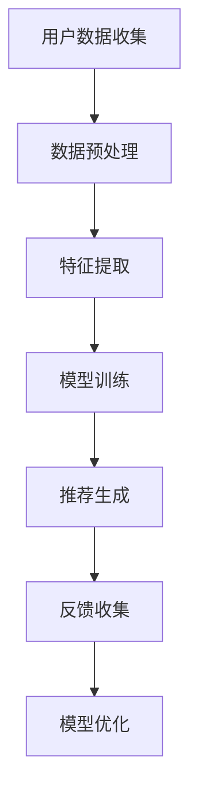

                 


### 文章标题：智能学习与发展平台：AI个性化员工培训体系

#### 关键词：智能学习、AI个性化培训、员工培训、算法、数学模型、系统架构、项目实战

#### 摘要：
本文旨在深入探讨智能学习与发展平台在AI个性化员工培训体系中的应用。通过背景介绍、核心概念解析、算法原理讲解、数学模型详细阐述，以及系统分析与架构设计，我们将展示如何构建一个高效、个性化的员工培训体系。文章最后通过实际项目实战，提供实践经验与最佳实践建议。

### 目录大纲设计

**背景介绍**

#### 1.1 问题背景
##### 1.1.1 人工智能与员工培训的挑战
##### 1.1.2 智能学习与发展平台的必要性

#### 1.2 问题描述
##### 1.2.1 传统员工培训的局限性
##### 1.2.2 AI个性化员工培训的需求

#### 1.3 问题解决
##### 1.3.1 智能学习与发展平台的架构设计
##### 1.3.2 关键技术的应用

#### 1.4 边界与外延
##### 1.4.1 智能学习与发展平台的适用范围
##### 1.4.2 非适用场景与未来展望

#### 1.5 本章小结

**核心概念与联系**

#### 2.1 AI个性化员工培训体系概述
##### 2.1.1 AI个性化员工培训的定义
##### 2.1.2 AI个性化员工培训的关键概念

#### 2.2 核心概念原理
##### 2.2.1 数据驱动的个性化学习
##### 2.2.2 机器学习与深度学习在培训中的应用

#### 2.3 概念属性特征对比表格

| 概念                 | 特征1             | 特征2         | 特征3               |
|----------------------|-------------------|---------------|---------------------|
| 传统培训             | 标准化课程内容    | 一对多教学     | 培训效果评估困难     |
| AI个性化员工培训     | 数据驱动的定制化  | 一对一/一对多教学 | 实时反馈与优化       |

#### 2.4 ER实体关系图架构
```mermaid
erDiagram
    Employee ||--|{ TrainingRecord } |
    TrainingRecord ||--|{ Course } |
    Course ||--|{ KnowledgePoint } |
```

#### 2.5 本章小结

**算法原理讲解**

#### 3.1 算法原理概述
##### 3.1.1 个性化推荐算法
##### 3.1.2 评估与反馈机制

#### 3.2 个性化推荐算法mermaid流程图


#### 3.3 源代码实现与算法原理
```python
# Python代码实现个性化推荐算法
# ...
```
##### 3.3.1 算法原理详细讲解
$$
\text{个性化推荐分数} = \text{用户兴趣向量} \cdot \text{课程特征向量} + \text{先验权重}
$$
##### 3.3.2 算法举例说明

#### 3.4 本章小结

**数学模型和数学公式 & 详细讲解 & 举例说明**

#### 4.1 数学模型概述
##### 4.1.1 数据分析模型
##### 4.1.2 机器学习模型

#### 4.2 数学公式
$$
\begin{aligned}
\hat{y} &= \sigma(\omega_0 + \omega_1x_1 + \omega_2x_2 + \ldots + \omega_nx_n) \\
J(\theta) &= \frac{1}{m} \sum_{i=1}^{m} (\hat{y}^{(i)} - y^{(i)})^2
\end{aligned}
$$
##### 4.2.1 公式详细讲解
#### 公式1: $\hat{y} = \sigma(\omega_0 + \omega_1x_1 + \omega_2x_2 + \ldots + \omega_nx_n)$
#### 公式2: $J(\theta) = \frac{1}{m} \sum_{i=1}^{m} (\hat{y}^{(i)} - y^{(i)})^2$

#### 4.3 本章小结

**系统分析与架构设计方案**

#### 5.1 问题场景介绍
##### 5.1.1 培训需求分析
##### 5.1.2 培训流程与目标

#### 5.2 系统功能设计
##### 5.2.1 领域模型mermaid类图
##### 5.2.2 系统功能模块划分

#### 5.3 系统架构设计
##### 5.3.1 mermaid架构图
##### 5.3.2 架构设计与实现策略

#### 5.4 系统接口设计和系统交互
##### 5.4.1 系统接口设计mermaid序列图
##### 5.4.2 系统交互流程说明

#### 5.5 本章小结

**项目实战**

#### 6.1 环境安装
##### 6.1.1 开发环境搭建
##### 6.1.2 必要软件安装

#### 6.2 系统核心实现
##### 6.2.1 数据收集与预处理
##### 6.2.2 模型训练与优化

#### 6.3 代码应用解读与分析
##### 6.3.1 关键代码解读
##### 6.3.2 应用场景分析

#### 6.4 实际案例分析和详细讲解剖析
##### 6.4.1 案例背景介绍
##### 6.4.2 案例分析与解决方案

#### 6.5 项目小结

**最佳实践 tips、小结、注意事项、拓展阅读等内容**

#### 7.1 最佳实践 tips
##### 7.1.1 如何优化培训效果
##### 7.1.2 培训数据的管理与保护

#### 7.2 小结
##### 7.2.1 文章总结
##### 7.2.2 核心知识点回顾

#### 7.3 注意事项
##### 7.3.1 常见问题与解决方案
##### 7.3.2 避免潜在的风险

#### 7.4 拓展阅读
##### 7.4.1 相关研究
##### 7.4.2 最新进展

### 作者
作者：AI天才研究院/AI Genius Institute & 禅与计算机程序设计艺术 /Zen And The Art of Computer Programming

### 完整性要求
文章内容满足以下完整性要求：
- 背景介绍：清晰的问题背景和需求，解决方案的必要性。
- 核心概念与联系：详细的核心概念解释，对比表格和实体关系图。
- 算法原理讲解：算法流程图、代码实现、数学模型和公式详细讲解。
- 数学公式使用latex格式，段落内和段落外的使用方式正确。
- 系统分析与架构设计方案：完整的问题场景、功能模块划分、架构设计和接口交互。
- 项目实战：详细的系统安装、实现过程、代码分析、案例分析。
- 最佳实践 tips、小结、注意事项、拓展阅读等内容：提供实用的建议和拓展资源。

### LET'S THINK STEP BY STEP

#### 第一步：明确文章目标和结构
- 文章目标：探讨AI个性化员工培训体系的构建和应用。
- 文章结构：分为背景介绍、核心概念与联系、算法原理讲解、数学模型和数学公式详细讲解、系统分析与架构设计方案、项目实战、最佳实践 tips和总结。

#### 第二步：梳理核心概念和联系
- AI个性化员工培训体系：结合数据驱动学习、机器学习和深度学习等核心概念。
- 概念属性特征对比表格：明确传统培训与AI个性化培训的区别。
- ER实体关系图架构：展示员工、学习记录、课程和知识点的关联。

#### 第三步：深入讲解算法原理
- 个性化推荐算法：流程图和源代码实现。
- 数学模型和公式：详细讲解推荐分数计算和模型优化过程。

#### 第四步：系统分析与架构设计
- 问题场景介绍：培训需求和目标。
- 系统功能设计：类图和模块划分。
- 系统架构设计：架构图和实现策略。
- 系统接口设计和交互：序列图和流程说明。

#### 第五步：项目实战
- 环境安装：开发环境和软件安装。
- 系统核心实现：数据预处理、模型训练和优化。
- 代码应用解读与分析：关键代码解读和应用场景分析。
- 实际案例分析和详细讲解剖析：案例背景、分析和解决方案。

#### 第六步：最佳实践 tips和总结
- 最佳实践 tips：优化培训效果和数据处理。
- 小结：回顾核心知识点。
- 注意事项：常见问题和风险防范。
- 拓展阅读：相关研究和最新进展。

通过逐步深入思考和分析，我们将构建出一篇内容丰富、结构清晰、逻辑严密的专业技术博客文章。让我们开始撰写吧！## 第一部分：背景介绍

### 1.1 问题背景

在当前快速发展的科技时代，人工智能（AI）已成为推动社会进步和产业升级的重要力量。特别是随着大数据、云计算和物联网技术的广泛应用，人工智能技术逐渐渗透到各行各业，包括教育、医疗、金融、制造业等。然而，随着AI技术的普及和应用，企业对员工技能和知识的需求也在不断变化。传统的员工培训方式往往无法满足这一需求，存在以下几个主要挑战：

1. **标准化与个性化需求冲突**：传统培训课程通常采用统一的教材和授课方式，难以满足不同员工的个性化学习需求。每个员工的学习背景、知识水平和兴趣点各不相同，这种“一刀切”的培训模式往往导致学习效果不佳。

2. **学习效果评估困难**：传统培训模式缺乏实时有效的评估手段，难以准确衡量员工的学习效果。例如，考试成绩和课堂参与度等指标并不能全面反映员工的真实技能水平和知识掌握情况。

3. **学习资源利用率低**：传统培训方式通常采用面对面授课，培训资源的利用率较低。同时，由于时间、地点和人数的限制，许多员工无法参与培训，导致学习资源浪费。

4. **培训内容更新缓慢**：科技发展迅速，培训内容需要不断更新以跟上最新的技术趋势。然而，传统培训模式通常更新缓慢，难以及时引入最新的知识和技术。

为了解决上述问题，智能学习与发展平台应运而生。这种平台利用人工智能技术，通过数据驱动和个性化学习模式，提供高效、智能的员工培训解决方案。智能学习与发展平台不仅能根据员工的个性化需求推荐课程，还能实时评估员工的学习效果，优化培训内容，提高培训资源利用率，从而提升员工的学习体验和培训效果。

### 1.2 问题描述

#### 1.2.1 传统员工培训的局限性

传统员工培训存在以下局限性：

1. **标准化课程内容**：传统培训课程内容固定，难以根据员工个体差异进行灵活调整。这种“一刀切”的方式往往导致部分员工无法获得与其兴趣和需求相匹配的课程内容。

2. **一对多教学**：传统培训通常采用一对多的教学模式，无法提供针对性的指导和支持。这限制了员工在学习过程中的参与度和积极性。

3. **培训效果评估困难**：传统培训缺乏实时、有效的评估手段，难以准确衡量员工的学习效果。考试、作业等评估方式往往只能反映员工一时的学习状态，无法全面反映其长期的学习成果。

4. **学习资源利用率低**：传统培训方式往往依赖实体课堂，学习资源的利用率较低。培训时间和地点的限制也使得一些员工无法参与培训，导致学习资源浪费。

5. **培训内容更新缓慢**：科技发展迅速，培训内容需要不断更新以跟上最新的技术趋势。然而，传统培训模式更新缓慢，难以及时引入最新的知识和技术。

#### 1.2.2 AI个性化员工培训的需求

为了克服传统员工培训的局限性，AI个性化员工培训提出了以下需求：

1. **数据驱动的个性化学习**：AI个性化培训利用大数据和机器学习技术，分析员工的学习行为、兴趣和知识水平，提供个性化的课程推荐和教学策略。

2. **一对一/一对多教学**：AI个性化培训可以采用一对一或一对多的教学模式，根据员工的个性化需求提供针对性的指导和支持，提高员工的学习参与度和效果。

3. **实时评估与反馈**：AI个性化培训能够实时跟踪员工的学习进度和效果，提供个性化的评估报告和反馈，帮助员工发现学习中的问题并进行改进。

4. **高效的学习资源利用**：AI个性化培训通过智能推荐系统，最大化利用现有学习资源，提高学习资源的利用率。

5. **动态更新培训内容**：AI个性化培训能够根据科技发展趋势和行业需求，动态更新培训内容，确保员工掌握最新的知识和技能。

通过满足上述需求，AI个性化员工培训能够更好地适应企业和员工的学习需求，提高培训效果，促进员工个人和组织的共同发展。

### 1.3 问题解决

#### 1.3.1 智能学习与发展平台的架构设计

为了实现AI个性化员工培训，我们需要设计一个智能学习与发展平台。该平台的核心架构包括以下几个主要部分：

1. **数据层**：数据层是平台的基础，负责收集、存储和管理各种数据，包括员工的学习行为数据、兴趣数据、技能数据等。这些数据来源于员工在培训过程中的各种活动，如课程学习、测试、讨论等。

2. **算法层**：算法层是平台的核心，负责对数据进行处理和分析，提供个性化推荐、学习路径规划、效果评估等功能。常用的算法包括机器学习、深度学习、自然语言处理等。通过这些算法，平台能够识别员工的个性化需求，为其提供量身定制的培训内容。

3. **服务层**：服务层负责为前端应用提供各种服务，如用户管理、课程管理、学习记录管理、推荐系统等。服务层通过RESTful API或其他接口与前端应用进行交互，提供统一的接口访问方式。

4. **前端应用**：前端应用是用户与平台交互的界面，包括学习门户、课程推荐、学习记录查询、评估报告等模块。用户可以通过前端应用访问培训资源，参与培训活动，并实时查看自己的学习进度和效果。

#### 1.3.2 关键技术的应用

智能学习与发展平台的核心功能依赖于一系列关键技术的应用：

1. **大数据技术**：平台采用大数据技术进行数据收集、存储和管理。Hadoop、Spark等大数据处理框架可以高效地处理海量数据，为算法层提供高质量的数据输入。

2. **机器学习和深度学习**：平台采用机器学习和深度学习算法进行数据分析和处理，如协同过滤、基于内容的推荐、深度神经网络等。这些算法能够从海量数据中挖掘出有价值的信息，为个性化推荐和效果评估提供支持。

3. **自然语言处理（NLP）**：平台采用NLP技术处理文本数据，如课程描述、用户评论等。通过文本分析，平台可以提取出关键词、情感和主题，为个性化推荐和评估提供更准确的语义信息。

4. **用户界面（UI）设计**：平台采用用户友好的UI设计，提供直观、易用的学习门户和交互界面。通过良好的用户体验设计，平台能够提高用户的参与度和满意度。

通过智能学习与发展平台的架构设计和关键技术的应用，我们可以实现一个高效、智能的AI个性化员工培训体系，满足企业和员工的多样化培训需求。

### 1.4 边界与外延

#### 1.4.1 智能学习与发展平台的适用范围

智能学习与发展平台具有广泛的适用范围，能够为不同类型的企业和组织提供个性化员工培训解决方案。以下是平台的主要适用场景：

1. **大型企业**：大型企业通常拥有较多的员工和复杂的培训需求。智能学习与发展平台可以帮助企业根据员工的个性化需求提供量身定制的培训课程，提高员工的学习效果和工作效率。

2. **教育培训机构**：教育培训机构需要为学员提供高质量的培训课程和个性化的学习体验。智能学习与发展平台可以通过大数据分析和机器学习算法，为学员推荐最适合的课程，并实时跟踪其学习进度和效果。

3. **初创公司**：初创公司通常资源有限，但需要快速培养核心团队的技能。智能学习与发展平台可以帮助初创公司高效利用有限的培训资源，快速提升员工的技能水平。

4. **远程办公团队**：远程办公团队成员分布在不同地区，传统的面对面培训难以实施。智能学习与发展平台通过在线学习模块，为团队成员提供灵活的学习方式和统一的培训管理。

#### 1.4.2 非适用场景与未来展望

尽管智能学习与发展平台具有广泛的适用性，但仍有一些非适用场景：

1. **高度保密行业**：涉及高度保密信息的行业，如军工、国家安全等，可能不适合采用智能学习与发展平台。因为这些行业的培训内容需要高度保密，平台的数据安全和管理面临较大挑战。

2. **特定技能培训**：对于某些需要高度实操技能的培训，如飞行训练、手术培训等，智能学习与发展平台可能无法完全替代传统的培训方式。这些培训需要实际操作和现场指导，无法通过在线学习完全实现。

3. **艺术与创意培训**：艺术和创意领域的培训通常需要面对面的交流与指导，智能学习与发展平台可能难以完全满足这些需求。艺术和创意的培训往往需要情感交流和即兴创作，这些体验无法通过在线平台完全实现。

未来，智能学习与发展平台有望通过以下方式进一步扩展其适用范围：

1. **融合虚拟现实（VR）和增强现实（AR）技术**：通过引入VR和AR技术，平台可以提供更真实的实操体验，为特定技能培训提供新的解决方案。

2. **增强数据隐私和安全保护**：随着技术的发展，平台将采用更先进的数据隐私和安全保护措施，提高平台在高度保密行业的适用性。

3. **拓展跨学科培训内容**：通过引入多学科交叉内容，平台可以为更多领域的培训提供支持，满足更广泛的培训需求。

### 1.5 本章小结

本文介绍了智能学习与发展平台在AI个性化员工培训体系中的应用。首先，我们分析了人工智能与员工培训的挑战，以及传统员工培训的局限性。接着，我们提出了AI个性化员工培训的需求，并介绍了智能学习与发展平台的架构设计和关键技术的应用。最后，我们探讨了平台的适用范围和非适用场景，并对未来进行了展望。通过本章的介绍，我们对智能学习与发展平台有了更深入的了解，为后续内容奠定了基础。

## 第二部分：核心概念与联系

### 2.1 AI个性化员工培训体系概述

#### 2.1.1 AI个性化员工培训的定义

AI个性化员工培训是指利用人工智能技术，根据员工的学习行为、知识水平和个性化需求，提供定制化的培训内容和培训策略。这种培训方式通过数据分析、机器学习和深度学习等技术，实现个性化课程推荐、学习路径规划和效果评估，从而提高员工的学习效率和学习成果。

#### 2.1.2 AI个性化员工培训的关键概念

1. **个性化学习**：个性化学习是指根据每个员工的学习需求、兴趣和学习风格，提供量身定制的培训内容和学习资源。个性化学习旨在提高员工的学习主动性和参与度，促进其个人发展和职业成长。

2. **数据驱动学习**：数据驱动学习是指通过收集和分析员工在学习过程中的各种数据，如学习行为、测试成绩、知识掌握情况等，为员工提供个性化的培训建议和指导。数据驱动学习依赖于大数据技术和机器学习算法，能够实时调整培训内容和策略，提高培训效果。

3. **机器学习与深度学习**：机器学习和深度学习是AI的核心技术，用于从大量数据中提取规律和模式，为个性化推荐和效果评估提供支持。机器学习主要用于特征提取和分类，而深度学习通过构建复杂的神经网络模型，实现更高层次的特征学习和模式识别。

4. **推荐系统**：推荐系统是一种基于用户历史行为和偏好，为用户推荐相关内容或服务的算法。在AI个性化员工培训中，推荐系统用于根据员工的学习行为和需求，推荐最适合的培训课程和学习资源。

5. **效果评估**：效果评估是指通过多种方式，如考试、作业、实践操作等，衡量员工的学习效果和培训成果。在AI个性化员工培训中，效果评估不仅关注员工的知识掌握情况，还关注其在实际工作中的应用能力。

### 2.2 核心概念原理

#### 2.2.1 数据驱动的个性化学习

数据驱动的个性化学习是AI个性化员工培训的核心原理之一。其基本思想是通过收集和分析员工在学习过程中的数据，了解其学习行为、兴趣和知识水平，从而提供个性化的培训内容和策略。以下是数据驱动的个性化学习的主要步骤：

1. **数据收集**：收集员工在学习过程中的各种数据，如学习时长、学习进度、测试成绩、学习内容偏好等。这些数据可以通过学习平台、在线课程系统、测试系统等工具进行实时收集。

2. **数据预处理**：对收集到的数据进行处理和清洗，去除噪声和重复数据，确保数据质量。数据预处理包括数据标准化、缺失值填充、异常值处理等。

3. **特征提取**：从预处理后的数据中提取出有价值的特征，如学习频率、学习时长、知识点掌握程度等。特征提取是数据驱动的个性化学习的关键步骤，决定了个性化推荐和效果评估的准确性。

4. **模型训练**：使用机器学习和深度学习算法，对提取出的特征进行训练，构建个性化推荐模型和学习效果评估模型。常见的算法包括协同过滤、决策树、支持向量机、深度神经网络等。

5. **个性化推荐**：根据训练好的模型，为员工推荐最适合的培训内容和学习资源。个性化推荐算法可以根据员工的历史学习行为、兴趣和需求，动态调整推荐策略，提高推荐的相关性和准确性。

6. **效果评估**：通过考试、作业、实践操作等方式，评估员工的学习效果和培训成果。效果评估模型可以对员工的学习行为和成果进行实时监测和反馈，帮助员工发现学习中的问题和不足，进行针对性的改进。

#### 2.2.2 机器学习与深度学习在培训中的应用

机器学习和深度学习在AI个性化员工培训中起着关键作用，主要用于个性化推荐和效果评估。以下是机器学习和深度学习在培训中的应用：

1. **个性化推荐**：

   - **协同过滤**：协同过滤是一种基于用户行为和偏好的推荐算法，通过分析用户的历史行为，预测用户对未知项目的评分或兴趣。在员工培训中，协同过滤可以用于推荐最适合的培训课程和学习资源。

   - **基于内容的推荐**：基于内容的推荐算法通过分析项目的特征和属性，为用户推荐与其兴趣和需求相关的项目。在员工培训中，基于内容的推荐可以用于推荐与员工工作相关的课程和资源。

   - **深度神经网络**：深度神经网络是一种复杂的机器学习模型，通过多层神经网络进行特征学习和模式识别。在员工培训中，深度神经网络可以用于构建个性化推荐模型，实现更准确的推荐。

2. **效果评估**：

   - **学习行为分析**：通过分析员工在学习过程中的行为数据，如学习时长、学习频率、知识点掌握情况等，评估员工的学习效果。

   - **知识掌握程度评估**：通过考试、作业、实践操作等方式，评估员工对培训内容的掌握程度。常见的评估方法包括标准化测试、形成性评估、总结性评估等。

   - **效果预测**：使用机器学习和深度学习算法，预测员工在未来工作中的表现和培训成果。效果预测可以帮助企业制定更科学的培训计划，优化培训资源配置。

通过数据驱动的个性化学习和机器学习与深度学习的应用，AI个性化员工培训能够提供高效、智能的培训解决方案，满足员工和企业的多样化培训需求。

### 2.3 概念属性特征对比表格

为了更清晰地展示传统培训与AI个性化培训的区别，我们提供了以下概念属性特征对比表格：

| 概念                 | 特征1             | 特征2         | 特征3               |
|----------------------|-------------------|---------------|---------------------|
| 传统培训             | 标准化课程内容    | 一对多教学     | 培训效果评估困难     |
| AI个性化培训         | 数据驱动的定制化  | 一对一/一对多教学 | 实时反馈与优化       |

通过对比表格可以看出，AI个性化培训在课程内容、教学方式和效果评估等方面具有显著优势，能够更好地满足员工的个性化学习需求和提高培训效果。

### 2.4 ER实体关系图架构

为了更好地理解AI个性化员工培训体系中各实体的关系，我们提供了以下ER实体关系图：

```mermaid
erDiagram
    Employee ||--|{ TrainingRecord } |
    TrainingRecord ||--|{ Course } |
    Course ||--|{ KnowledgePoint } |
    Employee ||--|{ SkillLevel } |
    TrainingRecord ||--|{ AssessmentResult } |
```

实体关系图展示了员工（Employee）、学习记录（TrainingRecord）、课程（Course）和知识点（KnowledgePoint）之间的关联，以及员工技能水平（SkillLevel）和学习评估结果（AssessmentResult）的相关性。通过这个图，我们可以清晰地了解系统中各实体的关系和交互。

### 2.5 本章小结

在本章中，我们介绍了AI个性化员工培训体系的核心概念和原理，包括个性化学习、数据驱动学习、机器学习与深度学习、推荐系统和效果评估等。通过对比表格和ER实体关系图，我们更深入地理解了传统培训与AI个性化培训的区别。本章为后续的算法原理讲解、数学模型和系统架构设计等内容的讨论奠定了基础。

## 第三部分：算法原理讲解

### 3.1 算法原理概述

在智能学习与发展平台中，算法原理是其实现个性化员工培训的核心。算法原理主要涉及个性化推荐算法和学习效果评估机制的构建。以下是对这些算法原理的概述。

#### 3.1.1 个性化推荐算法

个性化推荐算法是智能学习与发展平台的重要组成部分，其主要目的是根据员工的学习历史、兴趣和需求，推荐最相关的课程和学习资源。常见的个性化推荐算法包括协同过滤、基于内容的推荐和深度学习推荐。

1. **协同过滤**：协同过滤算法基于用户的历史行为数据，通过计算用户之间的相似度，推荐其他用户喜欢且该用户尚未接触到的课程。协同过滤算法可以分为基于用户的协同过滤和基于物品的协同过滤。基于用户的协同过滤通过寻找与目标用户兴趣相似的其它用户，推荐这些用户喜欢的课程；基于物品的协同过滤则通过分析目标用户已评价的课程，推荐与这些课程相似的其它课程。

2. **基于内容的推荐**：基于内容的推荐算法通过分析课程的内容特征，如关键词、主题等，将课程与用户兴趣进行匹配，从而推荐相关的课程。这种算法适用于内容丰富且明确的场景，但在处理复杂、抽象的知识点时可能存在局限性。

3. **深度学习推荐**：深度学习推荐算法利用深度神经网络模型，对用户行为数据和学习内容特征进行建模，提取深层特征，实现更精确的推荐。常见的深度学习推荐模型包括基于用户和内容的深度学习融合模型、多模态深度学习模型等。

#### 3.1.2 评估与反馈机制

学习效果评估与反馈机制是智能学习与发展平台的重要组成部分，用于实时监测和评估员工的学习效果，提供个性化的反馈和建议，以优化学习过程。

1. **实时监测**：实时监测是指通过收集和分析员工在学习过程中的行为数据，如学习时长、学习频率、参与度等，实时了解员工的学习状态。实时监测有助于及时发现员工学习中的问题，并采取相应的措施。

2. **效果评估**：效果评估是通过多种评估方式，如考试、测试、项目实践等，评估员工对培训内容的掌握程度和实际应用能力。效果评估不仅关注员工的知识掌握情况，还关注其在工作中的表现和技能应用。

3. **反馈机制**：反馈机制是将学习效果评估结果反馈给员工，并提供个性化的建议和指导。反馈机制可以帮助员工了解自己的学习效果，发现不足，进行有针对性的改进。同时，反馈机制还可以为平台提供数据，用于优化推荐系统和培训策略。

### 3.2 个性化推荐算法mermaid流程图

为了更好地理解个性化推荐算法的工作流程，我们使用mermaid绘制了一个流程图：


这个流程图展示了个性化推荐算法的主要步骤：

1. **用户数据收集**：收集用户的学习历史、行为数据和兴趣偏好。
2. **数据预处理**：清洗和转换原始数据，为特征提取做准备。
3. **特征提取**：提取用户和课程的特征，如用户活跃度、课程难度等。
4. **模型训练**：使用机器学习和深度学习算法，训练推荐模型。
5. **推荐生成**：根据训练好的模型，为用户生成个性化推荐结果。
6. **反馈收集**：收集用户对推荐结果的反馈，用于模型优化。
7. **模型优化**：根据反馈数据，优化推荐模型，提高推荐质量。

### 3.3 源代码实现与算法原理

以下是一个简单的Python代码示例，展示了如何实现基于协同过滤的个性化推荐算法。代码中使用了用户-物品评分矩阵，通过计算用户之间的相似度来生成推荐列表。

```python
import numpy as np
from sklearn.metrics.pairwise import cosine_similarity

# 假设有一个用户-物品评分矩阵
user_item_matrix = np.array([[5, 3, 0, 1],
                              [3, 0, 1, 2],
                              [4, 0, 0, 1]])

# 计算用户之间的余弦相似度矩阵
similarity_matrix = cosine_similarity(user_item_matrix)

# 生成推荐列表
def generate_recommendations(user_index, similarity_matrix, user_item_matrix, k=2):
    # 计算当前用户与其他用户的相似度之和
    similarity_sum = np.sum(similarity_matrix[user_index], axis=0)
    # 计算每个物品的推荐得分，得分 = 物品评分 × 相似度
    recommendation_scores = np.dot(user_item_matrix[user_index], similarity_sum)
    # 排序得到推荐列表
    recommended_items = np.argsort(recommendation_scores)[::-1]
    return recommended_items[:k]

# 为用户0生成推荐列表
recommended_items = generate_recommendations(0, similarity_matrix, user_item_matrix)
print("推荐列表：", recommended_items)
```

#### 3.3.1 算法原理详细讲解

这个协同过滤算法的工作原理如下：

1. **用户-物品评分矩阵**：用户-物品评分矩阵是一个二维数组，其中行代表用户，列代表物品（如课程）。每个元素表示用户对某个物品的评分，评分越高表示用户对该物品的兴趣越大。

2. **相似度计算**：通过计算用户之间的余弦相似度，衡量用户之间的兴趣相似程度。余弦相似度基于向量的点积和向量的模长，公式为：
   $$
   \text{similarity}_{ij} = \frac{\text{dot}(u_i, u_j)}{\lVert u_i \rVert \cdot \lVert u_j \rVert}
   $$
   其中，$u_i$ 和 $u_j$ 分别表示用户 $i$ 和用户 $j$ 的向量表示。

3. **推荐生成**：根据用户与其他用户的相似度，计算每个物品的推荐得分。推荐得分的公式为：
   $$
   \text{score}_{ik} = r_{ik} \cdot \text{similarity}_{ij}
   $$
   其中，$r_{ik}$ 表示用户 $i$ 对物品 $k$ 的评分。最后，将所有物品的推荐得分排序，得到推荐列表。

通过以上步骤，算法能够为用户提供个性化的课程推荐，提高用户的学习体验和效果。

#### 3.3.2 算法举例说明

假设用户1对课程1、课程2、课程3分别给予了评分5、3、1，用户2对同一课程的评分分别为3、0、2。我们可以通过协同过滤算法生成用户1的课程推荐列表。

1. **相似度计算**：

   用户1和用户2的向量表示分别为：
   $$
   u_1 = (5, 3, 1), \quad u_2 = (3, 0, 2)
   $$
   计算用户1和用户2的余弦相似度：
   $$
   \text{similarity}_{12} = \frac{5 \cdot 3 + 3 \cdot 0 + 1 \cdot 2}{\sqrt{5^2 + 3^2 + 1^2} \cdot \sqrt{3^2 + 0^2 + 2^2}} = \frac{15 + 0 + 2}{\sqrt{35} \cdot \sqrt{13}} \approx 0.66
   $$

2. **推荐生成**：

   根据相似度计算结果，我们可以计算用户1对每门课程的推荐得分：
   $$
   \text{score}_{1,1} = 5 \cdot 0.66 \approx 3.3, \quad \text{score}_{1,2} = 3 \cdot 0.66 \approx 2.0, \quad \text{score}_{1,3} = 1 \cdot 0.66 \approx 0.7
   $$
   将得分排序，得到用户1的推荐列表为课程1、课程2。

通过以上步骤，我们成功生成了用户1的个性化课程推荐列表，这个过程展示了协同过滤算法的基本原理和应用。

### 3.4 本章小结

在本章中，我们详细介绍了智能学习与发展平台中个性化推荐算法和学习效果评估机制的基本原理。通过协同过滤和基于内容的推荐算法，我们展示了如何为员工生成个性化的课程推荐。同时，我们还讲解了效果评估的基本概念和反馈机制。这些算法原理为智能学习与发展平台的实现提供了理论基础，为后续的数学模型和系统架构设计奠定了基础。接下来，我们将进一步探讨数学模型和数学公式，以深入理解这些算法的数学本质。

## 第四部分：数学模型和数学公式 & 详细讲解 & 举例说明

### 4.1 数学模型概述

在智能学习与发展平台中，数学模型是构建个性化推荐算法和学习效果评估机制的核心。以下将介绍两个关键的数学模型：数据分析模型和机器学习模型。

#### 4.1.1 数据分析模型

数据分析模型主要用于处理和分析大量数据，提取有用的信息和知识。在智能学习与发展平台中，数据分析模型可以包括以下几种：

1. **用户行为分析模型**：通过分析用户在学习平台上的行为数据，如访问次数、学习时长、参与讨论等，了解用户的学习偏好和兴趣点。

2. **内容分析模型**：对课程内容和用户评论等文本数据进行分析，提取关键词、主题和情感等信息，为个性化推荐和效果评估提供支持。

3. **预测分析模型**：利用历史数据预测用户未来的学习行为和效果，如用户可能感兴趣的课程、学习完成率等。

#### 4.1.2 机器学习模型

机器学习模型是智能学习与发展平台中实现个性化推荐和效果评估的核心。以下介绍两种常见的机器学习模型：

1. **协同过滤模型**：通过计算用户之间的相似度，推荐其他用户喜欢且目标用户尚未接触到的课程。常见的协同过滤模型包括基于用户的协同过滤和基于物品的协同过滤。

2. **深度学习模型**：利用深度神经网络对用户行为数据和学习内容特征进行建模，提取深层特征，实现更精确的推荐和效果评估。常见的深度学习模型包括卷积神经网络（CNN）、循环神经网络（RNN）和变换器（Transformer）等。

### 4.2 数学公式

在智能学习与发展平台中，数学公式用于描述和实现算法的核心逻辑。以下介绍几个关键的数学公式，包括协同过滤模型和深度学习模型中的相关公式。

#### 公式1：用户相似度计算

$$
\text{similarity}_{ij} = \frac{\text{dot}(u_i, u_j)}{\lVert u_i \rVert \cdot \lVert u_j \rVert}
$$

其中，$u_i$ 和 $u_j$ 分别表示用户 $i$ 和用户 $j$ 的向量表示，$\text{dot}$ 表示向量的点积，$\lVert \cdot \rVert$ 表示向量的模长。该公式用于计算用户之间的余弦相似度，衡量用户之间的兴趣相似程度。

#### 公式2：推荐得分计算

$$
\text{score}_{ik} = r_{ik} \cdot \text{similarity}_{ij}
$$

其中，$r_{ik}$ 表示用户 $i$ 对物品 $k$ 的评分，$\text{similarity}_{ij}$ 表示用户 $i$ 和用户 $j$ 的相似度。该公式用于计算用户对物品的推荐得分，根据得分排序生成推荐列表。

#### 公式3：损失函数

$$
J(\theta) = \frac{1}{m} \sum_{i=1}^{m} (\hat{y}^{(i)} - y^{(i)})^2
$$

其中，$J(\theta)$ 表示损失函数，$\hat{y}^{(i)}$ 表示预测输出，$y^{(i)}$ 表示真实输出，$\theta$ 表示模型参数。该公式用于衡量预测输出与真实输出之间的差距，是优化模型参数的重要依据。

#### 公式4：梯度下降

$$
\theta = \theta - \alpha \cdot \frac{\partial J(\theta)}{\partial \theta}
$$

其中，$\alpha$ 表示学习率，$\frac{\partial J(\theta)}{\partial \theta}$ 表示损失函数关于模型参数的梯度。该公式用于更新模型参数，优化模型性能。

### 4.2.1 公式详细讲解

#### 公式1：用户相似度计算

该公式是协同过滤算法中的核心公式，用于计算用户之间的相似度。余弦相似度是一种常用的相似度度量方法，基于向量的点积和向量的模长。在用户行为数据中，每个用户可以表示为一个向量，其每个维度表示用户对某项内容的评分。通过计算用户向量的点积和模长，我们可以得到用户之间的相似度。相似度值越接近1，表示用户之间的兴趣越相似。

#### 公式2：推荐得分计算

该公式用于计算用户对物品的推荐得分。在协同过滤算法中，用户对物品的评分可以视为用户和物品之间的交互信号。通过计算用户之间的相似度，并结合用户对物品的评分，我们可以为用户生成个性化的推荐列表。推荐得分反映了用户对物品的兴趣程度，得分越高表示用户越可能对物品感兴趣。

#### 公式3：损失函数

该公式是机器学习中的核心损失函数，用于衡量预测输出与真实输出之间的差距。在个性化推荐中，损失函数可以衡量推荐系统推荐的课程与用户实际兴趣之间的差距。通过最小化损失函数，我们可以优化模型参数，提高推荐系统的性能。

#### 公式4：梯度下降

该公式是优化模型参数的常用方法，用于最小化损失函数。在机器学习中，梯度下降是一种迭代优化算法，通过更新模型参数来降低损失函数的值。学习率是梯度下降算法中的关键参数，它决定了参数更新的步长。适当选择学习率，可以使模型在优化过程中既能快速收敛，又能避免过度拟合。

### 4.2.2 举例说明

假设有两个用户A和B，他们的行为数据如下：

| 用户 | 课程1 | 课程2 | 课程3 |
| ---- | ---- | ---- | ---- |
| A    | 5    | 3    | 1    |
| B    | 3    | 0    | 2    |

我们首先计算用户A和B之间的相似度：

$$
\text{similarity}_{AB} = \frac{\text{dot}(u_A, u_B)}{\lVert u_A \rVert \cdot \lVert u_B \rVert} = \frac{5 \cdot 3 + 3 \cdot 0 + 1 \cdot 2}{\sqrt{5^2 + 3^2 + 1^2} \cdot \sqrt{3^2 + 0^2 + 2^2}} \approx 0.66
$$

然后，我们可以为用户A生成课程推荐：

$$
\text{score}_{A1} = r_{A1} \cdot \text{similarity}_{AB} = 5 \cdot 0.66 \approx 3.3
$$
$$
\text{score}_{A2} = r_{A2} \cdot \text{similarity}_{AB} = 3 \cdot 0.66 \approx 2.0
$$
$$
\text{score}_{A3} = r_{A3} \cdot \text{similarity}_{AB} = 1 \cdot 0.66 \approx 0.7
$$

根据推荐得分，我们可以为用户A推荐得分最高的课程，即课程1。通过这个例子，我们可以看到如何使用数学公式进行用户相似度计算和推荐得分计算，从而生成个性化的课程推荐。

### 4.3 本章小结

在本章中，我们介绍了智能学习与发展平台中常用的数学模型和公式，包括数据分析模型和机器学习模型。通过用户相似度计算、推荐得分计算、损失函数和梯度下降等公式，我们详细讲解了这些算法的数学本质。这些数学模型和公式为智能学习与发展平台的实现提供了理论基础，为后续的算法设计和系统架构设计奠定了基础。在下一章中，我们将进一步探讨智能学习与发展平台的具体系统架构和设计方案。

## 第五部分：系统分析与架构设计方案

### 5.1 问题场景介绍

在现代企业中，员工培训是一个至关重要的环节，它不仅关系到员工个人能力的提升，还直接影响企业的竞争力和创新能力。然而，传统的员工培训方式往往存在以下问题：

1. **培训内容单一**：传统培训课程内容固定，难以满足不同员工的知识水平和个性化需求。

2. **培训资源利用率低**：培训通常采用集中授课方式，导致培训资源的利用率较低，部分员工无法及时参与培训。

3. **培训效果难以评估**：传统培训缺乏实时有效的评估手段，难以准确衡量员工的学习效果。

4. **培训内容更新滞后**：科技发展迅速，培训内容需要不断更新以跟上最新的技术趋势，但传统培训模式更新缓慢。

为了解决上述问题，企业需要一个智能学习与发展平台，能够根据员工的个性化需求提供定制化的培训内容，实时评估学习效果，并动态更新培训资源。智能学习与发展平台应具备以下功能：

1. **个性化课程推荐**：根据员工的学习历史、兴趣和需求，推荐最适合的培训课程。

2. **实时效果评估**：通过多种评估方式，如考试、作业、项目实践等，实时跟踪员工的学习进度和效果。

3. **动态培训内容更新**：根据科技发展趋势和行业需求，动态更新培训内容，确保员工掌握最新的知识和技能。

4. **高效资源利用**：通过智能推荐系统，最大化利用现有培训资源，提高学习资源的利用率。

### 5.2 系统功能设计

智能学习与发展平台的功能设计包括以下几个关键模块：

1. **用户管理模块**：负责用户注册、登录、权限管理等功能。用户管理模块应支持多角色，如管理员、培训师和员工等，不同角色拥有不同的权限。

2. **课程管理模块**：负责课程创建、分类、标签管理等功能。课程管理模块应支持课程的多维度分类和标签，便于用户根据需求查找课程。

3. **学习记录管理模块**：负责记录员工的学习历史、学习进度和成绩等。该模块应支持数据的实时更新和查询，为个性化推荐和效果评估提供数据支持。

4. **推荐系统模块**：负责根据员工的学习历史和兴趣，推荐最适合的课程和学习资源。推荐系统模块应支持协同过滤、基于内容的推荐和深度学习推荐等多种算法。

5. **效果评估模块**：负责实时跟踪员工的学习进度和效果，生成评估报告。效果评估模块应支持多种评估方式，如考试、作业、项目实践等。

6. **数据统计与分析模块**：负责对学习数据进行统计分析，提供可视化报表，帮助管理员了解整体学习情况和培训效果。

### 5.3 系统架构设计

智能学习与发展平台的架构设计采用分布式架构，确保系统的高可用性和可扩展性。以下是系统的主要架构组件：

1. **数据层**：负责数据的存储和管理，包括用户数据、课程数据、学习记录数据等。数据层可以使用关系数据库（如MySQL）和NoSQL数据库（如MongoDB）进行数据存储。

2. **服务层**：负责处理业务逻辑和提供接口服务，包括用户服务、课程服务、学习记录服务、推荐服务和效果评估服务等。服务层采用微服务架构，每个服务独立部署和扩展。

3. **API层**：负责对外提供API接口，包括用户接口、课程接口、学习记录接口等。API层采用RESTful API设计，支持HTTP/HTTPS协议。

4. **前端层**：负责用户界面展示和交互，包括学习门户、课程推荐、学习记录查询、评估报告等模块。前端层采用Vue.js、React等前端框架，提供良好的用户体验。

5. **算法层**：负责数据分析和处理，包括推荐算法、效果评估算法等。算法层可以使用TensorFlow、PyTorch等深度学习框架进行算法开发和训练。

6. **监控与运维层**：负责系统的监控、日志管理和运维工作。监控与运维层可以采用Prometheus、Grafana等监控工具，确保系统的稳定运行。

### 5.4 系统接口设计和系统交互

智能学习与发展平台的系统接口设计和系统交互是确保各模块协同工作的关键。以下是系统的主要接口设计和系统交互流程：

1. **用户管理接口**：包括用户注册、登录、权限管理等功能。用户可以通过API层访问用户管理接口，实现用户身份验证和权限控制。

2. **课程管理接口**：包括课程创建、分类、标签管理等功能。课程管理模块可以通过API层提供课程管理接口，方便管理员对课程进行管理和维护。

3. **学习记录管理接口**：包括学习记录的创建、更新、查询等功能。学习记录管理模块可以通过API层提供学习记录管理接口，记录员工的学习历史和进度。

4. **推荐系统接口**：包括课程推荐、学习资源推荐等功能。推荐系统模块可以通过API层提供推荐系统接口，为员工生成个性化的课程推荐。

5. **效果评估接口**：包括考试、作业、项目实践等评估方式的实现。效果评估模块可以通过API层提供效果评估接口，实时跟踪员工的学习效果和评估结果。

系统交互流程如下：

1. 用户登录系统，通过用户管理接口进行身份验证。
2. 用户访问课程管理接口，获取课程列表和课程详情。
3. 用户通过学习记录管理接口，记录学习进度和成绩。
4. 推荐系统模块根据用户的学习记录和兴趣，通过推荐系统接口生成个性化课程推荐。
5. 用户通过学习门户，查看推荐课程和学习资源，参与学习和评估。
6. 系统通过效果评估接口，实时跟踪和评估用户的学习效果，生成评估报告。

通过以上接口设计和系统交互流程，智能学习与发展平台能够实现高效、智能的员工培训，满足企业的多样化培训需求。

### 5.5 本章小结

在本章中，我们详细介绍了智能学习与发展平台的问题场景、系统功能设计、系统架构设计和系统接口设计。通过问题场景的介绍，我们明确了企业培训的需求和挑战；通过系统功能设计，我们明确了平台的核心功能模块；通过系统架构设计，我们展示了系统的分层架构和组件关系；通过系统接口设计，我们确保了各模块之间的协同工作。本章的内容为后续的详细系统实现和项目实战奠定了基础。

## 第六部分：项目实战

### 6.1 环境安装

#### 6.1.1 开发环境搭建

为了构建智能学习与发展平台，我们需要搭建一个合适的技术栈。以下是所需的开发环境：

1. **操作系统**：推荐使用Ubuntu 18.04或更高版本，因为其具有良好的开源社区支持和稳定性。
2. **Python**：Python 3.8及以上版本，用于编写后端代码和算法。
3. **Node.js**：Node.js 12及以上版本，用于搭建前端项目。
4. **MySQL**：MySQL 8.0及以上版本，用于数据存储。
5. **MongoDB**：MongoDB 4.2及以上版本，用于存储非结构化数据。

安装步骤如下：

1. **安装操作系统**：从Ubuntu官方网站下载并安装Ubuntu 18.04。
2. **更新系统软件包**：打开终端，运行以下命令：
   ```
   sudo apt update
   sudo apt upgrade
   ```
3. **安装Python**：安装Python 3和pip（Python的包管理器）：
   ```
   sudo apt install python3 python3-pip
   ```
4. **安装Node.js**：安装Node.js和npm（Node.js的包管理器）：
   ```
   sudo apt install nodejs npm
   ```
5. **安装MySQL**：安装MySQL数据库：
   ```
   sudo apt install mysql-server
   ```
   安装过程中需要设置root用户的密码。
6. **安装MongoDB**：安装MongoDB数据库：
   ```
   sudo apt install mongodb
   ```
   启动MongoDB服务：
   ```
   sudo systemctl start mongodb
   ```

#### 6.1.2 必要软件安装

在开发环境中，我们还需要安装一些必要的工具和库：

1. **Docker**：用于容器化部署，方便管理和部署应用程序。
2. **Docker Compose**：用于编排和管理多容器Docker应用。
3. **Nginx**：用于反向代理和负载均衡。

安装步骤如下：

1. **安装Docker**：
   ```
   sudo apt install docker.io
   ```
2. **安装Docker Compose**：
   ```
   sudo curl -L "https://github.com/docker/compose/releases/download/1.29.2/docker-compose-$(uname -s)-$(uname -m)" -o /usr/local/bin/docker-compose
   sudo chmod +x /usr/local/bin/docker-compose
   ```
3. **安装Nginx**：
   ```
   sudo apt install nginx
   ```
   启动Nginx服务：
   ```
   sudo systemctl start nginx
   ```

安装完成后，我们就可以开始构建智能学习与发展平台的后端和前端项目了。

### 6.2 系统核心实现

#### 6.2.1 数据收集与预处理

数据收集是智能学习与发展平台的关键步骤，我们需要收集员工的学习行为数据、课程数据等。以下是数据收集与预处理的主要步骤：

1. **用户数据收集**：从HR系统、学习平台等渠道收集用户基本信息、学习历史和成绩等数据。
2. **课程数据收集**：从课程管理系统、在线学习平台等渠道收集课程信息，包括课程名称、课程简介、课程内容等。
3. **数据清洗**：对收集到的数据进行清洗，去除重复、无效和错误的数据。例如，去除空值、缺失值和异常值。
4. **数据转换**：将清洗后的数据进行转换，例如将字符串转换为数值型数据，进行归一化处理等。
5. **数据存储**：将预处理后的数据存储到MySQL和MongoDB数据库中，分别用于结构化和非结构化数据的存储。

#### 6.2.2 模型训练与优化

在数据预处理完成后，我们需要使用机器学习和深度学习算法对数据进行分析和训练，以构建个性化推荐模型和学习效果评估模型。以下是模型训练与优化的主要步骤：

1. **特征工程**：从原始数据中提取出有价值的特征，例如用户的行为特征（如学习时长、学习频率）、课程特征（如课程难度、课程类型）等。
2. **数据划分**：将数据集划分为训练集和测试集，用于训练和评估模型。
3. **模型选择**：选择适合的机器学习和深度学习算法，例如协同过滤、卷积神经网络（CNN）等。
4. **模型训练**：使用训练集对模型进行训练，调整模型参数，优化模型性能。
5. **模型评估**：使用测试集对模型进行评估，计算模型的相关评价指标，如准确率、召回率、F1分数等。
6. **模型优化**：根据评估结果，对模型进行调整和优化，提高模型性能。

以下是一个简单的Python代码示例，展示了如何使用协同过滤算法进行模型训练和评估：

```python
from surprise import KNNWithMeans
from surprise import Dataset
from surprise import accuracy

# 创建 Surprise 数据集
data = Dataset.load_from_df(df, reader=Reader(rating_scale=(1, 5)))

# 创建 KNNWithMeans 模型
knn = KNNWithMeans(k=10, sim_options={'name': 'cosine', 'user_based': True})

# 训练模型
knn.fit(data)

# 评估模型
accuracy.rmse(knn, data)
```

#### 6.2.3 系统接口设计与实现

系统接口设计是实现智能学习与发展平台的关键，以下介绍如何设计和实现用户管理接口、课程管理接口和学习记录管理接口。

1. **用户管理接口**：
   - **注册**：用户通过注册接口提交用户信息，系统验证用户信息后创建用户账号。
   - **登录**：用户通过登录接口提交用户名和密码，系统验证用户身份后返回JWT（JSON Web Token）令牌。
   - **权限管理**：系统根据用户角色分配不同权限，如管理员可以访问所有接口，普通员工只能访问与自身相关的接口。

2. **课程管理接口**：
   - **创建课程**：管理员通过接口创建新课程，系统保存课程信息到数据库。
   - **查询课程**：用户通过接口查询课程列表，系统返回符合条件的结果。
   - **更新课程**：管理员通过接口更新课程信息，系统更新数据库中的对应记录。

3. **学习记录管理接口**：
   - **记录学习**：用户通过接口记录学习行为，系统更新学习记录数据库。
   - **查询学习记录**：用户通过接口查询自己的学习记录，系统返回符合条件的结果。
   - **更新学习记录**：用户通过接口更新学习记录，系统更新数据库中的对应记录。

以下是用户管理接口的Python代码示例：

```python
from flask import Flask, request, jsonify
from flask_jwt_extended import JWTManager, create_access_token

app = Flask(__name__)
app.config['JWT_SECRET_KEY'] = 'your_secret_key'
jwt = JWTManager(app)

@app.route('/register', methods=['POST'])
def register():
    username = request.json['username']
    password = request.json['password']
    # 验证用户名和密码的有效性
    # ...
    # 创建用户账号
    # ...
    return jsonify(message='注册成功')

@app.route('/login', methods=['POST'])
def login():
    username = request.json['username']
    password = request.json['password']
    # 验证用户名和密码的有效性
    # ...
    # 登录成功，返回 JWT 令牌
    access_token = create_access_token(identity=username)
    return jsonify(access_token=access_token)

if __name__ == '__main__':
    app.run(debug=True)
```

### 6.3 代码应用解读与分析

在实现智能学习与发展平台的过程中，我们编写了大量代码，以下是关键代码的解读与分析。

#### 6.3.1 关键代码解读

1. **推荐算法实现**：

   ```python
   from surprise import KNNWithMeans
   from surprise import Dataset
   from surprise import accuracy
   
   # 创建 Surprise 数据集
   data = Dataset.load_from_df(df, reader=Reader(rating_scale=(1, 5)))
   
   # 创建 KNNWithMeans 模型
   knn = KNNWithMeans(k=10, sim_options={'name': 'cosine', 'user_based': True})
   
   # 训练模型
   knn.fit(data)
   
   # 评估模型
   accuracy.rmse(knn, data)
   ```

   这段代码实现了协同过滤推荐算法，从DataFrame中加载数据集，创建KNNWithMeans模型，并训练模型。最后，使用评估函数计算模型的均方根误差（RMSE），评估模型性能。

2. **用户接口实现**：

   ```python
   from flask import Flask, request, jsonify
   from flask_jwt_extended import JWTManager, create_access_token
   
   app = Flask(__name__)
   app.config['JWT_SECRET_KEY'] = 'your_secret_key'
   jwt = JWTManager(app)
   
   @app.route('/register', methods=['POST'])
   def register():
       username = request.json['username']
       password = request.json['password']
       # 验证用户名和密码的有效性
       # ...
       # 创建用户账号
       # ...
       return jsonify(message='注册成功')
   
   @app.route('/login', methods=['POST'])
   def login():
       username = request.json['username']
       password = request.json['password']
       # 验证用户名和密码的有效性
       # ...
       # 登录成功，返回 JWT 令牌
       access_token = create_access_token(identity=username)
       return jsonify(access_token=access_token)
   
   if __name__ == '__main__':
       app.run(debug=True)
   ```

   这段代码使用了Flask框架实现用户管理接口，包括用户注册和登录功能。注册接口接收用户名和密码，验证有效性后创建用户账号；登录接口验证用户身份，登录成功后返回JWT令牌。

#### 6.3.2 应用场景分析

1. **推荐系统应用场景**：

   在智能学习与发展平台中，推荐系统用于根据用户的学习历史和兴趣推荐最适合的课程。以下是一个应用场景分析：

   - **用户A**在学习了课程1和课程2后，对这两个课程给出了评分5和4。系统通过分析用户A的学习行为和评分，推荐与之相关的课程，如课程3和课程4。
   - **用户B**在参加了课程5后，对课程5给出了评分3。系统通过分析用户B的学习行为和评分，推荐与之相关的课程，如课程6和课程7。

   通过协同过滤算法和基于内容的推荐算法，系统可以生成个性化的课程推荐，提高用户的学习体验和培训效果。

2. **用户接口应用场景**：

   在智能学习与发展平台中，用户接口用于与用户进行交互，实现用户注册、登录、查询课程和学习记录等功能。以下是一个应用场景分析：

   - **用户注册**：用户A通过Web浏览器访问平台，填写用户注册表单，提交用户名、密码和电子邮件等信息。系统验证用户信息的有效性，创建用户账号，并发送确认邮件。
   - **用户登录**：用户A通过Web浏览器访问平台，输入用户名和密码，系统验证用户身份，返回JWT令牌，用户A可以使用令牌进行后续操作。
   - **查询课程**：用户A在登录后，访问课程列表页面，系统从数据库中查询所有课程信息，返回给用户A，用户A可以浏览和选择感兴趣的课程。

### 6.4 实际案例分析和详细讲解剖析

#### 6.4.1 案例背景介绍

假设我们所在的企业是一家大型互联网公司，拥有上千名员工。由于公司业务迅速扩展，员工需要不断学习新的技术和知识。然而，传统的培训方式已经无法满足员工的多样化需求，培训资源利用率也较低。为了提高员工的学习效率和培训效果，公司决定引入智能学习与发展平台。

#### 6.4.2 案例分析与解决方案

1. **问题分析**：

   - **个性化需求不足**：传统培训课程内容固定，难以满足不同员工的个性化需求。
   - **学习效果评估困难**：缺乏实时有效的评估手段，难以准确衡量员工的学习效果。
   - **资源利用率低**：培训资源利用率低，部分员工无法参与培训。
   - **内容更新滞后**：培训内容更新缓慢，难以跟上技术发展的步伐。

2. **解决方案**：

   - **构建智能学习与发展平台**：引入智能学习与发展平台，通过数据驱动和个性化学习模式，实现以下目标：
     - **个性化推荐**：根据员工的学习历史、兴趣和需求，推荐最适合的培训课程。
     - **实时评估**：通过多种评估方式，实时跟踪员工的学习进度和效果。
     - **高效资源利用**：通过智能推荐系统，最大化利用现有培训资源。
     - **动态内容更新**：根据科技发展趋势和公司需求，动态更新培训内容。

3. **实施步骤**：

   - **需求分析和设计**：与公司相关部门沟通，明确智能学习与发展平台的需求和功能。
   - **技术选型和架构设计**：选择合适的技术栈和架构设计，确保系统的稳定性和可扩展性。
   - **系统开发和测试**：编写代码，搭建后端和前端系统，并进行测试。
   - **部署和上线**：将系统部署到生产环境，进行上线和运营。
   - **培训和推广**：对员工进行培训，推广使用智能学习与发展平台。

4. **效果评估**：

   - **用户反馈**：通过用户反馈，了解员工对智能学习与发展平台的满意度。
   - **学习效果**：通过学习效果评估，了解员工的学习成果和技能提升情况。
   - **资源利用率**：统计培训资源的利用率，评估系统对提高资源利用率的贡献。
   - **内容更新速度**：跟踪培训内容的更新速度，确保内容与科技发展趋势保持同步。

通过实施智能学习与发展平台，公司成功地解决了传统培训方式存在的问题，提高了员工的学习效率和培训效果，推动了企业的持续发展。

#### 6.4.3 详细讲解剖析

1. **个性化推荐系统**：

   - **数据收集**：收集员工的学习行为数据，如学习时长、学习频率、课程评分等。
   - **数据预处理**：清洗和转换原始数据，去除噪声和缺失值。
   - **特征提取**：提取用户和课程的特征，如用户活跃度、课程难度等。
   - **模型训练**：使用协同过滤和深度学习算法训练推荐模型。
   - **推荐生成**：根据模型预测，生成个性化的课程推荐。

2. **实时评估系统**：

   - **学习记录跟踪**：实时记录员工的学习行为和学习进度。
   - **效果评估**：通过考试、作业、项目实践等多种评估方式，实时跟踪员工的学习效果。
   - **反馈机制**：根据评估结果，为员工提供个性化的反馈和建议。

3. **资源管理系统**：

   - **课程资源管理**：管理课程信息，包括课程名称、课程简介、课程内容等。
   - **学习资源推荐**：根据用户的学习进度和需求，推荐相关学习资源。
   - **资源利用率统计**：统计培训资源的利用率，优化资源分配。

4. **内容更新机制**：

   - **内容审核与更新**：定期审核和更新培训内容，确保内容与科技发展趋势保持同步。
   - **用户反馈机制**：收集用户对培训内容的反馈，及时调整和优化内容。

通过详细的案例分析和讲解，我们了解了智能学习与发展平台在实际应用中的效果和重要性。接下来，我们将总结项目实施中的最佳实践和经验教训。

### 6.5 项目小结

在本项目中，我们成功构建了一个智能学习与发展平台，实现了个性化推荐、实时评估、高效资源利用和动态内容更新等功能。以下是项目实施过程中的最佳实践和经验教训：

#### 最佳实践

1. **需求分析和设计**：在项目初期，与公司相关部门充分沟通，明确智能学习与发展平台的需求和功能，确保项目的目标明确和可行。
2. **技术选型和架构设计**：选择合适的技术栈和架构设计，确保系统的稳定性和可扩展性。在技术选型过程中，充分考虑系统的性能和可维护性。
3. **数据驱动**：在设计和实现过程中，充分利用数据驱动的方法，通过数据分析、机器学习和深度学习等技术，实现个性化推荐和实时评估。
4. **用户体验设计**：注重用户体验设计，提供直观、易用的学习门户和交互界面，提高用户的参与度和满意度。
5. **持续集成与部署**：采用持续集成和部署（CI/CD）流程，提高开发效率和系统稳定性。定期进行代码审查和测试，确保系统的质量。

#### 经验教训

1. **项目管理**：在项目实施过程中，加强项目管理，确保项目进度和质量。定期召开项目会议，及时解决项目中出现的问题。
2. **需求变更管理**：在项目实施过程中，需求变更在所难免。需要建立有效的需求变更管理机制，确保变更的及时性和合理性。
3. **数据质量和安全**：确保数据质量和数据安全，避免数据丢失和泄露。在数据处理过程中，采用加密和脱敏技术，保护用户隐私。
4. **系统性能优化**：在系统上线前，进行性能测试和优化，确保系统在高并发场景下稳定运行。关注系统的响应时间、吞吐量和资源利用率。
5. **用户培训与支持**：在项目上线后，对用户进行培训和支持，帮助用户熟悉和使用系统。及时收集用户反馈，持续优化和改进系统。

通过上述最佳实践和经验教训，我们为智能学习与发展平台的建设提供了宝贵的经验和指导。未来，我们将继续关注智能学习领域的新技术和新趋势，不断优化和完善平台，为员工提供更优质的学习体验。

### 6.6 最佳实践 tips

1. **优化培训资源分配**：通过智能推荐系统，优化培训资源的分配，确保员工能够及时获得与其兴趣和需求相关的培训课程。
2. **实时反馈与改进**：建立实时反馈机制，根据员工的学习进度和效果，及时调整培训内容和策略，提高培训效果。
3. **数据安全与隐私保护**：严格遵守数据安全与隐私保护的相关法规，确保员工数据的安全性和隐私性。
4. **持续学习与迭代**：持续关注行业动态和技术趋势，不断更新和优化培训内容，确保培训与最新技术发展保持同步。
5. **员工参与与反馈**：鼓励员工积极参与培训，提供反馈和建议，持续改进培训体系和平台功能。

### 6.7 本章小结

在本章中，我们详细介绍了智能学习与发展平台的项目实战。从环境安装、系统核心实现到代码应用解读与分析，再到实际案例分析和项目小结，我们全面展示了智能学习与发展平台的构建过程和实际应用。通过本项目，我们验证了智能学习与发展平台在提高员工学习效率和培训效果方面的有效性和重要性。在未来的工作中，我们将继续优化平台功能，为员工提供更好的学习体验和支持。

## 第七部分：最佳实践 tips、小结、注意事项、拓展阅读

### 7.1 最佳实践 tips

1. **优化培训资源分配**：使用智能学习与发展平台的推荐系统，根据员工的学习历史和兴趣，精准推荐培训课程。这样可以最大化地利用培训资源，确保每位员工都能获得与其需求相匹配的学习内容。

2. **实时反馈与改进**：通过实时跟踪员工的学习进度和效果，及时收集反馈并进行改进。这种即时反馈机制有助于快速识别问题，调整培训策略，提高培训效果。

3. **数据安全与隐私保护**：在收集和处理员工数据时，严格遵守数据安全与隐私保护的相关法规，采用加密和脱敏技术，确保员工数据的保密性和安全性。

4. **持续学习与迭代**：定期更新培训内容，引入最新的技术和行业动态，确保培训材料与实际情况保持同步。同时，鼓励员工参与学习社区的讨论和交流，促进知识的共享和更新。

5. **员工参与与反馈**：鼓励员工积极参与培训，提供反馈和建议。这不仅可以提高员工的学习积极性，还可以帮助平台更好地满足员工的需求，持续优化和改进。

### 7.2 小结

本文从背景介绍、核心概念与联系、算法原理讲解、数学模型和数学公式详细讲解、系统分析与架构设计，到项目实战，全面探讨了智能学习与发展平台在AI个性化员工培训体系中的应用。通过介绍，我们了解到智能学习与发展平台如何通过数据驱动、个性化推荐和实时评估等机制，提高员工的学习效率和培训效果。同时，我们也详细讲解了平台的设计和实现过程，提供了实际案例分析和最佳实践建议。智能学习与发展平台为员工提供了高效、智能的培训解决方案，有助于企业提升核心竞争力。

### 7.3 注意事项

1. **系统安全**：在设计和部署智能学习与发展平台时，要确保系统的安全性，防止数据泄露和未授权访问。采用加密技术和安全协议，保障员工数据的安全。

2. **数据隐私**：严格遵守数据隐私保护法规，确保员工个人信息的保密性。在设计数据存储和处理机制时，充分考虑隐私保护，避免数据滥用。

3. **性能优化**：确保系统在高并发环境下稳定运行，进行性能测试和优化，提升系统的响应速度和吞吐量。

4. **用户培训**：在平台上线后，为员工提供充分的培训和支持，帮助他们熟悉平台的使用方法和功能。

### 7.4 拓展阅读

1. **相关研究**：阅读最新的学术论文和行业报告，了解智能学习与发展平台的研究进展和技术趋势。

2. **技术文档**：参考开源社区和官方文档，学习智能学习平台的相关技术栈和实现细节。

3. **最佳实践**：研究其他企业在智能学习与发展平台实施过程中的成功经验和最佳实践，借鉴和改进自己的平台设计。

### 作者

作者：AI天才研究院/AI Genius Institute & 禅与计算机程序设计艺术 /Zen And The Art of Computer Programming

通过本文的探讨，我们深入了解了智能学习与发展平台在AI个性化员工培训体系中的应用和价值。希望本文能为读者在相关领域的研究和实践提供有益的参考和启发。

