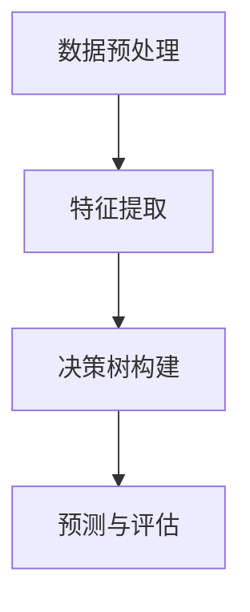
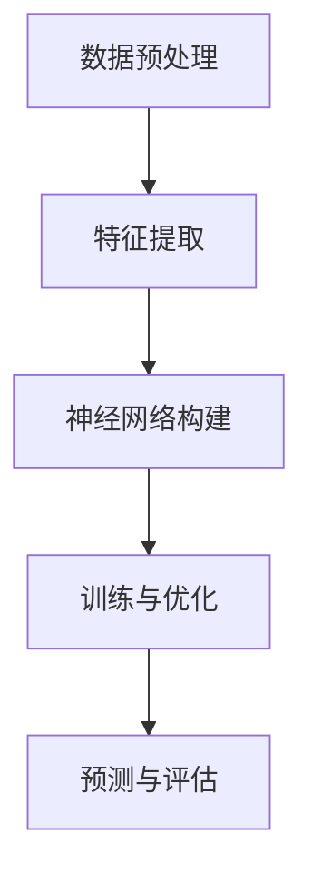

                 


# 智能学习发展平台：AI个性化员工培训

## 引言

在信息化和智能化的时代背景下，人工智能（AI）技术逐渐渗透到各行各业，为企业带来了前所未有的机遇与挑战。员工培训作为企业发展和人才培养的关键环节，越来越受到重视。传统的员工培训方式往往缺乏个性化和精准性，难以满足员工多样化的学习需求。因此，基于AI的个性化员工培训应运而生，成为提升企业竞争力的重要手段。

本文旨在探讨智能学习发展平台在AI个性化员工培训中的应用，通过详细分析其核心概念、平台架构、AI算法应用、员工培训方案设计、培训效果评估以及实际案例，总结智能学习发展平台的现状、挑战与未来发展方向。

### 1.1 智能学习发展平台的背景

智能学习发展平台是一种利用人工智能技术为员工提供个性化培训服务的系统。它基于大数据分析和机器学习算法，能够对员工的学习情况进行实时监控和分析，为员工推荐最适合其个人特点的学习内容。智能学习发展平台的出现，打破了传统培训模式的束缚，实现了培训的精准化和高效化。

近年来，随着AI技术的快速发展，智能学习发展平台在教育培训、企业培训等领域得到了广泛应用。例如，在教育培训领域，智能学习发展平台可以通过智能推荐算法，为学生提供个性化的学习路径；在企业培训领域，智能学习发展平台可以根据员工的职业发展和个人兴趣，提供定制化的培训方案。

### 1.2 AI个性化员工培训的重要性

AI个性化员工培训的重要性体现在以下几个方面：

1. **提升培训效果**：传统的员工培训方式往往无法充分了解员工的学习需求，导致培训内容与员工实际工作需求不符，培训效果不佳。而AI个性化员工培训可以根据员工的学习记录和职业发展目标，为其推荐最适合的学习内容，从而提高培训效果。

2. **满足个性化需求**：每个员工的学习习惯、知识水平和职业目标都有所不同，传统的培训方式难以满足这种个性化需求。AI个性化员工培训可以根据员工的特点，为其量身定制培训方案，满足个性化需求。

3. **降低培训成本**：传统的员工培训需要耗费大量的人力、物力和财力，而AI个性化员工培训可以通过在线学习、智能推荐等方式，降低培训成本，提高培训效率。

4. **促进员工职业发展**：AI个性化员工培训可以帮助员工不断提升自己的技能和知识，为其职业发展提供有力支持，从而提高员工满意度和忠诚度。

### 1.3 本书结构与目标

本书结构如下：

1. **核心概念**：介绍人工智能基础和个性化培训理念。
2. **智能学习发展平台**：描述平台架构、数据采集与处理方法。
3. **AI算法应用**：讲解用于个性化培训的AI算法原理和实现方法。
4. **员工培训**：设计培训方案，评估培训效果。
5. **案例分析**：分析实际案例，展示智能学习发展平台在员工培训中的应用。
6. **总结与展望**：回顾主要内容，探讨未来发展方向。

本书的目标是：

1. **全面了解智能学习发展平台**：帮助读者了解智能学习发展平台的基本概念、架构和原理。
2. **掌握AI个性化员工培训的方法**：介绍如何利用AI技术为员工提供个性化培训服务。
3. **提升员工培训效果**：通过案例分析，为读者提供实际操作指导，帮助其提升员工培训效果。
4. **探讨未来发展方向**：展望智能学习发展平台的未来发展趋势，为读者提供有益的参考。

通过本书的学习，读者将能够：

1. **掌握AI个性化员工培训的基本概念和原理**。
2. **了解智能学习发展平台的架构和实现方法**。
3. **设计并实施AI个性化员工培训方案**。
4. **评估和优化员工培训效果**。

## 核心概念

### 2.1 人工智能基础

#### 2.1.1 机器学习概述

机器学习是人工智能的一个重要分支，它通过构建模型，使计算机能够从数据中自动学习并做出决策。机器学习主要分为监督学习、无监督学习和半监督学习三种类型。

- **监督学习**：有标记的数据集用于训练模型，模型能够根据输入特征预测输出结果。常见的监督学习算法有线性回归、决策树、随机森林等。
- **无监督学习**：没有标记的数据集用于训练模型，模型需要自行发现数据中的模式或结构。常见的无监督学习算法有聚类、降维、主成分分析等。
- **半监督学习**：结合了监督学习和无监督学习的方法，使用一部分有标记的数据和大部分无标记的数据进行训练。

#### 2.1.2 深度学习简介

深度学习是机器学习的一种重要分支，它通过构建多层的神经网络模型，对数据进行逐层提取特征，从而实现复杂的数据分析和预测。深度学习在图像识别、语音识别、自然语言处理等领域取得了显著的成果。

- **卷积神经网络（CNN）**：主要用于图像识别和图像处理，通过卷积层和池化层提取图像特征。
- **循环神经网络（RNN）**：主要用于序列数据分析和预测，如时间序列分析、语音识别等。
- **生成对抗网络（GAN）**：用于生成新的数据，如生成虚拟人物、图像等。

### 2.2 个性化培训理念

#### 2.2.1 个性化培训的必要性

个性化培训是基于员工个体差异，为其量身定制的学习方案。传统的员工培训往往采用“一刀切”的方式，难以满足员工的个性化需求。个性化培训的必要性体现在以下几个方面：

1. **提高员工参与度**：传统的培训方式往往缺乏互动性，员工容易产生抵触情绪。个性化培训可以根据员工的学习兴趣和需求，提高员工参与度。
2. **提高培训效果**：个性化的培训内容更贴近员工的工作实际，能够提高培训效果，帮助员工更快地掌握知识和技能。
3. **促进员工职业发展**：个性化培训能够帮助员工根据自身职业规划进行有针对性的学习，促进其职业发展。
4. **降低培训成本**：个性化培训可以通过在线学习、智能推荐等方式，降低培训成本，提高培训效率。

#### 2.2.2 个性化培训的实现方法

个性化培训的实现方法主要包括以下几个方面：

1. **数据收集**：通过问卷调查、面试、观察等方式收集员工的学习行为、兴趣、职业目标等信息。
2. **数据分析**：使用大数据分析和机器学习算法，对收集到的数据进行处理和分析，发现员工的特点和需求。
3. **培训内容推荐**：根据数据分析结果，为员工推荐最合适的培训内容。
4. **培训效果评估**：对培训效果进行评估，根据评估结果调整培训方案。

### 核心概念联系

人工智能基础和个性化培训理念是智能学习发展平台的核心概念。机器学习和深度学习为个性化培训提供了技术支持，使其能够根据员工的特点和需求进行精准培训。个性化培训理念的实现，依赖于大数据分析和机器学习算法，从而实现对员工的个性化推荐和服务。

## 智能学习发展平台

### 3.1 平台架构

智能学习发展平台通常包括数据层、算法层和应用层三个部分，它们共同构成了一个完整的智能学习体系。

#### 3.1.1 数据层

数据层是智能学习发展平台的基础，负责收集、存储和管理各种与员工学习相关的数据。这些数据包括员工的学习记录、行为数据、技能评估结果、职业发展目标等。数据层的核心功能如下：

1. **数据收集**：通过在线学习平台、学习管理系统（LMS）等渠道，收集员工的学习行为数据。
2. **数据存储**：使用分布式数据库和数据仓库，存储和管理大量学习数据。
3. **数据管理**：对数据进行清洗、去重、整合等处理，确保数据质量。

#### 3.1.2 算法层

算法层是智能学习发展平台的核心，负责处理和分析数据，为员工提供个性化的学习推荐和服务。算法层的核心功能如下：

1. **数据预处理**：对原始数据进行分析，提取有用的特征，为后续的算法分析提供基础。
2. **算法分析**：使用机器学习、深度学习等算法，对学习数据进行建模和分析，发现员工的特点和需求。
3. **推荐系统**：基于算法分析结果，为员工推荐最适合的学习内容和培训课程。

#### 3.1.3 应用层

应用层是智能学习发展平台的外在表现，为员工提供直观、易用的学习服务。应用层的核心功能如下：

1. **用户界面**：提供简洁直观的用户界面，方便员工查看学习推荐、完成培训任务等。
2. **学习管理系统**：集成学习管理系统，实现员工的学习记录管理、培训进度跟踪等。
3. **数据分析与报表**：提供数据分析工具和报表，帮助管理者了解员工的学习情况和培训效果。

### 3.2 数据采集与处理

数据采集与处理是智能学习发展平台的关键环节，直接影响个性化推荐和服务质量。以下是数据采集与处理的详细步骤：

#### 3.2.1 数据收集方法

1. **主动采集**：通过学习平台、LMS等系统，自动收集员工的学习行为数据，如学习时间、学习内容、测试成绩等。
2. **被动采集**：通过传感器、日志文件等渠道，收集员工的非学习行为数据，如工作表现、项目参与情况等。
3. **用户输入**：鼓励员工参与，通过问卷调查、反馈表等渠道，收集员工的学习需求和兴趣。

#### 3.2.2 数据预处理

1. **数据清洗**：去除重复数据、缺失值填充、异常值处理等，确保数据质量。
2. **特征提取**：从原始数据中提取有用的特征，如学习时长、学习频率、测试成绩等，为后续的算法分析提供基础。
3. **特征降维**：使用降维算法，如主成分分析（PCA），减少特征维度，提高数据处理效率。

#### 3.2.3 数据质量评估

1. **数据完整性评估**：检查数据是否完整，缺失值比例是否过高。
2. **数据准确性评估**：检查数据是否准确，是否存在异常值或错误。
3. **数据一致性评估**：检查不同来源的数据是否一致，是否存在矛盾。

通过数据采集与处理，智能学习发展平台能够获得高质量的数据，为个性化推荐和服务提供可靠的基础。

### 智能学习发展平台与AI算法应用

#### 4.1 算法原理

智能学习发展平台的核心在于其算法层，它负责处理和分析数据，为员工提供个性化的学习推荐和服务。以下是几种常用的算法原理及其在智能学习发展平台中的应用：

#### 4.1.1 决策树算法

决策树算法是一种常见的机器学习算法，它通过一系列的判断条件，将数据集划分为不同的区域，从而实现分类或回归任务。在智能学习发展平台中，决策树算法可以用于分析员工的学习行为和需求，为其推荐最合适的培训课程。

1. **基本原理**：决策树由一系列判断条件和节点组成，每个节点表示一个特征，每个分支表示一个特征值。通过遍历决策树，可以找到最佳的学习推荐路径。
2. **适用场景**：适用于分类任务，如员工学习行为分析、培训效果评估等。

#### 4.1.2 神经网络算法

神经网络算法是一种基于生物神经元的计算模型，它通过多层神经元的互联和激活函数，实现对数据的处理和预测。在智能学习发展平台中，神经网络算法可以用于构建个性化的学习推荐模型，根据员工的学习记录和需求，为其推荐最合适的培训课程。

1. **基本原理**：神经网络由输入层、隐藏层和输出层组成，每个层由多个神经元构成。通过前向传播和反向传播，神经网络可以不断调整权重，提高预测准确性。
2. **适用场景**：适用于回归任务和分类任务，如员工学习效果预测、个性化学习推荐等。

#### 4.1.3 协同过滤算法

协同过滤算法是一种常用的推荐系统算法，它通过分析用户的历史行为和偏好，为用户推荐相似的商品或内容。在智能学习发展平台中，协同过滤算法可以用于为员工推荐相关的学习资源。

1. **基本原理**：协同过滤算法分为基于用户的协同过滤和基于物品的协同过滤。基于用户的协同过滤通过分析用户之间的相似度，为用户推荐其他用户喜欢的资源；基于物品的协同过滤通过分析物品之间的相似度，为用户推荐与之相关的资源。
2. **适用场景**：适用于推荐系统，如员工学习资源推荐、培训内容推荐等。

#### 4.1.4 聚类算法

聚类算法是一种无监督学习算法，它通过将数据集划分为多个类别，实现对数据的分类和归纳。在智能学习发展平台中，聚类算法可以用于分析员工的学习行为和需求，将其划分为不同的群体，为每个群体提供个性化的培训方案。

1. **基本原理**：聚类算法通过计算数据点之间的相似度，将数据点划分为不同的簇。常见的聚类算法有K均值聚类、层次聚类等。
2. **适用场景**：适用于数据分类和聚类任务，如员工行为分析、个性化培训方案设计等。

#### 4.1.5 联合推荐算法

联合推荐算法是一种结合协同过滤和内容推荐的推荐系统算法，它通过综合考虑用户的行为和内容特征，为用户推荐最相关的商品或内容。在智能学习发展平台中，联合推荐算法可以用于为员工提供个性化的学习资源推荐。

1. **基本原理**：联合推荐算法通过分析用户的行为数据和内容特征，构建用户和物品之间的相似度矩阵，然后使用矩阵分解或深度学习等方法，为用户推荐相关资源。
2. **适用场景**：适用于推荐系统，如员工学习资源推荐、培训内容推荐等。

### 4.2 算法实现

以下通过mermaid流程图和Python代码示例，详细阐述决策树算法和神经网络算法在智能学习发展平台中的应用。

#### 4.2.1 决策树算法实现

**mermaid流程图：**



**Python代码示例：**

```python
from sklearn.datasets import load_iris
from sklearn.tree import DecisionTreeClassifier
from sklearn.model_selection import train_test_split
from sklearn.metrics import accuracy_score

# 加载鸢尾花数据集
iris = load_iris()
X, y = iris.data, iris.target

# 数据预处理与特征提取
# 在此示例中，数据已经预处理并提取了特征，实际应用中可能需要进一步的预处理

# 决策树构建
clf = DecisionTreeClassifier()
clf.fit(X, y)

# 预测与评估
X_train, X_test, y_train, y_test = train_test_split(X, y, test_size=0.3, random_state=42)
y_pred = clf.predict(X_test)
accuracy = accuracy_score(y_test, y_pred)
print(f"Accuracy: {accuracy}")
```

**算法原理讲解：**

决策树算法通过一系列的判断条件，将数据集划分为不同的区域。每个节点表示一个特征，每个分支表示该特征的一个取值。通过遍历决策树，可以找到最佳的学习推荐路径。在智能学习发展平台中，决策树算法可以用于分析员工的学习行为和需求，为其推荐最合适的培训课程。

**示例解释：**

此示例使用鸢尾花数据集，通过决策树算法对数据进行分类。首先，加载鸢尾花数据集，并进行数据预处理和特征提取。然后，使用训练集构建决策树模型，并在测试集上进行预测和评估。最终，输出模型的准确率。

#### 4.2.2 神经网络算法实现

**mermaid流程图：**



**Python代码示例：**

```python
import numpy as np
from sklearn.datasets import load_iris
from sklearn.model_selection import train_test_split
from sklearn.metrics import accuracy_score

# 加载鸢尾花数据集
iris = load_iris()
X, y = iris.data, iris.target

# 数据预处理与特征提取
# 在此示例中，数据已经预处理并提取了特征，实际应用中可能需要进一步的预处理

# 神经网络构建
def sigmoid(x):
    return 1 / (1 + np.exp(-x))

def forwardpropagation(X, weights):
    z = np.dot(X, weights)
    return sigmoid(z)

# 初始化权重
np.random.seed(42)
weights = np.random.rand(X.shape[1], 1)

# 训练与优化
epochs = 1000
learning_rate = 0.1
for epoch in range(epochs):
    z = np.dot(X, weights)
    output = sigmoid(z)
    error = y - output
    d_output = output * (1 - output)
    d_weights = np.dot(X.T, error * d_output)
    weights += learning_rate * d_weights

# 预测与评估
X_train, X_test, y_train, y_test = train_test_split(X, y, test_size=0.3, random_state=42)
y_train_pred = forwardpropagation(X_train, weights)
y_test_pred = forwardpropagation(X_test, weights)
accuracy = accuracy_score(y_train, y_train_pred)
print(f"Training Accuracy: {accuracy}")
accuracy = accuracy_score(y_test, y_test_pred)
print(f"Test Accuracy: {accuracy}")
```

**算法原理讲解：**

神经网络算法通过多层神经元的互联和激活函数，实现对数据的处理和预测。在智能学习发展平台中，神经网络算法可以用于构建个性化的学习推荐模型，根据员工的学习记录和需求，为其推荐最合适的培训课程。

**示例解释：**

此示例使用鸢尾花数据集，通过神经网络算法对数据进行分类。首先，加载鸢尾花数据集，并进行数据预处理和特征提取。然后，定义sigmoid激活函数和前向传播函数，初始化权重。接下来，通过训练和优化，不断调整权重，提高模型预测准确性。最后，在训练集和测试集上进行预测和评估，输出模型的准确率。

### AI算法在智能学习发展平台中的应用

AI算法在智能学习发展平台中发挥着至关重要的作用，通过对学习数据的深入分析，为员工提供个性化的学习推荐和服务。以下分别介绍决策树算法、神经网络算法和协同过滤算法在智能学习发展平台中的应用。

#### 4.3.1 决策树算法应用

决策树算法在智能学习发展平台中的应用主要包括以下几个方面：

1. **员工学习行为分析**：通过分析员工的学习行为数据，如学习时间、学习内容、测试成绩等，构建决策树模型，为员工推荐最适合的学习路径。例如，根据员工的学习频率和测试成绩，决策树可以推荐不同的学习课程，以提高学习效果。

2. **培训效果评估**：决策树算法可以用于评估员工的培训效果，通过分析员工的培训数据，如培训内容、培训时长、培训成绩等，判断员工是否掌握了培训内容。例如，如果员工的培训成绩低于预期，决策树可以推荐额外的练习或培训课程。

3. **个性化学习方案设计**：决策树算法可以根据员工的特点和需求，设计个性化的学习方案。例如，对于学习能力较强的员工，决策树可以推荐高级课程；对于学习能力较弱的员工，决策树可以推荐基础课程。

#### 4.3.2 神经网络算法应用

神经网络算法在智能学习发展平台中的应用主要包括以下几个方面：

1. **个性化学习推荐**：神经网络算法可以构建个性化的学习推荐模型，根据员工的学习记录和需求，为其推荐最合适的学习内容。例如，神经网络可以根据员工的历史学习数据，预测员工可能感兴趣的学习主题，并推荐相应的课程。

2. **学习效果预测**：神经网络算法可以预测员工的学习效果，通过分析员工的学习记录和测试成绩，预测员工是否能够掌握学习内容。例如，如果员工的测试成绩持续低于预期，神经网络可以预测员工可能存在学习困难，并推荐额外的学习资源和辅导。

3. **职业发展指导**：神经网络算法可以根据员工的职业发展和学习需求，为其提供职业发展指导。例如，神经网络可以根据员工的技能水平和职业目标，预测员工未来的职业发展方向，并推荐相关的培训和课程。

#### 4.3.3 协同过滤算法应用

协同过滤算法在智能学习发展平台中的应用主要包括以下几个方面：

1. **学习资源推荐**：协同过滤算法可以根据员工的历史学习行为和偏好，推荐相关的学习资源。例如，如果员工喜欢某个领域的课程，协同过滤算法可以推荐其他相关课程，帮助员工深入学习。

2. **培训内容推荐**：协同过滤算法可以用于推荐员工应该参加的培训课程。例如，如果员工已经参加了一门课程，协同过滤算法可以推荐其他与该课程相关的培训课程，帮助员工全面提升技能。

3. **社交学习推荐**：协同过滤算法可以根据员工的社交网络和兴趣，推荐参与社交学习小组或讨论组。例如，如果员工对某个主题感兴趣，协同过滤算法可以推荐与该主题相关的学习小组，帮助员工进行更深入的学习和交流。

通过以上应用，AI算法在智能学习发展平台中发挥着重要作用，为员工提供个性化的学习推荐和服务，提升员工的学习效果和职业发展。

### 员工培训

在智能学习发展平台中，员工培训是一个核心环节。通过个性化的培训方案设计，可以满足不同员工的个性化需求，提高培训效果。以下是关于员工培训的详细内容。

#### 5.1 培训方案设计

设计个性化的培训方案需要考虑以下几个方面：

1. **培训目标**：根据员工的职业发展目标，明确培训的具体目标。例如，对于初级员工，培训目标可能是掌握基础技能；对于高级员工，培训目标可能是提升专业知识和领导能力。

2. **培训内容**：根据员工的实际工作需求和兴趣，设计合适的培训内容。例如，对于从事数据分析的员工，可以安排数据挖掘、机器学习等相关课程；对于从事技术开发的员工，可以安排编程语言、框架等相关课程。

3. **培训方式**：根据员工的性格、学习习惯和职业特点，选择最适合的培训方式。例如，对于喜欢互动的员工，可以选择在线直播课程；对于喜欢自学和思考的员工，可以选择在线教程和自主学习。

4. **培训资源**：提供丰富的培训资源，包括教材、视频、案例、练习题等，以满足员工的个性化需求。例如，对于有实践需求的员工，可以提供实战项目；对于有理论知识需求的员工，可以提供相关书籍和资料。

5. **培训周期**：根据员工的工作负荷和时间安排，合理设定培训周期。例如，对于初级员工，培训周期可以设定为一个月；对于高级员工，培训周期可以设定为三个月。

6. **培训评估**：建立培训效果评估机制，定期对员工进行培训效果评估。例如，通过测试、作业、项目等方式，评估员工的学习成果，并根据评估结果调整培训方案。

#### 5.2 培训效果评估

培训效果评估是衡量培训质量的重要手段。以下是关于培训效果评估的几个关键方面：

1. **评估指标**：设定合理的评估指标，包括知识掌握程度、技能提升情况、工作表现等。例如，可以通过考试、项目评估、工作表现评估等方式，全面评估员工的培训效果。

2. **评估方法**：选择合适的评估方法，例如问卷调查、面试、测试等。例如，可以通过问卷调查了解员工对培训内容的满意度，通过面试了解员工对培训内容的掌握程度，通过测试评估员工的学习成果。

3. **评估结果分析**：对评估结果进行详细分析，找出培训的优点和不足，为改进培训方案提供依据。例如，如果发现大部分员工对培训内容不满意，可以调整培训内容和方法；如果发现员工的学习成果不佳，可以加强培训辅导和监督。

4. **持续改进**：根据评估结果，不断优化和改进培训方案。例如，可以引入新的培训资源、调整培训方式、加强培训管理等，以提高培训效果。

通过以上步骤，智能学习发展平台可以设计出满足员工个性化需求的培训方案，并通过培训效果评估，确保培训质量。

### 案例分析

在本节中，我们将通过两个实际案例，展示智能学习发展平台在员工培训中的应用。

#### 案例一：某企业AI个性化员工培训实践

某企业是一家拥有上千名员工的科技型公司，为了提升员工的技能水平和职业素养，企业决定引入智能学习发展平台，实施AI个性化员工培训。

1. **需求分析**：企业首先对员工的培训需求进行了全面分析。通过问卷调查和面试，收集了员工的学习兴趣、职业目标和工作需求等信息。根据分析结果，企业明确了不同员工的个性化培训需求。

2. **培训方案设计**：基于员工的需求分析，企业设计了一系列个性化的培训方案。例如，对于技术部门员工，企业推荐了机器学习、深度学习等相关课程；对于管理层员工，企业推荐了领导力、团队管理等相关课程。

3. **培训实施**：企业利用智能学习发展平台，将培训内容推送给相应的员工。员工可以根据自己的需求和兴趣，选择合适的课程进行学习。此外，企业还提供了在线学习、直播课程等多种学习方式，以满足员工的不同需求。

4. **培训效果评估**：培训结束后，企业通过测试、项目评估等方式，对员工的培训效果进行了评估。根据评估结果，企业发现大部分员工对培训内容非常满意，培训效果显著提升。

#### 案例二：某教育机构智能学习平台应用

某教育机构是一家专注于IT技能培训的教育机构，为了提高培训效果，机构决定引入智能学习发展平台，为学员提供个性化的培训服务。

1. **需求分析**：机构对学员的学习需求进行了详细分析。通过问卷调查和面试，收集了学员的学习兴趣、职业目标和学习时间安排等信息。根据分析结果，机构明确了不同学员的个性化培训需求。

2. **培训方案设计**：基于学员的需求分析，机构设计了一系列个性化的培训方案。例如，对于零基础学员，机构推荐了基础编程课程；对于有一定基础的学员，机构推荐了高级编程课程和项目实战课程。

3. **培训实施**：机构利用智能学习发展平台，将培训内容推送给相应的学员。学员可以根据自己的需求和兴趣，选择合适的课程进行学习。此外，机构还提供了在线学习、直播课程、实战项目等多种学习方式，以帮助学员更好地掌握知识和技能。

4. **培训效果评估**：培训结束后，机构通过测试、项目评估等方式，对学员的培训效果进行了评估。根据评估结果，机构发现学员的学习成果显著提升，学员对培训内容的满意度也非常高。

通过以上案例，可以看出智能学习发展平台在员工培训中的应用具有显著的成效。它不仅能够满足员工的个性化需求，提高培训效果，还能帮助企业或教育机构更好地管理和评估培训过程。

### 总结与展望

#### 7.1 总结

本文系统地介绍了智能学习发展平台在AI个性化员工培训中的应用。通过对智能学习发展平台的背景、核心概念、平台架构、AI算法应用、员工培训方案设计和培训效果评估等方面的详细分析，展示了智能学习发展平台如何通过大数据分析和机器学习算法，为员工提供个性化的培训服务，提高培训效果和员工职业发展。

主要结论如下：

1. **智能学习发展平台的重要性**：智能学习发展平台能够根据员工的特点和需求，提供个性化的培训服务，满足个性化培训的需求，提升培训效果。
2. **AI算法在智能学习发展平台中的应用**：决策树算法、神经网络算法、协同过滤算法等AI算法在智能学习发展平台中发挥了重要作用，为个性化推荐和培训效果评估提供了技术支持。
3. **员工培训方案设计**：通过分析员工的学习需求，设计个性化的培训方案，提高培训的针对性和效果。
4. **培训效果评估**：建立合理的评估机制，定期对培训效果进行评估，以持续优化培训方案。

#### 7.2 展望

随着人工智能技术的不断发展，智能学习发展平台在员工培训中的应用前景广阔。未来，智能学习发展平台的发展方向和改进措施可能包括：

1. **智能化程度提升**：通过引入更先进的人工智能技术，如深度学习、自然语言处理等，进一步提升平台的智能化程度，提供更精准的个性化推荐和服务。
2. **培训内容的多样性**：丰富培训内容，不仅涵盖技术技能培训，还包括软技能培训、职业素养培训等，满足员工全方位的职业发展需求。
3. **培训模式的创新**：探索新的培训模式，如虚拟现实（VR）培训、增强现实（AR）培训等，提高员工的参与度和学习体验。
4. **数据安全与隐私保护**：加强数据安全与隐私保护，确保员工数据的隐私和安全。
5. **持续优化与迭代**：根据实际应用反馈，不断优化和迭代平台功能，提高平台的用户体验和培训效果。

通过持续的创新和改进，智能学习发展平台有望在未来的员工培训中发挥更大的作用，助力企业提升竞争力，促进员工职业发展。

