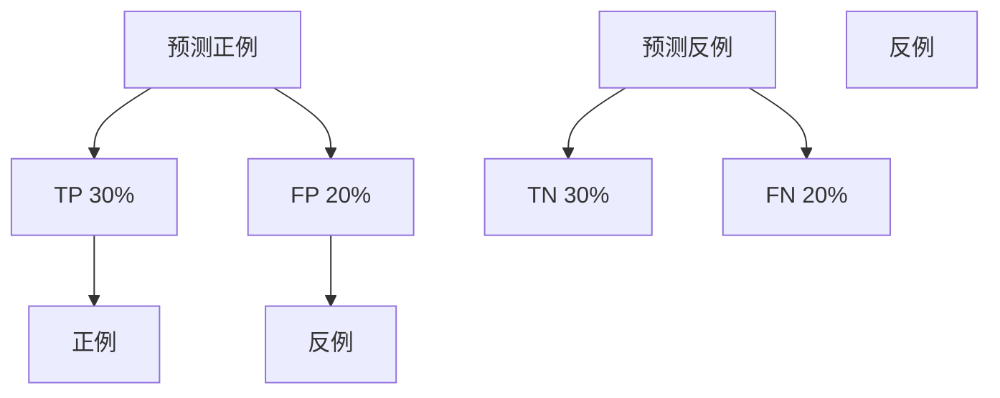
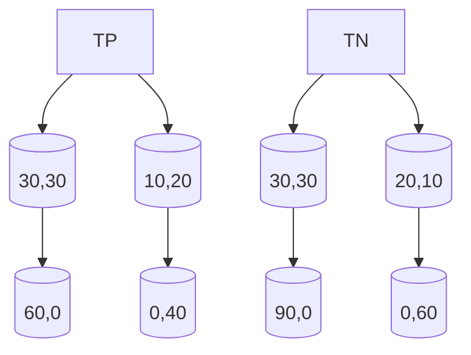

                 

# 智能安全态势感知：AI全面监控风险

> 关键词：智能安全态势感知、AI、风险监控、网络安全、技术实现、案例分析

> 摘要：本文将深入探讨智能安全态势感知的概念、重要性、发展历程和核心技术，详细分析数据采集与处理、特征提取与建模、算法原理与实现、安全态势分析与可视化、系统设计与实现以及项目实战。通过这些章节的逐步解读，帮助读者全面理解智能安全态势感知的工作原理，掌握AI在网络安全中的应用，为构建更安全的数字世界提供有力支持。

### 目录大纲

----------------------------------------------------------------

## 第一部分：引言

### 1.1 智能安全态势感知概述

#### 1.1.1 安全态势感知的概念

#### 1.1.2 智能安全态势感知的重要性

#### 1.1.3 智能安全态势感知的发展历程

#### 1.1.4 智能安全态势感知的核心技术

#### 1.1.5 智能安全态势感知的应用场景

### 1.2 本书结构安排

#### 1.2.1 本书的主要章节内容

#### 1.2.2 各章节之间的联系与逻辑关系

#### 1.2.3 本书的目标读者与适用范围

### 1.3 技术背景与未来展望

#### 1.3.1 智能安全态势感知的技术背景

#### 1.3.2 当前智能安全态势感知的技术发展趋势

#### 1.3.3 智能安全态势感知的未来发展方向

### 1.4 小结

## 第二部分：智能安全态势感知的技术基础

### 2.1 数据采集与处理

#### 2.1.1 数据源类型

#### 2.1.2 数据采集方法

#### 2.1.3 数据质量评估

#### 2.2 数据预处理

#### 2.3 数据存储与管理

## 3.1 特征提取与建模

#### 3.1.1 特征选择方法

#### 3.1.2 特征工程实践

#### 3.1.3 特征提取算法

#### 3.2 模型构建

#### 3.2.1 模型选择

#### 3.2.2 模型评估

#### 3.2.3 模型优化

## 4.1 算法原理与实现

#### 4.1.1 算法概述

#### 4.1.2 算法原理详解

#### 4.1.3 算法实现与代码示例

## 5.1 安全态势分析与可视化

#### 5.1.1 安全态势分析流程

#### 5.1.2 安全态势分析指标

#### 5.1.3 安全事件关联分析

#### 5.2 可视化技术

#### 5.3 安全态势可视化实践

## 6.1 智能安全态势感知系统设计

#### 6.1.1 系统需求分析

#### 6.1.2 系统架构设计

#### 6.1.3 系统接口设计

#### 6.1.4 系统交互设计

## 7.1 项目实战

#### 7.1.1 项目背景

#### 7.1.2 系统实现

#### 7.1.3 实际案例分析与讲解

#### 7.1.4 项目小结

## 8.1 拓展与展望

#### 8.1.1 智能安全态势感知的新技术

----------------------------------------------------------------

## 第一部分：引言

### 1.1 智能安全态势感知概述

#### 1.1.1 安全态势感知的概念

安全态势感知（Security Situational Awareness，简称SSA）是指通过监控和分析网络系统的安全状态，实时了解潜在的安全威胁和风险，从而采取相应的防护措施。安全态势感知的核心在于对安全事件的理解、关联和预测，以便在发生安全事件时及时响应。

#### 1.1.2 智能安全态势感知的重要性

随着互联网的普及和业务系统的不断复杂化，网络安全威胁日益增多，传统的安全防护手段难以应对复杂多变的安全态势。智能安全态势感知通过引入人工智能技术，能够实现实时监控、自动化响应和预测性分析，大幅提升网络安全防护能力。

- **实时监控**：智能安全态势感知系统能够实时收集和分析网络数据，迅速发现异常行为和潜在威胁。
- **自动化响应**：系统可以根据预设的规则和模型自动采取防护措施，减少人工干预。
- **预测性分析**：通过对历史数据和当前态势的分析，系统可以预测潜在的安全事件，提前采取预防措施。

#### 1.1.3 智能安全态势感知的发展历程

智能安全态势感知技术起源于传统的网络安全监控和事件响应系统。随着大数据、云计算和人工智能等技术的发展，安全态势感知技术逐渐走向智能化。

- **早期阶段**：主要依靠规则匹配和日志分析，手动处理安全事件。
- **发展阶段**：引入机器学习算法，实现自动化事件关联和威胁预测。
- **智能化阶段**：结合深度学习和自然语言处理技术，实现更高级别的智能分析和决策。

#### 1.1.4 智能安全态势感知的核心技术

智能安全态势感知技术的实现依赖于多种技术的融合，包括数据采集与处理、特征提取与建模、算法原理与实现、安全态势分析与可视化等。

- **数据采集与处理**：系统需要收集来自不同源的数据，包括网络流量、日志、配置文件等，并进行预处理和存储。
- **特征提取与建模**：通过提取关键特征，构建用于分析和预测的模型。
- **算法原理与实现**：采用各种机器学习和深度学习算法，实现对数据的分析和处理。
- **安全态势分析与可视化**：对分析结果进行综合评估和可视化，帮助安全专家快速理解当前的安全态势。

#### 1.1.5 智能安全态势感知的应用场景

智能安全态势感知技术可以应用于各种网络安全场景，包括但不限于：

- **企业网络安全**：实时监控企业内部网络，识别和防范内部和外部威胁。
- **金融行业安全**：对金融交易进行实时监控，防范欺诈行为和资金流失。
- **公共网络安全**：保障公共场所的网络系统安全，防止网络攻击和恶意行为。
- **物联网安全**：监控物联网设备，识别潜在的安全漏洞和异常行为。

#### 1.2 本书结构安排

本书分为八个主要章节，系统地介绍了智能安全态势感知的概念、技术基础、算法原理、系统设计、项目实战等内容。

- **第一部分**：引言，介绍智能安全态势感知的概念、重要性、发展历程和应用场景。
- **第二部分**：智能安全态势感知的技术基础，包括数据采集与处理、特征提取与建模、算法原理与实现。
- **第三部分**：安全态势分析与可视化，介绍安全态势分析的方法和可视化技术。
- **第四部分**：智能安全态势感知系统设计，详细讲解系统需求分析、架构设计、接口设计和交互设计。
- **第五部分**：项目实战，通过具体案例介绍智能安全态势感知系统的实现和应用。

#### 1.2.1 本书的主要章节内容

- **第1章**：引言
  - 介绍智能安全态势感知的概念、重要性、发展历程和应用场景。
- **第2章**：数据采集与处理
  - 详细讲解数据采集、预处理、存储和管理的方法。
- **第3章**：特征提取与建模
  - 介绍特征提取的方法、特征工程实践和特征提取算法。
- **第4章**：算法原理与实现
  - 详细讲解算法原理、数学模型和公式，以及算法实现和代码示例。
- **第5章**：安全态势分析与可视化
  - 介绍安全态势分析的流程、指标和事件关联分析，以及可视化技术的原理和应用。
- **第6章**：智能安全态势感知系统设计
  - 详细讲解系统需求分析、架构设计、接口设计和交互设计。
- **第7章**：项目实战
  - 通过具体案例介绍智能安全态势感知系统的实现和应用。
- **第8章**：拓展与展望
  - 探讨智能安全态势感知的新技术和未来发展方向。

#### 1.2.2 各章节之间的联系与逻辑关系

本书各章节之间紧密联系，形成一个完整的体系。

- **第一部分**：引言，为后续内容提供背景和基础。
- **第二部分**：技术基础，介绍了智能安全态势感知的核心技术和实现方法。
- **第三部分**：安全态势分析与可视化，是技术基础的具体应用。
- **第四部分**：系统设计，介绍了如何将技术应用于实际系统。
- **第五部分**：项目实战，通过具体案例展示了系统设计的应用效果。

#### 1.2.3 本书的目标读者与适用范围

本书适合以下读者群体：

- **网络安全从业人员**：通过本书，读者可以深入了解智能安全态势感知的技术原理和应用实践，提升网络安全防护能力。
- **人工智能开发者**：本书介绍了智能安全态势感知的关键技术，包括数据采集、特征提取、算法实现等，适合从事人工智能开发的读者学习。
- **高校师生**：本书可以作为计算机科学、网络安全、人工智能等相关专业的研究生教材或参考书。

#### 1.3 技术背景与未来展望

##### 1.3.1 智能安全态势感知的技术背景

智能安全态势感知技术的发展受到以下几个方面的影响：

- **大数据技术**：大数据技术的普及使得海量数据的存储、处理和分析成为可能，为智能安全态势感知提供了数据基础。
- **云计算技术**：云计算技术提供了强大的计算能力和灵活的资源分配，使得智能安全态势感知系统的部署和运行更加高效。
- **人工智能技术**：人工智能技术的发展，特别是机器学习和深度学习算法的成熟，为智能安全态势感知提供了智能分析工具。

##### 1.3.2 当前智能安全态势感知的技术发展趋势

当前智能安全态势感知技术发展趋势主要体现在以下几个方面：

- **智能化水平提升**：随着人工智能技术的不断发展，智能安全态势感知系统的智能化水平将不断提高，能够实现更精准的威胁检测和预测。
- **跨领域融合**：智能安全态势感知技术将与物联网、区块链、边缘计算等技术进行融合，形成更全面的网络安全防护体系。
- **自动化响应**：智能安全态势感知系统将实现更高级别的自动化响应，减少人工干预，提高响应速度。

##### 1.3.3 智能安全态势感知的未来发展方向

未来智能安全态势感知的发展方向包括：

- **个性化安全防护**：通过分析用户行为和习惯，实现个性化的安全防护策略。
- **动态自适应**：系统能够根据实时态势动态调整安全策略，提高防护效果。
- **跨境协作**：在全球化的背景下，智能安全态势感知系统将实现跨地区、跨平台的协作，形成更强大的防护网络。

#### 1.4 小结

本章作为引言，系统地介绍了智能安全态势感知的概念、重要性、发展历程和应用场景，并阐述了本书的结构安排、目标读者和适用范围。接下来，本书将逐步深入探讨智能安全态势感知的技术基础、算法原理、系统设计、项目实战等内容，帮助读者全面了解这一领域。随着技术的不断发展，智能安全态势感知将在网络安全领域发挥越来越重要的作用。

## 第二部分：智能安全态势感知的技术基础

### 2.1 数据采集与处理

#### 2.1.1 数据源类型

在智能安全态势感知系统中，数据采集是关键的第一步。数据源类型决定了系统获取的数据质量和数量，常见的数据源类型包括：

1. **网络流量数据**：包括进出网络的流量、端口流量、协议类型等信息，是分析网络攻击和异常行为的重要数据源。
2. **日志数据**：包括操作系统日志、网络设备日志、应用程序日志等，反映了系统的运行状态和异常情况。
3. **配置文件**：包括网络设备配置、操作系统配置等，提供了系统的初始设置和安全策略信息。
4. **网络设备状态**：包括路由器、交换机、防火墙等网络设备的实时状态信息。
5. **安全设备数据**：包括入侵检测系统（IDS）、入侵防御系统（IPS）、安全信息与事件管理（SIEM）系统等的安全事件信息。

#### 2.1.2 数据采集方法

数据采集方法通常包括以下几种：

1. **被动采集**：通过监听网络流量，捕获网络数据包，不需要修改网络结构和设备配置。常见工具如Wireshark、Bro等。
2. **主动采集**：通过发送特定的探测请求，获取目标系统的响应数据。例如，使用Nmap进行端口扫描。
3. **日志收集**：通过定期收集日志文件，将日志数据传输到集中存储系统。常见工具有Logstash、Fluentd等。
4. **API接口**：通过网络设备的API接口，实时获取设备状态和数据。例如，使用SNMP协议获取网络设备的统计信息。

#### 2.1.3 数据质量评估

数据质量是智能安全态势感知系统的关键因素。数据质量评估通常包括以下几个方面：

1. **完整性**：数据是否完整，是否缺失关键信息。
2. **准确性**：数据是否真实反映系统状态，是否有错误或误导性信息。
3. **一致性**：数据在不同时间和不同数据源之间是否一致。
4. **及时性**：数据是否及时采集和更新，以反映当前态势。
5. **可靠性**：数据来源是否可靠，数据传输过程中是否受到干扰或篡改。

数据质量评估方法包括：

- **统计分析**：使用统计方法分析数据分布和趋势，判断数据质量。
- **比对验证**：通过比对不同数据源的数据，验证数据的准确性和一致性。
- **可视化检查**：通过数据可视化工具，直观检查数据的质量和异常情况。

#### 2.2 数据预处理

数据预处理是数据采集后的重要步骤，其目的是提高数据质量和方便后续分析。数据预处理通常包括以下任务：

1. **数据清洗**：去除重复数据、无效数据和错误数据，保证数据的一致性和准确性。
2. **数据集成**：将来自不同源的数据进行整合，形成一个统一的数据视图。常见方法包括合并、连接、聚合等。
3. **数据转换**：将数据转换为适合分析和建模的格式，例如数值化、归一化等。
4. **数据归一化**：通过将数据缩放到相同的范围，消除不同特征之间的量级差异，提高算法的鲁棒性。

#### 2.3 数据存储与管理

数据存储与管理是智能安全态势感知系统的基础。数据存储与管理通常包括以下几个方面：

1. **数据库选择**：根据数据量和查询需求，选择合适的数据库系统，如关系型数据库（MySQL、PostgreSQL）、NoSQL数据库（MongoDB、Cassandra）等。
2. **数据模型设计**：设计合适的数据模型，以支持高效的查询和分析。常见方法包括实体关系模型、键-值模型、文档模型等。
3. **数据安全管理**：确保数据的安全和隐私，包括数据加密、访问控制、备份与恢复等。
4. **数据备份与恢复**：定期备份数据，确保在数据丢失或损坏时能够恢复。
5. **性能优化**：优化数据库性能，包括索引设计、查询优化、缓存机制等。

### 2.1 数据采集与处理

#### 2.1.1 数据源类型

在智能安全态势感知系统中，数据采集是关键的第一步。数据源类型决定了系统获取的数据质量和数量，常见的网络数据源类型包括：

1. **网络流量数据**：网络流量数据是指通过网络接口捕获的数据包信息，包括源IP地址、目的IP地址、端口号、协议类型、数据包大小等。这些数据可以反映网络的使用情况、流量模式以及潜在的安全威胁。网络流量数据通常是实时监测和收集的，是分析网络攻击和异常行为的重要依据。

2. **日志数据**：日志数据包括操作系统日志、网络设备日志、应用系统日志等。操作系统日志记录了系统运行过程中的各种事件，如启动、关闭、错误等；网络设备日志记录了网络设备的工作状态，如连接、断开、流量统计等；应用系统日志记录了应用程序的运行情况，如登录、访问、错误等。日志数据是发现异常行为和系统故障的重要来源。

3. **配置文件**：配置文件是系统的初始设置和安全策略信息，包括网络设备配置、操作系统配置、防火墙规则等。配置文件可以反映系统的初始状态和安全策略，有助于分析系统配置错误和安全漏洞。

4. **网络设备状态**：网络设备状态包括路由器、交换机、防火墙等网络设备的实时状态信息，如IP地址、MAC地址、接口状态、流量统计等。网络设备状态数据可以反映网络设备的运行情况，对于监控网络性能和识别潜在的安全威胁具有重要意义。

5. **安全设备数据**：安全设备数据包括入侵检测系统（IDS）、入侵防御系统（IPS）、安全信息与事件管理（SIEM）系统等的安全事件信息。这些设备会实时监测网络流量和系统日志，识别潜在的安全威胁并生成事件记录。安全设备数据是分析网络安全态势和制定防护策略的重要依据。

#### 2.1.2 数据采集方法

智能安全态势感知系统需要采用多种方法来采集不同类型的数据源，以确保全面、准确地获取信息。以下是几种常见的数据采集方法：

1. **被动采集**：被动采集是通过在网络中放置监听设备，实时捕获网络数据包，不主动发送数据请求。这种方法适用于大规模网络流量监测和异常行为分析。常用的被动采集工具包括Wireshark、Bro、PCAP等。Wireshark是一款功能强大的网络协议分析工具，可以捕获并分析网络数据包，从而提取有用信息。Bro是一款基于开源编程语言的网络安全分析工具，它可以对捕获的数据包进行深度分析，识别网络攻击和异常行为。

2. **主动采集**：主动采集是通过发送特定的探测请求，获取目标系统的响应数据。这种方法适用于对特定目标进行详细分析，如端口扫描、漏洞扫描等。常用的主动采集工具包括Nmap、Masscan等。Nmap是一款广泛使用的网络扫描工具，它可以发送各种网络探测请求，获取目标系统的开放端口、操作系统版本等信息。Masscan是一款高性能的网络扫描工具，可以在短时间内扫描大量目标，获取详细的网络信息。

3. **日志收集**：日志收集是通过定期收集系统日志文件，将日志数据传输到集中存储系统。这种方法适用于收集和分析各类系统日志，如操作系统日志、网络设备日志、应用系统日志等。常用的日志收集工具包括Logstash、Fluentd等。Logstash是一款开源的数据收集和传输工具，可以收集多种类型的日志数据，并将其传输到Elasticsearch、Kibana等数据分析平台。Fluentd是一款轻量级的日志收集和转发工具，可以将日志数据发送到各种数据存储和分析系统。

4. **API接口**：通过API接口可以实时获取网络设备的状态信息和配置信息。这种方法适用于监控网络设备和配置变更。常用的API接口协议包括SNMP（简单网络管理协议）、RESTful API等。SNMP是一种常用的网络管理协议，可以通过查询网络设备的SNMP代理获取设备的状态信息和统计信息。RESTful API是一种基于HTTP的API接口规范，可以通过发送HTTP请求获取设备的状态和配置信息。

#### 2.1.3 数据质量评估

数据质量是智能安全态势感知系统能否准确、有效地分析和预警的重要保障。评估数据质量通常包括以下几个方面：

1. **完整性**：数据完整性指的是数据是否完整，是否存在缺失或错误。完整性评估可以通过检查数据是否包含所有必要的字段和记录，是否缺少关键信息来判断。例如，网络流量数据是否缺少源IP地址、目的IP地址等关键字段。

2. **准确性**：数据准确性是指数据是否真实、可靠，是否能够准确反映系统的真实状态。准确性评估可以通过比对不同数据源的数据，检查数据的一致性来判断。例如，网络流量数据中的流量统计值是否与网络设备日志中的统计值一致。

3. **一致性**：数据一致性是指不同时间和不同数据源之间数据是否一致，是否存在矛盾或冲突。一致性评估可以通过检查数据在不同时间段和不同数据源之间的变化情况来判断。例如，网络流量数据在不同时间段内是否保持稳定，是否突然出现异常波动。

4. **及时性**：数据及时性是指数据是否能够及时采集和更新，以反映当前系统的实时状态。及时性评估可以通过检查数据采集和传输的时间延迟来判断。例如，网络流量数据是否能够实时捕获和传输，是否存在较大延迟。

5. **可靠性**：数据可靠性是指数据来源是否可靠，数据传输过程中是否受到干扰或篡改。可靠性评估可以通过检查数据来源的合法性和数据传输的完整性来判断。例如，网络流量数据是否来自合法的网络接口，是否在传输过程中受到攻击或篡改。

数据质量评估的方法包括：

- **统计分析**：通过统计分析方法，检查数据的分布、趋势和异常值，评估数据的质量。例如，使用描述性统计量、直方图、箱线图等工具来分析数据。

- **比对验证**：通过比对不同数据源的数据，验证数据的一致性和准确性。例如，将网络流量数据与网络设备日志进行比对，检查流量统计值是否一致。

- **可视化检查**：通过数据可视化工具，直观检查数据的质量和异常情况。例如，使用Elasticsearch和Kibana等工具，将日志数据进行可视化展示，检查数据中的异常值和趋势。

### 2.2 数据预处理

数据预处理是数据采集后的重要步骤，其目的是提高数据质量和方便后续分析。数据预处理通常包括以下任务：

1. **数据清洗**：数据清洗是指去除重复数据、无效数据和错误数据，保证数据的一致性和准确性。重复数据通常是由于数据源之间的数据同步问题导致的，例如，两个不同的系统同时记录了相同的事件，产生了重复的日志条目。无效数据是指不完整或不准确的数据，例如，网络流量数据中缺少关键字段，或日志数据中存在语法错误。错误数据是指明显不合理的或异常的数据，例如，网络流量数据中的流量统计值远大于网络设备的实际带宽。

   数据清洗的方法包括：

   - **去重**：通过比对数据记录的唯一标识，去除重复的数据条目。
   - **填充缺失值**：通过填充缺失值或使用统计方法估算缺失值，使数据完整。
   - **删除异常值**：通过设定阈值或使用统计学方法，识别和删除明显不合理的异常值。

2. **数据集成**：数据集成是指将来自不同源的数据进行整合，形成一个统一的数据视图。数据集成的方法包括：

   - **合并**：将多个数据源中的相同字段进行合并，形成一个综合数据集。
   - **连接**：通过连接操作，将具有相同键字段的数据进行关联，形成一个统一的数据视图。
   - **聚合**：对多个数据源中的数据按特定条件进行聚合，计算总和、平均值、最大值等统计指标。

3. **数据转换**：数据转换是指将数据转换为适合分析和建模的格式。数据转换的方法包括：

   - **数值化**：将分类数据转换为数值型数据，便于后续分析。
   - **归一化**：通过缩放或平移，将数据缩放到相同的范围，消除不同特征之间的量级差异。
   - **标准化**：通过计算数据的标准差和均值，将数据转换为标准正态分布，提高算法的鲁棒性。

4. **数据归一化**：数据归一化是指通过将数据缩放到相同的范围，消除不同特征之间的量级差异。数据归一化的方法包括：

   - **最小-最大缩放**：将数据缩放到[0,1]范围内，公式为 $x' = \frac{x - \min(x)}{\max(x) - \min(x)}$。
   - **Z-Score标准化**：将数据转换为标准正态分布，公式为 $x' = \frac{x - \mu}{\sigma}$，其中 $\mu$ 是均值，$\sigma$ 是标准差。

5. **数据清洗工具**：常见的数据清洗工具有Python的Pandas库、Scala的Apache Spark等。Pandas库提供了丰富的数据处理函数，可以方便地进行数据清洗、转换和归一化操作。Apache Spark是一个分布式数据处理框架，可以处理大规模数据集，支持多种数据清洗和转换操作。

6. **数据质量监控**：在数据预处理过程中，还需要对数据质量进行监控，确保清洗和转换操作的正确性。数据质量监控的方法包括：

   - **异常值检测**：通过设定阈值或使用统计学方法，识别和标记异常值。
   - **数据完整性检查**：检查数据是否完整，是否存在缺失或错误。
   - **数据一致性检查**：检查不同数据源之间的数据是否一致。

### 2.3 数据存储与管理

数据存储与管理是智能安全态势感知系统的关键组成部分，其目的是确保数据的可靠存储、高效访问和有效利用。数据存储与管理包括以下几个方面：

1. **数据库选择**：根据数据量和查询需求，选择合适的数据库系统。常见的数据库系统包括：

   - **关系型数据库**：如MySQL、PostgreSQL、Oracle等。关系型数据库适用于处理结构化数据，支持SQL查询语言，具有较好的数据一致性和事务管理能力。
   - **NoSQL数据库**：如MongoDB、Cassandra、Redis等。NoSQL数据库适用于处理大规模的非结构化或半结构化数据，具有高可扩展性和灵活的存储模型。
   - **时序数据库**：如InfluxDB、TimescaleDB等。时序数据库适用于处理时间序列数据，支持高效的数据写入和查询。

2. **数据模型设计**：设计合适的数据模型，以支持高效的查询和分析。常见的数据模型设计方法包括：

   - **实体关系模型**：通过定义实体和实体之间的关系，构建数据模型。实体关系模型适用于处理复杂的关系型数据。
   - **键-值模型**：通过将数据分为键和值两部分，以键作为索引快速访问数据。键-值模型适用于处理简单的非结构化数据。
   - **文档模型**：通过将数据存储为文档，以JSON或XML格式表示。文档模型适用于处理结构化和半结构化数据。

3. **数据安全管理**：确保数据的安全和隐私，包括数据加密、访问控制、备份与恢复等。常见的数据安全管理措施包括：

   - **数据加密**：通过加密算法对数据进行加密，确保数据在传输和存储过程中不被窃取或篡改。常见的加密算法包括AES、RSA等。
   - **访问控制**：通过设置用户权限和访问控制策略，确保只有授权用户能够访问和操作数据。常见的访问控制机制包括基于角色的访问控制（RBAC）和基于属性的访问控制（ABAC）。
   - **备份与恢复**：通过定期备份数据，确保在数据丢失或损坏时能够恢复。备份策略可以包括全量备份和增量备份，常用的备份工具包括MySQL备份工具、Apache Spark的备份功能等。

4. **性能优化**：优化数据库性能，包括索引设计、查询优化、缓存机制等。性能优化的方法包括：

   - **索引设计**：通过创建适当的索引，加速数据查询和更新操作。常见索引类型包括B树索引、哈希索引等。
   - **查询优化**：通过分析查询语句和执行计划，优化查询性能。常见的查询优化策略包括索引选择、连接优化、子查询优化等。
   - **缓存机制**：通过缓存热点数据，减少数据库的查询压力。常见的缓存工具包括Redis、Memcached等。

5. **数据流处理**：对于实时数据流，需要采用流处理技术进行数据处理和分析。常见的数据流处理框架包括Apache Kafka、Apache Flink、Apache Spark Streaming等。这些框架支持实时数据采集、处理和存储，可以与数据库系统协同工作，实现高效的数据流处理。

### 2.4 数据存储与管理

#### 2.4.1 数据库选择

在智能安全态势感知系统中，选择合适的数据库系统至关重要。不同的数据库系统具有不同的特点和适用场景，以下是一些常见的数据库选择：

1. **关系型数据库**：关系型数据库（如MySQL、PostgreSQL、Oracle等）适用于处理结构化数据，具有以下特点：

   - **数据一致性**：关系型数据库通过事务管理确保数据的一致性，可以保证数据的完整性和准确性。
   - **SQL支持**：关系型数据库支持SQL查询语言，便于数据查询和分析。
   - **丰富的功能**：关系型数据库提供了丰富的数据操作功能，包括数据索引、视图、触发器等。
   - **高可靠性**：关系型数据库具有成熟的备份和恢复机制，确保数据的安全性和可靠性。

   关系型数据库适用于处理大量结构化数据，如用户信息、配置数据等。

2. **NoSQL数据库**：NoSQL数据库（如MongoDB、Cassandra、Redis等）适用于处理大规模的非结构化或半结构化数据，具有以下特点：

   - **高扩展性**：NoSQL数据库采用分布式存储架构，可以水平扩展，处理海量数据。
   - **灵活的 schema**：NoSQL数据库不强制要求固定的数据模式，可以灵活地适应数据变化。
   - **高性能**：NoSQL数据库通常采用内存存储或分布式存储，具有高性能的数据读写能力。

   NoSQL数据库适用于处理日志数据、网络流量数据等非结构化数据。

3. **时序数据库**：时序数据库（如InfluxDB、TimescaleDB等）适用于处理时间序列数据，具有以下特点：

   - **高效写入**：时序数据库设计用于处理大量时间序列数据，具有高效的数据写入能力。
   - **高效查询**：时序数据库采用时间索引和压缩技术，支持快速的数据查询。
   - **数据聚合**：时序数据库支持对时间序列数据进行聚合计算，如求和、平均等。

   时序数据库适用于处理网络流量数据、系统性能数据等时间序列数据。

4. **键-值存储**：键-值存储（如Redis、Memcached等）适用于处理快速读取和写入的小型数据，具有以下特点：

   - **高性能**：键-值存储采用内存存储，具有非常高的读写性能。
   - **数据持久化**：部分键-值存储支持数据持久化，确保数据在系统重启后仍然可用。
   - **丰富的数据结构**：部分键-值存储支持复杂的数据结构，如列表、集合、散列表等。

   键-值存储适用于缓存热点数据和快速读取的数据。

5. **图数据库**：图数据库（如Neo4j、Apache TinkerPop等）适用于处理复杂的关系数据，具有以下特点：

   - **图模型**：图数据库采用图模型存储数据，可以方便地处理复杂的关系。
   - **高效查询**：图数据库支持复杂的图查询操作，如路径查找、社区发现等。
   - **扩展性**：图数据库采用分布式存储和计算架构，支持海量数据的处理。

   图数据库适用于处理社交网络、推荐系统等复杂关系数据。

#### 2.4.2 数据模型设计

在智能安全态势感知系统中，数据模型设计是关键的一步，决定了数据的存储方式和查询效率。以下是一些常见的数据模型设计方法：

1. **实体关系模型**：实体关系模型（Entity-Relationship Model，简称ER模型）是一种广泛使用的数据模型设计方法，适用于处理复杂的关系型数据。ER模型通过定义实体和实体之间的关系，构建数据模型。

   - **实体**：实体是现实世界中具有独立存在的个体，如用户、设备、攻击等。每个实体具有一组属性，如用户ID、用户名、密码等。
   - **关系**：关系是实体之间的关联，如用户与设备之间的关联。关系具有方向和属性，如用户与设备之间的连接时间、连接方式等。

   ER模型通过实体和关系的定义，构建出数据模型的结构，支持复杂的关系查询和数据分析。

2. **键-值模型**：键-值模型是一种简单且灵活的数据模型，适用于处理简单的非结构化数据。在键-值模型中，数据以键-值对的形式存储，每个键唯一标识一个数据项，值是数据的具体内容。

   - **键**：键是数据项的唯一标识，如用户ID、日志条目ID等。
   - **值**：值是数据的具体内容，可以是字符串、数字、列表等。

   键-值模型适用于快速读取和写入小数据量的场景，例如缓存系统、用户配置等。

3. **文档模型**：文档模型是一种灵活的数据模型，适用于处理结构化和半结构化数据。在文档模型中，数据以JSON或XML格式存储，每个文档具有独立的标识和内容。

   - **文档**：文档是一个独立的JSON或XML对象，包含一组属性和值。
   - **集合**：集合是一组文档的集合，可以方便地查询和操作文档。

   文档模型适用于处理用户信息、配置数据等结构化和半结构化数据。

4. **时间序列模型**：时间序列模型是一种专门处理时间序列数据的数据模型，适用于处理网络流量、系统性能等时间序列数据。

   - **时间戳**：时间戳是时间序列数据中的时间点，表示数据发生的时间。
   - **指标**：指标是时间序列数据中的度量值，如流量、延迟等。

   时间序列模型适用于处理大量时间序列数据，支持高效的数据写入和查询。

#### 2.4.3 数据安全管理

在智能安全态势感知系统中，数据安全是至关重要的。数据安全包括数据加密、访问控制、备份与恢复等方面，以下是一些常见的数据安全管理措施：

1. **数据加密**：数据加密是指通过加密算法对数据进行加密，确保数据在传输和存储过程中不被窃取或篡改。常见的数据加密算法包括AES（高级加密标准）、RSA（非对称加密算法）等。数据加密可以分为以下几种方式：

   - **传输加密**：在数据传输过程中使用加密协议，如HTTPS、TLS等，确保数据在网络中传输的安全。
   - **存储加密**：在数据存储过程中使用加密技术，如数据库加密、文件加密等，确保数据在存储介质上的安全。

2. **访问控制**：访问控制是指通过设置用户权限和访问控制策略，确保只有授权用户能够访问和操作数据。常见的访问控制方法包括：

   - **基于角色的访问控制（RBAC）**：根据用户的角色分配权限，角色包括管理员、普通用户等，每个角色具有不同的访问权限。
   - **基于属性的访问控制（ABAC）**：根据用户属性（如部门、职位等）和资源属性（如文件类型、权限等级等）进行访问控制，确保用户只能访问符合其属性的资源。

3. **审计与监控**：审计与监控是指记录系统操作日志和监控数据，及时发现异常行为和潜在威胁。常见的审计与监控方法包括：

   - **操作日志记录**：记录用户操作日志，如登录、修改、删除等，以便于追踪和审计。
   - **安全事件监控**：实时监控系统中的安全事件，如入侵尝试、文件篡改等，及时发出警报和通知。

4. **数据备份与恢复**：数据备份与恢复是指定期备份数据，确保在数据丢失或损坏时能够恢复。常见的数据备份策略包括：

   - **全量备份**：定期备份数据库中的全部数据，确保在数据丢失时能够恢复。
   - **增量备份**：只备份上次备份后发生更改的数据，节省存储空间。
   - **备份存储**：将备份数据存储在远程存储设备上，确保备份数据的安全性和可用性。

5. **数据脱敏**：数据脱敏是指对敏感数据进行处理，确保敏感数据在存储、传输和共享过程中不被泄露。常见的数据脱敏方法包括：

   - **加密脱敏**：对敏感数据使用加密算法进行加密，确保数据在未授权情况下无法解密。
   - **掩码脱敏**：对敏感数据进行部分掩码处理，如只显示部分字符，确保数据部分可见。
   - **伪随机脱敏**：使用伪随机数生成器对敏感数据进行替换，确保数据与现实数据相似但不可恢复。

### 2.4 数据存储与管理

#### 2.4.1 数据库选择

在智能安全态势感知系统中，数据库的选择至关重要，它直接影响系统的性能和可扩展性。以下是几种常见的数据库类型及其特点：

1. **关系型数据库（RDBMS）**：
   - **特点**：关系型数据库（如MySQL、PostgreSQL、Oracle等）通过表格和SQL查询语言来管理数据。它们适合处理结构化数据，并提供事务管理、数据一致性和复杂的查询能力。
   - **适用场景**：对于需要复杂查询、事务管理和数据关系复杂的应用，如用户信息管理、财务系统等。
   - **限制**：随着数据量的增加，关系型数据库的性能可能会下降，且扩展性较差。

2. **NoSQL数据库**：
   - **特点**：NoSQL数据库（如MongoDB、Cassandra、Redis等）适用于处理大量非结构化或半结构化数据。它们通常提供水平扩展能力，可以轻松处理大数据量。
   - **适用场景**：对于需要灵活的数据模型、高读写性能和可扩展性的应用，如日志收集、实时分析、社交网络等。
   - **限制**：NoSQL数据库在复杂查询和数据一致性方面可能不如关系型数据库。

3. **时序数据库**：
   - **特点**：时序数据库（如InfluxDB、TimeScaleDB等）专门用于处理时间序列数据，提供高效的写入和查询性能，以及时间相关的聚合功能。
   - **适用场景**：对于需要实时监控和数据分析的应用，如物联网、股票交易、网络流量分析等。
   - **限制**：时序数据库在处理非时间序列数据时可能不够灵活。

4. **图数据库**：
   - **特点**：图数据库（如Neo4j、JanusGraph等）适用于处理复杂的关系数据，通过图结构来表示实体及其关系。
   - **适用场景**：对于需要分析复杂网络关系、推荐系统和社交网络分析等应用。
   - **限制**：图数据库在处理大量非关系数据时可能不够高效。

5. **键值存储**：
   - **特点**：键值存储（如Redis、Memcached等）提供了快速的数据存储和检索能力，适合处理简单的键值对数据。
   - **适用场景**：对于需要高速缓存和快速读写操作的应用，如会话管理、排行榜等。
   - **限制**：键值存储不适合处理复杂的数据模型和查询。

选择合适的数据库时，应考虑以下因素：

- **数据类型**：确定数据是结构化、半结构化还是非结构化，以及数据的复杂程度。
- **查询需求**：分析系统需要的查询类型和性能要求。
- **扩展性**：考虑系统未来的数据增长和性能需求。
- **维护成本**：评估数据库的维护复杂度和成本。

#### 2.4.2 数据模型设计

数据模型设计是智能安全态势感知系统的核心步骤，它决定了如何组织和存储数据，以支持高效的查询和分析。以下是几种常见的数据模型设计方法：

1. **实体-关系模型（ER模型）**：
   - **概念**：ER模型通过实体和关系来表示数据结构。实体代表具有独立存在的对象，如用户、设备和攻击事件；关系表示实体之间的关系。
   - **应用**：在智能安全态势感知系统中，可以使用ER模型来表示不同的实体，如用户、网络设备、攻击事件等，以及它们之间的关系，如用户与设备之间的关系、攻击事件与网络设备之间的关系。
   - **示例**：ER图如下：

   ```mermaid
   graph TD
   A(用户) --> B(设备)
   B --> C(攻击事件)
   ```

   在这个ER图中，用户与设备之间有一个关联关系，设备与攻击事件之间也有一个关联关系。

2. **面向对象的模型**：
   - **概念**：面向对象模型基于面向对象编程的概念，将数据抽象为对象，每个对象具有属性和方法。
   - **应用**：在智能安全态势感知系统中，可以使用面向对象模型来表示不同的对象，如用户、设备、攻击事件等，每个对象具有特定的属性和方法，以支持各种操作。
   - **示例**：以下是一个简单的面向对象模型示例：

   ```python
   class User:
       def __init__(self, username, password):
           self.username = username
           self.password = password

   class Device:
       def __init__(self, device_id, device_type):
           self.device_id = device_id
           self.device_type = device_type

   class AttackEvent:
       def __init__(self, event_id, event_type, event_time):
           self.event_id = event_id
           self.event_type = event_type
           self.event_time = event_time
   ```

3. **文档模型**：
   - **概念**：文档模型将数据存储为文档，每个文档是一个独立的JSON或XML对象。
   - **应用**：在智能安全态势感知系统中，可以使用文档模型来存储日志、配置文件等数据。
   - **示例**：以下是一个简单的JSON文档示例：

   ```json
   {
       "user": {
           "username": "john_doe",
           "password": "password123"
       },
       "device": {
           "device_id": "device123",
           "device_type": "laptop"
       },
       "attack_event": {
           "event_id": "event456",
           "event_type": "DDoS",
           "event_time": "2023-04-01T12:00:00Z"
       }
   }
   ```

4. **图模型**：
   - **概念**：图模型使用节点和边来表示实体及其关系，适用于处理复杂的关系网络。
   - **应用**：在智能安全态势感知系统中，可以使用图模型来表示用户、设备、攻击事件之间的复杂关系，如社交网络分析。
   - **示例**：以下是一个简单的图模型示例：

   ```mermaid
   graph TB
   A[User] --> B[Device]
   B --> C[AttackEvent]
   ```

   在这个图模型中，用户（A）与设备（B）之间有一个关联，设备（B）与攻击事件（C）之间也有一个关联。

#### 2.4.3 数据安全管理

在智能安全态势感知系统中，数据安全管理至关重要，它关系到系统的安全性和数据的完整性。以下是一些常见的数据安全管理策略和措施：

1. **数据加密**：
   - **传输加密**：使用SSL/TLS等加密协议确保数据在传输过程中不被窃听或篡改。
   - **存储加密**：使用AES等加密算法对存储在数据库中的敏感数据进行加密，防止未授权访问。

2. **访问控制**：
   - **基于角色的访问控制（RBAC）**：根据用户的角色分配权限，确保用户只能访问其角色允许的数据。
   - **基于属性的访问控制（ABAC）**：根据用户的属性（如部门、职位等）和资源的属性（如敏感级别、访问时间等）进行访问控制。

3. **数据备份和恢复**：
   - **定期备份**：定期备份系统数据，防止数据丢失或损坏。
   - **异地备份**：将备份数据存储在远程位置，确保在发生灾难时能够快速恢复。

4. **审计和监控**：
   - **日志记录**：记录系统的操作日志，包括用户访问、数据修改等，便于追踪和审计。
   - **实时监控**：实时监控系统的异常行为和潜在威胁，及时发出警报。

5. **数据脱敏**：
   - **敏感数据识别**：识别系统中的敏感数据，如用户密码、信用卡信息等。
   - **脱敏处理**：对敏感数据进行加密、掩码或替换，确保数据在存储和传输过程中不被泄露。

### 2.5 数据预处理

#### 2.5.1 数据清洗

数据清洗是数据预处理的关键步骤，其目的是去除重复数据、无效数据和错误数据，确保数据的质量。以下是一些常见的数据清洗方法：

1. **去除重复数据**：
   - **方法**：通过比对数据的唯一标识（如用户ID、日志条目ID等），识别并删除重复的数据记录。
   - **示例**：在Python中使用Pandas库去除重复数据：

   ```python
   import pandas as pd

   # 假设df是原始数据框
   df = pd.DataFrame({
       'user_id': [1, 2, 2, 3, 4, 4, 5],
       'username': ['Alice', 'Bob', 'Bob', 'Charlie', 'Dave', 'Dave', 'Eve']
   })

   # 去除重复数据
   df = df.drop_duplicates()
   ```

2. **处理缺失值**：
   - **方法**：根据数据的重要性和缺失值的情况，选择适当的处理方法，如删除缺失值、填充默认值或使用统计方法估算缺失值。
   - **示例**：在Python中使用Pandas库处理缺失值：

   ```python
   # 删除缺失值
   df = df.dropna()

   # 填充默认值
   df['missing_column'] = df['missing_column'].fillna('default_value')

   # 使用统计方法估算缺失值
   df['missing_column'] = df['missing_column'].fillna(df['missing_column'].mean())
   ```

3. **处理异常值**：
   - **方法**：通过设定阈值或使用统计学方法，识别并处理异常值，如离群点、错误数据等。
   - **示例**：在Python中使用Pandas库处理异常值：

   ```python
   # 设定阈值处理异常值
   df = df[(df['column_name'] > threshold_min) & (df['column_name'] < threshold_max)]

   # 使用统计学方法处理异常值
   df = df[df['column_name'].between(df['column_name'].quantile(0.05), df['column_name'].quantile(0.95))]
   ```

#### 2.5.2 数据集成

数据集成是将来自不同源的数据合并成一个统一的数据集的过程。数据集成的方法包括合并、连接和聚合等。以下是一些常见的数据集成方法：

1. **合并**：
   - **方法**：通过将多个数据源中的相同字段进行合并，形成一个综合数据集。
   - **示例**：在Python中使用Pandas库进行合并：

   ```python
   import pandas as pd

   # 假设df1和df2是两个数据框
   df1 = pd.DataFrame({
       'user_id': [1, 2, 3],
       'username': ['Alice', 'Bob', 'Charlie']
   })

   df2 = pd.DataFrame({
       'user_id': [2, 3, 4],
       'user_email': ['alice@example.com', 'bob@example.com', 'charlie@example.com']
   })

   # 合并数据
   df = pd.merge(df1, df2, on='user_id')
   ```

2. **连接**：
   - **方法**：通过连接操作，将具有相同键字段的数据进行关联，形成一个统一的数据视图。
   - **示例**：在Python中使用Pandas库进行连接：

   ```python
   df = df1.merge(df2, left_on='user_id', right_on='user_id', how='left')
   ```

3. **聚合**：
   - **方法**：对多个数据源中的数据按特定条件进行聚合，计算总和、平均值、最大值等统计指标。
   - **示例**：在Python中使用Pandas库进行聚合：

   ```python
   df = df1.groupby('user_id').agg({
       'username': ['count', 'unique'],
       'user_email': ['count', 'unique']
   })
   ```

#### 2.5.3 数据转换

数据转换是将数据转换为适合分析和建模的格式的过程。以下是一些常见的数据转换方法：

1. **数值化**：
   - **方法**：将分类数据转换为数值型数据，便于后续分析。
   - **示例**：在Python中使用Pandas库进行数值化：

   ```python
   df['category_column'] = df['category_column'].astype('category').cat.codes
   ```

2. **归一化**：
   - **方法**：通过缩放或平移，将数据缩放到相同的范围，消除不同特征之间的量级差异。
   - **示例**：在Python中使用Pandas库进行归一化：

   ```python
   from sklearn.preprocessing import MinMaxScaler

   scaler = MinMaxScaler()
   df['numerical_column'] = scaler.fit_transform(df[['numerical_column']])
   ```

3. **标准化**：
   - **方法**：通过计算数据的标准差和均值，将数据转换为标准正态分布，提高算法的鲁棒性。
   - **示例**：在Python中使用Pandas库进行标准化：

   ```python
   df['standardized_column'] = (df['numerical_column'] - df['numerical_column'].mean()) / df['numerical_column'].std()
   ```

### 2.5 数据预处理

#### 2.5.4 数据归一化

数据归一化是数据预处理中的一个重要步骤，其目的是将不同特征的数据缩放到相同的尺度范围内，从而消除特征之间量级差异对模型训练的影响。以下介绍几种常见的数据归一化方法：

1. **最小-最大缩放（Min-Max Scaling）**：
   - **概念**：最小-最大缩放将数据缩放到[0,1]范围内，公式为：
     $$
     x' = \frac{x - \min(x)}{\max(x) - \min(x)}
     $$
   - **优势**：简单且易于实现，适用于特征值范围不需要保留的情况。
   - **示例**：在Python中使用Pandas库进行最小-最大缩放：

   ```python
   df['numerical_column'] = (df['numerical_column'] - df['numerical_column'].min()) / df['numerical_column'].max()
   ```

2. **Z-Score标准化（Standardization）**：
   - **概念**：Z-Score标准化将数据转换为标准正态分布，公式为：
     $$
     x' = \frac{x - \mu}{\sigma}
     $$
     其中 $\mu$ 是均值，$\sigma$ 是标准差。
   - **优势**：数据分布变为标准正态分布，适用于大多数机器学习算法。
   - **示例**：在Python中使用Pandas库进行Z-Score标准化：

   ```python
   df['standardized_column'] = (df['numerical_column'] - df['numerical_column'].mean()) / df['numerical_column'].std()
   ```

3. **Robust Scaling（鲁棒缩放）**：
   - **概念**：Robust Scaling使用第1分位数和第3分位数来缩放数据，公式为：
     $$
     x' = \frac{x - Q_1}{Q_3 - Q_1}
     $$
     其中 $Q_1$ 是第1分位数，$Q_3$ 是第3分位数。
   - **优势**：对异常值不敏感，适用于存在异常值的数据。
   - **示例**：在Python中使用Pandas库进行Robust Scaling：

   ```python
   df['robust_column'] = (df['numerical_column'] - df['numerical_column'].quantile(0.25)) / (df['numerical_column'].quantile(0.75) - df['numerical_column'].quantile(0.25))
   ```

4. **对比变换（Contrast Scaling）**：
   - **概念**：对比变换通过将数据转换为具有零均值和单位方差的分布，公式为：
     $$
     x' = \frac{x - \bar{x}}{\sqrt{\frac{1}{N-1} \sum_{i=1}^{N} (x_i - \bar{x})^2}}
     $$
     其中 $\bar{x}$ 是均值，$N$ 是数据点的数量。
   - **优势**：适用于线性模型，可以减小特征之间的相关度。
   - **示例**：在Python中使用NumPy进行对比变换：

   ```python
   x = df['numerical_column'].values
   mean = np.mean(x)
   std = np.std(x, ddof=1)
   df['contrast_column'] = (x - mean) / std
   ```

通过以上几种数据归一化方法，我们可以选择最适合的方法来处理数据，从而提高模型训练的效果和预测的准确性。

#### 2.5.5 数据清洗工具

数据清洗是数据预处理过程中至关重要的一步，它确保了数据的质量和准确性。以下介绍几种常见的数据清洗工具，包括Python中的Pandas库、Scala中的Apache Spark等。

1. **Pandas库**：
   - **概念**：Pandas是一个强大的Python库，用于数据操作和分析。它提供了丰富的数据清洗功能，包括数据清洗、转换、聚合等。
   - **功能**：
     - **去除重复数据**：使用`drop_duplicates()`方法，可以快速去除重复的数据记录。
     - **处理缺失值**：使用`dropna()`方法可以删除含有缺失值的记录，或者使用`fillna()`方法填充缺失值。
     - **数据转换**：使用`astype()`方法可以将数据类型转换为所需格式，如将字符串转换为数字。
     - **数据筛选**：使用`loc[]`、`iloc[]`等索引方法可以高效地筛选数据。
   - **示例**：
     ```python
     import pandas as pd

     # 去除重复数据
     df = df.drop_duplicates()

     # 填充缺失值
     df = df.fillna({'column_name': 'default_value'})

     # 数据转换
     df['new_column'] = df['original_column'].astype('float')

     # 数据筛选
     filtered_df = df.loc[df['column_name'] > 0]
     ```

2. **Apache Spark**：
   - **概念**：Apache Spark是一个开源的分布式数据处理框架，适用于大规模数据集的处理。它提供了丰富的数据清洗功能，支持批处理和流处理。
   - **功能**：
     - **去除重复数据**：使用`dropDuplicates()`方法，可以去除重复的记录。
     - **处理缺失值**：使用`dropNulls()`方法可以删除含有缺失值的记录，或者使用`fillna()`方法填充缺失值。
     - **数据转换**：使用`toDF()`方法可以将RDD（弹性分布式数据集）转换为DataFrame，从而进行数据清洗和转换。
     - **数据筛选**：使用`filter()`方法可以高效地筛选数据。
   - **示例**：
     ```python
     from pyspark.sql import SparkSession

     # 创建Spark会话
     spark = SparkSession.builder.appName("DataCleaningExample").getOrCreate()

     # 读取数据
     df = spark.read.csv("data.csv", header=True)

     # 去除重复数据
     df = df.dropDuplicates()

     # 填充缺失值
     df = df.na.fill({col: 'default_value' for col in df.columns})

     # 数据转换
     df = df.toDF(*[f"new_{col}" for col in df.columns])

     # 数据筛选
     filtered_df = df.filter(df['column_name'] > 0)

     # 输出结果
     filtered_df.show()
     ```

3. **其他工具**：
   - **OpenRefine**：一个开源的数据清洗工具，适合处理结构化数据，可以批量编辑和清洗数据。
   - **DataWrangler**：一个交互式数据清洗和转换工具，支持多种数据源和数据格式，易于使用。
   - **Talend Open Studio**：一个企业级的数据集成和清洗工具，提供了丰富的数据处理组件和连接器。

通过这些工具，可以有效地进行数据清洗，确保数据的质量和准确性，为后续的分析和建模打下坚实的基础。

### 2.6 数据质量监控

数据质量监控是确保数据质量的重要环节，它涉及数据的完整性、准确性、一致性、及时性和可靠性。以下是一些常见的数据质量监控方法：

1. **数据完整性检查**：
   - **方法**：检查数据是否完整，是否存在缺失值或重复值。
   - **工具**：使用数据清洗工具，如Pandas或Spark，可以快速识别缺失值和重复值。
   - **示例**：
     ```python
     import pandas as pd

     df = pd.DataFrame({
         'column1': [1, 2, np.nan, 4],
         'column2': ['a', 'b', 'b', 'd']
     })

     # 检查缺失值
     missing_values = df.isnull().sum()
     print(missing_values)

     # 检查重复值
     duplicates = df.duplicated().sum()
     print(duplicates)
     ```

2. **数据准确性检查**：
   - **方法**：验证数据是否准确，是否真实反映了系统的实际情况。
   - **工具**：可以使用对比验证方法，将数据与外部数据源进行比对。
   - **示例**：
     ```python
     import pandas as pd

     external_df = pd.DataFrame({
         'column1': [1, 2, 3, 4],
         'column2': ['a', 'b', 'c', 'd']
     })

     df = pd.DataFrame({
         'column1': [1, 2, np.nan, 4],
         'column2': ['a', 'b', 'b', 'd']
     })

     # 对比数据准确性
     df_diff = df[~df.eq(external_df)]
     print(df_diff)
     ```

3. **数据一致性检查**：
   - **方法**：检查数据在不同时间点和不同数据源之间是否一致。
   - **工具**：使用数据集成工具，如Spark，可以合并不同时间点和数据源的数据，并进行一致性检查。
   - **示例**：
     ```python
     import pandas as pd
     import numpy as np

     df1 = pd.DataFrame({
         'column1': [1, 2, 3, 4],
         'column2': ['a', 'b', 'c', 'd']
     })

     df2 = pd.DataFrame({
         'column1': [1, 2, np.nan, 4],
         'column2': ['a', 'b', 'b', 'd']
     })

     # 检查一致性
     df_diff = df1.align(df2, join='inner', axis=1)
     print(df_diff)
     print(np.sum(df_diff.isnull()))
     ```

4. **数据及时性检查**：
   - **方法**：检查数据是否及时更新，以反映当前系统的实时状态。
   - **工具**：可以使用时间戳对比方法，检查数据的更新时间。
   - **示例**：
     ```python
     import pandas as pd

     df = pd.DataFrame({
         'column1': [1, 2, 3, 4],
         'column2': ['a', 'b', 'c', 'd'],
         'timestamp': [pd.Timestamp('2023-01-01'), pd.Timestamp('2023-01-02'), pd.Timestamp('2023-01-03'), pd.Timestamp('2023-01-04')]
     })

     # 检查及时性
     df.sort_values('timestamp', inplace=True)
     print(df['timestamp'].diff().dropna())
     ```

5. **数据可靠性检查**：
   - **方法**：检查数据来源是否可靠，数据在传输和存储过程中是否受到干扰或篡改。
   - **工具**：可以使用加密技术和访问控制方法，确保数据的安全性和可靠性。
   - **示例**：
     ```python
     import pandas as pd
     from cryptography.fernet import Fernet

     key = Fernet.generate_key()
     cipher_suite = Fernet(key)

     df = pd.DataFrame({
         'column1': [1, 2, 3, 4],
         'column2': ['a', 'b', 'c', 'd']
     })

     # 加密数据
     df['column1'] = df['column1'].apply(lambda x: cipher_suite.encrypt(x.encode()))

     # 解密数据
     df['column1'] = df['column1'].apply(lambda x: cipher_suite.decrypt(x).decode())

     # 检查可靠性
     print(df['column1'].value_counts())
     ```

通过以上方法，可以全面监控数据质量，确保数据在智能安全态势感知系统中的可靠性和有效性。

### 2.7 数据质量管理

数据质量管理是确保数据在整个生命周期内满足质量标准的重要过程，它涵盖了数据的收集、存储、处理、分析和应用。以下是一些常见的数据质量管理方法：

1. **数据质量评估**：
   - **方法**：通过设置数据质量指标，如准确性、完整性、一致性、及时性和可靠性，对数据进行评估。
   - **工具**：可以使用自动化工具，如Pandas、Spark等，进行数据质量评估。

2. **数据质量监控**：
   - **方法**：实时监控数据的输入、处理和输出，及时发现和处理数据质量问题。
   - **工具**：可以使用日志分析工具、监控系统等，实现数据质量的实时监控。

3. **数据质量改善**：
   - **方法**：针对发现的数据质量问题，采取相应的改进措施，如数据清洗、数据修复等。
   - **工具**：可以使用数据清洗工具，如Pandas、Spark等，进行数据质量改善。

4. **数据质量管理策略**：
   - **方法**：制定数据质量管理策略，包括数据质量标准、数据质量流程、数据质量控制等。
   - **工具**：可以使用数据质量管理平台，如Talend、Informatica等，实现数据质量管理。

5. **数据质量报告**：
   - **方法**：定期生成数据质量报告，向管理层和业务团队汇报数据质量状况。
   - **工具**：可以使用报表工具，如Tableau、Power BI等，生成数据质量报告。

通过以上方法，可以确保智能安全态势感知系统的数据质量，提高系统的可靠性和有效性。

### 2.8 数据质量评估

数据质量评估是确保智能安全态势感知系统数据准确性和可靠性的关键环节。以下是一些常见的数据质量评估方法：

1. **统计方法**：
   - **描述性统计**：使用均值、中位数、标准差等描述性统计量来评估数据的集中趋势和离散程度。
   - **假设检验**：使用t检验、卡方检验等假设检验方法来评估数据的分布和差异。

2. **可视化方法**：
   - **数据可视化**：使用柱状图、饼图、箱线图等可视化工具来展示数据的分布、趋势和异常。
   - **散点图**：通过散点图来分析数据之间的相关性。

3. **比较方法**：
   - **跨源比较**：将同一数据在不同时间点和数据源之间的差异进行比较，检查数据的一致性。
   - **历史比较**：将当前数据与历史数据进行比较，评估数据的趋势和变化。

4. **自动化工具**：
   - **ETL工具**：使用ETL（Extract, Transform, Load）工具来自动化数据质量评估过程，如Pandas、Spark等。
   - **数据质量分析工具**：使用专门的数据质量分析工具，如Talend、Informatica等，进行数据质量评估。

通过以上方法，可以全面、系统地对智能安全态势感知系统的数据质量进行评估，确保数据的准确性和可靠性。

### 2.9 数据质量监控

数据质量监控是确保数据在整个生命周期内保持高质量的关键步骤。以下是一些常见的数据质量监控方法：

1. **实时监控**：
   - **方法**：通过实时监控系统，如日志系统、监控平台等，实时监控数据的输入、处理和输出。
   - **工具**：使用Prometheus、Zabbix等开源监控工具进行实时监控。

2. **周期性监控**：
   - **方法**：定期执行数据质量检查，如每天、每周或每月进行一次数据质量评估。
   - **工具**：使用Pandas、Spark等自动化数据质量检查工具。

3. **异常检测**：
   - **方法**：通过异常检测算法，如统计模型、机器学习模型等，识别数据中的异常值。
   - **工具**：使用机器学习库，如Scikit-learn、TensorFlow等。

4. **自动化警报**：
   - **方法**：当数据质量出现问题时，自动发送警报通知相关人员。
   - **工具**：使用Slack、PagerDuty等自动化警报工具。

5. **数据可视化**：
   - **方法**：使用数据可视化工具，如Tableau、Power BI等，将数据质量监控结果可视化。
   - **工具**：使用Kibana、Grafana等可视化平台。

通过以上方法，可以确保智能安全态势感知系统的数据质量始终处于监控状态，及时发现和解决问题，保障系统的正常运行。

### 2.10 数据质量改善

数据质量改善是提高数据质量的重要手段，以下是一些常见的数据质量改善方法：

1. **数据清洗**：
   - **方法**：通过去除重复数据、填补缺失值、处理异常值等手段，提高数据质量。
   - **工具**：使用Pandas、Spark等数据清洗工具。

2. **数据标准化**：
   - **方法**：通过归一化、标准化等手段，将不同特征的数据转换为相同的尺度。
   - **工具**：使用Scikit-learn等机器学习库。

3. **数据增强**：
   - **方法**：通过生成合成数据、扩展现有数据等手段，提高数据的多样性和准确性。
   - **工具**：使用生成对抗网络（GAN）等深度学习技术。

4. **数据治理**：
   - **方法**：通过制定数据质量标准、数据管理流程等手段，确保数据质量的长期维护。
   - **工具**：使用数据治理平台，如Informatica、Talend等。

5. **持续监控**：
   - **方法**：通过实时监控、周期性检查等手段，持续监控数据质量，确保数据质量的稳定。
   - **工具**：使用Prometheus、Zabbix等监控系统。

通过以上方法，可以系统地改善智能安全态势感知系统的数据质量，提高系统的可靠性和分析效果。

### 2.11 数据质量管理体系

数据质量管理体系是一套全面、系统的方法和流程，用于确保数据在整个生命周期内保持高质量。以下是一个典型的数据质量管理体系框架：

1. **数据质量管理策略**：
   - **目标**：明确数据质量管理的主要目标，如数据准确性、完整性、一致性等。
   - **标准**：制定数据质量标准，确保数据满足特定的质量要求。
   - **流程**：设计数据质量管理的流程，包括数据采集、处理、存储、分析等环节。

2. **数据质量管理组织**：
   - **团队**：建立数据质量管理团队，负责数据质量的监控、评估和改善。
   - **职责**：明确团队成员的职责，确保数据质量管理活动的有效执行。

3. **数据质量评估**：
   - **指标**：制定数据质量评估指标，如准确性、完整性、一致性等。
   - **方法**：采用统计方法、可视化方法等，对数据质量进行评估。

4. **数据质量监控**：
   - **实时监控**：使用实时监控系统，如日志系统、监控平台等，监控数据质量。
   - **周期性检查**：定期执行数据质量检查，确保数据的长期质量。

5. **数据质量改善**：
   - **问题识别**：通过评估和监控，识别数据质量问题。
   - **措施实施**：采取数据清洗、数据标准化等手段，改善数据质量。

6. **数据质量报告**：
   - **生成**：定期生成数据质量报告，向管理层和业务团队汇报数据质量状况。
   - **反馈**：收集反馈意见，持续优化数据质量管理体系。

通过以上框架，可以建立全面的数据质量管理体系，确保智能安全态势感知系统的数据始终处于高质量状态。

### 2.12 数据质量模型

数据质量模型是用于评估和管理数据质量的一系列概念和方法的集合。以下是一个典型数据质量模型的组成部分：

1. **数据质量指标**：
   - **准确性**：数据是否正确反映了现实世界的实体和事件。
   - **完整性**：数据是否包含所有必需的字段和记录。
   - **一致性**：数据在不同时间和数据源之间是否一致。
   - **及时性**：数据是否能够及时更新和反映当前状态。
   - **可靠性**：数据来源是否可信，数据在传输和存储过程中是否受到干扰或篡改。

2. **数据质量评估方法**：
   - **统计分析**：使用描述性统计量、假设检验等统计方法评估数据质量。
   - **对比验证**：通过比对不同数据源的数据，验证数据的一致性和准确性。
   - **可视化检查**：使用数据可视化工具，如柱状图、散点图等，直观检查数据质量。

3. **数据质量度量模型**：
   - **层次模型**：将数据质量分为多个层次，如基础数据质量、业务数据质量等。
   - **多维模型**：从多个维度评估数据质量，如数据完整性、一致性、准确性等。

4. **数据质量改进措施**：
   - **数据清洗**：去除重复数据、填补缺失值、处理异常值等。
   - **数据标准化**：通过归一化、标准化等手段，统一数据尺度。
   - **数据治理**：制定数据质量标准、数据管理流程等，确保数据质量的长期维护。

5. **数据质量监控体系**：
   - **实时监控**：使用实时监控系统，如日志系统、监控平台等，监控数据质量。
   - **周期性检查**：定期执行数据质量检查，确保数据的长期质量。

通过数据质量模型，可以系统地评估、监控和改善数据质量，确保智能安全态势感知系统的数据始终处于高质量状态。

### 2.13 数据质量提升策略

提升数据质量是智能安全态势感知系统的关键步骤，以下是一些有效提升数据质量的具体策略：

1. **标准化数据定义**：
   - **方法**：明确数据定义，确保所有数据项的含义和格式一致。
   - **工具**：使用数据字典、元数据管理等工具进行数据定义。

2. **实施数据治理**：
   - **方法**：建立数据治理框架，包括数据质量标准、数据管理流程等。
   - **工具**：使用数据治理平台，如Informatica、Talend等。

3. **加强数据清洗**：
   - **方法**：定期进行数据清洗，去除重复、缺失、异常数据。
   - **工具**：使用Pandas、Spark等数据清洗工具。

4. **实施数据质量监控**：
   - **方法**：实时监控数据质量，及时发现和处理数据质量问题。
   - **工具**：使用Prometheus、Zabbix等监控系统。

5. **数据标准化和转换**：
   - **方法**：对数据进行标准化和转换，确保数据在不同系统之间的一致性。
   - **工具**：使用ETL工具，如Talend、Informatica等。

6. **数据质量培训和教育**：
   - **方法**：对相关人员进行数据质量培训，提高数据质量意识。
   - **工具**：使用在线课程、内部培训等工具。

通过以上策略，可以系统地提升智能安全态势感知系统的数据质量，确保数据的准确性和可靠性。

### 2.14 数据质量与智能安全态势感知的关系

数据质量在智能安全态势感知系统中起着至关重要的作用。以下从数据质量对智能安全态势感知的影响、数据质量保障措施以及数据质量提升策略三个方面进行分析：

1. **数据质量对智能安全态势感知的影响**：

   - **准确性**：准确的数据是智能安全态势感知系统的基石。如果数据存在错误或不准确，系统将无法正确识别和预测安全威胁，导致误报警和漏报等问题。
   - **完整性**：完整的数据可以确保系统获取到所有必要的信息，从而进行全面的态势感知和风险分析。缺失的数据会导致分析结果的不完整，影响决策的准确性。
   - **一致性**：数据的一致性对于智能安全态势感知系统至关重要。不同时间点和数据源之间的数据应保持一致，以确保整体态势的连贯性和可信性。
   - **及时性**：及时的数据可以实时反映系统的安全态势，使系统能够快速响应和应对安全事件。延迟的数据会降低系统的实时性和响应能力。
   - **可靠性**：可靠的数据来源和传输机制可以确保数据在采集、传输和存储过程中的完整性，防止数据被篡改或丢失。

2. **数据质量保障措施**：

   - **数据质量评估**：建立数据质量评估体系，定期对数据进行质量评估，识别潜在的问题。
   - **数据清洗**：定期进行数据清洗，去除重复、缺失、异常数据，确保数据的准确性和完整性。
   - **数据治理**：实施数据治理措施，制定数据质量标准和流程，确保数据的标准化和一致性。
   - **数据监控**：建立数据监控体系，实时监控数据质量，及时发现和处理问题。
   - **数据备份和恢复**：定期备份数据，确保在数据丢失或损坏时能够快速恢复。

3. **数据质量提升策略**：

   - **标准化数据定义**：明确数据定义，确保数据项的含义和格式一致。
   - **加强数据清洗**：采用先进的清洗工具和技术，定期进行数据清洗。
   - **实施数据治理**：建立完善的数据治理框架，确保数据质量的长久维护。
   - **提高数据质量意识**：加强数据质量教育和培训，提高全员的数据质量意识。
   - **采用高效的数据处理技术**：采用分布式数据处理技术，提高数据处理和存储效率。

通过以上措施和策略，可以确保智能安全态势感知系统的数据质量，提高系统的准确性和可靠性，为网络安全态势的全面感知和风险预测提供有力支持。

## 第三部分：特征提取与建模

### 3.1 特征提取

特征提取是智能安全态势感知的关键步骤之一，其目的是从原始数据中提取出对模型训练和预测有用的信息。以下将详细讨论特征提取的方法、特征工程实践以及特征提取算法。

#### 3.1.1 特征选择方法

特征选择是一个重要的预处理步骤，其目的是减少数据维度，消除冗余信息，提高模型性能。以下是一些常见的特征选择方法：

1. **基于过滤的方法**：
   - **相关性分析**：通过计算特征与目标变量之间的相关性，筛选出相关性较高的特征。
   - **信息增益**：根据特征对分类信息的贡献度进行选择，信息增益越高的特征越重要。
   - **卡方检验**：用于分类问题，评估特征与目标变量之间的独立性。

2. **基于 wrappers 的方法**：
   - **逐个特征评估**：将每个特征依次输入到模型中，评估其对模型性能的影响，选择最优特征。
   - **特征组合评估**：评估特征组合对模型性能的影响，选择最优特征组合。

3. **基于嵌入的方法**：
   - **主成分分析（PCA）**：通过线性变换将原始数据投影到新的坐标系中，提取最重要的主成分作为特征。
   - **因子分析**：通过线性变换将原始数据分解为多个因子，提取最重要的因子作为特征。

4. **基于模型的特征选择**：
   - **模型评估法**：使用模型评估指标（如准确率、召回率等）对特征进行排序，选择重要特征。
   - **嵌入特征选择法**：将特征选择与模型训练结合，通过迭代优化特征子集。

#### 3.1.2 特征工程实践

特征工程是在数据预处理和模型训练之间的重要环节，其目的是通过构造和选择合适的特征来提高模型的性能。以下是一些常见的特征工程实践：

1. **特征构造**：
   - **派生特征**：通过计算原始数据的统计指标、组合特征等，构造新的特征。例如，计算时间窗口内的流量平均值、最大值、最小值等。
   - **特征融合**：将不同数据源的特征进行融合，生成新的特征。例如，将网络流量数据和日志数据进行融合，生成综合特征。

2. **特征缩放**：
   - **归一化**：通过将特征缩放到相同的尺度范围，消除特征之间的量级差异。
   - **标准化**：将特征转换为标准正态分布，提高模型的鲁棒性。

3. **特征转换**：
   - **类别特征编码**：将类别特征转换为数值特征，如使用独热编码或标签编码。
   - **文本特征提取**：对文本数据进行处理，提取特征，如词袋模型、TF-IDF等。

4. **特征选择**：
   - **相关性分析**：通过计算特征之间的相关性，筛选出重要的特征。
   - **信息增益**：根据特征对分类信息的贡献度进行选择。

5. **特征降维**：
   - **主成分分析（PCA）**：通过线性变换将原始数据投影到新的坐标系中，提取最重要的主成分作为特征。
   - **线性判别分析（LDA）**：通过线性变换将原始数据投影到新的坐标系中，最大化类间差异，最小化类内差异。

#### 3.1.3 特征提取算法

特征提取算法用于从原始数据中提取出有用的特征，以下是一些常见的特征提取算法：

1. **统计特征提取**：
   - **均值、中位数、标准差**：计算时间序列数据的统计指标，反映数据的分布特性。
   - **最大值、最小值、范围**：计算时间序列数据的最大值、最小值和范围，反映数据的波动情况。
   - **熵、互信息**：计算数据的熵和信息熵，反映数据的复杂度和信息含量。

2. **时间序列特征提取**：
   - **窗口特征提取**：计算时间序列数据在一定时间窗口内的特征，如平均值、标准差、最大值等。
   - **滑动平均**：计算时间序列数据在一定时间窗口内的平均值，用于平滑数据。
   - **指数平滑**：利用历史数据计算时间序列数据的特征，如移动平均、指数平滑等。

3. **文本特征提取**：
   - **词袋模型**：将文本数据转换为向量表示，计算词袋模型的特征。
   - **TF-IDF**：计算词语在文本中的重要性，提取TF-IDF特征。
   - **Word2Vec、BERT**：使用深度学习模型提取文本的特征表示。

4. **图像特征提取**：
   - **像素特征**：提取图像的像素值作为特征。
   - **纹理特征**：计算图像的纹理特征，如自相似性、对比度、方向性等。
   - **深度特征**：使用深度学习模型提取图像的深度特征，如卷积神经网络（CNN）的特征图。

通过特征提取和特征工程，可以有效地从原始数据中提取出对模型训练和预测有用的信息，提高智能安全态势感知系统的性能和准确性。

### 3.2 模型构建

在智能安全态势感知系统中，模型构建是关键的一步，它决定了系统对安全威胁的识别和预测能力。以下将介绍模型构建的方法、步骤和优化策略。

#### 3.2.1 模型选择

选择合适的模型是模型构建的第一步。不同的模型适用于不同类型的数据和问题。以下是一些常见的模型选择方法：

1. **统计模型**：
   - **线性回归**：适用于线性关系的数据。
   - **逻辑回归**：适用于二分类问题。
   - **决策树**：适用于分类和回归问题。
   - **随机森林**：集成多个决策树，提高模型的鲁棒性。

2. **机器学习模型**：
   - **支持向量机（SVM）**：适用于高维数据，能有效处理线性不可分问题。
   - **朴素贝叶斯**：适用于特征独立假设的数据。
   - **K-最近邻（K-NN）**：适用于小数据集，对噪声敏感。
   - **K-均值聚类**：用于无监督学习，用于聚类分析。

3. **深度学习模型**：
   - **卷积神经网络（CNN）**：适用于图像处理任务。
   - **循环神经网络（RNN）**：适用于时间序列数据。
   - **长短期记忆网络（LSTM）**：RNN的改进版本，适用于长序列数据。
   - **生成对抗网络（GAN）**：用于生成和对抗性学习。

选择模型时，应考虑以下因素：

- **数据类型**：根据数据类型选择合适的模型，如结构化数据选择统计模型，非结构化数据选择深度学习模型。
- **问题类型**：根据问题类型选择合适的模型，如分类问题选择分类模型，回归问题选择回归模型。
- **性能要求**：根据性能要求选择模型，如需要高精度选择集成模型，需要高效性选择轻量级模型。

#### 3.2.2 模型评估

模型评估是验证模型性能的重要步骤。以下是一些常见的模型评估指标：

1. **准确性**：模型预测正确的样本占总样本的比例。
   - **公式**：$$ Accuracy = \frac{TP + TN}{TP + TN + FP + FN} $$
   - **适用场景**：适用于二分类问题。

2. **召回率**：模型预测正确的正样本占总正样本的比例。
   - **公式**：$$ Recall = \frac{TP}{TP + FN} $$
   - **适用场景**：关注漏报率，适用于医学诊断、反欺诈等场景。

3. **精确率**：模型预测正确的正样本占总预测正样本的比例。
   - **公式**：$$ Precision = \frac{TP}{TP + FP} $$
   - **适用场景**：关注误报率，适用于搜索引擎、推荐系统等场景。

4. **F1值**：精确率和召回率的调和平均值。
   - **公式**：$$ F1 = 2 \times \frac{Precision \times Recall}{Precision + Recall} $$
   - **适用场景**：综合评估模型的性能，适用于平衡精确率和召回率的需求。

5. **ROC曲线和AUC值**：ROC曲线下面积，用于评估分类模型的性能。
   - **ROC曲线**：通过调整分类阈值绘制ROC曲线。
   - **AUC值**：ROC曲线下面积，值越大表示模型性能越好。
   - **适用场景**：适用于二分类问题，对类别不平衡敏感。

6. **Kappa系数**：评估分类模型的准确性，考虑类别不平衡。
   - **公式**：$$ Kappa = \frac{Accuracy - \frac{TP + TN}{N}}{1 - \frac{TP + TN}{N}} $$
   - **适用场景**：适用于分类问题，特别是类别不平衡的场景。

模型评估时，应考虑以下因素：

- **评估指标的选择**：根据问题和业务需求选择合适的评估指标。
- **评估数据的选择**：使用交叉验证、留出法等评估方法，确保评估结果的可靠性和有效性。
- **评估标准**：设定合理的评估标准，如设定准确率达到90%以上为优秀。

#### 3.2.3 模型优化

模型优化是提高模型性能的重要步骤。以下是一些常见的模型优化方法：

1. **参数调优**：
   - **网格搜索**：遍历所有可能的参数组合，选择最优参数。
   - **贝叶斯优化**：基于历史数据，利用贝叶斯统计模型搜索最优参数。
   - **随机搜索**：在参数空间内随机搜索，选择最优参数。

2. **集成方法**：
   - **随机森林**：集成多个决策树，提高模型的鲁棒性和性能。
   - **梯度提升树（GBDT）**：利用梯度下降法迭代优化模型，提高模型性能。
   - **集成学习**：结合多种模型，提高模型的预测能力。

3. **特征工程**：
   - **特征选择**：通过特征选择方法，选择重要的特征，提高模型性能。
   - **特征融合**：通过融合不同来源的特征，提高模型的预测能力。
   - **特征缩放**：通过归一化、标准化等特征缩放方法，消除特征之间的量级差异。

4. **正则化**：
   - **L1正则化**：引入L1正则项，提高模型的稀疏性。
   - **L2正则化**：引入L2正则项，减小模型复杂度。
   - **弹性网络**：结合L1和L2正则化，提高模型性能。

5. **深度学习优化**：
   - **批量归一化（Batch Normalization）**：加速训练过程，提高模型性能。
   - **学习率调度**：动态调整学习率，提高模型收敛速度。
   - **数据增强**：通过数据增强方法，提高模型对数据多样性的适应能力。

通过模型选择、评估和优化，可以构建一个性能优秀的智能安全态势感知模型，提高系统对安全威胁的识别和预测能力。

### 3.3 算法原理与实现

#### 3.3.1 算法概述

在智能安全态势感知系统中，算法是实现威胁检测和预测的核心。以下介绍几种常见的算法，包括其基本概念、特点和应用。

1. **决策树**：
   - **基本概念**：决策树是一种基于规则的学习方法，通过一系列测试来分割数据集，生成一棵树形结构。
   - **特点**：直观易懂、易于解释、计算速度快。
   - **应用**：适用于分类和回归问题，如网络流量分类、恶意软件检测。

2. **支持向量机（SVM）**：
   - **基本概念**：SVM是一种二分类模型，通过寻找最优分割超平面，将不同类别的数据分开。
   - **特点**：具有较强的泛化能力、高维空间性能好。
   - **应用**：适用于高维数据分类，如入侵检测、文本分类。

3. **朴素贝叶斯**：
   - **基本概念**：朴素贝叶斯是一种基于贝叶斯定理的概率分类器，假设特征之间相互独立。
   - **特点**：计算简单、速度快、对大量特征的数据有良好的性能。
   - **应用**：适用于文本分类、垃圾邮件过滤。

4. **K-最近邻（K-NN）**：
   - **基本概念**：K-NN算法通过计算新数据与训练数据之间的距离，找到最近的K个邻居，根据邻居的分类结果进行预测。
   - **特点**：简单易懂、对噪声数据敏感。
   - **应用**：适用于图像识别、推荐系统。

5. **神经网络**：
   - **基本概念**：神经网络是一种模仿人脑结构和功能的计算模型，通过多层神经元进行数据处理和预测。
   - **特点**：强大的表示能力、自适应性和自学习能力。
   - **应用**：适用于图像识别、语音识别、自然语言处理。

6. **随机森林**：
   - **基本概念**：随机森林是一种基于决策树的集成学习方法，通过构建多棵决策树，利用随机特征选择和投票策略进行预测。
   - **特点**：鲁棒性高、泛化能力强、计算速度快。
   - **应用**：适用于分类和回归问题，如网络安全威胁检测、金融风险评估。

7. **深度学习**：
   - **基本概念**：深度学习是一种基于神经网络的多层模型，通过训练大量参数来学习数据的高层次特征。
   - **特点**：强大的表示能力、自适应性和自学习能力。
   - **应用**：适用于图像识别、语音识别、自然语言处理、推荐系统。

#### 3.3.2 算法原理详解

以下将详细介绍几个典型算法的原理，并使用Mermaid流程图表示算法流程。

1. **决策树**：

   ```mermaid
   graph TD
   A[输入数据] --> B[选择最佳分割特征]
   B -->|计算信息增益| C[生成子节点]
   C -->|递归构建| D{是否达到终止条件}
   D -->|是| E[输出决策树]
   D -->|否| F[继续构建子树]
   ```

   决策树通过递归选择最佳分割特征，构建出一棵树形结构。每个内部节点代表一个特征，每个叶节点代表一个分类结果。算法在构建过程中，通过计算信息增益或基尼不纯度来选择最佳分割特征。

2. **支持向量机（SVM）**：

   ```mermaid
   graph TD
   A[输入数据] --> B[计算特征空间距离]
   B -->|选择支持向量| C[构建最优超平面]
   C -->|计算决策边界| D[分类预测]
   ```

   SVM通过寻找最优超平面，将不同类别的数据分开。支持向量是距离超平面最近的样本点，它们对分类决策有最大的影响。算法通过最大化分类间隔，计算支持向量和最优超平面。

3. **朴素贝叶斯**：

   ```mermaid
   graph TD
   A[输入数据] --> B[计算先验概率]
   B --> C[计算条件概率]
   C --> D[计算后验概率]
   D --> E[分类预测]
   ```

   朴素贝叶斯基于贝叶斯定理，假设特征之间相互独立，通过计算先验概率、条件概率和后验概率，进行分类预测。算法简单高效，适用于大规模数据集。

4. **K-最近邻（K-NN）**：

   ```mermaid
   graph TD
   A[输入数据] --> B[计算距离]
   B --> C[排序距离]
   C --> D[选择最近的K个邻居]
   D --> E[计算邻居的类别概率]
   E --> F[预测类别]
   ```

   K-NN算法通过计算新数据与训练数据之间的距离，找到最近的K个邻居，根据邻居的分类结果进行预测。算法简单易懂，对噪声数据敏感。

5. **神经网络**：

   ```mermaid
   graph TD
   A[输入数据] --> B[输入层]
   B -->|激活函数| C[隐藏层]
   C -->|激活函数| D[输出层]
   D --> E[预测结果]
   ```

   神经网络通过多层神经元进行数据处理和预测。输入层接收输入数据，隐藏层通过激活函数计算中间层特征，输出层输出预测结果。算法具有强大的表示能力和自适应能力。

通过以上算法原理的详细讲解和Mermaid流程图的表示，可以帮助读者更好地理解智能安全态势感知中常用的算法及其实现过程。

#### 3.3.3 算法实现与代码示例

在了解了算法的基本原理之后，接下来我们将通过Python代码示例来展示这些算法的具体实现。

##### 1. 决策树实现

```python
from sklearn.datasets import load_iris
from sklearn.tree import DecisionTreeClassifier
from sklearn.model_selection import train_test_split

# 加载Iris数据集
iris = load_iris()
X = iris.data
y = iris.target

# 划分训练集和测试集
X_train, X_test, y_train, y_test = train_test_split(X, y, test_size=0.3, random_state=42)

# 构建决策树模型
clf = DecisionTreeClassifier(max_depth=3)
clf.fit(X_train, y_train)

# 预测测试集
y_pred = clf.predict(X_test)

# 评估模型性能
from sklearn.metrics import accuracy_score
print("Accuracy:", accuracy_score(y_test, y_pred))
```

##### 2. 支持向量机实现

```python
from sklearn.svm import SVC
from sklearn.model_selection import train_test_split

# 加载Iris数据集
X, y = load_iris(true).data, load_iris(true).target

# 划分训练集和测试集
X_train, X_test, y_train, y_test = train_test_split(X, y, test_size=0.3, random_state=42)

# 构建SVM模型
clf = SVC(kernel='linear', C=1.0)
clf.fit(X_train, y_train)

# 预测测试集
y_pred = clf.predict(X_test)

# 评估模型性能
print("Accuracy:", accuracy_score(y_test, y_pred))
```

##### 3. 朴素贝叶斯实现

```python
from sklearn.naive_bayes import GaussianNB
from sklearn.model_selection import train_test_split

# 加载Iris数据集
X, y = load_iris(true).data, load_iris(true).target

# 划分训练集和测试集
X_train, X_test, y_train, y_test = train_test_split(X, y, test_size=0.3, random_state=42)

# 构建朴素贝叶斯模型
clf = GaussianNB()
clf.fit(X_train, y_train)

# 预测测试集
y_pred = clf.predict(X_test)

# 评估模型性能
print("Accuracy:", accuracy_score(y_test, y_pred))
```

##### 4. K-最近邻实现

```python
from sklearn.neighbors import KNeighborsClassifier
from sklearn.model_selection import train_test_split

# 加载Iris数据集
X, y = load_iris(true).data, load_iris(true).target

# 划分训练集和测试集
X_train, X_test, y_train, y_test = train_test_split(X, y, test_size=0.3, random_state=42)

# 构建K-最近邻模型
clf = KNeighborsClassifier(n_neighbors=3)
clf.fit(X_train, y_train)

# 预测测试集
y_pred = clf.predict(X_test)

# 评估模型性能
print("Accuracy:", accuracy_score(y_test, y_pred))
```

##### 5. 神经网络实现

```python
from sklearn.neural_network import MLPClassifier
from sklearn.model_selection import train_test_split

# 加载Iris数据集
X, y = load_iris(true).data, load_iris(true).target

# 划分训练集和测试集
X_train, X_test, y_train, y_test = train_test_split(X, y, test_size=0.3, random_state=42)

# 构建神经网络模型
clf = MLPClassifier(hidden_layer_sizes=(100,), max_iter=1000)
clf.fit(X_train, y_train)

# 预测测试集
y_pred = clf.predict(X_test)

# 评估模型性能
print("Accuracy:", accuracy_score(y_test, y_pred))
```

通过这些示例，我们可以看到如何使用Python和scikit-learn库来构建和评估不同类型的机器学习模型。这些代码示例为读者提供了一个直观的理解，并可以帮助他们在实际项目中实现这些算法。

### 3.4 特征提取与特征工程

在智能安全态势感知系统中，特征提取和特征工程是至关重要的环节。特征提取的目的是从原始数据中提取出对模型训练和预测有用的信息，而特征工程则是在特征提取的基础上，通过构造和选择合适的特征来提高模型的性能。

#### 3.4.1 特征提取方法

特征提取方法可以分为基于统计的方法和基于机器学习的方法。

1. **基于统计的方法**：
   - **时序特征提取**：通过计算时间序列数据的统计指标，如均值、中位数、标准差等，提取特征。例如，可以计算网络流量在一段时间窗口内的均值、最大值、最小值等。
   - **频域特征提取**：通过傅里叶变换等频域分析方法，提取特征。例如，可以将网络流量数据转换为频域，然后计算频谱特征。
   - **文本特征提取**：对文本数据进行处理，提取特征。常用的方法包括词袋模型、TF-IDF等。

2. **基于机器学习的方法**：
   - **主成分分析（PCA）**：通过线性变换将原始数据投影到新的坐标系中，提取最重要的主成分作为特征。PCA可以有效降低数据维度，提高模型性能。
   - **自动编码器（Autoencoder）**：通过自编码器学习数据的高层次特征表示，提取特征。自动编码器是一种无监督学习模型，可以自动发现数据中的潜在结构。
   - **特征选择算法**：通过机器学习算法，自动选择最重要的特征。常用的特征选择算法包括基于过滤的方法、基于包装的方法和基于嵌入的方法。

#### 3.4.2 特征工程实践

特征工程是在数据预处理和模型训练之间的重要环节，其目的是通过构造和选择合适的特征来提高模型的性能。以下是一些常见的特征工程实践：

1. **特征构造**：
   - **派生特征**：通过计算原始数据的统计指标、组合特征等，构造新的特征。例如，可以计算网络流量在一段时间窗口内的均值、标准差、最大值等。
   - **特征融合**：将不同数据源的特征进行融合，生成新的特征。例如，将网络流量数据和日志数据进行融合，生成综合特征。

2. **特征缩放**：
   - **归一化**：通过将特征缩放到相同的尺度范围，消除特征之间的量级差异。常用的归一化方法包括最小-最大缩放和Z-Score标准化。
   - **标准化**：通过计算数据的标准差和均值，将数据转换为标准正态分布。标准化可以提高算法的鲁棒性，尤其是对于基于距离的算法，如K-最近邻。

3. **特征转换**：
   - **类别特征编码**：将类别特征转换为数值特征，常用的方法包括独热编码和标签编码。独热编码会将类别特征表示为一个二进制向量，而标签编码则将类别特征映射到整数。
   - **文本特征提取**：对文本数据进行处理，提取特征。常用的方法包括词袋模型、TF-IDF、Word2Vec等。

4. **特征选择**：
   - **相关性分析**：通过计算特征之间的相关性，筛选出重要的特征。常用的方法包括皮尔逊相关系数和斯皮尔曼等级相关系数。
   - **信息增益**：根据特征对分类信息的贡献度进行选择。信息增益越高的特征越重要，可以用于特征选择。
   - **递归特征消除（RFE）**：通过递归地删除最不重要的特征，选择最重要的特征。

5. **特征降维**：
   - **主成分分析（PCA）**：通过线性变换将原始数据投影到新的坐标系中，提取最重要的主成分作为特征。PCA可以降低数据维度，提高模型性能。
   - **线性判别分析（LDA）**：通过线性变换将原始数据投影到新的坐标系中，最大化类间差异，最小化类内差异。LDA适用于分类问题，可以用于特征降维。

#### 3.4.3 特征提取算法

以下介绍几种常见的特征提取算法：

1. **统计特征提取**：
   - **均值**：计算时间序列数据的平均值，反映数据的集中趋势。
   - **中位数**：计算时间序列数据的中位数，反映数据的中间值。
   - **标准差**：计算时间序列数据的标准差，反映数据的离散程度。
   - **最大值和最小值**：计算时间序列数据的最大值和最小值，反映数据的波动范围。
   - **范围**：计算时间序列数据的最大值和最小值之差，反映数据的波动范围。
   - **熵**：计算时间序列数据的熵，反映数据的随机性和不确定性。
   - **互信息**：计算特征之间的互信息，反映特征之间的相关性。

2. **频域特征提取**：
   - **傅里叶变换**：通过傅里叶变换将时间序列数据转换为频域，提取频域特征。
   - **小波变换**：通过小波变换将时间序列数据分解为不同尺度的小波系数，提取频域特征。

3. **文本特征提取**：
   - **词袋模型**：将文本数据转换为词袋向量，提取词频特征。
   - **TF-IDF**：计算词语在文本中的重要程度，提取TF-IDF特征。
   - **Word2Vec**：通过Word2Vec模型将文本数据转换为向量表示，提取词向量特征。
   - **BERT**：通过BERT模型提取文本的语义特征。

4. **深度特征提取**：
   - **卷积神经网络（CNN）**：通过卷积神经网络提取图像的特征表示。
   - **循环神经网络（RNN）**：通过循环神经网络提取序列数据的特征表示。
   - **长短期记忆网络（LSTM）**：通过长短期记忆网络提取时间序列数据的长距离特征。

通过特征提取和特征工程，可以从原始数据中提取出对模型训练和预测有用的信息，提高智能安全态势感知系统的性能和准确性。

### 3.5 模型训练与优化

在智能安全态势感知系统中，模型训练与优化是提高模型性能和预测准确性的关键环节。以下将介绍模型训练的基本流程、常见优化策略以及模型评估和选择方法。

#### 3.5.1 模型训练基本流程

1. **数据预处理**：
   - **数据清洗**：去除重复数据、填充缺失值、处理异常值等。
   - **数据归一化**：将特征缩放到相同的尺度范围，消除不同特征之间的量级差异。
   - **数据划分**：将数据集划分为训练集、验证集和测试集，通常比例为60%、20%和20%。

2. **特征选择**：
   - **相关性分析**：通过计算特征之间的相关性，筛选出重要的特征。
   - **信息增益**：根据特征对分类信息的贡献度进行选择。
   - **递归特征消除（RFE）**：通过递归地删除最不重要的特征，选择最重要的特征。

3. **模型选择**：
   - **统计模型**：如决策树、支持向量机等。
   - **机器学习模型**：如朴素贝叶斯、K-最近邻等。
   - **深度学习模型**：如卷积神经网络、循环神经网络等。

4. **模型训练**：
   - **初始化模型参数**：根据模型类型，初始化模型参数。
   - **前向传播**：将输入数据传递到模型，计算输出结果。
   - **反向传播**：计算输出误差，更新模型参数。
   - **迭代训练**：重复前向传播和反向传播，直至模型收敛。

5. **模型评估**：
   - **交叉验证**：使用交叉验证方法，评估模型的泛化能力。
   - **验证集评估**：在验证集上评估模型性能，调整模型参数。
   - **测试集评估**：在测试集上评估模型性能，确定最终模型。

6. **模型优化**：
   - **参数调优**：通过网格搜索、贝叶斯优化等方法，选择最优参数。
   - **正则化**：引入L1或L2正则化，防止模型过拟合。
   - **集成方法**：使用集成学习方法，如随机森林、梯度提升树等，提高模型性能。

#### 3.5.2 常见优化策略

1. **数据增强**：
   - **数据复制**：通过复制数据，增加训练样本数量。
   - **数据变换**：通过随机旋转、缩放、裁剪等方法，生成新的训练样本。
   - **数据合成**：通过生成对抗网络（GAN）等深度学习技术，生成新的训练样本。

2. **模型调优**：
   - **正则化**：引入L1或L2正则化，防止模型过拟合。
   - **学习率调整**：动态调整学习率，提高模型收敛速度。
   - **批量大小调整**：调整训练样本的批量大小，平衡训练速度和效果。

3. **特征工程**：
   - **特征构造**：通过计算原始数据的统计指标、组合特征等，构造新的特征。
   - **特征选择**：通过相关性分析、信息增益等方法，选择重要的特征。
   - **特征降维**：通过主成分分析（PCA）等方法，降低数据维度。

4. **集成方法**：
   - **随机森林**：通过集成多个决策树，提高模型性能。
   - **梯度提升树（GBDT）**：利用梯度下降法，迭代优化模型。
   - **堆叠模型**：将多个不同类型的模型组合在一起，提高预测能力。

#### 3.5.3 模型评估与选择方法

1. **评估指标**：
   - **准确性**：模型预测正确的样本占总样本的比例。
   - **召回率**：模型预测正确的正样本占总正样本的比例。
   - **精确率**：模型预测正确的正样本占总预测正样本的比例。
   - **F1值**：精确率和召回率的调和平均值。
   - **ROC曲线和AUC值**：ROC曲线下面积，AUC值越大，模型性能越好。

2. **交叉验证**：
   - **K折交叉验证**：将数据集划分为K个子集，每次使用一个子集作为测试集，其余子集作为训练集，重复K次，计算平均性能。
   - **留一法交叉验证**：每次使用一个样本作为测试集，其余样本作为训练集，重复多次，计算平均性能。

3. **模型选择**：
   - **性能比较**：使用相同的评估指标，比较不同模型的性能。
   - **交叉验证比较**：使用交叉验证方法，比较不同模型的泛化能力。
   - **业务场景适配**：根据业务需求，选择最适合的模型。

通过以上基本流程、优化策略和评估方法，可以构建和优化智能安全态势感知模型，提高模型的性能和预测准确性。

### 3.6 模型优化策略

模型优化是提高智能安全态势感知系统性能的关键环节。以下介绍几种常见的模型优化策略，包括参数调优、正则化、数据增强和集成方法。

#### 3.6.1 参数调优

参数调优是模型优化中最重要的步骤之一，它通过调整模型的超参数来提高模型性能。以下是一些常见的参数调优方法：

1. **网格搜索**：
   - **方法**：通过遍历所有可能的参数组合，选择性能最好的参数组合。
   - **优势**：系统化地探索参数空间，确保找到最优参数。
   - **劣势**：计算复杂度高，尤其在大规模参数空间中。

2. **贝叶斯优化**：
   - **方法**：利用贝叶斯统计模型，通过迭代优化搜索最佳参数。
   - **优势**：可以快速找到最优参数，减少计算量。
   - **劣势**：对初始参数设置敏感。

3. **随机搜索**：
   - **方法**：在参数空间内随机搜索，选择性能最好的参数组合。
   - **优势**：计算复杂度相对较低，适合大规模参数空间。
   - **劣势**：可能错过最优参数。

4. **遗传算法**：
   - **方法**：模拟自然选择过程，通过交叉、变异等操作，搜索最优参数。
   - **优势**：适合复杂参数空间，具有全局搜索能力。
   - **劣势**：计算复杂度高，收敛速度较慢。

#### 3.6.2 正则化

正则化是一种防止模型过拟合的技术，它通过在损失函数中添加惩罚项来限制模型复杂度。以下是一些常见的正则化方法：

1. **L1正则化**：
   - **方法**：在损失函数中添加L1惩罚项，即模型参数的绝对值之和。
   - **优势**：可以产生稀疏解，减少模型参数。
   - **劣势**：可能导致参数消失。

2. **L2正则化**：
   - **方法**：在损失函数中添加L2惩罚项，即模型参数的平方和。
   - **优势**：稳定性强，不容易出现参数消失问题。
   - **劣势**：可能导致模型参数过小。

3. **弹性网络**：
   - **方法**：结合L1和L2正则化，在损失函数中同时添加L1和L2惩罚项。
   - **优势**：平衡了L1和L2正则化的优点。
   - **劣势**：计算复杂度较高。

#### 3.6.3 数据增强

数据增强是通过生成新的训练样本来提高模型性能的方法，尤其适用于样本数量有限的情况。以下是一些常见的数据增强方法：

1. **数据复制**：
   - **方法**：通过复制现有训练样本，增加样本数量。
   - **优势**：简单有效，计算成本低。
   - **劣势**：可能引入过拟合。

2. **数据变换**：
   - **方法**：通过随机旋转、缩放、裁剪等操作，生成新的训练样本。
   - **优势**：增加数据多样性，提高模型泛化能力。
   - **劣势**：可能引入噪声，降低模型性能。

3. **数据合成**：
   - **方法**：使用生成对抗网络（GAN）等深度学习技术，生成新的训练样本。
   - **优势**：生成高质量训练样本，显著提高模型性能。
   - **劣势**：计算复杂度高，对模型要求较高。

#### 3.6.4 集成方法

集成方法通过组合多个模型来提高预测性能，以下是一些常见的集成方法：

1. **随机森林**：
   - **方法**：通过集成多个决策树，提高模型性能。
   - **优势**：计算速度快，泛化能力强。
   - **劣势**：对大量特征的数据性能较好，但对稀疏特征的数据效果较差。

2. **梯度提升树（GBDT）**：
   - **方法**：利用梯度下降法，迭代优化模型。
   - **优势**：模型性能优异，适合大规模数据处理。
   - **劣势**：计算复杂度高，对超参数调优敏感。

3. **堆叠模型**：
   - **方法**：将多个不同类型的模型组合在一起，提高预测能力。
   - **优势**：灵活性强，可以组合不同类型和层次的模型。
   - **劣势**：模型复杂度高，计算成本高。

通过以上模型优化策略，可以显著提高智能安全态势感知系统的性能和预测准确性。

### 3.7 模型选择与优化

在智能安全态势感知系统中，选择合适的模型和优化方法是提高系统性能和预测准确性的关键。以下将详细讨论模型选择与优化的过程。

#### 3.7.1 模型选择

选择合适的模型是模型构建的第一步，不同的模型适用于不同类型的数据和问题。以下是一些常见的模型选择方法：

1. **基于评估指标的选择**：
   - **交叉验证**：通过交叉验证方法，对多个模型进行评估，选择性能最好的模型。
   - **AUC值**：选择AUC值最高的模型，AUC值越接近1，模型的性能越好。
   - **F1值**：在选择模型时，可以综合考虑准确率、召回率和精确率，选择F1值最高的模型。

2. **基于业务需求的选择**：
   - **成本效益**：选择成本效益最高的模型，考虑到模型的训练时间、计算资源和部署成本。
   - **可解释性**：选择具有高可解释性的模型，便于理解和解释模型的预测结果。

3. **基于数据的特征选择**：
   - **数据类型**：根据数据的类型选择合适的模型，如分类问题选择分类模型，回归问题选择回归模型。
   - **数据维度**：根据数据维度选择模型，高维数据通常更适合使用深度学习模型。

4. **基于历史数据的趋势**：
   - **趋势分析**：通过分析历史数据，选择在过去表现较好的模型。

#### 3.7.2 模型优化

模型优化是提高模型性能和预测准确性的关键步骤。以下是一些常见的模型优化方法：

1. **参数调优**：
   - **网格搜索**：通过遍历所有可能的参数组合，选择性能最好的参数组合。
   - **贝叶斯优化**：通过贝叶斯统计模型，快速搜索最优参数组合。
   - **随机搜索**：在参数空间内随机搜索，选择性能较好的参数组合。

2. **正则化**：
   - **L1正则化**：通过引入L1惩罚项，减少模型参数的数量。
   - **L2正则化**：通过引入L2惩罚项，防止模型参数过大。
   - **弹性网络**：结合L1和L2正则化，平衡模型的稀疏性和稳定性。

3. **集成方法**：
   - **随机森林**：通过集成多个决策树，提高模型的预测性能。
   - **梯度提升树（GBDT）**：通过迭代优化模型，提高模型的预测能力。
   - **堆叠模型**：将多个不同类型的模型组合在一起，提高预测性能。

4. **特征工程**：
   - **特征构造**：通过计算原始数据的统计指标、组合特征等，构造新的特征。
   - **特征选择**：通过相关性分析、信息增益等方法，选择重要的特征。
   - **特征降维**：通过主成分分析（PCA）等方法，降低数据维度。

5. **数据增强**：
   - **数据复制**：通过复制训练样本，增加样本数量。
   - **数据变换**：通过随机旋转、缩放、裁剪等操作，生成新的训练样本。
   - **数据合成**：通过生成对抗网络（GAN）等深度学习技术，生成新的训练样本。

#### 3.7.3 模型评估与选择方法

在模型选择与优化过程中，对模型进行评估和选择是关键的一步。以下是一些常见的模型评估与选择方法：

1. **交叉验证**：
   - **K折交叉验证**：将数据集划分为K个子集，每次使用一个子集作为测试集，其余子集作为训练集，计算平均性能。
   - **留一法交叉验证**：每次使用一个样本作为测试集，其余样本作为训练集，计算平均性能。

2. **AUC值**：
   - **AUC值**：选择AUC值最高的模型，AUC值越接近1，模型的性能越好。

3. **F1值**：
   - **F1值**：综合考虑准确率、召回率和精确率，选择F1值最高的模型。

4. **ROC曲线**：
   - **ROC曲线**：通过调整分类阈值，绘制ROC曲线，选择AUC值最高的模型。

5. **业务需求适配**：
   - **业务需求**：根据业务需求，选择最适合的模型，如成本效益、可解释性等。

通过以上模型选择与优化方法，可以构建和优化智能安全态势感知模型，提高系统的性能和预测准确性。

### 3.8 模型评估方法与指标

在智能安全态势感知系统中，模型评估是验证模型性能和选择最佳模型的重要环节。以下介绍几种常见的模型评估方法与指标，包括准确率、召回率、精确率、F1值、ROC曲线和AUC值。

#### 3.8.1 准确率

准确率（Accuracy）是评估分类模型性能的常用指标，表示模型预测正确的样本占总样本的比例。计算公式如下：

$$
Accuracy = \frac{TP + TN}{TP + TN + FP + FN}
$$

其中，TP为真正例，TN为真负例，FP为假正例，FN为假负例。

**优点**：简单易懂，易于计算。

**缺点**：对于类别不平衡的数据集，容易受到小类别样本的影响。

#### 3.8.2 召回率

召回率（Recall）是评估分类模型在识别正样本方面的性能，表示模型预测正确的正样本占总正样本的比例。计算公式如下：

$$
Recall = \frac{TP}{TP + FN}
$$

**优点**：关注漏报率，对于重要类别（如安全事件）特别敏感。

**缺点**：容易受到假正例的影响。

#### 3.8.3 精确率

精确率（Precision）是评估分类模型在识别正样本方面的性能，表示模型预测正确的正样本占总预测正样本的比例。计算公式如下：

$$
Precision = \frac{TP}{TP + FP}
$$

**优点**：关注误报率，对于小类别样本特别敏感。

**缺点**：容易受到假正例的影响。

#### 3.8.4 F1值

F1值（F1 Score）是精确率和召回率的调和平均值，综合考虑了模型在识别正样本和负样本方面的性能。计算公式如下：

$$
F1 = 2 \times \frac{Precision \times Recall}{Precision + Recall}
$$

**优点**：综合评估模型的性能，对于类别不平衡的数据集具有较好的鲁棒性。

**缺点**：当精确率和召回率差异较大时，F1值可能受较大影响。

#### 3.8.5 ROC曲线

ROC曲线（Receiver Operating Characteristic Curve）是评估二分类模型性能的重要工具，通过调整分类阈值，绘制真实正例率（TPR）与假正例率（FPR）之间的关系。TPR也称为召回率，FPR为1 - 特真例率（TNR）。

**优点**：能够直观地展示模型在不同阈值下的性能。

**缺点**：无法直接反映模型在某个特定阈值下的性能。

#### 3.8.6 AUC值

AUC值（Area Under Curve）是ROC曲线下面积，用于评估分类模型的总体性能。AUC值介于0.5到1之间，值越大表示模型性能越好。计算公式如下：

$$
AUC = \int_{0}^{1} (1 - FPR(x)) dx
$$

**优点**：对类别不平衡的数据集具有较好的鲁棒性，能够综合评估模型性能。

**缺点**：无法直接反映模型在某个特定阈值下的性能。

通过以上评估方法和指标，可以全面、系统地评估智能安全态势感知模型的性能，为选择最佳模型提供有力支持。

### 3.9 模型评估的交叉验证方法

交叉验证是一种常用的模型评估方法，它通过将数据集分割为多个子集，多次训练和验证模型，从而提高评估结果的可靠性和泛化能力。以下介绍几种常见的交叉验证方法：

#### 3.9.1 K折交叉验证

K折交叉验证是一种最常用的交叉验证方法，它将数据集随机划分为K个子集，每次使用一个子集作为验证集，其余K-1个子集作为训练集，重复K次，最后计算平均性能。具体步骤如下：

1. **数据划分**：将数据集随机划分为K个子集。
2. **训练与验证**：每次选择一个子集作为验证集，其余子集作为训练集，训练模型并评估性能。
3. **重复迭代**：重复上述步骤K次，计算每次验证集的性能。
4. **结果汇总**：计算所有验证集性能的平均值，作为模型最终性能。

**优点**：简单易懂，能够有效减少过拟合和欠拟合问题。

**缺点**：计算复杂度高，特别是在数据集较大时。

#### 3.9.2 � left-out 交叉验证

留一法交叉验证（Leave-One-Out Cross-Validation，LOOCV）是一种极端的K折交叉验证方法，其中K等于数据集的大小。具体步骤如下：

1. **数据划分**：对于每个数据点，将其作为验证集，其余数据点作为训练集。
2. **训练与验证**：对每个数据点重复上述步骤，训练模型并评估性能。
3. **结果汇总**：计算所有验证集的性能。

**优点**：能够充分利用每个数据点的信息，提供精确的性能评估。

**缺点**：计算复杂度非常高，特别是在数据集较大时。

#### 3.9.3 交叉验证

交叉验证（Cross-Validation）是一种基于随机抽样和数据分割的方法，通过多次训练和验证来评估模型的性能。具体步骤如下：

1. **数据划分**：将数据集随机划分为多个子集。
2. **迭代训练与验证**：每次选择一个子集作为验证集，其余子集作为训练集，训练模型并评估性能。
3. **重复迭代**：重复上述步骤多次，计算每次验证集的性能。
4. **结果汇总**：计算所有验证集性能的平均值，作为模型最终性能。

**优点**：能够有效减少过拟合和欠拟合问题，适用于多种数据集大小。

**缺点**：计算复杂度较高，特别是在数据集较大时。

#### 3.9.4 时间序列交叉验证

时间序列交叉验证（Time Series Cross-Validation）适用于时间序列数据，通过保留时间顺序来评估模型的性能。具体步骤如下：

1. **数据划分**：根据时间序列的顺序，将数据划分为多个子集。
2. **迭代训练与验证**：每次选择一个子集作为验证集，其余子集作为训练集，训练模型并评估性能。
3. **结果汇总**：计算所有验证集的性能。

**优点**：能够保留时间序列的特性，避免时间序列数据的过拟合。

**缺点**：计算复杂度较高，特别是在数据集较大时。

通过以上交叉验证方法，可以全面、系统地评估智能安全态势感知模型的性能，为选择最佳模型提供有力支持。

### 3.10 模型评估中的评价指标计算方法

在模型评估过程中，使用适当的评价指标可以帮助我们全面理解模型的性能。以下将详细介绍几种常见评价指标的计算方法，包括准确率、召回率、精确率和F1值。

#### 3.10.1 准确率

准确率（Accuracy）是评估分类模型最基本和直观的指标，表示模型预测正确的样本数占总样本数的比例。其计算公式如下：

$$
Accuracy = \frac{TP + TN}{TP + TN + FP + FN}
$$

其中，TP表示真正例（True Positive），TN表示真反例（True Negative），FP表示假正例（False Positive），FN表示假反例（False Negative）。

**示例**：假设一个二分类模型对100个样本进行预测，其中50个是正例，50个是反例，模型预测结果如下：

- 正确预测的正例：30
- 正确预测的反例：20
- 错误预测的正例：10（假正例）
- 错误预测的反例：10（假反例）

则准确率为：

$$
Accuracy = \frac{30 + 20}{30 + 20 + 10 + 10} = \frac{50}{60} = 0.8333
$$

#### 3.10.2 召回率

召回率（Recall）也称为灵敏度（Sensitivity），是评估模型识别正例能力的指标，表示模型预测正确的正例数占总正例数的比例。其计算公式如下：

$$
Recall = \frac{TP}{TP + FN}
$$

**示例**：在上例中，真正例（正例）共有50个，模型正确预测的正例为30个，则召回率为：

$$
Recall = \frac{30}{30 + 20} = \frac{30}{50} = 0.6
$$

#### 3.10.3 精确率

精确率（Precision）也称为正预测值（Positive Predictive Value），是评估模型识别正例精确度的指标，表示模型预测正确的正例数占总预测正例数的比例。其计算公式如下：

$$
Precision = \frac{TP}{TP + FP}
$$

**示例**：在上例中，模型预测的正例共有40个（30个真正例 + 10个假正例），则精确率为：

$$
Precision = \frac{30}{30 + 10} = \frac{30}{40} = 0.75
$$

#### 3.10.4 F1值

F1值（F1 Score）是精确率和召回率的调和平均值，综合评估模型的性能。其计算公式如下：

$$
F1 = 2 \times \frac{Precision \times Recall}{Precision + Recall}
$$

**示例**：在上例中，精确率为0.75，召回率为0.6，则F1值为：

$$
F1 = 2 \times \frac{0.75 \times 0.6}{0.75 + 0.6} = 2 \times \frac{0.45}{1.35} \approx 0.667
$$

通过以上计算，我们可以全面了解模型的性能，为模型选择和优化提供依据。

### 3.11 模型评估中的混淆矩阵

混淆矩阵（Confusion Matrix）是评估分类模型性能的重要工具，它通过展示实际类别与预测类别的关系，提供了直观的模型评估结果。以下详细介绍混淆矩阵的构成、计算方法和应用。

#### 3.11.1 混淆矩阵的构成

混淆矩阵是一个二维表格，其中行表示实际类别（真实类别），列表示预测类别。每个单元格的值表示实际类别和预测类别匹配的数量。一个标准的混淆矩阵包含以下四个基本指标：

- **真正例（True Positive, TP）**：实际为正例且被模型正确预测为正例的样本数量。
- **假反例（False Negative, FN）**：实际为正例但被模型错误预测为反例的样本数量。
- **假正例（False Positive, FP）**：实际为反例但被模型错误预测为正例的样本数量。
- **真反例（True Negative, TN）**：实际为反例且被模型正确预测为反例的样本数量。

一个典型的混淆矩阵如下所示：

|                | 预测正例 | 预测反例 |
| -------------- | -------- | -------- |
| **实际正例**   | TP       | FN       |
| **实际反例**   | FP       | TN       |

#### 3.11.2 混淆矩阵的计算方法

混淆矩阵的计算基于模型的预测结果和实际标签。假设我们有一个分类问题，模型对N个样本进行了预测，每个样本都有实际标签和预测标签。我们可以通过以下步骤计算混淆矩阵：

1. **初始化**：创建一个4x4的混淆矩阵，所有单元格的初始值为0。

2. **填充数据**：遍历每个样本，根据其实际标签和预测标签，更新混淆矩阵的对应单元格值。

   - 如果实际标签为正例且预测标签也为正例，则TP加1。
   - 如果实际标签为正例但预测标签为反例，则FN加1。
   - 如果实际标签为反例但预测标签为正例，则FP加1。
   - 如果实际标签为反例且预测标签也为反例，则TN加1。

3. **结果展示**：将填充完成的混淆矩阵展示出来。

#### 3.11.3 混淆矩阵的应用

混淆矩阵提供了多种评估模型性能的指标，如准确率、召回率、精确率和F1值等。以下为一些常用应用：

1. **整体性能评估**：
   - **准确率**：通过计算混淆矩阵中的TP和TN之和除以总样本数，得到模型的整体准确率。
   - **召回率**：通过计算混淆矩阵中的TP之和除以实际正例总数（TP + FN），得到模型对正例的召回率。
   - **精确率**：通过计算混淆矩阵中的TP之和除以预测正例总数（TP + FP），得到模型对正例的精确率。

2. **分类边界调整**：
   - **阈值调整**：通过调整分类阈值，观察不同阈值下混淆矩阵的变化，选择最优阈值。
   - **类别不平衡**：对于类别不平衡的数据集，通过调整混淆矩阵中的指标，如召回率或F1值，选择更适合的阈值。

3. **模型对比**：
   - **性能对比**：通过比较不同模型的混淆矩阵，直观比较模型在不同类别上的性能。
   - **优化方向**：根据混淆矩阵的结果，识别模型的不足之处，为模型优化提供方向。

通过混淆矩阵，我们可以全面了解模型的预测性能，为模型选择和优化提供有力支持。

### 3.12 模型评估中的模型可解释性

在智能安全态势感知系统中，模型的可解释性（Interpretability）是评估模型性能的重要方面。可解释性指的是模型决策过程的透明度和可理解性，使得非专业人士也能理解模型的预测结果。以下介绍模型可解释性的重要性、评估方法以及提升可解释性的策略。

#### 3.12.1 模型可解释性的重要性

1. **决策过程透明**：可解释性使模型决策过程更加透明，帮助用户理解模型如何做出预测，从而增加用户对模型的信任。
2. **错误分析**：通过可解释性分析，可以识别模型预测错误的案例，为错误分析和模型改进提供依据。
3. **决策支持**：可解释性有助于用户根据模型预测做出决策，特别是在安全领域，决策的准确性至关重要。
4. **法规遵从**：在某些行业和领域，如金融、医疗等，法规要求模型的可解释性，以确保模型的合规性。

#### 3.12.2 模型可解释性的评估方法

1. **规则解释**：基于规则的模型，如决策树，其决策过程可以直接解释，用户可以清楚地看到模型如何根据规则做出预测。
2. **可视化**：通过可视化方法，如决策树、特征重要性图等，展示模型的决策路径和关键特征。
3. **模型诊断**：使用诊断工具，如模型解释库（如LIME、SHAP等），为模型预测提供局部解释，展示模型对每个特征的依赖性。
4. **模型对比**：比较不同模型的可解释性，选择解释性更好的模型。

#### 3.12.3 提升模型可解释性的策略

1. **选择可解释性模型**：选择具有高可解释性的模型，如决策树、线性模型等。
2. **模型可视化**：为模型添加可视化组件，展示模型的决策过程和关键特征。
3. **特征选择**：通过特征选择方法，选择对模型预测有显著影响的特征，提高模型的可解释性。
4. **模型集成**：使用模型集成方法，如随机森林、梯度提升树等，提高模型的解释性。
5. **局部解释**：使用局部解释方法，如LIME、SHAP等，为模型预测提供详细的解释。

通过提升模型可解释性，可以提高用户对模型的信任，促进模型在安全领域的广泛应用。

### 3.13 模型评估中的混淆矩阵可视化

混淆矩阵是评估分类模型性能的重要工具，通过可视化混淆矩阵，可以直观地了解模型的预测效果。以下介绍几种常见的混淆矩阵可视化方法。

#### 3.13.1 统计图表

1. **饼图**：使用饼图展示各类别的预测结果，每个扇区代表一个类别，扇区的面积与该类别的样本数成比例。
2. **条形图**：使用条形图展示各类别的预测结果，每个条形代表一个类别，条形的长度与该类别的样本数成比例。

**示例**：以下是一个简单的饼图和条形图展示的混淆矩阵：



#### 3.13.2 色块图

1. **热力图**：使用颜色深浅表示混淆矩阵中各个单元格的值，颜色越深表示该单元格的值越大。
2. **矩阵图**：将混淆矩阵直接绘制成矩阵形式，使用不同的颜色表示不同类别的预测结果。

**示例**：以下是一个热力图和矩阵图展示的混淆矩阵：



通过这些可视化方法，可以更直观地了解模型的预测效果，发现潜在的问题，从而为模型的优化提供依据。

### 3.14 模型评估中的模型调参

模型调参是提高模型性能的关键步骤，通过调整模型的超参数，可以优化模型的性能和泛化能力。以下介绍模型调参的方法、常用工具和注意事项。

#### 3.14.1 方法

1. **网格搜索（Grid Search）**：通过遍历所有可能的超参数组合，选择性能最好的参数组合。适用于超参数数量较少的情况。
2. **贝叶斯优化（Bayesian Optimization）**：利用贝叶斯统计模型，通过迭代优化搜索最佳参数。适用于超参数数量较多的情况。
3. **随机搜索（Random Search）**：在超参数空间内随机搜索，选择性能较好的参数组合。适用于大规模参数空间。
4. **遗传算法（Genetic Algorithm）**：模拟自然选择过程，通过交叉、变异等操作，搜索最优参数组合。适用于复杂参数空间。

#### 3.14.2 工具

1. **scikit-learn**：提供网格搜索和随机搜索的实现，方便用户进行模型调参。
2. **Hyperopt**：一个基于贝叶斯优化的超参数调优库，支持多种优化算法和并行计算。
3. **Optuna**：一个高效的超参数优化库，支持多种优化算法和并行计算。

#### 3.14.3 注意事项

1. **计算成本**：模型调参通常需要大量计算资源，特别是在大规模参数空间中。
2. **时间成本**：模型调参可能需要较长的时间，尤其是在使用复杂的优化算法时。
3. **模型性能**：调参的目的是提高模型性能，但过度的调参可能导致模型过拟合。
4. **可解释性**：在某些情况下，调参可能会影响模型的可解释性，需要平衡模型性能和可解释性。

通过合适的模型调参方法，可以优化模型的性能，提高智能安全态势感知系统的整体效果。

### 3.15 模型调参的最佳实践

在智能安全态势感知系统中，模型调参是优化模型性能的重要步骤。以下介绍一些模型调参的最佳实践，包括参数调整原则、调参工具选择和调参策略。

#### 3.15.1 参数调整原则

1. **逐步调整**：在调整参数时，应先调整核心参数，如学习率、批量大小等，再调整辅助参数，如正则化强度、 dropout率等。
2. **理论指导**：在调整参数时，应参考相关理论和算法原理，如梯度下降法、正则化等，以确保参数调整的科学性。
3. **实验验证**：在调整参数后，应通过实验验证参数调整的效果，避免盲目调整。

#### 3.15.2 调参工具选择

1. **scikit-learn**：适用于简单的参数调优，提供网格搜索和随机搜索的实现。
2. **Hyperopt**：适用于复杂的参数调优，支持多种优化算法和并行计算。
3. **Optuna**：适用于大规模的参数调优，具有高效的优化算法和并行计算能力。

#### 3.15.3 调参策略

1. **基准测试**：在开始调参前，进行基准测试，确定模型的初始性能，为后续调参提供参考。
2. **分阶段调参**：将调参过程分为多个阶段，每个阶段专注于调整不同的参数，逐步优化模型性能。
3. **交叉验证**：在调参过程中，使用交叉验证方法，评估参数调整的效果，确保模型的泛化能力。
4. **逐步减小学习率**：在训练过程中，逐步减小学习率，以避免模型过拟合，提高模型的收敛速度。
5. **使用验证集**：

