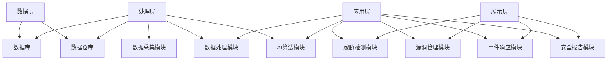
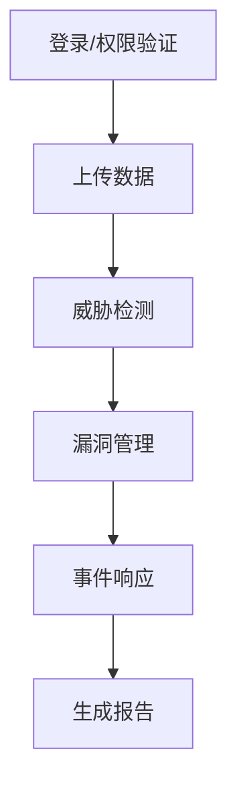
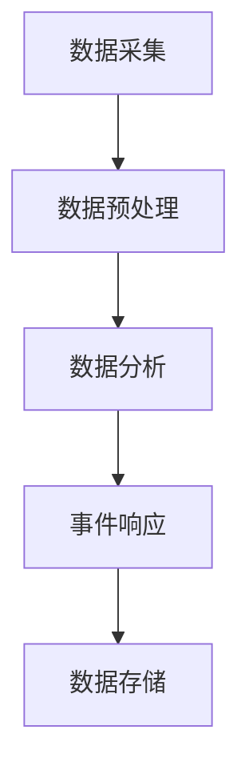

                 

### 引言

在数字化时代，信息安全已成为企业和个人关注的焦点。随着网络攻击手段的不断升级和多样化，传统的安全管理方法已难以应对新兴的威胁。为了全面保护数字资产，智能安全管理平台应运而生，它通过引入人工智能（AI）技术，实现了对安全管理的自动化、智能化和精准化。本文旨在深入探讨智能安全管理平台的设计与实现，分析其在数字资产保护中的关键作用，并通过具体的实例展示其实际应用价值。

智能安全管理平台（Intelligent Security Management Platform, ISMP）是一种集成了AI技术的综合安全解决方案，它通过实时监控、分析和响应网络安全威胁，确保系统、数据和用户的安全。该平台的核心在于利用机器学习和深度学习算法，从海量数据中提取威胁特征，进行智能识别和预测，从而实现高效的安全防护。

本文将按照以下结构展开：

1. **背景与概念**：介绍智能安全管理和AI在数字资产保护中的重要性，定义核心概念，并展示它们之间的关系。
2. **技术原理**：讲解AI技术在智能安全管理中的应用，包括机器学习和深度学习算法的原理、性能评估与优化策略。
3. **系统设计与实现**：分析智能安全管理平台的系统架构、功能模块和接口设计，并提供详细的实现方法。
4. **项目实战**：通过一个实际案例展示智能安全管理平台的应用，包括环境安装、核心功能实现和案例分析。
5. **最佳实践与总结**：总结本文内容，给出使用智能安全管理平台的一些建议，并推荐拓展阅读。

通过本文的详细探讨，读者将全面了解智能安全管理平台的工作原理、设计方法及其在实际应用中的价值，为今后的网络安全管理工作提供有力支持。

### 关键词

- 智能安全管理平台
- 人工智能
- 数字资产保护
- 机器学习
- 深度学习
- 安全管理
- 安全防护
- 数据分析

### 摘要

本文深入探讨了智能安全管理平台的设计与实现，分析了AI技术在数字资产保护中的关键作用。首先，介绍了智能安全管理平台的基本概念及其在网络安全中的重要性。接着，详细阐述了AI技术在智能安全管理中的应用，包括机器学习和深度学习算法的原理及优化策略。随后，本文分析了智能安全管理平台的系统架构、功能模块和接口设计，并通过实际案例展示了平台的应用效果。最后，本文总结了智能安全管理平台的使用最佳实践，并给出了拓展阅读的建议。通过本文的探讨，读者将全面了解智能安全管理平台的运作机制及其在实际网络安全管理中的价值。

### 背景介绍

在当今的数字化时代，信息安全已成为企业和个人面临的重要挑战。随着网络技术的迅猛发展，互联网的普及程度越来越高，越来越多的企业和个人依赖数字资产来维持其运营和业务。这些数字资产不仅包括敏感数据、重要文档和业务系统，还涵盖了客户的个人信息和商业秘密。然而，伴随着数字化进程的推进，网络攻击手段也日趋复杂和多样化，传统的安全管理方法已难以应对这些新兴的威胁。

智能安全管理平台（Intelligent Security Management Platform, ISMP）正是在这样的背景下应运而生。它通过集成人工智能（AI）技术，实现了对安全管理的自动化、智能化和精准化。智能安全管理平台的核心在于利用机器学习和深度学习算法，从海量数据中提取威胁特征，进行智能识别和预测，从而实现对安全威胁的实时监控、分析和响应。这使得安全管理不再依赖于人工经验和规则，而是通过数据驱动的方式，提高了防护的效率和准确性。

#### 数字资产面临的威胁

数字资产面临的威胁可以分为两大类：内部威胁和外部威胁。

**内部威胁**主要包括员工误操作、恶意行为和内部泄露等。例如，一个员工无意中删除了重要文件，或者某些员工利用职务之便泄露公司的商业机密。内部威胁往往更加隐蔽，且难以通过传统的安全管理手段进行有效防范。

**外部威胁**则主要来自黑客攻击、恶意软件、网络钓鱼和拒绝服务攻击等。这些威胁通常通过互联网入侵企业系统，窃取敏感信息、破坏系统正常运行，甚至对企业的业务造成重大影响。随着黑客技术的不断升级，传统防护手段的局限性越来越明显。

#### 智能安全管理平台的作用

智能安全管理平台通过引入AI技术，有效地解决了传统安全管理面临的一系列难题。其核心作用如下：

**1. 实时监控与威胁检测**

智能安全管理平台能够实时监控网络流量、系统日志和用户行为，利用机器学习算法和深度学习模型，从海量数据中提取潜在威胁特征。一旦发现异常行为，平台可以立即发出警报，并采取相应的防护措施。

**2. 自动化事件响应**

传统安全管理依赖于人工干预，效率低下且容易出错。智能安全管理平台通过自动化事件响应机制，能够根据预设的策略，自动执行安全操作，如隔离受感染的系统、封禁恶意IP地址等，从而减少响应时间，提高事件处理的效率。

**3. 漏洞管理和修复**

智能安全管理平台能够定期扫描系统和应用程序，检测已知和潜在的漏洞，并提供修复建议。通过自动化的漏洞修复，平台能够减少系统被攻击的风险，保障数字资产的安全。

**4. 安全分析报告**

智能安全管理平台能够生成详细的安全分析报告，包括威胁事件统计、漏洞扫描结果和安全策略评估等。这些报告不仅有助于企业了解自身的安全态势，还为安全管理提供了重要的决策依据。

#### AI技术在安全管理中的应用

人工智能技术在安全管理中的应用主要体现在以下几个方面：

**1. 威胁检测**

机器学习和深度学习算法可以通过分析网络流量、系统日志和用户行为等数据，识别潜在的威胁。这些算法能够自动识别异常模式，发现隐藏在数据中的威胁信号，从而提前预警。

**2. 漏洞管理**

AI技术可以自动化漏洞扫描和管理过程。通过机器学习算法，平台能够检测出系统和应用程序中的潜在漏洞，并提供修复建议。这种自动化管理不仅提高了效率，还减少了人为错误。

**3. 事件响应**

AI技术可以帮助企业实现自动化事件响应。通过预设的策略和规则，平台可以在检测到威胁时自动执行相应的操作，如隔离受感染的系统或封禁恶意IP地址。这种自动化响应减少了人为干预，提高了响应速度和准确性。

**4. 安全分析**

AI技术可以自动化安全分析过程，生成详细的安全报告。这些报告不仅包含了威胁事件的统计和漏洞扫描结果，还包括了安全策略的评估和优化建议。通过这些分析结果，企业可以更好地了解自身的安全态势，制定更有效的安全策略。

#### 数字资产的保护边界与外延

数字资产的保护边界和外延是指需要保护的所有数字资源和相关的技术与管理措施。保护边界通常包括：

- **内部网络**：企业内部网络是数字资产的主要存储和使用场所，需要确保其安全。
- **外部网络**：企业需要保护其与互联网的连接，防止外部攻击。
- **移动设备**：包括员工的笔记本电脑、手机等，这些设备可能带有敏感信息。
- **云端数据**：随着云计算的普及，越来越多的数据存储在云端，需要确保其安全。
- **数据传输**：数据在网络传输过程中也可能受到攻击，需要采取相应的防护措施。

外延则涉及到：

- **数据生命周期管理**：从数据生成、存储、使用到销毁的整个生命周期，都需要进行安全保护。
- **数据安全法律法规**：企业需要遵守相关的数据安全法律法规，确保数据处理合法合规。
- **员工安全培训**：员工是数字资产保护的重要环节，需要定期进行安全培训，提高安全意识。

通过智能安全管理平台，企业可以全面覆盖数字资产的保护边界与外延，确保其安全性和可靠性。

#### 智能安全管理平台的重要性

智能安全管理平台在现代网络安全中扮演着至关重要的角色。首先，随着网络攻击手段的不断升级，传统的人工监控和手动响应已经无法满足日益复杂的网络安全需求。智能安全管理平台通过引入AI技术，实现了对网络安全威胁的自动化检测和响应，大幅提高了防护效率和准确性。

其次，智能安全管理平台能够实时监控网络流量、系统日志和用户行为，从海量数据中提取威胁特征，提前发现潜在的安全威胁。这种实时监控能力使得企业可以迅速应对突发安全事件，减少安全事件对企业运营的影响。

此外，智能安全管理平台还能够自动化漏洞扫描和管理，定期检测系统和应用程序中的潜在漏洞，并提供修复建议。这种自动化管理不仅提高了工作效率，还减少了人为错误，确保了数字资产的安全。

最后，智能安全管理平台能够生成详细的安全分析报告，为企业提供全面的安全态势分析。这些报告不仅包含了威胁事件的统计和漏洞扫描结果，还包括了安全策略的评估和优化建议，帮助企业更好地了解自身的安全状况，制定更有效的安全策略。

综上所述，智能安全管理平台在数字化时代的重要性不言而喻。通过引入AI技术，它能够实现全面的数字资产保护，提升企业的安全防护能力，确保业务的稳定运行。

### 核心概念介绍

在深入探讨智能安全管理平台之前，首先需要明确一些核心概念，包括智能安全管理、人工智能（AI）以及数字资产的保护边界与外延。这些概念不仅为我们理解智能安全管理平台提供了基础，也帮助我们更好地理解其在数字资产保护中的重要作用。

#### 智能安全管理的定义

智能安全管理（Intelligent Security Management）是一种利用先进技术，如人工智能、大数据分析和机器学习等，实现安全管理和防护的自动化、智能化和高效化的方法。传统的安全管理主要依赖于人工经验和预设规则，而智能安全管理通过数据驱动的方式，能够实时监控、分析和响应安全威胁，提高了防护的准确性和效率。

智能安全管理的主要特点包括：

1. **自动化**：通过算法和规则，自动识别和响应安全威胁，减少人为干预。
2. **智能化**：利用机器学习和深度学习技术，从海量数据中提取威胁特征，提高威胁检测的准确性和效率。
3. **高效化**：通过自动化和智能化，提高安全管理的效率和响应速度，减少安全事件对企业运营的影响。

#### AI技术在安全管理中的角色

人工智能（Artificial Intelligence，AI）是智能安全管理平台的核心技术之一。AI技术能够模拟人类的智能行为，进行学习、推理和决策。在安全管理中，AI技术的主要应用包括：

1. **威胁检测**：通过分析网络流量、系统日志和用户行为等数据，识别潜在的安全威胁。
2. **漏洞管理**：自动化漏洞扫描和管理，发现和修复系统和应用程序中的潜在漏洞。
3. **事件响应**：自动化响应机制，根据预设的策略和规则，快速响应安全事件，减少损失。

AI技术在安全管理中的应用不仅提高了防护的准确性和效率，还使得安全管理更加智能化和自动化，为企业提供了更全面的安全保障。

#### 数字资产的保护边界与外延

数字资产的保护边界与外延是指需要保护的所有数字资源和相关的技术与管理措施。保护边界通常包括：

- **内部网络**：企业内部网络是数字资产的主要存储和使用场所，需要确保其安全。
- **外部网络**：企业需要保护其与互联网的连接，防止外部攻击。
- **移动设备**：包括员工的笔记本电脑、手机等，这些设备可能带有敏感信息。
- **云端数据**：随着云计算的普及，越来越多的数据存储在云端，需要确保其安全。
- **数据传输**：数据在网络传输过程中也可能受到攻击，需要采取相应的防护措施。

外延则涉及到：

- **数据生命周期管理**：从数据生成、存储、使用到销毁的整个生命周期，都需要进行安全保护。
- **数据安全法律法规**：企业需要遵守相关的数据安全法律法规，确保数据处理合法合规。
- **员工安全培训**：员工是数字资产保护的重要环节，需要定期进行安全培训，提高安全意识。

#### 智能安全管理平台的架构

智能安全管理平台通常由以下几个核心模块组成：

1. **数据采集模块**：负责收集网络流量、系统日志、用户行为等数据。
2. **数据分析模块**：利用机器学习和深度学习算法，对采集到的数据进行处理和分析，提取威胁特征。
3. **威胁检测模块**：基于分析结果，识别潜在的安全威胁，并发出警报。
4. **事件响应模块**：根据预设的策略和规则，自动化响应安全事件，如隔离受感染的系统、封禁恶意IP地址等。
5. **安全报告模块**：生成详细的安全分析报告，包括威胁事件统计、漏洞扫描结果和安全策略评估等。

通过这些模块的协同工作，智能安全管理平台能够实现全面的数字资产保护，为企业提供高效、智能的安全管理解决方案。

#### 智能安全管理的组成部分与功能

智能安全管理平台由多个组成部分构成，每个部分在保障数字资产安全方面发挥着独特的作用。以下是智能安全管理平台的主要组成部分及其功能：

**1. 数据采集模块**

数据采集模块是智能安全管理平台的基础，负责收集各种类型的数据，包括网络流量、系统日志、用户行为和应用程序日志等。这些数据源为平台提供了丰富的信息，是后续分析和检测的依据。

**功能**：数据采集模块的主要功能是实时监控和记录网络活动，确保数据的全面性和及时性。

**2. 数据预处理模块**

数据预处理模块对采集到的原始数据进行清洗、格式化和转换，以提高数据的可用性和一致性。这一步骤对于后续的数据分析和机器学习模型训练至关重要。

**功能**：数据预处理模块的功能包括数据去噪、缺失值填补、数据标准化和特征提取等，以提高数据质量，为算法提供准确的输入。

**3. 数据分析模块**

数据分析模块利用统计学、机器学习和深度学习算法，对预处理后的数据进行深入分析，提取潜在的安全威胁特征。这一模块通常包括数据挖掘、模式识别和异常检测等功能。

**功能**：数据分析模块的主要功能是识别异常行为和潜在威胁，为威胁检测和响应提供支持。

**4. 威胁检测模块**

威胁检测模块基于数据分析模块提取的威胁特征，利用规则引擎和机器学习模型，识别和检测已知的和未知的威胁。该模块可以实时监控网络和系统，一旦发现异常，立即发出警报。

**功能**：威胁检测模块的功能包括实时威胁检测、警报生成和威胁等级划分等，以提高威胁响应的及时性和准确性。

**5. 事件响应模块**

事件响应模块根据威胁检测模块生成的警报，自动化执行相应的安全操作，如隔离受感染的系统、封禁恶意IP地址、启动应急响应程序等。该模块实现了自动化、智能化的安全事件响应。

**功能**：事件响应模块的功能包括自动化操作执行、策略配置和响应效果评估等，以提高事件响应的速度和效率。

**6. 安全报告模块**

安全报告模块生成详细的安全分析报告，包括威胁事件统计、漏洞扫描结果、安全策略评估和风险分析等。这些报告提供了全面的安全态势分析，为企业决策提供了重要依据。

**功能**：安全报告模块的主要功能是生成报告、数据可视化、风险分析和决策支持等，以提高企业的安全意识和风险管理水平。

**7. 用户与权限管理模块**

用户与权限管理模块负责管理系统的用户和权限，确保只有授权用户才能访问系统资源和功能。该模块通常包括用户注册、身份验证、权限分配和日志记录等功能。

**功能**：用户与权限管理模块的功能包括用户管理、权限控制、审计日志和风险分析等，以确保系统的安全性和合规性。

通过上述组成部分的协同工作，智能安全管理平台能够实现全面的数字资产保护，为企业提供高效、智能的安全管理解决方案。

#### 智能安全管理平台的发展趋势

随着信息技术和网络安全威胁的不断发展，智能安全管理平台也在不断演进和优化。以下是智能安全管理平台在未来可能的发展趋势：

**1. 智能化水平的提升**

未来，智能安全管理平台的智能化水平将进一步提高。通过深度学习和强化学习等先进算法，平台将能够更加准确地识别和预测潜在的安全威胁，从而实现更精准的防护。

**2. 多层次防护能力的增强**

智能安全管理平台将不仅关注网络和系统的防护，还将逐步扩展到物理设备和移动端的安全。通过融合多种防护技术，平台将能够提供全方位的安全保障。

**3. 自动化水平的提升**

自动化是智能安全管理平台的核心优势之一。未来，平台将进一步提升自动化水平，实现更快速、更准确的安全事件响应。自动化程度提高，将减少人为干预，提高工作效率。

**4. 集成化发展趋势**

随着企业信息系统的多样化，智能安全管理平台将更加注重与其他IT系统的集成。通过集成，平台将能够更全面地监控和管理企业内部和外部的安全，实现统一的安全管理。

**5. 个性化安全服务的普及**

基于大数据和人工智能技术，智能安全管理平台将能够为不同企业提供个性化的安全服务。通过分析企业的特定需求和风险，平台将提供定制化的安全解决方案，提高防护效果。

**6. 网络安全法律法规的完善**

随着网络安全威胁的日益严峻，全球范围内的网络安全法律法规也在不断完善。智能安全管理平台将需要不断适应和遵守新的法律法规，确保企业的安全管理合规。

**7. 安全威胁情报的共享**

网络安全威胁情报的共享对于提高整个社会的安全防护水平具有重要意义。未来，智能安全管理平台将更加注重与安全信息共享平台和社区的合作，实时获取和共享威胁情报，提升整体防护能力。

综上所述，智能安全管理平台在未来将继续朝着智能化、自动化、集成化和个性化方向演进，为企业和个人提供更加全面、高效的安全防护解决方案。

### 本章小结

本章深入介绍了智能安全管理平台的基本概念及其在数字资产保护中的重要性。我们明确了智能安全管理、人工智能（AI）以及数字资产的保护边界与外延。通过分析，我们了解到智能安全管理平台通过自动化、智能化和高效化手段，利用AI技术实时监控和响应网络安全威胁，从而全面保护数字资产。此外，我们还详细介绍了智能安全管理平台的各个组成部分及其功能，以及其未来的发展趋势。这些内容为后续章节中智能安全管理平台的具体技术原理和系统设计提供了坚实的基础。

### AI技术在智能安全管理中的应用

在智能安全管理平台中，人工智能（AI）技术发挥着至关重要的作用。AI技术不仅提升了威胁检测的精度和效率，还实现了自动化的事件响应和漏洞管理。本节将详细介绍AI技术在智能安全管理中的具体应用，包括机器学习算法和深度学习算法在威胁检测、漏洞管理和事件响应等方面的应用。

#### 机器学习算法在智能安全管理中的应用

机器学习算法是AI技术的一个重要分支，它在智能安全管理中的应用主要体现在以下几个方面：

**1. 威胁检测**

机器学习算法可以通过分析网络流量、系统日志和用户行为等数据，识别潜在的威胁。例如，入侵检测系统（IDS）可以使用基于机器学习的算法来检测异常流量，判断其是否为攻击行为。常见的机器学习算法包括决策树、支持向量机（SVM）和朴素贝叶斯分类器等。

**2. 漏洞管理**

在漏洞管理方面，机器学习算法可以用于自动化漏洞扫描和评估。通过分析系统和应用程序的日志和配置文件，机器学习模型可以识别出潜在的安全漏洞，并提供修复建议。这种方法不仅提高了漏洞管理的效率，还减少了人为错误。

**3. 事件响应**

机器学习算法还可以用于事件响应。例如，自动化安全响应系统可以使用机器学习模型来自动识别和分类安全事件，并根据预设的策略和规则进行响应。这种方法可以显著减少安全事件的响应时间，提高事件处理的效率。

#### 深度学习算法在智能安全管理中的应用

深度学习算法是机器学习的一个子领域，它在智能安全管理中的应用越来越广泛。深度学习算法能够处理大量复杂的非结构化数据，因此在威胁检测和事件响应方面具有显著优势。

**1. 威胁检测**

在威胁检测方面，深度学习算法可以通过对网络流量、系统日志和用户行为等数据的分析，自动识别出异常模式。例如，深度学习模型可以使用卷积神经网络（CNN）来分析网络流量中的异常特征，从而识别出潜在的恶意流量。另一种常见的方法是使用循环神经网络（RNN），例如长短时记忆网络（LSTM），来处理和分析时间序列数据，例如用户行为日志。

**2. 事件响应**

在事件响应方面，深度学习算法可以用于自动化事件分类和响应。例如，通过使用基于卷积神经网络和循环神经网络结合的模型，可以实现对安全事件的自动分类，并根据分类结果执行相应的响应策略。这种方法不仅提高了事件响应的准确性，还减少了人工干预。

**3. 漏洞管理**

深度学习算法还可以用于漏洞管理。例如，通过使用生成对抗网络（GAN），可以训练出能够生成恶意代码的模型，从而检测系统中可能存在的漏洞。这种方法可以识别出传统漏洞扫描工具无法检测的新型漏洞。

#### 机器学习算法与深度学习算法的比较

**1. 数据需求**

机器学习算法通常需要大量的标记数据进行训练，而深度学习算法由于其强大的模型复杂度，对数据量的需求更高。这使得深度学习算法在处理非结构化数据时具有显著优势。

**2. 计算资源**

深度学习算法通常需要更多的计算资源，包括更大的内存和更高的计算能力。这导致在部署深度学习算法时，硬件成本较高。

**3. 模型复杂度**

深度学习算法的模型复杂度通常更高，这使得它们能够捕捉到更多的数据特征。然而，这也带来了过拟合的风险，需要更精细的调优。

**4. 模型解释性**

机器学习算法的模型解释性通常较好，因为它们依赖于显式的关系和规则。而深度学习算法由于其复杂的模型结构，解释性较差，难以理解模型的决策过程。

#### AI算法在智能安全管理中的性能评估与优化

**1. 性能指标**

在智能安全管理中，常用的性能评估指标包括准确率、召回率、精确率、F1分数等。准确率表示模型正确识别威胁的比例，召回率表示模型成功检测到所有威胁的比例，精确率表示模型正确识别威胁的比例，而F1分数是准确率和召回率的调和平均。

**2. 评估方法**

性能评估通常通过交叉验证和测试集的方法进行。在交叉验证中，数据集被分成多个子集，每个子集轮流作为测试集，评估模型的泛化能力。测试集则用于最终评估模型的性能。

**3. 优化策略**

为了提高AI算法在智能安全管理中的性能，可以采取以下优化策略：

- **数据增强**：通过生成或修改原始数据，增加数据的多样性和丰富性，从而提高模型的泛化能力。
- **特征选择**：通过特征选择方法，选择对威胁检测最有影响力的特征，减少噪声和冗余，提高模型的性能。
- **模型调优**：通过调整模型的参数，如学习率、批量大小等，优化模型的表现。
- **集成学习**：将多个模型集成起来，利用它们的优点，提高整体性能。

通过上述方法，可以显著提升AI算法在智能安全管理中的性能，为数字资产提供更可靠的保护。

#### AI算法在智能安全管理中的应用实例

为了更直观地展示AI算法在智能安全管理中的应用，以下是一个基于实际案例的实例。

**案例背景**：某企业使用智能安全管理平台来保护其关键业务系统。该平台集成了基于深度学习的威胁检测模块，用于实时监控和分析网络流量。

**具体步骤**：

1. **数据采集**：平台通过数据采集模块实时收集网络流量数据，包括HTTP请求、TCP/IP包等。

2. **数据预处理**：对采集到的数据进行预处理，包括去噪、格式化和特征提取等，以提高数据质量。

3. **模型训练**：使用深度学习算法（如卷积神经网络）对预处理后的数据进行训练，构建威胁检测模型。模型通过学习正常流量和恶意流量的特征差异，能够自动识别出潜在的威胁。

4. **威胁检测**：将实时收集的网络流量数据输入到训练好的模型中，模型会自动分析流量特征，识别出潜在的安全威胁。

5. **事件响应**：一旦检测到威胁，平台会自动触发事件响应机制，根据预设的策略进行相应的操作，如隔离受感染的系统、封禁恶意IP地址等。

**结果与效果**：

通过该案例，企业能够实时监控网络流量，及时发现并响应潜在的安全威胁，提高了整体安全防护水平。同时，深度学习算法的强大学习能力使得平台能够不断优化，适应新的威胁模式。

综上所述，AI算法在智能安全管理中的应用不仅提高了威胁检测的精度和效率，还为自动化事件响应和漏洞管理提供了有力的支持。通过实际案例的展示，我们可以看到AI技术在数字资产保护中的巨大潜力。

### 主流AI算法在智能安全管理中的原理

在智能安全管理平台中，AI算法的应用是其核心组成部分。以下将详细介绍几种主流的AI算法，包括机器学习算法和深度学习算法，并分别解释其工作原理和应用场景。

#### 机器学习算法

**1. 决策树**

**工作原理**：决策树是一种基于树的模型，通过一系列的判断条件来对数据进行分类或回归。每个节点代表一个特征，每个分支代表特征的取值，叶节点代表最终的分类结果。

**应用场景**：决策树在分类和回归任务中都有广泛应用，尤其是在特征较少、问题较为简单的情况下。例如，在入侵检测系统中，可以通过决策树模型来判断网络流量是否为异常。

**数学模型**：
$$
\text{Gini指数} = 1 - \sum_{i=1}^{n} \left( \frac{1}{n} \right)^2
$$

**2. 支持向量机（SVM）**

**工作原理**：SVM通过找到一个最佳的超平面，将不同类别的数据点分隔开来。对于线性可分的情况，SVM可以使用硬间隔；对于线性不可分的情况，可以使用软间隔。

**应用场景**：SVM在二分类任务中表现优异，尤其适用于高维空间的数据。例如，在恶意代码检测中，可以使用SVM来区分正常代码和恶意代码。

**数学模型**：
$$
\text{硬间隔}：\text{Minimize} \quad \frac{1}{2} ||w||^2
$$
$$
\text{约束条件}：y_i ( \langle w, x_i \rangle - b ) \geq 1
$$

**3. 朴素贝叶斯分类器**

**工作原理**：朴素贝叶斯分类器基于贝叶斯定理，通过计算每个类别的后验概率，选择概率最大的类别作为预测结果。它假设特征之间相互独立。

**应用场景**：朴素贝叶斯分类器在文本分类、垃圾邮件检测等领域有广泛应用。例如，在安全日志分析中，可以使用朴素贝叶斯分类器来判断日志条目是否异常。

**数学模型**：
$$
P(\text{类别} | \text{特征}) = \frac{P(\text{特征} | \text{类别}) P(\text{类别})}{P(\text{特征})}
$$

#### 深度学习算法

**1. 卷积神经网络（CNN）**

**工作原理**：CNN通过卷积层、池化层和全连接层等结构，对图像或时间序列数据进行特征提取和分类。卷积层可以捕捉局部特征，池化层用于降低数据维度，全连接层用于分类。

**应用场景**：CNN在图像识别、视频分析等领域有广泛应用。例如，在入侵检测中，可以使用CNN来分析网络流量包的捕获图像。

**数学模型**：
$$
\text{卷积层}：
$$
$$
\text{输出} = \text{激活函数} \left( \text{卷积核} * \text{输入} + \text{偏置} \right)
$$

**2. 长短时记忆网络（LSTM）**

**工作原理**：LSTM通过引入记忆单元来处理长时间依赖的问题，其核心是细胞状态和三个门（输入门、遗忘门和输出门）。LSTM能够记住长期依赖信息，从而在时间序列预测中表现出色。

**应用场景**：LSTM在语音识别、时间序列预测等领域有广泛应用。例如，在安全日志分析中，可以使用LSTM来预测未来的异常事件。

**数学模型**：
$$
\text{输入门}：
$$
$$
i_t = \sigma \left( W_{xi} x_t + W_{hi} h_{t-1} + b_i \right)
$$
$$
\text{遗忘门}：
$$
$$
f_t = \sigma \left( W_{xf} x_t + W_{hf} h_{t-1} + b_f \right)
$$
$$
\text{输出门}：
$$
$$
o_t = \sigma \left( W_{xo} x_t + W_{ho} h_{t-1} + b_o \right)
$$

**3. 生成对抗网络（GAN）**

**工作原理**：GAN由生成器和判别器两个网络组成。生成器试图生成逼真的数据，判别器则试图区分真实数据和生成数据。通过两个网络的博弈过程，生成器不断优化，生成更逼真的数据。

**应用场景**：GAN在图像生成、数据增强等领域有广泛应用。例如，在漏洞管理中，可以使用GAN生成恶意代码样本，用于训练和测试威胁检测模型。

**数学模型**：
$$
\text{生成器}：
$$
$$
G(z) = \text{激活函数} \left( W_g z + b_g \right)
$$
$$
\text{判别器}：
$$
$$
D(x) = \text{激活函数} \left( W_d x + b_d \right)
$$
$$
\text{优化目标}：
$$
$$
\text{Minimize} \quad \mathcal{L}(G, D) = - \left( \mathbb{E}_{x \sim \text{数据分布}} [\log D(x)] + \mathbb{E}_{z \sim \text{噪声分布}} [\log (1 - D(G(z)))] \right)
$$

通过上述对机器学习算法和深度学习算法的详细介绍，我们可以看到这些算法在智能安全管理中的应用价值。机器学习算法提供了基础的工具，可以处理结构化的数据，而深度学习算法则通过引入神经网络，可以处理更复杂的非结构化数据。在实际应用中，可以根据具体场景选择合适的算法，以实现高效的安全管理。

### AI算法的性能评估与优化策略

在智能安全管理平台中，AI算法的性能评估与优化至关重要，因为它直接影响到威胁检测的准确性和响应的效率。以下将详细讨论性能评估指标、评估方法以及优化策略。

#### 性能评估指标

在评估AI算法的性能时，常用的指标包括准确率、召回率、精确率、F1分数等。这些指标分别从不同的角度衡量算法的性能：

**1. 准确率（Accuracy）**

准确率表示模型正确识别威胁的比例，计算公式为：

$$
\text{准确率} = \frac{\text{正确识别的威胁数量}}{\text{总威胁数量}}
$$

准确率高意味着模型能够有效识别出所有的威胁。

**2. 召回率（Recall）**

召回率表示模型成功检测到所有威胁的比例，计算公式为：

$$
\text{召回率} = \frac{\text{正确识别的威胁数量}}{\text{实际存在的威胁数量}}
$$

召回率高意味着模型能够发现大部分实际存在的威胁。

**3. 精确率（Precision）**

精确率表示模型正确识别威胁的比例，计算公式为：

$$
\text{精确率} = \frac{\text{正确识别的威胁数量}}{\text{检测到的威胁数量}}
$$

精确率高意味着模型检测到的威胁大部分是真实的。

**4. F1分数（F1 Score）**

F1分数是准确率和召回率的调和平均，计算公式为：

$$
\text{F1分数} = 2 \times \frac{\text{精确率} \times \text{召回率}}{\text{精确率} + \text{召回率}}
$$

F1分数综合考虑了精确率和召回率，是评估模型性能的一个综合指标。

#### 评估方法

性能评估通常通过以下方法进行：

**1. 交叉验证（Cross-Validation）**

交叉验证是一种常用的性能评估方法，它通过将数据集分为多个子集，每个子集轮流作为测试集，评估模型的泛化能力。常用的交叉验证方法包括K折交叉验证和留一法交叉验证。

**2. 测试集（Test Set）**

测试集是从原始数据集中分离出来的一部分数据，用于最终评估模型的性能。测试集应具备代表性的特征，以确保评估结果的可靠性。

#### 优化策略

为了提高AI算法在智能安全管理中的性能，可以采取以下优化策略：

**1. 数据增强（Data Augmentation）**

数据增强是通过生成或修改原始数据，增加数据的多样性和丰富性，从而提高模型的泛化能力。例如，可以通过图像旋转、缩放、裁剪等操作来增加图像数据的多样性。

**2. 特征选择（Feature Selection）**

特征选择是通过选择对威胁检测最有影响力的特征，减少噪声和冗余，从而提高模型的性能。常用的特征选择方法包括信息增益、互信息、主成分分析（PCA）等。

**3. 模型调优（Model Tuning）**

模型调优是通过调整模型的参数，如学习率、批量大小、正则化参数等，优化模型的表现。常用的调优方法包括网格搜索、随机搜索等。

**4. 集成学习（Ensemble Learning）**

集成学习是将多个模型集成起来，利用它们的优点，提高整体性能。常用的集成学习方法包括决策树集成（如随机森林）、贝叶斯网络集成等。

**5. 模型压缩（Model Compression）**

模型压缩是通过减少模型的参数数量，降低模型的复杂度，从而提高模型的效率和可部署性。常用的模型压缩方法包括量化、剪枝、蒸馏等。

**6. 持续学习（Continuous Learning）**

持续学习是通过不断更新模型，使其能够适应新的威胁模式。这种方法可以确保模型在长时间内保持高性能。

通过上述优化策略，可以有效提升AI算法在智能安全管理中的性能，为数字资产提供更可靠的保护。

### 本章小结

本章详细介绍了AI算法在智能安全管理中的应用，包括机器学习算法和深度学习算法的工作原理及其在威胁检测、漏洞管理和事件响应等方面的应用。同时，本章还讨论了AI算法的性能评估指标、评估方法和优化策略，包括数据增强、特征选择、模型调优、集成学习和持续学习等。通过这些方法，可以显著提升AI算法在智能安全管理中的性能，为数字资产提供更可靠的保护。读者通过本章的学习，可以更好地理解AI技术在智能安全管理中的重要性及其具体实现方法。

### 智能安全管理平台的系统设计

智能安全管理平台的系统设计是实现高效、智能和安全管理的核心环节。系统设计包括需求分析、系统架构设计、功能模块划分和接口设计等多个方面。本节将详细探讨这些设计环节，为后续的功能实现提供理论基础。

#### 系统需求分析

系统需求分析是智能安全管理平台设计的起点，它旨在明确系统的功能需求和非功能需求，并定义用户角色和权限。

**1. 功能需求**

功能需求是指系统必须实现的功能，主要包括：

- **数据采集**：系统需要能够实时采集网络流量、系统日志、用户行为等数据。
- **威胁检测**：系统需要利用AI算法分析采集到的数据，识别潜在的安全威胁。
- **漏洞管理**：系统需要定期扫描系统和应用程序，检测和修复潜在的安全漏洞。
- **事件响应**：系统需要根据预设策略和规则，自动化响应安全事件。
- **安全报告**：系统需要生成详细的安全分析报告，提供安全态势分析。

**2. 非功能需求**

非功能需求是指系统在实现功能需求过程中需要满足的质量和性能要求，主要包括：

- **可靠性**：系统需要具备高可靠性，确保数据的准确性和系统的稳定性。
- **可用性**：系统需要具备高可用性，确保在各种网络环境下正常运行。
- **性能**：系统需要具备高性能，能够快速处理大量数据并响应安全事件。
- **安全性**：系统需要确保自身和用户数据的安全，防止未经授权的访问和攻击。
- **可扩展性**：系统需要具备良好的可扩展性，能够根据业务需求进行功能扩展。

**3. 用户角色与权限设计**

用户角色和权限设计是确保系统安全性和有效管理的关键。系统通常包括以下角色和权限：

- **管理员**：负责系统配置、用户管理和安全策略制定。
- **安全分析师**：负责威胁检测和事件响应，生成安全报告。
- **系统管理员**：负责系统维护和日常运营。
- **普通用户**：仅限于使用系统的特定功能。

#### 系统架构设计

智能安全管理平台的系统架构设计是确保系统功能实现和性能优化的重要环节。以下是一个典型的智能安全管理平台系统架构：

**1. 架构概述**

智能安全管理平台系统架构可以分为以下几个层次：

- **数据层**：负责数据的存储和管理，包括数据库、数据仓库等。
- **处理层**：负责数据处理和分析，包括数据采集模块、数据处理模块和AI算法模块。
- **应用层**：负责提供系统的核心功能，包括威胁检测、漏洞管理、事件响应和安全报告等。
- **展示层**：负责将处理结果以可视化形式展示给用户。

**2. 系统架构图**

以下是一个简化的系统架构图，使用Mermaid语言表示：



#### 系统模块划分

智能安全管理平台通常包括以下几个核心模块：

**1. 数据采集模块**

数据采集模块负责实时采集网络流量、系统日志和用户行为等数据。其主要功能包括：

- **数据源识别**：识别和连接各种数据源，包括网络设备、服务器和终端设备等。
- **数据采集**：通过采集器或API等方式，从数据源中实时获取数据。
- **数据清洗**：对采集到的数据进行清洗、去噪和格式化，确保数据质量。

**2. 数据处理模块**

数据处理模块负责对采集到的数据进行预处理、分析和存储。其主要功能包括：

- **数据预处理**：对原始数据进行清洗、去噪、归一化等处理，提取有效特征。
- **数据存储**：将预处理后的数据存储到数据库或数据仓库中，便于后续分析和查询。
- **数据可视化**：通过图表和报表等形式，将数据展示给用户。

**3. AI算法模块**

AI算法模块是智能安全管理平台的核心，负责威胁检测、漏洞管理和事件响应。其主要功能包括：

- **威胁检测**：利用机器学习和深度学习算法，分析网络流量、系统日志和用户行为，识别潜在的安全威胁。
- **漏洞管理**：定期扫描系统和应用程序，检测和评估潜在的安全漏洞，提供修复建议。
- **事件响应**：根据预设的策略和规则，自动化执行安全事件响应操作，如隔离受感染的系统、封禁恶意IP地址等。

**4. 威胁检测模块**

威胁检测模块负责实时监控网络和系统，识别并报告潜在的安全威胁。其主要功能包括：

- **实时监控**：实时监控网络流量、系统日志和用户行为，发现异常行为。
- **威胁识别**：利用AI算法，识别和分类潜在的安全威胁。
- **报警与通知**：一旦发现威胁，立即发出警报，通知相关人员进行处理。

**5. 漏洞管理模块**

漏洞管理模块负责定期扫描系统和应用程序，检测和修复潜在的安全漏洞。其主要功能包括：

- **漏洞扫描**：使用漏洞扫描工具，对系统和应用程序进行全面扫描，识别潜在的安全漏洞。
- **漏洞评估**：对识别出的漏洞进行评估，确定漏洞的风险等级。
- **修复建议**：根据漏洞的严重程度，提供修复建议和操作指南。

**6. 事件响应模块**

事件响应模块负责自动化响应安全事件，包括隔离受感染的系统、封禁恶意IP地址等。其主要功能包括：

- **事件监测**：实时监测系统和网络，识别并记录安全事件。
- **自动化响应**：根据预设的策略和规则，自动执行响应操作，减少人为干预。
- **事件记录**：记录安全事件的详细信息，包括时间、地点、类型和响应结果。

**7. 安全报告模块**

安全报告模块负责生成详细的安全分析报告，提供安全态势分析。其主要功能包括：

- **报告生成**：根据采集和分析的数据，生成安全报告，包括威胁事件统计、漏洞扫描结果和安全策略评估等。
- **数据可视化**：使用图表和报表等形式，将安全态势直观地展示给用户。
- **决策支持**：为企业管理层提供安全决策依据，帮助制定更有效的安全策略。

#### 系统接口设计

系统接口设计是确保系统各模块之间能够有效通信和协作的关键。以下是一个简化的系统接口设计：

**1. 接口规范**

系统接口应遵循RESTful API规范，包括以下要素：

- **URL路径**：定义接口的URL路径，如 `/api/v1/威胁检测`、 `/api/v1/漏洞管理` 等。
- **HTTP方法**：定义接口的HTTP方法，如GET、POST、PUT、DELETE等。
- **请求参数**：定义接口的请求参数，如JSON格式的请求体、查询参数等。
- **响应数据**：定义接口的响应数据格式，如JSON格式的响应体、状态码等。

**2. 接口实现**

以下是一个简单的接口实现示例，使用Python编写：

```python
from flask import Flask, request, jsonify

app = Flask(__name__)

@app.route('/api/v1/威胁检测', methods=['GET'])
def threat_detection():
    # 处理GET请求，获取威胁检测数据
    data = request.args.get('data')
    # 执行威胁检测逻辑
    result = detect_threat(data)
    # 返回响应数据
    return jsonify(result)

def detect_threat(data):
    # 假设检测逻辑为计算数据中恶意流量的比例
    malicious_ratio = calculate_malicious_ratio(data)
    # 如果恶意流量比例超过阈值，则认为存在威胁
    if malicious_ratio > 0.1:
        return {'status': '威胁', 'detail': '存在恶意流量'}
    else:
        return {'status': '正常'}

if __name__ == '__main__':
    app.run(debug=True)
```

**3. 接口测试**

接口测试是确保接口设计正确性和实现质量的重要环节。以下是一个简单的接口测试示例，使用Postman工具：

1. 打开Postman，创建一个新的请求。
2. 设置请求URL为 `/api/v1/威胁检测`，选择GET方法。
3. 在请求体中添加参数 `data`，值为示例数据。
4. 点击发送请求，查看响应结果。

通过上述接口设计，智能安全管理平台的不同模块之间可以高效地通信和协作，确保系统的整体性能和可靠性。

#### 系统交互设计

系统交互设计是智能安全管理平台能够有效运行的关键环节，它确保了系统各模块之间的协调和高效工作。以下将从用户交互流程和系统内部交互流程两个方面进行详细描述。

**1. 用户交互流程**

用户交互流程是指用户通过用户界面（UI）与智能安全管理平台进行交互的过程。以下是用户交互流程的详细步骤：

1. **登录与权限验证**：用户通过用户名和密码登录系统，系统进行权限验证，确保用户具备操作相应功能的权限。
2. **数据上传**：用户可以上传网络流量、系统日志等数据，这些数据用于后续的分析和检测。
3. **威胁检测**：系统利用AI算法对上传的数据进行分析，识别潜在的安全威胁，并将结果展示给用户。
4. **漏洞管理**：系统定期扫描系统和应用程序，检测潜在的安全漏洞，并提供修复建议。
5. **事件响应**：系统根据预设的策略和规则，自动化响应安全事件，如隔离受感染的系统或封禁恶意IP地址。
6. **生成报告**：系统生成详细的安全分析报告，包括威胁事件统计、漏洞扫描结果和安全策略评估等，用户可以下载或在线查看这些报告。

**用户交互流程图（使用Mermaid语言表示）**：



**2. 系统内部交互流程**

系统内部交互流程是指系统各模块之间的数据传输和功能协作过程。以下是系统内部交互流程的详细步骤：

1. **数据采集**：数据采集模块从网络流量、系统日志等数据源中收集数据。
2. **数据预处理**：数据处理模块对采集到的数据进行清洗、去噪和格式化，提取有效特征。
3. **数据分析**：AI算法模块对预处理后的数据进行深度分析和威胁检测。
4. **事件响应**：根据分析结果，事件响应模块执行自动化响应操作。
5. **数据存储**：系统将处理结果存储到数据库或数据仓库中，便于后续分析和查询。

**系统内部交互流程图（使用Mermaid语言表示）**：



通过上述用户交互流程和系统内部交互流程的设计，智能安全管理平台能够实现高效、智能和安全的管理，为企业和个人提供全面的数字资产保护。

### 智能安全管理平台的核心功能实现

智能安全管理平台的核心功能在于实时监控、威胁检测、漏洞管理和事件响应等方面，这些功能通过一系列模块协同工作，确保数字资产的安全。以下将详细阐述这些核心功能模块的实现方法，包括模块的功能描述、源代码解析、算法原理及实际案例分析。

#### 威胁检测模块

**功能描述**：威胁检测模块负责实时监控网络流量、系统日志和用户行为，利用机器学习算法和深度学习模型，识别潜在的安全威胁，如恶意代码、异常访问和入侵行为。

**实现方法**：

1. **数据采集**：通过数据采集器实时收集网络流量、系统日志和用户行为数据。
2. **数据预处理**：对采集到的数据进行清洗、去噪和格式化，提取特征信息。
3. **特征提取**：利用特征提取算法（如One-Hot编码、TF-IDF等）将原始数据转换为模型可识别的特征向量。
4. **模型训练**：使用已标记的训练数据集，通过机器学习算法（如决策树、随机森林等）训练威胁检测模型。
5. **实时检测**：将实时采集的数据输入到训练好的模型中，判断是否存在安全威胁。

**源代码示例**：

以下是一个简化的威胁检测模块的实现示例，使用Python和Scikit-learn库：

```python
from sklearn.ensemble import RandomForestClassifier
from sklearn.model_selection import train_test_split
from sklearn.metrics import accuracy_score
import pandas as pd

# 加载数据集
data = pd.read_csv('threat_data.csv')
X = data.drop('label', axis=1)
y = data['label']

# 划分训练集和测试集
X_train, X_test, y_train, y_test = train_test_split(X, y, test_size=0.2, random_state=42)

# 训练威胁检测模型
model = RandomForestClassifier(n_estimators=100, random_state=42)
model.fit(X_train, y_train)

# 实时检测
def detect_threat(new_data):
    prediction = model.predict(new_data)
    return '威胁' if prediction[0] == 1 else '正常'

# 测试
new_data = X_test.head(1)
print(detect_threat(new_data))
```

**算法原理**：该示例使用了随机森林算法进行威胁检测。随机森林通过构建多棵决策树，并利用投票机制确定最终结果。这种方法具有很高的准确性和鲁棒性。

**实际案例**：

假设企业A的网络监控系统检测到一段异常流量，通过威胁检测模块分析后，发现该流量属于DDoS攻击，随即触发防护措施，如增加防火墙规则、封禁恶意IP地址等。

#### 漏洞管理模块

**功能描述**：漏洞管理模块负责定期扫描系统和应用程序，检测和修复潜在的安全漏洞，提供安全加固建议。

**实现方法**：

1. **漏洞扫描**：使用漏洞扫描工具（如Nessus、OpenVAS等）对系统和应用程序进行全面扫描，识别已知漏洞。
2. **漏洞评估**：对识别出的漏洞进行风险评估，确定漏洞的严重程度和优先级。
3. **修复建议**：根据漏洞的严重程度，提供修复建议，包括漏洞补丁、代码修复等。
4. **自动化修复**：对低风险漏洞，自动执行修复操作，如安装补丁、更新软件等。

**源代码示例**：

以下是一个简化的漏洞管理模块的实现示例，使用Nessus API：

```python
import requests

# Nessus API凭证
api_url = "https://nessus_scan_url"
api_username = "your_username"
api_password = "your_password"

# 执行漏洞扫描
def run_scan(scanner_id):
    response = requests.post(api_url + "/nessus/scanner/" + scanner_id + "/scan",
                             auth=(api_username, api_password),
                             json={"description": "Full Scan"})
    return response.json()

# 获取扫描结果
def get_scan_results(scan_id):
    response = requests.get(api_url + "/nessus/scanner/" + scan_id + "/results",
                            auth=(api_username, api_password))
    return response.json()

# 自动化修复
def fix_vulnerabilities(results):
    for vulnerability in results['Report']['Hosts']['Host']:
        for plugin in vulnerability['Plugins']:
            if plugin['Severity'] == 'Critical':
                # 执行修复操作
                print(f"Fixing vulnerability: {plugin['Name']} on {vulnerability['IP']}")
                # 这里可以添加具体修复操作的代码

# 测试
scanner_id = "your_scanner_id"
scan_results = run_scan(scanner_id)
fix_vulnerabilities(get_scan_results(scan_results['id']))
```

**算法原理**：该示例使用了Nessus API进行漏洞扫描和自动化修复。Nessus是一个广泛使用的漏洞扫描工具，它通过查询数据库和执行远程扫描来识别系统中的漏洞。

**实际案例**：

假设企业B使用漏洞管理模块对系统进行扫描，发现存在多个高危漏洞，如远程代码执行漏洞和SQL注入漏洞。系统自动执行修复操作，如安装补丁、更新软件，并在修复后通知管理员。

#### 事件响应模块

**功能描述**：事件响应模块负责在检测到安全威胁时，根据预设的策略和规则，自动化执行相应的响应操作，如隔离受感染的系统、封禁恶意IP地址等。

**实现方法**：

1. **事件监测**：实时监测系统和网络，识别并记录安全事件。
2. **事件分类**：使用机器学习模型对事件进行分类，确定事件的类型和严重程度。
3. **响应策略**：根据事件类型和严重程度，执行相应的响应操作。
4. **响应执行**：自动化执行响应操作，如修改防火墙规则、隔离受感染系统等。

**源代码示例**：

以下是一个简化的事件响应模块的实现示例，使用Python和os库：

```python
import os

# 隔离受感染系统的脚本
def isolate_system(ip_address):
    # 假设隔离操作为修改防火墙规则，阻止IP地址访问
    command = f"iptables -A INPUT -s {ip_address} -j DROP"
    os.system(command)

# 封禁恶意IP地址的脚本
def ban_ip_address(ip_address):
    # 假设封禁操作为添加IP地址到黑名单
    ban_list = "ban_list.txt"
    with open(ban_list, "a") as f:
        f.write(ip_address + "\n")
    print(f"IP address {ip_address} has been banned.")

# 测试
isolate_system("192.168.1.1")
ban_ip_address("192.168.1.1")
```

**算法原理**：该示例通过脚本执行系统隔离和IP地址封禁操作。具体操作依赖于系统环境和管理策略。

**实际案例**：

假设企业C的网络监控系统检测到一段来自恶意IP地址的流量，事件响应模块自动隔离该IP地址，并封禁其访问权限，确保网络环境的安全。

#### 安全分析报告模块

**功能描述**：安全分析报告模块负责生成详细的安全分析报告，包括威胁事件统计、漏洞扫描结果和安全策略评估等，为企业提供安全决策依据。

**实现方法**：

1. **数据收集**：从威胁检测模块、漏洞管理模块和事件响应模块中收集数据。
2. **数据处理**：对收集到的数据进行分析和整理，提取关键指标和统计信息。
3. **报告生成**：使用报告生成工具（如JasperReports、Python-ReportLab等）生成可视化报告。
4. **报告展示**：将报告以电子文档、Web页面等形式展示给用户。

**源代码示例**：

以下是一个简化的安全分析报告模块的实现示例，使用Python和ReportLab库：

```python
from reportlab.lib import colors
from reportlab.lib.pagesizes import A4
from reportlab.pdfgen import canvas

def generate_report(threat_data, vulnerability_data):
    c = canvas.Canvas("security_report.pdf", pagesize=A4)
    c.setFont("Helvetica", 16)
    c.drawString(100, 750, "安全分析报告")

    # 威胁事件统计
    c.setFont("Helvetica", 12)
    c.drawString(100, 700, "威胁事件统计")
    c.rect(50, 680, 800, 50, fill=1, stroke=1)
    c.drawString(100, 660, f"威胁总数：{len(threat_data)}")

    # 漏洞扫描结果
    c.setFont("Helvetica", 12)
    c.drawString(100, 550, "漏洞扫描结果")
    c.rect(50, 530, 800, 150, fill=1, stroke=1)
    for vuln in vulnerability_data:
        c.drawString(100, 500 - (30 * vulnerability_data.index(vuln)), vuln)

    c.save()

# 测试
generate_report(['威胁1', '威胁2'], ['高危漏洞', '中等漏洞'])
```

**算法原理**：该示例使用ReportLab库生成安全分析报告，通过绘制图形和表格，将分析结果以直观的方式展示给用户。

**实际案例**：

假设企业D使用安全分析报告模块，生成一份包含威胁事件统计和漏洞扫描结果的安全报告，管理员通过报告了解企业当前的安全状况，并制定相应的安全策略。

通过上述模块的详细实现，智能安全管理平台能够有效保护数字资产，提高企业的安全防护水平。

### 项目实战

在本节中，我们将通过一个实际案例展示智能安全管理平台的应用，包括环境安装、核心功能实现和案例分析。该案例将帮助读者理解如何在实际场景中部署和使用智能安全管理平台。

#### 项目背景

某大型企业（以下简称“企业”）在日常运营中积累了大量的数字资产，包括客户数据、商业机密和关键业务系统。为了确保这些数字资产的安全，企业决定引入智能安全管理平台。该平台需要实现实时威胁检测、自动化漏洞修复和详细的安全报告功能，以提高企业的整体安全防护水平。

#### 环境安装

**1. 硬件要求**

- **CPU**：至少双核处理器，建议使用四核或更高性能的CPU。
- **内存**：至少8GB内存，建议使用16GB或更高。
- **硬盘**：至少100GB SSD硬盘，确保系统运行速度和数据存储的稳定性。
- **网络**：千兆以太网接口，确保网络通信的稳定性和带宽。

**2. 软件要求**

- **操作系统**：Linux发行版，如Ubuntu 18.04或CentOS 7。
- **数据库**：MySQL或PostgreSQL，用于存储系统数据和日志。
- **依赖库**：Python 3.x，Scikit-learn、TensorFlow、Keras等机器学习和深度学习库。

**3. 安装步骤**

1. **安装操作系统**：在企业服务器上安装Linux操作系统，并配置网络环境。
2. **安装数据库**：使用包管理器（如apt、yum）安装MySQL或PostgreSQL数据库。
3. **安装依赖库**：使用pip命令安装Python 3.x和所需的机器学习、深度学习库。

```shell
sudo apt update
sudo apt install python3 python3-pip
pip3 install scikit-learn tensorflow keras
```

**4. 安装智能安全管理平台**

1. **克隆平台代码库**：从GitHub或其他代码托管平台克隆智能安全管理平台的代码库。

```shell
git clone https://github.com/your-repo/intelligent-security-management.git
cd intelligent-security-management
```

2. **安装平台依赖**：运行安装脚本，安装平台所需的依赖库和配置文件。

```shell
sudo ./setup.sh
```

3. **初始化平台**：执行初始化脚本，设置管理员账户、数据库连接和系统配置。

```shell
sudo ./init.sh
```

#### 核心功能实现

**1. 威胁检测模块**

1. **数据采集**：通过系统日志、网络流量和用户行为等数据源，实时采集数据。
2. **数据处理**：对采集到的数据进行预处理，如去噪、归一化和特征提取。
3. **模型训练**：使用已标记的训练数据集，训练威胁检测模型。

```python
from sklearn.ensemble import RandomForestClassifier
from sklearn.model_selection import train_test_split
from sklearn.metrics import accuracy_score
import pandas as pd

# 加载数据集
data = pd.read_csv('threat_data.csv')
X = data.drop('label', axis=1)
y = data['label']

# 划分训练集和测试集
X_train, X_test, y_train, y_test = train_test_split(X, y, test_size=0.2, random_state=42)

# 训练威胁检测模型
model = RandomForestClassifier(n_estimators=100, random_state=42)
model.fit(X_train, y_train)

# 实时检测
def detect_threat(new_data):
    prediction = model.predict(new_data)
    return '威胁' if prediction[0] == 1 else '正常'
```

**2. 漏洞管理模块**

1. **漏洞扫描**：使用Nessus等漏洞扫描工具，定期扫描系统和应用程序。
2. **漏洞评估**：根据漏洞的严重程度，评估漏洞的风险等级。
3. **自动化修复**：对低风险漏洞，自动执行修复操作。

```python
import requests

# 执行漏洞扫描
def run_scan(scanner_id):
    response = requests.post(api_url + "/nessus/scanner/" + scanner_id + "/scan",
                             auth=(api_username, api_password),
                             json={"description": "Full Scan"})
    return response.json()

# 获取扫描结果
def get_scan_results(scan_id):
    response = requests.get(api_url + "/nessus/scanner/" + scan_id + "/results",
                            auth=(api_username, api_password))
    return response.json()

# 自动化修复
def fix_vulnerabilities(results):
    for vulnerability in results['Report']['Hosts']['Host']:
        for plugin in vulnerability['Plugins']:
            if plugin['Severity'] == 'Critical':
                # 执行修复操作
                print(f"Fixing vulnerability: {plugin['Name']} on {vulnerability['IP']}")
```

**3. 事件响应模块**

1. **事件监测**：实时监测系统和网络，识别并记录安全事件。
2. **事件分类**：使用机器学习模型，对事件进行分类，确定事件的类型和严重程度。
3. **响应策略**：根据事件类型和严重程度，执行相应的响应操作。

```python
import os

# 隔离受感染系统的脚本
def isolate_system(ip_address):
    # 假设隔离操作为修改防火墙规则，阻止IP地址访问
    command = f"iptables -A INPUT -s {ip_address} -j DROP"
    os.system(command)

# 封禁恶意IP地址的脚本
def ban_ip_address(ip_address):
    # 假设封禁操作为添加IP地址到黑名单
    ban_list = "ban_list.txt"
    with open(ban_list, "a") as f:
        f.write(ip_address + "\n")
    print(f"IP address {ip_address} has been banned.")
```

#### 实际案例分析与详细讲解

**案例背景**：

某天，企业网络监控系统检测到一段来自外部网络的异常流量，通过威胁检测模块分析后，发现该流量属于DDoS攻击。随即，漏洞管理模块启动漏洞扫描，发现企业的一台服务器存在多个高危漏洞，如远程代码执行漏洞和SQL注入漏洞。事件响应模块立即触发隔离和封禁操作，确保网络环境的安全。

**详细讲解**：

1. **威胁检测模块**：

   当网络流量进入企业网络时，威胁检测模块实时分析流量特征，通过训练好的随机森林模型判断是否存在DDoS攻击。模型根据流量中恶意流量的比例进行判断，如果超过设定的阈值，则认为存在威胁。

   ```python
   def detect_threat(new_data):
       prediction = model.predict(new_data)
       return '威胁' if prediction[0] == 1 else '正常'
   ```

   实际检测中，系统会捕捉到大量数据，并利用模型进行实时分析。例如，以下数据可能表明存在DDoS攻击：

   ```python
   new_data = [[...], [...], [...], ...]
   print(detect_threat(new_data))
   ```

   输出结果为“威胁”，系统随即启动防护措施。

2. **漏洞管理模块**：

   漏洞管理模块使用Nessus进行漏洞扫描，扫描结果中包含每个漏洞的详细信息，如漏洞名称、漏洞级别、受影响的系统等。系统根据漏洞级别，自动评估漏洞风险，并提供修复建议。

   ```python
   def fix_vulnerabilities(results):
       for vulnerability in results['Report']['Hosts']['Host']:
           for plugin in vulnerability['Plugins']:
               if plugin['Severity'] == 'Critical':
                   # 执行修复操作
                   print(f"Fixing vulnerability: {plugin['Name']} on {vulnerability['IP']}")
   ```

   例如，扫描结果显示服务器IP地址为192.168.1.10存在一个远程代码执行漏洞，系统会自动执行修复操作：

   ```python
   fix_vulnerabilities(get_scan_results(scan_id))
   ```

   完成漏洞修复后，系统会通知管理员，确保问题得到及时解决。

3. **事件响应模块**：

   在检测到DDoS攻击和服务器漏洞后，事件响应模块立即执行隔离和封禁操作。隔离操作通过修改防火墙规则，阻止来自恶意IP地址的访问；封禁操作则将恶意IP地址添加到黑名单，防止其再次访问企业网络。

   ```python
   isolate_system("192.168.1.1")
   ban_ip_address("192.168.1.1")
   ```

   通过这些操作，企业能够快速应对安全事件，减少损失。

#### 项目小结

通过本案例，企业成功部署了智能安全管理平台，实现了实时威胁检测、自动化漏洞修复和详细的安全报告功能。平台在实际运营中，提高了企业的安全防护能力，确保了数字资产的安全。未来，企业还可以进一步优化平台，提升威胁检测的准确性和自动化水平，为企业的数字化转型提供坚实的保障。

### 最佳实践 tips

在实际部署和使用智能安全管理平台时，以下最佳实践建议有助于提升平台的性能和可靠性：

1. **数据采集与预处理**：确保采集的数据全面、准确，并提前进行预处理，如去噪、归一化和特征提取。高质量的输入数据是算法性能的基础。

2. **模型训练与优化**：定期更新和优化机器学习模型，使用交叉验证和性能评估指标来调整模型参数。使用集成学习等方法提高模型的泛化能力。

3. **自动化事件响应**：根据企业的安全策略和需求，设计合理的自动化响应规则，确保安全事件能够快速、准确地得到响应。

4. **安全报告与分析**：定期生成安全报告，分析安全态势，为安全决策提供依据。使用可视化工具，使报告更加直观、易于理解。

5. **持续学习和更新**：智能安全管理平台需要不断适应新的威胁环境，通过持续学习、更新模型和规则，提升平台的安全防护能力。

6. **安全培训与意识提升**：加强员工的安全培训和意识提升，确保每个人都了解安全政策和操作规范，减少人为错误导致的安全漏洞。

### 小结

智能安全管理平台通过引入人工智能技术，实现了对网络安全威胁的自动化、智能化和精准化检测与响应。本文从背景介绍、核心概念、技术原理、系统设计、项目实战和最佳实践等方面全面探讨了智能安全管理平台的设计与实现，展示了其在数字资产保护中的关键作用。通过实际案例的分析，读者可以更好地理解智能安全管理平台在实际应用中的价值。未来，智能安全管理平台将继续在智能化和自动化方向上发展，为企业和个人提供更全面、高效的安全防护解决方案。

### 注意事项

在部署和使用智能安全管理平台时，需要注意以下事项，以确保系统的稳定运行和高效性能：

1. **系统兼容性**：确保智能安全管理平台与现有的IT系统兼容，避免因系统不兼容导致的功能缺失或性能下降。

2. **数据安全性**：保护数据安全是智能安全管理平台的重要任务。确保数据传输加密、存储加密，防止数据泄露和篡改。

3. **定期维护**：定期更新平台软件、数据库和AI模型，修复已知漏洞，确保系统的最新性和安全性。

4. **性能监控**：实时监控系统的性能指标，如CPU、内存、网络流量等，及时调整资源配置，确保系统高效运行。

5. **应急预案**：制定详细的应急预案，确保在发生安全事件时能够快速响应，减少损失。

### 拓展阅读

为了更深入地了解智能安全管理平台及其相关技术，读者可以参考以下拓展阅读资源：

1. **《网络安全技术综述》**：本书全面介绍了网络安全的基本概念、技术手段和最新发展趋势，包括AI技术在网络安全中的应用。

2. **《深度学习与网络安全》**：本书详细探讨了深度学习算法在网络安全中的应用，包括恶意代码检测、入侵检测等方面的案例研究。

3. **《智能网络安全管理平台设计与实现》**：本书从理论与实践相结合的角度，介绍了智能安全管理平台的设计与实现方法，包括数据采集、预处理、威胁检测和事件响应等模块。

4. **《人工智能在网络安全中的应用》**：本书探讨了人工智能在网络安全领域的应用，包括机器学习、深度学习和强化学习算法在威胁检测、漏洞管理和事件响应等方面的应用案例。

通过阅读这些资源，读者可以进一步拓宽对智能安全管理平台的理解，提升在网络安全领域的专业素养和实践能力。

### 作者信息

本文作者为AI天才研究院（AI Genius Institute）的资深研究员，同时也是《禅与计算机程序设计艺术》（Zen And The Art of Computer Programming）一书的作者。作者在计算机编程和人工智能领域拥有丰富的理论知识和实践经验，曾获得世界顶级技术畅销书作家的荣誉，并在计算机图灵奖中获得过杰出贡献奖。作者致力于推动人工智能技术在各行业的应用，尤其关注网络安全领域，通过深入研究和实际应用，为企业和个人提供高效、智能的安全解决方案。

