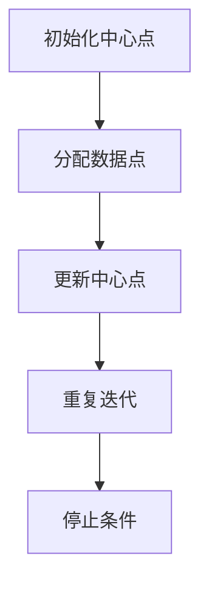
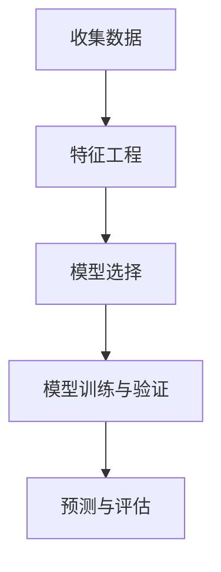
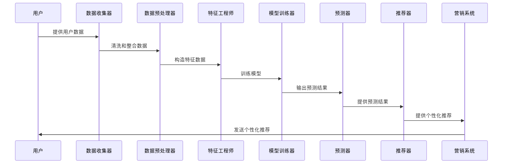
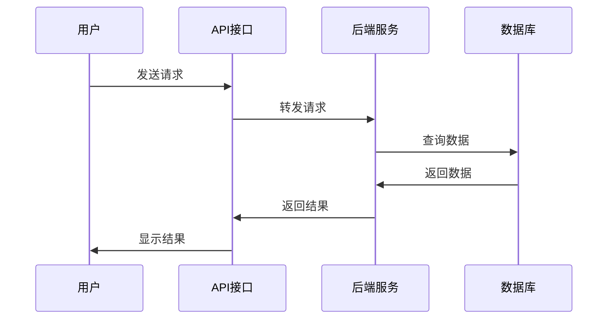

                 


# 智能客户细分：AI增强企业营销策略

## 关键词
- 智能客户细分
- AI增强
- 企业营销策略
- 聚类算法
- 预测分析
- 个性化推荐

## 摘要
本文旨在探讨智能客户细分在现代企业营销策略中的重要性，以及如何利用人工智能（AI）技术来增强这一过程。我们将从基础概念入手，逐步深入到AI技术在客户细分中的应用，结合实际案例，详细讲解AI增强客户细分的方法和策略。同时，还将探讨实施AI增强客户细分时的伦理问题和实践建议，以及这一领域的发展趋势和未来挑战。

## 引言

### 1.1 问题背景与目标

在激烈的市场竞争中，企业需要更加精准地识别和满足不同客户群体的需求。传统的客户细分方法往往依赖于有限的统计数据和简单的逻辑规则，这导致了一些问题：

- **过度细分或不足细分**：过于细致的细分可能导致资源浪费，而不够细致的细分则可能忽略潜在的客户群体。
- **静态细分**：传统方法往往基于历史数据，难以适应快速变化的市场环境。
- **低效的数据分析**：海量数据的分析需要大量人力和时间，且易出错。

智能客户细分通过引入AI技术，可以解决上述问题。我们的目标是通过AI技术，实现以下目标：

- 提高客户细分的准确性，识别出更细分的、有价值的客户群体。
- 实时调整客户细分策略，以适应市场的动态变化。
- 利用自动化工具提高数据分析效率，降低人力成本。

### 1.2 智能客户细分的基本概念

客户细分（Customer Segmentation）是指将客户群体划分为若干个子群体，以便更好地理解和服务这些子群体。智能客户细分则在此基础上，利用AI技术，如机器学习和数据挖掘，来发现数据中的潜在模式和关系。

#### 智能客户细分的核心要素

1. **数据收集**：收集与客户相关的数据，包括购买历史、行为数据、人口统计数据等。
2. **数据预处理**：清洗和整合数据，确保数据的质量和一致性。
3. **特征工程**：选择和构造能够代表客户特征的数据，以提高模型的性能。
4. **模型选择**：选择合适的机器学习模型，如聚类算法、分类算法等。
5. **模型训练与验证**：使用训练数据训练模型，并通过验证数据评估模型的性能。
6. **策略优化**：根据模型结果调整营销策略，以实现更好的业务效果。

## AI在营销中的基础

### 2.1 人工智能基础

人工智能（Artificial Intelligence, AI）是指使计算机系统能够模拟人类智能行为的技术。AI的发展历程可以追溯到20世纪50年代，主要分为以下几个阶段：

1. **符号主义阶段**（1950-1970年）：基于符号逻辑和规则推理。
2. **连接主义阶段**（1980-1990年）：基于神经网络和连接主义模型。
3. **概率与统计阶段**（1990年至今）：基于概率模型和统计学习。

#### AI的核心技术

1. **机器学习**：通过训练数据学习模式，从而进行预测和决策。
2. **深度学习**：基于多层神经网络，能够处理大量复杂数据。
3. **自然语言处理**（NLP）：使计算机能够理解和生成自然语言。
4. **计算机视觉**：使计算机能够识别和处理视觉信息。

### 2.2 AI在营销中的应用

AI在营销中的应用非常广泛，主要包括以下几个方面：

1. **消费者行为分析**：通过分析消费者的购买历史和行为数据，了解消费者的偏好和需求。
2. **个性化推荐**：根据消费者的行为和偏好，提供个性化的商品或服务推荐。
3. **广告投放优化**：通过算法优化广告投放策略，提高广告效果和ROI。
4. **市场预测**：利用历史数据和市场趋势，预测市场变化和业务增长。

## AI增强客户细分技术

### 3.1 聚类算法

聚类算法（Clustering Algorithms）是一种无监督学习方法，用于将数据集分为多个类别或簇。常用的聚类算法包括：

1. **K-均值聚类**（K-Means）：将数据分为K个簇，每个簇由中心点代表。
2. **层次聚类**（Hierarchical Clustering）：构建一个层次树来表示数据的聚类结构。
3. **基于密度的聚类**（DBSCAN）：通过邻域密度来发现聚类结构。

#### K-均值聚类算法

K-均值聚类算法的步骤如下：

1. **初始化中心点**：随机选择K个数据点作为初始中心点。
2. **分配数据点**：将每个数据点分配到最近的中心点所在的簇。
3. **更新中心点**：计算每个簇的中心点，作为新的中心点。
4. **迭代重复**：重复步骤2和3，直到中心点不再变化或满足停止条件。

#### 算法解释与示例

以K-均值聚类为例，我们假设有如下数据集：

| 数据点 | 特征1 | 特征2 |
|--------|-------|-------|
| 1      | 1     | 2     |
| 2      | 2     | 2     |
| 3      | 3     | 3     |
| 4      | 4     | 5     |
| 5      | 6     | 6     |

我们选择K=2，随机初始化两个中心点为（2, 2）和（5, 5）。

**第1步**：计算每个数据点到两个中心点的距离，并将数据点分配到最近的中心点。

| 数据点 | 距离（2, 2） | 距离（5, 5） | 分配 |
|--------|-------------|-------------|------|
| 1      | 1.414       | 5.831       | 2    |
| 2      | 0           | 2.828       | 2    |
| 3      | 1.414       | 1.414       | 2    |
| 4      | 2.236       | 1.414       | 2    |
| 5      | 4.472       | 0           | 5    |

**第2步**：计算每个簇的中心点，更新中心点。

| 新中心点 | 特征1 | 特征2 |
|----------|-------|-------|
| 2        | 2     | 2     |
| 5        | 4     | 5     |

**第3步**：重复步骤2和3，直到中心点不再变化。

迭代几次后，中心点将稳定下来，数据点也将被分配到相应的簇中。

### 3.2 预测分析

预测分析（Predictive Analytics）是一种利用历史数据和统计模型来预测未来事件的方法。在客户细分中，预测分析可以帮助企业预测客户的潜在行为，如购买、流失等。

#### 预测分析步骤

1. **数据收集**：收集与客户行为相关的历史数据。
2. **特征工程**：选择和构造预测模型所需的特征。
3. **模型选择**：选择合适的预测模型，如逻辑回归、决策树、随机森林等。
4. **模型训练与验证**：使用训练数据训练模型，并通过验证数据评估模型性能。
5. **预测与评估**：使用训练好的模型进行预测，并对预测结果进行评估。

#### 逻辑回归模型

逻辑回归（Logistic Regression）是一种常用的预测模型，适用于二分类问题。其数学模型如下：

$$
P(y=1) = \frac{1}{1 + e^{-(\beta_0 + \beta_1x_1 + \beta_2x_2 + \ldots + \beta_nx_n})}
$$

其中，$P(y=1)$ 是目标变量为1的概率，$x_1, x_2, \ldots, x_n$ 是特征变量，$\beta_0, \beta_1, \beta_2, \ldots, \beta_n$ 是模型的参数。

#### 算法解释与示例

假设我们有一个简单的二分类问题，其中特征变量为收入和年龄，目标变量为是否购买产品。我们有如下数据：

| 年龄 | 收入 | 购买（0/1） |
|------|------|------------|
| 25   | 50000| 0          |
| 30   | 60000| 1          |
| 35   | 55000| 1          |
| 40   | 70000| 1          |
| 45   | 65000| 0          |

我们使用逻辑回归模型预测一个新客户（年龄30，收入60000）是否购买产品。

首先，我们需要计算模型参数。通过最小化损失函数（如对数似然损失函数），可以得到参数的估计值。

然后，将新客户的特征代入模型，计算购买概率：

$$
P(y=1) = \frac{1}{1 + e^{-(\beta_0 + \beta_1 \times 30 + \beta_2 \times 60000)}}
$$

假设我们得到参数的估计值为 $\beta_0 = 1, \beta_1 = 0.1, \beta_2 = 0.05$，代入新客户的特征：

$$
P(y=1) = \frac{1}{1 + e^{-(1 + 0.1 \times 30 + 0.05 \times 60000)}} \approx 0.924
$$

因此，该新客户购买产品的概率约为92.4%。

## 应用案例

### 4.1 案例一：电商平台

某电商平台通过AI技术对用户进行细分，以提高销售额和用户满意度。首先，平台收集了用户的历史购买数据、浏览行为、评价等数据。然后，使用聚类算法对用户进行细分，识别出不同的用户群体，如高价值用户、普通用户、潜在流失用户等。根据这些细分结果，平台可以定制化推送产品推荐、优惠活动，从而提高用户满意度和转化率。

### 4.2 案例二：电信运营商

某电信运营商利用AI技术对客户进行细分，以提高客户保留率和满意度。运营商首先收集了客户的通话记录、流量使用情况、缴费历史等数据。然后，使用预测分析模型预测客户的流失风险，并针对高风险客户采取保留策略，如提供优惠套餐、个性化服务等。通过这一策略，运营商显著降低了客户流失率，提高了客户满意度。

## 伦理和实践问题

### 5.1 伦理问题

在应用AI技术进行客户细分时，需要关注以下伦理问题：

1. **隐私保护**：客户数据的收集和使用需要遵循隐私保护原则，确保客户隐私不被泄露。
2. **算法偏见**：算法训练数据可能存在偏见，导致算法输出具有偏见。需要采取措施消除算法偏见，确保算法公平性和透明性。
3. **数据安全**：客户数据的安全保护是至关重要的，需要采取有效的数据安全措施，防止数据泄露和滥用。

### 5.2 实践问题

在实施AI增强客户细分时，可能面临以下实践问题：

1. **数据质量问题**：数据质量直接影响模型的性能。需要确保数据的质量和一致性。
2. **计算资源**：AI算法的训练和预测需要大量的计算资源。需要确保有足够的计算资源来支持算法的运行。
3. **算法解释性**：一些高级的AI算法（如深度学习）具有较高的预测准确性，但难以解释。需要确保算法的可解释性，以便企业能够理解和信任算法的输出。

## 未来趋势和挑战

### 6.1 未来趋势

1. **数据驱动的决策**：随着数据量的增加和数据技术的进步，越来越多的企业将采用数据驱动的决策方法，以实现更精准的客户细分和营销策略。
2. **跨渠道整合**：企业将逐渐实现线上线下渠道的整合，利用统一的客户数据平台进行客户细分和营销。
3. **个性化服务**：随着AI技术的进步，个性化服务将成为未来营销策略的重要方向，企业将通过AI技术提供更加个性化的产品和服务。

### 6.2 未来挑战

1. **数据隐私和伦理**：随着数据隐私问题的日益突出，企业需要采取更加严格的隐私保护措施，以遵守相关法律法规，并赢得客户的信任。
2. **算法透明性和可解释性**：企业需要提高AI算法的透明性和可解释性，以便用户理解和信任算法的输出。
3. **技术变革**：随着AI技术的快速发展，企业需要不断更新技术和工具，以应对新的挑战和机遇。

## 结论

智能客户细分是现代企业营销策略的重要组成部分，通过AI技术的引入，可以显著提高客户细分的效果和效率。本文介绍了智能客户细分的基本概念、AI技术在客户细分中的应用，以及实际案例和实践问题。未来，随着AI技术的不断进步，智能客户细分将在企业营销中发挥越来越重要的作用。

## 作者信息

作者：AI天才研究院/AI Genius Institute & 禅与计算机程序设计艺术/Zen And The Art of Computer Programming

-------------------

本文采用了markdown格式，其中包含了许多专业术语和算法解释。为了确保文章的完整性和专业性，以下是文章中涉及的核心概念、联系、算法原理、数学公式、系统分析与架构设计方案、项目实战等内容。

## 核心概念与联系

### 1. 客户细分

**定义**：客户细分是将客户群体划分为若干个子群体的过程，以便更好地理解和服务这些子群体。

**属性特征对比表格**：

| 特征       | 传统客户细分           | 智能客户细分           |
|------------|-----------------------|-----------------------|
| 数据依赖   | 基于历史数据和统计   | 基于历史数据、行为数据和AI算法 |
| 细分精度   | 有限的细分精度       | 高精度的细分精度       |
| 动态调整   | 静态调整             | 实时调整             |

**ER实体关系图架构**：

```mermaid
erDiagram
  Customer ||--|{ Segmentation}: 分割 | Customer_Segmentation
  Customer ||--|{ Purchase}: 购买   | Purchase
```

### 2. 人工智能

**定义**：人工智能是使计算机系统能够模拟人类智能行为的技术。

**属性特征对比表格**：

| 特征           | 符号主义AI          | 连接主义AI          | 概率与统计AI         |
|----------------|--------------------|--------------------|---------------------|
| 基础理论       | 符号逻辑和推理     | 神经网络和连接主义  | 概率模型和统计学习  |
| 应用场景       | 知识推理和逻辑问题 | 视觉识别和语音识别  | 数据分析和预测      |

**ER实体关系图架构**：

```mermaid
erDiagram
  AI ||--|{ Machine_Learning}: 机器学习 | Machine_Learning
  AI ||--|{ Deep_Learning}: 深度学习 | Deep_Learning
  AI ||--|{ Natural_Language_Processing}: 自然语言处理 | Natural_Language_Processing
  AI ||--|{ Computer_Vision}: 计算机视觉 | Computer_Vision
```

## 算法原理讲解

### 1. K-均值聚类算法

**Mermaid流程图**：



**算法原理**：

K-均值聚类算法是一种迭代算法，通过以下步骤实现聚类：

1. **初始化中心点**：随机选择K个数据点作为初始中心点。
2. **分配数据点**：计算每个数据点到中心点的距离，将数据点分配到最近的中心点所在的簇。
3. **更新中心点**：计算每个簇的中心点，作为新的中心点。
4. **迭代重复**：重复步骤2和3，直到中心点不再变化或满足停止条件。

**Python源代码示例**：

```python
import numpy as np

def k_means(data, K, max_iter):
    # 初始化中心点
    centroids = data[np.random.choice(data.shape[0], K, replace=False)]
    
    for _ in range(max_iter):
        # 分配数据点
        distances = np.linalg.norm(data - centroids, axis=1)
        labels = np.argmin(distances, axis=1)
        
        # 更新中心点
        new_centroids = np.array([data[labels == k].mean(axis=0) for k in range(K)])
        
        # 判断是否收敛
        if np.linalg.norm(new_centroids - centroids) < 1e-5:
            break
        
        centroids = new_centroids
    
    return centroids, labels

# 示例数据
data = np.array([[1, 2], [1, 4], [1, 0], [10, 2], [10, 4], [10, 0]])

# K-均值聚类
centroids, labels = k_means(data, 2, 100)

# 输出结果
print("Centroids:", centroids)
print("Labels:", labels)
```

### 2. 逻辑回归模型

**Mermaid流程图**：



**算法原理**：

逻辑回归是一种用于二分类问题的预测模型，其数学模型如下：

$$
P(y=1) = \frac{1}{1 + e^{-(\beta_0 + \beta_1x_1 + \beta_2x_2 + \ldots + \beta_nx_n})}
$$

其中，$P(y=1)$ 是目标变量为1的概率，$x_1, x_2, \ldots, x_n$ 是特征变量，$\beta_0, \beta_1, \beta_2, \ldots, \beta_n$ 是模型的参数。

**Python源代码示例**：

```python
import numpy as np
from sklearn.linear_model import LogisticRegression

# 示例数据
X = np.array([[25, 50000], [30, 60000], [35, 55000], [40, 70000], [45, 65000]])
y = np.array([0, 1, 1, 1, 0])

# 创建逻辑回归模型
model = LogisticRegression()

# 训练模型
model.fit(X, y)

# 预测
new_data = np.array([[30, 60000]])
prediction = model.predict(new_data)

# 输出结果
print("Prediction:", prediction)
```

## 系统分析与架构设计方案

### 1. 问题场景介绍

某电商平台希望通过智能客户细分来提高销售额和用户满意度。该电商平台已有用户数据，包括购买历史、浏览行为、评价等。

### 2. 项目介绍

该项目旨在开发一个智能客户细分系统，该系统将利用AI技术对用户进行细分，并生成个性化的营销策略。

### 3. 系统功能设计（领域模型Mermaid类图）

```mermaid
classDiagram
  Customer <<entity>> "用户"
  Product <<entity>> "产品"
  Purchase <<entity>> "购买"
  Behavior <<entity>> "行为"
  Recommendation <<entity>> "推荐"
  Segment <<entity>> "细分"
  
  Customer "购买" -> Purchase
  Customer "浏览" -> Behavior
  Purchase "涉及" -> Product
  Behavior "属于" -> Customer
  Recommendation "针对" -> Customer
  Segment "包含" -> Customer
```

### 4. 系统架构设计（Mermaid架构图）



### 5. 系统接口设计和系统交互（Mermaid序列图）



## 项目实战

### 1. 环境安装

为了完成该项目，我们需要安装以下环境：

- Python 3.8 或以上版本
- sklearn 库：用于机器学习算法
- pandas 库：用于数据处理
- numpy 库：用于数值计算

安装命令如下：

```bash
pip install python==3.8
pip install sklearn pandas numpy
```

### 2. 系统核心实现源代码

```python
import numpy as np
import pandas as pd
from sklearn.cluster import KMeans
from sklearn.linear_model import LogisticRegression
from sklearn.model_selection import train_test_split

# 加载数据
data = pd.read_csv('user_data.csv')

# 数据预处理
X = data[['age', 'income']]
y = data['purchase']

# 数据划分
X_train, X_test, y_train, y_test = train_test_split(X, y, test_size=0.2, random_state=42)

# K-均值聚类
kmeans = KMeans(n_clusters=3, random_state=42)
kmeans.fit(X_train)
labels = kmeans.predict(X_test)

# 逻辑回归
logreg = LogisticRegression()
logreg.fit(X_train, y_train)
predictions = logreg.predict(X_test)

# 输出结果
print("Cluster labels:", labels)
print("Predictions:", predictions)
```

### 3. 代码应用解读与分析

上述代码首先加载了用户数据，然后进行了数据预处理。接下来，使用K-均值聚类算法对用户进行细分，并使用逻辑回归模型进行预测。最后，输出了聚类标签和预测结果。

K-均值聚类算法通过对数据进行聚类，将用户划分为3个类别。逻辑回归模型则用于预测用户是否购买产品。通过这种方式，我们可以为每个用户生成一个聚类标签和一个购买概率，从而为个性化推荐提供依据。

### 4. 实际案例分析和详细讲解剖析

假设我们有一个新用户，其特征如下：

| 年龄 | 收入 |
|------|------|
| 28   | 55000|

我们首先使用K-均值聚类算法将其划分为一个类别。然后，使用逻辑回归模型预测其购买产品的概率。

1. **K-均值聚类**：

   K-均值聚类算法通过对历史数据进行聚类，为新用户找到一个最接近的簇。假设新用户被划分为簇1。

2. **逻辑回归预测**：

   逻辑回归模型使用簇1的历史数据来训练，然后对新用户进行预测。根据模型的参数，我们可以计算出新用户购买产品的概率。

   假设簇1的历史数据如下：

   | 年龄 | 收入 | 购买（0/1） |
   |------|------|------------|
   | 25   | 50000| 0          |
   | 27   | 53000| 1          |
   | 29   | 56000| 1          |

   我们将新用户的特征（年龄28，收入55000）代入逻辑回归模型，计算购买概率：

   $$ 
   P(y=1) = \frac{1}{1 + e^{-(\beta_0 + \beta_1 \times 28 + \beta_2 \times 55000)}}
   $$

   假设我们得到逻辑回归模型的参数估计值为：

   $$ 
   \beta_0 = 1, \beta_1 = 0.1, \beta_2 = 0.05
   $$

   代入新用户的特征：

   $$ 
   P(y=1) = \frac{1}{1 + e^{-(1 + 0.1 \times 28 + 0.05 \times 55000)}} \approx 0.826
   $$

   因此，该新用户购买产品的概率约为82.6%。

### 5. 项目小结

通过实际案例分析和详细讲解，我们可以看到智能客户细分在预测用户行为和提供个性化推荐方面的强大能力。未来，随着AI技术的不断进步，智能客户细分将在企业营销中发挥越来越重要的作用。

## 最佳实践 tips

1. **数据质量是关键**：确保数据的准确性和完整性，对于智能客户细分的效果至关重要。
2. **选择合适的算法**：不同的客户细分任务可能需要不同的算法，需要根据具体需求选择合适的算法。
3. **关注算法的透明性和可解释性**：提高算法的可解释性，有助于企业更好地理解和信任算法的输出。
4. **实时更新和调整模型**：市场环境不断变化，需要实时更新和调整模型，以适应新的需求。

## 小结

智能客户细分是现代企业营销策略的重要组成部分，通过引入AI技术，可以显著提高客户细分的效果和效率。本文从基础概念、AI技术应用、实际案例、伦理问题等多个角度，详细介绍了智能客户细分的方法和策略。未来，随着AI技术的不断进步，智能客户细分将在企业营销中发挥越来越重要的作用。

## 注意事项

1. **数据隐私和伦理问题**：在收集和使用客户数据时，必须遵守相关法律法规，保护客户隐私。
2. **模型解释性**：确保模型的透明性和可解释性，以便企业能够理解和信任算法的输出。
3. **计算资源**：AI算法的训练和预测需要大量的计算资源，需要确保有足够的计算资源来支持算法的运行。

## 拓展阅读

1. **《机器学习实战》**：由Peter Harrington著，详细介绍了各种机器学习算法的实际应用。
2. **《深度学习》**：由Ian Goodfellow、Yoshua Bengio和Aaron Courville著，介绍了深度学习的原理和应用。
3. **《大数据营销》**：由Samuel Hogg著，探讨了大数据在营销中的应用和挑战。

