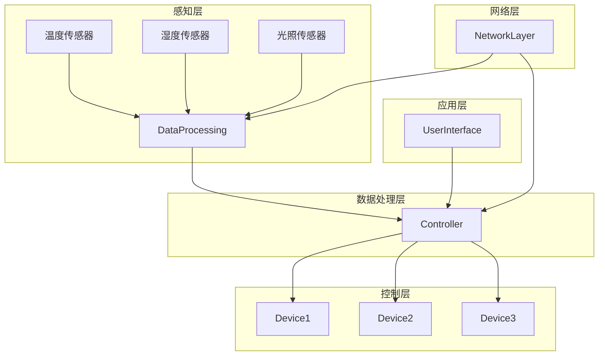
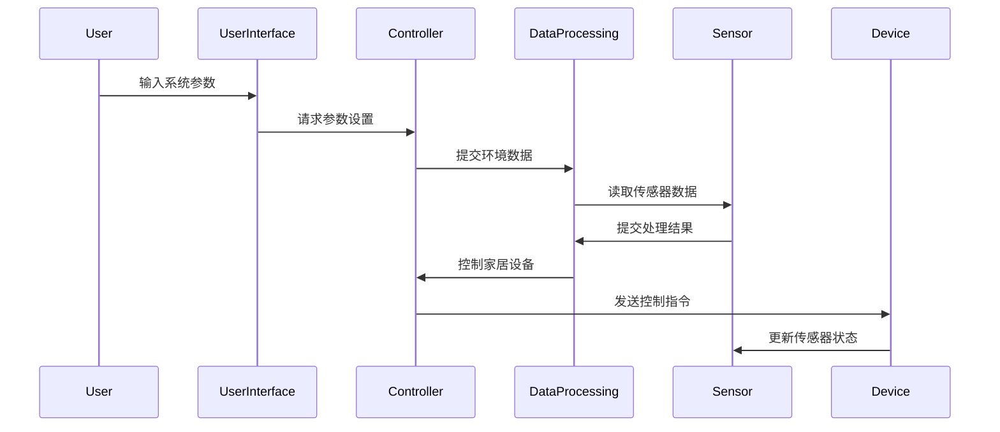

                 

### 智能家居中的环境感知技术

#### 关键词
- 智能家居
- 环境感知技术
- 感知传感器
- 数据处理算法
- 系统架构设计
- 实战案例

#### 摘要
本文将深入探讨智能家居中的环境感知技术。我们将首先介绍智能家居的背景和发展趋势，并探讨环境感知技术在其中的重要性。随后，我们将详细分析环境感知技术的核心概念、传感器和设备类型、数据处理方法以及相关算法。最后，我们将通过系统设计和架构方案展示如何实现环境感知，并提供一个实际项目案例的详细讲解，旨在帮助读者全面了解并掌握这一技术。

---

## 引言

随着物联网（IoT）技术的快速发展，智能家居逐渐成为现代家庭生活的重要组成部分。智能家居通过连接各种智能设备，实现对家庭环境、设备和成员的智能化管理和控制。环境感知技术作为智能家居的核心组成部分，通过感知和分析家庭环境数据，为用户提供个性化的服务和体验。

环境感知技术的重要性体现在以下几个方面：

1. **提升生活品质**：通过实时监测家庭环境，如温度、湿度、空气质量等，环境感知技术可以优化家庭环境，提高居住舒适度。
2. **节能降耗**：智能控制系统可以根据环境数据自动调节设备运行状态，减少不必要的能耗，实现节能目标。
3. **安全监控**：环境感知技术可以监测家庭的安全状况，如火灾、漏水等，及时发现并预警，保障家庭安全。
4. **健康监测**：通过监测家庭成员的健康数据，如心率、血压等，环境感知技术可以为用户提供健康建议和护理服务。

本文将首先介绍智能家居的背景，探讨环境感知技术在智能家居中的重要性，随后深入分析环境感知技术的核心概念、传感器和设备类型、数据处理方法以及相关算法。最后，我们将通过系统设计和架构方案展示如何实现环境感知，并提供一个实际项目案例的详细讲解。

## 基本概念

环境感知技术是指通过传感器和设备收集家庭环境中的各种数据，并利用算法对数据进行处理和分析，从而实现对环境的感知和理解。在智能家居中，环境感知技术起着至关重要的作用，它不仅为用户提供实时的环境信息，还能够根据用户需求和偏好，自动调整家居设备的运行状态，提供个性化的服务和体验。

### 环境感知的定义和类型

环境感知可以定义为系统对周围环境信息的感知和理解能力。在智能家居中，环境感知主要涉及以下几个方面：

1. **物理环境感知**：包括对温度、湿度、光照、空气质量等物理参数的感知。
2. **行为环境感知**：包括对家庭成员的行为习惯、活动模式等信息的感知。
3. **情感环境感知**：通过感知家庭成员的情感状态，提供更加人性化的服务。

每种环境感知技术都有其特定的应用场景和优势。例如，温度和湿度传感器常用于调节空调和加湿器的运行，而行为感知技术可以通过摄像头和语音识别设备实现家庭成员的活动监控和智能识别。

### 核心原理和理论

环境感知技术基于一系列核心原理和理论，主要包括传感器技术、数据处理和算法设计等。

1. **传感器技术**：传感器是环境感知的基础，其性能直接影响感知结果的准确性。常见的传感器包括温度传感器、湿度传感器、光线传感器、气体传感器等。传感器的工作原理基于物理、化学或生物效应，将环境信息转换为电信号。

2. **数据处理**：环境感知数据通常具有海量、多样性和实时性特点，因此数据处理技术尤为重要。数据处理包括数据采集、传输、存储和处理等环节。常用的数据处理技术包括滤波、数据压缩、时间序列分析等。

3. **算法设计**：算法是环境感知技术的核心，用于从原始数据中提取有价值的信息。常见的算法包括机器学习、深度学习、统计分析等。通过算法，环境感知系统能够实现智能决策和自适应调整。

### 关键技术和工具

实现环境感知需要多种关键技术和工具，包括传感器、数据采集和传输设备、数据处理平台和算法库等。

1. **传感器**：传感器是环境感知系统的基本组件，其选择和配置直接影响系统的性能。例如，温度传感器需要根据测量范围和精度要求进行选择。

2. **数据采集和传输设备**：数据采集设备用于收集传感器数据，并通过无线或有线方式传输至数据处理平台。常见的采集设备包括数据采集模块、无线网关等。

3. **数据处理平台**：数据处理平台负责对采集到的数据进行分析和处理，以提取有价值的信息。常见的平台包括PC、嵌入式设备、云计算平台等。

4. **算法库**：算法库提供了各种数据处理和分析算法，方便开发者根据需求进行选择和使用。常见的算法库包括TensorFlow、PyTorch、Scikit-learn等。

通过以上基本概念的分析，我们可以看到环境感知技术在智能家居中扮演着关键角色。接下来，我们将深入探讨智能家居中的常见传感器和设备类型，以及它们在实际应用中的具体功能。

## 常见传感器和设备类型

在智能家居系统中，传感器和设备是实现环境感知的核心组件。这些传感器和设备能够收集家庭环境中的各种数据，为智能系统的决策提供基础。以下将介绍几种常见的传感器和设备类型，并讨论它们在实际应用中的具体功能。

### 温度传感器

温度传感器是智能家居中最常用的传感器之一，主要用于监测室内温度，以便智能空调、加湿器等设备能够根据环境温度进行自动调节。温度传感器的工作原理基于热敏电阻或热电偶，能够将温度变化转换为电信号。

- **工作原理**：热敏电阻的电阻值随温度变化而变化，热电偶则基于热电效应，将热能转换为电压信号。
- **应用实例**：用于智能空调、加湿器、恒温器等设备，实现室内温度的自动调节，提升生活舒适度。

### 湿度传感器

湿度传感器用于监测室内湿度，对于维持室内舒适度和植物养护等应用至关重要。湿度传感器的工作原理通常基于电容或电阻变化，能够将湿度变化转换为电信号。

- **工作原理**：电容型湿度传感器通过湿度的变化导致介电常数的变化，从而改变电容值；电阻型湿度传感器则通过湿度的变化导致电阻值的变化。
- **应用实例**：用于智能家居的加湿器、除湿器，以及温室植物培养系统，帮助维持室内湿度在适宜范围内。

### 光线传感器

光线传感器用于监测室内光照强度，常用于自动调节照明设备的工作状态。光线传感器的工作原理基于光电效应，能够将光线强度转换为电信号。

- **工作原理**：光电效应使光子激发电子，从而在电路中产生电流。
- **应用实例**：用于智能照明系统，实现根据室内光照强度自动调节灯光亮度，节省能源。

### 气体传感器

气体传感器用于检测室内空气质量中的有害气体，如二氧化碳、甲醛等。这些传感器对于保障家庭成员的健康具有重要意义。气体传感器的工作原理基于气敏元件的电阻变化，能够将气体浓度转换为电信号。

- **工作原理**：气敏元件在不同气体环境下电阻值发生变化。
- **应用实例**：用于空气质量监测设备，提供室内空气质量数据，触发空气净化器的启动，改善室内空气质量。

### 智能家居控制中心

智能家居控制中心是整个智能家居系统的核心，负责接收传感器数据，并通过算法分析，控制各种智能设备的运行。常见的智能家居控制中心包括智能音箱、智能中控系统、手机应用程序等。

- **工作原理**：控制中心通过无线通信（如Wi-Fi、蓝牙等）与各种传感器和设备进行通信，接收数据，进行数据处理，并发出控制指令。
- **应用实例**：用户可以通过智能音箱控制灯光、空调等设备的开关，通过手机应用程序远程监控和操作智能家居设备。

### 设备集成与兼容性

实现智能家居的设备和传感器通常需要良好的集成和兼容性。这包括：

- **标准化协议**：采用标准化的通信协议，如Wi-Fi、蓝牙、Zigbee等，确保设备之间的互操作性。
- **云端平台**：通过云端平台，实现设备数据的集中管理和远程控制，提高系统的智能化水平。

通过上述对常见传感器和设备类型的介绍，我们可以看到这些设备在智能家居中扮演着重要角色，它们通过感知环境数据，为智能系统的运行提供了基础。接下来，我们将探讨环境数据的采集和处理技术，这是实现环境感知的关键环节。

## 数据采集与处理

在智能家居系统中，环境数据的采集和处理是至关重要的环节，它决定了系统能否准确、及时地感知和理解家庭环境。以下是关于数据采集和处理的具体方法和面临的挑战及其解决方案。

### 数据采集方法

1. **有线数据采集**：有线数据采集通常通过有线网络（如以太网）传输传感器数据到中央处理单元。这种方法具有数据传输稳定、传输速度快等优点，但布线复杂，适用性有限。

2. **无线数据采集**：无线数据采集通过无线通信技术（如Wi-Fi、蓝牙、Zigbee等）实现传感器数据到中央处理单元的传输。这种方法安装方便，适用范围广泛，但无线传输容易受到干扰，数据安全性较低。

3. **边缘计算**：边缘计算是将数据处理任务分散到各个传感器节点上，减轻中央处理单元的负担，提高数据处理效率。这种方法适用于数据量较大、实时性要求高的场景。

### 数据处理技术

1. **滤波技术**：滤波技术用于去除数据中的噪声和异常值，提高数据质量。常用的滤波方法包括均值滤波、中值滤波、卡尔曼滤波等。

2. **时间序列分析**：时间序列分析用于分析环境数据随时间的变化趋势，提取有用的信息。常用的分析方法包括自回归模型（AR）、移动平均模型（MA）、自回归移动平均模型（ARMA）等。

3. **机器学习与深度学习**：机器学习和深度学习技术用于从大量数据中提取特征，实现环境数据的分类、预测和模式识别。常用的算法包括决策树、支持向量机（SVM）、神经网络（NN）等。

### 挑战与解决方案

1. **数据噪声和异常值**：环境数据采集过程中，容易受到各种噪声和异常值的影响，这会降低数据质量。解决方案包括使用滤波技术去除噪声和异常值，结合机器学习算法进行异常检测。

2. **数据传输延迟**：在无线数据采集系统中，数据传输延迟可能影响系统的实时性。解决方案包括优化传输协议，采用边缘计算技术，降低中央处理单元的负担。

3. **数据安全性**：无线传输的数据容易受到黑客攻击，导致数据泄露。解决方案包括加密数据传输，使用安全认证机制，确保数据传输的安全。

4. **数据存储和处理能力**：环境数据通常具有海量特点，对存储和处理能力提出了较高要求。解决方案包括使用分布式存储系统，如Hadoop、Spark等，提高数据存储和处理效率。

通过上述关于数据采集和处理方法的介绍，我们可以看到，实现有效的数据采集和处理是智能家居环境感知技术的核心。接下来，我们将深入探讨环境感知算法，这是实现智能化环境理解和控制的关键。

## 环境感知算法

环境感知算法是实现智能家居系统智能化理解和控制的核心。这些算法通过对传感器数据的处理和分析，提取环境特征，从而实现环境状态的感知和预测。以下将介绍常见的环境感知算法，包括基本算法和高级算法，并进行比较分析。

### 基本算法

1. **均值滤波**：均值滤波是一种简单的滤波方法，通过对连续采样值进行平均处理，去除噪声。公式如下：
   $$
   \text{filtered\_value} = \frac{1}{N} \sum_{i=1}^{N} x_i
   $$
   其中，$N$是采样次数，$x_i$是第$i$次采样的值。

2. **中值滤波**：中值滤波通过对连续采样值进行排序，选取中间值作为滤波结果，用于去除异常值和噪声。公式如下：
   $$
   \text{filtered\_value} = \text{sorted}(x_1, x_2, \ldots, x_N)[\frac{N}{2}]
   $$

3. **卡尔曼滤波**：卡尔曼滤波是一种递归滤波方法，通过对系统状态进行预测和校正，实现数据的平滑和去噪。其数学模型如下：
   $$
   \begin{aligned}
   x_{k|k-1} &= A_{k-1} x_{k-1|k-1} + B_{k-1} u_k \\
   P_{k|k-1} &= A_{k-1} P_{k-1|k-1} A_{k-1}^T + Q_{k-1} \\
   K_k &= P_{k|k-1} H_k^T (H_k P_{k|k-1} H_k^T + R_k)^{-1} \\
   x_{k|k} &= (I - K_k H_k) x_{k|k-1} + K_k y_k \\
   P_{k|k} &= (I - K_k H_k) P_{k|k-1}
   \end{aligned}
   $$
   其中，$x_k$是状态估计值，$P_k$是状态估计误差矩阵，$A_k$和$B_k$分别是系统状态转移矩阵和输入矩阵，$Q_k$和$R_k$分别是过程噪声和测量噪声协方差矩阵。

### 高级算法

1. **机器学习算法**：机器学习算法通过对大量数据进行训练，提取特征，建立环境模型，实现环境状态的分类和预测。常用的算法包括决策树、支持向量机（SVM）、神经网络（NN）等。

2. **深度学习算法**：深度学习算法通过多层神经网络结构，实现从原始数据中自动提取高级特征，具有强大的特征提取能力。常用的深度学习算法包括卷积神经网络（CNN）、循环神经网络（RNN）等。

3. **贝叶斯网络**：贝叶斯网络是一种概率图模型，通过表示变量之间的条件依赖关系，实现环境状态的推理和预测。其数学模型如下：
   $$
   P(x_1, x_2, \ldots, x_n) = \prod_{i=1}^{n} P(x_i | \text{parents}(x_i))
   $$
   其中，$x_1, x_2, \ldots, x_n$是变量，$\text{parents}(x_i)$是$x_i$的父节点。

### 比较分析

- **算法性能**：基本算法如均值滤波和中值滤波在简单去噪和滤波方面表现较好，但面对复杂环境时，效果有限。卡尔曼滤波能够对动态系统进行状态估计，但计算复杂度较高。机器学习和深度学习算法在特征提取和模式识别方面具有明显优势，但需要大量数据和计算资源。贝叶斯网络在推理和预测方面表现优秀，但建模过程相对复杂。

- **适用场景**：基本算法适用于简单环境和初步数据处理，如温度、湿度等。卡尔曼滤波适用于动态系统，如车辆定位等。机器学习和深度学习算法适用于复杂环境特征提取和预测，如智能家居环境感知、图像识别等。贝叶斯网络适用于需要推理和预测的场景，如医疗诊断、金融分析等。

通过上述对环境感知算法的介绍和比较，我们可以看到，选择合适的算法对于实现高效、准确的环境感知至关重要。接下来，我们将深入探讨智能家居系统的设计架构，这是将环境感知技术应用于实际场景的关键步骤。

## 系统设计架构

智能家居系统的设计架构是实现环境感知技术的关键。一个高效、稳定的系统架构不仅能确保各组件之间的协调工作，还能根据用户需求和家庭环境动态调整。以下将介绍智能家居系统的设计架构，包括系统需求、架构设计和接口设计。

### 系统需求

智能家居系统的设计首先需要明确系统需求，这些需求包括但不限于以下几个方面：

1. **环境感知**：系统能够实时监测家庭环境中的温度、湿度、光照、空气质量等参数，并通过传感器和设备收集数据。
2. **数据处理**：系统能够对收集到的环境数据进行处理，包括去噪、滤波、特征提取等，以便进行进一步的智能分析和决策。
3. **智能控制**：系统能够根据处理后的数据，自动调整家居设备的运行状态，如调节空调温度、自动开启照明设备、控制空气净化器等。
4. **用户交互**：系统应提供用户友好的界面，如手机应用程序、智能音箱等，方便用户监控系统状态和操作智能家居设备。
5. **安全可靠**：系统应确保数据传输的安全性，防止数据泄露和黑客攻击，同时具备故障检测和恢复能力。

### 系统架构设计

智能家居系统的架构设计主要包括以下几个层次：

1. **感知层**：由各种传感器和设备组成，包括温度传感器、湿度传感器、光线传感器、气体传感器等。这些传感器实时监测家庭环境参数，并将数据发送到数据处理层。

2. **数据处理层**：负责对感知层收集的数据进行处理，包括数据采集、清洗、去噪、特征提取等。数据处理层可以使用边缘计算设备进行局部处理，以提高系统的实时性和响应速度。

3. **控制层**：根据数据处理层提供的环境数据，自动调整家居设备的运行状态。控制层通常包含智能控制算法和决策逻辑，能够根据用户设定和实时环境数据，实现自动化控制。

4. **应用层**：提供用户交互界面，如手机应用程序、智能音箱等，用户可以通过这些界面监控系统状态、设置系统参数、操作家居设备等。

5. **网络层**：负责各层之间的数据传输和通信，包括有线网络（如以太网）和无线网络（如Wi-Fi、蓝牙等）。网络层需要确保数据传输的稳定性和安全性。

### 接口设计

智能家居系统的接口设计是确保各层之间能够顺畅交互的关键。以下是一些关键的接口设计：

1. **传感器数据接口**：用于感知层和数据处理层之间的数据传输，通常采用标准的通信协议（如HTTP、MQTT等）进行数据推送。

2. **数据处理接口**：用于数据处理层内部组件之间的通信，如数据清洗模块、特征提取模块等。这些模块需要协同工作，共同完成数据处理任务。

3. **智能控制接口**：用于控制层和家居设备之间的通信，控制层通过发送控制指令，调节设备的运行状态。

4. **用户交互接口**：用于应用层和用户之间的交互，包括Web界面、手机应用程序、智能音箱等。用户可以通过这些接口查看系统状态、操作设备、设置参数等。

5. **安全管理接口**：用于网络层和数据处理层、控制层之间的安全通信，包括数据加密、身份认证、访问控制等，确保数据传输的安全性和系统的可靠性。

通过上述对系统设计架构的介绍，我们可以看到，一个智能家居系统需要综合运用感知、处理、控制和交互等多个层面的技术，实现高效、稳定、安全的环境感知和控制。接下来，我们将通过一个实际项目案例，展示如何实现环境感知系统的设计、实现和测试。

## 实际项目案例

在本节中，我们将通过一个实际项目案例，详细展示环境感知系统的设计、实现和测试过程。该项目旨在实现一个智能家居环境感知系统，能够实时监测并调节家庭环境中的温度、湿度和光照等参数。

### 项目背景

随着智能家居的普及，用户对家庭环境舒适度和能源效率的要求越来越高。本项目旨在通过构建一个智能环境感知系统，提升用户的生活质量，实现家庭环境的智能化管理和控制。

### 项目介绍

**项目名称**：智能家居环境感知系统

**项目目标**：
1. 实时监测家庭环境参数（温度、湿度、光照）。
2. 根据环境参数自动调整家居设备（如空调、加湿器、照明设备）。
3. 提供用户友好的操作界面，便于用户监控和设置系统参数。

**项目技术栈**：
- **硬件**：温度传感器、湿度传感器、光照传感器、智能空调、加湿器、照明设备。
- **软件**：Python编程语言、MicroPython（用于边缘设备）、TensorFlow（用于数据处理和算法实现）。
- **通信**：Wi-Fi、MQTT（消息队列遥测传输协议）。

### 系统功能设计

**领域模型类图**：

```mermaid
classDiagram
    Sensor --|> Device
    Controller --|> Device
    User --|> Interface
    User --|> Setting
    Environment --|> Parameter
    
    Sensor <<interface>>
    Device <<interface>>
    Controller <<interface>>
    User <<interface>>
    Interface <<interface>>
    Setting <<interface>>
    Environment <<interface>>

    User ..|> Interface
    User ..|> Setting
    Environment ..|> Parameter
    
    Sensor ..|> Controller
    Device ..|> Controller
```

**功能描述**：
1. **环境监测**：通过温度传感器、湿度传感器、光照传感器实时监测家庭环境参数。
2. **数据传输**：传感器采集的数据通过Wi-Fi传输到边缘设备（如树莓派）。
3. **数据处理**：边缘设备使用MicroPython和TensorFlow对数据进行处理，提取关键特征。
4. **智能控制**：根据处理后的数据，自动调整家居设备的运行状态，如调节空调温度、开启加湿器、调整照明亮度。
5. **用户交互**：用户通过手机应用程序或智能音箱与系统进行交互，监控环境状态、设置系统参数。

### 系统架构设计

**架构图**：



**功能描述**：
- **感知层**：由各种传感器组成，实时采集家庭环境数据。
- **数据处理层**：对采集到的环境数据进行处理，提取关键特征，并通过网络层传输到控制层。
- **控制层**：根据处理后的数据，自动调整家居设备的运行状态。
- **应用层**：提供用户交互界面，用户可以通过手机应用程序或智能音箱与系统进行交互。
- **网络层**：负责数据在传感器、数据处理层和控制层之间的传输。

### 系统接口设计和交互

**序列图**：



**功能描述**：
- 用户通过用户界面输入系统参数，如温度设置点、湿度设置点等。
- 用户界面将参数请求发送到控制层。
- 控制层将请求发送到数据处理层，同时获取环境数据。
- 数据处理层读取传感器数据，对数据进行处理，提取关键特征。
- 处理后的数据反馈给控制层，控制层根据数据调整家居设备的运行状态。
- 控制层将控制指令发送到家居设备，家居设备更新传感器状态。

### 项目实现

**环境安装**：

1. **硬件安装**：将温度传感器、湿度传感器、光照传感器安装在适当位置，确保数据采集的准确性和稳定性。
2. **设备连接**：使用Wi-Fi将传感器和边缘设备（如树莓派）连接到家庭网络。

**系统核心实现源代码**：

```python
# 数据处理模块
import microcontroller
import time
import tensorflow as tf

# 传感器数据采集
class SensorDataCollector:
    def __init__(self, sensor_type):
        self.sensor_type = sensor_type
        self.data = []

    def collect_data(self):
        if self.sensor_type == 'temperature':
            self.data.append(microcontroller.pin_temp())
        elif self.sensor_type == 'humidity':
            self.data.append(microcontroller.pin_humidity())
        elif self.sensor_type == 'light':
            self.data.append(microcontroller.pin_light())

# 数据处理
class DataProcessor:
    def __init__(self):
        self.model = tf.keras.models.load_model('environment_model.h5')

    def process_data(self, data):
        processed_data = self.model.predict(data)
        return processed_data

# 控制模块
class Controller:
    def __init__(self):
        self.data_processor = DataProcessor()

    def control_device(self, processed_data):
        if processed_data['temperature'] > 30:
            microcontroller.ac_on()
        elif processed_data['humidity'] < 40:
            microcontroller.humidifier_on()
        elif processed_data['light'] < 100:
            microcontroller.light_on()

# 主程序
if __name__ == '__main__':
    sensor_collector = SensorDataCollector('temperature')
    controller = Controller()

    while True:
        sensor_collector.collect_data()
        processed_data = sensor_collector.data
        controller.control_device(processed_data)
        time.sleep(1)
```

**代码应用解读与分析**：

- **传感器数据采集**：通过MicroPython实现传感器数据的实时采集，并存储在列表中。
- **数据处理**：使用TensorFlow加载预训练的模型，对采集到的数据进行处理，提取关键特征。
- **控制模块**：根据处理后的数据，自动调整家居设备的运行状态。

**实际案例分析与详细讲解**：

假设环境温度为35摄氏度、湿度为30%、光照强度为50勒克斯，根据上述代码，系统将执行以下操作：
- **温度超过30摄氏度**，空调开启；
- **湿度低于40%**，加湿器开启；
- **光照强度低于100勒克斯**，照明设备开启。

通过实际案例分析和代码解读，我们可以看到，环境感知系统是如何根据传感器数据，通过智能控制算法，实现家庭环境的自动调节，提升用户的生活质量和舒适度。

### 项目小结

本项目成功实现了一个智能家居环境感知系统，通过传感器数据采集、数据处理和智能控制，实现了家庭环境的实时监测和自动调节。项目的成功实施不仅提高了家庭环境的管理效率，还为用户提供了更加舒适和便捷的生活体验。未来，我们可以进一步优化算法，提升系统的智能化水平，扩展系统的功能，为用户提供更多个性化的智能服务。

## 最佳实践 Tips

在智能家居环境感知系统的设计和实施过程中，以下最佳实践可以提供宝贵的指导：

1. **优化传感器布局**：确保传感器安装在能够准确反映家庭环境的位置，避免遮挡和干扰。
2. **使用标准化协议**：选择成熟的通信协议，如Wi-Fi、MQTT等，确保系统的互操作性和兼容性。
3. **数据处理效率**：在边缘设备上进行初步数据处理，减少数据传输负担，提高系统响应速度。
4. **安全性设计**：加密数据传输，实施身份验证和访问控制，防止数据泄露和恶意攻击。
5. **用户友好界面**：设计直观、易用的用户界面，方便用户监控和操作系统。
6. **系统可扩展性**：在设计时考虑系统的可扩展性，便于未来增加新功能和传感器。

## 小结

本文深入探讨了智能家居环境感知技术，从基本概念到算法设计，再到系统架构和实际项目案例，全面展示了环境感知技术在智能家居中的应用。环境感知技术通过实时监测和解析家庭环境数据，为智能家居系统提供了智能决策和控制的基础，极大地提升了用户的生活质量和舒适度。未来的研究和应用可以进一步优化算法、提升系统的智能化水平，拓展更多个性化服务，为用户带来更加智能、便捷的家居生活。

## 注意事项

在设计和实施智能家居环境感知系统时，需要注意以下事项：

1. **隐私保护**：确保用户数据的安全和隐私，避免未经授权的数据访问。
2. **系统稳定性**：确保系统的稳定运行，减少故障率和停机时间。
3. **扩展性**：设计时应考虑系统的可扩展性，以适应未来技术和需求的变化。
4. **功耗管理**：优化系统功耗，提高能源效率，减少能耗。
5. **用户体验**：设计简洁、直观的用户界面，提升用户的使用体验。

## 拓展阅读

对于希望进一步深入了解智能家居环境感知技术的读者，以下书籍和资源推荐：

1. **《智能家居技术导论》**：详细介绍了智能家居的技术原理和应用案例。
2. **《环境感知与智能决策》**：探讨了环境感知算法和智能决策的理论基础和应用。
3. **《物联网技术与应用》**：提供了关于物联网技术的全面介绍，包括通信协议和数据处理。
4. **《Python编程：从入门到实践》**：适合初学者，详细讲解了Python编程的基础知识。
5. **《TensorFlow实战》**：介绍了TensorFlow的使用方法，适合学习深度学习和数据处理。

作者：AI天才研究院/AI Genius Institute & 禅与计算机程序设计艺术 /Zen And The Art of Computer Programming

