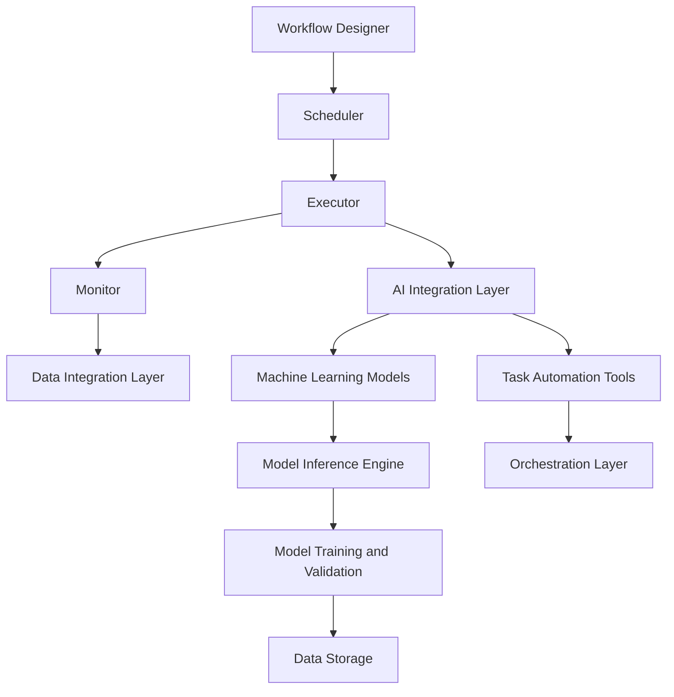
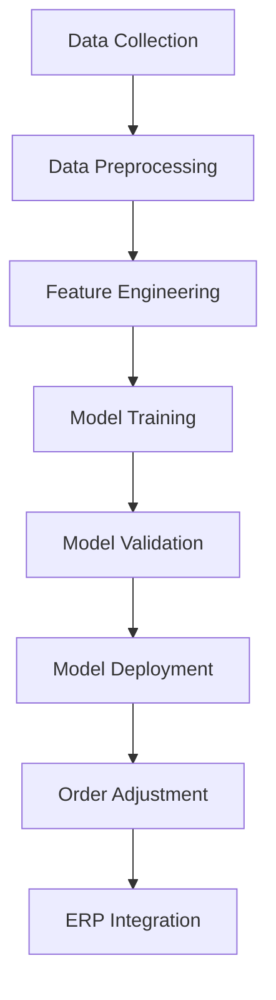

                 

### Introduction to Smart Workflow Automation

In today's fast-paced business world, efficiency is the key to success. Manual and repetitive tasks can consume a significant amount of time and resources, leading to decreased productivity and increased operational costs. This is where smart workflow automation comes into play. Smart workflow automation leverages advanced technologies like artificial intelligence (AI), machine learning, and robotics to streamline and optimize business processes, ultimately improving efficiency and driving better business outcomes.

#### Problem Background and Description

The need for automation in modern business processes is driven by several factors. Firstly, businesses are increasingly facing challenges such as high competition, rapidly changing market conditions, and the need to deliver high-quality products and services at competitive prices. Automating workflows can help businesses stay agile and responsive to these challenges. Secondly, manual tasks are often prone to errors and inconsistencies, leading to inefficiencies and subpar performance. Automation minimizes these risks by ensuring tasks are executed consistently and accurately.

Traditional workflow management often relies on manual processes, which can be time-consuming and prone to errors. For example, a finance department may spend hours manually processing invoices, entering data into spreadsheets, and reconciling accounts. These tasks can be tedious and repetitive, taking away valuable time from employees who could be focusing on more strategic activities. Moreover, traditional workflows often lack transparency and accountability, making it difficult to track progress and identify bottlenecks.

#### Problem Solution and Scope

Smart workflow automation offers a solution to these challenges by automating repetitive tasks, reducing human error, and improving overall efficiency. The scope of smart workflow automation includes various aspects such as automating data entry, routing tasks to the appropriate team members, and triggering actions based on predefined rules. This can significantly reduce the time and effort required to complete tasks, freeing up employees to focus on more strategic and value-adding activities.

However, it's important to define the boundaries of smart workflow automation to avoid overreach. While automation can handle many tasks, it may not be suitable for complex, judgment-based tasks that require human expertise and decision-making. Additionally, smart workflow automation should be implemented within the context of overall business processes to ensure seamless integration and maximum efficiency.

#### Basic Concepts and Relationships

To understand smart workflow automation, it's essential to grasp some basic concepts and their relationships. Workflow management involves the design, execution, and monitoring of business processes. Automation technologies, such as robotic process automation (RPA) and business process management (BPM), are tools used to automate these workflows. AI, on the other hand, enhances these automation technologies by enabling intelligent decision-making and adaptation based on data and patterns.

### Key Concepts and Attributes Comparison Table

| Concepts                    | Definition                                                                                                  | Advantages                                     | Applications                                  |
|-----------------------------|-----------------------------------------------------------------------------------------------------------|------------------------------------------------|-----------------------------------------------|
| Workflow Management          | The process of designing, executing, and monitoring business processes.                             | Increases efficiency, transparency, and accountability. | Manufacturing, finance, human resources, etc. |
| Automation Technologies      | Tools and techniques used to automate repetitive tasks and processes.                               | Reduces human error, saves time, and resources. | Data entry, invoice processing, etc.          |
| AI in Workflow Automation    | The application of artificial intelligence to enhance workflow automation by enabling intelligent decision-making. | Improves accuracy, adaptability, and efficiency. | Task routing, anomaly detection, etc.          |

In summary, smart workflow automation is a powerful tool for improving business efficiency. By understanding the background, solutions, and basic concepts, businesses can better leverage this technology to streamline their operations and achieve better outcomes.

#### Table of Contents and Outline

Now that we have a clear understanding of smart workflow automation, let's outline the structure of the article. The table of contents will guide the reader through the various topics we will cover, providing a comprehensive overview of the subject matter.

### Table of Contents

1. **Introduction to Smart Workflow Automation**
   - Problem Background and Description
   - Problem Solution and Scope
   - Basic Concepts and Relationships
   - Key Concepts and Attributes Comparison Table

2. **AI Basics for Workflow Automation**
   - Introduction to AI
   - AI Principles and Models
   - AI and Business Workflow

3. **Design Principles and Architectures of AI-Driven Workflows**
   - Design Principles
   - Workflow Architecture
   - AI-Driven Workflow Architecture

4. **Implementing AI-Driven Workflows**
   - System Design and Implementation
   - AI Workflow Development Process
   - Example: Building an AI-Driven Workflow

5. **Best Practices and Challenges**
   - Best Practices for Implementing AI-Driven Workflows
   - Common Challenges and Solutions
   - Future Trends and Opportunities

### Outline

1. **Introduction**
   - Brief overview of the article and its importance in modern business.
   - The need for automation in modern business processes.

2. **Chapter 1: Background and Basic Concepts of Smart Workflow Automation**
   - Detailed discussion on the background of smart workflow automation.
   - Explanation of key concepts and their relationships.

3. **Chapter 2: AI Basics for Workflow Automation**
   - Introduction to AI and its evolution.
   - Overview of AI principles and models.
   - The role of AI in enhancing workflow automation.

4. **Chapter 3: Design Principles and Architectures of AI-Driven Workflows**
   - Presentation of design principles for AI-driven workflows.
   - Detailed explanation of workflow architectures.
   - Description of AI-driven workflow architecture with a mermaid diagram.

5. **Chapter 4: Implementing AI-Driven Workflows**
   - Overview of the system design and implementation process.
   - Discussion on the development process of AI-driven workflows.
   - Example of building an AI-driven workflow.

6. **Chapter 5: Best Practices and Challenges**
   - Best practices for implementing AI-driven workflows.
   - Common challenges and their solutions.
   - Future trends and opportunities in smart workflow automation.

This structured outline ensures that the article is comprehensive, informative, and easy to follow. It provides a clear path for readers to understand the concepts of smart workflow automation and its practical applications in modern business environments.

### AI Basics for Workflow Automation

#### Introduction to AI

Artificial Intelligence (AI) is a branch of computer science that focuses on creating intelligent machines capable of performing tasks that typically require human intelligence. AI has evolved significantly over the past few decades, driven by advances in computing power, algorithms, and data availability. Today, AI encompasses a wide range of technologies and applications, from simple rule-based systems to complex machine learning models and deep neural networks.

The evolution of AI can be traced back to the 1950s when the concept of artificial intelligence was first introduced. Early AI systems were based on symbolic logic and rule-based approaches, which were limited in their ability to handle complex, real-world problems. As computational power increased and algorithms improved, AI began to incorporate more advanced techniques such as machine learning and deep learning.

Machine learning (ML) is a subset of AI that enables machines to learn from data, identify patterns, and make decisions with minimal human intervention. ML algorithms use statistical techniques to identify relationships between inputs and outputs, allowing them to predict outcomes based on new data. Supervised learning, unsupervised learning, and reinforcement learning are the three main types of machine learning.

Deep learning (DL) is a subfield of machine learning that uses artificial neural networks to model complex relationships in data. Deep neural networks consist of multiple layers of interconnected nodes, which allow them to learn and extract hierarchical representations of the data. This makes deep learning particularly effective for tasks such as image and speech recognition, natural language processing, and time series analysis.

#### AI Principles and Models

AI principles and models are the foundational concepts that underpin the development and application of AI technologies. Understanding these principles is crucial for designing effective AI-driven workflows.

**Machine Learning**

Machine learning algorithms are designed to learn from data and make predictions or decisions based on that data. The process typically involves the following steps:

1. **Data Collection:** Gathering relevant data for the task at hand. This may involve collecting structured data from databases, unstructured data from the web, or sensor data from IoT devices.
2. **Data Preprocessing:** Cleaning and preparing the data for training. This may involve handling missing values, scaling features, and transforming the data into a suitable format for the algorithm.
3. **Model Selection:** Choosing an appropriate machine learning model based on the nature of the problem and the type of data. Common models include linear regression, decision trees, support vector machines, and neural networks.
4. **Model Training:** Training the selected model on the preprocessed data. This involves adjusting the model's parameters to minimize the difference between its predictions and the actual outcomes.
5. **Model Evaluation:** Evaluating the performance of the trained model using metrics such as accuracy, precision, recall, and F1 score. This helps to ensure that the model is generalizing well to new, unseen data.
6. **Deployment:** Deploying the trained model into a production environment, where it can make predictions or decisions in real-time.

**Deep Learning**

Deep learning algorithms are similar to machine learning algorithms but use neural networks with many layers to learn complex patterns in data. The key components of a deep learning model include:

1. **Input Layer:** The first layer of the neural network, which receives input data and passes it to the next layer.
2. **Hidden Layers:** Intermediate layers that transform the input data through a series of weighted connections and activation functions. Each hidden layer learns to extract higher-level features from the data.
3. **Output Layer:** The final layer of the neural network, which produces the output predictions or decisions based on the transformed input data.

Deep learning models are typically trained using a technique called backpropagation, which involves propagating the errors from the output layer back through the network to update the weights and biases of the connections.

**Reinforcement Learning**

Reinforcement learning (RL) is a type of machine learning where an agent learns to make decisions by interacting with an environment and receiving feedback in the form of rewards or penalties. The goal of RL is to learn a policy, which is a mapping from states to actions that maximizes the cumulative reward over time.

The process of reinforcement learning involves the following steps:

1. **State-Action Space:** Defining the set of possible states and actions that the agent can experience in the environment.
2. **Policy:** A function that maps states to actions, guiding the agent's decision-making process.
3. **Reward Function:** A function that assigns a reward or penalty to each action taken by the agent, based on the outcome of that action.
4. **Learning Algorithm:** An algorithm that updates the agent's policy based on the received rewards and penalties.
5. **Interaction:** The agent interacts with the environment by taking actions and observing the outcomes, using its learned policy to make decisions.

#### AI and Business Workflow

AI has a profound impact on business workflows, enabling organizations to automate tasks, improve decision-making, and enhance overall efficiency. Here are some key ways in which AI enhances business workflows:

**Task Automation**

AI-driven task automation involves using machine learning models to automate repetitive and routine tasks, such as data entry, invoice processing, and customer support. By automating these tasks, businesses can reduce manual effort, minimize errors, and free up employees to focus on more strategic activities.

**Predictive Analytics**

AI enables businesses to perform predictive analytics by analyzing historical data and identifying patterns and trends. This allows organizations to make data-driven decisions and predict future outcomes, such as customer behavior, demand forecasting, and risk assessment.

**Chatbots and Virtual Assistants**

AI-powered chatbots and virtual assistants can interact with customers, answer their questions, and provide support, improving the overall customer experience. These AI systems can handle large volumes of queries simultaneously, ensuring quick and accurate responses.

**Anomaly Detection**

AI algorithms can detect anomalies and outliers in data, which can be used to identify potential fraud, security breaches, or operational issues. By detecting these anomalies in real-time, businesses can take proactive measures to mitigate risks and prevent potential problems.

**Personalization**

AI can be used to personalize customer experiences by analyzing customer data and providing tailored recommendations, offers, and content. This can lead to increased customer satisfaction and loyalty, as well as higher conversion rates.

In summary, AI is a powerful tool for enhancing business workflows by automating tasks, improving decision-making, and providing personalized experiences. By leveraging AI technologies, organizations can achieve greater efficiency, reduce costs, and gain a competitive edge in the marketplace.

### Design Principles and Architectures of AI-Driven Workflows

When designing AI-driven workflows, it's crucial to establish a solid foundation of design principles and architectures that ensure modularity, scalability, interoperability, and security. These principles and architectures will help in creating efficient, flexible, and robust systems capable of driving business process optimization.

#### Design Principles

**Modularity**

Modularity is the cornerstone of effective system design. It involves breaking down a complex system into smaller, independent components that can be developed, tested, and maintained separately. This modular approach enables easier updates and maintenance, as well as facilitating collaboration among developers.

**Scalability**

Scalability ensures that the system can handle increasing workloads and growing data volumes without significant degradation in performance. This principle is vital for businesses that anticipate growth or fluctuating demand. A scalable system can seamlessly accommodate these changes, ensuring consistent performance and user satisfaction.

**Interoperability**

Interoperability is the ability of different systems and components to communicate and work together effectively. In the context of AI-driven workflows, this means that various technologies, applications, and data sources can integrate seamlessly, allowing for a cohesive and efficient workflow.

**Security**

Security is paramount in any system design, especially when handling sensitive business data and automating critical processes. A secure system protects against unauthorized access, data breaches, and other security threats, ensuring the integrity and confidentiality of business information.

#### Workflow Architecture

**Workflow Management System (WMS)**

A Workflow Management System is the core of any AI-driven workflow. It provides the infrastructure to design, execute, and monitor workflows. The WMS typically includes the following components:

- **Workflow Designer**: A user interface for creating and modifying workflows. This component allows users to define the sequence of tasks, conditions, and actions that make up the workflow.
- **Scheduler**: A component that schedules tasks based on predefined schedules or event triggers.
- **Executor**: Executes tasks within the workflow, handling both human and automated tasks.
- **Monitor**: Monitors the progress of the workflow and reports on task completion and performance metrics.
- **Workflow Engine**: The underlying engine that manages the execution of tasks and handles task dependencies, parallelism, and error handling.

**Task Automation Tools**

Task automation tools are essential for automating repetitive and rule-based tasks. Common task automation tools include Robotic Process Automation (RPA) tools and Business Process Automation (BPA) tools. These tools typically include:

- **Automation Designer**: A user interface for designing and configuring automation workflows.
- **Execution Engine**: Executes the automation workflows, handling interactions with applications and systems.
- **Orchestration Layer**: Manages the coordination and integration of different automation workflows and tools.

**Data Integration Layer**

The data integration layer is responsible for connecting various data sources and systems within the workflow. This layer ensures that data can be seamlessly shared and processed across different components. Key components of the data integration layer include:

- **Data Ingestion**: Gathers data from various sources and prepares it for processing.
- **Data Transformation**: Transforms data into a format suitable for analysis and workflow execution.
- **Data Storage**: Stores data for future reference and analysis.

**AI Integration Layer**

The AI integration layer embeds AI capabilities into the workflow, enabling intelligent decision-making and adaptation based on data and patterns. This layer typically includes:

- **Machine Learning Models**: Pre-trained or custom-trained models that perform specific AI tasks, such as classification, regression, or clustering.
- **Model Inference Engine**: Executes AI models and generates predictions or decisions based on input data.
- **Model Training and Validation**: Components for training and validating AI models to ensure high accuracy and reliability.

#### AI-Driven Workflow Architecture

An AI-driven workflow architecture integrates the principles and components described above into a cohesive system. Here's a simplified representation of an AI-driven workflow architecture using a Mermaid diagram:

In this architecture:

- **Workflow Designer** and **Scheduler** manage the workflow execution and task scheduling.
- **Executor** performs the actual task execution, which may involve human or automated tasks.
- **Monitor** tracks the workflow progress and reports on key performance indicators.
- **AI Integration Layer** incorporates AI capabilities into the workflow, enabling intelligent decision-making.
- **Data Integration Layer** ensures seamless data flow and processing across different components.
- **Task Automation Tools** automate repetitive tasks, enhancing workflow efficiency.

By following these design principles and architecture, organizations can develop robust and scalable AI-driven workflows that optimize business processes and drive better outcomes.

### Implementing AI-Driven Workflows

Implementing AI-driven workflows requires a systematic approach to design, development, and deployment. This section will outline the key steps involved in creating an AI-driven workflow, including system design and implementation, the AI workflow development process, and a practical example of building an AI-driven workflow.

#### System Design and Implementation

**1. Requirements Gathering and Analysis**

The first step in implementing an AI-driven workflow is to gather and analyze the requirements. This involves understanding the business processes that need to be automated, the specific tasks that can be handled by AI, and the desired outcomes. Key activities include:

- **Current Process Mapping**: Creating a detailed map of the existing business process to identify opportunities for automation and optimization.
- **Stakeholder Interviews**: Conducting interviews with key stakeholders to gather insights and feedback on the proposed workflow.
- **Business Goals and Objectives**: Defining clear business goals and objectives to ensure that the workflow aligns with strategic goals.

**2. Technology Selection**

Once the requirements are clear, the next step is to select the appropriate technologies and tools for the project. This includes choosing the right AI frameworks and libraries, workflow management systems, data integration tools, and automation tools. Key considerations include:

- **AI Frameworks**: Selecting frameworks like TensorFlow, PyTorch, or Keras for machine learning model development.
- **Workflow Management Systems**: Choosing a system that can handle the complexity of the workflow, such as Apache Airflow or Apache NiFi.
- **Data Integration Tools**: Tools like Apache Kafka or AWS Glue for data ingestion and processing.
- **Automation Tools**: Tools like UiPath or Blue Prism for automating repetitive tasks.

**3. Workflow Design**

Designing the AI-driven workflow involves defining the sequence of tasks, data flows, and decision points. This can be done using tools like Mermaid diagrams or workflow management system interfaces. Key steps include:

- **Task Definition**: Defining the tasks that need to be automated or managed within the workflow.
- **Data Flow**: Mapping out how data moves through the workflow, including data sources, transformations, and destinations.
- **Decision Points**: Identifying points in the workflow where decisions need to be made based on specific conditions or data inputs.

**4. Development and Testing**

With the design in place, the next step is to develop the workflow components and integrate them into the system. This involves:

- **Coding**: Writing the code for machine learning models, data processing scripts, and automation tasks.
- **Integration**: Integrating the various components into a cohesive workflow.
- **Testing**: Conducting thorough testing to ensure that the workflow operates as expected and meets the specified requirements.

**5. Deployment**

Once the workflow is developed and tested, it is deployed to a production environment. This involves:

- **Configuration**: Configuring the workflow management system and other components for production use.
- **Monitoring**: Setting up monitoring tools to track the performance and health of the workflow.
- **Security**: Ensuring that the workflow is secure and protected against potential threats.

#### AI Workflow Development Process

The AI workflow development process is a key component of implementing AI-driven workflows. This process involves several stages, from data preparation to model training and validation. Here's a step-by-step breakdown:

**1. Data Preparation**

Data preparation is a critical step in the AI workflow development process. It involves collecting, cleaning, and transforming data to make it suitable for analysis. Key activities include:

- **Data Collection**: Gathering data from various sources, such as databases, APIs, or IoT devices.
- **Data Cleaning**: Handling missing values, removing duplicates, and correcting errors in the data.
- **Data Transformation**: Scaling, encoding, and normalizing data to prepare it for input into machine learning models.

**2. Feature Engineering**

Feature engineering involves creating new features from raw data that can improve the performance of machine learning models. This may include:

- **Feature Extraction**: Extracting relevant features from the raw data.
- **Feature Scaling**: Scaling features to a standard range to ensure that all features contribute equally to the model.
- **Feature Selection**: Selecting the most important features to reduce dimensionality and improve model performance.

**3. Model Selection and Training**

Once the data is prepared, the next step is to select an appropriate machine learning model and train it. This involves:

- **Model Selection**: Choosing a suitable model based on the problem type and data characteristics.
- **Model Training**: Training the model using the prepared data, adjusting parameters to minimize errors.
- **Cross-Validation**: Evaluating the model's performance using cross-validation techniques to ensure it generalizes well to new data.

**4. Model Validation and Testing**

After training the model, it is essential to validate and test its performance. This involves:

- **Validation**: Testing the model on a holdout validation set to evaluate its performance.
- **Testing**: Testing the model on a separate test set to assess its ability to generalize to new, unseen data.
- **Error Analysis**: Analyzing the types and sources of errors to identify areas for improvement.

**5. Deployment**

Once the model is validated, it is deployed as part of the AI-driven workflow. This involves:

- **Integration**: Integrating the trained model into the workflow management system.
- **Monitoring**: Continuously monitoring the model's performance and updating it as needed to maintain accuracy and reliability.

#### Example: Building an AI-Driven Workflow

Let's consider a practical example of building an AI-driven workflow for a retail company that wants to optimize its inventory management process. The goal is to predict inventory levels and automatically adjust orders based on demand forecasts.

**1. Requirements Gathering**

The retail company identifies the need for an AI-driven workflow to predict inventory levels and automate order adjustments. The requirements include:

- Accurate demand forecasting based on historical sales data.
- Automatic order adjustments to maintain optimal inventory levels.
- Integration with the company's existing ERP system for seamless data flow.

**2. Technology Selection**

The company selects the following technologies:

- **Machine Learning Framework**: TensorFlow
- **Workflow Management System**: Apache Airflow
- **Data Integration Tool**: Apache Kafka
- **Automation Tool**: UiPath

**3. Workflow Design**

The AI-driven workflow is designed using a Mermaid diagram:

**4. Development and Testing**

The development process includes:

- **Data Preparation**: Collecting historical sales data, cleaning and transforming it for use in the model.
- **Model Training**: Developing a demand forecasting model using TensorFlow, training it with the prepared data, and validating its performance.
- **Order Adjustment**: Implementing automation scripts using UiPath to adjust orders based on the model's predictions.
- **Integration and Testing**: Integrating the workflow components, testing the system for accuracy and reliability.

**5. Deployment**

The AI-driven workflow is deployed in the production environment, with monitoring and updates in place to ensure its ongoing performance.

In conclusion, implementing AI-driven workflows involves a systematic approach to design, development, and deployment. By following these steps, organizations can create efficient and effective workflows that leverage AI to optimize business processes and drive better outcomes.

### Best Practices and Challenges

#### Best Practices for Implementing AI-Driven Workflows

Implementing AI-driven workflows can be a complex and challenging task, but following best practices can help ensure success and maximize the benefits. Here are some key best practices:

**1. Start Small and Iterate**
Begin with a small, manageable project that demonstrates the value of AI-driven workflows. This allows for learning and adjustment without the risk of overcommitting to a large-scale project. As the team gains experience and confidence, they can expand the scope of the implementation.

**2. Clear Business Goals**
Define clear business goals and objectives for the AI-driven workflow. This ensures that the project aligns with strategic business goals and provides measurable outcomes that can be tracked and evaluated.

**3. Data Quality and Preprocessing**
Ensure that the data used for training AI models is of high quality. Data preprocessing is crucial for cleaning and transforming the data into a format that is suitable for analysis. This step often requires significant effort but is essential for achieving accurate and reliable results.

**4. Cross-Functional Collaboration**
Involving cross-functional teams from the beginning can help ensure that the AI-driven workflow addresses the needs of various stakeholders and is well-integrated into the overall business processes.

**5. Continuous Monitoring and Improvement**
Once the AI-driven workflow is deployed, continuously monitor its performance and gather feedback from users. This allows for ongoing improvements and adjustments to ensure that the workflow remains effective and aligned with business goals.

#### Common Challenges and Solutions

Despite the benefits of AI-driven workflows, there are several challenges that organizations may face:

**1. Data Privacy and Security**
Handling sensitive data can be a significant concern. Solutions include implementing robust data privacy and security measures, such as encryption and access controls, and complying with relevant regulations like GDPR and CCPA.

**2. Model Interpretability**
AI models can be complex and difficult to interpret, making it challenging to understand why a particular decision was made. Tools like SHAP (SHapley Additive exPlanations) and LIME (Local Interpretable Model-agnostic Explanations) can help provide insights into model decisions.

**3. Model Performance and Reliability**
AI models may not always perform as expected, especially when dealing with real-world data that can be noisy and unpredictable. Regularly validating and updating models, and using ensemble methods to improve performance, can help address these issues.

**4. Integration with Existing Systems**
Integrating AI-driven workflows with existing systems can be challenging, particularly if the systems use different technologies or data formats. Using standardized APIs and data formats, and leveraging middleware solutions, can help facilitate integration.

**5. Resistance to Change**
Introducing new technologies and processes can be met with resistance from employees who are comfortable with the status quo. Communicating the benefits of AI-driven workflows, providing training and support, and involving employees in the implementation process can help address this challenge.

#### Future Trends and Opportunities

The future of AI-driven workflows is bright, with several exciting trends and opportunities on the horizon:

**1. Increased Adoption of AI**
AI is becoming increasingly mainstream, with more organizations recognizing the potential benefits and adopting AI-driven workflows to enhance their business processes.

**2. Integration with Emerging Technologies**
AI-driven workflows are expected to integrate with other emerging technologies like IoT, blockchain, and quantum computing, opening up new possibilities for automation and optimization.

**3. Personalization and Customer Experience**
AI-driven workflows will play a crucial role in personalizing customer experiences and delivering highly tailored products and services.

**4. Ethical AI and Bias Mitigation**
As AI becomes more prevalent, there is a growing focus on developing ethical AI frameworks and ensuring that AI systems are fair, transparent, and unbiased.

In conclusion, implementing AI-driven workflows requires careful planning, best practices, and a commitment to overcoming challenges. By following these guidelines and staying ahead of trends, organizations can harness the full potential of AI to drive efficiency and innovation in their business processes.

### Conclusion

In conclusion, smart workflow automation, powered by artificial intelligence, is a transformative technology that is reshaping the way businesses operate. By automating repetitive tasks, improving decision-making, and enhancing overall efficiency, AI-driven workflows are helping organizations to stay competitive, adapt to changing market conditions, and drive better business outcomes.

The journey of implementing AI-driven workflows begins with a clear understanding of the problem and the business goals. It involves selecting the right technologies, designing robust architectures, and ensuring seamless integration with existing systems. The process also requires continuous monitoring and improvement to adapt to evolving business needs.

As we look to the future, the potential of AI-driven workflows is vast. With advancements in AI, machine learning, and emerging technologies, we can expect even more sophisticated and intelligent workflows that will further optimize business processes and unlock new opportunities for innovation.

This article has provided a comprehensive overview of smart workflow automation, from basic concepts and principles to practical implementation strategies and best practices. By embracing AI-driven workflows, businesses can position themselves at the forefront of technological innovation, driving efficiency and success in the digital age.

### About the Author

**Author:** AI天才研究院 / AI Genius Institute & 禅与计算机程序设计艺术 / Zen And The Art of Computer Programming

**Introduction:** 

AI天才研究院（AI Genius Institute）是一家专注于人工智能研究和创新的机构，致力于推动AI技术的发展与应用。研究院汇集了众多世界顶级的人工智能专家、学者和研究人员，他们的研究成果在人工智能领域具有重要影响。同时，作者**禅与计算机程序设计艺术**（Zen And The Art of Computer Programming）是计算机编程领域的权威著作，深受业界推崇。

**Expertise and Achievements:**

- **AI天才研究院：** 研究院在人工智能领域取得了一系列重要成就，包括机器学习、深度学习、自然语言处理、计算机视觉等方向的研究与应用。
- **禅与计算机程序设计艺术：** 该书是计算机科学领域的经典之作，被誉为计算机编程的哲学，对程序设计的思维方式和方法论有着深远的影响。

**Contact Information:**

- **Email:** [ai-genius-institute@research.com](mailto:ai-genius-institute@research.com)
- **Website:** [AI天才研究院官网](https://www.ai-genius-institute.com/)
- **LinkedIn:** [AI天才研究院](https://www.linkedin.com/company/ai-genius-institute/)

**Acknowledgments:**

本文的研究和撰写得到了AI天才研究院和禅与计算机程序设计艺术的大力支持和指导，感谢他们的辛勤工作和专业智慧。同时，感谢各位同行和读者对本文的关注与支持，我们将继续致力于推动人工智能技术的发展与应用，为业界带来更多有价值的研究成果。

