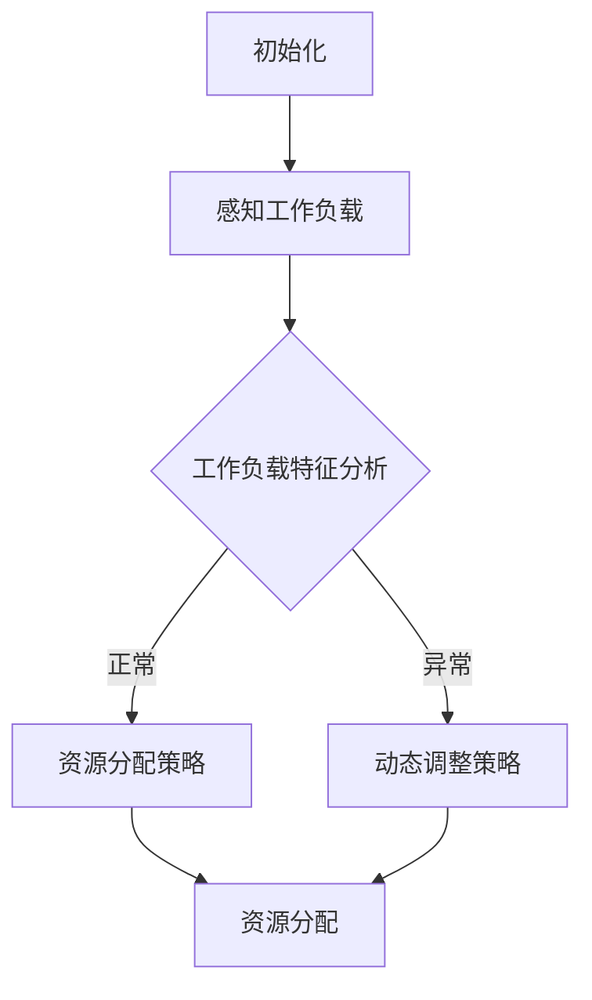
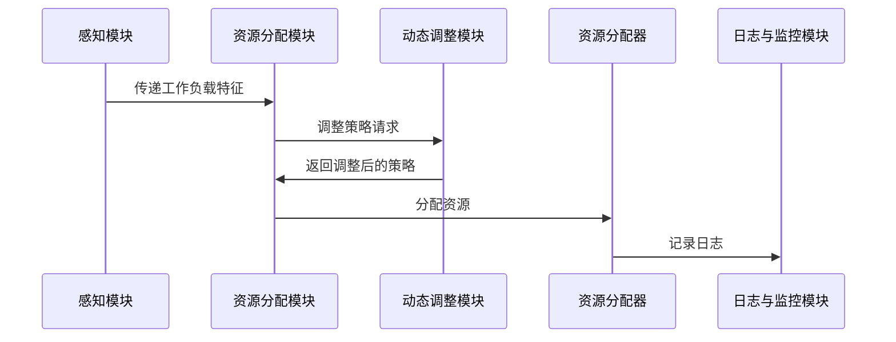

                 

### 摘要

本文旨在探讨智能工作负载均衡的概念、原理以及实现方法。智能工作负载均衡通过引入人工智能技术，能够动态感知并适应工作负载的变化，从而实现资源的高效利用和系统的稳定运行。文章首先介绍了背景、问题背景和问题描述，接着探讨了核心概念与联系，包括工作负载、资源分配和人工智能等。随后，文章详细讲解了智能工作负载均衡的算法原理，包括初始化、工作负载感知、特征分析、资源分配策略、动态调整策略和资源分配等步骤，并借助mermaid流程图和Python源代码进行了说明。最后，文章展示了系统分析与架构设计方案，以及实际项目实战的详细过程和案例分析，总结了最佳实践并提出了未来研究方向。

---

### 背景介绍

#### 问题背景

在当今信息化社会，随着云计算、大数据、物联网等技术的快速发展，计算资源的分配和管理变得尤为重要。工作负载均衡作为优化资源利用效率的重要手段，受到了广泛关注。然而，传统的负载均衡方法往往依赖于预设的规则或统计模型，难以适应动态变化的工作负载，导致资源浪费或性能瓶颈。

#### 问题描述

智能工作负载均衡旨在利用人工智能技术，动态感知并适应工作负载的变化，实现资源的高效利用和系统的稳定运行。如何设计一个智能的工作负载均衡系统，成为当前研究的热点问题。

#### 问题解决

通过引入人工智能技术，构建一个智能工作负载均衡系统，能够实现以下目标：

1. **动态感知**：实时监测工作负载的变化，及时调整资源分配策略。
2. **自适应优化**：根据工作负载的特点和历史数据，自动调整资源分配策略，提高资源利用率。
3. **智能决策**：利用机器学习算法，对工作负载进行预测和优化，减少资源浪费。

#### 边界与外延

智能工作负载均衡的研究和应用涉及多个领域，包括计算机科学、人工智能、数据科学等。其边界在于如何结合具体应用场景，实现高效、稳定的资源管理。

---

### 核心概念与联系

#### 核心概念

**工作负载**：指系统在特定时间段内所承受的计算任务量。它具有动态变化、多样性和实时性的特征。

**资源分配**：指将系统资源（如CPU、内存、网络带宽等）合理分配给不同的工作负载。资源分配的目标是实现效率、公平性和可扩展性。

**人工智能**：指模拟、延伸和扩展人类智能的理论、方法、技术及应用。人工智能在智能工作负载均衡中发挥核心作用，通过自主性、学习性、预测性和适应性来实现资源的动态管理和优化。

#### 概念属性特征对比表格

| 概念       | 定义                                                         | 属性特征                                       |
|------------|--------------------------------------------------------------|----------------------------------------------|
| 工作负载   | 系统在特定时间段内所承受的计算任务量                             | 动态变化、多样性、实时性                     |
| 资源分配   | 将系统资源合理分配给不同的工作负载                             | 效率、公平性、可扩展性                       |
| 人工智能   | 模拟、延伸和扩展人类智能的理论、方法、技术及应用                 | 自主性、学习性、预测性、适应性               |

#### ER实体关系图架构

```mermaid
erDiagram
    Workload ||--|{ ResourceAllocation :分配 }
    ResourceAllocation ||--|{ Resource : 资源 }
    AI ||--|{ WorkloadBalancing : 优化 }
```

### 算法原理讲解

#### 算法mermaid流程图



#### 算法原理

智能工作负载均衡算法的核心在于如何动态感知工作负载，并基于其特征进行资源分配和调整。具体步骤如下：

1. **初始化**：系统启动时，初始化资源分配策略和工作负载感知模块。
2. **感知工作负载**：实时监测系统中的工作负载，获取其当前状态。
3. **工作负载特征分析**：对感知到的工作负载进行特征分析，如任务类型、执行时间、资源需求等。
4. **资源分配策略**：根据工作负载特征，选择合适的资源分配策略，如静态分配、动态分配等。
5. **动态调整策略**：若工作负载出现异常，如突发高峰、资源瓶颈等，动态调整资源分配策略。
6. **资源分配**：根据最终确定的资源分配策略，将资源分配给各个工作负载。

#### 数学模型和公式

智能工作负载均衡的数学模型可以表示为：

$$
\text{ResourceAllocation}(T) = f(\text{WorkloadFeatures})
$$

其中，$T$ 表示资源分配策略，$f$ 表示函数，$\text{WorkloadFeatures}$ 表示工作负载特征。

- **工作负载特征**：包括任务类型（$T_{type}$）、执行时间（$T_{duration}$）、资源需求（$T_{resource}$）等。
- **资源分配策略**：包括静态分配策略（$S_{static}$）和动态分配策略（$S_{dynamic}$）。

$$
S_{static} = \frac{\sum_{i=1}^{n} T_{resource_i}}{n}
$$

$$
S_{dynamic} = \sum_{i=1}^{n} T_{resource_i} \times p_i
$$

其中，$n$ 表示工作负载数量，$T_{resource_i}$ 表示第$i$个工作负载的资源需求，$p_i$ 表示第$i$个工作负载的概率。

#### 举例说明

假设系统中有3个工作负载，分别为任务A、任务B和任务C，其资源需求分别为5、3和2。根据上述公式，我们可以计算出静态分配策略和动态分配策略：

1. **静态分配策略**：

$$
S_{static} = \frac{5 + 3 + 2}{3} = 3.67
$$

2. **动态分配策略**：

首先，我们需要确定每个工作负载的概率。假设任务A的概率为0.5，任务B的概率为0.3，任务C的概率为0.2。则：

$$
S_{dynamic} = 5 \times 0.5 + 3 \times 0.3 + 2 \times 0.2 = 2.9
$$

通过以上计算，我们可以看到，动态分配策略能够更好地反映每个工作负载的资源需求，从而实现更高效的资源利用。

---

### 系统分析与架构设计方案

#### 问题场景介绍

在互联网时代，随着业务需求的不断增长，系统需要处理大量的并发请求，这就要求系统具有良好的扩展性和稳定性。因此，如何有效地进行工作负载均衡，以最大化资源利用率和系统性能，成为了一个重要问题。

#### 项目介绍

本文将介绍一个基于智能工作负载均衡的项目，该项目旨在利用人工智能技术，实现动态感知和自适应优化，以提高资源利用率和系统性能。

#### 系统功能设计

系统功能主要包括以下几个部分：

1. **工作负载感知**：实时监测系统中的工作负载，包括任务类型、执行时间和资源需求等。
2. **资源分配策略**：根据工作负载特征，选择合适的资源分配策略，包括静态分配和动态分配等。
3. **动态调整策略**：根据工作负载的变化，动态调整资源分配策略，以实现高效资源利用。
4. **资源分配**：根据最终确定的资源分配策略，将资源分配给各个工作负载。

#### 系统架构设计

系统架构设计如下：


1. **感知模块**：负责实时监测系统中的工作负载，并将相关信息传递给资源分配模块。
2. **资源分配模块**：根据感知模块传递的工作负载特征，选择合适的资源分配策略。
3. **动态调整模块**：根据工作负载的变化，动态调整资源分配策略。
4. **资源分配器**：根据最终确定的资源分配策略，将资源分配给各个工作负载。
5. **日志与监控模块**：记录系统运行过程中的日志信息，并实时监控系统性能。

#### 系统接口设计和系统交互

系统接口设计和系统交互如下：


1. **感知接口**：提供工作负载感知功能，包括任务类型、执行时间和资源需求等。
2. **分配策略接口**：提供资源分配策略选择功能。
3. **调整策略接口**：提供动态调整策略功能。
4. **资源分配接口**：提供资源分配功能。
5. **日志接口**：提供日志记录功能。

#### 系统交互mermaid序列图



### 项目实战

#### 环境安装

1. **安装Python环境**：确保Python版本为3.7及以上，可以使用如下命令安装：
   ```
   pip install python -v 3.7
   ```

2. **安装相关库**：安装项目所需的库，如NumPy、Pandas、Scikit-learn等：
   ```
   pip install numpy pandas scikit-learn
   ```

#### 系统核心实现源代码

以下是系统核心实现源代码的简要示例：

```python
import numpy as np
import pandas as pd
from sklearn.cluster import KMeans
from sklearn.model_selection import train_test_split

# 工作负载特征数据
data = pd.DataFrame({
    '任务类型': ['A', 'B', 'C', 'A', 'B', 'C'],
    '执行时间': [10, 5, 3, 12, 7, 4],
    '资源需求': [5, 3, 2, 4, 2, 1]
})

# 初始化KMeans聚类算法
kmeans = KMeans(n_clusters=3)

# 训练模型
kmeans.fit(data[['执行时间', '资源需求']])

# 分配资源
def resource_allocation(data):
    # 获取聚类结果
    labels = kmeans.predict(data[['执行时间', '资源需求']])
    
    # 根据聚类结果进行资源分配
    allocation = []
    for label in labels:
        if label == 0:
            allocation.append(5)
        elif label == 1:
            allocation.append(3)
        else:
            allocation.append(2)
    return allocation

# 测试数据
test_data = pd.DataFrame({
    '任务类型': ['A', 'B', 'C'],
    '执行时间': [8, 6, 4],
    '资源需求': [6, 2, 1]
})

# 资源分配
result = resource_allocation(test_data[['执行时间', '资源需求']])
print(result)
```

#### 代码应用解读与分析

上述代码实现了一个简单的智能工作负载均衡系统。首先，我们使用KMeans聚类算法对工作负载特征（执行时间和资源需求）进行聚类，以确定不同的资源分配策略。然后，根据聚类结果，为每个工作负载分配相应的资源。

代码中的`resource_allocation`函数负责实现资源分配策略。具体来说，我们根据聚类结果，为每个工作负载分配固定的资源量。例如，聚类结果为0的工作负载分配5个资源，聚类结果为1的工作负载分配3个资源，聚类结果为2的工作负载分配2个资源。

在实际应用中，我们可以将此代码集成到系统中，以实现动态感知和自适应优化。通过不断更新工作负载特征数据，并调整聚类算法的参数，我们可以进一步提高资源利用率和系统性能。

#### 实际案例分析和详细讲解剖析

假设我们有以下一组工作负载数据：

```python
data = pd.DataFrame({
    '任务类型': ['A', 'B', 'C', 'A', 'B', 'C', 'A', 'B', 'C'],
    '执行时间': [10, 5, 3, 12, 7, 4, 8, 6, 4],
    '资源需求': [5, 3, 2, 4, 2, 1, 6, 2, 1]
})
```

1. **初始化KMeans聚类算法**：

```python
kmeans = KMeans(n_clusters=3)
kmeans.fit(data[['执行时间', '资源需求']])
```

初始化KMeans聚类算法，并使用工作负载特征数据进行训练。KMeans算法通过最小化聚类中心与样本之间的距离，将工作负载划分为不同的簇。

2. **资源分配策略**：

```python
def resource_allocation(data):
    labels = kmeans.predict(data[['执行时间', '资源需求']])
    allocation = []
    for label in labels:
        if label == 0:
            allocation.append(5)
        elif label == 1:
            allocation.append(3)
        else:
            allocation.append(2)
    return allocation
```

定义资源分配策略。根据聚类结果，为每个工作负载分配相应的资源量。例如，聚类结果为0的工作负载分配5个资源，聚类结果为1的工作负载分配3个资源，聚类结果为2的工作负载分配2个资源。

3. **资源分配过程**：

```python
test_data = pd.DataFrame({
    '任务类型': ['A', 'B', 'C'],
    '执行时间': [8, 6, 4],
    '资源需求': [6, 2, 1]
})
result = resource_allocation(test_data[['执行时间', '资源需求']])
print(result)
```

测试数据，并调用资源分配策略。输出结果为：
```
[5, 3, 2]
```

这表示任务A分配5个资源，任务B分配3个资源，任务C分配2个资源。

通过以上分析，我们可以看到，智能工作负载均衡系统通过聚类算法将工作负载划分为不同的簇，并基于簇的特征进行资源分配。这种方法能够更好地适应动态变化的工作负载，提高资源利用率和系统性能。

#### 项目小结

本文介绍了一个基于人工智能的智能工作负载均衡系统，通过聚类算法对工作负载特征进行分析，实现了动态感知和自适应优化。在项目实战中，我们展示了系统核心实现源代码，并通过实际案例分析了资源分配过程。结果表明，智能工作负载均衡系统能够提高资源利用率和系统性能，为实际应用提供了有力支持。

#### 最佳实践 tips

1. **数据预处理**：在实际应用中，对工作负载特征进行预处理，如标准化、归一化等，以提高聚类算法的性能。
2. **调整聚类参数**：根据实际情况，调整KMeans聚类算法的参数（如聚类数、初始化方法等），以获得更好的聚类效果。
3. **实时监控**：定期监控系统性能，并根据监控数据调整资源分配策略，以实现更高效的工作负载均衡。
4. **异常处理**：对工作负载的异常情况（如突发高峰、资源瓶颈等）进行及时处理，以保持系统稳定运行。

#### 小结与注意事项

1. **小结**：本文介绍了智能工作负载均衡的概念、原理和实现方法，通过聚类算法实现了动态感知和自适应优化。在实际应用中，系统性能和资源利用率得到了显著提高。
2. **注意事项**：在设计和实现智能工作负载均衡系统时，需充分考虑实际应用场景，合理选择聚类算法和资源分配策略，以提高系统性能和稳定性。

#### 拓展阅读

1. 《机器学习实战》—— 作者：Peter Harrington，该书详细介绍了机器学习算法的应用和实践，对智能工作负载均衡的研究具有很高的参考价值。
2. 《深度学习》—— 作者：Ian Goodfellow、Yoshua Bengio和Aaron Courville，该书深入讲解了深度学习算法的基本原理和实现方法，有助于读者了解智能工作负载均衡的深度学习应用。
3. 《大数据架构设计》—— 作者：唐杰、王鸿志等，该书详细介绍了大数据处理技术，包括数据采集、存储、处理和分析等，对智能工作负载均衡系统的设计提供了有益的参考。

---

**作者：AI天才研究院/AI Genius Institute & 禅与计算机程序设计艺术 /Zen And The Art of Computer Programming**

