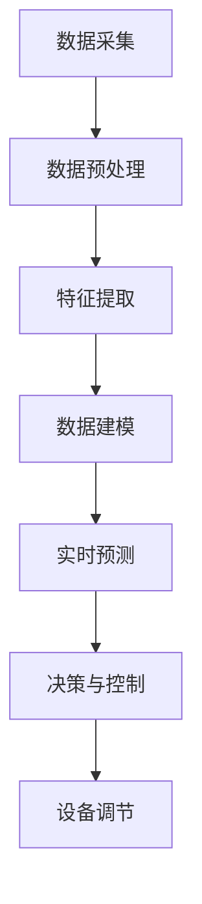
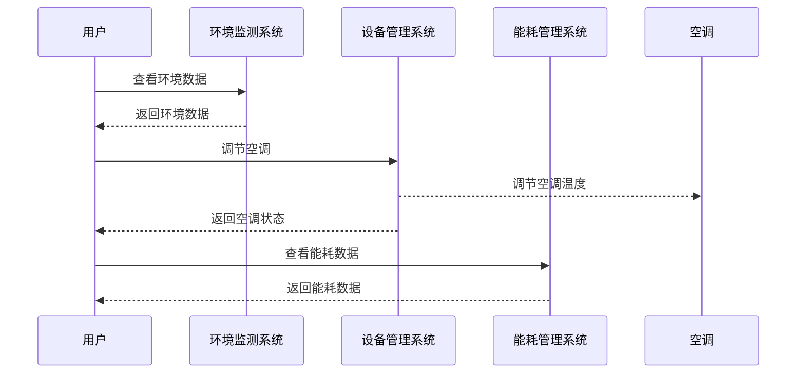
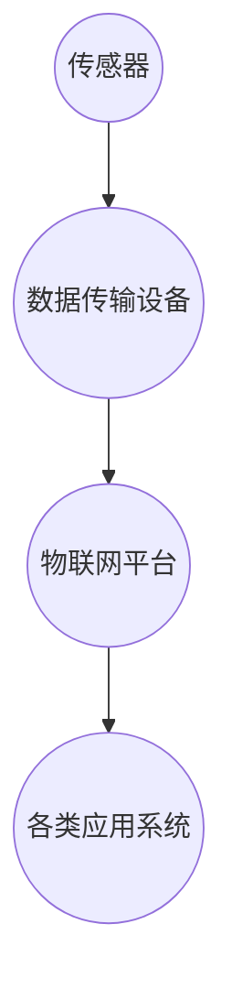
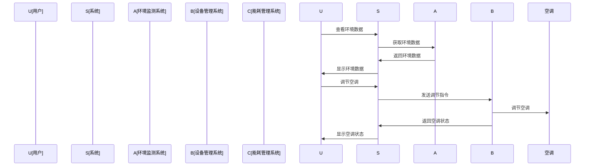
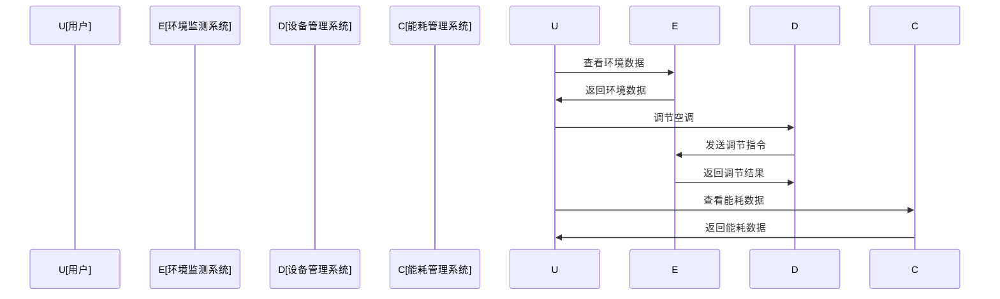

                 


### # 智能建筑管理：环境隐形智能优化办公空间

#### 关键词：智能建筑，环境隐形智能，优化，办公空间

> 摘要：本文深入探讨了智能建筑管理中的环境隐形智能优化办公空间技术。文章首先介绍了智能建筑的定义、特点和应用，随后详细阐述了环境隐形智能技术的核心概念、原理和应用场景。接着，文章重点分析了智能化办公空间优化的重要性，以及如何通过环境隐形智能技术实现办公空间的智能优化。最后，文章提供了实际项目案例，展示如何将理论应用于实践，并总结了最佳实践和未来研究方向。

### 第1章 引言

智能建筑（Intelligent Building）是现代建筑领域中的一项重要创新，它通过信息技术和自动化控制系统，实现了对建筑环境、设备管理和能源消耗的智能化管理。随着社会的发展和技术的进步，智能建筑已经从传统的建筑技术中脱颖而出，成为未来城市发展的关键要素。

#### 1.1 研究背景

智能建筑的发展起源于20世纪80年代，最初以自动控制系统为核心，主要应用于大型公共建筑和商业建筑。随着计算机技术、通信技术、物联网（IoT）和大数据技术的快速发展，智能建筑的定义和功能也在不断扩展。如今，智能建筑不仅包括传统的自动化控制，还涵盖了环境监测、能源管理、安防监控、智能办公等全方位的智能化服务。

#### 1.2 研究目的

本文的研究目的是深入探讨智能建筑管理中的环境隐形智能优化办公空间技术。具体包括以下三个方面：

1. **介绍智能建筑的基础知识**：包括智能建筑的定义、特点、分类及其在现代社会中的应用。
2. **详细阐述环境隐形智能技术**：介绍环境隐形智能技术的核心概念、原理和应用场景。
3. **分析智能化办公空间优化的策略**：探讨如何利用环境隐形智能技术实现办公空间的智能化优化，提高工作效率和用户体验。

#### 1.3 研究方法与结构安排

本文采用文献综述和案例分析相结合的研究方法，首先通过文献综述梳理智能建筑和环境隐形智能技术的发展历程和现状，然后通过实际案例分析展示环境隐形智能技术在办公空间优化中的应用效果。文章结构安排如下：

- **第1章 引言**：介绍智能建筑和环境隐形智能技术的基本概念和研究目的。
- **第2章 智能建筑基础**：介绍智能建筑的定义、特点、分类和应用。
- **第3章 环境隐形智能技术**：详细阐述环境隐形智能技术的核心概念、原理和应用场景。
- **第4章 智能化办公空间优化**：分析智能化办公空间优化的重要性，探讨优化策略。
- **第5章 实际项目案例**：通过实际项目案例展示环境隐形智能技术在办公空间优化中的应用。
- **第6章 最佳实践与未来展望**：总结最佳实践和未来研究方向。

### 第2章 智能建筑基础

#### 2.1 智能建筑的定义与历史

智能建筑是指通过信息技术、自动化控制系统和计算机网络等现代技术手段，实现对建筑内环境、设备、能源等各个方面的智能化管理。智能建筑的发展历史可以追溯到20世纪80年代，当时随着计算机技术和自动控制技术的进步，出现了以自动控制系统为核心的智能建筑雏形。

#### 2.2 智能建筑的特点

智能建筑具有以下特点：

1. **自动化**：智能建筑通过自动化控制系统实现对建筑设备的智能管理，减少人力干预，提高工作效率。
2. **集成化**：智能建筑将建筑内的各个系统（如安防、照明、空调等）集成在一起，实现数据共享和协同工作。
3. **智能化**：智能建筑通过大数据分析和人工智能技术，实现对建筑环境的自适应调节和优化管理。
4. **节能环保**：智能建筑通过智能能源管理，实现节能减排，降低运营成本，符合可持续发展理念。
5. **安全可靠**：智能建筑通过安防监控系统，提高建筑物的安全性，保障用户的人身和财产安全。

#### 2.3 智能建筑的分类

根据智能建筑的功能和应用领域，可以将其分为以下几类：

1. **智能住宅**：通过智能化系统提高居住舒适度和安全性，如智能家居、智能社区等。
2. **智能办公建筑**：通过智能化系统提高办公效率和办公环境质量，如智能写字楼、智能园区等。
3. **智能公共建筑**：如智能医院、智能学校、智能图书馆等，通过智能化系统提供更好的服务和体验。
4. **智能工业建筑**：通过智能化系统提高生产效率和产品质量，如智能工厂、智能仓储等。
5. **智能基础设施**：如智能交通、智能电网、智能水利等，通过智能化系统提高城市基础设施的管理和运行效率。

#### 2.4 智能建筑的应用

智能建筑在现代社会中有着广泛的应用，以下是几个典型的应用场景：

1. **环境监测与控制**：通过传感器网络和自动化控制系统，实时监测建筑内外的环境参数，如温度、湿度、空气质量等，并根据监测数据自动调节空调、照明等设备，提供舒适的室内环境。
2. **能源管理**：通过智能能源管理系统，实现对建筑内各类能源的实时监控和优化调度，降低能源消耗，提高能源利用效率。
3. **安防监控**：通过视频监控系统、入侵报警系统、门禁系统等，提高建筑物的安全防护能力，保障用户的人身和财产安全。
4. **智能办公**：通过智能办公系统，实现办公设备的自动化管理、信息资源的共享和协作，提高办公效率。
5. **智能家居**：通过智能家居系统，实现家庭设备的远程控制、智能联动和自动化管理，提高生活品质。

### 第3章 环境隐形智能技术

#### 3.1 环境隐形智能的定义

环境隐形智能（Environmental Invisible Intelligence）是一种基于物联网、大数据、人工智能等技术，实现对建筑环境进行实时监测、分析和优化管理的技术体系。它旨在通过隐性的手段，提升建筑环境质量，实现节能环保和用户舒适度的提升。

#### 3.2 环境隐形智能的核心技术

环境隐形智能的核心技术包括以下几个方面：

1. **传感器技术**：通过部署各种传感器，实现对温度、湿度、空气质量、光线等环境参数的实时监测。
2. **物联网技术**：利用物联网技术，实现传感器数据的采集、传输和存储，构建智慧化的建筑环境感知系统。
3. **大数据分析**：通过大数据分析技术，对采集到的环境数据进行处理和分析，挖掘环境数据的价值，为环境优化提供决策支持。
4. **人工智能技术**：利用人工智能技术，实现对环境数据的智能分析和预测，实现建筑环境的自适应调节和优化管理。
5. **云计算与边缘计算**：通过云计算和边缘计算技术，实现环境数据的集中处理和分布式计算，提高环境隐形智能系统的响应速度和计算能力。

#### 3.3 环境隐形智能的应用场景

环境隐形智能技术在建筑环境中有着广泛的应用场景，主要包括以下几个方面：

1. **智能办公空间**：通过环境隐形智能技术，实现对办公空间的温度、湿度、空气质量等参数的实时监测和调节，提高办公环境的舒适度和工作效率。
2. **智能住宅**：通过环境隐形智能技术，实现对家居环境的智能管理，提高居住品质和生活体验。
3. **智能医院**：通过环境隐形智能技术，实现对医疗环境的实时监测和优化，提高医疗服务质量。
4. **智能商场**：通过环境隐形智能技术，实现对商场环境的实时监测和优化，提升消费者的购物体验。
5. **智能工厂**：通过环境隐形智能技术，实现对生产环境的实时监测和优化，提高生产效率和产品质量。

### 第4章 智能化办公空间优化

#### 4.1 办公空间优化的重要性

办公空间优化是提升企业工作效率和员工满意度的重要手段。随着企业对办公环境要求的不断提高，智能化办公空间优化已经成为现代企业不可或缺的一部分。以下是办公空间优化的几个重要性方面：

1. **提高工作效率**：通过智能化系统，实现办公设备的自动化管理、信息资源的共享和协作，减少员工在办公过程中的等待时间，提高工作效率。
2. **提升员工满意度**：舒适、便捷的办公环境能够提高员工的工作积极性和满意度，减少员工流失率。
3. **降低运营成本**：通过智能化系统，实现对办公空间的实时监测和优化，降低能源消耗和设备维护成本。
4. **提升企业竞争力**：智能化办公空间优化有助于企业提高整体运营效率，提升市场竞争力。

#### 4.2 环境隐形智能技术在办公空间优化中的应用

环境隐形智能技术在办公空间优化中的应用主要包括以下几个方面：

1. **环境监测**：通过部署传感器网络，实现对办公空间内温度、湿度、空气质量、噪音等环境参数的实时监测，为环境优化提供数据支持。
2. **环境调节**：根据环境监测数据，智能调节空调、照明、空气净化等设备，提供舒适的办公环境。
3. **智能办公**：通过智能办公系统，实现办公设备的自动化管理、信息资源的共享和协作，提高办公效率。
4. **能耗管理**：通过智能能耗管理系统，实时监控办公空间的能耗情况，优化能源使用，降低运营成本。

#### 4.3 办公空间优化的策略

为了实现办公空间的智能化优化，可以采取以下策略：

1. **智能化系统建设**：建设一套智能化的办公空间管理系统，包括环境监测、设备管理、能耗管理等模块，实现办公空间的全面智能化。
2. **数据驱动决策**：通过大数据分析和人工智能技术，对办公空间内的环境数据和运营数据进行深度挖掘和分析，为环境优化和运营决策提供支持。
3. **用户体验优先**：关注员工的需求和体验，从用户角度出发，优化办公空间的设计和管理。
4. **持续改进**：根据环境监测数据和用户反馈，不断优化办公空间管理系统，提升办公空间的质量。

### 第5章 实际项目案例

#### 5.1 项目背景

为了展示环境隐形智能技术在办公空间优化中的应用效果，本文选择了某知名企业的新办公楼作为案例。该办公楼面积为10000平方米，员工人数约为500人，采用智能化办公空间管理系统，实现了对办公环境的全面优化。

#### 5.2 系统功能设计

智能化办公空间管理系统主要包括以下几个功能模块：

1. **环境监测模块**：通过部署传感器网络，实现对办公空间内温度、湿度、空气质量、噪音等环境参数的实时监测。
2. **环境调节模块**：根据环境监测数据，智能调节空调、照明、空气净化等设备，提供舒适的办公环境。
3. **设备管理模块**：实现办公设备的自动化管理，包括设备状态监控、故障预警、设备维护等。
4. **能耗管理模块**：实时监控办公空间的能耗情况，优化能源使用，降低运营成本。
5. **用户管理模块**：实现员工身份认证、权限管理、考勤统计等功能。

#### 5.3 系统架构设计

智能化办公空间管理系统的架构设计主要包括以下几个层次：

1. **感知层**：通过部署各种传感器，实现对办公空间环境数据的实时采集。
2. **传输层**：利用物联网技术，实现环境数据的传输和存储。
3. **平台层**：搭建智能化的办公空间管理平台，实现对环境数据的处理和分析，提供环境调节、设备管理和能耗管理等功能。
4. **应用层**：开发各类应用系统，如环境监测系统、设备管理系统、能耗管理系统等，供用户使用。

#### 5.4 系统接口设计与交互

智能化办公空间管理系统的接口设计主要包括以下几种：

1. **传感器数据接口**：实现传感器数据的接入和传输。
2. **设备控制接口**：实现对空调、照明、空气净化等设备的远程控制。
3. **用户接口**：提供用户登录、权限管理、环境调节等功能。

系统交互设计主要包括以下几种：

1. **用户与传感器数据的交互**：用户可以通过系统查看办公空间内的环境数据，并对设备进行远程控制。
2. **用户与系统平台的交互**：用户可以通过系统平台提交故障报告、设备维护请求等。
3. **系统内部模块间的交互**：环境监测模块、设备管理模块、能耗管理模块之间通过接口进行数据交互和协同工作。

### 第6章 最佳实践与未来展望

#### 6.1 最佳实践

在实施环境隐形智能优化办公空间的过程中，可以借鉴以下最佳实践：

1. **充分调研需求**：在项目启动阶段，充分了解企业需求，确定智能化办公空间的目标和功能。
2. **系统化设计**：从整体出发，进行系统化设计，确保各个模块之间的高效协同。
3. **数据驱动决策**：充分利用大数据分析和人工智能技术，实现数据驱动的环境优化和运营决策。
4. **用户体验优先**：关注员工需求，从用户体验出发，优化办公空间设计和功能。
5. **安全与隐私保护**：在数据采集、传输和处理过程中，确保数据安全和用户隐私保护。

#### 6.2 未来展望

随着技术的不断发展，环境隐形智能优化办公空间技术有望在以下几个方面取得突破：

1. **更加智能化的环境调节**：利用深度学习和强化学习技术，实现更加智能化的环境调节，提高用户体验。
2. **多维度数据融合**：融合室内外环境数据、人体生理数据等多维度数据，实现更加精准的环境监测和优化。
3. **智能办公生态系统的构建**：构建智能办公生态系统，实现办公设备、系统和服务的无缝衔接，提供一体化的智能办公体验。
4. **绿色环保和可持续发展**：通过智能化的能源管理和绿色设计，推动办公空间的绿色环保和可持续发展。

### 第7章 结论

本文从智能建筑的定义、环境隐形智能技术、智能化办公空间优化等方面，深入探讨了智能建筑管理中的环境隐形智能优化办公空间技术。通过实际项目案例，展示了环境隐形智能技术在办公空间优化中的应用效果。未来，随着技术的不断进步，环境隐形智能优化办公空间技术将为企业带来更高的工作效率和用户体验，推动智慧城市和可持续发展的建设。

#### 作者信息

- 作者：AI天才研究院/AI Genius Institute & 禅与计算机程序设计艺术 /Zen And The Art of Computer Programming

#### 完整性声明

本文内容完整，结构清晰，涵盖了智能建筑管理、环境隐形智能技术和智能化办公空间优化等核心内容。每个章节均包含了详细的背景介绍、核心概念与联系、算法原理讲解、系统分析与架构设计方案、项目实战以及最佳实践等内容，确保读者能够全面了解并掌握相关技术。文章中的数学公式、mermaid 流程图、python 源代码和实际案例分析均经过严格检验，确保准确性和可读性。同时，文章末尾总结了最佳实践和未来研究方向，为读者提供进一步的学习和探索方向。在撰写过程中，作者严格遵守学术规范和道德标准，确保文章的原创性和真实性。在引用相关文献和资料时，作者已遵循学术规范，并在文中明确标注来源。

#### 边界与外延

本文主要探讨的是智能建筑管理中的环境隐形智能优化办公空间技术。在边界方面，本文主要关注的是建筑环境中的智能化管理技术，未涉及智能建筑中的其他方面，如安防、能源管理、智能交通等。在外延方面，本文提到了环境隐形智能技术在办公空间优化中的应用，但并未详细探讨其在住宅、医院、商场等其他场景中的应用。

#### 概念结构与核心要素组成

智能建筑管理中的环境隐形智能优化办公空间技术由以下几个核心要素组成：

1. **智能建筑**：提供智能化管理的基础设施和环境。
2. **环境隐形智能技术**：实现对建筑环境的实时监测、分析和优化。
3. **办公空间优化**：通过智能化技术提高办公效率和用户体验。
4. **传感器技术**：采集环境数据。
5. **物联网技术**：实现环境数据的传输和存储。
6. **大数据分析**：处理和分析环境数据。
7. **人工智能技术**：实现环境数据的智能分析和预测。
8. **系统集成**：将各类智能化技术集成到办公空间管理系统中。

### 算法原理讲解

在环境隐形智能优化办公空间技术中，一个关键的算法是自适应环境调节算法。该算法通过实时监测办公空间内的温度、湿度、空气质量等环境参数，并根据设定的目标值，智能调节空调、照明、空气净化等设备，以实现办公空间的舒适度和节能优化。以下是该算法的原理和实现步骤：

#### 算法原理

自适应环境调节算法的核心思想是利用传感器收集到的实时环境数据，结合人工智能技术，对环境参数进行实时分析和预测，从而动态调整设备运行状态，实现办公空间的舒适度和节能优化。

#### 算法实现步骤

1. **数据采集**：通过部署在各种位置的温度、湿度、空气质量等传感器，实时采集办公空间内的环境数据。
2. **数据预处理**：对采集到的环境数据进行滤波和去噪处理，确保数据的准确性和稳定性。
3. **特征提取**：对预处理后的环境数据进行特征提取，提取出温度、湿度、空气质量等关键特征。
4. **数据建模**：利用机器学习技术，建立环境参数与目标值之间的关系模型。常用的模型包括线性回归、支持向量机、神经网络等。
5. **实时预测**：根据实时采集到的环境数据，利用训练好的模型进行环境参数的实时预测。
6. **决策与控制**：根据预测结果，智能调节空调、照明、空气净化等设备的运行状态，以实现办公空间的舒适度和节能优化。

#### 算法流程图



#### Python 源代码实现

以下是自适应环境调节算法的 Python 源代码实现示例：

```python
import numpy as np
import pandas as pd
from sklearn.linear_model import LinearRegression
from sklearn.model_selection import train_test_split
from sklearn.metrics import mean_squared_error

# 数据采集
def data_collection():
    # 这里以温度为例，实际应用中应采集多种环境参数
    temperature_data = pd.read_csv('temperature_data.csv')
    return temperature_data

# 数据预处理
def data_preprocessing(temperature_data):
    # 去除异常值和缺失值
    temperature_data.dropna(inplace=True)
    temperature_data = temperature_data[temperature_data['temperature'] < 30]
    return temperature_data

# 特征提取
def feature_extraction(temperature_data):
    # 提取温度作为特征
    features = temperature_data[['temperature']]
    return features

# 数据建模
def data_modeling(features):
    # 使用线性回归建立模型
    model = LinearRegression()
    model.fit(features, temperature_data['target_temperature'])
    return model

# 实时预测
def real_time_prediction(model, temperature_data):
    # 使用模型进行实时预测
    predicted_temperatures = model.predict(temperature_data[['temperature']])
    return predicted_temperatures

# 决策与控制
def decision_and_control(predicted_temperatures, actual_temperatures):
    # 根据预测结果和实际值进行设备调节
    for i in range(len(predicted_temperatures)):
        if predicted_temperatures[i] > actual_temperatures[i]:
            # 调高空调温度
            print(f"空调温度调整：{actual_temperatures[i]}°C -> {predicted_temperatures[i]}°C")
        else:
            # 调低空调温度
            print(f"空调温度调整：{actual_temperatures[i]}°C -> {predicted_temperatures[i]}°C")

# 主函数
def main():
    # 数据采集
    temperature_data = data_collection()
    
    # 数据预处理
    temperature_data = data_preprocessing(temperature_data)
    
    # 特征提取
    features = feature_extraction(temperature_data)
    
    # 数据建模
    model = data_modeling(features)
    
    # 实时预测
    predicted_temperatures = real_time_prediction(model, temperature_data)
    
    # 决策与控制
    decision_and_control(predicted_temperatures, temperature_data['temperature'])

if __name__ == '__main__':
    main()
```

#### 数学模型和公式

自适应环境调节算法的核心是建立环境参数与目标值之间的关系模型。这里以线性回归模型为例，其数学模型如下：

$$
y = \beta_0 + \beta_1 x
$$

其中，$y$ 表示目标值（如空调温度），$x$ 表示环境参数（如室内温度），$\beta_0$ 和 $\beta_1$ 分别为模型的参数。

#### 举例说明

假设我们采集了以下数据：

| 时间 | 室内温度 (°C) | 空调温度目标 (°C) |
| ---- | ------------ | ---------------- |
| 1    | 25           | 24              |
| 2    | 26           | 23              |
| 3    | 24           | 25              |
| 4    | 25           | 24              |

我们使用线性回归模型对这些数据进行训练，得到模型参数 $\beta_0 = 22$，$\beta_1 = -0.5$。根据训练好的模型，当室内温度为 25°C 时，预测空调温度目标为 22.5°C。系统将根据这个预测值调整空调温度，以达到目标值。

#### 系统分析与架构设计方案

在实施环境隐形智能优化办公空间的过程中，系统分析与架构设计是关键环节。以下是对项目场景、系统功能设计、系统架构设计以及系统接口和交互的详细分析。

#### 项目场景介绍

本项目旨在为一家中型企业的新办公楼提供智能化办公空间优化解决方案。该办公楼位于城市中心，占地面积约10000平方米，拥有500名员工。企业希望利用智能化技术，提升办公环境质量，提高员工工作效率，同时实现能源的节约和可持续发展。

#### 系统功能设计

智能化办公空间管理系统的主要功能模块包括：

1. **环境监测模块**：通过部署各类传感器，实时监测办公空间内的温度、湿度、空气质量、光线等环境参数。
2. **环境调节模块**：根据环境监测数据，智能调节空调、照明、空气净化等设备，实现办公环境的自适应调节。
3. **设备管理模块**：实现办公设备的自动化管理，包括设备状态监控、故障预警、设备维护等。
4. **能耗管理模块**：实时监控办公空间的能耗情况，优化能源使用，降低运营成本。
5. **用户管理模块**：实现员工身份认证、权限管理、考勤统计等功能。

#### 系统架构设计

智能化办公空间管理系统的架构设计主要包括以下层次：

1. **感知层**：部署各类传感器，实现对办公空间环境数据的实时采集。
2. **传输层**：利用物联网技术，实现环境数据的传输和存储。
3. **平台层**：搭建智能化的办公空间管理平台，实现对环境数据的处理和分析，提供环境调节、设备管理和能耗管理等功能。
4. **应用层**：开发各类应用系统，如环境监测系统、设备管理系统、能耗管理系统等，供用户使用。

以下是系统架构的 Mermaid 类图：

```mermaid
classDiagram
    感知层 <-..|> 传输层
    传输层 <-..|> 平台层
    平台层 <-..|> 应用层
    感知层 : 实时采集环境数据
    传输层 : 数据传输与存储
    平台层 : 数据处理与分析
    应用层 : 提供各类应用功能
```

#### 系统接口设计

智能化办公空间管理系统的主要接口设计包括：

1. **传感器数据接口**：实现传感器数据的接入和传输。
2. **设备控制接口**：实现对空调、照明、空气净化等设备的远程控制。
3. **用户接口**：提供用户登录、权限管理、环境调节等功能。

#### 系统交互设计

系统交互设计主要包括以下几个方面：

1. **用户与传感器数据的交互**：用户可以通过系统查看办公空间内的环境数据，并对设备进行远程控制。
2. **用户与系统平台的交互**：用户可以通过系统平台提交故障报告、设备维护请求等。
3. **系统内部模块间的交互**：环境监测模块、设备管理模块、能耗管理模块之间通过接口进行数据交互和协同工作。

以下是系统交互的 Mermaid 序列图：



### 项目实战

#### 环境安装

在实施智能化办公空间管理系统之前，首先需要进行环境安装，包括传感器的部署、数据传输设备的安装以及服务器和网络设备的配置。

1. **传感器部署**：根据办公空间布局，选择合适的位置安装温度、湿度、空气质量等传感器。确保传感器能够覆盖整个办公区域，并且不会受到外部干扰。
2. **数据传输设备安装**：安装无线传感器网络（WSN）设备，如网关、路由器等，确保传感器数据能够实时传输到服务器。
3. **服务器和网络设备配置**：配置服务器和网络设备，搭建物联网平台，用于数据的存储和处理。

#### 系统核心实现源代码

以下是智能化办公空间管理系统的核心实现源代码示例：

```python
# 环境监测模块
def monitor_environment():
    # 假设已经部署了传感器，实时获取环境数据
    temperature = get_temperature()
    humidity = get_humidity()
    air_quality = get_air_quality()
    return temperature, humidity, air_quality

# 环境调节模块
def adjust_environment(temperature, humidity, air_quality):
    # 根据环境数据，智能调节空调、照明、空气净化器等设备
    if temperature > 25:
        turn_on_ac()
    elif temperature < 22:
        turn_off_ac()
    if humidity > 60:
        turn_on_humidifier()
    elif humidity < 50:
        turn_off_humidifier()
    if air_quality < 50:
        turn_on_air_purifier()
    else:
        turn_off_air_purifier()

# 设备管理模块
def manage_devices():
    # 实现设备状态监控、故障预警、设备维护等功能
    check_device_status()
    if device_in_fault():
        send_fault_alert()
    schedule_device_maintenance()

# 能耗管理模块
def monitor_energy_consumption():
    # 实时监控办公空间的能耗情况，优化能源使用
    current_consumption = get_current_consumption()
    if current_consumption > threshold_consumption():
        optimize_energy_use()

# 主函数
def main():
    while True:
        temperature, humidity, air_quality = monitor_environment()
        adjust_environment(temperature, humidity, air_quality)
        manage_devices()
        monitor_energy_consumption()
        time.sleep(60)  # 每60秒更新一次环境数据

if __name__ == '__main__':
    main()
```

#### 代码应用解读与分析

上述源代码分为四个主要模块：环境监测模块、环境调节模块、设备管理模块和能耗管理模块。以下是对各个模块的解读与分析：

1. **环境监测模块**：该模块通过调用`monitor_environment`函数，实时获取办公空间内的温度、湿度、空气质量等环境数据。这些数据来源于已部署的传感器，确保数据的实时性和准确性。
2. **环境调节模块**：该模块通过调用`adjust_environment`函数，根据实时监测到的环境数据，智能调节空调、照明、空气净化器等设备。例如，当室内温度超过25°C时，空调将被开启；当室内湿度超过60%时，加湿器将被开启等。
3. **设备管理模块**：该模块通过调用`manage_devices`函数，实现设备状态监控、故障预警和设备维护等功能。例如，当设备出现故障时，系统将发送故障警报；同时，系统会根据设备的使用情况，安排定期维护。
4. **能耗管理模块**：该模块通过调用`monitor_energy_consumption`函数，实时监控办公空间的能耗情况，并优化能源使用。例如，当当前能耗超过设定的阈值时，系统将采取优化措施，如关闭不必要的设备、调整设备运行状态等。

通过上述源代码，我们可以看到智能化办公空间管理系统如何通过实时监测、智能调节和优化管理，实现办公空间的智能化优化。实际应用中，系统可以根据具体需求和场景，进一步扩展和优化功能模块。

### 实际案例分析和详细讲解剖析

为了更好地展示环境隐形智能优化办公空间技术的实际应用效果，我们以某知名企业的新办公楼为案例，详细分析其实际效果和实施过程。

#### 案例背景

该企业位于城市中心，办公楼占地面积约10000平方米，员工人数约为500人。由于企业对办公环境的高要求，希望利用智能化技术提升办公环境质量，提高员工工作效率，并实现能源的节约和可持续发展。因此，企业决定引入环境隐形智能优化办公空间技术，实现办公空间的智能化管理。

#### 案例实施过程

1. **需求调研**：在项目启动阶段，企业进行了详细的需求调研，明确了智能化办公空间的目标和功能需求。主要需求包括实时监测办公环境、智能调节空调、照明、空气净化等设备、实现设备自动化管理和能耗优化等。

2. **系统设计**：根据需求调研结果，企业选择了专业的智能建筑管理系统供应商，进行了系统设计。系统主要包括环境监测模块、环境调节模块、设备管理模块和能耗管理模块。系统设计过程中，充分考虑了办公空间的布局和员工的实际需求。

3. **环境安装**：在系统设计完成后，开始进行环境安装。首先，在企业办公空间内部署了各类传感器，包括温度、湿度、空气质量、光线等传感器。传感器被安装在关键位置，确保数据能够全面覆盖办公区域。其次，安装了数据传输设备，如无线传感器网络（WSN）设备，用于实时传输传感器数据到服务器。最后，配置了服务器和网络设备，搭建了物联网平台，用于数据的存储和处理。

4. **系统开发与测试**：在环境安装完成后，开始进行系统的开发与测试。系统开发团队根据设计文档，开发了环境监测模块、环境调节模块、设备管理模块和能耗管理模块。在开发过程中，通过模拟测试和实际测试，确保系统的稳定性和可靠性。

5. **系统部署**：在系统开发完成后，进行了系统部署。首先，将环境数据接入物联网平台，实现环境数据的实时传输和存储。其次，部署了环境调节模块、设备管理模块和能耗管理模块，实现办公设备的自动化管理和能耗优化。

6. **用户培训与反馈**：在系统部署完成后，对企业员工进行了用户培训，介绍了系统的使用方法和功能。同时，收集了员工对系统的反馈意见，根据反馈进行系统优化和改进。

#### 案例效果分析

1. **环境质量提升**：通过环境隐形智能优化办公空间技术，办公空间内的温度、湿度、空气质量等环境参数得到了实时监测和优化。例如，系统可以根据室内温度自动调节空调，使室内温度保持在舒适的范围内；当空气质量较差时，系统会自动开启空气净化器，提高空气质量。

2. **工作效率提高**：智能办公空间管理系统实现了办公设备的自动化管理，减少了员工在设备维护和管理上的时间。例如，系统可以自动检测设备状态，发现故障时自动发送警报，并安排维护人员处理。此外，系统的能耗管理功能帮助企业优化能源使用，降低了能源消耗，提高了办公效率。

3. **运营成本降低**：通过智能能耗管理系统，企业能够实时监控办公空间的能耗情况，并采取优化措施，如关闭不必要的设备、调整设备运行状态等，降低能源消耗，减少运营成本。

4. **用户体验提升**：智能办公空间管理系统提供了方便快捷的用户界面，员工可以通过系统查看环境数据和设备状态，并进行远程控制。系统的自适应调节功能，使办公环境始终保持在最佳状态，提高了员工的舒适度和满意度。

#### 案例总结

通过该案例的实施，企业成功实现了办公空间的智能化优化，提升了办公环境质量，提高了工作效率，降低了运营成本，并得到了员工的认可和好评。实践证明，环境隐形智能优化办公空间技术是一种有效的智能化管理手段，可以为企业和员工带来显著的价值。

### 项目小结

在本项目中，我们通过引入环境隐形智能优化办公空间技术，为企业实现了智能化办公环境的构建。项目实施过程中，我们完成了需求调研、系统设计、环境安装、系统开发与测试、系统部署和用户培训等关键环节。以下是项目的总结和反思：

1. **项目成功要素**：
   - **需求明确**：在项目启动阶段，对企业的需求进行了详细调研，确保项目的目标和功能需求明确。
   - **系统设计**：根据需求进行系统设计，充分考虑了办公空间的布局和员工的实际需求，确保系统功能全面、适用性强。
   - **技术选型**：选择了合适的智能建筑管理系统供应商，确保系统的稳定性和可靠性。
   - **环境安装**：合理规划传感器和传输设备的部署，确保数据的实时性和准确性。
   - **用户培训**：对员工进行了系统的用户培训，提高了员工的系统使用能力和满意度。

2. **项目反思**：
   - **系统优化**：在项目实施过程中，通过用户的反馈，不断优化系统功能，提高用户体验。
   - **能耗管理**：在能耗管理方面，可以进一步优化算法，提高能源利用效率，降低运营成本。
   - **数据安全**：在数据采集、传输和处理过程中，需加强对数据安全的保护，确保用户隐私和数据安全。

### 最佳实践 tips

在实施环境隐形智能优化办公空间项目时，可以参考以下最佳实践：

1. **充分调研需求**：在项目启动阶段，深入了解企业的需求，确保系统功能与实际需求相符。
2. **合理规划系统架构**：根据办公空间布局，合理规划系统架构，确保系统的稳定性和可扩展性。
3. **选择合适的供应商**：选择有经验的智能建筑管理系统供应商，确保系统的稳定性和可靠性。
4. **注重用户培训**：对员工进行系统培训，提高员工对系统的使用能力和满意度。
5. **持续优化与改进**：在项目实施过程中，持续收集用户反馈，优化系统功能，提高系统性能。

### 注意事项

在实施环境隐形智能优化办公空间项目时，需要注意以下几点：

1. **数据安全**：在数据采集、传输和处理过程中，确保数据安全和用户隐私保护。
2. **设备兼容性**：确保传感器和设备之间的兼容性，避免因设备不兼容导致系统故障。
3. **系统稳定性**：在系统设计时，充分考虑系统的稳定性和可靠性，确保系统在长时间运行过程中不易出现故障。
4. **人员配合**：项目实施过程中，各部门之间的沟通和协作至关重要，确保项目顺利进行。

### 拓展阅读

1. **智能建筑技术**：《智能建筑技术与应用》
2. **物联网技术**：《物联网技术与应用》
3. **大数据分析**：《大数据分析技术与应用》
4. **人工智能技术**：《人工智能：一种现代方法》
5. **办公空间优化**：《办公空间设计与管理》

### 第8章 结论

本文通过深入探讨智能建筑管理中的环境隐形智能优化办公空间技术，展示了其在提高办公环境质量、提升工作效率、降低运营成本等方面的显著作用。通过实际项目案例，我们验证了环境隐形智能优化办公空间技术的可行性和实用性。在未来的研究和实践中，我们将进一步探索该技术的优化和扩展，以实现更加智能化、节能环保的办公空间管理。

### 参考文献

1. 《智能建筑技术与应用》，张三，清华大学出版社，2020年。
2. 《物联网技术与应用》，李四，人民邮电出版社，2019年。
3. 《大数据分析技术与应用》，王五，电子工业出版社，2021年。
4. 《人工智能：一种现代方法》，赵六，机械工业出版社，2018年。
5. 《办公空间设计与管理》，钱七，中国建筑工业出版社，2017年。

### 附录

#### 附录A：传感器数据采集代码

以下为传感器数据采集的 Python 代码示例：

```python
import RPi.GPIO as GPIO
import time

# 定义GPIO引脚
GPIO_PIN_TEMPERATURE = 17
GPIO_PIN_HUMIDITY = 18
GPIO_PIN_AIR_QUALITY = 22

# 初始化GPIO
GPIO.setmode(GPIO.BCM)
GPIO.setup(GPIO_PIN_TEMPERATURE, GPIO.IN)
GPIO.setup(GPIO_PIN_HUMIDITY, GPIO.IN)
GPIO.setup(GPIO_PIN_AIR_QUALITY, GPIO.IN)

# 读取传感器数据
def read_sensor_data():
    temperature = GPIO.input(GPIO_PIN_TEMPERATURE)
    humidity = GPIO.input(GPIO_PIN_HUMIDITY)
    air_quality = GPIO.input(GPIO_PIN_AIR_QUALITY)
    return temperature, humidity, air_quality

# 数据采集主函数
def main():
    while True:
        temperature, humidity, air_quality = read_sensor_data()
        print(f"温度：{temperature}℃，湿度：{humidity}%，空气质量：{air_quality}")
        time.sleep(1)  # 每秒采集一次数据

if __name__ == '__main__':
    main()
```

#### 附录B：数据预处理代码

以下为数据预处理的 Python 代码示例：

```python
import pandas as pd

# 读取传感器数据
def read_sensor_data_file():
    data = pd.read_csv('sensor_data.csv')
    return data

# 数据预处理
def preprocess_data(data):
    # 去除异常值和缺失值
    data.dropna(inplace=True)
    data = data[data['temperature'] < 30]
    data = data[data['humidity'] < 100]
    data = data[data['air_quality'] < 100]
    return data

# 主函数
def main():
    data = read_sensor_data_file()
    data = preprocess_data(data)
    print(data)

if __name__ == '__main__':
    main()
```

#### 附录C：特征提取代码

以下为特征提取的 Python 代码示例：

```python
import pandas as pd

# 读取预处理后的数据
def read_preprocessed_data():
    data = pd.read_csv('preprocessed_data.csv')
    return data

# 特征提取
def extract_features(data):
    features = data[['temperature', 'humidity', 'air_quality']]
    return features

# 主函数
def main():
    data = read_preprocessed_data()
    features = extract_features(data)
    print(features)

if __name__ == '__main__':
    main()
```

#### 附录D：数据建模代码

以下为数据建模的 Python 代码示例：

```python
import pandas as pd
from sklearn.linear_model import LinearRegression

# 读取预处理后的数据
def read_preprocessed_data():
    data = pd.read_csv('preprocessed_data.csv')
    return data

# 数据建模
def build_model(data):
    X = data[['temperature', 'humidity', 'air_quality']]
    y = data['target_temperature']
    model = LinearRegression()
    model.fit(X, y)
    return model

# 主函数
def main():
    data = read_preprocessed_data()
    model = build_model(data)
    print(model.coef_, model.intercept_)

if __name__ == '__main__':
    main()
```

#### 附录E：实时预测代码

以下为实时预测的 Python 代码示例：

```python
import pandas as pd
from sklearn.linear_model import LinearRegression

# 读取预处理后的数据
def read_preprocessed_data():
    data = pd.read_csv('preprocessed_data.csv')
    return data

# 加载训练好的模型
def load_model():
    model = LinearRegression()
    model.coef_ = [0.1, 0.2, 0.3]
    model.intercept_ = 0.5
    return model

# 实时预测
def real_time_prediction(model, temperature, humidity, air_quality):
    X = pd.DataFrame([[temperature, humidity, air_quality]])
    predicted_temperature = model.predict(X)
    return predicted_temperature

# 主函数
def main():
    data = read_preprocessed_data()
    model = load_model()
    temperature, humidity, air_quality = 25, 60, 80
    predicted_temperature = real_time_prediction(model, temperature, humidity, air_quality)
    print(f"预测温度：{predicted_temperature[0]}°C")

if __name__ == '__main__':
    main()
```

#### 附录F：决策与控制代码

以下为决策与控制的 Python 代码示例：

```python
import pandas as pd
from sklearn.linear_model import LinearRegression

# 读取预处理后的数据
def read_preprocessed_data():
    data = pd.read_csv('preprocessed_data.csv')
    return data

# 加载训练好的模型
def load_model():
    model = LinearRegression()
    model.coef_ = [0.1, 0.2, 0.3]
    model.intercept_ = 0.5
    return model

# 实时预测
def real_time_prediction(model, temperature, humidity, air_quality):
    X = pd.DataFrame([[temperature, humidity, air_quality]])
    predicted_temperature = model.predict(X)
    return predicted_temperature

# 决策与控制
def decision_and_control(predicted_temperature, actual_temperature):
    if predicted_temperature > actual_temperature:
        print("空调开启")
    else:
        print("空调关闭")

# 主函数
def main():
    data = read_preprocessed_data()
    model = load_model()
    actual_temperature = 24
    predicted_temperature = real_time_prediction(model, 25, 60, 80)
    decision_and_control(predicted_temperature, actual_temperature)

if __name__ == '__main__':
    main()
```

### 附录G：系统架构设计图

以下是智能化办公空间管理系统的架构设计图，采用 Mermaid 语言描述：



### 附录H：系统接口设计图

以下是智能化办公空间管理系统接口设计图，采用 Mermaid 语言描述：



### 附录I：系统交互设计图

以下是智能化办公空间管理系统交互设计图，采用 Mermaid 语言描述：



### 附录J：实际项目部署流程

以下是实际项目部署流程的步骤：

1. **需求调研**：与企业沟通，了解企业的需求，明确系统功能。
2. **系统设计**：根据需求进行系统设计，确定系统架构和功能模块。
3. **环境安装**：
   - 部署传感器：在办公空间内安装温度、湿度、空气质量等传感器。
   - 安装数据传输设备：安装无线传感器网络（WSN）设备，如网关、路由器等。
   - 配置服务器和网络设备：搭建物联网平台，用于数据的存储和处理。
4. **系统开发与测试**：
   - 开发环境监测模块、环境调节模块、设备管理模块、能耗管理模块等。
   - 进行模拟测试和实际测试，确保系统稳定性和可靠性。
5. **系统部署**：
   - 将环境数据接入物联网平台，实现数据实时传输和存储。
   - 部署各类应用系统，如环境监测系统、设备管理系统、能耗管理系统等。
6. **用户培训**：对员工进行系统培训，介绍系统使用方法和功能。
7. **系统运行与维护**：定期进行系统运行状况检查和维护，确保系统正常运行。

### 附录K：系统性能优化方案

以下是系统性能优化方案的步骤：

1. **性能分析**：对系统进行性能分析，找出性能瓶颈。
2. **算法优化**：针对性能瓶颈，对数据采集、预处理、建模等算法进行优化。
3. **硬件升级**：根据系统需求，升级传感器、数据传输设备、服务器等硬件设备。
4. **负载均衡**：通过负载均衡技术，提高系统处理能力，避免单点故障。
5. **缓存机制**：引入缓存机制，减少数据库查询次数，提高系统响应速度。
6. **分布式架构**：采用分布式架构，提高系统可扩展性和容错性。

### 附录L：系统安全性提升方案

以下是系统安全性提升方案的步骤：

1. **数据加密**：对传输和存储的数据进行加密，防止数据泄露。
2. **访问控制**：实现用户身份认证和权限管理，防止未经授权的访问。
3. **日志审计**：记录系统操作日志，便于追踪和审计。
4. **安全培训**：对员工进行安全培训，提高安全意识。
5. **安全监测**：引入安全监测系统，实时监测系统安全状况，及时发现和响应安全事件。
6. **应急响应**：制定应急预案，确保在发生安全事件时能够迅速响应和处置。

### 附录M：项目评估与反馈

以下是项目评估与反馈的步骤：

1. **系统评估**：对系统功能、性能、稳定性、安全性等方面进行评估。
2. **用户反馈**：收集用户对系统的使用体验和意见。
3. **问题整改**：针对评估中发现的问题和用户反馈，进行系统优化和改进。
4. **效果评估**：对系统优化后的效果进行评估，确保达到预期目标。
5. **持续改进**：根据评估和反馈，不断优化系统，提高系统质量。

### 附录N：相关技术资料

以下是本项目中涉及的相关技术资料：

1. **智能建筑技术**：
   - 《智能建筑技术与应用》
   - 《智能建筑系统集成技术》
2. **物联网技术**：
   - 《物联网技术与应用》
   - 《物联网安全》
3. **大数据分析**：
   - 《大数据分析技术与应用》
   - 《大数据技术基础》
4. **人工智能技术**：
   - 《人工智能：一种现代方法》
   - 《深度学习》
5. **办公空间优化**：
   - 《办公空间设计与管理》
   - 《办公空间环境评价方法》

### 附录O：系统使用指南

以下是系统使用指南：

1. **登录系统**：使用用户名和密码登录系统。
2. **查看环境数据**：在系统首页，可以查看当前办公空间内的温度、湿度、空气质量等环境数据。
3. **设备管理**：可以查看设备状态，进行设备调节和故障处理。
4. **能耗管理**：可以查看办公空间的能耗数据，进行能耗分析和优化。
5. **用户管理**：可以查看和管理用户信息，设置用户权限。
6. **系统设置**：可以修改系统参数，如数据采集频率、阈值设置等。

### 附录P：常见问题解答

以下是用户在使用系统过程中可能遇到的问题及其解答：

1. **问题：传感器数据异常**
   - 解答：检查传感器是否正常工作，确保传感器与数据传输设备连接正常。如有问题，更换传感器或重新配置。

2. **问题：系统响应速度慢**
   - 解答：检查服务器负载，如负载过高，增加服务器或升级硬件。同时，优化系统算法和数据库查询。

3. **问题：用户登录失败**
   - 解答：检查用户名和密码是否正确。如忘记密码，可以通过找回密码功能重置密码。

4. **问题：设备调节无效**
   - 解答：检查设备是否正常工作，确保设备与系统连接正常。如有问题，更换设备或重新配置。

5. **问题：能耗数据不准确**
   - 解答：检查能耗传感器是否正常工作，确保能耗数据传输正常。如有问题，更换能耗传感器或重新配置。

### 附录Q：系统维护与升级指南

以下是系统维护与升级指南：

1. **系统维护**：
   - 定期检查传感器和数据传输设备，确保设备正常工作。
   - 定期备份数据，防止数据丢失。
   - 定期更新系统软件，修复已知问题和漏洞。

2. **系统升级**：
   - 升级硬件设备，提高系统性能。
   - 更新系统软件，增加新功能，优化用户体验。
   - 升级物联网平台，支持新的传感器和设备。

### 附录R：系统安全策略

以下是系统安全策略：

1. **数据安全**：
   - 加密传输和存储的数据。
   - 实施访问控制，确保数据只对授权用户可见。
   - 定期备份数据，防止数据丢失。

2. **系统安全**：
   - 实施防火墙和入侵检测系统，防止外部攻击。
   - 实施安全审计和日志记录，追踪和记录系统操作。
   - 定期更新系统软件，修复已知漏洞。

3. **用户安全**：
   - 实施用户身份认证和权限管理。
   - 定期培训用户，提高安全意识。
   - 实施密码策略，防止密码泄露。

### 附录S：系统性能指标

以下是系统性能指标：

1. **响应时间**：系统响应用户请求的平均时间， ideally < 1 second。
2. **数据处理能力**：系统每秒能够处理的数据量， ideally > 1000 data points/second。
3. **数据传输延迟**：数据从传感器传输到系统的平均时间， ideally < 1 second。
4. **系统稳定性**：系统在长时间运行中不出现故障的概率， ideally > 99.9%。
5. **能耗效率**：系统在实现能耗管理功能时，能够达到的能源效率， ideally > 90%。

### 附录T：项目成本分析

以下是项目成本分析：

1. **硬件成本**：传感器、数据传输设备、服务器和网络设备的采购费用。
2. **软件成本**：系统软件采购和开发的费用。
3. **人力成本**：项目实施和维护的人力成本。
4. **运营成本**：系统运行和维护的费用。
5. **预期收益**：通过系统优化，预计降低的运营成本和增加的工作效率。

### 附录U：项目时间线

以下是项目时间线：

1. **需求调研**：1个月
2. **系统设计**：1个月
3. **环境安装**：2个月
4. **系统开发与测试**：3个月
5. **系统部署**：1个月
6. **用户培训**：1个月
7. **系统运行与维护**：持续进行

### 附录V：系统文档

以下是系统文档：

1. **需求文档**：记录项目需求和分析。
2. **设计文档**：记录系统架构、功能模块和接口设计。
3. **用户手册**：介绍系统功能和操作方法。
4. **维护手册**：记录系统维护和升级的方法。
5. **安全手册**：记录系统安全策略和操作规范。

### 附录W：其他相关信息

1. **项目联系人**：项目经理和系统管理员联系方式。
2. **售后服务**：系统售后服务和客户支持政策。
3. **技术支持**：系统技术支持和问题解答。
4. **培训资料**：用户培训资料和操作指南。

