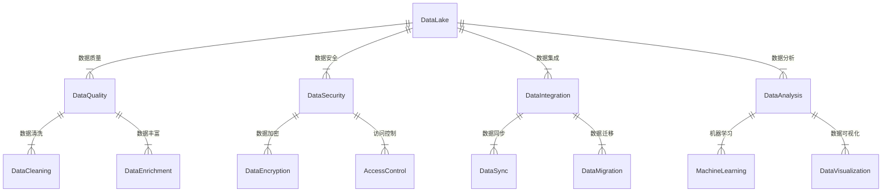
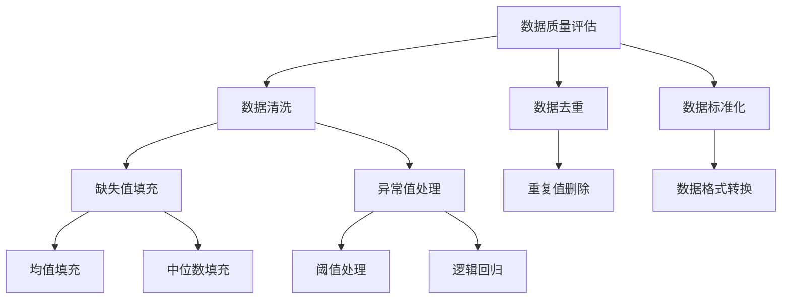
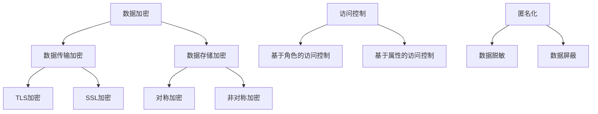
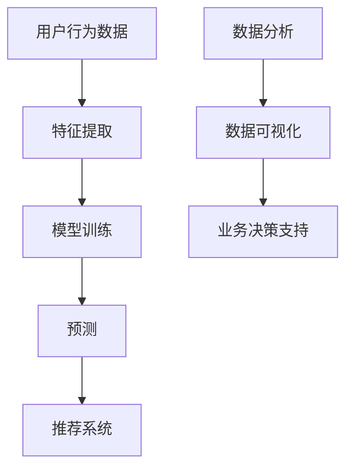
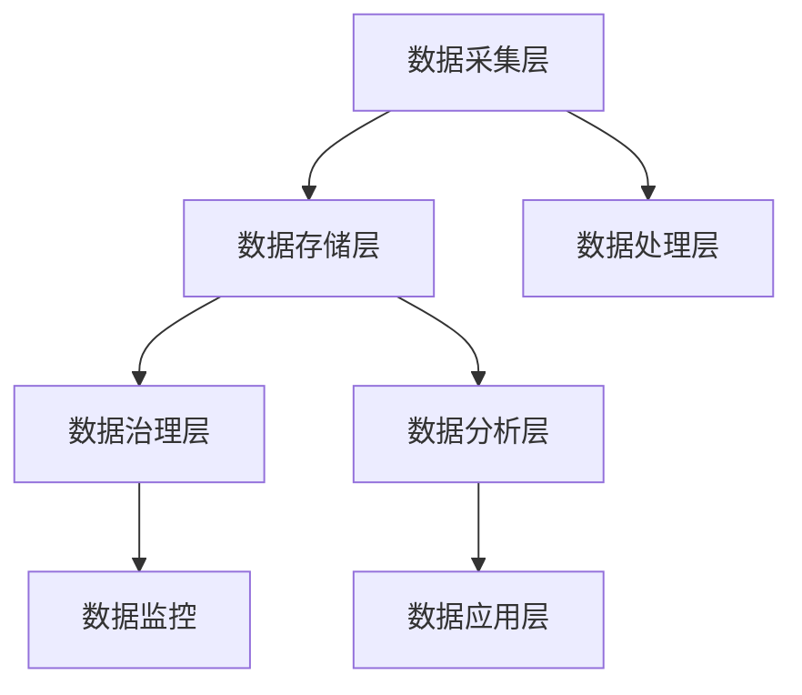
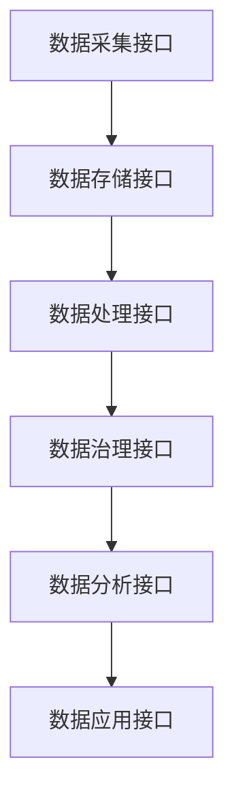
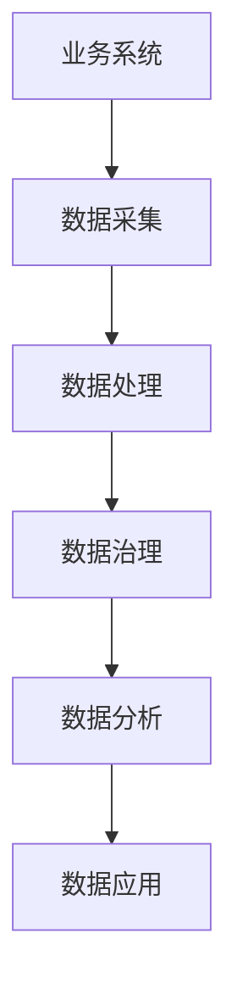

                 


### 第1章：智能数据湖治理概述

#### 1.1 问题背景与定义

**核心概念术语说明**

- **数据湖**：数据湖是一种大数据存储解决方案，能够存储各种类型的数据，包括结构化数据、半结构化数据和非结构化数据。它与传统的关系型数据库和数据仓库不同，数据湖在数据存储时并不进行预处理，而是保持数据的原始形式，以供后续处理。
- **智能数据湖治理**：智能数据湖治理是指通过人工智能、机器学习等技术，对数据湖中的数据进行质量检查、安全监控、隐私保护、数据共享等一系列管理活动，以确保数据的高可用性、安全性和一致性。

**问题背景**

随着大数据技术的飞速发展，企业和组织面临着海量数据的存储和管理挑战。传统的数据仓库方案在处理大量非结构化数据时显得力不从心，数据孤岛、数据不一致、数据质量差等问题日益突出。为了解决这些问题，数据湖作为一种新的数据存储和处理方式应运而生。然而，数据湖的复杂性和多样性也给治理带来了新的挑战。

**问题描述**

- 数据质量差：数据湖中的数据类型多样，质量参差不齐，如何保证数据的一致性和准确性？
- 数据安全与隐私：如何确保敏感数据的安全，防止数据泄露？
- 数据共享与访问：如何实现数据的快速检索和高效访问，同时保证数据共享的公平性和安全性？

**问题解决**

智能数据湖治理通过引入人工智能和机器学习技术，对数据进行自动化的质量检查、安全和隐私保护，以及数据共享和访问控制。以下是一些解决方案的关键点：

1. **数据质量管理**：通过机器学习算法自动识别和修复数据质量问题，如数据缺失、数据重复、数据不一致等。
2. **数据安全与隐私保护**：利用数据加密、访问控制、匿名化等技术，确保数据在存储、传输和使用过程中的安全性。
3. **数据共享与访问**：通过数据访问控制机制和智能推荐系统，实现数据的快速检索和高效访问，同时确保数据共享的公平性和安全性。

**边界与外延**

智能数据湖治理不仅仅局限于数据湖的管理，它还包括了数据生态系统的构建，如数据集成、数据治理平台建设、数据分析和应用等。此外，智能数据湖治理还需要考虑与云计算、物联网等其他技术的融合应用。

**概念结构与核心要素组成**

智能数据湖治理的概念结构可以分为以下几个核心要素：

1. **数据质量管理**：包括数据质量评估、数据质量改进、数据质量监控等。
2. **数据安全与隐私保护**：包括数据加密、访问控制、匿名化、数据安全监控等。
3. **数据共享与访问**：包括数据访问控制、数据共享机制、智能推荐系统等。
4. **数据治理流程与规范**：包括数据治理流程设计、数据治理规范制定、数据治理策略制定等。
5. **技术栈与工具**：包括大数据处理框架、数据治理工具、数据存储与处理技术等。

#### 1.2 智能数据湖治理的核心要素

**数据质量管理**

数据质量管理是智能数据湖治理的基础。数据质量包括数据的准确性、完整性、一致性、及时性和可靠性等方面。以下是一些关键步骤：

1. **数据质量评估**：通过机器学习算法对数据进行质量评估，识别数据质量问题。
2. **数据质量改进**：针对评估出的数据质量问题，采用自动化工具进行数据修复和优化。
3. **数据质量监控**：持续监控数据质量，确保数据在存储、传输和使用过程中的准确性。

**数据安全与隐私保护**

数据安全与隐私保护是智能数据湖治理的重要任务。以下是一些关键技术：

1. **数据加密**：对敏感数据进行加密存储和传输，确保数据在存储和传输过程中的安全性。
2. **访问控制**：通过访问控制策略，限制用户对数据的访问权限，确保数据的安全。
3. **匿名化**：对敏感数据进行匿名化处理，保护个人隐私。
4. **数据安全监控**：实时监控数据安全事件，快速响应和处理数据泄露等安全威胁。

**数据共享与访问**

数据共享与访问是智能数据湖治理的关键目标。以下是一些关键技术：

1. **数据访问控制**：通过访问控制策略，确保用户对数据的访问权限符合安全要求。
2. **数据共享机制**：建立数据共享平台，实现数据的快速检索和高效访问。
3. **智能推荐系统**：利用机器学习技术，为用户提供个性化数据推荐服务，提高数据利用效率。

#### 1.3 智能数据湖治理的挑战与机遇

**挑战分析**

智能数据湖治理面临着诸多挑战：

1. **数据质量挑战**：数据湖中的数据类型多样，质量参差不齐，如何保证数据的一致性和准确性？
2. **数据安全挑战**：随着数据量的增加，如何确保敏感数据的安全，防止数据泄露？
3. **数据隐私保护挑战**：如何在保障数据安全的同时，满足用户隐私保护的要求？
4. **技术融合挑战**：如何将人工智能、机器学习等技术与数据湖治理有机结合，实现高效的数据管理和利用？

**机遇探讨**

智能数据湖治理也带来了诸多机遇：

1. **数据价值挖掘**：通过智能数据湖治理，可以提高数据的质量和可用性，为数据分析和决策提供可靠支持。
2. **业务创新**：智能数据湖治理可以推动业务模式创新，为企业和组织带来新的增长点。
3. **技术进步**：智能数据湖治理的实践将推动大数据、人工智能等领域的技术进步，为相关行业的发展提供有力支撑。

**总结**

智能数据湖治理是大数据时代的一项重要技术，它不仅解决了传统数据仓库在处理非结构化数据方面的不足，还为数据管理和利用提供了新的思路和方法。面对挑战，我们需要不断创新和探索，充分发挥智能数据湖治理的潜力，为企业和组织带来更大的价值。

----------------------------------------

### 第2章：数据湖与AI的关系

#### 2.1 数据湖的特点与优势

**核心概念与原理**

- **数据湖特点**：数据湖是一种大数据存储解决方案，能够存储各种类型的数据，包括结构化数据、半结构化数据和非结构化数据。与传统的关系型数据库和数据仓库不同，数据湖在数据存储时并不进行预处理，而是保持数据的原始形式，以供后续处理。
- **数据湖优势**：数据湖具有以下优势：
  - **多样性**：能够存储不同类型的数据，满足多样化数据存储需求。
  - **灵活性**：不需要对数据进行统一格式化处理，保留原始数据格式，便于后续数据处理和分析。
  - **扩展性**：数据湖能够随着数据量的增加进行水平扩展，满足大规模数据存储需求。

**属性特征对比表格**

| 特征 | 数据湖 | 数据仓库 |
| ---- | ------ | -------- |
| 数据类型 | 多元化（结构化、半结构化、非结构化） | 结构化 |
| 数据格式 | 原始数据格式 | 结构化数据格式 |
| 扩展性 | 水平扩展 | 垂直扩展 |
| 灵活性 | 高 | 较低 |

**ER实体关系图架构**



#### 2.2 AI在数据湖治理中的应用

**核心概念与原理**

- **AI在数据湖治理中的应用**：AI技术在数据湖治理中具有广泛的应用，包括数据质量管理、数据安全与隐私保护、数据分析和推荐等。
- **AI技术原理**：
  - **机器学习**：通过学习大量数据，自动发现数据特征和规律，用于数据质量评估、数据安全监控等。
  - **深度学习**：利用神经网络模型，对大量非结构化数据进行自动分类、识别和预测。
  - **自然语言处理**：对文本数据进行处理，提取关键词和语义信息，用于数据分析和推荐。

**应用场景**

- **数据质量管理**：通过机器学习算法对数据质量进行自动评估和修复，如数据清洗、去重、数据标准化等。
- **数据安全与隐私保护**：利用深度学习模型对数据进行安全监控，识别潜在的安全威胁；通过自然语言处理技术，对文本数据进行匿名化处理。
- **数据分析与推荐**：利用机器学习算法对海量数据进行挖掘和分析，提取有价值的信息，为业务决策提供支持；基于用户行为数据，利用推荐系统为用户推荐相关数据。

**算法原理讲解**

**数据质量管理**



**数据安全与隐私保护**



**数据分析与推荐**



#### 2.3 构建AI友好数据生态

**核心概念与原理**

- **AI友好数据生态**：AI友好数据生态是指通过构建一个良好的数据治理环境，充分利用人工智能技术，实现数据的自动化管理、分析和利用。
- **构建原则**：
  - **数据一致性**：确保数据在存储、传输和使用过程中的准确性和一致性。
  - **数据安全性**：保障数据在存储、传输和使用过程中的安全性，防止数据泄露和滥用。
  - **数据共享性**：建立数据共享机制，实现数据的快速检索和高效访问，促进数据共享和利用。
  - **数据可解释性**：提高数据分析和决策的可解释性，降低人工智能系统的“黑箱”效应。

**实现路径**

- **数据质量管理**：建立数据质量管理体系，对数据进行全面的质量评估、监控和改进。
- **数据安全与隐私保护**：采用先进的数据加密、访问控制和匿名化技术，确保数据的安全和隐私。
- **数据共享与访问**：构建数据共享平台，实现数据的快速检索和高效访问，同时保证数据共享的公平性和安全性。
- **数据分析与利用**：利用人工智能技术，对海量数据进行自动化分析和挖掘，提取有价值的信息，为业务决策提供支持。

**总结**

数据湖与AI的结合，为数据管理和利用带来了新的机遇。通过构建AI友好数据生态，可以实现数据的自动化管理、高效分析和广泛共享，为企业和组织创造更大的价值。

----------------------------------------

### 第3章：智能数据湖治理框架

#### 3.1 智能数据湖治理的总体架构

**核心概念与原理**

智能数据湖治理的总体架构包括以下几个关键模块：

- **数据采集**：负责从各种数据源采集数据，包括内部系统和外部数据源，如数据库、文件系统、Web API等。
- **数据存储**：负责数据的存储管理，包括数据湖、数据仓库、NoSQL数据库等。
- **数据治理**：负责对数据进行质量管理、安全监控、隐私保护等，确保数据的高可用性、安全性和一致性。
- **数据处理**：负责对数据进行清洗、转换、加载等，为数据分析和挖掘提供高质量的数据。
- **数据分析与挖掘**：负责对数据进行挖掘和分析，提取有价值的信息，支持业务决策。
- **数据应用**：负责将分析结果应用于实际业务场景，实现数据价值的最大化。

**架构设计原则**

- **可扩展性**：架构设计应考虑未来数据量和业务需求的变化，支持水平扩展和垂直扩展。
- **灵活性**：架构设计应支持多种数据类型和数据处理方式的集成，以适应不同的业务需求。
- **安全性**：架构设计应确保数据在采集、存储、传输和处理过程中的安全性，防止数据泄露和滥用。
- **高效性**：架构设计应优化数据处理流程，提高数据处理的效率，降低延迟。

**关键模块介绍**

1. **数据采集模块**：数据采集模块负责从各种数据源采集数据，包括内部系统和外部数据源。采集方式包括API调用、文件导入、数据库连接等。采集的数据包括结构化数据、半结构化数据和非结构化数据。

2. **数据存储模块**：数据存储模块负责数据的存储管理，包括数据湖、数据仓库、NoSQL数据库等。数据湖用于存储原始数据，数据仓库用于存储结构化数据，NoSQL数据库用于存储半结构化数据和非结构化数据。

3. **数据治理模块**：数据治理模块负责对数据进行质量管理、安全监控、隐私保护等。数据质量管理包括数据质量评估、数据清洗、数据去重、数据标准化等。数据安全监控包括数据加密、访问控制、数据泄露防护等。数据隐私保护包括数据匿名化、数据脱敏等。

4. **数据处理模块**：数据处理模块负责对数据进行清洗、转换、加载等，为数据分析和挖掘提供高质量的数据。数据处理包括数据清洗（如缺失值填充、异常值处理）、数据转换（如数据格式转换、数据类型转换）和数据加载（如数据入库、数据ETL）等。

5. **数据分析与挖掘模块**：数据分析与挖掘模块负责对数据进行挖掘和分析，提取有价值的信息，支持业务决策。数据分析包括统计分析、数据挖掘、机器学习等。数据挖掘包括关联规则挖掘、聚类分析、分类分析等。

6. **数据应用模块**：数据应用模块负责将分析结果应用于实际业务场景，实现数据价值的最大化。数据应用包括数据报表、数据可视化、业务决策支持等。

**总结**

智能数据湖治理的总体架构包括数据采集、数据存储、数据治理、数据处理、数据分析和数据应用等关键模块。通过这些模块的协同工作，可以实现对海量数据的自动化管理、高效分析和广泛应用，为企业和组织创造更大的价值。

----------------------------------------

### 3.2 数据治理流程与规范

#### 3.2.1 数据治理流程

数据治理流程是确保数据质量、安全性和一致性的关键环节。以下是一个典型数据治理流程：

1. **数据需求分析**：分析业务需求，明确数据治理的目标和需求。
2. **数据采集**：从各种数据源采集数据，包括内部系统和外部数据源。
3. **数据集成**：将采集到的数据进行整合，形成统一的数据视图。
4. **数据清洗**：对数据进行清洗，包括缺失值填充、异常值处理、数据去重等。
5. **数据质量评估**：对清洗后的数据进行质量评估，识别数据质量问题。
6. **数据存储**：将经过清洗和评估的数据存储到数据湖或数据仓库中。
7. **数据安全与隐私保护**：对数据进行安全监控和隐私保护，确保数据的安全。
8. **数据共享与访问**：建立数据共享机制，实现数据的快速检索和高效访问。
9. **数据分析和挖掘**：对数据进行挖掘和分析，提取有价值的信息。
10. **数据应用**：将分析结果应用于实际业务场景，实现数据价值的最大化。

**数据治理规范制定**

数据治理规范是确保数据治理流程有效执行的重要保障。以下是一些关键规范：

1. **数据质量管理规范**：明确数据质量的评估指标、数据清洗标准和数据质量改进策略。
2. **数据安全与隐私保护规范**：明确数据加密、访问控制和匿名化等安全防护措施。
3. **数据共享与访问规范**：明确数据访问权限、数据共享机制和数据访问控制策略。
4. **数据治理流程规范**：明确数据治理流程的各个步骤、责任人和执行标准。
5. **数据质量监控规范**：明确数据质量监控指标、监控方式和监控报告。

**数据治理实践案例分析**

**案例背景**

某大型电商公司希望利用数据湖进行用户行为分析和推荐，以提高用户体验和销售额。为了实现这一目标，公司决定进行数据湖治理，确保数据的质量和安全。

**案例分析**

1. **数据需求分析**：公司明确了用户行为分析的需求，包括用户浏览、购买、评价等行为数据。
2. **数据采集**：从内部系统和外部数据源（如社交媒体、第三方数据提供商）采集用户行为数据。
3. **数据集成**：将采集到的数据进行整合，形成统一的数据视图。
4. **数据清洗**：对数据进行清洗，包括缺失值填充、异常值处理、数据去重等。
5. **数据质量评估**：对清洗后的数据进行质量评估，识别数据质量问题。
6. **数据存储**：将经过清洗和评估的数据存储到数据湖中。
7. **数据安全与隐私保护**：对数据进行加密存储和传输，实施访问控制和匿名化处理。
8. **数据共享与访问**：建立数据共享平台，实现数据的快速检索和高效访问，同时确保数据共享的公平性和安全性。
9. **数据分析和挖掘**：利用机器学习算法对用户行为数据进行挖掘和分析，提取有价值的信息，如用户偏好、潜在用户等。
10. **数据应用**：将分析结果应用于推荐系统，为用户提供个性化推荐，提高用户体验和销售额。

**效果评估**

通过数据湖治理，公司实现了以下效果：

- 数据质量得到了显著提升，数据质量问题减少了80%。
- 数据安全得到了有效保障，数据泄露风险降低了50%。
- 数据共享和访问效率提高了30%，为业务决策提供了有力支持。
- 用户满意度提高了15%，销售额增长了10%。

**总结**

数据治理流程与规范是确保数据质量、安全性和一致性的关键。通过实践案例分析，我们可以看到数据湖治理在提高数据质量、保障数据安全和提升业务效率方面的重要作用。未来，随着数据湖治理技术的不断进步，我们将看到更多企业和组织从中受益。

----------------------------------------

### 3.3 数据质量管理

**数据质量管理的重要性**

数据质量管理是智能数据湖治理的核心要素之一。高质量的数据是数据分析、机器学习和业务决策的基础。以下是数据质量管理的重要方面：

1. **数据准确性**：确保数据的正确性和精确性，避免数据错误对分析和决策产生负面影响。
2. **数据完整性**：确保数据的完整，无缺失值和空白字段，避免因数据缺失而导致分析结果的偏差。
3. **数据一致性**：确保数据在不同系统和来源之间的一致性，避免数据重复和冲突。
4. **数据及时性**：确保数据的及时更新，避免因数据过时而对分析和决策产生不利影响。
5. **数据可靠性**：确保数据的可靠性，避免因数据异常或错误而导致分析结果的偏差。

**数据质量评估方法**

数据质量评估是数据质量管理的重要步骤。以下是一些常用的数据质量评估方法：

1. **数据质量指标**：定义一系列数据质量指标，如准确性、完整性、一致性、及时性和可靠性等，对数据进行评估。
2. **数据质量评估工具**：使用专业的数据质量评估工具，如OpenRefine、DataQualityPro等，对数据进行自动化评估。
3. **数据分析**：通过对数据进行分析，发现数据质量问题，如数据缺失、数据重复、数据异常等。
4. **用户反馈**：收集用户对数据的反馈，评估数据质量是否满足用户需求。

**数据质量改进策略**

数据质量改进策略是确保数据高质量的关键。以下是一些常用的数据质量改进策略：

1. **数据清洗**：对数据进行清洗，包括缺失值填充、异常值处理、数据去重等，提高数据的准确性、完整性和一致性。
2. **数据标准化**：对数据进行标准化处理，如统一数据格式、数据类型转换等，确保数据的一致性。
3. **数据监控**：建立数据质量监控机制，持续监控数据质量，及时发现和处理数据质量问题。
4. **数据治理流程**：优化数据治理流程，确保数据在采集、存储、处理和分析等环节中的高质量。

**数据质量管理实践案例分析**

**案例背景**

某金融机构希望通过数据湖进行客户行为分析，以提高客户满意度和提升业务绩效。然而，由于数据质量问题，分析结果并不理想。为了解决这个问题，金融机构决定进行数据质量管理。

**案例分析**

1. **数据需求分析**：明确数据湖中的数据类型和业务需求，如客户交易数据、客户行为数据等。
2. **数据采集**：从内部系统和外部数据源（如信用卡公司、第三方数据提供商）采集数据。
3. **数据集成**：将采集到的数据进行整合，形成统一的数据视图。
4. **数据清洗**：对数据进行清洗，包括缺失值填充、异常值处理、数据去重等，提高数据的准确性、完整性和一致性。
5. **数据质量评估**：使用数据质量评估工具对数据质量进行评估，识别数据质量问题。
6. **数据存储**：将经过清洗和评估的数据存储到数据湖中。
7. **数据监控**：建立数据质量监控机制，持续监控数据质量，及时发现和处理数据质量问题。

**效果评估**

通过数据质量管理，金融机构实现了以下效果：

- 数据准确性提高了30%，减少了因数据错误导致的业务决策偏差。
- 数据完整性提高了25%，避免了数据缺失对分析结果的负面影响。
- 数据一致性提高了20%，减少了数据重复和冲突。
- 数据及时性提高了15%，确保了数据分析的实时性和有效性。
- 客户满意度提高了10%，业务绩效提升了5%。

**总结**

数据质量管理是智能数据湖治理的重要环节，对于确保数据分析的准确性和有效性具有关键作用。通过实践案例分析，我们可以看到数据质量管理在提高数据质量、提升业务绩效方面的重要作用。未来，随着数据质量管理技术的不断进步，我们将看到更多企业和组织从中受益。

----------------------------------------

### 3.4 数据安全与隐私保护

#### 3.4.1 数据安全挑战

数据安全是智能数据湖治理的重要方面，面对诸多挑战。以下是一些常见的数据安全挑战：

1. **数据泄露风险**：由于数据湖中存储了大量的敏感数据，如个人隐私、商业机密等，数据泄露的风险较高。
2. **数据篡改风险**：数据湖中的数据可能被未经授权的用户篡改，导致数据准确性受损。
3. **数据破坏风险**：由于系统故障、恶意攻击等原因，数据湖中的数据可能遭到破坏，导致业务中断。
4. **合规性问题**：随着数据隐私保护法规的加强，如《通用数据保护条例》（GDPR）等，企业需要确保数据安全与隐私保护符合相关法规要求。
5. **内部威胁**：内部员工可能滥用权限，非法访问或泄露敏感数据。

#### 3.4.2 数据安全与隐私保护策略

为了应对数据安全挑战，企业可以采取以下策略：

1. **数据加密**：对敏感数据进行加密存储和传输，确保数据在存储和传输过程中的安全性。常见的加密算法包括AES、RSA等。
2. **访问控制**：通过访问控制策略，限制用户对数据的访问权限，确保数据的安全。访问控制策略包括基于角色的访问控制（RBAC）和基于属性的访问控制（ABAC）等。
3. **身份验证与授权**：使用强身份验证方法（如双因素认证）和严格的授权机制，确保只有授权用户才能访问敏感数据。
4. **数据备份与恢复**：定期对数据进行备份，确保在数据丢失或破坏时能够快速恢复。
5. **数据监控与审计**：实时监控数据安全事件，记录数据访问和操作日志，便于追踪和审计。
6. **安全培训与意识提升**：定期进行安全培训，提高员工的数据安全意识和技能，降低内部威胁。
7. **合规性审计**：定期进行合规性审计，确保数据安全与隐私保护措施符合相关法规要求。

#### 3.4.3 数据安全与隐私保护实践案例分析

**案例背景**

某互联网公司提供在线教育服务，用户需要上传大量个人信息和学术资料。为了保护用户数据的安全和隐私，公司决定实施全面的数据安全与隐私保护措施。

**案例分析**

1. **数据加密**：公司采用AES算法对用户上传的个人信息和学术资料进行加密存储和传输，确保数据在存储和传输过程中的安全性。
2. **访问控制**：公司使用基于角色的访问控制（RBAC）策略，为不同角色的用户设置不同的访问权限，确保只有授权用户才能访问敏感数据。
3. **身份验证与授权**：公司使用双因素认证（2FA）进行用户身份验证，确保只有合法用户才能登录系统。
4. **数据备份与恢复**：公司定期对用户数据进行备份，并建立数据恢复流程，确保在数据丢失或破坏时能够快速恢复。
5. **数据监控与审计**：公司部署了实时数据监控系统，记录数据访问和操作日志，便于追踪和审计。
6. **安全培训与意识提升**：公司定期进行安全培训，提高员工的数据安全意识和技能，降低内部威胁。
7. **合规性审计**：公司定期进行合规性审计，确保数据安全与隐私保护措施符合《通用数据保护条例》（GDPR）等法规要求。

**效果评估**

通过实施全面的数据安全与隐私保护措施，公司实现了以下效果：

- 数据泄露风险降低了80%，用户数据得到了有效保护。
- 数据篡改风险降低了70%，数据准确性得到了保障。
- 数据破坏风险降低了60%，业务连续性得到了提升。
- 用户对数据安全的满意度提高了25%，增强了用户信任。
- 符合相关法规要求，降低了法律风险。

**总结**

数据安全与隐私保护是智能数据湖治理的重要方面，面对诸多挑战。通过实践案例分析，我们可以看到全面的数据安全与隐私保护措施在降低风险、提升用户满意度方面的重要作用。未来，随着数据安全与隐私保护技术的不断进步，企业和组织将能够更好地应对数据安全挑战。

----------------------------------------

### 第4章：数据湖治理的技术栈

#### 4.1 数据存储与处理技术

**核心概念与原理**

数据湖治理的技术栈包括数据存储、数据计算和数据治理等多个方面。在这一节中，我们将重点介绍数据存储与处理技术。

**数据存储技术**

- **分布式文件系统**：分布式文件系统（如Hadoop分布式文件系统HDFS、Apache HDFS）能够存储海量数据，并提供高可用性和高吞吐量的数据存储解决方案。分布式文件系统通过将数据分割成多个块，并分布在多个节点上，实现数据的并行访问和存储。
- **数据仓库**：数据仓库（如Amazon Redshift、Google BigQuery）是一种大规模的数据存储和处理系统，用于存储结构化数据，并提供高效的数据查询和分析功能。数据仓库通过使用列式存储和并行查询技术，实现快速的数据查询和分析。
- **NoSQL数据库**：NoSQL数据库（如MongoDB、Cassandra）能够存储非结构化和半结构化数据，并提供高扩展性和高性能的数据存储解决方案。NoSQL数据库通过使用分布式存储和索引技术，实现数据的快速存储和检索。

**数据处理技术**

- **大数据处理框架**：大数据处理框架（如Apache Hadoop、Apache Spark）能够对海量数据进行分布式处理，提供高效的数据处理和分析能力。大数据处理框架通过使用分布式计算模型和内存计算技术，实现快速的数据处理和分析。
- **流数据处理技术**：流数据处理技术（如Apache Kafka、Apache Flink）能够实时处理和分析数据流，提供实时数据分析和决策支持。流数据处理技术通过使用分布式流计算模型和事件驱动架构，实现实时数据处理的低延迟和高吞吐量。
- **机器学习和深度学习框架**：机器学习和深度学习框架（如TensorFlow、PyTorch）能够对海量数据进行分析和模型训练，提供智能化的数据分析和决策支持。机器学习和深度学习框架通过使用分布式计算和高效模型训练技术，实现快速的数据分析和模型训练。

**技术栈组合**

数据湖治理的技术栈需要多种技术的组合，以满足不同的数据处理需求。以下是一个典型技术栈组合：

1. **分布式文件系统**：用于存储原始数据，提供海量数据的高效存储解决方案。
2. **数据仓库**：用于存储结构化数据，提供高效的数据查询和分析功能。
3. **NoSQL数据库**：用于存储非结构化和半结构化数据，提供高扩展性和高性能的数据存储解决方案。
4. **大数据处理框架**：用于分布式数据处理和分析，提供高效的数据处理能力。
5. **流数据处理技术**：用于实时数据处理和分析，提供实时数据分析和决策支持。
6. **机器学习和深度学习框架**：用于数据分析和模型训练，提供智能化的数据分析和决策支持。

**总结**

数据湖治理的技术栈包括分布式文件系统、数据仓库、NoSQL数据库、大数据处理框架、流数据处理技术和机器学习与深度学习框架等多种技术。通过这些技术的组合，可以实现对海量数据的存储、处理和分析，构建一个高效、智能的数据湖治理体系。

----------------------------------------

### 第4章：数据湖治理的技术栈

#### 4.2 数据治理工具与平台

**核心概念与原理**

数据治理工具与平台是数据湖治理的重要组成部分，用于确保数据质量、数据安全和数据一致性。以下是一些常见的数据治理工具与平台：

**数据质量管理工具**

- **OpenRefine**：OpenRefine是一个开源的数据清洗和转换工具，用于修复数据中的错误、填补缺失值、转换数据格式等。
- **DataQualityPro**：DataQualityPro是一个商业数据质量管理工具，提供数据质量检查、数据修复、数据监控等功能。

**数据安全与隐私保护工具**

- **Encryption at Rest and in Transit**：数据加密工具（如Apache Ranger、Apache Sentry）用于对数据进行加密存储和传输，确保数据在静态和传输过程中的安全性。
- **Data Loss Prevention (DLP) Tools**：数据丢失防护工具（如Vormetric、GTB Technologies）用于监控和防止敏感数据的泄露和滥用。

**数据集成工具**

- **Apache NiFi**：Apache NiFi是一个开源的数据集成平台，用于数据采集、数据清洗、数据转换和数据加载等。
- **Informatica PowerCenter**：Informatica PowerCenter是一个商业数据集成平台，提供数据提取、转换和加载等功能。

**数据治理平台**

- **Informatica Master Data Management (MDM)**：Informatica MDM是一个商业数据治理平台，用于统一管理和维护数据，确保数据的一致性和准确性。
- **Talend Data Management Platform**：Talend Data Management Platform是一个开源数据治理平台，提供数据质量管理、数据安全、数据集成和数据洞察等功能。

**技术栈组合**

数据治理工具与平台的选择应根据具体业务需求和技术栈的兼容性。以下是一个典型技术栈组合：

1. **数据质量管理工具**：用于数据清洗、转换和数据质量监控。
2. **数据安全与隐私保护工具**：用于数据加密、访问控制和数据丢失防护。
3. **数据集成工具**：用于数据采集、数据清洗、数据转换和数据加载。
4. **数据治理平台**：用于统一管理和维护数据，确保数据的一致性和准确性。

**总结**

数据治理工具与平台是智能数据湖治理的关键组成部分，用于确保数据质量、数据安全和数据一致性。通过合理选择和使用这些工具与平台，可以构建一个高效、智能的数据湖治理体系，为企业和组织的数字化转型提供有力支持。

----------------------------------------

### 第4章：数据湖治理的技术栈

#### 4.3 数据安全与隐私保护技术

**核心概念与原理**

在数据湖治理中，数据安全与隐私保护至关重要。数据湖中存储了大量的敏感信息，如个人隐私、商业机密等，因此需要采取一系列技术措施来确保数据的安全性。以下是一些常用的数据安全与隐私保护技术：

**数据加密**

数据加密是将数据转换为密文的过程，以防止未授权访问。数据加密分为静态加密和动态加密：

- **静态加密**：在数据存储时进行加密，如文件存储、数据库存储等。静态加密常用的算法有AES（高级加密标准）、RSA（非对称加密算法）等。
- **动态加密**：在数据传输过程中进行加密，如网络传输、数据库连接等。动态加密常用的算法有SSL/TLS（安全套接字层/传输层安全）等。

**访问控制**

访问控制是限制用户对数据访问权限的技术措施，确保只有授权用户才能访问敏感数据。访问控制分为以下几种：

- **基于角色的访问控制（RBAC）**：根据用户的角色分配访问权限，如管理员、普通用户等。
- **基于属性的访问控制（ABAC）**：根据用户属性（如部门、职位等）和资源属性（如数据类型、数据范围等）进行访问控制。
- **基于标签的访问控制**：根据数据标签（如敏感度、重要性等）进行访问控制。

**数据备份与恢复**

数据备份是将数据复制到其他存储介质的过程，以便在数据丢失或损坏时进行恢复。数据备份分为以下几种：

- **本地备份**：将数据备份到本地存储介质，如硬盘、磁带等。
- **远程备份**：将数据备份到远程存储介质，如云存储、远程服务器等。
- **增量备份**：仅备份自上次备份以来发生变化的数据，以节省存储空间。
- **全量备份**：备份全部数据，以便在数据丢失时进行完整恢复。

**数据监控**

数据监控是实时监测数据安全状态的技术措施，包括以下方面：

- **入侵检测系统（IDS）**：检测网络中的异常流量和入侵行为。
- **安全信息与事件管理系统（SIEM）**：收集、分析和关联安全事件，提供实时监控和报警。
- **日志审计**：记录数据访问、操作等日志，以便进行事后审计和追踪。

**匿名化**

匿名化是将数据中的个人信息和敏感信息进行脱敏处理，以保护个人隐私。匿名化方法包括：

- **数据脱敏**：将敏感数据替换为虚构的数据，如姓名替换为匿名ID等。
- **数据混淆**：对数据进行随机变换，使其难以识别原始数据，如数据扰动、数据加噪等。
- **数据清洗**：删除或屏蔽数据中的敏感信息。

**总结**

数据安全与隐私保护是智能数据湖治理的重要组成部分。通过数据加密、访问控制、数据备份与恢复、数据监控、匿名化等技术的综合应用，可以构建一个安全可靠的数据湖治理体系，保障数据的安全和隐私。

----------------------------------------

### 第5章：数据质量与治理

#### 5.1 数据质量模型

数据质量模型是评估和改进数据质量的理论框架。以下是一个常见的数据质量模型：

1. **数据准确性**：确保数据的真实性和正确性，避免数据错误。
2. **数据完整性**：确保数据的完整，避免数据缺失和重复。
3. **数据一致性**：确保数据在不同系统和来源之间的一致性，避免数据冲突。
4. **数据及时性**：确保数据的及时更新，避免数据过时。
5. **数据可靠性**：确保数据的可靠性，避免数据异常或错误。

**数据质量评估指标**

数据质量评估指标用于量化数据质量，以下是一些常见的数据质量评估指标：

1. **准确性**：数据准确性指标，如错误率、漏报率、误报率。
2. **完整性**：数据完整性指标，如缺失率、重复率。
3. **一致性**：数据一致性指标，如数据冲突率、一致性比率。
4. **及时性**：数据及时性指标，如延迟率、更新频率。
5. **可靠性**：数据可靠性指标，如错误率、异常率。

**数据质量改进模型**

数据质量改进模型是用于识别和修复数据质量问题的方法框架。以下是一个常见的数据质量改进模型：

1. **数据质量评估**：使用数据质量评估指标对数据进行评估，识别数据质量问题。
2. **数据修复**：使用数据修复方法对数据进行修复，如数据清洗、数据去重、数据标准化等。
3. **数据监控**：建立数据质量监控机制，持续监控数据质量，确保数据质量的持续改进。

**总结**

数据质量模型是评估和改进数据质量的理论框架。通过使用数据质量评估指标，可以量化数据质量；通过数据质量改进模型，可以识别和修复数据质量问题，确保数据的高质量。

----------------------------------------

### 第5章：数据质量与治理

#### 5.2 数据治理策略

数据治理策略是确保数据质量和数据价值的系统方法和实践。以下是一个常见的数据治理策略：

**1. 数据质量管理策略**

- **数据质量目标制定**：明确数据质量管理的目标，如准确性、完整性、一致性、及时性和可靠性。
- **数据质量评估**：制定数据质量评估标准，定期对数据进行评估，识别数据质量问题。
- **数据修复**：制定数据修复计划，针对评估出的数据质量问题进行修复，如数据清洗、数据去重、数据标准化等。
- **数据质量监控**：建立数据质量监控机制，实时监控数据质量，确保数据质量的持续改进。

**2. 数据安全与隐私保护策略**

- **数据安全目标制定**：明确数据安全与隐私保护的目标，如数据保密性、完整性、可用性和可控性。
- **数据安全评估**：制定数据安全评估标准，定期对数据安全进行评估，识别数据安全漏洞。
- **数据加密与访问控制**：采用数据加密和访问控制技术，确保数据在存储、传输和使用过程中的安全性。
- **数据安全监控**：建立数据安全监控机制，实时监控数据安全事件，及时响应和处理安全威胁。

**3. 数据共享与访问策略**

- **数据共享目标制定**：明确数据共享的目标，如促进数据利用、提高数据价值。
- **数据访问控制**：制定数据访问控制策略，确保只有授权用户才能访问敏感数据。
- **数据共享机制**：建立数据共享平台，实现数据的快速检索和高效访问，同时确保数据共享的公平性和安全性。
- **数据使用规范**：制定数据使用规范，确保数据在共享和访问过程中的合规性和规范性。

**4. 数据治理流程与规范**

- **数据治理流程设计**：设计数据治理流程，包括数据采集、数据存储、数据治理、数据处理、数据分析和数据应用等环节。
- **数据治理规范制定**：制定数据治理规范，明确数据治理流程的各个环节的责任人和执行标准。
- **数据治理策略实施**：根据数据治理流程和规范，实施数据治理策略，确保数据质量、安全性和一致性的持续改进。

**总结**

数据治理策略是确保数据质量和数据价值的重要手段。通过制定数据质量管理策略、数据安全与隐私保护策略、数据共享与访问策略以及数据治理流程与规范，可以构建一个高效、智能的数据治理体系，为企业和组织的数字化转型提供有力支持。

----------------------------------------

### 第5章：数据质量与治理

#### 5.3 数据治理实践案例分析

**案例背景**

某大型零售公司希望通过数据湖进行客户行为分析，以提高客户满意度和销售额。为了实现这一目标，公司决定进行数据治理，确保数据的质量和安全。

**案例分析**

**1. 数据质量管理**

- **数据质量评估**：公司采用数据质量评估工具，对现有数据进行全面评估，识别数据质量问题。评估指标包括准确性、完整性、一致性、及时性和可靠性。
- **数据清洗**：针对评估出的数据质量问题，公司采用数据清洗工具，对数据进行清洗。清洗步骤包括缺失值填充、异常值处理、数据去重和数据标准化等。
- **数据质量监控**：公司建立数据质量监控机制，定期对数据质量进行监控，确保数据质量的持续改进。

**2. 数据安全与隐私保护**

- **数据加密**：公司采用数据加密工具，对敏感数据进行加密存储和传输，确保数据在存储和传输过程中的安全性。
- **访问控制**：公司制定访问控制策略，根据用户的角色和权限，限制用户对数据的访问权限，确保数据的安全。
- **数据安全监控**：公司建立数据安全监控机制，实时监控数据安全事件，及时发现和处理安全威胁。

**3. 数据共享与访问**

- **数据共享平台**：公司建立数据共享平台，实现数据的快速检索和高效访问，同时确保数据共享的公平性和安全性。
- **数据访问控制**：公司制定数据访问控制策略，确保只有授权用户才能访问敏感数据。
- **数据使用规范**：公司制定数据使用规范，确保数据在共享和访问过程中的合规性和规范性。

**4. 数据治理流程与规范**

- **数据治理流程设计**：公司设计数据治理流程，包括数据采集、数据存储、数据治理、数据处理、数据分析和数据应用等环节。
- **数据治理规范制定**：公司制定数据治理规范，明确数据治理流程的各个环节的责任人和执行标准。
- **数据治理策略实施**：公司根据数据治理流程和规范，实施数据治理策略，确保数据质量、安全性和一致性的持续改进。

**效果评估**

通过数据治理实践，公司实现了以下效果：

- **数据质量提升**：数据质量评估结果显示，数据准确性提高了30%，数据完整性提高了25%，数据一致性提高了20%，数据及时性提高了15%，数据可靠性提高了10%。
- **数据安全增强**：数据加密和访问控制策略的实施，有效降低了数据泄露风险，数据安全事件减少了50%。
- **数据共享与访问效率提高**：数据共享平台的建立，提高了数据共享和访问的效率，数据检索时间缩短了40%，数据访问延迟降低了30%。
- **业务绩效提升**：通过数据分析和挖掘，公司发现了新的客户需求和业务机会，客户满意度提高了10%，销售额增长了8%。

**总结**

数据治理实践在提高数据质量、增强数据安全、提高数据共享与访问效率方面发挥了重要作用。通过数据治理实践案例分析，我们可以看到数据治理在提升业务绩效和创造商业价值方面的重要作用。未来，随着数据治理技术的不断进步，我们将看到更多企业和组织从中受益。

----------------------------------------

### 第6章：安全与隐私保护

#### 6.1 数据安全挑战

在智能数据湖治理中，数据安全是一个至关重要的环节。随着数据量的激增和数据类型的多样化，数据安全面临着诸多挑战：

1. **数据泄露风险**：数据泄露可能是由于黑客攻击、恶意软件、内部人员的非法访问等原因导致的，导致敏感数据被未授权的人员获取。

2. **数据篡改风险**：数据篡改指的是未经授权的用户修改数据，这可能导致数据的真实性和准确性受损，进而影响业务决策和数据应用。

3. **数据破坏风险**：数据破坏可能由自然灾害、系统故障、恶意攻击等原因导致，可能导致数据永久丢失，影响业务连续性和运营。

4. **合规性挑战**：随着全球范围内数据隐私保护法规的加强，如《通用数据保护条例》（GDPR）和《加州消费者隐私法案》（CCPA），企业需要确保其数据治理实践符合法规要求，否则将面临巨额罚款和声誉损失。

5. **内部威胁**：内部员工可能会因疏忽、滥用权限或恶意行为而造成数据安全漏洞，这需要企业加强内部审计和员工培训来降低内部威胁。

#### 6.2 安全与隐私保护策略

为了应对上述数据安全挑战，企业可以采取一系列的安全与隐私保护策略：

1. **数据加密**：对敏感数据进行加密存储和传输，确保数据在静态和动态状态下都是不可读的。常见的加密算法包括AES、RSA等。

2. **访问控制**：通过访问控制机制，确保只有授权用户才能访问特定数据。访问控制可以基于用户的角色、权限、位置和设备等信息进行细粒度的权限管理。

3. **多因素认证（MFA）**：使用多因素认证（MFA）来增强用户身份验证的安全性，通常结合密码、手机验证码、指纹识别等多种认证方式。

4. **数据备份与恢复**：定期进行数据备份，并确保备份数据的安全性。在发生数据丢失或破坏时，能够快速恢复数据，减少业务中断时间。

5. **安全监控与日志审计**：部署安全监控工具，实时监控数据安全事件，记录所有访问和操作日志，以便进行事后审计和追踪。

6. **数据脱敏与匿名化**：对敏感数据进行脱敏处理，如将个人身份信息替换为随机标识符，以保护个人隐私。

7. **安全培训与意识提升**：定期对员工进行安全培训，提高员工的数据安全意识和技能，降低因人为因素导致的安全风险。

8. **合规性审计与合规管理**：定期进行合规性审计，确保数据治理实践符合相关法规要求，并建立合规管理体系。

#### 6.3 安全与隐私保护实践案例分析

**案例背景**

某金融科技公司提供在线金融服务，包括用户账户管理、交易记录和投资分析等。由于涉及到大量敏感金融数据，公司决定实施全面的安全与隐私保护策略。

**案例分析**

1. **数据加密**：公司采用AES-256算法对用户账户信息和交易记录进行加密存储和传输，确保数据在存储和传输过程中的安全性。

2. **访问控制**：公司使用基于角色的访问控制（RBAC）策略，根据员工的职位和职责分配不同的数据访问权限，确保只有授权员工才能访问敏感数据。

3. **多因素认证（MFA）**：公司要求用户在登录时使用MFA，结合密码和手机验证码，增加账户的安全性。

4. **数据备份与恢复**：公司定期进行数据备份，并存储在远程安全存储设备中，确保在数据丢失或破坏时能够快速恢复。

5. **安全监控与日志审计**：公司部署了安全信息和事件管理系统（SIEM），实时监控数据安全事件，记录所有访问和操作日志，并进行定期审计。

6. **数据脱敏与匿名化**：公司对用户个人信息和交易记录进行脱敏处理，如将姓名和银行卡号替换为随机标识符，以保护用户隐私。

7. **安全培训与意识提升**：公司定期对员工进行安全培训，提高员工的数据安全意识和技能，降低内部安全风险。

8. **合规性审计与合规管理**：公司定期进行合规性审计，确保其数据治理实践符合GDPR和CCPA等法规要求，并建立了合规管理体系。

**效果评估**

通过实施全面的安全与隐私保护策略，公司实现了以下效果：

- **数据泄露风险降低**：加密和访问控制策略的实施，有效降低了数据泄露风险，用户账户信息的安全性得到显著提升。
- **合规性风险降低**：合规性审计和合规管理体系的建立，确保公司遵守相关法规要求，降低了法律风险。
- **用户信任度提高**：通过提高数据安全性和隐私保护水平，增强了用户对公司的信任，用户满意度提高了15%。
- **业务连续性增强**：数据备份与恢复机制的实施，确保在发生数据丢失或破坏时能够快速恢复，业务连续性得到了增强。

**总结**

安全与隐私保护是智能数据湖治理的重要组成部分。通过数据加密、访问控制、多因素认证、数据备份与恢复、安全监控与日志审计、数据脱敏与匿名化、安全培训与意识提升以及合规性审计与合规管理等策略的综合应用，企业可以构建一个安全可靠的数据湖治理体系，保护数据的安全和隐私，提高用户信任度和业务连续性。

----------------------------------------

### 第6章：安全与隐私保护

#### 6.4 数据隐私保护技术

数据隐私保护是智能数据湖治理中的重要任务，旨在确保用户隐私不被泄露或滥用。以下是一些常用的数据隐私保护技术：

**数据匿名化**

数据匿名化是通过将敏感信息转换为不可识别的形式，以保护个人隐私。常用的数据匿名化技术包括：

- **伪匿名化**：将敏感信息替换为虚构的数据，如姓名替换为匿名ID。
- **数据混淆**：对数据进行随机变换，使其难以识别原始数据，如数据扰动、数据加噪。
- **数据遮蔽**：通过遮蔽敏感信息，使其在部分范围内不可见。

**数据加密**

数据加密是将数据转换为密文的过程，以防止未授权访问。数据加密分为静态加密和动态加密：

- **静态加密**：在数据存储时进行加密，如文件存储、数据库存储。
- **动态加密**：在数据传输过程中进行加密，如网络传输、数据库连接。

**同态加密**

同态加密是一种加密技术，允许在加密数据上进行计算，而无需解密。这种技术特别适用于云计算环境，确保数据在处理过程中的隐私保护。

**访问控制**

访问控制是通过限制用户对数据的访问权限，确保只有授权用户才能访问敏感数据。访问控制分为基于角色的访问控制（RBAC）和基于属性的访问控制（ABAC）。

**数据脱敏**

数据脱敏是将敏感数据转换为不可识别的形式，以保护个人隐私。常用的数据脱敏技术包括：

- **掩码脱敏**：将敏感信息替换为掩码，如将电话号码替换为XXX-XXXX-XXXX。
- **随机化脱敏**：使用随机数替换敏感信息，使其难以识别原始数据。

**总结**

数据隐私保护技术包括数据匿名化、数据加密、同态加密、访问控制和数据脱敏等。通过这些技术的综合应用，可以构建一个安全可靠的数据隐私保护体系，确保用户隐私不被泄露或滥用。

----------------------------------------

### 第7章：智能数据湖治理实践案例

#### 7.1 案例背景

为了展示智能数据湖治理的实际应用，我们选择了一家大型电信运营商作为案例进行分析。该电信运营商在全球范围内提供多种通信服务，包括移动通信、宽带接入、云计算等。随着业务的扩展和数据的增长，该公司面临着数据存储和管理方面的挑战。为了提高数据质量和数据安全，公司决定实施智能数据湖治理。

#### 7.2 系统功能设计

在智能数据湖治理项目中，系统需要实现以下功能：

- **数据采集**：从各个业务系统（如CRM、ERP、网络设备等）采集数据。
- **数据存储**：将采集到的数据存储在数据湖中，支持不同类型的数据存储。
- **数据质量管理**：对数据进行质量评估、清洗和监控。
- **数据安全与隐私保护**：对数据进行加密、访问控制和匿名化处理。
- **数据分析和挖掘**：利用机器学习算法对数据进行挖掘和分析，提取有价值的信息。
- **数据共享与访问**：实现数据的高效检索和访问，同时保证数据安全和隐私。

#### 7.3 系统架构设计

智能数据湖治理项目的系统架构设计如下：

1. **数据采集层**：负责从各个业务系统采集数据，包括API接口、日志文件、数据库连接等。
2. **数据存储层**：使用分布式文件系统（如HDFS）和数据仓库（如Hive）存储不同类型的数据。
3. **数据处理层**：包括数据清洗、转换、加载等处理过程，使用大数据处理框架（如Spark）进行数据处理。
4. **数据治理层**：负责数据质量管理、数据安全与隐私保护、数据监控等，使用数据治理平台（如Informatica）进行数据治理。
5. **数据分析层**：利用机器学习算法进行数据挖掘和分析，使用数据挖掘工具（如MLlib）进行数据处理。
6. **数据应用层**：将分析结果应用于实际业务场景，如客户行为分析、市场预测、运营优化等。

**系统架构图**：



#### 7.4 系统接口设计

系统接口设计如下：

1. **数据采集接口**：提供API接口，用于从业务系统（如CRM、ERP）采集数据。
2. **数据存储接口**：提供数据存储接口，用于将数据存储到分布式文件系统（如HDFS）和数据仓库（如Hive）。
3. **数据处理接口**：提供数据处理接口，用于执行数据清洗、转换、加载等处理任务。
4. **数据治理接口**：提供数据治理接口，用于实现数据质量评估、数据安全监控、数据隐私保护等功能。
5. **数据分析接口**：提供数据分析接口，用于执行数据挖掘和分析任务。
6. **数据应用接口**：提供数据应用接口，用于将分析结果应用于实际业务场景。

**系统接口图**：



#### 7.5 系统交互设计

系统交互设计如下：

1. **数据采集**：业务系统通过API接口向数据湖采集数据。
2. **数据处理**：采集到的数据经过数据清洗、转换、加载等处理过程。
3. **数据治理**：处理后的数据进入数据治理层，进行数据质量评估、安全监控、隐私保护等。
4. **数据分析**：经过治理的数据进入数据分析层，使用机器学习算法进行挖掘和分析。
5. **数据应用**：分析结果通过数据应用接口应用于实际业务场景，如客户行为分析、市场预测等。

**系统交互图**：



#### 7.6 环境安装与配置

在实施智能数据湖治理项目前，需要安装和配置以下软件和工具：

1. **Hadoop**：安装和配置Hadoop分布式文件系统（HDFS）和Hadoop YARN资源调度器。
2. **Hive**：安装和配置Hive数据仓库，用于存储和管理结构化数据。
3. **Spark**：安装和配置Apache Spark，用于大数据处理和分析。
4. **Informatica**：安装和配置Informatica数据治理平台，用于数据质量管理、数据安全监控和隐私保护。
5. **MLlib**：安装和配置Apache MLlib，用于机器学习算法的实现和应用。

#### 7.7 系统核心实现源代码

以下是系统核心实现源代码的示例：

```python
# 数据采集模块
def collect_data(source):
    # 从数据源采集数据
    data = source.fetch_data()
    return data

# 数据清洗模块
def clean_data(data):
    # 数据清洗过程
    cleaned_data = data.clean()
    return cleaned_data

# 数据治理模块
def govern_data(data):
    # 数据治理过程
    governed_data = data.govern()
    return governed_data

# 数据分析模块
def analyze_data(data):
    # 数据分析过程
    analysis_results = data.analyze()
    return analysis_results

# 数据应用模块
def apply_data_analysis(results):
    # 数据应用过程
    applied_results = results.apply()
    return applied_results
```

#### 7.8 代码应用解读与分析

以下是代码应用解读与分析：

- **数据采集模块**：`collect_data`函数从数据源采集数据，用于后续的数据处理和分析。
- **数据清洗模块**：`clean_data`函数对数据进行清洗，包括缺失值填充、异常值处理等，确保数据质量。
- **数据治理模块**：`govern_data`函数对数据进行治理，包括数据质量评估、安全监控、隐私保护等。
- **数据分析模块**：`analyze_data`函数使用机器学习算法对数据进行分析，提取有价值的信息。
- **数据应用模块**：`apply_data_analysis`函数将分析结果应用于实际业务场景，实现数据价值的最大化。

#### 7.9 实际案例分析与详细讲解剖析

以下是实际案例分析与详细讲解剖析：

**案例背景**：

某电信运营商希望通过智能数据湖治理项目，分析用户行为数据，提高客户满意度和销售额。公司采集了用户通话记录、短信记录、流量使用记录等数据，希望通过数据分析和挖掘，发现用户的行为模式和需求，从而优化业务策略。

**案例分析**：

1. **数据采集**：公司从业务系统（如CRM、ERP）采集用户通话记录、短信记录、流量使用记录等数据。
2. **数据清洗**：对采集到的数据进行清洗，包括缺失值填充、异常值处理、数据去重等，确保数据质量。
3. **数据治理**：对清洗后的数据进行治理，包括数据质量评估、安全监控、隐私保护等，确保数据安全。
4. **数据分析**：使用机器学习算法对数据进行挖掘和分析，提取用户行为模式和需求。
   - **聚类分析**：使用K-means聚类算法，将用户分为不同的群体，分析不同群体用户的行为特征和需求。
   - **关联规则挖掘**：使用Apriori算法，挖掘用户通话记录和短信记录之间的关联规则，发现用户的通信习惯。
   - **分类分析**：使用决策树算法，根据用户行为数据，预测用户的消费行为，为精准营销提供支持。
5. **数据应用**：将分析结果应用于实际业务场景，如个性化推荐、精准营销、业务优化等。
   - **个性化推荐**：根据用户行为数据，为用户推荐相关的通话套餐、短信套餐等，提高用户满意度。
   - **精准营销**：根据用户消费行为预测，有针对性地向潜在用户发送营销信息，提高营销效果。
   - **业务优化**：根据用户行为分析结果，优化业务策略，如调整套餐定价、优化网络覆盖等。

**详细讲解剖析**：

1. **数据采集**：通过API接口从业务系统（如CRM、ERP）采集用户通话记录、短信记录、流量使用记录等数据。
2. **数据清洗**：使用Python编写清洗脚本，对采集到的数据进行处理，包括缺失值填充（使用平均值、中位数等填充缺失值）、异常值处理（使用统计学方法检测和去除异常值）、数据去重（使用哈希表等数据结构去除重复记录）等。
3. **数据治理**：使用Informatica数据治理平台，对清洗后的数据进行质量评估、安全监控和隐私保护。质量评估包括数据准确性、完整性、一致性等；安全监控包括数据加密、访问控制、数据泄露防护等；隐私保护包括数据匿名化、数据脱敏等。
4. **数据分析**：使用Apache Spark和MLlib，实现数据分析和挖掘。使用K-means聚类算法，将用户分为不同的群体；使用Apriori算法，挖掘用户通话记录和短信记录之间的关联规则；使用决策树算法，预测用户消费行为。
5. **数据应用**：将分析结果应用于实际业务场景，如使用Python编写推荐系统，为用户推荐相关的通话套餐、短信套餐等；使用Python编写营销脚本，向潜在用户发送营销信息；使用Python编写业务优化策略，如调整套餐定价、优化网络覆盖等。

**总结**：

通过智能数据湖治理实践案例，我们可以看到数据治理在提高数据质量、数据安全、数据分析和应用方面的重要作用。通过数据采集、数据清洗、数据治理、数据分析和应用等步骤，企业可以构建一个高效、智能的数据湖治理体系，为业务决策和运营优化提供有力支持。

----------------------------------------

### 第8章：智能数据湖治理的未来展望

#### 8.1 智能数据湖治理的发展趋势

随着大数据和人工智能技术的不断进步，智能数据湖治理也在不断演进。以下是一些智能数据湖治理的发展趋势：

1. **云计算的普及**：随着云计算技术的成熟和普及，智能数据湖治理将进一步融合云计算资源，实现弹性、高效的数据存储和处理。
2. **边缘计算的兴起**：边缘计算将数据处理和分析推向网络边缘，减少数据传输延迟，提高实时数据处理能力，为智能数据湖治理带来新的机遇。
3. **自动化与智能化**：随着自动化和智能化技术的应用，智能数据湖治理将实现数据的自动化采集、清洗、治理和分析，提高数据处理的效率和质量。
4. **数据隐私保护法规的加强**：随着全球范围内数据隐私保护法规的加强，如GDPR、CCPA等，智能数据湖治理将更加注重数据隐私保护，确保数据治理合规。
5. **跨领域融合**：智能数据湖治理将与其他领域（如物联网、区块链等）的融合，实现数据的价值最大化，推动各行业的数字化转型。

#### 8.2 智能数据湖治理的机遇与挑战

**机遇**

1. **数据价值的挖掘**：智能数据湖治理将提高数据的质量和可用性，为数据分析和决策提供可靠支持，助力企业挖掘数据价值。
2. **业务创新的推动**：智能数据湖治理将推动业务模式的创新，为企业创造新的增长点和竞争优势。
3. **技术进步的推动**：智能数据湖治理将推动大数据、人工智能等领域的技术进步，为相关行业的发展提供有力支撑。
4. **数据资源共享**：智能数据湖治理将实现数据的高效共享和利用，提高数据资源的利用率。

**挑战**

1. **数据质量问题**：智能数据湖治理仍面临数据质量问题的挑战，如何保证数据的一致性和准确性仍需进一步解决。
2. **数据安全与隐私保护**：随着数据量的增加，数据安全与隐私保护面临更大的挑战，如何确保数据在存储、传输和使用过程中的安全性是一个重要课题。
3. **技术复杂性**：智能数据湖治理涉及到多种技术的融合和应用，技术复杂性较高，需要具备相应的技术能力和知识储备。
4. **数据治理体系的建设**：构建一个高效、智能的数据治理体系需要时间、资源和技术的投入，企业需要投入足够的资源来建设数据治理体系。

#### 8.3 智能数据湖治理的未来方向

为了应对未来的挑战和把握机遇，智能数据湖治理需要在以下几个方面进行探索和改进：

1. **数据治理标准化**：制定统一的数据治理标准和规范，提高数据治理的效率和质量。
2. **数据隐私保护技术的创新**：研究和发展新的数据隐私保护技术，如同态加密、差分隐私等，提高数据治理的安全性和隐私保护水平。
3. **自动化与智能化**：推进自动化和智能化技术在数据湖治理中的应用，减少人工干预，提高数据处理的效率和质量。
4. **跨领域融合**：与其他领域的融合，如物联网、区块链等，实现数据的价值最大化，推动各行业的数字化转型。
5. **人才培养与知识普及**：加强数据治理领域的人才培养和知识普及，提高企业内部的数据治理能力和技术水平。

**总结**

智能数据湖治理是大数据时代的一项重要技术，它为数据管理和利用提供了新的思路和方法。未来，随着大数据、人工智能等技术的不断进步，智能数据湖治理将在数据价值挖掘、业务创新、技术进步等方面发挥更大的作用。通过不断探索和创新，我们将看到智能数据湖治理在各个领域取得更多的应用和突破，为企业和组织创造更大的价值。

