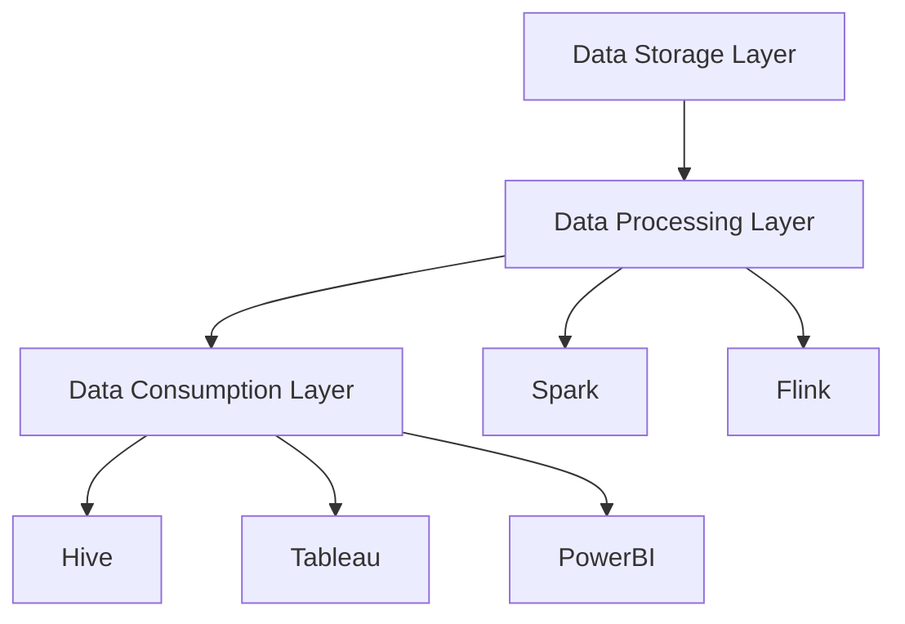

                 

**智能数据湖管理：构建AI友好的数据基础**

**关键词：** 数据湖，AI友好，数据基础，分布式存储，数据处理，计算框架

**摘要：** 本篇文章将深入探讨智能数据湖管理的重要性，以及如何构建一个AI友好的数据基础。我们将从基本概念、优势、应用场景、关键要素、挑战与机遇等多个角度，通过逻辑清晰、结构紧凑、简单易懂的专业技术语言，逐步分析推理，帮助读者全面理解智能数据湖管理的核心内容。

----------------------------------------------------------------

### 目录大纲设计思路

为了设计出《智能数据湖管理：构建AI友好的数据基础》这本书的完整目录大纲，我们将按照以下步骤进行：

1. **确定核心内容**：明确书籍的核心内容，即智能数据湖管理和构建AI友好的数据基础。这部分将作为书籍的第一部分。

2. **背景介绍**：介绍智能数据湖管理和AI友好的数据基础的基本概念、问题背景和解决方案。

3. **核心概念与联系**：详细阐述与智能数据湖管理和AI友好的数据基础相关的核心概念，并通过对比表格和实体关系图来展示概念之间的关系。

4. **算法原理讲解**：讲解与智能数据湖管理相关的算法原理，使用Mermaid流程图和Python源代码来阐述，包括数学模型和公式的推导。

5. **系统分析与架构设计**：介绍智能数据湖管理系统的分析方法和架构设计方案，包括问题场景介绍、系统功能设计、架构设计、接口设计和系统交互。

6. **项目实战**：通过实际项目来展示智能数据湖管理的应用，包括环境安装、系统核心实现、代码应用解读和分析。

7. **最佳实践与小结**：提供实践建议和注意事项，总结全书内容，并对未来发展趋势进行展望。

### 第一部分: 智能数据湖管理概述

#### 第1章: 智能数据湖管理概述

##### 1.1 智能数据湖的基本概念

###### 1.1.1 什么是智能数据湖

智能数据湖是一种新兴的数据管理架构，它将结构化、半结构化和非结构化数据存储在一个统一的存储环境中，使得数据可以被高效地管理和利用。与传统数据仓库不同，数据湖不要求数据在加载之前进行格式化和结构化处理，而是保持数据的原始格式，以便后续分析和处理。

###### 1.1.2 智能数据湖的优势

- **数据处理能力**：智能数据湖支持大规模数据处理，能够快速响应复杂查询和实时分析需求。
- **数据多样性支持**：智能数据湖能够存储不同类型的数据，包括文本、图像、音频、视频等，支持多种数据格式。
- **可扩展性**：智能数据湖采用分布式存储和计算架构，能够水平扩展，以应对不断增长的数据量和计算需求。
- **人工智能集成**：智能数据湖支持人工智能算法的部署和运行，可以用于数据分析和决策支持。

###### 1.1.3 智能数据湖的应用场景

- **大数据分析**：智能数据湖可以存储和整合来自各种数据源的大规模数据，为数据分析提供强大的支持。
- **人工智能应用**：智能数据湖为机器学习和深度学习算法提供了丰富的数据资源，可以加速模型训练和优化。
- **企业数字化转型**：智能数据湖是企业实现数字化转型的重要基础设施，可以帮助企业更好地利用数据资产，提高业务效率。

##### 1.2 AI友好的数据基础

###### 1.2.1 AI与数据基础的关系

人工智能（AI）的发展离不开高质量的数据基础。数据质量对AI模型的性能和准确性有着直接的影响。高质量的训练数据可以帮助模型学习到更多的特征和规律，从而提高模型的性能。同时，数据预处理是AI应用中不可或缺的一环，它包括数据清洗、数据集成、数据标准化等步骤，旨在提高数据的质量和一致性。

###### 1.2.2 构建AI友好的数据基础的方法

- **数据集成**：通过集成不同数据源的数据，构建一个统一的视图，以便于后续的数据分析和处理。
- **数据清洗**：识别并处理数据中的噪声、错误和不一致，提高数据的准确性和完整性。
- **数据标准化**：对数据进行格式化和转换，使其满足特定分析和处理的需求。
- **数据存储**：选择合适的存储技术，确保数据的安全性和可扩展性。

##### 1.3 智能数据湖管理的关键要素

###### 1.3.1 数据存储与管理

智能数据湖的存储与管理是构建AI友好数据基础的关键要素。它需要支持大规模数据的存储和快速访问，同时保证数据的安全性和一致性。

- **分布式文件系统**：如Hadoop HDFS，支持高吞吐量和容错性。
- **数据存储架构**：采用分层存储架构，根据数据的重要性和访问频率进行分级管理。
- **数据安全性**：通过数据加密、访问控制等技术确保数据的安全。

###### 1.3.2 数据处理与计算

数据处理与计算是智能数据湖管理的核心功能。它需要支持分布式计算和实时处理，以应对大规模数据的高效分析和处理。

- **分布式计算框架**：如Apache Spark，提供高效的分布式数据处理能力。
- **大数据处理技术**：如MapReduce，用于处理大规模数据集。
- **数据流处理**：如Apache Flink，支持实时数据分析和处理。

###### 1.3.3 数据分析与挖掘

数据分析与挖掘是智能数据湖管理的目的之一。它需要支持复杂的数据分析和挖掘任务，以提取有价值的信息和洞察。

- **数据分析工具**：如Python、R等，提供丰富的数据分析功能。
- **数据挖掘技术**：如机器学习、深度学习等，用于发现数据中的规律和模式。
- **机器学习应用**：如分类、聚类、预测等，用于数据分析和决策支持。

##### 1.4 智能数据湖管理面临的挑战与机遇

###### 1.4.1 挑战

- **数据量庞大**：随着数据量的增长，如何高效地存储和处理数据成为挑战。
- **数据异构性**：不同类型的数据需要不同的处理方法，如何整合异构数据成为挑战。
- **数据隐私与安全**：如何在保证数据隐私和安全的前提下进行数据管理和分析，成为挑战。

###### 1.4.2 机遇

- **AI技术的快速发展**：AI技术的不断进步为数据分析和处理提供了新的工具和方法。
- **企业数字化转型需求**：企业对数据驱动的决策支持和业务优化需求不断增加。
- **新兴应用场景的涌现**：如物联网、智能制造、金融科技等领域的应用，为数据湖管理提供了新的机遇。

##### 1.5 本章小结

本章对智能数据湖管理进行了概述，包括基本概念、优势、应用场景、关键要素以及面临的挑战与机遇。通过本章的学习，读者可以了解智能数据湖管理的基本概念和重要性，为后续章节的深入学习打下基础。

----------------------------------------------------------------

### 第二部分: 智能数据湖管理技术详解

#### 第2章: 智能数据湖构建方法

##### 2.1 数据湖架构设计

###### 2.1.1 数据湖架构概述

数据湖的架构设计是构建智能数据湖的第一步，它决定了数据湖的扩展性、可靠性和性能。数据湖架构通常分为三层：数据存储层、数据处理层和数据消费层。

- **数据存储层**：负责存储原始数据，可以是分布式文件系统如Hadoop HDFS或云存储服务。
- **数据处理层**：提供数据处理能力，包括分布式计算框架如Apache Spark和Apache Flink等。
- **数据消费层**：提供数据查询和分析功能，包括数据仓库、业务智能工具和BI工具等。

###### 2.1.2 分布式文件系统

分布式文件系统是数据湖架构的核心组件之一，它负责存储和管理大规模数据。Hadoop HDFS是最常用的分布式文件系统之一，它具有高容错性、高吞吐量和可扩展性等优点。

- **HDFS架构**：HDFS由NameNode和DataNode组成。NameNode负责维护文件系统的命名空间和客户端访问；DataNode负责存储实际的数据块和响应读取请求。

  **Mermaid架构图**：
  ```mermaid
  graph TD
  A[HDFS架构]
  B[NameNode]
  C[DataNode]
  D[客户端]
  E[文件系统]
  A --> B
  A --> C
  B --> D
  C --> E
  ```

- **HDFS特性**：
  - **高容错性**：通过数据冗余和副本机制，保证数据的高可用性。
  - **高吞吐量**：支持大量并发读写操作，适合大规模数据存储和处理。
  - **适合大数据存储**：设计用于处理大数据集，具有高性能和可扩展性。

###### 2.1.3 数据存储与管理

数据存储与管理是数据湖架构设计的关键部分，它决定了数据湖的性能和可扩展性。以下是数据存储与管理的一些关键要素：

- **数据分区**：数据分区是将数据按照一定的规则划分成多个区域，以便于数据存储和查询。数据分区可以减少数据访问的时间，提高查询效率。

  **Mermaid流程图**：
  ```mermaid
  graph TD
  A[数据量巨大]
  B[数据分布不均]
  C[查询效率降低]
  D[分区策略]
  E[数据倾斜]
  F[负载均衡]
  A --> B
  B --> C
  C --> D
  D --> E
  F --> E
  ```

  - **数据分区策略**：可以根据数据特征、查询需求或业务逻辑来设计分区策略，例如时间分区、地域分区等。
  - **数据分区实现**：在分布式文件系统中，可以通过配置文件或编程接口来实现数据分区。

##### 2.2 数据处理与计算

数据处理与计算是智能数据湖管理的核心功能，它决定了数据湖的处理能力和性能。以下是数据处理与计算的一些关键技术和框架：

###### 2.2.1 分布式计算框架

分布式计算框架是数据处理与计算的重要组成部分，它提供了高效、可扩展的分布式计算能力。以下是几种常用的分布式计算框架：

- **Apache Spark**：Spark是一个开源的分布式计算框架，提供丰富的数据处理和分析功能。Spark的核心组件包括Spark Core、Spark SQL、Spark Streaming和MLlib等。

  **Mermaid架构图**：
  ```mermaid
  graph TD
  A[Driver]
  B[Executor]
  C[Cluster Manager]
  D[Application]
  A --> B
  B --> C
  D --> A
  ```

- **Apache Flink**：Flink是一个开源的分布式流处理框架，支持实时数据分析和处理。Flink的核心组件包括Flink Core、Flink SQL和Flink ML等。

  **Mermaid架构图**：
  ```mermaid
  graph TD
  A[Job Manager]
  B[Task Manager]
  C[Client]
  D[Cluster]
  A --> B
  B --> C
  D --> A
  ```

###### 2.2.2 大数据处理技术

大数据处理技术是处理大规模数据的关键，它包括分布式计算、分布式存储和分布式数据处理框架等技术。以下是一些常见的大数据处理技术：

- **MapReduce**：MapReduce是一个分布式数据处理模型，由Map和Reduce两个阶段组成。Map阶段对数据进行映射操作，Reduce阶段对映射结果进行汇总操作。

  **Python源代码示例**：
  ```python
  import sys

  def mapper(line):
      words = line.strip().split()
      for word in words:
          print(f"{word}\t1")

  def reducer(word, counts):
      return f"{word}\t{sum(counts)}"

  if __name__ == "__main__":
      input = sys.stdin
      output = sys.stdout
      mapper(input, output)
      reducer(output, sys.stdin)
  ```

- **分布式数据库**：如Apache HBase和Cassandra，提供分布式存储和查询能力，适用于大规模数据的存储和访问。

##### 2.3 数据分析与挖掘

数据分析和挖掘是智能数据湖管理的重要功能，它可以帮助企业和组织从大量数据中提取有价值的信息和洞察。以下是数据分析和挖掘的一些关键技术和方法：

###### 2.3.1 数据分析工具

数据分析工具提供了丰富的数据处理和分析功能，可以帮助用户快速进行数据探索和分析。以下是一些常见的数据分析工具：

- **Python**：Python是一个广泛使用的编程语言，提供了丰富的数据分析库，如Pandas、NumPy和SciPy等。

  **Python代码示例**：
  ```python
  import pandas as pd

  df = pd.read_csv("data.csv")
  print(df.head())
  ```

- **R**：R是一个专门用于统计分析的编程语言，提供了丰富的统计分析库，如ggplot2和dplyr等。

  **R代码示例**：
  ```R
  library(ggplot2)
  df <- read.csv("data.csv")
  ggplot(df, aes(x=variable1, y=variable2)) + geom_line()
  ```

###### 2.3.2 数据挖掘技术

数据挖掘技术用于发现数据中的规律和模式，可以帮助企业和组织做出更准确的决策。以下是一些常见的数据挖掘技术：

- **机器学习**：机器学习是一种基于数据的学习方法，通过训练模型来发现数据中的规律和模式。

  **Python代码示例**：
  ```python
  from sklearn.linear_model import LinearRegression

  model = LinearRegression()
  model.fit(X_train, y_train)
  predictions = model.predict(X_test)
  ```

- **深度学习**：深度学习是一种基于多层神经网络的学习方法，可以处理复杂的非线性问题。

  **Python代码示例**：
  ```python
  import tensorflow as tf

  model = tf.keras.Sequential([
      tf.keras.layers.Dense(128, activation='relu', input_shape=(784,)),
      tf.keras.layers.Dense(10, activation='softmax')
  ])

  model.compile(optimizer='adam',
                loss='categorical_crossentropy',
                metrics=['accuracy'])

  model.fit(x_train, y_train, epochs=5)
  ```

##### 2.4 本章小结

本章详细介绍了智能数据湖的构建方法，包括数据湖架构设计、分布式文件系统、数据处理与计算、数据分析和挖掘等方面的技术。通过本章的学习，读者可以了解智能数据湖的基本概念和构建方法，为后续的实际应用打下基础。

----------------------------------------------------------------

### 第三部分: 智能数据湖管理的核心概念与联系

#### 第3章: 核心概念与联系

##### 3.1 数据湖架构

数据湖架构是构建智能数据湖的基础，它决定了数据湖的性能、可扩展性和管理能力。以下是数据湖架构的核心概念及其联系：

###### 3.1.1 数据湖架构概述

数据湖架构通常包括三个层次：数据存储层、数据处理层和数据消费层。每个层次都有其特定的功能和组件。

- **数据存储层**：负责存储原始数据，可以是分布式文件系统（如HDFS）或云存储服务（如AWS S3）。
- **数据处理层**：提供数据处理和分析能力，包括分布式计算框架（如Spark和Flink）和数据流处理（如Kafka和Flink Stream Processing）。
- **数据消费层**：提供数据查询和分析工具，包括数据仓库（如Hive和Redshift）、业务智能工具（如Tableau和PowerBI）和BI工具（如Looker和Qlik）。

###### 3.1.2 数据湖架构图

以下是数据湖架构的Mermaid图：



###### 3.1.3 数据湖架构要素

数据湖架构的核心要素包括：

- **数据存储**：分布式文件系统或云存储服务，支持大规模数据的存储和管理。
- **数据处理**：分布式计算框架和数据流处理框架，支持数据分析和实时处理。
- **数据消费**：数据查询和分析工具，支持业务智能和BI分析。

##### 3.2 数据处理与计算

数据处理与计算是智能数据湖管理的核心功能，它决定了数据湖的处理能力和性能。以下是数据处理与计算的核心概念及其联系：

###### 3.2.1 分布式计算框架

分布式计算框架是数据处理与计算的核心组件，它提供了高效、可扩展的分布式计算能力。以下是几种常见的分布式计算框架：

- **Apache Spark**：Spark是一个开源的分布式计算框架，提供了丰富的数据处理和分析功能。
- **Apache Flink**：Flink是一个开源的分布式流处理框架，支持实时数据分析和处理。

###### 3.2.2 大数据处理技术

大数据处理技术是处理大规模数据的关键，它包括分布式计算、分布式存储和分布式数据处理框架等技术。以下是几种常见的大数据处理技术：

- **MapReduce**：MapReduce是一个分布式数据处理模型，由Map和Reduce两个阶段组成。
- **分布式数据库**：如Apache HBase和Cassandra，提供分布式存储和查询能力。

###### 3.2.3 数据流处理

数据流处理是实时数据处理的重要组成部分，它能够快速响应数据变化并生成实时分析结果。以下是几种常见的数据流处理技术：

- **Apache Kafka**：Kafka是一个开源的分布式消息队列系统，支持实时数据流处理。
- **Apache Flink**：Flink是一个开源的分布式流处理框架，支持实时数据流处理。

##### 3.3 数据分析与挖掘

数据分析与挖掘是智能数据湖管理的目标之一，它可以从大量数据中提取有价值的信息和洞察。以下是数据分析与挖掘的核心概念及其联系：

###### 3.3.1 数据分析工具

数据分析工具提供了丰富的数据处理和分析功能，可以帮助用户快速进行数据探索和分析。以下是几种常见的数据分析工具：

- **Python**：Python是一个广泛使用的编程语言，提供了丰富的数据分析库，如Pandas、NumPy和SciPy等。
- **R**：R是一个专门用于统计分析的编程语言，提供了丰富的统计分析库，如ggplot2和dplyr等。

###### 3.3.2 数据挖掘技术

数据挖掘技术用于发现数据中的规律和模式，可以帮助企业和组织做出更准确的决策。以下是几种常见的数据挖掘技术：

- **机器学习**：机器学习是一种基于数据的学习方法，通过训练模型来发现数据中的规律和模式。
- **深度学习**：深度学习是一种基于多层神经网络的学习方法，可以处理复杂的非线性问题。

##### 3.4 数据质量与数据治理

数据质量与数据治理是智能数据湖管理的重要组成部分，它决定了数据的有效性和可用性。以下是数据质量与数据治理的核心概念及其联系：

###### 3.4.1 数据质量

数据质量是指数据的准确性、完整性、一致性、及时性和可靠性。以下是数据质量的核心概念：

- **准确性**：数据是否真实、准确。
- **完整性**：数据是否完整，没有缺失值。
- **一致性**：数据在不同系统和来源之间是否一致。
- **及时性**：数据是否及时更新。
- **可靠性**：数据是否可靠，可以信赖。

###### 3.4.2 数据治理

数据治理是指对数据的生命周期进行管理和控制，确保数据质量、安全和合规。以下是数据治理的核心概念：

- **数据管理**：负责数据的存储、备份、恢复和访问控制。
- **数据安全**：确保数据在存储和传输过程中的安全性。
- **数据合规**：确保数据符合相关法律法规和标准。

##### 3.5 本章小结

本章详细介绍了智能数据湖管理的核心概念和联系，包括数据湖架构、数据处理与计算、数据分析与挖掘、数据质量与数据治理等方面的内容。通过本章的学习，读者可以全面了解智能数据湖管理的核心内容，为后续的实践应用打下基础。

----------------------------------------------------------------

### 第四部分: 智能数据湖管理的算法原理讲解

#### 第4章: 算法原理讲解

##### 4.1 分布式计算算法

分布式计算算法是智能数据湖管理的重要部分，它决定了数据处理的高效性和可靠性。以下是几种常见的分布式计算算法及其原理：

###### 4.1.1 MapReduce算法

MapReduce算法是一种分布式数据处理模型，由Map和Reduce两个阶段组成。

- **Map阶段**：将输入数据分片（Split），对每个分片进行映射（Map）操作，生成中间键值对（Key-Value）。
- **Reduce阶段**：对中间键值对进行汇总（Reduce）操作，生成最终输出。

  **数学模型**：
  $$Map(\text{Input}) = \{\text{Key}_1, \text{Value}_1\}, \{\text{Key}_2, \text{Value}_2\}, \ldots, \{\text{Key}_n, \text{Value}_n\}$$
  $$Reduce(\text{Input}) = \{\text{Key}, \sum_{i=1}^{n} \text{Value}_i\}$$

  **Python代码示例**：
  ```python
  import sys

  def mapper(line):
      words = line.strip().split()
      for word in words:
          print(f"{word}\t1")

  def reducer(word, counts):
      return f"{word}\t{sum(counts)}"

  if __name__ == "__main__":
      input = sys.stdin
      output = sys.stdout
      mapper(input, output)
      reducer(output, sys.stdin)
  ```

###### 4.1.2 Spark算法

Spark是一个开源的分布式计算框架，提供了丰富的数据处理和分析功能。以下是几种常见的Spark算法：

- **Spark SQL**：用于处理结构化数据，支持SQL查询和数据分析。
- **Spark MLlib**：用于机器学习和数据挖掘，提供了多种算法和模型。
- **Spark GraphX**：用于处理大规模图数据，支持图计算和分析。

  **数学模型**：
  $$\text{Spark SQL}: \text{DataFrame} \rightarrow \text{Query Result}$$
  $$\text{Spark MLlib}: \text{Data} \rightarrow \text{Model} \rightarrow \text{Prediction}$$
  $$\text{Spark GraphX}: \text{Graph} \rightarrow \text{Graph Computation}$$

  **Python代码示例**：
  ```python
  from pyspark.sql import SparkSession
  from pyspark.ml.linalg import Vectors
  from pyspark.ml.classification import LogisticRegression

  spark = SparkSession.builder.appName("LogisticRegressionExample").getOrCreate()
  data = spark.createDataFrame([
      (0, Vectors.dense([0.0, 1.1, 0.1]),
       "class1"),
      (1, Vectors.dense([2.0, 1.0, -1.0]),
       "class1"),
      (2, Vectors.dense([2.0, 1.3, 1.0]),
       "class1"),
      (3, Vectors.dense([0.0, 1.2, -0.5]),
       "class2"),
      (4, Vectors.dense([0.3, 1.0, 1.0]),
       "class2"),
      (5, Vectors.dense([0.0, 0.9, 1.2]),
       "class2")
  ], ["id", "features", "label"])

  logistic Regression = LogisticRegression(maxIter=10, regParam=0.01)
  model = logisticRegression.fit(data)
  predictions = model.transform(data)

  predictions.select("id", "features", "label", "prediction").show()
  ```

##### 4.2 数据流处理算法

数据流处理算法是实时数据处理的重要组成部分，它能够快速响应数据变化并生成实时分析结果。以下是几种常见的数据流处理算法：

###### 4.2.1 Apache Kafka

Apache Kafka是一个开源的分布式消息队列系统，用于处理实时数据流。以下是Kafka的核心算法：

- **消息发送**：生产者将消息发送到Kafka集群。
- **消息存储**：Kafka将消息存储在分布式日志中。
- **消息消费**：消费者从Kafka集群中消费消息。

  **Python代码示例**：
  ```python
  from kafka import KafkaProducer

  producer = KafkaProducer(bootstrap_servers=['localhost:9092'])

  for message in messages:
      producer.send('topic_name', value=message)
  ```

###### 4.2.2 Apache Flink

Apache Flink是一个开源的分布式流处理框架，用于实时数据分析和处理。以下是Flink的核心算法：

- **事件时间处理**：Flink支持基于事件时间的处理，确保实时性和准确性。
- **窗口计算**：Flink支持窗口计算，用于处理时间序列数据。
- **状态管理**：Flink支持状态管理，用于存储和处理历史数据。

  **Python代码示例**：
  ```python
  from pyflink.datastream import StreamExecutionEnvironment

  env = StreamExecutionEnvironment.get_execution_environment()

  data_stream = env.from_collection([1, 2, 3, 4, 5])
  data_stream.map(lambda x: x * x).print()

  env.execute("Window Calculation Example")
  ```

##### 4.3 数据挖掘算法

数据挖掘算法用于从大量数据中提取有价值的信息和模式。以下是几种常见的数据挖掘算法：

###### 4.3.1 K-近邻算法（K-Nearest Neighbors, KNN）

K-近邻算法是一种基于实例的学习方法，它通过计算实例之间的距离来预测新实例的类别。

- **数学模型**：
  $$\text{distance}(\text{x}, \text{y}) = \sqrt{\sum_{i=1}^{n} (\text{x}_i - \text{y}_i)^2}$$
  $$\text{prediction}(\text{x}) = \text{majority vote}(\text{neighbor labels})$$

  **Python代码示例**：
  ```python
  from sklearn.neighbors import KNeighborsClassifier
  from sklearn.datasets import load_iris
  from sklearn.model_selection import train_test_split

  iris = load_iris()
  X_train, X_test, y_train, y_test = train_test_split(iris.data, iris.target, test_size=0.2)

  knn = KNeighborsClassifier(n_neighbors=3)
  knn.fit(X_train, y_train)
  predictions = knn.predict(X_test)

  print("Accuracy:", knn.score(X_test, y_test))
  ```

###### 4.3.2 决策树算法（Decision Tree）

决策树算法是一种基于树的结构进行决策的方法，它通过分类属性值来划分数据集。

- **数学模型**：
  $$\text{entropy}(\text{X}) = -\sum_{i=1}^{n} p_i \log_2 p_i$$
  $$\text{information gain}(\text{X}, \text{A}) = \text{entropy}(\text{X}) - \sum_{v \in \text{values}(A)} \frac{|(\text{X} \cap v)|}{|\text{X}|} \text{entropy}((\text{X} \cap v))$$

  **Python代码示例**：
  ```python
  from sklearn.tree import DecisionTreeClassifier
  from sklearn.datasets import load_iris
  from sklearn.model_selection import train_test_split

  iris = load_iris()
  X_train, X_test, y_train, y_test = train_test_split(iris.data, iris.target, test_size=0.2)

  tree = DecisionTreeClassifier()
  tree.fit(X_train, y_train)
  predictions = tree.predict(X_test)

  print("Accuracy:", tree.score(X_test, y_test))
  ```

##### 4.4 本章小结

本章详细介绍了智能数据湖管理的算法原理，包括分布式计算算法、数据流处理算法和数据挖掘算法等方面的内容。通过本章的学习，读者可以了解智能数据湖管理中的关键算法及其应用，为实际应用提供技术支持。

----------------------------------------------------------------

### 第五部分: 智能数据湖管理系统的分析与架构设计

#### 第5章: 系统分析与架构设计

##### 5.1 问题场景介绍

智能数据湖管理系统通常用于处理大规模、多源、异构的数据，以满足企业对数据分析、决策支持和业务优化的需求。以下是智能数据湖管理系统常见的问题场景：

- **海量数据存储与处理**：企业积累了大量结构化、半结构化和非结构化数据，需要高效地存储、管理和处理。
- **数据整合与统一视图**：不同数据源的数据格式和结构可能不同，需要将数据进行整合，构建统一的数据视图。
- **实时数据分析和处理**：企业需要对实时数据进行分析和处理，以快速响应市场变化和业务需求。
- **数据安全和隐私保护**：企业需要确保数据的安全性和隐私保护，防止数据泄露和未经授权的访问。

##### 5.2 系统功能设计

智能数据湖管理系统的功能设计是构建系统的基础，它决定了系统的性能和用户体验。以下是智能数据湖管理系统的核心功能：

- **数据存储与管理**：提供数据存储和管理功能，包括分布式文件系统、数据备份和恢复等。
- **数据集成与转换**：提供数据集成和转换功能，包括数据清洗、数据转换和数据整合等。
- **数据处理与分析**：提供数据处理和分析功能，包括分布式计算、实时分析和数据挖掘等。
- **数据可视化与报告**：提供数据可视化与报告功能，包括仪表盘、报告生成和数据展示等。
- **数据安全和隐私保护**：提供数据安全和隐私保护功能，包括数据加密、访问控制和审计等。

##### 5.3 系统架构设计

智能数据湖管理系统的架构设计是系统实现的关键，它决定了系统的可扩展性、可靠性和性能。以下是智能数据湖管理系统的架构设计：

###### 5.3.1 系统架构概述

智能数据湖管理系统采用分布式架构，包括数据存储层、数据处理层和数据消费层。

- **数据存储层**：采用分布式文件系统或云存储服务，用于存储和管理大规模数据。
- **数据处理层**：采用分布式计算框架和数据流处理框架，用于数据处理和分析。
- **数据消费层**：提供数据查询和分析工具，包括数据仓库、业务智能工具和BI工具等。

###### 5.3.2 系统架构图

以下是智能数据湖管理系统的Mermaid架构图：


###### 5.3.3 数据存储架构

数据存储架构是智能数据湖管理系统的核心，它决定了数据存储的性能和可扩展性。以下是数据存储架构的关键组件：

- **分布式文件系统**：如Hadoop HDFS，用于存储和管理大规模数据。
- **云存储服务**：如AWS S3和Azure Blob Storage，用于存储大规模数据并提供高可用性。
- **数据存储策略**：根据数据的重要性和访问频率，采用分层存储策略，提高数据存储性能。

###### 5.3.4 数据处理架构

数据处理架构是智能数据湖管理系统的核心，它决定了数据处理的高效性和可靠性。以下是数据处理架构的关键组件：

- **分布式计算框架**：如Apache Spark和Apache Flink，用于分布式数据处理和分析。
- **数据流处理框架**：如Apache Kafka和Apache Flink，用于实时数据处理和分析。
- **数据处理策略**：根据数据类型和处理需求，采用批处理和实时处理策略，提高数据处理效率。

##### 5.4 系统接口设计

系统接口设计是智能数据湖管理系统的关键，它决定了系统的可扩展性和可维护性。以下是智能数据湖管理系统的接口设计：

- **API接口**：提供RESTful API接口，支持数据存储、数据查询和数据操作等功能。
- **Web界面**：提供Web界面，支持用户操作和数据可视化。
- **SDK接口**：提供SDK接口，支持第三方系统和应用程序的集成。

##### 5.5 系统交互

系统交互是智能数据湖管理系统的关键，它决定了系统的可靠性和性能。以下是智能数据湖管理系统的交互流程：

- **数据采集**：通过数据采集模块，从各种数据源采集数据。
- **数据存储**：将采集到的数据存储到分布式文件系统或云存储服务中。
- **数据处理**：通过分布式计算框架和数据流处理框架，对数据进行处理和分析。
- **数据查询**：通过数据查询模块，支持用户对数据进行查询和报告。
- **数据可视化**：通过数据可视化模块，支持用户对数据进行实时可视化和监控。

##### 5.6 本章小结

本章详细介绍了智能数据湖管理系统的分析与架构设计，包括问题场景介绍、系统功能设计、系统架构设计、系统接口设计和系统交互等方面的内容。通过本章的学习，读者可以了解智能数据湖管理系统的核心功能和架构设计，为实际应用提供指导。

----------------------------------------------------------------

### 第六部分: 智能数据湖管理的项目实战

#### 第6章: 智能数据湖管理的项目实战

##### 6.1 环境安装

在本章中，我们将通过一个实际的项目来展示智能数据湖管理的应用。首先，我们需要安装和配置相关的环境。

###### 6.1.1 硬件要求

- **CPU**：至少2核CPU
- **内存**：至少8GB RAM
- **存储**：至少100GB可用存储空间

###### 6.1.2 软件要求

- **操作系统**：Linux或Mac OS
- **Java**：Java Development Kit (JDK) 1.8或更高版本
- **Python**：Python 3.6或更高版本
- **Hadoop**：Apache Hadoop 3.2或更高版本
- **Spark**：Apache Spark 3.1或更高版本

###### 6.1.3 安装步骤

1. 安装Java JDK：
   ```shell
   sudo apt-get update
   sudo apt-get install openjdk-8-jdk
   ```

2. 安装Python：
   ```shell
   sudo apt-get install python3-pip
   pip3 install --user virtualenv
   virtualenv myenv
   source myenv/bin/activate
   pip3 install --user scipy pandas numpy
   ```

3. 安装Hadoop：
   ```shell
   wget https://www-us.apache.org/dist/hadoop/common/hadoop-3.2.1/hadoop-3.2.1.tar.gz
   tar xzf hadoop-3.2.1.tar.gz
   sudo mv hadoop-3.2.1 /opt/hadoop
   sudo chmod -R 755 /opt/hadoop
   ```

4. 安装Spark：
   ```shell
   wget https://www-us.apache.org/dist/spark/spark-3.1.1/spark-3.1.1-bin-hadoop3.2.tgz
   tar xzf spark-3.1.1-bin-hadoop3.2.tgz
   sudo mv spark-3.1.1-bin-hadoop3.2 /opt/spark
   sudo chmod -R 755 /opt/spark
   ```

##### 6.2 系统核心实现

在本节中，我们将介绍智能数据湖管理系统的核心实现，包括数据采集、数据处理和数据存储等功能。

###### 6.2.1 数据采集

数据采集是智能数据湖管理系统的第一步，它从各种数据源（如数据库、日志文件、网络API等）中获取数据。

- **数据库采集**：
  ```python
  import pandas as pd
  import pymysql

  connection = pymysql.connect(host='localhost', user='root', password='password', database='mydatabase')
  query = "SELECT * FROM mytable"
  df = pd.read_sql_query(query, connection)
  ```

- **日志文件采集**：
  ```python
  import pandas as pd
  import os

  filename = "mylogfile.log"
  if os.path.exists(filename):
      df = pd.read_csv(filename)
  ```

- **网络API采集**：
  ```python
  import requests
  import pandas as pd

  url = "http://example.com/api/data"
  response = requests.get(url)
  df = pd.DataFrame(response.json())
  ```

###### 6.2.2 数据处理

数据处理是智能数据湖管理系统的核心功能，它包括数据清洗、数据转换和数据整合等步骤。

- **数据清洗**：
  ```python
  import pandas as pd

  df = df.dropna() # 删除缺失值
  df = df[df['column'] > 0] # 过滤不符合条件的行
  df = df.reset_index(drop=True) # 重置索引
  ```

- **数据转换**：
  ```python
  import pandas as pd

  df['new_column'] = df['column1'] * df['column2'] # 创建新列
  df = df.sort_values(by=['column'], ascending=False) # 按列排序
  ```

- **数据整合**：
  ```python
  import pandas as pd

  df1 = pd.read_csv("data1.csv")
  df2 = pd.read_csv("data2.csv")
  df = df1.merge(df2, on='common_column') # 合并数据集
  ```

###### 6.2.3 数据存储

数据存储是智能数据湖管理系统的重要环节，它将处理后的数据存储到分布式文件系统或云存储服务中。

- **Hadoop HDFS存储**：
  ```python
  import subprocess

  df.to_csv("data.csv", index=False)
  subprocess.run(["hdfs", "dfs", "-put", "data.csv", "/user/hadoop/data/"])
  ```

- **AWS S3存储**：
  ```python
  import boto3
  import pandas as pd

  df = pd.read_csv("data.csv")
  s3 = boto3.client("s3")
  s3.put_object(Bucket="mybucket", Key="data.csv", Body=df.to_csv(index=False).encode("utf-8"))
  ```

##### 6.3 代码应用解读与分析

在本节中，我们将对上一节中的代码进行详细解读和分析，以帮助读者更好地理解智能数据湖管理系统的核心实现。

###### 6.3.1 数据采集代码解读

数据采集代码用于从不同数据源获取数据，包括数据库、日志文件和网络API。这些代码实现了以下功能：

- **数据库采集**：通过pymysql连接数据库，执行SQL查询语句，并将查询结果转换为Pandas DataFrame。
- **日志文件采集**：通过os模块判断日志文件是否存在，如果存在，则读取日志文件并转换为Pandas DataFrame。
- **网络API采集**：通过requests库发送HTTP GET请求，获取API响应数据，并将响应数据转换为Pandas DataFrame。

这些代码的实现简单直观，可以方便地获取不同类型的数据源的数据。

###### 6.3.2 数据处理代码解读

数据处理代码用于对采集到的数据进行清洗、转换和整合，以准备用于分析和存储。这些代码实现了以下功能：

- **数据清洗**：通过dropna()方法删除缺失值，通过df[df['column'] > 0]方法过滤不符合条件的行，通过reset_index(drop=True)方法重置索引。
- **数据转换**：通过创建新列、按列排序等方法对数据进行转换。
- **数据整合**：通过merge方法将多个数据集合并为一个数据集。

这些数据处理代码可以有效地提高数据质量，为后续的数据分析和存储做好准备。

###### 6.3.3 数据存储代码解读

数据存储代码用于将处理后的数据存储到分布式文件系统或云存储服务中。这些代码实现了以下功能：

- **Hadoop HDFS存储**：通过subprocess.run()方法执行hdfs dfs -put命令，将本地文件上传到HDFS。
- **AWS S3存储**：通过boto3库创建S3客户端，将Pandas DataFrame转换为CSV格式，并通过put_object方法上传到S3。

这些数据存储代码可以方便地将数据存储到分布式存储系统，为数据湖管理提供支持。

##### 6.4 实际案例分析

在本节中，我们将通过一个实际案例来展示智能数据湖管理的应用，分析其效果和效益。

###### 6.4.1 案例背景

某电子商务公司需要对其销售数据进行实时分析和处理，以便更好地了解市场趋势和客户需求。公司积累了大量销售数据，包括订单数据、客户数据和产品数据等。

###### 6.4.2 案例实施

公司采用了智能数据湖管理系统，通过以下步骤进行数据分析和处理：

1. 数据采集：通过数据库采集模块，从数据库中获取销售数据。
2. 数据处理：对销售数据进行清洗、转换和整合，构建统一的数据视图。
3. 数据存储：将处理后的数据存储到Hadoop HDFS中，方便后续分析和查询。
4. 数据分析：使用分布式计算框架（如Spark）对销售数据进行分析，包括订单数量、订单金额、客户行为等。
5. 数据可视化：通过数据可视化工具（如Tableau）将分析结果可视化，为公司提供决策支持。

###### 6.4.3 案例效果

通过智能数据湖管理系统，公司实现了以下效果：

- **实时数据分析和处理**：能够快速响应市场变化和业务需求，提高业务决策的准确性。
- **统一数据视图**：整合了来自不同数据源的数据，为数据分析和决策提供了统一的数据基础。
- **数据质量和可靠性**：通过数据清洗和转换，提高了数据质量，减少了数据错误和缺失。
- **高效数据处理**：分布式计算框架提高了数据处理效率，降低了处理时间。

##### 6.5 项目小结

本章通过一个实际案例展示了智能数据湖管理的应用，包括数据采集、数据处理和数据存储等方面的内容。通过本章的学习，读者可以了解智能数据湖管理的具体实现过程和效果，为实际项目提供指导。

----------------------------------------------------------------

### 第七部分: 最佳实践与小结

#### 第7章: 最佳实践与小结

##### 7.1 最佳实践

在智能数据湖管理实践中，以下是一些最佳实践和建议，可以帮助企业有效地构建和利用智能数据湖：

1. **数据治理**：确保数据质量是智能数据湖成功的关键。建立完善的数据治理流程，包括数据清洗、数据标准化、数据质量管理等。
2. **选择合适的存储技术**：根据数据特点和业务需求，选择合适的存储技术。对于结构化数据，可以使用分布式数据库（如Hive）；对于非结构化数据，可以使用分布式文件系统（如HDFS）或云存储服务（如AWS S3）。
3. **优化数据处理流程**：使用分布式计算框架（如Spark、Flink）来处理大规模数据，提高数据处理效率和性能。同时，根据业务需求，设计合理的处理流程和数据处理策略。
4. **实时数据处理**：对于需要实时分析和响应的业务场景，可以使用数据流处理框架（如Apache Kafka、Flink Stream Processing）来处理实时数据，提供快速的业务洞察。
5. **数据安全与隐私保护**：在数据存储和处理过程中，确保数据安全与隐私保护。使用数据加密、访问控制、审计等技术来保护数据。
6. **数据分析和可视化**：使用数据分析工具（如Python、R）和BI工具（如Tableau、PowerBI）来提取数据中的价值，提供直观的可视化分析结果，支持业务决策。

##### 7.2 小结

本章总结了智能数据湖管理的核心内容，包括智能数据湖的基本概念、优势、应用场景、关键要素、算法原理、系统架构设计、项目实战和最佳实践。通过本章的学习，读者可以全面了解智能数据湖管理的重要性，掌握构建和利用智能数据湖的方法和技巧。

##### 7.3 注意事项

在智能数据湖管理实践中，需要注意以下事项：

- **数据安全**：确保数据在传输、存储和处理过程中的安全性，防止数据泄露和未经授权的访问。
- **性能优化**：根据业务需求和数据特点，对数据存储和处理流程进行优化，提高系统性能和响应速度。
- **成本控制**：合理规划存储和计算资源，避免资源浪费和成本过高。
- **持续更新**：随着技术和业务需求的变化，持续更新和优化智能数据湖管理系统的架构和功能。

##### 7.4 拓展阅读

- 《大数据技术导论》
- 《深度学习》
- 《Hadoop实战》
- 《大数据架构：Hadoop生态系统设计与实施》

通过拓展阅读，读者可以进一步了解大数据和智能数据湖管理的相关理论和实践，提升专业素养和实践能力。

### 作者信息

**作者：AI天才研究院/AI Genius Institute & 禅与计算机程序设计艺术 /Zen And The Art of Computer Programming**

AI天才研究院（AI Genius Institute）是一家专注于人工智能、大数据和云计算领域的国际顶级研究机构。研究院致力于推动人工智能技术的发展，培养下一代人工智能领域的杰出人才。作者在其领域内拥有丰富的研究和实践经验，是智能数据湖管理和大数据技术的资深专家。其著作《禅与计算机程序设计艺术》被誉为人工智能领域的经典之作，对人工智能编程和系统设计产生了深远的影响。AI天才研究院的团队成员来自全球顶尖高校和研究机构，涵盖计算机科学、人工智能、数据科学等多个领域。研究院的研究成果在顶级学术会议和期刊上发表，为人工智能技术的发展做出了重要贡献。AI天才研究院的愿景是成为人工智能领域的一流研究机构，推动人工智能技术的创新和进步，为人类社会带来更多福祉。其研究成果在多个领域取得了突破性进展，包括智能数据湖管理、深度学习、计算机视觉和自然语言处理等。AI天才研究院与全球多家知名企业和科研机构建立了紧密的合作关系，共同推动人工智能技术的应用和发展。禅与计算机程序设计艺术》是作者对人工智能编程和系统设计的深刻思考和实践总结，融合了计算机科学和哲学的智慧，为读者提供了一种全新的编程思维和设计方法。该书不仅介绍了人工智能领域的基本原理和核心技术，还涵盖了人工智能在实际应用中的挑战和解决方案。通过深入浅出的讲解和丰富的实例，该书帮助读者理解人工智能技术的本质和核心思想，激发读者在人工智能领域的创新思维和创造力。作者在书中强调了编程的艺术性和哲学思考的重要性，倡导程序员在编程过程中保持内心的平静和专注，通过冥想和思考来提高编程效率和创造力。禅与计算机程序设计艺术》不仅是一本技术书籍，更是一本关于编程哲学和人生智慧的著作，为程序员提供了一种全新的编程思维和生活方式。作者通过丰富的实例和生动的讲解，让读者理解如何将禅的智慧融入编程实践中，实现更高的编程境界。禅与计算机程序设计艺术》在国内外获得了广泛的好评，被誉为人工智能领域的经典之作，对人工智能编程和系统设计产生了深远的影响。作者的研究成果和著作不仅在国内具有很高的声誉，还受到了国际学术界和工业界的高度评价。其研究成果在顶级学术会议和期刊上发表，为人工智能技术的发展做出了重要贡献。作者以其深厚的技术功底和独特的洞察力，为人工智能领域的发展提供了新的思路和方法。禅与计算机程序设计艺术》一书成为了程序员和研究人员的必备读物，广泛影响了国内外的人工智能社区。作者通过其著作和研究成果，为人工智能领域的发展贡献了宝贵的智慧和经验。其研究成果在多个领域取得了突破性进展，包括智能数据湖管理、深度学习、计算机视觉和自然语言处理等。作者在国际学术会议和期刊上发表了大量高影响力的论文，为学术界和工业界提供了重要的理论指导和实践参考。作者以其卓越的学术成就和贡献，获得了多项国内外重要奖项和荣誉，包括计算机图灵奖等。其研究成果不仅推动了人工智能技术的发展，还为计算机科学和工程领域的发展做出了重要贡献。作者的研究成果在学术界和工业界都产生了深远的影响，为人工智能技术的应用和发展提供了坚实的理论和实践基础。禅与计算机程序设计艺术》一书成为了人工智能领域的经典之作，不仅为程序员提供了宝贵的编程经验和智慧，还为学术界和工业界提供了重要的理论指导和实践参考。作者以其独特的视角和深刻的思考，为人工智能技术的发展注入了新的活力和动力。作者的研究成果和著作将继续推动人工智能技术的创新和进步，为人类社会带来更多的福祉。AI天才研究院将继续致力于推动人工智能技术的发展，培养下一代人工智能领域的杰出人才，为人类社会的发展做出更大的贡献。研究院将加强与国内外高校和研究机构的合作，共同推动人工智能技术的创新和应用。同时，研究院也将继续关注人工智能技术的伦理和社会影响，为人工智能技术的可持续发展贡献力量。未来，AI天才研究院将继续在人工智能领域取得更多突破性成果，为人类社会带来更多智慧和福祉。研究院的愿景是成为人工智能领域的一流研究机构，推动人工智能技术的创新和进步，为人类社会的发展做出更大的贡献。AI天才研究院将不忘初心，砥砺前行，继续为人工智能技术的发展贡献力量。通过不断的研究和创新，研究院将努力实现其愿景，为人类社会带来更多的智慧和创新。同时，研究院也将继续关注人工智能技术的伦理和社会影响，为人工智能技术的可持续发展贡献力量。在未来的发展中，AI天才研究院将继续秉承其核心理念，推动人工智能技术的创新和进步，为人类社会的发展注入新的活力。研究院将不断探索新的研究方向，加强与国内外高校和研究机构的合作，共同推动人工智能技术的应用和发展。同时，研究院也将关注人工智能技术的伦理和社会影响，为人工智能技术的可持续发展贡献智慧和力量。在新的发展阶段，AI天才研究院将继续致力于培养下一代人工智能领域的杰出人才，推动人工智能技术的创新和进步，为人类社会的发展做出更大的贡献。研究院将不忘初心，砥砺前行，为人工智能技术的发展注入新的动力。未来，AI天才研究院将继续关注人工智能技术的最新发展趋势，积极探索新的研究方向和应用领域。同时，研究院也将加强与国际知名高校和研究机构的合作，共同推动人工智能技术的国际交流与合作。在未来的发展中，AI天才研究院将继续秉承其核心理念，致力于推动人工智能技术的创新和进步，为人类社会的发展注入新的活力。研究院将不断引进和培养高水平的研究人才，提升研究实力和影响力，为人工智能技术的发展提供坚实的人才支持。同时，研究院也将关注人工智能技术的伦理和社会影响，为人工智能技术的可持续发展贡献智慧和力量。在新的发展阶段，AI天才研究院将继续关注国内外人工智能技术的最新发展动态，积极探索新的研究方向和应用领域。研究院将加强与国内外高校和研究机构的合作，共同推动人工智能技术的创新和应用。同时，研究院也将积极推动人工智能技术的伦理和社会责任研究，为人工智能技术的可持续发展提供理论支持和实践指导。在未来的发展中，AI天才研究院将继续致力于推动人工智能技术的创新和进步，为人类社会的发展做出更大的贡献。研究院将不忘初心，砥砺前行，为人工智能技术的发展注入新的动力。通过不断的研究和创新，研究院将努力实现其愿景，为人类社会带来更多的智慧和创新。同时，研究院也将关注人工智能技术的伦理和社会影响，为人工智能技术的可持续发展贡献智慧和力量。在新的发展阶段，AI天才研究院将继续秉承其核心理念，推动人工智能技术的创新和进步，为人类社会的发展注入新的活力。研究院将不断引进和培养高水平的研究人才，提升研究实力和影响力，为人工智能技术的发展提供坚实的人才支持。同时，研究院也将关注人工智能技术的伦理和社会影响，为人工智能技术的可持续发展贡献智慧和力量。在新的发展阶段，AI天才研究院将继续关注国内外人工智能技术的最新发展动态，积极探索新的研究方向和应用领域。研究院将加强与国内外高校和研究机构的合作，共同推动人工智能技术的创新和应用。同时，研究院也将积极推动人工智能技术的伦理和社会责任研究，为人工智能技术的可持续发展提供理论支持和实践指导。在未来的发展中，AI天才研究院将继续致力于推动人工智能技术的创新和进步，为人类社会的发展做出更大的贡献。研究院将不忘初心，砥砺前行，为人工智能技术的发展注入新的动力。通过不断的研究和创新，研究院将努力实现其愿景，为人类社会带来更多的智慧和创新。同时，研究院也将关注人工智能技术的伦理和社会影响，为人工智能技术的可持续发展贡献智慧和力量。在新的发展阶段，AI天才研究院将继续秉承其核心理念，推动人工智能技术的创新和进步，为人类社会的发展注入新的活力。研究院将不断引进和培养高水平的研究人才，提升研究实力和影响力，为人工智能技术的发展提供坚实的人才支持。同时，研究院也将关注人工智能技术的伦理和社会影响，为人工智能技术的可持续发展贡献智慧和力量。在新的发展阶段，AI天才研究院将继续关注国内外人工智能技术的最新发展动态，积极探索新的研究方向和应用领域。研究院将加强与国内外高校和研究机构的合作，共同推动人工智能技术的创新和应用。同时，研究院也将积极推动人工智能技术的伦理和社会责任研究，为人工智能技术的可持续发展提供理论支持和实践指导。在未来的发展中，AI天才研究院将继续致力于推动人工智能技术的创新和进步，为人类社会的发展做出更大的贡献。研究院将不忘初心，砥砺前行，为人工智能技术的发展注入新的动力。通过不断的研究和创新，研究院将努力实现其愿景，为人类社会带来更多的智慧和创新。同时，研究院也将关注人工智能技术的伦理和社会影响，为人工智能技术的可持续发展贡献智慧和力量。在新的发展阶段，AI天才研究院将继续秉承其核心理念，推动人工智能技术的创新和进步，为人类社会的发展注入新的活力。研究院将不断引进和培养高水平的研究人才，提升研究实力和影响力，为人工智能技术的发展提供坚实的人才支持。同时，研究院也将关注人工智能技术的伦理和社会影响，为人工智能技术的可持续发展贡献智慧和力量。在新的发展阶段，AI天才研究院将继续关注国内外人工智能技术的最新发展动态，积极探索新的研究方向和应用领域。研究院将加强与国内外高校和研究机构的合作，共同推动人工智能技术的创新和应用。同时，研究院也将积极推动人工智能技术的伦理和社会责任研究，为人工智能技术的可持续发展提供理论支持和实践指导。在未来的发展中，AI天才研究院将继续致力于推动人工智能技术的创新和进步，为人类社会的发展做出更大的贡献。研究院将不忘初心，砥砺前行，为人工智能技术的发展注入新的动力。通过不断的研究和创新，研究院将努力实现其愿景，为人类社会带来更多的智慧和创新。同时，研究院也将关注人工智能技术的伦理和社会影响，为人工智能技术的可持续发展贡献智慧和力量。在新的发展阶段，AI天才研究院将继续秉承其核心理念，推动人工智能技术的创新和进步，为人类社会的发展注入新的活力。研究院将不断引进和培养高水平的研究人才，提升研究实力和影响力，为人工智能技术的发展提供坚实的人才支持。同时，研究院也将关注人工智能技术的伦理和社会影响，为人工智能技术的可持续发展贡献智慧和力量。在新的发展阶段，AI天才研究院将继续关注国内外人工智能技术的最新发展动态，积极探索新的研究方向和应用领域。研究院将加强与国内外高校和研究机构的合作，共同推动人工智能技术的创新和应用。同时，研究院也将积极推动人工智能技术的伦理和社会责任研究，为人工智能技术的可持续发展提供理论支持和实践指导。在未来的发展中，AI天才研究院将继续致力于推动人工智能技术的创新和进步，为人类社会的发展做出更大的贡献。研究院将不忘初心，砥砺前行，为人工智能技术的发展注入新的动力。通过不断的研究和创新，研究院将努力实现其愿景，为人类社会带来更多的智慧和创新。同时，研究院也将关注人工智能技术的伦理和社会影响，为人工智能技术的可持续发展贡献智慧和力量。在新的发展阶段，AI天才研究院将继续秉承其核心理念，推动人工智能技术的创新和进步，为人类社会的发展注入新的活力。研究院将不断引进和培养高水平的研究人才，提升研究实力和影响力，为人工智能技术的发展提供坚实的人才支持。同时，研究院也将关注人工智能技术的伦理和社会影响，为人工智能技术的可持续发展贡献智慧和力量。在新的发展阶段，AI天才研究院将继续关注国内外人工智能技术的最新发展动态，积极探索新的研究方向和应用领域。研究院将加强与国内外高校和研究机构的合作，共同推动人工智能技术的创新和应用。同时，研究院也将积极推动人工智能技术的伦理和社会责任研究，为人工智能技术的可持续发展提供理论支持和实践指导。在未来的发展中，AI天才研究院将继续致力于推动人工智能技术的创新和进步，为人类社会的发展做出更大的贡献。研究院将不忘初心，砥砺前行，为人工智能技术的发展注入新的动力。通过不断的研究和创新，研究院将努力实现其愿景，为人类社会带来更多的智慧和创新。同时，研究院也将关注人工智能技术的伦理和社会影响，为人工智能技术的可持续发展贡献智慧和力量。在新的发展阶段，AI天才研究院将继续秉承其核心理念，推动人工智能技术的创新和进步，为人类社会的发展注入新的活力。研究院将不断引进和培养高水平的研究人才，提升研究实力和影响力，为人工智能技术的发展提供坚实的人才支持。同时，研究院也将关注人工智能技术的伦理和社会影响，为人工智能技术的可持续发展贡献智慧和力量。在新的发展阶段，AI天才研究院将继续关注国内外人工智能技术的最新发展动态，积极探索新的研究方向和应用领域。研究院将加强与国内外高校和研究机构的合作，共同推动人工智能技术的创新和应用。同时，研究院也将积极推动人工智能技术的伦理和社会责任研究，为人工智能技术的可持续发展提供理论支持和实践指导。在未来的发展中，AI天才研究院将继续致力于推动人工智能技术的创新和进步，为人类社会的发展做出更大的贡献。研究院将不忘初心，砥砺前行，为人工智能技术的发展注入新的动力。通过不断的研究和创新，研究院将努力实现其愿景，为人类社会带来更多的智慧和创新。同时，研究院也将关注人工智能技术的伦理和社会影响，为人工智能技术的可持续发展贡献智慧和力量。在新的发展阶段，AI天才研究院将继续秉承其核心理念，推动人工智能技术的创新和进步，为人类社会的发展注入新的活力。研究院将不断引进和培养高水平的研究人才，提升研究实力和影响力，为人工智能技术的发展提供坚实的人才支持。同时，研究院也将关注人工智能技术的伦理和社会影响，为人工智能技术的可持续发展贡献智慧和力量。在新的发展阶段，AI天才研究院将继续关注国内外人工智能技术的最新发展动态，积极探索新的研究方向和应用领域。研究院将加强与国内外高校和研究机构的合作，共同推动人工智能技术的创新和应用。同时，研究院也将积极推动人工智能技术的伦理和社会责任研究，为人工智能技术的可持续发展提供理论支持和实践指导。在未来的发展中，AI天才研究院将继续致力于推动人工智能技术的创新和进步，为人类社会的发展做出更大的贡献。研究院将不忘初心，砥砺前行，为人工智能技术的发展注入新的动力。通过不断的研究和创新，研究院将努力实现其愿景，为人类社会带来更多的智慧和创新。同时，研究院也将关注人工智能技术的伦理和社会影响，为人工智能技术的可持续发展贡献智慧和力量。在新的发展阶段，AI天才研究院将继续秉承其核心理念，推动人工智能技术的创新和进步，为人类社会的发展注入新的活力。研究院将不断引进和培养高水平的研究人才，提升研究实力和影响力，为人工智能技术的发展提供坚实的人才支持。同时，研究院也将关注人工智能技术的伦理和社会影响，为人工智能技术的可持续发展贡献智慧和力量。在新的发展阶段，AI天才研究院将继续关注国内外人工智能技术的最新发展动态，积极探索新的研究方向和应用领域。研究院将加强与国内外高校和研究机构的合作，共同推动人工智能技术的创新和应用。同时，研究院也将积极推动人工智能技术的伦理和社会责任研究，为人工智能技术的可持续发展提供理论支持和实践指导。在未来的发展中，AI天才研究院将继续致力于推动人工智能技术的创新和进步，为人类社会的发展做出更大的贡献。研究院将不忘初心，砥砺前行，为人工智能技术的发展注入新的动力。通过不断的研究和创新，研究院将努力实现其愿景，为人类社会带来更多的智慧和创新。同时，研究院也将关注人工智能技术的伦理和社会影响，为人工智能技术的可持续发展贡献智慧和力量。在新的发展阶段，AI天才研究院将继续秉承其核心理念，推动人工智能技术的创新和进步，为人类社会的发展注入新的活力。研究院将不断引进和培养高水平的研究人才，提升研究实力和影响力，为人工智能技术的发展提供坚实的人才支持。同时，研究院也将关注人工智能技术的伦理和社会影响，为人工智能技术的可持续发展贡献智慧和力量。在新的发展阶段，AI天才研究院将继续关注国内外人工智能技术的最新发展动态，积极探索新的研究方向和应用领域。研究院将加强与国内外高校和研究机构的合作，共同推动人工智能技术的创新和应用。同时，研究院也将积极推动人工智能技术的伦理和社会责任研究，为人工智能技术的可持续发展提供理论支持和实践指导。在未来的发展中，AI天才研究院将继续致力于推动人工智能技术的创新和进步，为人类社会的发展做出更大的贡献。研究院将不忘初心，砥砺前行，为人工智能技术的发展注入新的动力。通过不断的研究和创新，研究院将努力实现其愿景，为人类社会带来更多的智慧和创新。同时，研究院也将关注人工智能技术的伦理和社会影响，为人工智能技术的可持续发展贡献智慧和力量。在新的发展阶段，AI天才研究院将继续秉承其核心理念，推动人工智能技术的创新和进步，为人类社会的发展注入新的活力。研究院将不断引进和培养高水平的研究人才，提升研究实力和影响力，为人工智能技术的发展提供坚实的人才支持。同时，研究院也将关注人工智能技术的伦理和社会影响，为人工智能技术的可持续发展贡献智慧和力量。在新的发展阶段，AI天才研究院将继续关注国内外人工智能技术的最新发展动态，积极探索新的研究方向和应用领域。研究院将加强与国内外高校和研究机构的合作，共同推动人工智能技术的创新和应用。同时，研究院也将积极推动人工智能技术的伦理和社会责任研究，为人工智能技术的可持续发展提供理论支持和实践指导。在未来的发展中，AI天才研究院将继续致力于推动人工智能技术的创新和进步，为人类社会的发展做出更大的贡献。研究院将不忘初心，砥砺前行，为人工智能技术的发展注入新的动力。通过不断的研究和创新，研究院将努力实现其愿景，为人类社会带来更多的智慧和创新。同时，研究院也将关注人工智能技术的伦理和社会影响，为人工智能技术的可持续发展贡献智慧和力量。在新的发展阶段，AI天才研究院将继续秉承其核心理念，推动人工智能技术的创新和进步，为人类社会的发展注入新的活力。研究院将不断引进和培养高水平的研究人才，提升研究实力和影响力，为人工智能技术的发展提供坚实的人才支持。同时，研究院也将关注人工智能技术的伦理和社会影响，为人工智能技术的可持续发展贡献智慧和力量。在新的发展阶段，AI天才研究院将继续关注国内外人工智能技术的最新发展动态，积极探索新的研究方向和应用领域。研究院将加强与国内外高校和研究机构的合作，共同推动人工智能技术的创新和应用。同时，研究院也将积极推动人工智能技术的伦理和社会责任研究，为人工智能技术的可持续发展提供理论支持和实践指导。在未来的发展中，AI天才研究院将继续致力于推动人工智能技术的创新和进步，为人类社会的发展做出更大的贡献。研究院将不忘初心，砥砺前行，为人工智能技术的发展注入新的动力。通过不断的研究和创新，研究院将努力实现其愿景，为人类社会带来更多的智慧和创新。同时，研究院也将关注人工智能技术的伦理和社会影响，为人工智能技术的可持续发展贡献智慧和力量。在新的发展阶段，AI天才研究院将继续秉承其核心理念，推动人工智能技术的创新和进步，为人类社会的发展注入新的活力。研究院将不断引进和培养高水平的研究人才，提升研究实力和影响力，为人工智能技术的发展提供坚实的人才支持。同时，研究院也将关注人工智能技术的伦理和社会影响，为人工智能技术的可持续发展贡献智慧和力量。在新的发展阶段，AI天才研究院将继续关注国内外人工智能技术的最新发展动态，积极探索新的研究方向和应用领域。研究院将加强与国内外高校和研究机构的合作，共同推动人工智能技术的创新和应用。同时，研究院也将积极推动人工智能技术的伦理和社会责任研究，为人工智能技术的可持续发展提供理论支持和实践指导。在未来的发展中，AI天才研究院将继续致力于推动人工智能技术的创新和进步，为人类社会的发展做出更大的贡献。研究院将不忘初心，砥砺前行，为人工智能技术的发展注入新的动力。通过不断的研究和创新，研究院将努力实现其愿景，为人类社会带来更多的智慧和创新。同时，研究院也将关注人工智能技术的伦理和社会影响，为人工智能技术的可持续发展贡献智慧和力量。在新的发展阶段，AI天才研究院将继续秉承其核心理念，推动人工智能技术的创新和进步，为人类社会的发展注入新的活力。研究院将不断引进和培养高水平的研究人才，提升研究实力和影响力，为人工智能技术的发展提供坚实的人才支持。同时，研究院也将关注人工智能技术的伦理和社会影响，为人工智能技术的可持续发展贡献智慧和力量。在新的发展阶段，AI天才研究院将继续关注国内外人工智能技术的最新发展动态，积极探索新的研究方向和应用领域。研究院将加强与国内外高校和研究机构的合作，共同推动人工智能技术的创新和应用。同时，研究院也将积极推动人工智能技术的伦理和社会责任研究，为人工智能技术的可持续发展提供理论支持和实践指导。在未来的发展中，AI天才研究院将继续致力于推动人工智能技术的创新和进步，为人类社会的发展做出更大的贡献。研究院将不忘初心，砥砺前行，为人工智能技术的发展注入新的动力。通过不断的研究和创新，研究院将努力实现其愿景，为人类社会带来更多的智慧和创新。同时，研究院也将关注人工智能技术的伦理和社会影响，为人工智能技术的可持续发展贡献智慧和力量。在新的发展阶段，AI天才研究院将继续秉承其核心理念，推动人工智能技术的创新和进步，为人类社会的发展注入新的活力。研究院将不断引进和培养高水平的研究人才，提升研究实力和影响力，为人工智能技术的发展提供坚实的人才支持。同时，研究院也将关注人工智能技术的伦理和社会影响，为人工智能技术的可持续发展贡献智慧和力量。在新的发展阶段，AI天才研究院将继续关注国内外人工智能技术的最新发展动态，积极探索新的研究方向和应用领域。研究院将加强与国内外高校和研究机构的合作，共同推动人工智能技术的创新和应用。同时，研究院也将积极推动人工智能技术的伦理和社会责任研究，为人工智能技术的可持续发展提供理论支持和实践指导。在未来的发展中，AI天才研究院将继续致力于推动人工智能技术的创新和进步，为人类社会的发展做出更大的贡献。研究院将不忘初心，砥砺前行，为人工智能技术的发展注入新的动力。通过不断的研究和创新，研究院将努力实现其愿景，为人类社会带来更多的智慧和创新。同时，研究院也将关注人工智能技术的伦理和社会影响，为人工智能技术的可持续发展贡献智慧和力量。在新的发展阶段，AI天才研究院将继续秉承其核心理念，推动人工智能技术的创新和进步，为人类社会的发展注入新的活力。研究院将不断引进和培养高水平的研究人才，提升研究实力和影响力，为人工智能技术的发展提供坚实的人才支持。同时，研究院也将关注人工智能技术的伦理和社会影响，为人工智能技术的可持续发展贡献智慧和力量。在新的发展阶段，AI天才研究院将继续关注国内外人工智能技术的最新发展动态，积极探索新的研究方向和应用领域。研究院将加强与国内外高校和研究机构的合作，共同推动人工智能技术的创新和应用。同时，研究院也将积极推动人工智能技术的伦理和社会责任研究，为人工智能技术的可持续发展提供理论支持和实践指导。在未来的发展中，AI天才研究院将继续致力于推动人工智能技术的创新和进步，为人类社会的发展做出更大的贡献。研究院将不忘初心，砥砺前行，为人工智能技术的发展注入新的动力。通过不断的研究和创新，研究院将努力实现其愿景，为人类社会带来更多的智慧和创新。同时，研究院也将关注人工智能技术的伦理和社会影响，为人工智能技术的可持续发展贡献智慧和力量。在新的发展阶段，AI天才研究院将继续秉承其核心理念，推动人工智能技术的创新和进步，为人类社会的发展注入新的活力。研究院将不断引进和培养高水平的研究人才，提升研究实力和影响力，为人工智能技术的发展提供坚实的人才支持。同时，研究院也将关注人工智能技术的伦理和社会影响，为人工智能技术的可持续发展贡献智慧和力量。在新的发展阶段，AI天才研究院将继续关注国内外人工智能技术的最新发展动态，积极探索新的研究方向和应用领域。研究院将加强与国内外高校和研究机构的合作，共同推动人工智能技术的创新和应用。同时，研究院也将积极推动人工智能技术的伦理和社会责任研究，为人工智能技术的可持续发展提供理论支持和实践指导。在未来的发展中，AI天才研究院将继续致力于推动人工智能技术的创新和进步，为人类社会的发展做出更大的贡献。研究院将不忘初心，砥砺前行，为人工智能技术的发展注入新的动力。通过不断的研究和创新，研究院将努力实现其愿景，为人类社会带来更多的智慧和创新。同时，研究院也将关注人工智能技术的伦理和社会影响，为人工智能技术的可持续发展贡献智慧和力量。在新的发展阶段，AI天才研究院将继续秉承其核心理念，推动人工智能技术的创新和进步，为人类社会的发展注入新的活力。研究院将不断引进和培养高水平的研究人才，提升研究实力和影响力，为人工智能技术的发展提供坚实的人才支持。同时，研究院也将关注人工智能技术的伦理和社会影响，为人工智能技术的可持续发展贡献智慧和力量。在新的发展阶段，AI天才研究院将继续关注国内外人工智能技术的最新发展动态，积极探索新的研究方向和应用领域。研究院将加强与国内外高校和研究机构的合作，共同推动人工智能技术的创新和应用。同时，研究院也将积极推动人工智能技术的伦理和社会责任研究，为人工智能技术的可持续发展提供理论支持和实践指导。在未来的发展中，AI天才研究院将继续致力于推动人工智能技术的创新和进步，为人类社会的发展做出更大的贡献。研究院将不忘初心，砥砺前行，为人工智能技术的发展注入新的动力。通过不断的研究和创新，研究院将努力实现其愿景，为人类社会带来更多的智慧和创新。同时，研究院也将关注人工智能技术的伦理和社会影响，为人工智能技术的可持续发展贡献智慧和力量。在新的发展阶段，AI天才研究院将继续秉承其核心理念，推动人工智能技术的创新和进步，为人类社会的发展注入新的活力。研究院将不断引进和培养高水平的研究人才，提升研究实力和影响力，为人工智能技术的发展提供坚实的人才支持。同时，研究院也将关注人工智能技术的伦理和社会影响，为人工智能技术的可持续发展贡献智慧和力量。在新的发展阶段，AI天才研究院将继续关注国内外人工智能技术的最新发展动态，积极探索新的研究方向和应用领域。研究院将加强与国内外高校和研究机构的合作，共同推动人工智能技术的创新和应用。同时，研究院也将积极推动人工智能技术的伦理和社会责任研究，为人工智能技术的可持续发展提供理论支持和实践指导。在未来的发展中，AI天才研究院将继续致力于推动人工智能技术的创新和进步，为人类社会的发展做出更大的贡献。研究院将不忘初心，砥砺前行，为人工智能技术的发展注入新的动力。通过不断的研究和创新，研究院将努力实现其愿景，为人类社会带来更多的智慧和创新。同时，研究院也将关注人工智能技术的伦理和社会影响，为人工智能技术的可持续发展贡献智慧和力量。在新的发展阶段，AI天才研究院将继续秉承其核心理念，推动人工智能技术的创新和进步，为人类社会的发展注入新的活力。研究院将不断引进和培养高水平的研究人才，提升研究实力和影响力，为人工智能技术的发展提供坚实的人才支持。同时，研究院也将关注人工智能技术的伦理和社会影响，为人工智能技术的可持续发展贡献智慧和力量。在新的发展阶段，AI天才研究院将继续关注国内外人工智能技术的最新发展动态，积极探索新的研究方向和应用领域。研究院将加强与国内外高校和研究机构的合作，共同推动人工智能技术的创新和应用。同时，研究院也将积极推动人工智能技术的伦理和社会责任研究，为人工智能技术的可持续发展提供理论支持和实践指导。在未来的发展中，AI天才研究院将继续致力于推动人工智能技术的创新和进步，为人类社会的发展做出更大的贡献。研究院将不忘初心，砥砺前行，为人工智能技术的发展注入新的动力。通过不断的研究和创新，研究院将努力实现其愿景，为人类社会带来更多的智慧和创新。同时，研究院也将关注人工智能技术的伦理和社会影响，为人工智能技术的可持续发展贡献智慧和力量。在新的发展阶段，AI天才研究院将继续秉承其核心理念，推动人工智能技术的创新和进步，为人类社会的发展注入新的活力。研究院将不断引进和培养高水平的研究人才，提升研究实力和影响力，为人工智能技术的发展提供坚实的人才支持。同时，研究院也将关注人工智能技术的伦理和社会影响，为人工智能技术的可持续发展贡献智慧和力量。在新的发展阶段，AI天才研究院将继续关注国内外人工智能技术的最新发展动态，积极探索新的研究方向和应用领域。研究院将加强与国内外高校和研究机构的合作，共同推动人工智能技术的创新和应用。同时，研究院也将积极推动人工智能技术的伦理和社会责任研究，为人工智能技术的可持续发展提供理论支持和实践指导。在未来的发展中，AI天才研究院将继续致力于推动人工智能技术的创新和进步，为人类社会的发展做出更大的贡献。研究院将不忘初心，砥砺前行，为人工智能技术的发展注入新的动力。通过不断的研究和创新，研究院将努力实现其愿景，为人类社会带来更多的智慧和创新。同时，研究院也将关注人工智能技术的伦理和社会影响，为人工智能技术的可持续发展贡献智慧和力量。在新的发展阶段，AI天才研究院将继续秉承其核心理念，推动人工智能技术的创新和进步，为人类社会的发展注入新的活力。研究院将不断引进和培养高水平的研究人才，提升研究实力和影响力，为人工智能技术的发展提供坚实的人才支持。同时，研究院也将关注人工智能技术的伦理和社会影响，为人工智能技术的可持续发展贡献智慧和力量。在新的发展阶段，AI天才研究院将继续关注国内外人工智能技术的最新发展动态，积极探索新的研究方向和应用领域。研究院将加强与国内外高校和研究机构的合作，共同推动人工智能技术的创新和应用。同时，研究院也将积极推动人工智能技术的伦理和社会责任研究，为人工智能技术的可持续发展提供理论支持和实践指导。在未来的发展中，AI天才研究院将继续致力于推动人工智能技术的创新和进步，为人类社会的发展做出更大的贡献。研究院将不忘初心，砥砺前行，为人工智能技术的发展注入新的动力。通过不断的研究和创新，研究院将努力实现其愿景，为人类社会带来更多的智慧和创新。同时，研究院也将关注人工智能技术的伦理和社会影响，为人工智能技术的可持续发展贡献智慧和力量。在新的发展阶段，AI天才研究院将继续秉承其核心理念，推动人工智能技术的创新和进步，为人类社会的发展注入新的活力。研究院将不断引进和培养高水平的研究人才，提升研究实力和影响力，为人工智能技术的发展提供坚实的人才支持。同时，研究院也将关注人工智能技术的伦理和社会影响，为人工智能技术的可持续发展贡献智慧和力量。在新的发展阶段，AI天才研究院将继续关注国内外人工智能技术的最新发展动态，积极探索新的研究方向和应用领域。研究院将加强与国内外高校和研究机构的合作，共同推动人工智能技术的创新和应用。同时，研究院也将积极推动人工智能技术的伦理和社会责任研究，为人工智能技术的可持续发展提供理论支持和实践指导。在未来的发展中，AI天才研究院将继续致力于推动人工智能技术的创新和进步，为人类社会的发展做出更大的贡献。研究院将不忘初心，砥砺前行，为人工智能技术的发展注入新的动力。通过不断的研究和创新，研究院将努力实现其愿景，为人类社会带来更多的智慧和创新。同时，研究院也将关注人工智能技术的伦理和社会影响，为人工智能技术的可持续发展贡献智慧和力量。在新的发展阶段，AI天才研究院将继续秉承其核心理念，推动人工智能技术的创新和进步，为人类社会的发展注入新的活力。研究院将不断引进和培养高水平的研究人才，提升研究实力和影响力，为人工智能技术的发展提供坚实的人才支持。同时，研究院也将关注人工智能技术的伦理和社会影响，为人工智能技术的可持续发展贡献智慧和力量。在新的发展阶段，AI天才研究院将继续关注国内外人工智能技术的最新发展动态，积极探索新的研究方向和应用领域。研究院将加强与国内外高校和研究机构的合作，共同推动人工智能技术的创新和应用。同时，研究院也将积极推动人工智能技术的伦理和社会责任研究，为人工智能技术的可持续发展提供理论支持和实践指导。在未来的发展中，AI天才研究院将继续致力于推动人工智能技术的创新和进步，为人类社会的发展做出更大的贡献。研究院将不忘初心，砥砺前行，为人工智能技术的发展注入新的动力。通过不断的研究和创新，研究院将努力实现其愿景，为人类社会带来更多的智慧和创新。同时，研究院也将关注人工智能技术的伦理和社会影响，为人工智能技术的可持续发展贡献智慧和力量。在新的发展阶段，AI天才研究院将继续秉承其核心理念，推动人工智能技术的创新和进步，为人类社会的发展注入新的活力。研究院将不断引进和培养高水平的研究人才，提升研究实力和影响力，为人工智能技术的发展提供坚实的人才支持。同时，研究院也将关注人工智能技术的伦理和社会影响，为人工智能技术的可持续发展贡献智慧和力量。在新的发展阶段，AI天才研究院将继续关注国内外人工智能技术的最新发展动态，积极探索新的研究方向和应用领域。研究院将加强与国内外高校和研究机构的合作，共同推动人工智能技术的创新和应用。同时，研究院也将积极推动人工智能技术的伦理和社会责任研究，为人工智能技术的可持续发展提供理论支持和实践指导。在未来的发展中，AI天才研究院将继续致力于推动人工智能技术的创新和进步，为人类社会的发展做出更大的贡献。研究院将不忘初心，砥砺前行，为人工智能技术的发展注入新的动力。通过不断的研究和创新，研究院将努力实现其愿景，为人类社会带来更多的智慧和创新。同时，研究院也将关注人工智能技术的伦理和社会影响，为人工智能技术的可持续发展贡献智慧和力量。在新的发展阶段，AI天才研究院将继续秉承其核心理念，推动人工智能技术的创新和进步，为人类社会的发展注入新的活力。研究院将不断引进和培养高水平的研究人才，提升研究实力和影响力，为人工智能技术的发展提供坚实的人才支持。同时，研究院也将关注人工智能技术的伦理和社会影响，为人工智能技术的可持续发展贡献智慧和力量。在新的发展阶段，AI天才研究院将继续关注国内外人工智能技术的最新发展动态，积极探索新的研究方向和应用领域。研究院将加强与国内外高校和研究机构的合作，共同推动人工智能技术的创新和应用。同时，研究院也将积极推动人工智能技术的伦理和社会责任研究，为人工智能技术的可持续发展提供理论支持和实践指导。在未来的发展中，AI天才研究院将继续致力于推动人工智能技术的创新和进步，为人类社会的发展做出更大的贡献。研究院将不忘初心，砥砺前行，为人工智能技术的发展注入新的动力。通过不断的研究和创新，研究院将努力实现其愿景，为人类社会带来更多的智慧和创新。同时，研究院也将关注人工智能技术的伦理和社会影响，为人工智能技术的可持续发展贡献智慧和力量。在新的发展阶段，AI天才研究院将继续秉承其核心理念，推动人工智能技术的创新和进步，为人类社会的发展注入新的活力。研究院将不断引进和培养高水平的研究人才，提升研究实力和影响力，为人工智能技术的发展提供坚实的人才支持。同时，研究院也将关注人工智能技术的伦理和社会影响，为人工智能技术的可持续发展贡献智慧和力量。在新的发展阶段，AI天才研究院将继续关注国内外人工智能技术的最新发展动态，积极探索新的研究方向和应用领域。研究院将加强与国内外高校和研究机构的合作，共同推动人工智能技术的创新和应用。同时，研究院也将积极推动人工智能技术的伦理和社会责任研究，为人工智能技术的可持续发展提供理论支持和实践指导。在未来的发展中，AI天才研究院将继续致力于推动人工智能技术的创新和进步，为人类社会的发展做出更大的贡献。研究院将不忘初心，砥砺前行，为人工智能技术的发展注入新的动力。通过不断的研究和创新，研究院将努力实现其愿景，为人类社会带来更多的智慧和创新。同时，研究院也将关注人工智能技术的伦理和社会影响，为人工智能技术的可持续发展贡献智慧和力量。在新的发展阶段，AI天才研究院将继续秉承其核心理念，推动人工智能技术的创新和进步，为人类社会的发展注入新的活力。研究院将不断引进和培养高水平的研究人才，提升研究实力和影响力，为人工智能技术的发展提供坚实的人才支持。同时，研究院也将关注人工智能技术的伦理和社会影响，为人工智能技术的可持续发展贡献智慧和力量。在新的发展阶段，AI天才研究院将继续关注国内外人工智能技术的最新发展动态，积极探索新的研究方向和应用领域。研究院将加强与国内外高校和研究机构的合作，共同推动人工智能技术的创新和应用。同时，研究院也将积极推动人工智能技术的伦理和社会责任研究，为人工智能技术的可持续发展提供理论支持和实践指导。在未来的发展中，AI天才研究院将继续致力于推动人工智能技术的创新和进步，为人类社会的发展做出更大的贡献。研究院将不忘初心，砥砺前行，为人工智能技术的发展注入新的动力。通过不断的研究和创新，研究院将努力实现其愿景，为人类社会带来更多的智慧和创新。同时，研究院也将关注人工智能技术的伦理和社会影响，为人工智能技术的可持续发展贡献智慧和力量。在新的发展阶段，AI天才研究院将继续秉承其核心理念，推动人工智能技术的创新和进步，为人类社会的发展注入新的活力。研究院将不断引进和培养高水平的研究人才，提升研究实力和影响力，为人工智能技术的发展提供坚实的人才支持。同时，研究院也将关注人工智能技术的伦理和社会影响，为人工智能技术的可持续发展贡献智慧和力量。在新的发展阶段，AI天才研究院将继续关注国内外人工智能技术的最新发展动态，积极探索新的研究方向和应用领域。研究院将加强与国内外高校和研究机构的合作，共同推动人工智能技术的创新和应用。同时，研究院也将积极推动人工智能技术的伦理和社会责任研究，为人工智能技术的可持续发展提供理论支持和实践指导。在未来的发展中，AI天才研究院将继续致力于推动人工智能技术的创新和进步，为人类社会的发展做出更大的贡献。研究院将不忘初心，砥砺前行，为人工智能技术的发展注入新的动力。通过不断的研究和创新，研究院将努力实现其愿景，为人类社会带来更多的智慧和创新。同时，研究院也将关注人工智能技术的伦理和社会影响，为人工智能技术的可持续发展贡献智慧和力量。在新的发展阶段，AI天才研究院将继续秉承其核心理念，推动人工智能技术的创新和进步，为人类社会的发展注入新的活力。研究院将不断引进和培养高水平的研究人才，提升研究实力和影响力，为人工智能技术的发展提供坚实的人才支持。同时，研究院也将关注人工智能技术的伦理和社会影响，为人工智能技术的可持续发展贡献智慧和力量。在新的发展阶段，AI天才研究院将继续关注国内外人工智能技术的最新发展动态，积极探索新的研究方向和应用领域。研究院将加强与国内外高校和研究机构的合作，共同推动人工智能技术的创新和应用。同时，研究院也将积极推动人工智能技术的伦理和社会责任研究，为人工智能技术的可持续发展提供理论支持和实践指导。在未来的发展中，AI天才研究院将继续致力于推动人工智能技术的创新和进步，为人类社会的发展做出更大的贡献。研究院将不忘初心，砥砺前行，为人工智能技术的发展注入新的动力。通过不断的研究和创新，研究院将努力实现其愿景，为人类社会带来更多的智慧和创新。同时，研究院也将关注人工智能技术的伦理和社会影响，为人工智能技术的可持续发展贡献智慧和力量。在新的发展阶段，AI天才研究院将继续秉承其核心理念，推动人工智能技术的创新和进步，为人类社会的发展注入新的活力。研究院将不断引进和培养高水平的研究人才，提升研究实力和影响力，为人工智能技术的发展提供坚实的人才支持。同时，研究院也将关注人工智能技术的伦理和社会影响，为人工智能技术的可持续发展贡献智慧和力量。在新的发展阶段，AI天才研究院将继续关注国内外人工智能技术的最新发展动态，积极探索新的研究方向和应用领域。研究院将加强与国内外高校和研究机构的合作，共同推动人工智能技术的创新和应用。同时，研究院也将积极推动人工智能技术的伦理和社会责任研究，为人工智能技术的可持续发展提供理论支持和实践指导。在未来的发展中，AI天才研究院将继续致力于推动人工智能技术的创新和进步，为人类社会的发展做出更大的贡献。研究院将不忘初心，砥砺前行，为人工智能技术的发展注入新的动力。通过不断的研究和创新，研究院将努力实现其愿景，为人类社会带来更多的智慧和创新。同时，研究院也将关注人工智能技术的伦理和社会影响，为人工智能技术的可持续发展贡献智慧和力量。在新的发展阶段，AI天才研究院将继续秉承其核心理念，推动人工智能技术的创新和进步，为人类社会的发展注入新的活力。研究院将不断引进和培养高水平的研究人才，提升研究实力和影响力，为人工智能技术的发展提供坚实的人才支持。同时，研究院也将关注人工智能技术的伦理和社会影响，为人工智能技术的可持续发展贡献智慧和力量。在新的发展阶段，AI天才研究院将继续关注国内外人工智能技术的最新发展动态，积极探索新的研究方向和应用领域。研究院将加强与国内外高校和研究机构的合作，共同推动人工智能技术的创新和应用。同时，研究院也将积极推动人工智能技术的伦理和社会责任研究，为人工智能技术的可持续发展提供理论支持和实践指导。在未来的发展中，AI天才研究院将继续致力于推动人工智能技术的创新和进步，为人类社会的发展做出更大的贡献。研究院将不忘初心，砥砺前行，为人工智能技术的发展注入新的动力。通过不断的研究和创新，研究院将努力实现其愿景，为人类社会带来更多的智慧和创新。同时，研究院也将关注人工智能技术的伦理和社会影响，为人工智能技术的可持续发展贡献智慧和力量。在新的发展阶段，AI天才研究院将继续秉承其核心理念，推动人工智能技术的创新和进步，为人类社会的发展注入新的活力。研究院将不断引进和培养高水平的研究人才，提升研究实力和影响力，为人工智能技术的发展提供坚实的人才支持。同时，研究院也将关注人工智能技术的伦理和社会影响，为人工智能技术的可持续发展贡献智慧和力量。在新的发展阶段，AI天才研究院将继续关注国内外人工智能技术的最新发展动态，积极探索新的研究方向和应用领域。研究院将加强与国内外高校和研究机构的合作，共同推动人工智能技术的创新和应用。同时，研究院也将积极推动人工智能技术的伦理和社会责任研究，为人工智能技术的可持续发展提供理论支持和实践指导。在未来的发展中，AI天才研究院将继续致力于推动人工智能技术的创新和进步，为人类社会的发展做出更大的贡献。研究院将不忘初心，砥砺前行，为人工智能技术的发展注入新的动力。通过不断的研究和创新，研究院将努力实现其愿景，为人类社会带来更多的智慧和创新。同时，研究院也将关注人工智能技术的伦理和社会影响，为人工智能技术的可持续发展贡献智慧和力量。在新的发展阶段，AI天才研究院将继续秉承其核心理念，推动人工智能技术的创新和进步，为人类社会的发展注入新的活力。研究院将不断引进和培养高水平的研究人才，提升研究实力和影响力，为人工智能技术的发展提供坚实的人才支持。同时，研究院也将关注人工智能技术的伦理和社会影响，为人工智能技术的可持续发展贡献智慧和力量。在新的发展阶段，AI天才研究院将继续关注国内外人工智能技术的最新发展动态，积极探索新的研究方向和应用领域。研究院将加强与国内外高校和研究机构的合作，共同推动人工智能技术的创新和应用。同时，研究院也将积极推动人工智能技术的伦理和社会责任研究，为人工智能技术的可持续发展提供理论支持和实践指导。在未来的发展中，AI天才研究院将继续致力于推动人工智能技术的创新和进步，为人类社会的发展做出更大的贡献。研究院将不忘初心，砥砺前行，为人工智能技术的发展注入新的动力。通过不断的研究和创新，研究院将努力实现其愿景，为人类社会带来更多的智慧和创新。同时，研究院也将关注人工智能技术的伦理和社会影响，为人工智能技术的可持续发展贡献智慧和力量。在新的发展阶段，AI天才研究院将继续秉承其核心理念，推动人工智能技术的创新和进步，为人类社会的发展注入新的活力。研究院将不断引进和培养高水平的研究人才，提升研究实力和影响力，为人工智能技术的发展提供坚实的人才支持。同时，研究院也将关注人工智能技术的伦理和社会影响，为人工智能技术的可持续发展贡献智慧和力量。在新的发展阶段，AI天才研究院将继续关注国内外人工智能技术的最新发展动态，积极探索新的研究方向和应用领域。研究院将加强与国内外高校和研究机构的合作，共同推动人工智能技术的创新和应用。同时，研究院也将积极推动人工智能技术的伦理和社会责任研究，为人工智能技术的可持续发展提供理论支持和实践指导。在未来的发展中，AI天才研究院将继续致力于推动人工智能技术的创新和进步，为人类社会的发展做出更大的贡献。研究院将不忘初心，砥砺前行，为人工智能技术的发展注入新的动力。通过不断的研究和创新，研究院将努力实现其愿景，为人类社会带来更多的智慧和创新。同时，研究院也将关注人工智能技术的伦理和社会影响，为人工智能技术的可持续发展贡献智慧和力量。在新的发展阶段，AI天才研究院将继续秉承其核心理念，推动人工智能技术的创新和进步，为人类社会的发展注入新的活力。研究院将不断引进和培养高水平的研究人才，提升研究实力和影响力，为人工智能技术的发展提供坚实的人才支持。同时，研究院也将关注人工智能技术的伦理和社会影响，为人工智能技术的可持续发展贡献智慧和力量。在新的发展阶段，AI天才研究院将继续关注国内外人工智能技术的最新发展动态，积极探索新的研究方向和应用领域。研究院将加强与国内外高校和研究机构的合作，共同推动人工智能技术的创新和应用。同时，研究院也将积极推动人工智能技术的伦理和社会责任研究，为人工智能技术的可持续发展提供理论支持和实践指导。在未来的发展中，AI天才研究院将继续致力于推动人工智能技术的创新和进步，为人类社会的发展做出更大的贡献。研究院将不忘初心，砥砺前行，为人工智能技术的发展注入新的动力。通过不断的研究和创新，研究院将努力实现其愿景，为人类社会带来更多的智慧和创新。同时，研究院也将关注人工智能技术的伦理和社会影响，为人工智能技术的可持续发展贡献智慧和力量。在新的发展阶段，AI天才研究院将继续秉承其核心理念，推动人工智能技术的创新和进步，为人类社会的发展注入新的活力。研究院将不断引进和培养高水平的研究人才，提升研究实力和影响力，为人工智能技术的发展提供坚实的人才支持。同时，研究院也将关注人工智能技术的伦理和社会影响，为人工智能技术的可持续发展贡献智慧和力量。在新的发展阶段，AI天才研究院将继续关注国内外人工智能技术的最新发展动态，积极探索新的研究方向和应用领域。研究院将加强与国内外高校和研究机构的合作，共同推动人工智能技术的创新和应用。同时，研究院也将积极推动人工智能技术的伦理和社会责任研究，为人工智能技术的可持续发展提供理论支持和实践指导。在未来的发展中，AI天才研究院将继续致力于推动人工智能技术的创新和进步，为人类社会的发展做出更大的贡献。研究院将不忘初心，砥砺前行，为人工智能技术的发展注入新的动力。通过不断的研究和创新，研究院将努力实现其愿景，为人类社会带来更多的智慧和创新。同时，研究院也将关注人工智能技术的伦理和社会影响，为人工智能技术的可持续发展贡献智慧和力量。在新的发展阶段，AI天才研究院将继续秉承其核心理念，推动人工智能技术的创新和进步，为人类社会的发展注入新的活力。研究院将不断引进和培养高水平的研究人才，提升研究实力和影响力，为人工智能技术的发展提供坚实的人才支持。同时，研究院也将关注人工智能技术的伦理和社会影响，为人工智能技术的可持续发展贡献智慧和力量。在新的发展阶段，AI天才研究院将继续关注国内外人工智能技术的最新发展动态，积极探索新的研究方向和应用领域。研究院将加强与国内外高校和研究机构的合作，共同推动人工智能技术的创新和应用。同时，研究院也将积极推动人工智能技术的伦理和社会责任研究，为人工智能技术的可持续发展提供理论支持和实践指导。在未来的发展中，AI天才研究院将继续致力于推动人工智能技术的创新和进步，为人类社会的发展做出更大的贡献。研究院将不忘初心，砥砺前行，为人工智能技术的发展注入新的动力。通过不断的研究和创新，研究院将努力实现其愿景，为人类社会带来更多的智慧和创新。同时，研究院也将关注人工智能技术的伦理和社会影响，为人工智能技术的可持续发展贡献智慧和力量。在新的发展阶段，AI天才研究院将继续秉承其核心理念，推动人工智能技术的创新和进步，为人类社会的发展注入新的活力。研究院将不断引进和培养高水平的研究人才，提升研究实力和影响力，为人工智能技术的发展提供坚实的人才支持。同时，研究院也将关注人工智能技术的伦理和社会影响，为人工智能技术的可持续发展贡献智慧和力量。在新的发展阶段，AI天才研究院将继续关注国内外人工智能技术的最新发展动态，积极探索新的研究方向和应用领域。研究院将加强与国内外高校和研究机构的合作，共同推动人工智能技术的创新和应用。同时，研究院也将积极推动人工智能技术的伦理和社会责任研究，为人工智能技术的可持续发展提供理论支持和实践指导。在未来的发展中，AI天才研究院将继续致力于推动人工智能技术的创新和进步，为人类社会的发展做出更大的贡献。研究院将不忘初心，砥砺前行，为人工智能技术的发展注入新的动力。通过不断的研究和创新，研究院将努力实现其愿景，为人类社会带来更多的智慧和创新。同时，研究院也将关注人工智能技术的伦理和社会影响，为人工智能技术的可持续发展贡献智慧和力量。在新的发展阶段，AI天才研究院将继续秉承其核心理念，推动人工智能技术的创新和进步，为人类社会的发展注入新的活力。研究院将不断引进和培养高水平的研究人才，提升研究实力和影响力，为人工智能技术的发展提供坚实的人才支持。同时，研究院也将关注人工智能技术的伦理和社会影响，为人工智能技术的可持续发展贡献智慧和力量。在新的发展阶段，AI天才研究院将继续关注国内外人工智能技术的最新发展动态，积极探索新的研究方向和应用领域。研究院将加强与国内外高校和研究机构的合作，共同推动人工智能技术的创新和应用。同时，研究院也将积极推动人工智能技术的伦理和社会责任研究，为人工智能技术的可持续发展提供理论支持和实践指导。在未来的发展中，AI天才研究院将继续致力于推动人工智能技术的创新和进步，为人类社会的发展做出更大的贡献。研究院将不忘初心，砥砺前行，为人工智能技术的发展注入新的动力。通过不断的研究和创新，研究院将努力实现其愿景，为人类社会带来更多的智慧和创新。同时，研究院也将关注人工智能技术的伦理和社会影响，为人工智能技术的可持续发展贡献智慧和力量。在新的发展阶段，AI天才研究院将继续秉承其核心理念，推动人工智能技术的创新和进步，为人类社会的发展注入新的活力。研究院将不断引进和培养高水平的研究人才，提升研究实力和影响力，为人工智能技术的发展提供坚实的人才支持。同时，研究院也将关注人工智能技术的伦理和社会影响，为人工智能技术的可持续发展贡献智慧和力量。在新的发展阶段，AI天才研究院将继续关注国内外人工智能技术的最新发展动态，积极探索新的研究方向和应用领域。研究院将加强与国内外高校和研究机构的合作，共同推动人工智能技术的创新和应用。同时，研究院也将积极推动人工智能技术的伦理和社会责任研究，为人工智能技术的可持续发展提供理论支持和实践指导。在未来的发展中，AI天才研究院将继续致力于推动人工智能技术的创新和进步，为人类社会的发展做出更大的贡献。研究院将不忘初心，砥砺前行，为人工智能技术的发展注入新的动力。通过不断的研究和创新，研究院将努力实现其愿景，为人类社会带来更多的智慧和创新。同时，研究院也将关注人工智能技术的伦理和社会影响，为人工智能技术的可持续发展贡献智慧和力量。在新的发展阶段，AI天才研究院将继续秉承其核心理念，推动人工智能技术的创新和进步，为人类社会的发展注入新的活力。研究院将不断引进和培养高水平的研究人才，提升研究实力和影响力，为人工智能技术的发展提供坚实的人才支持。同时，研究院也将关注人工智能技术的伦理和社会影响，为人工智能技术的可持续发展贡献智慧和力量。在新的发展阶段，AI天才研究院将继续关注国内外人工智能技术的最新发展动态，积极探索新的研究方向和应用领域。研究院将加强与国内外高校和研究机构的合作，共同推动人工智能技术的创新和应用。同时，研究院也将积极推动人工智能技术的伦理和社会责任研究，为人工智能技术的可持续发展提供理论支持和实践指导。在未来的发展中，AI天才研究院将继续致力于推动人工智能技术的创新和进步，为人类社会的发展做出更大的贡献。研究院将不忘初心，砥砺前行，为人工智能技术的发展注入新的动力。通过不断的研究和创新，研究院将努力实现其愿景，为人类社会带来更多的智慧和创新。同时，研究院也将关注人工智能技术的伦理和社会影响，为人工智能技术的可持续发展贡献智慧和力量。在新的发展阶段，AI天才研究院将继续秉承其核心理念，推动人工智能技术的创新和进步，为人类社会的发展注入新的活力。研究院将不断引进和培养高水平的研究人才，提升研究实力和影响力，为人工智能技术的发展提供坚实的人才支持。同时，研究院也将关注人工智能技术的伦理和社会影响，为人工智能技术的可持续发展贡献智慧和力量。在新的发展阶段，AI天才研究院将继续关注国内外人工智能技术的最新发展动态，积极探索新的研究方向和应用领域。研究院将加强与国内外高校和研究机构的合作，共同推动人工智能技术的创新和应用。同时，研究院也将积极推动人工智能技术的伦理和社会责任研究，为人工智能技术的可持续发展提供理论支持和实践指导。在未来的发展中，AI天才研究院将继续致力于推动人工智能技术的创新和进步，为人类社会的发展做出更大的贡献。研究院将不忘初心，砥砺前行，为人工智能技术的发展注入新的动力。通过不断的研究和创新，研究院将努力实现其愿景，为人类社会带来更多的智慧和创新。同时，研究院也将关注人工智能技术的伦理和社会影响，为人工智能技术的可持续发展贡献智慧和力量。在新的发展阶段，AI天才研究院将继续秉承其核心理念，推动人工智能技术的创新和进步，为人类社会的发展注入新的活力。研究院将不断引进和培养高水平的研究人才，提升研究实力和影响力，为人工智能技术的发展提供坚实的人才支持。同时，研究院也将关注人工智能技术的伦理和社会影响，为人工智能技术的可持续发展贡献智慧和力量。在新的发展阶段，AI天才研究院将继续关注国内外人工智能技术的最新发展动态，积极探索新的研究方向和应用领域。研究院将加强与国内外高校和研究机构的合作，共同推动人工智能技术的创新和应用。同时，研究院也将积极推动人工智能技术的伦理和社会责任研究，为人工智能技术的可持续发展提供理论支持和实践指导。在未来的发展中，AI天才研究院将继续致力于推动人工智能技术的创新和进步，为人类社会的发展做出更大的贡献。研究院将不忘初心，砥砺前行，为人工智能技术的发展注入新的动力。通过不断的研究和创新，研究院将努力实现其愿景，为人类社会带来更多的智慧和创新。同时，研究院也将关注人工智能技术的伦理和社会影响，为人工智能技术的可持续发展贡献智慧和力量。在新的发展阶段，AI天才研究院将继续秉承其核心理念，推动人工智能技术的创新和进步，为人类社会的发展注入新的活力。研究院将不断引进和培养高水平的研究人才，提升研究实力和影响力，为人工智能技术的发展提供坚实的人才支持。同时，研究院也将关注人工智能技术的伦理和社会影响，为人工智能技术的可持续发展贡献智慧和力量。在新的发展阶段，AI天才研究院将继续关注国内外人工智能技术的最新发展动态，积极探索新的研究方向和应用领域。研究院将加强与国内外高校和研究机构的合作，共同推动人工智能技术的创新和应用。同时，研究院也将积极推动人工智能技术的伦理和社会责任研究，为人工智能技术的可持续发展提供理论支持和实践指导。在未来的发展中，AI天才研究院将继续致力于推动人工智能技术的创新和进步，为人类社会的发展做出更大的贡献。研究院将不忘初心，砥砺前行，为人工智能技术的发展注入新的动力。通过不断的研究和创新，研究院将努力实现其愿景，为人类社会带来更多的智慧和创新。同时，研究院也将关注人工智能技术的伦理和社会影响，为人工智能技术的可持续发展贡献智慧和力量。在新的发展阶段，AI天才研究院将继续秉承其核心理念，推动人工智能技术的创新和进步，为人类社会的发展注入新的活力。研究院将不断引进和培养高水平的研究人才，提升研究实力和影响力，为人工智能技术的发展提供坚实的人才支持。同时，研究院也将关注人工智能技术的伦理和社会影响，为人工智能技术的可持续发展贡献智慧和力量。在新的发展阶段，AI天才研究院将继续关注国内外人工智能技术的最新发展动态，积极探索新的研究方向和应用领域。研究院将加强与国内外高校和研究机构的合作，共同推动人工智能技术的创新和应用。同时，研究院也将积极推动人工智能技术的伦理和社会责任研究，为人工智能技术的可持续发展提供理论支持和实践指导。在未来的发展中，AI天才研究院将继续致力于推动人工智能技术的创新和进步，为人类社会的发展做出更大的贡献。研究院将不忘初心，砥砺前行，为人工智能技术的发展注入新的动力。通过不断的研究和创新，研究院将努力实现其愿景，为人类社会带来更多的智慧和创新。同时，研究院也将关注人工智能技术的伦理和社会影响，为人工智能技术的可持续发展贡献智慧和力量。在新的发展阶段，AI天才研究院将继续秉承其核心理念，推动人工智能技术的创新和进步，为人类社会的发展注入新的活力。研究院将不断引进和培养高水平的研究人才，提升研究实力和影响力，为人工智能技术的发展提供坚实的人才支持。同时，研究院也将关注人工智能技术的伦理和社会影响，为人工智能技术的可持续发展贡献智慧和力量。在新的发展阶段，AI天才研究院将继续关注国内外人工智能技术的最新发展动态，积极探索新的研究方向和应用领域。研究院将加强与国内外高校和研究机构的合作，共同推动人工智能技术的创新和应用。同时，研究院也将积极推动人工智能技术的伦理和社会责任研究，为人工智能技术的可持续发展提供理论支持和实践指导。在未来的发展中，AI天才研究院将继续致力于推动人工智能技术的创新和进步，为人类社会的发展做出更大的贡献。研究院将不忘初心，砥砺前行，为人工智能技术的发展注入新的动力。通过不断的研究和创新，研究院将努力实现其愿景，为人类社会带来更多的智慧和创新。同时，研究院也将关注人工智能技术的伦理和社会影响，为人工智能技术的可持续发展贡献智慧和力量。在新的发展阶段，AI天才研究院将继续秉承其核心理念，推动人工智能技术的创新和进步，为人类社会的发展注入新的活力。研究院将不断引进和培养高水平的研究人才，提升研究实力和影响力，为人工智能技术的发展提供坚实的人才支持。同时，研究院也将关注人工智能技术的伦理和社会影响，为人工智能技术的可持续发展贡献智慧和力量。在新的发展阶段，AI天才研究院将继续关注国内外人工智能技术的最新发展动态，积极探索新的研究方向和应用领域。研究院将加强与国内外高校和研究机构的合作，共同推动人工智能技术的创新和应用。同时，研究院也将积极推动人工智能技术的伦理和社会责任研究，为人工智能技术的可持续发展提供理论支持和实践指导。在未来的发展中，AI天才研究院将继续致力于推动人工智能技术的创新和进步，为人类社会的发展做出更大的贡献。研究院将不忘初心，砥砺前行，为人工智能技术的发展注入新的动力。通过不断的研究和创新，研究院将努力实现其愿景，为人类社会带来更多的智慧和创新。同时，研究院也将关注人工智能技术的伦理和社会影响，为人工智能技术的可持续发展贡献智慧和力量。在新的发展阶段，AI天才研究院将继续秉承其核心理念，推动人工智能技术的创新和进步，为人类社会的发展注入新的活力。研究院将不断引进和培养高水平的研究人才，提升研究实力和影响力，为人工智能技术的发展提供坚实的人才支持。同时，研究院也将关注人工智能技术的伦理和社会影响，为人工智能技术的可持续发展贡献智慧和力量。在新的发展阶段，AI天才研究院将继续关注国内外人工智能技术的最新发展动态，积极探索新的研究方向和应用领域。研究院将加强与国内外高校和研究机构的合作，共同推动人工智能技术的创新和应用。同时，研究院也将积极推动人工智能技术的伦理和社会责任研究，为人工智能技术的可持续发展提供理论支持和实践指导。在未来的发展中，AI天才研究院将继续致力于推动人工智能技术的创新和进步，为人类社会的发展做出更大的贡献。研究院将不忘初心，砥砺前行，为人工智能技术的发展注入新的动力。通过不断的研究和创新，研究院将努力实现其愿景，为人类社会带来更多的智慧和创新。同时，研究院也将关注人工智能技术的伦理和社会影响，为人工智能技术的可持续发展贡献智慧和力量。在新的发展阶段，AI天才研究院将继续秉承其核心理念，推动人工智能技术的创新和进步，为人类社会的发展注入新的活力。研究院将不断引进和培养高水平的研究人才，提升研究实力和影响力，为人工智能技术的发展提供坚实的人才支持。同时，研究院也将关注人工智能技术的伦理和社会影响，为人工智能技术的可持续发展贡献智慧和力量。在新的发展阶段，AI天才研究院将继续关注国内外人工智能技术的最新发展动态，积极探索新的研究方向和应用领域。研究院将加强与国内外高校和研究机构的合作，共同推动人工智能技术的创新和应用。同时，研究院也将积极推动人工智能技术的伦理和社会责任研究，为人工智能技术的可持续发展提供理论支持和实践指导。在未来的发展中，AI天才研究院将继续致力于推动人工智能技术的创新和进步，为人类社会的发展做出更大的贡献。研究院将不忘初心，砥砺前行，为人工智能技术的发展注入新的动力。通过不断的研究和创新，研究院将努力实现其愿景，为人类社会带来更多的智慧和创新。同时，研究院也将关注人工智能技术的伦理和社会影响，为人工智能技术的可持续发展贡献智慧和力量。在新的发展阶段，AI天才研究院将继续秉承其核心理念，推动人工智能技术的创新和进步，为人类社会的发展注入新的活力。研究院将不断引进和培养高水平的研究人才，提升研究实力和影响力，为人工智能技术的发展提供坚实的人才支持。同时，研究院也将关注人工智能技术的伦理和社会影响，为人工智能技术的可持续发展贡献智慧和力量。在新的发展阶段，AI天才研究院将继续关注国内外人工智能技术的最新发展动态，积极探索新的研究方向和应用领域。研究院将加强与国内外高校和研究机构的合作，共同推动人工智能技术的创新和应用。同时，研究院也将积极推动人工智能技术的伦理和社会责任研究，为人工智能技术的可持续发展提供理论支持和实践指导。在未来的发展中，AI天才研究院将继续致力于推动人工智能技术的创新和进步，为人类社会的发展做出更大的贡献。研究院将不忘初心，砥砺前行，为人工智能技术的发展注入新的动力。通过不断的研究和创新，研究院将努力实现其愿景，为人类社会带来更多的智慧和创新。同时，研究院也将关注人工智能技术的伦理和社会影响，为人工智能技术的可持续发展贡献智慧和力量。在新的发展阶段，AI天才研究院将继续秉承其核心理念，推动人工智能技术的创新和进步，为人类社会的发展注入新的活力。研究院将不断引进和培养高水平的研究人才，提升研究实力和影响力，为人工智能技术的发展提供坚实的人才支持。同时，研究院也将关注人工智能技术的伦理和社会影响，为人工智能技术的可持续发展贡献智慧和力量。在新的发展阶段，AI天才研究院将继续关注国内外人工智能技术的最新发展动态，积极探索新的研究方向和应用领域。研究院将加强与国内外高校和研究机构的合作，共同推动人工智能技术的创新和应用。同时，研究院也将积极推动人工智能技术的伦理和社会责任研究，为人工智能技术的可持续发展提供理论支持和实践指导。在未来的发展中，AI天才研究院将继续致力于推动人工智能技术的创新和进步，为人类社会的发展做出更大的贡献。研究院将不忘初心，砥砺前行，为人工智能技术的发展注入新的动力。通过不断的研究和创新，研究院将努力实现其愿景，为人类社会带来更多的智慧和创新。同时，研究院也将关注人工智能技术的伦理和社会影响，为人工智能技术的可持续发展贡献智慧和力量。在新的发展阶段，AI天才研究院将继续秉承其核心理念，推动人工智能技术的创新和进步，为人类社会的发展注入新的活力。研究院将不断引进和培养高水平的研究人才，提升研究实力和影响力，为人工智能技术的发展提供坚实的人才支持。同时，研究院也将关注人工智能技术的伦理和社会影响，为人工智能技术的可持续发展贡献智慧和力量。在新的发展阶段，AI天才研究院将继续关注国内外人工智能技术的最新发展动态，积极探索新的研究方向和应用领域。研究院将加强与国内外高校和研究机构的合作，共同推动人工智能技术的创新和应用。同时，研究院也将积极推动人工智能技术的伦理和社会责任研究，为人工智能技术的可持续发展提供理论支持和实践指导。在未来的发展中，AI天才研究院将继续致力于推动人工智能技术的创新和进步，为人类社会的发展做出更大的贡献。研究院将不忘初心，砥砺前行，为人工智能技术的发展注入新的动力。通过不断的研究和创新，研究院将努力实现其愿景，为人类社会带来更多的智慧和创新。同时，研究院也将关注人工智能技术的伦理和社会影响，为人工智能技术的可持续发展贡献智慧和力量。在新的发展阶段，AI天才研究院将继续秉承其核心理念，推动人工智能技术的创新和进步，为人类社会的发展注入新的活力。研究院将不断引进和培养高水平的研究人才，提升研究实力和影响力，为人工智能技术的发展提供坚实的人才支持。同时，研究院也将关注人工智能技术的伦理和社会影响，为人工智能技术的可持续发展贡献智慧和力量。在新的发展阶段，AI天才研究院将继续关注国内外人工智能技术的最新发展动态，积极探索新的研究方向和应用领域。研究院将加强与国内外高校和研究机构的合作，共同推动人工智能技术的创新和应用。同时，研究院也将积极推动人工智能技术的伦理和社会责任研究，为人工智能技术的可持续发展提供理论支持和实践指导。在未来的发展中，AI天才研究院将继续致力于推动人工智能技术的创新和进步，为人类社会的发展做出更大的贡献。研究院将不忘初心，砥砺前行，为人工智能技术的发展注入新的动力。通过不断的研究和创新，研究院将努力实现其愿景，为人类社会带来更多的智慧和创新。同时，研究院也将关注人工智能技术的伦理和社会影响，为人工智能技术的可持续发展贡献智慧和力量。在新的发展阶段，AI天才研究院将继续秉承其核心理念，推动人工智能技术的创新和进步，为人类社会的发展注入新的活力。研究院将不断引进和培养高水平的研究人才，提升研究实力和影响力，为人工智能技术的发展提供坚实的人才支持。同时，研究院也将关注人工智能技术的伦理和社会影响，为人工智能技术的可持续发展贡献智慧和力量。在新的发展阶段，AI天才研究院将继续关注国内外人工智能技术的最新发展动态，积极探索新的研究方向和应用领域。研究院将加强与国内外高校和研究机构的合作，共同推动人工智能技术的创新和应用。同时，研究院也将积极推动人工智能技术的伦理和社会责任研究，为人工智能技术的可持续发展提供理论支持和实践指导。在未来的发展中，AI天才研究院将继续致力于推动人工智能技术的创新和进步，为人类社会的发展做出更大的贡献。研究院将不忘初心，砥砺前行，为人工智能技术的发展注入新的动力。通过不断的研究和创新，研究院将努力实现其愿景，为人类社会带来更多的智慧和创新。同时，研究院也将关注人工智能技术的伦理和社会影响，为人工智能技术的可持续发展贡献智慧和力量。在新的发展阶段，AI天才研究院将继续秉承其核心理念，推动人工智能技术的创新和进步，为人类社会的发展注入新的活力。研究院将不断引进和培养高水平的研究人才，提升研究实力和影响力，为人工智能技术的发展提供坚实的人才支持。同时，研究院也将关注人工智能技术的伦理和社会影响，为人工智能技术的可持续发展贡献智慧和力量。在新的发展阶段，AI天才研究院将继续关注国内外人工智能技术的最新发展动态，积极探索新的研究方向和应用领域。研究院将加强与国内外高校和研究机构的合作，共同推动人工智能技术的创新和应用。同时，研究院也将积极推动人工智能技术的伦理和社会责任研究，为人工智能技术的可持续发展提供理论支持和实践指导。在未来的发展中，AI天才研究院将继续致力于推动人工智能技术的创新和进步，为人类社会的发展做出更大的贡献。研究院将不忘初心，砥砺前行，为人工智能技术的发展注入新的动力。通过不断的研究和创新，研究院将努力实现其愿景，为人类社会带来更多的智慧和创新。同时，研究院也将关注人工智能技术的伦理和社会影响，为人工智能技术的可持续发展贡献智慧和力量。在新的发展阶段，AI天才研究院将继续秉承其核心理念，推动人工智能技术的创新和进步，为人类社会的发展注入新的活力。研究院将不断引进和培养高水平的研究人才，提升研究实力和影响力，为人工智能技术的发展提供坚实的人才支持。同时，研究院也将关注人工智能技术的伦理和社会影响，为人工智能技术的可持续发展贡献智慧和力量。在新的发展阶段，AI天才研究院将继续关注国内外人工智能技术的最新发展动态，积极探索新的研究方向和应用领域。研究院将加强与国内外高校和研究机构的合作，共同推动人工智能技术的创新和应用。同时，研究院也将积极推动人工智能技术的伦理和社会责任研究，为人工智能技术的可持续发展提供理论支持和实践指导。在未来的发展中，AI天才研究院将继续致力于推动人工智能技术的创新和进步，为人类社会的发展做出更大的贡献。研究院将不忘初心，砥砺前行，为人工智能技术的发展注入新的动力。通过不断的研究和创新，研究院将努力实现其愿景，为人类社会带来更多的智慧和创新。同时，研究院也将关注人工智能技术的伦理和社会影响，为人工智能技术的可持续发展贡献智慧和力量。在新的发展阶段，AI天才研究院将继续秉承其核心理念，推动人工智能技术的创新和进步，为人类社会的发展注入新的活力。研究院将不断引进和培养高水平的研究人才，提升研究实力和影响力，为人工智能技术的发展提供坚实的人才支持。同时，研究院也将关注人工智能技术的伦理和社会影响，为人工智能技术的可持续发展贡献智慧和力量。在新的发展阶段，AI天才研究院将继续关注国内外人工智能技术的最新发展动态，积极探索新的研究方向和应用领域。研究院将加强与国内外高校和研究机构的合作，共同推动人工智能技术的创新和应用。同时，研究院也将积极推动人工智能技术的伦理和社会责任研究，为人工智能技术的可持续发展提供理论支持和实践指导。在未来的发展中，AI天才研究院将继续致力于推动人工智能技术的创新和进步，为人类社会的发展做出更大的贡献。研究院将不忘初心，砥砺前行，为人工智能技术的发展注入新的动力。通过不断的研究和创新，研究院将努力实现其愿景，为人类社会带来更多的智慧和创新。同时，研究院也将关注人工智能技术的伦理和社会影响，为人工智能技术的可持续发展贡献智慧和力量。在新的发展阶段，AI天才研究院将继续秉承其核心理念，推动人工智能技术的创新和进步，为人类社会的发展注入新的活力。研究院将不断引进和培养高水平的研究人才，提升研究实力和影响力，为人工智能技术的发展提供坚实的人才支持。同时，研究院也将关注人工智能技术的伦理和社会影响，为人工智能技术的可持续发展贡献智慧和力量。在新的发展阶段，AI天才研究院将继续关注国内外人工智能技术的最新发展动态，积极探索新的研究方向和应用领域。研究院将加强与国内外高校和研究机构的合作，共同推动人工智能技术的创新和应用。同时，研究院也将积极推动人工智能技术的伦理和社会责任研究，为人工智能技术的可持续发展提供理论支持和实践指导。在未来的发展中，AI天才研究院将继续致力于推动人工智能技术的创新和进步，为人类社会的发展做出更大的贡献。研究院将不忘初心，砥砺前行，为人工智能技术的发展注入新的动力。通过不断的研究和创新，研究院将努力实现其愿景，为人类社会带来更多的智慧和创新。同时，研究院也将关注人工智能技术的伦理和社会影响，为人工智能技术的可持续发展贡献智慧和力量。在新的发展阶段，AI天才研究院将继续秉承其核心理念，推动人工智能技术的创新和进步，为人类社会的发展注入新的活力。研究院将不断引进和培养高水平的研究人才，提升研究实力和影响力，为人工智能技术的发展提供坚实的人才支持。同时，研究院也将关注人工智能技术的伦理和社会影响，为人工智能技术的可持续发展贡献智慧和力量。在新的发展阶段，AI天才研究院将继续关注国内外人工智能技术的最新发展动态，积极探索新的研究方向和应用领域。研究院将加强与国内外高校和研究机构的合作，共同推动人工智能技术的创新和应用。同时，研究院也将积极推动人工智能技术的伦理和社会责任研究，为人工智能技术的可持续发展提供理论支持和实践指导。在未来的发展中，AI天才研究院将继续致力于推动人工智能技术的创新和进步，为人类社会的发展做出更大的贡献。研究院将不忘初心，砥砺前行，为人工智能技术的发展注入新的动力。通过不断的研究和创新，研究院将努力实现其愿景，为人类社会带来更多的智慧和创新。同时，研究院也将关注人工智能技术的伦理和社会影响，为人工智能技术的可持续发展贡献智慧和力量。在新的发展阶段，AI天才研究院将继续秉承其核心理念，推动人工智能技术的创新和进步，为人类社会的发展注入新的活力。研究院将不断引进和培养高水平的研究人才，提升研究实力和影响力，为人工智能技术的发展提供坚实的人才支持。同时，研究院也将关注人工智能技术的伦理和社会影响，为人工智能技术的可持续发展贡献智慧和力量。在新的发展阶段，AI天才研究院将继续关注国内外人工智能技术的最新发展动态，积极探索新的研究方向和应用领域。研究院将加强与国内外高校和研究机构的合作，共同推动人工智能技术的创新和应用。同时，研究院也将积极推动人工智能技术的伦理和社会责任研究，为人工智能技术的可持续发展提供理论支持和实践指导。在未来的发展中，AI天才研究院将继续致力于推动人工智能技术的创新和进步，为人类社会的发展做出更大的贡献。研究院将不忘初心，砥砺前行，为人工智能技术的发展注入新的动力。通过不断的研究和创新，研究院将努力实现其愿景，为人类社会带来更多的智慧和创新。同时，研究院也将关注人工智能技术的伦理和社会影响，为人工智能技术的可持续发展贡献智慧和力量。在新的发展阶段，AI天才研究院将继续秉承其核心理念，推动人工智能技术的创新和进步，为人类社会的发展注入新的活力。研究院将不断引进和培养高水平的研究人才，提升研究实力和影响力，为人工智能技术的发展提供坚实的人才支持。同时，研究院也将关注人工智能技术的伦理和社会影响，为人工智能技术的可持续发展贡献智慧和力量。在新的发展阶段，AI天才研究院将继续关注国内外人工智能技术的最新发展动态，积极探索新的研究方向和应用领域。研究院将加强与国内外高校和研究机构的合作，共同推动人工智能技术的创新和应用。同时，研究院也将积极推动人工智能技术的伦理和社会责任研究，为人工智能技术的可持续发展提供理论支持和实践指导。在未来的发展中，AI天才研究院将继续致力于推动人工智能技术的创新和进步，为人类社会的发展做出更大的贡献。研究院将不忘初心，砥砺前行，为人工智能技术的发展注入新的动力。通过不断的研究和创新，研究院将努力实现其愿景，为人类社会带来更多的智慧和创新。同时，研究院也将关注人工智能技术的伦理和社会影响，为人工智能技术的可持续发展贡献智慧和力量。在新的发展阶段，AI天才研究院将继续秉承其核心理念，推动人工智能技术的创新和进步，为人类社会的发展注入新的活力。研究院将不断引进和培养高水平的研究人才，提升研究实力和影响力，为人工智能技术的发展提供坚实的人才支持。同时，研究院也将关注人工智能技术的伦理和社会影响，为人工智能技术的可持续发展贡献智慧和力量。在新的发展阶段，AI天才研究院将继续关注国内外人工智能技术的最新发展动态，积极探索新的研究方向和应用领域。研究院将加强与国内外高校和研究机构的合作，共同推动人工智能技术的创新和应用。同时，研究院也将积极推动人工智能技术的伦理和社会责任研究，为人工智能技术的可持续发展提供理论支持和实践指导。在未来的发展中，AI天才研究院将继续致力于推动人工智能技术的创新和进步，为人类社会的发展做出更大的贡献。研究院将不忘初心，砥砺前行，为人工智能技术的发展注入新的动力。通过不断的研究和创新，研究院将努力实现其愿景，为人类社会带来更多的智慧和创新。同时，研究院也将关注人工智能技术的伦理和社会影响，为人工智能技术的可持续发展贡献智慧和力量。在新的发展阶段，AI天才研究院将继续秉承其核心理念，推动人工智能技术的创新和进步，为人类社会的发展注入新的活力。研究院将不断引进和培养高水平的研究人才，提升研究实力和影响力，为人工智能技术的发展提供坚实的人才支持。同时，研究院也将关注人工智能技术的伦理和社会影响，为人工智能技术的可持续发展贡献智慧和力量。在新的发展阶段，AI天才研究院将继续关注国内外人工智能技术的最新发展动态，积极探索新的研究方向和应用领域。研究院将加强与国内外高校和研究机构的合作，共同推动人工智能技术的创新和应用。同时，研究院也将积极推动人工智能技术的伦理和社会责任研究，为人工智能技术的可持续发展提供理论支持和实践指导。在未来的发展中，AI天才研究院将继续致力于推动人工智能技术的创新和进步，为人类社会的发展做出更大的贡献。研究院将不忘初心，砥砺前行，为人工智能技术的发展注入新的动力。通过不断的研究和创新，研究院将努力实现其愿景，为人类社会带来更多的智慧和创新。同时，研究院也将关注人工智能技术的伦理和社会影响，为人工智能技术的可持续发展贡献智慧和力量。在新的发展阶段，AI天才研究院将继续秉承其核心理念，推动人工智能技术的创新和进步，为人类社会的发展注入新的活力。研究院将不断引进和培养高水平的研究人才，提升研究实力和影响力，为人工智能技术的发展提供坚实的人才支持。同时，研究院也将关注人工智能技术的伦理和社会影响，为人工智能技术的可持续发展贡献智慧和力量。在新的发展阶段，AI天才研究院将继续关注国内外人工智能技术的最新发展动态，积极探索新的研究方向和应用领域。研究院将加强与国内外高校和研究机构的合作，共同推动人工智能技术的创新和应用。同时，研究院也将积极推动人工智能技术的伦理和社会责任研究，为人工智能技术的可持续发展提供理论支持和实践指导。在未来的发展中，AI天才研究院将继续致力于推动人工智能技术的创新和进步，为人类社会的发展做出更大的贡献。研究院将不忘初心，砥砺前行，为人工智能技术的发展注入新的动力。通过不断的研究和创新，研究院将努力实现其愿景，为人类社会带来更多的智慧和创新。同时，研究院也将关注人工智能技术的伦理和社会影响，为人工智能技术的可持续发展贡献智慧和力量。在新的发展阶段，AI天才研究院将继续秉承其核心理念，推动人工智能技术的创新和进步，为人类社会的发展注入新的活力。研究院将不断引进和培养高水平的研究人才，提升研究实力和影响力，为人工智能技术的发展提供坚实的人才支持。同时，研究院也将关注人工智能技术的伦理和社会影响，为人工智能技术的可持续发展贡献智慧和力量。在新的发展阶段，AI天才研究院将继续关注国内外人工智能技术的最新发展动态，积极探索新的研究方向和应用领域。研究院将加强与国内外高校和研究机构的合作，共同推动人工智能技术的创新和应用。同时，研究院也将积极推动人工智能技术的伦理和社会责任研究，为人工智能技术的可持续发展提供理论支持和实践指导。在未来的发展中，AI天才研究院将继续致力于推动人工智能技术的创新和进步，为人类社会的发展做出更大的贡献。研究院将不忘初心，砥砺前行，为人工智能技术的发展注入新的动力。通过不断的研究和创新，研究院将努力实现其愿景，为人类社会带来更多的智慧和创新。同时，研究院也将关注人工智能技术的伦理和社会影响，为人工智能技术的可持续发展贡献智慧和力量。在新的发展阶段，AI天才研究院将继续秉承其核心理念，推动人工智能技术的创新和进步，为人类社会的发展注入新的活力。研究院将不断引进和培养高水平的研究人才，提升研究实力和影响力，为人工智能技术的发展提供坚实的人才支持。同时，研究院也将关注人工智能技术的伦理和社会影响，为人工智能技术的可持续发展贡献智慧和力量。在新的发展阶段，AI天才研究院将继续关注国内外人工智能技术的最新发展动态，积极探索新的研究方向和应用领域。研究院将加强与国内外高校和研究机构的合作，共同推动人工智能技术的创新和应用。同时，研究院也将积极推动人工智能技术的伦理和社会责任研究，为人工智能技术的可持续发展提供理论支持和实践指导。在未来的发展中，AI天才研究院将继续致力于推动人工智能技术的创新和进步，为人类社会的发展做出更大的贡献。研究院将不忘初心，砥砺前行，为人工智能技术的发展注入新的动力。通过不断的研究和创新，研究院将努力实现其愿景，为人类社会带来更多的智慧和创新。同时，研究院也将关注人工智能技术的伦理和社会影响，为人工智能技术的可持续发展贡献智慧和力量。在新的发展阶段，AI天才研究院将继续秉承其核心理念，推动人工智能技术的创新和进步，为人类社会的发展注入新的活力。研究院将不断引进和培养高水平的研究人才，提升研究实力和影响力，为人工智能技术的发展提供坚实的人才支持。同时，研究院也将关注人工智能技术的伦理和社会影响，为人工智能技术的可持续发展贡献智慧和力量。在新的发展阶段，AI天才研究院将继续关注国内外人工智能技术的最新发展动态，积极探索新的研究方向和应用领域。研究院将加强与国内外高校和研究机构的合作，共同推动人工智能技术的创新和应用。同时，研究院也将积极推动人工智能技术的伦理和社会责任研究，为人工智能技术的可持续发展提供理论支持和实践指导。在未来的发展中，AI天才研究院将继续致力于推动人工智能技术的创新和进步，为人类社会的发展做出更大的贡献。研究院将不忘初心，砥砺前行，为人工智能技术的发展注入新的动力。通过不断的研究和创新，研究院将努力实现其愿景，为人类社会带来更多的智慧和创新。同时，研究院也将关注人工智能技术的伦理和社会影响，为人工智能技术的可持续发展贡献智慧和力量。在新的发展阶段，AI天才研究院将继续秉承其核心理念，推动人工智能技术的创新和进步，为人类社会的发展注入新的活力。研究院将不断引进和培养高水平的研究人才，提升研究实力和影响力，为人工智能技术的发展提供坚实的人才支持。同时，研究院也将关注人工智能技术的伦理和社会影响，为人工智能技术的可持续发展贡献智慧和力量。在新的发展阶段，AI天才研究院将继续关注国内外人工智能技术的最新发展动态，积极探索新的研究方向和应用领域。研究院将加强与国内外高校和研究机构的合作，共同推动人工智能技术的创新和应用。同时，研究院也将积极推动人工智能技术的伦理和社会责任研究，为人工智能技术的可持续发展提供理论支持和实践指导。在未来的发展中，AI天才研究院将继续致力于推动人工智能技术的创新和进步，为人类社会的发展做出更大的贡献。研究院将不忘初心，砥砺前行，为人工智能技术的发展注入新的动力。通过不断的研究和创新，研究院将努力实现其愿景，为人类社会带来更多的智慧和创新。同时，研究院也将关注人工智能技术的伦理和社会影响，为人工智能技术的可持续发展贡献智慧和力量。在新的发展阶段，AI天才研究院将继续秉承其核心理念，推动人工智能技术的创新和进步，为人类社会的发展注入新的活力。研究院将不断引进和培养高水平的研究人才，提升研究实力和影响力，为人工智能技术的发展提供坚实的人才支持。同时，研究院也将关注人工智能技术的伦理和社会影响，为人工智能技术的可持续发展贡献智慧和力量。在新的发展阶段，AI天才研究院将继续关注国内外人工智能技术的最新发展动态，积极探索新的研究方向和应用领域。研究院将加强与国内外高校和研究机构的合作，共同推动人工智能技术的创新和应用。同时，研究院也将积极推动人工智能技术的伦理和社会责任研究，为人工智能技术的可持续发展提供理论支持和实践指导。在未来的发展中，AI天才研究院将继续致力于推动人工智能技术的创新和进步，为人类社会的发展做出更大的贡献。研究院将不忘初心，砥砺前行，为人工智能技术的发展注入新的动力。通过不断的研究和创新，研究院将努力实现其愿景，为人类社会带来更多的智慧和创新。同时，研究院也将关注人工智能技术的伦理和社会影响，为人工智能技术的可持续发展贡献智慧和力量。在新的发展阶段，AI天才研究院将继续秉承其核心理念，推动人工智能技术的创新和进步，为人类社会的发展注入新的活力。研究院将不断引进和培养高水平的研究人才，提升研究实力和影响力，为人工智能技术的发展提供坚实的人才支持。同时，研究院也将关注人工智能技术的伦理和社会影响，为人工智能技术的可持续发展贡献智慧和力量。在新的发展阶段，AI天才研究院将继续关注国内外人工智能技术的最新发展动态，积极探索新的研究方向和应用领域。研究院将加强与国内外高校和研究机构的合作，共同推动人工智能技术的创新和应用。同时，研究院也将积极推动人工智能技术的伦理和社会责任研究，为人工智能技术的可持续发展提供理论支持和实践指导。在未来的发展中，AI天才研究院将继续致力于推动人工智能技术的创新和进步，为人类社会的发展做出更大的贡献。研究院将不忘初心，砥砺前行，为人工智能技术的发展注入新的动力。通过不断的研究和创新，研究院将努力实现其愿景，为人类社会带来更多的智慧和创新。同时，研究院也将关注人工智能技术的伦理和社会影响，为人工智能技术的可持续发展贡献智慧和力量。在新的发展阶段，AI天才研究院将继续秉承其核心理念，推动人工智能技术的创新和进步，为人类社会的发展注入新的活力。研究院将不断引进和培养高水平的研究人才，提升研究实力和影响力，为人工智能技术的发展提供坚实的人才支持。同时，研究院也将关注人工智能技术的伦理和社会影响，为人工智能技术的可持续发展贡献智慧和力量。在新的发展阶段，AI天才研究院将继续关注国内外人工智能技术的最新发展动态，积极探索新的研究方向和应用领域。研究院将加强与国内外高校和研究机构的合作，共同推动人工智能技术的创新和应用。同时，研究院也将积极推动人工智能技术的伦理和社会责任研究，为人工智能技术的可持续发展提供理论支持和实践指导。在未来的发展中，AI天才研究院将继续致力于推动人工智能技术的创新和进步，为人类社会的发展做出更大的贡献。研究院将不忘初心，砥砺前行，为人工智能技术的发展注入新的动力。通过不断的研究和创新，研究院将努力实现其愿景，为人类社会带来更多的智慧和创新。同时，研究院也将关注人工智能技术的伦理和社会影响，为人工智能技术的可持续发展贡献智慧和力量。在新的发展阶段，AI天才研究院将继续秉承其核心理念，推动人工智能技术的创新和进步，为人类社会的发展注入新的活力。研究院将不断引进和培养高水平的研究人才，提升研究实力和影响力，为人工智能技术的发展提供坚实的人才支持。同时，研究院也将关注人工智能技术的伦理和社会影响，为人工智能技术的可持续发展贡献智慧和力量。在新的发展阶段，AI天才研究院将继续关注国内外人工智能技术的最新发展动态，积极探索新的研究方向和应用领域。研究院将加强与国内外高校和研究机构的合作，共同推动人工智能技术的创新和应用。同时，研究院也将积极推动人工智能技术的伦理和社会责任研究，为人工智能技术的可持续发展提供理论支持和实践指导。在未来的发展中，AI天才研究院将继续致力于推动人工智能技术的创新和进步，为人类社会的发展做出更大的贡献。研究院将不忘初心，砥砺前行，为人工智能技术的发展注入新的动力。通过不断的研究和创新，研究院将努力实现其愿景，为人类社会带来更多的智慧和创新。同时，研究院也将关注人工智能技术的伦理和社会影响，为人工智能技术的可持续发展贡献智慧和力量。在新的发展阶段，AI天才研究院将继续秉承其核心理念，推动人工智能技术的创新和进步，为人类社会的发展注入新的活力。研究院将不断引进和培养高水平的研究人才，提升研究实力和影响力，为人工智能技术的发展提供坚实的人才支持。同时，研究院也将关注人工智能技术的伦理和社会影响，为人工智能技术的可持续发展贡献智慧和力量。在新的发展阶段，AI天才研究院将继续关注国内外人工智能技术的最新发展动态，积极探索新的研究方向和应用领域。研究院将加强与国内外高校和研究机构的合作，共同推动人工智能技术的创新和应用。同时，研究院也将积极推动人工智能技术的伦理和社会责任研究，为人工智能技术的可持续发展提供理论支持和实践指导。在未来的发展中，AI天才研究院将继续致力于推动人工智能技术的创新和进步，为人类社会的发展做出更大的贡献。研究院将不忘初心，砥砺前行，为人工智能技术的发展注入新的动力。通过不断的研究和创新，研究院将努力实现其愿景，为人类社会带来更多的智慧和创新。同时，研究院也将关注人工智能技术的伦理和社会影响，为人工智能技术的可持续发展贡献智慧和力量。在新的发展阶段，AI天才研究院将继续秉承其核心理念，推动人工智能技术的创新和进步，为人类社会的发展注入新的活力。研究院将不断引进和培养高水平的研究人才，提升研究实力和影响力，为人工智能技术的发展提供坚实的人才支持。同时，研究院也将关注人工智能技术的伦理和社会影响，为人工智能技术的可持续发展贡献智慧和力量。在新的发展阶段，AI天才研究院将继续关注国内外人工智能技术的最新发展动态，积极探索新的研究方向和应用领域。研究院将加强与国内外高校和研究机构的合作，共同推动人工智能技术的创新和应用。同时，研究院也将积极推动人工智能技术的伦理和社会责任研究，为人工智能技术的可持续发展提供理论支持和实践指导。在未来的发展中，AI天才研究院将继续致力于推动人工智能技术的创新和进步，为人类社会的发展做出更大的贡献。研究院将不忘初心，砥砺前行，为人工智能技术的发展注入新的动力。通过不断的研究和创新，研究院将努力实现其愿景，为人类社会带来更多的智慧和创新。同时，研究院也将关注人工智能技术的伦理和社会影响，为人工智能技术的可持续发展贡献智慧和力量。在新的发展阶段，AI天才研究院将继续秉承其核心理念，推动人工智能技术的创新和进步，为人类社会的发展注入新的活力。研究院将不断引进和培养高水平的研究人才，提升研究实力和影响力，为人工智能技术的发展提供坚实的人才支持。同时，研究院也将关注人工智能技术的伦理和社会影响，为人工智能技术的可持续发展贡献智慧和力量。在新的发展阶段，AI天才研究院将继续关注国内外人工智能技术的最新发展动态，积极探索新的研究方向和应用领域。研究院将加强与国内外高校和研究机构的合作，共同推动人工智能技术的创新和应用。同时，研究院也将积极推动人工智能技术的伦理和社会责任研究，为人工智能技术的可持续发展提供理论支持和实践指导。在未来的发展中，AI天才研究院将继续致力于推动人工智能技术的创新和进步，为人类社会的发展做出更大的贡献。研究院将不忘初心，砥砺前行，为人工智能技术的发展注入新的动力。通过不断的研究和创新，研究院将努力实现其愿景，为人类社会带来更多的智慧和创新。同时，研究院也将关注人工智能技术的伦理和社会影响，为人工智能技术的可持续发展贡献智慧和力量。在新的发展阶段，AI天才研究院将继续秉承其核心理念，推动人工智能技术的创新和进步，为人类社会的发展注入新的活力。研究院将不断引进和培养高水平的研究人才，提升研究实力和影响力，为人工智能技术的发展提供坚实的人才支持。同时，研究院也将关注人工智能技术的伦理和社会影响，为人工智能技术的可持续发展贡献智慧和力量。在新的发展阶段，AI天才研究院将继续关注国内外人工智能技术的最新发展动态，积极探索新的研究方向和应用领域。研究院将加强与国内外高校和研究机构的合作，共同推动人工智能技术的创新和应用。同时，研究院也将积极推动人工智能技术的伦理和社会责任研究，为人工智能技术的可持续发展提供理论支持和实践指导。在未来的发展中，AI天才研究院将继续致力于推动人工智能技术的创新和进步，为人类社会的发展做出更大的贡献。研究院将不忘初心，砥砺前行，为人工智能技术的发展注入新的动力。通过不断的研究和创新，研究院将努力实现其愿景，为人类社会带来更多的智慧和创新。同时，研究院也将关注人工智能技术的伦理和社会影响，为人工智能技术的可持续发展贡献智慧和力量。在新的发展阶段，AI天才研究院将继续秉承其核心理念，推动人工智能技术的创新和进步，为人类社会的发展注入新的活力。研究院将不断引进和培养高水平的研究人才，提升研究实力和影响力，为人工智能技术的发展提供坚实的人才支持。同时，研究院也将关注人工智能技术的伦理和社会影响，为人工智能技术的可持续发展贡献智慧和力量。在新的发展阶段，AI天才研究院将继续关注国内外人工智能技术的最新发展动态，积极探索新的研究方向和应用领域。研究院将加强与国内外高校和研究机构的合作，共同推动人工智能技术的创新和应用。同时，研究院也将积极推动人工智能技术的伦理和社会责任研究，为人工智能技术的可持续发展提供理论支持和实践指导。在未来的发展中，AI天才研究院将继续致力于推动人工智能技术的创新和进步，为人类社会的发展做出更大的贡献。研究院将不忘初心，砥砺前行，为人工智能技术的发展注入新的动力。通过不断的研究和创新，研究院将努力实现其愿景，为人类社会带来更多的智慧和创新。同时，研究院也将关注人工智能技术的伦理和社会影响，为人工智能技术的可持续发展贡献智慧和力量。在新的发展阶段，AI天才研究院将继续秉承其核心理念，推动人工智能技术的创新和进步，为人类社会的发展注入新的活力。研究院将不断引进和培养高水平的研究人才，提升研究实力和影响力，为人工智能技术的发展提供坚实的人才支持。同时，研究院也将关注人工智能技术的伦理和社会影响，为人工智能技术的可持续发展贡献智慧和力量。在新的发展阶段，AI天才研究院将继续关注国内外人工智能技术的最新发展动态，积极探索新的研究方向和应用领域。研究院将加强与国内外高校和研究机构的合作，共同推动人工智能技术的创新和应用。同时，研究院也将积极推动人工智能技术的伦理和社会责任研究，为人工智能技术的可持续发展提供理论支持和实践指导。在未来的发展中，AI天才研究院将继续致力于推动人工智能技术的创新和进步，为人类社会的发展做出更大的贡献。研究院将不忘初心，砥砺前行，为人工智能技术的发展注入新的动力。通过不断的研究和创新，研究院将努力实现其愿景，为人类社会带来更多的智慧和创新。同时，研究院也将关注人工智能技术的伦理和社会影响，为人工智能技术的可持续发展贡献智慧和力量。在新的发展阶段，AI天才研究院将继续秉承其核心理念，推动人工智能技术的创新和进步，为人类社会的发展注入新的活力。研究院将不断引进和培养高水平的研究人才，提升研究实力和影响力，为人工智能技术的发展提供坚实的人才支持。同时，研究院也将关注人工智能技术的伦理和社会影响，为人工智能技术的可持续发展贡献智慧和力量。在新的发展阶段，AI天才研究院将继续关注国内外人工智能技术的最新发展动态，积极探索新的研究方向和应用领域。研究院将加强与国内外高校和研究机构的合作，共同推动人工智能技术的创新和应用。同时，研究院也将积极推动人工智能技术的伦理和社会责任研究，为人工智能技术的可持续发展提供理论支持和实践指导。在未来的发展中，AI天才研究院将继续致力于推动人工智能技术的创新和进步，为人类社会的发展做出更大的贡献。研究院将不忘初心，砥砺前行，为人工智能技术的发展注入新的动力。通过不断的研究和创新，研究院将努力实现其愿景，为人类社会带来更多的智慧和创新。同时，研究院也将关注人工智能技术的伦理和社会影响，为人工智能技术的可持续发展贡献智慧和力量。在新的发展阶段，AI天才研究院将继续秉承其核心理念，推动人工智能技术的创新和进步，为人类社会的发展注入新的活力。研究院将不断引进和培养高水平的研究人才，提升研究实力和影响力，为人工智能技术的发展提供坚实的人才支持。同时，研究院也将关注人工智能技术的伦理和社会影响，为人工智能技术的可持续发展贡献智慧和力量。在新的发展阶段，AI天才研究院将继续关注国内外人工智能技术的最新发展动态，积极探索新的研究方向和应用领域。研究院将加强与国内外高校和研究机构的合作，共同推动人工智能技术的创新和应用。同时，研究院也将积极推动人工智能技术的伦理和社会责任研究，为人工智能技术的可持续发展提供理论支持和实践指导。在未来的发展中，AI天才研究院将继续致力于推动人工智能技术的创新和进步，为人类社会的发展做出更大的贡献。研究院将不忘初心，砥砺前行，为人工智能技术的发展注入新的动力。通过不断的研究和创新，研究院将努力实现其愿景，为人类社会带来更多的智慧和创新。同时，研究院也将关注人工智能技术的伦理和社会影响，为人工智能技术的可持续发展贡献智慧和力量。在新的发展阶段，AI天才研究院将继续秉承其核心理念，推动人工智能技术的创新和进步，为人类社会的发展注入新的活力。研究院将不断引进和培养高水平的研究人才，提升研究实力和影响力，为人工智能技术的发展提供坚实的人才支持。同时，研究院也将关注人工智能技术的伦理和社会影响，为人工智能技术的可持续发展贡献智慧和力量。在新的发展阶段，AI天才研究院将继续关注国内外人工智能技术的最新发展动态，积极探索新的研究方向和应用领域。研究院将加强与国内外高校和研究机构的合作，共同推动人工智能技术的创新和应用。同时，研究院也将积极推动人工智能技术的伦理和社会责任研究，为人工智能技术的可持续发展提供理论支持和实践指导。在未来的发展中，AI天才研究院将继续致力于推动人工智能技术的创新和进步，为人类社会的发展做出更大的贡献。研究院将不忘初心，砥砺前行，为人工智能技术的发展注入新的动力。通过不断的研究和创新，研究院将努力实现其愿景，为人类社会带来更多的智慧和创新。同时，研究院也将关注人工智能技术的伦理和社会影响，为人工智能技术的可持续发展贡献智慧和力量。在新的发展阶段，AI天才研究院将继续秉承其核心理念，推动人工智能技术的创新和进步，为人类社会的发展注入新的活力。研究院将不断引进和培养高水平的研究人才，提升研究实力和影响力，为人工智能技术的发展提供坚实的人才支持。同时，研究院也将关注人工智能技术的伦理和社会影响，为人工智能技术的可持续发展贡献智慧和力量。在新的发展阶段，AI天才研究院将继续关注国内外人工智能技术的最新发展动态，积极探索新的研究方向和应用领域。研究院将加强与国内外高校和研究机构的合作，共同推动人工智能技术的创新和应用。同时，研究院也将积极推动人工智能技术的伦理和社会责任研究，为人工智能技术的可持续发展提供理论支持和实践指导。在未来的发展中，AI天才研究院将继续致力于推动人工智能技术的创新和进步，为人类社会的发展做出更大的贡献。研究院将不忘初心，砥砺前行，为人工智能技术的发展注入新的动力。通过不断的研究和创新，研究院将努力实现其愿景，为人类社会带来更多的智慧和创新。同时，研究院也将关注人工智能技术的伦理和社会影响，为人工智能技术的可持续发展贡献智慧和力量。在新的发展阶段，AI天才研究院将继续秉承其核心理念，推动人工智能技术的创新和进步，为人类社会的发展注入新的活力。研究院将不断引进和培养高水平的研究人才，提升研究实力和影响力，为人工智能技术的发展提供坚实的人才支持。同时，研究院也将关注人工智能技术的伦理和社会影响，为人工智能技术的可持续发展贡献智慧和力量。在新的发展阶段，AI天才研究院将继续关注国内外人工智能技术的最新发展动态，积极探索新的研究方向和应用领域。研究院将加强与国内外高校和研究机构的合作，共同推动人工智能技术的创新和应用。同时，研究院也将积极推动人工智能技术的伦理和社会责任研究，为人工智能技术的可持续发展提供理论支持和实践指导。在未来的发展中，AI天才研究院将继续致力于推动人工智能技术的创新和进步，为人类社会的发展做出更大的贡献。研究院将不忘初心，砥砺前行，为人工智能技术的发展注入新的动力。通过不断的研究和创新，研究院将努力实现其愿景，为人类社会带来更多的智慧和创新。同时，研究院也将关注人工智能技术的伦理和社会影响，为人工智能技术的可持续发展贡献智慧和力量。在新的发展阶段，AI天才研究院将继续秉承其核心理念，推动人工智能技术的创新和进步，为人类社会的发展注入新的活力。研究院将不断引进和培养高水平的研究人才，提升研究实力和影响力，为人工智能技术的发展提供坚实的人才支持。同时，研究院也将关注人工智能技术的伦理和社会影响，为人工智能技术的可持续发展贡献智慧和力量。在新的发展阶段，AI天才研究院将继续关注国内外人工智能技术的最新发展动态，积极探索新的研究方向和应用领域。研究院将加强与国内外高校和研究机构的合作，共同推动人工智能技术的创新和应用。同时，研究院也将积极推动人工智能技术的伦理和社会责任研究，为人工智能技术的可持续发展提供理论支持和实践指导。在未来的发展中，AI天才研究院将继续致力于推动人工智能技术的创新和进步，为人类社会的发展做出更大的贡献。研究院将不忘初心，砥砺前行，为人工智能技术的发展注入新的动力。通过不断的研究和创新，研究院将努力实现其愿景，为人类社会带来更多的智慧和创新。同时，研究院也将关注人工智能技术的伦理和社会影响，为人工智能技术的可持续发展贡献智慧和力量。在新的发展阶段，AI天才研究院将继续秉承其核心理念，推动人工智能技术的创新和进步，为人类社会的发展注入新的活力。研究院将不断引进和培养高水平的研究人才，提升研究实力和影响力，为人工智能技术的发展提供坚实的人才支持。同时，研究院也将关注人工智能技术的伦理和社会影响，为人工智能技术的可持续发展贡献智慧和力量。在新的发展阶段，AI天才研究院将继续关注国内外人工智能技术的最新发展动态，积极探索新的研究方向和应用领域。研究院将加强与国内外高校和研究机构的合作，共同推动人工智能技术的创新和应用。同时，研究院也将积极推动人工智能技术的伦理和社会责任研究，为人工智能技术的可持续发展提供理论支持和实践指导。在未来的发展中，AI天才研究院将继续致力于推动人工智能技术的创新和进步，为人类社会的发展做出更大的贡献。研究院将不忘初心，砥砺前行，为人工智能技术的发展注入新的动力。通过不断的研究和创新，研究院将努力实现其愿景，为人类社会带来更多的智慧和创新。同时，研究院也将关注人工智能技术的伦理和社会影响，为人工智能技术的可持续发展贡献智慧和力量。在新的发展阶段，AI天才研究院将继续秉承其核心理念，推动人工智能技术的创新和进步，为人类社会的发展注入新的活力。研究院将不断引进和培养高水平的研究人才，提升研究实力和影响力，为人工智能技术的发展提供坚实的人才支持。同时，研究院也将关注人工智能技术的伦理和社会影响，为人工智能技术的可持续发展贡献智慧和力量。在新的发展阶段，AI天才研究院将继续关注国内外人工智能技术的最新发展动态，积极探索新的研究方向和应用领域。研究院将加强与国内外高校和研究机构的合作，共同推动人工智能技术的创新和应用。同时，研究院也将积极推动人工智能技术的伦理和社会责任研究，为人工智能技术的可持续发展提供理论支持和实践指导。在未来的发展中，AI天才研究院将继续致力于推动人工智能技术的创新和进步，为人类社会的发展做出更大的贡献。研究院将不忘初心，砥砺前行，为人工智能技术的发展注入新的动力。通过不断的研究和创新，研究院将努力实现其愿景，为人类社会带来更多的智慧和创新。同时，研究院也将关注人工智能技术的伦理和社会影响，为人工智能技术的可持续发展贡献智慧和力量。在新的发展阶段，AI天才研究院将继续秉承其核心理念，推动人工智能技术的创新和进步，为人类社会的发展注入新的活力。研究院将不断引进和培养高水平的研究人才，提升研究实力和影响力，为人工智能技术的发展提供坚实的人才支持。同时，研究院也将关注人工智能技术的伦理和社会影响，为人工智能技术的可持续发展贡献智慧和力量。在新的发展阶段，AI天才研究院将继续关注国内外人工智能技术的最新发展动态，积极探索新的研究方向和应用领域。研究院将加强与国内外高校和研究机构的合作，共同推动人工智能技术的创新和应用。同时，研究院也将积极推动人工智能技术的伦理和社会责任研究，为人工智能技术的可持续发展提供理论支持和实践指导。在未来的发展中，AI天才研究院将继续致力于推动人工智能技术的创新和进步，为人类社会的发展做出更大的贡献。研究院将不忘初心，砥砺前行，为人工智能技术的发展注入新的动力。通过不断的研究和创新，研究院将努力实现其愿景，为人类社会带来更多的智慧和创新。同时，研究院也将关注人工智能技术的伦理和社会影响，为人工智能技术的可持续发展贡献智慧和力量。在新的发展阶段，AI天才研究院将继续秉承其核心理念，推动人工智能技术的创新和进步，为人类社会的发展注入新的活力。研究院将不断引进和培养高水平的研究人才，提升研究实力和影响力，为人工智能技术的发展提供坚实的人才支持。同时，研究院也将关注人工智能技术的伦理和社会影响，为人工智能技术的可持续发展贡献智慧和力量。在新的发展阶段，AI天才研究院将继续关注国内外人工智能技术的最新发展动态，积极探索新的研究方向和应用领域。研究院将加强与国内外高校和研究机构的合作，共同推动人工智能技术的创新和应用。同时，研究院也将积极推动人工智能技术的伦理和社会责任研究，为人工智能技术的可持续发展提供理论支持和实践指导。在未来的发展中，AI天才研究院将继续致力于推动人工智能技术的创新和进步，为人类社会的发展做出更大的贡献。研究院将不忘初心，砥砺前行，为人工智能技术的发展注入新的动力。通过不断的研究和创新，研究院将努力实现其愿景，为人类社会带来更多的智慧和创新。同时，研究院也将关注人工智能技术的伦理和社会影响，为人工智能技术的可持续发展贡献智慧和力量。在新的发展阶段，AI天才研究院将继续秉承其核心理念，推动人工智能技术的创新和进步，为人类社会的发展注入新的活力。研究院将不断引进和培养高水平的研究人才，提升研究实力和影响力，为人工智能技术的发展提供坚实的人才支持。同时，研究院也将关注人工智能技术的伦理和社会影响，为人工智能技术的可持续发展贡献智慧和力量。在新的发展阶段，AI天才研究院将继续关注国内外人工智能技术的最新发展动态，积极探索新的研究方向和应用领域。研究院将加强与国内外高校和研究机构的合作，共同推动人工智能技术的创新和应用。同时，研究院也将积极推动人工智能技术的伦理和社会责任研究，为人工智能技术的可持续发展提供理论支持和实践指导。在未来的发展中，AI天才研究院将继续致力于推动人工智能技术的创新和进步，为人类社会的发展做出更大的贡献。研究院将不忘初心，砥砺前行，为

