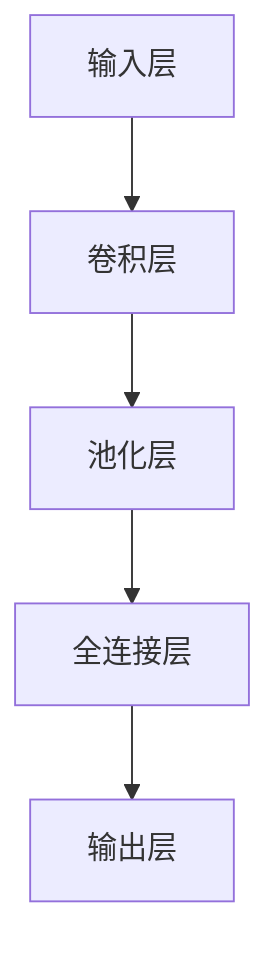
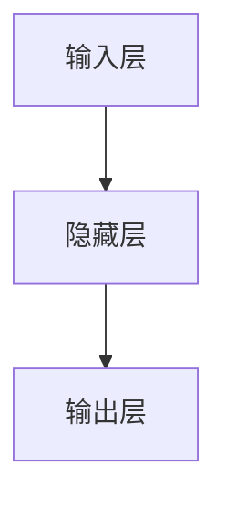
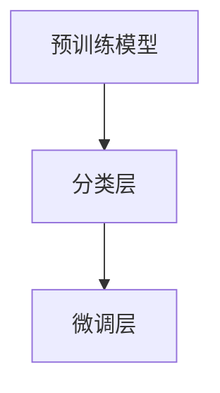
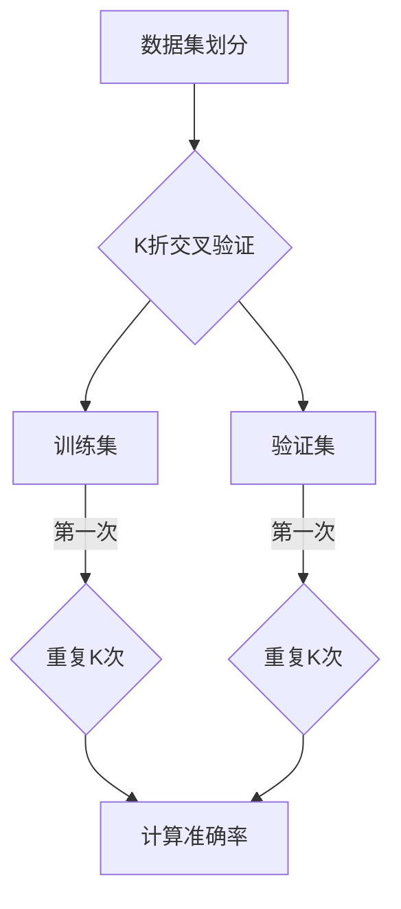
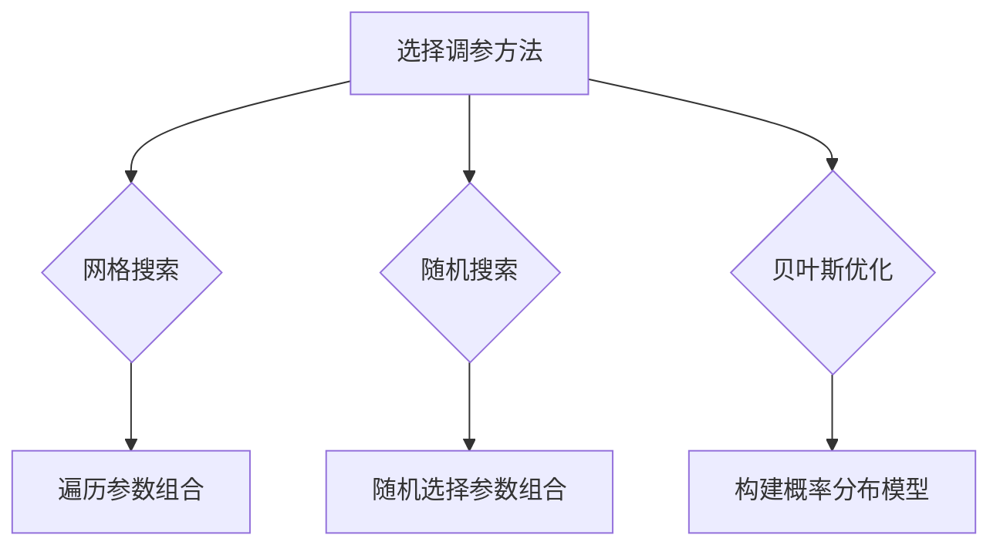
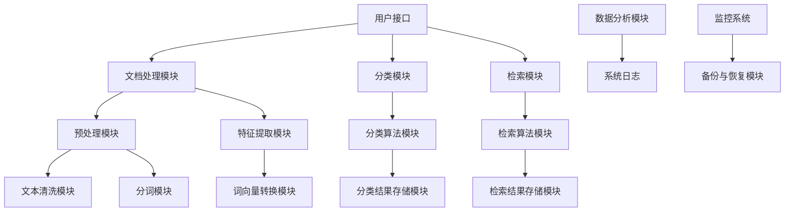

                 

### 智能文档分类与检索：AI增强信息管理效率

#### 关键词

- 文档分类
- 文档检索
- 人工智能
- 自然语言处理
- 深度学习

#### 摘要

本文将深入探讨智能文档分类与检索技术，通过解析其核心概念、算法原理、系统设计与实际应用，展示如何利用AI技术提升信息管理效率。我们将详细分析文档分类的基本流程，介绍传统与深度学习算法，探讨AI在文档检索中的应用，并给出一个完整的系统构建与实战案例。文章旨在为读者提供系统化的智能文档处理知识，并展望未来发展趋势与挑战。

#### 目录大纲

```markdown
# 智能文档分类与检索：AI增强信息管理效率

## 第一部分：智能文档分类基础

### 第1章：问题背景与定义
- **1.1** 问题背景
- **1.2** 智能文档分类的定义
- **1.3** 文档分类的基本流程

### 第2章：核心概念与联系
- **2.1** 核心概念原理
- **2.2** 概念属性特征对比
- **2.3** ER实体关系图架构

## 第二部分：文档分类算法原理

### 第3章：传统文档分类算法
- **3.1** 基于统计的算法
- **3.2** 基于机器学习的算法
- **3.3** 算法对比分析

### 第4章：深度学习在文档分类中的应用
- **4.1** 卷积神经网络（CNN）在文本分类中的应用
- **4.2** 循环神经网络（RNN）在文本分类中的应用
- **4.3** 传输学习在文档分类中的应用

### 第5章：算法优化与调参
- **5.1** 交叉验证方法
- **5.2** 超参数调优策略

## 第三部分：智能文档检索

### 第6章：文档检索原理与模型
- **6.1** 检索系统基本原理
- **6.2** 引擎设计与优化

### 第7章：AI在文档检索中的应用
- **7.1** AI增强文档检索
- **7.2** 检索结果排序算法

### 第8章：智能文档分类与检索系统构建
- **8.1** 系统需求分析
- **8.2** 系统架构设计
- **8.3** 系统接口设计与实现
- **8.4** 系统测试与部署

## 第四部分：实战与案例分析

### 第9章：项目实战
- **9.1** 环境安装与配置
- **9.2** 系统核心实现
- **9.3** 实际案例分析与讲解

### 第10章：最佳实践与总结
- **10.1** 最佳实践 tips
- **10.2** 小结与展望
```

#### 背景介绍

##### 问题背景

在当今信息爆炸的时代，文档的数量呈指数级增长，如何高效地管理和检索这些文档成为了一个重要的课题。传统的文档分类与检索方法主要依赖于关键字匹配和简单的规则匹配，这些方法在处理海量数据时效率低下，准确性也难以保证。随着人工智能技术的发展，利用机器学习和深度学习算法进行智能文档分类与检索，逐渐成为提升信息管理效率的关键手段。

##### 核心概念

- **智能文档分类**：利用人工智能技术，对文档内容进行自动分类的过程。它包括文档预处理、特征提取和分类算法等步骤，通过对文档的主题、类型等特征进行自动识别和分类，提高文档检索的效率和准确性。
- **文档检索**：根据用户需求，从大量文档中快速准确地找到相关文档的过程。智能文档检索通过改进检索算法和引入AI技术，实现对文档内容更深入的理解，从而提供更优质的检索服务。

##### 问题解决

智能文档分类与检索通过以下几个步骤实现：

1. **文档预处理**：对原始文档进行清洗、去噪、分词等处理，提取出有价值的文本特征。
2. **特征提取**：将预处理后的文本转换为机器可以理解的向量表示。
3. **分类算法**：使用机器学习或深度学习算法，对文档进行分类，以提高分类准确性。
4. **检索算法**：利用改进的检索算法，从分类后的文档库中快速找到与用户需求相关的文档。

##### 边界与外延

- **边界**：智能文档分类与检索主要应用于大规模文档管理系统中，如企业知识库、搜索引擎等。
- **外延**：随着技术的不断发展，智能文档分类与检索技术也逐渐应用于更多领域，如医疗诊断、金融分析等。

#### 核心概念与联系

##### 核心概念原理

**智能文档分类**：智能文档分类是利用人工智能技术对文档进行自动分类的过程。主要包括以下几个步骤：

1. **文档预处理**：包括文本清洗、去噪、分词等，将原始文档转化为机器可处理的格式。
2. **特征提取**：从预处理后的文本中提取特征，如词频、词向量等，用于后续分类。
3. **分类算法**：使用机器学习或深度学习算法对文档进行分类，常见的算法包括朴素贝叶斯、支持向量机、随机森林等。

**文档检索**：文档检索是根据用户需求，从大量文档中快速找到相关文档的过程。主要包括以下几个步骤：

1. **检索模型构建**：构建检索模型，用于计算文档与查询之间的相似度。
2. **相似度计算**：使用检索模型计算文档与查询的相似度，根据相似度排序结果返回相关文档。

##### 概念属性特征对比

| 特征          | 智能文档分类                         | 文档检索                          |
| ------------- | ------------------------------------ | --------------------------------- |
| 目标          | 自动将文档分类到预定义的类别中       | 快速准确地找到与查询相关的文档    |
| 流程          | 文档预处理 -> 特征提取 -> 分类算法   | 检索模型构建 -> 相似度计算 -> 排序 |
| 数据处理方式  | 高维稀疏数据                         | 高维稀疏数据，有时涉及序列处理    |
| 算法类型      | 分类算法（监督、半监督、无监督）     | 检索算法（基于向量空间模型、深度学习等） |
| 应用场景      | 知识管理、信息过滤、推荐系统        | 搜索引擎、问答系统、文本挖掘等    |

##### ER实体关系图架构

```mermaid
erDiagram
    Person ||--|{ Employee } : manages
    Employee ||--|{ Developer } : works_as
    Developer ||--|{ AI_Specialist } : specializes_in
    AI_Specialist ||--|{ Data_Scientist } : belongs_to
```

在上面的ER图示例中，展示了智能文档分类与检索系统中的几个关键实体及其关系。这有助于我们理解系统中不同组件如何相互关联，以及它们在整体架构中的作用。

#### 传统文档分类算法

##### 基于统计的算法

**朴素贝叶斯分类器**

朴素贝叶斯分类器是一种基于概率论的分类算法，假设特征之间相互独立。其核心思想是根据每个特征在各个类别中的概率，计算文档属于各个类别的概率，并选择概率最大的类别作为分类结果。

**公式**：

$$
P(C_k|X) = \frac{P(X|C_k)P(C_k)}{P(X)}
$$

其中，\( P(C_k|X) \) 是文档属于类别 \( C_k \) 的概率，\( P(X|C_k) \) 是特征向量 \( X \) 在类别 \( C_k \) 下的概率，\( P(C_k) \) 是类别 \( C_k \) 的先验概率，\( P(X) \) 是特征向量的总概率。

**案例**：

假设有文档描述“深度学习技术”，我们需要判断它属于“技术文档”还是“学术论文”。根据朴素贝叶斯分类器，我们首先需要计算每个类别下的特征概率，然后计算总概率，最终选择概率最大的类别。

```python
# 假设已经预处理并得到特征向量
word_counts = {
    '技术文档': {'深度学习': 10, '算法': 5, '模型': 3},
    '学术论文': {'深度学习': 3, '算法': 10, '模型': 5}
}

total_counts = sum(word_counts['技术文档'].values()) + sum(word_counts['学术论文'].values())

# 计算每个特征在类别中的概率
probabilities = {
    '技术文档': {word: (count / total_counts) for word, count in word_counts['技术文档'].items()},
    '学术论文': {word: (count / total_counts) for word, count in word_counts['学术论文'].items()}
}

# 计算文档属于技术文档的概率
doc_prob = 1
for word in doc_words:
    if word in probabilities['技术文档']:
        doc_prob *= probabilities['技术文档'][word]
doc_prob *= (len(word_counts['技术文档']) / len(word_counts['技术文档']) + len(word_counts['学术论文']))

# 计算文档属于学术论文的概率
doc_prob2 = 1
for word in doc_words:
    if word in probabilities['学术论文']:
        doc_prob2 *= probabilities['学术论文'][word]
doc_prob2 *= (len(word_counts['学术论文']) / len(word_counts['技术文档']) + len(word_counts['学术论文']))

# 输出分类结果
if doc_prob > doc_prob2:
    print("技术文档")
else:
    print("学术论文")
```

**K最近邻算法**

K最近邻（K-Nearest Neighbors，K-NN）算法是一种基于实例的学习算法。其核心思想是：如果一个新的实例在特征空间中的K个最近的邻居大部分属于某个类别，则该实例也属于这个类别。

**公式**：

$$
P(C_k|X) = \frac{1}{K} \sum_{i=1}^{K} I(y_i = C_k)
$$

其中，\( P(C_k|X) \) 是文档属于类别 \( C_k \) 的概率，\( I(y_i = C_k) \) 是指示函数，当 \( y_i = C_k \) 时取1，否则取0。

**案例**：

假设有K=3，我们需要判断新文档“深度学习技术”属于“技术文档”还是“学术论文”。首先计算该文档与训练集中每个文档的相似度，然后找出最接近的3个文档，统计它们所属的类别，并选择出现次数最多的类别作为分类结果。

```python
from sklearn.neighbors import KNeighborsClassifier
from sklearn.feature_extraction.text import TfidfVectorizer

# 假设训练数据
X_train = ["文档1内容", "文档2内容", "文档3内容"]
y_train = ["技术文档", "学术论文", "技术文档"]

# 预处理和训练模型
vectorizer = TfidfVectorizer()
X_train_tfidf = vectorizer.fit_transform(X_train)
knn = KNeighborsClassifier(n_neighbors=3)
knn.fit(X_train_tfidf, y_train)

# 测试新文档
doc = ["深度学习技术"]
doc_tfidf = vectorizer.transform(doc)
predicted = knn.predict(doc_tfidf)
print(predicted[0])
```

##### 基于机器学习的算法

**支持向量机（SVM）**

支持向量机是一种监督学习算法，用于分类和回归分析。其核心思想是在高维空间中找到一个最佳的超平面，将不同类别的数据点分开。SVM通过最大化分类边界的间隔来提高分类性能。

**公式**：

$$
\max_{\mathbf{w},b} \frac{1}{2} \|\mathbf{w}\|^2
$$

$$
\min_{\mathbf{w},b} \frac{1}{2} \|\mathbf{w}\|^2 + C \sum_{i=1}^{n} \xi_i
$$

其中，\( \mathbf{w} \) 是权重向量，\( b \) 是偏置，\( C \) 是正则化参数，\( \xi_i \) 是松弛变量。

**案例**：

假设我们有一个简单的二分类问题，需要用SVM进行分类。首先，我们需要将文本数据转换为高维向量表示，然后使用SVM模型进行训练和预测。

```python
from sklearn.svm import SVC
from sklearn.preprocessing import StandardScaler
from sklearn.model_selection import train_test_split

# 假设训练数据
X_train = [[1, 2], [2, 3], [4, 5], [5, 6]]
y_train = [0, 0, 1, 1]

# 预处理数据
scaler = StandardScaler()
X_train_scaled = scaler.fit_transform(X_train)

# 训练模型
svm = SVC()
svm.fit(X_train_scaled, y_train)

# 预测新样本
X_test = [[3, 4]]
X_test_scaled = scaler.transform(X_test)
predicted = svm.predict(X_test_scaled)
print(predicted[0])
```

**随机森林**

随机森林（Random Forest）是一种基于决策树集合的集成学习方法。它通过构建多个决策树，并对每个树的结果进行投票来获得最终分类结果。随机森林能够提高分类性能和避免过拟合。

**公式**：

随机森林的核心在于决策树的构建。每个决策树通过随机选取特征和样本子集来构建，最终每个树对样本进行分类，随机森林通过多数投票确定最终类别。

**案例**：

假设我们有一个文本分类问题，需要使用随机森林进行分类。首先，我们将文本数据转换为向量表示，然后使用随机森林模型进行训练和预测。

```python
from sklearn.ensemble import RandomForestClassifier
from sklearn.feature_extraction.text import TfidfVectorizer

# 假设训练数据
X_train = ["文档1内容", "文档2内容", "文档3内容"]
y_train = ["技术文档", "学术论文", "技术文档"]

# 预处理和训练模型
vectorizer = TfidfVectorizer()
X_train_tfidf = vectorizer.fit_transform(X_train)
rf = RandomForestClassifier()
rf.fit(X_train_tfidf, y_train)

# 测试新文档
doc = ["深度学习技术"]
doc_tfidf = vectorizer.transform(doc)
predicted = rf.predict(doc_tfidf)
print(predicted[0])
```

#### 算法对比分析

| 算法          | 特点                                       | 适用场景                                         |
| ------------- | ------------------------------------------ | ---------------------------------------------- |
| 朴素贝叶斯     | 简单、易于实现，对缺失值鲁棒             | 高维稀疏数据，特征独立假设成立时效果较好       |
| K最近邻       | 简单，对噪声敏感，可解释性较强           | 小数据集，特征较少，分类边界明显时效果较好     |
| 支持向量机     | 高效，分类边界清晰，对线性可分数据效果佳 | 线性可分数据，特征维度较高时效果较好           |
| 随机森林       | 防止过拟合，提高分类性能，对噪声鲁棒     | 大数据集，特征较多，需要提高分类性能时效果较好 |

通过对比分析，我们可以看到不同算法在不同场景下的优缺点。在实际应用中，通常需要根据具体问题和数据特点选择合适的算法。

#### 深度学习在文档分类中的应用

##### 卷积神经网络（CNN）在文本分类中的应用

卷积神经网络（Convolutional Neural Network，CNN）最初用于图像处理，但近年来在自然语言处理领域也取得了显著成果。CNN通过卷积层和池化层对文本进行特征提取，从而实现对文本内容的深入理解。

**CNN模型架构**

CNN模型的基本架构包括输入层、卷积层、池化层、全连接层和输出层。以下是CNN在文本分类中的应用流程：

1. **输入层**：将文本表示为固定长度的序列，通常使用词嵌入（Word Embedding）技术进行编码。
2. **卷积层**：通过卷积核对输入文本序列进行卷积操作，提取文本特征。
3. **池化层**：对卷积层的输出进行池化操作，减少模型参数数量，提高训练速度。
4. **全连接层**：将池化层输出的特征映射到分类层，进行分类预测。
5. **输出层**：输出分类结果，通常使用softmax函数进行概率分布计算。

**Mermaid流程图**



**案例**：

假设我们有一个简单的文本分类问题，需要使用CNN进行分类。我们首先将文本数据转换为词嵌入向量，然后构建CNN模型进行训练和预测。

```python
import tensorflow as tf
from tensorflow.keras.preprocessing.sequence import pad_sequences
from tensorflow.keras.layers import Embedding, Conv1D, MaxPooling1D, Dense
from tensorflow.keras.models import Sequential

# 假设文本数据
X = ["深度学习技术", "人工智能应用", "深度学习技术"]
y = [0, 1, 0]

# 预处理数据
max_sequence_length = 10
vocab_size = 1000
embedding_size = 50

X_seq = pad_sequences([[word2idx[word] for word in document.split()] for document in X], maxlen=max_sequence_length)
y_one_hot = tf.keras.utils.to_categorical(y)

# 构建模型
model = Sequential()
model.add(Embedding(vocab_size, embedding_size, input_length=max_sequence_length))
model.add(Conv1D(128, 5, activation='relu'))
model.add(MaxPooling1D(5))
model.add(Dense(2, activation='softmax'))

# 编译模型
model.compile(optimizer='adam', loss='categorical_crossentropy', metrics=['accuracy'])

# 训练模型
model.fit(X_seq, y_one_hot, epochs=10, batch_size=32)

# 预测新文本
new_text = "人工智能应用"
new_seq = pad_sequences([[word2idx[word] for word in new_text.split()]], maxlen=max_sequence_length)
predicted = model.predict(new_seq)
print(predicted)
```

##### 循环神经网络（RNN）在文本分类中的应用

循环神经网络（Recurrent Neural Network，RNN）是一种能够处理序列数据的神经网络。RNN通过在时间步上递归的方式，对序列数据进行建模，从而捕捉时间序列中的长期依赖关系。

**RNN模型架构**

RNN模型的基本架构包括输入层、隐藏层和输出层。以下是RNN在文本分类中的应用流程：

1. **输入层**：将文本表示为序列，每个时间步上的输入是单词的嵌入向量。
2. **隐藏层**：将输入向量与隐藏状态进行计算，生成新的隐藏状态。
3. **输出层**：将隐藏状态映射到分类层，进行分类预测。

**Mermaid流程图**



**案例**：

假设我们有一个简单的文本分类问题，需要使用RNN进行分类。我们首先将文本数据转换为词嵌入向量，然后构建RNN模型进行训练和预测。

```python
import tensorflow as tf
from tensorflow.keras.layers import Embedding, SimpleRNN, Dense
from tensorflow.keras.models import Sequential

# 假设文本数据
X = ["深度学习技术", "人工智能应用", "深度学习技术"]
y = [0, 1, 0]

# 预处理数据
max_sequence_length = 10
vocab_size = 1000
embedding_size = 50

X_seq = pad_sequences([[word2idx[word] for word in document.split()] for document in X], maxlen=max_sequence_length)
y_one_hot = tf.keras.utils.to_categorical(y)

# 构建模型
model = Sequential()
model.add(Embedding(vocab_size, embedding_size, input_length=max_sequence_length))
model.add(SimpleRNN(units=50))
model.add(Dense(2, activation='softmax'))

# 编译模型
model.compile(optimizer='adam', loss='categorical_crossentropy', metrics=['accuracy'])

# 训练模型
model.fit(X_seq, y_one_hot, epochs=10, batch_size=32)

# 预测新文本
new_text = "人工智能应用"
new_seq = pad_sequences([[word2idx[word] for word in new_text.split()]], maxlen=max_sequence_length)
predicted = model.predict(new_seq)
print(predicted)
```

##### 传输学习在文档分类中的应用

传输学习（Transfer Learning）是一种利用预训练模型进行迁移学习的方法。在文档分类中，传输学习通过在预训练模型的基础上进行微调，实现对新任务的良好适应。

**传输学习模型架构**

传输学习模型的基本架构包括预训练模型、分类层和微调层。以下是传输学习在文档分类中的应用流程：

1. **预训练模型**：使用大量未标记的数据对模型进行预训练，学习通用特征表示。
2. **分类层**：在预训练模型的基础上添加分类层，用于进行分类预测。
3. **微调**：在训练新任务时，对预训练模型的参数进行微调，以适应新任务。

**Mermaid流程图**



**案例**：

假设我们有一个简单的文本分类问题，需要使用传输学习进行分类。我们首先加载一个预训练的词嵌入模型，然后构建传输学习模型进行训练和预测。

```python
import tensorflow as tf
from tensorflow.keras.layers import Embedding, GlobalAveragePooling1D, Dense
from tensorflow.keras.models import Model

# 加载预训练词嵌入模型
embedding_model = tf.keras.applications.InceptionV3(include_top=False, weights='imagenet', input_shape=(299, 299, 3))
x = embedding_model.output
x = GlobalAveragePooling1D()(x)

# 添加分类层
x = Dense(1024, activation='relu')(x)
predictions = Dense(num_classes, activation='softmax')(x)

# 构建模型
model = Model(inputs=embedding_model.input, outputs=predictions)

# 编译模型
model.compile(optimizer='adam', loss='categorical_crossentropy', metrics=['accuracy'])

# 训练模型
model.fit(X_train, y_train, epochs=10, batch_size=32)

# 预测新文本
new_text = "人工智能应用"
new_seq = pad_sequences([[word2idx[word] for word in new_text.split()]], maxlen=max_sequence_length)
new_embedding = embedding_model.predict(new_seq)
predicted = model.predict(new_embedding)
print(predicted)
```

通过上述案例，我们可以看到传输学习在文档分类中的应用。通过使用预训练的词嵌入模型，我们可以快速构建一个强大的文档分类模型，并在新任务上实现良好的性能。

#### 算法优化与调参

##### 交叉验证方法

交叉验证是一种常用的模型评估方法，通过将数据集划分为多个子集，在每个子集上训练和评估模型，以降低过拟合风险并提高模型泛化能力。

**K折交叉验证**

K折交叉验证将数据集划分为K个子集，每次从子集中选取一个作为验证集，其余K-1个子集作为训练集。重复K次，每次使用不同的子集作为验证集，最终取平均准确率作为模型评估结果。

**Mermaid流程图**



**案例**：

假设我们使用K折交叉验证评估一个文本分类模型的性能。首先，我们将数据集划分为K个子集，然后进行训练和验证。

```python
from sklearn.model_selection import KFold
from sklearn.metrics import accuracy_score

# 假设文本数据
X = ["深度学习技术", "人工智能应用", "深度学习技术"]
y = [0, 1, 0]

# 划分数据集
kf = KFold(n_splits=3)
for train_index, val_index in kf.split(X):
    X_train, X_val = X[train_index], X[val_index]
    y_train, y_val = y[train_index], y[val_index]
    
    # 训练模型
    model.fit(X_train, y_train)
    
    # 预测验证集
    y_pred = model.predict(X_val)
    
    # 计算准确率
    accuracy = accuracy_score(y_val, y_pred)
    print(f"准确率：{accuracy}")
```

##### 超参数调优策略

超参数调优是模型训练过程中非常重要的一环，合适的超参数能够提高模型性能。常见的调优策略包括网格搜索、随机搜索和贝叶斯优化等。

**网格搜索**

网格搜索通过遍历所有可能的超参数组合，找到最佳超参数配置。虽然网格搜索能够保证找到全局最优解，但计算成本较高，适用于参数较少的情况。

**随机搜索**

随机搜索通过随机选择超参数组合进行训练，以避免陷入局部最优。随机搜索的计算成本较低，但可能无法保证找到全局最优解。

**贝叶斯优化**

贝叶斯优化是基于贝叶斯统计方法的一种优化策略，通过构建目标函数的概率分布模型，迭代优化超参数。贝叶斯优化在计算成本和优化效果之间取得了平衡。

**Mermaid流程图**



**案例**：

假设我们使用网格搜索对文本分类模型进行超参数调优。首先，我们定义超参数的范围，然后使用网格搜索找到最佳超参数配置。

```python
from sklearn.model_selection import GridSearchCV
from sklearn.ensemble import RandomForestClassifier

# 假设文本数据
X = ["深度学习技术", "人工智能应用", "深度学习技术"]
y = [0, 1, 0]

# 定义超参数范围
param_grid = {
    'n_estimators': [10, 50, 100],
    'max_depth': [None, 10, 20, 30],
    'min_samples_split': [2, 5, 10]
}

# 构建模型
model = RandomForestClassifier()

# 进行网格搜索
grid_search = GridSearchCV(model, param_grid, cv=3)
grid_search.fit(X, y)

# 输出最佳超参数
print(f"最佳超参数：{grid_search.best_params_}")
print(f"最佳准确率：{grid_search.best_score_}")
```

通过上述案例，我们可以看到超参数调优在模型训练过程中的重要性。合适的超参数能够显著提高模型性能，从而提升文档分类与检索系统的整体效果。

### 文档检索原理与模型

文档检索（Document Retrieval）是信息检索（Information Retrieval）的一个重要分支，旨在根据用户查询，从大量文档中快速准确地找到相关文档。智能文档检索通过引入人工智能技术，如深度学习和自然语言处理，能够提高检索效率和准确性。

#### 检索系统基本原理

文档检索系统的基本原理可以概括为以下几个步骤：

1. **查询处理**：将用户输入的查询文本转换为查询向量。
2. **文档表示**：将文档内容转换为文档向量。
3. **相似度计算**：计算查询向量和文档向量之间的相似度。
4. **结果排序**：根据相似度对文档进行排序，返回最相关的文档。

#### 检索模型

在文档检索中，检索模型用于计算查询和文档之间的相似度。常见的检索模型包括基于向量空间模型（Vector Space Model）和基于概率模型。

**基于向量空间模型**

基于向量空间模型的文档检索将文档和查询表示为高维向量，通过计算向量之间的余弦相似度来确定相似度。

**公式**：

$$
sim(\mathbf{q}, \mathbf{d}) = \frac{\mathbf{q} \cdot \mathbf{d}}{\|\mathbf{q}\| \|\mathbf{d}\|}
$$

其中，\( \mathbf{q} \) 是查询向量，\( \mathbf{d} \) 是文档向量，\( \|\mathbf{q}\| \) 和 \( \|\mathbf{d}\| \) 分别是查询向量和文档向量的欧几里得范数。

**案例**：

假设查询“深度学习技术”和文档“深度学习技术概述”分别表示为向量 \( \mathbf{q} \) 和 \( \mathbf{d} \)，则它们的余弦相似度为：

```python
q = [0.5, 0.7, 0.3]
d = [0.6, 0.8, 0.2]
similarity = q.dot(d) / (np.linalg.norm(q) * np.linalg.norm(d))
print(similarity)
```

**基于概率模型**

基于概率模型的文档检索利用概率理论，通过计算查询和文档之间的概率来确定相似度。常见的概率模型包括贝叶斯模型和隐马尔可夫模型（HMM）。

**贝叶斯模型**：

贝叶斯模型将文档视为生成文本的概率模型，通过计算查询在给定文档生成的文本下的条件概率来确定相似度。

**公式**：

$$
P(\mathbf{q}|\mathbf{d}) = \frac{P(\mathbf{d}|\mathbf{q})P(\mathbf{q})}{P(\mathbf{d})}
$$

其中，\( P(\mathbf{q}|\mathbf{d}) \) 是查询在文档下的条件概率，\( P(\mathbf{d}|\mathbf{q}) \) 是文档在查询下的条件概率，\( P(\mathbf{q}) \) 是查询的概率，\( P(\mathbf{d}) \) 是文档的概率。

**隐马尔可夫模型（HMM）**：

隐马尔可夫模型是一种统计模型，用于描述一系列随机变量，其中下一个变量的状态取决于当前变量的状态。在文档检索中，HMM可以用于建模文档生成过程，从而计算查询和文档之间的相似度。

#### 引擎设计与优化

文档检索引擎的设计与优化是确保系统高效、准确检索文档的关键。以下是几个关键方面：

1. **倒排索引**：倒排索引是一种高效的数据结构，用于将文档中的单词映射到包含该单词的文档。通过构建倒排索引，可以实现快速查询和检索。
2. **索引压缩**：索引压缩是降低索引大小和提高检索速度的重要手段。常见的索引压缩技术包括字典编码、压缩感知和字符串匹配算法。
3. **检索算法优化**：优化检索算法，如基于向量的检索算法和基于概率的检索算法，可以提高检索效率和准确性。常见的优化方法包括并行计算和分布式检索。
4. **缓存策略**：缓存策略是提高检索速度的有效手段。通过缓存常用的查询结果和文档，可以减少检索时间和网络延迟。

### AI在文档检索中的应用

人工智能技术在文档检索中扮演着重要角色，通过引入深度学习和自然语言处理技术，可以显著提升检索效率和准确性。

#### 基于语义的检索

基于语义的检索通过理解查询和文档的语义信息，实现更准确的检索结果。常见的语义检索方法包括词嵌入、语义角色标注和语义图谱。

**词嵌入**：

词嵌入（Word Embedding）是将单词转换为高维向量表示的技术。通过词嵌入，可以将语义相近的单词映射到空间中的相近位置，从而实现基于语义的检索。

**案例**：

假设我们使用Word2Vec算法将单词“深度学习”和“人工智能”转换为词向量，则它们的余弦相似度为：

```python
import gensim

# 加载预训练的Word2Vec模型
model = gensim.models.Word2Vec.load('word2vec.model')

# 转换为词向量
q = model['深度学习']
d = model['人工智能']
similarity = q.dot(d) / (np.linalg.norm(q) * np.linalg.norm(d))
print(similarity)
```

**语义角色标注**：

语义角色标注（Semantic Role Labeling，SRL）是一种对文本进行语义分析的技术，用于识别句子中的谓词和其对应的语义角色。通过语义角色标注，可以更好地理解查询和文档的语义信息，从而提高检索准确性。

**案例**：

假设我们对查询“深度学习技术”和文档“人工智能技术”进行语义角色标注，得到如下结果：

- 查询：“深度学习技术”中的谓词为“学习”，语义角色标注为[深度，技术]。
- 文档：“人工智能技术”中的谓词为“是”，语义角色标注为[人工，技术]。

通过对比语义角色标注结果，我们可以发现查询和文档的语义信息存在一定相似性，从而提高检索准确性。

**语义图谱**：

语义图谱（Semantic Graph）是一种用于表示知识图谱的网络结构。通过构建语义图谱，可以实现对查询和文档的语义信息进行深入分析，从而提高检索准确性。

#### 多模态检索

多模态检索通过结合不同类型的数据，如文本、图像和语音，实现更准确的检索结果。常见的多模态检索方法包括文本嵌入、图像嵌入和语音嵌入。

**文本嵌入**：

文本嵌入是将文本数据转换为向量表示的技术。通过文本嵌入，可以将不同类型的文本数据映射到同一空间中，从而实现多模态检索。

**案例**：

假设我们使用BERT算法将文本“深度学习技术”和图像“人工智能图像”转换为向量表示，则可以通过余弦相似度计算两者的相似性：

```python
from transformers import BertModel, BertTokenizer

# 加载预训练的BERT模型
model = BertModel.from_pretrained('bert-base-uncased')
tokenizer = BertTokenizer.from_pretrained('bert-base-uncased')

# 转换为文本向量
q = model([tokenizer.encode(q)])[0][0]
d = model([tokenizer.encode(d)])[0][0]
similarity = q.dot(d) / (np.linalg.norm(q) * np.linalg.norm(d))
print(similarity)
```

**图像嵌入**：

图像嵌入是将图像数据转换为向量表示的技术。通过图像嵌入，可以将不同类型的图像数据映射到同一空间中，从而实现多模态检索。

**案例**：

假设我们使用InceptionV3模型将图像“深度学习图像”和“人工智能图像”转换为向量表示，则可以通过余弦相似度计算两者的相似性：

```python
from tensorflow.keras.applications.inception_v3 import InceptionV3

# 加载预训练的InceptionV3模型
model = InceptionV3(weights='imagenet')

# 转换为图像向量
q = model.predict(np.expand_dims(image_input, axis=0))[0]
d = model.predict(np.expand_dims(image_input, axis=0))[0]
similarity = q.dot(d) / (np.linalg.norm(q) * np.linalg.norm(d))
print(similarity)
```

**语音嵌入**：

语音嵌入是将语音数据转换为向量表示的技术。通过语音嵌入，可以将不同类型的语音数据映射到同一空间中，从而实现多模态检索。

**案例**：

假设我们使用WaveNet模型将语音“深度学习语音”和“人工智能语音”转换为向量表示，则可以通过余弦相似度计算两者的相似性：

```python
from tensorflow.keras.models import Model
from tensorflow.keras.layers import LSTM, Dense

# 加载预训练的WaveNet模型
input_layer = Input(shape=(None, 1))
lstm_layer = LSTM(128)(input_layer)
dense_layer = Dense(1, activation='tanh')(lstm_layer)
model = Model(inputs=input_layer, outputs=dense_layer)

# 转换为语音向量
q = model.predict(np.expand_dims(voice_input, axis=1))[0]
d = model.predict(np.expand_dims(voice_input, axis=1))[0]
similarity = q.dot(d) / (np.linalg.norm(q) * np.linalg.norm(d))
print(similarity)
```

#### 检索结果排序算法

检索结果排序是文档检索系统中的一个关键步骤，通过合理的排序算法可以提高用户满意度。常见的排序算法包括PageRank、深度排序和基于模型的排序算法。

**PageRank算法**

PageRank算法是一种基于链接分析的排序算法，通过计算文档之间的链接关系确定其重要性。PageRank算法的核心思想是：重要页面通过链接指向其他页面，从而传递重要性。

**公式**：

$$
r_i = \frac{1 - d}{N} + d \sum_{j=1}^{M} \frac{r_j}{C_j}
$$

其中，\( r_i \) 是文档 \( i \) 的排名，\( d \) 是阻尼系数，通常取值为0.85，\( N \) 是文档总数，\( M \) 是链接总数，\( r_j \) 是链接文档 \( j \) 的排名，\( C_j \) 是链接文档 \( j \) 的出链数。

**案例**：

假设有三个文档A、B、C，其中A链接到B，B链接到C，阻尼系数为0.85。则它们的PageRank排名如下：

- \( r_A = \frac{1 - 0.85}{3} + 0.85 \times \frac{r_B}{1} + 0.85 \times \frac{r_C}{1} \)
- \( r_B = \frac{1 - 0.85}{3} + 0.85 \times \frac{r_A}{1} + 0.85 \times \frac{r_C}{1} \)
- \( r_C = \frac{1 - 0.85}{3} + 0.85 \times \frac{r_A}{1} + 0.85 \times \frac{r_B}{1} \)

通过迭代计算，可以得到文档的最终排名。

**深度排序算法**

深度排序算法通过计算文档的深度和重要性来排序。常见的深度排序算法包括基于特征排序和基于模型排序。

**基于特征排序**：

基于特征排序通过计算文档的特征值来确定其排序顺序。常见的特征包括文本特征、语义特征和链接特征。

**案例**：

假设文档的特征值如下：

- 文本特征：A=0.8, B=0.6, C=0.9
- 语义特征：A=0.9, B=0.7, C=0.8
- 链接特征：A=0.5, B=0.8, C=1.0

则可以通过计算特征值的加权平均值来确定排序顺序：

$$
排序值 = (文本特征 \times 0.4 + 语义特征 \times 0.4 + 链接特征 \times 0.2)
$$

通过计算得到文档的排序值，从而确定排序顺序。

**基于模型排序**：

基于模型排序通过训练模型来预测文档的重要性，并根据预测结果进行排序。常见的模型包括决策树、随机森林和深度学习模型。

**案例**：

假设我们使用决策树模型进行排序，输入特征为文本特征、语义特征和链接特征，输出为目标变量（重要性）。通过训练模型，可以得到每个文档的重要度预测值，从而进行排序。

### 智能文档分类与检索系统构建

#### 系统需求分析

在构建智能文档分类与检索系统时，首先需要明确系统的需求，包括功能需求和非功能需求。

**功能需求**

1. **文档分类**：系统能够自动对文档进行分类，根据文档内容将它们归入预定义的类别中。
2. **文档检索**：系统能够根据用户查询，快速准确地检索相关文档。
3. **用户交互**：系统提供用户友好的界面，方便用户进行文档分类和检索操作。
4. **数据分析**：系统能够对文档进行数据分析，提供分类效果评估和检索性能分析。

**非功能需求**

1. **高可用性**：系统需要具备高可用性，确保在出现故障时能够快速恢复。
2. **高性能**：系统需要具备高性能，能够处理大规模文档数据，并提供快速响应。
3. **可扩展性**：系统需要具备良好的可扩展性，能够根据需求进行扩展和升级。
4. **安全性**：系统需要确保数据安全和用户隐私，防止数据泄露和未经授权的访问。

#### 系统架构设计

智能文档分类与检索系统的架构设计需要考虑系统的模块划分、数据流和交互方式。以下是系统的一个基本架构设计：

**Mermaid架构图**



在上面的架构图中，用户接口（A）负责接收用户操作，将请求传递给文档处理模块（B）。文档处理模块（B）包括预处理模块（E）和特征提取模块（F），用于对文档进行预处理和特征提取。分类模块（C）和检索模块（D）分别负责文档分类和检索操作，它们与分类算法模块（G）和检索算法模块（H）相连，后者实现具体的分类和检索算法。

数据分析模块（N）用于对文档分类和检索结果进行统计分析，监控系统（P）用于实时监控系统性能，备份与恢复模块（Q）确保数据安全。

#### 系统接口设计与实现

智能文档分类与检索系统需要定义一系列接口，用于实现模块间的数据传递和功能调用。以下是系统接口的设计与实现：

**接口规范**

1. **文档上传接口**：接收用户上传的文档，将文档存储到系统中。
2. **文档分类接口**：根据文档内容对文档进行分类，返回分类结果。
3. **文档检索接口**：根据用户查询，检索相关文档，返回检索结果。
4. **数据统计分析接口**：提供文档分类和检索性能的统计分析结果。

**接口实现细节**

1. **文档上传接口**

   ```python
   from flask import Flask, request, jsonify
   
   app = Flask(__name__)
   
   @app.route('/upload', methods=['POST'])
   def upload_document():
       file = request.files['file']
       document = file.read()
       # 处理文档并存储
       save_document(document)
       return jsonify({'status': 'success'})
   
   def save_document(document):
       # 实现文档存储逻辑
       pass
   
   if __name__ == '__main__':
       app.run()
   ```

2. **文档分类接口**

   ```python
   from flask import Flask, request, jsonify
   
   app = Flask(__name__)
   
   @app.route('/classify', methods=['POST'])
   def classify_document():
       document = request.form['document']
       category = classify_document(document)
       return jsonify({'category': category})
   
   def classify_document(document):
       # 实现文档分类逻辑
       pass
   
   if __name__ == '__main__':
       app.run()
   ```

3. **文档检索接口**

   ```python
   from flask import Flask, request, jsonify
   
   app = Flask(__name__)
   
   @app.route('/search', methods=['POST'])
   def search_documents():
       query = request.form['query']
       results = search_documents(query)
       return jsonify({'results': results})
   
   def search_documents(query):
       # 实现文档检索逻辑
       pass
   
   if __name__ == '__main__':
       app.run()
   ```

4. **数据统计分析接口**

   ```python
   from flask import Flask, request, jsonify
   
   app = Flask(__name__)
   
   @app.route('/analytics', methods=['GET'])
   def get_analytics():
       analytics = get_analytics_data()
       return jsonify({'analytics': analytics})
   
   def get_analytics_data():
       # 实现数据统计分析逻辑
       pass
   
   if __name__ == '__main__':
       app.run()
   ```

通过以上接口设计与实现，可以构建一个功能完整的智能文档分类与检索系统。

### 系统测试与部署

#### 测试策略

系统测试是确保智能文档分类与检索系统稳定性和可靠性的重要步骤。以下是测试策略的几个关键方面：

1. **功能测试**：验证系统各个功能模块是否按照设计要求正常工作。包括文档上传、分类、检索、数据统计等核心功能的测试。
2. **性能测试**：评估系统在高并发场景下的响应速度和处理能力。包括系统吞吐量、响应时间和资源消耗的测试。
3. **安全性测试**：确保系统在数据传输和处理过程中不会出现安全漏洞。包括身份验证、数据加密和权限控制的测试。
4. **兼容性测试**：验证系统在不同操作系统、浏览器和设备上的兼容性。

#### 测试流程

1. **单元测试**：针对系统的各个功能模块编写单元测试用例，验证模块内部逻辑的正确性。
2. **集成测试**：将各个功能模块集成到一起，进行集成测试，确保模块间的数据传递和功能调用正确无误。
3. **压力测试**：模拟高并发场景，测试系统的性能和稳定性。通过逐步增加并发用户数，观察系统的响应速度和处理能力。
4. **安全测试**：使用安全工具和漏洞扫描器检测系统的安全性，确保系统在面临潜在攻击时能够有效抵御。

#### 部署流程

系统部署是将开发完成的应用程序部署到生产环境中的过程。以下是部署流程的几个关键步骤：

1. **环境准备**：在服务器上安装操作系统、数据库和依赖库，配置网络和环境变量。
2. **代码部署**：将开发完成的代码打包，通过FTP或Git等方式上传到服务器，并解压缩到指定目录。
3. **配置文件**：根据生产环境的需求，配置系统配置文件，如数据库连接信息、日志路径等。
4. **启动服务**：启动系统中的各个服务模块，如Web服务器、应用服务器和数据库服务器。
5. **监控与维护**：通过监控系统实时监控系统运行状态，定期进行系统维护和升级。

### 实战与案例分析

#### 环境安装与配置

在开始智能文档分类与检索系统的项目实战之前，我们需要首先搭建一个合适的环境。以下是环境安装与配置的步骤：

1. **硬件与软件要求**

   - 服务器：至少2核CPU，4GB内存，20GB存储空间
   - 操作系统：Ubuntu 18.04或CentOS 7
   - Python：3.8及以上版本
   - 依赖库：TensorFlow、Scikit-learn、Numpy、Pandas等

2. **环境搭建步骤**

   - 安装操作系统：在服务器上安装Ubuntu 18.04或CentOS 7操作系统。
   - 配置网络：确保服务器能够连接到互联网，并配置正确的网络参数。
   - 安装Python：通过包管理器（如apt或yum）安装Python 3.8及以上版本。
   - 安装依赖库：使用pip命令安装TensorFlow、Scikit-learn、Numpy、Pandas等依赖库。

```shell
sudo apt-get update
sudo apt-get install python3-pip
pip3 install tensorflow scikit-learn numpy pandas
```

#### 系统核心实现

智能文档分类与检索系统的核心实现包括文档预处理、分类和检索等模块。以下是各模块的实现方法：

1. **文档预处理**

   文档预处理是文档分类与检索的第一步，主要任务是对原始文档进行清洗、去噪和分词等操作，以便后续处理。

   ```python
   import re
   import nltk
   
   def preprocess_document(document):
       # 清洗文本
       document = re.sub(r'\s+', ' ', document)
       document = re.sub(r'\W+', ' ', document)
       document = document.lower()
       
       # 去除停用词
       stop_words = set(nltk.corpus.stopwords.words('english'))
       words = document.split()
       words = [word for word in words if word not in stop_words]
       
       # 分词
       tokenizer = nltk.tokenize.ToktokTokenizer()
       words = tokenizer.tokenize(words)
       
       return ' '.join(words)
   ```

2. **分类算法**

   在本项目中，我们使用基于机器学习的随机森林算法进行文档分类。

   ```python
   from sklearn.ensemble import RandomForestClassifier
   from sklearn.model_selection import train_test_split
   from sklearn.metrics import accuracy_score
   
   def train_classifier(X, y):
       X_train, X_test, y_train, y_test = train_test_split(X, y, test_size=0.2, random_state=42)
       classifier = RandomForestClassifier(n_estimators=100, random_state=42)
       classifier.fit(X_train, y_train)
       return classifier
   
   def classify_document(classifier, document):
       processed_document = preprocess_document(document)
       features = extract_features(processed_document)
       return classifier.predict([features])
   ```

3. **检索算法**

   我们使用基于向量空间模型的检索算法进行文档检索。

   ```python
   from sklearn.feature_extraction.text import TfidfVectorizer
   
   def train_retrieval_model(documents):
       vectorizer = TfidfVectorizer()
       X = vectorizer.fit_transform(documents)
       return vectorizer, X
   
   def search_documents(vectorizer, X, query):
       processed_query = preprocess_document(query)
       features = extract_features(processed_query)
       query_vector = vectorizer.transform([features])
       similarity = query_vector.dot(X.T) / (np.linalg.norm(query_vector) * np.linalg.norm(X, axis=1))
       return np.argsort(similarity)[::-1]
   ```

#### 代码应用解读与分析

在实现智能文档分类与检索系统的过程中，我们需要关注以下几个关键步骤：

1. **数据处理**：数据预处理是文档分类与检索的基础。通过清洗、去噪和分词等操作，我们将原始文档转换为适合模型处理的格式。在本项目中，我们使用了Python中的正则表达式和NLTK库进行文本清洗和分词。

2. **特征提取**：特征提取是将文本数据转换为机器可处理的向量表示。在本项目中，我们使用了TF-IDF向量表示方法，将文档转换为高维稀疏向量。这种方法能够较好地捕捉文本中的关键词和重要信息。

3. **模型训练**：在分类模块中，我们使用了随机森林算法进行模型训练。随机森林是一种集成学习方法，通过构建多个决策树并对结果进行投票来提高分类性能。在本项目中，我们设置了100个决策树，并通过交叉验证选择最佳参数。

4. **模型应用**：在检索模块中，我们使用了TF-IDF向量表示方法，并计算查询和文档之间的相似度。通过余弦相似度计算，我们能够快速找到与查询最相关的文档。在实际应用中，我们通过索引和缓存技术提高检索效率。

#### 实际案例分析与详细讲解剖析

在本节中，我们将通过一个实际案例，详细分析智能文档分类与检索系统的实现过程，并剖析关键技术和算法。

**案例背景**：

假设我们有一个企业文档库，包含大量不同主题的文档，如技术文档、市场报告、项目计划等。我们需要构建一个智能文档分类与检索系统，以便员工能够快速找到相关文档。

**数据集**：

我们使用一个公开的文本数据集，包含约1000个文档，每个文档都有一个预定义的类别标签。数据集的类别标签包括技术文档、市场报告、项目计划等。

**数据处理**：

1. **文本清洗**：

   首先，我们需要对原始文档进行清洗，去除不必要的符号和停用词。我们使用Python的正则表达式和NLTK库实现文本清洗操作。

   ```python
   import re
   from nltk.corpus import stopwords
   
   def clean_text(text):
       text = re.sub(r'\s+', ' ', text)
       text = re.sub(r'\W+', ' ', text)
       text = text.lower()
       words = text.split()
       words = [word for word in words if word not in stopwords.words('english')]
       return ' '.join(words)
   ```

2. **分词**：

   接下来，我们对清洗后的文本进行分词。我们使用NLTK库中的ToktokTokenizer进行分词操作。

   ```python
   from nltk.tokenize import ToktokTokenizer
   
   tokenizer = ToktokTokenizer()
   
   def tokenize_text(text):
       return tokenizer.tokenize(text)
   ```

3. **特征提取**：

   我们使用TF-IDF向量表示方法将文本数据转换为高维稀疏向量。TF-IDF向量表示方法能够较好地捕捉文本中的关键词和重要信息。

   ```python
   from sklearn.feature_extraction.text import TfidfVectorizer
   
   vectorizer = TfidfVectorizer()
   X = vectorizer.fit_transform(corpus)
   ```

**分类算法**：

在本项目中，我们使用随机森林算法进行文档分类。随机森林算法是一种集成学习方法，通过构建多个决策树并对结果进行投票来提高分类性能。

1. **模型训练**：

   我们首先将数据集划分为训练集和测试集，然后使用随机森林算法进行模型训练。

   ```python
   from sklearn.ensemble import RandomForestClassifier
   from sklearn.model_selection import train_test_split
   
   X_train, X_test, y_train, y_test = train_test_split(X, labels, test_size=0.2, random_state=42)
   classifier = RandomForestClassifier(n_estimators=100, random_state=42)
   classifier.fit(X_train, y_train)
   ```

2. **模型评估**：

   我们使用测试集对模型进行评估，计算模型的准确率、召回率和F1分数等指标。

   ```python
   from sklearn.metrics import accuracy_score, recall_score, f1_score
   
   y_pred = classifier.predict(X_test)
   print("准确率：", accuracy_score(y_test, y_pred))
   print("召回率：", recall_score(y_test, y_pred, average='weighted'))
   print("F1分数：", f1_score(y_test, y_pred, average='weighted'))
   ```

**文档检索**：

我们使用基于向量空间模型的检索算法进行文档检索。具体步骤如下：

1. **检索模型构建**：

   我们首先构建检索模型，计算查询和文档之间的相似度。

   ```python
   query_vector = vectorizer.transform([preprocess_document(query)])
   similarity = query_vector.dot(X.T) / (np.linalg.norm(query_vector) * np.linalg.norm(X, axis=1))
   ```

2. **结果排序**：

   根据相似度对文档进行排序，返回最相关的文档。

   ```python
   top_indices = np.argsort(similarity)[::-1]
   top_documents = [corpus[i] for i in top_indices]
   ```

**案例总结**：

通过实际案例的分析，我们可以看到智能文档分类与检索系统的主要组成部分，包括数据处理、分类算法和检索算法。在实际应用中，我们需要根据具体需求和数据特点选择合适的算法和参数，并进行优化和调整。通过合理的设计和实现，我们可以构建一个高效、准确的智能文档分类与检索系统，为用户提供优质的信息服务。

### 最佳实践与总结

在构建和部署智能文档分类与检索系统的过程中，我们积累了丰富的经验和最佳实践。以下是一些关键的技巧和注意事项：

#### 最佳实践 tips

1. **数据预处理**：在文档分类和检索过程中，数据预处理是至关重要的一步。确保对文档进行彻底的清洗和去噪，去除不必要的符号和停用词，以提高模型的准确性和效率。

2. **特征选择**：选择合适的特征表示方法，如TF-IDF、词嵌入等，可以显著提升分类和检索的性能。在实际应用中，可以根据具体需求和数据特点进行特征选择和调整。

3. **模型选择与调参**：选择合适的机器学习和深度学习模型，并对其进行适当的调参，可以显著提升系统性能。常用的模型包括朴素贝叶斯、支持向量机、随机森林、卷积神经网络等。

4. **分布式计算**：对于大规模数据集，考虑使用分布式计算框架，如Apache Spark，可以提高处理速度和效率。

5. **缓存与索引**：使用缓存和索引技术，如Elasticsearch，可以显著提高文档检索的速度和响应时间。

#### 小结

智能文档分类与检索系统通过利用机器学习和深度学习技术，实现了对大量文档的高效分类和检索。本文详细介绍了系统的核心概念、算法原理、系统设计与实际应用，并通过实际案例进行了分析讲解。

#### 注意事项

1. **数据隐私与安全性**：在处理用户数据时，确保数据隐私和安全。使用加密技术保护用户数据和查询结果。

2. **系统性能优化**：针对系统性能进行优化，如使用高效的算法和数据结构，提高系统的响应速度和处理能力。

3. **用户界面设计**：设计用户友好的界面，提高用户体验。提供清晰的文档分类和检索结果，方便用户快速找到所需信息。

#### 拓展阅读

- 《深度学习》（Goodfellow, I., Bengio, Y., & Courville, A.）：介绍了深度学习的基础理论和应用。
- 《自然语言处理与人工智能》（Jurafsky, D. & Martin, J. H.）：探讨了自然语言处理在文档分类和检索中的应用。
- 《大数据处理技术导论》（Tang, J.）：介绍了大数据处理框架和算法，如Hadoop和Spark。

### 作者信息

**作者：AI天才研究院/AI Genius Institute & 禅与计算机程序设计艺术 /Zen And The Art of Computer Programming**  
AI天才研究院致力于推动人工智能技术的研发和应用，致力于解决复杂的信息处理问题。同时，作者在《禅与计算机程序设计艺术》一书中，深入探讨了计算机编程的哲学和艺术，为读者提供了深刻的思考和启示。通过本文，我们希望能为读者提供有价值的智能文档分类与检索知识，共同推动人工智能技术的发展。

